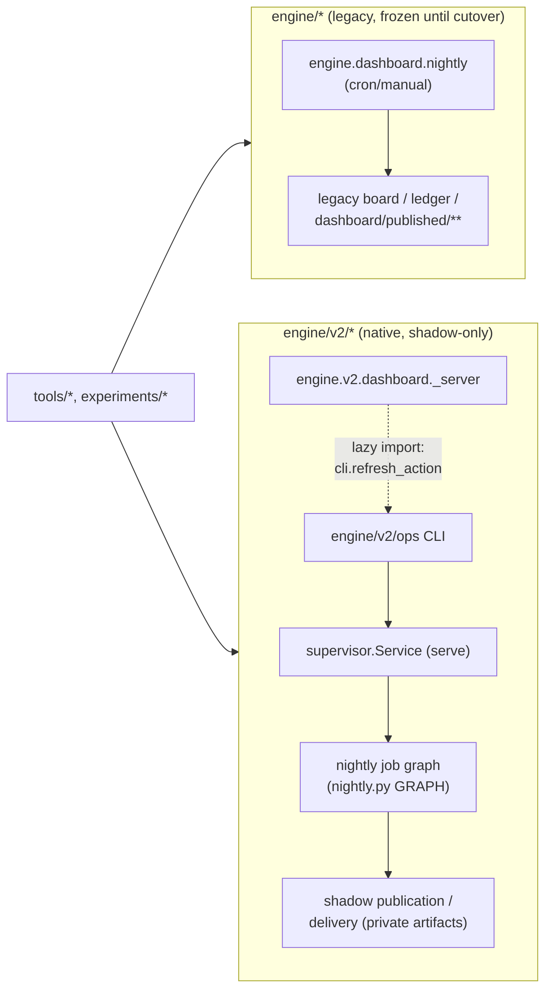

# Architecture

This is the root architecture document: the whole system at a high level —
what each component owns, the layer map and enforced dependency direction,
the production entrypoints and job graph, and the invariants and
anti-patterns that hold across every component. Reviewers (human or
CodeRabbit) use it, together with the touched component's own
`ARCHITECTURE.md` (see `docs/COMPONENT_ARCHITECTURE_TEMPLATE.md`), to judge
a change: does it sit in the right layer, does it point the right way, is
it reachable from production, and does it respect the invariants below.

It is derived from the enforced source (`checks/layer_map.py`,
`checks/import_layers.py`, `checks/legacy_adapters.json`,
`engine/v2/ops/nightly.py`) and from `guides/system_rearchitecture.md`, not
guessed. Where a guide and the enforced code disagree, the enforced code
wins and the disagreement is noted below — an architecture-doc update must
not repeat a stale guide claim as if it were current.

Component detail moves out of this document as each component gets its own
`ARCHITECTURE.md` next to its code (e.g. `engine/v2/ops/ARCHITECTURE.md`).
This PR gives that detailed treatment to `engine/v2/ops` and both
dashboards (`engine/v2/dashboard`, `engine/dashboard`); the rest of
`engine/v2/**` and legacy `engine/**` are still documented only here, at
the level this root doc covers, until a follow-up PR gives them their own
component doc.

## Component docs

Every component's own `ARCHITECTURE.md`, linked so an agent or reviewer
never has to grep the tree to find one. A component listed `(pending)` has
no doc of its own yet — it is documented only at this root doc's level
(§2's layer table), until a follow-up PR gives it a file of its own
(`docs/COMPONENT_ARCHITECTURE_TEMPLATE.md`). `tests/test_architecture_docs.py`
checks that every `**/ARCHITECTURE.md` in the tree, except this one, is
linked below, and that every link here resolves.

| Component | Doc |
|---|---|
| `engine/v2/contracts/` | (pending) |
| `engine/v2/foundation/` | (pending) |
| `engine/v2/data/` | (pending) |
| `engine/v2/features/` | (pending) |
| `engine/v2/models/` | (pending) |
| `engine/v2/registry/` | (pending) |
| `engine/v2/domain/generation/` | (pending) |
| `engine/v2/domain/scenarios/` | (pending) |
| `engine/v2/domain/valuation/` | (pending) |
| `engine/v2/domain/simulation/` | (pending) |
| `engine/v2/scoring/` | (pending) |
| `engine/v2/evaluation/` | (pending) |
| `engine/v2/ledger/` | (pending) |
| `engine/v2/models/training/` | (pending) |
| `engine/v2/research/` | (pending) |
| `engine/v2/parity/` | (pending) |
| `engine/v2/serving/` | (pending) |
| `engine/v2/ops/` | [`engine/v2/ops/ARCHITECTURE.md`](engine/v2/ops/ARCHITECTURE.md) |
| `engine/v2/diagnosis/` | (pending) |
| `engine/v2/dashboard/`, `ui/` | [`engine/v2/dashboard/ARCHITECTURE.md`](engine/v2/dashboard/ARCHITECTURE.md) |
| `engine/dashboard/` (legacy) | [`engine/dashboard/ARCHITECTURE.md`](engine/dashboard/ARCHITECTURE.md) |
| legacy `engine/**` (undivided) | (pending — see §1) |

## 1. Two trees

- **`engine/*` (legacy).** Runs the production board today: the legacy
  nightly, ledger and dashboard. It is frozen, not refactored — effort spent
  lowering its complexity is effort spent on a tree with a deletion date.
  It is retired at cutover (Phase 7/8), not before, and only after the
  replacement has proven parity.
- **`engine/v2/*` (native).** Written fresh against the layering in §2,
  never by moving a legacy file across. It starts at zero exemptions on
  every layering rule; there is no legacy backlog to work through inside
  v2.
- **`checks/*` and `tests/*`.** Verification and dev tooling.
  `checks/import_layers.py`'s two rules here both gate on `_is_v2(module)`
  first, so they cover only `engine/v2/**` importers, never legacy
  `engine/**`: "production packages cannot depend on verification or test
  code" fires when a v2 module imports `checks.*`/`tests.*`;
  `check_runtime_edges` fires when a v2 module calls a dynamic-import
  primitive (`__import__`, `importlib.import_module`, etc.) or calls
  `subprocess.*`/`os.system`/`os.popen` outside the two declared process
  owners (`engine.v2.ops.executor`, `engine.v2.ops.legacy_adapter`). A
  legacy module importing `checks/` or `tests/`, or shelling out from
  outside those two modules, is not enforced against by either rule.
- **`tools/*` and `experiments/*`.** Operator CLIs and the research program.
  Both may call into `engine/v2` and legacy `engine`, but neither is a
  production package other packages depend on.

## 2. Layers and allowed dependency direction

The rule is **strictly less than**: a package may import a package on a
*lower* layer number, never its own layer or a higher one. Layer numbers are
floats because two integer layers are split, and the split is load-bearing
(§2.1). This table is transcribed from `checks/layer_map.py`, the one file
three separate checks (`import_layers`, `package_readmes`, `code_budgets`)
read, so it cannot drift out of sync with itself the way a table in prose
can.

| Layer | Package | Replaces (legacy) | Notes |
|---|---|---|---|
| 0.0 | `engine/v2/contracts/` | dataclasses inside `score.py` | Schemas and types only. No logic, no I/O, imports nothing. |
| 0.5 | `engine/v2/foundation/` | `paths.py`, `env.py`, `jsonio.py`, `audit.py`, session arithmetic from `calendar.py` | Canonical JSON/content hashing, path+env resolution, session arithmetic, causality primitives, strict document decoding, artifact publication. |
| 1.0 | `engine/v2/data/` | `data/sources/`, `store.py`, `fetch.py`, `finality.py`, `rebuild.py` | Ingestion, normalization, coverage/finality, atomic snapshot commit. |
| 2.0 | `engine/v2/features/` | `features.py`, `data/features/panel.py`, `data/features/tier4.py` | Registered feature recipes and their causal dependencies. May import 0-1. |
| 3.0 | `engine/v2/models/` | `models/registry.py` | Registry, artifact loading, inference adapters. Never fits anything. |
| 3.0 | `engine/v2/registry/` | `structure_registry.py` | `StrategySpec`/`DeploymentSpec`, validation status. Never scores. |
| 4.0 (4a) | `engine/v2/domain/generation/` | `structures.py`, `forecast_sizing.py`, `fills.py` | Structure generator: template resolution, finite placement search, completeness receipts. |
| 4.0 (4a) | `engine/v2/domain/scenarios/` | `analogs.py`, `ResidualPool` from `pnl_sim.py` | Scenario builder: causal outcome populations, weights, RNG policy. |
| 4.0 (4a) | `engine/v2/domain/valuation/` | `payoff.py`, `black_scholes_put` from `pnl_sim.py` | Position valuator: revaluation under shocked spot/vol/time. |
| 4.5 (4b) | `engine/v2/domain/simulation/` | `expected_pnl` from `pnl_sim.py` | PnL simulator/accounting. Above 4a on purpose — see §2.1. |
| 5.0 | `engine/v2/scoring/` | `score.py` (split by stage), `entry_rules.py`, `replay.py` | Scoring application: the stage pipeline, gate/chooser decisions, financial diagnostics, `ScoreRecord`. Orchestrator (exempt from fan-out budget, not from length/complexity). |
| 6.0 | `engine/v2/evaluation/` | `evaluate.py`, `report.py`, `build_trades.py`, `calibrate.py` | Realized outcomes, capital accounting, reports. Never recreates scoring's selection logic. |
| 6.0 | `engine/v2/ledger/` | `ledger.py`, `ledger_settlement.py`, `portfolio.py` | Append-only prediction/position facts. Corrections are appends, never rewrites. |
| 6.0 | `engine/v2/models/training/` | `models/training/` (rewritten above scoring, not moved) | Dataset/model recipes, fitting, evidence, atomic promotion. Never runs inside a score request; never imported by `models` or `features`. |
| 6.0 / 7.0 | `engine/v2/research/` | store-reaching halves of `signal_screen.py`, `fill_quality.py`, `polygon_fills.py`'s read path | Snapshot-pinned research CLIs. **Guide vs. enforced code disagree here**: `system_rearchitecture.md`'s §4 owner table lists it at layer 6; `checks/layer_map.py` declares it twice (6.0 and 7.0) and `package_of`'s dict keeps the *last* definition, so the enforced layer is 7.0. Treat 7.0 as authoritative for any dependency check. |
| 6.5 | `engine/v2/parity/` | numeric field groups + comparator from `checks/phase4_real.py` | The record comparator core the Phase 4 checker and the nightly parity report both call. `only_imports=(0.5,)` — it needs nothing above foundation. See §5. |
| 7.0 | `engine/v2/serving/` | data half of `dashboard/render.py`, `earnings_app.py` | Bounded/paginated reads over saved records, the §6.4 financial display values, immutable release publication. |
| 7.0 | `engine/v2/ops/` | new supervisor/catalog, `dashboard/nightly.py`, `bounded_run.py` | Durable jobs, leases, retry history, resource admission, the nightly job graph — see §4 and `engine/v2/ops/ARCHITECTURE.md`. |
| 7.5 | `engine/v2/diagnosis/` | `dashboard/selfcheck.py`, the parity comparators | **Sink**: reads every layer's artifacts; imported by nothing. Re-exports `engine/v2/parity`'s comparator under its historical module names. |
| 8.0 | `engine/v2/dashboard/`, `ui/` | formatting half of `render.py`, `dashboard/static/` | UI only. `only_imports=(7.0,)` — stricter than "below 8": it may import layer 7 *and nothing else*, not layers 0-6 directly. See `engine/v2/dashboard/ARCHITECTURE.md`. |

### 2.1 Two splits that are load-bearing, not cosmetic

- **`contracts` (0.0) vs. `foundation` (0.5).** Both are "layer 0" in prose,
  but `foundation` imports `contracts`, so they cannot be peers in an
  enforced strictly-less-than check.
- **`domain/simulation` (4.5) vs. the other three domain packages (4.0).**
  A layer check can enforce *direction* between layers but never a
  prohibition *between peers on the same layer* — three components on one
  layer 4 could import each other freely, and "the scenario builder must
  not price a position" would rest on discipline alone. Putting the
  simulator on 4.5, strictly above the three 4.0 peers, makes that
  structural: the simulator may import generation/scenarios/valuation, and
  they cannot import each other or the simulator.
- **A known open contradiction, recorded rather than silently resolved:**
  the §4.1 table gives `features` "may import 0-1", but system_rearchitecture.md's
  prose says "features may import inference but never training." Read
  literally that is a 2↔3 cycle (`models` at 3 already imports `features`
  at 2). `checks/layer_map.py` enforces the table, not the prose, and the
  question of how Tier-4 feature materialization reaches a frozen model
  artifact without a direct features→models edge is left to the phase that
  writes it. Any change that adds a features→models import must address
  this contradiction explicitly in this doc, not assume the prose settles
  it.

## 3. Enforced import direction

`checks/import_layers.py` parses staged/tracked blobs with `ast` — it never
imports `engine.*` to inspect it, because importing the legacy scorer loads
a panel. Three rules, each blocking on its own:

1. **Inside v2, imports point down only.** Equal-layer peers may not import
   each other either (see the 4a/4b split above). `engine/v2/diagnosis` is
   imported by nothing.
2. **v2 reaches legacy only through declared adapters.** Every
   `engine/v2/** -> engine/*` edge is a named entry in
   `checks/legacy_adapters.json` (75 entries currently), confined to one
   adapter module per package (e.g. `engine/v2/ops/legacy_adapter.py`). An
   undeclared legacy import fails the check. Each entry states its reason,
   its read/write sets, credentials, hidden subprocesses, retry behaviour,
   and its removal phase — an adapter is a tracked, temporary bridge, not a
   permanent seam.
3. **Legacy never imports v2.** The legacy tree runs the board unchanged and
   must not acquire a dependency on code still being proved.

The legacy tree itself is measured once, for the record, against this same
layering (17 upward edges in 5 groups — see `system_rearchitecture.md` §4.2)
and then left alone; those edges are not a backlog, they are evidence the
layering is necessary, and v2 must not reproduce any of them.

Every `engine/v2/*` package also carries a README with a fixed section order
(`Ownership`, `Responsibilities`, `Non-responsibilities`, `Public interface`,
`Consumers`, `Usage`, `Testing`) checked by `checks/package_readmes.py`. Its
`Public interface` list is the only set of names another package may import;
importing anything else — including a name with no leading underscore — fails
that check. Its `Consumers` list is checked against the real import graph: a
claimed consumer that does not import, or an omitted one that does, is a
failure rather than a stale sentence. A change that adds a new public name
or a new consumer must update that package's README in the same change.

## 4. Production entrypoints and the job graph

- **Legacy nightly — `engine.dashboard.nightly`.** The board in production
  today. Its own module docstring states the load-bearing order: refresh →
  validate → score → ledger → render → selfcheck → publish → flags → backup,
  each step gating the next. It stays unchanged until Phase 7 cutover. See
  `engine/dashboard/ARCHITECTURE.md` for the full per-step detail.
- **v2 supervisor — `python3 -m engine.v2.ops`.** The operator interface is
  the versioned command protocol `engine/v2/ops/cli.py` exposes; see
  `engine/v2/ops/ARCHITECTURE.md` for the full subcommand tree. No other
  production package imports `engine.v2.ops` Python modules directly; they
  consume versioned artifacts through this protocol instead. The one
  documented exception is `engine.v2.dashboard._server`'s lazy import of
  `cli.refresh_action` to queue a shadow nightly plan onto the operations
  server's `POST /actions/refresh` — it queues jobs and returns job ids; it
  never starts the supervisor loop or executes inline.
- **v2 nightly job graph — `engine/v2/ops/nightly.py`.** Two separate stage
  lists exist here, for two separate jobs. `GRAPH` declares each *shadow*
  stage's parents; `graph_order()` derives a deterministic topological
  order from it, and `build_nightly_plan` stamps that order into every
  plan's `"order"` field. The only function that walks the *whole* graph
  inline, including `native_parity`, is `run_shadow_nightly` — it has no
  production caller, only `tests/test_v2_ops_legacy_workflows.py` and
  `tests/test_v2_ops_native_shadow_render.py` call it. Production job
  **submission** (`build_legacy_job_requests`) does not walk `GRAPH` at
  all: its only production caller, `cli.py`, always passes
  `include_prerequisites=False`, so `_stage_sequence` returns a second,
  separately hand-maintained tuple, `_DAG_STAGES`, whose stage names
  diverge from `GRAPH`'s (`decision_replay`/`decision_evidence`/
  `decision_commit` where `GRAPH` has `decision_validation`/
  `decision_commit`; `ledger_export` for `export`; `engineering_gate` for
  `engineering`). `native_parity` is not in `_DAG_STAGES` at all, so in
  production it is simply absent from the submitted list, not filtered out
  of it. **The one trap worth stating here**: `NO_JOB_STAGES` (currently
  `{"native_parity"}`) only does work on the *other* branch —
  `include_prerequisites=True`, exercised by tests only — where
  `_stage_sequence` instead returns `plan["order"]` (the full `GRAPH`
  order, `native_parity` included) and strips `NO_JOB_STAGES` from it
  before returning. See `engine/v2/ops/ARCHITECTURE.md` for the full
  stage graph and its `OPTIONAL` markings and this same distinction.
- **Checking that new code is reachable from production.** Reachability is
  not the same question as "does this symbol resolve." `tools/phase6_inventory.py`
  builds a capability matrix by static discovery (`ast`, never an import) of
  every consumer entrypoint — legacy FastAPI routes, the v2 API/operations
  server routes, every CLI/argparse subcommand, legacy nightly steps, v2
  nightly DAG stages, supervised legacy actions, coordinator effects — joined
  against `tools/phase6_capabilities.toml`'s declared ownership. Read its
  "resolves" language literally: the matrix records whether a declared
  symbol *resolves* (imports and exists), which is necessary but not
  sufficient for reachability. `refresh_action` and `score_batch` both
  passed this check while unreachable from any production entrypoint,
  because nothing in the matrix asked "and something in the graph above
  actually calls it." An architecture-doc update's production call path
  must trace the real chain — entrypoint → stage → module → new code — not
  cite a passing inventory row as proof.

### 4.1 Production flow

This is the production shape only — which entrypoint starts which run —
not the internal stage dependencies (§4's `GRAPH` bullet and
`engine/v2/ops/ARCHITECTURE.md` cover those). `build_nightly_plan` refuses
any `mode` other than `"shadow"`: the v2 side is shadow-only end to end,
and nothing on this diagram writes to the legacy board.

## 5. Invariants

- **Native vs. legacy provenance.** A native row never carries a
  legacy-derived value or a legacy reference under a native label.
  `engine/v2/scoring/frozen_inputs.py`'s `validate_answer_free` is the
  enforcement point: it refuses a record whose captured blocks smuggle a
  calculated answer in (a forbidden-field map) or that arrives with a
  prebuilt geometry or pricing object. Legacy records are expected values
  for a comparator only — never a native input.
- **Missing input → typed refusal, never a silent default.** A missing or
  unusable input produces an explicit withheld/refused status (see
  `Problem`/`FAILURE_CODES` in `engine/v2/contracts/operations.py`, and
  `FrozenStageRefusal` in `engine/v2/scoring`), never `0`, `None`, or a
  silently substituted default that looks like a real answer downstream.
- **No parity-only or legacy-emulation modes.** A native code path has one
  behaviour. It is never given a second, parity-flavoured branch that emits
  numbers shaped to match legacy — that would make the comparison compare a
  mode against itself rather than the real implementation against legacy.
  Parity runs use the real code and only measure a difference when the
  standard rule fails it.
- **Parity/gate comparisons reuse one normalisation.** `engine/v2/parity`'s
  `compare_dimension` and its field groups (`FORECAST_FIELDS`,
  `SIMULATION_FIELDS`, `FINANCIAL_FIELDS`, `GATE_FIELDS`, `ANALOG_FIELDS`,
  `NEVER_RAN_DIMENSIONS`) are the *one* comparator both the Phase 4 corpus
  checker (`checks/phase4_real.py`) and the nightly `native_parity` report
  (`engine/v2/ops/native_parity_report.py`) call. Nobody hand-rolls a second
  comparator for a new gate or a new report — that would let the two
  disagree about what "agree" means.
- **Snapshot/root isolation.** Code resolves paths through
  `engine.paths.ROOT` (or the v2 equivalent, itself overridable via
  `INVESTING_PLAN_ROOT`), never through its own `Path(__file__).resolve().parents[N]`.
  The latter silently pins a module to whatever checkout happened to import
  it, which breaks under a worktree, a pinned snapshot read, or a test root
  override. `tools/phase6_inventory.py` currently does this
  (`ROOT = Path(__file__).resolve().parents[1]`) — treat that as the
  pattern to avoid, not to copy, when adding a sibling tool.
- **Failure semantics are stated, not implied.** Every new or changed
  stage/effect states its behaviour for: a missing input, a cache, a retry,
  a transaction, a partial write, and idempotency (the 4c R1–R6 template —
  see `docs/COMPONENT_ARCHITECTURE_TEMPLATE.md`). "It raises" is not a
  failure semantic.
- **Nothing published carries a local path or raw exception text.**
  `engine/v2/ops/worker.py`'s convention is the model: a caught traceback is
  written to a private per-attempt file and never put on the result pipe or
  any artifact a release can reach. A `Problem` carries a code and a
  message, never a formatted stack trace or an absolute filesystem path.
  Any other free-text field that can reach a published bundle — a
  `degraded_reason`, a flag's `detail` string, an exception's `str()` — is
  the same leak path and must be sanitised before it is written; it is not
  exempt just because it looks like a short message rather than a stack
  trace.
- **Experiments default to `--no-ledger` for smoke runs.** `LEDGER.csv` is a
  multiple-testing record, not a run log, and runners dedupe on spec hash —
  a smoke-test row can permanently occupy the slot the real run needed. A
  new experiment runner must expose `--no-ledger` and its brief must use it
  for any subset/smoke pass before the first real run.
- **The legacy board, nightly and ledger stay unchanged until cutover.** No
  change lands in `engine/*`, `engine/dashboard/nightly.py` or the legacy
  ledger path to support v2 work. If legacy must change at all before
  cutover, that is itself a decision requiring sign-off, not a routine PR.

## 6. Anti-patterns

Each of these has actually happened in this codebase or a closely adjacent
one; the fix is to make the check ask the harder question, not to add a
second inventory of the same kind.

- **Defined but never called.** A function exists, has a docstring and a
  passing unit test, and nothing in any production entrypoint's call graph
  reaches it. Example: `refresh_action`/`score_batch` resolving cleanly in
  the Phase 6 capability matrix while unreachable from any nightly stage or
  route (§4).
- **An inventory check that proves resolution, not reachability.** A
  discovery tool that asks "does this dotted name import and exist" and
  reports success is answering a weaker question than "does something on a
  production path call this." See `tools/phase6_inventory.py` above — it is
  the right shape of check with the wrong bar; an architecture-doc update
  must show the actual call chain, not point at a green row.
- **A comparator that compares a system against itself, or against a
  mutated copy of its own output.** A "parity" test that feeds the native
  path's own prior output back in as the expected value, or diffs a record
  against a hand-edited copy of itself, will always agree — it never
  exercises the independent legacy implementation the comparison exists to
  check against. Legacy output belongs only on the expected side of a real
  comparator (`engine/v2/parity`), never as a stand-in for it.
- **A fix landed in one module while its siblings keep the bug.** The same
  defect shape recurring in a sibling file/format that a "fixed" commit did
  not touch — e.g. a JSON-writing path gaining a numeric-rounding exemption
  while a second, structurally similar writer for the same data keeps
  writing unrounded values, so two readers of "the same" record disagree.
  Grep every file with the same shape before closing a bug, not just the
  one the repro hit.
- **A file/CSV append living inside a database transaction's boundary.** A
  transaction that both writes DB rows and appends to a file (or vice
  versa) cannot be rolled back atomically: a DB rollback leaves the file
  append in place, and a process crash between the two leaves them
  disagreeing about what happened. Keep the durable side-effect and the
  transactional write on two sides of an explicit commit-then-append (or
  append-then-commit-with-replay) boundary, and say in the component's
  `ARCHITECTURE.md` which side wins if the process dies between them.
- **A new idempotency key that collides with an existing legacy row.** A
  key scheme checked for uniqueness only against other native writers, not
  against the legacy rows sharing its table/file/keyspace. Example: an
  experiment ledger "ran" row keyed `(experiment_id, stage)` that a legacy
  run already wrote under the same key — the real run then silently reuses,
  is refused, or overwrites a slot it never wrote to. A new idempotency key
  must be checked against whatever legacy already put in that keyspace, not
  just against sibling native rows.
- **A failure or finding waved off as "pre-existing" without checking the
  real baseline.** `main` may already be red, or `tools/phase6_inventory.py`
  may already carry `UNOWNED` rows; that is not license to add another one.
  Compare the PR's own test failures and inventory findings against main's
  *current* run, not against "green" — a failure or an `UNOWNED` row that is
  new versus main is a defect this PR introduced, even though the baseline
  it branched from was not clean to begin with.
- **A `pull_request`-triggered workflow with no `concurrency` group.**
  Every push to an open PR re-triggers its workflows; without a
  `concurrency` group (keyed on the ref/PR) and `cancel-in-progress: true`,
  older runs queue up behind newer ones instead of being cancelled, burning
  CI minutes on a result a newer push already superseded.

## 7. Writing an architecture-doc update

There is no per-task design doc. A non-trivial change updates architecture
documentation directly, before or alongside the code: this root doc for a
cross-cutting change (a new layer, a new invariant, a change to the
production entrypoints or job graph), and/or the touched component's
`ARCHITECTURE.md` (`docs/COMPONENT_ARCHITECTURE_TEMPLATE.md`'s section
order) for anything scoped to one component — changed interfaces,
dependencies, inputs/outputs, or failure semantics. The task's options
considered and the reasoning for the choice made go in the PR body, not in
a separate file that outlives the PR and drifts from the code it once
described: a doc that lives beside code that keeps changing stays current,
a doc written once per task and never touched again does not.

A PR that changes a component's public interface, its dependencies, its
inputs/outputs, or its failure semantics without updating that component's
`ARCHITECTURE.md` in the same PR is incomplete, even if the code and tests
are otherwise correct.

A change under ~50 lines with no new interface or behaviour (a typo, a CI
flag, a one-line fix) is exempt and says so in its PR body instead
("Docs: n/a (trivial)" plus the reason).

Every `ARCHITECTURE.md` — this one and every component's — is public: no
strategy thresholds, gate-logic numbers, edge figures, or local filesystem
paths.
