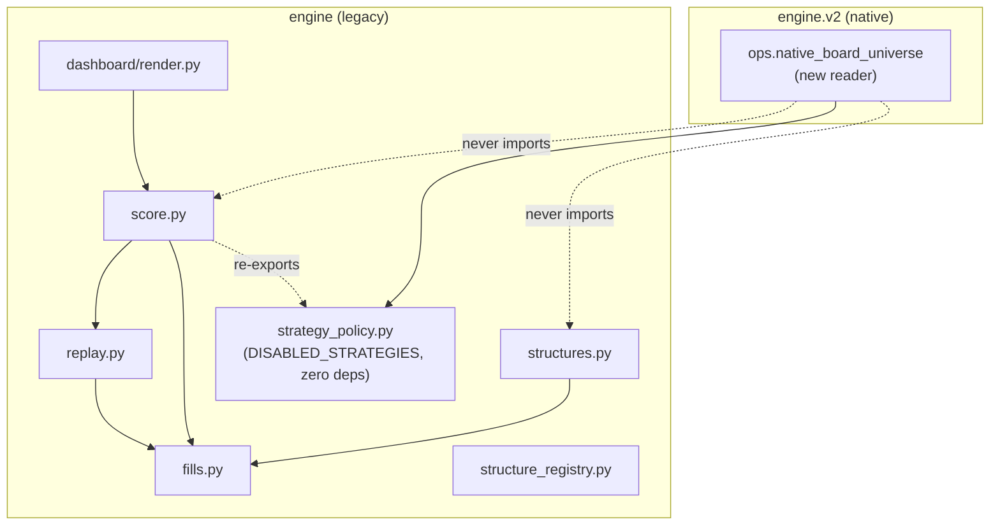

# `engine` (legacy) — architecture

This is the first architecture document for this package. It covers the
package at the level this change needs — its module map, the one dependency
edge this change added (`engine.strategy_policy`), and the isolation
invariant that edge exists to protect — not an exhaustive rewrite of every
legacy module's own docstring (each already documents its own scope in
detail; this file is the map between them, not a replacement for them).

## Purpose

The original (pre-rearchitecture) scoring, structure-definition, and replay
codebase: `score(ticker, strategy, strike, expiry, as_of)`, the Phase 1
public API, and everything it is built from. Two estimation layers, always
both, never averaged — a model layer (a champion model's prediction, turned
into a P&L distribution via held-out residuals and a calibrated payoff) and
an analog layer (matched historical trades, replayed at the same fill
alpha). `engine.v2.*` is the rearchitecture that replaces this package one
row at a time (`guides/system_rearchitecture.md` §4.4); until a given piece
is replaced, this package is still the one authority the live dashboard and
every backtest/replay tool call.

## Primary contracts and interfaces (by module, not exhaustive)

- `score.py` — `score()`, `Scorer`, `score_calendar()` (the dashboard's
  board-universe enumerator and scorer, one chain index loaded for the whole
  board), `ScoreRequest`/`ScoreResult` (the request/response record pair),
  `dynamic_short_vol()` (the DYN-SV chooser meta-row), `DISABLED_STRATEGIES`
  (see below), `FLAGS`.
- `structures.py` — `Structure` (a serializable, resolvable trade-structure
  spec), `STRUCTURES` (the registered strategy-key → factory mapping),
  `price_structure()` (the one pricing path every structure resolves
  through), `with_decision_offset()`, `execution_variant_label()`.
- `structure_registry.py` — `live_strategies()` (superseded-family
  filtering), `family_of()`/`superseded_by()`/`promote_structure()` (the
  structure-champion manifest).
- `replay.py` — `plan_events()` (cheap, deterministic entry/exit-date
  resolution before any chain is touched), `ChainIndex`/`load_chain_index()`
  (the one-load-for-the-whole-board chain cache), `latest_chain_date()`.
- `fills.py` — `FillModel`, `MID`, cost/spread constants. The one execution
  model every structure's legs price through.
- `strategy_policy.py` (new, this change) — `DISABLED_STRATEGIES` only. See
  below.
- `dashboard/` — the legacy board's own renderer (`render.py`), reading
  `DISABLED_STRATEGIES` to mark a strategy row disabled on the board.

## Inputs

Tier-2/Tier-3/Tier-4 panel and chain tables (`engine.data.store`), the
earnings-events calendar, the structure/strategy registries above, and (for
scored rows) a champion model binding. `strategy_policy.py` alone takes no
input — see below.

## Outputs

Scored rows (`ScoreResult`/its `as_dict()`), replay/backtest trade records,
and the legacy dashboard's rendered board. `strategy_policy.py` outputs
nothing beyond the constant it defines.

## Dependencies and callers

Dependency direction inside this package: `score.py` imports `replay.py`
(which imports `fills.py`) and `fills.py` directly; `structures.py` imports
`fills.py` directly. Both therefore reach the legacy chain-index and
fill-model machinery at *import* time, regardless of whether a given call
path ever loads real chain data.

**`engine.strategy_policy` (new): zero dependencies beyond the standard
library, by design.** It holds exactly one thing — the
`DISABLED_STRATEGIES` dict (which two strategies the board refuses to
score, and why) — extracted out of `score.py` so that a caller which only
needs this *policy* fact does not have to import `score.py` and, through it,
`replay.py`/`fills.py`. `score.py` re-exports the name unchanged
(`from engine.strategy_policy import DISABLED_STRATEGIES`, still in its
`__all__`), so every existing caller that reads
`engine.score.DISABLED_STRATEGIES` (or monkeypatches
`score_mod.DISABLED_STRATEGIES`) is unaffected — found by
`grep -rn DISABLED_STRATEGIES`:
`engine/score.py` (two runtime checks: `Scorer.score`'s per-request gate,
and `score_calendar`'s chain-key pre-pass), `engine/dashboard/render.py`
(two local imports), `engine/structure_registry.py` (docstring reference
only), `checks/phase1_checks.py`, `checks/phase3_checks.py`,
`tools/prepare_phase4_tier4_caches.py`, `tools/baseline_export.py`,
`tools/capture_tier0_corpus.py`, and the tests that read or monkeypatch it
(`tests/test_score.py`, `tests/test_capture_tier0_chain_index.py`,
`tests/test_phase4_capture_strict.py`).

**No v2 reader yet.** `engine.v2.ops.native_board_universe` was checked
against reading `engine.strategy_policy.DISABLED_STRATEGIES` directly for a
defensive consistency assertion, and does not do so: any v2 -> legacy
import (even of this dependency-free module — `checks/import_layers.py`
classifies by package path, not by what a module actually imports) must be
declared in `checks/legacy_adapters.json`, whose committed adapter count
may only shrink, and confined to the one adapter module
`engine.v2.ops.legacy_adapter` already declared per package (§4.2).
`SUPPORTED_STRATEGIES` (native's own covered-strategy declaration) already
excludes both disabled strategies by construction, so the assertion was
unnecessary duplication, not a missing check. This extraction still stands
on its own merits — a caller that only needs the disabled-strategy policy
no longer has to import `engine.score` to get it — and is available to a
future v2 consumer that routes the read through the sanctioned adapter
module instead.

## External systems and libraries

`pandas`/`numpy` throughout; `engine.data.store` for panel/chain reads. No
change from this document.

## Failure semantics (4c R1–R6)

Package-wide pattern (unchanged): a row that cannot be priced returns a
typed `UNSCORABLE`/refusal detail rather than a fabricated number;
`DISABLED_STRATEGIES` membership is one such refusal (`Scorer.score` returns
early with the dict's own value as `result.detail`). `strategy_policy.py`
itself has no failure mode: it is a literal dict, imported once, never
computed or fetched.

## Invariants touched by this change

- **Isolation:** a v2/native module may now read this package's disabled-
  strategy *policy* without importing its pricing machinery — the new
  dependency-free module is the mechanism that makes that true at import
  time, not just at call time.
- No scoring, pricing, or replay behavior in this package changed. The
  `DISABLED_STRATEGIES` dict's keys, values, and every reader's behavior are
  byte-identical to before.

## Diagram

## Out of scope

- Any rewrite of `score.py`/`structures.py`/`replay.py`/`fills.py` logic —
  unchanged.
- A full per-function architecture rewrite of this package — each module's
  own docstring remains the detailed reference; this file is the map, kept
  current as later changes touch this package.
