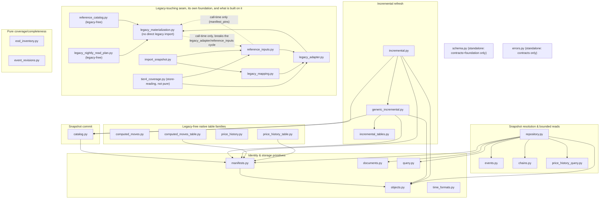
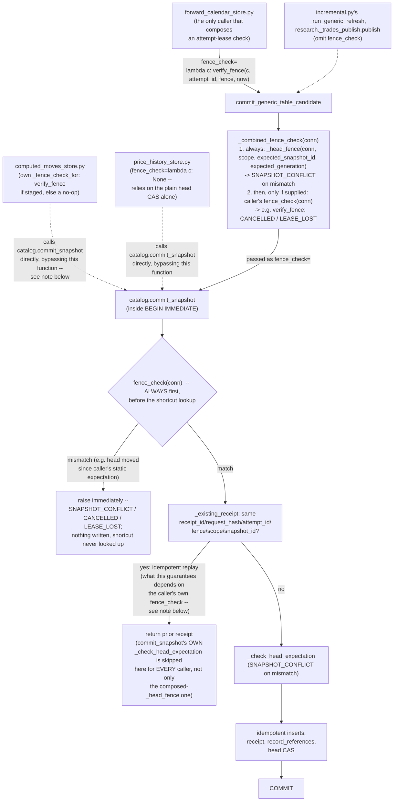

# `engine/v2/data` — architecture

Layer **1.0** in the root [`ARCHITECTURE.md`](../../../ARCHITECTURE.md)'s
layer table (§2). Replaces legacy's `data/sources/`, `store.py`, `fetch.py`,
`finality.py`, `rebuild.py`, and calendar sourcing from `calendar.py`. See the
root doc for the layer rules this package is checked against; this doc
covers the detail specific to this package. See also
`engine/v2/data/README.md` for the exhaustive, checker-enforced Public
interface / Consumers lists (`checks/package_readmes.py` fails an import of a
name absent from that list — but only for a name reached by a package-root
import, `from engine.v2.data import X`; see "Primary contracts" below for why
that is narrower than "everything this package exposes").

This is the component's first `ARCHITECTURE.md` (previously listed
`(pending)` in the root doc), written for the whole package as it exists
today. It was filed as issue #56, deferred from PR #55/#73's fix to
`generic_incremental.commit_generic_table_candidate`'s attempt-fence
composition (issue #52/#58): CodeRabbit asked for that behavior to be
described in "the data component architecture documentation," which did not
exist. The fence-composition contract is covered under "Failure semantics"
below.

## Purpose

Ingestion, normalization, coverage/finality, and atomic snapshot commit —
the root doc's Layer 1 row. It owns:

- turning a raw legacy file or provider payload into an immutable,
  content-addressed object and a validated fragment/dataset-version/snapshot
  identity chain (`objects.py`, `manifests.py`);
- committing a fully-built snapshot atomically, with idempotent inserts and a
  compare-and-swap head, never last-writer-wins (`catalog.py`);
- the incremental-refresh merge policy shared by every EOD table family
  (`incremental_tables.py`), its `daily_market`-specific durable adapter
  (`incremental.py`), and the same protocol generalized to any registered
  `TableContract` (`generic_incremental.py` — see "Failure semantics" for the
  #56 fence-composition contract this module owns);
- bounded, exact reads over an already-committed snapshot: whole-snapshot
  resolution and re-verification, bounded Arrow scans, typed event/chain/
  price lookups, and dependency explanation (`repository.py`, `query.py`,
  `events.py`, `chains.py`, `price_history_query.py`);
- the one legacy-touching seam (`legacy_adapter.py`) and what is built on
  top of it read-only: the legacy→v2 table mapping (`legacy_mapping.py`),
  pinned reference-input resolution (`reference_inputs.py`), and
  snapshot-import planning (`import_snapshot.py`, built on both of those).
  `reference_catalog.py` publishes those same pinned reference inputs into
  the catalog but is itself legacy-free — its own docstring: it never
  imports `reference_inputs`, so `catalog.commit_snapshot` never loads a
  legacy module inside its transaction;
- legacy-tree materialization for a nightly's barrier-only legacy stages
  (`legacy_materialization.py`, `legacy_nightly_read_plan.py`) — neither
  imports legacy `engine.*` code directly. At module level, `legacy_adapter.
  py`'s own `materialize` and row-comparison accessors are built on top of
  `legacy_materialization.py`, not the reverse. But the two also depend on
  each other at call time, in both directions, specifically to break that
  module-level cycle (`reference_inputs.py` imports `legacy_adapter.py`,
  which imports `legacy_materialization.py`, so neither of the two can
  import the other back at module level without one): `legacy_materialization
  .materialize_tree`/`_tier4_cache_dir` import `reference_inputs` lazily
  (`legacy_materialization.py:835,1055` — `:1051-1053`'s own comment names
  the cycle), and `reference_inputs.manifest_pins` imports
  `legacy_materialization.format_pinned_ref` lazily right back
  (`reference_inputs.py:288`);
- two natively-computed, legacy-free table families that have no legacy
  Tier-2 backing of their own: `computed_moves`/`computed_moves_table.py`
  (pure close-to-close move math, moved verbatim from the untouched legacy
  pull) and the bitemporal `price_history` diff/as-of logic
  (`price_history.py`/`price_history_table.py`);
- the data-owner catalog schema (`schema.py`), colocated with the ops/ledger
  schemas in one SQLite file under migration owner `"data"`;
- pure completeness/coverage checks used by incremental planning
  (`eod_inventory.py`, `event_revisions.py`);
- a Tier-4 serving-cache coverage check (`tier4_coverage.py`) that is
  neither pure nor legacy-free — it imports `legacy_adapter`/
  `reference_inputs`, and `missing_triples` reads serving-cache headers off
  the store — gating a snapshot-backed scoring launch
  (`engine.v2.ops.snapshot_stages`'s `_check_tier4_coverage`), not
  incremental refresh.

Per `engine/v2/data/README.md`'s "Non-responsibilities": this package never
computes a trading verdict (`engine/v2/scoring` does) and never changes a
champion (`engine/v2/models/training` does). It never decides *what* to
fetch or *when* to run a job — that scheduling, leasing and retry-history
concern is `engine/v2/ops` (layer 7.0), one of this package's callers.

## Primary contracts and public interfaces

`engine/v2/data/README.md`'s `<!-- public-interface: -->` directive is the
list `checks/package_readmes.py` actually enforces. That checker's
`observed()` (`checks/package_readmes.py:123-138`, using the module-file set
`_package_modules` builds at lines 111-120) only flags a cross-package
import as a "private name imported" violation when the imported name's
*first dotted component after the package name* is **not itself an existing
submodule file**. A submodule-qualified import — `from
engine.v2.data.generic_incremental import commit_generic_table_candidate`,
`from engine.v2.data.legacy_adapter import materialize`, even `from
engine.v2.data.incremental import _jsonable` (a leading-underscore name) —
resolves `head` to the submodule itself, which does exist as a file, so the
check never inspects the name past that point.

Two consequences, both verified against the current tree (`checks/
package_readmes.py --all` reports `READMES OK`, i.e. no violation exists
today):

1. **Directive membership does not mean the name is re-exported at the
   package root.** `engine/v2/data/__init__.py`'s own `__all__` re-exports
   exactly 24 names (`documents.loads_document`/`.decode_document`; all
   eight `manifests` identity/verify functions cited below; the four
   `generic_incremental` names; `build_legacy_mapping`; the `eod_inventory`/
   `event_revisions` names). Most of the directive's other ~50 names —
   `catalog.*`, `query.*`, `objects.*`, `repository.Repository`/
   `.ResolvedSnapshot`, `errors.DataError`, `computed_moves.*`,
   `price_history.*`, `price_history_query.*` — are declared public but are
   **not** in `__init__.py`, so `from engine.v2.data import commit_snapshot`
   (for example) is not actually importable; every real caller reaches them
   through a submodule-qualified import instead.
2. **The reverse gap also exists.** Several modules' names are documented as
   "Public interface" in the README's own per-module prose table but are
   absent from the machine-checked directive entirely: every name in
   `legacy_adapter.py`, `reference_inputs.py`, `reference_catalog.py`,
   `legacy_materialization.py`, and `time_formats.py`, plus
   `price_history_table.py`'s two contract constants. This is not a
   violation — the directive only needs to list a name if some importer
   reaches it *unqualified*, and none does (confirmed: every real caller of
   these modules uses a submodule-qualified import, per "Dependencies"
   below) — but it means the directive is a narrower, stricter list than
   "everything this package's README calls public," and a name's absence
   from it does not mean the name is private or unused.
   `generic_incremental`'s four names sit on the *other* side of this same
   gap (point 1): genuinely re-exported at the package root, yet also
   absent from the directive — an inconsistency in the README's own
   bookkeeping, not a behavior difference, since (as above) no caller
   imports them unqualified either way.

The load-bearing entrypoints, by area (each name below is reachable from
outside this package today, per "Dependencies"; only the ones marked
"package-root" are also literally importable as `from engine.v2.data import
X`):

- **Snapshot commit** — `catalog.commit_snapshot`, `.record_failed_import`,
  `.move_head` (directive-declared; not package-root — see point 1 above).
  `commit_snapshot` is the one place a snapshot's rows, membership and head
  move together, inside one `BEGIN IMMEDIATE` transaction; see "Failure
  semantics" for its fence and idempotency contract.
- **Contract-generic incremental commit** — `generic_incremental.
  build_generic_table_candidate`, `.commit_generic_table_candidate`,
  `.load_generic_revisions`, and the `GenericTableCandidate` dataclass are
  package-root (all four in `__init__.py`'s `__all__`), but not in the
  README directive (point 2 above). `decode_row` is neither: submodule-
  qualified only. `commit_generic_table_candidate` wraps
  `catalog.commit_snapshot` with a caller-supplied head-fence expectation,
  composed with an optional caller-supplied `fence_check` — see "Failure
  semantics" for exactly which real callers supply one and what it does to
  the idempotent-replay shortcut.
- **`daily_market` incremental refresh** — `incremental.run_daily_market_refresh`,
  `.run_incremental_refresh`, `.build_daily_market_candidate`,
  `.commit_daily_market_candidate`, `.merge_daily_market`,
  `.select_revision_winners`, `.cache_raw_receipt`/`.load_raw_receipt`,
  `.cache_normalization` (not package-root, not in the directive; reached
  only via submodule-qualified imports). The shared merge primitives one
  layer down — `incremental_tables.merge_table_rows`, `.logical_key_for_row`,
  `.revision_hash`, and the `GenericRevision`/`GenericMerge` dataclasses —
  are the same: neither package-root nor directive-declared. `.revision_hash`
  and `GenericRevision` have two real cross-package callers today:
  `engine.v2.research._trades_revisions.py` (`from engine.v2.data import
  incremental_tables`, then `incremental_tables.revision_hash`/
  `.GenericRevision`) and `engine.v2.ops.forward_calendar_store.py`
  (`forward_calendar_store.py:47,615-627`, its own `_revision` helper).
- **Snapshot resolution and bounded reads** — `repository.Repository`,
  `.ResolvedSnapshot` (directive-declared; not package-root).
  `Repository(conn, store=None)` exposes: `resolve`/`resolve_pinned` (exact
  `SnapshotRef` re-verification; `resolve_full`/`resolve_full_pinned` for
  the full `ResolvedSnapshot` a caller carrying every table forward into a
  new commit needs — see "Outputs"), `scan` (bounded Arrow scan, needs
  `store`), `get_event`/`get_chain`/`get_price_series`/`get_close` (typed
  single-entity lookups delegating to `events`/`chains`/
  `price_history_query`), `latest_dataset_version` (a table's newest
  version independent of any snapshot's own cadence — `price_history`'s
  case), `table_contract`/`fragment_records` (contract and manifest facts a
  query planner needs without duplicating `resolve`'s own walk), and
  `explain_dependencies` (§5.5: names the exact snapshot, dataset versions,
  fragments, columns and predicates a `DataQuery`/`ChainQuery` would touch;
  anything else is `UNSUPPORTED_CONTRACT`).
- **Pure query/merge/identity primitives, no I/O** — `query.validate_query`,
  `.fragment_may_match`, `.row_matches`, `.order_key`, `.arrow_type_for`,
  `.null_array_for`, `.ARROW_TYPES` (directive-declared; not package-root);
  `manifests.table_contract_hash`, `.fragment_record`, `.fragment_ref`,
  `.dataset_manifest`, `.snapshot_ref`, `.verify_fragment_record`,
  `.verify_dataset_manifest`, `.verify_snapshot_ref` (directive-declared
  **and** package-root — genuinely `from engine.v2.data import
  table_contract_hash` importable); the three `*_identity_payload` helpers
  (directive-declared, not package-root); `objects.publish_legacy_file`,
  `.inspect_fragment`, `.FragmentInspection`, `.verify_object_path`
  (directive-declared, not package-root); `documents.loads_document`,
  `.decode_document` (directive-declared **and** package-root);
  `time_formats.NAIVE_TIMESTAMP_FORMAT`/`.NAIVE_TIMESTAMP_RE`/
  `.format_naive_timestamp`/`.is_naive_timestamp` (neither package-root nor
  directive-declared — point 2 above; reached today by
  `engine.v2.research._scan.py:36`'s `from engine.v2.data import
  errors, time_formats` — the package-qualified-import form, not a
  `from engine.v2.data.time_formats import ...` submodule import, but still
  a real cross-package caller).
- **Legacy-touching seam** — `legacy_adapter.py` is the package's *only*
  module importing legacy `engine.*` code (17 declared entries in
  `checks/legacy_adapters.json`, all `package: "engine.v2.data"`, `module:
  "engine.v2.data.legacy_adapter"`; every other module in this package
  reaches a legacy fact only through its thin accessors). Its names —
  `legacy_table_schemas`, `legacy_panel_columns`, `legacy_tier4_columns`,
  `legacy_tier4_key_columns`, `legacy_source_priority`, `read_legacy_part`,
  `coerce_legacy`, `materialize`, and the reference-path accessors
  (`legacy_calendar_path`, `legacy_registry_path`, `legacy_structures_path`,
  `legacy_models_dir`, `legacy_tier4_serving_dir`, `legacy_chooser_pool_path`,
  `legacy_snapshot_path`, `legacy_data_dir`) — are neither package-root nor
  directive-declared (point 2 above): `materialize` is the one name with a
  real, verified cross-package caller today
  (`engine.v2.ops.materialization_worker`, submodule-qualified — see
  "Dependencies"); the rest are used only from within this package.
- **Legacy mapping, materialization, reference inputs** — `legacy_mapping.
  build_legacy_mapping` (directive-declared **and** package-root);
  `.LegacyMappingError` (directive-declared, not package-root).
  `legacy_materialization.build_materialization_request`,
  `.read_plan_complete`, `.materialize_tree`, `.LEGACY_SCORE_READ_PLAN_V1`,
  `.format_pinned_ref`, `.parse_pinned_ref`; `reference_inputs.
  LEGACY_REFERENCE_INPUTS_V1`, `.DATA_DIR`, `.LEGACY_SNAPSHOT_PATH`,
  `.TIER4_SERVING_DIR`, `.kind_for_path`, `.resolve_reference_files`,
  `.manifest_pins`, `.publish_reference_inputs`; `reference_catalog.
  ReferenceInput`, `.REFERENCE_KINDS`, `.CALENDAR_KIND`,
  `.LEGACY_SNAPSHOT_KIND`, `.REFERENCE_OBJECT_KIND`,
  `.insert_reference_inputs`, `.reference_inputs_for_snapshot`,
  `.pinned_materialization_refs` — none of these three modules' names are
  in the directive (point 2 above); all are reached by real cross-package
  callers only via submodule-qualified imports (verified as actual
  `import`/`from ... import` statements, not a docstring or comment mention
  naming the module): `legacy_materialization` by `engine.v2.ops.
  capture_inputs`/`.snapshot_stages`/`.snapshot_planning`/
  `.materialization_worker` (the last a call-time import,
  `materialization_worker.py:89`); `reference_inputs` by `engine.v2.ops.
  capture_inputs`/`.snapshot_promotion`/`.snapshot_stages`/`.fingerprints`
  (the last a call-time import, `fingerprints.py:311`); `reference_catalog`
  by `engine.v2.ops.snapshot_promotion`/`.snapshot_planning`/
  `.price_history_store` (see "Dependencies"). `engine.v2.research._scan`
  mentions `legacy_materialization` in a docstring but only actually
  imports `errors`/`time_formats`; `engine.v2.ops.ledger_history_import`
  mentions `legacy_nightly_read_plan` in a docstring but imports neither it
  nor `legacy_materialization`/`reference_catalog`; `engine.v2.ops.snapshots`
  mentions `reference_catalog` in a docstring but only actually imports
  `catalog`/`errors`/`repository`.
- **Snapshot import planning** — `import_snapshot.plan_import`, `.ImportPlan`,
  `.request_hash`, `.PENDING_CALENDAR_VERSION` (neither package-root nor
  directive-declared; called by `engine.v2.ops.snapshot_import`/
  `.snapshot_promotion`/`.cli`).
- **Nightly barrier read plans** — `legacy_nightly_read_plan.
  LEGACY_NIGHTLY_READ_PLAN_V1`, `.BARRIER_KINDS`, `.FAMILIES`,
  `.NIGHTLY_CAPTURE_IMPLEMENTATION_REF`, `.required_families`,
  `.manifest_problems` (neither package-root nor directive-declared; called
  by `engine.v2.ops.capture_inputs`/`.cli` (`cli.py:387`, a call-time
  import). `engine.v2.ops.ledger_history_import` only names this module in
  a docstring (its `ledger_glob` families comment) and does not import it —
  see the "Legacy mapping, materialization, reference inputs" bullet above.
- **Tier-4 coverage** — `tier4_coverage.champion_producer_models`,
  `.required_serving_triples`, `.missing_triples` (neither package-root nor
  directive-declared; all three called by `engine.v2.ops.snapshot_stages.py`
  — a real production caller, `snapshot_stages.py:275,279-280` — via `from
  engine.v2.data import tier4_coverage`, not only exercised by this
  package's own test module).
- **`computed_moves`/`price_history` table families** — `computed_moves.
  build_rows`, `.build_ticker`, `.native_trading_calendar`,
  `.projected_trading_days`, `.session_move`, `.us_market_holidays`,
  `.NativeTradingCalendar` and `computed_moves_table.COMPUTED_MOVES_CONTRACT`/
  `.COMPUTED_MOVES_TABLE_NAME` (directive-declared, not package-root);
  `price_history.check_not_backdated`, `.latest_state`, `.diff_retrieval`,
  `.as_of_view`, `.PRICE_HISTORY_VALUE_COLUMNS` (directive-declared, not
  package-root); `price_history_table.PRICE_HISTORY_CONTRACT`/
  `.PRICE_HISTORY_TABLE_NAME` (neither package-root nor directive-declared
  — point 2 above); `price_history_query.get_price_series`/`.get_close`
  (directive-declared, not package-root, and exposed again as
  `Repository.get_price_series`/`.get_close`).
- **Errors** — `errors.DataError` (directive-declared, not package-root);
  `errors.fail`/`.make_problem` build every `DataError` this package
  raises, from `engine.v2.contracts.data.DATA_FAILURE_CODES` only
  (`errors.py:38`: an unregistered code raises `ValueError` at construction
  rather than reaching a caller as a guessed category).

## Inputs

- **Legacy files**, read only through `legacy_adapter.py`'s thin accessors:
  the six Tier-2 curated tables, `panel.parquet`/`tier4_forecasts.parquet`,
  the model registry, structure/champion artifacts, the legacy calendar CSV,
  the chooser analog pool, and the legacy `SNAPSHOT` file — every path taken
  from an `engine.paths` constant via the adapter, never computed locally.
- **Provider payloads**, for `daily_market`'s durable refresh
  (`incremental.py`): a caller-injected fetcher's raw bytes, staged as a
  `RawPayload` before normalization (see "Outputs" — `data_raw_receipts`).
  `RESOURCE_UNAVAILABLE` is raised for an unconfigured fetcher and
  `TRANSIENT_SOURCE` for a provider response that is neither complete nor a
  legitimate empty (`incremental.py`'s two `DATA_FAILURE_CODES` entries with
  the matching `contracts.operations.FAILURE_CODES` semantics).
- **Already-committed catalog rows and objects**, for every read path
  (`repository.Repository`, `query.py`, `events.py`, `chains.py`,
  `price_history_query.py`): a `sqlite3.Connection` into the shared
  ops/ledger/data catalog file, and an `ArtifactStore` for anything that
  needs fragment bytes (`scan`, `get_event`/`get_chain`/`get_price_series`/
  `get_close`, `explain_dependencies` does not need bytes).
- **A `GenericTableCandidate`'s inputs** (`generic_incremental.
  build_generic_table_candidate`): a `manifests.ResolvedSnapshot` (the parent
  to carry every other table forward from), an `ArtifactStore`, a
  `table_name`, incoming/retained `GenericRevision` sequences, and a
  `CompletedCoverage` (must be `state == "complete"`, else `INPUT_CHANGED`).
- **`commit_generic_table_candidate`'s inputs**: the built candidate; the
  scope, expected head `(snapshot_id, generation)`; and optionally
  `attempt_id`/`fence` (default `fence=1`) plus a caller-supplied
  `fence_check` callable — see "Failure semantics" for exactly how these
  compose.
- **Pinned reference inputs**, for import/materialization planning
  (`reference_inputs.resolve_reference_files`, `import_snapshot.plan_import`):
  every path from a `legacy_adapter` accessor, never a locally-derived one.

## Outputs

- **A committed snapshot**: new/reused rows across `data_contracts`,
  `data_objects`, `data_fragments`, `data_dataset_versions`,
  `data_version_fragments`, `data_snapshots`, `data_snapshot_tables`, one
  `data_import_receipts` row, and — unless the candidate already resolves to
  the current head — a compare-and-swapped `data_snapshot_heads` row
  (`catalog.commit_snapshot`, returning a `SnapshotImportReceipt`).
- **A failed/conflict receipt**, in its own transaction, never touching a
  head (`catalog.record_failed_import`).
- **An immutable object** in the artifact store, plus a `FragmentInspection`
  (row count, key/time bounds, byte hash, streaming content hash) —
  `objects.publish_legacy_file`/`.inspect_fragment`; no catalog insert.
- **A re-verified `SnapshotRef`/`ResolvedSnapshot`**, rebuilt entirely from
  catalog rows through the same builders `catalog.commit_snapshot` used —
  never read back from `data_snapshot_heads` directly by `resolve` itself
  (`repository.Repository.resolve`/`.resolve_full`; `resolve_pinned`/
  `resolve_full_pinned` are the only methods that read
  `data_snapshot_heads`, and only to find *which* `snapshot_id` to then
  re-verify through `resolve`/`resolve_full` exactly like any other lookup).
- **Bounded Arrow-batch scan results**, in one global primary-key order via
  a streaming `heapq.merge` (`repository.Repository.scan`; never a
  convenience whole-table read).
- **Typed single-entity results**: `EarningsEvent` (`events.get_event`),
  `ChainSnapshot` (`chains.get_chain`), `PriceSeriesRow` tuples
  (`price_history_query.get_price_series`/`.get_close`).
- **A `DependencyPlan`** naming the exact snapshot/dataset-versions/
  fragments/columns/predicates and estimated/maximum rows a query would
  touch (`repository.Repository.explain_dependencies`).
- **`GenericTableCandidate`/commit results**: a candidate carrying the new
  table manifest, rewritten object set, and a `changeset`/`changeset_hash`
  (`generic_incremental.build_generic_table_candidate`); a
  `SnapshotImportReceipt` from `commit_generic_table_candidate`, plus rows in
  `data_snapshot_coverage`/`data_changesets`/`data_table_revisions`
  (`_record_references`, run inside the same transaction as the head CAS).
- **A `computed_moves`/`price_history` fragment** per ticker (whole-partition
  rewrite, never a byte-level append — see "Invariants"), built by
  `computed_moves.build_rows` / `price_history.diff_retrieval` and committed
  through `catalog.commit_snapshot` directly — `engine.v2.ops.
  computed_moves_store.py` and `.price_history_store.py` each call
  `catalog.commit_snapshot` themselves, never `generic_incremental`
  (`computed_moves_store.py`'s own module docstring states this); this
  package supplies only the pure math and the `TableContract`s.
- **Refusals**: every failure this package raises is a `DataError` wrapping
  a `Problem` built from `engine.v2.contracts.data.DATA_FAILURE_CODES` — see
  "Failure semantics" for the full code table. Messages never carry a legacy
  filesystem path or a row value (`errors.py`'s module docstring); a column
  or table *name* is schema metadata, not a row value, and may appear.

## Dependencies

Per `checks/layer_map.py`, layer 1.0 has no `only_imports` restriction, so it
may import any layer strictly below itself — in practice that means layer
0.0 (`engine.v2.contracts`) and layer 0.5 (`engine.v2.foundation`) only,
confirmed by grepping every top-level and lazy `engine.*` import in this
package's own `.py` files: no module here imports `engine.v2.ops`,
`engine.v2.scoring`, or any other `engine.v2.*` package above its own layer.
Intra-package imports (e.g. `generic_incremental.py` importing `catalog`,
`errors`, `manifests`, `objects`; `repository.py` importing `chains`,
`documents`, `errors`, `events`, `manifests`, `objects`, `query`) are the
package's own internal fan-out, not a layer-checked edge.

**The one legacy-touching module.** `legacy_adapter.py` is this package's
only declared adapter (`checks/legacy_adapters.json`): 17 entries, all
`module: "engine.v2.data.legacy_adapter"`, reading `engine.data.schemas.*`
(`SCHEMAS`, `coerce`, `SOURCE_PRIORITY`), `engine.data.features.panel.
PANEL_COLUMNS`, `engine.data.features.tier4.*` (`COLUMNS`, `KEY_COLUMNS`,
`SERVING_DIR`, `serving_fold`, `read_serving_header`),
`engine.data.store._read_part`, `engine.models.registry.*`
(`REGISTRY_PATH`, `ARTIFACT_DIR`), and `engine.paths.*` (`ROOT`,
`GSPC_DAILY`, `SNAPSHOT_FILE`, `FEATURES`, `DATA`) — each read-only, no
credentials, no hidden subprocess, removal targeted at "phase-3 ingestion"
for the four `engine.data.schemas.SCHEMAS`/`panel.PANEL_COLUMNS`/
`tier4.COLUMNS`/`tier4.KEY_COLUMNS` entries and "phase-4 scoring extraction"
for the remaining thirteen.
No other module in this package imports legacy `engine.*` code at all.
Legacy never imports this package either (grepped every legacy location —
`engine/data/**`, `engine/models/**`, `engine/dashboard/**`, and the bare
`engine/*.py` modules — for any `engine.v2.data` reference: none), matching
the root doc §3's "legacy never imports v2" rule.

**Callers.** `engine.v2.ops` (layer 7.0): `bootstrap.py` applies
`schema.OWNER`/`.MIGRATIONS`; `snapshots.py` calls `catalog.commit_snapshot`/
`repository.Repository` to supply the real Phase 1 fence and publish a
resolved head; `snapshot_import.py`/`snapshot_promotion.py`/`cli.py` call
`import_snapshot.plan_import`/`.request_hash`; `capture_inputs.py`/`cli.py`
call `legacy_nightly_read_plan.*` (`ledger_history_import.py` only names
this module in a comment; see "Primary contracts");
`forward_calendar_store.py`/`computed_moves_store.py` call
`computed_moves.native_trading_calendar`/`.build_rows` and
`computed_moves_table.*`, but only `forward_calendar_store.py` passes a
`fence_check` into `generic_incremental.commit_generic_table_candidate`;
`forward_calendar_store.py` also calls `incremental_tables.revision_hash`/
`.logical_key_for_row`/`.GenericRevision` directly (`:615-627`, its own
`_revision` helper);
`computed_moves_store.py` calls `catalog.commit_snapshot` directly with its
own `_fence_check_for` (`verify_fence` when an attempt is staged, otherwise
a no-op; no head-fence composition either way — see "Failure semantics");
`unit_receipts.py` calls `incremental.cache_raw_receipt`/
`RawPayload`/`load_raw_receipt`/`_jsonable` (the last a private name, legally
reachable — see "Primary contracts"); `incremental_data.py`/`nightly.py`
call `incremental.run_daily_market_refresh`/`FETCH_SOURCE`. `engine.v2.serving`
(layer 7.0) imports `repository.Repository` in `projections.py` — an
ordinary downward import (7.0 > 1.0), never the reverse; the serving-side
`(ticker, event_date) -> EventRef` resolver is built entirely on
`Repository.scan`. `engine.v2.research` (layer 7.0/6.0-6.5 depending on the
module) reads pinned snapshots and — `_trades_publish.py` — calls
`generic_incremental.commit_generic_table_candidate` directly, without a
`fence_check` (see "Failure semantics": this is the "omit it, keep
unchanged `_head_fence`-only behavior" case the module's own docstring
names); `reconcile_trades.py` does not call it directly — it only imports
building blocks from `_trades_publish.py`; `_trades_revisions.py` imports
`incremental_tables.revision_hash`/`.GenericRevision` (see "Primary
contracts"). `tools/*`, `checks/*`, and `tests/test_v2_data_*.py` are
non-layered consumers per the root doc §1, exercising this package's
modules directly in addition to whatever `engine.v2.ops`/`.research`/
`.serving` callers each module already has.

## External systems and libraries

- **`sqlite3`** — the operations catalog file, shared with the `ops`/`ledger`
  migration owners (`schema.py`'s own docstring: "colocated ... in the same
  SQLite file"). This package never imports `engine.v2.ops.catalog.transaction`
  (it cannot — `engine.v2.ops` is above its own layer), so `catalog.py`
  implements its own local `BEGIN IMMEDIATE` context manager
  (`_immediate_transaction`, `catalog.py:99-110`) rather than sharing the
  ops-layer one.
- **The local filesystem** — legacy Parquet/CSV files read through
  `legacy_adapter.py`; the artifact store's own content-addressed backing
  store (`ArtifactStore`, `engine.v2.foundation`), never touched by a raw
  path this package computes itself except for one sibling-resource read:
  `legacy_mapping.py` loads a bundled `legacy_annotations.json` package
  resource, a reviewed-facts file that ships beside the module in the same
  package directory. This is a package-resource read, not a repo-root
  computation (the root doc's snapshot/root-isolation anti-pattern is about
  deriving a *project* root from `__file__`, which this is not: resolving a
  module's own directory always tracks wherever the currently-imported
  module actually lives, so it is unaffected by a worktree checkout or an
  `INVESTING_PLAN_ROOT` override). No other module in this package touches
  `__file__`.
- **`pyarrow`/`pyarrow.parquet`** — every fragment is a Parquet file;
  `objects.py`, `generic_incremental.py`, `incremental.py`, and
  `repository.py`'s scan path all stream Arrow batches rather than
  materializing a whole table.
- **`numpy`/`pandas`** — `computed_moves.py` (both, for its pure move math);
  `price_history.py`, `price_history_query.py`, and
  `price_download_sources.py` each import `pandas` too (no other module in
  this package depends on either library).
- No network access anywhere in this package: every provider fetch is
  injected by the caller (`engine.v2.ops`) as a plain callable; this package
  never imports `requests`, `yfinance`, or any HTTP client itself.

## Failure semantics

Every refusal this package raises is a `DataError` (`errors.py`) wrapping a
`Problem` built only from a registered
`engine.v2.contracts.data.DATA_FAILURE_CODES` entry — category and
retryability come from that table, never guessed at a call site
(`errors.make_problem`, which raises a bare `ValueError` at construction time
for an unregistered code, so a typo can never reach a caller mis-categorized).
The full registered table, and which module(s) actually raise each code (an
AST walk of every module in this package for an `errors.fail(...)`/`fail(...)`
call, reading its first argument — not a line-oriented grep, which misses a
call whose code argument sits on its own line):

| Code | Category | Retryable | Raised by |
|---|---|---|---|
| `SNAPSHOT_NOT_FOUND` | dependency | no | `catalog`, `repository` |
| `SNAPSHOT_NOT_READY` | dependency | yes | `repository`, `reference_catalog` |
| `SNAPSHOT_CONFLICT` | dependency | yes | `catalog`, `generic_incremental`, `incremental` (`_candidate_head_fence`, `incremental.py:966-969`) |
| `CONTRACT_MISMATCH` | validation | no | `chains`, `event_revisions`, `events`, `generic_incremental`, `import_snapshot`, `incremental`, `incremental_tables`, `legacy_adapter`, `legacy_materialization`, `manifests`, `objects`, `price_download_sources`, `price_history`, `price_history_query`, `query`, `reference_catalog`, `reference_inputs`, `repository` |
| `QUERY_NOT_BOUNDED` | validation | no | `chains`, `price_history_query`, `query`, `repository` |
| `RESULT_LIMIT_EXCEEDED` | resource | no | `chains`, `legacy_materialization`, `repository` |
| `RESOURCE_UNAVAILABLE` | resource | yes | `incremental` (an unconfigured fetcher) |
| `TRANSIENT_SOURCE` | source | yes | `incremental` (a provider response neither complete nor a legitimate empty) |
| `INPUT_CHANGED` | integrity | yes | `generic_incremental`, `import_snapshot`, `incremental`, `objects`, `price_history`, `reference_inputs` |
| `OBJECT_CORRUPT` | integrity | no | `generic_incremental`, `incremental`, `legacy_materialization`, `objects`, `repository` |
| `MANIFEST_CORRUPT` | integrity | no | `catalog`, `generic_incremental`, `incremental`, `incremental_tables`, `manifests`, `repository` |
| `IDENTITY_CONFLICT` | validation | no | `catalog`, `chains`, `eod_inventory`, `event_revisions`, `generic_incremental`, `incremental`, `incremental_tables` |
| `UNSUPPORTED_CONTRACT` | validation | no | `chains`, `eod_inventory`, `generic_incremental`, `incremental`, `legacy_materialization`, `repository` |
| `EVENT_NOT_FOUND` | dependency | no | `events` |
| `DEADLINE_EXCEEDED` | resource | yes | `repository` (`explain_dependencies`/scan deadline check) |
| `POPULATION_COLLAPSED` | validation | no | `chains` |
| `DEST_ROOT_NOT_EMPTY` | validation | no | `legacy_materialization` |
| `DEST_ROOT_UNSAFE` | validation | no | `legacy_materialization` |
| `EVIDENCE_SCOPE_INCOMPLETE` | validation | no | `legacy_materialization` (a `trades` scan whose real span escapes a too-narrow `evidence_scope`) |
| `TIER4_CACHE_STALE` | validation | no | `legacy_materialization`, `reference_inputs` |
| `STALE_EXPECTATION` | validation | no | `repository` (`explain_dependencies`'s chain-query path, `repository.py:649`) |
| `CALENDAR_UNAVAILABLE` | validation | no | `engine.v2.research` (`_plan.py:79`, `_pricing.py:447`), through `data.errors`; no module inside this package raises it |

21 of the 22 registered codes are raised by a module in this package;
`CALENDAR_UNAVAILABLE` is registered here (`contracts/data.py:153`) but
raised only by `engine.v2.research`, never from inside this package. None
of the 22 is dead in `DATA_FAILURE_CODES` overall.

### `catalog.commit_snapshot` / `generic_incremental.commit_generic_table_candidate` — the #56 fence-composition contract (4c R1–R6)

This is the interface #56 was filed to have documented: after #55/#73,
`commit_generic_table_candidate`'s `fence_check` parameter composes with,
rather than replaces, the module's own head-fence check, and this composition
is what keeps an attempt-lease check active on `commit_snapshot`'s
idempotent-replay shortcut too.

- **R1, missing input.** `build_generic_table_candidate` refuses
  `INPUT_CHANGED` if `coverage.state != "complete"`, and `CONTRACT_MISMATCH`
  if the parent snapshot has no manifest for the requested table or no
  contract of that name (`generic_incremental.py:74-79`, `_contract`).
  `commit_snapshot` re-verifies every contract's `definition_hash`, every
  fragment record, every dataset manifest's own referenced-fragment set, the
  no-key-overlap invariant, and the snapshot's own table bindings — all
  *before* opening the transaction (`catalog.py`'s `_verify_everything`,
  called at the top of `commit_snapshot`, `catalog.py:496`) — a
  `MANIFEST_CORRUPT` here means nothing has been written yet.
- **R1 (continued), the fence itself.** `commit_generic_table_candidate`
  builds a single `_combined_fence_check(conn_)` closure
  (`generic_incremental.py:169-172`) that *always* calls this module's own
  `_head_fence(conn_, scope, expected_head_snapshot_id, expected_head_generation)`
  first — refusing `SNAPSHOT_CONFLICT` if the scope's current
  `(snapshot_id, generation)` in `data_snapshot_heads` disagrees with what
  the caller expected (`generic_incremental.py:465-471`) — and *then*, only
  if the caller supplied one, calls the caller's own `fence_check(conn_)`.
  That combined closure is what gets passed to `catalog.commit_snapshot` as
  *its* `fence_check` parameter (`generic_incremental.py:174-186`).
  `catalog.commit_snapshot` invokes whatever `fence_check` it was given as
  the very first statement inside its own transaction
  (`catalog.py:500-501`, `fence_check(conn)`), **before** looking up the
  idempotent-replay shortcut (`_existing_receipt`, `catalog.py:502`) and
  before its own `_check_head_expectation` (`catalog.py:506`). This ordering
  is deliberate, not incidental: `commit_snapshot` skips its *own*
  `_check_head_expectation` call whenever the replay shortcut matches (an
  identical retry under the same `receipt_id`/`request_hash`/`attempt_id`/
  `fence`/`scope`/resulting `snapshot_id`), but it *always* calls
  `fence_check` first regardless — so a caller that composes an
  attempt-lease check into `fence_check` (the pattern below) keeps that
  check active even on the shortcut path, where `commit_snapshot`'s own head
  check would otherwise never run.
  A caller that also wants an attempt-lease check
  (`engine.v2.ops.lifecycle.verify_fence`) passes
  `fence_check=lambda c: verify_fence(c, attempt_id, fence, now)` into
  `commit_generic_table_candidate` — `forward_calendar_store.py`'s own
  `_fence_check_for` does exactly this (`engine/v2/ops`, since this module
  cannot import `engine.v2.ops.lifecycle` itself — see "Dependencies"); it
  is the only production caller that composes an attempt-lease check into
  `commit_generic_table_candidate` this way. `verify_fence` raises
  `CANCELLED` for a job whose state is `"cancelling"` and `LEASE_LOST` for
  an attempt whose lease has already expired, inside the same transaction
  the head compare-and-swap runs in — refused before any row is inserted
  and before the head moves, never after a successful commit. **Omitting
  `fence_check`** (the default) keeps this function's previous, unchanged
  behavior for its other production callers today — `incremental.py`'s own
  `_run_generic_refresh` and `engine.v2.research._trades_publish.publish` —
  which get `_head_fence` alone, exactly as before #55/#73.
  `engine.v2.ops.computed_moves_store.py` has its own `_fence_check_for`
  (`computed_moves_store.py:350-362`), but it is never composed through
  `commit_generic_table_candidate`: that module's own docstring says it
  "never generic_incremental", and it calls `catalog.commit_snapshot`
  directly (`computed_moves_store.py:402`), passing `_fence_check_for`'s
  result as `commit_snapshot`'s own `fence_check` argument, on its own — so
  whatever it does runs with no `_head_fence` composition in front of it,
  unlike the `commit_generic_table_candidate` path described above.
  `_fence_check_for` itself returns `lambda connection: verify_fence(...)`
  only when a `staged_attempt_id` is present; with no staged attempt (a
  manual or test invocation, per its own docstring) it returns
  `lambda connection: None`, a no-op — so this path's fence check is only
  sometimes `verify_fence`, never `_head_fence`-composed either way.
  `engine.v2.ops.price_history_store.py` is simpler still: it always passes
  `fence_check=lambda c: None` (`price_history_store.py:634`), a
  hard-coded no-op, relying entirely on `commit_snapshot`'s own
  `expected_head_snapshot_id`/`expected_head_generation` compare-and-swap
  and never on `verify_fence` or `_head_fence`.
- **R2, cache.** None: every manifest, contract and fragment is
  re-verified from its own content on every call (`_verify_everything`), and
  `commit_snapshot`'s idempotent-insert helpers (`_insert_contract`,
  `_insert_object`, `_insert_fragment`, `_insert_dataset_version`,
  `_insert_snapshot`) each re-read the existing row, if any, and compare its
  full stored payload rather than trusting a cached prior result.
- **R3, retry.** `commit_snapshot` itself never retries; a lost head
  compare-and-swap or a fence refusal raises immediately, leaving the
  caller's own retry policy (a job's `RetryPolicy`, one layer up in
  `engine.v2.ops`) to decide whether to build a fresh candidate and call
  again. Through the *plain* `catalog.commit_snapshot` call (the
  `computed_moves_store.py`/`price_history_store.py` path above), a repeated
  call under the *same* `receipt_id`/`request_hash`/`attempt_id`/`fence`/
  `scope`/resulting snapshot is not a retry in this sense — it is the
  idempotent-replay shortcut (R6, below). Through
  `commit_generic_table_candidate`'s *composed* fence, that shortcut is
  reachable on retry only when the original commit was a no-op
  (`already_at_head=True`, so the head never moved): the caller's
  `expected_head_snapshot_id`/`expected_head_generation` are the static
  values it computed before the first call, and `_head_fence` re-checks them
  against the *current* head on every retry, including the replay one. If
  the original call actually advanced the head, a same-attempt retry's
  `_head_fence` check now disagrees with the (moved) current head and raises
  `SNAPSHOT_CONFLICT` immediately — before `_existing_receipt` is ever
  looked up, so the shortcut is refused, not returned. This is the
  documented purpose of composing `_head_fence` in front of a caller's own
  `fence_check` (`commit_generic_table_candidate`'s own docstring,
  `generic_incremental.py:141-163`): it is what keeps head-conflict
  detection active on the replay-shortcut path too, for every caller, not
  only when no custom `fence_check` is supplied — a stale, already-
  superseded attempt cannot silently replay a commit that has since moved
  on. (That same docstring also names `computed_moves_store.py` as
  following this pattern; per the corrected "Dependencies" section above,
  it does not — that is the pre-existing, unchanged-code inaccuracy tracked
  as #76.)
  `engine.v2.ops.snapshots.commit_snapshot_for_attempt` is a third caller of
  the *plain* `catalog.commit_snapshot` path described above (alongside
  `computed_moves_store.py`/`price_history_store.py`): it too calls
  `catalog.commit_snapshot` directly, never through
  `commit_generic_table_candidate`, so it also gets no `_head_fence`
  composition (`snapshots.py:82-90`). It differs from those two callers in
  one way: it always supplies
  `fence_check=lambda c: verify_fence(c, attempt_id, fence, clock.now())`
  (`snapshots.py:88`) — `attempt_id` and `fence` are required parameters of
  `commit_snapshot_for_attempt`, not optional ones, so this path's fence
  check is never a no-op, unlike `computed_moves_store.py` with no attempt
  staged or `price_history_store.py`'s hard-coded no-op. Its guarantee is
  therefore lease-only, not head-aware: `verify_fence` still refuses a
  cancelled or lease-expired attempt's replay at the fence step, but
  nothing in this path checks whether the data head moved, so a live
  attempt's matching replay (same `request_hash`/`attempt_id`/`fence`/
  `scope`/resulting `snapshot_id`) returns the prior receipt even after the
  head has moved since the original call (see R6, below).
- **R4, transaction.** One `BEGIN IMMEDIATE` transaction
  (`catalog._immediate_transaction`) covers the fence check, the shortcut
  lookup, every idempotent insert, the receipt insert, `record_references`
  (if supplied — `generic_incremental`'s own `_record_references`, writing
  `data_snapshot_coverage`/`data_changesets`/`data_table_revisions` rows),
  and the head CAS. A raised exception anywhere inside rolls the whole
  transaction back (`_immediate_transaction`'s `except BaseException` clause)
  — nothing partial is ever left committed. Ten named fault-injection points
  (`before_transaction` through `before_commit`, `catalog.py`'s module
  docstring) exist for tests to prove this; all fire before `COMMIT`.
- **R5, partial write.** None possible inside the transaction (R4 covers
  it); the one write that happens *outside* the transaction, publishing a
  fragment's bytes to the artifact store, happens earlier, during
  `build_generic_table_candidate`'s `_write_partitions` — a fragment that is
  durably published but never committed (because the later
  `commit_generic_table_candidate` call fails its fence, its head check, or
  crashes) is simply an unreferenced object: harmless, and reusable if a
  retry rebuilds the identical candidate (its `ObjectRef.object_id` is
  content-derived, so a byte-identical republish returns the same id).
- **R6, idempotency.** Two independent idempotency layers. First,
  `catalog.commit_snapshot`'s own insert-level idempotency: an existing row
  under any `*_id` is accepted only if its full canonical payload matches —
  `IDENTITY_CONFLICT` otherwise, nothing written (`catalog.py`'s
  `_insert_contract`/`_insert_object`/`_insert_fragment`/
  `_insert_dataset_version`/`_insert_snapshot`, each comparing the existing
  row's payload before deciding). Second, the receipt-level replay shortcut:
  `_existing_receipt` (`catalog.py:432-467`) returns the prior committed
  receipt, without re-inserting anything or re-running the head CAS, only if
  the replay is provably the *same* call (same `request_hash`, `attempt_id`,
  `fence`, `scope`, and resulting `snapshot_id` as the stored row) —
  anything else stored under that `receipt_id` is `IDENTITY_CONFLICT`. As
  covered in R3 above, `fence_check` always runs before this shortcut is
  even looked up — but what that buys a replay depends entirely on what the
  caller's own `fence_check` actually checks, since `commit_snapshot` skips
  its own `_check_head_expectation` on a matching replay for every caller
  alike (`catalog.py:500-504`), not only the composed one. Through
  `commit_generic_table_candidate`'s composed `_head_fence`, a same-attempt
  replay of a commit that *did* move the head cannot reach this shortcut at
  all — it is refused with `SNAPSHOT_CONFLICT` first, so the shortcut is
  reachable through that path only when the original commit was already a
  no-op — and a cancelled or lease-expired attempt cannot ride a
  same-`receipt_id` replay past the composed `verify_fence` check either.
  Neither guarantee holds for `computed_moves_store.py`/
  `price_history_store.py`'s direct `catalog.commit_snapshot` calls, whose
  own `fence_check` never inspects the head at all (see the fence-
  composition diagram's note, above): a matching replay there returns the
  prior receipt even if the head has moved since, and — for
  `price_history_store.py`'s hard-coded no-op, or `computed_moves_store.py`
  with no attempt staged — nothing at the fence step refuses a cancelled or
  lease-expired attempt's replay either; the shortcut's own exact-match
  requirement on `request_hash`/`attempt_id`/`fence`/`scope`/`snapshot_id`
  is these two callers' only protection against an unwanted replay.
  `engine.v2.ops.snapshots.commit_snapshot_for_attempt` (R3, above) sits
  between these two cases: it also composes no `_head_fence`, so a matching
  replay after the data head has moved returns the prior receipt exactly
  like the two callers above — but because it always supplies
  `verify_fence` as its `fence_check` (never a no-op), a cancelled or
  lease-expired attempt's replay is refused at the fence step, the same
  protection `computed_moves_store.py` gets only when an attempt is staged.
  Its replay guarantee is lease-only: a still-live attempt can replay a
  commit past a data head that has since moved, but a dead one cannot ride
  the same-`receipt_id` shortcut through.

### `repository.py` — read paths (R1–R6 summary)

- **R1, missing input.** An unknown `snapshot_id` is `SNAPSHOT_NOT_FOUND`; a
  scope with no committed head (`resolve_pinned`/`resolve_full_pinned`) is
  `SNAPSHOT_NOT_READY`; a table absent from a snapshot
  (`table_contract`/`fragment_records`) or a query naming an unbound
  table/column is `CONTRACT_MISMATCH`; an unbounded `DataQuery`/`ChainQuery`
  is `QUERY_NOT_BOUNDED`.
- **R1 (continued), corruption.** Any mismatch between a freshly recomputed
  id/`manifest_hash` (rebuilt through the *same* `manifests.fragment_record`/
  `.dataset_manifest`/`.snapshot_ref` builders `catalog.commit_snapshot`
  used) and the catalog's own stored primary key — corrupt or missing
  membership, an edited row, a dropped join partner, a duplicate primary key
  across fragment boundaries in a `scan` — is `MANIFEST_CORRUPT`: this
  package's judgement call in place of the phase-2 guide's prose
  `INTEGRITY_FAILED`, since §11 has no such registered code. A byte
  mismatch on re-hash of an object is `OBJECT_CORRUPT`.
- **R2, cache.** None: `resolve` rebuilds a `SnapshotRef` entirely from
  catalog rows on every call, never from `data_snapshot_heads` directly
  (only `resolve_pinned`/`resolve_full_pinned` read that table, and only to
  learn *which* `snapshot_id` to then resolve exactly like any other
  lookup); `objects.verify_object_path` re-hashes an object on every open,
  unconditionally (tech debt TD-1: no stat-tuple cache).
- **R3, retry.** None internal; a caller retries by calling again.
- **R4, transaction.** One read-only SQLite transaction covers a whole
  `resolve`/`resolve_full` walk (`_read_only`), so a concurrent commit
  elsewhere can never hand back a torn snapshot.
- **R5, partial write.** None: every method in this module is read-only.
- **R6, idempotency.** Every row `resolve`/`scan` reads is append-only
  (`schema.py`'s own invariant 1: every `data_*` table except
  `data_snapshot_heads` refuses `UPDATE`/`DELETE`), so resolving the same
  `snapshot_id` twice always returns field-for-field identical results.

### Legacy materialization (`legacy_materialization.py`) — structural refusals

Two structural refusals fire before any byte is written to a materialization
destination: `DEST_ROOT_NOT_EMPTY` and `DEST_ROOT_UNSAFE`. `trades` is
scanned whole, so a request's own `evidence_scope` can be narrower than the
table's real `(ticker, year)` span it actually needs — caught as
`EVIDENCE_SCOPE_INCOMPLETE` rather than silently materializing an incomplete
view. A pinned Tier-4 serving-cache ref whose filename's own embedded
panel-hash prefix disagrees with this materialization's actual panel object
— a stale ref from a different snapshot — is caught as `TIER4_CACHE_STALE`
before it is ever copied in, the same code `reference_inputs.py` raises for
the identical class of staleness during import planning.

## Invariants

Root doc §5 invariants this package is responsible for:

- **Missing input → typed refusal, never a silent default.** Every failure
  path in this package raises a `DataError`/`Problem` from the registered
  table above; none defaults a missing row, column or coverage state to
  `0`/`None`/an inferred value (see "Failure semantics").
- **Snapshot/root isolation.** Every filesystem path this package resolves
  for a *store* comes from `engine.paths` constants (via `legacy_adapter.py`)
  or from `engine.v2.foundation.ArtifactStore`, never from a locally computed
  project root. The one `Path(__file__)` use in the package
  (`legacy_mapping.py`'s `ANNOTATIONS_PATH`) resolves a sibling package
  resource, not a project root — see "External systems" for why that is not
  an instance of the anti-pattern the root doc names.
- **Nothing published carries a local path or raw exception text.**
  `errors.py`'s module docstring: messages are redacted on the way in — no
  legacy filesystem path and no row value ever reaches one. A column or
  table *name* is schema metadata and may appear.
- **Atomic snapshot commit, compare-and-swap head, never last-writer-wins.**
  `catalog.commit_snapshot`'s head update is a `WHERE scope = ? AND
  snapshot_id = ? AND generation = ?` compare-and-swap; zero rows changed is
  `SNAPSHOT_CONFLICT`, not a retried blind write (`catalog.py:410-424`).
  `schema.py`'s own invariant 2: only `data_snapshot_heads` is mutable, and
  the schema enforces the *shape* of a valid update (same scope, `generation
  = generation + 1`) while the compare-and-swap semantics themselves are a
  caller discipline no SQLite constraint alone can express.
- **Idempotent insert, never overwrite.** Every immutable catalog row
  (`data_contracts`, `data_objects`, `data_fragments`,
  `data_dataset_versions`, `data_snapshots`, and their membership tables) is
  append-only by schema trigger (`schema.py` invariant 1) and, at the Python
  layer, accepts an existing id only when its full canonical payload matches
  — `IDENTITY_CONFLICT` otherwise.
- **The legacy-touching seam is confined to one module.** `legacy_adapter.py`
  is the only module in this package that imports legacy `engine.*` code;
  every declared entry in `checks/legacy_adapters.json` for `engine.v2.data`
  names that module. Adding a legacy import anywhere else in this package,
  or adding one to `legacy_adapter.py` without a matching declared entry,
  fails `checks/import_layers.py`'s adapter-declaration rule.
- **Native vs. legacy provenance.** This package never mints a "native"
  answer from a legacy-derived value under a native label — it is Layer 1,
  pure ingestion/normalization/coverage; `engine/v2/scoring` (Layer 5) is
  where a native verdict is computed, and this package is never imported by
  legacy `engine/*` in the other direction either.
- **Whole-partition rewrite for a table with no legacy append order.**
  `price_history_table.py` and `computed_moves_table.py` both partition by
  ticker with one fragment covering that ticker's *whole* history: a later
  correction to an already-past row (a corrected price retrieval, a
  recomputed move) is a rewrite of that ticker's one fragment, never a
  byte-level append — the catalog's non-overlapping-fragment-range invariant
  (§6 invariant 6) could not otherwise accept a correction to an
  already-committed key range.

## Diagrams

### Package module dependency graph (grouped by responsibility; intra-package edges only, unchanged/leaf modules omitted for clarity)

### `commit_generic_table_candidate` → `catalog.commit_snapshot`: fence composition (#56/#55/#73)

Note: `computed_moves_store.py`'s own module docstring says its commits go
"never `generic_incremental`" — its `_fence_check_for` closure is passed
straight into `catalog.commit_snapshot`'s own `fence_check` parameter with
no `_head_fence` composition in front of it, unlike every path shown above
that runs through `commit_generic_table_candidate`. `price_history_store.py`
goes further still: it passes `fence_check=lambda c: None`
(`price_history_store.py:634`) — a genuine no-op.

Neither module's `fence_check` ever inspects the head, so **the "only
reachable when the original commit was a no-op" replay guarantee is
specific to the `commit_generic_table_candidate` path's composed
`_head_fence`**, not a property of `commit_snapshot` itself:
`commit_snapshot` skips its own `_check_head_expectation` on a matching
replay for every caller alike (`catalog.py:500-504`), so for these two
direct callers, a matching replay (same `request_hash`/`attempt_id`/
`fence`/`scope`/resulting `snapshot_id`) returns the prior receipt even if
the head *has* moved since the original call — the static
"expectation still matches" property the composed path relies on for its
guarantee simply does not exist here, since neither direct caller's
`fence_check` ever compares against the head. `computed_moves_store.py`'s
`verify_fence` (when an attempt is staged) still refuses a cancelled or
lease-expired attempt's replay at the fence step, same as through the
composed path; `price_history_store.py`'s hard-coded no-op refuses nothing
at the fence step at all — its only protection against an unwanted stale
replay is that the shortcut itself only fires on a byte-identical
`request_hash`/`attempt_id`/`fence`/`scope`/`snapshot_id` match (R6, above),
never on a merely similar one.
