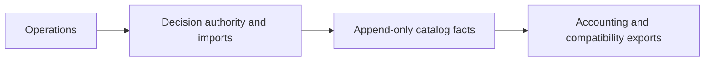

# Ledger architecture

## Purpose
Layer 6 of the [root architecture](../../../ARCHITECTURE.md): append-only prediction and position facts, compatibility exports, and catalog-backed accounting.

## Primary contracts and public interfaces
`decisions` exposes installation, authority changes, insertion, reads, and exact-byte history imports as listed in the [package README](README.md). `export_generation` publishes compatibility generations. `status`, `calibration`, and `portfolio` project committed catalog facts for operations callers.

## Inputs
Decision payloads and validation metadata, legacy JSONL bytes with source/line identity, committed catalog rows, and calibration artifacts.

## Outputs
Decision receipts, retained import provenance, divergence evidence, compatibility generations, accounting summaries, and calibration reports/health artifacts.

## Dependencies
Contracts and foundation supply artifact types, clocks, serialization, hashing, and filesystem helpers. `legacy_adapter` calls legacy ledger/portfolio accounting; operations commits decisions and consumes the projections.

## External systems and libraries
SQLite catalog tables, the artifact store and filesystem, and pandas accounting frames. No provider requests originate here.

## Failure semantics
| Condition | Outcome |
|---|---|
| Missing legacy row or outcome observation identity | Refuse with `DecisionConflict`; no substitute identity |
| Exact source/line retry | Return the committed receipt; changed bytes at that source/line refuse in both conflict modes |
| Identical committed content under another purpose | Return the authoritative receipt without new decision, provenance, or divergence rows, even after a prior divergent import |
| Differing imported content | Default mode refuses; `on_conflict="diverge"` retains durable evidence and provenance without rewriting the decision |
| Conflicting direct insert | Refuse with `IDEMPOTENCY_CONFLICT`; import-specific reuse does not relax writer checks |
| Decision write or partial import | Caller owns authority and transaction; rollback discards writes within that transaction |

## Invariants
First-commit authority is immutable. Corrections append; historical imports are never relabelled as newly validated decisions. Outcome observations retain separate identities; catalog accounting reads committed facts.

## Diagrams

