# `engine/v2/models` — architecture

See the root [`ARCHITECTURE.md`](../../../ARCHITECTURE.md) for the layer
table and enforced import direction. This doc follows
`docs/COMPONENT_ARCHITECTURE_TEMPLATE.md`'s section order.

## 1. Purpose

Layer 3.0 (root doc §2). Replaces legacy `models/registry.py` and the
inline artifact/inference plumbing scattered through `engine/score.py`.
This package owns four things:

- **Contracts** (`contracts.py`) — the immutable shapes a frozen release is
  made of (`ModelBinding`, `ModelRelease`, `ArtifactMember`) and the
  inference call/response pair (`InferenceRequest`, `InferenceResult`,
  `PredictionFrame`). Schemas only: no logic, no I/O.
- **Verified loading and inference** (`adapters.py`, `loader.py`) — the
  adapters that turn a hash-verified member's bytes into a read-only
  predictor, and `FrozenInference`, the one class that runs a request
  through them. Never fits anything (`RuntimeFitForbidden`,
  `ReadOnlyArtifact` block every mutating estimator method by name).
- **Release completeness and today's real inventory** (`releases.py`,
  `inventory.py`) — the abstract "is this release complete" contract, and
  the concrete answer for what is on disk right now (`current_release_inventory`
  reads `data/models/*` and the champion registry; it never hand-writes
  `registry.json`).
- **Frozen non-model serving state** (`admissible_table.py`,
  `analog_artifact.py`, `chooser_analog_pool.py`, `payoff_artifact.py`,
  `recalibration_artifact.py`, `residual_artifact.py`,
  `trailing_cutoff_artifact.py`, dispatched through `frozen_state.py`,
  released through `frozen_release.py`, invalidated through `lineage.py`) —
  the frozen-artifact answer to every piece of calibration state legacy
  used to recompute live from an unversioned file or in-process cache. Each
  is an immutable, content-hashed record with a verified loader; none of
  them are models, so none of them go through `adapters.py`/`loader.py`.
- **Content-addressed staging and the deployment pointer**
  (`deployment.py`) — the durable store a `ModelRelease` is staged into
  once it passes completeness, and the one atomic pointer (`DEPLOYED`)
  that names which staged release is live.

`engine/v2/models/training/` (layer 6.0) is the *only* place any of this
gets fit — see its own package doc reference in the root index. Nothing in
`engine/v2/models` reads a live panel, calls `.fit()`, or writes
`registry.json`.

An automated nightly append cycle for the pool/residual/cutoff artifacts:
design only, not yet implemented — see #192.

## 2. Primary contracts and public interfaces

The full list is `README.md`'s `<!-- public-interface: ... -->` directive
(machine-checked by `checks/package_readmes.py`); the deployment surface:

- `deployment.stage_release(root, release, inventory, payloads, *, clock) -> StagedManifest`
  — validate, then durably stage. Never touches `DEPLOYED`.
- `deployment.promote(root, release_id, *, clock) -> PointerState` /
  `deployment.rollback(root, *, clock) -> PointerState` — the one atomic
  pointer swap, in either direction.
- `deployment.resolve_release(root, release_id) -> ModelRelease` /
  `deployment.current_release(root) -> ModelRelease | None` — read a staged
  release by id, or by the live pointer.
- `deployment.production_release_root() -> Path` — the one configured
  production STORE root; see §7.4.
- `deployment.production_deployment_root() -> Path` —
  `production_release_root() / "deployment"`, the directory this module's
  own root-taking functions actually want; see §7.4.
- `deployment.restage_semantic_hash(root, release_id) -> StagedManifest`
  — rewrite an already-staged manifest's hash to the current semantic
  version, in place, with no retraining; see §7.5.
- `deployment.mark_staging_succeeded(root, release_id) -> None`
  — after the Phase 5 acceptance gate passes, atomically record success for
  the exact staged `release_id` and `release_hash`; see §7.2.
- `release_bindings.resolve_release_binding(release_root) -> ScoringReleaseBinding`
  and `release_bindings.resolve_production_release_binding() -> ScoringReleaseBinding`
  live in `engine/v2/scoring/` (layer 5.0, below `models` — this package
  does not import scoring); they are the production readers of what this
  package stages. Documented in full in
  `engine/v2/scoring/ARCHITECTURE.md`'s `release_bindings.py` section.

Every model-binding/frozen-state member and its adapter is reached only
through the loader for its family (`FrozenInference` for models,
`FrozenStateLoader`/`PayoffArtifactLoader`/`RecalibrationArtifactLoader` for
non-model state) — never by opening a staged object file directly outside
`deployment.py`'s own hash verification.

`carry_forward_release`, `derive_catalog`: design only, not yet
implemented — see #192.

## 3. Inputs

**Forward serving-fold contract.** Offline descriptor authoring is described
below; verified loading is defined in 6d-2 below, while selection and scoring
integration remain design only.
Monthly folds
are separate from the full-refit champion bindings. A `ServingFoldRef`
identifies one release-owned `tier4_folds:size` estimator object, its model,
feature order, output, month start, full Tier-3 panel byte hash and declared
interval policy. Its held-out prediction/residual arrays belong to that same
object. Offline release preparation records this metadata in the hashed state
catalog; a read-only loader verifies it against bounded, hash-checked bytes.
Existing catalogs without this declaration require offline restaging, not a
nightly fit or a guessed interval policy. The initial contract covers size
folds for STR-THRU gate features only, not other forecast families.

Selection uses the exact earlier of the event month and decision month,
the registered size model and feature order, and the pinned panel byte hash.
It never chooses the newest available fold or substitutes a full-refit model.
The panel hash comes from the already-pinned snapshot's single original
`feature_panel` object; an unsupported multi-fragment layout is refused.
Snapshot ID, dataset version and panel byte hash remain distinct identities.
Selection returns a separate content-addressed, single-binding inference view
linked to its parent release and descriptor; it does not mutate or promote the
champion `ModelRelease`. The existing `tier4-serving-fold.v1` adapter executes
that binding through `FrozenInference`; no second prediction engine is added.

| Forward fold condition | Outcome |
|---|---|
| Exact model/month/panel match, verified metadata and pool | Return immutable selected fold and provenance |
| Missing, duplicate, future, wrong-panel or incompatible fold | `MODEL_NOT_READY`; no older-model or training fallback |
| Corrupt, oversized, escaped-path or header/descriptor mismatch | `MODEL_NOT_READY` before inference; redact filesystem details |
| Old cache lacks held-out pool or declared interval policy | Refuse; never rebuild the pool during scoring |

**Offline descriptor authoring (6d-1).** `ServingFoldDescriptor` in
`serving_folds.py` is an immutable typed document under each size fold catalog
object. It records parent release/model-manifest identity, model, ordered
features, output/clock, exact month, full panel SHA-256, estimator member,
embedded pool fields/count and explicit interval policy. The enclosing catalog
hash binds catalog identity without a self-reference inside the descriptor.
`tools.phase5_prepare_release` obtains `SizeFoldPolicy` from the registered size
producer; `tools.phase5_serving_folds` validates bounded cache bytes and emits
metadata before catalog publication. No fitting or inference occurs here.

| Offline authoring condition | Outcome |
|---|---|
| Explicit policy and coherent size cache | Emit descriptor covered by the catalog self-hash; repeat inputs yield identical metadata |
| Header/model/features/full panel/month disagreement, missing or malformed pool, oversized bytes | Refuse publication; never infer metadata from a filename prefix alone |
| No explicit policy in a programmatic legacy caller | Preserve the existing catalog shape; it cannot supply the future fold path |
| Other fold roles | Keep existing opaque catalog objects; this descriptor contract covers size only |
| Failed preparation | No deployment-pointer changes; ordinary staging may leave unreferenced files; retry is permitted |
| Cache | Authoring validates each supplied object anew; no process-global descriptor cache |

**Pinned offline COPY authoring.** `tools.phase5_prepare_release` accepts an
explicit committed snapshot/catalog and artifact-store context. Existing size
descriptors are checked against its one verified original `feature_panel`
object, full byte hash and registered release binding/policy. Snapshot, dataset
version, object and hash remain distinct identities. The manifest carries an
explicit pinned COPY claim; legacy unpinned callers cannot emit that claim.
Preflight and staging consume the same immutable bounded cache bytes. Publication
verifies stored cache bytes against the preflight hash and refuses disagreement;
panel identity is reverified at authoring. Snapshot, cache and policy checks
precede output creation, plan writing, incumbent copy and staging. No fitting,
pool recreation or live-panel fallback occurs in pinned mode.

| Pinned authoring condition | Outcome |
|---|---|
| Verified original panel and matching bounded size cache/policy | Author COPY-consistent descriptor with separate pinned identities |
| Missing/substituted snapshot/object, unsupported layout, corrupt input bytes or policy/header/model/features/output/clock/month disagreement | Refuse before output effects or staging |
| Published destination bytes disagree with the preflight hash | Refuse descriptor/catalog publication; never repair or relabel |
| Equivalent-row rewrite with different bytes | Cannot reuse the old full-hash fold declaration |
| Complete preparation or corrected-source REBUILD assertion without genuine producer evidence | Refuse stronger claim; COPY remains byte/policy consistency only |
| No pinned context | Preserve legacy behavior without a pinned claim |

Cache headers, self-hashed caller assertions and import receipts do not prove
actual training reads. Complete preparation evidence requires independently
verified producer/source-read/output causality; current imported caches lack it.
Training frame-value, membership and label receipts do not supply that proof.

**Verified serving-fold ownership (6d-2).** `load_serving_fold` validates one
descriptor against a verified parent manifest and catalog identity, returning
a `ServingFoldRef` with immutable metadata/pools, its shared `FrozenInference`
owner and an ephemeral single-binding inference view. The view identity binds
parent, catalog and descriptor; it is never staged or promoted. Selection,
catalog discovery and source-bundle wiring remain separate work.

`FrozenInference` owns the only decoded-artifact cache. Its existing adapter
retains fold metadata with the estimator, so validation and prediction share
one decode. Each cache entry may also own a byte ceiling established by bounded
preparation; subsequent cold/warm verification cannot relax that ceiling.
Legacy entries without a ceiling retain their existing behavior. Prediction
still uses `Tier4ServingFoldAdapter` through the existing inference executors.

| Verified fold condition | Outcome |
|---|---|
| Parent/catalog/descriptor/header or embedded-pool disagreement | `MODEL_NOT_READY`; fixed path-free refusal, no inference or fallback |
| Escaped path, missing/corrupt bytes or object above 32 MiB | Refuse before deserialization, including warm reads through the shared owner |
| Repeated preparation and inference on the same owner/object | Reverify bytes; reuse the decoded artifact, never a second model cache |
| Different current panel bytes or multi-fragment layout | No equivalence is inferred here; selector availability/provenance contract remains a prerequisite |

- **`current_release_inventory` (`inventory.py`)**: the champion registry
  (`engine.models.registry`) and the real files under `data/models/*` —
  content hashes, never values.
- **`deployment.stage_release`**: a caller-built `ModelRelease` +
  `ModelReleaseInventory` (already validated against each other by every
  training/preparation tool) plus a `{content_hash: bytes}` payload map for
  every member across every binding. The inventory is validation-only and
  is never persisted: `resolve_release` and every scoring reader return
  only the `ModelRelease`, so each `stage_release` call needs a freshly
  built, freshly validated inventory.
- **`deployment.promote`/`rollback`/`resolve_release`/`current_release`**:
  a `release_id` and this module's own `deployment/` root — they read only
  what `stage_release` and earlier promotions already wrote under that
  root, never a live panel, a request, or anything outside the store.
- **`deployment.production_release_root`**: the `MODEL_RELEASE_ROOT`
  environment variable — the store root, one level ABOVE the
  `deployment/` directory this module's own functions take as `root`.
  `production_deployment_root` (§7.4) is `production_release_root() /
  "deployment"` — what a caller of THIS module's own functions wants.
- **`deployment.restage_semantic_hash`**: the target `release_id`'s
  already-staged manifest (read once, verified under its own declared
  hash version before anything is trusted) — no payload bytes, no
  training/evaluation artifact.

## 4. Outputs

- **`stage_release`**: content-addressed objects under
  `<root>/objects/<hash>` (write-once; an existing object with the same
  hash is never rewritten) and one immutable `manifest.json` per
  `release_id` under `<root>/releases/<release_id>/`.
- **`promote`/`rollback`**: the single `DEPLOYED` pointer file (atomic
  temp-write + `fsync` + `os.replace` + `fsync(dir)`, so a crash leaves
  either the old pointer or the new one, never a partial file) and one new,
  append-only, sequence-numbered file under `<root>/history/`.
- **`restage_semantic_hash`**: rewrites exactly one file,
  `<root>/releases/<release_id>/manifest.json`, atomically, in place. No
  other file under the release store is ever touched by this function.
- Every non-model frozen-state builder (`training/residuals.py`,
  `training/chooser_pool.py`, …) returns an immutable dataclass; the
  release/state catalog (`phase5_release.json`) is owned by
  `checks/phase5_release.py` and stored beside each release manifest.
  The release-root copy selects the last staged candidate for existing
  tooling; it is not authority for a different deployed release.

## 5. Dependencies

Imports only layers 0.0–2.0 (`contracts`, `foundation`, `data`, `features`)
per the root doc's layer table; `checks/import_layers.py` enforces this.
`deployment.py` additionally imports nothing outside this package and
`engine.v2.foundation` (`Clock`, `SystemClock`, `content_hash`,
`format_timestamp`, `from_document`, `fsync_directory`, `to_document`).

**Callers** (real import edges, `from engine.v2.models import ...` /
`from engine.v2.models import deployment`, checked against `README.md`'s
`<!-- consumers: ... -->` directive):

- `engine.v2.scoring` — the verified frozen inference contract/loader for
  the model stage, the payoff-calibration artifact type, and
  `release_bindings.py`'s reads of `deployment.current_pointer`,
  `deployment._read_manifest`, `deployment._manifest_hash_matches`,
  `deployment.production_release_root`, and `deployment.MissingReleaseRoot`.
- `engine.v2.models.training` — the same artifact types, to build one from
  causal source rows; never imported *by* this package (one-way).
- `engine.v2.ops` — `engine/v2/ops/cli.py` (the no-fit guard for `ops
  rescore`) and `engine/v2/ops/training.py` (`deployment.promote` from the
  `models_promote` job worker, and `deployment.
  production_deployment_root`/`deployment.MissingReleaseRoot` from
  `promote_plan` — NOT `production_release_root` directly: `promote_plan`
  hands its resolved value straight to `deployment.promote`, which takes
  the `deployment/` directory itself as `root`). Neither `nightly.py`,
  `worker.py` nor `stages.py` import this package's deployment surface
  directly.
- `engine.v2.serving` — `engine/v2/serving/operations.py` reads the
  deployment pointer read-only (`current_pointer`, `resolve_release`) to
  serve `/models/release.json`; never promotes.
- `tools/phase5_prepare_release.py`, `tools/phase5_inventory.py` (not v2
  packages) — the release-preparation and inventory CLIs.

## 6. External systems and libraries

A local filesystem tree only (the release store root —§7.4's env-configured
key names it for production). No network, no database, no third-party
service. `hashlib.sha256` for every content hash; `os.fsync`/`os.replace`
for the pointer's crash-proof write.

## 7. Failure semantics

### 7.1 `stage_release`

| Condition | Outcome |
|---|---|
| Inventory itself is incomplete (`releases.require_complete_release`) | Refuses `ModelReleaseRefusal`, before anything else runs |
| Inventory is complete, but the inference release doesn't match it (role/strategy/clock binding, feature order, a required member kind missing) | Refuses `StagingRefused`, before any byte is written |
| Missing payload for a declared member, or a payload whose sha256 disagrees with its declared `content_hash` | Refuses `StagingRefused` (`MISSING_MEMBER_PAYLOAD` / `PAYLOAD_HASH_MISMATCH`) |
| Two inference bindings declare the same `(role, strategy_id)` | Refuses `StagingRefused` (`DUPLICATE_BINDING`) — the key is deliberately clock-independent, matching `scoring.release_bindings`'s own ambiguity key; without this a release could stage cleanly yet make every score for that role/strategy fail at read time |
| Caching | None: every call re-derives the release hash and re-checks every member from the caller's arguments |
| Same `release_id`, identical content, restaged | Idempotent no-op: returns the existing manifest byte-for-byte, including its original hash version (never silently upgraded) |
| Same `release_id`, different content | Refuses `RELEASE_ID_REUSED` |
| Same `release_id` already staged, but its manifest cannot be read or parsed | Refuses `StagingRefused` (`MANIFEST_UNREADABLE`) instead of a bare decode error (issue #207) |
| Crash mid-staging | Some content-addressed objects may be left on disk (harmless — addressed by their own hash, reused or ignored later) and no manifest, so the release is not staged |
| Every write | Atomic (temp + fsync + rename); never a half-written manifest or object |
| Idempotency | Same `(release, inventory, payloads)` always produces the same staged manifest |

### 7.2 `promote` / `rollback`

Both go through `_swap_pointer`, which re-validates the target release
independently of whatever staged it.

| Condition | Outcome |
|---|---|
| Unstaged `release_id` | Refuses `ReleaseNotStaged` |
| Staged manifest without a durable successful staging-completion record bound to that exact `release_id` and `release_hash` | Refuses typed, non-retryable `StagingNotSuccessful` before pointer/history writes; leaves the staged manifest and objects intact and creates no partial deployment state. A retry is permitted only after the staging workflow has completed all post-stage checks and published its matching success record |
| Target manifest cannot be read or parsed | Refuses `StagingRefused` (`MANIFEST_UNREADABLE`) instead of a bare decode error (issue #207), checked before the hash-version check below |
| Target's staged `release_hash_version` is not the current semantic version | Refuses `StaleReleaseHash`, checked before anything else — including re-promoting the currently live release, if it is itself stale. `restage_semantic_hash` (§7.5) is the only way to clear this; never automatic |
| Target manifest's recomputed content hash disagrees with its declared `release_hash` | Refuses `CorruptManifest`, before the pointer moves |
| Target manifest declares two bindings for the same `(role, strategy_id)` | Refuses `StagingRefused` (`DUPLICATE_BINDING`) — re-verified independent of `stage_release`'s own check, in case a release predates it or was staged by another path |
| Caching | None: `current_pointer`/the manifest are re-read from disk on every call |
| `promote` on the already-live `release_id` | No-op: returns the existing `PointerState`, never a new one |
| `rollback` with fewer than two ids left after replaying pointer history as a promote/rollback undo stack | Refuses `NoPriorRelease` |
| `rollback` target | The second-from-top id of that replayed stack (push on every `promote`, pop on every `rollback`) — never the live pointer's own `previous_release_id` field. This makes N chained rollbacks undo N chained promotions and never revisit a release just left |
| Recorded pointer history unreadable, its sequence numbers aren't the contiguous range `0..len(history)-1`, or its replayed top disagrees with what `DEPLOYED` names | `rollback` refuses `StagingRefused` (`HISTORY_UNREADABLE` / `HISTORY_SEQUENCE_GAP` / `HISTORY_INCONSISTENT`) rather than guess a target |
| Pointer write | Atomic; a crash leaves `DEPLOYED` as either the old value or the fully-written new one, never partial |
| Crash after the pointer write but before its history entry is appended | Self-healing: the next call re-derives the missing entry from the live pointer before acting, so the undo stack is never shifted |
| Repeated promote of the same id | Exactly one no-op, not two history entries |

`promote`'s optional `expected_previous_release_id` guard: design only, not
yet implemented — see #192, #137.

#### `mark_staging_succeeded`

This record is separate from the immutable model manifest. `stage_release`
may leave a manifest behind when later Phase 5 work fails, so staging alone
never writes a success record. `checks/phase5_acceptance.py` publishes the
record only after its evidence and report are complete and every release
subject passes (`RELEASE_PASS` without a Phase 4 corpus, or `PASS` with one).
The rollback rehearsal copies any incumbent record with the durable release
store and never invents incumbent success in scratch. If a live legacy
incumbent has no record, rollback refuses `P5_ROLLBACK_REFUSED`; acceptance
returns `FAIL` (exit 1) non-retryably for that run and leaves the candidate
unmarked, the live pointer and history unchanged, and the incumbent without a
record. Retrying with the same store state repeats the refusal; a separate
evidence-backed migration is required (follow-up #416). An existing failed,
malformed, or stale record is also refused and never overwritten.
Prior pointer/history entries or a manifest hash alone cannot prove staging
success, so no success status is inferred from them. Candidate success is
published only after its complete evidence and report pass. The candidate's
temporary success record in its rollback probe stays in the scratch copy.

| Condition | Outcome |
|---|---|
| No manifest under `release_id` | `mark_staging_succeeded` refuses `ReleaseNotStaged` |
| Manifest unreadable, path identity differs, or its content hash is invalid | Refuses `StagingRefused` (`MANIFEST_UNREADABLE` / `RELEASE_ID_MISMATCH`) or `CorruptManifest`; writes no success record |
| Valid manifest; success record write fails | Refuses `StagingRefused` (`STATUS_UNWRITABLE`); no deployment pointer/history is changed and no partial success record is accepted |
| Valid manifest and atomic status write succeeds | Writes exactly `release_id`, `release_hash`, and `state: succeeded` to `staging-status.json` beside that manifest |
| Same manifest marked again | Idempotent: writes the same record |
| Manifest hash changes after marking, including `restage_semantic_hash` | Existing record is stale; complete acceptance again and record the new hash before promotion or rollback |
| Live incumbent staged before status records existed | Rollback refuses `P5_ROLLBACK_REFUSED`; acceptance leaves the candidate unmarked and deployment pointer/history unchanged |
| Release staged before status records existed, or incumbent with an existing invalid/failed/stale record | Remains ineligible; no automatic backfill or overwrite from a pointer/history entry or manifest hash alone, because neither proves successful staging |

### 7.3 `resolve_release` / `current_release` (read-only)

| Condition | Outcome |
|---|---|
| Unstaged `release_id` | `resolve_release` refuses `ReleaseNotStaged` |
| Staged manifest cannot be read or parsed | Both refuse `StagingRefused` (`MANIFEST_UNREADABLE`) instead of a bare decode error (issue #207) — `current_release` inherits this from its own call to `resolve_release` |
| Release staged under a superseded hash version (legacy) | Still resolves — replay of a score already recorded against it must never become unreplayable. Only the write path (§7.2) enforces the current hash version |
| No live pointer | `current_release` returns `None` |
| Caching, retry, transaction, partial write | None of these apply: read-only, no cache, nothing to retry, no write |
| Idempotency | Same `release_id` always resolves the same `ModelRelease` (a staged manifest is immutable once written) |

### 7.4 `production_release_root` / `production_deployment_root`

Both share one `MODEL_RELEASE_ROOT` environment variable;
`production_deployment_root` is `production_release_root() / "deployment"`.

| Condition | Outcome |
|---|---|
| `MODEL_RELEASE_ROOT` unset or blank | Refuses `MissingReleaseRoot` — no fallback to a repo-relative or other default path: this is the one config key naming "which release root is production" |
| Set | Read fresh from the environment on every call (never cached), then resolved via `Path.expanduser().resolve()` — this touches the filesystem to normalize the path (symlink resolution) and, for a relative `MODEL_RELEASE_ROOT` value, resolves it against the current working directory |
| Retry, transaction, partial write | Not applicable: this is a read and a path computation, not a write |

### 7.5 `restage_semantic_hash`

| Condition | Outcome |
|---|---|
| Nothing staged under `release_id` | Refuses `ReleaseNotStaged` |
| Existing manifest cannot be read or parsed | Refuses `StagingRefused` (`MANIFEST_UNREADABLE`) |
| Existing manifest at this path declares a different `release_id` | Refuses `StagingRefused` (`RELEASE_ID_MISMATCH`) — checked before the hash check below |
| Existing manifest fails verification under its own declared hash version | Refuses `StagingRefused` (`RELEASE_ID_REUSED`, the same code `stage_release` uses) — a corrupt manifest is never a starting point for a rewrite |
| Already at the current semantic hash version | No-op: returns unchanged |
| Legacy (member-only) manifest | Its own verification covers `release_id` and every member's `content_hash`, not `adapter`/`feature_order`/`output_names`; the semantic hash this call writes covers all of them going forward, not retroactively |
| Write | One atomic rewrite of `manifest.json` only; nothing else under the release store is touched |
| Existing staging-success record | If the rewrite changes `release_hash`, the old record no longer matches and promotion/rollback refuse; rerun Phase 5 acceptance and record success for the new hash |
| Idempotency | Same starting manifest always produces the same rewritten manifest; a second call hits the "already at current version" no-op above |

### 7.6 Phase-5 state catalogs (staging-tool ownership)

Catalogs live at `<release_root>/deployment/releases/<release_id>/phase5_release.json`.
Release IDs are validated before path construction; preservation requires
a matching, hash-verified staged model manifest.
`checks.phase5_release.read_manifest` selects a candidate using the root copy;
production scoring instead selects the release named by `DEPLOYED`.

| Condition | Outcome |
|---|---|
| Selected release-local catalog exists | It is authoritative; schema, self-hash and release identity must validate |
| Cache | `checks.phase5_release.read_manifest` and `scoring.release_bindings._read_state_catalog` reload and revalidate catalogs on every call; no catalog data is cached |
| Release-local catalog absent | A valid legacy root catalog is usable only for its own matching release ID; reads do not migrate files |
| Local catalog corrupt or unreadable | Refuse; never fall back to a valid root copy |
| Replacing the root candidate or copying a legacy incumbent | Preserve its valid catalog under its own release ID; validate and retain any existing local catalog over a stale root copy; refuse bad or unresolvable inputs; incumbent validation is read-only and precedes copying |
| Catalog publication interrupted | Individual files are replaced atomically; staged files may remain, but deployment pointers are untouched; retries may repeat completed writes; concurrent writers have no safety guarantee |
| Repeated staging under one release ID | Existing rewrite semantics remain; different release IDs retain separate catalogs |
| Historical catalog was already overwritten before migration | It cannot be recovered from a model manifest; rebuilding that catalog is required |

## 8. Invariants

- **A detected validation issue → typed refusal, never a silent default**
  (root doc §5), scoped to `deployment.py`'s own explicit checks: duplicate
  bindings, payload hash mismatches, a stale or corrupt manifest hash, an
  unparseable manifest, and a broken pointer history each raise a
  `DeploymentError` subclass, never a substituted value. Every call to the
  shared `_read_manifest` helper — from `stage_release`'s re-stage check,
  `_swap_pointer` (`promote`/`rollback`), `resolve_release`, and
  `restage_semantic_hash` — wraps the read in the same
  `except (OSError, ValueError)` and refuses `StagingRefused`
  (`MANIFEST_UNREADABLE`), so a corrupt or undecodable manifest.json on
  disk can never leak a bare `json.JSONDecodeError`/`DocumentError` out of
  any of them (issue #207, closed). An incomplete inventory raises
  `releases.require_complete_release`'s own `ModelReleaseRefusal`, not a
  `DeploymentError`; and `FrozenInference` (`loader.py`) reports every
  refusal it detects through a typed `InferenceResult` with
  `status=MODEL_NOT_READY`, never a raised exception.
- **A hash mismatch never falls back.** No branch anywhere in this package
  substitutes a different object, an older cached value, or a default when
  a content hash disagrees — including the pointer swap itself:
  `promote`/`rollback` recompute and check the manifest hash, not only its
  version tag, before `DEPLOYED` moves.
- **A rollback undoes exactly one promotion.** `rollback`'s target is
  derived by replaying the full pointer history as a stack, never by
  reading a single `previous_release_id` field off the live pointer — so
  chained rollbacks walk chained promotions backward and never revisit a
  release they just left.
- **A staged release covers every inventory binding exactly once.**
  `stage_release` refuses a second inference binding for a `(role,
  strategy_id)` pair already seen in the same release — the same key
  `scoring.release_bindings` resolves by, clock-independent — so it never
  accepts a binding set scoring itself would call ambiguous.
- **Never fits anything.** `RuntimeFitForbidden`/`ReadOnlyArtifact`
  (adapters/loader) and `no_fit.py`'s guard (reused by
  `engine.v2.scoring.native_payoff`) are this package's enforcement of the
  root doc's layering rule that only `engine/v2/models/training` (layer
  6.0) ever calls `.fit()`.
- **Staged content is immutable; only the pointer moves.** A staged
  manifest is written once and never mutated by a later promotion,
  rollback, or a `restage_semantic_hash` upgrade of a DIFFERENT release —
  `restage_semantic_hash` rewrites ONLY the one manifest it targets, and
  only its `release_hash`/`release_hash_version` fields.
- **Deployment requires the current hash version; replay does not.**
  `promote`/`rollback` refuse a stale-hashed release; `resolve_release`/
  `current_release` and every checker that calls `_manifest_hash_matches`
  continue to accept a verified legacy manifest — deliberately different
  rules for deliberately different questions ("is this safe to make live"
  vs. "is this the release a past score actually used").
- **Driver residual pool artifacts use `(role, model_id, fold)` keys and
  content-hashed payloads.**

## 9. Diagrams

```mermaid
stateDiagram-v2
    [*] --> Staged: stage_release()\n(RELEASE_HASH_SEMANTIC_V2 always)
    Staged --> Staged: restage_semantic_hash()\n(legacy manifest -> v2, no-op if already v2)
    Staged --> Deployed: promote()\nrefuses StaleReleaseHash\nunless hash_version == v2\nrefuses CorruptManifest\nif the manifest hash disagrees
    Deployed --> Deployed: promote() same id (no-op)
    Deployed --> Deployed: rollback()\ntarget = 2nd-from-top of the\nreplayed promote/rollback stack\nrefuses StaleReleaseHash/CorruptManifest\non the target release too
    Staged --> [*]: resolve_release()\n(read-only, by id; accepts legacy or current hash version)
    Deployed --> [*]: current_release()\n(follows DEPLOYED; None if unset)
```



```mermaid
flowchart LR
    ENV["MODEL_RELEASE_ROOT\n(environment variable)"] --> PRR["deployment.production_release_root()"]
    PRR -->|"set"| ROOT["release STORE root"]
    PRR -->|"unset/blank"| MRR["MissingReleaseRoot"]
    ROOT --> RB["release_bindings.resolve_production_release_binding()\n(adds deployment/ itself)"]
    ROOT --> PDR["deployment.production_deployment_root()\n(= root / \"deployment\")"]
    PDR --> PP["training.promote_plan()\n(only when --release-root is omitted)"]
    MRR --> RBERR["ModelNotReady('release_root', ...)"]
    MRR --> PPERR["OpsError INVALID_REQUEST"]
```
