# `engine/v2/models` — architecture

See the root [`ARCHITECTURE.md`](../../../ARCHITECTURE.md) for the layer
table and enforced import direction. This doc follows
`docs/COMPONENT_ARCHITECTURE_TEMPLATE.md`'s section order.

## 1. Purpose

Layer 3.0 (root doc §2). Replaces legacy `models/registry.py` and the
inline artifact/inference plumbing scattered through `engine/score.py`.
This package owns four things:

- **Contracts** (`contracts.py`) — the immutable shapes a frozen release is
  made of (`ModelBinding`, `ModelRelease`, `ArtifactMember`) and the
  inference call/response pair (`InferenceRequest`, `InferenceResult`,
  `PredictionFrame`). Schemas only: no logic, no I/O.
- **Verified loading and inference** (`adapters.py`, `loader.py`) — the
  adapters that turn a hash-verified member's bytes into a read-only
  predictor, and `FrozenInference`, the one class that runs a request
  through them. Never fits anything (`RuntimeFitForbidden`,
  `ReadOnlyArtifact` block every mutating estimator method by name).
- **Release completeness and today's real inventory** (`releases.py`,
  `inventory.py`) — the abstract "is this release complete" contract, and
  the concrete answer for what is on disk right now (`current_release_inventory`
  reads `data/models/*` and the champion registry; it never hand-writes
  `registry.json`).
- **Frozen non-model serving state** (`admissible_table.py`,
  `analog_artifact.py`, `chooser_analog_pool.py`, `payoff_artifact.py`,
  `recalibration_artifact.py`, `residual_artifact.py`,
  `trailing_cutoff_artifact.py`, dispatched through `frozen_state.py`,
  released through `frozen_release.py`, invalidated through `lineage.py`) —
  P5-4's frozen-artifact answer to every piece of calibration state legacy
  used to recompute live from an unversioned file or in-process cache. Each
  is an immutable, content-hashed record with a verified loader; none of
  them are models, so none of them go through `adapters.py`/`loader.py`.
- **Content-addressed staging and the deployment pointer**
  (`deployment.py`, P5-5) — the durable store a `ModelRelease` is staged
  into once it passes completeness, and the one atomic pointer
  (`DEPLOYED`) that names which staged release is live. This is the module
  this PR changes; see §7 below for the full contract.

`engine/v2/models/training/` (layer 6.0) is the *only* place any of this
gets fit — see its own package doc reference in the root index. Nothing in
`engine/v2/models` reads a live panel, calls `.fit()`, or writes
`registry.json`.

**Nightly refresh (design, cutover PR-13a — proposed, not yet implemented;
scope: appending newly-settled events, never retraining).** Seven pieces of
serving-time state each have a live legacy equivalent legacy recomputes
in-process on every scoring run (`inventory.py`'s "What is NOT in the
release" note): the board-analog population, the chooser-analog pool, three
driver residual pools (`size`/`implied_t1`/`runup_move`), the paired
residual pool, and the trailing entry-rule cutoff. This design advances all
seven nightly, though for three of them (the driver residual pools) "advance"
means re-verify against the current champion, not append new events — see
§8's finding on why. All seven already have a native, content-hashed artifact
type in this package (`analog_artifact.py`, `chooser_analog_pool.py`,
`residual_artifact.py`, `trailing_cutoff_artifact.py`), and SIX of the seven
already have an existing, already-submittable `training` job kind that
builds them (`engine/v2/ops/training.py`'s `MODES = ("recipe", "state",
"board_analog", "trailing_cutoff")`; `tools/phase5_training_job.py`'s
`STATES` names exactly those six, `driver_residual_pool:size` through
`trailing_pnl_cutoff`). The chooser pool is the one exception: it is built
inline from `data/features/chooser_analog_pool.parquet`, not from a
training job; see `engine/v2/ops/ARCHITECTURE.md`'s "Native nightly
pool/residual refresh". Nothing resubmits any of these on a cadence today — "the only
path that creates one is a `submit` an operator ran by hand"
(`run_promote_worker`'s own docstring, which is equally true of `training`).
This design's own new code is entirely on the STATE side —
`deployment.derive_catalog` (§2/§7.7 — moved here from `checks/
phase5_release.py`; see §4's revised note) — plus one small, new MODEL-
side primitive, `deployment.carry_forward_release` (§2/§7.6), because the
nightly cycle never changes a `ModelBinding` at all (that is cutover PR-13b's
monthly retrain).

**Why nightly does not, and must not, call `require_complete_release`'s
inventory machinery (root-caused, not assumed — this closes a gap #90's
combined design left open across 3 Opus gate rounds).** `stage_release`
requires a full `ModelReleaseInventory` to validate a `ModelRelease` against
(`deployment.py:287`, `_compatibility_issues`), but a staged release never
saves one: `StagedManifest` (`deployment.py:189-197`) holds only `release:
ModelRelease`, `release_hash`, `staged_at`. The only function that builds a
`ModelReleaseInventory` today, `current_release_inventory` (`inventory.py`),
reads it fresh from the legacy champion registry (`engine.models.registry`)
and `data/models/*` every time — it is not, and cannot be, "the prior
release's inventory, carried over": `ModelReleaseInventory` carries fields
(`releases.py`) a `ModelRelease`/`ModelBinding` (`contracts.py`) does not
have at all — `strategy_ids` (plural, with a `"*"` wildcard),
`compatible_clock_ids`, `target_contract_ref`, `upstream_artifact_ids`,
`evidence_refs` per artifact, and `known_clock_ids`/`requirements`/
`artifact_manifest_ref`/`evidence_refs`/`promotion_receipt_ref` at the
release level — none of them round-trip through a `ModelRelease`, so there
is no way to reconstruct one from what IS persisted. The resolution is not
to solve that reconstruction problem (cutover PR-13b's monthly retrain still
must, since it genuinely changes bindings and needs real inventory
validation against the new artifacts) — it is to notice that
`ModelReleaseInventory` is pure, discarded VALIDATION input: `resolve_release`
and every scoring reader return only the persisted `ModelRelease`, never the
inventory, so re-validating a set of bindings that provably has not changed
adds nothing a byte-for-byte copy does not already guarantee. §7.6 below
specifies `carry_forward_release`: it copies the prior release's own already-
staged, already-once-validated `manifest.json` verbatim (only `release_id`
differs) into a new release id, with no inventory argument, and refuses if
any binding it is about to carry forward is not the one already staged for
the prior release (so a monthly retrain that landed concurrently can never
be silently dropped).

## 2. Primary contracts and public interfaces

The full list is `README.md`'s `<!-- public-interface: ... -->` directive
(machine-checked by `checks/package_readmes.py`); the names that matter for
this PR:

- `deployment.stage_release(root, release, inventory, payloads, *, clock) -> StagedManifest`
  — validate, then durably stage. Never touches `DEPLOYED`.
- `deployment.promote(root, release_id, *, expected_previous_release_id=None,
  clock) -> PointerState` /
  `deployment.rollback(root, *, clock) -> PointerState` — the one atomic
  pointer swap, in either direction. `expected_previous_release_id`
  **(proposed, cutover PR-13a design, not yet implemented; optional,
  defaults to `None` — every existing caller unchanged)** — see §7.2's
  "Further extension" note.
- `deployment.resolve_release(root, release_id) -> ModelRelease` /
  `deployment.current_release(root) -> ModelRelease | None` — read a staged
  release by id, or by the live pointer.
- `deployment.production_release_root() -> Path` **(new, this PR)** — the
  one configured production STORE root; see §7.4.
- `deployment.production_deployment_root() -> Path` **(new, this PR)** —
  `production_release_root() / "deployment"`, the directory this module's
  own root-taking functions actually want; see §7.4.
- `deployment.restage_semantic_hash(root, release_id) -> StagedManifest`
  **(new, this PR)** — rewrite an already-staged manifest's hash to the
  current semantic version, in place, with no retraining; see §7.5.
- `deployment.carry_forward_release(root, prior_release_id, new_release_id, *,
  clock) -> StagedManifest` **(proposed, cutover PR-13a design, not yet
  implemented)** — copy the prior release's already-staged `ModelRelease`
  verbatim under a new `release_id`, with NO `ModelReleaseInventory`
  argument (see §1's "why nightly does not..." note) and no new object
  writes (every member's `content_hash` is unchanged, so `stage_release`'s
  own write-once object store already holds every byte this needs). Used
  ONLY by the nightly reconcile, which changes no binding; cutover PR-13b's
  monthly retrain still calls `stage_release` directly, with a real,
  freshly-built inventory, because it does change bindings. See §7.6.
- `deployment.derive_catalog(release_root, prior_release_id,
  new_release_id, changed_rows, *, clock) -> Path` **(proposed, cutover
  PR-13a design, not yet implemented; lives HERE, in `deployment.py` — a
  package-boundary fix this design makes, not just a new function (Opus
  gate finding: the proposed caller is a NEW `engine/v2/ops` worker, and
  `checks/import_layers.py` refuses any v2-to-`checks` import, so this
  function can never live in `checks/phase5_release.py` the way §4's OLD
  note assumed). Cutover PR-13a's first code PR moves the small set of
  catalog primitives it needs — `StateSpec`/`STATE_SPECS`, `MANIFEST_NAME`,
  `manifest_body`, `write_manifest`, `read_manifest`, `member_row`,
  `deployment_root`, `object_relpath`, `write_object`, `sha256_bytes`, and
  `ReleaseLayoutError` (now a `DeploymentError` subclass, see §7.7) — from
  `checks/phase5_release.py` into this module too, alongside it.
  `checks/phase5_release.py` re-exports every one of them UNCHANGED by
  name, so none of its five existing importers (`tools/
  phase5_prepare_release.py`, `tools/phase5_calibration_keys.py`, `checks/
  phase5_acceptance.py`, `checks/phase5_consumers.py`, `checks/
  phase5_phase4_replay.py`) needs an import-line change — this package now
  OWNS writing/reading its own release catalog, the same way it already
  owns `manifest.json`; `checks/phase5_release.py` becomes a thin
  compatibility re-export, matching the direction the layer rule already
  requires (verification code MAY depend on this package; this package may
  never depend on `checks`))** —
  read the prior release's own state catalog (`phase5_release.json`, §4's
  updated, per-`release_id` path — a prerequisite fix this design's first
  code PR makes, see the ops doc), replace the rows named in `changed_rows`
  (`{member_id: {"objects": [...], "detail": ...}}` — a nightly append
  supplies `board_analog_matcher`, `chooser_analog_pool`,
  `driver_residual_pool:size`/`:implied_t1`/`:runup_move`,
  `paired_residual_pool` and `trailing_pnl_cutoff`), carry every OTHER row
  over UNCHANGED (same `objects`/`detail`, no new object written, verified
  byte-identical against the prior catalog's own row), and atomically write
  the new catalog body (`release_id = new_release_id`, a freshly recomputed
  `manifest_hash`) to `<new_release_id>`'s own immutable path. See §7.7.
- `release_bindings.resolve_release_binding(release_root) -> ScoringReleaseBinding`
  and `release_bindings.resolve_production_release_binding() -> ScoringReleaseBinding`
  **(new, this PR)** live in `engine/v2/scoring/` (layer 5.0, below `models`
  in the wrong direction — this package does not import scoring); they are
  the production readers of what this package stages. Documented in full in
  `engine/v2/scoring/ARCHITECTURE.md`'s `release_bindings.py` section.

Every model-binding/frozen-state member and its adapter is reached only
through the loader for its family (`FrozenInference` for models,
`FrozenStateLoader`/`PayoffArtifactLoader`/`RecalibrationArtifactLoader` for
non-model state) — never by opening a staged object file directly outside
`deployment.py`'s own hash verification.

## 3. Inputs

- **`current_release_inventory` (`inventory.py`)**: the champion registry
  (`engine.models.registry`) and the real files under `data/models/*`
  (full-refit joblib artifacts, Tier-4 monthly serving folds) — content
  hashes, never values.
- **`deployment.stage_release`**: a caller-built `ModelRelease` +
  `ModelReleaseInventory` (already validated against each other by every
  training/preparation tool, e.g. `tools/phase5_prepare_release.py`) plus a
  `{content_hash: bytes}` payload map for every member across every
  binding.
- **`deployment.promote`/`rollback`/`resolve_release`/`current_release`**:
  a `release_id` and this module's own root — the `deployment/` directory
  itself (`root/releases/<id>/manifest.json`, `root/DEPLOYED`), NOT the
  broader production store root `production_release_root` returns; they
  read only what `stage_release` and earlier promotions already wrote
  under that root — never a live panel, a request, or anything outside
  the store.
- **`deployment.production_release_root`**: the `MODEL_RELEASE_ROOT`
  environment variable — the store root, one level ABOVE the
  `deployment/` directory this module's own functions take as `root`
  (matching `release_bindings.resolve_release_binding`'s and
  `checks/phase5_release.py`'s layout: `<release_root>/deployment/DEPLOYED`).
  `production_deployment_root` (§7.4) is `production_release_root() /
  "deployment"` — what a caller of THIS module's own functions wants.
- **`deployment.restage_semantic_hash`**: the target `release_id`'s
  already-staged manifest (read once, verified under its own declared
  hash version before anything is trusted) — no payload bytes, no
  training/evaluation artifact, nothing outside that one manifest file.
- **`deployment.carry_forward_release`** (proposed, cutover PR-13a): the
  prior `release_id`'s already-staged manifest, read once and verified
  under its own declared hash version, exactly like
  `restage_semantic_hash` — no payload bytes (every member is already
  durably written under its unchanged `content_hash`), no inventory, no
  training-job output.
- **`deployment.derive_catalog`** (proposed, cutover PR-13a): the
  prior release's own state catalog body (read fresh, self-hash-verified
  the same way `release_bindings._read_state_catalog` verifies it today)
  plus the freshly content-addressed nightly training-job outputs named in
  `changed_rows` — never a live panel, a request, or anything the training
  jobs did not already write to their own output directories.

## 4. Outputs

- **`stage_release`**: content-addressed objects under
  `<root>/objects/<hash>` (write-once; an existing object with the same
  hash is never rewritten) and one immutable `manifest.json` per
  `release_id` under `<root>/releases/<release_id>/`.
- **`promote`/`rollback`**: the single `DEPLOYED` pointer file (atomic
  temp-write + `fsync` + `os.replace` + `fsync(dir)`, so a crash leaves
  either the old pointer or the new one, never a partial file) and one new,
  append-only, sequence-numbered file under `<root>/history/`.
- **`restage_semantic_hash`**: rewrites exactly one file,
  `<root>/releases/<release_id>/manifest.json`, atomically, in place. No
  other file under the release store is ever touched by this function.
- Every non-model frozen-state builder (`training/residuals.py`,
  `training/chooser_pool.py`, …) returns an immutable dataclass; the
  release/state catalog write (`phase5_release.json`) was `checks/
  phase5_release.py`'s job, not this package's — this package only defined
  the artifact TYPEs and the verified loaders that later read them back.
  **Revised, cutover PR-13a's first code PR (Opus gate finding):** that
  split no longer holds once a production caller (the new `engine/v2/ops`
  nightly worker) needs to WRITE this catalog — `checks/import_layers.py`
  refuses any v2-to-`checks` import, so a production writer cannot call
  into `checks/phase5_release.py`. The catalog primitives move here (see
  §2's `derive_catalog` entry for the full list); `checks/phase5_release.py`
  keeps re-exporting all of them for its own five existing importers, so
  the state catalog's SCHEMA is unchanged, only which package owns writing
  and reading it.
- **`carry_forward_release`** (proposed, cutover PR-13a): one new,
  immutable `manifest.json` under `<root>/releases/<new_release_id>/` —
  identical bindings to the prior release's manifest, only `release_id`
  differs. No new object under `<root>/objects/`.
- **`derive_catalog`** (proposed, cutover PR-13a; the write is now this
  package's own, per the revised note above — it changes where this
  package's own state catalog lives): today
  `phase5_release.json` sits at ONE path per release ROOT
  (`MANIFEST_NAME`, joined directly under the
  root `tools/phase5_prepare_release.py --out` is given), sharing that one
  file across every `release_id` ever staged under that root — `deployment.
  rollback` swaps only the `DEPLOYED` pointer and never touches it
  (`deployment.py`'s `rollback`/`_swap_pointer`), so rolling back today
  already leaves this file's own `release_id` field disagreeing with the
  rolled-back-to pointer, and `release_bindings._read_state_catalog`'s
  existing equality check (`release_bindings.py:314-315`) then refuses
  EVERY scoring resolution — true today, with the existing manual operator
  workflow, before any of this design's automation exists; automating
  nightly releases only makes it fire far more often. This design's first
  code PR (see the ops doc's split) moves it to
  `<root>/releases/<release_id>/phase5_release.json`, alongside the model
  manifest it now shares an immutable directory with — after which
  `promote`/`rollback` need no new logic at all, since whichever
  `release_id` becomes live, its own catalog already sits at its own
  immutable path, and `derive_catalog`'s "read the prior release's own
  catalog" premise is literally true rather than assumed.

## 5. Dependencies

Imports only layers 0.0–2.0 (`contracts`, `foundation`, `data`, `features`)
per the root doc's layer table; `checks/import_layers.py` enforces this.
`deployment.py` additionally imports nothing outside this package and
`engine.v2.foundation` (`Clock`, `SystemClock`, `content_hash`,
`format_timestamp`, `from_document`, `fsync_directory`, `to_document`).

**Callers** (real import edges, `from engine.v2.models import ...` /
`from engine.v2.models import deployment`, checked against `README.md`'s
`<!-- consumers: ... -->` directive):

- `engine.v2.scoring` — the verified frozen inference contract/loader for
  the model stage, the payoff-calibration artifact type, and (this PR)
  `release_bindings.py`'s reads of `deployment.current_pointer`,
  `deployment._read_manifest`, `deployment._manifest_hash_matches`, and
  now `deployment.production_release_root`/`deployment.MissingReleaseRoot`.
- `engine.v2.models.training` — the same artifact types, to build one from
  causal source rows; never imported *by* this package (one-way).
- `engine.v2.ops` — `engine/v2/ops/cli.py` (the no-fit guard for `ops
  rescore`) and `engine/v2/ops/training.py` (`deployment.promote` from the
  `models_promote` job worker, and, this PR, `deployment.
  production_deployment_root`/`deployment.MissingReleaseRoot` from
  `promote_plan` -- NOT `production_release_root` directly: `promote_plan`
  hands its resolved value straight to `deployment.promote`, which takes
  the `deployment/` directory itself as `root`). Neither `nightly.py`,
  `worker.py` nor `stages.py` import this package's deployment surface
  directly — `stages.py` only registers `training.py`'s `JobKind`s.
  **(Proposed, cutover PR-13a)** a new `engine/v2/ops` worker for the new
  `phase5_state_stage` job kind (see the ops doc) gains the first caller of
  `carry_forward_release`, following the SAME indirection: `nightly.py`
  itself still imports neither this package nor `checks.phase5_release`
  directly, only the new worker module does, exactly like `training.py`
  today.
- `engine.v2.serving` — `engine/v2/serving/operations.py` reads the
  deployment pointer read-only (`current_pointer`, `resolve_release`) to
  serve `/models/release.json`; never promotes.
- `tools/phase5_prepare_release.py`, `tools/phase5_inventory.py` (not v2
  packages) — the release-preparation and inventory CLIs.

## 6. External systems and libraries

A local filesystem tree only (the release store root — this PR's config
key names it for production, §7.4). No network, no database, no
third-party service. `hashlib.sha256` for every content hash;
`os.fsync`/`os.replace` for the pointer's crash-proof write.

## 7. Failure semantics (the 4c R1–R6 template)

### 7.1 `stage_release` (unchanged by this PR)

- **R1, missing input.** `require_complete_release(inventory)` and this
  module's own `_compatibility_issues` (inference release vs. inventory:
  matching role/strategy/clock bindings, exact feature order, every
  required member kind present) both run BEFORE any byte is written.
  Either refuses `StagingRefused`, and a partial or feature-order-
  incompatible release never finishes staging — there is no separate
  promote-time completeness gate to forget. A missing payload for a
  declared member, or a payload whose sha256 disagrees with its declared
  `content_hash`, is `StagingRefused` too (`MISSING_MEMBER_PAYLOAD` /
  `PAYLOAD_HASH_MISMATCH`).
- **R2, cache.** None: every call re-derives the release hash and re-checks
  every member from the caller's arguments; nothing is memoized.
- **R3, retry.** None needed: staging the same `release_id` with identical
  content is an idempotent no-op (returns the existing manifest,
  byte-for-byte, including its original hash version — never silently
  upgraded; proven by `tests/test_checks_phase5_acceptance.py::
  test_model_release_loader_and_restage_support_versioned_hashes`).
  Staging the same `release_id` with DIFFERENT content refuses
  `RELEASE_ID_REUSED`.
- **R4, transaction.** Per-object: each object is written atomically
  (temp + fsync + rename) before the manifest is written; the manifest
  itself is the one file that makes the release visible, also written
  atomically. A crash mid-staging leaves some content-addressed objects on
  disk (harmless — they are addressed by their own hash and will simply be
  reused or ignored) and no manifest, so the release is not staged.
- **R5, partial write.** Never a half-written manifest or object — every
  write goes through `_atomic_write_bytes`.
- **R6, idempotency.** Same `(release, inventory, payloads)` always
  produces the same staged manifest.

### 7.2 `promote` / `rollback` (extended by this PR)

- **R1, missing input.** An unstaged `release_id` refuses
  `ReleaseNotStaged` — unchanged. **New in this PR:** a staged release
  whose manifest's `release_hash_version` is not the current
  `RELEASE_HASH_SEMANTIC_V2` refuses `StaleReleaseHash(release_id,
  hash_version)`, checked in `_swap_pointer` before either function does
  anything else — including before the already-deployed no-op check below,
  so re-promoting the CURRENTLY live release is refused too if that
  release itself still carries a stale hash. This is deliberate: "the new
  hash version is required for deployment" applies to every write to
  `DEPLOYED`, not only a release that has never been live.
  `restage_semantic_hash` (§7.5) is how an operator clears this refusal,
  and it is never applied automatically — a promote/rollback call never
  restages on the caller's behalf.
- **R2, cache.** None: `current_pointer`/`_read_manifest` re-read from disk
  on every call.
- **R3, retry.** A repeated `promote(root, same_release_id)` when that
  release is already live is a no-op that returns the existing
  `PointerState` unchanged (never its own predecessor). A repeated
  `rollback()` with nothing earlier to return to refuses `NoPriorRelease`.
- **R4, transaction.** `_swap_pointer` reads the current pointer, computes
  the next sequence number, then performs the one atomic write that makes
  the new pointer live, and only afterward appends the immutable history
  entry (`_repair_history` re-derives a skipped history entry from the live
  pointer on the next call, so a crash between the pointer write and the
  history append is self-healing, not a lost record).
- **R5, partial write.** The pointer file is never partially written
  (same atomic-write primitive as staging): a crash during the write
  leaves `DEPLOYED` as either the OLD value or the fully-written NEW
  value, never a corrupt or truncated one. A crash AFTER that write
  succeeds but before the history append (R4 above) does not lose the
  live pointer's history entry -- `_repair_history` derives it from the
  live pointer on the next call, so `DEPLOYED` is not guaranteed to be
  unchanged, only ever internally consistent.
- **R6, idempotency.** Promoting the same already-live `release_id` twice
  is exactly one no-op, not two history entries.

**Further extension, proposed cutover PR-13a (CodeRabbit finding on this
design, confirmed — closes a race the staging-time `ConcurrentPromote`
check alone leaves open; see the ops doc's "Concurrent promote").**
`promote` gains one new optional, keyword-only parameter,
`expected_previous_release_id: str | None = None` — `None` preserves every
existing caller's behavior byte-for-byte, including the manual operator
workflow and every test that calls `promote` today. When given a non-`None`
value, `_swap_pointer` checks it against the CURRENT `current_pointer`
read — in the same read this function already does, not a second one —
and refuses `StaleExpectedRelease(expected_previous_release_id, actual)` (a
new `DeploymentError` subclass) BEFORE the atomic pointer write, if they
disagree. This closes the QUEUED-JOB window `phase5_state_stage`'s own
`ConcurrentPromote` check (a best-effort, early refusal at staging time)
leaves open: without it, a `models_promote` job that queues for a while
between submission and execution could still promote a stale,
carried-forward release over a newer one that landed in between. **It is
not a lock and does not make `_swap_pointer` a true compare-and-swap**
(CodeRabbit finding): the read of `current_pointer` and the eventual
atomic file write remain two separate steps with no lock spanning them —
exactly as safe as `_swap_pointer` already is today for a caller that is
the only writer executing at that moment, no more. In production every
JOB-DRIVEN caller already meets that precondition via `promote_job_kind`'s
existing `deployment_pointer` write lease (`engine/v2/ops/
training.py:186-190`), which serializes every `models_promote` claim
globally; a DIRECT, non-job call to `promote`/`rollback` is not covered by
that lease and remains a pre-existing gap this parameter does not close
(see the ops doc's "Concurrent promote" for the full argument and the
filed issue). `rollback` takes no such parameter — it has no "prior
release" the caller names; it already resolves its target from the live
pointer's own recorded history.

### 7.3 `resolve_release` / `current_release` (read path, unchanged by this PR)

- **R1.** `resolve_release` refuses `ReleaseNotStaged` for an unstaged id.
  Deliberately **does not** enforce the `RELEASE_HASH_SEMANTIC_V2`
  requirement §7.2 adds to the write path: replay of a score already
  recorded against a legacy-hashed release must keep resolving it — a
  score recorded years ago cannot be retroactively made unreplayable by a
  later hashing-scheme change. `current_release` follows the live pointer,
  and this PR's write-side gate (§7.2) only constrains a NEW `promote`/
  `rollback` call -- it never inspects, upgrades, or removes an EXISTING
  `DEPLOYED` pointer, so `current_release` can still resolve a
  legacy-hashed release if one was already live before this gate existed.
  This distinction matters for `resolve_release(root, some_older_id)`,
  for a pre-existing live pointer, and for
  `checks/phase5_acceptance.py`/`release_bindings.py`, both of which
  verify a manifest's hash against its OWN declared version
  (`_manifest_hash_matches`) rather than requiring the current one.
- **R2–R6.** Unchanged: no cache, no retry needed, read-only (no
  transaction/partial-write concern), and idempotent (same `release_id`
  always resolves the same `ModelRelease`, since a staged manifest is
  immutable once written).

### 7.4 `production_release_root` / `production_deployment_root` (new,
this PR; `production_deployment_root` added in this PR's Opus-gate fix
round)

`production_release_root` and `production_deployment_root` share ONE
`MODEL_RELEASE_ROOT` environment variable and the same failure semantics
below; `production_deployment_root` is `production_release_root() /
"deployment"` -- nothing else differs.

- **R1, missing input.** Reads the `MODEL_RELEASE_ROOT` environment
  variable fresh on every call (never cached at import time or otherwise —
  a test or a differently-configured process must never see a value from
  an earlier call). An unset or blank value refuses `MissingReleaseRoot`
  — a typed refusal, never a default guess (there is deliberately no
  fallback to a repo-relative or `INVESTING_PLAN_ROOT`-relative path: this
  is the ONE config key that names "which release root is production", and
  a silent default would let an operator resolve or promote against the
  wrong store without any signal). `release_bindings.
  resolve_production_release_binding` (§7.4 of
  `engine/v2/scoring/ARCHITECTURE.md`) reads `production_release_root`
  (the STORE root; it derives its own `deployment/` subdirectory
  internally, via the pre-existing `resolve_release_binding`).
  `engine/v2/ops/training.py`'s `promote_plan` reads
  `production_deployment_root` instead (the `deployment/` directory
  itself) -- this module's own `promote`/`rollback`/`resolve_release`/
  `current_release`/`stage_release`/`restage_semantic_hash` have always
  taken THAT directory as their `root`, one level below what
  `production_release_root` returns. Both functions read the SAME
  `MODEL_RELEASE_ROOT` value; they differ only in how many path segments
  they append before returning it, so the same configured value serves
  both consumers correctly (2026-09-27 Opus gate finding: before
  `production_deployment_root` existed, `promote_plan` read
  `production_release_root` directly, one directory level short of what
  `deployment.promote` needed, so the same `MODEL_RELEASE_ROOT` value
  made scoring and promote look in different directories). Neither
  `nightly.py`, `worker.py` nor `stages.py` reads either function (out of
  this PR's scope — a later PR wires the per-night `SourceBundle`
  assembler to it).
- **R2–R6.** No cache (fresh env read every call, R2); nothing to retry
  (R3); not a transaction or a write (R4/R5 do not apply — neither
  function performs I/O beyond the environment read and one path join);
  idempotent for an unchanged environment (R6).

### 7.5 `restage_semantic_hash` (new, this PR)

- **R1, missing input.** Refuses `ReleaseNotStaged(release_id)` if nothing
  is staged under that id. Refuses `StagingRefused` (`MANIFEST_UNREADABLE`)
  if the existing `manifest.json` will not parse or read at all. Refuses
  `StagingRefused` (`RELEASE_ID_MISMATCH`) if the manifest at this path
  declares a `release.release_id` other than the one asked for -- e.g. a
  manifest for a different release copied onto this path on disk still
  verifies fine under its OWN internally-consistent hash, so this check
  runs BEFORE the hash check below and does not rely on it. Refuses
  `StagingRefused` (`RELEASE_ID_REUSED`, same code `stage_release` uses for
  the same condition) if the EXISTING manifest does not verify under its
  OWN declared `release_hash_version` first, and this check runs before
  anything is trusted or written. For a `RELEASE_HASH_MEMBER_V1` manifest
  this verification is only as strong as `_legacy_release_hash` itself: it
  covers `release_id` and every member's `content_hash`, but NOT
  `adapter`/`feature_order`/`output_names` -- a legacy manifest whose
  members are unchanged but one of those binding fields was altered still
  verifies and gets restaged. The semantic hash this function then computes
  covers all of them going forward; it cannot retroactively prove the
  legacy source it started from was never tampered with in a field the
  legacy hash never looked at.
- **R2, cache.** None: reads the manifest fresh, recomputes the semantic
  hash fresh from the release it already declares (no payload re-read —
  the hash is a pure function of the already-verified `ModelRelease`
  structure, never of member bytes, so re-staging needs no object I/O and
  no re-training).
- **R3, retry.** A manifest already at `RELEASE_HASH_SEMANTIC_V2` is
  returned unchanged (idempotent no-op) rather than rewritten again.
- **R4, transaction.** One atomic write (temp + fsync + rename) of the
  single `manifest.json` file; nothing else under the release store is
  touched — not `objects/`, not `history/`, not `DEPLOYED`.
- **R5, partial write.** Never a half-written manifest (same atomic
  primitive as every other write in this module).
- **R6, idempotency.** Same starting manifest always produces the same
  rewritten manifest; calling it twice in a row is the second call's R3
  no-op.

### 7.6 `carry_forward_release` (proposed, cutover PR-13a design, not yet
implemented; MODEL side only — see §1's "why nightly does not...")

- **R1, missing input.** Refuses `ReleaseNotStaged(prior_release_id)` if the
  prior release is not staged — same refusal `resolve_release` already
  uses; reuses `resolve_release`'s own read, not a second manifest parser.
  Refuses `StagingRefused(RELEASE_ID_REUSED)` — same code `stage_release`
  uses for the same condition — if `new_release_id` is already staged with
  DIFFERENT content (byte-identical content is R3's no-op, below). Refuses
  a new `DeploymentError` subclass, `MissingCarriedOverObject` (naming the
  binding and its `content_hash`), if any binding's declared member cannot
  be found under `<root>/objects/` — a staged release is content-addressed
  and immutable (§4), so this can only mean the store was tampered with or
  corrupted, never a normal state. Never reads or requires a
  `ModelReleaseInventory`.
- **R2, cache.** None: reads the prior manifest fresh, same as every other
  read in this module.
- **R3, retry.** Calling this twice with the same `(prior_release_id,
  new_release_id)` is idempotent: the second call finds `new_release_id`
  already staged with byte-identical bindings and returns the existing
  manifest unchanged, exactly like `stage_release`'s own same-content
  no-op (§7.1 R3) — unlike `restage_semantic_hash`, which repairs an
  existing id in place, this function only ever mints a release that
  either does not exist yet or already matches.
- **R4, transaction.** No new object write at all (every member's bytes are
  already durably staged under the prior release's own content hashes);
  the only write is the new `manifest.json`, through the same
  `_atomic_write_bytes` primitive every other write in this module uses.
- **R5, partial write.** Never a half-written manifest (same atomic
  primitive as `stage_release`/`restage_semantic_hash`); no object write to
  leave partial.
- **R6, idempotency.** The new manifest's bindings are byte-identical to
  the prior release's — `carry_forward_release` never re-hashes,
  re-serializes, or otherwise perturbs a binding; only `release_id`
  differs.

### 7.7 `deployment.derive_catalog` (proposed, cutover PR-13a
design, not yet implemented; STATE side. Lives HERE, in `deployment.py`
(moved from the original design's `checks/phase5_release.py` placement —
Opus gate finding, see §2/§4), so its refusal is `ReleaseLayoutError`
(unchanged name, now a `DeploymentError` subclass defined in this module;
`checks/phase5_release.py` re-exports it for its existing catchers)

- **R1, missing input.** Refuses if the prior release's own catalog cannot
  be read, or fails its own `manifest_hash`/`release_id` self-check
  (reusing `_read_state_catalog`'s existing checks against the PRIOR
  release_id, not reimplementing them). Refuses if any key in
  `changed_rows` does not name a `member_id` `STATE_SPECS` declares.
  Refuses if any CARRIED-OVER row's object path cannot be found under
  `deployment_root(release_root)/objects/` (this module's own
  `deployment_root`/`object_relpath`, moved here from `checks/
  phase5_release.py` — see §2/§4 — the ONE content-addressed store
  every release staged under this root writes into and shares; moving the
  catalog file to a per-`release_id` path, §1/§4, does not move this
  store).
  Refuses (the causality check named in the ops doc) if any of the FOUR
  event-scoped rows in `changed_rows` (`paired_residual_pool`,
  `board_analog_matcher`, `chooser_analog_pool`, `trailing_pnl_cutoff`)
  carries its own recorded `cutoff`/`month` dated on or after the cycle's
  `as_of`; see the ops doc's causality invariant for which builders already
  refuse this themselves and why this check is not redundant. The THREE
  `driver_residual_pool:*` rows carry no such bound to check at all — see
  §1's finding that they are tied to the champion model's own fit, not to
  any event date — so this check does not apply to them (see the ops doc's
  corrected causality section for what nightly resubmitting them actually
  verifies instead).
- **R2, cache.** None: reads the prior catalog fresh.
- **R3, retry.** Calling this twice with the same `(prior_release_id,
  new_release_id, changed_rows)` produces the SAME body both times — a pure
  function of its inputs, unlike `carry_forward_release`, which reads
  content that could in principle differ across calls only if the store
  itself changed underneath it (never true for immutable, already-staged
  content). Writing it, though, follows the SAME same-content-no-op,
  different-content-refuse pattern `stage_release` (§7.1 R3) and
  `carry_forward_release` (§7.6 R3) already use, not a bare "write once or
  refuse" (CodeRabbit finding, confirmed — an unqualified refusal on any
  existing path would make a legitimate identical-content retry after a
  crash between this write and `carry_forward_release`'s own write, ops
  doc R3/R5, fail instead of complete): if `new_release_id`'s catalog path
  already exists, the caller reads it back and compares it, byte-for-byte,
  to the body this call would otherwise write — identical content is a
  no-op (the existing file is left alone, untouched, never rewritten);
  different content refuses `ReleaseLayoutError` — now a `DeploymentError`
  subclass defined in this module (moved from `checks/phase5_release.py`'s
  own plain `ValueError` subclass; §2/§4), naming the
  same "this release id is already taken by different content" condition
  `stage_release`'s `RELEASE_ID_REUSED` names.
- **R4, transaction.** One atomic write (temp + fsync + rename, matching
  every other write in this programme) of the new catalog body to
  `new_release_id`'s own path. No object is rewritten: every carried-over
  row's object already exists (write-once, content-addressed); only the
  changed rows' objects are new writes, and those go through the same
  `write_object` write-once helper `tools/phase5_prepare_release.py`
  already uses.
- **R5, partial write.** The one manifest write is never partial (R4's
  atomic primitive). A crash after some `changed_rows` objects are written
  but before the manifest write leaves orphaned, harmless, content-
  addressed objects and no new catalog — the same shape `stage_release`'s
  own R5 already documents for the model side.
- **R6, idempotency.** Same inputs always produce the same output body —
  this function IS idempotent (R3), because it never mints an id itself;
  `new_release_id` is supplied by the caller, exactly one per nightly
  cycle (keyed by `as_of`, see the ops doc).

## 8. Invariants

- **Missing input → typed refusal, never a silent default** (root doc
  §5) — every function in this package that can fail states a `DeploymentError`
  subclass (or, for the frozen-state artifacts, their own typed
  `*Error`/`*Refusal`), never a bare exception or a substituted value.
- **A hash mismatch never falls back.** No branch anywhere in this package
  substitutes a different object, an older cached value, or a default when
  a content hash disagrees.
- **Never fits anything.** `RuntimeFitForbidden`/`ReadOnlyArtifact`
  (adapters/loader) and `no_fit.py`'s guard (reused by
  `engine.v2.scoring.native_payoff`) are this package's enforcement of the
  root doc's layering rule that only `engine/v2/models/training` (layer
  6.0) ever calls `.fit()`.
- **Staged content is immutable; only the pointer moves.** A staged
  manifest is written once and never mutated by a later promotion,
  rollback, or (new, this PR) `restage_semantic_hash` upgrade of a
  DIFFERENT release — `restage_semantic_hash` rewrites ONLY the one
  manifest it targets, and only its `release_hash`/`release_hash_version`
  fields; every other release's manifest, every staged object, and every
  history entry is untouched by any call to it.
- **Deployment requires the current hash version; replay does not.** (new,
  this PR) `promote`/`rollback` refuse a stale-hashed release;
  `resolve_release`/`current_release` and every checker that calls
  `_manifest_hash_matches` continue to accept a verified legacy manifest.
  These are deliberately different rules for deliberately different
  questions ("is this safe to make live" vs. "is this the release a past
  score actually used").
- **Causality: no event settled on or after `as_of` enters a pool, residual
  set, or cutoff row used to score `as_of`.** (proposed, cutover PR-13a)
  Applies to the FOUR event-scoped members this design appends to
  (`paired_residual_pool`, `board_analog_matcher`, `chooser_analog_pool`,
  `trailing_pnl_cutoff`) — checked against each builder's real code, not
  assumed: `make_paired_residual_pool_artifact`, `make_board_analog_pool_
  artifact`, `build_chooser_analog_pool_artifact`'s underlying constructor,
  and `build_trailing_cutoff_artifact` (the training-job-level builder, one
  layer above `make_trailing_cutoff_artifact`, which only stores the value
  it is given) all refuse, themselves, a row dated/closed on or after their
  own `cutoff`/window bound. The nightly gate (ops doc) re-checking each of
  these four rows' own recorded bound against `as_of` is a second,
  independent check, not the only enforcement.
- **The driver residual pools are not event-scoped at all (verified against
  the code, not assumed — a finding this design surfaces, not one the task
  brief's framing gets right by itself).** `tools/phase5_datasets.
  champion_driver_pool(role)` — the ONLY real caller of
  `make_driver_residual_pool_artifact`'s `flat_residuals`/`buckets` for the
  `fold=None` member this package's `driver_residual_pool:*` rows are —
  reads the CHAMPION model's OWN embedded, fit-time
  `.residuals`/`.residual_buckets` attributes straight off its
  hash-verified pickle (`Registry.load_champion(role, "*", verify=True)`).
  Nothing about a newly-settled event, a cutoff, or `as_of` enters this
  path at all: the driver pool's content changes if and only if the
  champion model itself is refit — cutover PR-13b's monthly retrain, never
  this nightly design. Resubmitting `mode=state,state=driver_residual_pool:
  *` nightly (this design still does, since the champion could in
  principle have changed since the last cycle even though this design
  never changes it itself) re-derives byte-identical content every night
  the champion is unchanged — content-addressed write-once dedup means no
  new object is ever actually written, and `derive_catalog` records these
  three rows as unchanged from the prior release. The "causality" question
  simply does not apply to them: there is no event date in their content to
  check against `as_of` in the first place. What DOES apply, and is not
  this package's own check (neither `carry_forward_release` nor
  `derive_catalog` compares a state row against a model binding — each
  only ever looks at its own side): a freshly re-derived driver pool's
  `(role, model_id, fold)` key and champion hash must still match the
  binding `carry_forward_release` is about to carry forward for that role
  — the ops doc's `phase5_state_stage` light checks are where this
  cross-check actually runs (CodeRabbit finding), because only the
  orchestrating worker sees both this package's state-catalog output and
  its model-manifest output together.
- **A carried-over binding's or row's bytes and hash are never
  recomputed.** (proposed, cutover PR-13a) `carry_forward_release` only
  ever copies a prior release's bindings verbatim — it never mints an
  object for one. `derive_catalog` follows the same rule for the STATE
  catalog's rows: a nightly append writes only the objects that actually
  changed, and `derive_catalog`'s R1 refuses if a carried-over row's
  declared object is missing rather than silently re-deriving it.
- **A release's state catalog lives at its own immutable, per-`release_id`
  path.** (proposed, cutover PR-13a's first code PR — a standalone bug fix,
  valuable even without the rest of this design; see §4 and §7.7) Not true
  today: `phase5_release.json` sits at one path per release ROOT, so
  `rollback` (which only ever swaps `DEPLOYED`) can leave it disagreeing
  with the live pointer. Once it moves beside the model manifest under
  `<root>/releases/<release_id>/`, `promote`/`rollback` need no new logic:
  whichever `release_id` is live, both of its artifacts already sit
  together, immutably, at their own path.

## 9. Diagrams

```mermaid
stateDiagram-v2
    [*] --> Staged: stage_release()\n(RELEASE_HASH_SEMANTIC_V2 always)
    Staged --> Staged: restage_semantic_hash()\n(legacy manifest -> v2, no-op if already v2)
    Staged --> Deployed: promote()\nrefuses StaleReleaseHash\nunless hash_version == v2
    Deployed --> Deployed: promote() same id (no-op)
    Deployed --> Deployed: rollback()\nrefuses StaleReleaseHash on the\nprevious release too
    Staged --> [*]: resolve_release()\n(read-only, by id; accepts v1 or v2)
    Deployed --> [*]: current_release()\n(follows DEPLOYED; None if unset)
    Deployed --> Staged: carry_forward_release()\n(proposed, PR-13a — copies\nbindings verbatim, new release_id,\nno inventory)
```



```mermaid
flowchart LR
    ENV["MODEL_RELEASE_ROOT\n(environment variable)"] --> PRR["deployment.production_release_root()"]
    PRR -->|"set"| ROOT["release STORE root"]
    PRR -->|"unset/blank"| MRR["MissingReleaseRoot"]
    ROOT --> RB["release_bindings.resolve_production_release_binding()\n(adds deployment/ itself)"]
    ROOT --> PDR["deployment.production_deployment_root()\n(= root / \"deployment\")"]
    PDR --> PP["training.promote_plan()\n(only when --release-root is omitted)"]
    MRR --> RBERR["ModelNotReady('release_root', ...)"]
    MRR --> PPERR["OpsError INVALID_REQUEST"]
```
