# `engine/v2/models` — architecture

See the root [`ARCHITECTURE.md`](../../../ARCHITECTURE.md) for the layer
table and enforced import direction. This doc follows
`docs/COMPONENT_ARCHITECTURE_TEMPLATE.md`'s section order.

## 1. Purpose

Layer 3.0 (root doc §2). Replaces legacy `models/registry.py` and the
inline artifact/inference plumbing scattered through `engine/score.py`.
This package owns four things:

- **Contracts** (`contracts.py`) — the immutable shapes a frozen release is
  made of (`ModelBinding`, `ModelRelease`, `ArtifactMember`) and the
  inference call/response pair (`InferenceRequest`, `InferenceResult`,
  `PredictionFrame`). Schemas only: no logic, no I/O.
- **Verified loading and inference** (`adapters.py`, `loader.py`) — the
  adapters that turn a hash-verified member's bytes into a read-only
  predictor, and `FrozenInference`, the one class that runs a request
  through them. Never fits anything (`RuntimeFitForbidden`,
  `ReadOnlyArtifact` block every mutating estimator method by name).
- **Release completeness and today's real inventory** (`releases.py`,
  `inventory.py`) — the abstract "is this release complete" contract, and
  the concrete answer for what is on disk right now (`current_release_inventory`
  reads `data/models/*` and the champion registry; it never hand-writes
  `registry.json`).
- **Frozen non-model serving state** (`admissible_table.py`,
  `analog_artifact.py`, `chooser_analog_pool.py`, `payoff_artifact.py`,
  `recalibration_artifact.py`, `residual_artifact.py`,
  `trailing_cutoff_artifact.py`, dispatched through `frozen_state.py`,
  released through `frozen_release.py`, invalidated through `lineage.py`) —
  the frozen-artifact answer to every piece of calibration state legacy
  used to recompute live from an unversioned file or in-process cache. Each
  is an immutable, content-hashed record with a verified loader; none of
  them are models, so none of them go through `adapters.py`/`loader.py`.
- **Content-addressed staging and the deployment pointer**
  (`deployment.py`) — the durable store a `ModelRelease` is staged into
  once it passes completeness, and the one atomic pointer (`DEPLOYED`)
  that names which staged release is live.

`engine/v2/models/training/` (layer 6.0) is the *only* place any of this
gets fit — see its own package doc reference in the root index. Nothing in
`engine/v2/models` reads a live panel, calls `.fit()`, or writes
`registry.json`.

An automated nightly append cycle for the pool/residual/cutoff artifacts
(rather than the one-shot, operator-run staging this doc describes) is a
proposed, not-yet-implemented design — see issue #192.

## 2. Primary contracts and public interfaces

The full list is `README.md`'s `<!-- public-interface: ... -->` directive
(machine-checked by `checks/package_readmes.py`); the deployment surface:

- `deployment.stage_release(root, release, inventory, payloads, *, clock) -> StagedManifest`
  — validate, then durably stage. Never touches `DEPLOYED`.
- `deployment.promote(root, release_id, *, clock) -> PointerState` /
  `deployment.rollback(root, *, clock) -> PointerState` — the one atomic
  pointer swap, in either direction.
- `deployment.resolve_release(root, release_id) -> ModelRelease` /
  `deployment.current_release(root) -> ModelRelease | None` — read a staged
  release by id, or by the live pointer.
- `deployment.production_release_root() -> Path` — the one configured
  production STORE root; see §7.4.
- `deployment.production_deployment_root() -> Path` —
  `production_release_root() / "deployment"`, the directory this module's
  own root-taking functions actually want; see §7.4.
- `deployment.restage_semantic_hash(root, release_id) -> StagedManifest`
  — rewrite an already-staged manifest's hash to the current semantic
  version, in place, with no retraining; see §7.5.
- `release_bindings.resolve_release_binding(release_root) -> ScoringReleaseBinding`
  and `release_bindings.resolve_production_release_binding() -> ScoringReleaseBinding`
  live in `engine/v2/scoring/` (layer 5.0, below `models` — this package
  does not import scoring); they are the production readers of what this
  package stages. Documented in full in
  `engine/v2/scoring/ARCHITECTURE.md`'s `release_bindings.py` section.

Every model-binding/frozen-state member and its adapter is reached only
through the loader for its family (`FrozenInference` for models,
`FrozenStateLoader`/`PayoffArtifactLoader`/`RecalibrationArtifactLoader` for
non-model state) — never by opening a staged object file directly outside
`deployment.py`'s own hash verification.

Proposed additions (`carry_forward_release`, `derive_catalog`, and an
optional staleness guard on `promote`), not yet implemented: issue #192.

## 3. Inputs

- **`current_release_inventory` (`inventory.py`)**: the champion registry
  (`engine.models.registry`) and the real files under `data/models/*` —
  content hashes, never values.
- **`deployment.stage_release`**: a caller-built `ModelRelease` +
  `ModelReleaseInventory` (already validated against each other by every
  training/preparation tool) plus a `{content_hash: bytes}` payload map for
  every member across every binding. The inventory is validation-only and
  is never persisted: `resolve_release` and every scoring reader return
  only the `ModelRelease`, so each `stage_release` call needs a freshly
  built, freshly validated inventory.
- **`deployment.promote`/`rollback`/`resolve_release`/`current_release`**:
  a `release_id` and this module's own `deployment/` root — they read only
  what `stage_release` and earlier promotions already wrote under that
  root, never a live panel, a request, or anything outside the store.
- **`deployment.production_release_root`**: the `MODEL_RELEASE_ROOT`
  environment variable — the store root, one level ABOVE the
  `deployment/` directory this module's own functions take as `root`.
  `production_deployment_root` (§7.4) is `production_release_root() /
  "deployment"` — what a caller of THIS module's own functions wants.
- **`deployment.restage_semantic_hash`**: the target `release_id`'s
  already-staged manifest (read once, verified under its own declared
  hash version before anything is trusted) — no payload bytes, no
  training/evaluation artifact.

## 4. Outputs

- **`stage_release`**: content-addressed objects under
  `<root>/objects/<hash>` (write-once; an existing object with the same
  hash is never rewritten) and one immutable `manifest.json` per
  `release_id` under `<root>/releases/<release_id>/`.
- **`promote`/`rollback`**: the single `DEPLOYED` pointer file (atomic
  temp-write + `fsync` + `os.replace` + `fsync(dir)`, so a crash leaves
  either the old pointer or the new one, never a partial file) and one new,
  append-only, sequence-numbered file under `<root>/history/`.
- **`restage_semantic_hash`**: rewrites exactly one file,
  `<root>/releases/<release_id>/manifest.json`, atomically, in place. No
  other file under the release store is ever touched by this function.
- Every non-model frozen-state builder (`training/residuals.py`,
  `training/chooser_pool.py`, …) returns an immutable dataclass; the
  release/state catalog file (`phase5_release.json`) is written and read
  by `checks/phase5_release.py` today, one path per release ROOT (shared
  across every `release_id` staged under it) — not by this package, and
  not yet per-`release_id` (a known gap; issue #192).

## 5. Dependencies

Imports only layers 0.0–2.0 (`contracts`, `foundation`, `data`, `features`)
per the root doc's layer table; `checks/import_layers.py` enforces this.
`deployment.py` additionally imports nothing outside this package and
`engine.v2.foundation` (`Clock`, `SystemClock`, `content_hash`,
`format_timestamp`, `from_document`, `fsync_directory`, `to_document`).

**Callers** (real import edges, `from engine.v2.models import ...` /
`from engine.v2.models import deployment`, checked against `README.md`'s
`<!-- consumers: ... -->` directive):

- `engine.v2.scoring` — the verified frozen inference contract/loader for
  the model stage, the payoff-calibration artifact type, and
  `release_bindings.py`'s reads of `deployment.current_pointer`,
  `deployment._read_manifest`, `deployment._manifest_hash_matches`,
  `deployment.production_release_root`, and `deployment.MissingReleaseRoot`.
- `engine.v2.models.training` — the same artifact types, to build one from
  causal source rows; never imported *by* this package (one-way).
- `engine.v2.ops` — `engine/v2/ops/cli.py` (the no-fit guard for `ops
  rescore`) and `engine/v2/ops/training.py` (`deployment.promote` from the
  `models_promote` job worker, and `deployment.
  production_deployment_root`/`deployment.MissingReleaseRoot` from
  `promote_plan` — NOT `production_release_root` directly: `promote_plan`
  hands its resolved value straight to `deployment.promote`, which takes
  the `deployment/` directory itself as `root`). Neither `nightly.py`,
  `worker.py` nor `stages.py` import this package's deployment surface
  directly.
- `engine.v2.serving` — `engine/v2/serving/operations.py` reads the
  deployment pointer read-only (`current_pointer`, `resolve_release`) to
  serve `/models/release.json`; never promotes.
- `tools/phase5_prepare_release.py`, `tools/phase5_inventory.py` (not v2
  packages) — the release-preparation and inventory CLIs.

## 6. External systems and libraries

A local filesystem tree only (the release store root —§7.4's env-configured
key names it for production). No network, no database, no third-party
service. `hashlib.sha256` for every content hash; `os.fsync`/`os.replace`
for the pointer's crash-proof write.

## 7. Failure semantics

### 7.1 `stage_release`

| Condition | Outcome |
|---|---|
| Inventory incomplete, or the inference release doesn't match it (role/strategy/clock binding, feature order, a required member kind missing) | Refuses `StagingRefused`, before any byte is written |
| Missing payload for a declared member, or a payload whose sha256 disagrees with its declared `content_hash` | Refuses `StagingRefused` (`MISSING_MEMBER_PAYLOAD` / `PAYLOAD_HASH_MISMATCH`) |
| Two inference bindings declare the same `(role, strategy_id)` | Refuses `StagingRefused` (`DUPLICATE_BINDING`) — the key is deliberately clock-independent, matching `scoring.release_bindings`'s own ambiguity key; without this a release could stage cleanly yet make every score for that role/strategy fail at read time |
| Caching | None: every call re-derives the release hash and re-checks every member from the caller's arguments |
| Same `release_id`, identical content, restaged | Idempotent no-op: returns the existing manifest byte-for-byte, including its original hash version (never silently upgraded) |
| Same `release_id`, different content | Refuses `RELEASE_ID_REUSED` |
| Crash mid-staging | Some content-addressed objects may be left on disk (harmless — addressed by their own hash, reused or ignored later) and no manifest, so the release is not staged |
| Every write | Atomic (temp + fsync + rename); never a half-written manifest or object |
| Idempotency | Same `(release, inventory, payloads)` always produces the same staged manifest |

### 7.2 `promote` / `rollback`

Both go through `_swap_pointer`, which re-validates the target release
independently of whatever staged it.

| Condition | Outcome |
|---|---|
| Unstaged `release_id` | Refuses `ReleaseNotStaged` |
| Target's staged `release_hash_version` is not the current semantic version | Refuses `StaleReleaseHash`, checked before anything else — including re-promoting the currently live release, if it is itself stale. `restage_semantic_hash` (§7.5) is the only way to clear this; never automatic |
| Target manifest's recomputed content hash disagrees with its declared `release_hash` | Refuses `CorruptManifest`, before the pointer moves |
| Target manifest declares two bindings for the same `(role, strategy_id)` | Refuses `StagingRefused` (`DUPLICATE_BINDING`) — re-verified independent of `stage_release`'s own check, in case a release predates it or was staged by another path |
| Caching | None: `current_pointer`/the manifest are re-read from disk on every call |
| `promote` on the already-live `release_id` | No-op: returns the existing `PointerState`, never a new one |
| `rollback` with fewer than two ids left after replaying pointer history as a promote/rollback undo stack | Refuses `NoPriorRelease` |
| `rollback` target | The second-from-top id of that replayed stack (push on every `promote`, pop on every `rollback`) — never the live pointer's own `previous_release_id` field. This makes N chained rollbacks undo N chained promotions and never revisit a release just left |
| Recorded pointer history unreadable, its sequence numbers aren't the contiguous range `0..len(history)-1`, or its replayed top disagrees with what `DEPLOYED` names | `rollback` refuses `StagingRefused` (`HISTORY_UNREADABLE` / `HISTORY_SEQUENCE_GAP` / `HISTORY_INCONSISTENT`) rather than guess a target |
| Pointer write | Atomic; a crash leaves `DEPLOYED` as either the old value or the fully-written new one, never partial |
| Crash after the pointer write but before its history entry is appended | Self-healing: the next call re-derives the missing entry from the live pointer before acting, so the undo stack is never shifted |
| Repeated promote of the same id | Exactly one no-op, not two history entries |

A proposed, not-yet-implemented extension adds an optional
`expected_previous_release_id` staleness guard to `promote`, for a queued
job that may run after a newer promotion landed — issue #192 (residual gap:
issue #137).

### 7.3 `resolve_release` / `current_release` (read-only)

| Condition | Outcome |
|---|---|
| Unstaged `release_id` | `resolve_release` refuses `ReleaseNotStaged` |
| Release staged under a superseded hash version (legacy) | Still resolves — replay of a score already recorded against it must never become unreplayable. Only the write path (§7.2) enforces the current hash version |
| No live pointer | `current_release` returns `None` |
| Caching, retry, transaction, partial write | None of these apply: read-only, no cache, nothing to retry, no write |
| Idempotency | Same `release_id` always resolves the same `ModelRelease` (a staged manifest is immutable once written) |

### 7.4 `production_release_root` / `production_deployment_root`

Both share one `MODEL_RELEASE_ROOT` environment variable;
`production_deployment_root` is `production_release_root() / "deployment"`.

| Condition | Outcome |
|---|---|
| `MODEL_RELEASE_ROOT` unset or blank | Refuses `MissingReleaseRoot` — no fallback to a repo-relative or other default path: this is the one config key naming "which release root is production" |
| Set | Read fresh from the environment on every call (never cached) |
| Caching, retry, transaction, partial write | None: no I/O beyond the environment read and one path join |
| Idempotency | Same environment value always returns the same path |

### 7.5 `restage_semantic_hash`

| Condition | Outcome |
|---|---|
| Nothing staged under `release_id` | Refuses `ReleaseNotStaged` |
| Existing manifest cannot be read or parsed | Refuses `StagingRefused` (`MANIFEST_UNREADABLE`) |
| Existing manifest at this path declares a different `release_id` | Refuses `StagingRefused` (`RELEASE_ID_MISMATCH`) — checked before the hash check below |
| Existing manifest fails verification under its own declared hash version | Refuses `StagingRefused` (`RELEASE_ID_REUSED`, the same code `stage_release` uses) — a corrupt manifest is never a starting point for a rewrite |
| Already at the current semantic hash version | No-op: returns unchanged |
| Legacy (member-only) manifest | Its own verification covers `release_id` and every member's `content_hash`, not `adapter`/`feature_order`/`output_names`; the semantic hash this call writes covers all of them going forward, not retroactively |
| Write | One atomic rewrite of `manifest.json` only; nothing else under the release store is touched |
| Idempotency | Same starting manifest always produces the same rewritten manifest; a second call hits the "already at current version" no-op above |

## 8. Invariants

- **Missing input → typed refusal, never a silent default** (root doc §5)
  — every function in this package that can fail states a `DeploymentError`
  subclass (or, for the frozen-state artifacts, their own typed
  `*Error`/`*Refusal`), never a bare exception or a substituted value.
- **A hash mismatch never falls back.** No branch anywhere in this package
  substitutes a different object, an older cached value, or a default when
  a content hash disagrees — including the pointer swap itself:
  `promote`/`rollback` recompute and check the manifest hash, not only its
  version tag, before `DEPLOYED` moves.
- **A rollback undoes exactly one promotion.** `rollback`'s target is
  derived by replaying the full pointer history as a stack, never by
  reading a single `previous_release_id` field off the live pointer — so
  chained rollbacks walk chained promotions backward and never revisit a
  release they just left.
- **A staged release covers every inventory binding exactly once.**
  `stage_release` refuses a second inference binding for a `(role,
  strategy_id)` pair already seen in the same release — the same key
  `scoring.release_bindings` resolves by, clock-independent — so it never
  accepts a binding set scoring itself would call ambiguous.
- **Never fits anything.** `RuntimeFitForbidden`/`ReadOnlyArtifact`
  (adapters/loader) and `no_fit.py`'s guard (reused by
  `engine.v2.scoring.native_payoff`) are this package's enforcement of the
  root doc's layering rule that only `engine/v2/models/training` (layer
  6.0) ever calls `.fit()`.
- **Staged content is immutable; only the pointer moves.** A staged
  manifest is written once and never mutated by a later promotion,
  rollback, or a `restage_semantic_hash` upgrade of a DIFFERENT release —
  `restage_semantic_hash` rewrites ONLY the one manifest it targets, and
  only its `release_hash`/`release_hash_version` fields.
- **Deployment requires the current hash version; replay does not.**
  `promote`/`rollback` refuse a stale-hashed release; `resolve_release`/
  `current_release` and every checker that calls `_manifest_hash_matches`
  continue to accept a verified legacy manifest — deliberately different
  rules for deliberately different questions ("is this safe to make live"
  vs. "is this the release a past score actually used").
- **Driver residual pool artifacts are tied to the champion model's own
  fit, not to any event date.** They key on `(role, model_id, fold)` and
  mirror the champion's fit-time residuals; content changes if and only if
  the champion is refit. Re-deriving them against an unchanged champion
  reproduces byte-identical content (write-once dedup: no new object is
  written).

## 9. Diagrams

```mermaid
stateDiagram-v2
    [*] --> Staged: stage_release()\n(RELEASE_HASH_SEMANTIC_V2 always)
    Staged --> Staged: restage_semantic_hash()\n(legacy manifest -> v2, no-op if already v2)
    Staged --> Deployed: promote()\nrefuses StaleReleaseHash\nunless hash_version == v2\nrefuses CorruptManifest\nif the manifest hash disagrees
    Deployed --> Deployed: promote() same id (no-op)
    Deployed --> Deployed: rollback()\ntarget = 2nd-from-top of the\nreplayed promote/rollback stack\nrefuses StaleReleaseHash/CorruptManifest\non the target release too
    Staged --> [*]: resolve_release()\n(read-only, by id; accepts legacy or current hash version)
    Deployed --> [*]: current_release()\n(follows DEPLOYED; None if unset)
```



```mermaid
flowchart LR
    ENV["MODEL_RELEASE_ROOT\n(environment variable)"] --> PRR["deployment.production_release_root()"]
    PRR -->|"set"| ROOT["release STORE root"]
    PRR -->|"unset/blank"| MRR["MissingReleaseRoot"]
    ROOT --> RB["release_bindings.resolve_production_release_binding()\n(adds deployment/ itself)"]
    ROOT --> PDR["deployment.production_deployment_root()\n(= root / \"deployment\")"]
    PDR --> PP["training.promote_plan()\n(only when --release-root is omitted)"]
    MRR --> RBERR["ModelNotReady('release_root', ...)"]
    MRR --> PPERR["OpsError INVALID_REQUEST"]
```
