# `engine/v2/models` — architecture

See the root [`ARCHITECTURE.md`](../../../ARCHITECTURE.md) for the layer
table and enforced import direction. This doc follows
`docs/COMPONENT_ARCHITECTURE_TEMPLATE.md`'s section order.

## 1. Purpose

Layer 3.0 (root doc §2). Replaces legacy `models/registry.py` and the
inline artifact/inference plumbing scattered through `engine/score.py`.
This package owns four things:

- **Contracts** (`contracts.py`) — the immutable shapes a frozen release is
  made of (`ModelBinding`, `ModelRelease`, `ArtifactMember`) and the
  inference call/response pair (`InferenceRequest`, `InferenceResult`,
  `PredictionFrame`). Schemas only: no logic, no I/O.
- **Verified loading and inference** (`adapters.py`, `loader.py`) — the
  adapters that turn a hash-verified member's bytes into a read-only
  predictor, and `FrozenInference`, the one class that runs a request
  through them. Never fits anything (`RuntimeFitForbidden`,
  `ReadOnlyArtifact` block every mutating estimator method by name).
- **Release completeness and today's real inventory** (`releases.py`,
  `inventory.py`) — the abstract "is this release complete" contract, and
  the concrete answer for what is on disk right now (`current_release_inventory`
  reads `data/models/*` and the champion registry; it never hand-writes
  `registry.json`).
- **Frozen non-model serving state** (`admissible_table.py`,
  `analog_artifact.py`, `chooser_analog_pool.py`, `payoff_artifact.py`,
  `recalibration_artifact.py`, `residual_artifact.py`,
  `trailing_cutoff_artifact.py`, dispatched through `frozen_state.py`,
  released through `frozen_release.py`, invalidated through `lineage.py`) —
  P5-4's frozen-artifact answer to every piece of calibration state legacy
  used to recompute live from an unversioned file or in-process cache. Each
  is an immutable, content-hashed record with a verified loader; none of
  them are models, so none of them go through `adapters.py`/`loader.py`.
- **Content-addressed staging and the deployment pointer**
  (`deployment.py`, P5-5) — the durable store a `ModelRelease` is staged
  into once it passes completeness, and the one atomic pointer
  (`DEPLOYED`) that names which staged release is live. This is the module
  this PR changes; see §7 below for the full contract.

`engine/v2/models/training/` (layer 6.0) is the *only* place any of this
gets fit — see its own package doc reference in the root index. Nothing in
`engine/v2/models` reads a live panel, calls `.fit()`, or writes
`registry.json`.

**Refresh cadence (design, cutover PR-13 — not yet implemented).** Legacy
keeps every one of the six pieces of state listed above current every
night: the champion feature-role models (`FEATURE_ROLES = ("size",
"implied_t1", "runup_move", "iv_crush")`, `inventory.py:96`) refit as part
of legacy's own nightly rebuild, and the frozen-state families
(`analog_artifact.py`, `residual_artifact.py`, `trailing_cutoff_artifact.py`,
`payoff_artifact.py`, `recalibration_artifact.py`) all have a live legacy
equivalent legacy recomputes in-process on every scoring run
(`engine/v2/models/inventory.py`'s "What is NOT in the release" note). A
frozen release, once staged, does neither: nothing resubmits a `training`
job or a `models_promote` job on any cadence today (`engine/v2/ops/
training.py` — both job kinds exist, but "the only path that creates one is
a `submit` an operator ran by hand", `run_promote_worker`'s own docstring).
This PR designs a split cadence: the champion feature-role and gate models
retrain and repromote **monthly**, on a schedule; a **nightly** job appends
newly-settled events into the analog/residual pools and advances the
trailing cutoff, producing a new, gated release. See `engine/v2/ops/
ARCHITECTURE.md`'s "Native model refresh cycle" for the job-submission
wiring (this package changes only by gaining `deployment.derive_release`,
§2/§7.6 below — the MODEL half; the STATE half, `checks.phase5_release.
derive_catalog`, lives outside this package, §2/§7.7 below explains why).

**Correction — a release is really TWO artifacts, only one of which this
package owns (verified against the code, not assumed).** `ModelRelease`
(`contracts.py`) holds `bindings: tuple[ModelBinding, ...]`, one per (`role`
∈ `releases.ModelRole` — `"size"`, `"implied_t1"`, `"runup_move"`,
`"iv_crush"`, `"gate"`, `"chooser"` — `strategy_id`, `decision_clock_id`).
There is no `"pool"`/`"cutoff"`/`"calibration"` role, and `releases.py`
names no such thing anywhere. The pool/residual/cutoff/calibration frozen-
state artifacts this section's bullets list are NOT `ModelRelease` bindings
at all: `engine/v2/scoring/release_bindings.py` resolves them from a
SEPARATE file, `<release_root>/phase5_release.json` (`_STATE_CATALOG_NAME`,
`release_bindings.py:54`), read by `_read_state_catalog`
(`release_bindings.py:293-316`), which requires the catalog's own recorded
`release_id` to equal the live `DEPLOYED` pointer's (`:314-315`, refusing
`ModelNotReady` otherwise). `deployment.py` — `stage_release`, `promote`,
`rollback` — never reads or writes this file; today only the operator tool
`tools/phase5_prepare_release.py` writes it, in the same call that also
calls `deployment.stage_release` (`phase5_prepare_release.py:326-346`), so
the two artifacts are kept in sync by convention, not by any shared code.

**A pre-existing gap this design's first code PR must close, not one this
design introduces.** `phase5_release.json` lives at ONE path per release
ROOT — not one per `release_id`, unlike the model manifest
(`deployment/releases/<id>/manifest.json`, immutable per id). `deployment.
rollback` swaps only the `DEPLOYED` pointer; it never touches this file. So
rolling back to an older `release_id` TODAY, with the manual operator
workflow alone, already leaves the catalog's `release_id` field disagreeing
with the rolled-back pointer, and `release_bindings.py:314-315`'s equality
check then refuses EVERY scoring resolution — the "rollback leaves scoring
unaffected" property this doc's §7.2/§7.3 correctly describe for the MODEL
half of a release is false for the STATE half, as the code stands, before
any of this PR's automation exists. Automating nightly releases only makes
this fire far more often. This design's split (ops doc) makes moving the
catalog to a per-`release_id`, immutable path (alongside the model
manifest) its first small code PR — a straight bug fix, valuable even
without the rest of this design — after which `promote`/`rollback` need no
new logic at all: whichever `release_id` becomes live, its own catalog
already sits at its own immutable path.

**Finding — tier-4 forecasts are NOT part of this refresh cycle (flagged,
out of scope for PR-13).** The four `FEATURE_ROLES` champions above are
whole-history, full-refit artifacts (`FoldScheme(..., full_refit=True)`,
`engine/v2/models/training/recipes.py`'s `(role, "*", "champion")` recipe
key) — this is the only tier-4-related artifact `ModelReleaseInventory`
actually binds. Live scoring's per-event tier-4 forecast COLUMNS
(`pred_abs_move`, `pred_im_t1_d14`, `pred_runup_abs_move_d14`,
`pred_iv_crush_30`, and their `_fold_start`/`_model_id` stamps) are read by
`engine/v2/scoring/nightly_source_bundle.py:43-60,382-433` directly off the
imported `tier4_forecasts.parquet` snapshot table — never through this
package's `FrozenInference`/`ModelReleaseInventory`, and never by calling
`engine.data.features.tier4.serving_model`/`fit_fold` at score time. This
package's own `tier4_fold_coverage` (`inventory.py:309`) is an explicit,
documented **non-binding** report for exactly this reason: "a static (role,
strategy, clock) binding cannot name 'whichever month is current'"
(`inventory.py:22-26`). A native `tier4_monthly` recipe family DOES exist
(`recipes.py`'s `(role, "*", "tier4_monthly")` keys, `FoldScheme(
"monthly_cutoff", ...)`), but its fitter, `engine/v2/models/training/job.py`,
"is never reachable from scoring" by its own module docstring and writes one
`predictions.parquet` per fold under the training job's own output
directory — never into `tier4_forecasts.parquet`. Today that live table is
produced only by legacy's nightly `rebuild_tables(("panel","tier4"))`
(`engine/dashboard/nightly.py:1376` → `engine/data/features/tier4.py`'s
`build_table`/`write_forecasts`) and reaches native only through the v2
snapshot import (`engine/v2/data/import_snapshot.py`,
`legacy_mapping.TIER4_RELATIVE_PATH`). **Conclusion:** tier-4 is not stale
in native today in the sense of a stale loaded estimator — its freshness is
entirely inherited from legacy's own nightly rebuild via that import. The
real cutover gap is that once legacy retires, nothing native produces this
table at all, on any cadence; that needs its own producer design (a native
monthly fit plus a nightly current-month refit that write a table the
import path can pick up) — materially different from, and larger than,
"retrain a `ModelReleaseInventory` member," and out of this PR's scope.
Recommend a tracked follow-up rather than folding it into this refresh
cycle.

## 2. Primary contracts and public interfaces

The full list is `README.md`'s `<!-- public-interface: ... -->` directive
(machine-checked by `checks/package_readmes.py`); the names that matter for
this PR:

- `deployment.stage_release(root, release, inventory, payloads, *, clock) -> StagedManifest`
  — validate, then durably stage. Never touches `DEPLOYED`.
- `deployment.promote(root, release_id, *, clock) -> PointerState` /
  `deployment.rollback(root, *, clock) -> PointerState` — the one atomic
  pointer swap, in either direction.
- `deployment.resolve_release(root, release_id) -> ModelRelease` /
  `deployment.current_release(root) -> ModelRelease | None` — read a staged
  release by id, or by the live pointer.
- `deployment.production_release_root() -> Path` **(new, this PR)** — the
  one configured production STORE root; see §7.4.
- `deployment.production_deployment_root() -> Path` **(new, this PR)** —
  `production_release_root() / "deployment"`, the directory this module's
  own root-taking functions actually want; see §7.4.
- `deployment.restage_semantic_hash(root, release_id) -> StagedManifest`
  **(new, this PR)** — rewrite an already-staged manifest's hash to the
  current semantic version, in place, with no retraining; see §7.5.
- `deployment.derive_release(root, prior_release_id, changed_bindings, *,
  clock) -> tuple[ModelRelease, ModelReleaseInventory]` **(proposed, cutover
  PR-13 design, not yet implemented)** — MODEL side only. `stage_release`
  refuses unless `inventory.release_id == release.release_id`
  (`deployment.py:287`, `:386-405`) — a `ModelRelease` alone is not
  stageable — so this function builds BOTH: a new `ModelRelease` whose
  `bindings` tuple carries over every `ModelBinding` from the already-staged
  `prior_release_id` UNCHANGED except the ones named in `changed_bindings`
  (keyed by `(role, strategy_id, decision_clock_id)`), AND a matching new
  `ModelReleaseInventory` whose `artifacts` (`ModelArtifactInventory` per
  role, `releases.py`) carry over the SAME way, both assigned the SAME new
  `release_id`, then stages the pair through the existing `stage_release`.
  Used by the monthly reconcile (a `FEATURE_ROLES`/`"gate"` retrain supplies
  `changed_bindings` built from a completed `training` job's own output —
  see the ops doc's "the monthly path's real prerequisite"; `"chooser"` and
  any other untouched role carries over) AND by the nightly reconcile, called
  FIRST with an EMPTY `changed_bindings` — the nightly path changes no
  `ModelBinding`, but still needs a freshly-minted `release_id` to hand to
  `checks/phase5_release.derive_catalog` (below) as ITS new id, since
  `promote` needs a staged model manifest under whatever id it is given. No
  binding's members/content hash are ever recomputed by this function; it
  only decides which bindings a new manifest points at.
- `checks.phase5_release.derive_catalog(prior_release_root, prior_release_id,
  new_release_id, changed_rows) -> dict` **(proposed, cutover PR-13 design,
  not yet implemented; lives beside the existing `write_manifest`/
  `manifest_body` in `checks/phase5_release.py`, not in this package, since
  `phase5_release.json` is that module's format, never `deployment.py`'s)**
  — read the prior release's own (per-id, immutable — see the correction
  above) catalog body, replace the rows named in `changed_rows` (a
  `{member_id: row}` map — a nightly append supplies `driver_residual_pool:*`
  /`paired_residual_pool`/`board_analog_matcher`/`trailing_pnl_cutoff` rows,
  each naming a NEWLY WRITTEN object; pending the calibration decision,
  possibly the payoff/recalibration-prefixed rows too), carry every other
  row over UNCHANGED (same `path`/`content_hash`, no new object written),
  and return the new catalog body with `release_id = new_release_id` and a
  freshly recomputed `manifest_hash`. This is the mechanism behind "which
  members change, which are carried over by content hash" in the ops doc's
  nightly design.
- `release_bindings.resolve_release_binding(release_root) -> ScoringReleaseBinding`
  and `release_bindings.resolve_production_release_binding() -> ScoringReleaseBinding`
  **(new, this PR)** live in `engine/v2/scoring/` (layer 5.0, below `models`
  in the wrong direction — this package does not import scoring); they are
  the production readers of what this package stages. Documented in full in
  `engine/v2/scoring/ARCHITECTURE.md`'s `release_bindings.py` section.

Every model-binding/frozen-state member and its adapter is reached only
through the loader for its family (`FrozenInference` for models,
`FrozenStateLoader`/`PayoffArtifactLoader`/`RecalibrationArtifactLoader` for
non-model state) — never by opening a staged object file directly outside
`deployment.py`'s own hash verification.

## 3. Inputs

- **`current_release_inventory` (`inventory.py`)**: the champion registry
  (`engine.models.registry`) and the real files under `data/models/*`
  (full-refit joblib artifacts, Tier-4 monthly serving folds) — content
  hashes, never values.
- **`deployment.stage_release`**: a caller-built `ModelRelease` +
  `ModelReleaseInventory` (already validated against each other by every
  training/preparation tool, e.g. `tools/phase5_prepare_release.py`) plus a
  `{content_hash: bytes}` payload map for every member across every
  binding.
- **`deployment.promote`/`rollback`/`resolve_release`/`current_release`**:
  a `release_id` and this module's own root — the `deployment/` directory
  itself (`root/releases/<id>/manifest.json`, `root/DEPLOYED`), NOT the
  broader production store root `production_release_root` returns; they
  read only what `stage_release` and earlier promotions already wrote
  under that root — never a live panel, a request, or anything outside
  the store.
- **`deployment.production_release_root`**: the `MODEL_RELEASE_ROOT`
  environment variable — the store root, one level ABOVE the
  `deployment/` directory this module's own functions take as `root`
  (matching `release_bindings.resolve_release_binding`'s and
  `checks/phase5_release.py`'s layout: `<release_root>/deployment/DEPLOYED`).
  `production_deployment_root` (§7.4) is `production_release_root() /
  "deployment"` — what a caller of THIS module's own functions wants.
- **`deployment.restage_semantic_hash`**: the target `release_id`'s
  already-staged manifest (read once, verified under its own declared
  hash version before anything is trusted) — no payload bytes, no
  training/evaluation artifact, nothing outside that one manifest file.

## 4. Outputs

- **`stage_release`**: content-addressed objects under
  `<root>/objects/<hash>` (write-once; an existing object with the same
  hash is never rewritten) and one immutable `manifest.json` per
  `release_id` under `<root>/releases/<release_id>/`.
- **`promote`/`rollback`**: the single `DEPLOYED` pointer file (atomic
  temp-write + `fsync` + `os.replace` + `fsync(dir)`, so a crash leaves
  either the old pointer or the new one, never a partial file) and one new,
  append-only, sequence-numbered file under `<root>/history/`.
- **`restage_semantic_hash`**: rewrites exactly one file,
  `<root>/releases/<release_id>/manifest.json`, atomically, in place. No
  other file under the release store is ever touched by this function.
- Every non-model frozen-state builder (`training/residuals.py`,
  `training/chooser_pool.py`, …) returns an immutable dataclass; the
  release/state catalog write (`phase5_release.json`) is `checks/
  phase5_release.py`'s job, not this package's — this package only defines
  the artifact TYPEs and the verified loaders that later read them back.

## 5. Dependencies

Imports only layers 0.0–2.0 (`contracts`, `foundation`, `data`, `features`)
per the root doc's layer table; `checks/import_layers.py` enforces this.
`deployment.py` additionally imports nothing outside this package and
`engine.v2.foundation` (`Clock`, `SystemClock`, `content_hash`,
`format_timestamp`, `from_document`, `fsync_directory`, `to_document`).

**Callers** (real import edges, `from engine.v2.models import ...` /
`from engine.v2.models import deployment`, checked against `README.md`'s
`<!-- consumers: ... -->` directive):

- `engine.v2.scoring` — the verified frozen inference contract/loader for
  the model stage, the payoff-calibration artifact type, and (this PR)
  `release_bindings.py`'s reads of `deployment.current_pointer`,
  `deployment._read_manifest`, `deployment._manifest_hash_matches`, and
  now `deployment.production_release_root`/`deployment.MissingReleaseRoot`.
- `engine.v2.models.training` — the same artifact types, to build one from
  causal source rows; never imported *by* this package (one-way).
- `engine.v2.ops` — `engine/v2/ops/cli.py` (the no-fit guard for `ops
  rescore`) and `engine/v2/ops/training.py` (`deployment.promote` from the
  `models_promote` job worker, and, this PR, `deployment.
  production_deployment_root`/`deployment.MissingReleaseRoot` from
  `promote_plan` -- NOT `production_release_root` directly: `promote_plan`
  hands its resolved value straight to `deployment.promote`, which takes
  the `deployment/` directory itself as `root`). Neither `nightly.py`,
  `worker.py` nor `stages.py` import this package's deployment surface
  directly — `stages.py` only registers `training.py`'s `JobKind`s.
  **(Proposed, cutover PR-13 design)** the new `derive_release` (§2/§7.6)
  gains a caller from `engine/v2/ops/nightly.py`'s planned
  `submit_tier4_monthly_refresh_if_ready` (the monthly champion/gate
  retrain — the only reconcile that changes a `ModelBinding`); the nightly
  `submit_pool_nightly_refresh_if_ready` calls `checks.phase5_release.
  derive_catalog` instead (§7.7 — the STATE side), never `derive_release`.
  Both are the first automatic callers `deployment.promote` will have,
  alongside the existing manual `ops plan|submit` (see the ops doc's
  "Native model refresh cycle").
- `engine.v2.serving` — `engine/v2/serving/operations.py` reads the
  deployment pointer read-only (`current_pointer`, `resolve_release`) to
  serve `/models/release.json`; never promotes.
- `tools/phase5_prepare_release.py`, `tools/phase5_inventory.py` (not v2
  packages) — the release-preparation and inventory CLIs.

## 6. External systems and libraries

A local filesystem tree only (the release store root — this PR's config
key names it for production, §7.4). No network, no database, no
third-party service. `hashlib.sha256` for every content hash;
`os.fsync`/`os.replace` for the pointer's crash-proof write.

## 7. Failure semantics (the 4c R1–R6 template)

### 7.1 `stage_release` (unchanged by this PR)

- **R1, missing input.** `require_complete_release(inventory)` and this
  module's own `_compatibility_issues` (inference release vs. inventory:
  matching role/strategy/clock bindings, exact feature order, every
  required member kind present) both run BEFORE any byte is written.
  Either refuses `StagingRefused`, and a partial or feature-order-
  incompatible release never finishes staging — there is no separate
  promote-time completeness gate to forget. A missing payload for a
  declared member, or a payload whose sha256 disagrees with its declared
  `content_hash`, is `StagingRefused` too (`MISSING_MEMBER_PAYLOAD` /
  `PAYLOAD_HASH_MISMATCH`).
- **R2, cache.** None: every call re-derives the release hash and re-checks
  every member from the caller's arguments; nothing is memoized.
- **R3, retry.** None needed: staging the same `release_id` with identical
  content is an idempotent no-op (returns the existing manifest,
  byte-for-byte, including its original hash version — never silently
  upgraded; proven by `tests/test_checks_phase5_acceptance.py::
  test_model_release_loader_and_restage_support_versioned_hashes`).
  Staging the same `release_id` with DIFFERENT content refuses
  `RELEASE_ID_REUSED`.
- **R4, transaction.** Per-object: each object is written atomically
  (temp + fsync + rename) before the manifest is written; the manifest
  itself is the one file that makes the release visible, also written
  atomically. A crash mid-staging leaves some content-addressed objects on
  disk (harmless — they are addressed by their own hash and will simply be
  reused or ignored) and no manifest, so the release is not staged.
- **R5, partial write.** Never a half-written manifest or object — every
  write goes through `_atomic_write_bytes`.
- **R6, idempotency.** Same `(release, inventory, payloads)` always
  produces the same staged manifest.

### 7.2 `promote` / `rollback` (extended by this PR)

- **R1, missing input.** An unstaged `release_id` refuses
  `ReleaseNotStaged` — unchanged. **New in this PR:** a staged release
  whose manifest's `release_hash_version` is not the current
  `RELEASE_HASH_SEMANTIC_V2` refuses `StaleReleaseHash(release_id,
  hash_version)`, checked in `_swap_pointer` before either function does
  anything else — including before the already-deployed no-op check below,
  so re-promoting the CURRENTLY live release is refused too if that
  release itself still carries a stale hash. This is deliberate: "the new
  hash version is required for deployment" applies to every write to
  `DEPLOYED`, not only a release that has never been live.
  `restage_semantic_hash` (§7.5) is how an operator clears this refusal,
  and it is never applied automatically — a promote/rollback call never
  restages on the caller's behalf.
- **R2, cache.** None: `current_pointer`/`_read_manifest` re-read from disk
  on every call.
- **R3, retry.** A repeated `promote(root, same_release_id)` when that
  release is already live is a no-op that returns the existing
  `PointerState` unchanged (never its own predecessor). A repeated
  `rollback()` with nothing earlier to return to refuses `NoPriorRelease`.
- **R4, transaction.** `_swap_pointer` reads the current pointer, computes
  the next sequence number, then performs the one atomic write that makes
  the new pointer live, and only afterward appends the immutable history
  entry (`_repair_history` re-derives a skipped history entry from the live
  pointer on the next call, so a crash between the pointer write and the
  history append is self-healing, not a lost record).
- **R5, partial write.** The pointer file is never partially written
  (same atomic-write primitive as staging): a crash during the write
  leaves `DEPLOYED` as either the OLD value or the fully-written NEW
  value, never a corrupt or truncated one. A crash AFTER that write
  succeeds but before the history append (R4 above) does not lose the
  live pointer's history entry -- `_repair_history` derives it from the
  live pointer on the next call, so `DEPLOYED` is not guaranteed to be
  unchanged, only ever internally consistent.
- **R6, idempotency.** Promoting the same already-live `release_id` twice
  is exactly one no-op, not two history entries.

### 7.3 `resolve_release` / `current_release` (read path, unchanged by this PR)

- **R1.** `resolve_release` refuses `ReleaseNotStaged` for an unstaged id.
  Deliberately **does not** enforce the `RELEASE_HASH_SEMANTIC_V2`
  requirement §7.2 adds to the write path: replay of a score already
  recorded against a legacy-hashed release must keep resolving it — a
  score recorded years ago cannot be retroactively made unreplayable by a
  later hashing-scheme change. `current_release` follows the live pointer,
  and this PR's write-side gate (§7.2) only constrains a NEW `promote`/
  `rollback` call -- it never inspects, upgrades, or removes an EXISTING
  `DEPLOYED` pointer, so `current_release` can still resolve a
  legacy-hashed release if one was already live before this gate existed.
  This distinction matters for `resolve_release(root, some_older_id)`,
  for a pre-existing live pointer, and for
  `checks/phase5_acceptance.py`/`release_bindings.py`, both of which
  verify a manifest's hash against its OWN declared version
  (`_manifest_hash_matches`) rather than requiring the current one.
- **R2–R6.** Unchanged: no cache, no retry needed, read-only (no
  transaction/partial-write concern), and idempotent (same `release_id`
  always resolves the same `ModelRelease`, since a staged manifest is
  immutable once written).

### 7.4 `production_release_root` / `production_deployment_root` (new,
this PR; `production_deployment_root` added in this PR's Opus-gate fix
round)

`production_release_root` and `production_deployment_root` share ONE
`MODEL_RELEASE_ROOT` environment variable and the same failure semantics
below; `production_deployment_root` is `production_release_root() /
"deployment"` -- nothing else differs.

- **R1, missing input.** Reads the `MODEL_RELEASE_ROOT` environment
  variable fresh on every call (never cached at import time or otherwise —
  a test or a differently-configured process must never see a value from
  an earlier call). An unset or blank value refuses `MissingReleaseRoot`
  — a typed refusal, never a default guess (there is deliberately no
  fallback to a repo-relative or `INVESTING_PLAN_ROOT`-relative path: this
  is the ONE config key that names "which release root is production", and
  a silent default would let an operator resolve or promote against the
  wrong store without any signal). `release_bindings.
  resolve_production_release_binding` (§7.4 of
  `engine/v2/scoring/ARCHITECTURE.md`) reads `production_release_root`
  (the STORE root; it derives its own `deployment/` subdirectory
  internally, via the pre-existing `resolve_release_binding`).
  `engine/v2/ops/training.py`'s `promote_plan` reads
  `production_deployment_root` instead (the `deployment/` directory
  itself) -- this module's own `promote`/`rollback`/`resolve_release`/
  `current_release`/`stage_release`/`restage_semantic_hash` have always
  taken THAT directory as their `root`, one level below what
  `production_release_root` returns. Both functions read the SAME
  `MODEL_RELEASE_ROOT` value; they differ only in how many path segments
  they append before returning it, so the same configured value serves
  both consumers correctly (2026-09-27 Opus gate finding: before
  `production_deployment_root` existed, `promote_plan` read
  `production_release_root` directly, one directory level short of what
  `deployment.promote` needed, so the same `MODEL_RELEASE_ROOT` value
  made scoring and promote look in different directories). Neither
  `nightly.py`, `worker.py` nor `stages.py` reads either function (out of
  this PR's scope — a later PR wires the per-night `SourceBundle`
  assembler to it).
- **R2–R6.** No cache (fresh env read every call, R2); nothing to retry
  (R3); not a transaction or a write (R4/R5 do not apply — neither
  function performs I/O beyond the environment read and one path join);
  idempotent for an unchanged environment (R6).

### 7.5 `restage_semantic_hash` (new, this PR)

- **R1, missing input.** Refuses `ReleaseNotStaged(release_id)` if nothing
  is staged under that id. Refuses `StagingRefused` (`MANIFEST_UNREADABLE`)
  if the existing `manifest.json` will not parse or read at all. Refuses
  `StagingRefused` (`RELEASE_ID_MISMATCH`) if the manifest at this path
  declares a `release.release_id` other than the one asked for -- e.g. a
  manifest for a different release copied onto this path on disk still
  verifies fine under its OWN internally-consistent hash, so this check
  runs BEFORE the hash check below and does not rely on it. Refuses
  `StagingRefused` (`RELEASE_ID_REUSED`, same code `stage_release` uses for
  the same condition) if the EXISTING manifest does not verify under its
  OWN declared `release_hash_version` first, and this check runs before
  anything is trusted or written. For a `RELEASE_HASH_MEMBER_V1` manifest
  this verification is only as strong as `_legacy_release_hash` itself: it
  covers `release_id` and every member's `content_hash`, but NOT
  `adapter`/`feature_order`/`output_names` -- a legacy manifest whose
  members are unchanged but one of those binding fields was altered still
  verifies and gets restaged. The semantic hash this function then computes
  covers all of them going forward; it cannot retroactively prove the
  legacy source it started from was never tampered with in a field the
  legacy hash never looked at.
- **R2, cache.** None: reads the manifest fresh, recomputes the semantic
  hash fresh from the release it already declares (no payload re-read —
  the hash is a pure function of the already-verified `ModelRelease`
  structure, never of member bytes, so re-staging needs no object I/O and
  no re-training).
- **R3, retry.** A manifest already at `RELEASE_HASH_SEMANTIC_V2` is
  returned unchanged (idempotent no-op) rather than rewritten again.
- **R4, transaction.** One atomic write (temp + fsync + rename) of the
  single `manifest.json` file; nothing else under the release store is
  touched — not `objects/`, not `history/`, not `DEPLOYED`.
- **R5, partial write.** Never a half-written manifest (same atomic
  primitive as every other write in this module).
- **R6, idempotency.** Same starting manifest always produces the same
  rewritten manifest; calling it twice in a row is the second call's R3
  no-op.

### 7.6 `derive_release` (proposed, cutover PR-13 design, not yet
implemented; MODEL side only — see the correction in §1)

- **R1, missing input.** Refuses `ReleaseNotStaged(prior_release_id)` if the
  prior release is not staged (same refusal `resolve_release` already uses).
  Refuses `UnknownReleaseMember` (a new `DeploymentError` subclass) if any
  key in `changed_bindings` does not name a `(role, strategy_id,
  decision_clock_id)` the prior release's `bindings` tuple AND its matching
  `ModelReleaseInventory.artifacts` (both carried together, never one
  without the other) actually have — a retrain can replace an existing
  binding's target, never invent a new role/strategy/clock combination.
  Refuses `MissingCarriedOverObject` (a new `DeploymentError` subclass,
  naming the binding and its `content_hash`) if any carried-over binding's
  declared object cannot be found in `<root>/objects/` — a prior release is
  content-addressed and immutable (§4), so this can only mean the store was
  tampered with or corrupted, never a normal state.
- **R2, cache.** None: reads the prior manifest fresh, same as every other
  read in this module.
- **R3, retry.** Calling this twice with the same `(prior_release_id,
  changed_bindings)` produces two DIFFERENT `release_id`s (each call is a new
  release, not idempotent by design — unlike `restage_semantic_hash`, this
  function's job is to mint a new release, not repair an existing one). This
  function does not itself guard against being called twice for the same
  identity; that durable guard lives one layer up, at the caller — see the
  ops doc's "Native model refresh cycle" failure semantics (R3/R6), which
  uses a deterministic, catalog-checked job id (mirroring
  `computed_moves_refresh`'s own dedup key) rather than this function's
  return value to detect a repeat.
- **R4, transaction.** Delegates the actual write entirely to
  `stage_release`'s existing atomic staging. `derive_release` performs no
  WRITE of its own beyond that delegation, but it DOES read: the prior
  manifest, the member bytes of every binding in `changed_bindings`, and —
  because `stage_release`'s payload map must supply bytes for every member
  across every binding (§3) — the already-staged bytes of every CARRIED-OVER
  binding too, so it can pass them through unchanged.
- **R5, partial write.** Inherits `stage_release`'s existing guarantee: a
  crash mid-stage leaves no partially-written manifest, and any object
  already durably written (including a carried-over one, since its bytes are
  unchanged and already exist — write-once dedup means no new WRITE for it,
  even though its bytes are read and re-supplied) is never rewritten.
- **R6, idempotency.** Not idempotent by identity (R3), but every carried-
  over binding's `content_hash` is byte-identical to the prior release's —
  `derive_release` never re-hashes, re-serializes, or otherwise perturbs a
  binding it did not change.

### 7.7 `checks.phase5_release.derive_catalog` (proposed, cutover PR-13
design, not yet implemented; STATE side — see the correction in §1. Lives
in `checks/phase5_release.py`, not this package, so its refusal types are
that module's own, not `DeploymentError` subclasses)

- **R1, missing input.** Refuses if the prior release's own catalog cannot
  be read or fails its OWN `manifest_hash`/`release_id` self-check
  (`_read_state_catalog`'s existing checks, reused, not reimplemented).
  Refuses if any key in `changed_rows` does not name a `member_id` the prior
  catalog already has a row for. Refuses if any carried-over row's `path`
  cannot be found under `<release_root>/deployment/objects/`.
- **R2, cache.** None: reads the prior catalog fresh.
- **R3, retry.** Calling this twice with the same `(prior_release_id,
  new_release_id, changed_rows)` is well-defined and produces the SAME body
  both times (a pure function of its inputs, unlike `derive_release`, which
  mints a fresh `release_id` itself) — but the caller is responsible for not
  writing it twice to the same immutable per-id path (§1's versioning fix);
  a second write to an existing immutable catalog path refuses, mirroring
  `RELEASE_ID_REUSED`.
- **R4, transaction.** Returns a `dict` (the new catalog BODY); it performs
  no write itself. The caller writes it once, atomically (temp + fsync +
  rename, matching every other write in this programme), to the new
  release's own immutable catalog path (§1).
- **R5, partial write.** N/A to this function directly (R4); the caller's
  single atomic write is never partial.
- **R6, idempotency.** Same inputs always produce the same output body
  (R3) — this function IS idempotent, unlike `derive_release`, because it
  does not mint an id; the id is supplied by the caller.

## 8. Invariants

- **Missing input → typed refusal, never a silent default** (root doc
  §5) — every function in this package that can fail states a `DeploymentError`
  subclass (or, for the frozen-state artifacts, their own typed
  `*Error`/`*Refusal`), never a bare exception or a substituted value.
- **A hash mismatch never falls back.** No branch anywhere in this package
  substitutes a different object, an older cached value, or a default when
  a content hash disagrees.
- **Never fits anything.** `RuntimeFitForbidden`/`ReadOnlyArtifact`
  (adapters/loader) and `no_fit.py`'s guard (reused by
  `engine.v2.scoring.native_payoff`) are this package's enforcement of the
  root doc's layering rule that only `engine/v2/models/training` (layer
  6.0) ever calls `.fit()`.
- **Staged content is immutable; only the pointer moves.** A staged
  manifest is written once and never mutated by a later promotion,
  rollback, or (new, this PR) `restage_semantic_hash` upgrade of a
  DIFFERENT release — `restage_semantic_hash` rewrites ONLY the one
  manifest it targets, and only its `release_hash`/`release_hash_version`
  fields; every other release's manifest, every staged object, and every
  history entry is untouched by any call to it.
- **Deployment requires the current hash version; replay does not.** (new,
  this PR) `promote`/`rollback` refuse a stale-hashed release;
  `resolve_release`/`current_release` and every checker that calls
  `_manifest_hash_matches` continue to accept a verified legacy manifest.
  These are deliberately different rules for deliberately different
  questions ("is this safe to make live" vs. "is this the release a past
  score actually used").
- **Causality: no event settled after `as_of` enters a pool, residual set,
  cutoff, or calibration catalog row used to score `as_of`.** (proposed,
  cutover PR-13 design) This is a requirement on the FINISHED row, not a
  claim that every builder enforces it identically today:
  `PairedResidualPoolArtifact` and `TrailingCutoffArtifact` take their own
  explicit cutoff and construct under a documented exclusive bound (the same
  shape `engine.pnl_sim.trailing_cutoff` uses, `[as_of - window, as_of)`,
  never inclusive of `as_of`); `BoardAnalogPoolArtifact` derives its
  population edges from the frame it is given, and
  `DriverResidualPoolArtifact` accepts already-bucketed pools with no cutoff
  argument of its own — for both, the CALLER (the nightly append's row-
  selection step) is what must have already scoped rows to before `as_of`,
  not the builder. Neither `derive_release` (model bindings) nor
  `derive_catalog` (state rows) checks any of this — both trust what they
  are given — so the nightly gate (ops doc) is what independently verifies
  each new row's own recorded bound against `as_of` before an automatic
  promote, regardless of which builder enforced what.
- **A carried-over binding's or row's bytes and hash are never
  recomputed.** (proposed, cutover PR-13 design) `derive_release` only ever
  mints new objects for the bindings named in `changed_bindings`; every
  other binding in the new release's manifest names the SAME `content_hash`
  the prior release already had staged. `derive_catalog` follows the same
  rule for the STATE catalog's rows. Either way, a nightly append writes
  only the objects that actually changed.

## 9. Diagrams

```mermaid
stateDiagram-v2
    [*] --> Staged: stage_release()\n(RELEASE_HASH_SEMANTIC_V2 always)
    Staged --> Staged: restage_semantic_hash()\n(legacy manifest -> v2, no-op if already v2)
    Staged --> Deployed: promote()\nrefuses StaleReleaseHash\nunless hash_version == v2
    Deployed --> Deployed: promote() same id (no-op)
    Deployed --> Deployed: rollback()\nrefuses StaleReleaseHash on the\nprevious release too
    Staged --> [*]: resolve_release()\n(read-only, by id; accepts v1 or v2)
    Deployed --> [*]: current_release()\n(follows DEPLOYED; None if unset)
```



```mermaid
flowchart LR
    ENV["MODEL_RELEASE_ROOT\n(environment variable)"] --> PRR["deployment.production_release_root()"]
    PRR -->|"set"| ROOT["release STORE root"]
    PRR -->|"unset/blank"| MRR["MissingReleaseRoot"]
    ROOT --> RB["release_bindings.resolve_production_release_binding()\n(adds deployment/ itself)"]
    ROOT --> PDR["deployment.production_deployment_root()\n(= root / \"deployment\")"]
    PDR --> PP["training.promote_plan()\n(only when --release-root is omitted)"]
    MRR --> RBERR["ModelNotReady('release_root', ...)"]
    MRR --> PPERR["OpsError INVALID_REQUEST"]
```
