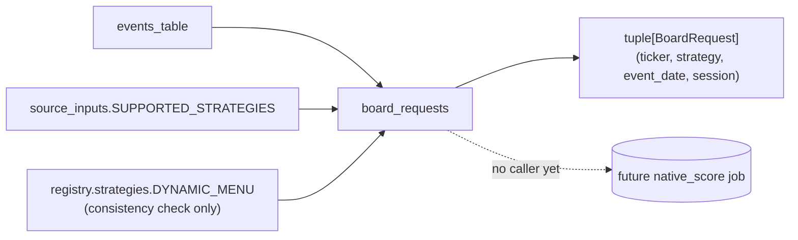

# `engine/v2/ops` — architecture

## Purpose

The supervisor/catalog layer (layer 7 of the v2 rearchitecture): durable job
submission, leases, retry history, dependencies, resource admission, and the
nightly job graph and its release boundary. Everything the operator or a
scheduled trigger drives goes through this package's versioned command
protocol (`python3 -m engine.v2.ops`); no other production package imports
this package's Python modules directly (`README.md`'s
`<!-- public-interface: none -->`).

This document also covers `native_board_universe.py`: a pure, answer-free
enumerator that reproduces legacy `engine.score.score_calendar`'s event ×
strategy enumeration for the strategies native scoring supports, without
touching the legacy chain index or constructing a legacy `Scorer`. It has no
caller in production yet — see "Production call path" below.

## Primary contracts and interfaces

- `OpsError` / `Problem` (`engine/v2/ops/errors.py`): every refusal is one of
  the registered `FAILURE_CODES` (a category and retryability, never a bare
  string), so a caller branches on a stable code.
- `make_problem(code, message, ...)`: the one constructor for a `Problem`;
  raises `ValueError` itself if `code` is not registered.
- `BoardRequest` / `board_requests(as_of, horizon_days, tickers,
  events_table)` (`native_board_universe.py`): a pure key
  `(ticker, strategy, event_date, session)` and the function that enumerates
  one per event × native-covered strategy, plus one `DYN-SV` meta-request
  per event.
- The nightly job graph (`nightly.py`: `GRAPH`, `_DAG_STAGES`,
  `_DAG_PARENTS`, `OPTIONAL`) and the supervisor/catalog surfaces
  (`supervisor.py`, `lifecycle.py`, `decision_commit.py`,
  `snapshot_promotion.py`) — unchanged by this document; described here only
  to place `native_board_universe` in context, not re-specified.

## Inputs

- `board_requests`: an already-loaded events table (`ticker`, `event_date`,
  `session` columns — e.g. the `earnings_events` Tier-2 table's shape), an
  `as_of` date, a horizon in days, and an optional ticker filter. It performs
  no I/O itself — the caller loads the table.
- The rest of the package: job plans, submitted requests, resource profiles,
  catalog state — unchanged.

## Outputs

- `board_requests`: a tuple of `BoardRequest`, ordered by
  `(event_date, ticker)` outer, native-covered strategies alphabetically
  then `DYN-SV` last inner. No side effect, no write.
- The rest of the package: committed artifacts, receipts, catalog rows —
  unchanged.

## Dependencies and callers

`native_board_universe.py` depends only on:
- `engine.v2.registry.strategies.DYNAMIC_MENU` — the seven dynamic-menu
  strategy names, checked to be a subset of the covered set.
- `engine.v2.scoring.source_inputs.SUPPORTED_STRATEGIES` — the actual
  covered-strategy set (native's input builder's own declaration; this
  module never hard-codes or duplicates that list).
- `engine.v2.ops.errors` — the typed refusal envelope.
- `pandas` (the only external library).

It deliberately does **not** depend on `engine.score`, `engine.structures`,
`engine.replay`, or `engine.fills`: `engine.score`'s own top-level import
block pulls in `engine.replay` → `engine.fills` (the legacy chain index and
fill model), and `engine.structures`'s own top-level import block pulls in
`engine.fills` directly — importing either, even solely to read a registry
key set for a read-only comparison, would violate the isolation invariant at
import time, before any call happens. This module also does not import the
new dependency-free `engine.strategy_policy` (which holds `DISABLED_STRATEGIES`,
extracted from `engine.score` for exactly this kind of read): any v2 -> legacy
import must be declared in `checks/legacy_adapters.json`, whose adapter
count may only shrink, and `engine.v2.ops` already has its one allowed
adapter module (`legacy_adapter.py`). `SUPPORTED_STRATEGIES` already
excludes both disabled strategies by construction, so no such check is
needed here — this module reads the native-covered set from
`engine.v2.scoring.source_inputs` only.

**Callers:** none in production today. `board_requests` is a library
function exercised only by its own tests
(`tests/test_v2_ops_native_board_universe.py`). It becomes reachable once a
later stage adds a `native_score` job kind to the nightly graph and calls it
as that job's first step — out of scope for this change.

## External systems and libraries

`pandas` only, for the events-table filter and the `BoardRequest.event_date`
type. No file, network, or database access.

## Failure semantics (4c R1–R6)

- **Missing input:** `events_table` missing `ticker`, `event_date`, or
  `session` is a whole-call typed refusal (`OpsError`, code
  `INVALID_REQUEST`), raised before any row is read — never a partial or
  silently smaller result.
- **Cache:** none. The function holds no cache; it reads only the table its
  caller passes in.
- **Retry:** pure and deterministic for a given table snapshot; re-execution
  is safe, nothing to undo.
- **Transaction:** none applies — no write happens here.
- **Partial write:** not possible — the function returns a complete tuple or
  raises.
- **Idempotency:** the same `(as_of, horizon_days, tickers, events_table)`
  always returns the same tuple in the same order. Idempotency of anything
  built from this enumeration downstream (a job's own commit key) is that
  later stage's concern.

## Invariants touched

- **Native vs. legacy values:** every `BoardRequest` field comes from the
  shared events table, which neither side owns; the module reads two
  legacy-owned names (`DISABLED_STRATEGIES`, indirectly `DYNAMIC_MENU`'s
  cousin registries) only for read-only consistency assertions, never to
  produce a value.
- **Typed status:** a malformed table refuses with a named code rather than
  degrading to a silent empty or partial result.
- **Isolation:** this module never loads the legacy option-chain index and
  never constructs a legacy `Scorer`; it also never *imports* `engine.score`
  or `engine.structures`, so its import graph never reaches
  `engine.replay`/`engine.fills` either — the isolation holds at import
  time, not only at call time.

## Diagram

## Out of scope

- The `native_score` job/stage, its stage-graph wiring, and its resource
  profile.
- Per-row scoring, `DYN-SV` fan-out execution, and any committed scored-row
  artifact.
- Translating a `BoardRequest` into a full native scoring identity (needs a
  resolved snapshot, deployment, and model binding this module does not
  have).
- Every other module in this package — unchanged by this work; see the
  package `README.md` for the rest of the ops surface.
