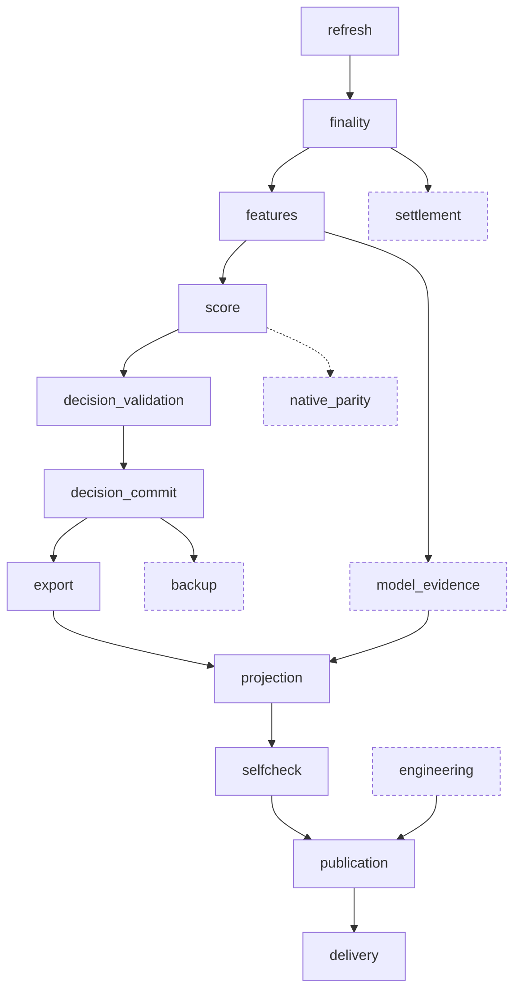
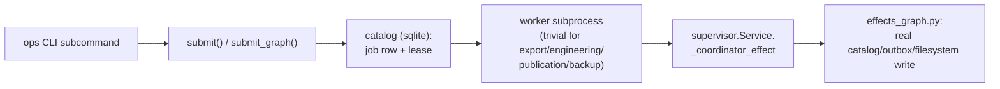

# `engine/v2/ops` — architecture

Layer 7.0 in the root `/ARCHITECTURE.md` layer table. Replaces the new
supervisor/catalog design, `dashboard/nightly.py` (as a job graph) and
`tools/bounded_run.py` (as an executor adapter). See the root doc for the
layer rules this package is checked against; this doc covers the detail
specific to this package.

## Purpose

Durable job submission, leases, retry history and dependencies; resource
admission and per-job CPU placement; the nightly job graph and its release
boundary. It does not decide research conclusions (`engine/v2/evaluation`)
and does not compute a score (`engine/v2/scoring`) — it only sequences and
persists the jobs that call into those packages.

## Primary contracts and public interfaces

The operator interface is the versioned command protocol
`engine/v2/ops/cli.py` exposes (`python3 -m engine.v2.ops <command>`),
derived directly from its `argparse` definitions:

- `init`, `doctor`, `health`
- `serve` — starts the supervisor loop
- `plan {nightly,experiment}` — builds and saves a plan document
- `submit --plan --idempotency-key`
- `rescore --request --native-inputs` — read-only, no provider pulls, no fitting
- `capture-inputs --as-of --tickers --context-tickers --year-start --year-end --source-root --output`
- `reconcile <job_id> --expected-attempt`
- `provider-account --account --remaining --live-reserve`
- `snapshot {plan-import,submit,promote,rollback}`
- `ledger {import-history,status,calibrate,book}`
- `decisions supersede --row-id --reason --from-json`
- `price-refresh --session [--dry-run]`
- `price-history capture --source-root --scope [--dry-run]`
- `get`/`logs`/`cancel`/`resume`/`explain <job_id>`

Internally: `nightly.py`'s `GRAPH`, `graph_order()`, `OPTIONAL`,
`NO_JOB_STAGES`, `build_nightly_plan`, `build_legacy_job_requests`,
`_stage_sequence` (see §"Diagrams" below); `supervisor.Service`/`serve`;
the coordinator-effect functions in `effects_graph.py`.

## Inputs

- Plan documents built by `plans.py::nightly_plan`/`build_nightly_plan`
  (pinned decision clock, read set, session).
- The operations catalog (sqlite, via `catalog.py`'s `transaction`) — job
  rows, leases, retry history, provider-account budgets.
- The artifact store (`ArtifactStore`, filesystem-backed) for refresh plans
  and other bound inputs.
- Legacy filesystem reads (px CSV tree, yfinance fetch cache) through the
  declared adapter, for `price-history capture` and `price-refresh`.

## Outputs

- `StageReceipt`/`NightlyReceipt` documents recording each stage's status,
  input/output hash and (for a failure) an error code.
- Job records in the catalog (leases, attempts, outbox rows).
- Coordinator-side effects for `export`, `engineering`, `publication` and
  `backup` (catalog/outbox/filesystem writes), via `effects_graph.py`,
  called from `supervisor.Service._coordinator_effect` — the worker for
  each of those four job kinds is trivial; the real write happens on the
  coordinator side, never inside the worker subprocess.
- Private shadow artifacts only: `build_nightly_plan` refuses any `mode`
  other than `"shadow"` (`INVALID_REQUEST`), so this package's nightly
  output never reaches the legacy board.

## Dependencies

Imports observed in this package's own source: `engine.v2.contracts`
(0.0), `engine.v2.foundation` (0.5), `engine.v2.data` (1.0),
`engine.v2.ledger` (6.0), `engine.v2.parity` (6.5) — all strictly below
this package's own layer (7.0), per the root doc's §2 rule. It does not
import its layer-7.0 peers `engine.v2.serving` or `engine.v2.research`, or
anything above it (`engine.v2.diagnosis` at 7.5, `engine.v2.dashboard` at
8.0). Legacy reads go through the one declared adapter module,
`engine/v2/ops/legacy_adapter.py` (`checks/legacy_adapters.json`).

Callers: `engine.v2.dashboard._server`'s lazy, documented import of
`cli.refresh_action` (root doc §4); the `tools/v2_*.py` operator CLIs
(direct import — permitted, since `tools/*` is not a layered production
package per the root doc's §1); `experiments/*` runners submitting plans;
`checks/rearchitecture_*.py` verification scripts (read-only inspection);
and the `tests/test_v2_ops_*.py` suite. No layered `engine/v2/**` package
above layer 7.0, and no legacy `engine/**` module, imports this package.

## External systems and libraries

`sqlite3` (the operations catalog); the local filesystem (artifact store,
snapshot roots, legacy px/fetch-cache trees read through the adapter); the
market-data provider account this package's `provider-account` command
budgets against (`engine/v2/ops/providers/`, e.g. ORATS) — credentials
themselves are never held here, only remaining-call/reserve counts.

## Failure semantics

- **Missing input** — a stage with an unmet dependency, or a job whose
  bound input artifact is absent, is refused with a typed `Problem`/error
  code (root doc §5), never defaulted.
- **Cache** — none of this package's own state is a cache; the catalog is
  the durable record.
- **Retry** — `lifecycle.py`'s `attempt_receipts`/`request_cancel` and
  `recovery.py`'s `reconcile_attempt`/`prove_ownership_gone` govern retry
  and ownership recovery after a crash; a stale lease is reclaimed only
  after ownership is proven gone, never assumed.
- **Transaction** — catalog writes go through `catalog.py`'s `transaction`
  context manager; a coordinator effect's catalog/outbox/filesystem writes
  are sequenced so a crash mid-effect is recoverable by replay, not by a
  file append racing a DB commit (root doc §6, the CSV/transaction
  anti-pattern).
- **Partial write** — artifact publication is atomic (`ArtifactStore`); a
  killed process leaves either the old artifact or nothing, never a
  half-written one.
- **Idempotency** — job identity is `job_id_for("shadow", key)`, where
  `key` folds in the session, a scope hash and the stage name; a retry of
  the same saved plan reproduces the same keys. This package's ledger- and
  decision-facing commands (`ledger import-history`, `decisions supersede`)
  must be checked against the root doc §6 idempotency-collision
  anti-pattern before a new key shape ships — a native key must not reuse
  a legacy row's key space.

## Invariants

Enforces or is bound by, from the root doc §5: missing-input typed
refusal; no parity-only mode (`native_parity` runs the real code and is
never given a legacy-shaped branch); one shared parity comparator
(`native_parity_report.py` calls `engine/v2/parity`, never a second
comparator); snapshot/root isolation (paths resolve through
`engine.paths`/the v2 foundation, never a module's own
`Path(__file__)`-derived root); nothing published carries a local path,
raw exception text, or an unsanitised free-text field — `worker.py`'s
convention (a caught traceback goes to a private per-attempt file, never
the result pipe) is the model other stages in this package follow.

## Diagrams

### Nightly stage graph (`nightly.py::GRAPH`)

Dashed nodes are `OPTIONAL`: their failure degrades the receipt but never
blocks the graph. `native_parity` is additionally in `NO_JOB_STAGES` — it
is in `GRAPH` (and in `graph_order()`'s output, and in every plan's
`"order"` field) but the real job list (`_stage_sequence`, called from
`build_legacy_job_requests`) filters it out before submission, so it never
becomes a submitted job in production. The only function that runs the
*whole* graph inline, including `native_parity`, is `run_shadow_nightly`,
and it has no production caller — only `tests/test_v2_ops_legacy_workflows.py`
and `tests/test_v2_ops_native_shadow_render.py` call it.

### CLI → catalog → coordinator effect

The worker process for the four coordinator-effect job kinds never
touches the catalog directly; all real state change for those kinds
happens in `effects_graph.py`, called from the coordinator, not the
worker.
