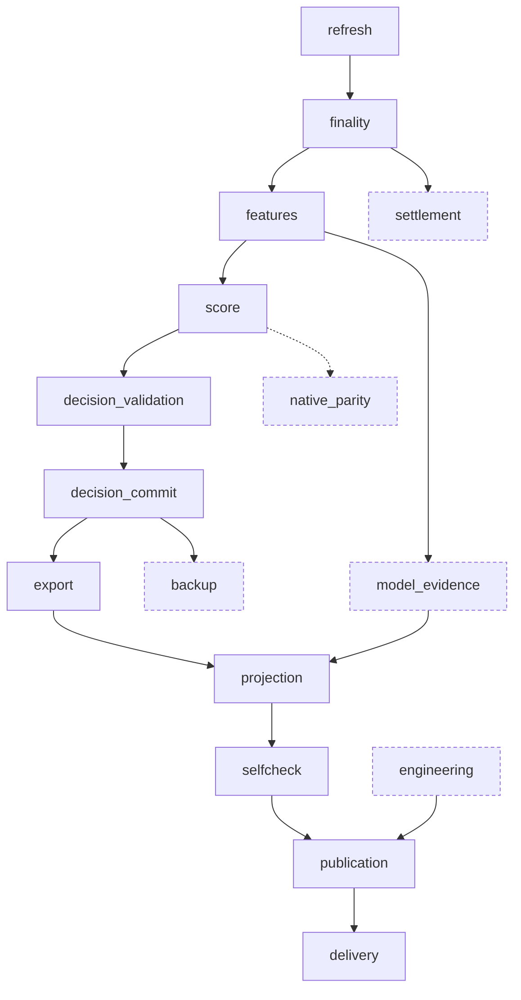
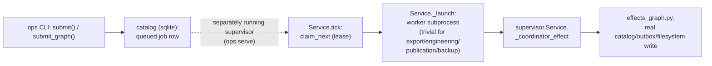
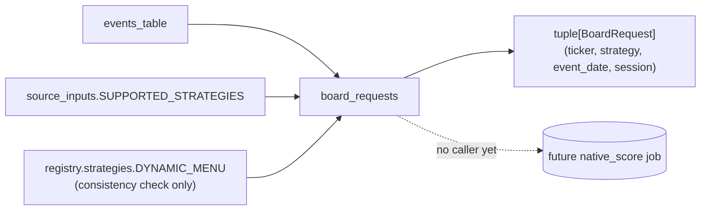

# `engine/v2/ops` — architecture

Layer 7.0 in the root `/ARCHITECTURE.md` layer table. Replaces the new
supervisor/catalog design, `dashboard/nightly.py` (as a job graph) and
`tools/bounded_run.py` (as an executor adapter). See the root doc for the
layer rules this package is checked against; this doc covers the detail
specific to this package.

## Purpose

Durable job submission, leases, retry history and dependencies; resource
admission and per-job CPU placement; the nightly job graph and its release
boundary. It does not decide research conclusions (`engine/v2/evaluation`)
and does not compute a score (`engine/v2/scoring`) — it only sequences and
persists the jobs that call into those packages.

This doc also covers `native_board_universe.py`: a pure, answer-free
enumerator that reproduces legacy `engine.score.score_calendar`'s event ×
strategy enumeration for the strategies native scoring supports, without
touching the legacy chain index or constructing a legacy `Scorer`. It has
no production caller yet — see "Dependencies" below.

## Primary contracts and public interfaces

The operator interface is the versioned command protocol
`engine/v2/ops/cli.py` exposes (`python3 -m engine.v2.ops <command>`),
derived directly from its `argparse` definitions:

- `init`, `doctor`, `health`
- `serve` — starts the supervisor loop
- `plan {nightly,experiment}` — builds and saves a plan document
- `submit --plan --idempotency-key`
- `rescore --request --native-inputs` — read-only, no provider pulls, no fitting
- `capture-inputs --as-of --tickers --context-tickers --year-start --year-end --source-root --output`
- `reconcile <job_id> --expected-attempt`
- `provider-account --account --remaining --live-reserve`
- `snapshot {plan-import,submit,promote,rollback}`
- `ledger {import-history,status,calibrate,book}`
- `decisions supersede --row-id --reason --from-json`
- `price-refresh --session [--dry-run]`
- `price-history capture --source-root --scope [--dry-run]`
- `get`/`logs`/`cancel`/`resume`/`explain <job_id>`

Internally: `nightly.py`'s `GRAPH`, `graph_order()`, `OPTIONAL`,
`NO_JOB_STAGES`, `build_nightly_plan`, `build_legacy_job_requests`,
`_stage_sequence` (see §"Diagrams" below); `supervisor.Service`/`serve`;
the coordinator-effect functions in `effects_graph.py`; `BoardRequest`/
`board_requests(as_of, horizon_days, tickers, events_table)`
(`native_board_universe.py`) — a pure key `(ticker, strategy, event_date,
session)` and the function that enumerates one per event × native-covered
strategy, plus one `DYN-SV` meta-request per event.

## Inputs

- Plan documents built by `plans.py::nightly_plan`/`build_nightly_plan`
  (pinned decision clock, read set, session).
- The operations catalog (sqlite, via `catalog.py`'s `transaction`) — job
  rows, leases, retry history, provider-account budgets.
- The artifact store (`ArtifactStore`, filesystem-backed) for refresh plans
  and other bound inputs.
- Legacy filesystem reads (px CSV tree, yfinance fetch cache) through the
  declared adapter, for `price-history capture` and `price-refresh`.
- `board_requests`: an already-loaded events table (`ticker`, `event_date`,
  `session` columns — e.g. `engine.data.store`'s `earnings_events` Tier-2
  table's shape, where `event_date` is schema-typed `datetime64[ns]`), an
  `as_of` date, a horizon in days, and an optional ticker filter. It
  performs no I/O itself — the caller loads the table. `event_date` may
  also be given as ISO 8601 strings (date-only or full timestamp, mixed
  within one column); numeric values are rejected rather than read as
  epoch-relative offsets, whether the column's dtype is numeric or a mixed
  `object` column holding Python `int`/`float` elements (see "Failure
  semantics"). `as_of` must be a timezone-naive `datetime`/
  `pandas.Timestamp` (`None`, `NaT`, and a timezone-aware value are
  refused); `horizon_days` must be a non-negative `int` (`bool` is refused
  despite being an `int` subtype in Python) — see "Failure semantics".

## Outputs

- `StageReceipt`/`NightlyReceipt` documents recording each stage's status,
  input/output hash and (for a failure) an error code.
- Job records in the catalog (leases, attempts, outbox rows).
- Coordinator-side effects for every kind in
  `supervisor._COORDINATOR_EFFECT_KINDS` (14 kinds, cited by name rather
  than copied here since the list can drift: `legacy_decisions`,
  `legacy_settlement`, `legacy_render`, `legacy_selfcheck`,
  `decision_evidence`, `ledger_export`, `engineering_gate`, `publication`,
  `backup`, `snapshot_import`, `legacy_rebuild_candidate`,
  `legacy_materialize`, `experiment`, `decisions_supersede`) —
  catalog/outbox/filesystem writes dispatched from
  `supervisor.Service._coordinator_effect`; the worker subprocess for each
  of these kinds is trivial, the real write happens on the coordinator
  side. That dispatch calls into several modules, not only
  `effects_graph.py`: `effects_graph.py` supplies `backup_effect`,
  `engineering_gate_effect`, `experiment_effect`, `ledger_export_effect`
  and `publication_effect` (5 of the 14); `decision_commit.py` supplies
  `commit_decisions_in_transaction` (`legacy_decisions`, called from a
  commit closure defined directly in `supervisor.py`, not in
  `effects_graph.py`) and `commit_supersede` (`decisions_supersede`);
  `snapshot_promotion.py` supplies `legacy_rebuild_candidate_effect` and
  `snapshot_import_effect`; `snapshot_stages.py` supplies
  `materialize_effect` (`legacy_materialize`); `legacy_settlement` and
  `decision_evidence` are handled by `supervisor.py`'s own
  `_settlement_effect`/`_verify_decision_evidence`. "All real state change
  happens in `effects_graph.py`" is not accurate — treat it as one of
  several coordinator-effect implementation modules, not the only one.
- Private shadow artifacts only: `build_nightly_plan` refuses any `mode`
  other than `"shadow"` (`INVALID_REQUEST`), so this package's nightly
  output never reaches the legacy board.
- `board_requests`: a tuple of `BoardRequest`, ordered by
  `(event_date, ticker)` outer, native-covered strategies alphabetically
  then `DYN-SV` last inner. No side effect, no write.

## Dependencies

Imports observed in this package's own source, top-level and lazy
(mechanically walked by `.oc_logs/import_scan.py`, an `ast` walk over
every `.py` file that reports every `engine.*` import at any depth,
including inside function bodies):

- Top-level: `engine.v2.contracts` (0.0), `engine.v2.foundation` (0.5),
  `engine.v2.data` (1.0), `engine.v2.registry` (3.0, `native_board_universe.py`'s
  `DYNAMIC_MENU` import), `engine.v2.scoring` (5.0, `native_board_universe.py`'s
  `SUPPORTED_STRATEGIES` import), `engine.v2.ledger` (6.0), `engine.v2.parity`
  (6.5) — all strictly below this package's own layer (7.0), per the root
  doc's §2 rule.
- Lazy, function-local: `engine.v2.contracts` also appears lazily
  (`cli.py::_decisions_supersede`, `cli.py::rescore_command`,
  `cli.py::whatif_action`); `engine.v2.data`/`engine.v2.foundation`/
  `engine.v2.ledger` also have lazy call sites (`cli.py`, `bootstrap.py`)
  in addition to their top-level ones; `engine.v2.models` is lazy-only
  (`cli.py::_restored_model_block` — `payoff_artifact`,
  `cli.py::rescore_command` — `no_fit`, `worker.py::_dispatch_adhoc_rescore`
  — `no_fit`, both layer 3.5); `engine.v2.domain.generation` is lazy-only
  (`cli.py::_load_native_score_inputs` — `Geometry`/`Pricing`, layer 2.0).
  `engine.v2.scoring` is no longer lazy-only: alongside its existing lazy
  call sites (`cli.py::_load_native_score_inputs` — `stages`,
  `cli.py::rescore_command` and `worker.py::_dispatch_adhoc_rescore` —
  `application.score_one`, backing `rescore`/ad-hoc-rescore's read-only
  re-score path, root doc's CLI list `rescore --request --native-inputs`),
  `native_board_universe.py` now imports `engine.v2.scoring.source_inputs`
  at top level — still strictly below layer 7.0.
  `native_board_universe.py` itself has no lazy imports: both of its
  `engine.v2.*` imports (`registry`, `scoring`) are top-level, alongside
  its top-level `engine.v2.ops.errors` import.

It does not import its layer-7.0 peers `engine.v2.serving` or
`engine.v2.research`, or anything above it (`engine.v2.diagnosis` at 7.5,
`engine.v2.dashboard` at 8.0), lazily or otherwise. Legacy reads go
through the one declared adapter module, `engine/v2/ops/legacy_adapter.py`
(`checks/legacy_adapters.json`) — its own further legacy `engine.*` lazy
imports (`engine.calendar`, `engine.data*`, `engine.dashboard`,
`engine.evaluate`, `engine.features`, …) are exactly the adapter's job and
are not layer-checked v2 dependencies.

`native_board_universe.py` deliberately does not depend on `engine.score`,
`engine.structures`, `engine.replay`, or `engine.fills`: `engine.score`'s
own top-level import block pulls in `engine.replay` → `engine.fills` (the
legacy chain index and fill model), and `engine.structures`'s own
top-level import block pulls in `engine.fills` directly — importing
either, even solely to read a registry key set for a read-only
comparison, would violate the isolation invariant at import time, before
any call happens. It also performs no read-only consistency check against
`engine.score.DISABLED_STRATEGIES` (the legacy scorer's own
strategy-refusal set, unextracted, unexported): any v2 → legacy import
must be declared in `checks/legacy_adapters.json`, whose adapter count may
only shrink, and `engine.v2.ops` already has its one allowed adapter
module (`legacy_adapter.py`, above). `SUPPORTED_STRATEGIES` already
excludes both disabled strategies by construction (it comes from native's
own input builder, which has no entry for CAL-P/CND-P), so no such check
is needed — this module reads the native-covered set from
`engine.v2.scoring.source_inputs` only, and checks it against
`engine.v2.registry.strategies.DYNAMIC_MENU` (a subset assertion paid
once at import time, no I/O, no legacy dependency). `SUPPORTED_STRATEGIES`
is `engine.v2.scoring.source_inputs`'s public alias for its own
pre-existing internal strategy set (`_STRATEGY_FORECAST_OUTPUTS`'s key
set: `STR-THRU`, `STR-RUNUP`, and the seven `DYNAMIC_MENU` members) — the
same value that module already computed for its own input-building use;
exporting it added a name, not a behavior, and gave this module the one
fact it needs (which strategies native can build scoring inputs for)
without duplicating that set here.

Callers: `engine.v2.dashboard._server`'s lazy, documented import of
`cli.refresh_action` (root doc §4); the `tools/v2_*.py` operator CLIs
(direct import — permitted, since `tools/*` is not a layered production
package per the root doc's §1); `experiments/*` runners submitting plans;
`checks/rearchitecture_*.py` verification scripts (read-only inspection);
and the `tests/test_v2_ops_*.py` suite. No layered `engine/v2/**` package
above layer 7.0 imports this package, and no legacy `engine/**` module
does either — none except the documented lazy `engine.v2.dashboard._server`
caller of `cli.refresh_action` noted above. `board_requests` has no
production caller today: it is a library function exercised only by its
own tests (`tests/test_v2_ops_native_board_universe.py`), part of the
`tests/test_v2_ops_*.py` suite above. It becomes reachable once a later
stage adds a `native_score` job kind to the nightly graph and calls it as
that job's first step — out of scope for this change.

## External systems and libraries

`sqlite3` (the operations catalog); the local filesystem (artifact store,
snapshot roots, legacy px/fetch-cache trees read through the adapter); the
market-data provider account this package's `provider-account` command
budgets against (`engine/v2/ops/providers/`, e.g. ORATS) — credentials
themselves are never held here, only remaining-call/reserve counts.
`native_board_universe.py` adds no new external system: `pandas` (already
a transitive dependency of this package) is its only library, for the
events-table filter and the `BoardRequest.event_date` type; no file,
network, or database access.

## Failure semantics

- **Missing input** — a stage with an unmet dependency, or a job whose
  bound input artifact is absent, is refused with a typed `Problem`/error
  code (root doc §5), never defaulted. `board_requests` follows the same
  rule for its own input: `events_table` missing `ticker`, `event_date`,
  or `session`; holding more than one column under any of those three
  labels (checked before any column is read by label); holding an
  `event_date` column of numeric dtype, or an `object`-dtype `event_date`
  column holding any Python `int`/`float` element (checked per element,
  before any parsing is attempted — never read as an epoch-relative
  offset, e.g. `20260201`, regardless of whether pandas inferred a numeric
  dtype or left the column as `object`); holding an `event_date` column
  that otherwise cannot be parsed as timestamps (e.g. an unparseable
  string); holding an `event_date` value that parses to null (`NaT`, e.g.
  a `None`/`NaN` cell); or holding a timezone-aware `event_date` column,
  whether the column arrives already `datetime64` with a timezone or as a
  tz-aware ISO 8601 string (e.g. `"...+00:00"`) — this function only
  supports timezone-naive event dates, matching `as_of` — each is a
  whole-call typed refusal (`OpsError`, code `INVALID_REQUEST`), raised
  before any row is read — never a partial or silently smaller result.
  `event_date` values already typed as timezone-naive `datetime64`, or
  given as timezone-naive ISO 8601 strings (date-only and full-timestamp
  forms may be mixed within one column), are accepted; a timezone-aware
  `event_date` is refused in every representation — there is no
  ISO-string exception to the timezone-naive rule.
  `as_of` must be a timezone-naive `datetime`/`pandas.Timestamp`: `None`,
  `NaT`, and a timezone-aware value are each refused (`OpsError`,
  `INVALID_REQUEST`). `horizon_days` must be a non-negative `int`; `bool`
  is refused even though it is an `int` subtype in Python (so `True`/
  `False` cannot silently pass as `1`/`0`), and any other type or a
  negative value is refused the same way.
- **Cache** — none of this package's own state is a cache; the catalog is
  the durable record. `board_requests` holds no cache either; it reads
  only the table its caller passes in.
- **Retry** — `lifecycle.py`'s `attempt_receipts`/`request_cancel` and
  `recovery.py`'s `reconcile_attempt`/`prove_ownership_gone` govern retry
  and ownership recovery after a crash; a stale lease is reclaimed only
  after ownership is proven gone, never assumed. `board_requests` is pure
  and deterministic for a given table snapshot; re-execution is safe,
  nothing to undo.
- **Transaction** — catalog writes go through `catalog.py`'s `transaction`
  context manager; coordinator effects must make their filesystem writes
  replay-safe and idempotent rather than atomic with the DB commit (root
  doc §6, the CSV/transaction anti-pattern). One exception is visible in
  practice: `experiment_effect`'s `_commit` appends the "ran" row to
  `experiments/LEDGER.csv` from inside `commit_attempt`'s transaction, so a
  later failure in that same transaction (and its DB rollback) can leave
  the CSV row in place while the DB records no committed attempt. Recovery
  is by replay, not atomicity: a retry reuses the same run identity, and
  `_ran_row_exists` skips appending a second "ran" row for it.
- **Partial write** — artifact publication is atomic (`ArtifactStore`); a
  killed process leaves either the old artifact or nothing, never a
  half-written one. `board_requests` performs no write at all — not
  possible to leave partial, since the function returns a complete tuple
  or raises.
- **Idempotency** — job identity is `job_id_for("shadow", key)`, where
  `key` folds in the session, a scope hash and the stage name; a retry of
  the same saved plan reproduces the same keys. This package's ledger- and
  decision-facing commands (`ledger import-history`, `decisions supersede`)
  must be checked against the root doc §6 idempotency-collision
  anti-pattern before a new key shape ships — a native key must not reuse
  a legacy row's key space. The same key reused for a different request
  (a different digest/payload under an unchanged idempotency key) is
  refused with `IDEMPOTENCY_CONFLICT`, not silently accepted or merged —
  `submission.py` (`"same key, different digest — IDEMPOTENCY_CONFLICT,
  nothing changes"`), `outbox.py`, `decision_commit.py`, `publication.py`,
  `experiments.py` and `ledger_history_import.py` all raise it on that
  same-key/different-content case; a same-key/same-content resubmission is
  the idempotent no-op this section otherwise describes. `board_requests`
  has no job identity of its own: the same `(as_of, horizon_days, tickers,
  events_table)` always returns the same tuple in the same order.
  Idempotency of anything built from this enumeration downstream (a job's
  own commit key, once `native_score` exists) is that later stage's
  concern.

## Invariants

Enforces or is bound by, from the root doc §5: missing-input typed
refusal; no parity-only mode (`native_parity` runs the real code and is
never given a legacy-shaped branch); one shared parity comparator
(`native_parity_report.py` calls `engine/v2/parity`, never a second
comparator); snapshot/root isolation (data and artifact paths resolve
through `engine.paths`/the v2 foundation, never a module's own
`Path(__file__)`-derived root) — the one documented exemption is worker-*source*
fingerprinting: `build_legacy_job_requests` computes `implementation_ref`
from `worker_source_manifest(Path(__file__).resolve().parents[3])`, a code
closure keyed to where `nightly.py` itself sits on disk, independent of
the plan's `source_root`/`catalog_path`/`objects_root`. That fingerprint
answers "what worker code is running," not "which data root," so it is
never redirected by a request's or plan's root; nothing else in this
package may adopt the same pattern for a data or artifact path; nothing
published carries a local path, raw exception text, or an unsanitised
free-text field — `worker.py`'s convention (a caught traceback goes to a
private per-attempt file, never the result pipe) is the model other
stages in this package follow.

`native_board_universe.py` touches the same missing-input typed-refusal
invariant (above) and adds two of its own, scoped to that module:
- **Native vs. legacy values** — `ticker`, `event_date`, and `session` come
  from the shared events table, which neither side owns; `strategy` comes
  from the native-covered strategy set (`SUPPORTED_STRATEGIES`) or the
  `DYN-SV` literal, never from the events table. The module's one
  consistency assertion (`DYNAMIC_MENU` is a subset of
  `SUPPORTED_STRATEGIES`) reads only v2-native names — it does not import
  `engine.score`'s `DISABLED_STRATEGIES` or any other legacy-owned name.
- **Isolation** — this module never loads the legacy option-chain index
  and never constructs a legacy `Scorer`; it also never *imports*
  `engine.score` or `engine.structures`, so its import graph never reaches
  `engine.replay`/`engine.fills` either — the isolation holds at import
  time, not only at call time.

## Diagrams

### Nightly stage graph (`nightly.py::GRAPH`)

```mermaid
flowchart TD
    refresh --> finality
    finality --> features
    finality --> settlement
    features --> score
    features --> model_evidence
    score --> decision_validation
    score -.-> native_parity
    decision_validation --> decision_commit
    decision_commit --> export
    decision_commit --> backup
    export --> projection
    model_evidence --> projection
    projection --> selfcheck
    selfcheck --> publication
    engineering --> publication
    publication --> delivery

    classDef optional stroke-dasharray: 4 3
    class settlement,model_evidence,engineering,backup,native_parity optional
```

Dashed nodes are `OPTIONAL`: their failure degrades the receipt but never
blocks the graph. This diagram is the *shadow* graph: `build_nightly_plan`
stamps `graph_order()`'s output into every plan's `"order"` field, and
`run_shadow_nightly` is the only function that walks it whole, inline,
including `native_parity` — it has no production caller, only
`tests/test_v2_ops_legacy_workflows.py` and
`tests/test_v2_ops_native_shadow_render.py` call it.

Production job **submission** does not walk this graph. `build_legacy_job_requests`'s
only production caller, `cli.py`, always passes `include_prerequisites=False`,
so `_stage_sequence` returns a second, separately hand-maintained tuple,
`_DAG_STAGES` — whose stage names diverge from this diagram's
(`decision_replay`/`decision_evidence`/`decision_commit` where this graph
has `decision_validation`/`decision_commit`; `ledger_export` for `export`;
`engineering_gate` for `engineering`) — and which never contains
`native_parity` at all: in production `native_parity` is simply absent
from the submitted stage list, not removed by a filter. `NO_JOB_STAGES`
(currently `{"native_parity"}`) only does work on the other branch,
`include_prerequisites=True` (test-only), where `_stage_sequence` instead
returns `plan["order"]` (this diagram's order) and strips `NO_JOB_STAGES`
from it before returning.

### CLI → catalog → coordinator effect

```mermaid
flowchart LR
    A["ops CLI: submit() / submit_graph()"] --> B["catalog (sqlite):<br/>queued job row"]
    B -.->|"separately running supervisor<br/>(ops serve)"| C["Service.tick:<br/>claim_next (lease)"]
    C --> D["Service._launch:<br/>worker subprocess<br/>(trivial for export/engineering/<br/>publication/backup)"]
    D --> E["supervisor.Service.<br/>_coordinator_effect"]
    E --> F["effects_graph.py:<br/>real catalog/outbox/filesystem write"]
```

`submit()`/`submit_graph()` only inserts a `queued` (or `blocked`) job
row in one transaction; it never claims a lease or launches a worker.
Claiming and launching happen later, in a separately running supervisor
process (`ops serve`'s `Service.tick`, via its `claim_next` call), which
is the only path that acquires a job's lease before calling `_launch`.
The worker process for a `supervisor._COORDINATOR_EFFECT_KINDS` job kind
(14 kinds — see "Outputs" above) never touches the catalog directly; all
real state change for those kinds happens in `_coordinator_effect`,
called from the coordinator, not the worker — `_coordinator_effect`
dispatches to `effects_graph.py` for some kinds and to
`decision_commit.py`/`snapshot_promotion.py`/`snapshot_stages.py`/its own
`supervisor.py` methods for the rest (see "Outputs").

### `native_board_universe.py`: `board_requests`

```mermaid
flowchart LR
    ET[events_table] --> BR[board_requests]
    SI["source_inputs.SUPPORTED_STRATEGIES"] --> BR
    DM["registry.strategies.DYNAMIC_MENU\n(consistency check only)"] --> BR
    BR --> OUT["tuple[BoardRequest]\n(ticker, strategy, event_date, session)"]
    BR -.->|"no caller yet"| NC[(future native_score job)]
```

No production job feeds `board_requests` today; the dashed edge marks the
future `native_score` job kind this enumeration is built for (see
"Dependencies" → "Callers" above).
