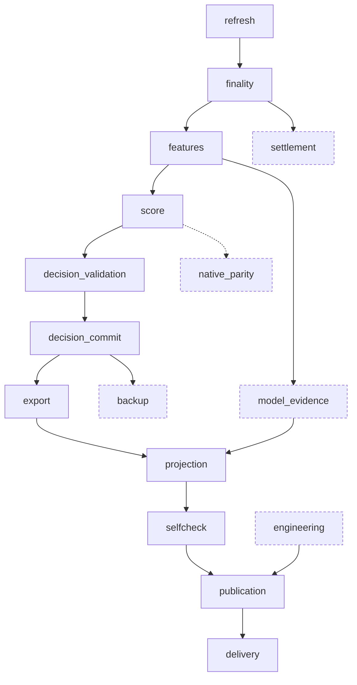
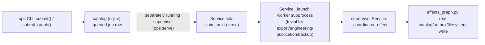
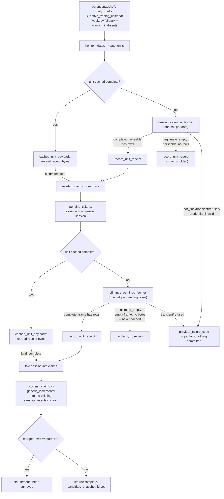

# `engine/v2/ops` — architecture

Layer 7.0 in the root `/ARCHITECTURE.md` layer table. Replaces the new
supervisor/catalog design, `dashboard/nightly.py` (as a job graph) and
`tools/bounded_run.py` (as an executor adapter). See the root doc for the
layer rules this package is checked against; this doc covers the detail
specific to this package.

## Purpose

Durable job submission, leases, retry history and dependencies; resource
admission and per-job CPU placement; the nightly job graph and its release
boundary. It does not decide research conclusions (`engine/v2/evaluation`)
and does not compute a score (`engine/v2/scoring`) — it only sequences and
persists the jobs that call into those packages.

## Primary contracts and public interfaces

The operator interface is the versioned command protocol
`engine/v2/ops/cli.py` exposes (`python3 -m engine.v2.ops <command>`),
derived directly from its `argparse` definitions:

- `init`, `doctor`, `health`
- `serve` — starts the supervisor loop
- `plan {nightly,experiment}` — builds and saves a plan document
- `submit --plan --idempotency-key`
- `rescore --request --native-inputs` — read-only, no provider pulls, no fitting
- `capture-inputs --as-of --tickers --context-tickers --year-start --year-end --source-root --output`
- `reconcile <job_id> --expected-attempt`
- `provider-account --account --remaining --live-reserve`
- `snapshot {plan-import,submit,promote,rollback}`
- `ledger {import-history,status,calibrate,book}`
- `decisions supersede --row-id --reason --from-json`
- `price-refresh --session [--dry-run]`
- `price-history capture --source-root --scope [--dry-run]`
- `get`/`logs`/`cancel`/`resume`/`explain <job_id>`

Internally: `nightly.py`'s `GRAPH`, `graph_order()`, `OPTIONAL`,
`NO_JOB_STAGES`, `build_nightly_plan`, `build_legacy_job_requests`,
`_stage_sequence` (see §"Diagrams" below); `supervisor.Service`/`serve`;
the coordinator-effect functions in `effects_graph.py`.

A small number of natively-fetched data stores live directly in this
package rather than delegating computation to another v2 layer — like
`price-history capture` above, `forward_calendar_store.py` (spec s4c) is
one of these. Its `RefreshCallback`-compatible entrypoint,
`run_forward_calendar_refresh(parameters, root, *, nasdaq_fetcher,
earnings_fetcher)`, is what a forward-calendar job's worker calls; its
pure helpers (`horizon_dates`, `date_units`, `ticker_units`,
`plan_forward_calendar`, `resolve_session_claims`, `nasdaq_rows_from_payload`,
`nasdaq_claims_from_rows`, `pending_tickers`) are unit-testable without a
catalog or a network. This store is not yet wired into `nightly.py`'s
`GRAPH`/job dispatch (spec s4c Parts 3-4 add the job kind and the nightly
stage) — today it has no production caller, only its own test module.

## Inputs

- Plan documents built by `plans.py::nightly_plan`/`build_nightly_plan`
  (pinned decision clock, read set, session).
- The operations catalog (sqlite, via `catalog.py`'s `transaction`) — job
  rows, leases, retry history, provider-account budgets.
- The artifact store (`ArtifactStore`, filesystem-backed) for refresh plans
  and other bound inputs.
- Legacy filesystem reads (px CSV tree, yfinance fetch cache) through the
  declared adapter, for `price-history capture` and `price-refresh`.
- `forward_calendar_store.py`'s own inputs: the pinned parent snapshot's
  `daily_market` sessions (one scan, grouped by ticker, fed to
  `engine.v2.data.computed_moves.native_trading_calendar` for the horizon
  calendar — a snapshot without a `daily_market` session falls back to plain
  weekdays); the job's input document
  (`forward_calendar_refresh_input.json`: catalog path, objects root,
  `as_of`, `horizon_days`, `tickers`, `scope`); and the two injected network
  edges, `providers.nasdaq_calendar.nasdaq_calendar_fetcher` (one call per
  discovery date) and `providers.yfinance_edge.yfinance_earnings_fetcher`
  (one call per ticker still missing a session after the Nasdaq pass).

## Outputs

- `StageReceipt`/`NightlyReceipt` documents recording each stage's status,
  input/output hash and (for a failure) an error code.
- Job records in the catalog (leases, attempts, outbox rows).
- Coordinator-side effects for every kind in
  `supervisor._COORDINATOR_EFFECT_KINDS` (14 kinds, cited by name rather
  than copied here since the list can drift: `legacy_decisions`,
  `legacy_settlement`, `legacy_render`, `legacy_selfcheck`,
  `decision_evidence`, `ledger_export`, `engineering_gate`, `publication`,
  `backup`, `snapshot_import`, `legacy_rebuild_candidate`,
  `legacy_materialize`, `experiment`, `decisions_supersede`) —
  catalog/outbox/filesystem writes dispatched from
  `supervisor.Service._coordinator_effect`; the worker subprocess for each
  of these kinds is trivial, the real write happens on the coordinator
  side. That dispatch calls into several modules, not only
  `effects_graph.py`: `effects_graph.py` supplies `backup_effect`,
  `engineering_gate_effect`, `experiment_effect`, `ledger_export_effect`
  and `publication_effect` (5 of the 14); `decision_commit.py` supplies
  `commit_decisions_in_transaction` (`legacy_decisions`, called from a
  commit closure defined directly in `supervisor.py`, not in
  `effects_graph.py`) and `commit_supersede` (`decisions_supersede`);
  `snapshot_promotion.py` supplies `legacy_rebuild_candidate_effect` and
  `snapshot_import_effect`; `snapshot_stages.py` supplies
  `materialize_effect` (`legacy_materialize`); `legacy_settlement` and
  `decision_evidence` are handled by `supervisor.py`'s own
  `_settlement_effect`/`_verify_decision_evidence`. "All real state change
  happens in `effects_graph.py`" is not accurate — treat it as one of
  several coordinator-effect implementation modules, not the only one.
- Private shadow artifacts only: `build_nightly_plan` refuses any `mode`
  other than `"shadow"` (`INVALID_REQUEST`), so this package's nightly
  output never reaches the legacy board.
- `forward_calendar_store.run_forward_calendar_refresh` commits revisions
  into the EXISTING `earnings_events` contract through
  `engine.v2.data.generic_incremental` — never
  `engine.data.rebuild.rebuild` — and returns a `RefreshCallbackResult`
  (`status` one of `complete`/`noop`/`failed`, `completed_ids`,
  `coverage_advanced`, and `warnings` carrying any weekday-calendar-fallback
  degradation as evidence rather than only a log line). A run whose merged
  claims equal the parent snapshot's own rows resolves back to the parent
  (the commit layer's own equality check decides this, never key presence
  in the parent), so it reports `noop` rather than a spurious `complete`.

## Dependencies

Imports observed in this package's own source, top-level and lazy
(mechanically walked by `.oc_logs/import_scan.py`, an `ast` walk over
every `.py` file that reports every `engine.*` import at any depth,
including inside function bodies):

- Top-level: `engine.v2.contracts` (0.0), `engine.v2.foundation` (0.5),
  `engine.v2.data` (1.0), `engine.v2.ledger` (6.0), `engine.v2.parity`
  (6.5) — all strictly below this package's own layer (7.0), per the root
  doc's §2 rule. `forward_calendar_store.py` adds one new `engine.v2.data`
  submodule to this package's dependency surface,
  `engine.v2.data.computed_moves` (`native_trading_calendar`, layer 1.0),
  alongside its existing top-level use of `generic_incremental`,
  `incremental_tables` and `repository.Repository`.
- Lazy, function-local: `engine.v2.contracts` also appears lazily
  (`cli.py::_decisions_supersede`, `cli.py::rescore_command`,
  `cli.py::whatif_action`); `engine.v2.data`/`engine.v2.foundation`/
  `engine.v2.ledger` also have lazy call sites (`cli.py`, `bootstrap.py`)
  in addition to their top-level ones; `unit_receipts.py` adds further
  lazy `engine.v2.data` call sites of its own — `record_unit_receipt` and
  `cached_unit_payloads` each import `engine.v2.data.incremental`
  (`cache_raw_receipt`/`RawPayload`, and `load_raw_receipt`), and
  `cached_unit_outcomes` imports both `engine.v2.data.incremental`'s
  `_jsonable` and `engine.v2.foundation`'s `content_hash`;
  `engine.v2.models` is lazy-only
  (`cli.py::_restored_model_block` — `payoff_artifact`,
  `cli.py::rescore_command` — `no_fit`, `worker.py::_dispatch_adhoc_rescore`
  — `no_fit`, both layer 3.5); `engine.v2.domain.generation` is lazy-only
  (`cli.py::_load_native_score_inputs` — `Geometry`/`Pricing`, layer 2.0);
  `engine.v2.scoring` is lazy-only (`cli.py::_load_native_score_inputs` —
  `stages`, `cli.py::rescore_command` and `worker.py::_dispatch_adhoc_rescore`
  — `application.score_one`, layer 4.0). All three lazy-only imports back
  `rescore`/ad-hoc-rescore's read-only re-score path (root doc's CLI list,
  `rescore --request --native-inputs`), still strictly below layer 7.0.

It does not import its layer-7.0 peers `engine.v2.serving` or
`engine.v2.research`, or anything above it (`engine.v2.diagnosis` at 7.5,
`engine.v2.dashboard` at 8.0), lazily or otherwise. Legacy reads go
through the one declared adapter module, `engine/v2/ops/legacy_adapter.py`
(`checks/legacy_adapters.json`) — its own further legacy `engine.*` lazy
imports (`engine.calendar`, `engine.data*`, `engine.dashboard`,
`engine.evaluate`, `engine.features`, …) are exactly the adapter's job and
are not layer-checked v2 dependencies.

Callers: `engine.v2.dashboard._server`'s lazy, documented import of
`cli.refresh_action` (root doc §4); the `tools/v2_*.py` operator CLIs
(direct import — permitted, since `tools/*` is not a layered production
package per the root doc's §1); `experiments/*` runners submitting plans;
`checks/rearchitecture_*.py` verification scripts (read-only inspection);
and the `tests/test_v2_ops_*.py` suite. No layered `engine/v2/**` package
above layer 7.0 imports this package, and no legacy `engine/**` module
does either — none except the documented lazy `engine.v2.dashboard._server`
caller of `cli.refresh_action` noted above.

## External systems and libraries

`sqlite3` (the operations catalog); the local filesystem (artifact store,
snapshot roots, legacy px/fetch-cache trees read through the adapter); the
market-data provider accounts this package's `provider-account` command
budgets against (`engine/v2/ops/providers/`) — credentials themselves are
never held here, only remaining-call/reserve counts. Three accounts exist
today: `orats-daily-market` (keyed, reads `ORATS_API_KEY`); and, as of spec
s4c, `nasdaq` and `yfinance` — both unmetered and keyless (their
`PROVIDER_CREDENTIAL_VARIABLES` tuples are empty), but still
operator-provisioned budget rows so the shared scheduler reserves against
them like any keyed account. `providers/nasdaq_calendar.py` calls Nasdaq's
public `api.nasdaq.com/api/calendar/earnings` endpoint (one date per call,
a plain keyless HTTPS GET with a browser user-agent — the endpoint refuses
the default client UA with a 403); `providers/yfinance_edge.py` wraps the
third-party `yfinance` library (imported lazily, only inside the default
callables, so importing the module touches no network) — one
`Ticker.history`/`Ticker.get_earnings_dates` call per ticker, never a
direct HTTP client of its own.

## Failure semantics

- **Missing input** — a stage with an unmet dependency, or a job whose
  bound input artifact is absent, is refused with a typed `Problem`/error
  code (root doc §5), never defaulted. `forward_calendar_store.py` is one
  exception to the raise-a-typed-`Problem` shape: a missing/unparseable
  `forward_calendar_refresh_input.json`, or one missing `catalog_path`/
  `objects_root`, returns a `RefreshCallbackResult(status="failed", …)`
  instead of raising — the job's own result document, not an `OpsError`, is
  where that refusal is recorded. An unconfigured fetcher pair (the worker
  never injected `nasdaq_fetcher`/`earnings_fetcher`) IS the raise-a-typed-
  `Problem` shape: `RESOURCE_UNAVAILABLE`. A parent snapshot with no
  `daily_market` session is not a missing-input refusal at all — it is the
  documented weekday-calendar fallback, recorded as a result `warning`.
- **Cache** — one part of this package's own state *is* a cache, read
  through the operations catalog's own `data_raw_receipts` table (the same
  connection this package's stages already use for `data_snapshot_heads`
  and other catalog rows): `unit_receipts.py`'s `cached_unit_outcomes`/
  `cached_unit_payloads` and `nightly.py`'s `_native_cached_outcome` each
  look up the newest receipt for a `(source, endpoint, request_hash)` key
  and reuse it only when its recorded `response_kind` is `complete` — a
  `legitimate_empty` payload is always re-verified against the live source
  on the next run, and a `not_final`/`transient`/`refused` response is
  never written to the cache at all (`record_unit_receipt` refuses to
  store one). `forward_calendar_store.py`'s `_cached_nasdaq`/`_cached_yfinance`
  are thin wrappers over `cached_unit_outcomes` for the `nasdaq`/`yfinance`
  source+endpoint pairs; its `_fetch_nasdaq`/`_fetch_yfinance` then re-read
  the wanted units' bytes through `cached_unit_payloads` before falling back
  to a fresh fetch, so a same-session retry rebuilds every unit's claims —
  fresh and cache-hit alike — exactly as a clean single run would.
  `unit_receipts.py` breaks a `received_at` tie by `rowid` (the table's own
  append-only insertion order); `nightly.py`'s older, narrower lookup does
  not carry that tie-break. On the acquisition side, a provider response
  that cannot be used maps to one of four failure codes via
  `provider_failure_code` — two registered retryable (`checks`/
  `contracts/operations.py`'s `("source", True)`): `not_final` (Nasdaq's
  404, a date not yet published) to `SOURCE_NOT_FINAL` and `transient`
  (network errors, 429, 5xx) to `TRANSIENT_SOURCE`; and two non-retryable
  (`("source", False)`): `refused` (an unparseable body or other non-auth
  4xx) to `SOURCE_INVALID` and `credential_invalid` (the provider's own
  401/403) to `CREDENTIAL_INVALID`. A mixed batch of unit kinds reports the
  worst code among them, ranked `TRANSIENT_SOURCE` <
  `SOURCE_NOT_FINAL` < `SOURCE_INVALID` < `CREDENTIAL_INVALID` — retryable
  or not, the job still fails on the first non-`complete`/`legitimate_empty`
  unit rather than committing a partial claim set. Everything else about
  this package's own job/lease/history state is not a cache, and the
  catalog remains the durable record of it.
- **Retry** — `lifecycle.py`'s `attempt_receipts`/`request_cancel` and
  `recovery.py`'s `reconcile_attempt`/`prove_ownership_gone` govern retry
  and ownership recovery after a crash; a stale lease is reclaimed only
  after ownership is proven gone, never assumed.
- **Transaction** — catalog writes go through `catalog.py`'s `transaction`
  context manager; coordinator effects must make their filesystem writes
  replay-safe and idempotent rather than atomic with the DB commit (root
  doc §6, the CSV/transaction anti-pattern). One exception is visible in
  practice: `experiment_effect`'s `_commit` appends the "ran" row to
  `experiments/LEDGER.csv` from inside `commit_attempt`'s transaction, so a
  later failure in that same transaction (and its DB rollback) can leave
  the CSV row in place while the DB records no committed attempt. Recovery
  is by replay, not atomicity: a retry reuses the same run identity, and
  `_ran_row_exists` skips appending a second "ran" row for it.
- **Partial write** — artifact publication is atomic (`ArtifactStore`); a
  killed process leaves either the old artifact or nothing, never a
  half-written one.
- **Idempotency** — job identity is `job_id_for("shadow", key)`, where
  `key` folds in the session, a scope hash and the stage name; a retry of
  the same saved plan reproduces the same keys. This package's ledger- and
  decision-facing commands (`ledger import-history`, `decisions supersede`)
  must be checked against the root doc §6 idempotency-collision
  anti-pattern before a new key shape ships — a native key must not reuse
  a legacy row's key space. The same key reused for a different request
  (a different digest/payload under an unchanged idempotency key) is
  refused with `IDEMPOTENCY_CONFLICT`, not silently accepted or merged —
  `submission.py` (`"same key, different digest — IDEMPOTENCY_CONFLICT,
  nothing changes"`), `outbox.py`, `decision_commit.py`, `publication.py`,
  `experiments.py` and `ledger_history_import.py` all raise it on that
  same-key/different-content case; a same-key/same-content resubmission is
  the idempotent no-op this section otherwise describes.

## Invariants

Enforces or is bound by, from the root doc §5: missing-input typed
refusal; no parity-only mode (`native_parity` runs the real code and is
never given a legacy-shaped branch); one shared parity comparator
(`native_parity_report.py` calls `engine/v2/parity`, never a second
comparator); snapshot/root isolation (data and artifact paths resolve
through `engine.paths`/the v2 foundation, never a module's own
`Path(__file__)`-derived root) — the one documented exemption is worker-*source*
fingerprinting: `build_legacy_job_requests` computes `implementation_ref`
from `worker_source_manifest(Path(__file__).resolve().parents[3])`, a code
closure keyed to where `nightly.py` itself sits on disk, independent of
the plan's `source_root`/`catalog_path`/`objects_root`. That fingerprint
answers "what worker code is running," not "which data root," so it is
never redirected by a request's or plan's root; nothing else in this
package may adopt the same pattern for a data or artifact path; nothing
published carries a local path, raw exception text, or an unsanitised
free-text field — `worker.py`'s convention (a caught traceback goes to a
private per-attempt file, never the result pipe) is the model other
stages in this package follow.

## Diagrams

### Nightly stage graph (`nightly.py::GRAPH`)

```mermaid
flowchart TD
    refresh --> finality
    finality --> features
    finality --> settlement
    features --> score
    features --> model_evidence
    score --> decision_validation
    score -.-> native_parity
    decision_validation --> decision_commit
    decision_commit --> export
    decision_commit --> backup
    export --> projection
    model_evidence --> projection
    projection --> selfcheck
    selfcheck --> publication
    engineering --> publication
    publication --> delivery

    classDef optional stroke-dasharray: 4 3
    class settlement,model_evidence,engineering,backup,native_parity optional
```

Dashed nodes are `OPTIONAL`: their failure degrades the receipt but never
blocks the graph. This diagram is the *shadow* graph: `build_nightly_plan`
stamps `graph_order()`'s output into every plan's `"order"` field, and
`run_shadow_nightly` is the only function that walks it whole, inline,
including `native_parity` — it has no production caller, only
`tests/test_v2_ops_legacy_workflows.py` and
`tests/test_v2_ops_native_shadow_render.py` call it.

Production job **submission** does not walk this graph. `build_legacy_job_requests`'s
only production caller, `cli.py`, always passes `include_prerequisites=False`,
so `_stage_sequence` returns a second, separately hand-maintained tuple,
`_DAG_STAGES` — whose stage names diverge from this diagram's
(`decision_replay`/`decision_evidence`/`decision_commit` where this graph
has `decision_validation`/`decision_commit`; `ledger_export` for `export`;
`engineering_gate` for `engineering`) — and which never contains
`native_parity` at all: in production `native_parity` is simply absent
from the submitted stage list, not removed by a filter. `NO_JOB_STAGES`
(currently `{"native_parity"}`) only does work on the other branch,
`include_prerequisites=True` (test-only), where `_stage_sequence` instead
returns `plan["order"]` (this diagram's order) and strips `NO_JOB_STAGES`
from it before returning.

### CLI → catalog → coordinator effect

```mermaid
flowchart LR
    A["ops CLI: submit() / submit_graph()"] --> B["catalog (sqlite):<br/>queued job row"]
    B -.->|"separately running supervisor<br/>(ops serve)"| C["Service.tick:<br/>claim_next (lease)"]
    C --> D["Service._launch:<br/>worker subprocess<br/>(trivial for export/engineering/<br/>publication/backup)"]
    D --> E["supervisor.Service.<br/>_coordinator_effect"]
    E --> F["effects_graph.py:<br/>real catalog/outbox/filesystem write"]
```

`submit()`/`submit_graph()` only inserts a `queued` (or `blocked`) job
row in one transaction; it never claims a lease or launches a worker.
Claiming and launching happen later, in a separately running supervisor
process (`ops serve`'s `Service.tick`, via its `claim_next` call), which
is the only path that acquires a job's lease before calling `_launch`.
The worker process for a `supervisor._COORDINATOR_EFFECT_KINDS` job kind
(14 kinds — see "Outputs" above) never touches the catalog directly; all
real state change for those kinds happens in `_coordinator_effect`,
called from the coordinator, not the worker — `_coordinator_effect`
dispatches to `effects_graph.py` for some kinds and to
`decision_commit.py`/`snapshot_promotion.py`/`snapshot_stages.py`/its own
`supervisor.py` methods for the rest (see "Outputs").

### Forward-calendar refresh: two-source, cache-first fetch (`forward_calendar_store.py`)

```mermaid
flowchart TD
    A["parent snapshot's daily_market<br/>-> native_trading_calendar<br/>(weekday fallback + warning if absent)"] --> B["horizon_dates -> date_units"]
    B --> C{"unit cached complete?"}
    C -->|yes| D["cached_unit_payloads:<br/>re-read receipt bytes"]
    C -->|no| E["nasdaq_calendar_fetcher<br/>(one call per date)"]
    D -->|kind=complete| F["nasdaq_claims_from_rows"]
    E -->|complete: parseable,<br/>has rows| G["record_unit_receipt"] --> F
    E -->|legitimate_empty:<br/>parseable, no rows| G2["record_unit_receipt<br/>(no claims folded)"]
    E -->|not_final/transient/refused/<br/>credential_invalid| H["provider_failure_code<br/>-> job fails, nothing committed"]
    F --> I["pending_tickers:<br/>tickers with no nasdaq session"]
    I --> J{"unit cached complete?"}
    J -->|yes| K["cached_unit_payloads:<br/>re-read receipt bytes"]
    J -->|no| L["yfinance_earnings_fetcher<br/>(one call per pending ticker)"]
    K -->|kind=complete| M["fold session into claims"]
    L -->|complete: frame has rows| N["record_unit_receipt"] --> M
    L -->|legitimate_empty:<br/>empty frame, no bytes<br/>-- never cached| M2["no claim, no receipt"]
    L -->|transient/refused| H
    M --> O["_commit_claims -> generic_incremental<br/>into the existing earnings_events contract"]
    O --> P{"merged rows == parent's?"}
    P -->|yes| Q["status=noop, head unmoved"]
    P -->|no| R["status=complete,<br/>candidate_snapshot_id set"]
```

Nasdaq runs first and is the *discovery* pass (which tickers have a date at
all); yfinance runs only against `pending_tickers` — the tickers Nasdaq's
pass left without a resolved session — as a *confirmation* pass. Both
passes are cache-first and unit-independent: a same-session retry re-reads
every already-cached unit's bytes by receipt (`cached_unit_payloads`) and
only fetches the units that are still missing, so the retry's claims are
identical to a clean single run's. `provider_failure_code` is checked once,
after both passes, over the combined kind list: the yfinance pass still
runs and still caches its own successful units' receipts even when a
Nasdaq unit already failed (each unit records its own receipt as soon as
it resolves, spec R3 — one unit's failure never discards another unit's
already-recorded receipt within the same run), but no `generic_incremental`
commit happens until the combined kind list is clean.
