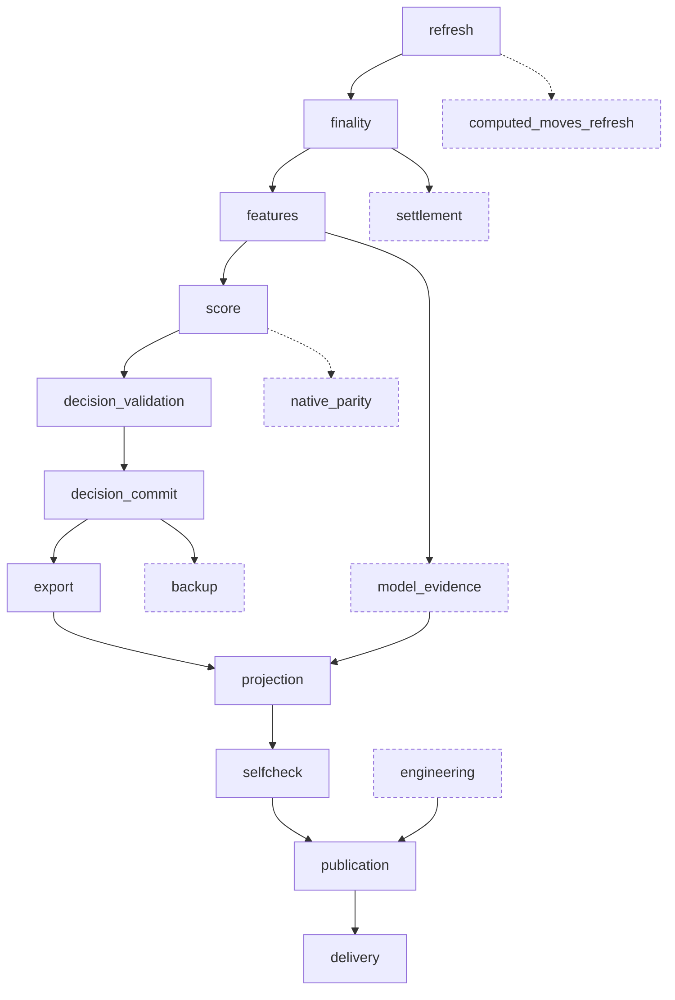
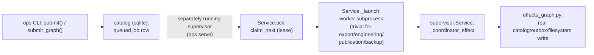
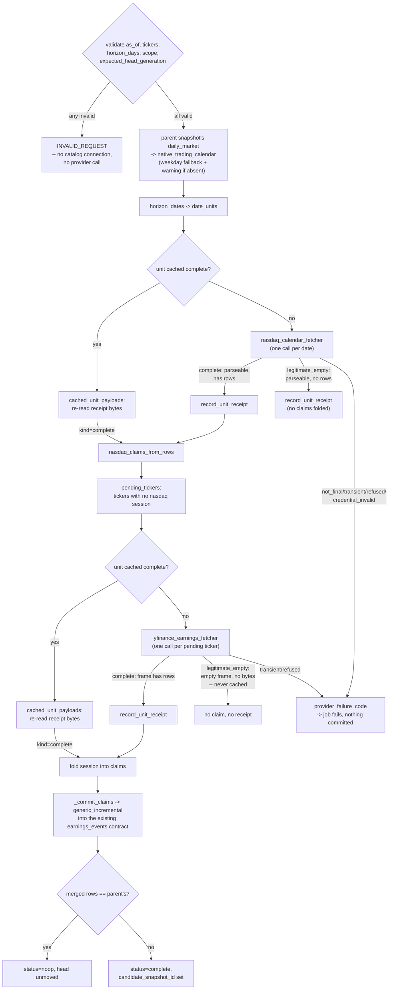
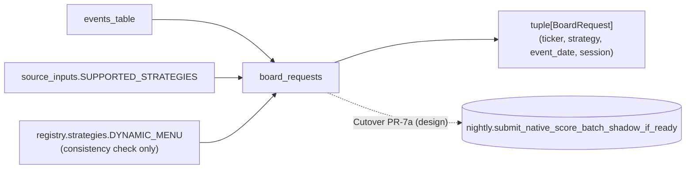
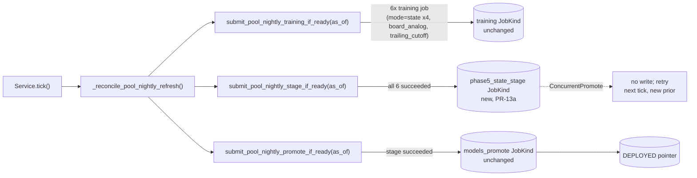

# `engine/v2/ops` — architecture

Layer 7.0 in the root `/ARCHITECTURE.md` layer table. Replaces the new
supervisor/catalog design, `dashboard/nightly.py` (as a job graph) and
`tools/bounded_run.py` (as an executor adapter). See the root doc for the
layer rules this package is checked against; this doc covers the detail
specific to this package.

## Purpose

Durable job submission, leases, retry history and dependencies; resource
admission and per-job CPU placement; the nightly job graph and its release
boundary. It does not decide research conclusions (`engine/v2/evaluation`)
and does not compute a score (`engine/v2/scoring`) — it only sequences and
persists the jobs that call into those packages.

This doc also covers `native_board_universe.py`: a pure, answer-free
enumerator that reproduces legacy `engine.score.score_calendar`'s event ×
strategy enumeration for the strategies native scoring supports, without
touching the legacy chain index or constructing a legacy `Scorer`. It has
no production caller yet — see "Dependencies" below.

## Primary contracts and public interfaces

The operator interface is the versioned command protocol
`engine/v2/ops/cli.py` exposes (`python3 -m engine.v2.ops <command>`),
derived directly from its `argparse` definitions:

- `init`, `doctor`, `health`
- `serve` — starts the supervisor loop
- `plan {nightly,experiment,training,promote}` — builds and saves a plan
  document; `training`/`promote` (P6 slice 5) take operator-only arguments
  (`--training-mode`, `--recipe`, `--state`, `--alpha`, `--cutoff`,
  `--strategy`, `--pairs`, `--ticker-chunk`, `--release-root`,
  `--release-id`) and are never part of the nightly DAG
- `submit --plan --idempotency-key`
- `rescore --request --native-inputs` — read-only, no provider pulls, no fitting
- `capture-inputs --as-of --tickers --context-tickers --year-start --year-end --source-root --output`
- `reconcile <job_id> --expected-attempt`
- `provider-account --account --remaining --live-reserve`
- `snapshot {plan-import,submit,promote,rollback}`
- `ledger {import-history,status,calibrate,book}`
- `decisions supersede --row-id --reason --from-json`
- `price-refresh --session [--dry-run]`
- `price-history capture --source-root --scope [--dry-run]`
- `get`/`logs`/`cancel`/`resume`/`explain <job_id>`

Internally: `nightly.py`'s `GRAPH`, `graph_order()`, `OPTIONAL`,
`NO_JOB_STAGES`, `build_nightly_plan`, `build_legacy_job_requests`,
`_stage_sequence` (see §"Diagrams" below); `supervisor.Service`/`serve`;
the coordinator-effect functions in `effects_graph.py`; `training.py`'s
`training_job_kind`/`promote_job_kind` (registered in `stages.py::_core_kinds`,
alongside the nightly stage kinds, not in
`supervisor._COORDINATOR_EFFECT_KINDS`), `training_plan`/`promote_plan` and
`run_training_worker`/`run_promote_worker`; `BoardRequest`/
`board_requests(as_of, horizon_days, tickers, events_table)`
(`native_board_universe.py`) — a pure key `(ticker, strategy, event_date,
session)` and the function that enumerates one per event × native-covered
strategy, plus one `DYN-SV` meta-request per event; `calendar_moves_jobs.py`'s
`computed_moves_job_kind`/`forward_calendar_job_kind` (both registered in
`stages.py::_core_kinds`, the same ordinary-job-kind pattern as
`training`/`promote_job_kind` above, not a coordinator effect),
`CalendarMovesParameters`/`calendar_moves_parameter_problems`/
`calendar_moves_job_spec`, and `run_computed_moves_worker`/
`run_forward_calendar_worker` (dispatched by `worker.py` for worker
`"computed_moves_refresh"`/`"forward_calendar_refresh"` respectively) — see
"Primary contracts" below for what each adapts; "Outputs" below now covers
`computed_moves_refresh`'s nightly caller (Part 4). Issue #52's prerequisite
(an attempt-fence check in `forward_calendar_store`'s own commit path, so a
cancelled/expired attempt can never commit — see below) landed in #55;
`forward_calendar_refresh` now has a `JobKind` too (worker dispatch, a
loader callback, parameter validation — a separate, later change from #55
itself), but it still has neither a `nightly.py` `GRAPH`/`OPTIONAL` node nor
a `supervisor.Service` submitter: that wiring is a separate, later PR,
mirroring how `computed_moves_refresh`'s own Part 4 nightly wiring (#54)
followed its Part 3 registration (#50).

A small number of natively-fetched data stores live directly in this
package rather than delegating computation to another v2 layer — like
`price-history capture` above, `forward_calendar_store.py` (spec s4c) is
one of these. It does NOT claim `RefreshCallback` compatibility itself:
`main`'s `RefreshParameters` (`incremental_data.py`) has no
`as_of`/`tickers` field, so a function shaped `(parameters, root)` could
never read them from it. `run_forward_calendar_refresh` is instead a
standalone runner with an explicit, fully keyword-only signature
(`catalog_path`, `objects_root`, `parent_snapshot_id`, `refresh_plan_hash`,
`as_of`, `tickers`, `horizon_days`, `scope`, `expected_head_generation`,
`expected_head_snapshot_id`, `attempt_id`, `fence`, `nasdaq_fetcher`,
`earnings_fetcher`) that validates every one of its twelve non-fetcher
arguments before touching the catalog or a provider, including `scope`
(must be `"shadow"` or `"smoke"`), `expected_head_generation`
(non-negative), `expected_head_snapshot_id` (Part 3: `None` or a bounded
1..128-char string, matching `parent_snapshot_id`'s own shape — the old
code read it straight into
`_commit_claims`/`generic_incremental.commit_generic_table_candidate`
unchecked), and `attempt_id`/`fence` (issue #52: `None`/`None`, or a
non-empty string paired with an `int >= 1` — the same optional-pair shape
`computed_moves_store`'s staged `attempt_id`/`fence` document fields have);
`tickers=()` is valid and means the whole market (see "Failure semantics"
below). **The commit path now carries the same live-attempt-lease check
`computed_moves_store` has (issue #52, closed by this change):**
`_commit_claims` accepts `attempt_id`/`fence` and passes
`generic_incremental.commit_generic_table_candidate` a `fence_check`
built by this module's own `_fence_check_for` — byte-identical in shape to
`computed_moves_store._fence_check_for` — which is a no-op when
`attempt_id` is `None` (a manual/ad-hoc invocation with no live job behind
it, same as `computed_moves_store`) and otherwise calls
`engine.v2.ops.lifecycle.verify_fence` inside the SAME commit transaction
the head compare-and-swap runs in, so a cancelled job (`CANCELLED`) or an
expired lease (`LEASE_LOST`) is refused before anything commits — never
after. `generic_incremental.commit_generic_table_candidate` gained a new
optional `fence_check` parameter for this, COMPOSED with (never a
replacement for) its existing `_head_fence` check: `_head_fence` always
runs first, then the supplied `fence_check` (if any) runs after it, both
inside the one callable `catalog.commit_snapshot` invokes — CodeRabbit
review, PR #55 round 2 (`catalog.commit_snapshot` skips its own
`_check_head_expectation` call on an idempotent-replay shortcut
(`_existing_receipt`), but it always calls whatever `fence_check` it was
given BEFORE that shortcut lookup, so composing here is what keeps
head-conflict detection active on that shortcut path too). Omitting
`fence_check` (the default) keeps this function's previous, unchanged
behavior for its other two callers, `engine/v2/data/incremental.py`'s
generic-refresh path and `engine/v2/research/_trades_publish.py`, neither
of which is touched by this change. `calendar_moves_jobs.run_forward_calendar_worker` (dispatched by `worker.py`
for worker `"forward_calendar_refresh"`) is this runner's job-layer bridge:
it decodes the job's own `CalendarMovesParameters` (which now carries
`tickers`/`horizon_days` again — see "Primary contracts" above) and calls
`incremental_data._load_forward_calendar_refresh_callback()` to get a
`(parameters, root)`-shaped closure with the two injected network edges
pre-bound, the same lazy-construction shape
`_load_computed_moves_refresh_callback` already has. Unlike
`computed_moves_refresh`, whose staged document restates several fields
`computed_moves_store` reads back from it, `forward_calendar_refresh`'s own
staged document (`refresh_staging.py`,
`REFRESH_INPUT_DOCUMENT_NAMES["forward_calendar_refresh"]`) carries ONLY
`attempt_id`/`fence` — every other value this runner needs already lives on
the job's own immutable `CalendarMovesParameters`, so restating it could
only drift. `attempt_id`/`fence` vary per attempt (a retried attempt gets a
new fence), so they cannot be pre-bound the way the fetchers are: the
closure reads the staged document at call time, from the attempt's own
`root`, after first format-checking `parameters.expected_head_snapshot_id`
(the same bounded-1..128-char-or-`None` one-line shape check
`computed_moves_store._validate_document_head` uses, mirrored not imported)
— before that file read or any other I/O — then passes
`attempt_id`/`fence` straight through to `run_forward_calendar_refresh`,
which is what actually makes the #55 fence check live for a supervised,
leased, retried, cancellable attempt rather than the permanent `None`/`None`
no-op it would otherwise stay. Its pure helpers (`horizon_dates`,
`date_units`, `ticker_units`, `plan_forward_calendar`,
`resolve_session_claims`, `nasdaq_rows_from_payload`,
`nasdaq_claims_from_rows`, `pending_tickers`) are unit-testable without a
catalog or a network. This runner's only production-shaped caller today is
`run_forward_calendar_worker`; nothing yet submits a
`forward_calendar_refresh` job (no nightly `GRAPH` node, no
`supervisor.Service` submitter — a separate, later PR).

`native_score_batch.py` (this PR adds this module, its `stages.py` job kind
and its `worker.py` dispatch branch together — this doc describes the
module as this PR leaves it, not a pre-existing fact): the batch-shaped
seam between the board universe (`native_board_universe.BoardRequest`) and
`engine.v2.scoring.application.score_batch`. `assemble_score_batch_inputs`
turns one release binding (`engine.v2.scoring.release_bindings.
ScoringReleaseBinding`, PR-1) plus a sequence of one already-staged
`NightlyEventInputs` per event (calendar/panel/Tier-4/quote rows, the
same shape `engine.v2.scoring.nightly_source_bundle.
assemble_nightly_source_bundle`, PR-2, already accepts) into
`dict[BoardRequest, tuple[ScoreRequest, NativeScoreInputs]]` plus a tuple of
typed per-row `NativeScoreBatchRowRefusal`s — never a raised exception for a
bad row (see "Failure semantics" below). It is a pure function: no catalog,
no filesystem, no network. An empty `events` sequence is a legitimate no-op,
never a refusal or an error: the returned map and refusal tuple are both
empty. `run_native_score_batch_worker(parameters, root)`
is the `native_score_batch` job kind's worker entrypoint (dispatched from
`worker.py`, registered in `stages.py::_core_kinds`): it resolves the
release once via `resolve_release_binding(parameters["release_root"])`,
reads the one staged `events.json` document (an array of per-event inputs,
materialized into `root` by `executor._materialize_inputs` from the job's
own `input_bindings` exactly like `adhoc_rescore`'s `request.json`/
`native_inputs.json`), calls `assemble_score_batch_inputs`, then
`engine.v2.scoring.application.score_batch` under `engine.v2.models.no_fit.
no_fit_guard()` (the same guard `_dispatch_adhoc_rescore` already uses), and
writes `records.json`/`refusals.json`. An `events.json` decoding to an empty
list produces empty `records.json`/`refusals.json` and
`completed_ids=list(parameters["expected_ids"])`/`no_work=not
parameters["expected_ids"]` — the same "no work" shape `artifact_check`
already reports for an empty `expected_ids`, never a distinct code of its
own. **This bounded batch assembler
supports `STR-THRU` only** (the same strategy `nightly_source_bundle.py`'s
own bounded builder documents as its scope) — any other `BoardRequest.strategy`
in the input sequence refuses per-row (`UNSUPPORTED_STRATEGY`), never raises
out of the batch. **No production caller submits this job kind yet**: like
`computed_moves_job_kind()` before Part 4 wired it into `nightly.py`, this PR
registers the kind and its worker dispatch only — a later cutover PR (PR-4/
PR-6, per `scratchpad/cutover_wiring_plan.md`) builds the caller that
enumerates `BoardRequest`s, stages their per-event inputs, and submits this
job kind from the nightly graph. `nightly.py` is not touched by this PR.

**Cutover PR-4 (redo — 2026-09-27, user decision option (c). This section
REPLACES the original PR-4 design, which proposed `tools/native_parity_run.py`,
a manual/operator-invoked script, as `native_parity`'s production caller.
The previous owner proved that script can never be more than manual: it
calls `run_shadow_nightly`, which "has no production caller [and] needs
14 caller-supplied stage handlers nothing builds" — a manual script
outside any schedule is not what "the REAL nightly" means. This doc
describes the design Phase 2 of this redo will leave it, not a
pre-existing fact: Phase 1 (this push) is documentation only, for
`legacy_parity_rows` and the new `native_parity` job kind together, both
gated on cutover PR-7a (`#88`) merging first — `native_parity`'s native-side
input is the `native_score_batch` job's staged `records.json`/`refusals.json`
output PR-7a's design places there, so this redo cannot be implemented
before that one lands. Cutover PR-3 (`native_score_batch.py`, `#66`) is
already merged, unlike when the original PR-4 was written. One piece is
untouched by this redo, real code already on `main`, independent of
everything `#66`/`#88` supply: `native_parity_report.py`'s tolerance
policy is already pluggable — see "the tolerance policy is now pluggable"
below, unchanged.**

`native_parity` closes the gap the root doc §4 and this doc's own
"Diagrams" section both name: `run_shadow_nightly` "has no production
caller, only tests ... call it," so in production `native_parity` today
never actually compares anything — a production run supplies no
`parity_rows`, `_registered_handlers` defaults both sides to `{}`, and
`compare_native_vs_legacy`'s own `_refuse_empty_inputs` raises
`VALIDATION_FAILED` before any comparison runs, which `_run_stage` turns
into a `"degraded"` receipt for this `OPTIONAL` stage (see "Outputs"
below for why this is NOT the same claim as "writes an empty-input
report" — no report is ever written either). **This redo does not close
that gap through `run_shadow_nightly` at all.** That function keeps its
existing stage-walk and `native_parity_handler`'s existing signature
contract completely unchanged (both already correctly consume real
`legacy_rows`/`native_rows` dicts today — proven by
`tests/test_v2_ops_native_shadow_render.py` — and stay exactly the
test-only path they always were; nothing before this redo, or in it,
builds real dicts to hand `run_shadow_nightly` in production). The gap
closes through a SEPARATE production path: a new `native_parity` job
kind, submitted by `supervisor.Service`'s own tick-loop sidecar —
mirroring `computed_moves_refresh` (Part 4, `#54`) and `native_score_batch`'s
own shadow submission (`#88`) byte-for-byte in shape — never through
`build_legacy_job_requests`, so a broken parity submission can never
abort a required legacy stage. That job's worker calls the exact same
`compare_native_vs_legacy`/`native_parity_handler` functions
`run_shadow_nightly` already calls, so the two paths — one test-only, one
production — can never silently diverge in comparison logic: root doc
§5's "one shared parity comparator" invariant, restated one level up as
one shared CALLER of that comparator, reached two ways.

Four new symbols, mirroring `native_score_batch`'s own PR-7a shape:

- `supervisor.Service._reconcile_native_parity` — a new tick-loop sidecar
  method, called from `Service.tick` (`supervisor.py:227`) right after
  `self._reconcile_native_score_batch_shadow()` (`#88`, itself called
  right after `self._reconcile_computed_moves_refresh()`,
  `supervisor.py:241`) — so the tick's native-shadow sidecar chain reads
  computed_moves_refresh → native_score_batch (shadow) → native_parity,
  each stage's identity check a strict superset of what the one before it
  already confirmed.
- `nightly.submit_native_parity_if_ready` — the builder the sidecar calls,
  mirroring `submit_computed_moves_refresh_if_ready` (`nightly.py:858`)/
  `submit_native_score_batch_shadow_if_ready` (`#88`) in signature shape.
- `nightly._native_parity_identity` — a cheap catalog-only identity check
  mirroring `_computed_moves_identity` (`nightly.py:830`): finds the
  latest succeeded `native_score_batch` job by its own idempotency key
  (`"nightly:<as_of>:<scope_hash>:native_score_batch"`, `#88`'s own R6),
  parses `(as_of, scope_hash)` out of it, and recovers the paired
  succeeded `"score"` job's id with the SAME query `#88`'s own
  `_native_score_batch_identity` already runs to find a session's
  `"score"` job (`"nightly:<as_of>:<scope_hash>:score"`) — reused here
  with `(as_of, scope_hash)` already known rather than searched for,
  never a second, independently written lookup. Returns `(as_of,
  scope_hash, score_job_id, native_score_batch_job_id)`, or `None` when
  no succeeded `native_score_batch` job exists yet.
- `stages.py::_native_parity_kind()` — a new `JobKind`, mirroring
  `_native_score_batch_kind()` (`stages.py:271`) in shape:
  `name="native_parity"`, `worker="native_parity"`,
  `parameters=NativeParityParameters` (new, `RescoreParameters`-shaped —
  only `expected_ids` and `input_bindings`; this job carries no scalar
  data of its own, since every input it reads is job-bound),
  `resource_classes=frozenset({"validation"})` (a pure comparison, no
  provider fetch — the same classification `decision_evidence` already
  has), `effects=("staged",)`, `retry=RetryPolicy("bounded", 2, (5, 30))`,
  `checkpoint_contract="native_parity_report.v1.1"` (a minor version bump
  from today's `native_parity_report.v1.0` — see "Outputs" below for the
  one additive field), `namespaces=frozenset({"shadow", "smoke"})`.
  `worker.py::dispatch` gains a `"native_parity"` branch routing to
  `native_parity_report.run_native_parity_worker` (below), the same
  lazy-import-inside-`_dispatch_*` pattern `_dispatch_native_score_batch`
  already uses (`worker.py:167-168`, `:198-200`).

`nightly.GRAPH` gains a `"native_score_batch": ("score",)` node (`#88`),
and `"native_parity"`'s own existing node (`nightly.py:58`) widens from
`("score",)` to `("score", "native_score_batch")` — topological
documentation only, for `run_shadow_nightly`'s whole-graph test-only
walk; no submission path reads either edge (the same "documentation, not
a submission source" rule Part 4 already established for
`computed_moves_refresh`'s own node).

- **`nightly.legacy_parity_rows(score_document: Mapping[str, Any]) ->
  dict[str, dict]`** (new, this package). Keys the legacy `score.json`
  document's own `"rows"` array by
  `engine.v2.ops.decision_validation.population_key`'s `"ticker|strategy|
  event_date"` format — REUSED, not re-derived and not re-added: this
  public function already exists (`decision_replay.py`'s own population
  comparison already imports it), and it is the identical three-field
  format `engine.v2.serving.native_render.native_row_key` already derives
  for a native `ScoreRecord` (that module's own docstring: `"the native
  twin of bridge._population_key"` — `legacy_adapter._population_key` is a
  second, private, byte-identical copy of the same format used only for
  `_action_score`'s own population check; this PR reuses the PUBLIC one
  `decision_validation` already exports, adding no new function). Pure: no
  filesystem, no clock, and — the point of putting this here rather than
  in the composing script below — no import of `engine.v2.serving` (a
  layer-7.0 peer of `engine.v2.ops`, per the root doc's layer table;
  `checks/import_layers.py` would refuse that edge). A `score_document`
  with no `"rows"` key returns `{}` (not a refusal —
  `native_parity_handler`'s existing `_refuse_empty_inputs` already turns
  an empty `legacy_rows` into `VALIDATION_FAILED` downstream, so this
  function does not need its own empty-input check).
  **`legacy_parity_rows` does NOT reuse `population_key`'s own
  `.get(key, "")` empty-string substitution for a missing
  `ticker`/`strategy`/`event_date`** (root doc §5: "a missing or unusable
  input produces an explicit withheld/refused status," never a silent
  default) — reusing that substitution here would let one malformed row's
  empty-string-keyed entry either collide with a genuinely empty-fielded
  row, or, more likely with real data, simply end up unique and reported
  as an ordinary `only_legacy` row: quietly absorbed into the report as a
  population difference rather than surfaced as the malformed input it
  actually is. **Duplicate keys are the same class of finding, not a
  separate one**: `_action_score`'s own population check
  (`observed_keys = {_population_key(row) for row in rows}`) compares
  `population_key` values only as a SET, so a `score.json` carrying two
  rows under one `ticker|strategy|event_date` key (sibling precedent:
  `decision_replay.decision_population` rejects a duplicate population
  key explicitly, via `VALIDATION_FAILED`; `_action_score` does not)
  already passes that check today without ever proving the two rows
  agree — a plain `{key: row for row in rows}` comprehension in
  `legacy_parity_rows` would then silently keep whichever row iterated
  last and drop the other with no trace. `legacy_parity_rows` therefore
  validates every row before keying any of them: a missing/empty
  `ticker`/`strategy`/`event_date`, OR two rows sharing one
  `population_key` value, each raises `OpsError` — matching
  `decision_population`'s own code, `VALIDATION_FAILED` (detail naming
  the row index/missing field, or the repeated key and both rows'
  indices) — for the WHOLE call, before any dict is constructed: a
  batch-level refusal, never a per-row skip or a last-write-wins
  collision, so a malformed or duplicate-keyed `score.json` is never
  silently read as smaller, or different, than it actually is. The same
  refusal covers the shape one level up, before `population_key` is ever
  called on a row: `score_document["rows"]`, if present, must be a list of
  mappings — a non-list value or any non-mapping element raises `OpsError`
  (`VALIDATION_FAILED`) rather than letting `population_key`'s own
  `.get(...)` calls raise a bare `TypeError`/`AttributeError` on a
  malformed element.
  `population_key`, `_population_key`, and `_action_score`'s own
  set-based check are all unchanged by this PR.
- **`native_parity_report.run_native_parity_worker(parameters, root)`**
  (new) — the `native_parity` job kind's worker entrypoint (dispatched
  from `worker.py`, registered in `stages.py::_core_kinds`). Reads its two
  job-bound inputs (`score.json` from the paired `"score"` job;
  `records.json`/`refusals.json` from the paired `native_score_batch` job
  — see "Inputs" below for exactly how `_native_parity_identity` finds
  both). By the time this worker runs, `submit_native_parity_if_ready`
  has ALREADY confirmed both documents carry the CURRENT `v2.0`
  `schema_version` tags before ever submitting the job (a deliberate,
  documented exception to `_native_parity_identity`'s own catalog-only
  lookup — see "Cutover PR-4 (redo)'s own input sourcing" above for
  exactly where that check runs and why it belongs there, not here, and
  "R1, missing input" below for the wait-state outcome on a mismatch), so
  this worker trusts the schema without re-checking it: an already-submitted `native_parity` job's
  `records.json`/`refusals.json` are guaranteed `v2.0`-shaped by
  construction, never a retained `v1.0` artifact. It builds
  `legacy_rows`/`native_rows`/`native_refusals`/`unkeyable_refusals` (via
  `_native_rows_and_refusals`, below), and branches on whether `legacy_rows` and
  `native_rows` share any key (below, `_empty_native_report`) before
  calling the SAME `compare_native_vs_legacy` (unchanged) and the new
  `apply_native_refusals` (below) — see "Outputs" for what it writes.
  This is the real (only) production caller `tools/native_parity_run.py`
  was originally designed to be. **That script is dropped from this redo
  entirely — no code for it was ever written** (confirmed against `main`:
  neither the file nor `legacy_parity_rows`/`row_explanations` exist
  today, so nothing needs migrating away from it), never built as a
  parallel manual path alongside the job. There is exactly one way a real
  `native_parity_report.json` gets produced in this codebase once Phase 2
  lands, not two.
- **`native_parity_report._empty_native_report(legacy_rows, native_rows,
  dimensions, tolerance_policy) -> dict`** (new, private) — closes a real
  gap `compare_native_vs_legacy`'s own row-sharing checks would otherwise
  cause (CodeRabbit round 3; widened by an Opus gate finding, both real).
  Two EXISTING, UNCHANGED checks inside `compare_native_vs_legacy` can both
  fire even though a refusal fully explains the gap: `_refuse_empty_inputs`
  (`not native_rows` → `VALIDATION_FAILED`) when native produced nothing at
  all, and the function's own `if not compared: raise fail("VALIDATION_FAILED",
  "native parity report shares no row key", ...)` (`native_parity_report.py:178`,
  pre-existing, unchanged by this redo) whenever `legacy_rows` and
  `native_rows` share NO key — which happens not only when `native_rows`
  is empty, but also when `native_rows` is non-empty yet none of its keys
  overlap `legacy_rows`'s (every row that would have overlapped was
  instead refused). `run_native_parity_worker` therefore checks
  `legacy_rows` is non-empty FIRST — an empty `legacy_rows` is a genuinely
  missing legacy input, never something a native refusal can explain, so
  it ALWAYS falls through to `compare_native_vs_legacy`'s existing checks
  and fails `VALIDATION_FAILED`, exactly as before this redo, regardless
  of how many native refusals exist. Only once `legacy_rows` is confirmed
  non-empty does it compute `shared = set(legacy_rows) & set(native_rows)`
  BEFORE calling `compare_native_vs_legacy` at all, and take this path
  whenever `shared` is empty AND EITHER `native_refusals` (keyed) OR
  `unkeyable_refusals` (above) is non-empty — "some refusal exists to
  explain why nothing matched," not "native_rows is empty," and ONLY once
  a legacy input actually exists to explain. This covers every case the
  narrower "`native_rows` empty" check alone would miss:
  - **All refused, none keyable.** Every row refused `INVALID_KEY_FIELD`
    (above): `native_rows` and the keyed `native_refusals` are BOTH empty,
    but `unkeyable_refusals` is fully populated. The narrower check (only
    testing keyed `native_refusals`) would wrongly fall through to a
    normal `compare_native_vs_legacy` call and hit `_refuse_empty_inputs`.
  - **Disjoint keys, native_rows non-empty.** Every legacy row's native
    counterpart was refused (keyed or unkeyable), while `native_rows`
    itself holds OTHER rows entirely (different tickers/strategies,
    genuinely `only_native`) that share no key with `legacy_rows`. Because
    `native_rows` is non-empty, `_refuse_empty_inputs` would not fire, but
    `shared` is still empty, so the pre-existing "no shared key" check
    (`native_parity_report.py:178`, above) would — even though every legacy row's absence IS
    explained by a refusal, exactly `native_refused`/`native_refused_unmatched`'s
    (below) reportable outcome, not a missing-input failure.
  - **All refused, keyable.** The ORIGINAL narrower case (`native_rows`
    empty, keyed `native_refusals` fully populated): still covered, since
    `shared` is trivially empty when `native_rows` is.

  In every covered case, `_empty_native_report` builds the SAME dict shape
  `compare_native_vs_legacy` would return for a would-be comparison with no
  shared keys — `{"schema_version": SCHEMA_VERSION, "tolerance_policy_id":
  tolerance_policy.policy_id, "compared": [], "only_legacy":
  sorted(legacy_rows), "only_native": sorted(native_rows), "mismatches":
  []}` (unlike the original narrower version, `only_native` is NOT
  hardcoded `[]`: because `shared` is empty by construction on this path,
  EVERY key of `native_rows` is, by definition, `only_native` — never
  `compared`, since nothing shared) — WITHOUT calling
  `compare_native_vs_legacy` (there is no numeric comparison to make:
  nothing shared was scored against anything), and `apply_native_refusals`
  runs on it exactly as it would on a real comparison's output, narrowing
  `only_legacy` by `native_refused`/`native_refused_unmatched` the
  identical way. If `shared` is empty and BOTH `native_refusals` and
  `unkeyable_refusals` are empty (native_score_batch produced nothing at
  all AND refused nothing — a genuinely missing native input, nothing to
  explain the gap), or if `legacy_rows` is empty, `run_native_parity_worker`
  calls `compare_native_vs_legacy` normally and lets its EXISTING checks
  raise `VALIDATION_FAILED` — the correct outcome for THAT case is
  unchanged. `compare_native_vs_legacy` itself gains no new parameter and
  no new branch for this: the decision of which path to take is
  `run_native_parity_worker`'s own, so `run_shadow_nightly`'s test-only
  path (which never has refusals to give it) is unaffected either way.
- **`native_parity_report.apply_native_refusals(report, native_refusals,
  unkeyable_refusals=()) -> dict`** (new) — the mechanism for "missing or
  refused native rows are counted separately" (user decision, option (c)).
  `compare_native_vs_legacy` itself is UNCHANGED — pure, refusal-blind,
  unaware `native_score_batch` can refuse a row at all — so
  `run_shadow_nightly`'s own test-only path (which has no refusals to give
  it) sees no behavior change. `run_native_parity_worker` calls this AFTER
  `compare_native_vs_legacy` or `_empty_native_report` (above) returns: any
  key in the report's own `only_legacy` list that is ALSO a key of
  `native_refusals` (population-key → refusal code, built from
  `records.json`'s paired `refusals.json`) moves from `only_legacy` into a
  NEW `"native_refused"` list (each entry `{"row_key": ..., "refusal_code":
  ...}`), and is removed from `only_legacy` — never counted in both. A
  `native_refusals` key that is NOT in `only_legacy` (the row was actually
  compared, or was `only_native`) is left untouched:
  `assemble_score_batch_inputs`'s own per-row either/or contract (PR-3)
  already makes one row both scored and refused impossible within one
  `records.json`/`refusals.json` pair, so this function trusts that
  pairing rather than re-validating it, exactly as `legacy_parity_rows`
  trusts `score.json`'s own shape once its own up-front validation
  passes. `only_legacy` therefore narrows to its real meaning under this
  redo: a legacy row `native_board_universe.board_requests` never even
  enumerated as a `BoardRequest` (an unsupported strategy, the `DYN-SV`
  wildcard) — never a row native attempted and explicitly refused, which
  `native_refused` names instead.
  **A refusal with no legacy counterpart is reported, never dropped
  (CodeRabbit round 5, real finding).** A `native_refusals` key that is
  NOT in `only_legacy` cannot be in `compared`/`only_native` either (a
  refused `BoardRequest` is by construction absent from `native_rows`,
  and both those buckets are built only from `native_rows`) — so the ONE
  remaining possibility, silently ignored by the original design, is a
  refusal whose projected `population_key` is not in `legacy_rows` at
  all: `native_score_batch`'s own board universe found and refused a row
  legacy's own `score.json` never carried in the first place. That case
  is now appended to a second NEW list, `"native_refused_unmatched"`
  (same `{"row_key": ..., "refusal_code": ...}` shape as `native_refused`,
  kept separate rather than merged so a reader can tell "legacy scored it,
  native refused it" apart from "native refused a row legacy never had").
  Every entry of `unkeyable_refusals` (the third, optional argument —
  `_native_rows_and_refusals`'s own pass-through of `refusals.json`'s
  `"unkeyable_refusals"` array, below) is appended to the SAME
  `"native_refused_unmatched"` list unconditionally, using its raw
  structured `{"ticker":..., "strategy":..., "event_date":...,
  "session":...}` key instead of a `row_key` string (below) — an
  `INVALID_KEY_FIELD` refusal never attempts the keyed join at all (its
  own source fields are exactly what made a safe key impossible to
  construct), so it is reported this way regardless of whether a
  same-identity legacy row exists, rather than trying to prove a negative
  match first. Every native refusal — keyed or not, legacy-matched or
  not — therefore lands in exactly one of `native_refused` or
  `native_refused_unmatched`; none is ever silently absent from the
  report.
- **`native_parity_report._population_key_from_board_request_key(key) ->
  str`** (new, private) — projects one `records.json`/`refusals.json` key
  (the 4-field canonical `BoardRequest` string `#88` specifies,
  `f"{ticker}|{strategy}|{event_date.isoformat()}|{session}"`) down to the
  3-field `population_key` format `legacy_parity_rows` already uses, by
  splitting on `"|"` into exactly 4 parts and calling
  `engine.v2.ops.decision_validation.population_key({"ticker": ticker,
  "strategy": strategy, "event_date": event_date})` — REUSING
  `population_key`'s own join format rather than string-concatenating a
  fourth time, so the two sides can never silently drift onto two
  different separators or field orders. `session` is validated as present
  (exactly 4 parts) but never folded into the key: legacy rows carry no
  `session` field to join against. A key that does not split into exactly
  4 parts is a batch-level `OpsError` (`VALIDATION_FAILED`) — matching
  `legacy_parity_rows`'s own all-or-nothing malformed-input discipline —
  raised before `run_native_parity_worker` builds `native_rows`/
  `native_refusals` at all, never a per-row skip.
- **`native_parity_report._native_rows_and_refusals(records_document,
  refusals_document) -> tuple[dict[str, dict], dict[str, str], tuple[dict,
  ...]]`** (new, private) — the ONLY caller of `_population_key_from_board_request_key`
  (above), and the place a duplicate collision is caught: the projection
  from a 4-field `BoardRequest` key down to a 3-field `population_key` is
  LOSSY (it drops `session`), so two DISTINCT `records.json`/`refusals.json`
  keys — the same `(ticker, strategy, event_date)` under two different
  `session` values, a genuinely possible events-table shape this design
  does not assume away — can project to the SAME `population_key`
  (CodeRabbit round 1, real finding). Silently keeping whichever one a
  dict comprehension iterates last would be exactly the last-write-wins
  collision `legacy_parity_rows` already refuses to allow for
  `score.json`'s own rows (above) — so this function applies the IDENTICAL
  discipline to the native side: every key in `records_document["records"]`
  and every key in `refusals_document["refusals"]`, TOGETHER (one row can
  never be both a record and a refusal, but two DIFFERENT rows — one a
  record, one a refusal, or both records, or both refusals — can still
  collide after projection, and this check catches all three shapes), is
  projected, and any `population_key` value produced by more than one
  distinct source key raises `OpsError` (`VALIDATION_FAILED`, detail naming
  the colliding `population_key` and both source `BoardRequest` keys) for
  the WHOLE call, before `native_rows`/`native_refusals` are built — never
  a per-row skip or a silent overwrite. No collision has ever been observed
  in practice (native's own board universe enumerates one `BoardRequest`
  per `(ticker, strategy, event_date, session)` combination the events
  table actually carries); this guard exists because the projection makes
  a collision POSSIBLE, not because one has occurred. **This function
  REQUIRES the key — `refusals_document["unkeyable_refusals"]`, never
  `.get("unkeyable_refusals", ())` (CodeRabbit round 6, real finding).**
  This function's only caller, `run_native_parity_worker` (below), is only
  ever reached for a job `submit_native_parity_if_ready` ("R2, cache",
  below) already confirmed carries `refusals_document["schema_version"]
  == "native_score_batch_refusals.v2.0"` before submission, and the v2.0
  writer ALWAYS emits this key, even as `[]` for a batch with no unkeyable refusals (the
  "refusals.json" bullet, above) — so its absence on a document already
  confirmed v2.0 means the file is malformed (truncated, hand-edited, or
  written by a defective producer), never a legitimate "this batch has
  none" case a silent default could paper over. A `KeyError` here is
  caught by `run_native_parity_worker` alongside its other
  `records.json`/`refusals.json` decode failures (below, "R1, missing
  input") and fails the WHOLE job attempt, exactly like a document that
  fails to decode at all — never a per-row skip, and never a silently
  empty `unkeyable_refusals`. The (now guaranteed-present) value is passed
  through completely unchanged — `INVALID_KEY_FIELD` rows (below) never
  had a `population_key` computed for them at all (that is exactly what
  makes them "unkeyable"), so there is nothing for this function to
  project, decode, or collision-check; it is `apply_native_refusals`
  (above), not this function, that consumes them.

**The original PR-4 design's "explained" bucket (`ROW_EXPLANATION_CODES`,
`row_explanations`) is dropped from this redo, not carried forward** —
see "Out of scope" below: no reusable stale-px/finality-drift classifier
exists today, so there is nothing for it to plug into yet, and this redo
does not invent one. A future PR can add it exactly as originally
specified, against `compare_native_vs_legacy`'s unchanged signature,
whenever a real classifier exists.

**The tolerance policy is now pluggable, not hardcoded — this part of the
PR is real code, already merged into this push, independent of `#66`.**
`engine.v2.parity.dimensions.compare_dimension` gained a keyword-only
`tolerance_policy` parameter (default `SCORE_RECORD_V1`, so the Phase 4
checker and every existing test are unaffected — none of them pass this
argument, so none of them can observe a behavior change);
`native_parity_report.compare_native_vs_legacy`/`native_parity_handler`
each gained the identical parameter, threaded straight down to
`compare_dimension`, and the written report now records
`"tolerance_policy_id": tolerance_policy.policy_id` so a reader of
`native_parity_report.json` can always see which policy compared it —
never an implicit, undiscoverable default. **Per-field tolerances come
from ONE config policy, the `engine.v2.parity.tolerance.TolerancePolicy`
type** (never a second ad hoc mechanism): the default that ships in this
PR is still `SCORE_RECORD_V1`, which declares zero per-field rules
(`rules=()`), so every one of the five dimensions' 30 fields —
`FORECAST_FIELDS` (12), `SIMULATION_FIELDS` (7), `FINANCIAL_FIELDS` (5),
`GATE_FIELDS` (3), `ANALOG_FIELDS` (3) — still compares under exact
equality until a caller explicitly plugs in a different policy. **No
per-field tolerance VALUE is added, chosen, or implied by this PR** —
that is a user decision, taken to the user separately, and per instruction
none of those values belong in this doc, the PR body, or an issue; only a
`TolerancePolicy` built and ratified elsewhere is ever passed in here.
`tolerance.py`'s own docstring names the risk this design avoids:
"chosen to make the first run pass" is a named failure mode, so this PR
adds the SEAM a ratified policy plugs into, not a guess at what it should
contain.

**Out of scope for this redo** (each a real gap, named rather than
silently left implicit): the stale-px/finality-drift classifier and the
"explained" bucket mechanism the original PR-4 design specified (above —
still no reusable classifier exists; a future PR adds it once one does,
against `compare_native_vs_legacy`'s unchanged signature); a
dashboard-facing "latest report" pointer path (this design's only durable
location is the catalog-addressed `job_<id>#report` binding — see
"Outputs" below); and building the actual user-approved, per-field
`TolerancePolicy` object itself (the pluggable seam already in place
takes it as a parameter — this redo does not construct one, and no
tolerance value appears in this doc, a PR body, or an issue).

**Corrected, not merely superseded: the original PR-4 design's own
out-of-scope line said flipping `native_parity` "onto a schedule, a job
kind, or the supervisor's tick loop" needed to wait for "Phase 7
[to change] legacy authority" first.** That reasoning was wrong even at
the time it was written, and two precedents that shipped since prove it:
`computed_moves_refresh` (Part 4, `#54`) and `native_score_batch`'s own
shadow submission (`#88`) both flip an OPTIONAL, shadow-only stage onto
the supervisor's tick loop without touching legacy authority, because
neither carries `store_domains` or any effect beyond `"staged"` — the
same is true of `native_parity` here (`effects=("staged",)`, no
`store_domains`, no scheduler edge from any required legacy stage to it).
A job kind reaching the tick loop is not itself a legacy-authority
change; only a `store_domains` write against a legacy-owned table, or a
`GRAPH`/`_DAG_STAGES` edge a REQUIRED legacy stage depends on, would be —
neither is true of `native_parity`, which is exactly why this redo can
schedule it now, well before Phase 7.

**Cutover PR-7a (design — this PR adds no code; the next PR in this
sequence implements what this section describes).** `native_score_batch`
(`#66`) is registered as a job kind (`stages.py::_native_score_batch_kind`)
but, as of `#66`/`#72`/`#68`, still has no production caller. This section
describes the first one: the REAL production nightly submits it in shadow,
alongside legacy scoring, with no authority change — never through
`run_shadow_nightly` (no production caller, needs 14 caller-supplied stage
handlers nothing builds) and never through `tools/native_parity_run.py`
(operator-invoked, not wired to any schedule). Three new symbols, all
mirroring the `computed_moves_refresh` precedent (Part 4, `#54`)
byte-for-byte in shape:

- `supervisor.Service._reconcile_native_score_batch_shadow` — a new
  tick-loop sidecar method, called from `Service.tick` (`supervisor.py:227`)
  right alongside its existing `self._reconcile_computed_moves_refresh()`
  call (`supervisor.py:241`), never inside `build_legacy_job_requests`.
- `nightly.submit_native_score_batch_shadow_if_ready` — the builder the
  sidecar calls, mirroring `nightly.submit_computed_moves_refresh_if_ready`
  (`nightly.py:858`).
- `nightly._native_score_batch_identity` — a cheap catalog-only identity
  check mirroring `nightly._computed_moves_identity` (`nightly.py:830`):
  finds the latest session with a succeeded legacy `"score"` job, parsing
  that job's own idempotency key — the standard `_DAG_STAGES` 4-part shape
  (`"nightly:<session>:<scope_hash>:score"`, `nightly.py:996`), not
  `_computed_moves_identity`'s own 3-part `"refresh"` format — to recover
  BOTH the session and the exact `scope_hash` that `"score"` job was pinned
  to (see "Failure semantics" below, R6, for why `scope_hash` matters here
  and did not for `computed_moves_refresh`), and returns `None` when no
  succeeded `"score"` job exists yet.

`nightly.GRAPH` gains a `"native_score_batch": ("score",)` node
(topological documentation only, exactly like
`"computed_moves_refresh": ("refresh",)` at `nightly.py:51` — no submission
path reads this edge) and `OPTIONAL` gains `"native_score_batch"`.
`native_board_universe.board_requests` (`native_board_universe.py:198`)
gets its first real caller here, closing the "no caller yet" dashed edge
this doc's own Diagrams section already names (see below).

## Inputs

- Plan documents built by `plans.py::nightly_plan`/`build_nightly_plan`
  (pinned decision clock, read set, session).
- The operations catalog (sqlite, via `catalog.py`'s `transaction`) — job
  rows, leases, retry history, provider-account budgets.
- The artifact store (`ArtifactStore`, filesystem-backed) for refresh plans
  and other bound inputs.
- Legacy filesystem reads (px CSV tree, yfinance fetch cache) through the
  declared adapter, for `price-history capture` and `price-refresh`.
- `computed_moves_store.py`'s `run_computed_moves_refresh` (`parameters,
  root, *, as_of, fetcher=None`; not itself a bare `RefreshCallback` since
  `as_of` cannot be pre-bound at module-import time — it varies per
  dispatch. `calendar_moves_jobs.run_computed_moves_worker` (Part 3) adapts
  it: it decodes the job's `CalendarMovesParameters`, then calls
  `incremental_data._load_computed_moves_refresh_callback(params.as_of)` to
  get a closure with `as_of` and the injected `yfinance_history_fetcher`
  pre-bound — THAT closure is the `(parameters, root)`-shaped
  `RefreshCallback`; see "Outputs" below for what still has no nightly
  caller): reads `earnings_events`/`daily_market` off the pinned parent snapshot
  through `Repository`, exactly once each per run (`_scan_once`), and calls
  an injected yfinance history fetcher (never `legacy_adapter.new_fetcher`)
  per target ticker. Target tickers are the ORATS-confirmed-session rule
  `target_tickers_from_snapshot` re-implements from the legacy pull, read
  through the v2 snapshot instead of the legacy store.
- `forward_calendar_store.py`'s own inputs: the pinned parent snapshot's
  `daily_market` sessions (one scan, grouped by ticker, fed to
  `engine.v2.data.computed_moves.native_trading_calendar` for the horizon
  calendar — a snapshot without a `daily_market` session falls back to plain
  weekdays); `run_forward_calendar_refresh`'s own explicit keyword arguments
  (`catalog_path`, `objects_root`, `parent_snapshot_id`, `refresh_plan_hash`,
  `as_of`, `tickers`, `horizon_days`, `scope`, `expected_head_generation`,
  `expected_head_snapshot_id`, `attempt_id`, `fence`) — most of these now
  come straight off the job's own `CalendarMovesParameters` (see "Primary
  contracts" above); `attempt_id`/`fence` come from
  `forward_calendar_refresh`'s own small staged document
  (`refresh_staging.REFRESH_INPUT_DOCUMENT_NAMES["forward_calendar_refresh"]`
  → `forward_calendar_refresh_input.json`, `{"attempt_id": claim.attempt_id,
  "fence": claim.fence}` only — every other field would only drift from the
  immutable job parameters, so this document is deliberately smaller than
  `computed_moves_refresh`'s own); and the two injected network edges,
  `providers.nasdaq_calendar.
  nasdaq_calendar_fetcher` (one call per discovery date) and
  `providers.yfinance_edge.yfinance_earnings_fetcher` (one call per ticker
  still missing a session after the Nasdaq pass).
- `board_requests`: an already-loaded events table (`ticker`, `event_date`,
  `session` columns — e.g. `engine.data.store`'s `earnings_events` Tier-2
  table's shape, where `event_date` is schema-typed `datetime64[ns]`), an
  `as_of` date, a horizon in days, and an optional ticker filter. It
  performs no I/O itself — the caller loads the table. `event_date` may
  also be given as ISO 8601 strings (date-only or full timestamp, mixed
  within one column); numeric values are rejected rather than read as
  epoch-relative offsets, whether the column's dtype is numeric or a mixed
  `object` column holding Python `int`/`float` elements (see "Failure
  semantics"). `as_of` must be a timezone-naive `datetime`/
  `pandas.Timestamp` (`None`, `NaT`, and a timezone-aware value are
  refused); `horizon_days` must be a non-negative `int` (`bool` is refused
  despite being an `int` subtype in Python) — see "Failure semantics".
- `assemble_score_batch_inputs`'s own arguments: `as_of` (the night's
  cutoff), `snapshot_id` and `calendar_revision` (caller-supplied identity
  strings — this module resolves neither; a later caller derives them from
  the pinned plan/read set, per "Primary contracts" above), one
  `ScoringReleaseBinding` (PR-1, resolved once by the caller — never
  re-resolved per row), a sequence of `NightlyEventInputs` (one
  `BoardRequest` key plus its `calendar_row`/`panel_row`/required
  `panel_anchor` (issue #53, fixed by #67 — threaded straight through to
  `assemble_nightly_source_bundle`'s own required parameter of the same
  name, unmodified)/`tier4_row`/`quote_rows`/optional `quote_status` — the
  calendar row here additionally
  carries the real `earnings_events` table's own `event_id` column, which
  `nightly_source_bundle._CALENDAR_REQUIRED_FIELDS` does not itself
  require), the batch's `feature_names`, and an optional `gate_policy:
  Mapping[str, Mapping[str, Any]]` keyed by strategy (see "Failure
  semantics" for why this is caller-supplied and optional). The worker's own
  `NativeScoreBatchParameters` additionally carries `release_root` as a
  plain string field (never through `input_bindings`, matching
  `PromoteParameters.release_root`'s precedent in `training.py`) and
  `input_bindings={"events.json": <artifact ref>}` for the one staged
  events array.

**Cutover PR-7a's input sourcing (design).**
`submit_native_score_batch_shadow_if_ready` gathers three things before it
ever builds a `JobSpec`:

- **The release binding (`#59`/PR-1) — a cheap identity gate in front of an
  expensive verification, not two cheap calls.** An earlier draft of this
  bullet called `resolve_production_release_binding()` cheap and ran it
  unconditionally on every tick; that was wrong (Opus gate finding, this
  round) — it hash-verifies every model file and loads every payoff,
  recalibration, and analog artifact for the resolved release, which is
  exactly the kind of per-tick cost `computed_moves_refresh`'s own memo
  pattern exists to avoid paying redundantly. This design instead runs
  three calls, gated in two stages:

  1. `engine.v2.models.deployment.production_release_root()`
     (`deployment.py:142`) — cheap, one `os.environ` read, fresh every
     tick, never cached.
  2. `engine.v2.models.deployment.current_pointer(root)`
     (`deployment.py:526`) — also cheap: one file-existence check plus one
     small JSON decode of the pointer file (`_pointer_path`, `PointerState`
     — `release_id`, `previous_release_id`), never a hash-verify or an
     artifact load. Returns `None` if nothing has ever been promoted at
     that root. This call runs on EVERY tick, unconditionally, and is what
     replaces the earlier draft's unconditional expensive call.
  3. `engine.v2.scoring.release_bindings.resolve_production_release_binding()`
     (`release_bindings.py:195`) — the expensive, hash-verifying call —
     runs ONLY when step 2's `release_id` differs from a one-slot,
     root-keyed memo of the last `release_id` this sidecar itself already
     fully verified (success OR failure; a release that fails hash
     verification is memoized too, so a persistently-broken release isn't
     re-hashed every tick either — only a CHANGED `release_id` forces a
     fresh check, on the very next tick after the change, matching R2's
     existing "promoted mid-session, next tick" guarantee below). On
     success the sidecar keeps only the path string,
     `str(production_release_root())`, for `parameters["release_root"]`,
     and discards the `ScoringReleaseBinding` object itself (it carries no
     root path of its own; only resolved catalog state) — this memo is
     purely an internal cost-control detail of the sidecar's OWN gate, not
     a change to `ScoringReleaseBinding`'s contract. `run_native_score_batch_worker`
     (`native_score_batch.py:430`) never receives that object either — it
     independently re-resolves via `resolve_release_binding(parameters["release_root"])`
     (`release_bindings.py:148`, called at `native_score_batch.py:447`),
     matching `ScoringReleaseBinding`'s own documented contract that a
     second `resolve_release_binding` call always re-verifies fresh, never
     reuses a cached instance across a process boundary — the worker's own
     verification is intentionally NOT covered by the sidecar's memo.

  `production_release_root()` reads the `MODEL_RELEASE_ROOT` environment
  variable directly, fresh on every call (`deployment.py:85`, `:161`) —
  never from `.env`, a config file, or any cached value. The nightly
  process that runs this sidecar (`ops serve`, the same OS process
  `Service.tick` runs in) must have `MODEL_RELEASE_ROOT` set in ITS OWN
  process environment before it starts; this design adds no second way to
  configure it. Left unset or blank, `production_release_root()` itself
  raises `MissingReleaseRoot` (`deployment.py:110`) — both the sidecar's
  step 1 and `current_pointer`'s own caller see this directly, before step
  2 even runs. `current_pointer(root)` returning `None` (nothing ever
  promoted at a configured root) is treated the same as the expensive
  path's own `NoCurrentRelease` outcome, without needing to call the
  expensive path at all — cutting straight to R1 below on the cheap check
  alone. `resolve_production_release_binding()` (step 3, when it does run)
  catches `MissingReleaseRoot` from its own internal call to
  `production_release_root()` and re-raises it as
  `ModelNotReady("release_root", ...)` (`release_bindings.py:206-208`); a
  root that IS configured but names nothing `DEPLOYED` is a different,
  un-wrapped failure one layer up, raised by the internal
  `resolve_release_binding()` call `resolve_production_release_binding()`
  makes once it has a root (`release_bindings.py:64-65`, `:148`, `:209`,
  `NoCurrentRelease`, "R1(a): nothing has ever been promoted at this
  release root") — a configured but empty release store, not a
  missing/blank env var.

  All three (`MissingReleaseRoot`, `ModelNotReady`, `NoCurrentRelease`,
  whether reached via the cheap `current_pointer() is None` shortcut or via
  a full step-3 verification) are R1 below, and — CodeRabbit round 3, real
  finding — all three are checked BEFORE the SEPARATE build-attempt
  memo/backoff below (the one guarding `board_requests`/raw-row-staging) is
  ever touched, so a release promoted mid-session is picked up on the very
  next tick, never locked out by an attempt count exhausted earlier for an
  unrelated reason (see "Failure semantics" below, R2, for the full
  account of BOTH memos). Legacy scoring, which never calls
  `production_release_root`/`current_pointer`/`resolve_release_binding` at
  all, is completely unaffected either way.
- **Per-event raw rows — a still-missing producer (cutover PR-6), and a
  self-contradiction in an earlier draft, now resolved.** An earlier draft
  of this bullet's own opening sentence claimed the builder enumerates
  `board_requests` "against the SAME pinned snapshot/session the succeeded
  `"score"` job... itself found — recovered from that job's own recorded
  request," while a later sentence in the SAME bullet already said legacy
  `"score"`, in its default `"legacy"` input mode, "pins no snapshot in the
  process." Both cannot be true at once (Opus gate finding, this round).
  The second statement is the one that is correct and verified: in the
  production default input mode, `nightly._snapshot_inputs` returns `None`
  (verified against current `main`), so the selected `"score"` job pins NO
  snapshot at all. There is therefore no pinned snapshot for this design to
  recover, and — as a direct consequence, not stated in the earlier draft —
  `board_requests(as_of, horizon_days, tickers, events_table)`
  (`native_board_universe.py:198`)'s own `events_table`/`horizon_days`
  arguments, and the worker's own required `snapshot_id`/`calendar_revision`
  parameters (`native_score_batch.py:52-68`), have NO stated source in that
  mode either.

  This design does not resolve that gap by inventing a fresh-head fallback
  (that would be a NEW, unreviewed mechanic, not something already
  established elsewhere): instead, **R1 (Failure semantics, below) gains an
  explicit case for it** — whenever the selected `"score"` job pinned no
  snapshot (`_snapshot_inputs` returned `None` for it), the sidecar refuses
  exactly like a missing release, and submits nothing. In concrete terms,
  under today's production default (`"legacy"` input mode), this means
  PR-7a's shadow batch does not submit at all, full stop, until either (a)
  a future PR changes the production input mode to one that pins a
  snapshot, or (b) the still-missing raw-row producer below is given its
  own, separately-designed way to source `snapshot_id`/`calendar_revision`/
  `events_table`/`horizon_days` without a pinned `"score"`-job snapshot.
  Neither (a) nor (b) is designed here; this bullet's job is to name the
  gap precisely, not close it.

  Independent of which mode eventually supplies these fields: for each
  `BoardRequest` the builder must then produce the staged
  `calendar_row`/`panel_row`/`panel_anchor`/`tier4_row`/`quote_rows` a
  `NightlyEventInputs` document needs (`native_score_batch.py:52-68`) —
  and **no production code does this today**. An earlier draft of this
  bullet claimed the builder "reads the same staged... rows the legacy
  `"score"` action itself reads from that snapshot" and cited `#68` as "the
  pinned v2 snapshot-read bridge UD-4 closed." Both claims are false (Opus
  gate finding, verified against `56087a8`'s own diff): `#68` ("research:
  close UD-4 — pinned v2 snapshot reads") is entirely about
  `engine/v2/research/` tooling (fill_quality, polygon_fills, signal_screen,
  replay, build_trades, reconcile_trades), not scoring inputs, and does not
  touch this path; and legacy `"score"`, in its default `"legacy"` input
  mode, does not read or produce any of these five row shapes at all — it
  loads features through `FeatureContext.load`/`score_calendar`
  (`legacy_adapter.py:547-601`) and pins no snapshot in the process. There
  is no existing legacy read this design can piggy-back on.

  Building this row producer — staging `calendar_row`/`panel_row`/
  `panel_anchor`/`tier4_row`/`quote_rows` per `BoardRequest` from a pinned
  snapshot (once one exists to pin), in the shape `NightlyEventInputs` and
  `assemble_nightly_source_bundle` (`nightly_source_bundle.py:479-508`)
  both require — is a genuine, still-missing prerequisite, and now covers
  BOTH the row-staging work AND the snapshot-identity gap named above. This
  doc's own PR-3 section already names the row-staging half as such ("a
  later cutover PR (PR-4/PR-6)... enumerates `BoardRequest`s, stages their
  per-event inputs"); this doc's own PR-7a introduction (above) likewise
  lists it under "cutover PR-6," left implicit. PR-7a's submission-side
  design assumes that producer exists (snapshot identity included) and
  packages its output as one `native_score_batch.NightlyEventInputs`
  document per row, but building the producer itself is explicitly OUT OF
  SCOPE for this design and must land first, as its own PR with its own
  review — its failure modes (a symbol with no legacy-comparable row shape,
  a stale or partial snapshot read, the cost of producing rows for a ticker
  universe legacy never scores this way, and now also which input mode or
  mechanism supplies a snapshot at all) are a separate design question, not
  a tick-loop sidecar concern this bullet can settle.

  This enumeration/staging step, once its producer exists, is expected to
  run synchronously inside `Service.tick()`, exactly where
  `computed_moves_refresh`'s own `target_tickers_from_snapshot` scan already
  runs (`_build_native_computed_moves_plan`, `nightly.py:614`) — the same
  tick-blocking trade-off that precedent already accepts, not a new one
  (CodeRabbit round 1: flagged as a real risk if left unbounded). One bound
  this design DOES commit to, precisely (CodeRabbit, this round, real
  finding — "AT MOST ONCE, never every tick" was ambiguous about whether a
  FAILED build gets retried at all): the build-attempt memo (Failure
  semantics, R2 below) gates this build against the SAME bounded,
  backoff-scheduled retry contract as `computed_moves_refresh`'s own memo
  — a newly-selected `(as_of, scope_hash)` identity gets up to
  `_COMPUTED_MOVES_MAX_ATTEMPTS`-many build attempts, each separated by
  `_COMPUTED_MOVES_BACKOFF_SECONDS`-shaped delay, NOT one attempt per tick
  and NOT unboundedly either; once that identity's attempts are exhausted,
  the memo stops retrying it for the rest of the session (a NEW identity —
  a different `as_of` or a different `scope_hash` — gets its own fresh
  attempt budget). This is the pre-submission build/staging retry contract
  ONLY. It is separate from, and must not be confused with, the submitted
  job's own POST-submission `RetryPolicy("bounded", 2, (5, 30))`
  (`stages.py:283`, R3 below) — that policy covers the WORKER retrying an
  already-admitted job attempt; this memo covers the SIDECAR deciding
  whether to build and submit a job attempt at all.
  however, additionally claim the resulting I/O is bounded by rows legacy
  `"score"` already read this session — it is not, for the reason above:
  legacy `"score"` reads through a different path and produces none of
  these five row shapes, so this build is a genuinely NEW read against the
  snapshot store, not a reuse of one `"score"` already paid for (the
  earlier draft's tick-cost bound made exactly this wrong assumption). The
  still-missing producer's own PR must therefore measure and state its own
  per-tick cost against the actual snapshot store, not assume it inherits
  `"score"`'s existing budget; if that PR's implementation measures the
  cost as not bounded in practice, it must move the build off `tick()`'s
  synchronous path (e.g., a two-tick handoff: one tick marks a pending
  build, an out-of-process step performs it, a later tick submits once its
  output is ready) before it ships.
- **`SourceBundle` (`#48`/PR-2, `#67`) is never built at submission time.**
  `assemble_nightly_source_bundle` (`nightly_source_bundle.py:479`) and
  `source_inputs.build_native_score_inputs` (`source_inputs.py:1034`) both
  run INSIDE the worker, via `assemble_score_batch_inputs` (called from
  `run_native_score_batch_worker`, `native_score_batch.py:451`), from the
  raw rows staged in `events.json` — both are pure, I/O-free functions, so
  building a `SourceBundle` belongs in the worker, consistent with
  `NativeScoreBatchParameters`'s own doc comment that `events.json` is
  "resolved into staging exactly like every other input-bound kind"
  (`stages.py:39-41`). The submission side only gathers and serializes raw
  rows; it never touches `engine.v2.scoring.source_inputs`.

`events.json` itself is staged as one immutable, content-addressed
artifact — admitted via `spec.input_refs`, never a `job_<id>#<name>`
reference (`input_bindings.py:70-73`), since no prior job produces it.
`parameters["input_bindings"] = {"events.json": <that artifact id>}`; no
`dependency_job_ids` entry is needed for it.

**Cutover PR-4 (redo)'s own input sourcing (design).**
`submit_native_parity_if_ready` gathers nothing beyond what
`_native_parity_identity` already found, WITH ONE DELIBERATE EXCEPTION
(CodeRabbit round 6; refined by an Opus gate finding on where it belongs,
both real) — unlike `native_score_batch`'s own sidecar, this job's body
has no board-universe enumeration or release resolution of its own, since
every value it needs is already a committed job output:

- **The one exception: a `schema_version` pre-submission check, not a
  content read.** `_native_parity_identity` (above) is a cheap
  CATALOG-only lookup — it finds the latest succeeded `native_score_batch`
  job by idempotency key alone, never opening that job's own staged
  `records.json`/`refusals.json`. But `native_score_batch`'s own worker
  changing schema (`v1.0` → `v2.0`, this redo, above) means a shadow
  deployment window where the "latest succeeded" `native_score_batch` job
  `_native_parity_identity` finds predates this redo's rollout and is
  still `v1.0`-shaped is a real, transient state, not a defect — and once
  `submit_native_parity_if_ready` submits a `native_parity` job for THAT
  identity, "R2, cache" (below) means that `(as_of, scope_hash)` key is
  NEVER retried: the existence check alone gates every future tick, so a
  job that would only ever fail (or worse, misread a `v1.0` array as
  `v2.0`) can never be corrected by a LATER `native_score_batch` re-run.
  `submit_native_parity_if_ready` therefore reads just the two documents'
  `"schema_version"` field (`records_document["schema_version"] ==
  "native_score_batch_records.v2.0"` AND `refusals_document[
  "schema_version"] == "native_score_batch_refusals.v2.0"`) — the SAME
  `job_<native_score_batch_job_id>#records`/`#refusals` artifacts the
  worker later reads in full, opened here ONLY far enough to check one
  field, never parsed for rows — BEFORE calling `stages.submit_job` at
  all.

  **A confirmed mismatch is a permanent wait state for THIS
  `native_score_batch_job_id`, not a retried one (Opus gate finding,
  correcting an earlier, unreachable claim here).** A mismatch on EITHER
  tag is treated EXACTLY like `_native_parity_identity` returning `None`
  on the tick it is first found: `submit_native_parity_if_ready` submits
  NOTHING, so no job — and no `(as_of, scope_hash)` key — is ever created
  for this identity. But unlike a true `None`, this identity's
  `native_score_batch_job_id` names a real, already-succeeded job whose
  staged `records.json`/`refusals.json` are fixed for good, and
  `native_score_batch`'s own R2 (`#88`) never resubmits a job for an
  `(as_of, scope_hash)` key that already has one — so `_native_parity_identity`
  will keep finding THIS SAME job id, tick after tick, for as long as this
  `(as_of, scope_hash)` stays current, and re-opening and re-decoding both
  files against that unchanging outcome, roughly once a second, buys
  nothing. The sidecar therefore memoizes a confirmed mismatch by
  `native_score_batch_job_id` (`self._native_parity_schema_mismatch_job_id`,
  a single-slot field alongside `self._native_parity_memo`; see "R1,
  missing input" and "R2, cache" below for the full mechanics) and skips
  the file reads entirely on every later tick whose identity carries the
  SAME job id — no exception, no attempt against `self._native_parity_memo`,
  just a cheap `==` check. What actually resolves the memoized mismatch is
  a DIFFERENT identity: a new `as_of` (the next session), or the same
  `as_of` under a NEWER succeeded `native_score_batch` job's `scope_hash`
  (a release swap mid-session, "R2, cache" below) — either carries a
  different `native_score_batch_job_id`, which misses the memo and
  triggers one fresh check. A `native_score_batch` re-run for the SAME
  `(as_of, scope_hash)` key, which the earlier draft's "re-checked … once
  a `native_score_batch` run … produces a `v2.0` artifact for that
  session" wording depended on, cannot happen: that key already has a
  job, so `native_score_batch`'s own sidecar never resubmits it — there is
  no later run "for that session" to ever land.

  A read or decode failure on either file — a missing artifact, invalid
  JSON, a non-dict document, or a document missing the `schema_version`
  key entirely — is a DISTINCT outcome from a clean mismatch: it is an
  exception, not a checked value, so it is never written to
  `self._native_parity_schema_mismatch_job_id` (only a cleanly-decoded,
  confirmed-wrong tag counts as a mismatch worth memoizing). Instead it
  propagates out of `submit_native_parity_if_ready` exactly like a
  `submission.submit` failure would, to `_reconcile_native_parity`'s own
  try/except — the SAME inline backoff `computed_moves_refresh` already
  uses (`supervisor.py:450`; see "R2, cache" below) — so it counts as one
  spent attempt against `self._native_parity_memo`, is reported the same
  redacted, deduped way, and never crashes the tick.

  This is a wait state exactly like the missing-job case, never a refusal
  and never a job failure — because, unlike every other input this
  sidecar reads, `native_parity`'s own worker has no way to retry a
  session whose job already exists.

- **Legacy source.** `job_<score_job_id>#score` — the SAME `score.json`
  `attempt_outputs` binding every other legacy-dependent job already reads
  (`_job_output("score", keys)`, `nightly.py:180`), decoded into
  `legacy_rows` via `nightly.legacy_parity_rows` (above), unchanged from
  the original PR-4 design.
- **Native source, per `#88`.** `job_<native_score_batch_job_id>#records`
  and `job_<native_score_batch_job_id>#refusals` — the `native_score_batch`
  job's own staged outputs. Both bindings resolve through the same
  `input_bindings.resolve_bindings`/`_resolve_job_binding` mechanism
  `score.json` uses — no new binding mechanism. The `native_parity`
  `JobSpec`'s `dependency_job_ids` carries BOTH `score_job_id` and
  `native_score_batch_job_id`, since `_resolve_job_binding` refuses any
  binding whose dependency is not declared (`input_bindings.py:34-36`) —
  each binding is checked against `spec.dependency_job_ids` independently,
  so a spec that named only one of the two jobs would fail to resolve the
  other's binding.
- **`tolerance_policy`.** Unchanged pluggable seam from `#72`: defaults to
  `SCORE_RECORD_V1` (exact for every field). `NativeParityParameters`
  carries no tolerance data of its own — a future, user-ratified
  `TolerancePolicy` is instantiated in code wherever that ratification
  lives and passed to `compare_native_vs_legacy` directly, never
  round-tripped through a job parameter (matching `#72`'s own stance that
  no tolerance value belongs in a doc, a PR body, an issue, or — this
  redo adds — a job's persisted parameters row).

**`records.json`/`refusals.json`'s own key schema — designed HERE, not by
`#88`.** `#88`'s final text (above, "Row keys") deliberately does NOT
prescribe a fix: an earlier draft of that bullet proposed a concrete
canonical-string-keyed schema, and the Opus gate on `#88` struck it —
"acceptance criterion 4 of this same design states the row-key/join gap
is 'not designed here'... choosing `records.json`'s own future output
schema is a change to `native_score_batch.py`'s output contract... which
belongs to whichever PR builds `native_parity`, reviewed on its own
terms." `#88` names only the HAZARD (a refused row breaks positional
`events.json`/`records.json` pairing) and points at the "starting
material": `BoardRequest`'s own fields and
`NativeScoreBatchRowRefusal.as_document()`'s existing `"key"` dict
(`native_score_batch.py:56`, `:82-91`). This redo makes that choice:

- **The key.** One canonical string per row,
  `f"{ticker}|{strategy}|{event_date_iso}|{session}"`, where
  `event_date_iso = str(pd.Timestamp(event_date).date())` — the IDENTICAL
  four fields, in the identical ISO-date form,
  `NativeScoreBatchRowRefusal.as_document()`'s own `"key"` dict already
  uses (`native_score_batch.py:87`); this redo flattens that dict into one
  string, rather than inventing a new field set or date format, because a
  JSON object's own keys must be strings. `BoardRequest` is `frozen`/`slots`
  (`native_board_universe.py:56`, `:62-65`) and hashable, so `assembled` (a
  `dict[BoardRequest, ...]`, `native_score_batch.py:332`'s own return
  type) already carries this exact identity per successful row; no new
  identity is derived, only re-formatted for JSON.
  **The join character is validated out of every source field before
  encoding, not merely tolerated after (CodeRabbit round 3, real
  finding).** `event_date_iso` can never contain `"|"` (a fixed
  `YYYY-MM-DD` form), but `ticker`/`strategy`/`session` are free-text-shaped
  inputs this design does not control at the source. A NEW per-row check,
  `native_score_batch._board_request_key(key: BoardRequest) -> str`, raises
  a `NativeScoreBatchRowRefusal` (new code `INVALID_KEY_FIELD`, the same
  collected-never-raised per-row mechanism `UNSUPPORTED_STRATEGY` already
  uses) the moment `"|"` appears in `key.ticker`, `key.strategy`, or
  `key.session` — BEFORE that row is ever encoded into `records.json`'s
  own keys (which route through this one function).
  **This check runs FIRST among `_assemble_one_event`'s per-row checks,
  before `_calendar_row_problem`/`CALENDAR_ROW_INVALID` and every other
  existing check in the "R1, missing input — per row" list below (Opus
  gate finding, real gap).** `_board_request_key` reads only `key`
  (`BoardRequest`'s own `ticker`/`strategy`/`session` fields, fixed at row
  construction, never the staged `calendar_row`/`panel_row`), so it needs
  no staged input to evaluate and has no ordering dependency on anything
  that check list resolves; placing it first means a row whose key is
  unsafe to encode is ALWAYS refused `INVALID_KEY_FIELD`, never one of the
  other codes, even when that same row would independently also fail a
  later check (a malformed `calendar_row`, an unsupported strategy, and so
  on) — a row can be refused only once, so the FIRST check that trips
  decides its code, and this ordering guarantees that code is always
  `INVALID_KEY_FIELD` whenever the key itself is unsafe. Every check AFTER
  this one — `_calendar_row_problem` included — can therefore assume
  `key.ticker`/`key.strategy`/`key.session` are already known "|"-free and
  need not re-validate them before their own encoding or comparisons. This
  makes the
  `records.json` join a true bijection BY CONSTRUCTION for every row that
  DOES get a canonical key (none of the four source values feeding it can
  ever contain the separator, so encoding and
  `_population_key_from_board_request_key`'s own decode are exact
  inverses) rather than merely "safe because a malformed encoding would
  also fail to re-parse as exactly 4 parts," which was this design's
  original, weaker argument and is not enough on its own: two DISTINCT
  malformed rows sharing an embedded `"|"` could still encode to the
  IDENTICAL 5-or-more-part string and be silently indistinguishable to a
  reader, even though each individually fails `_population_key_from_board_request_key`'s
  own 4-part check.
  **An `INVALID_KEY_FIELD` refusal is never given a canonical key at all
  (CodeRabbit round 5, real finding).** `_board_request_key` raising is
  precisely the statement "no safe string exists for this row" — inventing
  a SECOND, reversible escaping scheme just for this one code would add a
  new format this design would then have to prove correct too, for a
  refusal-only edge case. Instead `refusals.json` (below) puts these rows
  in a SEPARATE array, `"unkeyable_refusals"`, each entry carrying the raw
  STRUCTURED key `NativeScoreBatchRowRefusal.as_document()` already
  produces unjoined — `{"key": {"ticker": ..., "strategy": ...,
  "event_date": ..., "session": ...}, "code": "INVALID_KEY_FIELD",
  "detail": ...}` — never a string, so there is nothing to collide or to
  fail re-parsing `_population_key_from_board_request_key`'s 4-part check.
  `_native_rows_and_refusals` (below) passes this array straight through
  uninspected; `apply_native_refusals` (above) reports every one of its
  entries in `native_parity_report.json`'s new `native_refused_unmatched`
  list unconditionally, never attempting to match it against `legacy_rows`
  by any key. One row refusing this way is a normal, reportable per-row
  outcome for `native_score_batch` itself — same job-success semantics as
  any other refusal, never a batch-level `OpsError` there. Phase 2's test
  plan adds a case for each of `ticker`/`session` (the two genuinely
  free-text fields) carrying an embedded `"|"`, asserting the row refuses
  `INVALID_KEY_FIELD` into `unkeyable_refusals`, every OTHER row in the
  same batch still assembles normally, and `native_parity`'s own
  acceptance test asserts it surfaces in `native_refused_unmatched`.
- **`records.json`.** `"records"` changes from a bare array (today) to a
  JSON object: `{canonical_key: to_document(record), ...}`. Built inside
  `run_native_score_batch_worker` by zipping `assembled.keys()` (the
  `BoardRequest`s, in `assembled`'s own dict order) against `records` (the
  `tuple[ScoreRecord, ...]` `score_batch` returns) — valid because
  `batch.requests = tuple(r for r, _ in assembled.values())`
  (`native_score_batch.py:463`, unchanged) is built from that SAME
  `assembled.values()` iteration, and `score_batch` preserves
  `batch.requests` order (existing R6 invariant, unchanged) — never a
  reconstruction from `events.json`'s own order, which is exactly the
  positional pairing `#88` names as broken once any row has refused. New
  schema version: `native_score_batch_records.v1.0` → `v2.0`.
- **`refusals.json`.** Every refusal EXCEPT `INVALID_KEY_FIELD` is rekeyed
  the identical way `records.json` is, for symmetry and so `native_parity`
  needs exactly ONE join key format for both files, never two:
  `"refusals": {canonical_key: {"code": ..., "detail": ...}, ...}` — the
  same `code`/`detail` fields `NativeScoreBatchRowRefusal.as_document()`
  already carries, minus the now-redundant nested `"key"` dict (the
  object's own key IS the row identity; carrying it twice invites the two
  copies drifting apart). A NEW sibling array, `"unkeyable_refusals":
  [{"key": {...}, "code": "INVALID_KEY_FIELD", "detail": ...}, ...]`
  (above), holds exactly the rows that cannot be safely rekeyed at all —
  its entries keep the nested structured `"key"` dict UNCHANGED from
  `NativeScoreBatchRowRefusal.as_document()`'s own shape, since there is
  no canonical string to make it redundant. The worker's own return-value
  output tag moves `"native_score_batch_refusals.v1.0"` →
  `"native_score_batch_refusals.v2.0"` alongside both changes.
  `assembled`/`refusals`'s own row-level SET is unchanged —
  `assemble_score_batch_inputs`'s per-row either/or contract (PR-3: a key
  is either in `assembled` with a complete pair, or in `refusals`, never
  both) is exactly what lets `apply_native_refusals` (above) trust the two
  files never claim the SAME key twice.
- **What does NOT change.** `run_native_score_batch_worker`'s assembly and
  the no-fit guard are unchanged by this redo; every EXISTING per-row
  refusal code (`UNSUPPORTED_STRATEGY` and the rest) keeps its exact prior
  meaning — this redo adds exactly one NEW code, `INVALID_KEY_FIELD`
  (above), for the one new failure mode the keyed schema itself introduces
  (an embedded `"|"`), and changes the two output files' own top-level
  shape. A caller that reads `records.json`'s OLD array shape (none exists
  in production today — see "Cutover PR-4 (redo)" above) would break; no
  such caller exists to migrate.

**Cited, not solved here: `native_score_batch` does not submit at all under
today's production default.** `#88`'s own R1 (above, "Per-event raw
rows") found that in the production default `"legacy"` input mode, the
selected `"score"` job pins no snapshot, so PR-7a's shadow batch "does not
submit at all, full stop" until either a future PR changes the production
input mode or the still-missing raw-row producer gets its own way to
source its inputs — named there as cutover PR-6/PR-7b (snapshot-mode
inputs), NOT designed here or by `#88`. This redo does not solve that gap
either: `_native_parity_identity` (above) simply keeps returning `None`
(R1, "Failure semantics" below) for as long as no `native_score_batch` job
ever succeeds — the SAME graceful "nothing to do yet" outcome it already
has for the ordinary case of a night that has not reached that point yet,
not a distinct failure mode this redo needs to handle specially. Once
PR-7b unblocks `native_score_batch`'s own submission, `native_parity`
starts working with no change of its own.

## Outputs

- **`orats_daily_market_fetcher`'s rows (`providers/orats_daily_market.py`,
  #96).** `fetcher(unit)`'s fourth return value, `ticker_rows`, are plain
  dicts keyed by the `daily_market` contract's columns. A value this
  provider maps from ORATS is `None` (never a raw sentinel, never silently
  dropped) in two cases: the field, once scaled, falls outside its column's
  entry in this module's `PLAUSIBLE_RANGES` (a local, test-verified mirror
  of `engine.data.normalize.common.PLAUSIBLE_RANGES` — a value outside
  range is not a real quote); or the column is `implied_move` and the
  scaled, in-range value is `<= 0` (ORATS's own "no quote" sentinel for
  that field, distinct from a genuine implausible value). `mcap_usd` is
  `None` whenever the day's `cores` payload has no `mktCap` for that ticker
  — this module never looks back at other sessions to fill it; the
  backward-looking as-of carry is `engine.v2.data.incremental.merge_daily_market`'s
  job, documented in that package's own `ARCHITECTURE.md` (bounded to the
  partitions a refresh already loaded, not an unbounded historical scan).
  None of this raises: masking a value is normal-path behavior for this
  provider, not a failure (see "Failure semantics" for what does raise:
  `SOURCE_NOT_FINAL`/`TRANSIENT_SOURCE`/etc. for a genuinely bad response,
  never for a masked field).
- `StageReceipt`/`NightlyReceipt` documents recording each stage's status,
  input/output hash and (for a failure) an error code.
- Job records in the catalog (leases, attempts, outbox rows).
- `assemble_score_batch_inputs` returns `(dict[BoardRequest, tuple[
  ScoreRequest, NativeScoreInputs]], tuple[NativeScoreBatchRowRefusal, ...])`
  — the assembled map (never partial per row: a key is present only with a
  complete, buildable pair) plus every row that could not be assembled, each
  a typed `.code`/`.detail`/`.key` refusal object. `run_native_score_batch_worker`
  writes this as two staged files, BOTH keyed by the same canonical
  `_board_request_key(key: BoardRequest) -> str` string (Cutover PR-4
  redo's v2.0 schema — see "Cutover PR-4 (redo)" above for the full key
  design and the `INVALID_KEY_FIELD` per-row refusal that makes it a true
  bijection): `records.json` (an envelope document,
  `{"schema_version": "native_score_batch_records.v2.0", "authoritative":
  false, "known_gaps": [], "records": {canonical_key: to_document(record),
  ...}}` — see "Failure semantics" for `authoritative`/`known_gaps` —
  whose `records` object pairs `assembled.keys()` (the `BoardRequest`s, in
  `assembled`'s own dict order) against the `tuple[ScoreRecord, ...]`
  `score_batch` returns, each `to_document`-serialized; keying by
  `canonical_key` rather than array position is exactly what makes the
  pairing correct once any row has refused, never a reconstruction from
  `events.json`'s own order) and `refusals.json` (`{"schema_version":
  "native_score_batch_refusals.v2.0", "refusals": {canonical_key: {"code":
  ..., "detail": ...}, ...}, "unkeyable_refusals": [{"key": {"ticker":
  ..., "strategy": ..., "event_date": ..., "session": ...}, "code":
  "INVALID_KEY_FIELD", "detail": ...}, ...]}` — `unkeyable_refusals` is
  ALWAYS present, `[]` for a batch with none, never omitted (`native_parity_
  report._native_rows_and_refusals`, above, requires the key rather than
  defaulting it), the same `code`/`detail` fields
  `NativeScoreBatchRowRefusal.as_document()` already carries, minus the
  now-redundant nested `"key"` dict). A batch whose every row refuses
  still completes the job successfully with an empty `records` object and
  a full `refusals` object — refusing every row is a valid, reportable
  outcome, not a worker failure (see "Failure semantics"), and (Cutover
  PR-4 redo) is exactly the case `native_parity_report._empty_native_report`
  (above) exists to turn into a real report rather than a refused
  comparison.
- `computed_moves_store.py` commits one new snapshot generation per run,
  carrying every other table forward unchanged alongside a fresh
  `computed_moves` table version (`engine/v2/data/computed_moves_table.py`;
  one fragment per ticker, via the same immutable-object/manifest/atomic-head
  commit primitives `price_history_store` uses, never `generic_incremental` —
  `computed_moves` has no manifest in the parent snapshot the way an
  existing contracted table does). Alongside the snapshot commit it inserts
  one append-only row per attempted ticker into `data_computed_moves_captures`
  (schema v12, `engine/v2/data/schema.py`) — a capture already logged (same
  content-derived `capture_id`) is never re-logged, so a rerun that rebuilds
  a generation from durable receipts does not duplicate the log.
- Coordinator-side effects for every kind in
  `supervisor._COORDINATOR_EFFECT_KINDS` (14 kinds, cited by name rather
  than copied here since the list can drift: `legacy_decisions`,
  `legacy_settlement`, `legacy_render`, `legacy_selfcheck`,
  `decision_evidence`, `ledger_export`, `engineering_gate`, `publication`,
  `backup`, `snapshot_import`, `legacy_rebuild_candidate`,
  `legacy_materialize`, `experiment`, `decisions_supersede`) —
  catalog/outbox/filesystem writes dispatched from
  `supervisor.Service._coordinator_effect`; the worker subprocess for each
  of these kinds is trivial, the real write happens on the coordinator
  side. That dispatch calls into several modules, not only
  `effects_graph.py`: `effects_graph.py` supplies `backup_effect`,
  `engineering_gate_effect`, `experiment_effect`, `ledger_export_effect`
  and `publication_effect` (5 of the 14); `decision_commit.py` supplies
  `commit_decisions_in_transaction` (`legacy_decisions`, called from a
  commit closure defined directly in `supervisor.py`, not in
  `effects_graph.py`) and `commit_supersede` (`decisions_supersede`);
  `snapshot_promotion.py` supplies `legacy_rebuild_candidate_effect` and
  `snapshot_import_effect`; `snapshot_stages.py` supplies
  `materialize_effect` (`legacy_materialize`); `legacy_settlement` and
  `decision_evidence` are handled by `supervisor.py`'s own
  `_settlement_effect`/`_verify_decision_evidence`. "All real state change
  happens in `effects_graph.py`" is not accurate — treat it as one of
  several coordinator-effect implementation modules, not the only one.
- Private shadow artifacts only: `build_nightly_plan` refuses any `mode`
  other than `"shadow"` (`INVALID_REQUEST`), so this package's nightly
  output never reaches the legacy board.
- Cutover PR-4 (redo; see "Primary contracts" above): `native_parity_report.json`
  is NOT written in production today — `run_shadow_nightly`'s own
  `_refuse_empty_inputs` raises `VALIDATION_FAILED` on an empty
  `legacy_rows`/`native_rows`/no shared key, and nothing in production
  ever calls `run_shadow_nightly` at all ("`run_shadow_nightly` has no
  production caller, only tests ... call it" — still true, unchanged by
  this redo). Once the `native_parity` job kind lands (Phase 2 of this
  redo), its worker (`run_native_parity_worker`) writes the report as an
  ORDINARY staged attempt output, `name="report"`, durably addressed
  `job_<native_parity job id>#report` — resolvable through
  `input_bindings.resolve_bindings` exactly like `score.json`'s own
  `job_<id>#score` binding, and reusable by a future caller the same way
  (`dependency_job_ids` plus `input_bindings={"native_parity_report.json":
  "job_<id>#report"}`). This CLOSES the non-atomic-write risk the original
  PR-4 design named for `write_parity_report`'s bare `Path.write_text`
  call: the new report is written through the same executor-owned
  staged-attempt-output mechanism `records.json`/`score.json` already
  use, which stages privately and only becomes visible as a committed
  output once the attempt is recorded `succeeded` — a killed worker
  leaves no output row at all, never a half-written file a caller could
  read. `write_parity_report` itself is unchanged and still used only by
  `run_shadow_nightly`'s own test-only path (its non-atomic-write shape is
  immaterial there: nothing in production reads a file that function
  writes). No dashboard-facing "latest" pointer path is added by this
  redo (out of scope, above) — a reader finds the report by job id (`ops
  get`/`ops logs`/`ops explain <job_id>`), the same way every other
  shadow-only artifact in this package is read today. The report's own
  schema gains TWO additive fields, `"native_refused": [...]` (a
  `population_key`-matched legacy row moved out of `only_legacy`) and
  `"native_refused_unmatched": [...]` (a native refusal — keyed or, for
  `INVALID_KEY_FIELD`, structured — with no legacy row to move; CodeRabbit
  round 5, real finding, above) (both `apply_native_refusals`, above) —
  `SCHEMA_VERSION` bumps `native_parity_report.v1.0` → `v1.1` for this
  reason; every existing field (`compared`/`only_legacy`/`only_native`/
  `mismatches`/`tolerance_policy_id`) keeps its exact prior meaning,
  except that `only_legacy` now excludes rows `native_refused` claims
  instead of including them — a meaning NARROWING, not a breaking
  removal: no production caller has ever populated `only_legacy` with
  real refusal data before this redo. Still private-shadow-only, same as
  every other artifact in this bullet list; nothing here writes to the
  legacy board.
- `forward_calendar_store.run_forward_calendar_refresh` commits revisions
  into the EXISTING `earnings_events` contract through
  `engine.v2.data.generic_incremental` — never
  `engine.data.rebuild.rebuild` — and returns a `RefreshCallbackResult`
  (`status` one of `complete`/`noop` — invalid input or an unconfigured
  fetcher pair raises `OpsError` instead of returning a `"failed"` result;
  `completed_ids`, `coverage_advanced`, and `warnings` carrying any
  weekday-calendar-fallback degradation as evidence rather than only a log
  line). A run whose merged claims equal the parent snapshot's own rows
  resolves back to the parent (the commit layer's own equality check
  decides this, never key presence in the parent), so it reports `noop`
  rather than a spurious `complete`.
- `training`/`models_promote` are ordinary `_core_kinds()` job kinds, not
  `supervisor._COORDINATOR_EFFECT_KINDS` members: the worker subprocess does
  the real write itself. `run_training_worker` (worker `"training"`) calls
  one of `tools/phase5_training_job.py`'s four job functions and writes
  `training_result.json` (`training_job_result.v1.0`); `run_promote_worker`
  (worker `"models_promote"`) calls `engine.v2.models.deployment.promote`'s
  release-store pointer swap and writes `pointer_state.json`
  (`promote_pointer_state.v1.0`). Neither ever runs inside the nightly DAG —
  both are submitted by an operator's own `ops plan training|promote` +
  `ops submit`.
- `board_requests`: a tuple of `BoardRequest`, ordered by
  `(event_date, ticker)` outer, native-covered strategies alphabetically
  then `DYN-SV` last inner. No side effect, no write.

**`computed_moves_refresh` is registered as an ordinary job kind (Part 3) and
now has a nightly `GRAPH`/`OPTIONAL` node and a SUPERVISED submitter (Part 4,
revised after Opus BLOCK(3)); `forward_calendar_refresh` now has a `JobKind`
too (issue #52's prerequisite landed in #55; this is a separate, later
change from #55 itself), but still has neither a `GRAPH`/`OPTIONAL` node nor
a submitter — that wiring is a separate, later PR.** `stages.py::_core_kinds`
includes `calendar_moves_jobs.computed_moves_job_kind()` and
`calendar_moves_jobs.forward_calendar_job_kind()`; `worker.py::dispatch`
routes worker `"computed_moves_refresh"` to
`calendar_moves_jobs.run_computed_moves_worker` and worker
`"forward_calendar_refresh"` to
`calendar_moves_jobs.run_forward_calendar_worker`. `nightly.py`'s `GRAPH` still
carries a `"computed_moves_refresh": ("refresh",)` node, and `OPTIONAL`
still includes it, but ONLY for `run_shadow_nightly`'s own whole-graph walk
(see "Diagrams" below) — no *submission* path builds a job for it from that
node, and `_NATIVE_ACTION_STAGES` maps only `"refresh"` now. (Before Part 4
this stage was reachable only through the general job-submission pipeline,
`ops submit` with a raw `JobSpec`, same as `training`/`models_promote`
above; Part 4 below is what added the real caller.)

**Why it moved out of `build_legacy_job_requests` (Opus BLOCK(3) on
`dc7f9360`).** The first cut of Part 4 built both native jobs — `"refresh"`
(daily_market) and `"computed_moves_refresh"` — inside the SAME
`build_legacy_job_requests` call, both pinning the identical shadow head at
plan-build time, and submitted them together through one
`submission.submit_graph` call. Two defects followed directly from that:
(1) `data_catalog.commit_snapshot`'s `_check_head_expectation` is strict —
whichever of the two jobs commits its pinned `(snapshot_id, generation)`
SECOND is rejected as stale, and `"refresh"` commits first on almost every
real session (it is the one that actually adds daily_market rows), so
`computed_moves_refresh` would fail on a stale head essentially always, or,
with no ordering at all, could occasionally commit FIRST and fail the
REQUIRED `"refresh"` instead — either way the optional stage could break the
required one, which `OPTIONAL` must never do. (2) `submit_graph` validates
every node then inserts all or none (`submission.py`'s own module
docstring): a zero-provider-call rebuild, a same-session resubmission whose
digest had drifted from cached-receipt changes, or a plain exception in the
computed-moves plan builder each aborted the WHOLE graph — including the
REQUIRED `"refresh"` and every downstream legacy stage — not just the
optional one.

**The revised design: a separate, later submission, never sharing
`build_legacy_job_requests`'s graph.** `computed_moves_refresh` is submitted
ONLY by `supervisor.Service`'s own tick loop —
`Service._reconcile_computed_moves_refresh`, called every `tick()` right
after `_reconcile_publication_status`, which calls
`nightly.submit_computed_moves_refresh_if_ready`. That function: (a) calls
`nightly._computed_moves_identity`, which looks at every `succeeded` native
`"refresh"` job, recovers each one's session (`as_of`) by parsing that job's
OWN idempotency key — `"nightly:<as_of>:<scope_hash>:refresh"`,
`build_legacy_job_requests`'s own format; `RefreshParameters` carries no
`as_of` field, so this is the only place a native refresh's session is
recorded — and picks the MAX (chronologically latest) session, never the
latest-UPDATED row (Opus re-gate finding, non-blocking, fixed alongside the
memo/backoff below): an older session's `"refresh"` row can be touched again
later than a newer session's (a backfill, a re-verify), and
`ORDER BY updated_at DESC` would then wrongly pick the older session; does
nothing if no `"refresh"` has succeeded yet; (b) resolves the shadow head
FRESH, right now, never a head pinned by any earlier plan, so by
construction it can only ever read the head `"refresh"` already committed;
(c) keys the job purely by session —
`"nightly:<as_of>:computed_moves_refresh"`, no `scope_hash` — because its
target set is always every scoreable ticker on the pinned head
(`all_scoreable=True`), independent of which watchlist's `"refresh"`
triggered the tick that noticed it; (d) if a job already exists under that
key, in ANY state, returns without rebuilding or resubmitting anything — so
a same-session rerun, or cached-receipts changing between ticks, can never
reach `submission.submit` at all, let alone hit `IDEMPOTENCY_CONFLICT`; (e)
is submitted alone, through `submission.submit` (one node, not
`submit_graph`), so it can never make a REQUIRED job's admission all-or-
nothing with it. `Service._reconcile_computed_moves_refresh` wraps the whole
call in the identical try/except `_reconcile_publication_status` already
uses (a reporting sidecar, never the pipeline; see "Failure semantics"
below) — a broken build (a resolve error, a target-selection error) degrades
only this optional stage, never `tick()` itself and never a required job's
dispatch.

**Memoized per (session, head), with backoff (Opus re-gate blocking
finding).** `_computed_moves_identity` itself is cheap — two indexed
`SELECT`s, no pandas — but `submit_computed_moves_refresh_if_ready`'s own
deeper work, when there IS something to (re)build, is not: it calls
`_build_native_computed_moves_plan`, which calls
`computed_moves_store.target_tickers_from_snapshot`, a full pandas scan.
Without a memo, `tick()`'s ~1s cadence would repeat that scan every tick,
all day, whenever the build keeps coming back with nothing to submit — an
empty target list (`_build_native_computed_moves_plan` returns `None`), a
build-time exception, or a `submit` rejection (which also re-hashes the
source tree for `implementation_ref`/`environment_ref`). `Service` keys a
single in-memory memo (`self._computed_moves_memo`) by
`_computed_moves_identity`'s own return value (session, snapshot_id,
generation) and tracks an attempt count and a monotonic `not_before` against
it. A tick whose current identity does not match the memo's (a new session,
or the same session on a new head) resets the memo to zero attempts with no
backoff — a new identity always gets an immediate first try. Each outcome
that is NOT a submitted job — the reconcile call raising, or
`submit_computed_moves_refresh_if_ready` returning `None` because the build
came back empty/there was nothing to do — increments the attempt count and
sets `not_before` from a fixed backoff schedule indexed by attempt number:
`_COMPUTED_MOVES_BACKOFF_SECONDS = (30.0, 120.0, 600.0, 1800.0, 3600.0)`
(30s, 2m, 10m, 30m, 1h). After `_COMPUTED_MOVES_MAX_ATTEMPTS = 5` attempts
against the same identity, the tick stops trying that identity at all until
it changes (a later attempt count clamps to the schedule's last entry, 1h,
so it never gets more aggressive than that even past 5 tries — the max just
stops the loop from being live-patched by a fresh count on every tick past
that point). A successful submission (a `JobReceipt` returned) clears the
memo entirely, so the NEXT distinct identity — which can only be a new
session or a new head, since a job now exists under the current key —
starts from zero rather than inheriting a stale attempt count. Both numbers
(5 attempts, the five-step schedule) are this PR's own judgment call, not a
measured or externally specified bound; nothing before this fix throttled
the rebuild at all. `_build_native_computed_moves_plan` still derives `expected_ids`
from `computed_moves_store.target_tickers_from_snapshot`/`computed_moves_units`
against the pinned (now current, post-refresh) shadow head — the SAME two
functions the worker itself calls at run time (see the coverage-denominator
note below) — so a caller's coverage denominator never disagrees with what
the worker independently recomputes; it now takes `as_of` directly rather
than a nightly `plan`/`context_tickers` (neither was ever read by its body).
`forward_calendar_refresh` was registered, and briefly wired into a draft of
this same nightly stage, in an earlier draft of PR #50 too, but that
registration (and its `run_forward_calendar_worker` job-layer adapter) was
pulled before merge: see "Primary contracts" above and issue #52 (no
attempt-fence check in `forward_calendar_store`'s commit path — a gap the
job registration would have made newly reachable as a supervised, leased,
retried, cancellable attempt) — Part 4 wired only `computed_moves_refresh`
for the same reason. Issue #52's prerequisite landed in #55, and
`forward_calendar_refresh` was re-registered as a `JobKind` in a later PR
(worker dispatch, loader callback, parameter validation, and a small staged
`attempt_id`/`fence` document — see "Primary contracts"/"Inputs" above) —
but it still has no `GRAPH`/`OPTIONAL` node and no submitter of its own.
`run_computed_moves_refresh` is also still not itself a bare
`engine.v2.ops.incremental_data.RefreshCallback`: that protocol's
`parameters: RefreshParameters` has no `as_of` field on `main`, and `as_of`
varies per job dispatch (a session date) so it cannot be pre-bound the way
the fetcher is — it is an explicit, validated, required keyword instead.
`run_computed_moves_worker` bridges this: it decodes the job's own
`CalendarMovesParameters` (which DOES carry `as_of`) and calls
`incremental_data._load_computed_moves_refresh_callback(as_of)` to build the
closure that actually satisfies the protocol, then validates the closure's
`RefreshCallbackResult` the same way `incremental_data.run_refresh_worker`
does for `incremental_refresh` (`validate_refresh_result_document`,
`_validate_refresh_binding`, `_validate_refresh_status` — reused directly,
not reimplemented — plus `calendar_moves_jobs._validate_calendar_moves_coverage`,
a set-based variant of `incremental_data._validate_refresh_coverage` written
for this job kind specifically: `computed_moves_store` never promises
`completed_ids` in the caller's `expected_ids` order, so the shared
ordered-tuple comparison would fail an already-committed, fully-covered
result on order alone) before writing `computed_moves_refresh_result.json`
into the attempt's staging root itself: unlike `run_daily_market_refresh`,
`run_computed_moves_refresh` writes no result artifact of its own, so the
ops-layer worker writes it after validating, rather than writing it first
and reading it back for an integrity cross-check the way
`incremental_data._validate_callback_result` does. **The coverage
denominator (Round 3 fix, Opus finding 2):** `completed_ids` on a
`"complete"`/`"noop"` result is `tuple(sorted(targets))` — the FULL
whole-market universe `target_tickers_from_snapshot` derives for the pinned
`(parent_snapshot_id, as_of, all_scoreable, since)` — never only the
tickers that happened to get a written fragment. A target ticker this run
legitimately finds has no committable rows (`_capture_targets`'s "too_few"
outcome — a real business finding, not a failure) still counts as covered:
the run genuinely finished considering it. A caller building `expected_ids`
before submission must derive it the same way, from
`target_tickers_from_snapshot` against the same pinned inputs — `CalendarMovesParameters.tickers` (restored, see "Primary contracts" above)
is `forward_calendar_refresh`'s own field, never read by
`computed_moves_refresh`: this fix's `target_tickers_from_snapshot`-derived
denominator design is specific to `computed_moves_refresh` and is not reused
by `forward_calendar_refresh`, whose own `expected_ids` must instead equal
`set(tickers)` — `run_forward_calendar_refresh` always reports
`completed_ids=tuple(sorted(set(tickers)))` (see its own module docstring),
so a `tickers=()` ("whole market") submission can never satisfy this job
kind's own coverage check, which requires a non-empty `expected_ids`
(`_expected_ids_problems`): submitting a whole-market forward-calendar
refresh as a job is not yet supported end-to-end (only a ticker-scoped
request is); the standalone runner itself still accepts `tickers=()` for a
direct, non-job invocation.
Every field of the staged input document, and
`parameters`' own `parent_snapshot_id`/`refresh_plan_hash`, are validated up
front (`_validate_input_document`, split into `_validate_document_identity`/
`_validate_document_head`/`_validate_document_attempt`/
`_validate_document_selection`/`_validate_document_matches_job`, plus
`_validate_job_identity`, to stay under the complexity budget) before the
sqlite connection even opens: unknown document keys; wrong types;
`catalog_path` not already an existing file (the connection then opens on a
`mode=rw` URI too, so a TOCTOU removal between the check and the connect
raises instead of silently creating an empty database); `objects_root` not an
existing directory; `parent_snapshot_id`/`refresh_plan_hash` not matching the
same bounded-string/sha256-hex shapes `incremental_data.RefreshParameters`
already enforces for these fields (mirrored, not imported — `forward_calendar_store.py`
(#40, merged) carries the same mirrored copies: the two stores were built as
independent, parallel PRs, so neither imports the other's private checks);
`expected_head_snapshot_id`/`fence` failing their own
format checks (a bounded string; an int >= 1); and any document value that
disagrees with the job's own `RefreshParameters`
(`catalog_path`/`objects_root`/`scope`/`expected_head_generation`) — all
refused, never coerced. `scope` is checked against
`refresh_job_kind().namespaces` — the sibling `incremental_refresh` job
kind's own `{"shadow", "smoke"}` — since this store has no `JobKind` of its
own yet to carry that allowlist. A STALE `expected_head_snapshot_id`/
`expected_head_generation` (one that no longer matches the catalog's actual
head) is deliberately NOT checked before fetching: it is only caught at
commit time, inside `_commit_generation`/`data_catalog.commit_snapshot`, as
`SNAPSHOT_CONFLICT` — an optimistic design, matching #40. A stale head costs
only the fetches this run already made; their complete receipts are staged
durably and reused as cache on the next attempt, not repeated.
`tests/test_v2_ops_computed_moves_store.py` covers `_capture_id_for`'s
stable, non-wall-clock, non-colliding capture identity, `_fence_check_for`'s
real-`verify_fence` signature and its still-active production lease-expiry
check, `as_of`'s pre-I/O validation, the input document's own field-by-field
validation, and `run_computed_moves_refresh` end to end (one complete unit, a
same-`as_of` rerun that re-fetches nothing AND now genuinely no-ops even at a
different wall-clock time, and a provider failure mapped to its typed code).
Fixed (was tracked as
[#41](https://github.com/yshewchuk/investment-validation/issues/41)): every
committed row's `computed_at` is now derived from `as_of`, not the run's own
wall clock, so a same-`as_of` rerun over identical inputs produces
byte-identical fragment content (same `fragment_id`, same object content
hash) and the commit resolves back to the parent snapshot instead of a fresh
generation.

**Cutover PR-7a: where the native `ScoreRecord`s land (design).** Once a
`native_score_batch` attempt succeeds, `records.json`/`refusals.json`
(already documented above) are recorded as ordinary `attempt_outputs` rows
keyed `(attempt_id, name)` — `name="records"` / `name="refusals"` — the
identical durable mechanism `score.json` already lands through for the
legacy `"score"` stage today (`attempt_outputs` row named `"score"`,
addressed as `job_<id>#score` via `_job_output`, `nightly.py:180-188`).

- **Durable address.** `job_<native_score_batch job_id>#records` (and
  `#refusals`) — resolvable through
  `engine.v2.ops.input_bindings.resolve_bindings`/`_resolve_job_binding`
  (`input_bindings.py:31-55`, `:58-80`) exactly like `score.json`'s own
  `job_<id>#score` binding; no new binding mechanism is needed. A future job
  that declares the `native_score_batch` job_id in its own
  `dependency_job_ids` can bind `{"records.json": "job_<id>#records"}`, the
  identical shape `_decision_bindings`/`_render_bindings` already build for
  `score.json` (`nightly.py:216`, `:225`).
- **Per-night identity.** The job's idempotency key is
  `"nightly:<as_of>:<scope_hash>:native_score_batch"` — keyed to the
  SPECIFIC succeeded `"score"` job `_native_score_batch_identity` selected
  (see "Failure semantics" below, R6), never session alone: a later
  `"score"` job for the same session under a different `scope_hash` is a
  genuinely different native batch and gets a distinct key, so a real
  re-run is never silently treated as already covered (CodeRabbit round 1,
  real finding — a prior draft of this design keyed session-only,
  mirroring `computed_moves_refresh` for the wrong reason: ITS target set
  is watchlist-independent, this one's is not). A later job finds that
  night's attempt the same way `_native_score_batch_identity` does:
  `SELECT ... FROM jobs WHERE state='succeeded' AND idempotency_key LIKE
  'nightly:<as_of>:%:native_score_batch' ESCAPE '\'`, with any literal `_`
  or `%` inside the substituted `<as_of>` value backslash-escaped before
  the query is built (CodeRabbit, this round, real finding, escalated from
  a "nit" in an earlier round to an actual fix here: a bare `LIKE` treats
  `_` as a single-character wildcard, and today's `<as_of>` is a plain ISO
  date with neither character — but writing the query defensively, with an
  explicit `ESCAPE` clause, costs nothing and stops a future change to
  `as_of`'s own format from silently turning this into a wildcard match
  against the wrong session). Then the latest succeeded `attempts` row for
  it (`input_bindings.py:43-45`'s own query is the same shape — that
  query's own escaping convention, if it has one, should be matched here
  too).
- **Row keys.** Each successful row's own `BoardRequest` (ticker, strategy,
  ISO `event_date`, `session`) is exactly what `assemble_score_batch_inputs`
  already keys its `dict[BoardRequest, tuple[ScoreRequest,
  NativeScoreInputs]]` by — but that key is NOT carried through to
  `records.json` today: `ScoreBatch.requests` (and so the `records` array,
  `native_score_batch.py:463-478`) is only the SUCCESSFUL subset, in
  `assembled`'s own iteration order, with every refused row already
  dropped. So a `records.json` row can NEVER be paired against
  `events.json` by POSITION once any row has refused — the two arrays are
  then different lengths with no fixed offset between them (CodeRabbit
  round 1, real finding — a prior draft of this design recommended exactly
  that positional zip; it is wrong and is corrected here).

  **Left entirely to the `native_parity` job's own re-plan — not designed
  here.** An earlier revision of this bullet prescribed a specific fix (a
  `records.json` schema change to a canonical-string-keyed object) as
  something built "precisely enough to build against without a second
  design pass." That was wrong for this PR: acceptance criterion 4 of this
  same design states the row-key/join gap is "not designed here," and
  choosing `records.json`'s own future output schema is a change to
  `native_score_batch.py`'s output contract — code, and a second component's
  contract at that — which belongs to whichever PR builds `native_parity`,
  reviewed on its own terms (a schema version bump, `refusals.json`
  consistency, and how legacy's own row identity gets projected down to
  match are all real decisions a single bullet here cannot make well).
  What IS in scope for PR-7a, and stated above, is the hazard itself:
  refused rows break positional pairing, so whatever `native_parity` does
  must key on row identity, never array position. This bullet does not
  choose that key's field set, string form, schema version, or how it
  reaches `refusals.json`; the parity PR designs all of that against
  `BoardRequest`'s existing fields and `NightlyEventInputs.key`/
  `NativeScoreBatchRowRefusal.as_document()`'s existing `"key"` dict
  (`native_score_batch.py:56`, `:84-89`) as its starting material.
- **Namespace/authority.** Every one of these jobs is submitted under a
  `NamespacePolicy` scoped to `{"shadow"}` only, mirroring
  `_reconcile_computed_moves_refresh`'s own inline policy
  (`supervisor.py:444`); `native_score_batch`'s registered
  `namespaces=frozenset({"shadow", "smoke"})` (`stages.py:285`) already
  forbids anything else, and its `effects=("staged",)` with no
  `store_domains` (`stages.py:282`) means it commits no legacy-store head
  and holds no read/write lease the legacy board depends on. No code path
  from this job reaches the legacy board, the decisions pipeline, or
  publication — the invariant this whole design exists to hold.

## Dependencies

Imports observed in this package's own source, top-level and lazy
(mechanically walked by `.oc_logs/import_scan.py`, an `ast` walk over
every `.py` file that reports every `engine.*` import at any depth,
including inside function bodies):

- Top-level: `engine.v2.contracts` (0.0), `engine.v2.foundation` (0.5),
  `engine.v2.data` (1.0), `engine.v2.registry` (3.0, `native_board_universe.py`'s
  `DYNAMIC_MENU` import), `engine.v2.scoring` (5.0, `native_board_universe.py`'s
  `SUPPORTED_STRATEGIES` import), `engine.v2.ledger` (6.0), `engine.v2.parity`
  (6.5) — all strictly below this package's own layer (7.0), per the root
  doc's §2 rule. `forward_calendar_store.py` adds one new `engine.v2.data`
  submodule to this package's dependency surface,
  `engine.v2.data.computed_moves` (`native_trading_calendar`, layer 1.0),
  alongside its existing top-level use of `generic_incremental`,
  `incremental_tables` and `repository.Repository`. `nightly.py`'s own
  `_build_native_computed_moves_plan` (Part 4) adds a lazy import of
  `engine.v2.data.computed_moves_table` (`COMPUTED_MOVES_TABLE_NAME`,
  layer 1.0) and reuses this same package's `computed_moves_store`/
  `incremental_data`/`repository.Repository` — no new cross-package edge,
  since `engine.v2.data` was already a top-level dependency here.
  `native_score_batch.py` (new) imports `engine.v2.scoring.release_bindings`
  (`ScoringReleaseBinding`, `resolve_release_binding`),
  `engine.v2.scoring.nightly_source_bundle`
  (`assemble_nightly_source_bundle`, `NightlySourceBundleRefusal`),
  `engine.v2.scoring.source_inputs` (`build_native_score_inputs`),
  `engine.v2.scoring.stages` (`NativeScoreInputs`, the type only),
  `engine.v2.scoring.identity` (`request_hash`), and
  `engine.v2.scoring.application` (`score_batch`) — all layer 5.0, already
  this package's top-level dependency via `native_board_universe.py`, so no
  new cross-package edge — plus `engine.v2.ops.native_board_universe`
  (`BoardRequest`, reused unchanged as this module's batch-map key; a
  same-layer, intra-package import) and `engine.v2.contracts`
  (`ScoreRequest`, `ScoreBatch`, layer 0.0, already top-level here).
  `engine.v2.models.no_fit` (`no_fit_guard`) is imported lazily, inside
  `run_native_score_batch_worker` only — the same lazy pattern
  `worker.py::_dispatch_adhoc_rescore` already uses for the same symbol, so
  `engine.v2.models` stays lazy-only for this package.
- Lazy, function-local: `engine.v2.contracts` also appears lazily
  (`cli.py::_decisions_supersede`, `cli.py::rescore_command`,
  `cli.py::whatif_action`); `engine.v2.data`/`engine.v2.foundation`/
  `engine.v2.ledger` also have lazy call sites (`cli.py`, `bootstrap.py`)
  in addition to their top-level ones; `unit_receipts.py` adds further
  lazy `engine.v2.data` call sites of its own — `record_unit_receipt` and
  `cached_unit_payloads` each import `engine.v2.data.incremental`
  (`cache_raw_receipt`/`RawPayload`, and `load_raw_receipt`), and
  `cached_unit_outcomes` imports both `engine.v2.data.incremental`'s
  `_jsonable` and `engine.v2.foundation`'s `content_hash`;
  `engine.v2.models` is lazy-only
  (`cli.py::_restored_model_block` — `payoff_artifact`,
  `cli.py::rescore_command` — `no_fit`, `worker.py::_dispatch_adhoc_rescore`
  — `no_fit`, both layer 3.5); `engine.v2.domain.generation` is lazy-only
  (`cli.py::_load_native_score_inputs` — `Geometry`/`Pricing`, layer 2.0).
  `engine.v2.scoring` is no longer lazy-only: alongside its existing lazy
  call sites (`cli.py::_load_native_score_inputs` — `stages`,
  `cli.py::rescore_command` and `worker.py::_dispatch_adhoc_rescore` —
  `application.score_one`, backing `rescore`/ad-hoc-rescore's read-only
  re-score path, root doc's CLI list `rescore --request --native-inputs`),
  `native_board_universe.py` now imports `engine.v2.scoring.source_inputs`
  at top level — still strictly below layer 7.0.
  `native_board_universe.py` itself has no lazy imports: both of its
  `engine.v2.*` imports (`registry`, `scoring`) are top-level, alongside
  its top-level `engine.v2.ops.errors` import.

It does not import its layer-7.0 peers `engine.v2.serving` or
`engine.v2.research`, or anything above it (`engine.v2.diagnosis` at 7.5,
`engine.v2.dashboard` at 8.0), lazily or otherwise. Legacy reads go
through the one declared adapter module, `engine/v2/ops/legacy_adapter.py`
(`checks/legacy_adapters.json`) — its own further legacy `engine.*` lazy
imports (`engine.calendar`, `engine.data*`, `engine.dashboard`,
`engine.evaluate`, `engine.features`, …) are exactly the adapter's job and
are not layer-checked v2 dependencies.

`native_board_universe.py` deliberately does not depend on `engine.score`,
`engine.structures`, `engine.replay`, or `engine.fills`: `engine.score`'s
own top-level import block pulls in `engine.replay` → `engine.fills` (the
legacy chain index and fill model), and `engine.structures`'s own
top-level import block pulls in `engine.fills` directly — importing
either, even solely to read a registry key set for a read-only
comparison, would violate the isolation invariant at import time, before
any call happens. It also performs no read-only consistency check against
`engine.score.DISABLED_STRATEGIES` (the legacy scorer's own
strategy-refusal set, unextracted, unexported): any v2 → legacy import
must be declared in `checks/legacy_adapters.json`, whose adapter count may
only shrink, and `engine.v2.ops` already has its one allowed adapter
module (`legacy_adapter.py`, above). `SUPPORTED_STRATEGIES` already
excludes both disabled strategies by construction (it comes from native's
own input builder, which has no entry for CAL-P/CND-P), so no such check
is needed — this module reads the native-covered set from
`engine.v2.scoring.source_inputs` only, and checks it against
`engine.v2.registry.strategies.DYNAMIC_MENU` (a subset assertion paid
once at import time, no I/O, no legacy dependency). `SUPPORTED_STRATEGIES`
is `engine.v2.scoring.source_inputs`'s public alias for its own
pre-existing internal strategy set (`_STRATEGY_FORECAST_OUTPUTS`'s key
set: `STR-THRU`, `STR-RUNUP`, and the seven `DYNAMIC_MENU` members) — the
same value that module already computed for its own input-building use;
exporting it added a name, not a behavior, and gave this module the one
fact it needs (which strategies native can build scoring inputs for)
without duplicating that set here.

Callers: `engine.v2.dashboard._server`'s lazy, documented import of
`cli.refresh_action` (root doc §4); the `tools/v2_*.py` operator CLIs
(direct import — permitted, since `tools/*` is not a layered production
package per the root doc's §1); `experiments/*` runners submitting plans;
`checks/rearchitecture_*.py` verification scripts (read-only inspection);
and the `tests/test_v2_ops_*.py` suite. No layered `engine/v2/**` package
above layer 7.0 imports this package, and no legacy `engine/**` module
does either — none except the documented lazy `engine.v2.dashboard._server`
caller of `cli.refresh_action` noted above. `board_requests` has no
production caller today: it is a library function exercised only by its
own tests (`tests/test_v2_ops_native_board_universe.py`), part of the
`tests/test_v2_ops_*.py` suite above. It becomes reachable once a later
stage adds a `native_score` job kind to the nightly graph and calls it as
that job's first step — out of scope for this change.

## External systems and libraries

`sqlite3` (the operations catalog); the local filesystem (artifact store,
snapshot roots, legacy px/fetch-cache trees read through the adapter); the
market-data provider accounts this package's `provider-account` command
budgets against (`engine/v2/ops/providers/`) — credentials themselves are
never held here, only remaining-call/reserve counts. Three accounts exist
today: `orats-daily-market` (keyed, reads `ORATS_API_KEY`); and, as of spec
s4c, `nasdaq` and `yfinance` — both unmetered and keyless (their
`PROVIDER_CREDENTIAL_VARIABLES` tuples are empty), but still
operator-provisioned budget rows so the shared scheduler reserves against
them like any keyed account. `providers/nasdaq_calendar.py` calls Nasdaq's
public `api.nasdaq.com/api/calendar/earnings` endpoint (one date per call,
a plain keyless HTTPS GET with a browser user-agent — the endpoint refuses
the default client UA with a 403); `providers/yfinance_edge.py` wraps the
third-party `yfinance` library (imported lazily, only inside the default
callables, so importing the module touches no network) — one
`Ticker.history`/`Ticker.get_earnings_dates` call per ticker, never a
direct HTTP client of its own.

`native_board_universe.py` adds no new external system: `pandas` (already
a transitive dependency of this package) is its main library, for the
events-table filter and the `BoardRequest.event_date` type; it also imports
`numpy` (an existing transitive dependency of `pandas`, now imported
directly) and the standard-library `numbers` module, both used only for the
`isinstance(v, (numbers.Number, np.number))` scalar-type check that refuses
a bare number wherever a date is expected (a numpy scalar such as
`np.int64` in an `object`-dtype column, or as `as_of` itself) — no file,
network, or database access.

## Failure semantics

- **Worker exit vs. process-family aliveness (`executor.poll`)** — `poll()`
  samples `running.process.poll()` for the worker's own exit code, then
  scans the watched process family (`executor_watchdog.observe`, the
  worker pid plus any descendants) for liveness. `WORKER_FAILED` is only
  raised when the exit code is non-zero (including a negative,
  signal-killed code) while a family member is still alive; a clean
  `exit_code == 0` never sets `WORKER_FAILED`, even if `observe` still
  reports a family member alive at that same tick — a worker that exits 0
  can briefly leave a child/grandchild process (a straggler) running past
  its own exit, or a liveness read can momentarily overlap the exit itself.
  Either way, once the worker's own exit code is known and a family member
  is still alive, `poll()` calls `stop()` (TERM, then KILL after
  `grace_seconds`) to reap it — bounded, not waited on indefinitely — and
  `done` only becomes `True` once the whole family has actually drained.
  So a straggler after a clean exit is reaped, not treated as a failure,
  and the worker's already-buffered result (`running.data`) is used once
  `done` is `True`. Before this fix, ANY exit code observed while a family
  member was still alive — zero included — set `WORKER_FAILED` and
  discarded a successful worker's result (issue #105).
- **Missing input** — a stage with an unmet dependency, or a job whose
  bound input artifact is absent, is refused with a typed `Problem`/error
  code (root doc §5), never defaulted. `board_requests` follows the same
  rule for its own input: `events_table` missing `ticker`, `event_date`,
  or `session`; holding more than one column under any of those three
  labels (checked before any column is read by label); holding an
  `event_date` column of numeric dtype, or an `object`-dtype `event_date`
  column holding any `numbers.Number`/`np.number` element — Python
  `int`/`float`/`bool` or a numpy scalar such as `np.int64`/`np.float64`
  (checked per element, before any parsing is attempted — never read as an
  epoch-relative offset, e.g. `20260201`, regardless of whether pandas
  inferred a numeric dtype or left the column as `object`, and regardless
  of whether the numeric value is a Python or numpy type); holding an `event_date` column
  that otherwise cannot be parsed as timestamps (e.g. an unparseable
  string); holding an `event_date` value that parses to null (`NaT`, e.g.
  a `None`/`NaN` cell); or holding a timezone-aware `event_date` column,
  whether the column arrives already `datetime64` with a timezone or as a
  tz-aware ISO 8601 string (e.g. `"...+00:00"`) — this function only
  supports timezone-naive event dates, matching `as_of` — each is a
  whole-call typed refusal (`OpsError`, code `INVALID_REQUEST`), raised
  before any row is read — never a partial or silently smaller result.
  `event_date` values already typed as timezone-naive `datetime64`, or
  given as timezone-naive ISO 8601 strings (date-only and full-timestamp
  forms may be mixed within one column), are accepted; a timezone-aware
  `event_date` is refused in every representation — there is no
  ISO-string exception to the timezone-naive rule.
  `as_of` must be a timezone-naive `datetime`/`pandas.Timestamp`: `None`,
  `NaT`, a timezone-aware value, and a bare number (`bool`, Python
  `int`/`float`, or a numpy scalar such as `np.int64`) are each refused
  (`OpsError`, `INVALID_REQUEST`) — `pandas.Timestamp` reads a bare number
  as epoch time, not a calendar date (`pandas.Timestamp(20260130)` is
  `1970-01-01 00:00:00.020260130`, not 2026-01-30), so this is a real,
  silent-corruption risk, not a defensive-only check. `horizon_days` must
  be a non-negative `int`; `bool` is refused even though it is an `int`
  subtype in Python (so `True`/`False` cannot silently pass as `1`/`0`),
  and any other type or a negative value is refused the same way.
  `forward_calendar_store.py`'s `run_forward_calendar_refresh` validates
  every one of its twelve non-fetcher arguments before opening the catalog
  connection,
  constructing the artifact store, or making a provider call: each raises
  `INVALID_REQUEST` (root doc §5's typed-`Problem` shape) the moment it is
  missing or malformed, never a bare
  `AttributeError`/`KeyError`/`sqlite3.OperationalError` reached deeper in
  the function. `catalog_path` must already exist as a file — `sqlite3.connect`
  is never allowed to silently create one that does not, which it would by
  default. `objects_root` must already exist as a directory.
  `parent_snapshot_id` must be a bounded nonempty string and `refresh_plan_hash`
  a `sha256:`-prefixed 32-byte hex digest, matching (not importing — that name
  is private) `incremental_data.RefreshParameters`'s own rules for these same
  two fields (`_refresh_identity_problems`/`_is_hash`). `as_of` refuses `None`,
  a bare number or `bool` (which would misread as epoch time), an unparseable
  value, `NaT`, and a timezone-aware value — mirroring
  `native_board_universe._validated_as_of` (PR #16, not yet on `main`, so
  mirrored rather than imported). `tickers` refuses a bare `str` (a common
  caller mistake that `set()`/iteration would otherwise silently accept
  character-by-character), any other non-iterable, and any element that is
  not a non-empty `str` — but `tickers=()` is a valid, meaningful request: it
  means the whole market (the nightly refreshes everything), since an empty
  `wanted` set never filters a Nasdaq date's claimed rows
  (`nasdaq_claims_from_rows`); the yfinance fan-out stays bounded by that
  Nasdaq result for the horizon either way (`pending_tickers`), not by how
  many tickers were requested. `horizon_days` refuses a non-`int` (a `bool`
  is explicitly excluded even though it is an `int` subclass in Python) and
  anything outside `[1, MAX_HORIZON_DAYS]` (366 — one year plus a leap day;
  no existing forward-calendar or board-universe horizon constant already
  bounds this, so this is a new, deliberately generous ceiling, not a tuned
  limit). `scope` must be one of the two commit-destination namespaces v2
  ops ever authorizes for a job like this one, `{"shadow", "smoke"}` — the
  same pair every `JobKind` in `stages.py`/`cli.py`/
  `incremental_data.refresh_job_kind` already registers as
  `namespaces=frozenset({"shadow", "smoke"})` (reused here as a local
  constant, since no single module exports it by name).
  `expected_head_generation` must be a non-negative `int` — the old code read
  `scope`/`expected_head_generation` via `document["scope"]`/
  `document["expected_head_generation"]`, so a missing key surfaced as a
  `KeyError` partway through the run instead of a refusal before any I/O.
  An unconfigured fetcher pair (`nasdaq_fetcher`/`earnings_fetcher` not
  passed) is the same typed-`Problem` shape: `RESOURCE_UNAVAILABLE`. A
  parent snapshot with no `daily_market` session is not a missing-input
  refusal at all — it is the documented weekday-calendar fallback, recorded
  as a result `warning` (see "Diagrams" below for its narrowed
  `except ValueError`, which now wraps only the one call
  (`native_trading_calendar`) whose `ValueError` that fallback is
  documented to catch, not the calendar-scan/arithmetic around it).
  `expected_head_snapshot_id` (Part 3) must be `None` or a bounded
  1..128-char string, the same shape `parent_snapshot_id` already has —
  previously unchecked, so a malformed value reached
  `generic_incremental.commit_generic_table_candidate` unexamined instead of
  being refused before the catalog connection even opens
  (`tests/test_v2_ops_forward_calendar_store.py::test_expected_head_snapshot_id_empty_is_refused_before_any_io`/
  `::test_expected_head_snapshot_id_too_long_is_refused_before_any_io`).
  `attempt_id`/`fence` (issue #52) are each independently validated, the
  same way `computed_moves_store`'s own optional document fields are:
  `attempt_id` must be `None` or a non-empty `str`; `fence` must be `None`
  or an `int >= 1` — each refused before any I/O the moment it is
  malformed. `None`/`None` is a valid, meaningful request (a manual/ad-hoc
  invocation with no live job attempt behind it), not merely an omitted
  default — but only for a DIRECT, standalone, non-job call into
  `run_forward_calendar_refresh` that is never reached through the job
  scheduler; the job-dispatched path refuses that same pair instead (see
  the staged-document paragraph at the end of this item). Both set is the
  other valid shape. The two fields ARE then
  cross-checked against each other
  (`engine.v2.ops.lifecycle.validated_attempt_fence_pair`,
  Opus gate finding on #55): exactly one set is refused up front, before
  any I/O, as `INVALID_REQUEST` — a bare `fence` with no `attempt_id`
  would otherwise make `_fence_check_for` a no-op, committing unfenced
  (fail-open), and a bare `attempt_id` with no `fence` would otherwise
  only be refused later, inside `verify_fence` itself, after the network
  fetch. When both are given, the commit's own `_fence_check_for`
  calls `engine.v2.ops.lifecycle.verify_fence(conn, attempt_id, fence, now)`
  inside the SAME transaction `generic_incremental.commit_generic_table_candidate`
  opens for the head compare-and-swap — a job whose fence is void
  (`CANCELLED`: `verify_fence` sees the job's own `state == "cancelling"`)
  or whose lease has expired (`LEASE_LOST`: the attempt's
  `lease_expires_at` is at or before the check's clock reading) is refused
  there, before any row is inserted and before the head moves — never
  after a successful commit
  (`tests/test_v2_ops_forward_calendar_store.py::test_fence_check_for_matches_the_real_verify_fence_and_keeps_the_lease_check`/
  `::test_fence_check_for_refuses_a_cancelled_attempt`).
  `validated_attempt_fence_pair` itself lives in `engine.v2.ops.lifecycle`,
  not in this module, because `computed_moves_store` needed the identical
  cross-check for its own staged `attempt_id`/`fence` document fields
  (issue #58, closed by this change): those two fields were each validated
  for shape but never cross-checked against each other, so a bare `fence`
  with no `attempt_id` made `computed_moves_store`'s own `_fence_check_for`
  a no-op — an unfenced, fail-open commit — and a bare `attempt_id` with no
  `fence` was refused only later, inside `verify_fence`, after the sqlite
  connection had already opened and any provider fetch had already run.
  `computed_moves_store._validate_document_attempt` now calls the same
  shared `validated_attempt_fence_pair` after its own per-field format
  checks, refusing the mismatched pair as `INVALID_REQUEST` before any I/O,
  exactly like this module's own check above. `forward_calendar_store`
  keeps a private `_validated_attempt_fence_pair` name bound to the shared
  function (its own call site and tests are unchanged)
  (`tests/test_v2_ops_computed_moves_store.py::test_run_computed_moves_refresh_refuses_fence_set_without_attempt_id`/
  `::test_run_computed_moves_refresh_refuses_attempt_id_set_without_fence`).

  The job-dispatched path — `incremental_data._staged_forward_calendar_attempt`,
  the staged-document reader called only from the `forward_calendar_refresh`
  loader callback (never by a direct, standalone caller) — always fails
  closed instead: a missing or unreadable staged document, malformed JSON, a
  document that is not a JSON object, a missing or explicitly null
  `attempt_id` or `fence`, a blank or non-string `attempt_id`, or an invalid
  `fence` (a `bool`, a non-`int`, or an `int` less than 1) is each refused
  as `INVALID_REQUEST` before the store is ever called.
  `Claim.attempt_id`/`Claim.fence` are always real values for a real
  scheduled job, so a staged document lacking either one indicates a broken
  or tampered staging step, not a legitimate manual request — which is why
  only the DIRECT, non-job call described above may pass
  `attempt_id=None, fence=None` as its deliberate, meaningful "skip the
  fence check" request.
- **`nightly.submit_computed_moves_refresh_if_ready`'s own failure semantics
  for `computed_moves_refresh` (Part 4, revised after Opus BLOCK(3))** —
  R1 missing input: no open catalog connection, no native `"refresh"` job
  that has yet `succeeded` (so no session to key off), an absent shadow
  head, a head missing the `earnings_events`/`daily_market` tables target
  selection reads, or a resolved target list that comes back empty — each
  case returns without submitting anything; there is no partial or
  synthetic empty job. This deliberately differs from the REQUIRED
  `"refresh"` stage's own builder (`_build_native_refresh_plan`), which
  raises `INVALID_REQUEST`/`INPUT_CHANGED` for the same missing-catalog/
  missing-head cases — `"refresh"` is not `OPTIONAL`, so a nightly run
  cannot silently skip its daily_market pull, while `computed_moves_refresh`
  is `OPTIONAL` in a stronger sense here than `_run_stage`'s degraded-receipt
  meaning (that only applies to `run_shadow_nightly`'s report walk, which
  this function is never part of): in the SUPERVISED path, `OPTIONAL` means
  the supervisor may simply never submit a job for it this session, and
  that alone is not a failure of anything — there is no receipt to degrade,
  because there was never an attempt. R2 cache: once a job exists under
  today's session key, in any state, it is never rebuilt or resubmitted —
  the existence check runs before `plan_refresh`/`calendar_moves_job_spec`
  are ever reached, so a fully-cached rerun cannot even observe the
  zero-`provider_calls` case (see the round-3-fix bullet's own `plan_refresh`
  null-out below, which still applies to whichever job DOES get built this
  way, e.g. the first attempt of a session where every target ticker was
  already cached by some earlier run). R3 retry: this function retries
  nothing itself; a submitted job's own `RetryPolicy` covers its worker
  attempts, and a session whose key already exists — succeeded OR failed —
  is never retried by this function again. R4 transaction: the one node
  this builds goes through `submission.submit` (`submit_graph`'s
  single-request wrapper), the same one-transaction insert every other job
  uses; there is no multi-node graph here to make all-or-nothing, which is
  the whole point (see the "why it moved" note above). R5 partial write:
  none — the `RefreshPlan`/`JobSpec` are pure documents built from an
  already-committed head; nothing is written before `submit`. R6
  idempotency: the key is session-only, never `scope_hash`-qualified (see
  the "why it moved" note above for why that is correct, not merely
  simpler). `Service._reconcile_computed_moves_refresh` catches every
  exception this function can raise past the existence check — a resolve
  error, a target-selection error, a submission conflict — the identical
  way `_reconcile_publication_status` catches its own (a reporting sidecar,
  never the pipeline), so a broken build here degrades only this optional
  stage, never `tick()`, never a required job's dispatch. A
  `computed_moves_refresh` job that IS submitted still validates every
  field of its own staged input document before any I/O exactly like every
  other job kind (the bullet above); the "no work"/"not yet" cases above
  are all resolved before any job or catalog write exists for it, so there
  is nothing left for that per-job validation to see.
- **`calendar_moves_jobs.py`'s own job-layer validation (Part 3, hardened
  Round 3 — Opus finding 1)** — `CalendarMovesParameters` is a strict
  dataclass (`engine.v2.foundation.from_document`): an unknown field, a
  wrong type, or `bool` where an `int` is declared (so `bool("false")`-style
  coercion bugs cannot occur — see root doc's typed-document contract) is
  refused as `DocumentError` before `_decode` ever returns, which
  `calendar_moves_jobs._decode` maps to `INVALID_REQUEST` (mirroring
  `incremental_data.run_refresh_worker`'s own `RefreshParameters` decode).
  `calendar_moves_parameter_problems` (the `JobKind.validate` callback, run
  at submission time before a job is admitted) now reuses
  `incremental_data`'s own submit-time checks directly, through four shared
  helpers (`_expected_ids_problems`, `_plan_binding_problems`,
  `_bounded_nonempty_problems`, `_head_binding_problems` — refactored out of
  `incremental_data.refresh_parameter_problems`'s own pieces, with no
  behaviour change for `incremental_refresh`) rather than a hand-copied,
  narrower check: `expected_ids` (1..4096 entries, unique, bounded); the
  plan binding (`parent_snapshot_id`/`refresh_plan_hash`/`provider_calls`)
  is now ALWAYS validated, never only when a binding field happens to be
  supplied — a round-2 job with no binding at all used to be admitted only
  to fail inside the worker; `catalog_path`/`objects_root`/`scope` bounded
  nonempty; `expected_head_generation`/`expected_head_snapshot_id` shape;
  provider-budget/call-count consistency, reading `job.provider_budget_ref`
  (previously accepted but never read); and `COMPUTED_MOVES_RESULT_PATH` may
  never be bound as this job's own input (the worker writes it itself; the
  shared helper takes the result path as a parameter precisely so each
  refresh-family kind checks against its OWN output file, not
  `incremental_refresh`'s). This really is now "the same layering"
  `incremental_data.RefreshParameters`/`refresh_parameter_problems` has
  relative to `run_refresh_worker` — a previous draft of this doc claimed
  this while the code still deferred `catalog_path`/`objects_root`/`scope`
  entirely to the stores, which was false: `refresh_parameter_problems`
  has always validated those fields at submission time too (`_refresh_staging_identity_problems`).
  `computed_moves_store._validate_input_document`'s own revalidation of the
  same fields (below) is a second, defense-in-depth layer, not the only
  place they are checked — again, the same relationship
  `run_refresh_worker` has to its own sibling check. `horizon_days`/`tickers`
  are fields on `CalendarMovesParameters` again (restored by this PR): both
  are read only by `forward_calendar_refresh` (`computed_moves_refresh` never
  reads either), and `calendar_moves_parameter_problems` validates both for
  BOTH job kinds — harmless for `computed_moves_refresh`, whose defaults for
  both fields already pass. `horizon_days` must be an `int` inside
  `[1, MAX_HORIZON_DAYS]`, inclusive; `tickers` must be a tuple/list of
  unique bounded non-empty strings, and whenever it is non-empty it must also
  match `expected_ids` as a set (a ticker-scoped forward calendar refresh
  cannot commit a different ticker set than the coverage denominator its job
  reports); an EMPTY `tickers` is additionally refused for a
  `forward_calendar_refresh` job specifically (the standalone runner's
  "empty means the whole market" behavior is intentional for direct callers,
  but a whole-market run must never be submitted as this job kind) — never
  for `computed_moves_refresh`, which never reads the field and always leaves
  it at its empty default. `table_name`, by contrast, is still not a field on
  `CalendarMovesParameters` at all: it was never read by either store, so
  there is nothing to validate-or-refuse for it.
- **Training/promote refusal** — `run_training_worker` maps every refusal
  the underlying tool can raise to a typed `OpsError` rather than an
  untyped `WORKER_FAILED`: `TrainingRefused` -> `CHECKPOINT_INCOMPATIBLE`,
  `RuntimeFitForbidden` -> `VALIDATION_FAILED`, any other `SystemExit` ->
  `_tool_failure`'s mapping. `run_promote_worker` maps
  `deployment.DeploymentError` (including an unstaged `release_id`, or
  (new) a release staged under a superseded hash version --
  `deployment.StaleReleaseHash`) to `VALIDATION_FAILED`. `promote_plan`
  (new, this PR) resolves an omitted `--release-root` from
  `engine.v2.models.deployment.production_deployment_root()` (config key
  `MODEL_RELEASE_ROOT`, one level below the value that key itself names —
  `engine/v2/models/ARCHITECTURE.md` §7.4) at PLAN time, before submission:
  a missing key is `INVALID_REQUEST` there, so it never reaches the worker
  with an empty `release_root`. `nightly.py`,
  `worker.py` and `stages.py` do not read this config key — out of this
  PR's scope. A `training` plan with no bound legacy input manifest
  carries `blocked_prerequisites` and can never be submitted, exactly like a
  manifest-less nightly plan. A recipe job's `pairs_path`
  (`ops plan training --pairs`) is validated twice: a malformed one
  (absolute, containing `..`) fails `training_parameter_problems` at plan
  time (`INVALID_REQUEST`); at execution it must additionally resolve, as a
  plain relative path, beneath the attempt's staged legacy root (populated
  only from the plan's pinned manifest), or the worker refuses
  `INPUT_CHANGED` — a recipe can only ever read a pairs file that is one of
  the job's pinned legacy inputs, never an arbitrary filesystem path.
  `training_parameter_problems` also refuses, before submission, a
  non-positive/non-int `ticker_chunk`, a non-finite or negative `alpha`, a
  `cutoffs` entry that is not a valid ISO date, and a `pairs_path` supplied to
  any mode other than `recipe` — each `INVALID_REQUEST`, never a value that
  reaches the worker unexamined.
  `models_promote`'s `store_domains` declares a
  write lease on the single `deployment_pointer` domain, which serializes
  every `models_promote` claim globally against every other one regardless
  of the `release_root` each names — `deployment.promote`'s
  read-current-pointer/append-history swap has no locking of its own.
- **Cache** — one part of this package's own state *is* a cache, read
  through the operations catalog's own `data_raw_receipts` table (the same
  connection this package's stages already use for `data_snapshot_heads`
  and other catalog rows): `unit_receipts.py`'s `cached_unit_outcomes`/
  `cached_unit_payloads` and `nightly.py`'s `_native_cached_outcome` each
  look up the newest receipt for a `(source, endpoint, request_hash)` key
  (`computed_moves_store.py` is one such caller — its per-ticker
  `RefreshUnit`s key off `computed_moves:<ticker>:<as_of>`, and a unit
  already backed by a durable `complete` receipt is re-parsed from that
  receipt rather than re-fetched, so a same-session retry rebuilds every
  unit's fragment from the fresh fetches plus the cached receipts, never a
  live-and-cached mix that a clean single run could not also produce)
  and reuse it only when its recorded `response_kind` is `complete` — a
  `legitimate_empty` payload is always re-verified against the live source
  on the next run, and a `not_final`/`transient`/`refused` response is
  never written to the cache at all (`record_unit_receipt` refuses to
  store one). `forward_calendar_store.py`'s `_cached_nasdaq`/`_cached_yfinance`
  are thin wrappers over `cached_unit_outcomes` for the `nasdaq`/`yfinance`
  source+endpoint pairs; its `_fetch_nasdaq`/`_fetch_yfinance` then re-read
  the wanted units' bytes through `cached_unit_payloads` before falling back
  to a fresh fetch, so a same-session retry rebuilds every unit's claims —
  fresh and cache-hit alike — exactly as a clean single run would.
  `unit_receipts.py` breaks a `received_at` tie by `rowid` (the table's own
  append-only insertion order); `nightly.py`'s older, narrower lookup does
  not carry that tie-break. On the acquisition side, a provider response
  that cannot be used maps to one of four failure codes via
  `provider_failure_code` — two registered retryable (`checks`/
  `contracts/operations.py`'s `("source", True)`): `not_final` (Nasdaq's
  404, a date not yet published) to `SOURCE_NOT_FINAL` and `transient`
  (network errors, 429, 5xx) to `TRANSIENT_SOURCE`; and two non-retryable
  (`("source", False)`): `refused` (an unparseable body or other non-auth
  4xx) to `SOURCE_INVALID` and `credential_invalid` (the provider's own
  401/403) to `CREDENTIAL_INVALID`. A mixed batch of unit kinds reports the
  worst code among them, ranked `TRANSIENT_SOURCE` <
  `SOURCE_NOT_FINAL` < `SOURCE_INVALID` < `CREDENTIAL_INVALID` — retryable
  or not, the job still fails on the first non-`complete`/`legitimate_empty`
  unit rather than committing a partial claim set. Everything else about
  this package's own job/lease/history state, including the
  `training`/`models_promote` job kinds' own state, is not a cache, and the
  catalog remains the durable record of it. `board_requests` holds no
  cache of its own either way; it reads only the table its caller passes
  in.
- **Retry** — `lifecycle.py`'s `attempt_receipts`/`request_cancel` and
  `recovery.py`'s `reconcile_attempt`/`prove_ownership_gone` govern retry
  and ownership recovery after a crash; a stale lease is reclaimed only
  after ownership is proven gone, never assumed. `board_requests` is pure
  and deterministic for a given table snapshot; re-execution is safe,
  nothing to undo.
- **Transaction** — catalog writes go through `catalog.py`'s `transaction`
  context manager; coordinator effects must make their filesystem writes
  replay-safe and idempotent rather than atomic with the DB commit (root
  doc §6, the CSV/transaction anti-pattern). One exception is visible in
  practice: `experiment_effect`'s `_commit` appends the "ran" row to
  `experiments/LEDGER.csv` from inside `commit_attempt`'s transaction, so a
  later failure in that same transaction (and its DB rollback) can leave
  the CSV row in place while the DB records no committed attempt. Recovery
  is by replay, not atomicity: a retry reuses the same run identity, and
  `_ran_row_exists` skips appending a second "ran" row for it.
- **Partial write** — artifact publication is atomic (`ArtifactStore`); a
  killed process leaves either the old artifact or nothing, never a
  half-written one. `board_requests` performs no write at all — not
  possible to leave partial, since the function returns a complete tuple
  or raises.
- **Idempotency** — job identity is `job_id_for("shadow", key)`, where
  `key` folds in the session, a scope hash and the stage name; a retry of
  the same saved plan reproduces the same keys. This package's ledger- and
  decision-facing commands (`ledger import-history`, `decisions supersede`)
  must be checked against the root doc §6 idempotency-collision
  anti-pattern before a new key shape ships — a native key must not reuse
  a legacy row's key space. The same key reused for a different request
  (a different digest/payload under an unchanged idempotency key) is
  refused with `IDEMPOTENCY_CONFLICT`, not silently accepted or merged —
  `submission.py` (`"same key, different digest — IDEMPOTENCY_CONFLICT,
  nothing changes"`), `outbox.py`, `decision_commit.py`, `publication.py`,
  `experiments.py` and `ledger_history_import.py` all raise it on that
  same-key/different-content case; a same-key/same-content resubmission is
  the idempotent no-op this section otherwise describes. `board_requests`
  has no job identity of its own: the same `(as_of, horizon_days, tickers,
  events_table)` always returns the same tuple in the same order.
  Idempotency of anything built from this enumeration downstream (a job's
  own commit key, once `native_score` exists) is that later stage's
  concern.

### `native_score_batch.py` (the 4c R1–R6 template)

- **R1, missing input — batch-level (raises).** `assemble_score_batch_inputs`
  raises a plain `TypeError`/`ValueError` (never a `NativeScoreBatchRowRefusal`)
  for a caller programming error that makes the WHOLE call meaningless: a
  `binding` that is not a `ScoringReleaseBinding`, an `events` argument that
  is not a sequence of `NightlyEventInputs`, or two events sharing the same
  `BoardRequest` key (an ambiguous batch, exactly the ambiguity
  `application.score_batch` itself already refuses at the request-hash
  level). `run_native_score_batch_worker` raises the same way for a missing
  or malformed `events.json`, or a `release_root` `resolve_release_binding`
  cannot resolve at all (`NoCurrentRelease`/`ModelNotReady` — the WHOLE batch
  has no release to score against, so there is no per-row map to attempt).
  These are attempt failures (`WORKER_FAILED`/a typed `OpsError`), the same
  as every other worker in this package. A colliding `request_hash` across
  two DIFFERENT `BoardRequest` keys (CodeRabbit round 2, PR #66) is also a
  batch-level `ValueError`, not a per-row refusal: `ScoreRequest` carries no
  `ticker`/`event_date` of its own, so two distinct rows whose
  `ScoreRequest` fields happen to coincide (most plausibly a duplicated
  `calendar_row["event_id"]`) would otherwise silently collide in
  `run_native_score_batch_worker`'s `fields_by_request` map, one row
  clobbering the other's inputs with no refusal for either — nothing in
  this module can say which of the two rows is "the bad one", so the whole
  attempt fails instead of guessing. `as_of`, `snapshot_id` and
  `calendar_revision` (Opus gate, PR #66) are likewise validated once,
  batch-level, before any row is attempted: a `None`, unparseable, or
  timezone-aware `as_of` raises `ValueError` (via `nightly_source_bundle
  .validated_as_of`) instead of only surfacing once
  `assemble_nightly_source_bundle` re-validates it inside every single row
  — which would otherwise refuse every row individually while the attempt
  still reported success — and a non-string or empty `snapshot_id`/
  `calendar_revision` raises `ValueError` instead of flowing straight into
  every row's `ScoreRequest` as the literal string `"None"` or `""` via
  `str()`.
- **R1, missing input — per row (never raises; one bad row does not sink the
  batch).** Once a release is in hand, every OTHER failure is scoped to one
  `BoardRequest` and collected as a `NativeScoreBatchRowRefusal` in the
  returned tuple, not raised:
  - `INVALID_KEY_FIELD` (this redo, above) — `_board_request_key(key)`
    raises the moment `"|"` appears in `key.ticker`/`key.strategy`/
    `key.session`. This check runs FIRST, before every check below
    INCLUDING `_calendar_row_problem` (below): it reads only `key`, needs
    no staged `calendar_row`/`panel_row`, and a row that would also fail a
    later check is refused `INVALID_KEY_FIELD` and only that, never the
    later code, because the first check that trips is the one that
    decides a row's refusal code.
  - `CALENDAR_ROW_INVALID` — the staged `calendar_row` itself is malformed:
    not a mapping at all (CodeRabbit round 5, PR #66 — a null/wrong-typed
    `calendar_row` in `events.json` would otherwise raise `AttributeError`
    out of the mismatch check below and abort the whole batch before
    `assemble_nightly_source_bundle` ever got a chance to refuse it), or its
    own `event_date`/`expiry` field does not parse as a date (CodeRabbit
    round 3 covered `event_date`; round 5 closed the same gap for `expiry`,
    which `_identity_context` also parses later in the same row's assembly
    and which was previously unchecked before that point).
  - `CALENDAR_ROW_KEY_MISMATCH` — `calendar_row["ticker"]`/`calendar_row[
    "event_date"]` does not match the row's own `NightlyEventInputs.key`.
    Both checks live in one helper (`_calendar_row_problem`) run first
    among this module's PRE-EXISTING per-row checks — this redo's own
    `INVALID_KEY_FIELD` (above) runs before even this one, since it does
    not touch `calendar_row` at all — before every other per-row check:
    nothing else in this module or in
    `assemble_nightly_source_bundle` (which only checks `panel_row` against
    `calendar_row`, never against the caller's `BoardRequest`) verifies
    that a staged `calendar_row` actually belongs to the key it was paired
    with, and by the time this check runs, `calendar_row` is already known
    to be a mapping with parseable dates (`CALENDAR_ROW_INVALID` above
    already caught anything less). Its `detail` is a fixed string, same as
    `CALENDAR_ROW_INVALID`'s (CodeRabbit round 4, CWE-209) — never the raw
    staged ticker/date values — see the fixed-detail note below.
  - `UNSUPPORTED_STRATEGY` — `key.strategy != "STR-THRU"` (this bounded
    assembler's one supported strategy, matching `nightly_source_bundle.py`'s
    own documented scope).
  - `RELEASE_MISSING_ROLE` — the release binding has no `model_identity`
    entry for `"driver:STR-THRU"` or `"gate:STR-THRU"` (naming which). A
    release that stages only a `gate` binding (every real release staged as
    of this PR) refuses every row this way until a `driver` binding is also
    staged — this is the expected, correctly-marked shadow state, not a
    defect in this module.
  - `AMBIGUOUS_DECISION_CLOCK` — the resolved `driver`/`gate` identities for
    one strategy disagree on `decision_clock_id` (this assembler assumes one
    decision clock per strategy across roles; a release that violates that
    refuses rather than silently picking one).
  - `GATE_POLICY_NOT_STAGED` — `gate_policy` (the caller-supplied, per-
    strategy `{"threshold": ..., ...}` mapping) has no entry for the row's
    strategy. **Known, escalated gap, not invented here**: a gate's
    threshold is not part of `ScoringReleaseBinding` (PR-1 resolves model
    bindings and frozen-state artifacts, never a scoring policy constant)
    and not part of `assemble_nightly_source_bundle` either — nothing in
    production stages one today (every real `gate_recipe` in this codebase
    before this PR is a test's own synthetic `{"model": {...}, "threshold":
    ...}`). `gate_policy` is deliberately an optional, caller-supplied
    argument rather than a value this module invents, so a future PR that
    does resolve one production threshold source can pass it straight
    through without changing this module. Tracked as a follow-up issue
    (filed alongside this PR).
  - Every other `NightlySourceBundleRefusal` `assemble_nightly_source_bundle`
    raises (missing staged input, leaked feature name, invalid spot,
    post-`as_of` row, wrong-event panel row — see `engine/v2/scoring/
    ARCHITECTURE.md`) is caught and re-wrapped as a
    `NativeScoreBatchRowRefusal` carrying that refusal's own `code` plus the
    row's `key`, but a FIXED `detail` string (`"nightly_source_bundle
    refused: {code}"`) rather than that refusal's own `detail` (CodeRabbit
    round 5, CWE-209: some `nightly_source_bundle.py` refusals embed staged
    input, such as an invalid `quote_status`, directly into their own
    `detail`, and `refusals.json` is a published output of a successful
    attempt — the `code` alone is a closed, module-controlled vocabulary and
    safe to keep, so callers can still distinguish refusal reasons by code).
  - A `ValueError` from `build_native_score_inputs` itself (an
    unresolvable `forecast_recipes`/`gate_recipe` shape, an answer-field
    leak `_reject_answers` catches, an unsupported strategy) is likewise
    caught and wrapped, code `NATIVE_INPUT_BUILD_FAILED`, but — unlike the
    `NightlySourceBundleRefusal` re-wrap immediately above — with a FIXED
    `detail` string, never `str(exc)` (CodeRabbit round 4, CWE-209:
    `build_native_score_inputs`'s own message can name staged recipe/field
    shapes, and `refusals.json` is a published output of a successful
    attempt, not a log only this worker's own operator reads).
  **Fixed-detail contract.** `CALENDAR_ROW_INVALID`, `CALENDAR_ROW_KEY_
  MISMATCH`, `NATIVE_INPUT_BUILD_FAILED`, and the re-wrapped
  `NightlySourceBundleRefusal` never carry an input-derived or
  exception-derived `detail` — all four are fixed strings (or, for the
  re-wrap, a fixed template around the closed-vocabulary `code` only),
  precisely because their underlying failure (a malformed/mismatched
  staged value, an arbitrary `ValueError` message from a nested builder,
  or another module's own free-text refusal detail) could otherwise echo
  staged content into a file this module cannot guarantee stays private.
  Every OTHER refusal code's `detail` names only a small, module-controlled
  identifier such as a role key like `"driver:STR-THRU"` or a
  `decision_clock_id` — CodeRabbit's review did not flag those, and this PR
  does not change them. `UNSUPPORTED_STRATEGY` is the one exception: its
  `detail` does echo the row's own (caller-supplied) strategy string via
  `{strategy!r}`, so it is not strictly closed-vocabulary the way a role
  key is — it was left as-is because a strategy name is not the kind of
  value CWE-209 is about (it identifies which option set membership check
  failed, not staged market/model content), but it is not the same
  guarantee as the four fixed-detail codes above.
  This module never suppresses a batch-level exception from a row: only
  `ValueError`/`TypeError`/`NightlySourceBundleRefusal` (a `ValueError`
  subclass) are caught per row — `_calendar_row_problem` and the
  `_iso`/date-parsing helpers it wraps can raise either `TypeError` or
  `ValueError` on a malformed staged value, and both are converted to a
  `CALENDAR_ROW_INVALID` refusal, not just `ValueError` alone. Anything
  else (e.g. a programming bug raising some other exception type inside a
  helper) propagates and fails the whole attempt, on the reasoning that a
  defect the row-level contract did not anticipate should not be silently
  absorbed into "one more
  refusal."
- **The post-`as_of` panel-feature anchor gap ([issue #53](
  https://github.com/yshewchuk/investment-validation/issues/53)) is fixed
  upstream (#67) and closed for this module too.** `assemble_nightly_
  source_bundle` now takes a required, no-default `panel_anchor` keyword
  argument and refuses `POST_AS_OF_ROW` itself when it is staged after
  `as_of` — this module threads it straight through: `NightlyEventInputs`
  carries a required `panel_anchor` field (mirroring `assemble_nightly_
  source_bundle`'s own new parameter — this module derives nothing about it
  itself; the caller who builds `events.json` is the one who owns "was
  this the real FeatureVector.as_of/panel_row['date'] anchor"), and a
  planted post-`as_of` `panel_anchor` on one row is a `POST_AS_OF_ROW`
  `NativeScoreBatchRowRefusal` for that row exactly like every other
  re-wrapped `NightlySourceBundleRefusal`, never a batch-level failure.
  `records.json`'s envelope still carries `known_gaps` (now empty for a
  normal batch — shown here in this PR-7a design's original `v1.0` array
  shape; Cutover PR-4 (redo, above) supersedes the envelope's `records`
  value with the keyed `v2.0` object, `known_gaps` and `authoritative`
  unchanged: `{"schema_version": "native_score_batch_records.v2.0",
  "authoritative": false, "known_gaps": [], "records": {canonical_key:
  ...}}`) — the key stays in the schema for a future gap this module
  might need to flag, but nothing populates it today. `authoritative`
  stays `false` regardless:
  that flag is this PR's own shadow-only design decision (per the user's
  cutover-wiring decision), independent of the panel-anchor gap, and no
  caller may treat `authoritative: false` output as a board-serving input.
- **The MC-seed identity fields (user decision, 2026-09-23: native MC seed
  = `sha256(snapshot|request.key())`).** `assemble_nightly_source_bundle`'s
  own `context` carries only the calendar-required fields (no `snapshot`,
  no legacy-shaped request-identity fields), so `stages._model_seed` cannot
  compute a seed from it alone. This module merges the missing fields into
  `context` via `dataclasses.replace` before calling
  `build_native_score_inputs`: `snapshot=snapshot_id`,
  `requested_as_of`/`requested_event_date`/`requested_expiry`/`chain_as_of`
  from `as_of`/`calendar_row["event_date"]`/`calendar_row["expiry"]`/`as_of`
  respectively (ISO date strings), and, since this is a fresh shadow score
  with no legacy request driving it (not a replay), the shadow-mode
  defaults `requested_strike=None`, `fill_alpha=0.5` (`engine.fills.MID`,
  the same default `engine.score.score_calendar` uses), `variant=None`,
  `decision_offset=None`, `quote_max_age_sessions=None` — **this default
  set is this PR's own judgment call**, matching `score_calendar`'s own
  defaults for a request built with no explicit override, not a value
  recovered from any staged input. A later PR that wires real
  per-request overrides (alt strikes, decision-offset variants) replaces
  these defaults without changing the merge mechanism.
- **Residual/analog/payoff artifacts are out of scope for this PR.**
  `ScoringReleaseBinding.payoff_artifacts`/`.recalibration_artifacts`/
  `.analog_artifacts` are resolved by PR-1 but never read by this module:
  `residual_recipe`/`analog_recipe` are left at `assemble_nightly_source_bundle`'s
  own `{}` default, which `source_inputs.py` already treats as a legitimate
  "not declared" state (`_analog_block` returns `{"recipe": None}`; the
  model/payoff block returns `{}` when no residual input is declared at
  all) — never an error. A record this module produces therefore carries no
  simulated P&L, analog, or payoff-calibrated field; it is a driver-forecast-
  and-gate-only record. Wiring the artifact-keyed recipes is explicitly
  named as "a later cutover PR" in `engine/v2/scoring/ARCHITECTURE.md`'s own
  `release_bindings.py` section, not this one.
- **R2, cache.** None of this module's own: `assemble_score_batch_inputs`
  performs no I/O and caches nothing across rows or calls.
  `run_native_score_batch_worker` calls `resolve_release_binding` exactly
  ONCE per attempt (never once per row) and reuses the one returned
  `ScoringReleaseBinding` — including its `frozen_inference`'s own member
  cache (`engine/v2/scoring/ARCHITECTURE.md`'s R2) — across every row in the
  batch, so repeated model/artifact hash verification happens once per
  attempt, not once per event.
- **R3, retry.** `native_score_batch`'s `RetryPolicy("bounded", 2, (5, 30))`
  (matching `adhoc_rescore`'s own policy): a retried attempt re-reads
  `events.json` and re-resolves the release from scratch — nothing is
  reused across attempts.
- **R4, transaction.** Not applicable: read-only, single-pass, no catalog
  writes of its own. `records.json` and `refusals.json` are two separate,
  non-atomic `write_text` calls (CodeRabbit round 1, PR #66) — an
  interruption between them can leave only one of the two in the worker's
  private staging directory. This module does not make that pair atomic
  itself (no temp-file-then-rename dance); what makes an interrupted
  attempt safe is one level up: the supervisor publishes an attempt's
  staged outputs only after the worker subprocess exits successfully (its
  own atomic attempt-publication contract, common to every job kind, not
  reimplemented here), so a partial pair sitting in an interrupted
  attempt's discarded staging directory is never published as a
  committed `records.json`/`refusals.json`.
- **R5, partial write.** Staging itself is not partial-write-safe in the
  above sense (see R4): a killed attempt can leave one file written and the
  other missing in private staging. No consumer ever sees that state,
  because nothing publishes an incomplete attempt's staging.
- **R6, idempotency.** Same `events.json`, same `release_root` pointer
  state, same `as_of`/`snapshot_id`/`calendar_revision`, same `gate_policy`
  → the same `records.json`/`refusals.json`, byte-for-byte: assembly is a
  pure function of its arguments (no wall-clock read, no random draw), and
  `score_one`'s own identity (`score_id`) is content-addressed
  (`engine/v2/scoring/ARCHITECTURE.md`'s package-wide idempotency
  invariant). Promoting a new release before a retry changes
  `deployment_id`/`decision_clock_id`/artifact hashes on the next
  resolution — a different release genuinely producing different records is
  the correct, by-design outcome, not a violation of this idempotency
  guarantee.

### `run_native_parity_worker`'s own failure semantics (Cutover PR-4 redo, the 4c R1–R6 template)

**A `native_parity` failure never fails, blocks, or slows the legacy
board, at any layer this redo touches — stronger even than `OPTIONAL`'s
usual `run_shadow_nightly`-report-walk meaning, which this job is never
part of.** Reached only through the tick sidecar, `native_parity` carries
no `store_domains` and no scheduler edge FROM any required legacy stage TO
it (`dependency_job_ids` runs the other direction: `native_parity` depends
on `score`/`native_score_batch`, never the reverse), so a failed or wedged
`native_parity` attempt can never block, degrade, or delay `"score"`,
`"decision_commit"`, or publication — the SAME invariant
`computed_moves_refresh` (Part 4) and `native_score_batch` (`#88`) already
hold, extended here rather than re-argued from scratch.

- **R1, missing input.** `_native_parity_identity` returning `None` (no
  succeeded `native_score_batch` job yet) is not a refusal — the sidecar
  submits nothing and tries again next tick, exactly like
  `computed_moves_refresh`/`native_score_batch` waiting on their own
  prerequisites. **A `schema_version` mismatch on either `records.json` or
  `refusals.json` (CodeRabbit round 6; refined by an Opus gate finding,
  both real) is treated the SAME way, not as a job failure — but the check
  runs in `submit_native_parity_if_ready` BEFORE submission ("Cutover
  PR-4 (redo)'s own input sourcing", above), never inside this worker:**
  a job that already exists under `(as_of, scope_hash)` is never
  resubmitted ("R2, cache", below), so if the WORKER were the one
  detecting a stale `v1.0` artifact, that session's `native_parity` could
  never be retried once a fresh, correctly-shaped `native_score_batch` run
  landed — the sidecar catches it first instead, submitting nothing so no
  job (and no blocking `(as_of, scope_hash)` key) is ever created for that
  identity. **This mismatch is memoized by `native_score_batch_job_id`
  once confirmed, not re-checked against the SAME job id on a later tick**
  ("Cutover PR-4 (redo)'s own input sourcing", above, has the full
  mechanics and corrects an earlier, unreachable claim that it was
  "re-checked … for that session"; "R2, cache", below, has the memo
  field). A read or decode failure on either file — as opposed to a
  clean, confirmed mismatch — is a distinct outcome: it is an exception,
  caught by `_reconcile_native_parity`'s own try/except exactly like a
  `submission.submit` failure ("R2, cache", below), never left to crash
  the tick and never memoized as a mismatch. By the time this worker
  actually runs, both tags are ALREADY confirmed `v2.0`. Inside
  the worker: an unparseable `BoardRequest` key (not
  exactly 4 `"|"`-separated fields), two distinct `records.json`/
  `refusals.json` keys colliding on the same projected `population_key`
  (`_native_rows_and_refusals`, above), a `records.json`/`refusals.json`
  that fails to decode, or `compare_native_vs_legacy`'s own existing
  `_refuse_empty_inputs` (`VALIDATION_FAILED` on an empty `legacy_rows`) OR
  its own existing "no shared key" check (`native_parity_report.py:178`,
  `if not compared: raise fail(...)`) each fail the job's OWN attempt —
  never a partial or synthetic-empty report, EXCEPT in the cases named
  below, and NEVER when `legacy_rows` itself is empty: a missing legacy
  input is never something a native refusal can explain, so
  `run_native_parity_worker` checks `legacy_rows` is non-empty FIRST, and
  an empty `legacy_rows` always falls through to `_refuse_empty_inputs`
  and fails `VALIDATION_FAILED`, unconditionally, regardless of how many
  native refusals exist. **Only once `legacy_rows` is confirmed non-empty,
  `shared = set(legacy_rows) & set(native_rows)` being empty is explicitly
  NOT this refusal whenever a refusal explains it (CodeRabbit round 3;
  widened by an Opus gate finding, both real):** an empty `shared` with
  either the keyed `native_refusals` or the new `unkeyable_refusals`
  (above) non-empty covers three cases — `native_rows` empty while
  `native_refusals` is non-empty (every attempted row refused, not simply
  absent); `native_rows` and keyed `native_refusals` BOTH empty while
  `unkeyable_refusals` is fully populated (every row refused
  `INVALID_KEY_FIELD`, so nothing was ever keyable to begin with); and
  `native_rows` non-empty but sharing no key with `legacy_rows` because
  every legacy-side counterpart was refused while native's other rows
  belong to different tickers/strategies entirely — each a legitimate
  reportable outcome, not a missing-input failure. `run_native_parity_worker`
  checks for `legacy_rows` non-empty, then for `shared` being empty (with
  a refusal to explain it) BEFORE calling `compare_native_vs_legacy` and
  routes it through `_empty_native_report` (above) instead in all three
  cases, so a batch with a real legacy input that shares nothing but has a
  refusal on record still produces a
  `native_parity_report.json` (with every explained legacy row falling out
  of `only_legacy` into `native_refused`/`native_refused_unmatched` via
  `apply_native_refusals`) rather than failing the attempt. An empty
  `shared` with BOTH `native_refusals` and `unkeyable_refusals` empty (a
  genuinely missing native input, nothing on record to explain the gap)
  still falls through to `compare_native_vs_legacy`'s existing checks and
  fails the attempt, unchanged. This is a REAL
  join-format risk stated explicitly, not a defensive-only note:
  `population_key` and `_population_key_from_board_request_key` must
  format `event_date` identically (e.g. both an ISO date string, never one
  side a `pandas.Timestamp.__str__()` and the other a plain date string)
  or a legitimately-shared event silently lands in `only_legacy`/
  `only_native` instead of `compared` — the acceptance test for this
  redo's implementation PR asserts the two functions produce the SAME key
  string for one real event's row pair, not merely that each behaves
  consistently on its own side. A failed `native_parity` attempt has no
  descendant job (nothing declares it in `dependency_job_ids`), so
  `block_descendants` never reaches anything the legacy board needs.
- **R2, cache — one memo, not two, reusing the SAME shared constants.**
  Once a job exists under today's `(as_of, scope_hash)` key, in any state,
  `submit_native_parity_if_ready` never rebuilds or resubmits it — the
  existence check runs FIRST, before any input is read, including the
  `schema_version` pre-submission check ("Cutover PR-4 (redo)'s own input
  sourcing", above): that check only ever runs for an identity with NO
  existing job yet, exactly where reading `schema_version` is safe to gate
  submission on, never after a job already exists (an existing job's own
  artifacts are fixed by whatever was true when IT was submitted; the
  schema check cannot and does not retroactively affect it). Unlike `native_score_batch`
  (`#88`'s own R2: a SEPARATE release-identity memo plus a build-attempt
  memo, because it gates an expensive release re-verification independently
  of an expensive board-enumeration build), `native_parity` needs only ONE
  memo, `self._native_parity_memo`, and it is never even consulted until
  `_native_parity_identity` returns a real identity: a `None` identity (no
  succeeded `native_score_batch` job yet) costs two indexed `SELECT`s, no
  pandas, no provider call, and is not memoized at all — there is nothing
  yet to key a memo entry by. Should THOSE two `SELECT`s themselves raise
  (a locked database, for instance) rather than cleanly returning `None`
  or a real identity, there is likewise no identity yet to key
  `self._native_parity_memo` by — `_reconcile_native_parity` records that
  against a dedicated `identity: None` bucket instead, mirroring
  `_computed_moves_identity_or_none`'s own already-fixed handling of the
  identical problem (`supervisor.py:371-375`): the SAME backoff arithmetic
  applies, but UNCAPPED (never stops retrying), since with no identity
  known there is no "new identity" signal to ever reset a permanent
  give-up on — exactly `_computed_moves_identity_or_none`'s own stated
  rationale, reused rather than re-argued. Once a real `(as_of, scope_hash,
  score_job_id, native_score_batch_job_id)` identity IS found, this design
  reuses `Service`'s own `_COMPUTED_MOVES_MAX_ATTEMPTS = 5`
  (`supervisor.py:290`) and `_COMPUTED_MOVES_BACKOFF_SECONDS = (30.0, 120.0,
  600.0, 1800.0, 3600.0)` (`supervisor.py:296`; 30s, 2m, 10m, 30m, 1h)
  directly — `_reconcile_native_parity` is a method of the SAME `Service`
  class these are already class attributes of, so `self._COMPUTED_MOVES_MAX_ATTEMPTS`/
  `self._COMPUTED_MOVES_BACKOFF_SECONDS` need no import or redefinition,
  only a second memo SLOT, `self._native_parity_memo`, alongside
  `self._computed_moves_memo`; a second copy of the same five numbers
  would invite silent drift between the two schedules, and nothing about
  them is `native_parity`-specific (unlike `native_score_batch`, this job
  has no expensive board-enumeration build of its own to bound; the memo
  here exists purely to throttle repeated SUBMISSION attempts against one
  identity, the same purpose the shared schedule already serves).
  Concretely: a tick whose current identity does not match the memo's
  stored one (a different `as_of`, or the same `as_of` under a NEWER
  succeeded `native_score_batch` job's `scope_hash`) resets the attempt
  count to zero with no backoff — a new identity always gets an immediate
  first try, exactly like `computed_moves_refresh`'s own memo
  (`supervisor.py:383-456`). **The two CONSTANTS are reused; the existing
  `_computed_moves_backoff` HELPER is not** (CodeRabbit round 2, real
  finding): that method (`supervisor.py:298-309`) unconditionally ends with
  `self._computed_moves_memo = memo` — it hardcodes ITS OWN slot regardless
  of which `memo` dict is passed in, so calling it with
  `self._native_parity_memo` would silently overwrite
  `self._computed_moves_memo` with `native_parity`'s own state, corrupting
  `computed_moves_refresh`'s independent retry tracking. `_reconcile_native_parity`
  therefore applies the IDENTICAL increment/clamp arithmetic
  (`memo["attempts"] += 1; memo["not_before"] = now +
  self._COMPUTED_MOVES_BACKOFF_SECONDS[min(memo["attempts"] - 1,
  len(self._COMPUTED_MOVES_BACKOFF_SECONDS) - 1)]`, `supervisor.py:306-308`'s
  own expression, copied not called) inline against
  `self._native_parity_memo` on its own — reusing the two NUMBERS, never
  the helper that writes to the wrong slot, so the two sidecars' retry
  state can never cross-contaminate. Every outcome against the CURRENT
  identity that is NOT a submitted job — `submission.submit` raising or
  being rejected (e.g. an `IDEMPOTENCY_CONFLICT` on a race with another
  submitter), AND, the same way, a read or decode failure on either
  `schema_version` pre-check file (a missing artifact, invalid JSON, a
  non-dict document, or a missing `schema_version` key — "Cutover PR-4
  (redo)'s own input sourcing", above) — runs this inline step: none of
  these is distinguished from the others once an identity is known, they
  are simply whatever exception `submit_native_parity_if_ready` raised.
  After 5 attempts against the same identity, the sidecar stops trying
  that identity at all until it changes (a later attempt count clamps to
  the schedule's last entry, 1h, exactly like `computed_moves_refresh`'s
  own clamp, `supervisor.py:440`). A successful submission (a
  `JobReceipt` returned) clears `self._native_parity_memo` entirely
  (never `self._computed_moves_memo`), so the next distinct identity
  starts from zero rather than inheriting a stale attempt count.

  **A confirmed `schema_version` mismatch is a SEPARATE, second field,
  `self._native_parity_schema_mismatch_job_id` — this does not reopen the
  "one memo, not two" claim above, which is about THROTTLING (an
  attempt/backoff schedule); this second field is not one.** It holds
  nothing but the `native_score_batch_job_id` of the last confirmed
  mismatch, or `None`, and is consulted with a single `==` check, before
  the two files are ever opened, at zero I/O cost — unlike
  `self._native_parity_memo`, it is never incremented, never backed off,
  and never counts an attempt: a clean, decoded, confirmed-wrong tag is
  not a failure to retry, it is a fact about an immutable artifact that
  will never become true. `_reconcile_native_parity` only ever WRITES this
  field once a check for a NEW `native_score_batch_job_id` (one that does
  not already equal the field's current value) actually runs to a clean,
  decoded result — never before the check, and never on a read/decode
  exception, which goes through `self._native_parity_memo` above instead
  and leaves this field exactly as it was: a job whose schema could not be
  read this tick is neither confirmed a mismatch nor confirmed `v2.0`, so
  nothing here should change on its account. A clean result sets the
  field to that `native_score_batch_job_id` on a MISMATCH, or resets it to
  `None` on a MATCH (the check passed; there is nothing left to skip, and
  this job id must never be mistaken for a still-mismatched one on some
  later tick) — the two clean outcomes always disagree on what the field
  becomes, never both writing the same job id into it.
- **R3, retry.** The job's own `RetryPolicy("bounded", 2, (5, 30))` covers
  a transient worker crash (a disk error reading a bound input, for
  example); a session whose key already exists — succeeded OR failed — is
  never resubmitted by the sidecar again (R2).
- **R4, transaction.** Submitted alone through `submission.submit` (never
  `submit_graph`), exactly like `computed_moves_refresh`/`native_score_batch`,
  so a broken parity submission can never make a REQUIRED job's admission
  all-or-nothing with it. No head-commit race applies either
  (`effects=("staged",)`, no `store_domains` — `native_parity` commits no
  snapshot head and cannot race `"score"`'s own commit or anyone else's).
- **R5, partial write.** None, by construction: the report is written
  through the job executor's own staged-attempt-output mechanism (see
  "Outputs" above) — a killed worker leaves an attempt with no recorded
  `"report"` output at all, never a truncated file. This CLOSES the
  specific risk the original PR-4 design named for `write_parity_report`'s
  bare, non-atomic `Path.write_text` call; that function is unchanged and
  still used only by `run_shadow_nightly`'s own test-only path, where the
  risk was always immaterial (nothing in production reads its output).
- **R6, idempotency.** Same `score.json` + same `records.json`/
  `refusals.json` + same `tolerance_policy` (code-selected, not job data —
  see "Inputs" above) → the same `native_parity_report.json`, byte for
  byte: `legacy_parity_rows`, `_population_key_from_board_request_key`,
  `_native_rows_and_refusals`, `compare_native_vs_legacy`, and
  `apply_native_refusals` are all pure functions of their arguments (no
  wall-clock read, no random draw). The
  idempotency key, `"nightly:<as_of>:<scope_hash>:native_parity"`, ties a
  re-run to the SPECIFIC `native_score_batch` identity
  `_native_parity_identity` selected, never session alone — the same
  reasoning `#88`'s own R6 gives for `native_score_batch`'s key: a newer
  succeeded `native_score_batch` job for the same session under a
  DIFFERENT `scope_hash` is a genuinely different comparison and gets a
  distinct key; a retry that reproduces the identical `scope_hash` still
  dedupes. Promoting a new release between two `native_score_batch` runs
  changes the resolved bindings and therefore the native side's values —
  a different release genuinely producing a different report is the
  correct, by-design outcome, matching PR-3's own R6 note for the
  identical reason; because that changes `native_score_batch`'s own
  `scope_hash`-keyed identity, it also changes which `native_score_batch`
  job `native_parity` reads, not merely what it reads there.

### `submit_native_score_batch_shadow_if_ready`'s own failure semantics for `native_score_batch` shadow submission (Cutover PR-7a design, the 4c R1–R6 template)

**Design only — no code lands with this PR; a later PR in this sequence
implements what this subsection describes**, mirroring
`nightly.submit_computed_moves_refresh_if_ready`'s own failure semantics
above byte-for-byte in shape. A shadow scoring failure must never block,
degrade, or slow the legacy board: in the SUPERVISED path there is no
legacy receipt to degrade, because the legacy nightly never depends on this
job existing, succeeding, or even having been attempted — stronger than
`OPTIONAL`'s usual `run_shadow_nightly`-report-walk meaning, which this
function is never part of.

- **R1 missing input.** No succeeded legacy `"score"` job for any session
  yet (`_native_score_batch_identity` returns `None`); that job pinning no
  snapshot (`nightly._snapshot_inputs` returns `None` for it — the
  production default under `"legacy"` input mode, per "Inputs" above); no
  configured production release — and here the cheap and expensive paths
  raise DIFFERENT, both-R1 outcomes that must not be confused (Opus gate
  finding, this round: an earlier draft named only the expensive path's
  wrapped exception): `production_release_root()` itself raising
  `MissingReleaseRoot` directly, BEFORE `current_pointer`/step 3 ever run,
  when `MODEL_RELEASE_ROOT` is unset/blank (the cheap path's own case,
  never wrapped into anything); `current_pointer(root)` returning `None`
  (a configured root with nothing ever promoted, found cheaply, without
  needing step 3 at all); or, only once step 3 actually runs,
  `ModelNotReady("release_root", ...)` (step 3's own internal
  re-raise of a `MissingReleaseRoot` it independently hits) or
  `NoCurrentRelease` (a configured root naming nothing `DEPLOYED`) — or
  `board_requests` returning empty for that session's pinned snapshot (once
  one exists) — each case returns without submitting anything; there is no
  partial or synthetic-empty job.
- **R2 cache — two separate memos, not one.** Once a job exists under
  today's session's idempotency key, in any state, it is never rebuilt or
  resubmitted — the existence check runs before any raw row is read or
  `events.json` is built. Below that, this design keeps two independent
  memos that must not be conflated:

  1. **The release-identity memo (Inputs, above).** A one-slot,
     root-keyed memo of the last `release_id` `current_pointer(root)`
     reported and this sidecar fully verified (success or failure). The
     expensive `resolve_production_release_binding()`/`resolve_release_binding()`
     call runs ONLY when the cheap `current_pointer(root)` read (one file
     stat, one small JSON decode — genuinely cheap, unlike the earlier
     draft's claim that the hash-verifying call itself was cheap) reports a
     DIFFERENT `release_id` than this memo holds. This memo is checked, and
     can update, on EVERY tick regardless of the build-attempt memo below —
     a release change is never delayed by the other memo's backoff.
  2. **The build-attempt memo/backoff** (mirroring `computed_moves_refresh`'s
     own, `_COMPUTED_MOVES_MAX_ATTEMPTS`/`_COMPUTED_MOVES_BACKOFF_SECONDS`-shaped),
     guarding the expensive `board_requests`/raw-row-staging step once a
     usable release IS in hand. **A release-unavailable outcome
     (`MissingReleaseRoot`, `current_pointer(root) is None`, `ModelNotReady`, or
     `NoCurrentRelease`) is checked BEFORE this second memo is touched at
     all, and NEVER counts as one of its spent attempts** (CodeRabbit round
     3, real finding — a prior draft of this design inherited
     `computed_moves_refresh`'s memo wholesale, which would have let
     release-unavailable outcomes exhaust the same backoff schedule as a
     genuine build failure, silently locking an unchanged `(as_of,
     scope_hash)` identity out for the rest of the session even after a
     later promotion).

  Net effect: the release-identity memo (1) makes the per-tick cost of
  CHECKING for a release change genuinely cheap (a stat and a small JSON
  read, not a hash-verify), while the build-attempt memo (2) makes the cost
  of the expensive raw-row-staging step bounded to at most once per
  `(as_of, scope_hash)` identity. A release promoted mid-session is
  therefore picked up on the VERY NEXT tick by memo (1) unconditionally,
  and — because memo (1) sits strictly before memo (2) in this ordering —
  never blocked by an attempt count memo (2) exhausted earlier in the
  session for an unrelated reason.
- **R3 retry.** This function retries nothing itself; the submitted job's
  own `RetryPolicy("bounded", 2, (5, 30))` (`stages.py:283`) covers worker
  attempts, and a session whose key already exists — succeeded OR failed —
  is never resubmitted by this function again.
- **R4 transaction.** Submitted alone through `submission.submit` (one node,
  never `submit_graph`), exactly like `computed_moves_refresh`, so a broken
  shadow submission can never make a REQUIRED job's admission
  all-or-nothing with it, and can never abort or delay `"score"`,
  `"decision_commit"`, or publication.
- **R5 partial write.** None: `events.json` is built and staged as one
  immutable content-addressed artifact before `submit` is ever called;
  nothing is written to the catalog before that single insert.
- **R6 idempotency.** The idempotency key is
  `"nightly:<as_of>:<scope_hash>:native_score_batch"` — the SAME 4-part
  `_DAG_STAGES` shape `build_legacy_job_requests` already uses for every
  other stage (`nightly.py:996`), keyed to the SPECIFIC succeeded `"score"`
  job `_native_score_batch_identity` selected, never session alone
  (CodeRabbit round 1, real finding). A newer succeeded `"score"` job for
  the same session under a DIFFERENT `scope_hash` (a wider re-run, a
  corrected watchlist) is a genuinely different native batch and gets a
  distinct key; a retry that reproduces the identical `scope_hash` still
  dedupes. `computed_moves_refresh`'s own key is deliberately session-only
  instead, because ITS target set is always every scoreable ticker on the
  head, independent of which watchlist's `"score"` job triggered the tick —
  that reasoning does not carry over here, where the batch's inputs ARE the
  specific `"score"` job's specific pinned rows.

`Service._reconcile_native_score_batch_shadow` wraps the whole call in the
identical try/except `_reconcile_publication_status`/
`_reconcile_computed_moves_refresh` already use, memoized the same way (a
new `self._native_score_batch_memo`, the same backoff schedule and attempt
cap) — a broken build degrades only this shadow job, never `tick()`, never
a required job's dispatch. **Why it is submitted the same way
`computed_moves_refresh` is, never through `build_legacy_job_requests`**:
reason (2) from that section applies unchanged — `submit_graph` validates
and inserts all-or-none, so a plain exception building `events.json`, or a
same-session resubmission whose digest drifted, would otherwise abort the
WHOLE required graph, not just this shadow job. Reason (1) (the
`_check_head_expectation` race between two jobs pinning the same head) does
NOT apply here: `native_score_batch` carries no `store_domains` and commits
no snapshot head (`effects=("staged",)`, `stages.py:282`), so it cannot
race `"score"`'s own commit or anyone else's — the sidecar pattern is still
the right choice for scheduling/transaction independence, not for a
head-commit race.

### `nightly_trigger.py` (issue #103: a bounded `serve`, never an unbounded hold on the legacy lock)

`nightly_trigger.py`'s own module docstring already describes its
scheduling and idempotency design (see "Purpose" above for where this
package's other modules are indexed); this subsection covers only the
failure semantics this PR adds or changes, the same R-numbered vocabulary
`docs/COMPONENT_ARCHITECTURE_TEMPLATE.md` names (missing input, cache,
retry, transaction, partial write, idempotency).

- **R3, retry — `serve` now has a wall-clock deadline, never an unbounded
  `while True`.** `supervisor.serve(service, *, once=False, until=None,
  deadline_at=None)` gained a keyword-only `deadline_at`: an absolute,
  `service.clock`-comparable datetime. Checked every tick, right alongside
  `until()` (after `service.tick()`, before the sleep) — never before the
  first tick, so the recovery pass `service.start()` performs always runs
  first, same as today. Once `service.clock.now() >= deadline_at`, `serve`
  stops and returns `"deadline_exceeded"` even though `until()` has not
  fired; it still calls `service.close()` in the same `finally` either way.
  Neither existing caller is affected: `cli.py`'s `serve_command` (the real
  `ops serve` daemon) passes no `deadline_at` and keeps running forever, by
  design — this parameter exists for `nightly_trigger.py`'s own bounded
  `serve` call alone.
  `nightly_trigger._default_serve` now computes
  `deadline_at = _serve_deadline(clock)`, a new helper returning an
  ABSOLUTE ET wall-clock cutoff on TODAY's calendar date (`clock.now()`'s
  own ET date, not the as-of, and not a duration from when this particular
  call started): `datetime.combine(clock.now().astimezone(ET).date(),
  _boundary(DEFAULT_SERVE_DEADLINE_ET), tzinfo=ET)` — `_boundary` (already
  used to parse `DEFAULT_WINDOW_START_ET`/`DEFAULT_DEADLINE_ET`) turns the
  `"HH:MM"` string constant `DEFAULT_SERVE_DEADLINE_ET` into a
  `datetime.time` before `datetime.combine`. `DEFAULT_SERVE_DEADLINE_ET`
  is a new module-level constant next to `DEFAULT_DEADLINE_ET`, set with a
  deliberate margin before the legacy cron's own evening start (this
  repo's own judgment call, not a measured or externally specified bound
  — the same kind of call `_COMPUTED_MOVES_BACKOFF_SECONDS` already
  documents this way; the exact clock times live in the constant itself
  and in `ops/systemd/native-nightly-trigger.service`'s own
  `TimeoutStartSec`, not repeated here). Deliberately an ABSOLUTE same-day
  cutoff, not a duration from when `serve` happened to start: a
  duration-based deadline (this PR's first draft used `clock.now() +
  timedelta(hours=12)`) still let a RESUMED `"timed_out"` serve starting
  late in the day claim a fresh full budget of its own, reaching into the
  legacy cron's own window — the exact hole a CodeRabbit review on this PR
  found. Because `_serve_deadline` reads `clock.now()`'s OWN date every
  time it is called, not the plan's `as_of`, every call to `_default_serve`
  on the same calendar date — the first one and every resumed one —
  computes the IDENTICAL cutoff, so no number of resumes on that date can
  push the lock-holding past it: a resume ticking after the cutoff has
  already passed computes a `deadline_at` already in the past, and
  `serve`'s own deadline check only runs right after `service.tick()`
  returns (before the next tick, never mid-tick) — so such a resume stops
  at the very next post-tick check rather than running a further cycle of
  real work, still resumable, never a wedge. A tick already in flight when
  the cutoff arrives is NOT interrupted mid-tick — `serve` cannot guarantee
  the lock is released AT the cutoff itself, only at the next check after
  the CURRENT tick returns; a tick that never returns at all is exactly
  what the systemd `TimeoutStartSec` backstop below exists for. This
  reasoning does not depend on the resume happening on the SAME calendar
  day the retry window originally opened on: `default_as_of` skips
  non-trading days (weekends, holidays), so `main`'s own normal call path
  CAN legitimately ask about the same `as_of` again several calendar days
  later (e.g. a Friday `as_of` whose Saturday window went unresolved is
  still the answer `default_as_of` gives on the following Monday, since no
  trading day falls between them) — `run_trigger`'s resume branch (below)
  does not recheck the original retry window in that case either, and
  `_serve_deadline` simply computes THAT later day's own cutoff, which is
  still always ahead of that same day's own legacy cron start. `serve`'s
  own `until=lambda: _jobs_terminal(...)` argument is unchanged. A
  `"deadline_exceeded"` outcome makes `_default_serve` return the new
  sentinel `"timed_out"` instead of `"completed"`/`"failed"` — the
  in-process jobs are left exactly where the supervisor's own recovery
  already leaves an interrupted attempt (`recovery.py`, unchanged by this
  PR); nothing here cancels or force-fails them.
- **R6, idempotency — a timeout resumes the SAME plan, it never re-plans.**
  `"timed_out"` is a new member of `STATUSES` and of `RESUME_STATUSES`
  (alongside `"submitting"`/`"submitted"`/`"error"`): a receipt recorded
  `"timed_out"` still carries `plan_ref`, so `run_trigger`'s resume branch
  (`prior.plan_ref and prior.status in RESUME_STATUSES`) picks it up on
  the next tick and calls `_submit_plan` again with the SAME `plan_ref` —
  never `_decide`, so the retry window is not re-checked and no second
  plan is ever built for this as-of while a resumable one already exists
  (the window was already open the first time; the resume path's whole
  point, shared with `"error"`/`"submitted"`, is that the decision is
  already made). Resubmitting the same `plan_ref` is the existing
  no-op-by-identity submit (`_default_submit`'s own docstring), and `serve`
  is simply called again with a fresh `deadline_at`.
  `"timed_out"` is also added to `FAILURE_STATUSES`, the same treatment
  `"error"` already gets: `main`'s exit code is 1 (so a monitor sees a
  problem) even though the state is not terminal and the trigger keeps
  retrying it. It is deliberately NOT added to `TERMINAL_STATUSES` — unlike
  `"failed"`, a bare timeout must stay resumable rather than given up on
  immediately, since the resume path (this bullet's own first paragraph)
  never re-checks the retry window before serving again. Concretely, on
  the SAME calendar day: the timer's next tick (it fires every 30 minutes,
  all day) resumes the same `plan_ref` and calls `_default_serve` again;
  `_serve_deadline` recomputes the identical, already-past cutoff for that
  same day, so this resumed serve also stops on its own first tick and is
  again recorded `"timed_out"`. This repeats, one timer tick apart, until
  R3's consecutive-timeout counter below reaches its terminal `"failed"`
  state — ordinarily within an hour or two of the original timeout, the
  same evening, never "the next day": there is no calendar-day check
  anywhere in this path, only the counter.
- **R3, retry — bounded, like every other consecutive-failure case in this
  module.** Even with `_serve_deadline`'s same-day cutoff closing the
  cross-into-legacy-window hole above, an unbounded same-day resume-forever
  would still let a genuinely wedged run reacquire the lock every 30
  minutes right up against that cutoff, over and over, for the rest of the
  day — the exact production risk this issue opened over, just bounded to
  one calendar day instead of unbounded. `_submit_plan` now counts consecutive
  `"timed_out"` outcomes for this as-of the same way `_failure` already
  counts consecutive `"error"` outcomes (a separate counter namespace:
  a `"timed_out"` streak and an `"error"` streak never accumulate into
  each other's count, since they are only ever incremented from a prior
  receipt of the SAME status). At `MAX_CONSECUTIVE_ERRORS` consecutive
  timeouts (the same small, fixed constant `_failure` already uses for
  consecutive `"error"`s) the receipt becomes `"failed"` (terminal) instead of another
  `"timed_out"` — `error_count` carries the streak length onto that
  terminal receipt, same as `_failure`'s own `"failed_setup"` transition.
  `error_count` is state internal to this module's own idempotency record;
  it is never compared across `"timed_out"` and `"error"` receipts.
- **R1, missing/unfittable input — refused before submission, not left to
  wedge a `serve` loop.** `nightly.py` gains `plan_cpu_problems`/
  `refuse_unfittable_cpu_plan`, the CPU-count twin of the existing
  `plan_memory_problems`/`refuse_unfittable_memory_plan` (§8.1): a static,
  host-structural check (`resources.worker_cpu_ids(policy, sample)`'s
  length, after `reserved_cpu_count`) that asks whether a named resource
  profile's `cpu_count` could EVER be admitted, independent of what else is
  running. Unlike the memory check, `sample`'s `allowed_cpu_ids` is NOT
  `sample_capacity`'s own live reading (`os.sched_getaffinity(0)` of the
  calling process) passed straight through: `cli.py`'s `_submit_command`
  first replaces that sample's `allowed_cpu_ids` with `range(os.cpu_count())`
  before passing it to `refuse_unfittable_cpu_plan`. This is a deliberate,
  measured deviation from `sample_capacity`'s live affinity reading, for the
  same reason `plan_memory_problems` reads `sample.host_total_bytes` rather
  than a live, per-process figure: `allowed_cpu_ids` (unlike
  `host_total_bytes`) IS exactly the calling process's own
  `sched_setaffinity`/taskset restriction, so passing it straight through
  made this check fail two ordinary, previously-passing tests that submit a
  real `DEFAULT_POLICY` nightly plan under `oc_check.py`'s own narrower
  `bounded_run --cores 4` test wrapper (a profile whose declared `cpu_count`
  fits production's `bounded_run --cores 8` failed this check purely because
  the TEST harness's own core allowance is narrower) — a false positive of
  exactly the shape the memory check's own docstring already warns against
  ("never trips on another process's transient memory use"). `os.cpu_count()`
  (the host's logical CPU count, unaffected by this process's own affinity
  mask) is the closest available analogue to `host_total_bytes` on today's
  `CapacitySample`, which has no separate host-total CPU field of its own.
  `cli.py`'s `_submit_command` calls this immediately after its existing
  `refuse_unfittable_memory_plan` call, same requests, same typed refusal
  shape: `RESOURCE_PROFILE_UNSATISFIABLE` (never a distinct code — an
  unfittable-CPU plan and an unfittable-memory plan are the same class of
  finding, "this plan can never be admitted on this host," at the same call
  site, before any job row is inserted). This closes the specific gap issue
  #103 named: a job whose profile needs more CPUs than this host's logical
  CPU count ever offers previously stayed queued forever under the
  claim-time-only `PROFILE_EXCEEDS_CAPACITY` reason (`resources._fits_at_all`,
  unchanged by this PR — it remains the claim-time backstop for a plan built
  by a caller other than `ops plan`/`ops submit`, e.g. a raw `JobSpec`, and
  the one that still catches a profile that fits the host but not THIS
  process's own narrower `--cores`/taskset restriction); now a
  host-impossible plan is refused at submit time instead, before the
  trigger's `serve` ever starts waiting on it. **Known residual gap, not
  closed by this PR:** a profile that fits the raw host CPU count but not
  the specific `--cores`/taskset allowance the nightly trigger's own
  `bounded_run` wrapper runs under (e.g. production's `--cores 8` on a
  larger host) is NOT caught at plan time by this check — only by
  `serve`'s own bounded deadline above, which still guarantees the legacy
  lock is released and the run becomes resumable rather than wedging
  forever.
- **Backstop, outside this process.** `ops/systemd/native-nightly-trigger.service`
  (not installed or enabled by this PR — this unit has no production
  caller yet) gains a `TimeoutStartSec`, set comfortably above the worst
  case a single `Type=oneshot` invocation can ever legitimately run: the
  retry window's earliest possible open through `DEFAULT_SERVE_DEADLINE_ET`,
  plus room for probe/plan/submit overhead, as a backstop for the case the in-process
  deadline itself never gets checked at all (the process wedged somewhere
  `serve`'s own tick loop never resumes,
  e.g. inside a blocking call the deadline check never regains control
  from) — systemd killing the unit still leaves the legacy lock file
  present but unlocked (the flock is process-held, released automatically
  when the process dies), so the NEXT tick's `_LegacyLock.acquire` succeeds
  normally; it does not itself write a receipt, which is exactly why the
  in-process deadline above is the primary mechanism and this is only the
  backstop for its own failure.

### `nightly_trigger.py` (issue #104: a per-`as_of` input manifest, not one static file; years derived like legacy) — the 4c R1–R6 template

- **R1, missing input.** `_qualification_path(root, QUALIFICATION_INPUT_MANIFEST)`
  used to point at exactly one file,
  `reports/phase6/nightly_trigger/input_manifest.json`, regenerated by
  nothing: whatever `capture_inputs.capture` produced (by hand, once, via
  `ops capture-inputs`) for whichever `as_of` was current at that moment
  stayed the plan's `--input-manifest` for every subsequent night, forever,
  until an operator re-ran the capture by hand — a legacy store rewritten
  since then makes the first barrier launch refuse `INPUT_CHANGED`
  (non-retryable, every descendant blocked); an unchanged store silently
  proceeds with a manifest pinned to the WRONG session. `_default_plan` now
  calls `capture_inputs.capture` itself, in-process, for THIS call's own
  `as_of`, `universe` and derived years (below), and writes the result to a
  per-`as_of` path (`reports/phase6/nightly_trigger/<as_of>.input_manifest.json`)
  rather than the one shared name — a stale prior night's manifest is never
  read for a different night, because there is no shared name left to
  collide on. This only runs when the resolved `universe` is nonempty
  (explicit `tickers`, when given, take precedence over the population
  document — `tuple(tickers) or _population_tickers(population)` — so
  either source alone is enough to trigger capture); with neither source
  providing tickers, `input_manifest` stays `None`, unchanged from before —
  a plan with no tickers has nothing for `capture` to enumerate against. Separately,
  `cli._read_input_manifest_ref` (unchanged by this PR) already refuses
  `INPUT_CHANGED` at plan time if the path this PR hands it is missing or a
  symlink, before publishing its bytes.
- **R1 (defensive), a manifest for the wrong session.** `capture_inputs.capture(...,
  as_of=as_of, ...)`'s own `selected_session` field is derived from this
  same `as_of` (`str(scope.as_of.date())`), so an in-process capture can
  only ever disagree with the plan's own `as_of` if `capture`'s own scope
  construction changes underneath this code in some way nothing here would
  otherwise notice. The trigger checks `manifest.selected_session == as_of`
  before writing the manifest, and raises the same typed, non-retryable
  `INPUT_CHANGED` `OpsError` `store_barrier.py` already uses for this family
  of failure on a mismatch — cheap insurance against exactly the
  silent-wrong-session failure mode issue #104 opened over ("the run
  proceeds with a manifest captured for a different session"), now
  impossible to reach silently even if the assumption above ever stops
  holding.
- **R2, cache.** A new plan build always captures inputs again — there is no
  check for an existing `<as_of>.input_manifest.json` to reuse. This is
  deliberate, not a missed optimization: a fresh capture is what makes the
  manifest actually reflect the CURRENT legacy store, which is the entire
  point of this PR. What IS cached, downstream of this, is the plan itself:
  once `cli._read_input_manifest_ref` has read the file and published its
  bytes, the resulting plan document's `input_manifest_ref` points at that
  immutable, content-addressed artifact — never back at the mutable
  per-`as_of` file path.
- **R3, retry.** If no `plan_ref` was ever saved for this `as_of` (a prior
  attempt only reached `"error"` before a plan was built — `"timed_out"` is
  never a pre-plan status: `_submit_plan` only records it after a plan was
  already submitted and served, always with `plan_ref` set), a later
  eligible attempt calls `_default_plan` again and captures
  inputs fresh, same as the first attempt. Once a `plan_ref` IS saved,
  `run_trigger`'s resume branch (`prior.plan_ref` set, `prior.status in
  RESUME_STATUSES`) calls `_submit_plan` directly with that existing
  `plan_ref` and never reaches `_default_plan`/`_capture_input_manifest`
  again — a resumed retry submits and serves the SAME already-pinned plan,
  it does not recapture or replan.
- **R4, transaction.** The manifest file write (`write_manifest`, inside
  `_capture_input_manifest`) happens before `cli._plan_command` opens any
  catalog transaction, and is not itself part of one: it is a plain
  filesystem write under `reports/`, unrelated to the operations catalog.
  If `_plan_command` then fails for an unrelated reason (a validation
  refusal, a resource problem) AFTER the manifest was already written, that
  file is simply left on disk, referenced by no persisted plan — an orphan,
  not a torn write; the NEXT attempt for the same `as_of` (per R2/R6)
  overwrites it with a fresh capture regardless.
- **R5, partial write.** `capture_inputs.write_manifest` is a plain
  `Path.write_text`, not a tmp-file-plus-rename: a process killed mid-write
  can leave a truncated, invalid-JSON file at the per-`as_of` path — that
  SAME call never reaches `cli._read_input_manifest_ref` either, since it
  died before returning from `_capture_input_manifest`. `_read_input_manifest_ref`
  only ever reads the file after a successful write in the same
  plan-building call that produced it; a process killed mid-write leaves
  nothing for that call to read at all. A later eligible attempt (per R3)
  captures fresh and overwrites the per-`as_of` path — including a
  truncated one left by a killed prior attempt — before that later call's
  own `_read_input_manifest_ref` ever reads it, so a partial file is
  overwritten, not read, by whatever comes next.
- **R6, idempotency.** A second capture for the same `as_of` (e.g. a
  same-day re-plan after a first attempt never reached `_plan_command`, or
  an operator re-running `ops plan` by hand) overwrites the same per-`as_of`
  path. That new capture can legitimately differ from the first (the legacy
  store may have moved between the two calls) — this is not a bug, since
  nothing downstream depends on repeated captures being byte-identical.
  Critically, it also cannot retroactively change any EXISTING plan: a plan
  already built pins its own `input_manifest_ref` to the immutable artifact
  `cli._read_input_manifest_ref` published from whatever bytes existed at
  THAT call's own read — overwriting the file afterward has no effect on
  that already-persisted plan.
- **Years, derived per `as_of`, not fixed.** `year_start=2024, year_end=2026`
  were a hardcoded pair everywhere `_default_plan` built a plan, silently
  excluding any scoring year outside that fixed window once the calendar
  moved past it (issue #104's dated example: once the 35-day scoring
  horizon first crosses into 2027, in late November 2026, 2027 data drops
  out of the native context with no error at all). The years are now
  derived fresh every call from `as_of`, mirroring legacy's own formula
  (`engine/dashboard/nightly.py`'s `context_years = range(as_of.year - 1,
  horizon.year + 1)`, `horizon = as_of + 35 days`) exactly: `year_start =
  as_of.year - 1`, `year_end = horizon.year` — so the plan's context window
  always tracks the calendar the same way legacy's does, with no fixed end
  date to eventually age past.

### Native nightly pool/residual refresh (cutover PR-13a design, the 4c
R1–R6 template)

**Scope.** Cutover PR-13 was originally one combined design (#90:
`cutover-pr13-native-refresh-cycle-design`) covering both a monthly
champion/gate retrain and a nightly pool/residual append; it drew 3 Opus
BLOCKs, the recurring one being that nothing bridges a training job's
output to the `ModelReleaseInventory`/state-catalog representation
`stage_release`/`derive_catalog` need without the legacy registry. The user
split the cadence. **This design (PR-13a) covers only the nightly cycle**:
appending newly-settled events into `board_analog_matcher` and
`paired_residual_pool`, advancing `trailing_pnl_cutoff`, re-verifying
`chooser_analog_pool` and the three `driver_residual_pool` roles (which do
NOT themselves grow with new events — see "the driver pools are not
event-scoped" below), and producing a new, auto-promoted release that
carries every model binding over unchanged (`engine/v2/models/
ARCHITECTURE.md` §1/§2/§7.6/§7.7). Retraining the champion/gate/chooser
models monthly, and a `phase5_acceptance` job kind for the heavy pre-promote
check that retrain needs (`checks/phase5_acceptance.py` is not a `JobKind`
today — #90/CodeRabbit finding), is **cutover PR-13b**. A native producer
for the Tier-4 forecasts table — native currently reads it only via
`engine/v2/data/import_snapshot.py`'s import of a LEGACY-produced snapshot,
never fits or refits one itself — is **cutover PR-13c**; see `engine/v2/
models/ARCHITECTURE.md` §1's tier-4 finding for why that gap is real but
unrelated in size and shape to "retrain a `ModelReleaseInventory` member."
Neither is designed here.

**Entry point: a `Service.tick()` sidecar, following #54.** Exactly the
shape `_reconcile_computed_moves_refresh` already established (see
"Outputs" above): a new `Service._reconcile_pool_nightly_refresh`, called
every `tick()` alongside it, catches every exception the same redacted way
(a reporting sidecar, never the pipeline — a broken build here must never
stop job scheduling itself) and calls three new `nightly.py` functions in
sequence, each submitting ONE job alone (never `submit_graph`, so none of
this can make a REQUIRED job's admission all-or-nothing with it), each
skipping its own submission if a job already exists under its own dedup key
in ANY state (the SAME "in any state, do nothing" rule
`submit_computed_moves_refresh_if_ready` uses — R3 below is explicit about
why this is safe here too, unlike round-2 of #90's design, which CodeRabbit
correctly flagged for contradicting itself over "any state" vs. "always
retryable"): none of these three ever resubmits a job that is merely
`blocked`/`failed`/`cancelled`; an operator resubmits by hand under a new
key (the same recovery story `training`/`models_promote` already have —
this design adds no new auto-retry-past-a-failure logic).

- `submit_pool_nightly_training_if_ready(as_of)` — derives `as_of` the SAME
  way `_computed_moves_identity` does (the latest succeeded native
  `"refresh"` job's own session, parsed from its idempotency key; does
  nothing if none has succeeded yet), then submits, independently, one
  `training` job (the EXISTING `training_job_kind()`, unchanged — no new
  job kind for this phase) per state this cycle touches: `mode=state,
  state=driver_residual_pool:size`/`:implied_t1`/`:runup_move` (NO
  `cutoffs` — `training_parameter_problems` refuses one for any
  `driver_residual_pool:*` state; see "driver pools are not event-scoped"
  below for why they take none), `mode=state,state=paired_residual_pool,
  cutoffs=(as_of,)` (the one state that DOES take a single cutoff),
  `mode=board_analog` (`alpha`, `cutoffs=(as_of,)`) and
  `mode=trailing_cutoff` (`cutoffs=(as_of,)`) — six submissions, each keyed
  `"nightly:<as_of>:pool_train:<state>"` (mirroring
  `"nightly:<as_of>:computed_moves_refresh"`'s format), so a partial night
  (some states already queued/running/done, others not yet) resumes rather
  than restarts on the next tick. Each plan pins the SAME `manifest_ref`
  the night's own `"refresh"` stage already produced (`training_plan`'s
  `manifest_ref` parameter — without one, `training_plan` marks the plan
  `blocked_prerequisites` and it can never be submitted, exactly like an
  operator-built plan with no manifest today); this design adds no new
  manifest-pinning mechanism, only a new caller of the existing one.
  `chooser_analog_pool` has no training job (see "the chooser pool is the
  exception" below) and is not submitted here.
- **The driver pools are not event-scoped (verified, not assumed — see
  models doc §8's matching finding).** `training_parameter_problems`
  refuses `cutoffs` for a `driver_residual_pool:*` state because
  `tools/phase5_datasets.champion_driver_pool` — the only real source of
  its content — reads the CHAMPION model's own embedded, fit-time
  residuals, not any dated rows: this state's content only ever changes
  when the champion is refit (PR-13b, monthly). This design still submits
  the three jobs nightly, purely as a re-verify against whatever champion
  is currently staged (content-addressed dedup means an unchanged champion
  produces the identical object, and `derive_catalog` records these three
  rows as unchanged from the prior release) — not because it expects new
  content most nights.
- `submit_pool_nightly_stage_if_ready(as_of)` — does nothing until all six
  `training` jobs keyed to this `as_of` have `succeeded`; then submits ONE
  new job kind, `phase5_state_stage` (below), keyed
  `"nightly:<as_of>:pool_stage:<prior_release_id>"`, naming the six jobs'
  own ids as its `input_refs` (their checkpointed outputs are what it
  reads — see "Inputs" for the new kind) and `prior_release_id = `
  **whatever `deployment.current_pointer` names at THIS submission
  instant, pinned into the job's own parameters** — never re-resolved live
  inside the worker (the opposite choice from `_computed_moves_identity`'s
  "resolve the head FRESH," and deliberately so: a training-job dataset
  build SHOULD always see the latest committed data, but a
  release-carry-forward must never silently absorb a pointer that moved
  after the decision to stage was made — see "concurrent promote" below).
  The key names `prior_release_id`, not only `as_of` (CodeRabbit finding:
  an earlier draft's `"nightly:<as_of>:pool_stage"` gave a retry with a
  changed `prior_release_id` the SAME key as the attempt it was retrying,
  so the "any state" skip rule would have silently swallowed the retry —
  see R3 below).
- `submit_pool_nightly_promote_if_ready(as_of)` — does nothing until the
  `phase5_state_stage` job keyed to this `as_of` has `succeeded`; then
  submits the EXISTING `models_promote` job kind (unchanged) for the
  `release_id` that job staged, keyed
  `"nightly:<as_of>:pool_promote:<prior_release_id>"` — naming
  `prior_release_id`, not only `as_of`, for the SAME reason the stage key
  does (Opus gate finding, one phase later than the CodeRabbit finding
  above): see "recovery after a stale promote" below for why a
  `pool_promote` key of `as_of` alone would make a `StaleExpectedRelease`
  refusal permanent for that `as_of`.

**The one new job kind: `phase5_state_stage`.** A `"delivery"`-class job
(like `models_promote`, not `"experiment_heavy"` — it does no ML fitting,
only hashing and small-file I/O over outputs the six `training` jobs
already computed), worker `"phase5_state_stage"`, checkpoint contract
`"phase5_state_stage_result.v1.0"`, parameters
`{prior_release_id, new_release_id, as_of, training_job_ids: tuple[str,
...]}`. `new_release_id = "nightly-<as_of>-<prior_release_id>"`,
`submit_pool_nightly_stage_if_ready`'s own choice (Opus gate finding: an
`as_of`-only id, the obvious default, is what makes "recovery after a
stale promote" below impossible — naming `prior_release_id` inside the id
itself, not only in the dedup key, is what lets a retry under a new prior
mint a release the old, now-stale one never occupied). Its worker:

1. Reads each named `training` job's checkpointed outputs (the frozen-state
   JSON files under that attempt's `training/` output directory —
   `engine/v2/ops/training.py`'s `_output_entries`), verifies each against
   its own `FrozenStateLoader`/schema (the SAME verified load every other
   consumer of these files uses — never a raw, unverified `json.loads`),
   and content-addresses them into the shared `<root>/objects/` store —
   this is `tools/phase5_prepare_release.py`'s existing
   `frozen_state_payloads`/`write_object` logic, MOVED into a library
   module this worker and the CLI tool both call (the "pure functions
   MOVE" rule), not duplicated.
2. Builds the chooser pool's row inline, the same way
   `tools/phase5_prepare_release.py`'s `chooser_pool_payloads` does today
   — from whatever `data/features/chooser_analog_pool.parquet` currently
   holds, with no training job of its own. **Open dependency, named
   precisely, not solved here (CodeRabbit finding, confirmed):** this
   design does NOT name what refreshes that parquet file itself on any
   cadence, and does not claim to. Until that producer is identified and
   confirmed (a separate, later change — the artifact/interface shape here
   does not depend on it), THIS step's chooser-pool row must be treated the
   SAME way the driver pools already are: a re-verify against whatever the
   input currently holds, not a confirmed append of newly-settled events.
   The scope language above and the root doc reflect this — neither claims
   the chooser pool grows nightly, only that this step re-derives its row.
3. Calls `deployment.derive_catalog` (models doc §2/§7.7 — moved into
   `deployment.py` itself, not `checks/phase5_release.py`, precisely so
   this `engine/v2/ops` worker can call it: `checks/import_layers.py`
   refuses any v2-to-`checks` import, and this is that import) with
   `changed_rows` built from steps 1–2, then `deployment.
   carry_forward_release` (models doc §7.6) — **refusing, before either
   write, if `current_pointer` no longer names `prior_release_id`**
   (`ConcurrentPromote`, a new typed refusal; see "concurrent promote"
   below) — then runs the light checks (next).
4. **Light checks — NOT `checks/phase5_acceptance.py`** (that gate is
   heavy, reads the whole release for the monthly path, and is not itself
   a `JobKind` yet — PR-13b's problem, not reused here): (a) every changed
   row parses and self-hash-verifies through its own Loader (redundant
   with step 1's verification, kept here as the single gate a future
   caller can point at); (b) the causality check named in models doc §7.7
   R1/§8 — for the FOUR event-scoped rows (`paired_residual_pool`,
   `board_analog_matcher`, `chooser_analog_pool`, `trailing_pnl_cutoff`),
   its own recorded bound is before `as_of`; the three
   `driver_residual_pool:*` rows carry no such bound and are skipped by
   this check (see "the driver pools are not event-scoped" above); (c)
   every row `derive_catalog` did NOT name in `changed_rows`, and every
   binding `carry_forward_release` copied, is byte-identical to the prior
   release's — a defense against a bug in either function, not a
   duplicate of their own R6; (d) **each freshly-built
   `driver_residual_pool:*` row's own `(role, model_id, fold)` key and
   champion `artifact_sha256` matches the CARRIED-FORWARD model binding for
   that role** (CodeRabbit finding, confirmed against
   `engine/v2/scoring/native_residuals.py`'s `_mismatch`/`MODEL_NOT_READY`
   check, which the scoring loader already runs at read time — refusing
   here is catching the SAME condition before publishing a candidate,
   rather than after promoting one whose driver pool this design's own
   nightly job silently re-derived against a DIFFERENT champion than the
   one still bound). This closes a real gap: `champion_driver_pool` (§8's
   finding) reads whatever the legacy registry currently calls champion for
   that role, with no tie to `prior_release_id`'s own carried-forward
   binding — if legacy's own separate nightly retrain moved the champion
   between cycles, this check is what catches the resulting drift, not
   `carry_forward_release` (which only ever copies bindings, never
   compares them to anything). Any light-check failure refuses the whole
   job (`CHECKPOINT_INCOMPATIBLE` or `VALIDATION_FAILED`, matching the
   existing `_tool_failure` mapping idiom in this file). A light-check
   failure does NOT mean nothing is staged: steps 1–3 already wrote both
   manifests under `new_release_id` by the time checks run (R4 below is
   explicit about this ordering, deliberately — checks run against what
   was actually written); a failed light check leaves a fully staged but
   never-promoted, and therefore never-read, candidate — see R5.

**One-heavy-job rule: no new mechanism, the existing admission control
already serializes this.** `claim_next`'s existing capacity check, driven
by `profiles.py`'s `"experiment_heavy"` resource profile, does not admit a
second concurrent `"experiment_heavy"` job while one is already running —
this design relies on that existing behavior, not on any new capacity
logic — so the six `training` submissions above queue and run one after
another automatically.
`phase5_state_stage` and `models_promote` are `"delivery"`-class, a
separate, much lighter resource pool, so they never compete with a
concurrently-running heavy job or with each other for the same budget.

**Causality (restated at this layer; the artifact-level invariant is
models doc §8).** `as_of` is derived once, from the latest succeeded native
`"refresh"`, and threaded unchanged through all three phases above — no
phase re-derives its own notion of "today." The light check (step 4b) is a
SECOND, independent verification of every event-scoped row's bound against
that same `as_of` (four of the seven rows; each already self-enforces this
in its own builder, per models doc §8). The three `driver_residual_pool:*`
rows have no event bound to check against `as_of` at all — this is not a
gap this check leaves open, since nothing about their content is
event-dated in the first place (see "the driver pools are not event-scoped"
above).

**Concurrent promote (a cross-cutting hazard between PR-13a and PR-13b,
flagged and designed around, not deferred — extended per a CodeRabbit
finding: the staging-time check alone leaves a window open).**
`prior_release_id` is pinned once, at `phase5_state_stage`'s submission. If
a monthly retrain (PR-13b) promotes a DIFFERENT release between that
instant and this job's write, a `new_release_id` that still carries forward
the OLDER `prior_release_id`'s bindings would, if promoted, silently roll
the model bindings back to the older set while still advancing the pools
forward. `phase5_state_stage`'s worker re-checks `current_pointer`
immediately before its first write (step 3 above) and refuses
`ConcurrentPromote(prior_release_id, actual_release_id)` rather than stage
over a moved pointer — the reconcile then re-submits the SAME cycle's stage
job under a NEW `prior_release_id` on its next tick, now a genuinely fresh
dedup key (`"nightly:<as_of>:pool_stage:<prior_release_id>"`, fixed above
per CodeRabbit finding, since the OLD key would otherwise have collided
with the refused attempt). **That check alone is not enough**: a
`models_promote` job can sit queued for a while (`claim_next`'s admission
order, or simply the box being busy) between `submit_pool_nightly_
promote_if_ready` submitting it and the worker actually calling
`deployment.promote` — during that window the SAME race can recur, one
layer later, and today's `deployment.promote(root, release_id, *, clock)`
(`engine/v2/models/deployment.py`) and `run_promote_worker`
(`engine/v2/ops/training.py:420-441`) have no way to refuse it: `promote`
takes no "expected prior" argument at all. This design's first code PR (see
the split, updated below) adds one: `deployment.promote` gains an optional,
keyword-only `expected_previous_release_id: str | None = None` (`None`
preserves every existing caller's behavior unchanged, including the manual
operator workflow), checked at the SAME point `_swap_pointer` already
reads `previous = current_pointer(root)` (`deployment.py:572`), refusing
`StaleExpectedRelease(expected, actual)` (a new `DeploymentError`
subclass) before the pointer write, if the live value disagrees.

**Recovery after a stale promote is refused (Opus gate finding: the
design did not say, and an `as_of`-only key/id would make it impossible).**
`StaleExpectedRelease` means `phase5_state_stage` already succeeded and
`new_release_id` is already durably staged, carrying forward the NOW-STALE
`prior_release_id`'s bindings — that staged release is simply abandoned,
never promoted, never retried, never cleaned up (it is inert, harmless,
content-addressed waste, the same as any other staged-but-never-promoted
release). The reconcile's next tick re-evaluates
`submit_pool_nightly_stage_if_ready` for the SAME `as_of` from scratch: it
reads `current_pointer` fresh, gets a NEW `prior_release_id` (the one the
concurrent promote just installed), and computes a NEW `new_release_id =
"nightly-<as_of>-<new_prior_release_id>"` — genuinely new because the id
itself names `prior_release_id`, so it can never collide with the
abandoned release's id, and `phase5_state_stage`'s own dedup key
(`"nightly:<as_of>:pool_stage:<prior_release_id>"`) is likewise fresh. The
whole stage → promote cycle for that `as_of` reruns end to end under the
new prior; `derive_catalog`/`carry_forward_release` never see the old
`new_release_id` again, so their own same-content-no-op /
different-content-refuse rule (models doc §7.6/§7.7 R3) never has a
different-content collision to refuse. Had `new_release_id` been keyed by
`as_of` alone (the obvious, and wrong, default), this retry would try to
stage genuinely different content — different carried-forward bindings —
under the SAME id the abandoned release already occupies, and
`derive_catalog`'s R3 would refuse it forever: that `as_of` could never
promote again without manual intervention. This is the same class of
defect the owner already fixed for the stage key (CodeRabbit, above), one
phase later.

**What this guard is, and is not (CodeRabbit finding: the original wording
overstated it).** This check is NOT a compare-and-swap primitive, and
`_swap_pointer` gains no new lock. `_swap_pointer` already reads the
pointer, computes the next history sequence, then performs one atomic
FILE WRITE (`_atomic_write_bytes`, `deployment.py:565-586`) — but the read
and the write are two separate steps with no lock spanning them; that is
a pre-existing property of `_swap_pointer`, not something this design's
new parameter changes for better or worse. `expected_previous_release_id`
is a value-level check at the same read point every other
`_swap_pointer` decision (the recorded `previous_release_id`, the next
`sequence`) already depends on, so it is exactly as safe as `_swap_pointer`
already is today for a caller who is the ONLY writer executing at that
moment — no more, no less. In production, that precondition already holds
for every JOB-DRIVEN caller: `promote_job_kind`'s existing
`store_domains=(("deployment_pointer", "write"),)` lease (documented at
`training.py:186-190`, a 2026-09-26 finding predating this design)
serializes every `models_promote` claim globally, so no two
`_swap_pointer` executions are ever concurrent among today's manual
operator submissions, this design's nightly promote, or PR-13b's future
monthly promote — they queue behind the same lease. `submit_pool_nightly_
promote_if_ready` passes the SAME `prior_release_id` `phase5_state_stage`
pinned, so the guard's real job is catching a QUEUED decision gone stale
(the scenario above), not a live race between simultaneous writers — that
scenario cannot arise among job-driven callers because of the lease, and
the guard does not depend on it being able to. **Residual, pre-existing
gap, explicitly out of scope for this design and its code-PR split:** a
DIRECT, non-job call to `deployment.promote`/`rollback` (a script or test
calling the function outside the job/lease system) is not covered by the
`deployment_pointer` lease, and `_swap_pointer` has no independent lock
against another such direct call or against a queued job — filed as an
issue (see "code-PR split" below) rather than fixed here, since it
predates PR-13a, affects the existing manual workflow identically, and a
real fix (a cross-process file lock or a true conditional write inside
`_swap_pointer` itself) is a `deployment.py`-wide change well past a
nightly-cadence design's scope. PR-13b's own monthly promote path needs
the SAME `expected_previous_release_id` parameter for the reverse race (a
monthly promote must not silently discard a nightly pool advance that
landed after ITS `prior_release_id` was pinned); since this design's own
code PR already extends `promote`'s signature, PR-13b's promote calls
reuse it rather than inventing a second mechanism.

**R1–R6, `phase5_state_stage`.**

- **R1, missing input.** Refuses `INVALID_REQUEST` if any of the six named
  `training_job_ids` has not `succeeded` (the sidecar should never submit
  this before all six have, but the worker re-checks — never trusts the
  submitter's timing). Refuses `ConcurrentPromote` (above) if the live
  pointer has moved past `prior_release_id`. Refuses whatever
  `carry_forward_release`/`derive_catalog` refuse (models doc §7.6/§7.7
  R1), mapped the same way `_tool_failure` maps a training-tool refusal
  today. Refuses on any light-check failure (step 4).
- **R2, cache.** None: every input is read fresh from the named jobs'
  checkpointed outputs and the current release store.
- **R3, retry.** The dedup key
  (`"nightly:<as_of>:pool_stage:<prior_release_id>"`) names
  `prior_release_id`, not only `as_of` and the six job ids (CodeRabbit
  finding, fixed above): a retry after `ConcurrentPromote` above submits
  under a DIFFERENT `prior_release_id`, hence a genuinely fresh key, never
  silently swallowed by the "any state" skip rule as a duplicate of the
  refused attempt. Retrying with identical parameters after a
  transient failure (a disk error mid-write) is safe: steps 1–3 are
  write-once/content-addressed throughout (§7.6/§7.7 R3), so a second
  attempt either completes the same result or finds it already there.
- **R4, transaction.** Ordered exactly as listed: object writes (steps
  1–2, each individually atomic and write-once), THEN
  `derive_catalog`'s one atomic manifest write, THEN
  `carry_forward_release`'s one atomic manifest write, THEN light checks
  (step 4) — checks run against what was JUST durably written, not against
  in-memory values, so a check failure is checking the real, already-
  staged candidate, not a promise about to be staged. Nothing calls
  `models_promote` from inside this job; promotion is the next phase's own
  submission, only after this job's checkpoint reports `succeeded`.
- **R5, partial write.** A crash or refusal after some objects are written
  but before both manifests exist leaves `new_release_id` PARTIALLY staged;
  a light-check failure (step 4d above, CodeRabbit finding) leaves it FULLY
  staged instead, since both manifests are already written by the time
  checks run (R4). Either way is harmless for the SAME reason:
  `models_promote` (next phase) is never submitted for a `release_id` this
  job did not report `succeeded` for, and `deployment.resolve_release`/
  `_read_state_catalog` are never called against an unpromoted,
  uncommitted-to id by any production reader — a staged-but-never-promoted
  candidate is inert, not a partial-write hazard in the sense R5 usually
  means. A retry (R3) completes, or verifies and no-ops over, identical
  content already written (models doc §7.7 R3, corrected below); nothing
  under `DEPLOYED` is ever touched by this job.
- **R6, idempotency.** Same six job ids, same `prior_release_id`, same
  `as_of` always produce the same `new_release_id` content (R3/R4 above);
  the job id itself is one dedup key per cycle, not a fresh one per retry.

**A failure leaves the previous release deployed (the invariant this whole
design exists to prove, not merely assert).** `models_promote` refuses
`ReleaseNotStaged` for anything `phase5_state_stage` did not itself report
`succeeded` for (existing behavior, unchanged); `phase5_state_stage` never
touches `DEPLOYED` (R4/R5 above); and `submit_pool_nightly_promote_if_ready`
never submits `models_promote` until the stage job's checkpoint says
`succeeded`. So every one of: a `training` job failing, a light check
failing, a `ConcurrentPromote` refusal, or the supervisor crashing at any
point before a successful `models_promote` — leaves `DEPLOYED` exactly
where it was before the cycle started. This is the SAME structural
guarantee `models_promote`'s existing "refuses an unstaged release" already
gives the manual operator workflow; this design adds no new promote-time
logic, only new, gated ways to reach a staged candidate automatically.

**Calibration cadence — flagged for the user, not decided here (my own
recommendation, not a settled decision).** `payoff_line`, `payoff_surface`,
`recalibration_map` and `admissible_table:dyn_sv` (models doc `STATE_SPECS`)
are calibration REFITS, not append-only bookkeeping — the same shape as the
champion/gate retrain this design deliberately keeps out of the nightly
cadence. I recommend bundling them into PR-13b's MONTHLY cadence, alongside
the champion/gate retrain, rather than adding a third cadence: nothing
about them changes with each newly-settled event the way a residual pool
does, and legacy itself only ever recomputes them live per-request, never
on any fixed schedule, so there is no existing legacy cadence this design
would otherwise be matching.

**Code-PR split (all within this PR's own scope; PR-13b/PR-13c are
separate PRs, above).**

1. Move `phase5_release.json` to `<root>/releases/<release_id>/
   phase5_release.json` (models doc §4/§7.7/§8) — a standalone bug fix,
   valuable even without the rest of this design; updates `checks/
   phase5_release.py`, `release_bindings.py` and `tools/
   phase5_prepare_release.py` to match.
2. Add `deployment.promote`'s `expected_previous_release_id` parameter
   (models doc §7.2's "Further extension") — a standalone, backward-
   compatible safety fix, independently valuable to the existing manual
   operator workflow, not only to this design's automation. Propagating a
   caller's value all the way to `deployment.promote` needs three more
   changes in this same step (Opus gate finding: without them the
   parameter can never reach the worker call site) — `training.py`'s
   `PromoteParameters` gains one new field,
   `expected_previous_release_id: str | None = None` (backward-compatible:
   every existing `models_promote` submission omits it and gets today's
   behavior, an unconditional promote); `promote_plan(*, release_root,
   release_id, expected_previous_release_id=None)` gains the matching
   keyword argument and threads it into the `PromoteParameters(...)` it
   builds; `run_promote_worker` reads
   `parameters.get("expected_previous_release_id")` and passes it as
   `deployment.promote`'s own `expected_previous_release_id` keyword.
   Step 5 below is the only caller that ever passes a non-`None` value;
   today's manual `ops submit models_promote` still omits it.
3. Extract `frozen_state_payloads`/`chooser_pool_payloads`/`write_object`-
   based assembly out of `tools/phase5_prepare_release.py` into a library
   module both it and the new worker call; add `carry_forward_release`
   (models doc §7.6, including its driver-pool-vs-binding check) and
   `derive_catalog` (§7.7) with their R1–R6 tests. No wiring yet.
4. Add the `phase5_state_stage` `JobKind` (worker, parameters, validator,
   registered in `stages.py::_core_kinds`) — submittable via `ops submit`
   like `training`/`models_promote` today, but not yet auto-triggered.
5. Add `Service._reconcile_pool_nightly_refresh` and the three
   `submit_pool_nightly_*_if_ready` functions, wired into `tick()`, with
   `submit_pool_nightly_promote_if_ready` passing `expected_previous_
   release_id=prior_release_id` to `promote_plan`.

**Filed, not fixed here (Strict scope): #137.** A GitHub issue for
`_swap_pointer`'s missing cross-process lock against a direct,
non-job caller of `deployment.promote`/`rollback` ("concurrent promote"
above) — real, pre-existing, unrelated to this design's own job-driven
callers (which are already serialized by the `deployment_pointer` lease),
and a `deployment.py`-wide fix is out of scope for a nightly-cadence
design PR.

### `nightly_trigger.py` (issue #102: `busy_legacy` must never overwrite a resumable state)

- **R1/R6, a busy legacy lock must not erase a resumable state.**
  `run_trigger` used to check `busy_legacy` (the legacy `.nightly.lock` is
  held by another run) BEFORE the resume check, and unconditionally
  persisted `busy_legacy` with `plan_ref=None, error_count=0` — overwriting
  any `submitted`/`submitting`/`error`/`timed_out` state a prior tick had
  already saved, WITH a `plan_ref`. A trigger process killed right after
  reaching `submitted` (issue #102's own example: a `bounded_run` RSS
  kill), followed by a tick that finds the lock busy, lost that `plan_ref`
  for good: the NEXT tick after that had no prior state to resume from, so
  `_decide` built an entirely new plan — a new `decision_clock`, a new
  `scope_hash`, all-new job ids — and the ORIGINAL plan's already-queued
  jobs, never cancelled, were claimed by whichever `serve` ran next (claim
  order has no plan filter), running ahead of the new plan's own jobs. Two
  full DAGs for the same session, the three-strike error counter silently
  reset, and — worst case — a second same-session decision generation that
  disagrees with the ledger's already-authoritative first generation
  (`decision_commit._advance_decisions_watermark`,
  `effects_graph._decision_gate`).
  `run_trigger` now computes whether this tick is a resume (`prior is not
  None and prior.plan_ref and prior.status in RESUME_STATUSES`) from the
  ALREADY-LOADED `prior` state BEFORE attempting the legacy lock at all —
  the resume decision never depended on the lock outcome to begin with, only
  on the state file. A resuming tick that then finds the lock busy returns
  an EPHEMERAL `busy_legacy` receipt (built with `_receipt`, the same way
  `_idle` already returns one without persisting it) carrying the PRIOR
  `plan_ref`/`error_count` forward for this tick's own visibility only —
  `write_state` is never called for this case, so the durable on-disk state
  is untouched and the next tick loads the SAME resumable prior state again,
  exactly as if this busy tick had never happened. A tick that is NOT
  resuming (no prior state, or a prior state whose status is not resumable)
  keeps the original behavior exactly: `busy_legacy` with `plan_ref=None` IS
  persisted, because there is no `plan_ref` to protect in that case — this
  is the ordinary, correct path for every as-of's first few ticks before any
  plan exists.

## Invariants

Enforces or is bound by, from the root doc §5: missing-input typed
refusal; no parity-only mode (`native_parity` runs the real code and is
never given a legacy-shaped branch); one shared parity comparator
(`native_parity_report.py` calls `engine/v2/parity`, never a second
comparator); snapshot/root isolation (data and artifact paths resolve
through `engine.paths`/the v2 foundation, never a module's own
`Path(__file__)`-derived root) — the one documented exemption is worker-*source*
fingerprinting: `build_legacy_job_requests` computes `implementation_ref`
from `worker_source_manifest(Path(__file__).resolve().parents[3])`, a code
closure keyed to where `nightly.py` itself sits on disk, independent of
the plan's `source_root`/`catalog_path`/`objects_root`. That fingerprint
answers "what worker code is running," not "which data root," so it is
never redirected by a request's or plan's root; nothing else in this
package may adopt the same pattern for a data or artifact path. That
exemption does NOT extend to `submit_computed_moves_refresh_if_ready`
(Part 4, CodeRabbit finding on the Opus re-gate): `build_legacy_job_requests`
is CLI/plan-driven, with no `Service` in its call chain, so its self-derived
root and `cli.py`'s own separately self-derived `Service(code_source=...)`
happen to agree only because both files sit in the same checkout at the
same relative depth; `submit_computed_moves_refresh_if_ready` instead runs
INSIDE a live `Service` (called from `Service._reconcile_computed_moves_refresh`),
which already has its own authoritative worker-source root
(`self.code_source`, what `Service._launch` validates `implementation_ref`
against) — so it takes `code_source` as a caller-supplied parameter and
fingerprints THAT, never a root of its own; nothing published carries a
local path, raw exception text, or an unsanitised free-text field —
`worker.py`'s convention (a caught traceback goes to a private per-attempt
file, never the result pipe) is the model other stages in this package
follow.

`native_score_batch.py` touches the same missing-input typed-refusal
invariant (above, split into batch-level raises vs. per-row refusals — see
"Failure semantics") and adds one of its own: **no runtime fitting**
(root doc §2's layer-6.0 rule, "never runs inside a score request") —
`run_native_score_batch_worker` runs `score_batch` inside
`engine.v2.models.no_fit.no_fit_guard()`, the same guard
`worker.py::_dispatch_adhoc_rescore` already wraps `score_one` in, so this
job kind can never silently fit a model even if a future change to
`assemble_score_batch_inputs` accidentally fed it a fitting path.

`native_board_universe.py` touches the same missing-input typed-refusal
invariant (above) and adds two of its own, scoped to that module:
- **Native vs. legacy values** — `ticker`, `event_date`, and `session` come
  from the shared events table, which neither side owns; `strategy` comes
  from the native-covered strategy set (`SUPPORTED_STRATEGIES`) or the
  `DYN-SV` literal, never from the events table. The module's one
  consistency assertion (`DYNAMIC_MENU` is a subset of
  `SUPPORTED_STRATEGIES`) reads only v2-native names — it does not import
  `engine.score`'s `DISABLED_STRATEGIES` or any other legacy-owned name.
- **Isolation** — this module never loads the legacy option-chain index
  and never constructs a legacy `Scorer`; it also never *imports*
  `engine.score` or `engine.structures`, so its import graph never reaches
  `engine.replay`/`engine.fills` either — the isolation holds at import
  time, not only at call time.

## Diagrams

### Nightly stage graph (`nightly.py::GRAPH`)

```mermaid
flowchart TD
    refresh --> finality
    refresh -.-> computed_moves_refresh
    finality --> features
    finality --> settlement
    features --> score
    features --> model_evidence
    score --> decision_validation
    score -.-> native_parity
    decision_validation --> decision_commit
    decision_commit --> export
    decision_commit --> backup
    export --> projection
    model_evidence --> projection
    projection --> selfcheck
    selfcheck --> publication
    engineering --> publication
    publication --> delivery

    classDef optional stroke-dasharray: 4 3
    class settlement,model_evidence,engineering,backup,native_parity,computed_moves_refresh optional
```

Dashed nodes are `OPTIONAL`: their failure degrades the receipt but never
blocks the graph. This diagram is the *shadow* graph: `build_nightly_plan`
stamps `graph_order()`'s output into every plan's `"order"` field, and
`run_shadow_nightly` is the only function that walks it whole, inline — it
has no production caller, only `tests/test_v2_ops_legacy_workflows.py` and
`tests/test_v2_ops_native_shadow_render.py` call it, for every stage
including `native_parity`. `computed_moves_refresh` (Part 4) is a real
submittable job kind reached a DIFFERENT way — through its own tick-loop
sidecar (`Service._reconcile_computed_moves_refresh`), never through this
graph's own walk.

`native_score_batch` (Cutover PR-7a, `#88`, design) and `native_parity`
(Cutover PR-4 redo, this design) are each designed to become real
submittable job kinds reached the SAME way, through their own tick-loop
sidecars (`_reconcile_native_score_batch_shadow`/`_reconcile_native_parity`)
— see "Outputs"/"Failure semantics" above for
`submit_native_score_batch_shadow_if_ready`/`submit_native_parity_if_ready`
and the identical race/all-or-nothing rationale `computed_moves_refresh`
already establishes for why neither will ever be folded into this graph's
submission path once it exists. **This diagram is `nightly.py::GRAPH`/
`OPTIONAL` as they exist TODAY** — matching the discipline `#88`'s own
CodeRabbit review established for this exact diagram (an earlier draft of
that design added a `score -.-> native_score_batch` edge and dashed
`native_score_batch` node directly into it, which was wrong: PR-7a ships
no code, so `GRAPH` does not contain it yet). This redo applies the same
discipline to itself: `native_parity`'s existing node
(`"native_parity": ("score",)`, `nightly.py:58`) is left exactly as it
appears above, even though "Primary contracts" above describes Phase 2
widening it to `("score", "native_score_batch")` — this doc-only PR ships
no code either, so this diagram does not get ahead of it. The
implementation PRs that follow both designs add their own real edges and
nodes to this diagram when they ship code, not before — the same way `#54`
added `computed_moves_refresh`'s own edge/node here when IT shipped code.

Production job **submission** does not walk this graph. `build_legacy_job_requests`'s
only production caller, `cli.py`, always passes `include_prerequisites=False`,
so `_stage_sequence` returns a second, separately hand-maintained tuple,
`_DAG_STAGES` — whose stage names diverge from this diagram's
(`decision_replay`/`decision_evidence`/`decision_commit` where this graph
has `decision_validation`/`decision_commit`; `ledger_export` for `export`;
`engineering_gate` for `engineering`) — and which never contains
`native_parity` at all: in production `native_parity` is simply absent
from the submitted stage list, not removed by a filter. **Corrected by
this redo:** `NO_JOB_STAGES` used to read `frozenset({"native_parity"})` —
true only while `native_parity` had no job kind at all. Now that it does
(Cutover PR-4 redo, above), `NO_JOB_STAGES` is empty, and `_stage_sequence`'s
own by-name filter (the one already excluding `computed_moves_refresh`
from a prerequisite-inclusive, test-only `plan["order"]` walk, below)
gains `"native_parity"` alongside it, for the identical reason: a real job
kind that is nonetheless never submitted through
`_DAG_STAGES`/`build_legacy_job_requests` must still be excluded from the
test-only walk's OUTPUT by name, since it is no longer excluded for free
by having "no job" at all. `computed_moves_refresh` is not in `_DAG_STAGES`
either, and — unlike in the first cut of Part 4 — `_stage_sequence` never
prepends it in native mode any more: `refresh_mode="native"` prepends only
`("refresh",)` now, exactly as before this stage existed, and
`_NATIVE_ACTION_STAGES` maps only `"refresh"`. In legacy mode,
`_stage_sequence` filters both `"computed_moves_refresh"` and, from this
redo on, `"native_parity"` out of a prerequisite-inclusive `plan["order"]`
walk explicitly, by name, since neither is a member of
`_NATIVE_ACTION_STAGES` to fall out of that check for free. Both stages
reach production submission through a FOURTH path entirely, outside
`_stage_sequence`/`build_legacy_job_requests` altogether:
`supervisor.Service`'s own tick loop. See "Outputs"/"Failure semantics"
above for `submit_computed_moves_refresh_if_ready`/`submit_native_parity_if_ready`
and why each was pulled out of the graph-submission path.

### CLI → catalog → coordinator effect

```mermaid
flowchart LR
    A["ops CLI: submit() / submit_graph()"] --> B["catalog (sqlite):<br/>queued job row"]
    B -.->|"separately running supervisor<br/>(ops serve)"| C["Service.tick:<br/>claim_next (lease)"]
    C --> D["Service._launch:<br/>worker subprocess<br/>(trivial for export/engineering/<br/>publication/backup)"]
    D --> E["supervisor.Service.<br/>_coordinator_effect"]
    E --> F["effects_graph.py:<br/>real catalog/outbox/filesystem write"]
```

`submit()`/`submit_graph()` only inserts a `queued` (or `blocked`) job
row in one transaction; it never claims a lease or launches a worker.
Claiming and launching happen later, in a separately running supervisor
process (`ops serve`'s `Service.tick`, via its `claim_next` call), which
is the only path that acquires a job's lease before calling `_launch`.
The worker process for a `supervisor._COORDINATOR_EFFECT_KINDS` job kind
(14 kinds — see "Outputs" above) never touches the catalog directly; all
real state change for those kinds happens in `_coordinator_effect`,
called from the coordinator, not the worker — `_coordinator_effect`
dispatches to `effects_graph.py` for some kinds and to
`decision_commit.py`/`snapshot_promotion.py`/`snapshot_stages.py`/its own
`supervisor.py` methods for the rest (see "Outputs").

### Forward-calendar refresh: two-source, cache-first fetch (`forward_calendar_store.py`)

```mermaid
flowchart TD
    V{"validate as_of, tickers,<br/>horizon_days, scope,<br/>expected_head_generation"}
    V -->|any invalid| VF["INVALID_REQUEST<br/>-- no catalog connection,<br/>no provider call"]
    V -->|all valid| A["parent snapshot's daily_market<br/>-> native_trading_calendar<br/>(weekday fallback + warning if absent)"]
    A --> B["horizon_dates -> date_units"]
    B --> C{"unit cached complete?"}
    C -->|yes| D["cached_unit_payloads:<br/>re-read receipt bytes"]
    C -->|no| E["nasdaq_calendar_fetcher<br/>(one call per date)"]
    D -->|kind=complete| F["nasdaq_claims_from_rows"]
    E -->|complete: parseable,<br/>has rows| G["record_unit_receipt"] --> F
    E -->|legitimate_empty:<br/>parseable, no rows| G2["record_unit_receipt<br/>(no claims folded)"]
    E -->|not_final/transient/refused/<br/>credential_invalid| H["provider_failure_code<br/>-> job fails, nothing committed"]
    F --> I["pending_tickers:<br/>tickers with no nasdaq session"]
    I --> J{"unit cached complete?"}
    J -->|yes| K["cached_unit_payloads:<br/>re-read receipt bytes"]
    J -->|no| L["yfinance_earnings_fetcher<br/>(one call per pending ticker)"]
    K -->|kind=complete| M["fold session into claims"]
    L -->|complete: frame has rows| N["record_unit_receipt"] --> M
    L -->|legitimate_empty:<br/>empty frame, no bytes<br/>-- never cached| M2["no claim, no receipt"]
    L -->|transient/refused| H
    M --> O["_commit_claims -> generic_incremental<br/>into the existing earnings_events contract"]
    O --> P{"merged rows == parent's?"}
    P -->|yes| Q["status=noop, head unmoved"]
    P -->|no| R["status=complete,<br/>candidate_snapshot_id set"]
```

Nasdaq runs first and is the *discovery* pass (which tickers have a date at
all); yfinance runs only against `pending_tickers` — the tickers Nasdaq's
pass left without a resolved session — as a *confirmation* pass. Both
passes are cache-first and unit-independent: a same-session retry re-reads
every already-cached unit's bytes by receipt (`cached_unit_payloads`) and
only fetches the units that are still missing, so the retry's claims are
identical to a clean single run's. `provider_failure_code` is checked once,
after both passes, over the combined kind list: the yfinance pass still
runs and still caches its own successful units' receipts even when a
Nasdaq unit already failed (each unit records its own receipt as soon as
it resolves, spec R3 — one unit's failure never discards another unit's
already-recorded receipt within the same run), but no `generic_incremental`
commit happens until the combined kind list is clean.

### `native_board_universe.py`: `board_requests`

```mermaid
flowchart LR
    ET[events_table] --> BR[board_requests]
    SI["source_inputs.SUPPORTED_STRATEGIES"] --> BR
    DM["registry.strategies.DYNAMIC_MENU\n(consistency check only)"] --> BR
    BR --> OUT["tuple[BoardRequest]\n(ticker, strategy, event_date, session)"]
    BR -.->|"Cutover PR-7a (design)"| NC[(nightly.submit_native_score_batch_shadow_if_ready)]
```

`board_requests` gets its first real caller in Cutover PR-7a's design
(above): `submit_native_score_batch_shadow_if_ready` enumerates the
session's `BoardRequest`s from it to build `events.json`'s per-event rows.
Until that PR's code lands, the dashed edge is still aspirational, not a
pre-existing fact — see "Dependencies" → "Callers" above and "Primary
contracts" above for the full account.

### Native nightly pool/residual refresh (Cutover PR-13a, design)

```mermaid
flowchart LR
    TICK["Service.tick()"] --> RPT["_reconcile_pool_nightly_refresh()"]
    RPT --> T1["submit_pool_nightly_training_if_ready(as_of)"]
    T1 -->|"6x training job\n(mode=state x4, board_analog, trailing_cutoff)"| TJ[("training" JobKind\nunchanged)]
    RPT --> T2["submit_pool_nightly_stage_if_ready(as_of)"]
    T2 -->|"all 6 succeeded"| SJ[("phase5_state_stage" JobKind\nnew, PR-13a)]
    SJ -.->|"ConcurrentPromote"| REFUSE["no write; retry\nnext tick, new prior"]
    RPT --> T3["submit_pool_nightly_promote_if_ready(as_of)"]
    T3 -->|"stage succeeded"| PJ[("models_promote" JobKind\nunchanged)]
    PJ --> DEPLOYED[("DEPLOYED" pointer)]
```

Every arrow out of `RPT` is one independent, dedup-keyed submission — never
`submit_graph` — so a light-check refusal or a `ConcurrentPromote` at the
stage phase never touches `DEPLOYED`; see "Native nightly pool/residual
refresh" above ("A failure leaves the previous release deployed") for the
full argument.
