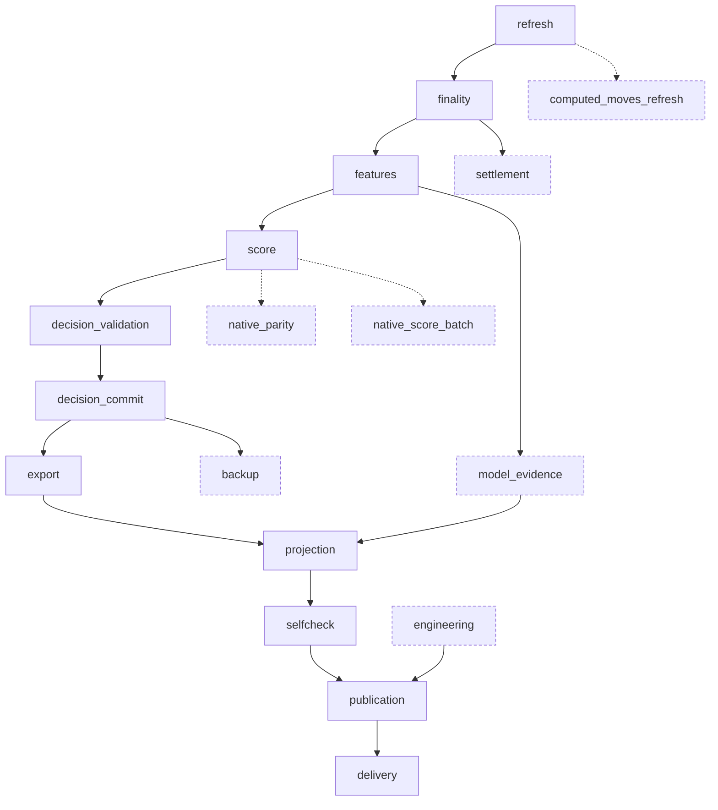
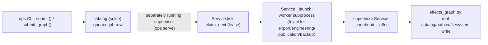
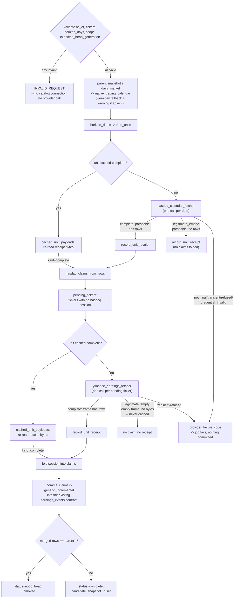
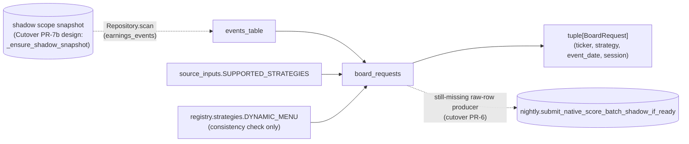

# `engine/v2/ops` — architecture

Layer 7.0 in the root `/ARCHITECTURE.md` layer table. Replaces the new
supervisor/catalog design, `dashboard/nightly.py` (as a job graph) and
`tools/bounded_run.py` (as an executor adapter). See the root doc for the
layer rules this package is checked against; this doc covers the detail
specific to this package.

## Purpose

Durable job submission, leases, retry history and dependencies; resource
admission and per-job CPU placement; the nightly job graph and its release
boundary. It does not decide research conclusions (`engine/v2/evaluation`)
and does not compute a score (`engine/v2/scoring`) — it only sequences and
persists the jobs that call into those packages.

This doc also covers `native_board_universe.py`: a pure, answer-free
enumerator that reproduces legacy `engine.score.score_calendar`'s event ×
strategy enumeration for the strategies native scoring supports, without
touching the legacy chain index or constructing a legacy `Scorer`. It has
no production caller yet — see "Dependencies" below.

## Primary contracts and public interfaces

The operator interface is the versioned command protocol
`engine/v2/ops/cli.py` exposes (`python3 -m engine.v2.ops <command>`),
derived directly from its `argparse` definitions:

- `init`, `doctor`, `health`
- `serve` — starts the supervisor loop
- `plan {nightly,experiment,training,promote}` — builds and saves a plan
  document; `training`/`promote` take operator-only arguments
  (`--training-mode`, `--recipe`, `--state`, `--alpha`, `--cutoff`,
  `--strategy`, `--pairs`, `--ticker-chunk`, `--release-root`,
  `--release-id`) and are never part of the nightly DAG
- `submit --plan --idempotency-key`
- `rescore --request --native-inputs` — read-only, no provider pulls, no fitting
- `capture-inputs --as-of --tickers --context-tickers --year-start --year-end --source-root --output`
- `reconcile <job_id> --expected-attempt`
- `provider-account --account --remaining --live-reserve`
- `snapshot {plan-import,submit,promote,rollback}`
- `ledger {import-history,status,calibrate,book}`
- `decisions supersede --row-id --reason --from-json`
- `price-refresh --session [--dry-run]`
- `price-history capture --source-root --scope [--dry-run]`
- `get`/`logs`/`cancel`/`resume`/`explain <job_id>`

Internally: `nightly.py`'s `GRAPH`, `graph_order()`, `OPTIONAL`,
`NO_JOB_STAGES`, `build_nightly_plan`, `build_legacy_job_requests`,
`_stage_sequence` (see "Diagrams" below); `supervisor.Service`/`serve`;
the coordinator-effect functions in `effects_graph.py`; `training.py`'s
`training_job_kind`/`promote_job_kind` (registered in
`stages.py::_core_kinds`, not in `supervisor._COORDINATOR_EFFECT_KINDS`),
`training_plan`/`promote_plan`, `run_training_worker`/`run_promote_worker`;
`BoardRequest`/`board_requests(as_of, horizon_days, tickers, events_table)`
(`native_board_universe.py`) — a pure key `(ticker, strategy, event_date,
session)` and the function that enumerates one per event × native-covered
strategy, plus one `DYN-SV` meta-request per event; `calendar_moves_jobs.py`'s
`computed_moves_job_kind`/`forward_calendar_job_kind`, `CalendarMovesParameters`/
`calendar_moves_parameter_problems`/`calendar_moves_job_spec`, and
`run_computed_moves_worker`/`run_forward_calendar_worker` (dispatched by
`worker.py`). `forward_calendar_refresh` has a `JobKind` (worker dispatch,
loader callback, parameter validation) but no `nightly.py` `GRAPH`/
`OPTIONAL` node and no `supervisor.Service` submitter yet — not on the
nightly schedule.

`forward_calendar_store.py` is one of a small number of natively-fetched
data stores living directly in this package rather than delegating to
another v2 layer. `run_forward_calendar_refresh` is a standalone,
fully keyword-only runner validating every non-fetcher argument before
touching the catalog or a provider (see "Failure semantics" below);
`tickers=()` means the whole market. Its commit path composes a
per-attempt lease `fence_check` (byte-identical in shape to
`computed_moves_store`'s own) with the existing `_head_fence` check —
`_head_fence` always runs first, both inside the one transaction
`catalog.commit_snapshot` invokes — so a cancelled or lease-expired
attempt is refused before anything commits, never after; omitting
`fence_check` (the default) keeps `engine/v2/data/incremental.py`'s
generic-refresh path and `engine/v2/research/_trades_publish.py`
unchanged. No `GRAPH` node or `supervisor.Service` submitter exists yet,
so nothing submits a `forward_calendar_refresh` job today.

`native_score_batch.py`: the batch-shaped seam between the board universe
(`native_board_universe.BoardRequest`) and
`engine.v2.scoring.application.score_batch`. `assemble_score_batch_inputs`
turns one release binding (`ScoringReleaseBinding`) plus a sequence of
already-staged `NightlyEventInputs` into
`dict[BoardRequest, tuple[ScoreRequest, NativeScoreInputs]]` plus a tuple
of typed per-row refusals — a pure function; an empty `events` sequence is
a legitimate no-op. `run_native_score_batch_worker(parameters, root)` is
the job kind's worker entrypoint: resolves the release once, reads the
staged `events.json`, calls `assemble_score_batch_inputs`, then
`engine.v2.scoring.application.score_batch` under
`engine.v2.models.no_fit.no_fit_guard()`, and writes
`records.json`/`refusals.json` (refusal codes and the fixed-detail
contract are in "Failure semantics" below). **Supports `STR-THRU` only** —
any other strategy refuses per-row. `supervisor.Service`'s tick sidecar
(below) is its one production caller, though under today's production
default it never actually submits a job.

**Cutover PR-4 (redo — 2026-09-27, user decision option (c). This section
REPLACES the original PR-4 design, which proposed `tools/native_parity_run.py`,
a manual/operator-invoked script, as `native_parity`'s production caller.
The previous owner proved that script can never be more than manual: it
calls `run_shadow_nightly`, which "has no production caller [and] needs
14 caller-supplied stage handlers nothing builds" — a manual script
outside any schedule is not what "the REAL nightly" means. Phase 1 (cutover PR-4 redo slice 1, `#132`) landed
the pure functions this section documents — `legacy_parity_rows`,
`native_parity_report._empty_native_report`, and
`native_parity_report.apply_native_refusals` (`SCHEMA_VERSION` bumped
`v1.0` → `v1.1`) — with no job/worker/supervisor wiring yet. Phase 2
slice 2A (`#185`) lands the other half of the keyed-join design this
section already specified before either half was code: `native_score_batch.py`'s
`v2.0` keyed `records.json`/`refusals.json` schema (`_board_request_key`,
the new `INVALID_KEY_FIELD` refusal, schema tags
`native_score_batch_records.v2.0` / `native_score_batch_refusals.v2.0`)
plus `native_parity_report._population_key_from_board_request_key` and
`native_parity_report._native_rows_and_refusals` — the pure projection
functions this doc's "Primary contracts" section below documents. The
new `native_parity_report` projection functions are pure, with no
`native_parity` job/worker/supervisor wiring of their own — that wiring
is slice 2B, below. `native_score_batch.py`'s own worker and
shadow-submission sidecar are unaffected by this schema bump: they
already exist and are already wired (cutover PR-3 `#66`'s worker
dispatch, PR-7a `#126`'s tick-loop submission).
Phase 2 slice 2B(a) (this PR) lands the `native_parity` job kind itself
-- `stages.py::_native_parity_kind`, `worker.py`'s dispatch branch,
`run_native_parity_worker`, `NativeParityParameters`. Slice 2B(b)
(deferred, not this PR) is its tick-loop sidecar
(`supervisor.Service._reconcile_native_parity`); slice 2B(c) (deferred,
not this PR) is the nightly wiring
(`nightly.submit_native_parity_if_ready`/`_native_parity_identity`,
including the pre-submission `schema_version` check, and the
`nightly.GRAPH` node width change). Neither (b) nor (c) is touched here,
so no production caller submits a `native_parity` job yet even once this
PR lands -- the job kind exists and its worker is real, but nothing in
the nightly graph or the supervisor's tick loop builds one. Cutover
PR-3 (`native_score_batch.py`, `#66`) and cutover PR-7a's design (`#88`)
and shadow-submission code (`#126`) are all already merged; PR-7a's code
(`#126`) implemented the tick-loop submission sidecar only, not the `v2.0`
schema this redo's design always said was `native_parity`'s own PR to
build (see "the row-key/join gap is not designed here" below) — `#185`
is that build. One piece is
untouched by this redo, real code already on `main`, independent of
everything `#66`/`#88`/`#126` supply: `native_parity_report.py`'s
tolerance policy is already pluggable — see "the tolerance policy is now
pluggable" below, unchanged.**

`native_parity` closes the gap the root doc §4 and this doc's own
"Diagrams" section both name: `run_shadow_nightly` "has no production
caller, only tests ... call it," so in production `native_parity` today
never actually compares anything — a production run supplies no
`parity_rows`, `_registered_handlers` defaults both sides to `{}`, and
`compare_native_vs_legacy`'s own `_refuse_empty_inputs` raises
`VALIDATION_FAILED` before any comparison runs, which `_run_stage` turns
into a `"degraded"` receipt for this `OPTIONAL` stage (see "Outputs"
below for why this is NOT the same claim as "writes an empty-input
report" — no report is ever written either). **This redo does not close
that gap through `run_shadow_nightly` at all.** That function keeps its
existing stage-walk and `native_parity_handler`'s existing signature
contract completely unchanged (both already correctly consume real
`legacy_rows`/`native_rows` dicts today — proven by
`tests/test_v2_ops_native_shadow_render.py` — and stay exactly the
test-only path they always were; nothing before this redo, or in it,
builds real dicts to hand `run_shadow_nightly` in production). The gap
closes through a SEPARATE production path: a new `native_parity` job
kind, submitted by `supervisor.Service`'s own tick-loop sidecar —
mirroring `computed_moves_refresh` (Part 4, `#54`) and `native_score_batch`'s
own shadow submission (`#88`) byte-for-byte in shape — never through
`build_legacy_job_requests`, so a broken parity submission can never
abort a required legacy stage. That job's worker calls the exact same
`compare_native_vs_legacy`/`native_parity_handler` functions
`run_shadow_nightly` already calls, so the two paths — one test-only, one
production — can never silently diverge in comparison logic: root doc
§5's "one shared parity comparator" invariant, restated one level up as
one shared CALLER of that comparator, reached two ways.

Four new symbols, mirroring `native_score_batch`'s own PR-7a shape.
**Only the last of the four (`stages.py::_native_parity_kind`) is
implemented as of slice 2B(a); the first three are slice 2B(b)/(c),
still deferred and described here in the design's own present tense for
readability, not because they exist yet:**

- `supervisor.Service._reconcile_native_parity` — a new tick-loop sidecar
  method, called from `Service.tick` (`supervisor.py:227`) right after
  `self._reconcile_native_score_batch_shadow()` (`#88`, itself called
  right after `self._reconcile_computed_moves_refresh()`,
  `supervisor.py:241`) — so the tick's native-shadow sidecar chain reads
  computed_moves_refresh → native_score_batch (shadow) → native_parity,
  each stage's identity check a strict superset of what the one before it
  already confirmed.
- `nightly.submit_native_parity_if_ready` — the builder the sidecar calls,
  mirroring `submit_computed_moves_refresh_if_ready` (`nightly.py:858`)/
  `submit_native_score_batch_shadow_if_ready` (`#88`) in signature shape.
- `nightly._native_parity_identity` — a cheap catalog-only identity check
  mirroring `_computed_moves_identity` (`nightly.py:830`): finds the
  latest succeeded `native_score_batch` job by its own idempotency key
  (`"nightly:<as_of>:<scope_hash>:native_score_batch"`, `#88`'s own R6),
  parses `(as_of, scope_hash)` out of it, and recovers the paired
  succeeded `"score"` job's id with the SAME query `#88`'s own
  `_native_score_batch_identity` already runs to find a session's
  `"score"` job (`"nightly:<as_of>:<scope_hash>:score"`) — reused here
  with `(as_of, scope_hash)` already known rather than searched for,
  never a second, independently written lookup. Returns `(as_of,
  scope_hash, score_job_id, native_score_batch_job_id)`, or `None` when
  no succeeded `native_score_batch` job exists yet.
- `stages.py::_native_parity_kind()` — **implemented, slice 2B(a) (this
  PR)** — a new `JobKind`, mirroring
  `_native_score_batch_kind()` (`stages.py:271`) in shape:
  `name="native_parity"`, `worker="native_parity"`,
  `parameters=NativeParityParameters` (new, `RescoreParameters`-shaped —
  only `expected_ids` and `input_bindings`; this job carries no scalar
  data of its own, since every input it reads is job-bound),
  `resource_classes=frozenset({"validation"})` (a pure comparison, no
  provider fetch — the same classification `decision_evidence` already
  has), `effects=("staged",)`, `retry=RetryPolicy("bounded", 2, (5, 30))`,
  `checkpoint_contract="native_parity_report.v1.1"` (matching
  `native_parity_report.SCHEMA_VERSION`, which Phase 1 (`#132`) already
  bumped from `v1.0` — see "Outputs" below for the two additive fields
  this contract already covers), `namespaces=frozenset({"shadow", "smoke"})`.
  `worker.py::dispatch` gains a `"native_parity"` branch routing to
  `native_parity_report.run_native_parity_worker` (below), the same
  lazy-import-inside-`_dispatch_*` pattern `_dispatch_native_score_batch`
  already uses (`worker.py:167-168`, `:198-200`).

`nightly.GRAPH` gains a `"native_score_batch": ("score",)` node (`#88`),
and `"native_parity"`'s own existing node (`nightly.py:58`) widens from
`("score",)` to `("score", "native_score_batch")` — topological
documentation only, for `run_shadow_nightly`'s whole-graph test-only
walk; no submission path reads either edge (the same "documentation, not
a submission source" rule Part 4 already established for
`computed_moves_refresh`'s own node).

- **`nightly.legacy_parity_rows(score_document: Mapping[str, Any]) ->
  dict[str, dict]`** (new, this package). Keys the legacy `score.json`
  document's own `"rows"` array by
  `engine.v2.ops.decision_validation.population_key`'s `"ticker|strategy|
  event_date"` format — REUSED, not re-derived and not re-added: this
  public function already exists (`decision_replay.py`'s own population
  comparison already imports it), and it is the identical three-field
  format `engine.v2.serving.native_render.native_row_key` already derives
  for a native `ScoreRecord` (that module's own docstring: `"the native
  twin of bridge._population_key"` — `legacy_adapter._population_key` is a
  second, private, byte-identical copy of the same format used only for
  `_action_score`'s own population check; this PR reuses the PUBLIC one
  `decision_validation` already exports, adding no new function). Pure: no
  filesystem, no clock, and — the point of putting this here rather than
  in the composing script below — no import of `engine.v2.serving` (a
  layer-7.0 peer of `engine.v2.ops`, per the root doc's layer table;
  `checks/import_layers.py` would refuse that edge). A `score_document`
  with no `"rows"` key returns `{}` (not a refusal —
  `native_parity_handler`'s existing `_refuse_empty_inputs` already turns
  an empty `legacy_rows` into `VALIDATION_FAILED` downstream, so this
  function does not need its own empty-input check).
  **`legacy_parity_rows` does NOT reuse `population_key`'s own
  `.get(key, "")` empty-string substitution for a missing
  `ticker`/`strategy`/`event_date`** (root doc §5: "a missing or unusable
  input produces an explicit withheld/refused status," never a silent
  default) — reusing that substitution here would let one malformed row's
  empty-string-keyed entry either collide with a genuinely empty-fielded
  row, or, more likely with real data, simply end up unique and reported
  as an ordinary `only_legacy` row: quietly absorbed into the report as a
  population difference rather than surfaced as the malformed input it
  actually is. **Duplicate keys are the same class of finding, not a
  separate one**: `_action_score`'s own population check
  (`observed_keys = {_population_key(row) for row in rows}`) compares
  `population_key` values only as a SET, so a `score.json` carrying two
  rows under one `ticker|strategy|event_date` key (sibling precedent:
  `decision_replay.decision_population` rejects a duplicate population
  key explicitly, via `VALIDATION_FAILED`; `_action_score` does not)
  already passes that check today without ever proving the two rows
  agree — a plain `{key: row for row in rows}` comprehension in
  `legacy_parity_rows` would then silently keep whichever row iterated
  last and drop the other with no trace. `legacy_parity_rows` therefore
  validates every row before keying any of them: a missing, non-string,
  or empty `ticker`/`strategy`/`event_date`; a `ticker` or `strategy`
  containing the `"|"` `population_key` delimiter (CodeRabbit round 3 —
  `population_key` joins on `"|"`, so an unescaped delimiter inside a
  field would let two distinct rows collide under one key); OR two rows
  sharing one `population_key` value — each raises `OpsError` — matching
  `decision_population`'s own code, `VALIDATION_FAILED` (detail naming
  the row index/offending field, or the repeated key and both rows'
  indices) — for the WHOLE call, before any dict is constructed: a
  batch-level refusal, never a per-row skip or a last-write-wins
  collision, so a malformed or duplicate-keyed `score.json` is never
  silently read as smaller, or different, than it actually is. The same
  refusal covers the shape one level up, before `population_key` is ever
  called on a row: `score_document["rows"]`, if present, must be a list of
  mappings — a non-list value or any non-mapping element raises `OpsError`
  (`VALIDATION_FAILED`) rather than letting `population_key`'s own
  `.get(...)` calls raise a bare `TypeError`/`AttributeError` on a
  malformed element.
  `population_key`, `_population_key`, and `_action_score`'s own
  set-based check are all unchanged by this PR.
- **`native_parity_report.run_native_parity_worker(parameters, root)`**
  (implemented, slice 2B(a), this PR) — the `native_parity` job kind's worker entrypoint (dispatched
  from `worker.py`, registered in `stages.py::_core_kinds`). Reads its two
  job-bound inputs (`score.json` from the paired `"score"` job;
  `records.json`/`refusals.json` from the paired `native_score_batch` job
  — see "Inputs" below for exactly how `_native_parity_identity` finds
  both). The worker ITSELF also refuses `VALIDATION_FAILED` up front,
  before reading a single row, if either document's `schema_version` is
  not exactly `native_score_batch_records.v2.0`/
  `native_score_batch_refusals.v2.0` (gate finding on `#191`, real: the
  generic job-submission API can submit a `native_parity` job against ANY
  bound artifacts today, entirely independent of the not-yet-built
  `submit_native_parity_if_ready` sidecar, so a worker-side check is the
  ONLY enforcement point that exists before slice 2B(c) ships — and stays
  as defense-in-depth afterward, since a generic submission always bypasses
  any one caller's own pre-submission check). This does not replace
  `submit_native_parity_if_ready`'s OWN future pre-submission check
  (slice 2B(c), still deferred) — see "Cutover PR-4 (redo)'s own input
  sourcing" above for why THAT check must additionally live at the
  sidecar layer, for retry-semantics reasons this worker-side check does
  not address (a directly-submitted job has no sidecar memo to protect;
  it simply fails, correctly). It builds
  `legacy_rows`/`native_rows`/`native_refusals`/`unkeyable_refusals` (via
  `_native_rows_and_refusals`, below), projects every native record
  through `_native_comparison_row` (gate finding on `#191`, real: a raw
  `to_document(ScoreRecord)` preserves `ScoreRecord`'s own nested
  per-dimension dicts, while `_dimension_view` looks up every field at
  the row's top level — an un-flattened record compares as all-`None`,
  masking real native values and reporting false mismatches against
  real legacy ones; this projection reads each dimension from the same
  nested sources `checks/phase4_real._numeric_views` already reads them
  from, a data-shape port only, never a new comparison rule), and
  branches on whether `legacy_rows` and
  `native_rows` share any key (below, `_empty_native_report`) before
  calling the SAME `compare_native_vs_legacy` (unchanged) and the new
  `apply_native_refusals` (below) — see "Outputs" for what it writes.
  This is the real (only) production caller `tools/native_parity_run.py`
  was originally designed to be. **That script is dropped from this redo
  entirely — no code for it was ever written** (`tools/native_parity_run.py`
  and `row_explanations` never existed and still don't; `legacy_parity_rows`
  now exists on `main` as of Phase 1, `#132`, but only as the pure function
  this section documents — nothing calls it in production yet, so nothing
  needs migrating away from the dropped script), never built as a parallel
  manual path alongside the job. There is exactly one way a real
  `native_parity_report.json` gets produced in this codebase once Phase 2
  lands, not two.
- **`native_parity_report._empty_native_report(legacy_rows, native_rows,
  dimensions, tolerance_policy) -> dict`** (new, private) — closes a real
  gap `compare_native_vs_legacy`'s own row-sharing checks would otherwise
  cause (CodeRabbit round 3; widened by an Opus gate finding, both real).
  Two EXISTING, UNCHANGED checks inside `compare_native_vs_legacy` can both
  fire even though a refusal fully explains the gap: `_refuse_empty_inputs`
  (`not native_rows` → `VALIDATION_FAILED`) when native produced nothing at
  all, and the function's own `if not compared: raise fail("VALIDATION_FAILED",
  "native parity report shares no row key", ...)` (`native_parity_report.py:178`,
  pre-existing, unchanged by this redo) whenever `legacy_rows` and
  `native_rows` share NO key — which happens not only when `native_rows`
  is empty, but also when `native_rows` is non-empty yet none of its keys
  overlap `legacy_rows`'s (every row that would have overlapped was
  instead refused). `run_native_parity_worker` therefore checks
  `legacy_rows` is non-empty FIRST — an empty `legacy_rows` is a genuinely
  missing legacy input, never something a native refusal can explain, so
  it ALWAYS falls through to `compare_native_vs_legacy`'s existing checks
  and fails `VALIDATION_FAILED`, exactly as before this redo, regardless
  of how many native refusals exist. Only once `legacy_rows` is confirmed
  non-empty does it compute `shared = set(legacy_rows) & set(native_rows)`
  BEFORE calling `compare_native_vs_legacy` at all, and take this path
  whenever `shared` is empty AND EITHER (a) `set(legacy_rows) <=
  set(native_refusals)` — every legacy key specifically named by a keyed
  refusal, not merely "some refusal exists somewhere" (CodeRabbit gate
  round 1, real finding: an unrelated refusal for a DIFFERENT population
  key must never explain a DIFFERENT legacy row's absence — that case
  still falls through and fails) — OR (b) `native_rows` and
  `native_refusals` are BOTH empty while `unkeyable_refusals` is non-empty
  (nothing was ever keyable at all, so nothing could have matched
  anything, which vacuously explains every legacy key's absence). This
  covers every case the narrower "`native_rows` empty" check alone would
  miss:
  - **All refused, none keyable.** Every row refused `INVALID_KEY_FIELD`
    (above): `native_rows` and the keyed `native_refusals` are BOTH empty,
    but `unkeyable_refusals` is fully populated. The narrower check (only
    testing keyed `native_refusals`) would wrongly fall through to a
    normal `compare_native_vs_legacy` call and hit `_refuse_empty_inputs`.
  - **Disjoint keys, native_rows non-empty.** Every legacy row's native
    counterpart was refused BY ITS OWN matching population key (case (a)
    above — an unkeyable refusal carries no population key, so it can
    never stand in for a specific legacy row's own counterpart here),
    while `native_rows`
    itself holds OTHER rows entirely (different tickers/strategies,
    genuinely `only_native`) that share no key with `legacy_rows`. Because
    `native_rows` is non-empty, `_refuse_empty_inputs` would not fire, but
    `shared` is still empty, so the pre-existing "no shared key" check
    (`native_parity_report.py:178`, above) would — even though every legacy row's absence IS
    explained by a refusal, exactly `native_refused`/`native_refused_unmatched`'s
    (below) reportable outcome, not a missing-input failure.
  - **All refused, keyable.** The ORIGINAL narrower case (`native_rows`
    empty, keyed `native_refusals` fully populated): still covered, since
    `shared` is trivially empty when `native_rows` is.

  In every covered case, `_empty_native_report` builds the SAME dict shape
  `compare_native_vs_legacy` would return for a would-be comparison with no
  shared keys — `{"schema_version": SCHEMA_VERSION, "tolerance_policy_id":
  tolerance_policy.policy_id, "compared": [], "only_legacy":
  sorted(legacy_rows), "only_native": sorted(native_rows), "mismatches":
  []}` (unlike the original narrower version, `only_native` is NOT
  hardcoded `[]`: because `shared` is empty by construction on this path,
  EVERY key of `native_rows` is, by definition, `only_native` — never
  `compared`, since nothing shared) — WITHOUT calling
  `compare_native_vs_legacy` (there is no numeric comparison to make:
  nothing shared was scored against anything), and `apply_native_refusals`
  runs on it exactly as it would on a real comparison's output, narrowing
  `only_legacy` by `native_refused`/`native_refused_unmatched` the
  identical way. If `shared` is empty and BOTH `native_refusals` and
  `unkeyable_refusals` are empty (native_score_batch produced nothing at
  all AND refused nothing — a genuinely missing native input, nothing to
  explain the gap), or if `legacy_rows` is empty, `run_native_parity_worker`
  calls `compare_native_vs_legacy` normally and lets its EXISTING checks
  raise `VALIDATION_FAILED` — the correct outcome for THAT case is
  unchanged. `compare_native_vs_legacy` itself gains no new parameter and
  no new branch for this: the decision of which path to take is
  `run_native_parity_worker`'s own (still unbuilt — Phase 2), so
  `run_shadow_nightly`'s test-only path, which calls `native_parity_handler`
  directly and never `run_native_parity_worker`, never reaches this
  `_empty_native_report` branch at all — see the next bullet,
  `apply_native_refusals`, for the one behavior change that DOES already
  reach that existing test-only path today.
- **`native_parity_report.apply_native_refusals(report, native_refusals,
  unkeyable_refusals=()) -> dict`** (new) — the mechanism for "missing or
  refused native rows are counted separately" (user decision, option (c)).
  `compare_native_vs_legacy` itself is UNCHANGED — pure, refusal-blind,
  unaware `native_score_batch` can refuse a row at all. **But
  `native_parity_handler` — the EXISTING function `run_shadow_nightly`
  already calls, unchanged in signature — now calls
  `apply_native_refusals(report, {}, ())` unconditionally right after
  `compare_native_vs_legacy`, on every `"compared"` report it writes (Phase
  1, `#132`, already on `main`): with no refusals to apply this changes no
  row's classification, but every report that test-only path writes now
  also carries the two new, always-present, empty fields
  `"native_refused": []`/`"native_refused_unmatched": []` and is stamped
  `SCHEMA_VERSION` `native_parity_report.v1.1`, not the pre-redo `v1.0` — a
  real, already-shipped change to this existing artifact's shape, not a
  no-op reserved for `run_native_parity_worker`.** Once Phase 2 builds it,
  `run_native_parity_worker` calls this the SAME way, this time with real
  `native_refusals`/`unkeyable_refusals`, AFTER
  `compare_native_vs_legacy` or `_empty_native_report` (above) returns: any
  key in the report's own `only_legacy` list that is ALSO a key of
  `native_refusals` (population-key → refusal code, built from
  `records.json`'s paired `refusals.json`) moves from `only_legacy` into a
  NEW `"native_refused"` list (each entry `{"row_key": ..., "refusal_code":
  ...}`), and is removed from `only_legacy` — never counted in both. A
  `native_refusals` key that is NOT in `only_legacy` (the row was actually
  compared, or was `only_native`) is left untouched:
  `assemble_score_batch_inputs`'s own per-row either/or contract (PR-3)
  already makes one row both scored and refused impossible within one
  `records.json`/`refusals.json` pair, so this function trusts that
  pairing rather than re-validating it, exactly as `legacy_parity_rows`
  trusts `score.json`'s own shape once its own up-front validation
  passes. `only_legacy` therefore narrows to its real meaning under this
  redo: a legacy row `native_board_universe.board_requests` never even
  enumerated as a `BoardRequest` (an unsupported strategy, the `DYN-SV`
  wildcard) — never a row native attempted and explicitly refused, which
  `native_refused` names instead.
  **A refusal with no legacy counterpart is reported, never dropped
  (CodeRabbit round 5, real finding).** A `native_refusals` key that is
  NOT in `only_legacy` cannot be in `compared`/`only_native` either (a
  refused `BoardRequest` is by construction absent from `native_rows`,
  and both those buckets are built only from `native_rows`) — so the ONE
  remaining possibility, silently ignored by the original design, is a
  refusal whose projected `population_key` is not in `legacy_rows` at
  all: `native_score_batch`'s own board universe found and refused a row
  legacy's own `score.json` never carried in the first place. That case
  is now appended to a second NEW list, `"native_refused_unmatched"`
  (same `{"row_key": ..., "refusal_code": ...}` shape as `native_refused`,
  kept separate rather than merged so a reader can tell "legacy scored it,
  native refused it" apart from "native refused a row legacy never had").
  Every entry of `unkeyable_refusals` (the third, optional argument —
  `_native_rows_and_refusals`'s own pass-through of `refusals.json`'s
  `"unkeyable_refusals"` array, below) is appended to the SAME
  `"native_refused_unmatched"` list unconditionally, using its raw
  structured `{"ticker":..., "strategy":..., "event_date":...,
  "session":...}` key instead of a `row_key` string (below) — an
  `INVALID_KEY_FIELD` refusal never attempts the keyed join at all (its
  own source fields are exactly what made a safe key impossible to
  construct), so it is reported this way regardless of whether a
  same-identity legacy row exists, rather than trying to prove a negative
  match first. Every native refusal — keyed or not, legacy-matched or
  not — therefore lands in exactly one of `native_refused` or
  `native_refused_unmatched`; none is ever silently absent from the
  report.
- **`native_parity_report._population_key_from_board_request_key(key) ->
  str`** (new, private) — projects one `records.json`/`refusals.json` key
  (the 4-field canonical `BoardRequest` string `#88` specifies,
  `f"{ticker}|{strategy}|{event_date.isoformat()}|{session}"`) down to the
  3-field `population_key` format `legacy_parity_rows` already uses, by
  splitting on `"|"` into exactly 4 parts and calling
  `engine.v2.ops.decision_validation.population_key({"ticker": ticker,
  "strategy": strategy, "event_date": event_date})` — REUSING
  `population_key`'s own join format rather than string-concatenating a
  fourth time, so the two sides can never silently drift onto two
  different separators or field orders. `session` is validated as present
  (exactly 4 parts) but never folded into the key: legacy rows carry no
  `session` field to join against. A key that does not split into exactly
  4 parts is a batch-level `OpsError` (`VALIDATION_FAILED`) — matching
  `legacy_parity_rows`'s own all-or-nothing malformed-input discipline —
  raised before `run_native_parity_worker` builds `native_rows`/
  `native_refusals` at all, never a per-row skip.
- **`native_parity_report._native_rows_and_refusals(records_document,
  refusals_document) -> tuple[dict[str, dict], dict[str, str], tuple[dict,
  ...]]`** (new, private) — the ONLY caller of `_population_key_from_board_request_key`
  (above), and the place a duplicate collision is caught: the projection
  from a 4-field `BoardRequest` key down to a 3-field `population_key` is
  LOSSY (it drops `session`), so two DISTINCT `records.json`/`refusals.json`
  keys — the same `(ticker, strategy, event_date)` under two different
  `session` values, a genuinely possible events-table shape this design
  does not assume away — can project to the SAME `population_key`
  (CodeRabbit round 1, real finding). Silently keeping whichever one a
  dict comprehension iterates last would be exactly the last-write-wins
  collision `legacy_parity_rows` already refuses to allow for
  `score.json`'s own rows (above) — so this function applies the IDENTICAL
  discipline to the native side: every key in `records_document["records"]`
  and every key in `refusals_document["refusals"]`, TOGETHER (one row can
  never be both a record and a refusal, but two DIFFERENT rows — one a
  record, one a refusal, or both records, or both refusals — can still
  collide after projection, and this check catches all three shapes), is
  projected, and any `population_key` value produced by more than one
  distinct source key raises `OpsError` (`VALIDATION_FAILED`, detail naming
  the colliding `population_key` and both source `BoardRequest` keys) for
  the WHOLE call, before `native_rows`/`native_refusals` are built — never
  a per-row skip or a silent overwrite. No collision has ever been observed
  in practice (native's own board universe enumerates one `BoardRequest`
  per `(ticker, strategy, event_date, session)` combination the events
  table actually carries); this guard exists because the projection makes
  a collision POSSIBLE, not because one has occurred. **This function
  REQUIRES the key — `refusals_document["unkeyable_refusals"]`, never
  `.get("unkeyable_refusals", ())` (CodeRabbit round 6, real finding).**
  This function's only caller, `run_native_parity_worker` (below), is only
  ever reached for a job `submit_native_parity_if_ready` ("R2, cache",
  below) already confirmed carries `refusals_document["schema_version"]
  == "native_score_batch_refusals.v2.0"` before submission, and the v2.0
  writer ALWAYS emits this key, even as `[]` for a batch with no unkeyable refusals (the
  "refusals.json" bullet, above) — so its absence on a document already
  confirmed v2.0 means the file is malformed (truncated, hand-edited, or
  written by a defective producer), never a legitimate "this batch has
  none" case a silent default could paper over. A `KeyError` here is
  caught by `run_native_parity_worker` alongside its other
  `records.json`/`refusals.json` decode failures (below, "R1, missing
  input") and fails the WHOLE job attempt, exactly like a document that
  fails to decode at all — never a per-row skip, and never a silently
  empty `unkeyable_refusals`. The (now guaranteed-present) value is passed
  through completely unchanged — `INVALID_KEY_FIELD` rows (below) never
  had a `population_key` computed for them at all (that is exactly what
  makes them "unkeyable"), so there is nothing for this function to
  project, decode, or collision-check; it is `apply_native_refusals`
  (above), not this function, that consumes them.

**The original PR-4 design's "explained" bucket (`ROW_EXPLANATION_CODES`,
`row_explanations`) is dropped from this redo, not carried forward** —
see "Out of scope" below: no reusable stale-px/finality-drift classifier
exists today, so there is nothing for it to plug into yet, and this redo
does not invent one. A future PR can add it exactly as originally
specified, against `compare_native_vs_legacy`'s unchanged signature,
whenever a real classifier exists.

**The tolerance policy is now pluggable, not hardcoded — this part of the
PR is real code, already merged into this push, independent of `#66`.**
`engine.v2.parity.dimensions.compare_dimension` gained a keyword-only
`tolerance_policy` parameter (default `SCORE_RECORD_V1`, so the Phase 4
checker and every existing test are unaffected — none of them pass this
argument, so none of them can observe a behavior change);
`native_parity_report.compare_native_vs_legacy`/`native_parity_handler`
each gained the identical parameter, threaded straight down to
`compare_dimension`, and the written report now records
`"tolerance_policy_id": tolerance_policy.policy_id` so a reader of
`native_parity_report.json` can always see which policy compared it —
never an implicit, undiscoverable default. **Per-field tolerances come
from ONE config policy, the `engine.v2.parity.tolerance.TolerancePolicy`
type** (never a second ad hoc mechanism): the default that ships in this
PR is still `SCORE_RECORD_V1`, which declares zero per-field rules
(`rules=()`), so every one of the five dimensions' 30 fields —
`FORECAST_FIELDS` (12), `SIMULATION_FIELDS` (7), `FINANCIAL_FIELDS` (5),
`GATE_FIELDS` (3), `ANALOG_FIELDS` (3) — still compares under exact
equality until a caller explicitly plugs in a different policy. **No
per-field tolerance VALUE is added, chosen, or implied by this PR** —
that is a user decision, taken to the user separately, and per instruction
none of those values belong in this doc, the PR body, or an issue; only a
`TolerancePolicy` built and ratified elsewhere is ever passed in here.
`tolerance.py`'s own docstring names the risk this design avoids:
"chosen to make the first run pass" is a named failure mode, so this PR
adds the SEAM a ratified policy plugs into, not a guess at what it should
contain.

**Out of scope for this redo** (each a real gap, named rather than
silently left implicit): the stale-px/finality-drift classifier and the
"explained" bucket mechanism the original PR-4 design specified (above —
still no reusable classifier exists; a future PR adds it once one does,
against `compare_native_vs_legacy`'s unchanged signature); a
dashboard-facing "latest report" pointer path (this design's only durable
location is the catalog-addressed `job_<id>#report` binding — see
"Outputs" below); and building the actual user-approved, per-field
`TolerancePolicy` object itself (the pluggable seam already in place
takes it as a parameter — this redo does not construct one, and no
tolerance value appears in this doc, a PR body, or an issue).

**Corrected, not merely superseded: the original PR-4 design's own
out-of-scope line said flipping `native_parity` "onto a schedule, a job
kind, or the supervisor's tick loop" needed to wait for "Phase 7
[to change] legacy authority" first.** That reasoning was wrong even at
the time it was written, and two precedents that shipped since prove it:
`computed_moves_refresh` (Part 4, `#54`) and `native_score_batch`'s own
shadow submission (`#88`) both flip an OPTIONAL, shadow-only stage onto
the supervisor's tick loop without touching legacy authority, because
neither carries `store_domains` or any effect beyond `"staged"` — the
same is true of `native_parity` here (`effects=("staged",)`, no
`store_domains`, no scheduler edge from any required legacy stage to it).
A job kind reaching the tick loop is not itself a legacy-authority
change; only a `store_domains` write against a legacy-owned table, or a
`GRAPH`/`_DAG_STAGES` edge a REQUIRED legacy stage depends on, would be —
neither is true of `native_parity`, which is exactly why this redo can
schedule it now, well before Phase 7.

**Cutover PR-7a (implemented — wiring and refusal gate only).**
`native_score_batch` is registered as a job kind
(`stages.py::_native_score_batch_kind`) and has a production caller —
`supervisor.Service`'s tick sidecar, alongside legacy scoring, with no
authority change — but no job is ever actually submitted: since cutover
PR-7b's own flip of `nightly_trigger`'s scheduled plan to
`input_mode="snapshot"`, the selected `"score"` job now pins a snapshot,
so `submit_native_score_batch_shadow_if_ready` raises `VALIDATION_FAILED`
(the raw-row producer, [#199](https://github.com/yshewchuk/investment-validation/issues/199),
is not built yet) rather than silently returning nothing — only a
`legacy`-input-mode plan built directly via `ops plan` (not the scheduled
trigger) still gets a silent no-op (see "Failure semantics" below). Three
symbols, mirroring
`computed_moves_refresh`'s own shape:
`supervisor.Service._reconcile_native_score_batch_shadow` (tick-loop
sidecar, called from `Service.tick`); `nightly.submit_native_score_batch_shadow_if_ready`
(the builder the sidecar calls); `nightly._native_score_batch_identity` (a
cheap catalog-only identity check parsing the paired `"score"` job's own
idempotency key to recover `(session, scope_hash, snapshot_pinned)`, or
`None`). `nightly.GRAPH` gains a `"native_score_batch": ("score",)` node
(topological documentation only — no submission path reads it) and
`OPTIONAL` gains `"native_score_batch"`. `native_board_universe.board_requests`
still has no real caller — that enumeration step is
[#199](https://github.com/yshewchuk/investment-validation/issues/199)'s
raw-row producer.

**Cutover PR-7b (implemented, #145/#150): the shadow nightly plan pins a
snapshot before scoring.** `nightly_trigger._default_plan` runs in
`input_mode="snapshot"`, `snapshot_scope="shadow"` (was `"legacy"`/`None`):
legacy `"score"`/`"decision_replay"`/`"projection"`/`"selfcheck"`/
`"model_evidence"` and, once
[#199](https://github.com/yshewchuk/investment-validation/issues/199) AND
[#200](https://github.com/yshewchuk/investment-validation/issues/200)
both land, `native_score_batch` all read through ONE pinned, frozen
snapshot per session, removing "legacy and native read the store at two
different moments" from the shadow comparison — #199 gives
`native_score_batch` a reader at all, and #200 is what makes
`pin_snapshot_inputs` actually bind to the EXACT `snapshot_id`
`_ensure_shadow_snapshot` verified rather than re-resolving the head
independently. This never touches the real legacy nightly:
`nightly_trigger.py` runs on its own systemd timer
(`ops/systemd/native-nightly-trigger.timer`, every 30 minutes), separate
from whatever schedules the legacy nightly, with no code path into the
legacy process.

`nightly_trigger._ensure_shadow_snapshot(root, as_of, clock, attempt, ...)
-> (status, snapshot_id | None)`, called from `_submit_plan` immediately
before `plan_fn`, on every pre-plan attempt:

| Outcome | Meaning | Attempt/error budget |
|---|---|---|
| `("ready", snapshot_id)` | a `shadow`-scope snapshot fresh for `as_of` is committed; `snapshot_id` comes from the committed `SnapshotImportReceipt`, never a re-read of the mutable head | not consumed |
| `("not_yet", None)` | the legacy store has not caught up to `as_of` yet (a session mismatch) | free — no `snapshot_attempt`/`error_count` spent; the next tick retries under the SAME `attempt` |
| `("timed_out", None)` | drive-to-terminal hit `_serve_deadline`; the import job is left running, not cancelled | free (a separate consecutive-timeout counter, mirroring `serve_fn`'s own) |
| raises (terminal `snapshot_import` failure, or `INPUT_CHANGED`: the shadow head moved since verification) | routed through `_submit_plan`'s existing `_failure` path | bumps BOTH `error_count` and `snapshot_attempt` |

Idempotency key: `f"shadow_snapshot_import:{as_of}:{attempt}"` —
`attempt`-suffixed, not bare `as_of`, because an existing row under an
unchanged key is matched and returned regardless of its own state; a bare
`as_of` key would make one terminally-failed import permanent for the rest
of that `as_of`'s retry window. A key that already has a non-terminal row
is reattached and driven to terminal directly — never resubmitted — so
one key's request is submitted exactly once, ever. A terminal-but-failed
row raises `INPUT_CHANGED` immediately without resubmitting under the same
key; the NEXT `_submit_plan` entry mints a genuinely new key via the
bumped `snapshot_attempt`.

`TriggerReceipt.snapshot_attempt: int = 0` is a single, monotonic
per-`as_of` counter, carried on every receipt regardless of status
(independent of `error_count`, which resets on several unrelated
statuses), and bumped in exactly one place: a terminal `INPUT_CHANGED`
refusal, never a transient failure. Give-up is an OR of two independent
bounds: `error_count >= MAX_CONSECUTIVE_ERRORS` (unchanged) OR
`snapshot_attempt >= MAX_CONSECUTIVE_ERRORS` (new) — an alternating
`"error"`/`"timed_out"` sequence can no longer defeat the give-up bound by
resetting only the old counter. Any status in `RESUME_STATUSES` (which
includes `"snapshot_not_yet"`, a resumed `"not_yet"` outcome) resumes on
the next tick regardless of whether `plan_ref` is set — a pre-plan
timeout/error genuinely has no `plan_ref` yet, and this is what makes it
resumable rather than permanently `"missed"`.

Commits land directly in scope `"shadow"` (no candidate-scope-then-promote
step): `"shadow"` has no downstream consumer needing pre-advance
validation. The EXACT `snapshot_id` this call verified is threaded through
(`expected_shadow_snapshot_id` → `_default_plan`'s
`expected_snapshot_id`) so a later CAS check COULD bind the plan to it
instead of a re-resolved mutable head — closing a window where a human
`ops snapshot submit`/`promote` between verification and planning could
pin an unvalidated snapshot — but `pin_snapshot_inputs` does not yet
consume that value, so the window is not closed today; that CAS check is
[#200](https://github.com/yshewchuk/investment-validation/issues/200).
`nightly_raw_rows.scan_forward_board_requests` (PR-6a, #199) scans
`earnings_events` and enumerates `BoardRequest`s -- no `src_orats` filter
(history-only source; forward dates are Nasdaq/yfinance). Row staging and
`calendar_revision` sourcing stay open under #199.

## Inputs

- Plan documents built by `plans.py::nightly_plan`/`build_nightly_plan`
  (pinned decision clock, read set, session).
- The operations catalog (sqlite, via `catalog.py`'s `transaction`) — job
  rows, leases, retry history, provider-account budgets.
- The artifact store (`ArtifactStore`, filesystem-backed) for refresh plans
  and other bound inputs.
- Legacy filesystem reads (px CSV tree, yfinance fetch cache) through the
  declared adapter, for `price-history capture` and `price-refresh`.
- `computed_moves_store.py`'s `run_computed_moves_refresh` (`parameters,
  root, *, as_of, fetcher=None`; not itself a bare `RefreshCallback` since
  `as_of` cannot be pre-bound at module-import time — it varies per
  dispatch. `calendar_moves_jobs.run_computed_moves_worker` (Part 3) adapts
  it: it decodes the job's `CalendarMovesParameters`, then calls
  `incremental_data._load_computed_moves_refresh_callback(params.as_of)` to
  get a closure with `as_of` and the injected `yfinance_history_fetcher`
  pre-bound — THAT closure is the `(parameters, root)`-shaped
  `RefreshCallback`; see "Outputs" below for what still has no nightly
  caller): reads `earnings_events`/`daily_market` off the pinned parent snapshot
  through `Repository`, exactly once each per run (`_scan_once`), and calls
  an injected yfinance history fetcher (never `legacy_adapter.new_fetcher`)
  per target ticker. Target tickers are the ORATS-confirmed-session rule
  `target_tickers_from_snapshot` re-implements from the legacy pull, read
  through the v2 snapshot instead of the legacy store.
- `forward_calendar_store.py`'s own inputs: the pinned parent snapshot's
  `daily_market` sessions (one scan, grouped by ticker, fed to
  `engine.v2.data.computed_moves.native_trading_calendar` for the horizon
  calendar — a snapshot without a `daily_market` session falls back to plain
  weekdays); `run_forward_calendar_refresh`'s own explicit keyword arguments
  (`catalog_path`, `objects_root`, `parent_snapshot_id`, `refresh_plan_hash`,
  `as_of`, `tickers`, `horizon_days`, `scope`, `expected_head_generation`,
  `expected_head_snapshot_id`, `attempt_id`, `fence`) — most of these now
  come straight off the job's own `CalendarMovesParameters` (see "Primary
  contracts" above); `attempt_id`/`fence` come from
  `forward_calendar_refresh`'s own small staged document
  (`refresh_staging.REFRESH_INPUT_DOCUMENT_NAMES["forward_calendar_refresh"]`
  → `forward_calendar_refresh_input.json`, `{"attempt_id": claim.attempt_id,
  "fence": claim.fence}` only — every other field would only drift from the
  immutable job parameters, so this document is deliberately smaller than
  `computed_moves_refresh`'s own); and the two injected network edges,
  `providers.nasdaq_calendar.
  nasdaq_calendar_fetcher` (one call per discovery date) and
  `providers.yfinance_edge.yfinance_earnings_fetcher` (one call per ticker
  still missing a session after the Nasdaq pass).
- `board_requests`: an already-loaded events table (`ticker`, `event_date`,
  `session` columns — e.g. `engine.data.store`'s `earnings_events` Tier-2
  table's shape, where `event_date` is schema-typed `datetime64[ns]`), an
  `as_of` date, a horizon in days, and an optional ticker filter. It
  performs no I/O itself — the caller loads the table. `event_date` may
  also be given as ISO 8601 strings (date-only or full timestamp, mixed
  within one column); numeric values are rejected rather than read as
  epoch-relative offsets, whether the column's dtype is numeric or a mixed
  `object` column holding Python `int`/`float` elements (see "Failure
  semantics"). `as_of` must be a timezone-naive `datetime`/
  `pandas.Timestamp` (`None`, `NaT`, and a timezone-aware value are
  refused); `horizon_days` must be a non-negative `int` (`bool` is refused
  despite being an `int` subtype in Python) — see "Failure semantics".
- `assemble_score_batch_inputs`'s own arguments: `as_of` (the night's
  cutoff), `snapshot_id` and `calendar_revision` (caller-supplied identity
  strings — this module resolves neither; a later caller derives them from
  the pinned plan/read set, per "Primary contracts" above), one
  `ScoringReleaseBinding` (PR-1, resolved once by the caller — never
  re-resolved per row), a sequence of `NightlyEventInputs` (one
  `BoardRequest` key plus its `calendar_row`/`panel_row`/required
  `panel_anchor` (issue #53, fixed by #67 — threaded straight through to
  `assemble_nightly_source_bundle`'s own required parameter of the same
  name, unmodified)/`tier4_row`/`quote_rows`/optional `quote_status` — the
  calendar row here additionally
  carries the real `earnings_events` table's own `event_id` column, which
  `nightly_source_bundle._CALENDAR_REQUIRED_FIELDS` does not itself
  require), the batch's `feature_names`, and an optional `gate_policy:
  Mapping[str, Mapping[str, Any]]` keyed by strategy (see "Failure
  semantics" for why this is caller-supplied and optional). The worker's own
  `NativeScoreBatchParameters` additionally carries `release_root` as a
  plain string field (never through `input_bindings`, matching
  `PromoteParameters.release_root`'s precedent in `training.py`) and
  `input_bindings={"events.json": <artifact ref>}` for the one staged
  events array.

**Cutover PR-7a's input sourcing (implemented).** Before a `JobSpec` is
ever built, two things are gathered. First, the release binding — entirely
by `supervisor.Service`'s own sidecar (`_native_release_root_or_none`,
called from `_reconcile_native_score_batch_shadow` BEFORE it ever reaches
`nightly.submit_native_score_batch_shadow_if_ready`), never inside that
`nightly.py` function itself: the verified root is passed into
`submit_native_score_batch_shadow_if_ready` as its own `release_root`
argument (a plain string), so that function stays free of environment
reads, memo state, and hash-verifying calls — it only ever sees an
ALREADY-resolved root, or is not called at all this tick.

- **The release binding (`#59`/PR-1) — a cheap identity gate in front of an
  expensive verification, not two cheap calls.** An earlier draft of this
  bullet called `resolve_production_release_binding()` cheap and ran it
  unconditionally on every tick; that was wrong (Opus gate finding, this
  round) — it hash-verifies every model file and loads every payoff,
  recalibration, and analog artifact for the resolved release, which is
  exactly the kind of per-tick cost `computed_moves_refresh`'s own memo
  pattern exists to avoid paying redundantly. This design instead runs
  three calls, gated in two stages, all inside
  `Service._native_release_root_or_none`:

  1. `engine.v2.models.deployment.production_release_root()`
     (`deployment.py:142`) — cheap, one `os.environ` read, fresh every
     tick, never cached.
  2. `engine.v2.models.deployment.current_pointer(root / "deployment")`
     (`deployment.py:526`) — also cheap: one file-existence check plus one
     small JSON decode of the pointer file (`_pointer_path`, `PointerState`
     — `release_id`, `previous_release_id`), never a hash-verify or an
     artifact load. The `"deployment"` subdirectory is structural, not
     optional: `production_release_root()` returns the STORE root, and
     `release_bindings.resolve_release_binding` navigates
     `<release_root>/deployment/DEPLOYED` internally (its own private
     `_DEPLOYMENT_DIR`) before ever calling `current_pointer` itself — this
     cheap check must read the identical path or it would never agree with
     step 3's own verification. `checks/phase5_release.py`'s own
     `DEPLOYMENT_DIR` constant is the existing precedent for duplicating
     this literal locally rather than importing the other module's private
     symbol. Returns `None` if nothing has ever been promoted at that root.
     This call runs on EVERY tick, unconditionally, and is what replaces
     the earlier draft's unconditional expensive call.
  3. `engine.v2.scoring.release_bindings.resolve_production_release_binding()`
     (`release_bindings.py:195`) — the expensive, hash-verifying call —
     runs ONLY when step 2's `root` or `release_id` differs from a
     one-slot, root-keyed memo of the last root/`release_id` pair this
     sidecar itself already fully verified (success OR failure; a release
     that fails hash verification is memoized too, so a persistently-broken
     release isn't re-hashed every tick either — only a CHANGED `root` OR
     `release_id` forces a fresh check, on the very next tick after the
     change, matching R2's existing "promoted mid-session, next tick"
     guarantee below). On
     success the sidecar keeps only the path string,
     `str(production_release_root())`, returning it as
     `_native_release_root_or_none`'s own result — the `release_root`
     argument `_reconcile_native_score_batch_shadow` then passes straight
     through to `submit_native_score_batch_shadow_if_ready`, for the
     still-missing PR-6 build step to eventually place into
     `NativeScoreBatchParameters.release_root` — and discards the
     `ScoringReleaseBinding` object itself (it carries no root path of its
     own; only resolved catalog state) — this memo is purely an internal
     cost-control detail of the sidecar's OWN gate, not a change to
     `ScoringReleaseBinding`'s contract. `run_native_score_batch_worker`
     (`native_score_batch.py:430`) never receives that object either — it
     independently re-resolves via `resolve_release_binding(parameters["release_root"])`
     (`release_bindings.py:148`, called at `native_score_batch.py:447`),
     matching `ScoringReleaseBinding`'s own documented contract that a
     second `resolve_release_binding` call always re-verifies fresh, never
     reuses a cached instance across a process boundary — the worker's own
     verification is intentionally NOT covered by the sidecar's memo.

  `production_release_root()` reads the `MODEL_RELEASE_ROOT` environment
  variable directly, fresh on every call (`deployment.py:85`, `:161`) —
  never from `.env`, a config file, or any cached value. The nightly
  process that runs this sidecar (`ops serve`, the same OS process
  `Service.tick` runs in) must have `MODEL_RELEASE_ROOT` set in ITS OWN
  process environment before it starts; this design adds no second way to
  configure it. Left unset or blank, `production_release_root()` itself
  raises `MissingReleaseRoot` (`deployment.py:110`) — both the sidecar's
  step 1 and `current_pointer`'s own caller see this directly, before step
  2 even runs. `current_pointer(root / "deployment")` returning `None` (nothing ever
  promoted at a configured root) is treated the same as the expensive
  path's own `NoCurrentRelease` outcome, without needing to call the
  expensive path at all — cutting straight to R1 below on the cheap check
  alone. `resolve_production_release_binding()` (step 3, when it does run)
  catches `MissingReleaseRoot` from its own internal call to
  `production_release_root()` and re-raises it as
  `ModelNotReady("release_root", ...)` (`release_bindings.py:206-208`); a
  root that IS configured but names nothing `DEPLOYED` is a different,
  un-wrapped failure one layer up, raised by the internal
  `resolve_release_binding()` call `resolve_production_release_binding()`
  makes once it has a root (`release_bindings.py:64-65`, `:148`, `:209`,
  `NoCurrentRelease`, "R1(a): nothing has ever been promoted at this
  release root") — a configured but empty release store, not a
  missing/blank env var.

  All three (`MissingReleaseRoot`, `ModelNotReady`, `NoCurrentRelease`,
  whether reached via the cheap `current_pointer() is None` shortcut or via
  a full step-3 verification) are R1 below, and — CodeRabbit round 3, real
  finding — all three are checked BEFORE the SEPARATE build-attempt
  memo/backoff below (the one guarding `board_requests`/raw-row-staging) is
  ever touched, so a release promoted mid-session is picked up on the very
  next tick, never locked out by an attempt count exhausted earlier for an
  unrelated reason (see "Failure semantics" below, R2, for the full
  account of BOTH memos). Legacy scoring, which never calls
  `production_release_root`/`current_pointer`/`resolve_release_binding` at
  all, is completely unaffected either way.
- **Per-event raw rows — a still-missing producer (cutover PR-6), and a
  self-contradiction in an earlier draft, now resolved.** An earlier draft
  of this bullet's own opening sentence claimed the builder enumerates
  `board_requests` "against the SAME pinned snapshot/session the succeeded
  `"score"` job... itself found — recovered from that job's own recorded
  request," while a later sentence in the SAME bullet already said legacy
  `"score"`, in its default `"legacy"` input mode, "pins no snapshot in the
  process." Both cannot be true at once (Opus gate finding, this round).
  The second statement is the one that is correct and verified: in the
  production default input mode, `nightly._snapshot_inputs` returns `None`
  (verified against current `main`), so the selected `"score"` job pins NO
  snapshot at all. There is therefore no pinned snapshot for this design to
  recover, and — as a direct consequence, not stated in the earlier draft —
  `board_requests(as_of, horizon_days, tickers, events_table)`
  (`native_board_universe.py:198`)'s own `events_table`/`horizon_days`
  arguments, and the worker's own required `snapshot_id`/`calendar_revision`
  parameters (`native_score_batch.py:52-68`), have NO stated source in that
  mode either.

  This design does not resolve that gap by inventing a fresh-head fallback
  (that would be a NEW, unreviewed mechanic, not something already
  established elsewhere): instead, **R1 (Failure semantics, below) gains an
  explicit case for it** — whenever the selected `"score"` job pinned no
  snapshot (`_snapshot_inputs` returned `None` for it), the sidecar refuses
  exactly like a missing release, and submits nothing. In concrete terms,
  under today's production default (`"legacy"` input mode), this means
  PR-7a's shadow batch does not submit at all, full stop, until either (a)
  a future PR changes the production input mode to one that pins a
  snapshot, or (b) the still-missing raw-row producer below is given its
  own, separately-designed way to source `snapshot_id`/`calendar_revision`/
  `events_table`/`horizon_days` without a pinned `"score"`-job snapshot.
  Neither (a) nor (b) is designed here; this bullet's job is to name the
  gap precisely, not close it.

  Independent of which mode eventually supplies these fields: for each
  `BoardRequest` the builder must then produce the staged
  `calendar_row`/`panel_row`/`panel_anchor`/`tier4_row`/`quote_rows` a
  `NightlyEventInputs` document needs (`native_score_batch.py:52-68`) —
  and **no production code does this today**. An earlier draft of this
  bullet claimed the builder "reads the same staged... rows the legacy
  `"score"` action itself reads from that snapshot" and cited `#68` as "the
  pinned v2 snapshot-read bridge UD-4 closed." Both claims are false (Opus
  gate finding, verified against `56087a8`'s own diff): `#68` ("research:
  close UD-4 — pinned v2 snapshot reads") is entirely about
  `engine/v2/research/` tooling (fill_quality, polygon_fills, signal_screen,
  replay, build_trades, reconcile_trades), not scoring inputs, and does not
  touch this path; and legacy `"score"`, in its default `"legacy"` input
  mode, does not read or produce any of these five row shapes at all — it
  loads features through `FeatureContext.load`/`score_calendar`
  (`legacy_adapter.py:547-601`) and pins no snapshot in the process. There
  is no existing legacy read this design can piggy-back on.

  Building this row producer — staging `calendar_row`/`panel_row`/
  `panel_anchor`/`tier4_row`/`quote_rows` per `BoardRequest` from a pinned
  snapshot (once one exists to pin), in the shape `NightlyEventInputs` and
  `assemble_nightly_source_bundle` (`nightly_source_bundle.py:479-508`)
  both require — is a genuine, still-missing prerequisite, and now covers
  BOTH the row-staging work AND the snapshot-identity gap named above. This
  doc's own PR-3 section already names the row-staging half as such ("a
  later cutover PR (PR-4/PR-6)... enumerates `BoardRequest`s, stages their
  per-event inputs"); this doc's own PR-7a introduction (above) likewise
  lists it under "cutover PR-6," left implicit. PR-7a's submission-side
  design assumes that producer exists (snapshot identity included) and
  packages its output as one `native_score_batch.NightlyEventInputs`
  document per row, but building the producer itself is explicitly OUT OF
  SCOPE for this design and must land first, as its own PR with its own
  review — its failure modes (a symbol with no legacy-comparable row shape,
  a stale or partial snapshot read, the cost of producing rows for a ticker
  universe legacy never scores this way, and now also which input mode or
  mechanism supplies a snapshot at all) are a separate design question, not
  a tick-loop sidecar concern this bullet can settle.

  This enumeration/staging step, once its producer exists, is expected to
  run synchronously inside `Service.tick()`, exactly where
  `computed_moves_refresh`'s own `target_tickers_from_snapshot` scan already
  runs (`_build_native_computed_moves_plan`, `nightly.py:614`) — the same
  tick-blocking trade-off that precedent already accepts, not a new one
  (CodeRabbit round 1: flagged as a real risk if left unbounded). One bound
  this design DOES commit to, precisely (CodeRabbit, this round, real
  finding — "AT MOST ONCE, never every tick" was ambiguous about whether a
  FAILED build gets retried at all): the build-attempt memo (Failure
  semantics, R2 below) gates this build against the SAME bounded,
  backoff-scheduled retry contract as `computed_moves_refresh`'s own memo
  — a newly-selected `(as_of, scope_hash)` identity gets up to
  `_COMPUTED_MOVES_MAX_ATTEMPTS`-many build attempts, each separated by
  `_COMPUTED_MOVES_BACKOFF_SECONDS`-shaped delay, NOT one attempt per tick
  and NOT unboundedly either; once that identity's attempts are exhausted,
  the memo stops retrying it for the rest of the session (a NEW identity —
  a different `as_of` or a different `scope_hash` — gets its own fresh
  attempt budget). This is the pre-submission build/staging retry contract
  ONLY. It is separate from, and must not be confused with, the submitted
  job's own POST-submission `RetryPolicy("bounded", 2, (5, 30))`
  (`stages.py:283`, R3 below) — that policy covers the WORKER retrying an
  already-admitted job attempt; this memo covers the SIDECAR deciding
  whether to build and submit a job attempt at all.
  however, additionally claim the resulting I/O is bounded by rows legacy
  `"score"` already read this session — it is not, for the reason above:
  legacy `"score"` reads through a different path and produces none of
  these five row shapes, so this build is a genuinely NEW read against the
  snapshot store, not a reuse of one `"score"` already paid for (the
  earlier draft's tick-cost bound made exactly this wrong assumption). The
  still-missing producer's own PR must therefore measure and state its own
  per-tick cost against the actual snapshot store, not assume it inherits
  `"score"`'s existing budget; if that PR's implementation measures the
  cost as not bounded in practice, it must move the build off `tick()`'s
  synchronous path (e.g., a two-tick handoff: one tick marks a pending
  build, an out-of-process step performs it, a later tick submits once its
  output is ready) before it ships.
- **`SourceBundle` (`#48`/PR-2, `#67`) is never built at submission time.**
  `assemble_nightly_source_bundle` (`nightly_source_bundle.py:479`) and
  `source_inputs.build_native_score_inputs` (`source_inputs.py:1034`) both
  run INSIDE the worker, via `assemble_score_batch_inputs` (called from
  `run_native_score_batch_worker`, `native_score_batch.py:451`), from the
  raw rows staged in `events.json` — both are pure, I/O-free functions, so
  building a `SourceBundle` belongs in the worker, consistent with
  `NativeScoreBatchParameters`'s own doc comment that `events.json` is
  "resolved into staging exactly like every other input-bound kind"
  (`stages.py:39-41`). The submission side only gathers and serializes raw
  rows; it never touches `engine.v2.scoring.source_inputs`.

`events.json` itself is staged as one immutable, content-addressed
artifact — admitted via `spec.input_refs`, never a `job_<id>#<name>`
reference (`input_bindings.py:70-73`), since no prior job produces it.
`parameters["input_bindings"] = {"events.json": <that artifact id>}`; no
`dependency_job_ids` entry is needed for it.

**Cutover PR-4 (redo)'s own input sourcing (design — slice 2B(c), still
deferred; `submit_native_parity_if_ready`/`_native_parity_identity` do
not exist yet).**
`submit_native_parity_if_ready` gathers nothing beyond what
`_native_parity_identity` already found, WITH ONE DELIBERATE EXCEPTION
(CodeRabbit round 6; refined by an Opus gate finding on where it belongs,
both real) — unlike `native_score_batch`'s own sidecar, this job's body
has no board-universe enumeration or release resolution of its own, since
every value it needs is already a committed job output:

- **The one exception: a `schema_version` pre-submission check, not a
  content read.** `_native_parity_identity` (above) is a cheap
  CATALOG-only lookup — it finds the latest succeeded `native_score_batch`
  job by idempotency key alone, never opening that job's own staged
  `records.json`/`refusals.json`. But `native_score_batch`'s own worker
  changing schema (`v1.0` → `v2.0`, this redo, above) means a shadow
  deployment window where the "latest succeeded" `native_score_batch` job
  `_native_parity_identity` finds predates this redo's rollout and is
  still `v1.0`-shaped is a real, transient state, not a defect — and once
  `submit_native_parity_if_ready` submits a `native_parity` job for THAT
  identity, "R2, cache" (below) means that `(as_of, scope_hash)` key is
  NEVER retried: the existence check alone gates every future tick, so a
  job that would only ever fail (or worse, misread a `v1.0` array as
  `v2.0`) can never be corrected by a LATER `native_score_batch` re-run.
  `submit_native_parity_if_ready` therefore reads just the two documents'
  `"schema_version"` field (`records_document["schema_version"] ==
  "native_score_batch_records.v2.0"` AND `refusals_document[
  "schema_version"] == "native_score_batch_refusals.v2.0"`) — the SAME
  `job_<native_score_batch_job_id>#records`/`#refusals` artifacts the
  worker later reads in full, opened here ONLY far enough to check one
  field, never parsed for rows — BEFORE calling `stages.submit_job` at
  all.

  **A confirmed mismatch is a permanent wait state for THIS
  `native_score_batch_job_id`, not a retried one (Opus gate finding,
  correcting an earlier, unreachable claim here).** A mismatch on EITHER
  tag is treated EXACTLY like `_native_parity_identity` returning `None`
  on the tick it is first found: `submit_native_parity_if_ready` submits
  NOTHING, so no job — and no `(as_of, scope_hash)` key — is ever created
  for this identity. But unlike a true `None`, this identity's
  `native_score_batch_job_id` names a real, already-succeeded job whose
  staged `records.json`/`refusals.json` are fixed for good, and
  `native_score_batch`'s own R2 (`#88`) never resubmits a job for an
  `(as_of, scope_hash)` key that already has one — so `_native_parity_identity`
  will keep finding THIS SAME job id, tick after tick, for as long as this
  `(as_of, scope_hash)` stays current, and re-opening and re-decoding both
  files against that unchanging outcome, roughly once a second, buys
  nothing. The sidecar therefore memoizes a confirmed mismatch by
  `native_score_batch_job_id` (`self._native_parity_schema_mismatch_job_id`,
  a single-slot field alongside `self._native_parity_memo`; see "R1,
  missing input" and "R2, cache" below for the full mechanics) and skips
  the file reads entirely on every later tick whose identity carries the
  SAME job id — no exception, no attempt against `self._native_parity_memo`,
  just a cheap `==` check. What actually resolves the memoized mismatch is
  a DIFFERENT identity: a new `as_of` (the next session), or the same
  `as_of` under a NEWER succeeded `native_score_batch` job's `scope_hash`
  (a release swap mid-session, "R2, cache" below) — either carries a
  different `native_score_batch_job_id`, which misses the memo and
  triggers one fresh check. A `native_score_batch` re-run for the SAME
  `(as_of, scope_hash)` key, which the earlier draft's "re-checked … once
  a `native_score_batch` run … produces a `v2.0` artifact for that
  session" wording depended on, cannot happen: that key already has a
  job, so `native_score_batch`'s own sidecar never resubmits it — there is
  no later run "for that session" to ever land.

  A read or decode failure on either file — a missing artifact, invalid
  JSON, a non-dict document, or a document missing the `schema_version`
  key entirely — is a DISTINCT outcome from a clean mismatch: it is an
  exception, not a checked value, so it is never written to
  `self._native_parity_schema_mismatch_job_id` (only a cleanly-decoded,
  confirmed-wrong tag counts as a mismatch worth memoizing). Instead it
  propagates out of `submit_native_parity_if_ready` exactly like a
  `submission.submit` failure would, to `_reconcile_native_parity`'s own
  try/except — the SAME inline backoff `computed_moves_refresh` already
  uses (`supervisor.py:450`; see "R2, cache" below) — so it counts as one
  spent attempt against `self._native_parity_memo`, is reported the same
  redacted, deduped way, and never crashes the tick.

  This is a wait state exactly like the missing-job case, never a refusal
  and never a job failure — because, unlike every other input this
  sidecar reads, `native_parity`'s own worker has no way to retry a
  session whose job already exists.

- **Legacy source.** `job_<score_job_id>#score` — the SAME `score.json`
  `attempt_outputs` binding every other legacy-dependent job already reads
  (`_job_output("score", keys)`, `nightly.py:180`), decoded into
  `legacy_rows` via `nightly.legacy_parity_rows` (above), unchanged from
  the original PR-4 design.
- **Native source, per `#88`.** `job_<native_score_batch_job_id>#records`
  and `job_<native_score_batch_job_id>#refusals` — the `native_score_batch`
  job's own staged outputs. Both bindings resolve through the same
  `input_bindings.resolve_bindings`/`_resolve_job_binding` mechanism
  `score.json` uses — no new binding mechanism. The `native_parity`
  `JobSpec`'s `dependency_job_ids` carries BOTH `score_job_id` and
  `native_score_batch_job_id`, since `_resolve_job_binding` refuses any
  binding whose dependency is not declared (`input_bindings.py:34-36`) —
  each binding is checked against `spec.dependency_job_ids` independently,
  so a spec that named only one of the two jobs would fail to resolve the
  other's binding.
- **`tolerance_policy`.** Unchanged pluggable seam from `#72`: defaults to
  `SCORE_RECORD_V1` (exact for every field). `NativeParityParameters`
  carries no tolerance data of its own — a future, user-ratified
  `TolerancePolicy` is instantiated in code wherever that ratification
  lives and passed to `compare_native_vs_legacy` directly, never
  round-tripped through a job parameter (matching `#72`'s own stance that
  no tolerance value belongs in a doc, a PR body, an issue, or — this
  redo adds — a job's persisted parameters row).

**`records.json`/`refusals.json`'s own key schema — designed HERE, not by
`#88`.** `#88`'s final text (above, "Row keys") deliberately does NOT
prescribe a fix: an earlier draft of that bullet proposed a concrete
canonical-string-keyed schema, and the Opus gate on `#88` struck it —
"acceptance criterion 4 of this same design states the row-key/join gap
is 'not designed here'... choosing `records.json`'s own future output
schema is a change to `native_score_batch.py`'s output contract... which
belongs to whichever PR builds `native_parity`, reviewed on its own
terms." `#88` names only the HAZARD (a refused row breaks positional
`events.json`/`records.json` pairing) and points at the "starting
material": `BoardRequest`'s own fields and
`NativeScoreBatchRowRefusal.as_document()`'s existing `"key"` dict
(`native_score_batch.py:56`, `:82-91`). This redo makes that choice:

- **The key.** One canonical string per row,
  `f"{ticker}|{strategy}|{event_date_iso}|{session}"`, where
  `event_date_iso = str(pd.Timestamp(event_date).date())` — the IDENTICAL
  four fields, in the identical ISO-date form,
  `NativeScoreBatchRowRefusal.as_document()`'s own `"key"` dict already
  uses (`native_score_batch.py:87`); this redo flattens that dict into one
  string, rather than inventing a new field set or date format, because a
  JSON object's own keys must be strings. `BoardRequest` is `frozen`/`slots`
  (`native_board_universe.py:56`, `:62-65`) and hashable, so `assembled` (a
  `dict[BoardRequest, ...]`, `native_score_batch.py:332`'s own return
  type) already carries this exact identity per successful row; no new
  identity is derived, only re-formatted for JSON.
  **The join character is validated out of every source field before
  encoding, not merely tolerated after (CodeRabbit round 3, real
  finding).** `event_date_iso` can never contain `"|"` (a fixed
  `YYYY-MM-DD` form), but `ticker`/`strategy`/`session` are free-text-shaped
  inputs this design does not control at the source. A NEW per-row check,
  `native_score_batch._board_request_key(key: BoardRequest) -> str`, raises
  a `NativeScoreBatchRowRefusal` (new code `INVALID_KEY_FIELD`, the same
  collected-never-raised per-row mechanism `UNSUPPORTED_STRATEGY` already
  uses) the moment `"|"` appears in `key.ticker`, `key.strategy`, or
  `key.session` — BEFORE that row is ever encoded into `records.json`'s
  own keys (which route through this one function).
  **This check runs FIRST among `_assemble_one_event`'s per-row checks,
  before `_calendar_row_problem`/`CALENDAR_ROW_INVALID` and every other
  existing check in the "R1, missing input — per row" list below (Opus
  gate finding, real gap).** `_board_request_key` reads only `key`
  (`BoardRequest`'s own `ticker`/`strategy`/`session` fields, fixed at row
  construction, never the staged `calendar_row`/`panel_row`), so it needs
  no staged input to evaluate and has no ordering dependency on anything
  that check list resolves; placing it first means a row whose key is
  unsafe to encode is ALWAYS refused `INVALID_KEY_FIELD`, never one of the
  other codes, even when that same row would independently also fail a
  later check (a malformed `calendar_row`, an unsupported strategy, and so
  on) — a row can be refused only once, so the FIRST check that trips
  decides its code, and this ordering guarantees that code is always
  `INVALID_KEY_FIELD` whenever the key itself is unsafe. Every check AFTER
  this one — `_calendar_row_problem` included — can therefore assume
  `key.ticker`/`key.strategy`/`key.session` are already known "|"-free and
  need not re-validate them before their own encoding or comparisons. This
  makes the
  `records.json` join a true bijection BY CONSTRUCTION for every row that
  DOES get a canonical key (none of the four source values feeding it can
  ever contain the separator, so encoding and
  `_population_key_from_board_request_key`'s own decode are exact
  inverses) rather than merely "safe because a malformed encoding would
  also fail to re-parse as exactly 4 parts," which was this design's
  original, weaker argument and is not enough on its own: two DISTINCT
  malformed rows sharing an embedded `"|"` could still encode to the
  IDENTICAL 5-or-more-part string and be silently indistinguishable to a
  reader, even though each individually fails `_population_key_from_board_request_key`'s
  own 4-part check.
  **An `INVALID_KEY_FIELD` refusal is never given a canonical key at all
  (CodeRabbit round 5, real finding).** `_board_request_key` raising is
  precisely the statement "no safe string exists for this row" — inventing
  a SECOND, reversible escaping scheme just for this one code would add a
  new format this design would then have to prove correct too, for a
  refusal-only edge case. Instead `refusals.json` (below) puts these rows
  in a SEPARATE array, `"unkeyable_refusals"`, each entry carrying the raw
  STRUCTURED key `NativeScoreBatchRowRefusal.as_document()` already
  produces unjoined — `{"key": {"ticker": ..., "strategy": ...,
  "event_date": ..., "session": ...}, "code": "INVALID_KEY_FIELD",
  "detail": ...}` — never a string, so there is nothing to collide or to
  fail re-parsing `_population_key_from_board_request_key`'s 4-part check.
  `_native_rows_and_refusals` (below) passes this array straight through
  uninspected; `apply_native_refusals` (above) reports every one of its
  entries in `native_parity_report.json`'s new `native_refused_unmatched`
  list unconditionally, never attempting to match it against `legacy_rows`
  by any key. One row refusing this way is a normal, reportable per-row
  outcome for `native_score_batch` itself — same job-success semantics as
  any other refusal, never a batch-level `OpsError` there. Phase 2's test
  plan adds a case for each of `ticker`/`session` (the two genuinely
  free-text fields) carrying an embedded `"|"`, asserting the row refuses
  `INVALID_KEY_FIELD` into `unkeyable_refusals`, every OTHER row in the
  same batch still assembles normally, and `native_parity`'s own
  acceptance test asserts it surfaces in `native_refused_unmatched`.
- **`records.json`.** `"records"` changes from a bare array (today) to a
  JSON object: `{canonical_key: to_document(record), ...}`. Built inside
  `run_native_score_batch_worker` by zipping `assembled.keys()` (the
  `BoardRequest`s, in `assembled`'s own dict order) against `records` (the
  `tuple[ScoreRecord, ...]` `score_batch` returns) — valid because
  `batch.requests = tuple(r for r, _ in assembled.values())`
  (`native_score_batch.py:463`, unchanged) is built from that SAME
  `assembled.values()` iteration, and `score_batch` preserves
  `batch.requests` order (existing R6 invariant, unchanged) — never a
  reconstruction from `events.json`'s own order, which is exactly the
  positional pairing `#88` names as broken once any row has refused. New
  schema version: `native_score_batch_records.v1.0` → `v2.0`.
- **`refusals.json`.** Every refusal EXCEPT `INVALID_KEY_FIELD` is rekeyed
  the identical way `records.json` is, for symmetry and so `native_parity`
  needs exactly ONE join key format for both files, never two:
  `"refusals": {canonical_key: {"code": ..., "detail": ...}, ...}` — the
  same `code`/`detail` fields `NativeScoreBatchRowRefusal.as_document()`
  already carries, minus the now-redundant nested `"key"` dict (the
  object's own key IS the row identity; carrying it twice invites the two
  copies drifting apart). A NEW sibling array, `"unkeyable_refusals":
  [{"key": {...}, "code": "INVALID_KEY_FIELD", "detail": ...}, ...]`
  (above), holds exactly the rows that cannot be safely rekeyed at all —
  its entries keep the nested structured `"key"` dict UNCHANGED from
  `NativeScoreBatchRowRefusal.as_document()`'s own shape, since there is
  no canonical string to make it redundant. The worker's own return-value
  output tag moves `"native_score_batch_refusals.v1.0"` →
  `"native_score_batch_refusals.v2.0"` alongside both changes.
  `assembled`/`refusals`'s own row-level SET is unchanged —
  `assemble_score_batch_inputs`'s per-row either/or contract (PR-3: a key
  is either in `assembled` with a complete pair, or in `refusals`, never
  both) is exactly what lets `apply_native_refusals` (above) trust the two
  files never claim the SAME key twice.
- **What does NOT change.** `run_native_score_batch_worker`'s assembly and
  the no-fit guard are unchanged by this redo; every EXISTING per-row
  refusal code (`UNSUPPORTED_STRATEGY` and the rest) keeps its exact prior
  meaning — this redo adds exactly one NEW code, `INVALID_KEY_FIELD`
  (above), for the one new failure mode the keyed schema itself introduces
  (an embedded `"|"`), and changes the two output files' own top-level
  shape. A caller that reads `records.json`'s OLD array shape (none exists
  in production today — see "Cutover PR-4 (redo)" above) would break; no
  such caller exists to migrate.

**Cited, not solved here: `native_score_batch` does not submit at all under
today's production default.** `#88`'s own R1 (above, "Per-event raw
rows") found that in the production default `"legacy"` input mode, the
selected `"score"` job pins no snapshot, so PR-7a's shadow batch "does not
submit at all, full stop" until either a future PR changes the production
input mode or the still-missing raw-row producer gets its own way to
source its inputs — named there as cutover PR-6/PR-7b (snapshot-mode
inputs), NOT designed here or by `#88`. This redo does not solve that gap
either: `_native_parity_identity` (above) simply keeps returning `None`
(R1, "Failure semantics" below) for as long as no `native_score_batch` job
ever succeeds — the SAME graceful "nothing to do yet" outcome it already
has for the ordinary case of a night that has not reached that point yet,
not a distinct failure mode this redo needs to handle specially. Once
PR-7b unblocks `native_score_batch`'s own submission, `native_parity`
starts working with no change of its own.

## Outputs

- **`orats_daily_market_fetcher`'s rows (`providers/orats_daily_market.py`,
  #96).** `fetcher(unit)`'s fourth return value, `ticker_rows`, are plain
  dicts keyed by the `daily_market` contract's columns. A value this
  provider maps from ORATS is `None` (never a raw sentinel, never silently
  dropped) in two cases: the field, once scaled, falls outside its column's
  entry in this module's `PLAUSIBLE_RANGES` (a local, test-verified mirror
  of `engine.data.normalize.common.PLAUSIBLE_RANGES` — a value outside
  range is not a real quote); or the column is `implied_move` and the
  scaled, in-range value is `<= 0` (ORATS's own "no quote" sentinel for
  that field, distinct from a genuine implausible value). `mcap_usd` is
  `None` whenever the day's `cores` payload has no `mktCap` for that ticker
  — this module never looks back at other sessions to fill it; the
  backward-looking as-of carry is `engine.v2.data.incremental.merge_daily_market`'s
  job, documented in that package's own `ARCHITECTURE.md` (bounded to the
  partitions a refresh already loaded, not an unbounded historical scan).
  None of this raises: masking a value is normal-path behavior for this
  provider, not a failure (see "Failure semantics" for what does raise:
  `SOURCE_NOT_FINAL`/`TRANSIENT_SOURCE`/etc. for a genuinely bad response,
  never for a masked field). A missing ticker is different from a masked
  field, though: `_classify` (`orats_daily_market.py`) classifies a
  response that is still missing one of the unit's `expected_keys`
  tickers as `partial`, not `complete`, via `classify_response`; that
  ticker is never committed silently absent. `_overall_kind` then takes
  the worse of the `summaries`/`cores` endpoints' two kinds, so `partial`
  becomes a retryable `TRANSIENT_SOURCE` refusal only when neither
  endpoint mapped to a higher-severity code — a `not_final` endpoint
  (an empty or literal-404 response) outranks it and produces
  `SOURCE_NOT_FINAL` instead, and `credential_invalid`/`rate_limited`
  outrank both.
- `StageReceipt`/`NightlyReceipt` documents recording each stage's status,
  input/output hash and (for a failure) an error code.
- Job records in the catalog (leases, attempts, outbox rows).
- `assemble_score_batch_inputs` returns `(dict[BoardRequest, tuple[
  ScoreRequest, NativeScoreInputs]], tuple[NativeScoreBatchRowRefusal, ...])`
  — the assembled map (never partial per row: a key is present only with a
  complete, buildable pair) plus every row that could not be assembled, each
  a typed `.code`/`.detail`/`.key` refusal object. `run_native_score_batch_worker`
  writes this as two staged files, BOTH keyed by the same canonical
  `_board_request_key(key: BoardRequest) -> str` string (Cutover PR-4
  redo's v2.0 schema — see "Cutover PR-4 (redo)" above for the full key
  design and the `INVALID_KEY_FIELD` per-row refusal that makes it a true
  bijection): `records.json` (an envelope document,
  `{"schema_version": "native_score_batch_records.v2.0", "authoritative":
  false, "known_gaps": [], "records": {canonical_key: to_document(record),
  ...}}` — see "Failure semantics" for `authoritative`/`known_gaps` —
  whose `records` object pairs `assembled.keys()` (the `BoardRequest`s, in
  `assembled`'s own dict order) against the `tuple[ScoreRecord, ...]`
  `score_batch` returns, each `to_document`-serialized; keying by
  `canonical_key` rather than array position is exactly what makes the
  pairing correct once any row has refused, never a reconstruction from
  `events.json`'s own order) and `refusals.json` (`{"schema_version":
  "native_score_batch_refusals.v2.0", "refusals": {canonical_key: {"code":
  ..., "detail": ...}, ...}, "unkeyable_refusals": [{"key": {"ticker":
  ..., "strategy": ..., "event_date": ..., "session": ...}, "code":
  "INVALID_KEY_FIELD", "detail": ...}, ...]}` — `unkeyable_refusals` is
  ALWAYS present, `[]` for a batch with none, never omitted (`native_parity_
  report._native_rows_and_refusals`, above, requires the key rather than
  defaulting it), the same `code`/`detail` fields
  `NativeScoreBatchRowRefusal.as_document()` already carries, minus the
  now-redundant nested `"key"` dict). A batch whose every row refuses
  still completes the job successfully with an empty `records` object and
  a full `refusals` object — refusing every row is a valid, reportable
  outcome, not a worker failure (see "Failure semantics"), and (Cutover
  PR-4 redo) is exactly the case `native_parity_report._empty_native_report`
  (above) exists to turn into a real report rather than a refused
  comparison. Exception: this still fails the job if two of those refusals
  (or a record and a refusal) collide on canonical key — two `BoardRequest`s
  that differ only by time-of-day within the same `event_date` truncate to
  the same key — `_native_score_batch_documents` raises `ValueError` before
  either output file is written rather than silently dropping one row.
- `computed_moves_store.py` commits one new snapshot generation per run,
  carrying every other table forward unchanged alongside a fresh
  `computed_moves` table version (`engine/v2/data/computed_moves_table.py`;
  one fragment per ticker, via the same immutable-object/manifest/atomic-head
  commit primitives `price_history_store` uses, never `generic_incremental` —
  `computed_moves` has no manifest in the parent snapshot the way an
  existing contracted table does). Alongside the snapshot commit it inserts
  one append-only row per attempted ticker into `data_computed_moves_captures`
  (schema v12, `engine/v2/data/schema.py`) — a capture already logged (same
  content-derived `capture_id`) is never re-logged, so a rerun that rebuilds
  a generation from durable receipts does not duplicate the log.
- Coordinator-side effects for every kind in
  `supervisor._COORDINATOR_EFFECT_KINDS` (14 kinds, cited by name rather
  than copied here since the list can drift: `legacy_decisions`,
  `legacy_settlement`, `legacy_render`, `legacy_selfcheck`,
  `decision_evidence`, `ledger_export`, `engineering_gate`, `publication`,
  `backup`, `snapshot_import`, `legacy_rebuild_candidate`,
  `legacy_materialize`, `experiment`, `decisions_supersede`) —
  catalog/outbox/filesystem writes dispatched from
  `supervisor.Service._coordinator_effect`; the worker subprocess for each
  of these kinds is trivial, the real write happens on the coordinator
  side. That dispatch calls into several modules, not only
  `effects_graph.py`: `effects_graph.py` supplies `backup_effect`,
  `engineering_gate_effect`, `experiment_effect`, `ledger_export_effect`
  and `publication_effect` (5 of the 14); `decision_commit.py` supplies
  `commit_decisions_in_transaction` (`legacy_decisions`, called from a
  commit closure defined directly in `supervisor.py`, not in
  `effects_graph.py`) and `commit_supersede` (`decisions_supersede`);
  `snapshot_promotion.py` supplies `legacy_rebuild_candidate_effect` and
  `snapshot_import_effect`; `snapshot_stages.py` supplies
  `materialize_effect` (`legacy_materialize`); `legacy_settlement` and
  `decision_evidence` are handled by `supervisor.py`'s own
  `_settlement_effect`/`_verify_decision_evidence`. "All real state change
  happens in `effects_graph.py`" is not accurate — treat it as one of
  several coordinator-effect implementation modules, not the only one.
- Private shadow artifacts only: `build_nightly_plan` refuses any `mode`
  other than `"shadow"` (`INVALID_REQUEST`), so this package's nightly
  output never reaches the legacy board.
- Cutover PR-4 (redo; see "Primary contracts" above): `native_parity_report.json`
  is NOT written in production today — `run_shadow_nightly`'s own
  `_refuse_empty_inputs` raises `VALIDATION_FAILED` on an empty
  `legacy_rows`/`native_rows`/no shared key, and nothing in production
  ever calls `run_shadow_nightly` at all ("`run_shadow_nightly` has no
  production caller, only tests ... call it" — still true, unchanged by
  this redo). Once the `native_parity` job kind lands (Phase 2 of this
  redo), its worker (`run_native_parity_worker`) writes the report as an
  ORDINARY staged attempt output, `name="report"`, durably addressed
  `job_<native_parity job id>#report` — resolvable through
  `input_bindings.resolve_bindings` exactly like `score.json`'s own
  `job_<id>#score` binding, and reusable by a future caller the same way
  (`dependency_job_ids` plus `input_bindings={"native_parity_report.json":
  "job_<id>#report"}`). This CLOSES the non-atomic-write risk the original
  PR-4 design named for `write_parity_report`'s bare `Path.write_text`
  call: the new report is written through the same executor-owned
  staged-attempt-output mechanism `records.json`/`score.json` already
  use, which stages privately and only becomes visible as a committed
  output once the attempt is recorded `succeeded` — a killed worker
  leaves no output row at all, never a half-written file a caller could
  read. `write_parity_report` itself is unchanged and still used only by
  `run_shadow_nightly`'s own test-only path (its non-atomic-write shape is
  immaterial there: nothing in production reads a file that function
  writes). No dashboard-facing "latest" pointer path is added by this
  redo (out of scope, above) — a reader finds the report by job id (`ops
  get`/`ops logs`/`ops explain <job_id>`), the same way every other
  shadow-only artifact in this package is read today. The report's own
  schema gains TWO additive fields, `"native_refused": [...]` (a
  `population_key`-matched legacy row moved out of `only_legacy`) and
  `"native_refused_unmatched": [...]` (a native refusal — keyed or, for
  `INVALID_KEY_FIELD`, structured — with no legacy row to move; CodeRabbit
  round 5, real finding, above) (both `apply_native_refusals`, above) —
  `SCHEMA_VERSION` bumps `native_parity_report.v1.0` → `v1.1` for this
  reason; every existing field (`compared`/`only_legacy`/`only_native`/
  `mismatches`/`tolerance_policy_id`) keeps its exact prior meaning,
  except that `only_legacy` now excludes rows `native_refused` claims
  instead of including them — a meaning NARROWING, not a breaking
  removal: no production caller has ever populated `only_legacy` with
  real refusal data before this redo. Still private-shadow-only, same as
  every other artifact in this bullet list; nothing here writes to the
  legacy board.
- `forward_calendar_store.run_forward_calendar_refresh` commits revisions
  into the EXISTING `earnings_events` contract through
  `engine.v2.data.generic_incremental` — never
  `engine.data.rebuild.rebuild` — and returns a `RefreshCallbackResult`
  (`status` one of `complete`/`noop` — invalid input or an unconfigured
  fetcher pair raises `OpsError` instead of returning a `"failed"` result;
  `completed_ids`, `coverage_advanced`, and `warnings` carrying any
  weekday-calendar-fallback degradation as evidence rather than only a log
  line). A run whose merged claims equal the parent snapshot's own rows
  resolves back to the parent (the commit layer's own equality check
  decides this, never key presence in the parent), so it reports `noop`
  rather than a spurious `complete`.
- `training`/`models_promote` are ordinary `_core_kinds()` job kinds, not
  `supervisor._COORDINATOR_EFFECT_KINDS` members: the worker subprocess does
  the real write itself. `run_training_worker` (worker `"training"`) calls
  one of `tools/phase5_training_job.py`'s four job functions and writes
  `training_result.json` (`training_job_result.v1.0`); `run_promote_worker`
  (worker `"models_promote"`) calls `engine.v2.models.deployment.promote`'s
  release-store pointer swap and writes `pointer_state.json`
  (`promote_pointer_state.v1.0`). Neither ever runs inside the nightly DAG —
  both are submitted by an operator's own `ops plan training|promote` +
  `ops submit`.
- `board_requests`: a tuple of `BoardRequest`, ordered by
  `(event_date, ticker)` outer, native-covered strategies alphabetically
  then `DYN-SV` last inner. No side effect, no write.

**`computed_moves_refresh` is registered as an ordinary job kind (Part 3) and
now has a nightly `GRAPH`/`OPTIONAL` node and a SUPERVISED submitter (Part 4,
revised after Opus BLOCK(3)); `forward_calendar_refresh` now has a `JobKind`
too (issue #52's prerequisite landed in #55; this is a separate, later
change from #55 itself), but still has neither a `GRAPH`/`OPTIONAL` node nor
a submitter — that wiring is a separate, later PR.** `stages.py::_core_kinds`
includes `calendar_moves_jobs.computed_moves_job_kind()` and
`calendar_moves_jobs.forward_calendar_job_kind()`; `worker.py::dispatch`
routes worker `"computed_moves_refresh"` to
`calendar_moves_jobs.run_computed_moves_worker` and worker
`"forward_calendar_refresh"` to
`calendar_moves_jobs.run_forward_calendar_worker`. `nightly.py`'s `GRAPH` still
carries a `"computed_moves_refresh": ("refresh",)` node, and `OPTIONAL`
still includes it, but ONLY for `run_shadow_nightly`'s own whole-graph walk
(see "Diagrams" below) — no *submission* path builds a job for it from that
node, and `_NATIVE_ACTION_STAGES` maps only `"refresh"` now. (Before Part 4
this stage was reachable only through the general job-submission pipeline,
`ops submit` with a raw `JobSpec`, same as `training`/`models_promote`
above; Part 4 below is what added the real caller.)

**Why it moved out of `build_legacy_job_requests` (Opus BLOCK(3) on
`dc7f9360`).** The first cut of Part 4 built both native jobs — `"refresh"`
(daily_market) and `"computed_moves_refresh"` — inside the SAME
`build_legacy_job_requests` call, both pinning the identical shadow head at
plan-build time, and submitted them together through one
`submission.submit_graph` call. Two defects followed directly from that:
(1) `data_catalog.commit_snapshot`'s `_check_head_expectation` is strict —
whichever of the two jobs commits its pinned `(snapshot_id, generation)`
SECOND is rejected as stale, and `"refresh"` commits first on almost every
real session (it is the one that actually adds daily_market rows), so
`computed_moves_refresh` would fail on a stale head essentially always, or,
with no ordering at all, could occasionally commit FIRST and fail the
REQUIRED `"refresh"` instead — either way the optional stage could break the
required one, which `OPTIONAL` must never do. (2) `submit_graph` validates
every node then inserts all or none (`submission.py`'s own module
docstring): a zero-provider-call rebuild, a same-session resubmission whose
digest had drifted from cached-receipt changes, or a plain exception in the
computed-moves plan builder each aborted the WHOLE graph — including the
REQUIRED `"refresh"` and every downstream legacy stage — not just the
optional one.

**The revised design: a separate, later submission, never sharing
`build_legacy_job_requests`'s graph.** `computed_moves_refresh` is submitted
ONLY by `supervisor.Service`'s own tick loop —
`Service._reconcile_computed_moves_refresh`, called every `tick()` right
after `_reconcile_publication_status`, which calls
`nightly.submit_computed_moves_refresh_if_ready`. That function: (a) calls
`nightly._computed_moves_identity`, which looks at every `succeeded` native
`"refresh"` job, recovers each one's session (`as_of`) by parsing that job's
OWN idempotency key — `"nightly:<as_of>:<scope_hash>:refresh"`,
`build_legacy_job_requests`'s own format; `RefreshParameters` carries no
`as_of` field, so this is the only place a native refresh's session is
recorded — and picks the MAX (chronologically latest) session, never the
latest-UPDATED row (Opus re-gate finding, non-blocking, fixed alongside the
memo/backoff below): an older session's `"refresh"` row can be touched again
later than a newer session's (a backfill, a re-verify), and
`ORDER BY updated_at DESC` would then wrongly pick the older session; does
nothing if no `"refresh"` has succeeded yet; (b) resolves the shadow head
FRESH, right now, never a head pinned by any earlier plan, so by
construction it can only ever read the head `"refresh"` already committed;
(c) keys the job purely by session —
`"nightly:<as_of>:computed_moves_refresh"`, no `scope_hash` — because its
target set is always every scoreable ticker on the pinned head
(`all_scoreable=True`), independent of which watchlist's `"refresh"`
triggered the tick that noticed it; (d) if a job already exists under that
key, in ANY state, returns without rebuilding or resubmitting anything — so
a same-session rerun, or cached-receipts changing between ticks, can never
reach `submission.submit` at all, let alone hit `IDEMPOTENCY_CONFLICT`; (e)
is submitted alone, through `submission.submit` (one node, not
`submit_graph`), so it can never make a REQUIRED job's admission all-or-
nothing with it. `Service._reconcile_computed_moves_refresh` wraps the whole
call in the identical try/except `_reconcile_publication_status` already
uses (a reporting sidecar, never the pipeline; see "Failure semantics"
below) — a broken build (a resolve error, a target-selection error) degrades
only this optional stage, never `tick()` itself and never a required job's
dispatch.

**Memoized per (session, head), with backoff (Opus re-gate blocking
finding).** `_computed_moves_identity` itself is cheap — two indexed
`SELECT`s, no pandas — but `submit_computed_moves_refresh_if_ready`'s own
deeper work, when there IS something to (re)build, is not: it calls
`_build_native_computed_moves_plan`, which calls
`computed_moves_store.target_tickers_from_snapshot`, a full pandas scan.
Without a memo, `tick()`'s ~1s cadence would repeat that scan every tick,
all day, whenever the build keeps coming back with nothing to submit — an
empty target list (`_build_native_computed_moves_plan` returns `None`), a
build-time exception, or a `submit` rejection (which also re-hashes the
source tree for `implementation_ref`/`environment_ref`). `Service` keys a
single in-memory memo (`self._computed_moves_memo`) by
`_computed_moves_identity`'s own return value (session, snapshot_id,
generation) and tracks an attempt count and a monotonic `not_before` against
it. A tick whose current identity does not match the memo's (a new session,
or the same session on a new head) resets the memo to zero attempts with no
backoff — a new identity always gets an immediate first try. Each outcome
that is NOT a submitted job — the reconcile call raising, or
`submit_computed_moves_refresh_if_ready` returning `None` because the build
came back empty/there was nothing to do — increments the attempt count and
sets `not_before` from a fixed backoff schedule indexed by attempt number:
`_COMPUTED_MOVES_BACKOFF_SECONDS = (30.0, 120.0, 600.0, 1800.0, 3600.0)`
(30s, 2m, 10m, 30m, 1h). After `_COMPUTED_MOVES_MAX_ATTEMPTS = 5` attempts
against the same identity, the tick stops trying that identity at all until
it changes (a later attempt count clamps to the schedule's last entry, 1h,
so it never gets more aggressive than that even past 5 tries — the max just
stops the loop from being live-patched by a fresh count on every tick past
that point). A successful submission (a `JobReceipt` returned) clears the
memo entirely, so the NEXT distinct identity — which can only be a new
session or a new head, since a job now exists under the current key —
starts from zero rather than inheriting a stale attempt count. Both numbers
(5 attempts, the five-step schedule) are this PR's own judgment call, not a
measured or externally specified bound; nothing before this fix throttled
the rebuild at all. `_build_native_computed_moves_plan` still derives `expected_ids`
from `computed_moves_store.target_tickers_from_snapshot`/`computed_moves_units`
against the pinned (now current, post-refresh) shadow head — the SAME two
functions the worker itself calls at run time (see the coverage-denominator
note below) — so a caller's coverage denominator never disagrees with what
the worker independently recomputes; it now takes `as_of` directly rather
than a nightly `plan`/`context_tickers` (neither was ever read by its body).
`forward_calendar_refresh` was registered, and briefly wired into a draft of
this same nightly stage, in an earlier draft of PR #50 too, but that
registration (and its `run_forward_calendar_worker` job-layer adapter) was
pulled before merge: see "Primary contracts" above and issue #52 (no
attempt-fence check in `forward_calendar_store`'s commit path — a gap the
job registration would have made newly reachable as a supervised, leased,
retried, cancellable attempt) — Part 4 wired only `computed_moves_refresh`
for the same reason. Issue #52's prerequisite landed in #55, and
`forward_calendar_refresh` was re-registered as a `JobKind` in a later PR
(worker dispatch, loader callback, parameter validation, and a small staged
`attempt_id`/`fence` document — see "Primary contracts"/"Inputs" above) —
but it still has no `GRAPH`/`OPTIONAL` node and no submitter of its own.
`run_computed_moves_refresh` is also still not itself a bare
`engine.v2.ops.incremental_data.RefreshCallback`: that protocol's
`parameters: RefreshParameters` has no `as_of` field on `main`, and `as_of`
varies per job dispatch (a session date) so it cannot be pre-bound the way
the fetcher is — it is an explicit, validated, required keyword instead.
`run_computed_moves_worker` bridges this: it decodes the job's own
`CalendarMovesParameters` (which DOES carry `as_of`) and calls
`incremental_data._load_computed_moves_refresh_callback(as_of)` to build the
closure that actually satisfies the protocol, then validates the closure's
`RefreshCallbackResult` the same way `incremental_data.run_refresh_worker`
does for `incremental_refresh` (`validate_refresh_result_document`,
`_validate_refresh_binding`, `_validate_refresh_status` — reused directly,
not reimplemented — plus `calendar_moves_jobs._validate_calendar_moves_coverage`,
a set-based variant of `incremental_data._validate_refresh_coverage` written
for this job kind specifically: `computed_moves_store` never promises
`completed_ids` in the caller's `expected_ids` order, so the shared
ordered-tuple comparison would fail an already-committed, fully-covered
result on order alone) before writing `computed_moves_refresh_result.json`
into the attempt's staging root itself: unlike `run_daily_market_refresh`,
`run_computed_moves_refresh` writes no result artifact of its own, so the
ops-layer worker writes it after validating, rather than writing it first
and reading it back for an integrity cross-check the way
`incremental_data._validate_callback_result` does. **The coverage
denominator (Round 3 fix, Opus finding 2):** `completed_ids` on a
`"complete"`/`"noop"` result is `tuple(sorted(targets))` — the FULL
whole-market universe `target_tickers_from_snapshot` derives for the pinned
`(parent_snapshot_id, as_of, all_scoreable, since)` — never only the
tickers that happened to get a written fragment. A target ticker this run
legitimately finds has no committable rows (`_capture_targets`'s "too_few"
outcome — a real business finding, not a failure) still counts as covered:
the run genuinely finished considering it. A caller building `expected_ids`
before submission must derive it the same way, from
`target_tickers_from_snapshot` against the same pinned inputs — `CalendarMovesParameters.tickers` (restored, see "Primary contracts" above)
is `forward_calendar_refresh`'s own field, never read by
`computed_moves_refresh`: this fix's `target_tickers_from_snapshot`-derived
denominator design is specific to `computed_moves_refresh` and is not reused
by `forward_calendar_refresh`, whose own `expected_ids` must instead equal
`set(tickers)` — `run_forward_calendar_refresh` always reports
`completed_ids=tuple(sorted(set(tickers)))` (see its own module docstring),
so a `tickers=()` ("whole market") submission can never satisfy this job
kind's own coverage check, which requires a non-empty `expected_ids`
(`_expected_ids_problems`): submitting a whole-market forward-calendar
refresh as a job is not yet supported end-to-end (only a ticker-scoped
request is); the standalone runner itself still accepts `tickers=()` for a
direct, non-job invocation.
Every field of the staged input document, and
`parameters`' own `parent_snapshot_id`/`refresh_plan_hash`, are validated up
front (`_validate_input_document`, split into `_validate_document_identity`/
`_validate_document_head`/`_validate_document_attempt`/
`_validate_document_selection`/`_validate_document_matches_job`, plus
`_validate_job_identity`, to stay under the complexity budget) before the
sqlite connection even opens: unknown document keys; wrong types;
`catalog_path` not already an existing file (the connection then opens on a
`mode=rw` URI too, so a TOCTOU removal between the check and the connect
raises instead of silently creating an empty database); `objects_root` not an
existing directory; `parent_snapshot_id`/`refresh_plan_hash` not matching the
same bounded-string/sha256-hex shapes `incremental_data.RefreshParameters`
already enforces for these fields (mirrored, not imported — `forward_calendar_store.py`
(#40, merged) carries the same mirrored copies: the two stores were built as
independent, parallel PRs, so neither imports the other's private checks);
`expected_head_snapshot_id`/`fence` failing their own
format checks (a bounded string; an int >= 1); and any document value that
disagrees with the job's own `RefreshParameters`
(`catalog_path`/`objects_root`/`scope`/`expected_head_generation`) — all
refused, never coerced. `scope` is checked against
`refresh_job_kind().namespaces` — the sibling `incremental_refresh` job
kind's own `{"shadow", "smoke"}` — since this store has no `JobKind` of its
own yet to carry that allowlist. A STALE `expected_head_snapshot_id`/
`expected_head_generation` (one that no longer matches the catalog's actual
head) is deliberately NOT checked before fetching: it is only caught at
commit time, inside `_commit_generation`/`data_catalog.commit_snapshot`, as
`SNAPSHOT_CONFLICT` — an optimistic design, matching #40. A stale head costs
only the fetches this run already made; their complete receipts are staged
durably and reused as cache on the next attempt, not repeated.
`tests/test_v2_ops_computed_moves_store.py` covers `_capture_id_for`'s
stable, non-wall-clock, non-colliding capture identity, `_fence_check_for`'s
real-`verify_fence` signature and its still-active production lease-expiry
check, `as_of`'s pre-I/O validation, the input document's own field-by-field
validation, and `run_computed_moves_refresh` end to end (one complete unit, a
same-`as_of` rerun that re-fetches nothing AND now genuinely no-ops even at a
different wall-clock time, and a provider failure mapped to its typed code).
Fixed (was tracked as
[#41](https://github.com/yshewchuk/investment-validation/issues/41)): every
committed row's `computed_at` is now derived from `as_of`, not the run's own
wall clock, so a same-`as_of` rerun over identical inputs produces
byte-identical fragment content (same `fragment_id`, same object content
hash) and the commit resolves back to the parent snapshot instead of a fresh
generation.

**Cutover PR-7a: where the native `ScoreRecord`s will land (deferred).**
Today's production path never reaches a successful `native_score_batch`
attempt (see "Failure semantics" below: the unpinned-snapshot branch
returns before any job is built, and the pinned-snapshot branch raises
because cutover PR-6's raw-row producer does not exist yet), so nothing
below actually happens in production today. This section describes the
destination once PR-6 lands. Once a
`native_score_batch` attempt succeeds, `records.json`/`refusals.json`
(already documented above) are recorded as ordinary `attempt_outputs` rows
keyed `(attempt_id, name)` — `name="records"` / `name="refusals"` — the
identical durable mechanism `score.json` already lands through for the
legacy `"score"` stage today (`attempt_outputs` row named `"score"`,
addressed as `job_<id>#score` via `_job_output`, `nightly.py:180-188`).

- **Durable address.** `job_<native_score_batch job_id>#records` (and
  `#refusals`) — resolvable through
  `engine.v2.ops.input_bindings.resolve_bindings`/`_resolve_job_binding`
  (`input_bindings.py:31-55`, `:58-80`) exactly like `score.json`'s own
  `job_<id>#score` binding; no new binding mechanism is needed. A future job
  that declares the `native_score_batch` job_id in its own
  `dependency_job_ids` can bind `{"records.json": "job_<id>#records"}`, the
  identical shape `_decision_bindings`/`_render_bindings` already build for
  `score.json` (`nightly.py:216`, `:225`).
- **Per-night identity.** The job's idempotency key is
  `"nightly:<as_of>:<scope_hash>:native_score_batch"` — keyed to the
  SPECIFIC succeeded `"score"` job `_native_score_batch_identity` selected
  (see "Failure semantics" below, R6), never session alone: a later
  `"score"` job for the same session under a different `scope_hash` is a
  genuinely different native batch and gets a distinct key, so a real
  re-run is never silently treated as already covered (CodeRabbit round 1,
  real finding — a prior draft of this design keyed session-only,
  mirroring `computed_moves_refresh` for the wrong reason: ITS target set
  is watchlist-independent, this one's is not). A later job finds that
  night's attempt the same way `_native_score_batch_identity` does:
  `SELECT ... FROM jobs WHERE state='succeeded' AND idempotency_key LIKE
  'nightly:<as_of>:%:native_score_batch' ESCAPE '\'`, with any literal `_`
  or `%` inside the substituted `<as_of>` value backslash-escaped before
  the query is built (CodeRabbit, this round, real finding, escalated from
  a "nit" in an earlier round to an actual fix here: a bare `LIKE` treats
  `_` as a single-character wildcard, and today's `<as_of>` is a plain ISO
  date with neither character — but writing the query defensively, with an
  explicit `ESCAPE` clause, costs nothing and stops a future change to
  `as_of`'s own format from silently turning this into a wildcard match
  against the wrong session). Then the latest succeeded `attempts` row for
  it (`input_bindings.py:43-45`'s own query is the same shape — that
  query's own escaping convention, if it has one, should be matched here
  too).
- **Row keys.** Each successful row's own `BoardRequest` (ticker, strategy,
  ISO `event_date`, `session`) is exactly what `assemble_score_batch_inputs`
  already keys its `dict[BoardRequest, tuple[ScoreRequest,
  NativeScoreInputs]]` by — but that key is NOT carried through to
  `records.json` today: `ScoreBatch.requests` (and so the `records` array,
  `native_score_batch.py:463-478`) is only the SUCCESSFUL subset, in
  `assembled`'s own iteration order, with every refused row already
  dropped. So a `records.json` row can NEVER be paired against
  `events.json` by POSITION once any row has refused — the two arrays are
  then different lengths with no fixed offset between them (CodeRabbit
  round 1, real finding — a prior draft of this design recommended exactly
  that positional zip; it is wrong and is corrected here).

  **Left entirely to the `native_parity` job's own re-plan — not designed
  here.** An earlier revision of this bullet prescribed a specific fix (a
  `records.json` schema change to a canonical-string-keyed object) as
  something built "precisely enough to build against without a second
  design pass." That was wrong for this PR: acceptance criterion 4 of this
  same design states the row-key/join gap is "not designed here," and
  choosing `records.json`'s own future output schema is a change to
  `native_score_batch.py`'s output contract — code, and a second component's
  contract at that — which belongs to whichever PR builds `native_parity`,
  reviewed on its own terms (a schema version bump, `refusals.json`
  consistency, and how legacy's own row identity gets projected down to
  match are all real decisions a single bullet here cannot make well).
  What IS in scope for PR-7a, and stated above, is the hazard itself:
  refused rows break positional pairing, so whatever `native_parity` does
  must key on row identity, never array position. This bullet does not
  choose that key's field set, string form, schema version, or how it
  reaches `refusals.json`; the parity PR designs all of that against
  `BoardRequest`'s existing fields and `NightlyEventInputs.key`/
  `NativeScoreBatchRowRefusal.as_document()`'s existing `"key"` dict
  (`native_score_batch.py:56`, `:84-89`) as its starting material.
- **Namespace/authority.** Every one of these jobs is submitted under a
  `NamespacePolicy` scoped to `{"shadow"}` only, mirroring
  `_reconcile_computed_moves_refresh`'s own inline policy
  (`supervisor.py:444`); `native_score_batch`'s registered
  `namespaces=frozenset({"shadow", "smoke"})` (`stages.py:285`) already
  forbids anything else, and its `effects=("staged",)` with no
  `store_domains` (`stages.py:282`) means it commits no legacy-store head
  and holds no read/write lease the legacy board depends on. No code path
  from this job reaches the legacy board, the decisions pipeline, or
  publication — the invariant this whole design exists to hold.

## Dependencies

Imports observed in this package's own source, top-level and lazy
(mechanically walked by `.oc_logs/import_scan.py`, an `ast` walk over
every `.py` file that reports every `engine.*` import at any depth,
including inside function bodies):

- Top-level: `engine.v2.contracts` (0.0), `engine.v2.foundation` (0.5),
  `engine.v2.data` (1.0), `engine.v2.registry` (3.0, `native_board_universe.py`'s
  `DYNAMIC_MENU` import), `engine.v2.scoring` (5.0, `native_board_universe.py`'s
  `SUPPORTED_STRATEGIES` import), `engine.v2.ledger` (6.0), `engine.v2.parity`
  (6.5) — all strictly below this package's own layer (7.0), per the root
  doc's §2 rule. `forward_calendar_store.py` adds one new `engine.v2.data`
  submodule to this package's dependency surface,
  `engine.v2.data.computed_moves` (`native_trading_calendar`, layer 1.0),
  alongside its existing top-level use of `generic_incremental`,
  `incremental_tables` and `repository.Repository`. `nightly.py`'s own
  `_build_native_computed_moves_plan` (Part 4) adds a lazy import of
  `engine.v2.data.computed_moves_table` (`COMPUTED_MOVES_TABLE_NAME`,
  layer 1.0) and reuses this same package's `computed_moves_store`/
  `incremental_data`/`repository.Repository` — no new cross-package edge,
  since `engine.v2.data` was already a top-level dependency here.
  `native_score_batch.py` (new) imports `engine.v2.scoring.release_bindings`
  (`ScoringReleaseBinding`, `resolve_release_binding`),
  `engine.v2.scoring.nightly_source_bundle`
  (`assemble_nightly_source_bundle`, `NightlySourceBundleRefusal`),
  `engine.v2.scoring.source_inputs` (`build_native_score_inputs`),
  `engine.v2.scoring.stages` (`NativeScoreInputs`, the type only),
  `engine.v2.scoring.identity` (`request_hash`), and
  `engine.v2.scoring.application` (`score_batch`) — all layer 5.0, already
  this package's top-level dependency via `native_board_universe.py`, so no
  new cross-package edge — plus `engine.v2.ops.native_board_universe`
  (`BoardRequest`, reused unchanged as this module's batch-map key; a
  same-layer, intra-package import) and `engine.v2.contracts`
  (`ScoreRequest`, `ScoreBatch`, layer 0.0, already top-level here).
  `engine.v2.models.no_fit` (`no_fit_guard`) is imported lazily, inside
  `run_native_score_batch_worker` only — the same lazy pattern
  `worker.py::_dispatch_adhoc_rescore` already uses for the same symbol, so
  `engine.v2.models` stays lazy-only for this package.
- Lazy, function-local: `engine.v2.contracts` also appears lazily
  (`cli.py::_decisions_supersede`, `cli.py::rescore_command`,
  `cli.py::whatif_action`); `engine.v2.data`/`engine.v2.foundation`/
  `engine.v2.ledger` also have lazy call sites (`cli.py`, `bootstrap.py`)
  in addition to their top-level ones; `unit_receipts.py` adds further
  lazy `engine.v2.data` call sites of its own — `record_unit_receipt` and
  `cached_unit_payloads` each import `engine.v2.data.incremental`
  (`cache_raw_receipt`/`RawPayload`, and `load_raw_receipt`), and
  `cached_unit_outcomes` imports both `engine.v2.data.incremental`'s
  `_jsonable` and `engine.v2.foundation`'s `content_hash`;
  `engine.v2.models` is lazy-only
  (`cli.py::_restored_model_block` — `payoff_artifact`,
  `cli.py::rescore_command` — `no_fit`, `worker.py::_dispatch_adhoc_rescore`
  — `no_fit`, both layer 3.5); `engine.v2.domain.generation` is lazy-only
  (`cli.py::_load_native_score_inputs` — `Geometry`/`Pricing`, layer 2.0).
  `engine.v2.scoring` is no longer lazy-only: alongside its existing lazy
  call sites (`cli.py::_load_native_score_inputs` — `stages`,
  `cli.py::rescore_command` and `worker.py::_dispatch_adhoc_rescore` —
  `application.score_one`, backing `rescore`/ad-hoc-rescore's read-only
  re-score path, root doc's CLI list `rescore --request --native-inputs`),
  `native_board_universe.py` now imports `engine.v2.scoring.source_inputs`
  at top level — still strictly below layer 7.0.
  `native_board_universe.py` itself has no lazy imports: both of its
  `engine.v2.*` imports (`registry`, `scoring`) are top-level, alongside
  its top-level `engine.v2.ops.errors` import.

It does not import its layer-7.0 peers `engine.v2.serving` or
`engine.v2.research`, or anything above it (`engine.v2.diagnosis` at 7.5,
`engine.v2.dashboard` at 8.0), lazily or otherwise. Legacy reads go
through the one declared adapter module, `engine/v2/ops/legacy_adapter.py`
(`checks/legacy_adapters.json`) — its own further legacy `engine.*` lazy
imports (`engine.calendar`, `engine.data*`, `engine.dashboard`,
`engine.evaluate`, `engine.features`, …) are exactly the adapter's job and
are not layer-checked v2 dependencies.

`native_board_universe.py` deliberately does not depend on `engine.score`,
`engine.structures`, `engine.replay`, or `engine.fills`: `engine.score`'s
own top-level import block pulls in `engine.replay` → `engine.fills` (the
legacy chain index and fill model), and `engine.structures`'s own
top-level import block pulls in `engine.fills` directly — importing
either, even solely to read a registry key set for a read-only
comparison, would violate the isolation invariant at import time, before
any call happens. It also performs no read-only consistency check against
`engine.score.DISABLED_STRATEGIES` (the legacy scorer's own
strategy-refusal set, unextracted, unexported): any v2 → legacy import
must be declared in `checks/legacy_adapters.json`, whose adapter count may
only shrink, and `engine.v2.ops` already has its one allowed adapter
module (`legacy_adapter.py`, above). `SUPPORTED_STRATEGIES` already
excludes both disabled strategies by construction (it comes from native's
own input builder, which has no entry for CAL-P/CND-P), so no such check
is needed — this module reads the native-covered set from
`engine.v2.scoring.source_inputs` only, and checks it against
`engine.v2.registry.strategies.DYNAMIC_MENU` (a subset assertion paid
once at import time, no I/O, no legacy dependency). `SUPPORTED_STRATEGIES`
is `engine.v2.scoring.source_inputs`'s public alias for its own
pre-existing internal strategy set (`_STRATEGY_FORECAST_OUTPUTS`'s key
set: `STR-THRU`, `STR-RUNUP`, and the seven `DYNAMIC_MENU` members) — the
same value that module already computed for its own input-building use;
exporting it added a name, not a behavior, and gave this module the one
fact it needs (which strategies native can build scoring inputs for)
without duplicating that set here.

Callers: `engine.v2.dashboard._server`'s lazy, documented import of
`cli.refresh_action` (root doc §4); the `tools/v2_*.py` operator CLIs
(direct import — permitted, since `tools/*` is not a layered production
package per the root doc's §1); `experiments/*` runners submitting plans;
`checks/rearchitecture_*.py` verification scripts (read-only inspection);
and the `tests/test_v2_ops_*.py` suite. No layered `engine/v2/**` package
above layer 7.0 imports this package, and no legacy `engine/**` module
does either — none except the documented lazy `engine.v2.dashboard._server`
caller of `cli.refresh_action` noted above. `board_requests` has no
production caller today: it is a library function exercised only by its
own tests (`tests/test_v2_ops_native_board_universe.py`), part of the
`tests/test_v2_ops_*.py` suite above. It becomes reachable once a later
stage adds a `native_score` job kind to the nightly graph and calls it as
that job's first step — out of scope for this change.

## External systems and libraries

`sqlite3` (the operations catalog); the local filesystem (artifact store,
snapshot roots, legacy px/fetch-cache trees read through the adapter); the
market-data provider accounts this package's `provider-account` command
budgets against (`engine/v2/ops/providers/`) — credentials themselves are
never held here, only remaining-call/reserve counts. Three accounts exist
today: `orats-daily-market` (keyed, reads `ORATS_API_KEY`); and, as of spec
s4c, `nasdaq` and `yfinance` — both unmetered and keyless (their
`PROVIDER_CREDENTIAL_VARIABLES` tuples are empty), but still
operator-provisioned budget rows so the shared scheduler reserves against
them like any keyed account. `providers/nasdaq_calendar.py` calls Nasdaq's
public `api.nasdaq.com/api/calendar/earnings` endpoint (one date per call,
a plain keyless HTTPS GET with a browser user-agent — the endpoint refuses
the default client UA with a 403); `providers/yfinance_edge.py` wraps the
third-party `yfinance` library (imported lazily, only inside the default
callables, so importing the module touches no network) — one
`Ticker.history`/`Ticker.get_earnings_dates` call per ticker, never a
direct HTTP client of its own.

`native_board_universe.py` adds no new external system: `pandas` (already
a transitive dependency of this package) is its main library, for the
events-table filter and the `BoardRequest.event_date` type; it also imports
`numpy` (an existing transitive dependency of `pandas`, now imported
directly) and the standard-library `numbers` module, both used only for the
`isinstance(v, (numbers.Number, np.number))` scalar-type check that refuses
a bare number wherever a date is expected (a numpy scalar such as
`np.int64` in an `object`-dtype column, or as `as_of` itself) — no file,
network, or database access.

## Failure semantics

Every stage/effect below follows the root doc's 4c R1–R6 template (missing
input, cache, retry, transaction, partial write, idempotency); the
conventions here apply package-wide unless a subsystem table says
otherwise.

| # | Convention |
|---|---|
| R1 | A missing/malformed input is a typed refusal (`Problem`/`OpsError`), never a default. A whole-call refusal is for a caller error that makes the request meaningless; anything scoped to one row of a batch is collected there instead, never sinking the batch. |
| R2 | The catalog's `data_raw_receipts` table (`unit_receipts.py`) is the one durable fetch cache: only a `complete` receipt is reused; `legitimate_empty` is always re-verified live, and `not_final`/`transient`/`refused` are never cached. |
| R3 | `lifecycle.py`/`recovery.py` govern lease and ownership recovery; a stale lease is reclaimed only after ownership is proven gone. A tick-loop sidecar (below) never resubmits a job that already exists under its own key in any state — that is a coarser, separate budget from a job's own `RetryPolicy`. |
| R4 | Catalog writes go through `catalog.transaction`. A coordinator effect's own filesystem write must be replay-safe and idempotent, not atomic with the DB commit (root doc §6) — one exception, `experiment_effect`, appends a ledger CSV row inside the transaction and recovers by replay. Every sidecar below submits its job alone (`submission.submit`, never `submit_graph`), so it can never make a required job's admission all-or-nothing with it, and can never block, degrade, or slow the legacy board. |
| R5 | Artifact publication is atomic (`ArtifactStore`): a killed process leaves the old artifact or nothing. |
| R6 | Job identity is `job_id_for("shadow", key)`; a same-key/different-digest resubmission is refused `IDEMPOTENCY_CONFLICT`, never merged. A new key scheme is checked against legacy's own keyspace, not only sibling native writers. |

Two standing fixes worth stating as rules: a worker's exit code, not just
process-family liveness, decides `WORKER_FAILED` (a clean `exit_code == 0`
with a still-live straggler is reaped, never failed); and an effect whose
outbox row is already `delivered` short-circuits on retry with that row's
stored receipt, rather than raising a permanent refusal.

### `board_requests` (`native_board_universe.py`)

| Condition | Outcome |
|---|---|
| `events_table` missing/duplicated `ticker`/`event_date`/`session`, or `event_date` numeric/unparseable/`NaT`/timezone-aware | `INVALID_REQUEST`, before any row is read |
| `as_of` is `None`/`NaT`/timezone-aware/a bare number, or `horizon_days` is not a non-negative `int` | `INVALID_REQUEST` |
| valid input | pure, deterministic `tuple[BoardRequest]` — same input always returns the same tuple in the same order; no cache, no job identity of its own |

### `forward_calendar_store.py` / `calendar_moves_jobs.py`

| Condition | Outcome |
|---|---|
| any submit-time argument malformed (`catalog_path`, snapshot/plan-hash shape, `as_of`, `tickers`, `horizon_days`, `scope`, head expectations) | `INVALID_REQUEST` before the catalog opens or any provider call |
| an unknown field, wrong type, or `bool` where `int` is declared | `INVALID_REQUEST`, before decode returns |
| `tickers` non-empty but not equal to `expected_ids` as a set, or empty specifically for a `forward_calendar_refresh` job | `INVALID_REQUEST` at submission |
| `attempt_id`/`fence` set inconsistently (one without the other) | `INVALID_REQUEST` before any I/O |
| both set, but the fence is void or the lease expired | refused inside the same commit transaction, before any row is inserted or the head moves |
| no committed `daily_market` session on the parent snapshot | not a refusal — weekday-calendar fallback, recorded as a result warning |
| a unit's provider response is not-final/transient (retryable) or refused/credential-invalid (not) | one of four ranked failure codes; a mixed batch reports the worst, and nothing partial is committed |
| a cached unit exists (`response_kind="complete"`) | re-read from its receipt, never re-fetched |
| merged rows equal the parent's | `status=noop`, head unmoved |

### `nightly.submit_computed_moves_refresh_if_ready` (`computed_moves_refresh`)

| Condition | Outcome |
|---|---|
| no succeeded native `"refresh"` job yet, no shadow head, or a resolved target list that comes back empty | returns without submitting anything — not a failure, since `computed_moves_refresh` has no receipt to degrade until an attempt exists |
| a job already exists under today's session key, in any state | never rebuilt or resubmitted |
| idempotency key | session-only, never `scope_hash`-qualified — this job's target set is the whole scoreable universe, independent of which watchlist's `"score"` job happened to trigger the tick |

### Training / promotion (`training.py`, `deployment.py`)

| Condition | Outcome |
|---|---|
| a training-tool refusal, or a `deployment.DeploymentError` (including a superseded release hash) | mapped to a typed `OpsError` (`CHECKPOINT_INCOMPATIBLE`/`VALIDATION_FAILED`), never a bare `WORKER_FAILED` |
| no explicit `release_root` given AND `MODEL_RELEASE_ROOT` unset | `INVALID_REQUEST` at plan time, never an empty `release_root` reaching the worker |
| a recipe job's `pairs_path` does not resolve beneath the attempt's own pinned legacy root | `INPUT_CHANGED` at execution, even after passing plan-time validation |
| any `models_promote` claim | serialized globally by one write lease on the deployment pointer |

### `native_score_batch.py`

Batch-level (raises, no per-row attempt): a malformed `binding`/`events`
argument, two events sharing one key, an unresolvable release, a
`request_hash` collision across two different keys, or an invalid
batch-level `as_of`/`snapshot_id`/`calendar_revision`.

Per row (collected as a refusal, never sinks the batch):

| Refusal code | Condition |
|---|---|
| `INVALID_KEY_FIELD` | the row's own key contains a reserved separator |
| `CALENDAR_ROW_INVALID` | the staged calendar row is not a mapping, or its dates don't parse |
| `CALENDAR_ROW_KEY_MISMATCH` | the staged row's ticker/event_date disagrees with the row's own key |
| `UNSUPPORTED_STRATEGY` | the row's strategy is outside this assembler's supported set |
| `RELEASE_MISSING_ROLE` | the release has no driver/gate identity for the strategy |
| `AMBIGUOUS_DECISION_CLOCK` | the resolved driver/gate identities disagree on decision clock |
| `GATE_POLICY_NOT_STAGED` | no gate threshold staged for the row's strategy (known gap; no production source exists yet) |
| `POST_AS_OF_ROW` | the row's panel anchor is dated after `as_of` |
| re-wrapped | any other source-bundle refusal, or an input-assembly `ValueError` |

The four re-wrapped/malformed codes above always carry a fixed `detail`
string, never staged input or an exception message (`refusals.json` is a
published output). The release is resolved once per attempt and reused for
every row. Assembly is a pure function of its inputs (no clock, no RNG) —
a newly promoted release genuinely changing the output is by design.

### Native parity (`run_native_parity_worker`, `native_parity_report.py`)

A `native_parity` failure never blocks, degrades, or slows the legacy
board: it has no scheduler edge from any required stage and no descendant
job.

| Condition | Outcome |
|---|---|
| `legacy_rows` is empty | `VALIDATION_FAILED`, unconditionally — a missing legacy input is never explained by a native refusal |
| no shared key between native and legacy, but every legacy key is covered by its own matching keyed refusal (or nothing was ever keyable at all) | reported as a normal (degenerate) parity report, not a job failure — an unrelated refusal naming a different population key never counts |
| no shared key and no refusal explains it | job fails, same as a genuinely missing native input |
| the records/refusals schema tag is stale | `run_native_parity_worker` is the only enforcement that exists today (slice 2B(a)) and fails `VALIDATION_FAILED` before reading any row, on every route including generic job submission; a sidecar pre-submission check that would additionally catch this before a job is even created is planned for slice 2B(c), not yet built |

### Tick-loop sidecars: submission identity

| Sidecar | Missing-input case | Idempotency key scope |
|---|---|---|
| `native_score_batch` shadow | no succeeded legacy score / no promoted release — reported, not submitted; a pinned-snapshot request with no raw-row producer yet raises `VALIDATION_FAILED` | the specific succeeded score job read, not session alone |
| `native_parity` | no succeeded `native_score_batch` yet — returns without submitting | the specific `native_score_batch` identity read |
| `_ensure_shadow_snapshot` | the legacy store has not caught up to `as_of` yet — `"not_yet"`/`"snapshot_not_yet"`, resumable, no attempt consumed | `(as_of, attempt)`; a genuine retry after a terminal failure mints a fresh `attempt`, never reusing a dead key |
| pool-nightly refresh | design only, not yet implemented — see [#192](https://github.com/yshewchuk/investment-validation/issues/192) | — |

### `supervisor.py`: leases during a long single-attempt effect

| Condition | Outcome |
|---|---|
| a coordinator effect or launch pre-work (hashing/copying a large read set, a long subprocess) outlives one lease period | every OTHER running attempt's lease is renewed periodically through the same keepalive primitive; a renewal failure for another attempt is swallowed, not raised |
| the CURRENT attempt's own renewal fails | still raises `LEASE_LOST`, unchanged |
| a long subprocess (e.g. the engineering gate) exceeds its own deadline, or the keepalive call itself fails mid-run | killed and reaped before the failure propagates; refused as before |

### `nightly_trigger.py`

| Condition | Outcome |
|---|---|
| `serve` runs past its bounded same-day deadline (ahead of the legacy cron's own start) | stops, returns `"timed_out"`; in-flight jobs are left for the standing recovery pass, not cancelled |
| `"timed_out"` recurs for the same `as_of` | counted separately from an `"error"` streak; past a fixed bound, the receipt becomes terminal `"failed"` |
| a resource profile could never fit this host | refused at submit time, before `serve` ever waits on it |
| legacy's nightly lock is held on a tick that is resuming prior state | an ephemeral `busy_legacy` result is returned for this tick only; the durable prior state (with its plan) is left untouched |
| legacy's lock is held on a non-resuming tick | `busy_legacy` is persisted, since there is no prior plan to protect |
| the per-`as_of` input manifest is captured | written fresh to a per-`as_of` path on every plan build, never a shared static file; a session mismatch is `INPUT_CHANGED` |
| the scoring context years | derived from `as_of` on every call, mirroring legacy's own formula — never a fixed window that ages past its end |

### `computed_moves_store.py`: capture never sees data from after `as_of`

| Condition | Outcome |
|---|---|
| a fetched price series | truncated to on-or-before `as_of` before hashing; an event outside the as-of-bounded window is filtered, both before rows are built |
| truncation empties the series | degrades to the existing "too few" outcome, never a raise |
| an event survives the filter but its exit price still falls past the truncated series | the existing out-of-range guard returns nothing; folded into an ordinary skipped row |
| a same-`as_of` rerun with an unchanged provider fetch | truncates identically both times — same hash, same no-op/re-resolve behavior |

## Invariants

Enforces or is bound by, from the root doc §5: missing-input typed
refusal; no parity-only mode (`native_parity` runs the real code and is
never given a legacy-shaped branch); one shared parity comparator
(`native_parity_report.py` calls `engine/v2/parity`, never a second
comparator); snapshot/root isolation (data and artifact paths resolve
through `engine.paths`/the v2 foundation, never a module's own
`Path(__file__)`-derived root) — the one documented exemption is worker-*source*
fingerprinting: `build_legacy_job_requests` computes `implementation_ref`
from `worker_source_manifest(Path(__file__).resolve().parents[3])`, a code
closure keyed to where `nightly.py` itself sits on disk, independent of
the plan's `source_root`/`catalog_path`/`objects_root`. That fingerprint
answers "what worker code is running," not "which data root," so it is
never redirected by a request's or plan's root; nothing else in this
package may adopt the same pattern for a data or artifact path. That
exemption does NOT extend to `submit_computed_moves_refresh_if_ready`
(Part 4, CodeRabbit finding on the Opus re-gate): `build_legacy_job_requests`
is CLI/plan-driven, with no `Service` in its call chain, so its self-derived
root and `cli.py`'s own separately self-derived `Service(code_source=...)`
happen to agree only because both files sit in the same checkout at the
same relative depth; `submit_computed_moves_refresh_if_ready` instead runs
INSIDE a live `Service` (called from `Service._reconcile_computed_moves_refresh`),
which already has its own authoritative worker-source root
(`self.code_source`, what `Service._launch` validates `implementation_ref`
against) — so it takes `code_source` as a caller-supplied parameter and
fingerprints THAT, never a root of its own; nothing published carries a
local path, raw exception text, or an unsanitised free-text field —
`worker.py`'s convention (a caught traceback goes to a private per-attempt
file, never the result pipe) is the model other stages in this package
follow.

`native_score_batch.py` touches the same missing-input typed-refusal
invariant (above, split into batch-level raises vs. per-row refusals — see
"Failure semantics") and adds one of its own: **no runtime fitting**
(root doc §2's layer-6.0 rule, "never runs inside a score request") —
`run_native_score_batch_worker` runs `score_batch` inside
`engine.v2.models.no_fit.no_fit_guard()`, the same guard
`worker.py::_dispatch_adhoc_rescore` already wraps `score_one` in, so this
job kind can never silently fit a model even if a future change to
`assemble_score_batch_inputs` accidentally fed it a fitting path.

`native_board_universe.py` touches the same missing-input typed-refusal
invariant (above) and adds two of its own, scoped to that module:
- **Native vs. legacy values** — `ticker`, `event_date`, and `session` come
  from the shared events table, which neither side owns; `strategy` comes
  from the native-covered strategy set (`SUPPORTED_STRATEGIES`) or the
  `DYN-SV` literal, never from the events table. The module's one
  consistency assertion (`DYNAMIC_MENU` is a subset of
  `SUPPORTED_STRATEGIES`) reads only v2-native names — it does not import
  `engine.score`'s `DISABLED_STRATEGIES` or any other legacy-owned name.
- **Isolation** — this module never loads the legacy option-chain index
  and never constructs a legacy `Scorer`; it also never *imports*
  `engine.score` or `engine.structures`, so its import graph never reaches
  `engine.replay`/`engine.fills` either — the isolation holds at import
  time, not only at call time.

## Diagrams

### Nightly stage graph (`nightly.py::GRAPH`)

```mermaid
flowchart TD
    refresh --> finality
    refresh -.-> computed_moves_refresh
    finality --> features
    finality --> settlement
    features --> score
    features --> model_evidence
    score --> decision_validation
    score -.-> native_parity
    score -.-> native_score_batch
    decision_validation --> decision_commit
    decision_commit --> export
    decision_commit --> backup
    export --> projection
    model_evidence --> projection
    projection --> selfcheck
    selfcheck --> publication
    engineering --> publication
    publication --> delivery

    classDef optional stroke-dasharray: 4 3
    class settlement,model_evidence,engineering,backup,native_parity,computed_moves_refresh,native_score_batch optional
```

Dashed nodes are `OPTIONAL`: their failure degrades the receipt but never
blocks the graph. This diagram is the *shadow* graph: `build_nightly_plan`
stamps `graph_order()`'s output into every plan's `"order"` field, and
`run_shadow_nightly` is the only function that walks it whole, inline — it
has no production caller, only `tests/test_v2_ops_legacy_workflows.py` and
`tests/test_v2_ops_native_shadow_render.py` call it, for every stage
including `native_parity`. `computed_moves_refresh` (Part 4) is a real
submittable job kind reached a DIFFERENT way — through its own tick-loop
sidecar (`Service._reconcile_computed_moves_refresh`), never through this
graph's own walk.

`native_score_batch` (Cutover PR-7a) has a real call path reached through
the tick sidecar, the same sidecar mechanism `computed_moves_refresh` uses
— but, unlike `computed_moves_refresh`, that path never actually reaches
`submission.submit` today: `submit_native_score_batch_shadow_if_ready`
refuses (R1) before building a `JobSpec` whenever the selected `"score"`
job pinned no snapshot (production's own default), and raises instead of
building one in the reachable pinned-snapshot case, since the raw-row
producer that would build `events.json` (cutover PR-6) is not built by
this PR — see "Outputs"/"Failure semantics" above for both cases and the
identical race/all-or-nothing rationale `computed_moves_refresh` already
establishes for why this is never folded into this graph's submission
path. **This diagram is `nightly.py::GRAPH`/`OPTIONAL` as they exist
today**, exactly like `#54` added `computed_moves_refresh`'s own edge/node
to this same diagram when IT shipped code: the
`score -.-> native_score_batch` edge/node above is real, matching
`GRAPH`/`OPTIONAL`, not aspirational — a real GRAPH node existing, and a
real call path to it existing, is not the same claim as a job actually
being submitted through it. `_stage_sequence` filters `native_score_batch`
out of every job-submission stage list by name, the identical treatment
`computed_moves_refresh` already gets, since `supervisor.Service`'s own
tick loop — never `build_legacy_job_requests`/`run_shadow_nightly` — is
its only (so far always-refusing) submitter (see "Outputs" above).

`native_parity` (Cutover PR-4 redo, `#118`, design) is designed to become a
real submittable job kind reached the SAME way, through its own tick-loop
sidecar (`_reconcile_native_parity`) — see that design's own
"Outputs"/"Failure semantics" for `submit_native_parity_if_ready` and the
identical race/all-or-nothing rationale above for why it will never be
folded into this graph's submission path once it exists. Neither this PR
(#126) nor `#118` ships `native_parity` code: today its only registered
handler (`native_parity_handler`, `_registered_handlers`) still runs
inline, exclusively inside `run_shadow_nightly`'s own whole-graph walk —
matching the discipline `#88`'s own CodeRabbit review established for
`native_score_batch`'s own diagram edge above (an earlier draft added that
edge before code shipped, which was wrong). `native_parity`'s existing
node (`"native_parity": ("score",)`, `nightly.py:60`) is left exactly as
it appears above, even though "Primary contracts" above describes Phase 2
widening it to `("score", "native_score_batch")` — the redo's design does
not get ahead of its own not-yet-shipped code. `NO_JOB_STAGES` still reads
`frozenset({"native_parity"})` today; the "Corrected by this redo" note
below describes the state once that future code lands, not the state now.

Production job **submission** does not walk this graph. `build_legacy_job_requests`'s
only production caller, `cli.py`, always passes `include_prerequisites=False`,
so `_stage_sequence` returns a second, separately hand-maintained tuple,
`_DAG_STAGES` — whose stage names diverge from this diagram's
(`decision_replay`/`decision_evidence`/`decision_commit` where this graph
has `decision_validation`/`decision_commit`; `ledger_export` for `export`;
`engineering_gate` for `engineering`) — and which never contains
`native_parity` at all: in production `native_parity` is simply absent
from the submitted stage list, not removed by a filter. **Corrected by
this redo:** `NO_JOB_STAGES` used to read `frozenset({"native_parity"})` —
true only while `native_parity` had no job kind at all. Now that it does
(Cutover PR-4 redo, above), `NO_JOB_STAGES` is empty, and `_stage_sequence`'s
own by-name filter (the one already excluding `computed_moves_refresh`
from a prerequisite-inclusive, test-only `plan["order"]` walk, below)
gains `"native_parity"` alongside it, for the identical reason: a real job
kind that is nonetheless never submitted through
`_DAG_STAGES`/`build_legacy_job_requests` must still be excluded from the
test-only walk's OUTPUT by name, since it is no longer excluded for free
by having "no job" at all. `computed_moves_refresh` is not in `_DAG_STAGES`
either, and — unlike in the first cut of Part 4 — `_stage_sequence` never
prepends it in native mode any more: `refresh_mode="native"` prepends only
`("refresh",)` now, exactly as before this stage existed, and
`_NATIVE_ACTION_STAGES` maps only `"refresh"`. In legacy mode,
`_stage_sequence` filters both `"computed_moves_refresh"` and, from this
redo on, `"native_parity"` out of a prerequisite-inclusive `plan["order"]`
walk explicitly, by name, since neither is a member of
`_NATIVE_ACTION_STAGES` to fall out of that check for free. Both stages
reach production submission through a FOURTH path entirely, outside
`_stage_sequence`/`build_legacy_job_requests` altogether:
`supervisor.Service`'s own tick loop. See "Outputs"/"Failure semantics"
above for `submit_computed_moves_refresh_if_ready`/`submit_native_parity_if_ready`
and why each was pulled out of the graph-submission path.

### CLI → catalog → coordinator effect

```mermaid
flowchart LR
    A["ops CLI: submit() / submit_graph()"] --> B["catalog (sqlite):<br/>queued job row"]
    B -.->|"separately running supervisor<br/>(ops serve)"| C["Service.tick:<br/>claim_next (lease)"]
    C --> D["Service._launch:<br/>worker subprocess<br/>(trivial for export/engineering/<br/>publication/backup)"]
    D --> E["supervisor.Service.<br/>_coordinator_effect"]
    E --> F["effects_graph.py:<br/>real catalog/outbox/filesystem write"]
```

`submit()`/`submit_graph()` only inserts a `queued` (or `blocked`) job
row in one transaction; it never claims a lease or launches a worker.
Claiming and launching happen later, in a separately running supervisor
process (`ops serve`'s `Service.tick`, via its `claim_next` call), which
is the only path that acquires a job's lease before calling `_launch`.
The worker process for a `supervisor._COORDINATOR_EFFECT_KINDS` job kind
(14 kinds — see "Outputs" above) never touches the catalog directly; all
real state change for those kinds happens in `_coordinator_effect`,
called from the coordinator, not the worker — `_coordinator_effect`
dispatches to `effects_graph.py` for some kinds and to
`decision_commit.py`/`snapshot_promotion.py`/`snapshot_stages.py`/its own
`supervisor.py` methods for the rest (see "Outputs").

### Forward-calendar refresh: two-source, cache-first fetch (`forward_calendar_store.py`)

```mermaid
flowchart TD
    V{"validate as_of, tickers,<br/>horizon_days, scope,<br/>expected_head_generation"}
    V -->|any invalid| VF["INVALID_REQUEST<br/>-- no catalog connection,<br/>no provider call"]
    V -->|all valid| A["parent snapshot's daily_market<br/>-> native_trading_calendar<br/>(weekday fallback + warning if absent)"]
    A --> B["horizon_dates -> date_units"]
    B --> C{"unit cached complete?"}
    C -->|yes| D["cached_unit_payloads:<br/>re-read receipt bytes"]
    C -->|no| E["nasdaq_calendar_fetcher<br/>(one call per date)"]
    D -->|kind=complete| F["nasdaq_claims_from_rows"]
    E -->|complete: parseable,<br/>has rows| G["record_unit_receipt"] --> F
    E -->|legitimate_empty:<br/>parseable, no rows| G2["record_unit_receipt<br/>(no claims folded)"]
    E -->|not_final/transient/refused/<br/>credential_invalid| H["provider_failure_code<br/>-> job fails, nothing committed"]
    F --> I["pending_tickers:<br/>tickers with no nasdaq session"]
    I --> J{"unit cached complete?"}
    J -->|yes| K["cached_unit_payloads:<br/>re-read receipt bytes"]
    J -->|no| L["yfinance_earnings_fetcher<br/>(one call per pending ticker)"]
    K -->|kind=complete| M["fold session into claims"]
    L -->|complete: frame has rows| N["record_unit_receipt"] --> M
    L -->|legitimate_empty:<br/>empty frame, no bytes<br/>-- never cached| M2["no claim, no receipt"]
    L -->|transient/refused| H
    M --> O["_commit_claims -> generic_incremental<br/>into the existing earnings_events contract"]
    O --> P{"merged rows == parent's?"}
    P -->|yes| Q["status=noop, head unmoved"]
    P -->|no| R["status=complete,<br/>candidate_snapshot_id set"]
```

Nasdaq runs first and is the *discovery* pass (which tickers have a date at
all); yfinance runs only against `pending_tickers` — the tickers Nasdaq's
pass left without a resolved session — as a *confirmation* pass. Both
passes are cache-first and unit-independent: a same-session retry re-reads
every already-cached unit's bytes by receipt (`cached_unit_payloads`) and
only fetches the units that are still missing, so the retry's claims are
identical to a clean single run's. `provider_failure_code` is checked once,
after both passes, over the combined kind list: the yfinance pass still
runs and still caches its own successful units' receipts even when a
Nasdaq unit already failed (each unit records its own receipt as soon as
it resolves, spec R3 — one unit's failure never discards another unit's
already-recorded receipt within the same run), but no `generic_incremental`
commit happens until the combined kind list is clean.

### `native_board_universe.py`: `board_requests`

```mermaid
flowchart LR
    SS[("shadow scope snapshot\n(Cutover PR-7b design:\n_ensure_shadow_snapshot)")] -.->|"Repository.scan\n(earnings_events)"| ET[events_table]
    ET --> BR[board_requests]
    SI["source_inputs.SUPPORTED_STRATEGIES"] --> BR
    DM["registry.strategies.DYNAMIC_MENU\n(consistency check only)"] --> BR
    BR --> OUT["tuple[BoardRequest]\n(ticker, strategy, event_date, session)"]
    BR -.->|"still-missing raw-row producer\n(cutover PR-6)"| NC[(nightly.submit_native_score_batch_shadow_if_ready)]
```

`board_requests` is meant to get its first real caller from the still-missing
raw-row producer (cutover PR-6, "Cutover PR-7a's input sourcing" above):
enumerating the session's `BoardRequest`s from it, to stage each one's
`calendar_row`/`panel_row`/`panel_anchor`/`tier4_row`/`quote_rows` into
`events.json`. Cutover PR-7a's own code (implemented) never reaches this
step: under today's production default (`"legacy"` input mode) the selected
`"score"` job always pinned no snapshot, so
`submit_native_score_batch_shadow_if_ready` refuses (R1) before there is
anything to enumerate. The dashed edge is therefore still aspirational, not
a pre-existing fact, until PR-6 lands — see "Dependencies" → "Callers"
above and "Primary contracts" above for the full account. The dashed
`events_table` edge is Cutover PR-7b's own design (above), also not yet
built: before PR-7b's code lands, nothing commits the `shadow`-scope
snapshot `events_table` would need to be scanned from at all —
`computed_moves_store._scan_once`'s identical `earnings_events` scan is
the precedent this edge follows, not a new read path.

### Native nightly pool/residual refresh (Cutover PR-13a)

Design only, not yet implemented — see
[#192](https://github.com/yshewchuk/investment-validation/issues/192).
