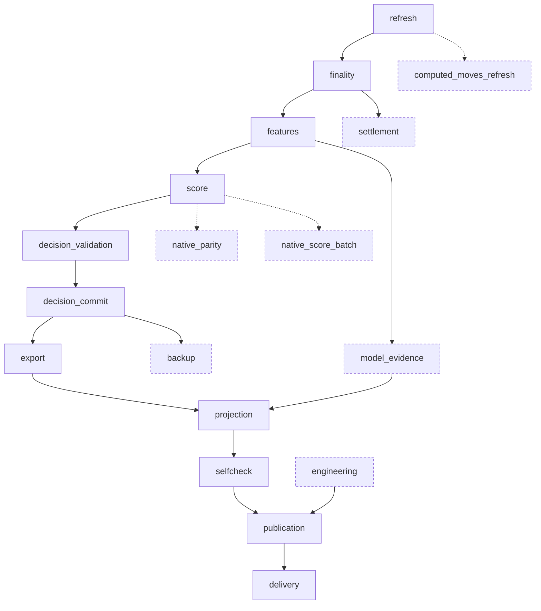
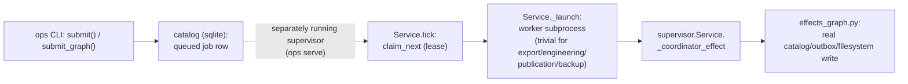
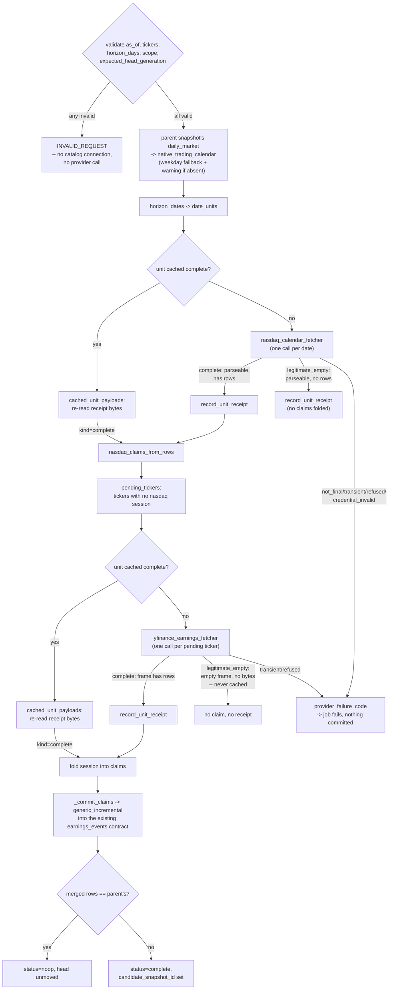
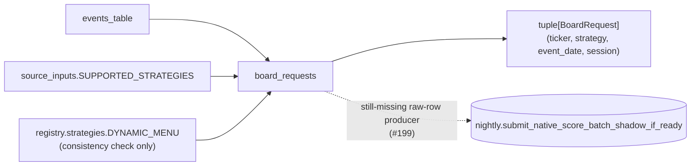

# `engine/v2/ops` — architecture

Layer 7.0 in the root `/ARCHITECTURE.md` layer table. Replaces the new
supervisor/catalog design, `dashboard/nightly.py` (as a job graph) and
`tools/bounded_run.py` (as an executor adapter). See the root doc for the
layer rules this package is checked against; this doc covers the detail
specific to this package.

## Purpose

Durable job submission, leases, retry history and dependencies; resource
admission and per-job CPU placement; the nightly job graph and its release
boundary. It does not decide research conclusions (`engine/v2/evaluation`)
and does not compute a score (`engine/v2/scoring`) — it only sequences and
persists the jobs that call into those packages.

This doc also covers `native_board_universe.py`: a pure, answer-free
enumerator that reproduces legacy `engine.score.score_calendar`'s event ×
strategy enumeration for the strategies native scoring supports, without
touching the legacy chain index or constructing a legacy `Scorer`. It has
no production caller yet — see "Dependencies" below.

## Primary contracts and public interfaces

The operator interface is the versioned command protocol
`engine/v2/ops/cli.py` exposes (`python3 -m engine.v2.ops <command>`),
derived directly from its `argparse` definitions:

- `init`, `doctor`, `health`
- `serve` — starts the supervisor loop
- `plan {nightly,experiment,training,promote}` — builds and saves a plan
  document; `training`/`promote` take operator-only arguments
  (`--training-mode`, `--recipe`, `--state`, `--alpha`, `--cutoff`,
  `--strategy`, `--pairs`, `--ticker-chunk`, `--release-root`,
  `--release-id`) and are never part of the nightly DAG
- `submit --plan --idempotency-key`
- `rescore --request --native-inputs` — read-only, no provider pulls, no fitting
- `capture-inputs --as-of --tickers --context-tickers --year-start --year-end --source-root --output`
- `reconcile <job_id> --expected-attempt`
- `provider-account --account --remaining --live-reserve`
- `snapshot {plan-import,submit,promote,rollback}`
- `ledger {import-history,status,calibrate,book}`
- `decisions supersede --row-id --reason --from-json`
- `price-refresh --session [--dry-run]`
- `price-history capture --source-root --scope [--dry-run]`
- `get`/`logs`/`cancel`/`resume`/`explain <job_id>`

Internally: `nightly.py`'s `GRAPH`, `graph_order()`, `OPTIONAL`,
`NO_JOB_STAGES`, `build_nightly_plan`, `build_legacy_job_requests`,
`_stage_sequence` (see "Diagrams" below); `supervisor.Service`/`serve`;
the coordinator-effect functions in `effects_graph.py`; `training.py`'s
`training_job_kind`/`promote_job_kind` (registered in
`stages.py::_core_kinds`, not in `supervisor._COORDINATOR_EFFECT_KINDS`),
`training_plan`/`promote_plan`, `run_training_worker`/`run_promote_worker`;
`BoardRequest`/`board_requests(as_of, horizon_days, tickers, events_table)`
(`native_board_universe.py`) — a pure key `(ticker, strategy, event_date,
session)` and the function that enumerates one per event × native-covered
strategy, plus one `DYN-SV` meta-request per event; `calendar_moves_jobs.py`'s
`computed_moves_job_kind`/`forward_calendar_job_kind`, `CalendarMovesParameters`/
`calendar_moves_parameter_problems`/`calendar_moves_job_spec`, and
`run_computed_moves_worker`/`run_forward_calendar_worker` (dispatched by
`worker.py`). `forward_calendar_refresh` has a `JobKind` (worker dispatch,
loader callback, parameter validation) but no `nightly.py` `GRAPH`/
`OPTIONAL` node and no `supervisor.Service` submitter yet — not on the
nightly schedule.

`forward_calendar_store.py` is one of a small number of natively-fetched
data stores living directly in this package rather than delegating to
another v2 layer. `run_forward_calendar_refresh` is a standalone,
fully keyword-only runner validating every non-fetcher argument before
touching the catalog or a provider (see "Failure semantics" below);
`tickers=()` means the whole market. Its commit path composes a
per-attempt lease `fence_check` (byte-identical in shape to
`computed_moves_store`'s own) with the existing `_head_fence` check —
`_head_fence` always runs first, both inside the one transaction
`catalog.commit_snapshot` invokes — so a cancelled or lease-expired
attempt is refused before anything commits, never after; omitting
`fence_check` (the default) keeps `engine/v2/data/incremental.py`'s
generic-refresh path and `engine/v2/research/_trades_publish.py`
unchanged. No `GRAPH` node or `supervisor.Service` submitter exists yet,
so nothing submits a `forward_calendar_refresh` job today.

`native_score_batch.py`: the batch-shaped seam between the board universe
(`native_board_universe.BoardRequest`) and
`engine.v2.scoring.application.score_batch`. `assemble_score_batch_inputs`
turns one release binding (`ScoringReleaseBinding`) plus a sequence of
already-staged `NightlyEventInputs` into
`dict[BoardRequest, tuple[ScoreRequest, NativeScoreInputs]]` plus a tuple
of typed per-row refusals — a pure function; an empty `events` sequence is
a legitimate no-op. `run_native_score_batch_worker(parameters, root)` is
the job kind's worker entrypoint: resolves the release once, reads the
staged `events.json`, calls `assemble_score_batch_inputs`, then
`engine.v2.scoring.application.score_batch` under
`engine.v2.models.no_fit.no_fit_guard()`, and writes
`records.json`/`refusals.json` (refusal codes and the fixed-detail
contract are in "Failure semantics" below). **Supports `STR-THRU` only** —
any other strategy refuses per-row. `supervisor.Service`'s tick sidecar
(below) is its one production caller, though under today's production
default it never actually submits a job.

**Cutover PR-4 (redo — 2026-09-27, user decision option (c). This section
REPLACES the original PR-4 design, which proposed `tools/native_parity_run.py`,
a manual/operator-invoked script, as `native_parity`'s production caller.
The previous owner proved that script can never be more than manual: it
calls `run_shadow_nightly`, which "has no production caller [and] needs
14 caller-supplied stage handlers nothing builds" — a manual script
outside any schedule is not what "the REAL nightly" means. Phase 1 (cutover PR-4 redo slice 1, `#132`) landed
the pure functions this section documents — `legacy_parity_rows`,
`native_parity_report._empty_native_report`, and
`native_parity_report.apply_native_refusals` (`SCHEMA_VERSION` bumped
`v1.0` → `v1.1`) — with no job/worker/supervisor wiring yet. Phase 2
slice 2A (`#185`) lands the other half of the keyed-join design this
section already specified before either half was code: `native_score_batch.py`'s
`v2.0` keyed `records.json`/`refusals.json` schema (`_board_request_key`,
the new `INVALID_KEY_FIELD` refusal, schema tags
`native_score_batch_records.v2.0` / `native_score_batch_refusals.v2.0`)
plus `native_parity_report._population_key_from_board_request_key` and
`native_parity_report._native_rows_and_refusals` — the pure projection
functions this doc's "Primary contracts" section below documents. The
new `native_parity_report` projection functions are pure, with no
`native_parity` job/worker/supervisor wiring of their own — that wiring
is slice 2B, below. `native_score_batch.py`'s own worker and
shadow-submission sidecar are unaffected by this schema bump: they
already exist and are already wired (cutover PR-3 `#66`'s worker
dispatch, PR-7a `#126`'s tick-loop submission).
The `native_parity` job kind -- `stages.py::_native_parity_kind`,
`worker.py`'s dispatch branch, `run_native_parity_worker`,
`NativeParityParameters` -- is real (cutover PR-4 redo slice 2B(a),
`#191`). Its nightly-side builder,
`nightly.submit_native_parity_if_ready`/`_native_parity_identity`
(cutover PR-4 redo slice 2B(b), this PR), is also real and
independently tested, but has no production caller yet:
`supervisor.Service._reconcile_native_parity`, the tick-loop sidecar
that would call it every tick the way
`_reconcile_native_score_batch_shadow` (`#88`) already does, is a
separate PR stacked on this one. The `nightly.GRAPH` node width is a
further, still doc-only piece of this design (`run_shadow_nightly`'s
test-only graph walk; no submission path reads it). Cutover
PR-3 (`native_score_batch.py`, `#66`) and cutover PR-7a's design (`#88`)
and shadow-submission code (`#126`) are all already merged; PR-7a's code
(`#126`) implemented the tick-loop submission sidecar only, not the `v2.0`
schema this redo's design always said was `native_parity`'s own PR to
build (see "the row-key/join gap is not designed here" below) — `#185`
is that build. One piece is
untouched by this redo, real code already on `main`, independent of
everything `#66`/`#88`/`#126` supply: `native_parity_report.py`'s
tolerance policy is already pluggable — see "the tolerance policy is now
pluggable" below, unchanged.**

`native_parity` closes the gap the root doc §4 and this doc's own
"Diagrams" section both name: `run_shadow_nightly` "has no production
caller, only tests ... call it," so in production `native_parity` today
never actually compares anything — a production run supplies no
`parity_rows`, `_registered_handlers` defaults both sides to `{}`, and
`compare_native_vs_legacy`'s own `_refuse_empty_inputs` raises
`VALIDATION_FAILED` before any comparison runs, which `_run_stage` turns
into a `"degraded"` receipt for this `OPTIONAL` stage (see "Outputs"
below for why this is NOT the same claim as "writes an empty-input
report" — no report is ever written either). **This redo does not close
that gap through `run_shadow_nightly` at all.** That function keeps its
existing stage-walk and `native_parity_handler`'s existing signature
contract completely unchanged (both already correctly consume real
`legacy_rows`/`native_rows` dicts today — proven by
`tests/test_v2_ops_native_shadow_render.py` — and stay exactly the
test-only path they always were; nothing before this redo, or in it,
builds real dicts to hand `run_shadow_nightly` in production). The gap
closes through a SEPARATE production path: a new `native_parity` job
kind, submitted by `supervisor.Service`'s own tick-loop sidecar —
mirroring `computed_moves_refresh` (Part 4, `#54`) and `native_score_batch`'s
own shadow submission (`#88`) byte-for-byte in shape — never through
`build_legacy_job_requests`, so a broken parity submission can never
abort a required legacy stage. That job's worker calls the exact same
`compare_native_vs_legacy`/`native_parity_handler` functions
`run_shadow_nightly` already calls, so the two paths — one test-only, one
production — can never silently diverge in comparison logic: root doc
§5's "one shared parity comparator" invariant, restated one level up as
one shared CALLER of that comparator, reached two ways.

Three new symbols in this PR, mirroring `native_score_batch`'s own PR-7a
shape (`stages.py::_native_parity_kind` shipped earlier, in `#191`). The
tick-loop sidecar that will call the builder
(`supervisor.Service._reconcile_native_parity`) is a separate, stacked PR;
its own placement/tick-order design belongs to that PR, not here — today,
the builder has no caller at all:

- `nightly.submit_native_parity_if_ready` — the builder a future sidecar calls,
  mirroring `submit_computed_moves_refresh_if_ready` (`nightly.py:858`)/
  `submit_native_score_batch_shadow_if_ready` (`#88`) in signature shape.
- `nightly._native_parity_identity` — a cheap catalog-only identity check
  mirroring `_computed_moves_identity` (`nightly.py:830`): finds the
  latest succeeded `native_score_batch` job by its own idempotency key
  (`"nightly:<as_of>:<scope_hash>:native_score_batch"`, `#88`'s own R6),
  parses `(as_of, scope_hash)` out of it, and recovers the paired
  succeeded `"score"` job's id with the SAME query `#88`'s own
  `_native_score_batch_identity` already runs to find a session's
  `"score"` job (`"nightly:<as_of>:<scope_hash>:score"`) — reused here
  with `(as_of, scope_hash)` already known rather than searched for,
  never a second, independently written lookup. Returns `(as_of,
  scope_hash, score_job_id, native_score_batch_job_id)`, or `None` when
  no succeeded `native_score_batch` job exists yet.
- `stages.py::_native_parity_kind()` — **implemented, slice 2B(a) (this
  PR)** — a new `JobKind`, mirroring
  `_native_score_batch_kind()` (`stages.py:271`) in shape:
  `name="native_parity"`, `worker="native_parity"`,
  `parameters=NativeParityParameters` (new, `RescoreParameters`-shaped —
  only `expected_ids` and `input_bindings`; this job carries no scalar
  data of its own, since every input it reads is job-bound),
  `resource_classes=frozenset({"validation"})` (a pure comparison, no
  provider fetch — the same classification `decision_evidence` already
  has), `effects=("staged",)`, `retry=RetryPolicy("bounded", 2, (5, 30))`,
  `checkpoint_contract="native_parity_report.v1.1"` (matching
  `native_parity_report.SCHEMA_VERSION`, which Phase 1 (`#132`) already
  bumped from `v1.0` — see "Outputs" below for the two additive fields
  this contract already covers), `namespaces=frozenset({"shadow", "smoke"})`.
  `worker.py::dispatch` gains a `"native_parity"` branch routing to
  `native_parity_report.run_native_parity_worker` (below), the same
  lazy-import-inside-`_dispatch_*` pattern `_dispatch_native_score_batch`
  already uses (`worker.py:167-168`, `:198-200`).

`nightly.GRAPH` gains a `"native_score_batch": ("score",)` node (`#88`),
and `"native_parity"`'s own existing node (`nightly.py:58`) widens from
`("score",)` to `("score", "native_score_batch")` — topological
documentation only, for `run_shadow_nightly`'s whole-graph test-only
walk; no submission path reads either edge (the same "documentation, not
a submission source" rule Part 4 already established for
`computed_moves_refresh`'s own node).

- **`nightly.legacy_parity_rows(score_document: Mapping[str, Any]) ->
  dict[str, dict]`** (new, this package). Keys the legacy `score.json`
  document's own `"rows"` array by
  `engine.v2.ops.decision_validation.population_key`'s `"ticker|strategy|
  event_date"` format — REUSED, not re-derived and not re-added: this
  public function already exists (`decision_replay.py`'s own population
  comparison already imports it), and it is the identical three-field
  format `engine.v2.serving.native_render.native_row_key` already derives
  for a native `ScoreRecord` (that module's own docstring: `"the native
  twin of bridge._population_key"` — `legacy_adapter._population_key` is a
  second, private, byte-identical copy of the same format used only for
  `_action_score`'s own population check; this PR reuses the PUBLIC one
  `decision_validation` already exports, adding no new function). Pure: no
  filesystem, no clock, and — the point of putting this here rather than
  in the composing script below — no import of `engine.v2.serving` (a
  layer-7.0 peer of `engine.v2.ops`, per the root doc's layer table;
  `checks/import_layers.py` would refuse that edge). A `score_document`
  with no `"rows"` key returns `{}` (not a refusal —
  `native_parity_handler`'s existing `_refuse_empty_inputs` already turns
  an empty `legacy_rows` into `VALIDATION_FAILED` downstream, so this
  function does not need its own empty-input check).
  **`legacy_parity_rows` does NOT reuse `population_key`'s own
  `.get(key, "")` empty-string substitution for a missing
  `ticker`/`strategy`/`event_date`** (root doc §5: "a missing or unusable
  input produces an explicit withheld/refused status," never a silent
  default) — reusing that substitution here would let one malformed row's
  empty-string-keyed entry either collide with a genuinely empty-fielded
  row, or, more likely with real data, simply end up unique and reported
  as an ordinary `only_legacy` row: quietly absorbed into the report as a
  population difference rather than surfaced as the malformed input it
  actually is. **Duplicate keys are the same class of finding, not a
  separate one**: `_action_score`'s own population check
  (`observed_keys = {_population_key(row) for row in rows}`) compares
  `population_key` values only as a SET, so a `score.json` carrying two
  rows under one `ticker|strategy|event_date` key (sibling precedent:
  `decision_replay.decision_population` rejects a duplicate population
  key explicitly, via `VALIDATION_FAILED`; `_action_score` does not)
  already passes that check today without ever proving the two rows
  agree — a plain `{key: row for row in rows}` comprehension in
  `legacy_parity_rows` would then silently keep whichever row iterated
  last and drop the other with no trace. `legacy_parity_rows` therefore
  validates every row before keying any of them: a missing, non-string,
  or empty `ticker`/`strategy`/`event_date`; a `ticker` or `strategy`
  containing the `"|"` `population_key` delimiter (CodeRabbit round 3 —
  `population_key` joins on `"|"`, so an unescaped delimiter inside a
  field would let two distinct rows collide under one key); OR two rows
  sharing one `population_key` value — each raises `OpsError` — matching
  `decision_population`'s own code, `VALIDATION_FAILED` (detail naming
  the row index/offending field, or the repeated key and both rows'
  indices) — for the WHOLE call, before any dict is constructed: a
  batch-level refusal, never a per-row skip or a last-write-wins
  collision, so a malformed or duplicate-keyed `score.json` is never
  silently read as smaller, or different, than it actually is. The same
  refusal covers the shape one level up, before `population_key` is ever
  called on a row: `score_document["rows"]`, if present, must be a list of
  mappings — a non-list value or any non-mapping element raises `OpsError`
  (`VALIDATION_FAILED`) rather than letting `population_key`'s own
  `.get(...)` calls raise a bare `TypeError`/`AttributeError` on a
  malformed element.
  `population_key`, `_population_key`, and `_action_score`'s own
  set-based check are all unchanged by this PR.
- **`native_parity_report.run_native_parity_worker(parameters, root)`**
  (implemented, slice 2B(a), this PR) — the `native_parity` job kind's worker entrypoint (dispatched
  from `worker.py`, registered in `stages.py::_core_kinds`). Reads its two
  job-bound inputs (`score.json` from the paired `"score"` job;
  `records.json`/`refusals.json` from the paired `native_score_batch` job
  — see "Inputs" below for exactly how `_native_parity_identity` finds
  both). The worker ITSELF also refuses `VALIDATION_FAILED` up front,
  before reading a single row, if either document's `schema_version` is
  not exactly `native_score_batch_records.v2.0`/
  `native_score_batch_refusals.v2.0` (gate finding on `#191`, real: the
  generic job-submission API can submit a `native_parity` job against ANY
  bound artifacts today, entirely independent of
  `submit_native_parity_if_ready`'s OWN pre-submission check (this PR,
  nightly.py) — a worker-side check stays REQUIRED defense-in-depth
  regardless: a generic submission always bypasses any one caller's own
  pre-submission check, and a directly-submitted job has no caller-side
  memo to protect — it simply fails, correctly, at the worker). See
  "Cutover PR-4 (redo)'s own input sourcing" above for the sidecar-layer
  check a later, stacked PR adds, for retry-semantics reasons this
  worker-side check does not address. It builds
  `legacy_rows`/`native_rows`/`native_refusals`/`unkeyable_refusals` (via
  `_native_rows_and_refusals`, below), projects every native record
  through `_native_comparison_row` (gate finding on `#191`, real: a raw
  `to_document(ScoreRecord)` preserves `ScoreRecord`'s own nested
  per-dimension dicts, while `_dimension_view` looks up every field at
  the row's top level — an un-flattened record compares as all-`None`,
  masking real native values and reporting false mismatches against
  real legacy ones; this projection reads each dimension from the same
  nested sources `checks/phase4_real._numeric_views` already reads them
  from, a data-shape port only, never a new comparison rule), and
  branches on whether `legacy_rows` and
  `native_rows` share any key (below, `_empty_native_report`) before
  calling the SAME `compare_native_vs_legacy` (unchanged) and the new
  `apply_native_refusals` (below) — see "Outputs" for what it writes.
  This is the real (only) production caller `tools/native_parity_run.py`
  was originally designed to be. **That script is dropped from this redo
  entirely — no code for it was ever written** (`tools/native_parity_run.py`
  and `row_explanations` never existed and still don't; `legacy_parity_rows`
  now exists on `main` as of Phase 1, `#132`, but only as the pure function
  this section documents — nothing calls it in production yet, so nothing
  needs migrating away from the dropped script), never built as a parallel
  manual path alongside the job. There is exactly one way a real
  `native_parity_report.json` gets produced in this codebase once Phase 2
  lands, not two.
- **`native_parity_report._empty_native_report(legacy_rows, native_rows,
  dimensions, tolerance_policy) -> dict`** (new, private) — closes a real
  gap `compare_native_vs_legacy`'s own row-sharing checks would otherwise
  cause (CodeRabbit round 3; widened by an Opus gate finding, both real).
  Two EXISTING, UNCHANGED checks inside `compare_native_vs_legacy` can both
  fire even though a refusal fully explains the gap: `_refuse_empty_inputs`
  (`not native_rows` → `VALIDATION_FAILED`) when native produced nothing at
  all, and the function's own `if not compared: raise fail("VALIDATION_FAILED",
  "native parity report shares no row key", ...)` (`native_parity_report.py:178`,
  pre-existing, unchanged by this redo) whenever `legacy_rows` and
  `native_rows` share NO key — which happens not only when `native_rows`
  is empty, but also when `native_rows` is non-empty yet none of its keys
  overlap `legacy_rows`'s (every row that would have overlapped was
  instead refused). `run_native_parity_worker` therefore checks
  `legacy_rows` is non-empty FIRST — an empty `legacy_rows` is a genuinely
  missing legacy input, never something a native refusal can explain, so
  it ALWAYS falls through to `compare_native_vs_legacy`'s existing checks
  and fails `VALIDATION_FAILED`, exactly as before this redo, regardless
  of how many native refusals exist. Only once `legacy_rows` is confirmed
  non-empty does it compute `shared = set(legacy_rows) & set(native_rows)`
  BEFORE calling `compare_native_vs_legacy` at all, and take this path
  whenever `shared` is empty AND EITHER (a) `set(legacy_rows) <=
  set(native_refusals)` — every legacy key specifically named by a keyed
  refusal, not merely "some refusal exists somewhere" (CodeRabbit gate
  round 1, real finding: an unrelated refusal for a DIFFERENT population
  key must never explain a DIFFERENT legacy row's absence — that case
  still falls through and fails) — OR (b) `native_rows` and
  `native_refusals` are BOTH empty while `unkeyable_refusals` is non-empty
  (nothing was ever keyable at all, so nothing could have matched
  anything, which vacuously explains every legacy key's absence). This
  covers every case the narrower "`native_rows` empty" check alone would
  miss:
  - **All refused, none keyable.** Every row refused `INVALID_KEY_FIELD`
    (above): `native_rows` and the keyed `native_refusals` are BOTH empty,
    but `unkeyable_refusals` is fully populated. The narrower check (only
    testing keyed `native_refusals`) would wrongly fall through to a
    normal `compare_native_vs_legacy` call and hit `_refuse_empty_inputs`.
  - **Disjoint keys, native_rows non-empty.** Every legacy row's native
    counterpart was refused BY ITS OWN matching population key (case (a)
    above — an unkeyable refusal carries no population key, so it can
    never stand in for a specific legacy row's own counterpart here),
    while `native_rows`
    itself holds OTHER rows entirely (different tickers/strategies,
    genuinely `only_native`) that share no key with `legacy_rows`. Because
    `native_rows` is non-empty, `_refuse_empty_inputs` would not fire, but
    `shared` is still empty, so the pre-existing "no shared key" check
    (`native_parity_report.py:178`, above) would — even though every legacy row's absence IS
    explained by a refusal, exactly `native_refused`/`native_refused_unmatched`'s
    (below) reportable outcome, not a missing-input failure.
  - **All refused, keyable.** The ORIGINAL narrower case (`native_rows`
    empty, keyed `native_refusals` fully populated): still covered, since
    `shared` is trivially empty when `native_rows` is.

  In every covered case, `_empty_native_report` builds the SAME dict shape
  `compare_native_vs_legacy` would return for a would-be comparison with no
  shared keys — `{"schema_version": SCHEMA_VERSION, "tolerance_policy_id":
  tolerance_policy.policy_id, "compared": [], "only_legacy":
  sorted(legacy_rows), "only_native": sorted(native_rows), "mismatches":
  []}` (unlike the original narrower version, `only_native` is NOT
  hardcoded `[]`: because `shared` is empty by construction on this path,
  EVERY key of `native_rows` is, by definition, `only_native` — never
  `compared`, since nothing shared) — WITHOUT calling
  `compare_native_vs_legacy` (there is no numeric comparison to make:
  nothing shared was scored against anything), and `apply_native_refusals`
  runs on it exactly as it would on a real comparison's output, narrowing
  `only_legacy` by `native_refused`/`native_refused_unmatched` the
  identical way. If `shared` is empty and BOTH `native_refusals` and
  `unkeyable_refusals` are empty (native_score_batch produced nothing at
  all AND refused nothing — a genuinely missing native input, nothing to
  explain the gap), or if `legacy_rows` is empty, `run_native_parity_worker`
  calls `compare_native_vs_legacy` normally and lets its EXISTING checks
  raise `VALIDATION_FAILED` — the correct outcome for THAT case is
  unchanged. `compare_native_vs_legacy` itself gains no new parameter and
  no new branch for this: the decision of which path to take is
  `run_native_parity_worker`'s own (still unbuilt — Phase 2), so
  `run_shadow_nightly`'s test-only path, which calls `native_parity_handler`
  directly and never `run_native_parity_worker`, never reaches this
  `_empty_native_report` branch at all — see the next bullet,
  `apply_native_refusals`, for the one behavior change that DOES already
  reach that existing test-only path today.
- **`native_parity_report.apply_native_refusals(report, native_refusals,
  unkeyable_refusals=()) -> dict`** (new) — the mechanism for "missing or
  refused native rows are counted separately" (user decision, option (c)).
  `compare_native_vs_legacy` itself is UNCHANGED — pure, refusal-blind,
  unaware `native_score_batch` can refuse a row at all. **But
  `native_parity_handler` — the EXISTING function `run_shadow_nightly`
  already calls, unchanged in signature — now calls
  `apply_native_refusals(report, {}, ())` unconditionally right after
  `compare_native_vs_legacy`, on every `"compared"` report it writes (Phase
  1, `#132`, already on `main`): with no refusals to apply this changes no
  row's classification, but every report that test-only path writes now
  also carries the two new, always-present, empty fields
  `"native_refused": []`/`"native_refused_unmatched": []` and is stamped
  `SCHEMA_VERSION` `native_parity_report.v1.1`, not the pre-redo `v1.0` — a
  real, already-shipped change to this existing artifact's shape, not a
  no-op reserved for `run_native_parity_worker`.** Once Phase 2 builds it,
  `run_native_parity_worker` calls this the SAME way, this time with real
  `native_refusals`/`unkeyable_refusals`, AFTER
  `compare_native_vs_legacy` or `_empty_native_report` (above) returns: any
  key in the report's own `only_legacy` list that is ALSO a key of
  `native_refusals` (population-key → refusal code, built from
  `records.json`'s paired `refusals.json`) moves from `only_legacy` into a
  NEW `"native_refused"` list (each entry `{"row_key": ..., "refusal_code":
  ...}`), and is removed from `only_legacy` — never counted in both. A
  `native_refusals` key that is NOT in `only_legacy` (the row was actually
  compared, or was `only_native`) is left untouched:
  `assemble_score_batch_inputs`'s own per-row either/or contract (PR-3)
  already makes one row both scored and refused impossible within one
  `records.json`/`refusals.json` pair, so this function trusts that
  pairing rather than re-validating it, exactly as `legacy_parity_rows`
  trusts `score.json`'s own shape once its own up-front validation
  passes. `only_legacy` therefore narrows to its real meaning under this
  redo: a legacy row `native_board_universe.board_requests` never even
  enumerated as a `BoardRequest` (an unsupported strategy, the `DYN-SV`
  wildcard) — never a row native attempted and explicitly refused, which
  `native_refused` names instead.
  **A refusal with no legacy counterpart is reported, never dropped
  (CodeRabbit round 5, real finding).** A `native_refusals` key that is
  NOT in `only_legacy` cannot be in `compared`/`only_native` either (a
  refused `BoardRequest` is by construction absent from `native_rows`,
  and both those buckets are built only from `native_rows`) — so the ONE
  remaining possibility, silently ignored by the original design, is a
  refusal whose projected `population_key` is not in `legacy_rows` at
  all: `native_score_batch`'s own board universe found and refused a row
  legacy's own `score.json` never carried in the first place. That case
  is now appended to a second NEW list, `"native_refused_unmatched"`
  (same `{"row_key": ..., "refusal_code": ...}` shape as `native_refused`,
  kept separate rather than merged so a reader can tell "legacy scored it,
  native refused it" apart from "native refused a row legacy never had").
  Every entry of `unkeyable_refusals` (the third, optional argument —
  `_native_rows_and_refusals`'s own pass-through of `refusals.json`'s
  `"unkeyable_refusals"` array, below) is appended to the SAME
  `"native_refused_unmatched"` list unconditionally, using its raw
  structured `{"ticker":..., "strategy":..., "event_date":...,
  "session":...}` key instead of a `row_key` string (below) — an
  `INVALID_KEY_FIELD` refusal never attempts the keyed join at all (its
  own source fields are exactly what made a safe key impossible to
  construct), so it is reported this way regardless of whether a
  same-identity legacy row exists, rather than trying to prove a negative
  match first. Every native refusal — keyed or not, legacy-matched or
  not — therefore lands in exactly one of `native_refused` or
  `native_refused_unmatched`; none is ever silently absent from the
  report.
- **`native_parity_report._population_key_from_board_request_key(key) ->
  str`** (new, private) — projects one `records.json`/`refusals.json` key
  (the 4-field canonical `BoardRequest` string `#88` specifies,
  `f"{ticker}|{strategy}|{event_date.isoformat()}|{session}"`) down to the
  3-field `population_key` format `legacy_parity_rows` already uses, by
  splitting on `"|"` into exactly 4 parts and calling
  `engine.v2.ops.decision_validation.population_key({"ticker": ticker,
  "strategy": strategy, "event_date": event_date})` — REUSING
  `population_key`'s own join format rather than string-concatenating a
  fourth time, so the two sides can never silently drift onto two
  different separators or field orders. `session` is validated as present
  (exactly 4 parts) but never folded into the key: legacy rows carry no
  `session` field to join against. A key that does not split into exactly
  4 parts is a batch-level `OpsError` (`VALIDATION_FAILED`) — matching
  `legacy_parity_rows`'s own all-or-nothing malformed-input discipline —
  raised before `run_native_parity_worker` builds `native_rows`/
  `native_refusals` at all, never a per-row skip.
- **`native_parity_report._native_rows_and_refusals(records_document,
  refusals_document) -> tuple[dict[str, dict], dict[str, str], tuple[dict,
  ...]]`** (new, private) — the ONLY caller of `_population_key_from_board_request_key`
  (above), and the place a duplicate collision is caught: the projection
  from a 4-field `BoardRequest` key down to a 3-field `population_key` is
  LOSSY (it drops `session`), so two DISTINCT `records.json`/`refusals.json`
  keys — the same `(ticker, strategy, event_date)` under two different
  `session` values, a genuinely possible events-table shape this design
  does not assume away — can project to the SAME `population_key`
  (CodeRabbit round 1, real finding). Silently keeping whichever one a
  dict comprehension iterates last would be exactly the last-write-wins
  collision `legacy_parity_rows` already refuses to allow for
  `score.json`'s own rows (above) — so this function applies the IDENTICAL
  discipline to the native side: every key in `records_document["records"]`
  and every key in `refusals_document["refusals"]`, TOGETHER (one row can
  never be both a record and a refusal, but two DIFFERENT rows — one a
  record, one a refusal, or both records, or both refusals — can still
  collide after projection, and this check catches all three shapes), is
  projected, and any `population_key` value produced by more than one
  distinct source key raises `OpsError` (`VALIDATION_FAILED`, detail naming
  the colliding `population_key` and both source `BoardRequest` keys) for
  the WHOLE call, before `native_rows`/`native_refusals` are built — never
  a per-row skip or a silent overwrite. No collision has ever been observed
  in practice (native's own board universe enumerates one `BoardRequest`
  per `(ticker, strategy, event_date, session)` combination the events
  table actually carries); this guard exists because the projection makes
  a collision POSSIBLE, not because one has occurred. **This function
  REQUIRES the key — `refusals_document["unkeyable_refusals"]`, never
  `.get("unkeyable_refusals", ())` (CodeRabbit round 6, real finding).**
  This function's only caller, `run_native_parity_worker` (below), is only
  ever reached for a job `submit_native_parity_if_ready` ("R2, cache",
  below) already confirmed carries `refusals_document["schema_version"]
  == "native_score_batch_refusals.v2.0"` before submission, and the v2.0
  writer ALWAYS emits this key, even as `[]` for a batch with no unkeyable refusals (the
  "refusals.json" bullet, above) — so its absence on a document already
  confirmed v2.0 means the file is malformed (truncated, hand-edited, or
  written by a defective producer), never a legitimate "this batch has
  none" case a silent default could paper over. A `KeyError` here is
  caught by `run_native_parity_worker` alongside its other
  `records.json`/`refusals.json` decode failures (below, "R1, missing
  input") and fails the WHOLE job attempt, exactly like a document that
  fails to decode at all — never a per-row skip, and never a silently
  empty `unkeyable_refusals`. The (now guaranteed-present) value is passed
  through completely unchanged — `INVALID_KEY_FIELD` rows (below) never
  had a `population_key` computed for them at all (that is exactly what
  makes them "unkeyable"), so there is nothing for this function to
  project, decode, or collision-check; it is `apply_native_refusals`
  (above), not this function, that consumes them.

**The original PR-4 design's "explained" bucket (`ROW_EXPLANATION_CODES`,
`row_explanations`) is dropped from this redo, not carried forward** —
see "Out of scope" below: no reusable stale-px/finality-drift classifier
exists today, so there is nothing for it to plug into yet, and this redo
does not invent one. A future PR can add it exactly as originally
specified, against `compare_native_vs_legacy`'s unchanged signature,
whenever a real classifier exists.

**The tolerance policy is now pluggable, not hardcoded — this part of the
PR is real code, already merged into this push, independent of `#66`.**
`engine.v2.parity.dimensions.compare_dimension` gained a keyword-only
`tolerance_policy` parameter (default `SCORE_RECORD_V1`, so the Phase 4
checker and every existing test are unaffected — none of them pass this
argument, so none of them can observe a behavior change);
`native_parity_report.compare_native_vs_legacy`/`native_parity_handler`
each gained the identical parameter, threaded straight down to
`compare_dimension`, and the written report now records
`"tolerance_policy_id": tolerance_policy.policy_id` so a reader of
`native_parity_report.json` can always see which policy compared it —
never an implicit, undiscoverable default. **Per-field tolerances come
from ONE config policy, the `engine.v2.parity.tolerance.TolerancePolicy`
type** (never a second ad hoc mechanism): the default that ships in this
PR is still `SCORE_RECORD_V1`, which declares zero per-field rules
(`rules=()`), so every one of the five dimensions' 30 fields —
`FORECAST_FIELDS` (12), `SIMULATION_FIELDS` (7), `FINANCIAL_FIELDS` (5),
`GATE_FIELDS` (3), `ANALOG_FIELDS` (3) — still compares under exact
equality until a caller explicitly plugs in a different policy. **No
per-field tolerance VALUE is added, chosen, or implied by this PR** —
that is a user decision, taken to the user separately, and per instruction
none of those values belong in this doc, the PR body, or an issue; only a
`TolerancePolicy` built and ratified elsewhere is ever passed in here.
`tolerance.py`'s own docstring names the risk this design avoids:
"chosen to make the first run pass" is a named failure mode, so this PR
adds the SEAM a ratified policy plugs into, not a guess at what it should
contain.

**Out of scope for this redo** (each a real gap, named rather than
silently left implicit): the stale-px/finality-drift classifier and the
"explained" bucket mechanism the original PR-4 design specified (above —
still no reusable classifier exists; a future PR adds it once one does,
against `compare_native_vs_legacy`'s unchanged signature); a
dashboard-facing "latest report" pointer path (this design's only durable
location is the catalog-addressed `job_<id>#report` binding — see
"Outputs" below); and building the actual user-approved, per-field
`TolerancePolicy` object itself (the pluggable seam already in place
takes it as a parameter — this redo does not construct one, and no
tolerance value appears in this doc, a PR body, or an issue).

**Corrected, not merely superseded: the original PR-4 design's own
out-of-scope line said flipping `native_parity` "onto a schedule, a job
kind, or the supervisor's tick loop" needed to wait for "Phase 7
[to change] legacy authority" first.** That reasoning was wrong even at
the time it was written, and two precedents that shipped since prove it:
`computed_moves_refresh` (Part 4, `#54`) and `native_score_batch`'s own
shadow submission (`#88`) both flip an OPTIONAL, shadow-only stage onto
the supervisor's tick loop without touching legacy authority, because
neither carries `store_domains` or any effect beyond `"staged"` — the
same is true of `native_parity` here (`effects=("staged",)`, no
`store_domains`, no scheduler edge from any required legacy stage to it).
A job kind reaching the tick loop is not itself a legacy-authority
change; only a `store_domains` write against a legacy-owned table, or a
`GRAPH`/`_DAG_STAGES` edge a REQUIRED legacy stage depends on, would be —
neither is true of `native_parity`, which is exactly why this redo can
schedule it now, well before Phase 7.

**Cutover PR-7a (implemented — wiring and refusal gate only).**
`native_score_batch` is registered as a job kind
(`stages.py::_native_score_batch_kind`) and has a production caller —
`supervisor.Service`'s tick sidecar, alongside legacy scoring, with no
authority change — but no job is ever actually submitted: since cutover
PR-7b's own flip of `nightly_trigger`'s scheduled plan to
`input_mode="snapshot"`, the selected `"score"` job now pins a snapshot,
so `submit_native_score_batch_shadow_if_ready` raises `VALIDATION_FAILED`
(the raw-row producer, [#199](https://github.com/yshewchuk/investment-validation/issues/199),
is not built yet) rather than silently returning nothing — only a
`legacy`-input-mode plan built directly via `ops plan` (not the scheduled
trigger) still gets a silent no-op (see "Failure semantics" below). Three
symbols, mirroring
`computed_moves_refresh`'s own shape:
`supervisor.Service._reconcile_native_score_batch_shadow` (tick-loop
sidecar, called from `Service.tick`); `nightly.submit_native_score_batch_shadow_if_ready`
(the builder the sidecar calls); `nightly._native_score_batch_identity` (a
cheap catalog-only identity check parsing the paired `"score"` job's own
idempotency key to recover `(session, scope_hash, snapshot_pinned)`, or
`None`). `nightly.GRAPH` gains a `"native_score_batch": ("score",)` node
(topological documentation only — no submission path reads it) and
`OPTIONAL` gains `"native_score_batch"`. `native_board_universe.board_requests`
still has no real caller — that enumeration step is
[#199](https://github.com/yshewchuk/investment-validation/issues/199)'s
raw-row producer.

**Cutover PR-7b (implemented, #145/#150): the shadow nightly plan pins a
snapshot before scoring.** `nightly_trigger._default_plan` runs in
`input_mode="snapshot"`, `snapshot_scope="shadow"` (was `"legacy"`/`None`):
legacy `"score"`/`"decision_replay"`/`"projection"`/`"selfcheck"`/
`"model_evidence"` and, once
[#199](https://github.com/yshewchuk/investment-validation/issues/199) AND
[#200](https://github.com/yshewchuk/investment-validation/issues/200)
both land, `native_score_batch` all read through ONE pinned, frozen
snapshot per session, removing "legacy and native read the store at two
different moments" from the shadow comparison — #199 gives
`native_score_batch` a reader at all, and #200 is what makes
`pin_snapshot_inputs` actually bind to the EXACT `snapshot_id`
`_ensure_shadow_snapshot` verified rather than re-resolving the head
independently. This never touches the real legacy nightly:
`nightly_trigger.py` runs on its own systemd timer
(`ops/systemd/native-nightly-trigger.timer`, every 30 minutes), separate
from whatever schedules the legacy nightly, with no code path into the
legacy process.

`nightly_trigger._ensure_shadow_snapshot(root, as_of, clock, attempt, ...)
-> (status, snapshot_id | None)`, called from `_submit_plan` immediately
before `plan_fn`, on every pre-plan attempt:

| Outcome | Meaning | Attempt/error budget |
|---|---|---|
| `("ready", snapshot_id)` | a `shadow`-scope snapshot fresh for `as_of` is committed; `snapshot_id` comes from the committed `SnapshotImportReceipt`, never a re-read of the mutable head | not consumed |
| `("not_yet", None)` | the legacy store has not caught up to `as_of` yet (a session mismatch) | free — no `snapshot_attempt`/`error_count` spent; the next tick retries under the SAME `attempt` |
| `("timed_out", None)` | drive-to-terminal hit `_serve_deadline`; the import job is left running, not cancelled | free (a separate consecutive-timeout counter, mirroring `serve_fn`'s own) |
| raises (terminal `snapshot_import` failure, or `INPUT_CHANGED`: the shadow head moved since verification) | routed through `_submit_plan`'s existing `_failure` path | bumps BOTH `error_count` and `snapshot_attempt` |

Idempotency key: `f"shadow_snapshot_import:{as_of}:{attempt}"` —
`attempt`-suffixed, not bare `as_of`, because an existing row under an
unchanged key is matched and returned regardless of its own state; a bare
`as_of` key would make one terminally-failed import permanent for the rest
of that `as_of`'s retry window. A key that already has a non-terminal row
is reattached and driven to terminal directly — never resubmitted — so
one key's request is submitted exactly once, ever. A terminal-but-failed
row raises `INPUT_CHANGED` immediately without resubmitting under the same
key; the NEXT `_submit_plan` entry mints a genuinely new key via the
bumped `snapshot_attempt`.

`TriggerReceipt.snapshot_attempt: int = 0` is a single, monotonic
per-`as_of` counter, carried on every receipt regardless of status
(independent of `error_count`, which resets on several unrelated
statuses), and bumped in exactly one place: a terminal `INPUT_CHANGED`
refusal, never a transient failure. Give-up is an OR of two independent
bounds: `error_count >= MAX_CONSECUTIVE_ERRORS` (unchanged) OR
`snapshot_attempt >= MAX_CONSECUTIVE_ERRORS` (new) — an alternating
`"error"`/`"timed_out"` sequence can no longer defeat the give-up bound by
resetting only the old counter. Any status in `RESUME_STATUSES` (which
includes `"snapshot_not_yet"`, a resumed `"not_yet"` outcome) resumes on
the next tick regardless of whether `plan_ref` is set — a pre-plan
timeout/error genuinely has no `plan_ref` yet, and this is what makes it
resumable rather than permanently `"missed"`.

Commits land directly in scope `"shadow"` (no candidate-scope-then-promote
step): `"shadow"` has no downstream consumer needing pre-advance
validation. The EXACT `snapshot_id` this call verified is threaded through
(`expected_shadow_snapshot_id` → `_default_plan`'s
`expected_snapshot_id`) so a later CAS check COULD bind the plan to it
instead of a re-resolved mutable head — closing a window where a human
`ops snapshot submit`/`promote` between verification and planning could
pin an unvalidated snapshot — but `pin_snapshot_inputs` does not yet
consume that value, so the window is not closed today; that CAS check is
[#200](https://github.com/yshewchuk/investment-validation/issues/200).
`nightly_raw_rows.scan_forward_board_requests` scans the pinned snapshot's
`earnings_events` and returns `BoardRequest`s for the forward window, with
no `src_orats` filter (history-only; forward dates are Nasdaq/yfinance).
`pin_snapshot_inputs` also returns the pinned snapshot's `calendar_version`.

## Inputs

- Plan documents built by `plans.py::nightly_plan`/`build_nightly_plan`
  (pinned decision clock, read set, session).
- The operations catalog (sqlite, via `catalog.py`'s `transaction`) — job
  rows, leases, retry history, provider-account budgets.
- The artifact store (`ArtifactStore`, filesystem-backed) for refresh plans
  and other bound inputs.
- Legacy filesystem reads (px CSV tree, yfinance fetch cache) through the
  declared adapter, for `price-history capture` and `price-refresh`.
- `computed_moves_store.py`'s `run_computed_moves_refresh` (`parameters,
  root, *, as_of, fetcher=None`; not itself a bare `RefreshCallback` since
  `as_of` varies per dispatch and cannot be pre-bound at import time —
  `calendar_moves_jobs.run_computed_moves_worker` adapts it by decoding the
  job's `CalendarMovesParameters` and binding a closure with `as_of` and the
  injected yfinance fetcher; see "Outputs" for the nightly wiring): reads
  `earnings_events`/`daily_market` off the pinned parent snapshot exactly
  once per run, then calls the injected yfinance history fetcher (never
  `legacy_adapter.new_fetcher`) per target ticker, where target tickers are
  the ORATS-confirmed-session rule `target_tickers_from_snapshot`
  re-implements from the legacy pull, read through the v2 snapshot instead.
- `forward_calendar_store.py`'s own inputs: the pinned parent snapshot's
  `daily_market` sessions (grouped by ticker, fed to
  `engine.v2.data.computed_moves.native_trading_calendar` for the horizon
  calendar — a snapshot with no `daily_market` session falls back to plain
  weekdays); `run_forward_calendar_refresh`'s own explicit keyword arguments
  (`catalog_path`, `objects_root`, `parent_snapshot_id`, `refresh_plan_hash`,
  `as_of`, `tickers`, `horizon_days`, `scope`, head-expectation and
  attempt-fence fields — most come off the job's own `CalendarMovesParameters`,
  see "Primary contracts"); and two injected network edges, one Nasdaq
  calendar fetch per discovery date and one yfinance earnings fetch per
  ticker still missing a session after the Nasdaq pass.
- `board_requests`: an already-loaded events table (`ticker`, `event_date`,
  `session` columns), an `as_of` date, a horizon in days, and an optional
  ticker filter. It performs no I/O itself — the caller loads the table; see
  "Failure semantics" for its input-validation rules.
- `assemble_score_batch_inputs`'s own arguments: `as_of` (the night's
  cutoff), `snapshot_id` and `calendar_revision` (caller-supplied identity
  strings this module never resolves itself — a later caller derives them
  from the pinned plan/read set), one `ScoringReleaseBinding` (resolved once
  by the caller, never re-resolved per row), a sequence of
  `NightlyEventInputs` (one `BoardRequest` key plus its staged
  `calendar_row`/`panel_row`/`panel_anchor`/`tier4_row`/`quote_rows`/optional
  `quote_status` — the calendar row must carry a non-empty string
  `event_id`, see "Failure semantics"), the batch's `feature_names`, and an
  optional `gate_policy: Mapping[str, Mapping[str, Any]]` keyed by strategy
  (see "Failure semantics" for why this is caller-supplied and optional). The
  worker's own `NativeScoreBatchParameters` additionally carries
  `release_root` as a plain string field and
  `input_bindings={"events.json": <artifact ref>}` for the one staged
  events array.

**Cutover PR-7a's input sourcing.** Two things are gathered before a
`JobSpec` is built, entirely inside `supervisor.Service`'s own sidecar
(`_reconcile_native_score_batch_shadow`), never inside
`nightly.submit_native_score_batch_shadow_if_ready` itself:

- **The release binding.** `Service._native_release_root_or_none` resolves
  the production release root, re-verifying it only when it may have
  changed since last checked, and passes only the resolved root (a plain
  string) to `submit_native_score_batch_shadow_if_ready`'s own
  `release_root` argument. `run_native_score_batch_worker` never receives
  the sidecar's `ScoringReleaseBinding` object; it independently re-resolves
  and re-verifies the binding itself, matching that type's documented
  contract. Every failure mode here (unset/blank env var, no pointer, or a
  release that fails hash verification) is Failure semantics R1 below.
- **Per-event raw rows** (`calendar_row`/`panel_row`/`panel_anchor`/
  `tier4_row`/`quote_rows` per `BoardRequest`, in the shape
  `NightlyEventInputs`/`assemble_nightly_source_bundle` require): the
  producer that stages these from a pinned snapshot does not exist yet
  ([#199](https://github.com/yshewchuk/investment-validation/issues/199)).
  The scheduled trigger's `"score"` job now pins a snapshot (see "Primary
  contracts" above), so the sidecar raises `VALIDATION_FAILED` rather than
  silently returning nothing; only a `legacy`-input-mode plan built
  directly (not the scheduled trigger) still gets a silent no-op — see
  Failure semantics R1 for both outcomes.

`SourceBundle` construction (`assemble_nightly_source_bundle`,
`source_inputs.build_native_score_inputs`) happens inside the worker, not
at submission time — both are pure, I/O-free functions run from the staged
`events.json`, so the submission side never touches
`engine.v2.scoring.source_inputs`. `events.json` is staged as one
immutable, content-addressed artifact via `spec.input_refs`, never a
`job_<id>#<name>` reference, since no prior job produces it.

**Cutover PR-4 (redo)'s own input sourcing (built, slice 2B(b), this
PR — `submit_native_parity_if_ready`/`_native_parity_identity`; its
tick-loop caller is a separate, stacked PR).**
`submit_native_parity_if_ready` gathers nothing beyond what
`_native_parity_identity` already found, WITH ONE DELIBERATE EXCEPTION
(CodeRabbit round 6; refined by an Opus gate finding on where it belongs,
both real) — unlike `native_score_batch`'s own sidecar, this job's body
has no board-universe enumeration or release resolution of its own, since
every value it needs is already a committed job output:

- **The one exception: a `schema_version` pre-submission check, not a
  row read.** `_native_parity_identity` (above) is a cheap
  CATALOG-only lookup — it finds the latest succeeded `native_score_batch`
  job by idempotency key alone, never opening that job's own staged
  `records.json`/`refusals.json`. But `native_score_batch`'s own worker
  changing schema (`v1.0` → `v2.0`, this redo, above) means a shadow
  deployment window where the "latest succeeded" `native_score_batch` job
  `_native_parity_identity` finds predates this redo's rollout and is
  still `v1.0`-shaped is a real, transient state, not a defect — and once
  `submit_native_parity_if_ready` submits a `native_parity` job for THAT
  identity, "R2, cache" (below) means that `(as_of, scope_hash)` key is
  NEVER retried: the existence check alone gates every future tick, so a
  job that would only ever fail (or worse, misread a `v1.0` array as
  `v2.0`) can never be corrected by a LATER `native_score_batch` re-run.
  `submit_native_parity_if_ready` therefore fully reads and JSON-decodes
  both artifacts (`_native_score_batch_document_schema_ok`, `nightly.py`)
  — the SAME `job_<native_score_batch_job_id>#records`/`#refusals`
  artifacts the worker later reads — but consults only the resulting
  mapping's `"schema_version"` field (`== "native_score_batch_records.v2.0"`/
  `"native_score_batch_refusals.v2.0"`); the `records`/`refusals` row
  arrays inside each document are decoded but never iterated or used here,
  BEFORE calling `engine.v2.ops.submission.submit` at all.

  **A confirmed mismatch is a permanent wait state for THIS
  `native_score_batch_job_id`, not a retried one.** Only when no
  `native_parity` job exists yet (an existing one
  short-circuits first): a mismatch on EITHER tag makes `submit_native_parity_if_ready`
  raise `VALIDATION_FAILED` (`reason: "schema_mismatch"`) on the tick it is first
  found, submitting NOTHING — so no job — and no `(as_of, scope_hash)` key — is
  ever created for this identity (unlike `_native_parity_identity` returning `None`, a quiet, non-exceptional wait). This identity's
  `native_score_batch_job_id` names a real, already-succeeded job whose
  staged `records.json`/`refusals.json` are fixed for good, and
  `native_score_batch`'s own R2 (`#88`) never resubmits a job for an
  `(as_of, scope_hash)` key that already has one — so `_native_parity_identity`
  will keep finding THIS SAME job id, tick after tick, for as long as this
  `(as_of, scope_hash)` stays current, and re-opening and re-decoding both
  files against that unchanging outcome, roughly once a second, buys
  nothing. The sidecar therefore memoizes a confirmed mismatch by
  `native_score_batch_job_id` (`self._native_parity_schema_mismatch_job_id`,
  a single-slot field alongside `self._native_parity_memo`; see "R1,
  missing input" and "R2, cache" below for the full mechanics) and skips
  the file reads entirely on every later tick whose identity carries the
  SAME job id — no exception, no attempt against `self._native_parity_memo`,
  just a cheap `==` check. What actually resolves the memoized mismatch is
  a DIFFERENT identity: a new `as_of` (the next session), or the same
  `as_of` under a NEWER succeeded `native_score_batch` job's `scope_hash`
  (a release swap mid-session, "R2, cache" below) — either carries a
  different `native_score_batch_job_id`, which misses the memo and
  triggers one fresh check. A `native_score_batch` re-run for the SAME
  `(as_of, scope_hash)` key, which the earlier draft's "re-checked … once
  a `native_score_batch` run … produces a `v2.0` artifact for that
  session" wording depended on, cannot happen: that key already has a
  job, so `native_score_batch`'s own sidecar never resubmits it — there is
  no later run "for that session" to ever land.

  If either committed artifact is missing from `attempt_outputs` or cannot
  be decoded, `submit_native_parity_if_ready` raises non-retryable
  `VALIDATION_FAILED` and submits no job. Storage-layer exceptions from
  `store.read_verified` propagate to the caller.

  This is a wait state exactly like the missing-job case, never a refusal
  and never a job failure — because, unlike every other input this
  sidecar reads, `native_parity`'s own worker has no way to retry a
  session whose job already exists.

- **Legacy source.** `job_<score_job_id>#legacy_score` — the SAME `score.json`
  `attempt_outputs` binding every other legacy-dependent job already reads
  (`_job_output("score", keys)`, `nightly.py:180`), decoded into
  `legacy_rows` via `nightly.legacy_parity_rows` (above), unchanged from
  the original PR-4 design.
- **Native source, per `#88`.** `job_<native_score_batch_job_id>#records`
  and `job_<native_score_batch_job_id>#refusals` — the `native_score_batch`
  job's own staged outputs. Both bindings resolve through the same
  `input_bindings.resolve_bindings`/`_resolve_job_binding` mechanism
  `score.json` uses — no new binding mechanism. The `native_parity`
  `JobSpec`'s `dependency_job_ids` carries BOTH `score_job_id` and
  `native_score_batch_job_id`, since `_resolve_job_binding` refuses any
  binding whose dependency is not declared (`input_bindings.py:34-36`) —
  each binding is checked against `spec.dependency_job_ids` independently,
  so a spec that named only one of the two jobs would fail to resolve the
  other's binding.
- **`tolerance_policy`.** Unchanged pluggable seam from `#72`: defaults to
  `SCORE_RECORD_V1` (exact for every field). `NativeParityParameters`
  carries no tolerance data of its own — a future, user-ratified
  `TolerancePolicy` is instantiated in code wherever that ratification
  lives and passed to `compare_native_vs_legacy` directly, never
  round-tripped through a job parameter (matching `#72`'s own stance that
  no tolerance value belongs in a doc, a PR body, an issue, or — this
  redo adds — a job's persisted parameters row).

**`records.json`/`refusals.json`'s own key schema — designed HERE, not by
`#88`.** `#88`'s final text (above, "Row keys") deliberately does NOT
prescribe a fix: an earlier draft of that bullet proposed a concrete
canonical-string-keyed schema, and the Opus gate on `#88` struck it —
"acceptance criterion 4 of this same design states the row-key/join gap
is 'not designed here'... choosing `records.json`'s own future output
schema is a change to `native_score_batch.py`'s output contract... which
belongs to whichever PR builds `native_parity`, reviewed on its own
terms." `#88` names only the HAZARD (a refused row breaks positional
`events.json`/`records.json` pairing) and points at the "starting
material": `BoardRequest`'s own fields and
`NativeScoreBatchRowRefusal.as_document()`'s existing `"key"` dict
(`native_score_batch.py:56`, `:82-91`). This redo makes that choice:

- **The key.** One canonical string per row,
  `f"{ticker}|{strategy}|{event_date_iso}|{session}"`, where
  `event_date_iso = str(pd.Timestamp(event_date).date())` — the IDENTICAL
  four fields, in the identical ISO-date form,
  `NativeScoreBatchRowRefusal.as_document()`'s own `"key"` dict already
  uses (`native_score_batch.py:87`); this redo flattens that dict into one
  string, rather than inventing a new field set or date format, because a
  JSON object's own keys must be strings. `BoardRequest` is `frozen`/`slots`
  (`native_board_universe.py:56`, `:62-65`) and hashable, so `assembled` (a
  `dict[BoardRequest, ...]`, `native_score_batch.py:332`'s own return
  type) already carries this exact identity per successful row; no new
  identity is derived, only re-formatted for JSON.
  **The join character is validated out of every source field before
  encoding, not merely tolerated after (CodeRabbit round 3, real
  finding).** `event_date_iso` can never contain `"|"` (a fixed
  `YYYY-MM-DD` form), but `ticker`/`strategy`/`session` are free-text-shaped
  inputs this design does not control at the source. A NEW per-row check,
  `native_score_batch._board_request_key(key: BoardRequest) -> str`, raises
  a `NativeScoreBatchRowRefusal` (new code `INVALID_KEY_FIELD`, the same
  collected-never-raised per-row mechanism `UNSUPPORTED_STRATEGY` already
  uses) the moment `"|"` appears in `key.ticker`, `key.strategy`, or
  `key.session` — BEFORE that row is ever encoded into `records.json`'s
  own keys (which route through this one function).
  **This check runs FIRST among `_assemble_one_event`'s per-row checks,
  before `_calendar_row_problem`/`CALENDAR_ROW_INVALID` and every other
  existing check in the "R1, missing input — per row" list below (Opus
  gate finding, real gap).** `_board_request_key` reads only `key`
  (`BoardRequest`'s own `ticker`/`strategy`/`session` fields, fixed at row
  construction, never the staged `calendar_row`/`panel_row`), so it needs
  no staged input to evaluate and has no ordering dependency on anything
  that check list resolves; placing it first means a row whose key is
  unsafe to encode is ALWAYS refused `INVALID_KEY_FIELD`, never one of the
  other codes, even when that same row would independently also fail a
  later check (a malformed `calendar_row`, an unsupported strategy, and so
  on) — a row can be refused only once, so the FIRST check that trips
  decides its code, and this ordering guarantees that code is always
  `INVALID_KEY_FIELD` whenever the key itself is unsafe. Every check AFTER
  this one — `_calendar_row_problem` included — can therefore assume
  `key.ticker`/`key.strategy`/`key.session` are already known "|"-free and
  need not re-validate them before their own encoding or comparisons. This
  makes the
  `records.json` join a true bijection BY CONSTRUCTION for every row that
  DOES get a canonical key (none of the four source values feeding it can
  ever contain the separator, so encoding and
  `_population_key_from_board_request_key`'s own decode are exact
  inverses) rather than merely "safe because a malformed encoding would
  also fail to re-parse as exactly 4 parts," which was this design's
  original, weaker argument and is not enough on its own: two DISTINCT
  malformed rows sharing an embedded `"|"` could still encode to the
  IDENTICAL 5-or-more-part string and be silently indistinguishable to a
  reader, even though each individually fails `_population_key_from_board_request_key`'s
  own 4-part check.
  **An `INVALID_KEY_FIELD` refusal is never given a canonical key at all
  (CodeRabbit round 5, real finding).** `_board_request_key` raising is
  precisely the statement "no safe string exists for this row" — inventing
  a SECOND, reversible escaping scheme just for this one code would add a
  new format this design would then have to prove correct too, for a
  refusal-only edge case. Instead `refusals.json` (below) puts these rows
  in a SEPARATE array, `"unkeyable_refusals"`, each entry carrying the raw
  STRUCTURED key `NativeScoreBatchRowRefusal.as_document()` already
  produces unjoined — `{"key": {"ticker": ..., "strategy": ...,
  "event_date": ..., "session": ...}, "code": "INVALID_KEY_FIELD",
  "detail": ...}` — never a string, so there is nothing to collide or to
  fail re-parsing `_population_key_from_board_request_key`'s 4-part check.
  `_native_rows_and_refusals` (below) passes this array straight through
  uninspected; `apply_native_refusals` (above) reports every one of its
  entries in `native_parity_report.json`'s new `native_refused_unmatched`
  list unconditionally, never attempting to match it against `legacy_rows`
  by any key. One row refusing this way is a normal, reportable per-row
  outcome for `native_score_batch` itself — same job-success semantics as
  any other refusal, never a batch-level `OpsError` there. Phase 2's test
  plan adds a case for each of `ticker`/`session` (the two genuinely
  free-text fields) carrying an embedded `"|"`, asserting the row refuses
  `INVALID_KEY_FIELD` into `unkeyable_refusals`, every OTHER row in the
  same batch still assembles normally, and `native_parity`'s own
  acceptance test asserts it surfaces in `native_refused_unmatched`.
- **`records.json`.** `"records"` changes from a bare array (today) to a
  JSON object: `{canonical_key: to_document(record), ...}`. Built inside
  `run_native_score_batch_worker` by zipping `assembled.keys()` (the
  `BoardRequest`s, in `assembled`'s own dict order) against `records` (the
  `tuple[ScoreRecord, ...]` `score_batch` returns) — valid because
  `batch.requests = tuple(r for r, _ in assembled.values())`
  (`native_score_batch.py:463`, unchanged) is built from that SAME
  `assembled.values()` iteration, and `score_batch` preserves
  `batch.requests` order (existing R6 invariant, unchanged) — never a
  reconstruction from `events.json`'s own order, which is exactly the
  positional pairing `#88` names as broken once any row has refused. New
  schema version: `native_score_batch_records.v1.0` → `v2.0`.
- **`refusals.json`.** Every refusal EXCEPT `INVALID_KEY_FIELD` is rekeyed
  the identical way `records.json` is, for symmetry and so `native_parity`
  needs exactly ONE join key format for both files, never two:
  `"refusals": {canonical_key: {"code": ..., "detail": ...}, ...}` — the
  same `code`/`detail` fields `NativeScoreBatchRowRefusal.as_document()`
  already carries, minus the now-redundant nested `"key"` dict (the
  object's own key IS the row identity; carrying it twice invites the two
  copies drifting apart). A NEW sibling array, `"unkeyable_refusals":
  [{"key": {...}, "code": "INVALID_KEY_FIELD", "detail": ...}, ...]`
  (above), holds exactly the rows that cannot be safely rekeyed at all —
  its entries keep the nested structured `"key"` dict UNCHANGED from
  `NativeScoreBatchRowRefusal.as_document()`'s own shape, since there is
  no canonical string to make it redundant. The worker's own return-value
  output tag moves `"native_score_batch_refusals.v1.0"` →
  `"native_score_batch_refusals.v2.0"` alongside both changes.
  `assembled`/`refusals`'s own row-level SET is unchanged —
  `assemble_score_batch_inputs`'s per-row either/or contract (PR-3: a key
  is either in `assembled` with a complete pair, or in `refusals`, never
  both) is exactly what lets `apply_native_refusals` (above) trust the two
  files never claim the SAME key twice.
- **What does NOT change.** `run_native_score_batch_worker`'s assembly and
  the no-fit guard are unchanged by this redo; every EXISTING per-row
  refusal code (`UNSUPPORTED_STRATEGY` and the rest) keeps its exact prior
  meaning — this redo adds exactly one NEW code, `INVALID_KEY_FIELD`
  (above), for the one new failure mode the keyed schema itself introduces
  (an embedded `"|"`), and changes the two output files' own top-level
  shape. A caller that reads `records.json`'s OLD array shape (none exists
  in production today — see "Cutover PR-4 (redo)" above) would break; no
  such caller exists to migrate.

**Cited, not solved here: `native_score_batch` does not submit at all under
today's production default.** `#88`'s own R1 (above, "Per-event raw
rows") found that in the production default `"legacy"` input mode, the
selected `"score"` job pins no snapshot, so PR-7a's shadow batch "does not
submit at all, full stop" until either a future PR changes the production
input mode or the still-missing raw-row producer gets its own way to
source its inputs — named there as cutover PR-6/PR-7b (snapshot-mode
inputs), NOT designed here or by `#88`. This redo does not solve that gap
either: `_native_parity_identity` (above) simply keeps returning `None`
(R1, "Failure semantics" below) for as long as no `native_score_batch` job
ever succeeds — the SAME graceful "nothing to do yet" outcome it already
has for the ordinary case of a night that has not reached that point yet,
not a distinct failure mode this redo needs to handle specially. Once
PR-7b unblocks `native_score_batch`'s own submission, `native_parity`
starts working with no change of its own.

## Outputs

- **`orats_daily_market_fetcher`'s rows** (`providers/orats_daily_market.py`).
  `fetcher(unit)`'s `ticker_rows` are plain dicts keyed by the
  `daily_market` contract's columns. A field is masked to `None` (never a
  raw sentinel, never silently dropped) when its scaled value falls outside
  `PLAUSIBLE_RANGES` (a local, test-verified mirror of
  `engine.data.normalize.common.PLAUSIBLE_RANGES`), or when it is
  `implied_move` and the scaled, in-range value is `<= 0` (ORATS's own
  "no quote" sentinel). `mcap_usd` is `None` whenever the day's payload has
  no market cap for that ticker; this module never looks back at other
  sessions to fill it (the backward-looking as-of carry is
  `engine.v2.data.incremental.merge_daily_market`'s job, documented in that
  package's own `ARCHITECTURE.md`). None of this raises — masking is
  normal-path behavior, not a failure (see "Failure semantics" for what
  does raise). A final, successful response still missing one of the
  unit's expected tickers is classified `partial` (never committed
  silently absent); an empty or literal-404 response is `not_final`
  instead, never `partial`. The two provider endpoints (`summaries`/
  `cores`) are classified independently and the worse kind wins: a
  `partial` endpoint becomes a retryable `TRANSIENT_SOURCE` refusal only
  when the other endpoint is not itself `not_final`/`credential_invalid`/
  `rate_limited`, any of which produces `SOURCE_NOT_FINAL` (or worse)
  instead.
- `StageReceipt`/`NightlyReceipt` documents recording each stage's status,
  input/output hash and (for a failure) an error code.
- Job records in the catalog (leases, attempts, outbox rows).
- **`assemble_score_batch_inputs`** returns `(dict[BoardRequest,
  tuple[ScoreRequest, NativeScoreInputs]], tuple[NativeScoreBatchRowRefusal,
  ...])` — a key is present only with a complete, buildable pair, plus every
  row that could not be assembled as a typed refusal. `run_native_score_batch_worker`
  writes this as two staged files, both keyed by the same canonical
  `_board_request_key(key: BoardRequest) -> str` string (see "Primary
  contracts" for the key design and the `INVALID_KEY_FIELD` refusal that
  makes it a bijection): `records.json` (`schema_version
  native_score_batch_records.v2.0`, `authoritative: false`, `known_gaps: []`
  — neither field is populated today; both stay in the schema for a future
  gap this module might need to flag — and a `records` object mapping
  canonical key to each succeeded, serialized `ScoreRecord`) and `refusals.json`
  (`schema_version native_score_batch_refusals.v2.0`, a `refusals` object
  keyed the same way, plus an always-present `unkeyable_refusals` array for
  rows whose own key was unusable). Keying by canonical key, rather than
  array position, is what keeps the pairing correct once any row has
  refused. A batch whose every row refuses still completes the job
  successfully with an empty `records` object — refusing every row is a
  valid, reportable outcome, not a worker failure. Exception: the job fails
  if two refusals, or a record and a refusal, collide on canonical key
  (two `BoardRequest`s that differ only by time-of-day within the same
  `event_date` truncate to the same key) — the worker raises before either
  output file is written, rather than silently dropping one row.
- `computed_moves_store.py` commits a new snapshot generation only when the
  `computed_moves` table's content actually changes, carrying every other
  table forward unchanged alongside the fresh `computed_moves` table version
  (one fragment per ticker, via the same immutable-object/manifest/atomic-head
  commit primitives `price_history_store` uses). Alongside the snapshot commit
  it inserts one append-only row per attempted ticker into
  `data_computed_moves_captures` — a capture already logged (same
  content-derived `capture_id`) is never re-logged. Every committed row's
  `computed_at` derives from `as_of`, never the run's own wall clock, so a
  same-`as_of` rerun over identical inputs produces byte-identical fragment
  content and resolves back to the parent snapshot rather than committing a
  new generation.
- Coordinator-side effects for every kind in
  `supervisor._COORDINATOR_EFFECT_KINDS` (cited by name rather than copied
  here since the list can drift) — catalog/outbox/filesystem writes
  dispatched from `supervisor.Service._coordinator_effect`; the worker
  subprocess for each of these kinds is trivial, the real write happens on
  the coordinator side, spread across `effects_graph.py`, `decision_commit.py`,
  `snapshot_promotion.py`, `snapshot_stages.py`, and `supervisor.py` itself
  — `effects_graph.py` is one of several implementation modules, not the
  only one.
- Private shadow artifacts only: `build_nightly_plan` refuses any `mode`
  other than `"shadow"` (`INVALID_REQUEST`), so this package's nightly
  output never reaches the legacy board.
- **`native_parity_report.json`.** `run_native_parity_worker` writes the
  report as an ordinary staged attempt output, `name="report"`, durably
  addressed `job_<native_parity job id>#report` — resolvable through
  `input_bindings.resolve_bindings` exactly like `score.json`'s own
  `job_<id>#score` binding, so a future job can bind
  `{"native_parity_report.json": "job_<id>#report"}` the same way
  `_decision_bindings`/`_render_bindings` already do. This is the same
  staged-attempt-output mechanism `records.json`/`score.json` use: the
  report stages privately and only becomes visible once the attempt is
  recorded `succeeded` — a killed worker leaves no output row, never a
  half-written file. No dashboard-facing "latest" pointer exists; a reader
  finds the report by job id (`ops get`/`ops logs`/`ops explain <job_id>`).
  Schema `native_parity_report.v1.1` adds `"native_refused"` (a
  `population_key`-matched legacy row moved out of `only_legacy`) and
  `"native_refused_unmatched"` (a native refusal with no legacy row to
  move) to v1.0's `compared`/`only_legacy`/`only_native`/`mismatches`/
  `tolerance_policy_id` fields; `only_legacy` now excludes rows
  `native_refused` claims. `nightly.submit_native_parity_if_ready` (this
  PR) can build such a job already; what still has no production caller
  is the tick-loop sidecar that would call it, a separate, stacked PR.
- `forward_calendar_store.run_forward_calendar_refresh` commits revisions
  into the existing `earnings_events` contract through
  `engine.v2.data.generic_incremental` — never `engine.data.rebuild.rebuild`
  — and returns a `RefreshCallbackResult` (`status` one of `complete`/`noop`;
  invalid input or an unconfigured fetcher pair raises `OpsError` instead of
  returning a `"failed"` result). A run whose merged claims equal the parent
  snapshot's own rows reports `noop` rather than a spurious `complete` (the
  commit layer's own equality check decides this, never key presence in the
  parent).
- `training`/`models_promote` are ordinary `_core_kinds()` job kinds, not
  `supervisor._COORDINATOR_EFFECT_KINDS` members: the worker subprocess does
  the real write itself. `run_training_worker` calls one of
  `tools/phase5_training_job.py`'s four job functions and writes
  `training_result.json`; `run_promote_worker` calls
  `engine.v2.models.deployment.promote`'s release-store pointer swap and
  writes `pointer_state.json`. Neither ever runs inside the nightly DAG —
  both are submitted by an operator's own `ops plan training|promote` +
  `ops submit`.
- `board_requests`: a tuple of `BoardRequest`, ordered by
  `(event_date, ticker)` outer, native-covered strategies alphabetically
  then `DYN-SV` last inner. No side effect, no write.

**`computed_moves_refresh` and `forward_calendar_refresh` nightly wiring.**
Both are registered `_core_kinds()` job kinds (`calendar_moves_jobs.
computed_moves_job_kind()`/`forward_calendar_job_kind()`), dispatched by
`worker.py::dispatch` to `run_computed_moves_worker`/`run_forward_calendar_worker`.
Only `computed_moves_refresh` has a nightly `GRAPH`/`OPTIONAL` node and a
submitter; `forward_calendar_refresh` has neither yet — building its
nightly node and submitter is a separate, unbuilt piece
([#206](https://github.com/yshewchuk/investment-validation/issues/206)),
and until then it is reachable only through direct `ops submit`, same as
`training`/`models_promote` above.

`computed_moves_refresh` is submitted only by `supervisor.Service`'s own
tick loop (`_reconcile_computed_moves_refresh`, wrapped in the same
degrade-only-this-stage try/except `_reconcile_publication_status` uses),
via `nightly.submit_computed_moves_refresh_if_ready`: it finds the latest
(by session, not by last-updated) succeeded native `"refresh"` job,
resolves the shadow head fresh, and keys the job purely by session — no
`scope_hash`, since its target set is always every scoreable ticker on the
pinned head, independent of which watchlist's `"refresh"` triggered the
tick. It is submitted alone (`submission.submit`, never `submit_graph`),
never sharing `build_legacy_job_requests`'s graph — bundling a REQUIRED and
an OPTIONAL job into one all-or-nothing graph submission is exactly what
R4 below forbids. If a job already exists under that key, in any state,
nothing is rebuilt or resubmitted. Rebuild attempts against an identity
that keeps coming back empty are memoized with a bounded retry budget
(`Service._computed_moves_memo`), so a full target-ticker scan is not
repeated every tick; a changed identity (new session, or the same session
on a new head) always gets a fresh budget. `completed_ids` on a
`"complete"`/`"noop"` result is the full whole-market target set the
worker itself derives at run time, not only tickers that got a written
fragment, so a caller's coverage denominator never disagrees with the
worker. `forward_calendar_refresh` does not share this denominator design
— its own `expected_ids` is always `set(tickers)`, so a whole-market
(`tickers=()`) submission is not supported as a job today, only the
standalone runner accepts it.

Both stores validate their own staged input document and `parameters`
up front, before the sqlite connection opens (unknown keys, wrong types,
non-existent `catalog_path`/`objects_root`, malformed identity/hash fields,
a document value disagreeing with the job's own parameters) — see "Primary
contracts and public interfaces" and the `forward_calendar_store.py` /
`calendar_moves_jobs.py` Failure semantics table below for the exact refusal
set. A stale `expected_head_snapshot_id`/`expected_head_generation` is
deliberately not checked before fetching — only at commit time, as
`SNAPSHOT_CONFLICT` — matching the store's optimistic design: a stale head
costs only the fetches this run already made, staged durably and reused as
cache on the next attempt.

**Cutover PR-7a: where the native `ScoreRecord`s will land.** Today's
production path never reaches a successful `native_score_batch` attempt
(the unpinned-snapshot branch returns before any job is built, and the
pinned-snapshot branch raises `VALIDATION_FAILED` because
[#199](https://github.com/yshewchuk/investment-validation/issues/199)'s
raw-row producer does not exist), so nothing below happens in production
today; this describes the destination once #199 lands.

- **Durable address.** `job_<native_score_batch job_id>#records` (and
  `#refusals`) — resolvable through `input_bindings.resolve_bindings`
  exactly like `score.json`'s own `job_<id>#score` binding; no new binding
  mechanism is needed.
- **Per-night identity.** The idempotency key is keyed to the specific
  succeeded `"score"` job selected (Failure semantics R6), never session
  alone — a later `"score"` job for the same session under a different
  `scope_hash` is a genuinely different native batch and gets its own key.
- **Row keys.** `records.json`/`refusals.json` are keyed by the same
  canonical `_board_request_key` string described above, not by array
  position, so a row is never paired against `events.json` positionally.
  `native_parity_report._native_rows_and_refusals`/
  `_population_key_from_board_request_key` already join on this key today
  (built, not designed here). Submitting and scheduling the `native_parity`
  job itself is built too (`nightly.submit_native_parity_if_ready`, this PR);
  what still has no production caller is its tick-loop sidecar, a separate,
  stacked PR — the key format it joins on was never in question.
- **Namespace/authority.** Every one of these jobs is submitted under a
  `NamespacePolicy` scoped to `{"shadow"}` only; `native_score_batch`'s
  registered `namespaces=frozenset({"shadow", "smoke"})` already forbids
  anything else, and its `effects=("staged",)` with no `store_domains`
  means it commits no legacy-store head and holds no read/write lease the
  legacy board depends on. No code path from this job reaches the legacy
  board, the decisions pipeline, or publication.

## Dependencies

Top-level imports, all strictly below this package's own layer (7.0):
`engine.v2.contracts` (0.0), `engine.v2.foundation` (0.5), `engine.v2.data`
(1.0 — `generic_incremental`/`incremental_tables`/`repository.Repository`/
`computed_moves`/`computed_moves_table`), `engine.v2.registry` (3.0,
`DYNAMIC_MENU`), `engine.v2.scoring` (5.0 — `native_board_universe.py`'s
`SUPPORTED_STRATEGIES`/`source_inputs`; `native_score_batch.py`'s
`release_bindings`/`nightly_source_bundle`/`source_inputs`/`stages`/
`identity`/`application`), `engine.v2.ledger` (6.0), `engine.v2.parity`
(6.5). `engine.v2.models` (3.5) and `engine.v2.domain.generation` (2.0,
`Geometry`/`Pricing`) are lazy-only, never at module top level.
`engine.v2.domain.generation` is imported only at one rescore/
native-score-input call site (`cli.py::_load_native_score_inputs`);
`engine.v2.models` (`no_fit`/`payoff_artifact`/`deployment`/`training`/
`RuntimeFitForbidden`/`TrainingRefused`) has more call sites, spanning
rescore (`cli.py`, `native_score_batch.py`, `worker.py`) as well as
`training.py`'s and `supervisor.py`'s own training/promotion/
release-resolution call sites — including `training.py`'s `promote_plan`,
one of the plan-builder functions the Invariants section below cites for
self-derived fingerprinting roots.

It does not import its layer-7.0 peers `engine.v2.serving`/
`engine.v2.research`, or anything above them (`engine.v2.diagnosis`,
`engine.v2.dashboard`), lazily or otherwise. Legacy reads go through the
one declared adapter module, `engine/v2/ops/legacy_adapter.py`
(`checks/legacy_adapters.json`); its own further legacy `engine.*` imports
are the adapter's job and are not layer-checked v2 dependencies.

`native_board_universe.py` deliberately never imports `engine.score`,
`engine.structures`, `engine.replay`, or `engine.fills` — the first two
each pull in `engine.replay`/`engine.fills` (the legacy chain index and
fill model) at their own top level, which would violate the isolation
invariant at import time even for a read-only comparison. It performs no
consistency check against `engine.score.DISABLED_STRATEGIES` either:
`SUPPORTED_STRATEGIES` (native's own input-builder strategy set, exported
from `engine.v2.scoring.source_inputs`) already excludes both disabled
strategies by construction, so no legacy read is needed; it is instead
checked against `engine.v2.registry.strategies.DYNAMIC_MENU` (a subset
assertion paid once at import time, no I/O, no legacy dependency).

**Callers:** `engine.v2.dashboard._server`'s lazy, documented import of
`cli.refresh_action` (root doc §4); the `tools/v2_*.py` operator CLIs
(direct import — permitted, `tools/*` is not a layered production package
per the root doc's §1); `experiments/*` runners submitting plans;
`checks/rearchitecture_*.py` verification scripts; and the
`tests/test_v2_ops_*.py` suite. No layered `engine/v2/**` package above
layer 7.0 imports this package, and no legacy `engine/**` module does
either, except that one documented dashboard caller. `board_requests` has
no production caller today — exercised only by its own tests — pending the
still-missing raw-row producer
([#199](https://github.com/yshewchuk/investment-validation/issues/199)).

## External systems and libraries

| System / library | Used for | Notes |
|---|---|---|
| `sqlite3` | the operations catalog | — |
| Local filesystem | artifact store, snapshot roots, legacy px/fetch-cache trees | legacy trees are read only through `legacy_adapter.py` |
| `orats-daily-market` provider account | ORATS daily-market rows | keyed, reads `ORATS_API_KEY`; credentials are never held here, only remaining-call/reserve counts |
| `nasdaq` provider account (`providers/nasdaq_calendar.py`) | forward-calendar rows via Nasdaq's public `api.nasdaq.com/api/calendar/earnings` endpoint, one date per call | unmetered, keyless (empty `PROVIDER_CREDENTIAL_VARIABLES`); still budget-tracked like a keyed account; needs a browser user-agent (the endpoint 403s the default client UA) |
| `yfinance` provider account (`providers/yfinance_edge.py`) | quote/earnings-date rows via the third-party `yfinance` library (`Ticker.history`/`Ticker.get_earnings_dates`, one call per ticker) | unmetered, keyless; `yfinance` is imported lazily inside the default callables, so importing the module touches no network |
| `pandas`/`numpy` | `native_board_universe.py`'s events-table filter, `BoardRequest.event_date` typing, and its `isinstance(v, (numbers.Number, np.number))` scalar-date guard | already transitive dependencies of this package; no file, network, or database access of their own |

All three provider accounts are operator-provisioned budget rows so the
shared scheduler reserves against them uniformly, keyed or not.

## Failure semantics

Every stage/effect below follows the root doc's 4c R1–R6 template (missing
input, cache, retry, transaction, partial write, idempotency); the
conventions here apply package-wide unless a subsystem table says
otherwise.

| # | Convention |
|---|---|
| R1 | A missing/malformed input is a typed refusal (`Problem`/`OpsError`), never a default. A whole-call refusal is for a caller error that makes the request meaningless; anything scoped to one row of a batch is collected there instead, never sinking the batch. |
| R2 | The catalog's `data_raw_receipts` table (`unit_receipts.py`) is the one durable fetch cache: only a `complete` receipt is reused; `legitimate_empty` is always re-verified live, and `not_final`/`transient`/`refused` are never cached. |
| R3 | `lifecycle.py`/`recovery.py` govern lease and ownership recovery; a stale lease is reclaimed only after ownership is proven gone. A tick-loop sidecar (below) never resubmits a job that already exists under its own key in any state — that is a coarser, separate budget from a job's own `RetryPolicy`. |
| R4 | Catalog writes go through `catalog.transaction`. A coordinator effect's own filesystem write must be replay-safe and idempotent, not atomic with the DB commit (root doc §6) — one exception, `experiment_effect`, appends a ledger CSV row inside the transaction and recovers by replay. Every sidecar below submits its job alone (`submission.submit`, never `submit_graph`), so it can never make a required job's admission all-or-nothing with it, and can never block, degrade, or slow the legacy board. |
| R5 | Artifact publication is atomic (`ArtifactStore`): a killed process leaves the old artifact or nothing. |
| R6 | Job identity is `job_id_for("shadow", key)`; a same-key/different-digest resubmission is refused `IDEMPOTENCY_CONFLICT`, never merged. A new key scheme is checked against legacy's own keyspace, not only sibling native writers. |

Two standing fixes worth stating as rules: a worker's exit code, not just
process-family liveness, decides `WORKER_FAILED` (a clean `exit_code == 0`
with a still-live straggler is reaped, never failed); and an effect whose
outbox row is already `delivered` short-circuits on retry with that row's
stored receipt, rather than raising a permanent refusal.

### `board_requests` (`native_board_universe.py`)

| Condition | Outcome |
|---|---|
| `events_table` missing/duplicated `ticker`/`event_date`/`session`, or `event_date` numeric/unparseable/`NaT`/timezone-aware | `INVALID_REQUEST`, before any row is read |
| `as_of` is `None`/`NaT`/timezone-aware/a bare number, or `horizon_days` is not a non-negative `int` | `INVALID_REQUEST` |
| valid input | pure, deterministic `tuple[BoardRequest]` — same input always returns the same tuple in the same order; no cache, no job identity of its own |

### `forward_calendar_store.py` / `calendar_moves_jobs.py`

| Condition | Outcome |
|---|---|
| any submit-time argument malformed (`catalog_path`, snapshot/plan-hash shape, `as_of`, `tickers`, `horizon_days`, `scope`, head expectations) | `INVALID_REQUEST` before the catalog opens or any provider call |
| an unknown field, wrong type, or `bool` where `int` is declared | `INVALID_REQUEST`, before decode returns |
| `tickers` non-empty but not equal to `expected_ids` as a set, or empty specifically for a `forward_calendar_refresh` job | `INVALID_REQUEST` at submission |
| `attempt_id`/`fence` set inconsistently (one without the other) | `INVALID_REQUEST` before any I/O |
| both set, but the fence is void or the lease expired | refused inside the same commit transaction, before any row is inserted or the head moves |
| no committed `daily_market` session on the parent snapshot | not a refusal — weekday-calendar fallback, recorded as a result warning |
| a unit's provider response is not-final/transient (retryable) or refused/credential-invalid (not) | one of four ranked failure codes; a mixed batch reports the worst, and nothing partial is committed |
| a cached unit exists (`response_kind="complete"`) | re-read from its receipt, never re-fetched |
| merged rows equal the parent's | `status=noop`, head unmoved |

### `nightly.submit_computed_moves_refresh_if_ready` (`computed_moves_refresh`)

| Condition | Outcome |
|---|---|
| no succeeded native `"refresh"` job yet, no shadow head, or a resolved target list that comes back empty | returns without submitting anything — not a failure, since `computed_moves_refresh` has no receipt to degrade until an attempt exists |
| a job already exists under today's session key, in any state | never rebuilt or resubmitted |
| idempotency key | session-only, never `scope_hash`-qualified — this job's target set is the whole scoreable universe, independent of which watchlist's `"score"` job happened to trigger the tick |

### Training / promotion (`training.py`, `deployment.py`)

| Condition | Outcome |
|---|---|
| a training-tool refusal, or a `deployment.DeploymentError` (including a superseded release hash) | mapped to a typed `OpsError` (`CHECKPOINT_INCOMPATIBLE`/`VALIDATION_FAILED`), never a bare `WORKER_FAILED` |
| no explicit `release_root` given AND `MODEL_RELEASE_ROOT` unset | `INVALID_REQUEST` at plan time, never an empty `release_root` reaching the worker |
| a recipe job's `pairs_path` does not resolve beneath the attempt's own pinned legacy root | `INPUT_CHANGED` at execution, even after passing plan-time validation |
| any `models_promote` claim | serialized globally by one write lease on the deployment pointer |

### `native_score_batch.py`

Batch-level (raises, no per-row attempt): a malformed `binding`/`events`
argument, two events sharing one key, an unresolvable release, a
`request_hash` collision across two different keys, or an invalid
batch-level `as_of`/`snapshot_id`/`calendar_revision`.

Per row (collected as a refusal, never sinks the batch):

| Refusal code | Condition |
|---|---|
| `INVALID_KEY_FIELD` | the row's own key contains a reserved separator |
| `MISSING_STAGED_INPUT` | the staged `calendar_row` has no non-empty string `event_id` |
| `CALENDAR_ROW_INVALID` | the staged calendar row is not a mapping, or its dates don't parse |
| `CALENDAR_ROW_KEY_MISMATCH` | the staged row's ticker/event_date disagrees with the row's own key |
| `UNSUPPORTED_STRATEGY` | the row's strategy is outside this assembler's supported set |
| `RELEASE_MISSING_ROLE` | the release has no driver/gate identity for the strategy |
| `AMBIGUOUS_DECISION_CLOCK` | the resolved driver/gate identities disagree on decision clock |
| `GATE_POLICY_NOT_STAGED` | no gate threshold staged for the row's strategy (known gap; no production source exists yet) |
| `POST_AS_OF_ROW` | the row's panel anchor is dated after `as_of` |
| re-wrapped | any other source-bundle refusal, or an input-assembly `ValueError` |

The four re-wrapped/malformed codes above always carry a fixed `detail`
string, never staged input or an exception message (`refusals.json` is a
published output). The release is resolved once per attempt and reused for
every row. Assembly is a pure function of its inputs (no clock, no RNG) —
a newly promoted release genuinely changing the output is by design.

### Native parity (`run_native_parity_worker`, `native_parity_report.py`)

A `native_parity` failure never blocks, degrades, or slows the legacy
board: it has no scheduler edge from any required stage and no descendant
job.

| Condition | Outcome |
|---|---|
| `legacy_rows` is empty | `VALIDATION_FAILED`, unconditionally — a missing legacy input is never explained by a native refusal |
| no shared key between native and legacy, but every legacy key is covered by its own matching keyed refusal (or nothing was ever keyable at all) | reported as a normal (degenerate) parity report, not a job failure — an unrelated refusal naming a different population key never counts |
| no shared key and no refusal explains it | job fails, same as a genuinely missing native input |
| the records/refusals schema tag is stale, no `native_parity` job exists yet for this identity | `submit_native_parity_if_ready`'s pre-submission check raises `VALIDATION_FAILED` (`reason: "schema_mismatch"`), submitting nothing |
| the records/refusals schema tag is stale, a `native_parity` job already exists for this identity | the existing-job short-circuit returns `None` before the check ever runs |
| a `native_parity` job reaches `run_native_parity_worker` with a stale schema tag anyway (e.g. the generic job-submission API used directly) | the worker's own independent check fails `VALIDATION_FAILED` |

### Tick-loop sidecars: submission identity

| Sidecar | Missing-input case | Idempotency key scope |
|---|---|---|
| `native_score_batch` shadow | no succeeded legacy score / no promoted release — reported, not submitted; a pinned-snapshot request with no raw-row producer yet raises `VALIDATION_FAILED` | the specific succeeded score job read, not session alone |
| `native_parity` | no succeeded `native_score_batch` yet — returns without submitting | the specific `native_score_batch` identity read |
| `_ensure_shadow_snapshot` | the legacy store has not caught up to `as_of` yet — `"not_yet"`/`"snapshot_not_yet"`, resumable, no attempt consumed | `(as_of, attempt)`; a genuine retry after a terminal failure mints a fresh `attempt`, never reusing a dead key |
| pool-nightly refresh | design only, not yet implemented — see [#192](https://github.com/yshewchuk/investment-validation/issues/192) | — |

### `supervisor.py`: leases during a long single-attempt effect

| Condition | Outcome |
|---|---|
| a coordinator effect or launch pre-work (hashing/copying a large read set, a long subprocess) outlives one lease period | every OTHER running attempt's lease is renewed periodically through the same keepalive primitive; a renewal failure for another attempt is swallowed, not raised |
| the CURRENT attempt's own renewal fails | still raises `LEASE_LOST`, unchanged |
| a long subprocess (e.g. the engineering gate) exceeds its own deadline, or the keepalive call itself fails mid-run | killed and reaped before the failure propagates; refused as before |

### `nightly_trigger.py`

| Condition | Outcome |
|---|---|
| `serve` runs past its bounded same-day deadline (ahead of the legacy cron's own start) | stops, returns `"timed_out"`; in-flight jobs are left for the standing recovery pass, not cancelled |
| `"timed_out"` recurs for the same `as_of` | counted separately from an `"error"` streak; past a fixed bound, the receipt becomes terminal `"failed"` |
| a resource profile could never fit this host | refused at submit time, before `serve` ever waits on it |
| legacy's nightly lock is held | on a tick resuming prior state, an ephemeral `busy_legacy` is returned for this tick only (durable prior state, with its plan, untouched); on a non-resuming tick `busy_legacy` is persisted, since there is no prior plan to protect |
| the per-`as_of` input manifest is captured | written fresh to a per-`as_of` path on every plan build, never a shared static file; a session mismatch is `INPUT_CHANGED` |
| the scoring context years | derived from `as_of` on every call, mirroring legacy's own formula — never a fixed window that ages past its end |
| crash after `plan_fn` returns but before the `"submitting"` receipt is durable (issue #186) | accepted risk: a retry may produce the same or a different plan; only the plan named by the durable receipt is submitted or scored. If the rebuilt plan differs, the first artifact is orphaned. Fresh retries recheck the window and probe; resume retries skip the window check and may submit after it closes. |

### `computed_moves_store.py`: capture never sees data from after `as_of`

| Condition | Outcome |
|---|---|
| a fetched price series | truncated to on-or-before `as_of` before hashing; an event outside the as-of-bounded window is filtered, both before rows are built |
| truncation empties the series | degrades to the existing "too few" outcome, never a raise |
| an event survives the filter but its exit price still falls past the truncated series | the existing out-of-range guard returns nothing; folded into an ordinary skipped row |
| a same-`as_of` rerun with an unchanged provider fetch | truncates identically both times — same hash, same no-op/re-resolve behavior |

## Invariants

Enforces or is bound by, from the root doc §5: missing-input typed refusal;
no parity-only mode (`native_parity` runs the real code, never a
legacy-shaped branch); one shared parity comparator (`native_parity_report.py`
calls `engine/v2/parity`, never a second comparator); snapshot/root
isolation (data and artifact paths resolve through `engine.paths`/the v2
foundation, never a module's own `Path(__file__)`-derived root); a root-doc
requirement, not something this package mechanically enforces everywhere,
is that nothing published carries a local path, raw exception text, or an
unsanitised free-text field. `worker.py` keeps a caught traceback in a
private per-attempt file, never the result pipe, which is the model other
stages follow — but that one convention does not by itself cover every
diagnostic or native batch output writer in this package.

**The one documented root-isolation exemption is worker-*source*
fingerprinting**, and it applies only to that — never to a data or artifact
root. A plan builder that runs outside a live `Service`
(`build_legacy_job_requests`, and `training.py`'s/`experiments.py`'s own
plan builders) may self-derive its own worker-source fingerprint root,
since it has no live `Service` to draw one from. A stage that runs *inside*
`Service` (`submit_computed_moves_refresh_if_ready`) must instead take
`code_source` as a caller-supplied parameter and fingerprint that, never a
root of its own.

`native_score_batch.py` adds **no runtime fitting** (root doc §2's
layer-6.0 rule): `run_native_score_batch_worker` runs `score_batch` inside
`engine.v2.models.no_fit.no_fit_guard()`, the same guard
`worker.py::_dispatch_adhoc_rescore` wraps `score_one` in.

`native_board_universe.py` adds two invariants of its own:
- **Native vs. legacy values.** `ticker`, `event_date`, and `session` come
  from the shared events table, which neither side owns; `strategy` comes
  from the native-covered strategy set (`SUPPORTED_STRATEGIES`) or the
  `DYN-SV` literal, never from the events table. Its one consistency
  assertion (`DYNAMIC_MENU` is a subset of `SUPPORTED_STRATEGIES`) reads
  only v2-native names — never `engine.score.DISABLED_STRATEGIES` or any
  other legacy-owned name.
- **Isolation.** This module never loads the legacy option-chain index or
  constructs a legacy `Scorer`, and never *imports* `engine.score` or
  `engine.structures`, so its import graph never reaches
  `engine.replay`/`engine.fills` either — isolation holds at import time,
  not only at call time.

## Diagrams

### Nightly stage graph (`nightly.py::GRAPH`)

```mermaid
flowchart TD
    refresh --> finality
    refresh -.-> computed_moves_refresh
    finality --> features
    finality --> settlement
    features --> score
    features --> model_evidence
    score --> decision_validation
    score -.-> native_parity
    score -.-> native_score_batch
    decision_validation --> decision_commit
    decision_commit --> export
    decision_commit --> backup
    export --> projection
    model_evidence --> projection
    projection --> selfcheck
    selfcheck --> publication
    engineering --> publication
    publication --> delivery

    classDef optional stroke-dasharray: 4 3
    class settlement,model_evidence,engineering,backup,native_parity,computed_moves_refresh,native_score_batch optional
```

Dashed nodes are `OPTIONAL`: their failure degrades the receipt but never
blocks the graph. This diagram is the *shadow* graph — `run_shadow_nightly`
is the only function that walks it whole, inline, for every stage
including `native_parity`; it has no production caller, only
`tests/test_v2_ops_legacy_workflows.py` and
`tests/test_v2_ops_native_shadow_render.py` call it.
`computed_moves_refresh` and `native_score_batch` are both real submittable
job kinds and `GRAPH` nodes; `run_shadow_nightly` reaches both through its
whole-graph walk. Automatic *production* submission reaches them only
through their tick-loop sidecars (`Service._reconcile_computed_moves_refresh` /
`Service._reconcile_native_score_batch_shadow`); `_stage_sequence` filters
both out of every job-submission stage list by name (see "Outputs").
`native_score_batch`'s
sidecar never actually reaches `submission.submit` today:
`submit_native_score_batch_shadow_if_ready` returns a normal no-op if the
selected `"score"` job pinned no snapshot (never a JobSpec, never a raise),
and raises `VALIDATION_FAILED` only for a new eligible snapshot-pinned job,
since the raw-row producer that would build `events.json`
([#199](https://github.com/yshewchuk/investment-validation/issues/199))
does not exist yet — see "Outputs"/"Failure semantics" for both cases.

**`native_parity`.** The job kind and its worker
(`run_native_parity_worker`, dispatched from `worker.py`) are shipped, and so is its nightly-side
builder (`submit_native_parity_if_ready`/`_native_parity_identity`, this PR). What remains unbuilt is
the production submission sidecar (`_reconcile_native_parity`) that would call the builder every
tick the same way `computed_moves_refresh`/`native_score_batch` are reached — until that sidecar
exists, the builder has no caller at all. This diagram's own `native_parity` node
(`"native_parity": ("score",)`) is unrelated to the builder: it describes `run_shadow_nightly`'s own
separate, pre-existing inline handler (`native_parity_handler`), which still runs the same way it
always has and stays as drawn.

**Production job submission does not walk this diagram's graph at all** — it
uses the separately maintained `_DAG_STAGES`, never containing
`native_parity`, `computed_moves_refresh` or `native_score_batch`. Their only
path is `supervisor.Service`'s tick loop: `computed_moves_refresh`'s sidecar
does reach `submission.submit`; `native_score_batch`'s does not today (see
"Outputs"); `native_parity` has a built, tested nightly-side builder
(`nightly.submit_native_parity_if_ready`/`_native_parity_identity`, this PR)
but no production sidecar yet — nothing calls the builder in production.

### CLI → catalog → coordinator effect

```mermaid
flowchart LR
    A["ops CLI: submit() / submit_graph()"] --> B["catalog (sqlite):<br/>queued job row"]
    B -.->|"separately running supervisor<br/>(ops serve)"| C["Service.tick:<br/>claim_next (lease)"]
    C --> D["Service._launch:<br/>worker subprocess<br/>(trivial for export/engineering/<br/>publication/backup)"]
    D --> E["supervisor.Service.<br/>_coordinator_effect"]
    E --> F["effects_graph.py:<br/>real catalog/outbox/filesystem write"]
```

`submit()`/`submit_graph()` only inserts a `queued` (or `blocked`) job
row in one transaction; it never claims a lease or launches a worker.
Claiming and launching happen later, in a separately running supervisor
process (`ops serve`'s `Service.tick`, via its `claim_next` call), which
is the only path that acquires a job's lease before calling `_launch`.
The worker process for a `supervisor._COORDINATOR_EFFECT_KINDS` job kind
(14 kinds — see "Outputs" above) never touches the catalog directly; all
real state change for those kinds happens in `_coordinator_effect`,
called from the coordinator, not the worker — `_coordinator_effect`
dispatches to `effects_graph.py` for some kinds and to
`decision_commit.py`/`snapshot_promotion.py`/`snapshot_stages.py`/its own
`supervisor.py` methods for the rest (see "Outputs").

### Forward-calendar refresh: two-source, cache-first fetch (`forward_calendar_store.py`)

```mermaid
flowchart TD
    V{"validate as_of, tickers,<br/>horizon_days, scope,<br/>expected_head_generation"}
    V -->|any invalid| VF["INVALID_REQUEST<br/>-- no catalog connection,<br/>no provider call"]
    V -->|all valid| A["parent snapshot's daily_market<br/>-> native_trading_calendar<br/>(weekday fallback + warning if absent)"]
    A --> B["horizon_dates -> date_units"]
    B --> C{"unit cached complete?"}
    C -->|yes| D["cached_unit_payloads:<br/>re-read receipt bytes"]
    C -->|no| E["nasdaq_calendar_fetcher<br/>(one call per date)"]
    D -->|kind=complete| F["nasdaq_claims_from_rows"]
    E -->|complete: parseable,<br/>has rows| G["record_unit_receipt"] --> F
    E -->|legitimate_empty:<br/>parseable, no rows| G2["record_unit_receipt<br/>(no claims folded)"]
    E -->|not_final/transient/refused/<br/>credential_invalid| H["provider_failure_code<br/>-> job fails, nothing committed"]
    F --> I["pending_tickers:<br/>tickers with no nasdaq session"]
    I --> J{"unit cached complete?"}
    J -->|yes| K["cached_unit_payloads:<br/>re-read receipt bytes"]
    J -->|no| L["yfinance_earnings_fetcher<br/>(one call per pending ticker)"]
    K -->|kind=complete| M["fold session into claims"]
    L -->|complete: frame has rows| N["record_unit_receipt"] --> M
    L -->|legitimate_empty:<br/>empty frame, no bytes<br/>-- never cached| M2["no claim, no receipt"]
    L -->|transient/refused| H
    M --> O["_commit_claims -> generic_incremental<br/>into the existing earnings_events contract"]
    O --> P{"merged rows == parent's?"}
    P -->|yes| Q["status=noop, head unmoved"]
    P -->|no| R["status=complete,<br/>candidate_snapshot_id set"]
```

Nasdaq runs first and is the *discovery* pass (which tickers have a date at
all); yfinance runs only against `pending_tickers` — the tickers Nasdaq's
pass left without a resolved session — as a *confirmation* pass. Both
passes are cache-first and unit-independent: a same-session retry re-reads
every already-cached unit's bytes by receipt (`cached_unit_payloads`) and
only fetches the units that are still missing, so the retry's claims are
identical to a clean single run's. `provider_failure_code` is checked once,
after both passes, over the combined kind list: the yfinance pass still
runs and still caches its own successful units' receipts even when a
Nasdaq unit already failed (each unit records its own receipt as soon as
it resolves, spec R3 — one unit's failure never discards another unit's
already-recorded receipt within the same run), but no `generic_incremental`
commit happens until the combined kind list is clean.

### `native_board_universe.py`: `board_requests`

```mermaid
flowchart LR
    ET[events_table] --> BR[board_requests]
    SI["source_inputs.SUPPORTED_STRATEGIES"] --> BR
    DM["registry.strategies.DYNAMIC_MENU\n(consistency check only)"] --> BR
    BR --> OUT["tuple[BoardRequest]\n(ticker, strategy, event_date, session)"]
    BR -.->|"still-missing raw-row producer\n(#199)"| NC[(nightly.submit_native_score_batch_shadow_if_ready)]
```

`board_requests` itself only consumes an `events_table` a caller passes
in; it does no scanning of its own. `_ensure_shadow_snapshot` commits a
real shadow-scope snapshot via `import_snapshot.plan_import`/
`submit_import` only — never a `Repository.scan("earnings_events")` call,
which belongs to `computed_moves_store._scan_once` instead, a different
boundary. It is reachable today for `nightly_trigger._default_plan`'s
scheduled `"score"` job specifically (see "Primary contracts"); a plan
built directly with the lower-level plan builder can still default to
`legacy` input mode instead. What is still missing is the dashed edge: the
raw-row producer
([#199](https://github.com/yshewchuk/investment-validation/issues/199))
that would enumerate `board_requests` and stage each one's raw rows into
`events.json` (see "Inputs"/"Cutover PR-7a's input sourcing"). Until it
lands, a snapshot-pinned `"score"` job reaches this missing producer and
`submit_native_score_batch_shadow_if_ready` raises `VALIDATION_FAILED`
without submitting a batch (see "Outputs"/"Failure semantics" for
its condition-outcome table); `board_requests` has no production caller
today for the same reason (see "Dependencies" → "Callers").

### Native nightly pool/residual refresh (Cutover PR-13a)

Design only, not yet implemented — see
[#192](https://github.com/yshewchuk/investment-validation/issues/192).
