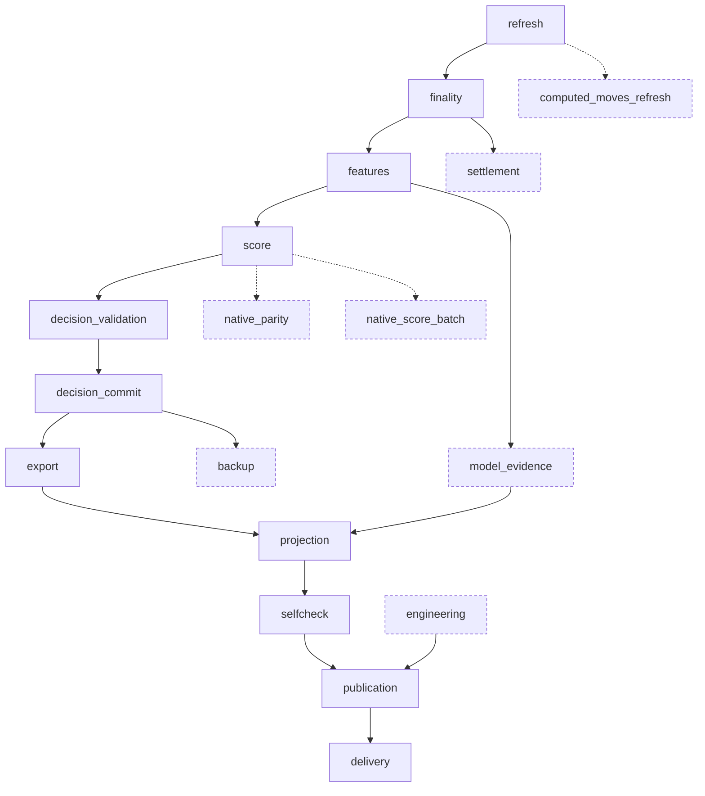
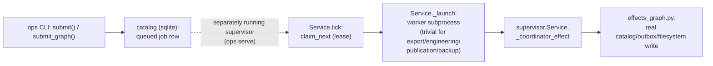
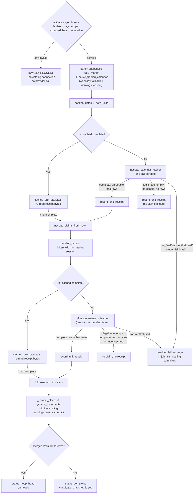
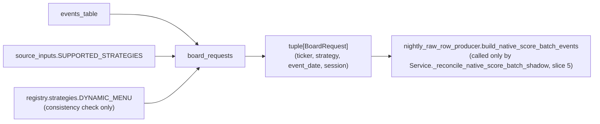

# `engine/v2/ops` — architecture

Layer 7.0 in the root `/ARCHITECTURE.md` layer table. Replaces the new supervisor/catalog design,
`dashboard/nightly.py` (as a job graph) and `tools/bounded_run.py` (as an executor adapter). The root doc covers shared
layer rules; this doc covers package detail.

## Purpose

Durable job submission, leases, retry history and dependencies; resource
admission (each constrained cgroup uses `max(0, memory.current - (file - shmem))`, reading `file` and `shmem` from that same directory’s `memory.stat`; active and inactive file cache is reclaimable, while shmem/tmpfs stays counted; missing, malformed or unreadable statistics fall back to `max(0, memory.current - inactive_file)`, then raw usage; headroom remains `min(host_available, container_remaining) - free_margin`) and per-job CPU placement; the nightly job graph and its release
boundary. It does not decide research conclusions (`engine/v2/evaluation`) and does not compute a score (`engine/v2/scoring`) — it only sequences and persists the jobs that call into those packages. `legacy_render` renders the staged score document's board rows, which scale with output rows, and builds a `Scorer` without calling its scoring path. Its `feature_panel`, `trades`, and `earnings_events` inputs are whole-table reads; `FeatureContext.load` filters its `daily_market` input by plan `context_tickers` and year range, while `Scorer` construction separately reads each historical `daily_market` year slice, then filters it to trade-derived ticker chunks, spanning the trade entry years plus one prior year. The lazy Tier-4 forecast path is not reached. The render profile (`projection`) must account for the complete evidence working set, which can include more tickers than the staged board rows; its 3 GiB reservation and cgroup `memory.max` cap are INTERIM, sized from the observed 100-ticker render only and NOT shown to fit the full universe, so the bounded/chunked read design tracked by issue #505 is the actual fix; available subset evidence does not establish full-universe fit.

This doc also covers `native_board_universe.py`: a pure, answer-free enumerator reproducing legacy `engine.score.score_calendar`'s event × strategy enumeration for supported strategies, without the legacy chain index or a legacy `Scorer`; production flow is `Service.tick()` → `_reconcile_native_score_batch_shadow` → `build_native_score_batch_events` → `scan_forward_board_requests` → `board_requests` (see "Dependencies"); schema migrations follow the [checksummed R1–R6 table-recreate contract](MIGRATIONS.md).

**Planned package split.**
The `design/ops-package-split` PR records the proposed module homes and move slices.
The planned dependency direction is entrypoints → runtime → workflows → stores →
{legacy, native, providers} → core, with no upward or peer-package imports.
Before implementation, remove prerequisite cycles and migrate all callers per move; no compatibility modules or re-export shims.

## Primary contracts and public interfaces

**Operations health output.** `health` emits `operations_health.v1.1`; it selects the current delivered release from each published scope's `CURRENT` pointer, then orders those releases by occurrence, delivery time and release ID. `requested_session` and `resolved_session` come from the unique delivered `ledger_export_receipt.v1.0` associated through a consistent `release_intent` receipt with that release, including same-session reruns; the export receipt's scope must match the selected pointer scope or validation is `VALIDATION_FAILED`. Sessions never come from `generated_at`. Invalid or ambiguous evidence is `VALIDATION_FAILED`; the CLI removes its output and does not retry. Identical catalog, pointer and clock inputs produce byte-identical JSON; evolution follows `guides/component_contracts.md` §2.3 and older versions remain valid. A publication status sidecar compares withheld releases against its own scope's delivered `CURRENT` row; when none exists, it treats current as absent and does not fall back to another scope's latest delivery. Unsafe unrelated-scope pointers do not prevent that write; aggregate health reads each published scope pointer and propagates unsafe-pointer errors. **I/O outcomes:**

| Condition | Outcome |
|---|---|
| Catalog read | Uses the supplied connection directly; no health-specific transaction or cache (an existing caller transaction still applies). |
| Receipt evidence invalid | `VALIDATION_FAILED`; CLI removes the configured output and does not retry. |
| Persisted release association omits its primary ID | `VALIDATION_FAILED`; session evidence is not emitted. |
| Temporary write, file fsync or replace fails | Before replacement, the prior destination remains; a partial or complete sibling temporary file may remain. |
| Directory fsync fails after replacement | The new destination exists; crash durability is uncertain. |

The operator interface is the versioned command protocol exposed by `engine/v2/ops/cli.py`
(`python3 -m engine.v2.ops <command>`), derived directly from its `argparse` definitions:

- `init`, `doctor`, `health`
- `serve` — starts the supervisor loop
- `plan {nightly,experiment,training,promote,rollback}` — builds and saves a plan
  document; flags apply by kind: `training` takes `--training-mode`, `--recipe`,
  `--state`, `--alpha`, `--cutoff`, `--strategy`, `--pairs`, `--ticker-chunk`;
  `promote` takes `--release-root`, `--release-id` and `--expected-previous-release-id`;
  `rollback` takes `--release-root` and refuses `--release-id`. It pins the rollback target at plan time; only `NoPriorRelease` leaves the target unset. A submitted rollback with an incumbent but no pinned target is refused as typed `VALIDATION_FAILED` before pointer or history mutation. Other resolver errors become typed `VALIDATION_FAILED`.
- `submit --plan --idempotency-key`
- `rescore --request --native-inputs` — read-only, no provider pulls, no fitting
- `capture-inputs --as-of --tickers --context-tickers --year-start --year-end --source-root --output`
- `reconcile <job_id> --expected-attempt`
- `provider-account --account --remaining --live-reserve`
- `snapshot {plan-import,submit,promote,rollback}`
- `ledger {import-history,status,calibrate,book}` — history summaries count new provenance writes as `imported` (excluding new divergences), and remaining lines as `already_present`; identical committed content under another purpose writes no provenance. Dry runs report the same projected counts and roll back writes.
- `decisions supersede --row-id --reason --from-json`
- `price-refresh --session [--dry-run]`
- `price-history capture --source-root --scope [--dry-run]` (refuses `SOURCE_NOT_FOUND` without a usable calendar ticker, SPY; rebuild: [guide](../../../guides/native_board_rebuild_runbook.md))
- `computed-moves capture --source-root --scope --as-of [--dry-run]`
- `get`/`logs`/`cancel`/`resume`/`explain <job_id>`

Internally: `nightly.py`'s `GRAPH`, `graph_order()`, `OPTIONAL`, `NO_JOB_STAGES`, `build_nightly_plan`,
`build_legacy_job_requests`, `_stage_sequence` (see "Diagrams" below); `supervisor.Service`/`serve`; the
coordinator-effect functions in `effects_graph.py`; `training.py`'s `training_job_kind`/`promote_job_kind` (registered in
`stages.py::_core_kinds`, not in `supervisor._COORDINATOR_EFFECT_KINDS`), `training_plan`/`promote_plan`,
`run_training_worker`/`run_promote_worker`; `BoardRequest`/`board_requests(as_of, horizon_days, tickers, events_table)`
(`native_board_universe.py`) — `board_requests` emits one `BoardRequest` — the pure key `(ticker, strategy, event_date, session)` — per event ×
native-covered strategy, plus one `DYN-SV` meta-request per event; `calendar_moves_jobs.py`'s
`computed_moves_job_kind`/`forward_calendar_job_kind`, `CalendarMovesParameters`/`calendar_moves_parameter_problems`/
`calendar_moves_job_spec`, and `run_computed_moves_worker`/`run_forward_calendar_worker` (dispatched by `worker.py`).
`forward_calendar_refresh` has a `JobKind` (worker dispatch, loader callback, parameter validation) but no `nightly.py`
`GRAPH`/`OPTIONAL` node and no `supervisor.Service` submitter yet — not on the nightly schedule.

`forward_calendar_store.run_forward_calendar_refresh` is a standalone, keyword-only native fetcher in ops: non-fetcher arguments validate before catalog/provider access; empty tickers mean whole market.
Commit fencing checks the head before the attempt within one transaction; cancelled/expired attempts refuse before commit. An omitted attempt fence preserves generic-refresh and research callers.
The forward-calendar worker loader wraps both provider-unit fetchers with `provider_budget.budgeted_fetcher`, bound to the staged attempt/fence and each source's own account. Budget transactions/connections end before provider I/O; complete cache hits bypass charging.
`catalog.connect(must_exist=True)` opens an existing catalog without creating a replacement; its default still permits catalog creation. Guard construction performs no I/O.

`native_score_batch.py`: the batch-shaped seam between the board universe
(`native_board_universe.BoardRequest`) and
`engine.v2.scoring.application.score_batch`. `assemble_score_batch_inputs`
turns one release binding (`ScoringReleaseBinding`) plus a sequence of
already-staged `NightlyEventInputs` into `dict[BoardRequest,
tuple[ScoreRequest, NativeScoreInputs]]` plus a tuple of typed per-row
refusals — a pure function; an empty `events` sequence is a legitimate no-op.
`run_native_score_batch_worker(parameters, root)` is the worker entrypoint:
resolves the release once, reads staged `events.json` (plus an optional
`producer_refusals.json`, merged into the per-row refusals before build — see
"Failure semantics" below), assembles, scores under `no_fit_guard()`, and
writes `records.json`/`refusals.json`. **Supports `STR-THRU` only** — any
other strategy refuses per-row. `supervisor.Service`'s tick sidecar (below) is
its one production caller: once it has staged and registered both documents it
submits the shadow JobSpec for a new eligible snapshot-pinned identity, while
the production-default `legacy`/unpinned path stays a no-op.

**Cutover PR-4 (redo — 2026-09-27, user decision option (c). This section
REPLACES the original PR-4 design, which proposed `tools/native_parity_run.py`,
a manual/operator-invoked script, as `native_parity`'s production caller.
The parity inputs are pure functions: `legacy_parity_rows`,
`native_parity_report._empty_native_report` and
`native_parity_report.apply_native_refusals` (`SCHEMA_VERSION` `v1.1`), joined
on `native_score_batch.py`'s `v2.0` keyed `records.json`/`refusals.json`
schema (`_board_request_key`, the `INVALID_KEY_FIELD` refusal, tags
`native_score_batch_records.v2.0` / `native_score_batch_refusals.v2.0`) through
`native_parity_report._population_key_from_board_request_key` and
`_native_rows_and_refusals` (pure projections; "Primary contracts" below).
`native_score_batch.py`'s worker and shadow sidecar are unaffected by the
bump (cutover PR-3 `#66` worker dispatch, PR-7a `#126` tick-loop submission).
The `native_parity` job kind -- `stages.py::_native_parity_kind`,
`worker.py`'s dispatch branch, `run_native_parity_worker`,
`NativeParityParameters` -- is real. Its nightly-side builder,
`nightly.submit_native_parity_if_ready`/`_native_parity_identity`, and
its tick-loop caller, `supervisor.Service._reconcile_native_parity`, are
both real too: `Service.tick()` calls it every tick the way
`_reconcile_native_score_batch_shadow` (`#88`) already does (its failures print `native_score_batch_reconcile_failed` with `error_type` and the typed problem's code and bounded details: short scalars and short string lists). For non-`Problem` failures, at most the first 256 characters of `str(exc)` are kept only in the in-memory dedup key; nonempty text emits the fixed `<redacted>` `details.exception_message`, while empty text emits no `exception_message` (the details mapping is empty). `_bounded_problem_details` omits string values longer than 120 characters; these size limits do not sanitize exception text or make raw text safe to publish. The
`nightly.GRAPH` node width is doc-only (`run_shadow_nightly`'s test-only
graph walk; no submission path reads it). Cutover
PR-3 (`native_score_batch.py`, `#66`) and cutover PR-7a's design (`#88`)
and shadow-submission code (`#126`) are all already merged; PR-7a's code
(`#126`) implemented the tick-loop submission sidecar only, not the `v2.0`
schema this redo's design always said was `native_parity`'s own PR to
build (see "the row-key/join gap is not designed here" below) — `#185`
is that build. One piece is
untouched by this redo, real code already on `main`, independent of
everything `#66`/`#88`/`#126` supply: `native_parity_report.py`'s
tolerance policy is already pluggable — see "the tolerance policy is now
pluggable" below, unchanged.**

`native_parity` closes the gap the root doc §4 and this doc's own
"Diagrams" section both name: `run_shadow_nightly` "has no production
caller, only tests ... call it," so in production `native_parity` today
never actually compares anything — a production run supplies no
`parity_rows`, `_registered_handlers` defaults both sides to `{}`, and
`compare_native_vs_legacy`'s own `_refuse_empty_inputs` raises
`VALIDATION_FAILED` before any comparison runs, which `_run_stage` turns
into a `"degraded"` receipt for this `OPTIONAL` stage (see "Outputs"
below for why this is NOT the same claim as "writes an empty-input
report" — no report is ever written either). **This redo does not close
that gap through `run_shadow_nightly` at all.** That function keeps its
existing stage-walk and `native_parity_handler`'s existing signature
contract completely unchanged (both already correctly consume real
`legacy_rows`/`native_rows` dicts today — proven by
`tests/test_v2_ops_native_shadow_render.py` — and stay exactly the
test-only path they always were; nothing before this redo, or in it,
builds real dicts to hand `run_shadow_nightly` in production). The gap
closes through a SEPARATE production path: a new `native_parity` job
kind, submitted by `supervisor.Service`'s own tick-loop sidecar —
mirroring `computed_moves_refresh` (Part 4, `#54`) and `native_score_batch`'s
own shadow submission (`#88`) byte-for-byte in shape — never through
`build_legacy_job_requests`, so a broken parity submission can never
abort a required legacy stage. That job's worker calls the exact same
`compare_native_vs_legacy`/`native_parity_handler` functions
`run_shadow_nightly` already calls, so the two paths — one test-only, one
production — can never silently diverge in comparison logic: root doc
§5's "one shared parity comparator" invariant, restated one level up as
one shared CALLER of that comparator, reached two ways.

Four new symbols, mirroring `native_score_batch`'s own PR-7a shape:

- `supervisor.Service._reconcile_native_parity` — the tick-loop sidecar
  called from `Service.tick` right after
  `self._reconcile_native_score_batch_shadow()` (`#88`); a CONFIRMED
  `schema_mismatch` parks the job id and short-circuits later ticks.
- `nightly.submit_native_parity_if_ready` — the builder the sidecar calls,
  mirroring `submit_computed_moves_refresh_if_ready` (`nightly.py:858`)/
  `submit_native_score_batch_shadow_if_ready` (`#88`) in signature shape.
- `nightly._native_parity_identity` — a cheap catalog-only identity check
  mirroring `_computed_moves_identity` (`nightly.py:830`): finds the
  latest succeeded `native_score_batch` job by its own idempotency key
  (`"nightly:<as_of>:<scope_hash>:native_score_batch"`, `#88`'s own R6),
  parses `(as_of, scope_hash)` out of it, and recovers the paired
  succeeded `"score"` job's id with the SAME query `#88`'s own
  `_native_score_batch_identity` already runs to find a session's
  `"score"` job (`"nightly:<as_of>:<scope_hash>:score"`) — reused here
  with `(as_of, scope_hash)` already known rather than searched for,
  never a second, independently written lookup. Returns `(as_of,
  scope_hash, score_job_id, native_score_batch_job_id)`, or `None` when
  no succeeded `native_score_batch` job exists yet.
- `stages.py::_native_parity_kind()` — **implemented, slice 2B(a) (this PR)** — a new `JobKind`, mirroring `_native_score_batch_kind()` (`stages.py:271`) in shape: `name="native_parity"`, `worker="native_parity"`, `parameters=NativeParityParameters` (new, `RescoreParameters`-shaped — only `expected_ids` and `input_bindings`; this job carries no scalar data of its own, since every input it reads is job-bound), `resource_classes=frozenset({"validation"})` (a pure comparison, no provider fetch — the same classification `decision_evidence` already has), `effects=("staged",)`, `retry=RetryPolicy("bounded", 2, (5, 30))`, `checkpoint_contract="native_parity_report.v1.2"` (matching `native_parity_report.SCHEMA_VERSION`, bumped from `v1.1` in cutover PR-4 slice 1 of #327's redo — see "Outputs" below for what this contract now covers), `namespaces=frozenset({"shadow", "smoke"})`. `worker.py::dispatch` gains a `"native_parity"` branch routing to `native_parity_report.run_native_parity_worker` (below), the same lazy-import-inside-`_dispatch_*` pattern `_dispatch_native_score_batch` already uses (`worker.py:167-168`, `:198-200`).

`nightly.GRAPH` has a `"native_score_batch": ("score",)` node (`#88`),
while `"native_parity"` remains `("score",)` (`nightly.py:124`). Widening
that node to `("score", "native_score_batch")` is separate topological
documentation work for `run_shadow_nightly`'s whole-graph test-only
walk; runtime parity submission already binds both jobs directly. No
submission path reads either edge (the rule Part 4 established for
`computed_moves_refresh`'s own node).

- **`native.parity_inputs.legacy_parity_rows(score_document: Mapping[str, Any]) ->
  dict[str, dict]`** (new, this package). Keys the legacy `score.json`
  document's own `"rows"` array by
  `engine.v2.ops.decision_validation.population_key`'s `"ticker|strategy|
  event_date"` format — REUSED, not re-derived and not re-added: this
  public function already exists (`decision_replay.py`'s own population
  comparison already imports it), and it is the identical three-field
  format `engine.v2.serving.native_render.native_row_key` already derives
  for a native `ScoreRecord` (that module's own docstring: `"the native
  twin of bridge._population_key"`; both bridge and legacy adapter now use
  `foundation.score_population.population_key`, while parity retains
  `decision_validation`'s existing public helper). Pure: no
  filesystem, no clock, and — the point of putting this here rather than
  in the composing script below — no import of `engine.v2.serving` (a
  layer-7.0 peer of `engine.v2.ops`, per the root doc's layer table;
  `checks/import_layers.py` would refuse that edge). A `score_document`
  with no `"rows"` key returns `{}` (not a refusal —
  `native_parity_handler`'s existing `_refuse_empty_inputs` already turns
  an empty `legacy_rows` into `VALIDATION_FAILED` downstream, so this
  function does not need its own empty-input check).
  **`legacy_parity_rows` does NOT reuse `population_key`'s own
  `.get(key, "")` empty-string substitution for a missing
  `ticker`/`strategy`/`event_date`** (root doc §5: "a missing or unusable
  input produces an explicit withheld/refused status," never a silent
  default) — reusing that substitution here would let one malformed row's
  empty-string-keyed entry either collide with a genuinely empty-fielded
  row, or, more likely with real data, simply end up unique and reported
  as an ordinary `only_legacy` row: quietly absorbed into the report as a
  population difference rather than surfaced as the malformed input it
  actually is. **Duplicate keys are the same class of finding, not a
  separate one**: `_action_score`'s own population check
  (`observed_keys = {_population_key(row) for row in rows}`) compares
  `population_key` values only as a SET, so a `score.json` carrying two
  rows under one `ticker|strategy|event_date` key (sibling precedent:
  `decision_replay.decision_population` rejects a duplicate population
  key explicitly, via `VALIDATION_FAILED`; `_action_score` does not)
  already passes that check today without ever proving the two rows
  agree — a plain `{key: row for row in rows}` comprehension in
  `legacy_parity_rows` would then silently keep whichever row iterated
  last and drop the other with no trace. `legacy_parity_rows` therefore
  validates every row before keying any of them: a missing, non-string,
  or empty `ticker`/`strategy`/`event_date`; a `ticker` or `strategy`
  containing the `"|"` `population_key` delimiter (CodeRabbit round 3 —
  `population_key` joins on `"|"`, so an unescaped delimiter inside a
  field would let two distinct rows collide under one key); OR two rows
  sharing one `population_key` value — each raises `OpsError` — matching
  `decision_population`'s own code, `VALIDATION_FAILED` (detail naming
  the row index/offending field, or the repeated key and both rows'
  indices) — for the WHOLE call, before any dict is constructed: a
  batch-level refusal, never a per-row skip or a last-write-wins
  collision, so a malformed or duplicate-keyed `score.json` is never
  silently read as smaller, or different, than it actually is. The same
  refusal covers the shape one level up, before `population_key` is ever
  called on a row: `score_document["rows"]`, if present, must be a list of
  mappings — a non-list value or any non-mapping element raises `OpsError`
  (`VALIDATION_FAILED`) rather than letting `population_key`'s own
  `.get(...)` calls raise a bare `TypeError`/`AttributeError` on a
  malformed element.
  Parity's population validation remains independent of score-plan validation.
- **`native_parity_report.run_native_parity_worker(parameters, root)`**
  (implemented, slice 2B(a), this PR) — the `native_parity` job kind's worker entrypoint (dispatched
  from `worker.py`, registered in `stages.py::_core_kinds`). Reads its two
  job-bound inputs (`score.json` from the paired `"score"` job;
  `records.json`/`refusals.json` from the paired `native_score_batch` job
  — see "Inputs" below for exactly how `_native_parity_identity` finds
  both). The worker ITSELF also refuses `VALIDATION_FAILED` up front,
  before reading a single row, if either document's `schema_version` is
  not exactly `native_score_batch_records.v2.0`/
  `native_score_batch_refusals.v2.0` (gate finding on `#191`, real: the
  generic job-submission API can submit a `native_parity` job against ANY
  bound artifacts today, entirely independent of
  `submit_native_parity_if_ready`'s OWN pre-submission check and the
  sidecar's own schema-mismatch park-and-short-circuit — a worker-side
  check stays REQUIRED defense-in-depth regardless: a
  generic submission always bypasses any one caller's own pre-submission
  check, and a directly-submitted job has no caller-side memo to protect
  — it simply fails, correctly, at the worker). See "Cutover PR-4
  (redo)'s own input sourcing" above for why the sidecar-layer check
  additionally exists, for retry-semantics reasons this worker-side
  check does not address. It builds
  `legacy_rows`/`native_rows`/`native_refusals`/`unkeyable_refusals` (via
  `_native_rows_and_refusals`, below), projects every native record
  through `_native_comparison_row` (gate finding on `#191`, real: a raw
  `to_document(ScoreRecord)` preserves `ScoreRecord`'s own nested
  per-dimension dicts, while `_dimension_view` looks up every field at
  the row's top level — an un-flattened record compares as all-`None`,
  masking real native values and reporting false mismatches against
  real legacy ones; this projection reads each dimension from the same
  nested sources `checks/phase4_real._numeric_views` already reads them
  from, a data-shape port only, never a new comparison rule), and
  branches on whether `legacy_rows` and
  `native_rows` share any key (below, `_empty_native_report`) before
  calling the SAME `compare_native_vs_legacy` (unchanged) and the new
  `apply_native_refusals` (below) — see "Outputs" for what it writes.
  This is the real (only) production caller `tools/native_parity_run.py`
  was originally designed to be. **That script is dropped from this redo
  entirely — no code for it was ever written** (`tools/native_parity_run.py`
  and `row_explanations` never existed and still don't; `legacy_parity_rows`
  now exists on `main` as of Phase 1, `#132`, but only as the pure function
  this section documents — nothing calls it in production yet, so nothing
  needs migrating away from the dropped script), never built as a parallel
  manual path alongside the job. There is exactly one way a real
  `native_parity_report.json` gets produced in this codebase once Phase 2
  lands, not two.
- **`native_parity_report._empty_native_report(legacy_rows, native_rows,
  dimensions, tolerance_policy) -> dict`** (new, private) — closes a real
  gap in `compare_native_vs_legacy`: its unchanged guards reject an empty
  native side and a comparison with no shared key. The worker first rejects
  empty `legacy_rows`, then computes shared keys before calling the
  comparator. With no shared key, it builds `_empty_native_report` when
  every legacy key has its own keyed refusal, when an empty native side has
  an unkeyable refusal and no keyed refusals, or when an empty native side
  has a timestamp-keyed refusal for the same population and calendar day as
  a legacy key. Thus timestamp-keyed refusals remain unmatched with their
  exact identity; they are never normalized to a legacy day key. An
  unrelated keyed refusal cannot explain an absent legacy row. No row or
  comparison value is invented.
  Empty native rows with no refusals still fail `VALIDATION_FAILED`.
  Non-empty disjoint native rows still require matching refusals for every
  legacy key; an unrelated refusal does not explain an absent legacy row.
  Shared-key inputs keep using the unchanged comparator path.

  `_empty_native_report` preserves the comparator's report shape: all
  legacy keys are `only_legacy`, all native keys are `only_native`, and
  `compared`/`mismatches` are empty. `apply_native_refusals` then classifies
  refusals as it does for comparator reports. The decision is private to
  `run_native_parity_worker`; `compare_native_vs_legacy` gains no branch.
  The test-only `run_shadow_nightly` path calls `native_parity_handler`
  directly and does not reach this worker branch.
- **`native_parity_report.apply_native_refusals(report, native_refusals,
  unkeyable_refusals=()) -> dict`** (new) — the mechanism for "missing or
  refused native rows are counted separately" (user decision, option (c)).
  `compare_native_vs_legacy` itself is UNCHANGED — pure, refusal-blind,
  unaware `native_score_batch` can refuse a row at all. **But
  `native_parity_handler` — the EXISTING function `run_shadow_nightly`
  already calls, unchanged in signature — now calls
  `apply_native_refusals(report, {}, ())` unconditionally right after
  `compare_native_vs_legacy`, on every `"compared"` report it writes (Phase
  1, `#132`, already on `main`): with no refusals to apply this changes no
  row's classification, but every report that test-only path writes now
  also carries the two new, always-present, empty fields
  `"native_refused": []`/`"native_refused_unmatched": []` and is stamped
  with this module's current `SCHEMA_VERSION` (`v1.1` when Phase 1 shipped
  this; `v1.2` since cutover PR-4 slice 1 of #327 added run identity and
  per-mismatch values on top) — a real, already-shipped change to this
  existing artifact's shape, not a no-op reserved for
  `run_native_parity_worker`.** Once Phase 2 builds it,
  `run_native_parity_worker` calls this the SAME way, this time with real
  `native_refusals`/`unkeyable_refusals`, AFTER
  `compare_native_vs_legacy` or `_empty_native_report` (above) returns: any
  key in the report's own `only_legacy` list that is ALSO a key of
  `native_refusals` (population-key → refusal code, built from
  `records.json`'s paired `refusals.json`) moves from `only_legacy` into a
  NEW `"native_refused"` list (each entry `{"row_key": ..., "refusal_code":
  ...}`), and is removed from `only_legacy` — never counted in both. A
  `native_refusals` key that is NOT in `only_legacy` (the row was actually
  compared, or was `only_native`) is left untouched:
  `assemble_score_batch_inputs`'s own per-row either/or contract (PR-3)
  already makes one row both scored and refused impossible within one
  `records.json`/`refusals.json` pair, so this function trusts that
  pairing rather than re-validating it, exactly as `legacy_parity_rows`
  trusts `score.json`'s own shape once its own up-front validation
  passes. `only_legacy` therefore narrows to its real meaning under this
  redo: a legacy row `native_board_universe.board_requests` never even
  enumerated as a `BoardRequest` (an unsupported strategy, the `DYN-SV`
  wildcard) — never a row native attempted and explicitly refused, which
  `native_refused` names instead.
  **A refusal with no legacy counterpart is reported, never dropped
  (CodeRabbit round 5, real finding).** A `native_refusals` key that is
  NOT in `only_legacy` cannot be in `compared`/`only_native` either (a
  refused `BoardRequest` is by construction absent from `native_rows`,
  and both those buckets are built only from `native_rows`) — so the ONE
  remaining possibility, silently ignored by the original design, is a
  refusal whose projected `population_key` is not in `legacy_rows` at
  all: `native_score_batch`'s own board universe found and refused a row
  legacy's own `score.json` never carried in the first place. That case
  is now appended to a second NEW list, `"native_refused_unmatched"`
  (same `{"row_key": ..., "refusal_code": ...}` shape as `native_refused`,
  kept separate rather than merged so a reader can tell "legacy scored it,
  native refused it" apart from "native refused a row legacy never had").
  Every entry of `unkeyable_refusals` (the third, optional argument —
  `_native_rows_and_refusals`'s own pass-through of `refusals.json`'s
  `"unkeyable_refusals"` array, below) is appended to the SAME
  `"native_refused_unmatched"` list unconditionally, using its raw
  structured `{"ticker":..., "strategy":..., "event_date":...,
  "session":...}` key instead of a `row_key` string (below) — an
  `INVALID_KEY_FIELD` refusal never attempts the keyed join at all (its
  own source fields are exactly what made a safe key impossible to
  construct), so it is reported this way regardless of whether a
  same-identity legacy row exists, rather than trying to prove a negative
  match first. Every native refusal — keyed or not, legacy-matched or
  not — therefore lands in exactly one of `native_refused` or
  `native_refused_unmatched`; none is ever silently absent from the
  report.
- **`native_parity_report._population_key_from_board_request_key(key) ->
  str`** (new, private) — projects one `records.json`/`refusals.json` key
  (the 4-field canonical `BoardRequest` string `#88` specifies,
  `f"{ticker}|{strategy}|{event_date.isoformat()}|{session}"`) down to the
  3-field `population_key` format `legacy_parity_rows` already uses, by
  splitting on `"|"` into exactly 4 parts and calling
  `engine.v2.ops.decision_validation.population_key({"ticker": ticker,
  "strategy": strategy, "event_date": event_date})` — REUSING
  `population_key`'s own join format rather than string-concatenating a
  fourth time, so the two sides can never silently drift onto two
  different separators or field orders. `session` is validated as present
  (exactly 4 parts) but never folded into the key: legacy rows carry no
  `session` field to join against. A key that does not split into exactly
  4 parts is a batch-level `OpsError` (`VALIDATION_FAILED`) — matching
  `legacy_parity_rows`'s own all-or-nothing malformed-input discipline —
  raised before `run_native_parity_worker` builds `native_rows`/
  `native_refusals` at all, never a per-row skip.
- **`native_parity_report._native_rows_and_refusals(records_document,
  refusals_document) -> tuple[dict[str, dict], dict[str, str], tuple[dict,
  ...]]`** (new, private) — the ONLY caller of `_population_key_from_board_request_key`
  (above), and the place a duplicate collision is caught: the projection
  from a 4-field `BoardRequest` key down to a 3-field `population_key` is
  LOSSY (it drops `session`), so two DISTINCT `records.json`/`refusals.json`
  keys — the same `(ticker, strategy, event_date)` under two different
  `session` values, a genuinely possible events-table shape this design
  does not assume away — can project to the SAME `population_key`
  (CodeRabbit round 1, real finding). Silently keeping whichever one a
  dict comprehension iterates last would be exactly the last-write-wins
  collision `legacy_parity_rows` already refuses to allow for
  `score.json`'s own rows (above) — so this function applies the IDENTICAL
  discipline to the native side: every key in `records_document["records"]`
  and every key in `refusals_document["refusals"]`, TOGETHER (one row can
  never be both a record and a refusal, but two DIFFERENT rows — one a
  record, one a refusal, or both records, or both refusals — can still
  collide after projection, and this check catches all three shapes), is
  projected, and any `population_key` value produced by more than one
  distinct source key raises `OpsError` (`VALIDATION_FAILED`, detail naming
  the colliding `population_key` and both source `BoardRequest` keys) for
  the WHOLE call, before `native_rows`/`native_refusals` are built — never
  a per-row skip or a silent overwrite. No collision has ever been observed
  in practice (native's own board universe enumerates one `BoardRequest`
  per `(ticker, strategy, event_date, session)` combination the events
  table actually carries); this guard exists because the projection makes
  a collision POSSIBLE, not because one has occurred. **This function
  REQUIRES the key — `refusals_document["unkeyable_refusals"]`, never
  `.get("unkeyable_refusals", ())` (CodeRabbit round 6, real finding).**
  This function's only caller, `run_native_parity_worker` (below), is only
  ever reached for a job `submit_native_parity_if_ready` ("R2, cache",
  below) already confirmed carries `refusals_document["schema_version"]
  == "native_score_batch_refusals.v2.0"` before submission, and the v2.0
  writer ALWAYS emits this key, even as `[]` for a batch with no unkeyable refusals (the
  "refusals.json" bullet, above) — so its absence on a document already
  confirmed v2.0 means the file is malformed (truncated, hand-edited, or
  written by a defective producer), never a legitimate "this batch has
  none" case a silent default could paper over. A `KeyError` here is
  caught by `run_native_parity_worker` alongside its other
  `records.json`/`refusals.json` decode failures (below, "R1, missing
  input") and fails the WHOLE job attempt, exactly like a document that
  fails to decode at all — never a per-row skip, and never a silently
  empty `unkeyable_refusals`. The (now guaranteed-present) value is passed
  through completely unchanged — `INVALID_KEY_FIELD` rows (below) never
  had a `population_key` computed for them at all (that is exactly what
  makes them "unkeyable"), so there is nothing for this function to
  project, decode, or collision-check; it is `apply_native_refusals`
  (above), not this function, that consumes them.

**The original PR-4 design's "explained" bucket (`ROW_EXPLANATION_CODES`,
`row_explanations`) is dropped from this redo, not carried forward** —
see "Out of scope" below: no reusable stale-px/finality-drift classifier
exists today, so there is nothing for it to plug into yet, and this redo
does not invent one. A future PR can add it exactly as originally
specified, against `compare_native_vs_legacy`'s unchanged signature,
whenever a real classifier exists.

**The tolerance policy is now pluggable, not hardcoded — this part of the
PR is real code, already merged into this push, independent of `#66`.**
`engine.v2.parity.dimensions.compare_dimension` gained a keyword-only
`tolerance_policy` parameter (default `SCORE_RECORD_V1`, so the Phase 4
checker and every existing test are unaffected — none of them pass this
argument, so none of them can observe a behavior change);
`native_parity_report.compare_native_vs_legacy`/`native_parity_handler`
each gained the identical parameter, threaded straight down to
`compare_dimension`, and the written report now records
`"tolerance_policy_id": tolerance_policy.policy_id` so a reader of
`native_parity_report.json` can always see which policy compared it —
never an implicit, undiscoverable default. **Per-field tolerances come
from ONE config policy, the `engine.v2.parity.tolerance.TolerancePolicy`
type** (never a second ad hoc mechanism): the default that ships in this
PR is still `SCORE_RECORD_V1`, which declares zero per-field rules
(`rules=()`), so every one of the five dimensions' 30 fields —
`FORECAST_FIELDS` (12), `SIMULATION_FIELDS` (7), `FINANCIAL_FIELDS` (5),
`GATE_FIELDS` (3), `ANALOG_FIELDS` (3) — still compares under exact
equality until a caller explicitly plugs in a different policy. **No
per-field tolerance VALUE is added, chosen, or implied by this PR** —
that is a user decision, taken to the user separately, and per instruction
none of those values belong in this doc, the PR body, or an issue; only a
`TolerancePolicy` built and ratified elsewhere is ever passed in here.
`tolerance.py`'s own docstring names the risk this design avoids:
"chosen to make the first run pass" is a named failure mode, so this PR
adds the SEAM a ratified policy plugs into, not a guess at what it should
contain.

**Out of scope for this redo** (each a real gap, named rather than
silently left implicit): the stale-px/finality-drift classifier and the
"explained" bucket mechanism the original PR-4 design specified (above —
still no reusable classifier exists; a future PR adds it once one does,
against `compare_native_vs_legacy`'s unchanged signature); a
dashboard-facing "latest report" pointer path (this design's only durable
location is the catalog-addressed `job_<id>#report` binding — see
"Outputs" below); and building the actual user-approved, per-field
`TolerancePolicy` object itself (the pluggable seam already in place
takes it as a parameter — this redo does not construct one, and no
tolerance value appears in this doc, a PR body, or an issue).

**Corrected, not merely superseded: the original PR-4 design's own
out-of-scope line said flipping `native_parity` "onto a schedule, a job
kind, or the supervisor's tick loop" needed to wait for "Phase 7
[to change] legacy authority" first.** That reasoning was wrong even at
the time it was written, and two precedents that shipped since prove it:
`computed_moves_refresh` (Part 4, `#54`) and `native_score_batch`'s own
shadow submission (`#88`) both flip an OPTIONAL, shadow-only stage onto
the supervisor's tick loop without touching legacy authority, because
neither carries `store_domains` or any effect beyond `"staged"` — the
same is true of `native_parity` here (`effects=("staged",)`, no
`store_domains`, no scheduler edge from any required legacy stage to it).
A job kind reaching the tick loop is not itself a legacy-authority
change; only a `store_domains` write against a legacy-owned table, or a
`GRAPH`/`_DAG_STAGES` edge a REQUIRED legacy stage depends on, would be —
neither is true of `native_parity`, which is exactly why this redo can
schedule it now, well before Phase 7.

**Cutover PR-7a (implemented — wiring and refusal gate only).**
`native_score_batch` is registered as a job kind
(`stages.py::_native_score_batch_kind`) and has a production caller —
`supervisor.Service`'s tick sidecar, alongside legacy scoring, with no
authority change. Three symbols, mirroring `computed_moves_refresh`'s own
shape: `supervisor.Service._reconcile_native_score_batch_shadow`
(tick-loop sidecar, called from `Service.tick`);
`nightly.submit_native_score_batch_shadow_if_ready` (the builder the
sidecar calls — see "Cutover PR-6" below for what it does once a
`"score"` job pins a snapshot); `nightly._native_score_batch_identity` (a
cheap catalog-only identity check parsing the paired `"score"` job's own
idempotency key to recover `(session, scope_hash, snapshot_pinned)`, or
`None`). `nightly.GRAPH` gains a `"native_score_batch": ("score",)` node
(topological documentation only — no submission path reads it) and
`OPTIONAL` gains `"native_score_batch"`. A `legacy`-input-mode plan built
directly via `ops plan` (not the scheduled trigger) still gets a silent
no-op (see "Failure semantics" below).

**Cutover PR-7b (implemented, #145/#150): the shadow nightly plan pins a
snapshot before scoring.** `nightly_trigger._default_plan` runs in
`input_mode="snapshot"`, `snapshot_scope="shadow"` (was `"legacy"`/`None`):
legacy `"score"`/`"decision_replay"`/`"projection"`/`"selfcheck"`/
`"model_evidence"` read through one pinned, frozen snapshot per session.
`pin_snapshot_inputs` binds that snapshot to the exact `snapshot_id`
`_ensure_shadow_snapshot` verified. Extending that shared snapshot to
`native_score_batch` still depends on
[#199](https://github.com/yshewchuk/investment-validation/issues/199)'s reader,
which removes independent legacy/native store reads from the shadow comparison.
This never touches the real legacy nightly:
`nightly_trigger.py` runs on its own systemd timer
(`ops/systemd/native-nightly-trigger.timer`, every 30 minutes), separate
from whatever schedules the legacy nightly, with no code path into the
legacy process.

`nightly_trigger._ensure_shadow_snapshot(root, as_of, clock, attempt, ...)
-> (status, snapshot_id | None)`, called from `_submit_plan` immediately
before `plan_fn`, on every pre-plan attempt:

| Outcome | Meaning | Attempt/error budget |
|---|---|---|
| `("ready", snapshot_id)` | a `shadow`-scope snapshot fresh for `as_of` is committed; `snapshot_id` comes from the committed `SnapshotImportReceipt`, never a re-read of the mutable head | not consumed |
| `("not_yet", None)` | the legacy store has not caught up to `as_of` yet (a session mismatch) | free — no `snapshot_attempt`/`error_count` spent; the next tick retries under the SAME `attempt` |
| `("timed_out", None)` | drive-to-terminal hit `_serve_deadline`; the import job is left running, not cancelled | free (a separate consecutive-timeout counter, mirroring `serve_fn`'s own) |
| raises (terminal `snapshot_import` failure, or `INPUT_CHANGED`: the shadow head moved since verification) | routed through `_submit_plan`'s existing `_failure` path | bumps BOTH `error_count` and `snapshot_attempt` |

Idempotency key: `f"shadow_snapshot_import:{as_of}:{attempt}"` — `attempt`-suffixed, not bare `as_of`, because an
existing row under an unchanged key is matched and returned regardless of its own state; a bare `as_of` key would make
one terminally-failed import permanent for the rest of that `as_of`'s retry window. A key that already has a
non-terminal row is reattached and driven to terminal directly — never resubmitted — so one key's request is submitted
exactly once, ever. A terminal-but-failed row raises `INPUT_CHANGED` immediately without resubmitting under the same
key; the NEXT `_submit_plan` entry mints a genuinely new key via the bumped `snapshot_attempt`.

`TriggerReceipt.snapshot_attempt: int = 0` is a single, monotonic per-`as_of` counter, carried on every receipt regardless of status (independent of
`error_count`, which resets on several unrelated statuses), and bumped in exactly one place: a terminal `INPUT_CHANGED` refusal, never a transient
failure. Give-up is an OR of two independent bounds: `error_count >= MAX_CONSECUTIVE_ERRORS` (unchanged) OR `snapshot_attempt >=
MAX_CONSECUTIVE_ERRORS` (new) — an alternating `"error"`/`"timed_out"` sequence can no longer defeat the give-up bound by resetting only the old
counter. Any status in `RESUME_STATUSES` (which includes `"snapshot_not_yet"`, a resumed `"not_yet"` outcome) resumes on the next tick regardless of
whether `plan_ref` is set — a pre-plan timeout/error genuinely has no `plan_ref` yet, and this is what makes it resumable rather than permanently
`"missed"`.

Commits land directly in scope `"shadow"` (no candidate-scope-then-promote step): `"shadow"` has no downstream
consumer needing pre-advance validation. The EXACT `snapshot_id` this call verified is threaded through
(`expected_shadow_snapshot_id` → `_default_plan`'s `args.expected_snapshot_id` → `cli._snapshot_inputs` →
`pin_snapshot_inputs(expected_snapshot_id=None)`). The optional guard compares the already-loaded
`SnapshotRef.snapshot_id`, without a second head resolution. A mismatch raises `INPUT_CHANGED` before materialization
request construction or registration; equality keeps that ref. Omitting the expected id preserves direct and legacy
caller behavior.

**Generated expected population (`ops plan nightly`).** With `--input-mode snapshot` and no `--expected-population`, `snapshot_planning.generated_population` derives the population from the pinned snapshot; a supplied file always wins and keeps today's reading and refusals (symlink, non-list); a supplied empty list is refused by `pin_snapshot_inputs` (`INVALID_REQUEST`) in snapshot mode and leaves `planned_population` blocked in `legacy` mode. It reuses `nightly_raw_rows.scan_forward_board_requests` (no second enumeration) for `as_of..as_of+GENERATED_HORIZON_DAYS` (35, mirroring the legacy board's `HORIZON_DAYS`) and records sorted, de-duplicated `ticker|strategy|event_date` keys (ISO date) in the plan and `_scope_hash` exactly as a supplied file. The scanned events are crossed with every `STRATEGY_IDS` member: the rows the legacy `score` stage's `score_calendar` emits per event (disabled CAL-P and CND-P included), because `_action_score` requires every planned key to be observed under the shared score-population rule. Never `DYN-SV`, which `score_calendar` appends only for events its chooser ranked: `_action_score` accepts a `DYN-SV` row for a planned event, while a planned key still has to be observed and a row for an unplanned event is still refused (`VALIDATION_FAILED`). The window is anchored on `as_of`, so a run whose finality walked back to an earlier session with different events in its window is refused by that check, never scored on a different population.

| Condition | Outcome |
|---|---|
| no event in the window | `INVALID_REQUEST`, never an empty plan |
| no head, or `earnings_events` missing or failing its contract | the scan's typed `DataError`, surfaced as `INPUT_CHANGED` with `details.data_code` (as for other pin failures); a null or unparseable `event_date` is `board_requests`'s `INVALID_REQUEST` |
| head differs from a caller-supplied `expected_snapshot_id`, or moved after the scan (the head is resolved twice: `generated_population` scans it, `pin_snapshot_inputs` re-resolves it against the scanned id) | `INPUT_CHANGED`; no plan is saved, so a population never pairs with another snapshot |
| scope | the `--tickers` watchlist the score stage scores; none is `INVALID_REQUEST`, never a fallback to the wider `--context-tickers`. `legacy` input mode has no snapshot: nothing generated, `planned_population` stays blocked |
| same snapshot and `as_of` | identical population and scope hash; no provider or network call |

A generated population comes from the same snapshot that is scored, so it checks coverage (every upcoming event in the data got scored or refused) but cannot detect a hole in the events themselves; qualification runs keep the file override for an independent expectation.
`nightly_raw_rows.scan_forward_board_requests` enumerates pinned forward events without a `src_orats` filter; `pin_snapshot_inputs` returns `calendar_version`.
`nightly_raw_rows.scan_calendar_row(repository, snapshot, key, **staged)` returns `CalendarRowInputs(calendar_revision, calendar_row)` with the matched event row ID and the pinned earnings-events dataset version, not the snapshot calendar placeholder.
These two earnings-event reads take their result bound from the pinned manifest's selected-population bound for the exact selection — the one shared bound the scan enforces before any row streams — so the broad forward enumeration carries no result ceiling of its own, and an empty selection is simply a zero-row query with a positive batch limit; this module's exact-key calendar read now takes that same shared population bound instead of its own result-row cap, and explicit local ceilings stay only where they encode the caller's own operational requirement: `nightly_calendar_inputs`, `nightly_quote_rows`, `computed_moves_store` and `forward_calendar_store`, each keeping its own batch limit and every other retained guard, deadline and invariant unchanged. Both native readers publish catalog refresh output only at the final catalog commit. A source-scan refusal in either reader or a forward-calendar provider refusal before that commit prevents partial catalog publication; successful forward-calendar provider receipts may remain cached.
Ordinary repository scan validation and failure behavior still apply.
Entry/exit/expiry, spot and calendar-observed-through are caller-staged; validation covers shape, not strategy or sourcing.
No match → `EVENT_NOT_FOUND`; multiple → `IDENTITY_CONFLICT`; invalid staged/key/identity input → `INVALID_REQUEST`; repository failures propagate.
`source_availability.verify_eod_availability(conn, store, repository, snapshot, *, table_name, session_date, decision_at)` validates canonical clocks, exact pinned identity and catalog-bound candidate receipt bytes, then always refuses; no source/finality validator is installed, so positive EOD admission remains unavailable.
Affirmative EOD admission still requires manifest-bound source/finality proof, producer/attempt/fence and exact object/domain checks, with genuine completion/publication at or before cutoff; reconstructed/import clocks do not qualify.
Quote expiry remains explicit caller input, spot requires its own exact pinned source, and no quote/raw-row assembler is implied by source admission alone. `nightly_quote_rows.scan_quote_rows(repository, snapshot, key, *, expiry, decision_session) -> QuoteRowInputs(quote_rows, quote_status)` is that reader for `quote_rows`: exact `(ticker, decision_session)` match, never a lookback (mirrors `chains.get_chain`), `expiry`-filtered in Python, null bid/ask pass through as `None`; no match → `quote_status="empty"`; malformed key/dates → `INVALID_REQUEST`; `decision_session` after `expiry` → `QUERY_NOT_BOUNDED`; missing `option_chains` table → `CONTRACT_MISMATCH`; repository failures propagate.

**Cutover PR-6: 4a.2 helpers and 4b producer, with slice 5's production caller.** The 4a.2 `nightly_calendar_inputs` helpers and the 4b `nightly_raw_row_producer.build_native_score_batch_events` producer are implemented, and `Service._reconcile_native_score_batch_shadow` (slice 5) is their production caller: it stages/registers the complete `events.json`/`producer_refusals.json` pair before calling `submit_native_score_batch_shadow_if_ready`, and a producer-wide or staging/registration failure submits nothing. The slice-5 Inputs bullet and the R1–R6 table below express the caller, artifact staging, and failure contract; the 4a/4b helper and producer internals are implementation detail specified there and in the code. Snapshot reads remain SHADOW-only, un-admitted pending [#260](https://github.com/yshewchuk/investment-validation/issues/260).

`nightly_calendar_inputs.py` exposes `scan_decision_calendar(repository, snapshot, *, decision_session, event_through) -> CalendarSessions`, `scan_candidate_expiries(repository, snapshot, key, *, decision_session) -> tuple[str, ...]`, and `scan_calendar_row_inputs(repository, snapshot, key, *, decision_session, calendar) -> CalendarRowInputs`. The calendar source is the pinned SPY price series through the decision session; its observed maximum stays distinct from projected sessions. Candidate scans use one exact option-chain session, and `generation.resolve_expiry` applies the native strategy policy. Spot is the finite positive raw close on the exact decision session. The helper passes the independent planned exit and resolved expiry into `scan_calendar_row`; the returned calendar revision is the matched pinned earnings-events dataset revision.

| Native score batch raw-row producer and sidecar (R1–R6) | Outcome |
|---|---|
| R1: per-key producer refusal (`NO_RESOLVABLE_EXPIRY`, `EVENT_NOT_FOUND`/`IDENTITY_CONFLICT`, `INTRADAY_EVENT_NOT_ADMITTED`, `PANEL_HISTORY_NOT_AVAILABLE`, or a calendar/expiry refusal) | The typed refusal is included in the refusal artifact and complete successful rows for the other keys can still be submitted. Missing eligible score identity, a job that already exists, an unavailable required release, or a sidecar tick that never reaches production means no submission on that tick. |
| R2: producer-wide failure (missing source table or exact spot, malformed source input, or a repository failure) | Returns no partial tuple and writes no files, and no job is submitted; unrelated geometry failures propagate too. Existing sidecar redacted reporting and retry/backoff behavior handles the error. The producer keeps no durable/negative cache and never fetches from a provider: reuse is build- and snapshot-scoped, and unchanged inputs reproduce the same result or refusal. |
| R3: late or unavailable prerequisite, or a readiness no-op | No producer refusal and no job; the next eligible sidecar tick reevaluates under existing scheduling/backoff behavior — no specific retry time is promised. |
| R4: caller and builder boundaries | The sidecar is the sole producer caller, and the read-only producer makes no catalog writes; `submit_native_score_batch_shadow_if_ready` consumes the supplied references only — it never reads source inputs or reruns the producer. For a new eligible snapshot-pinned identity, if any of the two staged artifact refs, the calendar revision, or the snapshot ID is absent, that builder raises `VALIDATION_FAILED` before creating or submitting a JobSpec. |
| R5: staging and registration | The sidecar stages/registers both complete documents before submission; if production or either stage/register step fails there is no submission and no partial tuple or job. An object already published before a later stage/register error may remain unreferenced in the artifact store, with no job referencing it; staging side effects do not roll back atomically. |
| R6: preserved invariants | Event order and deterministic document content, exact event identity and earnings dataset revision, timestamp-preserving refusal identity — `YYYY-MM-DD` for midnight and canonical naive ISO for intraday, including `INTRADAY_EVENT_NOT_ADMITTED` ([#356](https://github.com/yshewchuk/investment-validation/issues/356)) — disjoint event and refusal keys, the shadow/smoke namespace and `(session, scope_hash)` idempotency, and compatibility with a missing optional refusal artifact. |

## Inputs

- Plan documents built by `plans.py::nightly_plan`/`build_nightly_plan`
  (pinned decision clock, read set, session).
- The operations catalog (sqlite, via `catalog.py`'s `transaction`) — job
  rows, leases, retry history, provider-account budgets.
- The artifact store (`ArtifactStore`, filesystem-backed) for refresh plans
  and other bound inputs.
- Legacy filesystem reads (px CSV tree, yfinance fetch cache) through the
  declared adapter, for `price-history capture`, `price-refresh`, and
  `computed-moves capture`.
- `computed_moves_store.run_computed_moves_refresh(...)` reads `earnings_events` and `daily_market` from the pinned
  parent. `computed-moves capture` uses the newest successful Tier-1 yfinance `history(period=max)` entry; missing
  history is `legitimate_empty`, it never fetches live, and dry-run reports cache coverage without writing. The selected source root is authoritative: catalog unit receipts do not substitute for missing or changed Tier-1 entries. The worker binds `as_of` and the fetcher; target selection follows the legacy ORATS-confirmed-session rule in `target_tickers_from_snapshot`.
- `forward_calendar_store` derives trading calendars from pinned `daily_market` (weekday fallback if absent), then uses the `catalog_path`, `objects_root`, parent/plan IDs, `as_of`, ticker, horizon, scope and fences in "Primary contracts", plus injected Nasdaq date and yfinance pending-ticker fetchers.
- Bounded retention (`computed_moves_store`): a lease is transient, so the store never accumulates leases into a
  history-sized list or frame. It scans each source table once keeping only per-ticker counters (row counts,
  ORATS-confirmed sessioned events before `as_of`, newest such event date), packs the targets in plan order into chunks
  whose rows across both tables total at most `MAX_SCAN_ROWS` minus a lease cap (the lesser of 50,000 and half the
  guard), then rescans per chunk through leases of at most that cap, keeping only that chunk's rows, released before the
  next. Chunk plus lease never exceed `MAX_SCAN_ROWS`, whatever the source history; pin, columns, key order, filters and
  null/correction/date handling are unchanged. Forward-calendar is not
  yet bounded: it builds whole-history daily-market frames and an existing-earnings index, capped by `MAX_SCAN_ROWS`.
- `ops.pinned_partition_reader` yields bounded leases to both stores; `MAX_SCAN_ROWS` bounds live input; consume before advancing (advance clears it; `list(iterator)` retains empty leases). R1 missing,
  corrupt or incompatible pin → typed refusal, never empty/newer; R2 provisional until full validation; R3 integrity
  refusal terminal/no retry; R4 each partition uses the same pin/scope; R5 failure discards attempt state/output;
  R6 identical inputs yield byte-identical output. Cache: no row/result cache;
  exact per-process stat-tuple match with real directories skips hashing; first open/stat drift re-hashes; digest mismatch/instability gives terminal `OBJECT_CORRUPT`. Transactions: read-only catalog reads roll back on success/error; reader writes/commits nothing. Caller publishes after validation; failures/early close publish nothing.
- `board_requests`: an already-loaded events table (`ticker`, `event_date`,
  `session` columns), an `as_of` date, a horizon in days, and an optional ticker filter. It performs no I/O itself — the caller loads the table; see "Failure semantics" for its input-validation rules.
- `assemble_score_batch_inputs`'s own arguments: `as_of` (the night's
  cutoff), `snapshot_id` and `calendar_revision` (caller-supplied identity
  strings this module never resolves itself — a later caller derives them
  from the pinned plan/read set), one `ScoringReleaseBinding` (resolved once
  by the caller, never re-resolved per row), a sequence of
  `NightlyEventInputs` (one `BoardRequest` key plus its staged
  `calendar_row`/`panel_row`/`panel_anchor`/`tier4_row`/`quote_rows`/optional
  `quote_status` — the calendar row must carry a non-empty string
  `event_id`, see "Failure semantics"), the batch's `feature_names`, and an
  optional `gate_policy: Mapping[str, Mapping[str, Any]]` keyed by strategy
  (when the worker's parameter is empty it uses the release's own, see below). The
  worker's own `NativeScoreBatchParameters` additionally carries
  `release_root` as a plain string field and
  `input_bindings={"events.json": <artifact ref>}` for the one staged
  events array.

**Cutover PR-7a's input sourcing (slice 5).** Two things are gathered before a
`JobSpec` is built, entirely inside `supervisor.Service`'s own sidecar
(`_reconcile_native_score_batch_shadow`), never inside
`nightly.submit_native_score_batch_shadow_if_ready` itself; the builder's own boundary is the third bullet:

- **The release binding.** `Service._native_release_root_or_none` resolves the production release root, re-verifying it only when it may have changed since last checked, and passes only the resolved root (a plain string) to `submit_native_score_batch_shadow_if_ready`'s own `release_root` argument. `run_native_score_batch_worker` never receives the sidecar's `ScoringReleaseBinding` object; it independently re-resolves and re-verifies the binding itself, matching that type's documented contract. Every failure mode here (unset/blank env var, no pointer, or a release that fails hash verification) is Failure semantics R1 below.
- **Per-event raw rows** (`calendar_row`/`panel_row`/`panel_anchor`/`tier4_row`/`quote_rows`): built by the raw-row producer — see "Cutover PR-6" above for the per-key condition/outcome account (R1). Once it has a pinned snapshot and an eligible identity the sidecar calls `build_native_score_batch_events` once, waits for its complete pair of JSON-ready documents, stages/registers `events.json` and `producer_refusals.json`, and passes `events_ref` and `producer_refusals_ref` to `submit_native_score_batch_shadow_if_ready`.
- **The builder only builds.** It constructs the existing shadow `JobSpec` and its references; it never calls the producer or repeats a source read, and takes `calendar_revision` from `snapshot.table_versions["earnings_events"].dataset_version_id`.

`SourceBundle` construction (`assemble_nightly_source_bundle`, `source_inputs.build_native_score_inputs`) happens inside the worker, not at submission time — both are pure, I/O-free functions run from the staged `events.json`, so the submission side never touches `engine.v2.scoring.source_inputs`. Both documents are staged as immutable, content-addressed artifacts via `spec.input_refs`, never a `job_<id>#<name>` reference, since no prior job produces them.

Worker compatibility: `events.json` is required and `producer_refusals.json` is optional for existing callers; when present, producer refusal records merge into the worker's own refusals, and successful event keys and refusal keys are disjoint. The existing shadow/smoke namespace and `(session, scope_hash)` idempotency are preserved.

**Cutover PR-4 (redo)'s own input sourcing --
`submit_native_parity_if_ready`/`_native_parity_identity` and their
tick-loop caller, `Service._reconcile_native_parity`.**
`submit_native_parity_if_ready` gathers nothing beyond what
`_native_parity_identity` already found, WITH ONE DELIBERATE EXCEPTION
(CodeRabbit round 6; refined by an Opus gate finding on where it belongs,
both real) — unlike `native_score_batch`'s own sidecar, this job's body
has no board-universe enumeration or release resolution of its own, since
every value it needs is already a committed job output:

- **The one exception: a `schema_version` pre-submission check, not a
  row read.** `_native_parity_identity` (above) is a cheap
  CATALOG-only lookup — it finds the latest succeeded `native_score_batch`
  job by idempotency key alone, never opening that job's own staged
  `records.json`/`refusals.json`. But `native_score_batch`'s own worker
  changing schema (`v1.0` → `v2.0`, this redo, above) means a shadow
  deployment window where the "latest succeeded" `native_score_batch` job
  `_native_parity_identity` finds predates this redo's rollout and is
  still `v1.0`-shaped is a real, transient state, not a defect — and once
  `submit_native_parity_if_ready` submits a `native_parity` job for THAT
  identity, "R2, cache" (below) means that `(as_of, scope_hash)` key is
  NEVER retried: the existence check alone gates every future tick, so a
  job that would only ever fail (or worse, misread a `v1.0` array as
  `v2.0`) can never be corrected by a LATER `native_score_batch` re-run.
  `submit_native_parity_if_ready` therefore fully reads and JSON-decodes
  both artifacts (`_native_score_batch_document_schema_ok`, `nightly.py`)
  — the SAME `job_<native_score_batch_job_id>#records`/`#refusals`
  artifacts the worker later reads — but consults only the resulting
  mapping's `"schema_version"` field (`== "native_score_batch_records.v2.0"`/
  `"native_score_batch_refusals.v2.0"`); the `records`/`refusals` row
  arrays inside each document are decoded but never iterated or used here,
  BEFORE calling `engine.v2.ops.submission.submit` at all.

  **A confirmed mismatch is a permanent wait state for THIS
  `native_score_batch_job_id`, not a retried one.** Only when no
  `native_parity` job exists yet (an existing one
  short-circuits first): a mismatch on EITHER tag makes `submit_native_parity_if_ready`
  raise `VALIDATION_FAILED` (`reason: "schema_mismatch"`) on the tick it is first
  found, submitting NOTHING — so no job — and no `(as_of, scope_hash)` key — is
  ever created for this identity (unlike `_native_parity_identity` returning `None`, a quiet, non-exceptional wait). This identity's
  `native_score_batch_job_id` names a real, already-succeeded job whose
  staged `records.json`/`refusals.json` are fixed for good, and
  `native_score_batch`'s own R2 (`#88`) never resubmits a job for an
  `(as_of, scope_hash)` key that already has one — so `_native_parity_identity`
  will keep finding THIS SAME job id, tick after tick, for as long as this
  `(as_of, scope_hash)` stays current, and re-opening and re-decoding both
  files against that unchanging outcome, roughly once a second, buys
  nothing. The sidecar therefore memoizes a confirmed mismatch by
  `native_score_batch_job_id` (`self._native_parity_schema_mismatch_job_id`,
  a single-slot field alongside `self._native_parity_memo`; see "R1,
  missing input" and "R2, cache" below for the full mechanics) and skips
  the file reads entirely on every later tick whose identity carries the
  SAME job id — no exception, no attempt against `self._native_parity_memo`,
  just a cheap `==` check. What actually resolves the memoized mismatch is
  a DIFFERENT identity: a new `as_of` (the next session), or the same
  `as_of` under a NEWER succeeded `native_score_batch` job's `scope_hash`
  (a release swap mid-session, "R2, cache" below) — either carries a
  different `native_score_batch_job_id`, which misses the memo and
  triggers one fresh check. A `native_score_batch` re-run for the SAME
  `(as_of, scope_hash)` key, which the earlier draft's "re-checked … once
  a `native_score_batch` run … produces a `v2.0` artifact for that
  session" wording depended on, cannot happen: that key already has a
  job, so `native_score_batch`'s own sidecar never resubmits it — there is
  no later run "for that session" to ever land.

  Missing output bindings, undecodable documents, or confirmed artifact
  `INTEGRITY_FAILED` errors cause non-retryable, redacted `VALIDATION_FAILED`
  in `submit_native_parity_if_ready`, with no job submitted. Other artifact
  errors and storage I/O failures propagate unchanged to the caller.

  This is a wait state exactly like the missing-job case, never a refusal
  and never a job failure — because, unlike every other input this
  sidecar reads, `native_parity`'s own worker has no way to retry a
  session whose job already exists.

- **Legacy source.** `job_<score_job_id>#legacy_score` — the SAME `score.json`
  `attempt_outputs` binding every other legacy-dependent job already reads
  (`_job_output("score", keys)`, `nightly.py:180`), decoded into
  `legacy_rows` via `native.parity_inputs.legacy_parity_rows` (above), unchanged from
  the original PR-4 design.
- **Native source, per `#88`.** `job_<native_score_batch_job_id>#records`
  and `job_<native_score_batch_job_id>#refusals` — the `native_score_batch`
  job's own staged outputs. Both bindings resolve through the same
  `input_bindings.resolve_bindings`/`_resolve_job_binding` mechanism
  `score.json` uses — no new binding mechanism. The `native_parity`
  `JobSpec`'s `dependency_job_ids` carries BOTH `score_job_id` and
  `native_score_batch_job_id`, since `_resolve_job_binding` refuses any
  binding whose dependency is not declared (`input_bindings.py:34-36`) —
  each binding is checked against `spec.dependency_job_ids` independently,
  so a spec that named only one of the two jobs would fail to resolve the
  other's binding.
- **`tolerance_policy`.** Unchanged pluggable seam from `#72`: defaults to
  `SCORE_RECORD_V1` (exact for every field). `NativeParityParameters`
  carries no tolerance data of its own — a future, user-ratified
  `TolerancePolicy` is instantiated in code wherever that ratification
  lives and passed to `compare_native_vs_legacy` directly, never
  round-tripped through a job parameter (matching `#72`'s own stance that
  no tolerance value belongs in a doc, a PR body, an issue, or — this
  redo adds — a job's persisted parameters row).

**`records.json`/`refusals.json`'s own key schema — designed HERE, not by
`#88`.** `#88`'s final text (above, "Row keys") deliberately does NOT
prescribe a fix: an earlier draft of that bullet proposed a concrete
canonical-string-keyed schema, and the Opus gate on `#88` struck it —
"acceptance criterion 4 of this same design states the row-key/join gap
is 'not designed here'... choosing `records.json`'s own future output
schema is a change to `native_score_batch.py`'s output contract... which
belongs to whichever PR builds `native_parity`, reviewed on its own
terms." `#88` names only the HAZARD (a refused row breaks positional
`events.json`/`records.json` pairing) and points at the "starting
material": `BoardRequest`'s own fields and
`NativeScoreBatchRowRefusal.as_document()`'s existing `"key"` dict
(`native_score_batch.py:56`, `:82-91`). This redo makes that choice:

- **The key.** One canonical string per row,
  `f"{ticker}|{strategy}|{event_date_identity}|{session}"`. The date
  component is `YYYY-MM-DD` for a midnight event (preserving existing
  wire/key identity) and canonical naive ISO datetime for an intraday event.
  The same strict
  formatter feeds refusal documents and joined keys; relative dates,
  timezone-aware values and non-canonical wire forms are rejected. Thus the
  JSON string key preserves all four `BoardRequest` identity fields without
  normalizing intraday events onto a calendar day.
  **The join character is validated out of every source field before
  encoding, not merely tolerated after (CodeRabbit round 3, real
  finding).** `event_date_identity` can never contain `"|"` (the strict
  date/datetime formats contain no separator), but
  `ticker`/`strategy`/`session` are free-text-shaped inputs this design does
  not control at the source. A NEW per-row check,
  `native_score_batch._board_request_key(key: BoardRequest) -> str`, raises
  a `NativeScoreBatchRowRefusal` (new code `INVALID_KEY_FIELD`, the same
  collected-never-raised per-row mechanism `UNSUPPORTED_STRATEGY` already
  uses) the moment `"|"` appears in `key.ticker`, `key.strategy`, or
  `key.session` — BEFORE that row is ever encoded into `records.json`'s
  own keys (which route through this one function).
  **This check runs FIRST among `_assemble_one_event`'s per-row checks,
  before `_calendar_row_problem`/`CALENDAR_ROW_INVALID` and every other
  existing check in the "R1, missing input — per row" list below (Opus
  gate finding, real gap).** `_board_request_key` reads only `key`
  (`BoardRequest`'s own `ticker`/`strategy`/`session` fields, fixed at row
  construction, never the staged `calendar_row`/`panel_row`), so it needs
  no staged input to evaluate and has no ordering dependency on anything
  that check list resolves; placing it first means a row whose key is
  unsafe to encode is ALWAYS refused `INVALID_KEY_FIELD`, never one of the
  other codes, even when that same row would independently also fail a
  later check (a malformed `calendar_row`, an unsupported strategy, and so
  on) — a row can be refused only once, so the FIRST check that trips
  decides its code, and this ordering guarantees that code is always
  `INVALID_KEY_FIELD` whenever the key itself is unsafe. Every check AFTER
  this one — `_calendar_row_problem` included — can therefore assume
  `key.ticker`/`key.strategy`/`key.session` are already known "|"-free and
  need not re-validate them before their own encoding or comparisons. This
  makes the
  `records.json` join a true bijection BY CONSTRUCTION for every row that
  DOES get a canonical key (none of the four source values feeding it can
  ever contain the separator, so encoding and
  `_population_key_from_board_request_key`'s own decode are exact
  inverses) rather than merely "safe because a malformed encoding would
  also fail to re-parse as exactly 4 parts," which was this design's
  original, weaker argument and is not enough on its own: two DISTINCT
  malformed rows sharing an embedded `"|"` could still encode to the
  IDENTICAL 5-or-more-part string and be silently indistinguishable to a
  reader, even though each individually fails `_population_key_from_board_request_key`'s
  own 4-part check.
  **An `INVALID_KEY_FIELD` refusal is never given a canonical key at all
  (CodeRabbit round 5, real finding).** `_board_request_key` raising is
  precisely the statement "no safe string exists for this row" — inventing
  a SECOND, reversible escaping scheme just for this one code would add a
  new format this design would then have to prove correct too, for a
  refusal-only edge case. Instead `refusals.json` (below) puts these rows
  in a SEPARATE array, `"unkeyable_refusals"`, each entry carrying the raw
  STRUCTURED key `NativeScoreBatchRowRefusal.as_document()` already
  produces unjoined — `{"key": {"ticker": ..., "strategy": ...,
  "event_date": ..., "session": ...}, "code": "INVALID_KEY_FIELD",
  "detail": ...}` — never a string, so there is nothing to collide or to
  fail re-parsing `_population_key_from_board_request_key`'s 4-part check.
  `_native_rows_and_refusals` (below) passes this array straight through
  uninspected; `apply_native_refusals` (above) reports every one of its
  entries in `native_parity_report.json`'s new `native_refused_unmatched`
  list unconditionally, never attempting to match it against `legacy_rows`
  by any key. One row refusing this way is a normal, reportable per-row
  outcome for `native_score_batch` itself — same job-success semantics as
  any other refusal, never a batch-level `OpsError` there. Phase 2's test
  plan adds a case for each of `ticker`/`session` (the two genuinely
  free-text fields) carrying an embedded `"|"`, asserting the row refuses
  `INVALID_KEY_FIELD` into `unkeyable_refusals`, every OTHER row in the
  same batch still assembles normally, and `native_parity`'s own
  acceptance test asserts it surfaces in `native_refused_unmatched`.
- **`records.json`.** `"records"` changes from a bare array (today) to a
  JSON object: `{canonical_key: to_document(record), ...}`. Built inside
  `run_native_score_batch_worker` by zipping `assembled.keys()` (the
  `BoardRequest`s, in `assembled`'s own dict order) against `records` (the
  `tuple[ScoreRecord, ...]` `score_batch` returns) — valid because
  `batch.requests = tuple(r for r, _ in assembled.values())`
  (`native_score_batch.py:463`, unchanged) is built from that SAME
  `assembled.values()` iteration, and `score_batch` preserves
  `batch.requests` order (existing R6 invariant, unchanged) — never a
  reconstruction from `events.json`'s own order, which is exactly the
  positional pairing `#88` names as broken once any row has refused. New
  schema version: `native_score_batch_records.v1.0` → `v2.0`.
- **`refusals.json`.** Every refusal EXCEPT `INVALID_KEY_FIELD` is rekeyed
  the identical way `records.json` is, for symmetry and so `native_parity`
  needs exactly ONE join key format for both files, never two:
  `"refusals": {canonical_key: {"code": ..., "detail": ...}, ...}` — the
  same `code`/`detail` fields `NativeScoreBatchRowRefusal.as_document()`
  already carries, minus the now-redundant nested `"key"` dict (the
  object's own key IS the row identity; carrying it twice invites the two
  copies drifting apart). A NEW sibling array, `"unkeyable_refusals":
  [{"key": {...}, "code": "INVALID_KEY_FIELD", "detail": ...}, ...]`
  (above), holds exactly the rows that cannot be safely rekeyed at all —
  its entries keep the nested structured `"key"` dict UNCHANGED from
  `NativeScoreBatchRowRefusal.as_document()`'s own shape, since there is
  no canonical string to make it redundant. The worker's own return-value
  output tag moves `"native_score_batch_refusals.v1.0"` →
  `"native_score_batch_refusals.v2.0"` alongside both changes.
  `assembled`/`refusals`'s own row-level SET is unchanged —
  `assemble_score_batch_inputs`'s per-row either/or contract (PR-3: a key
  is either in `assembled` with a complete pair, or in `refusals`, never
  both) is exactly what lets `apply_native_refusals` (above) trust the two
  files never claim the SAME key twice.
- **What does NOT change.** `run_native_score_batch_worker`'s assembly and
  the no-fit guard are unchanged by this redo; every EXISTING per-row
  refusal code (`UNSUPPORTED_STRATEGY` and the rest) keeps its exact prior
  meaning — this redo adds exactly one NEW code, `INVALID_KEY_FIELD`
  (above), for the one new failure mode the keyed schema itself introduces
  (an embedded `"|"`), and changes the two output files' own top-level
  shape. A caller that reads `records.json`'s OLD array shape (none exists
  in production today — see "Cutover PR-4 (redo)" above) would break; no
  such caller exists to migrate.

**Cited, not solved here: `native_score_batch`'s submission contract.** The
tick-loop sidecar does submit for an eligible snapshot-pinned `"score"`
identity once its required producer inputs are staged; production's default
`"legacy"` input mode pins no snapshot, so there it stays a normal no-op —
`None`, no JobSpec, no raise. For a NEW eligible identity a missing
`events_ref`, `producer_refusals_ref`, `calendar_revision` or `snapshot_id`
raises typed `VALIDATION_FAILED` before any job is created. Until some
`native_score_batch` job has succeeded, `_native_parity_identity` (above)
keeps returning `None` (R1, "Failure semantics" below) — the same graceful
"nothing to do yet" outcome as a night that has not reached that point yet,
not a distinct failure mode this redo handles specially: `native_parity`
waits without submitting until its paired succeeded inputs are ready.

## Outputs

- **`orats_daily_market_fetcher`'s rows** (`providers/orats_daily_market.py`).
  `fetcher(unit)` returns `ticker_rows` dicts keyed by `daily_market` columns.
  Scaled fields outside `PLAUSIBLE_RANGES` (a test-verified local mirror of
  `engine.data.normalize.common.PLAUSIBLE_RANGES`) become `None`, as does
  in-range `implied_move <= 0` (ORATS's "no quote" sentinel); masking never raises.
  Missing daily market cap stays `mcap_usd=None`; backward-looking as-of carry
  belongs to `engine.v2.data.incremental.merge_daily_market`, not this fetcher.
  Paired summaries/cores calls retry once for non-empty 2xx missing tickers:
  four reserved calls maximum. Exhaustion returns available rows as partial,
  with session/attempt metadata and typed missing-ticker coverage bound to the
  raw receipt, never complete. Empty or literal-404 stays not_final under the
  normal retry policy; independently classified endpoints retain credential,
  rate-limit and not-final refusal precedence over partial.
  `provider_response.py` owns pure `classify_response`, `OutcomeKind` and
  frozen `AcquisitionOutcome`; `incremental_data` re-exports the same objects.
  The ORATS edge imports that leaf directly: only stdlib and `ops.errors.fail`,
  so importing providers/credentials no longer reaches refresh orchestration.
  Classification validates unique nonempty requested keys, returned/empty/
  unsupported subsets and nonnegative observed quota before returning an outcome;
  invalid values retain `INVALID_REQUEST`. No I/O, cache, transaction, partial
  write or retry occurs in the leaf; equal inputs give equal outcomes; retry/coverage policy remains in `incremental_data`.
- `StageReceipt`/`NightlyReceipt` documents recording each stage's status,
  input/output hash and (for a failure) an error code.
- Job records in the catalog (leases, attempts, outbox rows).
- **`assemble_score_batch_inputs`** returns `(dict[BoardRequest,
  tuple[ScoreRequest, NativeScoreInputs]], tuple[NativeScoreBatchRowRefusal,
  ...])` — a key is present only with a complete, buildable pair, plus every
  row that could not be assembled as a typed refusal. `run_native_score_batch_worker`
  writes this as two staged files, both keyed by the same canonical
  `_board_request_key(key: BoardRequest) -> str` string (see "Primary
  contracts" for the key design and the `INVALID_KEY_FIELD` refusal that
  makes it a bijection): `records.json` (`schema_version
  native_score_batch_records.v2.0`, `authoritative: false`, `known_gaps: []`
  — neither field is populated today; both stay in the schema for a future
  gap this module might need to flag — and a `records` object mapping
  canonical key to each succeeded, serialized `ScoreRecord`) and `refusals.json`
  (`schema_version native_score_batch_refusals.v2.0`, a `refusals` object
  keyed the same way, plus an always-present `unkeyable_refusals` array for
  rows whose own key was unusable). Keying by canonical key, rather than
  array position, is what keeps the pairing correct once any row has
  refused. A batch whose every row refuses still completes the job
  successfully with an empty `records` object — refusing every row is a
  valid, reportable outcome, not a worker failure. Exception: the job fails
  if two refusals, or a record and a refusal, collide on canonical key
  (the full event-date instant is in the key, so distinct instants remain distinct),
  the worker raises before either output file is written, rather than silently
  dropping one row.
- `computed_moves_store.py` commits only changed content, one fragment per ticker, carrying other tables and parent pins forward. New job parameters
  pin the parent receipt before execution; commits use it for reference inputs
  and lineage. Legacy unpinned jobs resolve a receipt at commit for compatibility.
  Lineage uses `price_history_capture`; captures are append-only and deduped by
  `capture_id`; no-fragment runs persist attempts only after fence and parent receipt validation, without a generation.
  `computed_at` derives from `as_of`; identical same-`as_of` inputs resolve to the parent without a generation.
- Coordinator-side effects for every kind in
  `supervisor._COORDINATOR_EFFECT_KINDS` (cited by name rather than copied
  here since the list can drift) — catalog/outbox/filesystem writes
  dispatched from `supervisor.Service._coordinator_effect`; the worker
  subprocess for each of these kinds is trivial, the real write happens on
  the coordinator side, spread across `effects_graph.py`, `decision_commit.py`,
  `snapshot_promotion.py`, `snapshot_stages.py`, and `supervisor.py` itself
  — `effects_graph.py` is one of several implementation modules, not the
  only one.
- Private shadow artifacts only: `build_nightly_plan` refuses any `mode`
  other than `"shadow"` (`INVALID_REQUEST`), so this package's nightly
  output never reaches the legacy board.
- **`native_parity_report.json`.** `run_native_parity_worker` writes the
  report as an ordinary staged attempt output, `name="report"`, durably
  addressed `job_<native_parity job id>#report` — resolvable through
  `input_bindings.resolve_bindings` exactly like `score.json`'s own
  `job_<id>#score` binding, so a future job can bind
  `{"native_parity_report.json": "job_<id>#report"}` the same way
  `_decision_bindings`/`_render_bindings` already do. This is the same
  staged-attempt-output mechanism `records.json`/`score.json` use: the
  report stages privately and only becomes visible once the attempt is
  recorded `succeeded` — a killed worker leaves no output row, never a
  half-written file. No dashboard-facing "latest" pointer exists; a reader
  finds the report by job id (`ops get`/`ops logs`/`ops explain <job_id>`).
  Schema `native_parity_report.v1.1` adds `"native_refused"` (a
  `population_key`-matched legacy row moved out of `only_legacy`) and
  `"native_refused_unmatched"` (a native refusal with no legacy row to
  move) to v1.0's `compared`/`only_legacy`/`only_native`/`mismatches`/
  `tolerance_policy_id` fields; `only_legacy` now excludes rows
  `native_refused` claims. `nightly.submit_native_parity_if_ready` and its tick-loop caller, `Service._reconcile_native_parity`, submit such a job automatically once its inputs are ready. `v1.2` (cutover PR-4 slice 1 of #327, this PR) adds top-level `as_of`/`generated_at` (run identity, stamped by `_stamp_report_identity` at the write step, AFTER `apply_native_refusals`, in both `run_native_parity_worker` and `native_parity_handler` -- never inside `compare_native_vs_legacy`/`_empty_native_report`, which stay wall-clock-free) and, inside each `mismatches` entry, `values` (that entry's own mismatched fields only, `{legacy, native}` -- `engine/v2/parity/ARCHITECTURE.md`).
- `forward_calendar_store.run_forward_calendar_refresh` commits revisions
  into the existing `earnings_events` contract through
  `engine.v2.data.generic_incremental` — never `engine.data.rebuild.rebuild`
  — and returns a `RefreshCallbackResult` (`status` one of `complete`/`noop`;
  invalid input or an unconfigured fetcher pair raises `OpsError` instead of
  returning a `"failed"` result). A run whose merged claims equal the parent
  snapshot's own rows reports `noop` rather than a spurious `complete` (the
  commit layer's own equality check decides this, never key presence in the
  parent).
- `training`/`models_promote`/`models_rollback` are `_core_kinds()` jobs, not
  `supervisor._COORDINATOR_EFFECT_KINDS`; subprocesses do their writes.
  `run_training_worker` calls one of four `tools/phase5_training_job.py`
  functions and writes `training_result.json`; `run_promote_worker` calls `deployment.promote`;
  `run_rollback_worker` uses its plan-pinned incumbent and target, then writes
  `pointer_state.json`. Recovery recognizes that exact prior swap without
  moving the pointer again. None run in the nightly DAG; operators submit with
  `ops plan training|promote|rollback` + `ops submit`. Rollback uses principal
  `operator`, namespace `shadow` and the caller idempotency key like promote.
- `board_requests`: a tuple of `BoardRequest`, ordered by
  `(event_date, ticker)` outer, native-covered strategies alphabetically
  then `DYN-SV` last inner. No side effect, no write.

**`computed_moves_refresh` and `forward_calendar_refresh` nightly wiring.**
Both job kinds dispatch through `worker.py` to `calendar_moves_jobs`.
Only `computed_moves_refresh` has a nightly `GRAPH`/`OPTIONAL` node and submitter.
`forward_calendar_refresh` is direct-submit only.

`computed_moves_refresh` is submitted only by `supervisor.Service`'s own
tick loop (`_reconcile_computed_moves_refresh`, wrapped in the same
degrade-only-this-stage try/except `_reconcile_publication_status` uses),
via `nightly.submit_computed_moves_refresh_if_ready`: it finds the latest
succeeded native `"refresh"` session, accepting colons within its scope hash,
resolves the shadow head fresh, and keys the job purely by session — no
`scope_hash`, since its target set is always every scoreable ticker on the
pinned head, independent of which watchlist's `"refresh"` triggered the
tick. It is submitted alone (`submission.submit`, never `submit_graph`),
never sharing `build_legacy_job_requests`'s graph — bundling a REQUIRED and
an OPTIONAL job into one all-or-nothing graph submission is exactly what
R4 below forbids. If a job already exists under that key, in any state,
nothing is rebuilt or resubmitted. `Service._computed_moves_memo` bounds
unsuccessful rebuild attempts; a new session or head resets that budget.
Its `complete`/`noop` coverage is the full derived whole-market target set,
including targets without a written fragment.

**Provider requirements.** `provider_requirements.py` normalizes scalar input for submission/scheduler: no account means no requirement; otherwise one `(account, calls)`, defaulting omitted calls to one. No I/O, cache or retry occurs there.
`JobSpec`/parameter wire documents and request digests are unchanged; existing scheduler guards retain their precedence.

| Condition | Outcome |
|---|---|
| `parameters.provider_calls_by_account` present, including empty/null | `INVALID_REQUEST` before submission SQL; a stored request stays queued with `PROVIDER_UNAVAILABLE` / `specification_change`, without an attempt or reservation. |
| Forward-calendar tickers or expected IDs empty/duplicated, or their sets differ | `INVALID_REQUEST` before a submission transaction or job insertion. |
| Forward-calendar unique nonempty selections have equal sets in different orders | Queued without fetching or executing; no attempt or raw receipt is created by submission. |

`forward_calendar_refresh` remains direct-submit only; only its standalone runner accepts whole-market `tickers=()`.
`plan_forward_calendar` returns separate Nasdaq/yfinance plans; confirmation tickers derive from discovery claims. Scalar scheduler admission/reservation names one account, so one job does not reserve both sources.
Native refresh `expected_ids` identify units; unit `expected_keys` carry context tickers, not the paired score request's watchlist and horizon.

Both stores validate their own staged input document and `parameters`
up front, before the sqlite connection opens (unknown keys, wrong types,
non-existent `catalog_path`/`objects_root`, malformed identity/hash fields,
a document value disagreeing with the job's own parameters) — see "Primary
contracts and public interfaces" and the `forward_calendar_store.py` /
`calendar_moves_jobs.py` Failure semantics table below for the exact refusal
set. A stale `expected_head_snapshot_id`/`expected_head_generation` is
deliberately not checked before fetching — only at commit time, as
`SNAPSHOT_CONFLICT` — matching the store's optimistic design: a stale head
costs only the fetches this run already made, staged durably and reused as
cache on the next attempt.

**Cutover PR-7a/PR-6: where the native `ScoreRecord`s will land.** The
unpinned-snapshot branch still returns before any job is built; the
pinned-snapshot branch reaches a real `native_score_batch` attempt once
the raw-row producer (above) stages `events.json`.

- **Durable address.** `job_<native_score_batch job_id>#records` (and
  `#refusals`) — resolvable through `input_bindings.resolve_bindings`
  exactly like `score.json`'s own `job_<id>#score` binding; no new binding
  mechanism is needed.
- **Per-night identity.** The idempotency key is keyed to the specific
  succeeded `"score"` job selected (Failure semantics R6), never session
  alone — a later `"score"` job for the same session under a different
  `scope_hash` is a genuinely different native batch and gets its own key.
- **Row keys.** `records.json`/`refusals.json` are keyed by the same
  canonical `_board_request_key` string described above, not by array
  position, so a row is never paired against `events.json` positionally.
  `native_parity_report._native_rows_and_refusals`/
  `_population_key_from_board_request_key` already join on this key today
  (built, not designed here). Submitting and scheduling the `native_parity`
  job itself is built too, through `nightly.submit_native_parity_if_ready`
  and its tick-loop caller.
- **Namespace/authority.** Every one of these jobs is submitted under a
  `NamespacePolicy` scoped to `{"shadow"}` only; `native_score_batch`'s
  registered `namespaces=frozenset({"shadow", "smoke"})` already forbids
  anything else, and its `effects=("staged",)` with no `store_domains`
  means it commits no legacy-store head and holds no read/write lease the
  legacy board depends on. No code path from this job reaches the legacy
  board, the decisions pipeline, or publication.

## Dependencies

Top-level imports, all strictly below this package's own layer (7.0):
`engine.v2.contracts` (0.0), `engine.v2.foundation` (0.5), `engine.v2.data`
(1.0 — `generic_incremental`/`incremental_tables`/`repository.Repository`/
`computed_moves`/`computed_moves_table`), `engine.v2.registry` (3.0,
`DYNAMIC_MENU`), `engine.v2.scoring` (5.0 — `native_board_universe.py`'s
`SUPPORTED_STRATEGIES`/`source_inputs`; `native_score_batch.py`'s
`release_bindings`/`nightly_source_bundle`/`source_inputs`/`stages`/
`identity`/`application`), `engine.v2.ledger` (6.0), `engine.v2.parity`
(6.5). `engine.v2.models` (3.5) and `engine.v2.domain.generation` (2.0,
`Geometry`/`Pricing`) are lazy-only, never at module top level.
`engine.v2.domain.generation` supplies geometry to the rescore decoder
(`native/input_decoding.py::_load_native_score_inputs`). The pending PR-6 calendar
helper uses its public expiry-only API lazily. Native foundation supplies calendar arithmetic;
`engine.v2.models` (`no_fit`/`payoff_artifact`/`deployment`/`training`/
`RuntimeFitForbidden`/`TrainingRefused`) has more call sites, spanning
rescore (`cli.py`, `native_score_batch.py`, `worker.py`) as well as
`training.py`'s and `supervisor.py`'s own training/promotion/
release-resolution call sites — including `training.py`'s `promote_plan`,
one of the plan-builder functions the Invariants section below cites for
self-derived fingerprinting roots.

It does not import its layer-7.0 peers `engine.v2.serving`/
`engine.v2.research`, or anything above them (`engine.v2.diagnosis`,
`engine.v2.dashboard`), lazily or otherwise. Legacy reads go through the
one declared adapter module, `engine/v2/ops/legacy_adapter.py`
(`checks/legacy_adapters.json`); its own further legacy `engine.*` imports
are the adapter's job and are not layer-checked v2 dependencies.

`native_board_universe.py` deliberately never imports `engine.score`,
`engine.structures`, `engine.replay`, or `engine.fills` — the first two
each pull in `engine.replay`/`engine.fills` (the legacy chain index and
fill model) at their own top level, which would violate the isolation
invariant at import time even for a read-only comparison. It performs no
consistency check against `engine.score.DISABLED_STRATEGIES` either:
`SUPPORTED_STRATEGIES` (native's own input-builder strategy set, exported
from `engine.v2.scoring.source_inputs`) already excludes both disabled
strategies by construction, so no legacy read is needed; it is instead
checked against `engine.v2.registry.strategies.DYNAMIC_MENU` (a subset
assertion paid once at import time, no I/O, no legacy dependency).

**Callers:** `engine.v2.dashboard._server`'s lazy, documented import of
`cli.refresh_action` (root doc §4); the `tools/v2_*.py` operator CLIs
(direct import — permitted, `tools/*` is not a layered production package
per the root doc's §1); `experiments/*` runners submitting plans;
`checks/rearchitecture_*.py` verification scripts; and the
`tests/test_v2_ops_*.py` suite. No layered `engine/v2/**` package above
layer 7.0 imports this package, and no legacy `engine/**` module does
either, except that one documented dashboard caller. The implemented
slice-4b raw-row producer consumes `board_requests` as a library and is
called only by slice 5's `supervisor.Service._reconcile_native_score_batch_shadow`
in the tick loop; it has no other production caller.

## External systems and libraries

| System / library | Used for | Notes |
|---|---|---|
| `sqlite3` | the operations catalog | — |
| Local filesystem | artifact store, snapshot roots, legacy px/fetch-cache trees | legacy trees are read only through `legacy_adapter.py` |
| `orats-daily-market` provider account | ORATS daily-market rows | keyed, reads `ORATS_API_KEY`; credentials are never held here, only remaining-call/reserve counts |
| `nasdaq` provider account (`providers/nasdaq_calendar.py`) | forward-calendar rows via Nasdaq's public `api.nasdaq.com/api/calendar/earnings` endpoint, one date per call | unmetered, keyless (empty `PROVIDER_CREDENTIAL_VARIABLES`); still budget-tracked like a keyed account; needs a browser user-agent (the endpoint 403s the default client UA) |
| `yfinance` provider account (`providers/yfinance_edge.py`) | quote/earnings-date rows via the third-party `yfinance` library (`Ticker.history`/`Ticker.get_earnings_dates`, one call per ticker) | unmetered, keyless; `yfinance` is imported lazily inside the default callables, so importing the module touches no network |
| `pandas`/`numpy`/`scikit-learn` | `native_board_universe.py`'s events-table filter, `BoardRequest.event_date` typing, and its `isinstance(v, (numbers.Number, np.number))` scalar-date guard; `fit_walk_forward_fold`'s estimator and threshold fitting | already transitive dependencies of this package; no file, network, or database access of their own; `scikit-learn` is imported lazily inside that fitting only, so importing the package touches no sklearn code |

All three provider accounts are operator-provisioned budget rows so the
shared scheduler reserves against them uniformly, keyed or not.

## Failure semantics

Every stage/effect follows the root doc's 4c R1–R6 template (missing input, cache, retry, transaction, partial write, idempotency); these conventions apply package-wide unless a subsystem table says otherwise. **Condition — test-owned `run_until` timeout with tracked processes; outcome —** reports sanitized worker stderr and identity-checked process details (mismatches are unavailable); a live, identity-matched stalled worker may be terminated to obtain its Python traceback when faulthandler is enabled.

| # | Convention |
|---|---|
| R1 | A missing/malformed input is a typed refusal, never a default, except admission memory stats which fall back from invalid file/shmem to inactive_file then memory.current (`shmem > file` is invalid); a whole-call refusal means the request is not meaningful, while row-scoped refusals are collected without sinking a batch. |
| R2 | The catalog's `data_raw_receipts` table (`unit_receipts.py`) is the one durable fetch cache: only a `complete` receipt is reused; `legitimate_empty` is always re-verified live, and `not_final`/`transient`/`refused` are never cached. |
| R3 | `lifecycle.py`/`recovery.py` govern lease and ownership recovery; a stale lease is reclaimed only after ownership is proven gone. A tick-loop sidecar (below) never resubmits a job that already exists under its own key in any state — that is a coarser, separate budget from a job's own `RetryPolicy`. |
| R4 | Catalog writes go through `catalog.transaction`. A coordinator effect's own filesystem write must be replay-safe and idempotent, not atomic with the DB commit (root doc §6) — one exception, legacy `experiment_effect`, appends a ledger CSV row inside the transaction and recovers by replay. An explicit variant ID must be a non-blank string; only `None` defaults to the resolved spec hash. A fixed-arm run validates one primary arm before runner execution and records one immutable variant identity/count in its report and durable run evidence; reuse refuses a conflicting stored identity/count or an existing `ran` ledger identity, and its ledger row carries the same registered identity. Registered runner/arm pairs without an audited fixed-arm selector are refused before runner invocation and variant-count recording. Smoke execution passes `--no-ledger`. A primary registered run is authorized in the operator and experiment-kind `primary` namespaces; it stages its wrapper, registered spec at `HERE/spec.yaml`, declared runtime sources, and declared runtime input files at their checkout-relative paths as input bindings. A binding path that resolves outside the checkout is refused with `VALIDATION_FAILED` before its bytes are published. The wrapper writes its report at the staging root for worker publication. A wrapper enters staging mode only when the adapter-only `INVESTING_PLAN_PINNED_SOURCE` is set, which `run_legacy_script` sets only for a runner with declared runtime sources (and clears otherwise); `INVESTING_PLAN_ROOT` stays the general root and never selects staging, so a direct wrapper run is unchanged. If it is set but a staged input (pinned source, spec) is missing, the wrapper fails loading it, the runner exits non-zero and the worker refuses `VALIDATION_FAILED`; it never falls back to checkout paths. |
| R5 | Artifact publication is atomic (`ArtifactStore`): a killed process leaves the old artifact or nothing. |
| R6 | Job identity is `job_id_for(namespace, key)`; a resubmission in the same namespace with the same key and a different digest is refused `IDEMPOTENCY_CONFLICT`, never merged. A new key scheme is checked against legacy's own keyspace, not only sibling native writers. |

| Experiment execution condition | Outcome |
|---|---|
| Unknown/unused spec field, invalid fixed-day or target/stop exit recipe/source/fill, mismatched resolved plan, economics without `execution_plan`, malformed fold rows/labels/rule, numeric overflow, mismatched named columns, or mixed named/positional features | `INVALID_EXPERIMENT_SPEC`; refuse before work, return no result, and write no artifact, report, or ledger row. Target/stop recipes are refused during plan resolution, require positive target P&L, negative stop P&L, and positive `trading_days`, and retain every recipe field in canonical plan identity. |
| Plan write, later runner failure, or fold clone/fit/score/threshold failure, including absent or malformed fitted `classes_` | Typed attempt failure; candidate stays unpublished. A failed plan write may leave partial bytes in the failed attempt root. Worker exit status determines `WORKER_FAILED`; fold scoring failure is non-retryable `EXPERIMENT_VARIANT_FAILED`, with no fitted result retained, no artifact, report, or ledger row written, and the source estimator unchanged. |
| Feature read: snapshot mismatch; no match; any post-entry match; conflicting tie at latest eligible instant Successful fold helper call | `SNAPSHOT_UNRESOLVED`; `FEATURES_MISSING`; non-retryable `FEATURE_LOOKAHEAD` (no clipping, shifting, or dropping); `INVALID_EXPERIMENT_SPEC`, respectively. Refusal returns no feature value and writes no artifact or report. Returns only an in-memory result; writes no artifact, report, or ledger row. |

Worker exit status determines `WORKER_FAILED`; an already-delivered outbox row supplies the retry receipt and short-circuits the effect. Two distinct heartbeats govern a live attempt: `attempts.heartbeat_at` is the fenced lease-renewal stamp (`lifecycle.heartbeat`), while a `progress_events` row of `kind="heartbeat"` is only a throttled supervisor observation event (`HEARTBEAT_EVENT_SECONDS` or a state change) and never a lease signal; failure diagnostics expose the lease heartbeat stamp and the worker process-family liveness (recorded launch `ProcessIdentity`, ownership proof) separately from the latest progress event/step. `fit_walk_forward_fold(estimator, train_features, train_labels, test_features, threshold_rule: TrainFoldRule) -> WalkForwardFoldFit` and `TrainFoldRule.fit_threshold(scores, labels) -> float` are pure fold-local helpers; `TrainFoldRule` accepts an optional `top_fraction`. The threshold uses training-fold scores and binary labels only; the estimator fits only on training rows, then scores test rows. Positive scores use the probability column whose fitted `classes_` label is `1`; `classes_` must be exactly binary `{0, 1}` in either order. Test labels are not accepted. Feature matrices are copied before estimator calls so caller-owned rows remain unchanged across folds, and threshold scoring uses original-value training rows even if fitting mutates its input. Named train/test frames require identical column names in identical order; unnamed arrays use positional columns, and mixed named/positional inputs are refused. Callers must apply `ExperimentFeatureContext` while building feature rows to enforce `FEATURE_LOOKAHEAD`; `fit_walk_forward_fold` does not inspect temporal metadata. Test-owned job polling in `tests/ops_support.py` is bounded by the test's own deadline. If that budget or an earlier helper deadline expires before the job is terminal, polling raises a typed timeout that identifies the last observed job state and reports its queue/admission reason, attempt count, and last heartbeat. The admission watch shares the polling deadline and cannot defer those diagnostics beyond it. A timeout is observational: it does not retry the job or extend the polling budget.

### `board_requests` (`native_board_universe.py`)

| Condition | Outcome |
|---|---|
| `events_table` missing/duplicated `ticker`/`event_date`/`session`, or `event_date` numeric/unparseable/`NaT`/timezone-aware | `INVALID_REQUEST`, before any row is read |
| `as_of` is `None`/`NaT`/timezone-aware/a bare number, or `horizon_days` is not a non-negative `int` | `INVALID_REQUEST` |
| valid input | pure, deterministic `tuple[BoardRequest]` — same input always returns the same tuple in the same order; no cache, no job identity of its own |

### `forward_calendar_store.py` / `calendar_moves_jobs.py`

| Condition | Outcome |
|---|---|
| any submit-time argument malformed (`catalog_path`, snapshot/plan-hash shape, `as_of`, `tickers`, `horizon_days`, `scope`, head expectations) | `INVALID_REQUEST` before the catalog opens or any provider call |
| an unknown field, wrong type, or `bool` where `int` is declared | `INVALID_REQUEST`, before decode returns |
| `tickers` non-empty but not equal to `expected_ids` as a set, or empty specifically for a `forward_calendar_refresh` job | `INVALID_REQUEST` at submission |
| `attempt_id`/`fence` set inconsistently (one without the other) | `INVALID_REQUEST` before any I/O |
| both set, but the fence is void or the lease expired | refused before publication inside the commit transaction; worker cache misses also refuse `CANCELLED`/`LEASE_LOST` before the provider is called |
| worker source reservation absent/released/blocked, exhausted, or in backoff | `CREDENTIAL_INVALID`, `RESOURCE_UNAVAILABLE`, or `RATE_LIMITED` before that source call, respectively; no new charge or snapshot publication. Earlier source receipts may remain cached. |
| SQLite/filesystem error opening or charging the worker budget | redacted `RESOURCE_UNAVAILABLE`, no provider call; owned guard connections close on success or failure. |
| a charged provider-unit invocation subsequently fails | charge remains committed, including uncertainty; no refund or internal retry. Counts cover date/ticker fetcher invocations, not hidden library HTTP requests. |
| no committed `daily_market` session on the parent snapshot | not a refusal — weekday-calendar fallback, recorded as a result warning |
| a unit's provider response is not-final/transient (retryable) or refused/credential-invalid (not) | one of four ranked failure codes; a mixed batch reports the worst, and nothing partial is committed |
| a cached unit exists (`response_kind="complete"`) | re-read from its receipt, never re-fetched |
| merged rows equal the parent's | `status=noop`, head unmoved |

### `nightly.submit_computed_moves_refresh_if_ready` (`computed_moves_refresh`)

| Condition | Outcome |
|---|---|
| no succeeded native `"refresh"` job yet, no shadow head, or a resolved target list that comes back empty | returns without submitting anything — not a failure, since `computed_moves_refresh` has no receipt to degrade until an attempt exists |
| shadow head has scoreable targets but no committed import receipt | planner raises `SNAPSHOT_NOT_READY` before job submission; the sidecar records a failed build attempt and backs off this identity |
| a job already exists under today's session key, in any state | never rebuilt or resubmitted |
| idempotency key | session-only, never `scope_hash`-qualified — this job's target set is the whole scoreable universe, independent of which watchlist's `"score"` job happened to trigger the tick |

### Training / deployment (`training.py`, `deployment.py`)

| Condition | Outcome |
|---|---|
| a training-tool refusal, or `deployment.DeploymentError` (including a superseded release hash, `ConcurrentPromote` (`CONCURRENT_PROMOTE`) for a missing/stale expected incumbent when the target is not already live, or `NoPriorRelease` when rollback history has no earlier incumbent) | mapped to a typed `OpsError` (`CHECKPOINT_INCOMPATIBLE`/`VALIDATION_FAILED`), never a bare `WORKER_FAILED`; a stale rollback plan writes no successful output or pointer/history change |
| no explicit `release_root` given AND `MODEL_RELEASE_ROOT` unset, or `ops plan promote` supplies a blank `--expected-previous-release-id` | `INVALID_REQUEST` at plan time; no empty `release_root` reaches the worker, and only an absent incumbent option means no guard |
| a recipe job's `pairs_path` does not resolve beneath the attempt's own pinned legacy root | `INPUT_CHANGED` at execution, even after passing plan-time validation |
| any `models_promote` or `models_rollback` claim | serialized globally by one write lease on the deployment pointer; resubmission with the same namespace and idempotency key returns the existing job |

### `native_score_batch.py`

Batch-level (raises, no per-row attempt): malformed binding/events, duplicate event identities, unresolvable release or, when `gate_policy` is absent or empty, a gate `threshold` member that fails `scoring/ARCHITECTURE.md`'s `resolve_gate_policy` (`ModelNotReady`, once per worker, no fallback), request-hash collision, invalid worker identity fields, a supplied `feature_names` that is not a list/tuple (`null`/omitted means empty), or malformed `events.json`/`producer_refusals.json`. Invalid timestamp wire values raise `ValueError` during decoding.
Quote bounds are validated during decoding and in `_checked_batch_arguments`, including direct assembly callers: only `null` or non-negative integers are accepted. Booleans, floats, strings, and negatives raise `ValueError`, mapped to nonretryable `VALIDATION_FAILED` before scoring or output writes; invalid bounds are malformed batch inputs, not row refusals.
This classification does not apply to every shape error: a missing `events.json` item `key` raises `KeyError` and
maps to retryable `WORKER_FAILED`. R2: no cache. R3: no internal retry. R4: no catalog transaction. R5: writes follow assembly, scoring and collision checks. R6: strict timestamp identity for duplicate/overlap checks.

Per row (collected as a refusal, never sinks the batch):

| Refusal code | Condition |
|---|---|
| `INVALID_KEY_FIELD` | the row's own key contains a reserved separator |
| `MISSING_STAGED_INPUT` | the staged `calendar_row` has no non-empty string `event_id` |
| `CALENDAR_ROW_INVALID` | the staged calendar row is not a mapping, or its `event_date`, `expiry`, or non-null `entry_date` does not parse |
| `CALENDAR_ROW_KEY_MISMATCH` | the staged row's ticker/event_date disagrees with the row's own key |
| `UNSUPPORTED_STRATEGY` | the row's strategy is outside this assembler's supported set |
| `RELEASE_MISSING_ROLE` | no `driver:{strategy}` identity and no `_DRIVER_ROLE_ALIAS` identity (below), or no gate identity, for the strategy |
| `RELEASE_MISSING_FEATURE_ORDER` | `feature_names` is empty and the driver or gate identity has an empty `feature_order` |
| `AMBIGUOUS_DECISION_CLOCK` | the resolved driver/gate identities disagree on decision clock |
| `GATE_POLICY_NOT_STAGED` | the selected policy has no threshold for the row's strategy: a non-empty supplied policy is used as is (the release is not consulted); otherwise the release's gate `threshold` members, which may omit it |
| `POST_AS_OF_ROW` | the row's panel anchor is dated after `as_of` |
| re-wrapped | any other source-bundle refusal, or an input-assembly `ValueError` |

The four re-wrapped/malformed codes above always carry a fixed `detail`
string, never staged input or an exception message (`refusals.json` is a
published output). The release is resolved once per attempt and reused for
every row. Assembly is a pure function of its inputs (no clock, no RNG) —
a newly promoted release genuinely changing the output is by design.

**Driver alias (TEMPORARY).** No real release carries `driver:STR-THRU` (the inventory emits `size`, not `driver`). `_DRIVER_ROLE_ALIAS` (one constant, strategy -> identity key; `STR-THRU` -> `size:*`, legacy `PAYOFF_DRIVER`) is consulted only when the exact `driver:{strategy}` identity is absent; a present exact binding always wins. When the alias is used the bundle's `model_identity` is keyed by the alias key (`size:*`), so the record shows it. Removal: a release carrying the dedicated binding (inventory change); `test_dedicated_driver_binding_wins_over_alias` fails if one is ignored.

**Feature names.** At the assembly boundary a non-empty `feature_names` is used as given and any malformed shape (`0`, `False`, `{}`, `""`, non-str element) refuses `INVALID_FEATURE_NAMES`; only `None` or an empty list/tuple derive: per row, the sorted de-duplicated union of the driver and gate `feature_order`s, minus the stage-derived gate columns (`GATE_FORECAST_COLUMNS`, `GATE_ANALOG_COLUMNS`: projecting them would suppress native derivation). A pure function of the recorded identities, so it changes with the model's inputs; the leakage denylist still applies (`LEAKED_FEATURE_NAME`).

For a resolved staged release containing a driver pool and a payoff artifact selected for the row, the bundle declares the verified driver residual artifact in slot `driver` and its artifact recipe, plus that payoff artifact and causal recipe from the same binding. A present driver pool whose `model_id` differs from the selected driver identity is refused per row with `MODEL_NOT_READY`. Missing release members stay undeclared; request-supplied rows never fill them. Release-backed STR-THRU keeps an empty simulation `residual_recipe` because the binding supplies no paired residual inputs for planned-exit simulation; the batch does not invent recipe values or source rows. A malformed staged member refuses release resolution with `MODEL_NOT_READY`. A resolved binding missing required model roles retains the existing per-row refusal results above.

### Native parity (`run_native_parity_worker`, `native_parity_report.py`)

A `native_parity` failure never blocks, degrades, or slows the legacy
board: it has no scheduler edge from any required stage and no descendant
job.

| Condition | Outcome |
|---|---|
| `legacy_rows` is empty | `VALIDATION_FAILED`, unconditionally — a missing legacy input is never explained by a native refusal |
| no shared key and every legacy key has its own keyed refusal, or native rows are empty with a same-population/day timestamp refusal (or only unkeyable refusals) | reported normally; unmatched refusals keep their exact timestamp identity |
| no shared key and neither condition above applies, including empty native rows with no refusals | `VALIDATION_FAILED`; missing native input has no silent default |
| identical inputs, clock, and code are re-run | byte-identical report, including refusal identity and classification |
| the records/refusals schema tag is stale, no `native_parity` job exists yet for this identity | `submit_native_parity_if_ready`'s pre-submission check raises `VALIDATION_FAILED` (`reason: "schema_mismatch"`), submitting nothing |
| the records/refusals schema tag is stale, a `native_parity` job already exists for this identity | the existing-job short-circuit returns `None` before the check ever runs |
| a `native_parity` job reaches `run_native_parity_worker` with a stale schema tag anyway (e.g. the generic job-submission API used directly) | the worker's own independent check fails `VALIDATION_FAILED` |

### Tick-loop sidecars: submission identity

| Sidecar | Missing-input case | Idempotency key scope |
|---|---|---|
| `native_score_batch` shadow | no succeeded legacy score / no promoted release — reported, not submitted; under slice 5 this sidecar is the producer's only caller, so an eligible pinned-snapshot tick produces, stages both documents and submits (R1–R6 above) | the specific succeeded score job read, not session alone |
| `native_parity` | no paired, succeeded `native_score_batch`/`score` identity yet — returns without submitting; a CONFIRMED schema mismatch parks that `native_score_batch_job_id`, skipping the artifact read and attempt spend on every later tick carrying it (the identity/existing-job lookup itself still runs on eligible ticks) | the specific `native_score_batch` identity read |
| `_ensure_shadow_snapshot` | the legacy store has not caught up to `as_of` yet — `"not_yet"`/`"snapshot_not_yet"`, resumable, no attempt consumed | `(as_of, attempt)`; a genuine retry after a terminal failure mints a fresh `attempt`, never reusing a dead key |
| pool-nightly refresh | design only, not yet implemented — see [#192](https://github.com/yshewchuk/investment-validation/issues/192) | — |

### `supervisor.py`: leases during a long single-attempt effect

| Condition | Outcome |
|---|---|
| a coordinator effect or launch pre-work (hashing/copying a large read set, a long subprocess) outlives one lease period | every OTHER running attempt's lease is renewed periodically through the same keepalive primitive; a renewal failure for another attempt is swallowed, not raised. The CLAIMED attempt's own lease, which `_poll` cannot renew before it is in `running` (read-set pin and copy in `_launch`), is renewed first through the same fenced `heartbeat`, throttled to once per `LEASE_SECONDS / 4` (one throttle across the pin and copy phases), so staging of any duration reaches `record_launch` with a live lease |
| the CURRENT or claimed attempt's own renewal fails (fence void, job cancelling, lease already expired), or the supervisor crashes mid-staging | a failed renewal raises `LEASE_LOST`: staging stops, nothing is launched, and the refusal is recorded through the fence-aware `_commit_failure` path (a lost lease is handed to recovery); a heartbeat never extends a lease whose fence is gone (it verifies the fence first and writes nothing on refusal). A crash stops renewal, the lease expires, and the existing recovery path (`expire_leases`, reconcile) settles the attempt as before |
| a long subprocess (e.g. the engineering gate) exceeds its own deadline, or the keepalive call itself fails mid-run | killed and reaped before the failure propagates; refused as before |

### `legacy_features` / `legacy_score`: the features receipt (`legacy_adapter.py`, `features_compare.py`)

`legacy_score` refuses unless `features.json` (the receipt `legacy_features` writes) still describes the panel and Tier-4 tables it reads. **Legacy mode**: byte-exact `panel_sha256`/`tier4_sha256`, unchanged. **Snapshot mode**: score reads the materialization's tables, not the stage's rebuild, and a refit is not bit-reproducible (1-ulp noise), so `features` is a cross-check stage (`nightly.CROSS_CHECK_STAGES`, like `finality`): it binds the snapshot artifacts, launches as `finality_check`, receives the materialization root (`envelope["finality_cross_check"]`) and compares with `features_compare.compare_tables`. Score re-hashes the materialization against the receipt's pinned hashes, so a later swap is still refused.

| Condition | Outcome |
|---|---|
| R1: no `features.json` | `FEATURES_MISSING` (both modes) |
| R1: snapshot score, receipt lacks `comparison`, `verdict` or `pinned_*` hashes | `FEATURES_STALE`, reason `not_compared` (a missing verdict never reads as a pass) |
| Exact: row count, schema (names, dtypes), keys (panel `ticker, date`; Tier-4 `ticker, event_date`), non-float columns, NaN/inf positions. Float columns: `abs(a-b) <= FEATURES_ATOL + FEATURES_RTOL*abs(b)`, with the two constants named once in `features_compare.py` (a judgement call, not derived from the data) | features records `verdict: "mismatch"` (also for a table missing on either side) and does not raise; score raises non-retryable `FEATURES_STALE`, reason `mismatch` |
| Materialization hashes at score differ from `pinned_panel_sha256`/`pinned_tier4_sha256` | `FEATURES_STALE`, reason `pinned_changed` |
| R2-R6 | no cache or retry (rerun the stage); `features.json` is an atomic stage output, tables read-only; same tables give the same verdict |
| Recorded in `features.json` | `comparison` (`numeric.v1`, `rtol`, `atol`), `verdict`, `pinned_*_sha256`, per table max absolute/relative diff and differing-column count, and on mismatch up to 5 columns (`reason`, `n_rows`, diffs); never cell values |

`details` is private by design (§5.2): never in `failure_json`, always in `diagnostics/failure_details.json` via `diagnostic_ref`; the earlier "empty details" was this routing, not a lost value.

### `nightly_trigger.py`

| Condition | Outcome |
|---|---|
| `serve` runs past its bounded same-day deadline (ahead of the legacy cron's own start) | stops, returns `"timed_out"`; in-flight jobs are left for the standing recovery pass, not cancelled |
| `"timed_out"` recurs for the same `as_of` | counted separately from an `"error"` streak; past a fixed bound, the receipt becomes terminal `"failed"` |
| a resource profile could never fit this host | refused at submit time, before `serve` ever waits on it |
| legacy's nightly lock is held | on a tick resuming prior state, an ephemeral `busy_legacy` is returned for this tick only (durable prior state, with its plan, untouched); on a non-resuming tick `busy_legacy` is persisted, since there is no prior plan to protect |
| the per-`as_of` input manifest is captured | written fresh to a per-`as_of` path on every plan build, never a shared static file; a session mismatch is `INPUT_CHANGED` |
| the scoring context years | derived from `as_of` on every call, mirroring legacy's own formula — never a fixed window that ages past its end |
| crash after `plan_fn` returns but before the `"submitting"` receipt is durable (issue #186) | accepted risk: a retry may produce the same or a different plan; only the plan named by the durable receipt is submitted or scored. If the rebuilt plan differs, the first artifact is orphaned. Fresh retries recheck the window and probe; resume retries skip the window check and may submit after it closes. |

### `capture_inputs.py`: `legacy_features` read set

`capture` enumerates `legacy_features`' data-dependent read set (a barrier kind) because its worker stages only manifest `file_refs`. It is read-only, makes no provider or network calls and leaves the manifest schema unchanged.

| Condition | Outcome |
|---|---|
| `moves_*.json` directly under the oquants moves directory or `data/raw/computed_moves` (family `features_moves`; panel's glob, other names excluded) | listed in the manifest |
| `px_<T>.csv` and Tier-1 yfinance history entry for each ticker those files cover (family `features_price_series`; JSON `ticker` field, else file-name stem) | listed when present |
| neither directory holds a matching file | `INPUT_CHANGED` at capture (panel raises `FileNotFoundError`); `manifest_problems` flags `features_moves` for a manifest with none, so an older capture must be redone |
| one directory absent or empty | the other's files are captured |
| a covered ticker has no price file or yfinance entry | tolerated: nothing captured, panel leaves its run-up columns NaN |
| a moves file or directory is a symlink, or a real directory matches the glob | `INPUT_CHANGED`; never followed or skipped |
| a moves file cannot be parsed | captured with the stem ticker; the job fails with panel's parse error |
| same tree captured twice | identical sorted paths and hashes |

### `computed_moves_store.py`: capture and inherited fragments respect `as_of`

| Condition | Outcome |
|---|---|
| a fetched price series | truncated to on-or-before `as_of` before hashing; an event outside the as-of-bounded window is filtered, both before rows are built |
| truncation empties the series, or an event's exit price falls past the truncated series | the existing "too few" outcome or out-of-range guard returns an ordinary skipped row; neither raises |
| a same-`as_of` rerun with an unchanged provider fetch | truncates identically both times — same hash, same no-op/re-resolve behavior |
| any commit candidate would inherit a fragment whose `primary_key_max` event date is on or after its basis `as_of` | `_commit_generation` refuses the whole generation with non-retryable `VALIDATION_FAILED`, before catalog commit. Rewritten tickers use the capture-time truncation above. Refusal leaves the parent, head and capture-log rows unchanged; already-published fragment objects and completed raw-unit receipts may remain. Retrying with the same parent and `as_of` cannot succeed while that fragment remains inherited; use a parent whose inherited rows precede `as_of` or request a later `as_of`. |
| `computed-moves capture` has no source root, a held lock, no scoped head/parent pins or a missing/mismatched pinned receipt, invalid `as_of`, a lost head CAS, or a missing source table | Refuses with `INVALID_REQUEST`, `RESOURCE_UNAVAILABLE`, `SNAPSHOT_NOT_READY`, `INVALID_REQUEST`, `SNAPSHOT_CONFLICT`, or the reader's typed contract refusal, respectively. |
| a source table or column missing, a corrupt, out-of-order or under-bounded pinned fragment, or one ticker's rows above `MAX_SCAN_ROWS` | Selection and chunk packing refuse before any fetch, receipt or fragment write: the reader's own typed code, or `RESOURCE_LIMIT_EXCEEDED` for the ticker case. No partial result; fragment bytes, receipts, snapshots and every other refusal are unchanged. |
| Tier-1 history is missing, `--dry-run` is set, or identical same-`as-of` inputs are rerun | Missing history is `legitimate_empty`/`no_history` and counted without a live fetch; dry-run reports cache coverage without writes or receipts; an identical rerun resolves to the parent without a generation. |

### `decision_validation.py`: finality coverage of candidates

The finality receipt's `covered_tickers` (from `finality_coverage.json`) lists only tickers individually final on the session. The check compares it against the candidate decisions' tickers (the population actually being decided), not every score row. Scoring a ticker that lacks a final session is legitimate. Candidate status comes from the entry-dated decision population, not from `covered_tickers`: such a ticker is tolerated while it has no candidate row and refuses once it does. The finding keeps its name `missing_candidate`, which now describes the comparison: a candidate ticker missing from the covered list. Consumers should match on `{field: "evidence.finality.covered_tickers", reason: "missing_candidate"}`.

| Condition | Outcome |
|---|---|
| a candidate's ticker is absent from `covered_tickers` | `VALIDATION_FAILED`, finding `evidence.finality.covered_tickers` / `missing_candidate`; non-retryable |
| a scored ticker absent from `covered_tickers` has no candidate | tolerated: no finding |
| `covered_tickers` missing, not a list or holds a non-string | `VALIDATION_FAILED`, finding `evidence.finality` / `unbound`, with or without candidates; never passes vacuously |
| no candidates and a well-formed `covered_tickers` (even empty) | no coverage finding: nothing to cover; the empty population is still verified independently against the score document |
| `is_final`, `daily_share`, `chain_share` and `covered` floors | unchanged (`finality.*` findings) |

## Invariants
Score-plan validation shares `foundation.score_population.population_difference` with serving: only an extra `DYN-SV` key with an exact planned non-chooser ticker/date is allowed. Every planned key remains required; other differences retain `VALIDATION_FAILED` before score output.
Enforces or is bound by, from the root doc §5: missing-input typed refusal;
no parity-only mode (`native_parity` runs the real code, never a
legacy-shaped branch); one shared parity comparator (`native_parity_report.py`
calls `engine/v2/parity`, never a second comparator); snapshot/root
isolation (data and artifact paths resolve through `engine.paths`/the v2
foundation, never a module's own `Path(__file__)`-derived root); a root-doc
requirement, not something this package mechanically enforces everywhere,
is that nothing published carries a local path, raw exception text, or an
unsanitised free-text field. `worker.py` keeps a caught traceback in a
private per-attempt file, never the result pipe, which is the model other
stages follow — but that one convention does not by itself cover every
diagnostic or native batch output writer in this package.

**The one documented root-isolation exemption is worker-*source*
fingerprinting**, and it applies only to that — never to a data or artifact
root. A plan builder that runs outside a live `Service`
(`build_legacy_job_requests`, and `training.py`'s/`experiments.py`'s own
plan builders) may self-derive its own worker-source fingerprint root,
since it has no live `Service` to draw one from. A stage that runs *inside*
`Service` (`submit_computed_moves_refresh_if_ready`) must instead take
`code_source` as a caller-supplied parameter and fingerprint that, never a
root of its own.

`native_score_batch.py` adds **no runtime fitting** (root doc §2's
layer-6.0 rule): `run_native_score_batch_worker` runs `score_batch` inside
`engine.v2.models.no_fit.no_fit_guard()`, the same guard
`worker.py::_dispatch_adhoc_rescore` wraps `score_one` in.

`native_board_universe.py` adds two invariants of its own:
- **Native vs. legacy values.** `ticker`, `event_date`, and `session` come
  from the shared events table, which neither side owns; `strategy` comes
  from the native-covered strategy set (`SUPPORTED_STRATEGIES`) or the
  `DYN-SV` literal, never from the events table. Its one consistency
  assertion (`DYNAMIC_MENU` is a subset of `SUPPORTED_STRATEGIES`) reads
  only v2-native names — never `engine.score.DISABLED_STRATEGIES` or any
  other legacy-owned name.
- **Isolation.** This module never loads the legacy option-chain index or
  constructs a legacy `Scorer`, and never *imports* `engine.score` or
  `engine.structures`, so its import graph never reaches
  `engine.replay`/`engine.fills` either — isolation holds at import time,
  not only at call time.

## Diagrams

### Nightly stage graph (`nightly.py::GRAPH`)

```mermaid
flowchart TD
    refresh --> finality
    refresh -.-> computed_moves_refresh
    finality --> features
    finality --> settlement
    features --> score
    features --> model_evidence
    score --> decision_validation
    score -.-> native_parity
    score -.-> native_score_batch
    decision_validation --> decision_commit
    decision_commit --> export
    decision_commit --> backup
    export --> projection
    model_evidence --> projection
    projection --> selfcheck
    selfcheck --> publication
    engineering --> publication
    publication --> delivery

    classDef optional stroke-dasharray: 4 3
    class settlement,model_evidence,engineering,backup,native_parity,computed_moves_refresh,native_score_batch optional
```

Dashed nodes are `OPTIONAL`: their failure degrades the receipt but never blocks the graph. This diagram is the *shadow* graph — `run_shadow_nightly` is the only function that walks it whole, inline, for every stage including `native_parity`; it has no production caller, only `tests/test_v2_ops_legacy_workflows.py` and `tests/test_v2_ops_native_shadow_render.py` call it. `computed_moves_refresh` and `native_score_batch` are both real submittable job kinds and `GRAPH` nodes; `run_shadow_nightly` reaches both through its whole-graph walk. Automatic *production* submission reaches them only through their tick-loop sidecars (`Service._reconcile_computed_moves_refresh` / `Service._reconcile_native_score_batch_shadow`); `_stage_sequence` filters both out of every job-submission stage list by name (see "Outputs"). `native_score_batch`'s sidecar returns a normal no-op if the selected `"score"` job pinned no snapshot or no eligible identity exists (never a JobSpec, never a raise — R3 above); for a new eligible snapshot-pinned job it is the raw-row producer's only production caller — see "Outputs"/"Failure semantics" for both cases.

**`native_parity`.** The job kind and its worker
(`run_native_parity_worker`, dispatched from `worker.py`) receive jobs through
the production sidecar: `Service.tick()` calls `_reconcile_native_parity()`,
which calls `nightly.submit_native_parity_if_ready` once paired succeeded
`native_score_batch`/`score` inputs are ready. This diagram's `native_parity`
node (`"native_parity": ("score",)`) describes the separate inline handler
(`native_parity_handler`) in the test-only `run_shadow_nightly` graph.

**Production job submission does not walk this diagram's graph at all** — it
uses the separately maintained `_DAG_STAGES`, never containing
`native_parity`, `computed_moves_refresh` or `native_score_batch`. Their only
path is `supervisor.Service`'s tick loop: `computed_moves_refresh`'s and
`native_score_batch`'s sidecars both reach `submission.submit`, the latter
for an eligible snapshot-pinned identity once its producer refs are staged
(see "Outputs"); `native_parity` submits through its own tested builder
(`nightly.submit_native_parity_if_ready`), also called from the tick loop.

### CLI → catalog → coordinator effect

```mermaid
flowchart LR
    A["ops CLI: submit() / submit_graph()"] --> B["catalog (sqlite):<br/>queued job row"]
    B -.->|"separately running supervisor<br/>(ops serve)"| C["Service.tick:<br/>claim_next (lease)"]
    C --> D["Service._launch:<br/>worker subprocess<br/>(trivial for export/engineering/<br/>publication/backup)"]
    D --> E["supervisor.Service.<br/>_coordinator_effect"]
    E --> F["effects_graph.py:<br/>real catalog/outbox/filesystem write"]
```

`submit()`/`submit_graph()` only inserts a `queued` (or `blocked`) job
row in one transaction; it never claims a lease or launches a worker.
Claiming and launching happen later, in a separately running supervisor
process (`ops serve`'s `Service.tick`, via its `claim_next` call), which
is the only path that acquires a job's lease before calling `_launch`.
The worker process for a `supervisor._COORDINATOR_EFFECT_KINDS` job kind
(14 kinds — see "Outputs" above) never touches the catalog directly; all
real state change for those kinds happens in `_coordinator_effect`,
called from the coordinator, not the worker — `_coordinator_effect`
dispatches to `effects_graph.py` for some kinds and to
`decision_commit.py`/`snapshot_promotion.py`/`snapshot_stages.py`/its own
`supervisor.py` methods for the rest (see "Outputs").

### Forward-calendar refresh: two-source, cache-first fetch (`forward_calendar_store.py`)

```mermaid
flowchart TD
    V{"validate as_of, tickers,<br/>horizon_days, scope,<br/>expected_head_generation"}
    V -->|any invalid| VF["INVALID_REQUEST<br/>-- no catalog connection,<br/>no provider call"]
    V -->|all valid| A["parent snapshot's daily_market<br/>-> native_trading_calendar<br/>(weekday fallback + warning if absent)"]
    A --> B["horizon_dates -> date_units"]
    B --> C{"unit cached complete?"}
    C -->|yes| D["cached_unit_payloads:<br/>re-read receipt bytes"]
    C -->|no| E["nasdaq_calendar_fetcher<br/>(one call per date)"]
    D -->|kind=complete| F["nasdaq_claims_from_rows"]
    E -->|complete: parseable,<br/>has rows| G["record_unit_receipt"] --> F
    E -->|legitimate_empty:<br/>parseable, no rows| G2["record_unit_receipt<br/>(no claims folded)"]
    E -->|not_final/transient/refused/<br/>credential_invalid| H["provider_failure_code<br/>-> job fails, nothing committed"]
    F --> I["pending_tickers:<br/>tickers with no nasdaq session"]
    I --> J{"unit cached complete?"}
    J -->|yes| K["cached_unit_payloads:<br/>re-read receipt bytes"]
    J -->|no| L["yfinance_earnings_fetcher<br/>(one call per pending ticker)"]
    K -->|kind=complete| M["fold session into claims"]
    L -->|complete: frame has rows| N["record_unit_receipt"] --> M
    L -->|legitimate_empty:<br/>empty frame, no bytes<br/>-- never cached| M2["no claim, no receipt"]
    L -->|transient/refused| H
    M --> O["_commit_claims -> generic_incremental<br/>into the existing earnings_events contract"]
    O --> P{"merged rows == parent's?"}
    P -->|yes| Q["status=noop, head unmoved"]
    P -->|no| R["status=complete,<br/>candidate_snapshot_id set"]
```

Nasdaq runs first and is the *discovery* pass (which tickers have a date at
all); yfinance runs only against `pending_tickers` — the tickers Nasdaq's
pass left without a resolved session — as a *confirmation* pass. Both
passes are cache-first and unit-independent: a same-session retry re-reads
every already-cached unit's bytes by receipt (`cached_unit_payloads`) and
only fetches the units that are still missing, so the retry's claims are
identical to a clean single run's. `provider_failure_code` is checked once,
after both passes, over the combined kind list: the yfinance pass still
runs and still caches its own successful units' receipts even when a
Nasdaq unit already failed (each unit records its own receipt as soon as
it resolves, spec R3 — one unit's failure never discards another unit's
already-recorded receipt within the same run), but no `generic_incremental`
commit happens until the combined kind list is clean.

### `native_board_universe.py`: `board_requests`

```mermaid
flowchart LR
    ET[events_table] --> BR[board_requests]
    SI["source_inputs.SUPPORTED_STRATEGIES"] --> BR
    DM["registry.strategies.DYNAMIC_MENU\n(consistency check only)"] --> BR
    BR --> OUT["tuple[BoardRequest]\n(ticker, strategy, event_date, session)"]
    OUT --> RRP["nightly_raw_row_producer.build_native_score_batch_events\n(called only by Service._reconcile_native_score_batch_shadow, slice 5)"]
```

`board_requests` itself only consumes an `events_table` a caller passes in; it does no scanning of its own. `_ensure_shadow_snapshot` commits a real shadow-scope snapshot via `import_snapshot.plan_import`/`submit_import` only — never a `Repository.scan("earnings_events")` call, which belongs to `computed_moves_store._scan_once` instead, a different boundary. It is reachable today for `nightly_trigger._default_plan`'s scheduled `"score"` job specifically (see "Primary contracts"); a plan built directly with the lower-level plan builder can still default to `legacy` input mode instead. The raw-row producer consumes these requests and is called only by `native_score_batch`'s shadow sidecar (slice 5). Slice 1's `carried_set.resolve_carried_set` reads the per-table ticker sets from one pinned snapshot, using `daily_market.date` and `option_chains.obs_date` in the inclusive January 1 of the prior calendar year through `as_of` window; `computed_at` and future data dates do not count. `build_uncarried_exclusions` emits one ticker-sorted `UNCARRIED_TICKER` per supplied non-carried candidate, with sorted missing-table names. Missing or unreadable tables propagate the Repository's typed refusal. This slice adds only the resolver/evidence: enumerator filtering and decision evidence follow later, and the live legacy dashboard keeps its current population.

### Native nightly pool/residual refresh (Cutover PR-13a)

Design only, not yet implemented — see
[#192](https://github.com/yshewchuk/investment-validation/issues/192).
