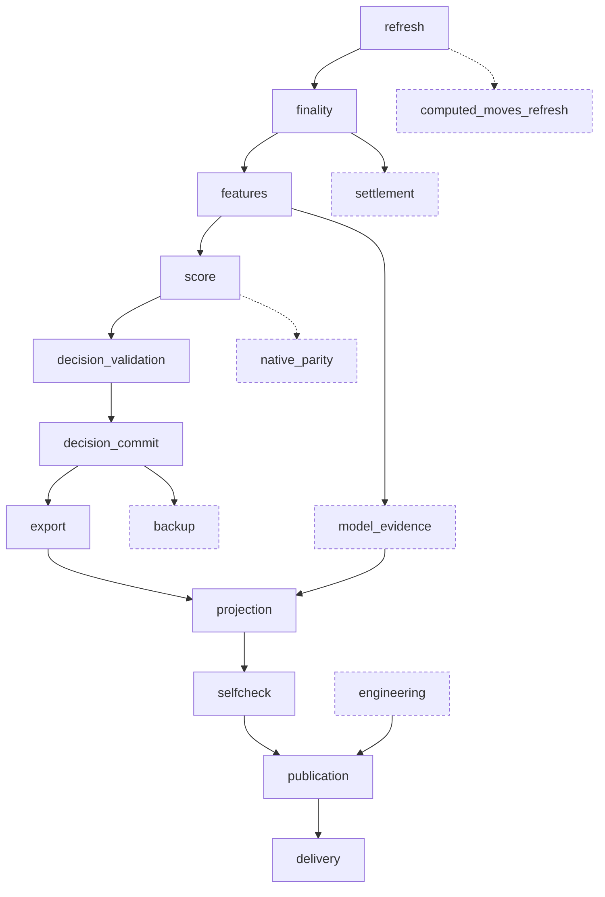
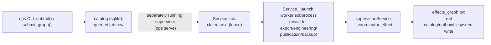
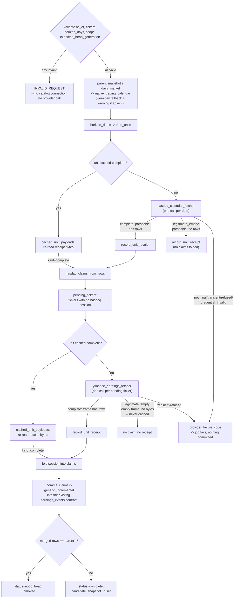
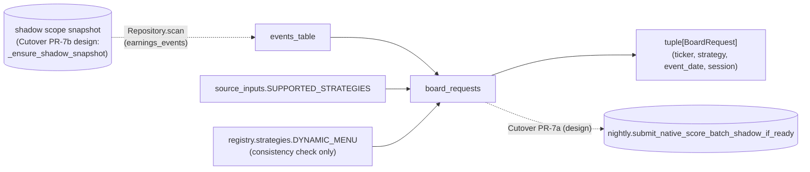

# `engine/v2/ops` — architecture

Layer 7.0 in the root `/ARCHITECTURE.md` layer table. Replaces the new
supervisor/catalog design, `dashboard/nightly.py` (as a job graph) and
`tools/bounded_run.py` (as an executor adapter). See the root doc for the
layer rules this package is checked against; this doc covers the detail
specific to this package.

## Purpose

Durable job submission, leases, retry history and dependencies; resource
admission and per-job CPU placement; the nightly job graph and its release
boundary. It does not decide research conclusions (`engine/v2/evaluation`)
and does not compute a score (`engine/v2/scoring`) — it only sequences and
persists the jobs that call into those packages.

This doc also covers `native_board_universe.py`: a pure, answer-free
enumerator that reproduces legacy `engine.score.score_calendar`'s event ×
strategy enumeration for the strategies native scoring supports, without
touching the legacy chain index or constructing a legacy `Scorer`. It has
no production caller yet — see "Dependencies" below.

## Primary contracts and public interfaces

The operator interface is the versioned command protocol
`engine/v2/ops/cli.py` exposes (`python3 -m engine.v2.ops <command>`),
derived directly from its `argparse` definitions:

- `init`, `doctor`, `health`
- `serve` — starts the supervisor loop
- `plan {nightly,experiment,training,promote}` — builds and saves a plan
  document; `training`/`promote` (P6 slice 5) take operator-only arguments
  (`--training-mode`, `--recipe`, `--state`, `--alpha`, `--cutoff`,
  `--strategy`, `--pairs`, `--ticker-chunk`, `--release-root`,
  `--release-id`) and are never part of the nightly DAG
- `submit --plan --idempotency-key`
- `rescore --request --native-inputs` — read-only, no provider pulls, no fitting
- `capture-inputs --as-of --tickers --context-tickers --year-start --year-end --source-root --output`
- `reconcile <job_id> --expected-attempt`
- `provider-account --account --remaining --live-reserve`
- `snapshot {plan-import,submit,promote,rollback}`
- `ledger {import-history,status,calibrate,book}`
- `decisions supersede --row-id --reason --from-json`
- `price-refresh --session [--dry-run]`
- `price-history capture --source-root --scope [--dry-run]`
- `get`/`logs`/`cancel`/`resume`/`explain <job_id>`

Internally: `nightly.py`'s `GRAPH`, `graph_order()`, `OPTIONAL`,
`NO_JOB_STAGES`, `build_nightly_plan`, `build_legacy_job_requests`,
`_stage_sequence` (see §"Diagrams" below); `supervisor.Service`/`serve`;
the coordinator-effect functions in `effects_graph.py`; `training.py`'s
`training_job_kind`/`promote_job_kind` (registered in `stages.py::_core_kinds`,
alongside the nightly stage kinds, not in
`supervisor._COORDINATOR_EFFECT_KINDS`), `training_plan`/`promote_plan` and
`run_training_worker`/`run_promote_worker`; `BoardRequest`/
`board_requests(as_of, horizon_days, tickers, events_table)`
(`native_board_universe.py`) — a pure key `(ticker, strategy, event_date,
session)` and the function that enumerates one per event × native-covered
strategy, plus one `DYN-SV` meta-request per event; `calendar_moves_jobs.py`'s
`computed_moves_job_kind` (registered in `stages.py::_core_kinds`, the same
ordinary-job-kind pattern as `training`/`promote_job_kind` above, not a
coordinator effect), `CalendarMovesParameters`/`calendar_moves_parameter_problems`/
`calendar_moves_job_spec`, and `run_computed_moves_worker` (dispatched by
`worker.py` for worker `"computed_moves_refresh"`) — see "Primary contracts"
below for what this adapts; "Outputs" below now covers its nightly caller
(Part 4). `calendar_moves_jobs.py` registers only `computed_moves_refresh`:
`forward_calendar_refresh` still has no `JobKind` — issue #52's prerequisite
(an attempt-fence check in the store's own commit path, so a
cancelled/expired attempt can never commit — see below) is now in place
(#55), but registering the kind itself (worker dispatch, loader callback,
parameter validation) is a separate, later change, and Part 4 wires only
`computed_moves_refresh` into the nightly graph for the same reason —
`forward_calendar_refresh` gets neither a `JobKind` nor a `GRAPH` node.

A small number of natively-fetched data stores live directly in this
package rather than delegating computation to another v2 layer — like
`price-history capture` above, `forward_calendar_store.py` (spec s4c) is
one of these. It does NOT claim `RefreshCallback` compatibility itself:
`main`'s `RefreshParameters` (`incremental_data.py`) has no
`as_of`/`tickers` field, so a function shaped `(parameters, root)` could
never read them from it. `run_forward_calendar_refresh` is instead a
standalone runner with an explicit, fully keyword-only signature
(`catalog_path`, `objects_root`, `parent_snapshot_id`, `refresh_plan_hash`,
`as_of`, `tickers`, `horizon_days`, `scope`, `expected_head_generation`,
`expected_head_snapshot_id`, `attempt_id`, `fence`, `nasdaq_fetcher`,
`earnings_fetcher`) that validates every one of its twelve non-fetcher
arguments before touching the catalog or a provider, including `scope`
(must be `"shadow"` or `"smoke"`), `expected_head_generation`
(non-negative), `expected_head_snapshot_id` (Part 3: `None` or a bounded
1..128-char string, matching `parent_snapshot_id`'s own shape — the old
code read it straight into
`_commit_claims`/`generic_incremental.commit_generic_table_candidate`
unchecked), and `attempt_id`/`fence` (issue #52: `None`/`None`, or a
non-empty string paired with an `int >= 1` — the same optional-pair shape
`computed_moves_store`'s staged `attempt_id`/`fence` document fields have);
`tickers=()` is valid and means the whole market (see "Failure semantics"
below). **The commit path now carries the same live-attempt-lease check
`computed_moves_store` has (issue #52, closed by this change):**
`_commit_claims` accepts `attempt_id`/`fence` and passes
`generic_incremental.commit_generic_table_candidate` a `fence_check`
built by this module's own `_fence_check_for` — byte-identical in shape to
`computed_moves_store._fence_check_for` — which is a no-op when
`attempt_id` is `None` (a manual/ad-hoc invocation with no live job behind
it, same as `computed_moves_store`) and otherwise calls
`engine.v2.ops.lifecycle.verify_fence` inside the SAME commit transaction
the head compare-and-swap runs in, so a cancelled job (`CANCELLED`) or an
expired lease (`LEASE_LOST`) is refused before anything commits — never
after. `generic_incremental.commit_generic_table_candidate` gained a new
optional `fence_check` parameter for this, COMPOSED with (never a
replacement for) its existing `_head_fence` check: `_head_fence` always
runs first, then the supplied `fence_check` (if any) runs after it, both
inside the one callable `catalog.commit_snapshot` invokes — CodeRabbit
review, PR #55 round 2 (`catalog.commit_snapshot` skips its own
`_check_head_expectation` call on an idempotent-replay shortcut
(`_existing_receipt`), but it always calls whatever `fence_check` it was
given BEFORE that shortcut lookup, so composing here is what keeps
head-conflict detection active on that shortcut path too). Omitting
`fence_check` (the default) keeps this function's previous, unchanged
behavior for its other two callers, `engine/v2/data/incremental.py`'s
generic-refresh path and `engine/v2/research/_trades_publish.py`, neither
of which is touched by this change. This runner still has no job-layer
bridge: registering
`forward_calendar_refresh` as a `JobKind` (worker dispatch, a loader
callback, parameter validation) is a separate, later change — see "Primary
contracts" above. Its pure helpers (`horizon_dates`, `date_units`,
`ticker_units`, `plan_forward_calendar`, `resolve_session_claims`,
`nasdaq_rows_from_payload`, `nasdaq_claims_from_rows`, `pending_tickers`)
are unit-testable without a catalog or a network. Today this runner has no
production caller, only its own test module.

`native_score_batch.py` (this PR adds this module, its `stages.py` job kind
and its `worker.py` dispatch branch together — this doc describes the
module as this PR leaves it, not a pre-existing fact): the batch-shaped
seam between the board universe (`native_board_universe.BoardRequest`) and
`engine.v2.scoring.application.score_batch`. `assemble_score_batch_inputs`
turns one release binding (`engine.v2.scoring.release_bindings.
ScoringReleaseBinding`, PR-1) plus a sequence of one already-staged
`NightlyEventInputs` per event (calendar/panel/Tier-4/quote rows, the
same shape `engine.v2.scoring.nightly_source_bundle.
assemble_nightly_source_bundle`, PR-2, already accepts) into
`dict[BoardRequest, tuple[ScoreRequest, NativeScoreInputs]]` plus a tuple of
typed per-row `NativeScoreBatchRowRefusal`s — never a raised exception for a
bad row (see "Failure semantics" below). It is a pure function: no catalog,
no filesystem, no network. An empty `events` sequence is a legitimate no-op,
never a refusal or an error: the returned map and refusal tuple are both
empty. `run_native_score_batch_worker(parameters, root)`
is the `native_score_batch` job kind's worker entrypoint (dispatched from
`worker.py`, registered in `stages.py::_core_kinds`): it resolves the
release once via `resolve_release_binding(parameters["release_root"])`,
reads the one staged `events.json` document (an array of per-event inputs,
materialized into `root` by `executor._materialize_inputs` from the job's
own `input_bindings` exactly like `adhoc_rescore`'s `request.json`/
`native_inputs.json`), calls `assemble_score_batch_inputs`, then
`engine.v2.scoring.application.score_batch` under `engine.v2.models.no_fit.
no_fit_guard()` (the same guard `_dispatch_adhoc_rescore` already uses), and
writes `records.json`/`refusals.json`. An `events.json` decoding to an empty
list produces empty `records.json`/`refusals.json` and
`completed_ids=list(parameters["expected_ids"])`/`no_work=not
parameters["expected_ids"]` — the same "no work" shape `artifact_check`
already reports for an empty `expected_ids`, never a distinct code of its
own. **This bounded batch assembler
supports `STR-THRU` only** (the same strategy `nightly_source_bundle.py`'s
own bounded builder documents as its scope) — any other `BoardRequest.strategy`
in the input sequence refuses per-row (`UNSUPPORTED_STRATEGY`), never raises
out of the batch. **No production caller submits this job kind yet**: like
`computed_moves_job_kind()` before Part 4 wired it into `nightly.py`, this PR
registers the kind and its worker dispatch only — a later cutover PR (PR-4/
PR-6, per `scratchpad/cutover_wiring_plan.md`) builds the caller that
enumerates `BoardRequest`s, stages their per-event inputs, and submits this
job kind from the nightly graph. `nightly.py` is not touched by this PR.

**Cutover PR-4 (this doc describes the design as this PR's Phase 2 will
leave it, not a pre-existing fact — Phase 1 of this PR is documentation
only for `legacy_parity_rows`, the "explained" bucket and
`tools/native_parity_run.py`, each gated on cutover PR-3
(`native_score_batch.py`, `#66`) merging before its own code is written.
One piece is NOT gated on `#66` and IS real code already in this push,
independent of everything `#66` supplies: making
`native_parity_report.py`'s tolerance policy pluggable — see "the
tolerance policy is now pluggable" below).** Three additions close the gap the
root doc §4 and this doc's own "Diagrams" section both name today:
`run_shadow_nightly` "has no production caller, only tests ... call it,"
so in production `native_parity` never actually compares anything — a
production run supplies no `parity_rows`, `_registered_handlers` defaults
both sides to `{}`, and `compare_native_vs_legacy`'s own
`_refuse_empty_inputs` raises `VALIDATION_FAILED` before any comparison
runs, which `_run_stage` turns into a `"degraded"` receipt for this
`OPTIONAL` stage (see "Outputs" below for why this is NOT the same claim
as "writes an empty-input report" — no report is ever written either).
None of the three
changes `run_shadow_nightly`'s own stage-walk or `native_parity_handler`'s
signature contract (both already correctly consume real
`legacy_rows`/`native_rows` dicts today — proven by
`tests/test_v2_ops_native_shadow_render.py`); the gap is purely that
nothing before this PR builds real dicts to hand them.

- **`nightly.legacy_parity_rows(score_document: Mapping[str, Any]) ->
  dict[str, dict]`** (new, this package). Keys the legacy `score.json`
  document's own `"rows"` array by
  `engine.v2.ops.decision_validation.population_key`'s `"ticker|strategy|
  event_date"` format — REUSED, not re-derived and not re-added: this
  public function already exists (`decision_replay.py`'s own population
  comparison already imports it), and it is the identical three-field
  format `engine.v2.serving.native_render.native_row_key` already derives
  for a native `ScoreRecord` (that module's own docstring: `"the native
  twin of bridge._population_key"` — `legacy_adapter._population_key` is a
  second, private, byte-identical copy of the same format used only for
  `_action_score`'s own population check; this PR reuses the PUBLIC one
  `decision_validation` already exports, adding no new function). Pure: no
  filesystem, no clock, and — the point of putting this here rather than
  in the composing script below — no import of `engine.v2.serving` (a
  layer-7.0 peer of `engine.v2.ops`, per the root doc's layer table;
  `checks/import_layers.py` would refuse that edge). A `score_document`
  with no `"rows"` key returns `{}` (not a refusal —
  `native_parity_handler`'s existing `_refuse_empty_inputs` already turns
  an empty `legacy_rows` into `VALIDATION_FAILED` downstream, so this
  function does not need its own empty-input check).
  **`legacy_parity_rows` does NOT reuse `population_key`'s own
  `.get(key, "")` empty-string substitution for a missing
  `ticker`/`strategy`/`event_date`** (root doc §5: "a missing or unusable
  input produces an explicit withheld/refused status," never a silent
  default) — reusing that substitution here would let one malformed row's
  empty-string-keyed entry either collide with a genuinely empty-fielded
  row, or, more likely with real data, simply end up unique and reported
  as an ordinary `only_legacy` row: quietly absorbed into the report as a
  population difference rather than surfaced as the malformed input it
  actually is. **Duplicate keys are the same class of finding, not a
  separate one**: `_action_score`'s own population check
  (`observed_keys = {_population_key(row) for row in rows}`) compares
  `population_key` values only as a SET, so a `score.json` carrying two
  rows under one `ticker|strategy|event_date` key (sibling precedent:
  `decision_replay.decision_population` rejects a duplicate population
  key explicitly, via `VALIDATION_FAILED`; `_action_score` does not)
  already passes that check today without ever proving the two rows
  agree — a plain `{key: row for row in rows}` comprehension in
  `legacy_parity_rows` would then silently keep whichever row iterated
  last and drop the other with no trace. `legacy_parity_rows` therefore
  validates every row before keying any of them: a missing/empty
  `ticker`/`strategy`/`event_date`, OR two rows sharing one
  `population_key` value, each raises `OpsError` — matching
  `decision_population`'s own code, `VALIDATION_FAILED` (detail naming
  the row index/missing field, or the repeated key and both rows'
  indices) — for the WHOLE call, before any dict is constructed: a
  batch-level refusal, never a per-row skip or a last-write-wins
  collision, so a malformed or duplicate-keyed `score.json` is never
  silently read as smaller, or different, than it actually is. The same
  refusal covers the shape one level up, before `population_key` is ever
  called on a row: `score_document["rows"]`, if present, must be a list of
  mappings — a non-list value or any non-mapping element raises `OpsError`
  (`VALIDATION_FAILED`) rather than letting `population_key`'s own
  `.get(...)` calls raise a bare `TypeError`/`AttributeError` on a
  malformed element.
  `population_key`, `_population_key`, and `_action_score`'s own
  set-based check are all unchanged by this PR.
- **`native_parity_report.py` gains a caller-supplied "explained" bucket**,
  the mechanism for classifying a known structural difference (legacy's
  stale-px rule; legacy finality drift — a prior D14 Phase 2 gate
  investigation measured 212 stale-archive rows and 124 finality-drift
  rows) as accepted rather than a defect, without
  hiding the finding or touching `engine/v2/parity`'s comparator. New
  `ROW_EXPLANATION_CODES = frozenset({"LEGACY_STALE_PX",
  "LEGACY_FINALITY_DRIFT"})` and a new keyword-only parameter on both
  `compare_native_vs_legacy` and `native_parity_handler`:
  `row_explanations: Mapping[tuple[str, str], str] = {}`, keyed by
  `(row_key, dimension)` — never by `row_key` alone, so explaining one
  dimension of a row (say, `financial_diagnostics`, because legacy priced
  it off a stale quote) can never silently swallow a genuine, unrelated
  mismatch the SAME row has on another dimension (say, `verdicts`). A
  `(row_key, dimension)` pair whose `dimension` was not itself compared,
  whose `row_key` is not in `compared`, or whose pair did not actually
  produce a mismatch (agreement needs no explaining, and accepting one
  would hide a caller classifier that is itself wrong) is refused
  `INVALID_REQUEST` — never a silent no-op annotation. A reason code
  outside `ROW_EXPLANATION_CODES` is refused the same way: this is a
  closed, named vocabulary, not a free-text field a caller can widen
  without a doc change. The returned document gains `"explained": [...]`,
  each entry the same shape as a `mismatches` entry
  (`row_key`/`dimension`/`finding_fields`/`receipt`) plus `"reason"`; an
  explained `(row_key, dimension)` is removed from `mismatches` and moved
  to `explained`, never counted in both. `native_parity_handler`'s summary
  gains `"explained": len(report["explained"])` alongside its existing
  `"mismatches"` count. **The classifier itself — deciding which rows are
  actually stale-px vs. finality-drift — is explicitly out of scope for
  this PR, and not invented here**: no reusable stale-px/finality-drift
  detector exists in production code today (`engine/v2/data/price_history.py`
  has finality/staleness primitives but no per-row classifier over a scored
  record; the D14 corpus's 212/124 counts were a one-off manual
  classification during a Phase 2 gate investigation, never a callable
  function). Until a follow-up PR builds one, `row_explanations` defaults
  to `{}` and every real mismatch reports as a mismatch — this PR adds the
  plumbing so a future classifier has somewhere correct to plug in, not a
  guess at what that classifier should decide today. Tracked as a
  follow-up issue, filed alongside this PR's Phase 2 push.
- **`tools/native_parity_run.py`** (new, tools-composing layer — the one
  place allowed to import both `engine.v2.ops` and `engine.v2.serving` in
  one process, per `engine/v2/ops/native_shadow_render.py`'s own docstring
  and the working precedent `tools/v2_dashboard_project.py` already sets
  for composing `engine.v2.ops.bootstrap` with `engine.v2.serving`). This
  is the real (manual, operator-invoked; not yet wired into any job graph
  or the supervisor's tick loop — see "out of scope" below) production
  caller that finally builds a non-empty `parity_rows` and calls
  `run_shadow_nightly` with it: reads a session's already-written legacy
  `score.json` (`nightly.legacy_parity_rows`, above); resolves the current
  release (`engine.v2.scoring.release_bindings.resolve_release_binding`,
  PR-1, already on `main`); reads one already-staged `events.json` of
  `native_score_batch.NightlyEventInputs` (PR-3/`#66`'s own shape — this
  PR does not build the per-night enumeration/staging of those events; it
  accepts them as an explicit input file, exactly as
  `run_native_score_batch_worker` itself does, and leaves "who stages
  `events.json` for every `BoardRequest`" to cutover PR-6, a later PR in
  this same cutover sequence); calls
  `native_score_batch.assemble_score_batch_inputs` (PR-3) to get
  `requests_by_key`; calls
  `engine.v2.serving.native_shadow_render.build_native_bundle_rows`
  (already on `main`) to get `native_rows`; and calls
  `nightly.run_shadow_nightly(..., plan=..., parity_rows=(legacy_rows,
  native_rows))`. It writes nothing to `source_root` and nothing to the
  legacy board — see "Failure semantics" below for why a failure anywhere
  in this script cannot touch the legacy nightly.

**The tolerance policy is now pluggable, not hardcoded — this part of the
PR is real code, already merged into this push, independent of `#66`.**
`engine.v2.parity.dimensions.compare_dimension` gained a keyword-only
`tolerance_policy` parameter (default `SCORE_RECORD_V1`, so the Phase 4
checker and every existing test are unaffected — none of them pass this
argument, so none of them can observe a behavior change);
`native_parity_report.compare_native_vs_legacy`/`native_parity_handler`
each gained the identical parameter, threaded straight down to
`compare_dimension`, and the written report now records
`"tolerance_policy_id": tolerance_policy.policy_id` so a reader of
`native_parity_report.json` can always see which policy compared it —
never an implicit, undiscoverable default. **Per-field tolerances come
from ONE config policy, the `engine.v2.parity.tolerance.TolerancePolicy`
type** (never a second ad hoc mechanism): the default that ships in this
PR is still `SCORE_RECORD_V1`, which declares zero per-field rules
(`rules=()`), so every one of the five dimensions' 30 fields —
`FORECAST_FIELDS` (12), `SIMULATION_FIELDS` (7), `FINANCIAL_FIELDS` (5),
`GATE_FIELDS` (3), `ANALOG_FIELDS` (3) — still compares under exact
equality until a caller explicitly plugs in a different policy. **No
per-field tolerance VALUE is added, chosen, or implied by this PR** —
that is a user decision, taken to the user separately, and per instruction
none of those values belong in this doc, the PR body, or an issue; only a
`TolerancePolicy` built and ratified elsewhere is ever passed in here.
`tolerance.py`'s own docstring names the risk this design avoids:
"chosen to make the first run pass" is a named failure mode, so this PR
adds the SEAM a ratified policy plugs into, not a guess at what it should
contain.

**Out of scope for this PR** (each a real gap, named rather than silently
left implicit): the per-night enumeration of every `BoardRequest` and the
staging of its `events.json` inputs (cutover PR-6); flipping
`native_parity` or anything else onto a schedule, a job kind, or the
supervisor's tick loop (no PR before Phase 7 changes legacy authority);
the stale-px/finality-drift classifier itself (above); and building the
actual user-approved, per-field `TolerancePolicy` object itself (the
pluggable seam above takes it as a parameter — this PR does not construct
one).

**Cutover PR-7a (design — this PR adds no code; the next PR in this
sequence implements what this section describes).** `native_score_batch`
(`#66`) is registered as a job kind (`stages.py::_native_score_batch_kind`)
but, as of `#66`/`#72`/`#68`, still has no production caller. This section
describes the first one: the REAL production nightly submits it in shadow,
alongside legacy scoring, with no authority change — never through
`run_shadow_nightly` (no production caller, needs 14 caller-supplied stage
handlers nothing builds) and never through `tools/native_parity_run.py`
(operator-invoked, not wired to any schedule). Three new symbols, all
mirroring the `computed_moves_refresh` precedent (Part 4, `#54`)
byte-for-byte in shape:

- `supervisor.Service._reconcile_native_score_batch_shadow` — a new
  tick-loop sidecar method, called from `Service.tick` (`supervisor.py:227`)
  right alongside its existing `self._reconcile_computed_moves_refresh()`
  call (`supervisor.py:241`), never inside `build_legacy_job_requests`.
- `nightly.submit_native_score_batch_shadow_if_ready` — the builder the
  sidecar calls, mirroring `nightly.submit_computed_moves_refresh_if_ready`
  (`nightly.py:858`).
- `nightly._native_score_batch_identity` — a cheap catalog-only identity
  check mirroring `nightly._computed_moves_identity` (`nightly.py:830`):
  finds the latest session with a succeeded legacy `"score"` job, parsing
  that job's own idempotency key — the standard `_DAG_STAGES` 4-part shape
  (`"nightly:<session>:<scope_hash>:score"`, `nightly.py:996`), not
  `_computed_moves_identity`'s own 3-part `"refresh"` format — to recover
  BOTH the session and the exact `scope_hash` that `"score"` job was pinned
  to (see "Failure semantics" below, R6, for why `scope_hash` matters here
  and did not for `computed_moves_refresh`), and returns `None` when no
  succeeded `"score"` job exists yet.

`nightly.GRAPH` gains a `"native_score_batch": ("score",)` node
(topological documentation only, exactly like
`"computed_moves_refresh": ("refresh",)` at `nightly.py:51` — no submission
path reads this edge) and `OPTIONAL` gains `"native_score_batch"`.
`native_board_universe.board_requests` (`native_board_universe.py:198`)
gets its first real caller here, closing the "no caller yet" dashed edge
this doc's own Diagrams section already names (see below).

**Cutover PR-7b (design — this PR adds no code; the next PR in this
sequence implements what this section describes).** PR-7a's own text above
named the gap precisely and refused to close it: "PR-7a's shadow batch does
not submit at all, full stop, until either (a) a future PR changes the
production input mode to one that pins a snapshot, or (b) the still-missing
raw-row producer... is given its own, separately-designed way to source
`snapshot_id`/`calendar_revision`/`events_table`/`horizon_days`." This
section is (a). It does not attempt (b): the per-event raw-row producer
(`calendar_row`/`panel_row`/`panel_anchor`/`tier4_row`/`quote_rows` staging
for `NightlyEventInputs`) stays exactly as out of scope as PR-7a already
declared it — a later PR, mirroring PR-7a's own boundary.

**The concrete gap in running code today.** `nightly_trigger._default_plan`
(`nightly_trigger.py:~518-528`, both line numbers approximate — issue #104/
PR #117, in flight, renumbers this function's body; see the coordination
note below) hardcodes `input_mode="legacy"`, `snapshot_scope=None`,
`refresh_mode="legacy"`, `refresh_plan=None` in the `argparse.Namespace` it
builds for every call, unconditionally — there is no branch, no flag, and
no caller-supplied override for any of the four. In `input_mode="legacy"`,
`cli._plan_command`'s own `_snapshot_inputs` (`cli.py:454-467`) returns
`None` before `snapshot_planning.pin_snapshot_inputs` is ever called, so
the plan `nightly_trigger` submits every night pins no `SnapshotRef` at
all — verified against current `main`, matching PR-7a's own verification of
the identical fact. **Supervisor decision, option A**: the shadow nightly
runs in `input_mode="snapshot"` — not narrowly scoped to feed only
`native_score_batch`, but the WHOLE shadow plan `nightly_trigger` submits,
so legacy `"score"`/`"decision_replay"`/`"projection"`/`"selfcheck"`/
`"model_evidence"` (`SNAPSHOT_STAGES`, `nightly.py:379-380`) read through
the SAME pinned, frozen materialization
`native_score_batch` will read through, once its own producer exists. This
is a real, intentional behavior change to how the SHADOW comparison itself
reads data (never to the real production legacy nightly — see point 4
below, "How `nightly_trigger` switches to snapshot mode"), chosen because a
side-by-side comparison where legacy and native can read the legacy store
at two different moments is exactly the kind of noise this cutover effort
has already spent real cost chasing down elsewhere (D14 corpus parity,
the analog context-width defect) — freezing both sides to one snapshot
removes that variable, not just for `native_score_batch` but for the whole
comparison.

**1. What creates and promotes each night's v2 snapshot — today, nothing
does.** `ops snapshot plan-import`/`submit`/`promote`/`rollback`
(`cli.py:926-956`, dispatching to `engine.v2.data.import_snapshot`/
`engine.v2.ops.snapshot_import`/`engine.v2.ops.snapshot_promotion`) is a
complete, tested, operator-invoked pipeline — but it has no scheduled
caller anywhere in `engine/v2/ops` or `engine/v2/data`. Every "shadow"-scope
snapshot committed to date was a manual `ops snapshot plan-import` +
`submit` pair an operator ran by hand (Phase 2 sign-off/D14 corpus work);
nothing re-runs it nightly. `computed_moves_store.py` and
`forward_calendar_store.py` both already take a `parent_snapshot_id` and
read through it (`_scan_once`/`daily_market` sessions respectively) — both
silently assume SOME snapshot exists at whatever scope their own caller
resolved; neither one is the producer either.

Closing this needs a genuinely new nightly step, and it must run — and
fully commit — BEFORE `nightly_trigger._default_plan` ever calls
`cli._plan_command`, because `pin_snapshot_inputs` resolves the scope's
head SYNCHRONOUSLY at plan-BUILD time (`snapshots.resolve_snapshot_head`,
one `SELECT ... FROM data_snapshot_heads`): a plan cannot be built
referencing a snapshot that has not committed yet. This rules out the
`supervisor.Service` tick-loop sidecar shape `computed_moves_refresh`/
PR-7a's own `native_score_batch` sidecar both use — those sidecars tick
inside `Service.tick()`, which `nightly_trigger._default_serve`
(`nightly_trigger.py:561-600`) only starts driving AFTER `_default_plan`
has already built and `_default_submit` has already submitted that same
night's plan (`_submit_plan`'s own order: `plan_fn` → write `"submitting"`
→ `submit_fn` → `serve_fn`). A sidecar that only runs during `serve_fn`'s
loop is structurally too late for this one input.

**Where this phase is called from, precisely — not inside `_default_plan`
(round-1 CodeRabbit finding, real: an earlier draft of this design called
it from inside `_default_plan`, whose own contract is "return a `plan_ref`
`str`"; there is no existing slot in that contract for a `"not_yet"`
outcome, so a caller could not tell a real `plan_ref` from a stalled
snapshot without a type-unsafe sentinel).** `nightly_trigger._ensure_
shadow_snapshot(root, as_of, clock, attempt, *, plan_import_fn=None,
submit_import_fn=None, serve_fn=None) -> tuple[Literal["ready", "not_yet",
"timed_out"], str | None]` (raises the usual `_HANDLED_FAILURES` on a
terminal problem, exactly like `plan_fn`/`submit_fn`/`serve_fn` already
do — never returns a fourth, silent-failure value) is instead a NEW,
separate step inside `_submit_plan` itself, called immediately before its
existing `plan_ref = plan_fn(...)` call, inside the SAME `if plan_ref is
None:` guard (so, like `plan_fn`, it never runs on the resume branch — a
resumed run's plan already references an already-committed snapshot from
whichever earlier attempt built it, so there is nothing left to ensure).
The second tuple element is the exact `snapshot_id` this call verified is
fresh for `as_of`, present only for `"ready"` (`None` for `"not_yet"`/
`"timed_out"`) — see round-2's own "Bind resumed plans to the committed
snapshot" fix, below, for why this cannot be a bare status string.
Concretely, `_submit_plan`'s own body gains, right before its existing
`plan_ref = plan_fn(...)` line:

```python
if plan_ref is None:
    snapshot_attempt = prior.snapshot_attempt if prior is not None else 0
    try:
        readiness, snapshot_id = ensure_snapshot_fn(root, as_of, clock, snapshot_attempt)
    except _HANDLED_FAILURES as exc:
        return _failure(root, clock, as_of, None, exc, prior, snapshot_attempt=snapshot_attempt + 1)
    if readiness == "not_yet":
        return _record(root, _receipt(
            clock, as_of, "not_yet", "the shadow snapshot has not caught up to as_of yet",
            snapshot_attempt=snapshot_attempt))
    if readiness == "timed_out":
        previous = prior.error_count if prior is not None and prior.status == "timed_out" else 0
        count = previous + 1
        if count >= MAX_CONSECUTIVE_ERRORS:
            return _record(root, _receipt(
                clock, as_of, "failed",
                f"the shadow snapshot import exceeded its deadline {count} consecutive "
                "times; giving up", error_count=count, snapshot_attempt=snapshot_attempt))
        return _record(root, _receipt(
            clock, as_of, "timed_out",
            "the shadow snapshot import has not finished; the legacy lock is released, "
            "resuming next tick", error_count=count, snapshot_attempt=snapshot_attempt))
    try:
        plan_ref = plan_fn(root, as_of, tuple(tickers), tuple(context_tickers), clock,
                           full_run=full_run, expected_shadow_snapshot_id=snapshot_id)
    ...  # unchanged from here
```

`ensure_snapshot_fn` is a new keyword parameter on `_submit_plan`
(`=None`, defaulting to `_ensure_shadow_snapshot`, the same injection-seam
style `plan_fn`/`submit_fn`/`serve_fn` already use). `_default_plan`'s own
CONTRACT is otherwise unchanged (still exactly "build and return a
`plan_ref` `str`, or raise") — it only gains one new, purely pass-through
keyword, `expected_shadow_snapshot_id=None` (round-2 fix, below) — so
#117's own edits to `_default_plan`'s body (manifest capture, year
derivation) are untouched by this design at the call-site level; only
`_default_plan`'s two trailing literal kwargs and this one new keyword
change (point 4 below).

**`TriggerReceipt` gains a new field, `snapshot_attempt: int = 0`,
additive, carried on EVERY receipt written for a given `as_of` and
bumped in exactly ONE place (Opus-gate findings on `e900074`/`fb7d31e`,
both real, both Major — see below for each).** An earlier draft reused
`error_count` for the retry key's own job-identity number. That breaks
the moment `prior.status` stops being `"error"` for any reason — which
`nightly_trigger.py` already has several of for a single `as_of` in
progress: `busy_legacy` (`:401`, another heavy run holds the legacy
lock), the probe-finality `"not_yet"` (`:425`), `"missed"` (`:422`),
`"submitting"`/`"submitted"` (`_submit_plan`), and the terminal `"com
pleted"`/`"failed"` receipt after `serve_fn` returns (`:467-469`) — NONE
of these represent a resolution of the shadow-snapshot-import job's own
state one way or the other, so none may reset (or otherwise touch) its
identity counter, yet `error_count`-keyed logic resets exactly there
(gate finding 1 on `e900074`), and even a same-status streak has no
`MAX_CONSECUTIVE_ERRORS`-style cap of its own once other statuses can
interleave (gate finding 2 on `fb7d31e`: an alternating `"error"`/
`"timed_out"` sequence keeps BOTH of the existing, status-gated counters
at `1` forever). `snapshot_attempt` fixes both by being a single,
monotonic counter for the WHOLE `as_of` run, independent of every OTHER
status transition:

- **Carried forward, unchanged, by construction.** `_receipt()` gains the
  parameter `snapshot_attempt: int = 0`; EVERY call site that writes (or
  returns) a receipt for an `as_of` already in progress passes `snapshot_
  attempt=prior.snapshot_attempt if prior is not None else 0` — this is
  now a mechanical, blanket rule applied at every `_receipt(...)` call in
  the module (`busy_legacy`, `_decide`'s `"missed"` and probe-finality
  `"not_yet"`, `_submit_plan`'s `"submitting"`/`"submitted"` and its final
  `"completed"`/`"failed"`, and this block's own `"not_yet"`/`"timed_out"`
  receipts), not a per-site judgment call — so nothing can silently forget
  it the way the `e900074` draft forgot every site but one. (`_decide`'s
  pre-window `"not_yet"` at `:419` and `_idle` at `:347` never reach
  `_record`/`write_state` at all — purely-returned, never-persisted
  receipts — so they cannot desynchronize the STORED counter regardless of
  what they carry; they still carry the SAME value, for a caller
  inspecting the returned receipt, not because it changes anything
  persisted.)
- **Bumped in exactly one place.** The `except _HANDLED_FAILURES` branch
  above, `_ensure_shadow_snapshot`'s own raised terminal failure
  (R1(b)/R1(c) below), passes `_failure` an explicit `snapshot_attempt=
  snapshot_attempt + 1` — a NEW keyword-only parameter on `_failure`
  (`=None`; every OTHER existing call site of `_failure` — the generic
  `plan_fn`/`submit_fn`/`serve_fn` exception handling — omits it, so
  `_failure` falls back to its own `prior.snapshot_attempt if prior is not
  None else 0`, i.e. carried, not bumped: a `plan_fn`/`submit_fn` failure
  says nothing about whether the shadow snapshot import job itself needs a
  new identity).
- **Its own give-up bound, closing gate finding 2 directly.** `_failure`'s
  give-up decision (`"failed_setup"` vs `"error"`) becomes an OR of two
  independent checks, not one: the EXISTING `count >= MAX_CONSECUTIVE_
  ERRORS` (unchanged: `prior.error_count if prior is not None and prior.
  status == "error" else 0`, plus one — still resets on any non-`"error"`
  status, exactly as it always has, for every OTHER failure cause) OR the
  NEW `resolved_snapshot_attempt >= MAX_CONSECUTIVE_ERRORS` (where
  `resolved_snapshot_attempt` is the `snapshot_attempt` kwarg when given,
  else the carried `prior.snapshot_attempt if prior is not None else 0`).
  Because `snapshot_attempt` is now carried on every receipt regardless of
  status (the blanket rule above), it is genuinely monotonic across the
  WHOLE `as_of` run — an alternating `"error"`/`"timed_out"` sequence
  still resets the OLD `error_count`-based check the same as before, but
  can no longer defeat the bound entirely, because `snapshot_attempt`
  itself never resets and trips its OWN `MAX_CONSECUTIVE_ERRORS` cap the
  SAME number of terminal snapshot-import failures a non-interleaved
  sequence would have. The receipt this produces still uses the SAME
  `error_count` field for its own, unchanged meaning (observability: "how
  many consecutive `"error"`-status ticks in a row") — `snapshot_attempt`
  is reported alongside it, not instead of it. **A `"timed_out"` readiness
  deliberately reuses the SAME status string, the SAME `MAX_CONSECUTIVE_
  ERRORS`-bounded counter convention, and the SAME `error_count`-selection
  expression `_submit_plan`'s existing POST-plan `serve_fn`-timeout
  handling already uses further down in this same function (round-2
  CodeRabbit finding, real — "specify the snapshot-import deadline
  outcome": an earlier draft bounded `_ensure_shadow_snapshot`'s own
  drive-to-terminal by `_serve_deadline` but never said what happens if
  that deadline fires). This PRE-plan timeout's OWN give-up count is a
  separate, THIRD status-gated counter (`prior.error_count if prior.
  status == "timed_out" else 0`, unchanged) — it is not bumped by, and
  does not itself bump, `snapshot_attempt` (a timeout is not a terminal
  job failure; the job may still succeed), but repeated PRE-plan timeouts
  for the SAME never-yet-terminal job are bounded the SAME way a repeated
  terminal failure is: the two counters can both independently reach
  `MAX_CONSECUTIVE_ERRORS` and either one ends the run. The two
  `"timed_out"` causes (this PRE-plan snapshot-import wait, and the
  EXISTING POST-plan `serve_fn` wait) are told apart by whether `plan_ref`
  is set on the receipt (`None` here, always set there) and by the
  receipt's own `detail` text — never by a fourth status string, which
  would only fragment one "this run for `as_of` is taking too long"
  concept into two. Because this receipt carries no `plan_ref`, `run_
  trigger`'s resume branch (`prior.plan_ref and prior.status in RESUME_
  STATUSES`) does NOT engage on the next tick — it falls through to the
  ordinary `_decide` path instead, which re-enters `_submit_plan` with
  `plan_ref=None` and calls `ensure_snapshot_fn` again with the SAME
  `snapshot_attempt` (a `"timed_out"` outcome is not the one bump site, so
  `snapshot_attempt` is carried, not bumped, per the blanket rule above —
  this is now mechanically true at every call site, not merely asserted
  at one): the SAME idempotency key's R2 catalog lookup then finds the
  `snapshot_import` job either `succeeded` by now (`"ready"`, immediately,
  no re-submission) or still running (`"timed_out"` again, consuming one
  more tick of the SEPARATE consecutive-timeout counter) — self-healing
  across ticks with no new state needed, exactly the shape `_ensure_
  shadow_snapshot`'s own `supervisor.serve`/`_drive_jobs_to_terminal` call
  already reports (`"deadline_exceeded"`, mapped here to `"timed_out"`,
  never `"failed"` or cancelled — "the in-process jobs are left exactly
  where the supervisor's own recovery already leaves an interrupted
  attempt... nothing here cancels or force-fails them", per the `nightly_
  trigger.py` issue #103 section above, unchanged and reused as-is for
  this job too).**

`_ensure_shadow_snapshot(root, as_of, clock, attempt, ...)` itself:

1. Cheaply checks whether a `snapshot_import` job already exists (any
   state) under the idempotency key `f"shadow_snapshot_import:{as_of}:
   {attempt}"` — a plain catalog job lookup, the same "cheap, catalog-only
   identity check" pattern `nightly._native_score_batch_identity` already
   establishes for a different job kind. **The `attempt` suffix, not a
   bare `f"...{as_of}"` key (round-1 CodeRabbit finding, real — see
   "Failure semantics" R3/R6 below for the full account): `submission
   ._insert_or_match` (`submission.py:296-322`) treats an EXISTING row
   under a namespace+key pair as an unconditional match regardless of that
   row's OWN state — even a TERMINALLY `failed` `snapshot_import` job
   under an unchanged key is matched and returned as-is, never replaced;
   `snapshot_import`'s own `RetryPolicy("bounded", 2, (5, 30))`
   (`stages.py:336`) governs retries WITHIN one job row's own attempt
   history (the scheduler leasing and re-launching the SAME row up to
   `max_attempts`), not a caller minting a fresh submission after that
   row goes terminal. A bare `as_of`-only key would therefore make a
   terminally failed import PERMANENT for the rest of that `as_of`'s
   retry window with no way to try again — using the DEDICATED
   `snapshot_attempt` counter (above; NOT `error_count`, which a
   `"timed_out"` tick in between would otherwise reset the wrong value
   against) as the key's own attempt suffix means a NEW `_submit_plan`
   entry after a prior TERMINAL failure of this specific job mints a
   genuinely NEW idempotency key, so
   `_insert_or_match` inserts a fresh row rather than matching the old
   terminal one — while a same-attempt-number RE-ENTRY (the
   crash-immediately-after-submit case) finds this SAME row already
   sitting under the key on the very next tick and is handled by THIS
   step's own lookup below, not by a second call into `_insert_or_match`:
   no resubmission is attempted at all for a key that already has a row
   (see the branches immediately below).** This lookup's own row, if any, is what decides everything
   below — steps 2 and 3 (reading the head, then calling `plan_import`)
   run ONLY when NO row exists yet under this exact key; a key that
   already has a row, in ANY state, never reaches them (the same "checked
   first, before anything expensive runs" shape PR-7a's own R2 already
   uses for `native_score_batch`'s different job kind, and the SAME claim
   R2 below now makes explicit for this job too):
   - **No row.** Falls through to step 2.
   - **`succeeded`.** Returns `("ready", snapshot_id)` immediately, reading
     `snapshot_id` off the succeeded job's OWN committed
     `SnapshotImportReceipt` (`resulting_head_snapshot_id`,
     `contracts/data.py:663`) — never by re-reading `data_snapshot_heads`'
     mutable current head, which by the time this branch runs may already
     differ (the crash-then-resume-before-`_record` case this branch
     exists for: a prior `_submit_plan` call for the SAME `as_of`/`attempt`
     already finished this step but crashed before recording state — the
     snapshot THAT attempt committed, not whatever is head NOW, is what
     its plan must pin).
   - **Not yet terminal** (`queued`, `running`, `retry_wait`, or any other
     state `TERMINAL_JOB_STATES` (`nightly_trigger.py:95`) does not list)
     **(Opus-gate finding on `a30c624`, real: an earlier draft returned
     early ONLY for `succeeded` and fell through to steps 2–4 for
     anything else, re-planning and resubmitting under the SAME key while
     the FIRST submission was still live. If the legacy store or the
     implementation changed between ticks, the resubmitted request's
     digest differs from the still-open row's, so `submission._insert_
     or_match` raises `IDEMPOTENCY_CONFLICT` for a job that is not even
     dead yet; the caller's resulting `_failure` bump then mints a SECOND
     live job under a NEW key on the next tick while the FIRST keeps
     running toward the same expected snapshot head — two imports racing
     the same CAS precondition. This is the exact failure the doc's own
     R3 account below always assumed could not happen.)** Reattaches to
     that EXISTING job id directly: jumps straight to step 4's
     `_drive_jobs_to_terminal` call and outcome handling below, WITHOUT
     re-reading the head (step 2) or calling `plan_import`/`submit_import`
     again (step 3 and the submit half of step 4) — so this key's own
     request is submitted exactly once, ever, and a tick that resumes
     after a `"timed_out"` outcome waits on the SAME row instead of
     risking a second one.
   - **Terminal but not `succeeded`** (`failed`, `cancelled`, or `blocked`
     — `TERMINAL_JOB_STATES` minus `succeeded`). Raises the SAME typed,
     non-retryable `INPUT_CHANGED` `OpsError` step 4's own terminal-failure
     case raises, immediately, WITHOUT calling `plan_import`/`submit_
     import` first: resubmitting under this SAME key could only ever
     re-match this SAME dead row (`_insert_or_match`'s existing-row-wins-
     regardless-of-state semantics, above), so a resubmission attempt
     buys nothing and, if the legacy store moved since this row was
     submitted, only invites a needless `IDEMPOTENCY_CONFLICT`.
     `_submit_plan`'s existing `except _HANDLED_FAILURES` catches it and
     routes into `_failure` with `snapshot_attempt=snapshot_attempt + 1`,
     exactly as step 4's own terminal-failure case does, so the NEXT
     `_submit_plan` entry mints a genuinely NEW key (this step, above)
     rather than looking at this dead row again.
2. Reached only when step 1 found no row at all under this key: reads the
   CURRENT `shadow` scope head
   (`SELECT snapshot_id, generation FROM data_snapshot_heads WHERE
   scope='shadow'`; absent on a fresh catalog maps to `None`/`0`, the same
   defaults `plan_import`'s own signature already accepts) as the
   `expected_head_snapshot_id`/`expected_head_generation` CAS pair, and
   calls `import_snapshot.plan_import(source_root=root, scope="shadow",
   expected_head_snapshot_id=..., expected_head_generation=...)` — `root`
   is the SAME checkout `nightly_trigger` already runs from (matching
   `ops price-history capture --source-root`'s own precedent: the legacy
   checkout IS this repo's own data tree, not a second clone).
3. `plan_import`'s own `_check_snapshot_shape` derives `session` (surfaced
   as `plan.legacy_input_manifest.selected_session`) from the legacy
   store's OWN current state — never from `as_of` — exactly like
   `capture_inputs.capture`'s identically-named field (issue #104/PR #117's
   own precedent). `_ensure_shadow_snapshot` checks
   `plan.legacy_input_manifest.selected_session == as_of` BEFORE
   submitting anything: `probe_finality` having already said `as_of` is
   final (checked one step earlier, in `_decide`) does not guarantee the
   full legacy store snapshot-import reads (`daily_market`,
   `earnings_events`, `feature_panel`, `tier4_forecasts` — a wider read set
   than the single ORATS probe `probe_finality` itself makes) have
   ALSO caught up. On a mismatch, this phase submits nothing and returns
   `("not_yet", None)` (never raises) — the caller's `snapshot_attempt` is
   NOT bumped for this outcome (only the except-branch around THIS call,
   on a raised `_HANDLED_FAILURES`, ever increments it — see the `Trigger
   Receipt` fix above), so a `"not_yet"` tick costs nothing against
   either the `snapshot_attempt` identity or the `error_count` give-up
   budget; the next tick calls `_ensure_shadow_snapshot` again with the
   SAME `attempt` value and retries `plan_import` fresh.
4. **On a match** (step 3 found `session == as_of`), submits the plan
   through the REAL path — `snapshot_import.save_import_plan` then
   `snapshot_import.submit_import(..., idempotency_key=
   f"shadow_snapshot_import:{as_of}:{attempt}")`, precisely `ops snapshot
   plan-import` + `ops snapshot submit`'s own two calls
   (`cli.snapshot_command`, `cli.py:926-956`), never a bespoke coordinator
   call and never `run_shadow_nightly`. **This drive-to-terminal-and-
   interpret step is also where step 1's REATTACH branch above lands
   directly, skipping the submit call**: either way, exactly ONE job id
   for this `as_of`/`attempt` key is being tracked — the one just
   submitted here, or the one already in flight that step 1 found — and
   the rest of this step applies identically to both. It drives that ONE
   job to terminal with the SAME `supervisor.Service`/`supervisor.serve`
   helper `_default_serve` already uses (factored so both share one small
   `_drive_jobs_to_terminal(service, job_ids, deadline_at)` helper instead
   of two copies of the same polling loop), bounded by the SAME
   `_serve_deadline` the whole run already respects, and held under the
   SAME `_LegacyLock` the whole run already holds — a slow import extends
   the run the same way a slow `"score"`/`"decision_replay"` job already
   can today; this design adds no new locking or scheduling primitive. On
   a SUCCEEDED outcome, this phase reads the job's own committed
   `SnapshotImportReceipt.resulting_head_snapshot_id` (the SAME field
   point 1's `("ready", snapshot_id)` case above reads on a cache hit) and
   returns `("ready", snapshot_id)`. `_drive_jobs_to_terminal` reporting
   `"deadline_exceeded"` (round-2 CodeRabbit finding, real — see "Where
   this phase is called from" above for the full account) returns
   `("timed_out", None)`, never raises and never treats the job as failed:
   the job itself keeps running under its own lease past this call's own
   wait, exactly as `_default_serve`'s own `"timed_out"` already leaves an
   in-flight job alone (issue #103 section above, R5, unchanged, reused
   as-is here). A terminal `failed`/`conflict` outcome for this job raises
   the typed, non-retryable `INPUT_CHANGED` `OpsError` `_submit_plan`'s
   existing `except _HANDLED_FAILURES` catches, routing into `_failure`
   with `snapshot_attempt=snapshot_attempt + 1` (the `TriggerReceipt` fix
   above) — which bumps `error_count` too (the ordinary give-up count, for
   `MAX_CONSECUTIVE_ERRORS`) AND the dedicated `snapshot_attempt`, so the
   NEXT `_submit_plan` entry for this `as_of` (if any, before `MAX_
   CONSECUTIVE_ERRORS` is reached) calls this function again with a
   genuinely NEW `attempt` value, per point 1 above.
5. Directly committing into scope `"shadow"` (via `commit_snapshot_for_
   attempt(..., scope=request.scope, ...)`, `snapshot_promotion.py:208`)
   rather than importing into a candidate scope and calling `ops snapshot
   promote` afterward: `"shadow"` is already the scope
   `nightly_trigger`'s OWN plan reads (`--snapshot-scope shadow`, point 4
   below) and the scope `computed_moves_refresh`/`forward_calendar_refresh`
   already read a `parent_snapshot_id` from — there is no second,
   stricter-gated scope downstream of it a promotion step would be
   protecting. `promote`'s candidate/comparison machinery stays exactly
   what it already is: the mechanism for advancing a scope that DOES have
   a downstream consumer needing pre-advance validation (a future
   production cutover scope, not this shadow-only one).
6. **Bind the plan to the EXACT snapshot this call verified — never the
   mutable head again (round-2 CodeRabbit finding, real, Major: "bind
   resumed plans to the committed snapshot").** An earlier draft of this
   design had `plan_fn`/`cli._plan_command` re-resolve `scope='shadow'`'s
   CURRENT head via `pin_snapshot_inputs`/`resolve_snapshot_head` moments
   after this phase already verified a DIFFERENT read of that same mutable
   row — a genuine TOCTOU gap: `_LegacyLock` guards only `nightly_
   trigger`'s OWN process for the duration of ITS OWN run; it does not, and
   cannot, block a human operator from running `ops snapshot submit`/
   `promote` against `scope='shadow'` by hand in between (nothing in this
   design, or in `snapshot_import`/`snapshot_promotion`, serializes THAT
   against `nightly_trigger`'s own read). A `plan_fn` call that re-resolves
   the head instead of reusing the exact `snapshot_id` this call just
   confirmed matches `as_of` could therefore pin a snapshot NOBODY
   validated against tonight's session. The `snapshot_id` this function
   returns on `"ready"` is the fix: `_submit_plan` passes it to `plan_fn`
   as `expected_shadow_snapshot_id` (point 1's code snippet, above), and
   `_default_plan` threads it straight through as a new CLI arg,
   `args.expected_snapshot_id`, to a small extension of `snapshot_planning
   .pin_snapshot_inputs`: matching the function's ACTUAL resolution path
   (round-3 CodeRabbit finding, real — an earlier draft of this paragraph
   named a `Repository.resolve` call that does not exist here), after
   `resolve_snapshot_head` returns `head` and `store.read_verified(head)`
   is deserialized into the (still separately, necessarily re-read — a
   plan needs the artifact, not just the id) `SnapshotRef` (`snapshot_
   planning.py:143-144`), if `expected_snapshot_id` is given and differs
   from that ALREADY-LOADED `snapshot.snapshot_id` — no second resolve
   call, just a comparison against the ref this call just deserialized —
   `pin_snapshot_inputs` raises `fail("INPUT_CHANGED",
   "the shadow snapshot head moved since it was verified for this
   session")` — the SAME `INPUT_CHANGED` code this whole design already
   uses for every other "a precondition this call needed did not hold"
   case — rather than silently proceeding. `expected_snapshot_id` is
   `None` whenever `_ensure_shadow_snapshot` is not in the call path at
   all (legacy `input_mode`, or `nightly` plans built through `ops plan`
   directly by an operator, unaffected callers of `pin_snapshot_inputs`
   today), so every EXISTING caller keeps its current, unchecked behavior
   — this is an additive, opt-in CAS check, not a new universal
   requirement on `pin_snapshot_inputs` itself.

**2. `events_table` and per-event row loading for `board_requests` — where
it comes from, and where the line is drawn.** `board_requests`
(`native_board_universe.py:198`) itself is already pure and I/O-free: it
takes an already-loaded `events_table` (`ticker`/`event_date`/`session`
columns), `as_of`, `horizon_days`, and an optional ticker filter, and
performs no I/O of its own (see "Inputs" above — unchanged by this PR).
What this design adds is a name for where a caller gets that
`events_table` once a `shadow`-scope snapshot exists to read it from:
`computed_moves_store.py`'s own `_scan_once`/`_scan_rows`
(`computed_moves_store.py:130-166`) already demonstrate the exact read —
`Repository.scan` over the pinned snapshot's `earnings_events` table
(`ticker`, `event_date`, `session`, `src_orats` columns), returned as a
`pd.DataFrame` with `event_date` parsed to `datetime64[ns]`. A future
caller building `native_score_batch`'s still-missing raw-row producer (or
this PR's own code slice, if it turns out small enough to fold in — see
"Split into small code PRs" below) reads `earnings_events` off the SAME
pinned `SnapshotRef` `_ensure_shadow_snapshot` just committed and
`pin_snapshot_inputs` resolves at plan time, the same way, through the
same `Repository`, never a second read path.

**Deliberately left open here, staying inside PR-7a's own stated
boundary**: whether that caller pre-filters to `src_orats &
session.notna()` before calling `board_requests` (as `computed_moves_
store._scan_once` already does for ITS OWN, differently-scoped purpose),
and the full per-event row staging (`calendar_row`/`panel_row`/
`panel_anchor`/`tier4_row`/`quote_rows`) `NightlyEventInputs` needs — both
are exactly the "still-missing producer" PR-7a already named as its own
out-of-scope, separately-designed prerequisite (cutover PR-6). This PR
closes only the snapshot-existence half of that gap (point 1) and names
where the raw `events_table` scan itself belongs (this point); it does not
design the producer.

**3. A `calendar_revision` source for the ops layer — recommendation:
the pinned snapshot's own `SnapshotRef.calendar_version`, NOT
`forward_calendar_refresh`.** `EventRef.calendar_revision`
(`contracts/data.py:436-441`) and `ScoreRequest.calendar_revision`
(`contracts/scoring.py:31-36`) are both plain, required `str` fields in
`engine.v2.contracts` — a package `engine/v2/ops` already imports from
freely (`snapshot_planning.py` already imports `SnapshotRef` from it). The
brief's finding that "it exists only as `EventRef.calendar_revision` in
contracts/serving, and ops can't import serving" is about a DIFFERENT,
narrower mechanism: `engine.v2.serving.projections`/`bridge`'s own
event-revision resolution (`dvr.dataset_version_id`, a Phase-3
`EventStream`/DVR concept) — that machinery is real, genuinely
serving-layer, and genuinely unreachable from `ops` by the existing layer
boundary (`ops` sits below `serving`; importing it backward would be a
layering violation this doc's own layer map already forbids elsewhere).
That machinery is not, however, the only thing that can fill a
`calendar_revision: str` field — it is one possible SOURCE of a value for
it, not the type's only legal producer.

`SnapshotRef.calendar_version` (`contracts/data.py:356-368`) is already a real,
computed, per-snapshot value: `manifests.snapshot_ref`
(`snapshot_promotion.py:198`, inside `_commit_snapshot_import`) sets
`calendar_version = "legacy_calendar:" + table_manifests["earnings_events"]
.logical_content_hash` — a deterministic digest of exactly the
`earnings_events` table version that snapshot pins. PR-7a's own text
already establishes `calendar_revision` as ONE value shared across the
WHOLE batch, never per-row ("`as_of`/`snapshot_id`/`calendar_revision` are
batch-level, shared... fields", this file's own PR-7a section above) —
which is exactly the granularity `SnapshotRef.calendar_version` already
has: one value per pinned snapshot, not one per event. Recommendation:
`calendar_revision` for a snapshot-mode batch IS that pinned snapshot's
own `calendar_version` — "the calendar under which this batch's events
were known" reads, honestly, as "the earnings_events table version this
batch's pinned snapshot carries," which is precisely what `calendar_
version` already names. Concretely, this needs one small addition, in
scope for a later small code PR (not this design PR):
`pin_snapshot_inputs`'s own returned dict (`snapshot_planning.py:168-170`)
adds `"calendar_version": snapshot.calendar_version` alongside the fields
it already returns (`snapshot_id`, `snapshot_manifest_hash`, ...), so a
caller building `native_score_batch`'s batch-level `calendar_revision`
argument reads it straight off `pin_snapshot_inputs`'s result rather than
re-fetching and re-parsing the published `SnapshotRef` artifact a second
time.

`forward_calendar_refresh` (`#83`) is a poor fit for this and this design
recommends against it: its own store (`forward_calendar_store.py`, see
"Diagrams" below) exists to forecast FUTURE trading-day calendars for
horizon math (Nasdaq/yfinance-confirmed session dates ahead of `as_of`,
fed by the SAME parent snapshot's `daily_market` sessions) — a materially
different concept from "which version of the `earnings_events` schedule
this event's date was fixed under," which is what `calendar_revision`'s
own name and `EarningsEvent`'s docstring ("a date move updates
`event_ref.calendar_revision`... rather than renaming the event",
`contracts/data.py:449`) both describe. `forward_calendar_refresh` also has
no scheduled production caller today (`#83`'s own PR body: "not included
in nightly runs or submitted automatically" — that wiring is explicitly
its own later PR, "PR B"), so it could not supply a value every night even
if the concepts matched. **Flagging for the user**: this is this design's
own interpretation of an ambiguous, previously-undocumented field mapping
(no prior PR states what `calendar_revision` should resolve to for a
snapshot-pinned native batch) — worth a look before the implementing PR
starts, even though nothing here blocks on it.

**4. How `nightly_trigger` switches to snapshot mode, without touching the
real legacy nightly — and coordination with #117.** `nightly_trigger.py`'s
own module docstring already states the invariant this relies on: "the
legacy nightly keeps its own crontab line and this module never touches
it; what is scheduled here is the parallel shadow-mode qualification DAG."
`nightly_trigger.py` has never had any code path into the real legacy
nightly process — it is a wholly separate script on a separate crontab
line. Flipping `_default_plan`'s two literals,
`input_mode="legacy"` → `input_mode="snapshot"` and `snapshot_scope=None`
→ `snapshot_scope="shadow"`, therefore changes ONLY what THIS module's own
shadow-DAG plan looks like; there is no code path by which it could reach
the separate legacy process, changed or not.

**Coordination with #117 (issue #104, in flight).** #117 also edits
`_default_plan`'s body — it adds its own new phase (`_capture_input_
manifest`, deriving `year_start`/`year_end` fresh from `as_of`) immediately
before the SAME `plan_args = argparse.Namespace(...)` call this design's
`input_mode`/`snapshot_scope` literals live in, and both PRs branch from
the same `main` commit (`ff8c398`). Because `_ensure_shadow_snapshot` is
called from `_submit_plan`, not from inside `_default_plan` (see point 1
above — this call site moved after a round-1 CodeRabbit finding), the
overlap with #117 is now narrow and purely textual: both PRs' diffs touch
the SAME `plan_args = argparse.Namespace(...)` call inside `_default_plan`
— #117 changes `input_manifest`/`year_start`/`year_end`, this design
changes `input_mode`/`snapshot_scope` — with no shared line, no shared
logic, and no new phase inserted into `_default_plan`'s body by this PR at
all. Whichever of the two merges second needs an ordinary `git merge
origin/main` (never a rebase, per the standard PR-owner conflict flow) to
combine the two kwarg edits on that one call; this is a mechanical textual
merge, not a design conflict, but it is real enough that whichever PR
lands second should say so explicitly in its own "conflict-only merge"
note to the Opus gate, per the standard flow.

**5. Failure semantics.** See the new `nightly_trigger.py` (Cutover PR-7b)
subsection below, in this doc's "Failure semantics" chapter, for the full
4c R1–R6 account. Restated here, briefly, per the brief's own framing: a
missing or not-yet-fresh `shadow` snapshot makes `_ensure_shadow_snapshot`
either report `"not_yet"` or raise — these are NOT the same outcome and
are not recorded the same way (round-3 CodeRabbit finding, real: an
earlier draft of this paragraph conflated them). `"not_yet"` (a session
mismatch — the legacy store has not caught up to `as_of` yet) is `_submit_
plan` returning its existing `"not_yet"` receipt DIRECTLY, before ever
writing `"submitting"` — it consumes no attempt and does not touch
`MAX_CONSECUTIVE_ERRORS`, exactly like a `probe_finality` miss in
`_decide` already does not today; a later tick simply re-enters `_decide`
and tries again, with no error budget spent. Raising is different: only a
raised `_HANDLED_FAILURES` (a terminal `snapshot_import` failure, or the
`INPUT_CHANGED` head-moved-since-verification case, point 6 above; issue
#104/PR #117's own `INPUT_CHANGED` for a session mismatch is the direct
precedent for the EXCEPTION shape, not for `"not_yet"`) enters `_failure`
and produces the existing `"error"`/terminal-after-`MAX_CONSECUTIVE_ERRORS`
receipt — no new receipt status either way, but only the raised path
spends error budget. In both cases `plan_fn` — and therefore `cli.
_plan_command` — is never called for that tick, and — because this whole
module has no code path into the real legacy nightly, changed or not —
legacy scoring for that session proceeds completely independently, on its
own separate crontab line, oblivious to whether the shadow snapshot import
happened at all.

**6. Split into small code PRs.** This design PR adds no code. The
implementing sequence, each independently mergeable and each with its own
tests:

- **PR-7b-1 (shadow snapshot import producer, added unused).**
  `_ensure_shadow_snapshot` plus the `_drive_jobs_to_terminal` extraction
  shared with `_default_serve` — the function and its tests only, NOT yet
  called from `_submit_plan` (per the Small PRs guidance: "add the new
  code first, unused... then wire it in"), so this slice ships with
  exactly zero behavior change to what `ops submit` does each night. Test
  plan: the seven `_ensure_shadow_snapshot` branches
  (already-succeeded-under-the-current-`attempt` no-op,
  attempt-budget-exhausted terminal failure, `selected_session` mismatch →
  `"not_yet"`, a clean plan-import→submit→serve→committed-head round trip
  against a fake catalog/store returning `("ready", snapshot_id)`, a
  terminal-failure-then-fresh-attempt round trip proving the
  `attempt`-suffixed key lets a second submission through where a bare
  `as_of`-only key would have matched the dead row, a `"deadline_exceeded"`
  drive-to-terminal outcome mapping to `("timed_out", None)` without
  touching the still-running job, and the cache-hit branch reading
  `resulting_head_snapshot_id` off an already-`succeeded` job rather than
  re-resolving the mutable head), each isolated with injected `plan_
  import_fn`/`submit_import_fn`/`serve_fn` seams, matching this module's
  existing testing style throughout.
- **PR-7b-2 (wire it in and flip the literals, together).** `TriggerReceipt`
  gains `snapshot_attempt: int = 0` (additive); `_receipt()` gains the
  matching parameter, passed EXPLICITLY at every call site in the module
  as `prior.snapshot_attempt if prior is not None else 0` (a blanket,
  mechanical rule — `busy_legacy`, `_decide`'s `"missed"` and
  probe-finality `"not_yet"`, `_submit_plan`'s `"submitting"`/`"submitted"`
  and its final `"completed"`/`"failed"`, and this design's own `"not_
  yet"`/`"timed_out"` — see "`TriggerReceipt` gains a new field" above for
  why each one needed it); `_failure` gains the matching optional
  `snapshot_attempt=None` keyword AND an added `OR snapshot_attempt >=
  MAX_CONSECUTIVE_ERRORS` arm in its give-up check (every EXISTING call
  site of `_failure` omits the keyword, so it falls back to the SAME
  carried, unbumped value); and `_submit_plan`'s new `ensure_snapshot_fn`
  parameter and call site (see point 1 above) reads/threads `snapshot_
  attempt` rather than `error_count` — plus `_default_plan`'s `input_
  mode="snapshot"`/`snapshot_scope="shadow"` literals and its new
  pass-through `expected_shadow_snapshot_id` keyword — shipped in the SAME
  slice, since calling `_ensure_shadow_snapshot` while `_default_plan`
  still requests `"legacy"` would gate on a snapshot the resulting plan
  would not even use, an incoherent halfway state worth avoiding rather
  than a real second increment. Test plan: `test_default_plan_passes_
  full_run_and_the_full_population` and its siblings updated for the new
  `input_mode`/`snapshot_scope` values; new `_submit_plan` tests proving a
  `"not_yet"` readiness returns the `"not_yet"` receipt WITHOUT calling
  `plan_fn` or writing `"submitting"`, a `"timed_out"` readiness returns
  the `"timed_out"`/`"failed"` receipts per the SAME consecutive-timeout
  counter `serve_fn`'s own timeout already uses while leaving `snapshot_
  attempt` unchanged, and a `"ready"` readiness calls `plan_fn` with the
  verified `snapshot_id` exactly as before; the regression test for the
  Opus-gate finding on `e900074` — a fail-then-timeout-then-retry sequence
  (a raised terminal failure bumps `snapshot_attempt` to `1`, a subsequent
  `"timed_out"` tick leaves it at `1`, and the NEXT tick's `ensure_
  snapshot_fn` call is asserted to receive `1`, not a reset `0`); a test
  that a `busy_legacy` tick sandwiched between two `_submit_plan` entries
  leaves `snapshot_attempt` unchanged (`e900074`'s finding 1 on
  `fb7d31e`); and the regression test for the Opus-gate finding on
  `fb7d31e` — an alternating terminal-failure/`"timed_out"` sequence for
  the SAME `as_of` is asserted to reach `"failed_setup"` after exactly
  `MAX_CONSECUTIVE_ERRORS` terminal failures, regardless of how many
  `"timed_out"` ticks are interleaved between them. Branches from `main`
  after PR-7b-1 (and after #117, if that has not merged first) merges,
  per the no-stacked-bases rule.
- **PR-7b-3 (`pin_snapshot_inputs` gains `calendar_version` and the
  `expected_snapshot_id` CAS check).** Both are small, additive changes to
  the SAME function's return value and signature (point 3's `calendar_
  version` addition, and point 1/6's `expected_snapshot_id` refusal),
  landed together since both touch `snapshot_planning.py` in the same
  place; a test asserting the returned dict's `calendar_version` matches
  the resolved `SnapshotRef`'s own field, and a test asserting `pin_
  snapshot_inputs` raises `INPUT_CHANGED` when `expected_snapshot_id` is
  given and the resolved head's `snapshot_id` differs, plus one proving
  every EXISTING caller (which never passes `expected_snapshot_id`) is
  unaffected. Independent of PR-7b-1/2; can land in parallel.
- **Events_table scan helper (out of scope for this sequence).** Left to
  the still-missing raw-row producer's own PR (cutover PR-6), per point 2
  above — not split out here because it has no caller until that producer
  exists.

## Inputs

- Plan documents built by `plans.py::nightly_plan`/`build_nightly_plan`
  (pinned decision clock, read set, session).
- The operations catalog (sqlite, via `catalog.py`'s `transaction`) — job
  rows, leases, retry history, provider-account budgets.
- The artifact store (`ArtifactStore`, filesystem-backed) for refresh plans
  and other bound inputs.
- Legacy filesystem reads (px CSV tree, yfinance fetch cache) through the
  declared adapter, for `price-history capture` and `price-refresh`.
- `computed_moves_store.py`'s `run_computed_moves_refresh` (`parameters,
  root, *, as_of, fetcher=None`; not itself a bare `RefreshCallback` since
  `as_of` cannot be pre-bound at module-import time — it varies per
  dispatch. `calendar_moves_jobs.run_computed_moves_worker` (Part 3) adapts
  it: it decodes the job's `CalendarMovesParameters`, then calls
  `incremental_data._load_computed_moves_refresh_callback(params.as_of)` to
  get a closure with `as_of` and the injected `yfinance_history_fetcher`
  pre-bound — THAT closure is the `(parameters, root)`-shaped
  `RefreshCallback`; see "Outputs" below for what still has no nightly
  caller): reads `earnings_events`/`daily_market` off the pinned parent snapshot
  through `Repository`, exactly once each per run (`_scan_once`), and calls
  an injected yfinance history fetcher (never `legacy_adapter.new_fetcher`)
  per target ticker. Target tickers are the ORATS-confirmed-session rule
  `target_tickers_from_snapshot` re-implements from the legacy pull, read
  through the v2 snapshot instead of the legacy store.
- `forward_calendar_store.py`'s own inputs: the pinned parent snapshot's
  `daily_market` sessions (one scan, grouped by ticker, fed to
  `engine.v2.data.computed_moves.native_trading_calendar` for the horizon
  calendar — a snapshot without a `daily_market` session falls back to plain
  weekdays); `run_forward_calendar_refresh`'s own explicit keyword arguments
  (`catalog_path`, `objects_root`, `parent_snapshot_id`, `refresh_plan_hash`,
  `as_of`, `tickers`, `horizon_days`, `scope`, `expected_head_generation`,
  `expected_head_snapshot_id`, `attempt_id`, `fence`) — there is no staged
  input-document file for this runner: it has no `JobKind` (see "Primary
  contracts" above), so there is no admitted job to stage one from, and
  `refresh_staging.REFRESH_INPUT_DOCUMENT_NAMES` has no
  `"forward_calendar_refresh"` entry; and the two injected network edges,
  `providers.nasdaq_calendar.
  nasdaq_calendar_fetcher` (one call per discovery date) and
  `providers.yfinance_edge.yfinance_earnings_fetcher` (one call per ticker
  still missing a session after the Nasdaq pass).
- `board_requests`: an already-loaded events table (`ticker`, `event_date`,
  `session` columns — e.g. `engine.data.store`'s `earnings_events` Tier-2
  table's shape, where `event_date` is schema-typed `datetime64[ns]`), an
  `as_of` date, a horizon in days, and an optional ticker filter. It
  performs no I/O itself — the caller loads the table. `event_date` may
  also be given as ISO 8601 strings (date-only or full timestamp, mixed
  within one column); numeric values are rejected rather than read as
  epoch-relative offsets, whether the column's dtype is numeric or a mixed
  `object` column holding Python `int`/`float` elements (see "Failure
  semantics"). `as_of` must be a timezone-naive `datetime`/
  `pandas.Timestamp` (`None`, `NaT`, and a timezone-aware value are
  refused); `horizon_days` must be a non-negative `int` (`bool` is refused
  despite being an `int` subtype in Python) — see "Failure semantics".
- `assemble_score_batch_inputs`'s own arguments: `as_of` (the night's
  cutoff), `snapshot_id` and `calendar_revision` (caller-supplied identity
  strings — this module resolves neither; a later caller derives them from
  the pinned plan/read set, per "Primary contracts" above), one
  `ScoringReleaseBinding` (PR-1, resolved once by the caller — never
  re-resolved per row), a sequence of `NightlyEventInputs` (one
  `BoardRequest` key plus its `calendar_row`/`panel_row`/required
  `panel_anchor` (issue #53, fixed by #67 — threaded straight through to
  `assemble_nightly_source_bundle`'s own required parameter of the same
  name, unmodified)/`tier4_row`/`quote_rows`/optional `quote_status` — the
  calendar row here additionally
  carries the real `earnings_events` table's own `event_id` column, which
  `nightly_source_bundle._CALENDAR_REQUIRED_FIELDS` does not itself
  require), the batch's `feature_names`, and an optional `gate_policy:
  Mapping[str, Mapping[str, Any]]` keyed by strategy (see "Failure
  semantics" for why this is caller-supplied and optional). The worker's own
  `NativeScoreBatchParameters` additionally carries `release_root` as a
  plain string field (never through `input_bindings`, matching
  `PromoteParameters.release_root`'s precedent in `training.py`) and
  `input_bindings={"events.json": <artifact ref>}` for the one staged
  events array.

**Cutover PR-7a's input sourcing (design).**
`submit_native_score_batch_shadow_if_ready` gathers three things before it
ever builds a `JobSpec`:

- **The release binding (`#59`/PR-1) — a cheap identity gate in front of an
  expensive verification, not two cheap calls.** An earlier draft of this
  bullet called `resolve_production_release_binding()` cheap and ran it
  unconditionally on every tick; that was wrong (Opus gate finding, this
  round) — it hash-verifies every model file and loads every payoff,
  recalibration, and analog artifact for the resolved release, which is
  exactly the kind of per-tick cost `computed_moves_refresh`'s own memo
  pattern exists to avoid paying redundantly. This design instead runs
  three calls, gated in two stages:

  1. `engine.v2.models.deployment.production_release_root()`
     (`deployment.py:142`) — cheap, one `os.environ` read, fresh every
     tick, never cached.
  2. `engine.v2.models.deployment.current_pointer(root)`
     (`deployment.py:526`) — also cheap: one file-existence check plus one
     small JSON decode of the pointer file (`_pointer_path`, `PointerState`
     — `release_id`, `previous_release_id`), never a hash-verify or an
     artifact load. Returns `None` if nothing has ever been promoted at
     that root. This call runs on EVERY tick, unconditionally, and is what
     replaces the earlier draft's unconditional expensive call.
  3. `engine.v2.scoring.release_bindings.resolve_production_release_binding()`
     (`release_bindings.py:195`) — the expensive, hash-verifying call —
     runs ONLY when step 2's `release_id` differs from a one-slot,
     root-keyed memo of the last `release_id` this sidecar itself already
     fully verified (success OR failure; a release that fails hash
     verification is memoized too, so a persistently-broken release isn't
     re-hashed every tick either — only a CHANGED `release_id` forces a
     fresh check, on the very next tick after the change, matching R2's
     existing "promoted mid-session, next tick" guarantee below). On
     success the sidecar keeps only the path string,
     `str(production_release_root())`, for `parameters["release_root"]`,
     and discards the `ScoringReleaseBinding` object itself (it carries no
     root path of its own; only resolved catalog state) — this memo is
     purely an internal cost-control detail of the sidecar's OWN gate, not
     a change to `ScoringReleaseBinding`'s contract. `run_native_score_batch_worker`
     (`native_score_batch.py:430`) never receives that object either — it
     independently re-resolves via `resolve_release_binding(parameters["release_root"])`
     (`release_bindings.py:148`, called at `native_score_batch.py:447`),
     matching `ScoringReleaseBinding`'s own documented contract that a
     second `resolve_release_binding` call always re-verifies fresh, never
     reuses a cached instance across a process boundary — the worker's own
     verification is intentionally NOT covered by the sidecar's memo.

  `production_release_root()` reads the `MODEL_RELEASE_ROOT` environment
  variable directly, fresh on every call (`deployment.py:85`, `:161`) —
  never from `.env`, a config file, or any cached value. The nightly
  process that runs this sidecar (`ops serve`, the same OS process
  `Service.tick` runs in) must have `MODEL_RELEASE_ROOT` set in ITS OWN
  process environment before it starts; this design adds no second way to
  configure it. Left unset or blank, `production_release_root()` itself
  raises `MissingReleaseRoot` (`deployment.py:110`) — both the sidecar's
  step 1 and `current_pointer`'s own caller see this directly, before step
  2 even runs. `current_pointer(root)` returning `None` (nothing ever
  promoted at a configured root) is treated the same as the expensive
  path's own `NoCurrentRelease` outcome, without needing to call the
  expensive path at all — cutting straight to R1 below on the cheap check
  alone. `resolve_production_release_binding()` (step 3, when it does run)
  catches `MissingReleaseRoot` from its own internal call to
  `production_release_root()` and re-raises it as
  `ModelNotReady("release_root", ...)` (`release_bindings.py:206-208`); a
  root that IS configured but names nothing `DEPLOYED` is a different,
  un-wrapped failure one layer up, raised by the internal
  `resolve_release_binding()` call `resolve_production_release_binding()`
  makes once it has a root (`release_bindings.py:64-65`, `:148`, `:209`,
  `NoCurrentRelease`, "R1(a): nothing has ever been promoted at this
  release root") — a configured but empty release store, not a
  missing/blank env var.

  All three (`MissingReleaseRoot`, `ModelNotReady`, `NoCurrentRelease`,
  whether reached via the cheap `current_pointer() is None` shortcut or via
  a full step-3 verification) are R1 below, and — CodeRabbit round 3, real
  finding — all three are checked BEFORE the SEPARATE build-attempt
  memo/backoff below (the one guarding `board_requests`/raw-row-staging) is
  ever touched, so a release promoted mid-session is picked up on the very
  next tick, never locked out by an attempt count exhausted earlier for an
  unrelated reason (see "Failure semantics" below, R2, for the full
  account of BOTH memos). Legacy scoring, which never calls
  `production_release_root`/`current_pointer`/`resolve_release_binding` at
  all, is completely unaffected either way.
- **Per-event raw rows — a still-missing producer (cutover PR-6), and a
  self-contradiction in an earlier draft, now resolved.** An earlier draft
  of this bullet's own opening sentence claimed the builder enumerates
  `board_requests` "against the SAME pinned snapshot/session the succeeded
  `"score"` job... itself found — recovered from that job's own recorded
  request," while a later sentence in the SAME bullet already said legacy
  `"score"`, in its default `"legacy"` input mode, "pins no snapshot in the
  process." Both cannot be true at once (Opus gate finding, this round).
  The second statement is the one that is correct and verified: in the
  production default input mode, `nightly._snapshot_inputs` returns `None`
  (verified against current `main`), so the selected `"score"` job pins NO
  snapshot at all. There is therefore no pinned snapshot for this design to
  recover, and — as a direct consequence, not stated in the earlier draft —
  `board_requests(as_of, horizon_days, tickers, events_table)`
  (`native_board_universe.py:198`)'s own `events_table`/`horizon_days`
  arguments, and the worker's own required `snapshot_id`/`calendar_revision`
  parameters (`native_score_batch.py:52-68`), have NO stated source in that
  mode either.

  This design does not resolve that gap by inventing a fresh-head fallback
  (that would be a NEW, unreviewed mechanic, not something already
  established elsewhere): instead, **R1 (Failure semantics, below) gains an
  explicit case for it** — whenever the selected `"score"` job pinned no
  snapshot (`_snapshot_inputs` returned `None` for it), the sidecar refuses
  exactly like a missing release, and submits nothing. In concrete terms,
  under today's production default (`"legacy"` input mode), this means
  PR-7a's shadow batch does not submit at all, full stop, until either (a)
  a future PR changes the production input mode to one that pins a
  snapshot, or (b) the still-missing raw-row producer below is given its
  own, separately-designed way to source `snapshot_id`/`calendar_revision`/
  `events_table`/`horizon_days` without a pinned `"score"`-job snapshot.
  Neither (a) nor (b) is designed here; this bullet's job is to name the
  gap precisely, not close it.

  Independent of which mode eventually supplies these fields: for each
  `BoardRequest` the builder must then produce the staged
  `calendar_row`/`panel_row`/`panel_anchor`/`tier4_row`/`quote_rows` a
  `NightlyEventInputs` document needs (`native_score_batch.py:52-68`) —
  and **no production code does this today**. An earlier draft of this
  bullet claimed the builder "reads the same staged... rows the legacy
  `"score"` action itself reads from that snapshot" and cited `#68` as "the
  pinned v2 snapshot-read bridge UD-4 closed." Both claims are false (Opus
  gate finding, verified against `56087a8`'s own diff): `#68` ("research:
  close UD-4 — pinned v2 snapshot reads") is entirely about
  `engine/v2/research/` tooling (fill_quality, polygon_fills, signal_screen,
  replay, build_trades, reconcile_trades), not scoring inputs, and does not
  touch this path; and legacy `"score"`, in its default `"legacy"` input
  mode, does not read or produce any of these five row shapes at all — it
  loads features through `FeatureContext.load`/`score_calendar`
  (`legacy_adapter.py:547-601`) and pins no snapshot in the process. There
  is no existing legacy read this design can piggy-back on.

  Building this row producer — staging `calendar_row`/`panel_row`/
  `panel_anchor`/`tier4_row`/`quote_rows` per `BoardRequest` from a pinned
  snapshot (once one exists to pin), in the shape `NightlyEventInputs` and
  `assemble_nightly_source_bundle` (`nightly_source_bundle.py:479-508`)
  both require — is a genuine, still-missing prerequisite, and now covers
  BOTH the row-staging work AND the snapshot-identity gap named above. This
  doc's own PR-3 section already names the row-staging half as such ("a
  later cutover PR (PR-4/PR-6)... enumerates `BoardRequest`s, stages their
  per-event inputs"); this doc's own PR-7a introduction (above) likewise
  lists it under "cutover PR-6," left implicit. PR-7a's submission-side
  design assumes that producer exists (snapshot identity included) and
  packages its output as one `native_score_batch.NightlyEventInputs`
  document per row, but building the producer itself is explicitly OUT OF
  SCOPE for this design and must land first, as its own PR with its own
  review — its failure modes (a symbol with no legacy-comparable row shape,
  a stale or partial snapshot read, the cost of producing rows for a ticker
  universe legacy never scores this way, and now also which input mode or
  mechanism supplies a snapshot at all) are a separate design question, not
  a tick-loop sidecar concern this bullet can settle.

  This enumeration/staging step, once its producer exists, is expected to
  run synchronously inside `Service.tick()`, exactly where
  `computed_moves_refresh`'s own `target_tickers_from_snapshot` scan already
  runs (`_build_native_computed_moves_plan`, `nightly.py:614`) — the same
  tick-blocking trade-off that precedent already accepts, not a new one
  (CodeRabbit round 1: flagged as a real risk if left unbounded). One bound
  this design DOES commit to, precisely (CodeRabbit, this round, real
  finding — "AT MOST ONCE, never every tick" was ambiguous about whether a
  FAILED build gets retried at all): the build-attempt memo (Failure
  semantics, R2 below) gates this build against the SAME bounded,
  backoff-scheduled retry contract as `computed_moves_refresh`'s own memo
  — a newly-selected `(as_of, scope_hash)` identity gets up to
  `_COMPUTED_MOVES_MAX_ATTEMPTS`-many build attempts, each separated by
  `_COMPUTED_MOVES_BACKOFF_SECONDS`-shaped delay, NOT one attempt per tick
  and NOT unboundedly either; once that identity's attempts are exhausted,
  the memo stops retrying it for the rest of the session (a NEW identity —
  a different `as_of` or a different `scope_hash` — gets its own fresh
  attempt budget). This is the pre-submission build/staging retry contract
  ONLY. It is separate from, and must not be confused with, the submitted
  job's own POST-submission `RetryPolicy("bounded", 2, (5, 30))`
  (`stages.py:283`, R3 below) — that policy covers the WORKER retrying an
  already-admitted job attempt; this memo covers the SIDECAR deciding
  whether to build and submit a job attempt at all.
  however, additionally claim the resulting I/O is bounded by rows legacy
  `"score"` already read this session — it is not, for the reason above:
  legacy `"score"` reads through a different path and produces none of
  these five row shapes, so this build is a genuinely NEW read against the
  snapshot store, not a reuse of one `"score"` already paid for (the
  earlier draft's tick-cost bound made exactly this wrong assumption). The
  still-missing producer's own PR must therefore measure and state its own
  per-tick cost against the actual snapshot store, not assume it inherits
  `"score"`'s existing budget; if that PR's implementation measures the
  cost as not bounded in practice, it must move the build off `tick()`'s
  synchronous path (e.g., a two-tick handoff: one tick marks a pending
  build, an out-of-process step performs it, a later tick submits once its
  output is ready) before it ships.
- **`SourceBundle` (`#48`/PR-2, `#67`) is never built at submission time.**
  `assemble_nightly_source_bundle` (`nightly_source_bundle.py:479`) and
  `source_inputs.build_native_score_inputs` (`source_inputs.py:1034`) both
  run INSIDE the worker, via `assemble_score_batch_inputs` (called from
  `run_native_score_batch_worker`, `native_score_batch.py:451`), from the
  raw rows staged in `events.json` — both are pure, I/O-free functions, so
  building a `SourceBundle` belongs in the worker, consistent with
  `NativeScoreBatchParameters`'s own doc comment that `events.json` is
  "resolved into staging exactly like every other input-bound kind"
  (`stages.py:39-41`). The submission side only gathers and serializes raw
  rows; it never touches `engine.v2.scoring.source_inputs`.

`events.json` itself is staged as one immutable, content-addressed
artifact — admitted via `spec.input_refs`, never a `job_<id>#<name>`
reference (`input_bindings.py:70-73`), since no prior job produces it.
`parameters["input_bindings"] = {"events.json": <that artifact id>}`; no
`dependency_job_ids` entry is needed for it.

## Outputs

- `StageReceipt`/`NightlyReceipt` documents recording each stage's status,
  input/output hash and (for a failure) an error code.
- Job records in the catalog (leases, attempts, outbox rows).
- `assemble_score_batch_inputs` returns `(dict[BoardRequest, tuple[
  ScoreRequest, NativeScoreInputs]], tuple[NativeScoreBatchRowRefusal, ...])`
  — the assembled map (never partial per row: a key is present only with a
  complete, buildable pair) plus every row that could not be assembled, each
  a typed `.code`/`.detail`/`.key` refusal object. `run_native_score_batch_worker`
  writes this as two staged files: `records.json` (an envelope document,
  `{"schema_version": "native_score_batch_records.v1.0", "authoritative":
  false, "known_gaps": [], "records": [...]}` — see "Failure semantics" for
  `authoritative`/`known_gaps` — whose `records` array is the `tuple[
  ScoreRecord, ...]` `score_batch` returns, each `to_document`-serialized,
  in `ScoreBatch.requests` order, never reordered to match `events.json`)
  and `refusals.json` (one document per row refusal, `{"key": ..., "code":
  ..., "detail": ...}`, in the order `events.json` declared them). A batch
  whose every row refuses still completes the job successfully with an
  empty `records` array and a full `refusals.json` — refusing every row is
  a valid, reportable outcome, not a worker failure (see "Failure
  semantics").
- `computed_moves_store.py` commits one new snapshot generation per run,
  carrying every other table forward unchanged alongside a fresh
  `computed_moves` table version (`engine/v2/data/computed_moves_table.py`;
  one fragment per ticker, via the same immutable-object/manifest/atomic-head
  commit primitives `price_history_store` uses, never `generic_incremental` —
  `computed_moves` has no manifest in the parent snapshot the way an
  existing contracted table does). Alongside the snapshot commit it inserts
  one append-only row per attempted ticker into `data_computed_moves_captures`
  (schema v12, `engine/v2/data/schema.py`) — a capture already logged (same
  content-derived `capture_id`) is never re-logged, so a rerun that rebuilds
  a generation from durable receipts does not duplicate the log.
- Coordinator-side effects for every kind in
  `supervisor._COORDINATOR_EFFECT_KINDS` (14 kinds, cited by name rather
  than copied here since the list can drift: `legacy_decisions`,
  `legacy_settlement`, `legacy_render`, `legacy_selfcheck`,
  `decision_evidence`, `ledger_export`, `engineering_gate`, `publication`,
  `backup`, `snapshot_import`, `legacy_rebuild_candidate`,
  `legacy_materialize`, `experiment`, `decisions_supersede`) —
  catalog/outbox/filesystem writes dispatched from
  `supervisor.Service._coordinator_effect`; the worker subprocess for each
  of these kinds is trivial, the real write happens on the coordinator
  side. That dispatch calls into several modules, not only
  `effects_graph.py`: `effects_graph.py` supplies `backup_effect`,
  `engineering_gate_effect`, `experiment_effect`, `ledger_export_effect`
  and `publication_effect` (5 of the 14); `decision_commit.py` supplies
  `commit_decisions_in_transaction` (`legacy_decisions`, called from a
  commit closure defined directly in `supervisor.py`, not in
  `effects_graph.py`) and `commit_supersede` (`decisions_supersede`);
  `snapshot_promotion.py` supplies `legacy_rebuild_candidate_effect` and
  `snapshot_import_effect`; `snapshot_stages.py` supplies
  `materialize_effect` (`legacy_materialize`); `legacy_settlement` and
  `decision_evidence` are handled by `supervisor.py`'s own
  `_settlement_effect`/`_verify_decision_evidence`. "All real state change
  happens in `effects_graph.py`" is not accurate — treat it as one of
  several coordinator-effect implementation modules, not the only one.
- Private shadow artifacts only: `build_nightly_plan` refuses any `mode`
  other than `"shadow"` (`INVALID_REQUEST`), so this package's nightly
  output never reaches the legacy board.
- Cutover PR-4 (design; see "Primary contracts" above): `native_parity_report.json`
  is NOT written in production today, and this correction matters, not
  only the file it is written to — `compare_native_vs_legacy`'s own
  `_refuse_empty_inputs` raises `VALIDATION_FAILED` on an empty
  `legacy_rows`/`native_rows`/no shared key, `native_parity_handler`
  propagates that raise, and `_run_stage` catches it for the `OPTIONAL`
  `native_parity` stage as a `"degraded"` receipt — `write_parity_report`
  is never reached, so no file lands on disk. That is consistent with,
  not in tension with, "`run_shadow_nightly` has no production caller,
  only tests ... call it": today's only callers hand it real dicts (the
  tests) or nothing at all (nobody in production), never an empty
  `parity_rows` that reaches `compare_native_vs_legacy` and then writes a
  report anyway. Once `tools/native_parity_run.py` supplies real rows,
  `native_parity_report.json` will, for the first time in production,
  carry a real `"compared"`/`"only_legacy"`/`"only_native"`/`"mismatches"`
  split, plus the new `"explained"` list (each entry `mismatches`-shaped
  plus `"reason"`) for a caller-classified known structural difference.
  Still private-shadow-only, same as every other artifact in this bullet
  list; nothing here writes to the legacy board.
- `forward_calendar_store.run_forward_calendar_refresh` commits revisions
  into the EXISTING `earnings_events` contract through
  `engine.v2.data.generic_incremental` — never
  `engine.data.rebuild.rebuild` — and returns a `RefreshCallbackResult`
  (`status` one of `complete`/`noop` — invalid input or an unconfigured
  fetcher pair raises `OpsError` instead of returning a `"failed"` result;
  `completed_ids`, `coverage_advanced`, and `warnings` carrying any
  weekday-calendar-fallback degradation as evidence rather than only a log
  line). A run whose merged claims equal the parent snapshot's own rows
  resolves back to the parent (the commit layer's own equality check
  decides this, never key presence in the parent), so it reports `noop`
  rather than a spurious `complete`.
- `training`/`models_promote` are ordinary `_core_kinds()` job kinds, not
  `supervisor._COORDINATOR_EFFECT_KINDS` members: the worker subprocess does
  the real write itself. `run_training_worker` (worker `"training"`) calls
  one of `tools/phase5_training_job.py`'s four job functions and writes
  `training_result.json` (`training_job_result.v1.0`); `run_promote_worker`
  (worker `"models_promote"`) calls `engine.v2.models.deployment.promote`'s
  release-store pointer swap and writes `pointer_state.json`
  (`promote_pointer_state.v1.0`). Neither ever runs inside the nightly DAG —
  both are submitted by an operator's own `ops plan training|promote` +
  `ops submit`.
- `board_requests`: a tuple of `BoardRequest`, ordered by
  `(event_date, ticker)` outer, native-covered strategies alphabetically
  then `DYN-SV` last inner. No side effect, no write.

**`computed_moves_refresh` is registered as an ordinary job kind (Part 3) and
now has a nightly `GRAPH`/`OPTIONAL` node and a SUPERVISED submitter (Part 4,
revised after Opus BLOCK(3)); `forward_calendar_refresh` still has no
`JobKind` at all.** `stages.py::_core_kinds` includes
`calendar_moves_jobs.computed_moves_job_kind()`, and `worker.py::dispatch`
routes worker `"computed_moves_refresh"` to
`calendar_moves_jobs.run_computed_moves_worker`. `nightly.py`'s `GRAPH` still
carries a `"computed_moves_refresh": ("refresh",)` node, and `OPTIONAL`
still includes it, but ONLY for `run_shadow_nightly`'s own whole-graph walk
(see "Diagrams" below) — no *submission* path builds a job for it from that
node, and `_NATIVE_ACTION_STAGES` maps only `"refresh"` now. (Before Part 4
this stage was reachable only through the general job-submission pipeline,
`ops submit` with a raw `JobSpec`, same as `training`/`models_promote`
above; Part 4 below is what added the real caller.)

**Why it moved out of `build_legacy_job_requests` (Opus BLOCK(3) on
`dc7f9360`).** The first cut of Part 4 built both native jobs — `"refresh"`
(daily_market) and `"computed_moves_refresh"` — inside the SAME
`build_legacy_job_requests` call, both pinning the identical shadow head at
plan-build time, and submitted them together through one
`submission.submit_graph` call. Two defects followed directly from that:
(1) `data_catalog.commit_snapshot`'s `_check_head_expectation` is strict —
whichever of the two jobs commits its pinned `(snapshot_id, generation)`
SECOND is rejected as stale, and `"refresh"` commits first on almost every
real session (it is the one that actually adds daily_market rows), so
`computed_moves_refresh` would fail on a stale head essentially always, or,
with no ordering at all, could occasionally commit FIRST and fail the
REQUIRED `"refresh"` instead — either way the optional stage could break the
required one, which `OPTIONAL` must never do. (2) `submit_graph` validates
every node then inserts all or none (`submission.py`'s own module
docstring): a zero-provider-call rebuild, a same-session resubmission whose
digest had drifted from cached-receipt changes, or a plain exception in the
computed-moves plan builder each aborted the WHOLE graph — including the
REQUIRED `"refresh"` and every downstream legacy stage — not just the
optional one.

**The revised design: a separate, later submission, never sharing
`build_legacy_job_requests`'s graph.** `computed_moves_refresh` is submitted
ONLY by `supervisor.Service`'s own tick loop —
`Service._reconcile_computed_moves_refresh`, called every `tick()` right
after `_reconcile_publication_status`, which calls
`nightly.submit_computed_moves_refresh_if_ready`. That function: (a) calls
`nightly._computed_moves_identity`, which looks at every `succeeded` native
`"refresh"` job, recovers each one's session (`as_of`) by parsing that job's
OWN idempotency key — `"nightly:<as_of>:<scope_hash>:refresh"`,
`build_legacy_job_requests`'s own format; `RefreshParameters` carries no
`as_of` field, so this is the only place a native refresh's session is
recorded — and picks the MAX (chronologically latest) session, never the
latest-UPDATED row (Opus re-gate finding, non-blocking, fixed alongside the
memo/backoff below): an older session's `"refresh"` row can be touched again
later than a newer session's (a backfill, a re-verify), and
`ORDER BY updated_at DESC` would then wrongly pick the older session; does
nothing if no `"refresh"` has succeeded yet; (b) resolves the shadow head
FRESH, right now, never a head pinned by any earlier plan, so by
construction it can only ever read the head `"refresh"` already committed;
(c) keys the job purely by session —
`"nightly:<as_of>:computed_moves_refresh"`, no `scope_hash` — because its
target set is always every scoreable ticker on the pinned head
(`all_scoreable=True`), independent of which watchlist's `"refresh"`
triggered the tick that noticed it; (d) if a job already exists under that
key, in ANY state, returns without rebuilding or resubmitting anything — so
a same-session rerun, or cached-receipts changing between ticks, can never
reach `submission.submit` at all, let alone hit `IDEMPOTENCY_CONFLICT`; (e)
is submitted alone, through `submission.submit` (one node, not
`submit_graph`), so it can never make a REQUIRED job's admission all-or-
nothing with it. `Service._reconcile_computed_moves_refresh` wraps the whole
call in the identical try/except `_reconcile_publication_status` already
uses (a reporting sidecar, never the pipeline; see "Failure semantics"
below) — a broken build (a resolve error, a target-selection error) degrades
only this optional stage, never `tick()` itself and never a required job's
dispatch.

**Memoized per (session, head), with backoff (Opus re-gate blocking
finding).** `_computed_moves_identity` itself is cheap — two indexed
`SELECT`s, no pandas — but `submit_computed_moves_refresh_if_ready`'s own
deeper work, when there IS something to (re)build, is not: it calls
`_build_native_computed_moves_plan`, which calls
`computed_moves_store.target_tickers_from_snapshot`, a full pandas scan.
Without a memo, `tick()`'s ~1s cadence would repeat that scan every tick,
all day, whenever the build keeps coming back with nothing to submit — an
empty target list (`_build_native_computed_moves_plan` returns `None`), a
build-time exception, or a `submit` rejection (which also re-hashes the
source tree for `implementation_ref`/`environment_ref`). `Service` keys a
single in-memory memo (`self._computed_moves_memo`) by
`_computed_moves_identity`'s own return value (session, snapshot_id,
generation) and tracks an attempt count and a monotonic `not_before` against
it. A tick whose current identity does not match the memo's (a new session,
or the same session on a new head) resets the memo to zero attempts with no
backoff — a new identity always gets an immediate first try. Each outcome
that is NOT a submitted job — the reconcile call raising, or
`submit_computed_moves_refresh_if_ready` returning `None` because the build
came back empty/there was nothing to do — increments the attempt count and
sets `not_before` from a fixed backoff schedule indexed by attempt number:
`_COMPUTED_MOVES_BACKOFF_SECONDS = (30.0, 120.0, 600.0, 1800.0, 3600.0)`
(30s, 2m, 10m, 30m, 1h). After `_COMPUTED_MOVES_MAX_ATTEMPTS = 5` attempts
against the same identity, the tick stops trying that identity at all until
it changes (a later attempt count clamps to the schedule's last entry, 1h,
so it never gets more aggressive than that even past 5 tries — the max just
stops the loop from being live-patched by a fresh count on every tick past
that point). A successful submission (a `JobReceipt` returned) clears the
memo entirely, so the NEXT distinct identity — which can only be a new
session or a new head, since a job now exists under the current key —
starts from zero rather than inheriting a stale attempt count. Both numbers
(5 attempts, the five-step schedule) are this PR's own judgment call, not a
measured or externally specified bound; nothing before this fix throttled
the rebuild at all. `_build_native_computed_moves_plan` still derives `expected_ids`
from `computed_moves_store.target_tickers_from_snapshot`/`computed_moves_units`
against the pinned (now current, post-refresh) shadow head — the SAME two
functions the worker itself calls at run time (see the coverage-denominator
note below) — so a caller's coverage denominator never disagrees with what
the worker independently recomputes; it now takes `as_of` directly rather
than a nightly `plan`/`context_tickers` (neither was ever read by its body).
`forward_calendar_refresh` was registered, and briefly wired into a draft of
this same nightly stage, in an earlier draft of this PR too, but that
registration (and its `run_forward_calendar_worker` job-layer adapter) was
pulled before merge: see "Primary contracts" above and issue #52 (no
attempt-fence check in `forward_calendar_store`'s commit path — a gap the
job registration would have made newly reachable as a supervised, leased,
retried, cancellable attempt) — Part 4 wires only `computed_moves_refresh`
for the same reason; `forward_calendar_refresh` gets no `GRAPH` node either.
`run_computed_moves_refresh` is also still not itself a bare
`engine.v2.ops.incremental_data.RefreshCallback`: that protocol's
`parameters: RefreshParameters` has no `as_of` field on `main`, and `as_of`
varies per job dispatch (a session date) so it cannot be pre-bound the way
the fetcher is — it is an explicit, validated, required keyword instead.
`run_computed_moves_worker` bridges this: it decodes the job's own
`CalendarMovesParameters` (which DOES carry `as_of`) and calls
`incremental_data._load_computed_moves_refresh_callback(as_of)` to build the
closure that actually satisfies the protocol, then validates the closure's
`RefreshCallbackResult` the same way `incremental_data.run_refresh_worker`
does for `incremental_refresh` (`validate_refresh_result_document`,
`_validate_refresh_binding`, `_validate_refresh_status` — reused directly,
not reimplemented — plus `calendar_moves_jobs._validate_calendar_moves_coverage`,
a set-based variant of `incremental_data._validate_refresh_coverage` written
for this job kind specifically: `computed_moves_store` never promises
`completed_ids` in the caller's `expected_ids` order, so the shared
ordered-tuple comparison would fail an already-committed, fully-covered
result on order alone) before writing `computed_moves_refresh_result.json`
into the attempt's staging root itself: unlike `run_daily_market_refresh`,
`run_computed_moves_refresh` writes no result artifact of its own, so the
ops-layer worker writes it after validating, rather than writing it first
and reading it back for an integrity cross-check the way
`incremental_data._validate_callback_result` does. **The coverage
denominator (Round 3 fix, Opus finding 2):** `completed_ids` on a
`"complete"`/`"noop"` result is `tuple(sorted(targets))` — the FULL
whole-market universe `target_tickers_from_snapshot` derives for the pinned
`(parent_snapshot_id, as_of, all_scoreable, since)` — never only the
tickers that happened to get a written fragment. A target ticker this run
legitimately finds has no committable rows (`_capture_targets`'s "too_few"
outcome — a real business finding, not a failure) still counts as covered:
the run genuinely finished considering it. A caller building `expected_ids`
before submission must derive it the same way, from
`target_tickers_from_snapshot` against the same pinned inputs — there is no
`tickers` field on `CalendarMovesParameters` to disagree with (removed, see
"Primary contracts" above and "Failure semantics" below): `computed_moves_refresh`
has never read one, unlike the now-removed `forward_calendar_refresh` job
wrapper, whose own now-moot `tickers=()` "whole market" denominator this
fix's design deliberately does not reuse.
Every field of the staged input document, and
`parameters`' own `parent_snapshot_id`/`refresh_plan_hash`, are validated up
front (`_validate_input_document`, split into `_validate_document_identity`/
`_validate_document_head`/`_validate_document_attempt`/
`_validate_document_selection`/`_validate_document_matches_job`, plus
`_validate_job_identity`, to stay under the complexity budget) before the
sqlite connection even opens: unknown document keys; wrong types;
`catalog_path` not already an existing file (the connection then opens on a
`mode=rw` URI too, so a TOCTOU removal between the check and the connect
raises instead of silently creating an empty database); `objects_root` not an
existing directory; `parent_snapshot_id`/`refresh_plan_hash` not matching the
same bounded-string/sha256-hex shapes `incremental_data.RefreshParameters`
already enforces for these fields (mirrored, not imported — `forward_calendar_store.py`
(#40, merged) carries the same mirrored copies: the two stores were built as
independent, parallel PRs, so neither imports the other's private checks);
`expected_head_snapshot_id`/`fence` failing their own
format checks (a bounded string; an int >= 1); and any document value that
disagrees with the job's own `RefreshParameters`
(`catalog_path`/`objects_root`/`scope`/`expected_head_generation`) — all
refused, never coerced. `scope` is checked against
`refresh_job_kind().namespaces` — the sibling `incremental_refresh` job
kind's own `{"shadow", "smoke"}` — since this store has no `JobKind` of its
own yet to carry that allowlist. A STALE `expected_head_snapshot_id`/
`expected_head_generation` (one that no longer matches the catalog's actual
head) is deliberately NOT checked before fetching: it is only caught at
commit time, inside `_commit_generation`/`data_catalog.commit_snapshot`, as
`SNAPSHOT_CONFLICT` — an optimistic design, matching #40. A stale head costs
only the fetches this run already made; their complete receipts are staged
durably and reused as cache on the next attempt, not repeated.
`tests/test_v2_ops_computed_moves_store.py` covers `_capture_id_for`'s
stable, non-wall-clock, non-colliding capture identity, `_fence_check_for`'s
real-`verify_fence` signature and its still-active production lease-expiry
check, `as_of`'s pre-I/O validation, the input document's own field-by-field
validation, and `run_computed_moves_refresh` end to end (one complete unit, a
same-`as_of` rerun that re-fetches nothing AND now genuinely no-ops even at a
different wall-clock time, and a provider failure mapped to its typed code).
Fixed (was tracked as
[#41](https://github.com/yshewchuk/investment-validation/issues/41)): every
committed row's `computed_at` is now derived from `as_of`, not the run's own
wall clock, so a same-`as_of` rerun over identical inputs produces
byte-identical fragment content (same `fragment_id`, same object content
hash) and the commit resolves back to the parent snapshot instead of a fresh
generation.

**Cutover PR-7a: where the native `ScoreRecord`s land (design).** Once a
`native_score_batch` attempt succeeds, `records.json`/`refusals.json`
(already documented above) are recorded as ordinary `attempt_outputs` rows
keyed `(attempt_id, name)` — `name="records"` / `name="refusals"` — the
identical durable mechanism `score.json` already lands through for the
legacy `"score"` stage today (`attempt_outputs` row named `"score"`,
addressed as `job_<id>#score` via `_job_output`, `nightly.py:180-188`).

- **Durable address.** `job_<native_score_batch job_id>#records` (and
  `#refusals`) — resolvable through
  `engine.v2.ops.input_bindings.resolve_bindings`/`_resolve_job_binding`
  (`input_bindings.py:31-55`, `:58-80`) exactly like `score.json`'s own
  `job_<id>#score` binding; no new binding mechanism is needed. A future job
  that declares the `native_score_batch` job_id in its own
  `dependency_job_ids` can bind `{"records.json": "job_<id>#records"}`, the
  identical shape `_decision_bindings`/`_render_bindings` already build for
  `score.json` (`nightly.py:216`, `:225`).
- **Per-night identity.** The job's idempotency key is
  `"nightly:<as_of>:<scope_hash>:native_score_batch"` — keyed to the
  SPECIFIC succeeded `"score"` job `_native_score_batch_identity` selected
  (see "Failure semantics" below, R6), never session alone: a later
  `"score"` job for the same session under a different `scope_hash` is a
  genuinely different native batch and gets a distinct key, so a real
  re-run is never silently treated as already covered (CodeRabbit round 1,
  real finding — a prior draft of this design keyed session-only,
  mirroring `computed_moves_refresh` for the wrong reason: ITS target set
  is watchlist-independent, this one's is not). A later job finds that
  night's attempt the same way `_native_score_batch_identity` does:
  `SELECT ... FROM jobs WHERE state='succeeded' AND idempotency_key LIKE
  'nightly:<as_of>:%:native_score_batch' ESCAPE '\'`, with any literal `_`
  or `%` inside the substituted `<as_of>` value backslash-escaped before
  the query is built (CodeRabbit, this round, real finding, escalated from
  a "nit" in an earlier round to an actual fix here: a bare `LIKE` treats
  `_` as a single-character wildcard, and today's `<as_of>` is a plain ISO
  date with neither character — but writing the query defensively, with an
  explicit `ESCAPE` clause, costs nothing and stops a future change to
  `as_of`'s own format from silently turning this into a wildcard match
  against the wrong session). Then the latest succeeded `attempts` row for
  it (`input_bindings.py:43-45`'s own query is the same shape — that
  query's own escaping convention, if it has one, should be matched here
  too).
- **Row keys.** Each successful row's own `BoardRequest` (ticker, strategy,
  ISO `event_date`, `session`) is exactly what `assemble_score_batch_inputs`
  already keys its `dict[BoardRequest, tuple[ScoreRequest,
  NativeScoreInputs]]` by — but that key is NOT carried through to
  `records.json` today: `ScoreBatch.requests` (and so the `records` array,
  `native_score_batch.py:463-478`) is only the SUCCESSFUL subset, in
  `assembled`'s own iteration order, with every refused row already
  dropped. So a `records.json` row can NEVER be paired against
  `events.json` by POSITION once any row has refused — the two arrays are
  then different lengths with no fixed offset between them (CodeRabbit
  round 1, real finding — a prior draft of this design recommended exactly
  that positional zip; it is wrong and is corrected here).

  **Left entirely to the `native_parity` job's own re-plan — not designed
  here.** An earlier revision of this bullet prescribed a specific fix (a
  `records.json` schema change to a canonical-string-keyed object) as
  something built "precisely enough to build against without a second
  design pass." That was wrong for this PR: acceptance criterion 4 of this
  same design states the row-key/join gap is "not designed here," and
  choosing `records.json`'s own future output schema is a change to
  `native_score_batch.py`'s output contract — code, and a second component's
  contract at that — which belongs to whichever PR builds `native_parity`,
  reviewed on its own terms (a schema version bump, `refusals.json`
  consistency, and how legacy's own row identity gets projected down to
  match are all real decisions a single bullet here cannot make well).
  What IS in scope for PR-7a, and stated above, is the hazard itself:
  refused rows break positional pairing, so whatever `native_parity` does
  must key on row identity, never array position. This bullet does not
  choose that key's field set, string form, schema version, or how it
  reaches `refusals.json`; the parity PR designs all of that against
  `BoardRequest`'s existing fields and `NightlyEventInputs.key`/
  `NativeScoreBatchRowRefusal.as_document()`'s existing `"key"` dict
  (`native_score_batch.py:56`, `:84-89`) as its starting material.
- **Namespace/authority.** Every one of these jobs is submitted under a
  `NamespacePolicy` scoped to `{"shadow"}` only, mirroring
  `_reconcile_computed_moves_refresh`'s own inline policy
  (`supervisor.py:444`); `native_score_batch`'s registered
  `namespaces=frozenset({"shadow", "smoke"})` (`stages.py:285`) already
  forbids anything else, and its `effects=("staged",)` with no
  `store_domains` (`stages.py:282`) means it commits no legacy-store head
  and holds no read/write lease the legacy board depends on. No code path
  from this job reaches the legacy board, the decisions pipeline, or
  publication — the invariant this whole design exists to hold.

## Dependencies

Imports observed in this package's own source, top-level and lazy
(mechanically walked by `.oc_logs/import_scan.py`, an `ast` walk over
every `.py` file that reports every `engine.*` import at any depth,
including inside function bodies):

- Top-level: `engine.v2.contracts` (0.0), `engine.v2.foundation` (0.5),
  `engine.v2.data` (1.0), `engine.v2.registry` (3.0, `native_board_universe.py`'s
  `DYNAMIC_MENU` import), `engine.v2.scoring` (5.0, `native_board_universe.py`'s
  `SUPPORTED_STRATEGIES` import), `engine.v2.ledger` (6.0), `engine.v2.parity`
  (6.5) — all strictly below this package's own layer (7.0), per the root
  doc's §2 rule. `forward_calendar_store.py` adds one new `engine.v2.data`
  submodule to this package's dependency surface,
  `engine.v2.data.computed_moves` (`native_trading_calendar`, layer 1.0),
  alongside its existing top-level use of `generic_incremental`,
  `incremental_tables` and `repository.Repository`. `nightly.py`'s own
  `_build_native_computed_moves_plan` (Part 4) adds a lazy import of
  `engine.v2.data.computed_moves_table` (`COMPUTED_MOVES_TABLE_NAME`,
  layer 1.0) and reuses this same package's `computed_moves_store`/
  `incremental_data`/`repository.Repository` — no new cross-package edge,
  since `engine.v2.data` was already a top-level dependency here.
  `native_score_batch.py` (new) imports `engine.v2.scoring.release_bindings`
  (`ScoringReleaseBinding`, `resolve_release_binding`),
  `engine.v2.scoring.nightly_source_bundle`
  (`assemble_nightly_source_bundle`, `NightlySourceBundleRefusal`),
  `engine.v2.scoring.source_inputs` (`build_native_score_inputs`),
  `engine.v2.scoring.stages` (`NativeScoreInputs`, the type only),
  `engine.v2.scoring.identity` (`request_hash`), and
  `engine.v2.scoring.application` (`score_batch`) — all layer 5.0, already
  this package's top-level dependency via `native_board_universe.py`, so no
  new cross-package edge — plus `engine.v2.ops.native_board_universe`
  (`BoardRequest`, reused unchanged as this module's batch-map key; a
  same-layer, intra-package import) and `engine.v2.contracts`
  (`ScoreRequest`, `ScoreBatch`, layer 0.0, already top-level here).
  `engine.v2.models.no_fit` (`no_fit_guard`) is imported lazily, inside
  `run_native_score_batch_worker` only — the same lazy pattern
  `worker.py::_dispatch_adhoc_rescore` already uses for the same symbol, so
  `engine.v2.models` stays lazy-only for this package.
- Lazy, function-local: `engine.v2.contracts` also appears lazily
  (`cli.py::_decisions_supersede`, `cli.py::rescore_command`,
  `cli.py::whatif_action`); `engine.v2.data`/`engine.v2.foundation`/
  `engine.v2.ledger` also have lazy call sites (`cli.py`, `bootstrap.py`)
  in addition to their top-level ones; `unit_receipts.py` adds further
  lazy `engine.v2.data` call sites of its own — `record_unit_receipt` and
  `cached_unit_payloads` each import `engine.v2.data.incremental`
  (`cache_raw_receipt`/`RawPayload`, and `load_raw_receipt`), and
  `cached_unit_outcomes` imports both `engine.v2.data.incremental`'s
  `_jsonable` and `engine.v2.foundation`'s `content_hash`;
  `engine.v2.models` is lazy-only
  (`cli.py::_restored_model_block` — `payoff_artifact`,
  `cli.py::rescore_command` — `no_fit`, `worker.py::_dispatch_adhoc_rescore`
  — `no_fit`, both layer 3.5); `engine.v2.domain.generation` is lazy-only
  (`cli.py::_load_native_score_inputs` — `Geometry`/`Pricing`, layer 2.0).
  `engine.v2.scoring` is no longer lazy-only: alongside its existing lazy
  call sites (`cli.py::_load_native_score_inputs` — `stages`,
  `cli.py::rescore_command` and `worker.py::_dispatch_adhoc_rescore` —
  `application.score_one`, backing `rescore`/ad-hoc-rescore's read-only
  re-score path, root doc's CLI list `rescore --request --native-inputs`),
  `native_board_universe.py` now imports `engine.v2.scoring.source_inputs`
  at top level — still strictly below layer 7.0.
  `native_board_universe.py` itself has no lazy imports: both of its
  `engine.v2.*` imports (`registry`, `scoring`) are top-level, alongside
  its top-level `engine.v2.ops.errors` import.

It does not import its layer-7.0 peers `engine.v2.serving` or
`engine.v2.research`, or anything above it (`engine.v2.diagnosis` at 7.5,
`engine.v2.dashboard` at 8.0), lazily or otherwise. Legacy reads go
through the one declared adapter module, `engine/v2/ops/legacy_adapter.py`
(`checks/legacy_adapters.json`) — its own further legacy `engine.*` lazy
imports (`engine.calendar`, `engine.data*`, `engine.dashboard`,
`engine.evaluate`, `engine.features`, …) are exactly the adapter's job and
are not layer-checked v2 dependencies.

`native_board_universe.py` deliberately does not depend on `engine.score`,
`engine.structures`, `engine.replay`, or `engine.fills`: `engine.score`'s
own top-level import block pulls in `engine.replay` → `engine.fills` (the
legacy chain index and fill model), and `engine.structures`'s own
top-level import block pulls in `engine.fills` directly — importing
either, even solely to read a registry key set for a read-only
comparison, would violate the isolation invariant at import time, before
any call happens. It also performs no read-only consistency check against
`engine.score.DISABLED_STRATEGIES` (the legacy scorer's own
strategy-refusal set, unextracted, unexported): any v2 → legacy import
must be declared in `checks/legacy_adapters.json`, whose adapter count may
only shrink, and `engine.v2.ops` already has its one allowed adapter
module (`legacy_adapter.py`, above). `SUPPORTED_STRATEGIES` already
excludes both disabled strategies by construction (it comes from native's
own input builder, which has no entry for CAL-P/CND-P), so no such check
is needed — this module reads the native-covered set from
`engine.v2.scoring.source_inputs` only, and checks it against
`engine.v2.registry.strategies.DYNAMIC_MENU` (a subset assertion paid
once at import time, no I/O, no legacy dependency). `SUPPORTED_STRATEGIES`
is `engine.v2.scoring.source_inputs`'s public alias for its own
pre-existing internal strategy set (`_STRATEGY_FORECAST_OUTPUTS`'s key
set: `STR-THRU`, `STR-RUNUP`, and the seven `DYNAMIC_MENU` members) — the
same value that module already computed for its own input-building use;
exporting it added a name, not a behavior, and gave this module the one
fact it needs (which strategies native can build scoring inputs for)
without duplicating that set here.

Callers: `engine.v2.dashboard._server`'s lazy, documented import of
`cli.refresh_action` (root doc §4); the `tools/v2_*.py` operator CLIs
(direct import — permitted, since `tools/*` is not a layered production
package per the root doc's §1); `experiments/*` runners submitting plans;
`checks/rearchitecture_*.py` verification scripts (read-only inspection);
and the `tests/test_v2_ops_*.py` suite. No layered `engine/v2/**` package
above layer 7.0 imports this package, and no legacy `engine/**` module
does either — none except the documented lazy `engine.v2.dashboard._server`
caller of `cli.refresh_action` noted above. `board_requests` has no
production caller today: it is a library function exercised only by its
own tests (`tests/test_v2_ops_native_board_universe.py`), part of the
`tests/test_v2_ops_*.py` suite above. It becomes reachable once a later
stage adds a `native_score` job kind to the nightly graph and calls it as
that job's first step — out of scope for this change.

## External systems and libraries

`sqlite3` (the operations catalog); the local filesystem (artifact store,
snapshot roots, legacy px/fetch-cache trees read through the adapter); the
market-data provider accounts this package's `provider-account` command
budgets against (`engine/v2/ops/providers/`) — credentials themselves are
never held here, only remaining-call/reserve counts. Three accounts exist
today: `orats-daily-market` (keyed, reads `ORATS_API_KEY`); and, as of spec
s4c, `nasdaq` and `yfinance` — both unmetered and keyless (their
`PROVIDER_CREDENTIAL_VARIABLES` tuples are empty), but still
operator-provisioned budget rows so the shared scheduler reserves against
them like any keyed account. `providers/nasdaq_calendar.py` calls Nasdaq's
public `api.nasdaq.com/api/calendar/earnings` endpoint (one date per call,
a plain keyless HTTPS GET with a browser user-agent — the endpoint refuses
the default client UA with a 403); `providers/yfinance_edge.py` wraps the
third-party `yfinance` library (imported lazily, only inside the default
callables, so importing the module touches no network) — one
`Ticker.history`/`Ticker.get_earnings_dates` call per ticker, never a
direct HTTP client of its own.

`native_board_universe.py` adds no new external system: `pandas` (already
a transitive dependency of this package) is its main library, for the
events-table filter and the `BoardRequest.event_date` type; it also imports
`numpy` (an existing transitive dependency of `pandas`, now imported
directly) and the standard-library `numbers` module, both used only for the
`isinstance(v, (numbers.Number, np.number))` scalar-type check that refuses
a bare number wherever a date is expected (a numpy scalar such as
`np.int64` in an `object`-dtype column, or as `as_of` itself) — no file,
network, or database access.

## Failure semantics

- **Worker exit vs. process-family aliveness (`executor.poll`)** — `poll()`
  samples `running.process.poll()` for the worker's own exit code, then
  scans the watched process family (`executor_watchdog.observe`, the
  worker pid plus any descendants) for liveness. `WORKER_FAILED` is only
  raised when the exit code is non-zero (including a negative,
  signal-killed code) while a family member is still alive; a clean
  `exit_code == 0` never sets `WORKER_FAILED`, even if `observe` still
  reports a family member alive at that same tick — a worker that exits 0
  can briefly leave a child/grandchild process (a straggler) running past
  its own exit, or a liveness read can momentarily overlap the exit itself.
  Either way, once the worker's own exit code is known and a family member
  is still alive, `poll()` calls `stop()` (TERM, then KILL after
  `grace_seconds`) to reap it — bounded, not waited on indefinitely — and
  `done` only becomes `True` once the whole family has actually drained.
  So a straggler after a clean exit is reaped, not treated as a failure,
  and the worker's already-buffered result (`running.data`) is used once
  `done` is `True`. Before this fix, ANY exit code observed while a family
  member was still alive — zero included — set `WORKER_FAILED` and
  discarded a successful worker's result (issue #105).
- **Missing input** — a stage with an unmet dependency, or a job whose
  bound input artifact is absent, is refused with a typed `Problem`/error
  code (root doc §5), never defaulted. `board_requests` follows the same
  rule for its own input: `events_table` missing `ticker`, `event_date`,
  or `session`; holding more than one column under any of those three
  labels (checked before any column is read by label); holding an
  `event_date` column of numeric dtype, or an `object`-dtype `event_date`
  column holding any `numbers.Number`/`np.number` element — Python
  `int`/`float`/`bool` or a numpy scalar such as `np.int64`/`np.float64`
  (checked per element, before any parsing is attempted — never read as an
  epoch-relative offset, e.g. `20260201`, regardless of whether pandas
  inferred a numeric dtype or left the column as `object`, and regardless
  of whether the numeric value is a Python or numpy type); holding an `event_date` column
  that otherwise cannot be parsed as timestamps (e.g. an unparseable
  string); holding an `event_date` value that parses to null (`NaT`, e.g.
  a `None`/`NaN` cell); or holding a timezone-aware `event_date` column,
  whether the column arrives already `datetime64` with a timezone or as a
  tz-aware ISO 8601 string (e.g. `"...+00:00"`) — this function only
  supports timezone-naive event dates, matching `as_of` — each is a
  whole-call typed refusal (`OpsError`, code `INVALID_REQUEST`), raised
  before any row is read — never a partial or silently smaller result.
  `event_date` values already typed as timezone-naive `datetime64`, or
  given as timezone-naive ISO 8601 strings (date-only and full-timestamp
  forms may be mixed within one column), are accepted; a timezone-aware
  `event_date` is refused in every representation — there is no
  ISO-string exception to the timezone-naive rule.
  `as_of` must be a timezone-naive `datetime`/`pandas.Timestamp`: `None`,
  `NaT`, a timezone-aware value, and a bare number (`bool`, Python
  `int`/`float`, or a numpy scalar such as `np.int64`) are each refused
  (`OpsError`, `INVALID_REQUEST`) — `pandas.Timestamp` reads a bare number
  as epoch time, not a calendar date (`pandas.Timestamp(20260130)` is
  `1970-01-01 00:00:00.020260130`, not 2026-01-30), so this is a real,
  silent-corruption risk, not a defensive-only check. `horizon_days` must
  be a non-negative `int`; `bool` is refused even though it is an `int`
  subtype in Python (so `True`/`False` cannot silently pass as `1`/`0`),
  and any other type or a negative value is refused the same way.
  `forward_calendar_store.py`'s `run_forward_calendar_refresh` validates
  every one of its twelve non-fetcher arguments before opening the catalog
  connection,
  constructing the artifact store, or making a provider call: each raises
  `INVALID_REQUEST` (root doc §5's typed-`Problem` shape) the moment it is
  missing or malformed, never a bare
  `AttributeError`/`KeyError`/`sqlite3.OperationalError` reached deeper in
  the function. `catalog_path` must already exist as a file — `sqlite3.connect`
  is never allowed to silently create one that does not, which it would by
  default. `objects_root` must already exist as a directory.
  `parent_snapshot_id` must be a bounded nonempty string and `refresh_plan_hash`
  a `sha256:`-prefixed 32-byte hex digest, matching (not importing — that name
  is private) `incremental_data.RefreshParameters`'s own rules for these same
  two fields (`_refresh_identity_problems`/`_is_hash`). `as_of` refuses `None`,
  a bare number or `bool` (which would misread as epoch time), an unparseable
  value, `NaT`, and a timezone-aware value — mirroring
  `native_board_universe._validated_as_of` (PR #16, not yet on `main`, so
  mirrored rather than imported). `tickers` refuses a bare `str` (a common
  caller mistake that `set()`/iteration would otherwise silently accept
  character-by-character), any other non-iterable, and any element that is
  not a non-empty `str` — but `tickers=()` is a valid, meaningful request: it
  means the whole market (the nightly refreshes everything), since an empty
  `wanted` set never filters a Nasdaq date's claimed rows
  (`nasdaq_claims_from_rows`); the yfinance fan-out stays bounded by that
  Nasdaq result for the horizon either way (`pending_tickers`), not by how
  many tickers were requested. `horizon_days` refuses a non-`int` (a `bool`
  is explicitly excluded even though it is an `int` subclass in Python) and
  anything outside `[1, MAX_HORIZON_DAYS]` (366 — one year plus a leap day;
  no existing forward-calendar or board-universe horizon constant already
  bounds this, so this is a new, deliberately generous ceiling, not a tuned
  limit). `scope` must be one of the two commit-destination namespaces v2
  ops ever authorizes for a job like this one, `{"shadow", "smoke"}` — the
  same pair every `JobKind` in `stages.py`/`cli.py`/
  `incremental_data.refresh_job_kind` already registers as
  `namespaces=frozenset({"shadow", "smoke"})` (reused here as a local
  constant, since no single module exports it by name).
  `expected_head_generation` must be a non-negative `int` — the old code read
  `scope`/`expected_head_generation` via `document["scope"]`/
  `document["expected_head_generation"]`, so a missing key surfaced as a
  `KeyError` partway through the run instead of a refusal before any I/O.
  An unconfigured fetcher pair (`nasdaq_fetcher`/`earnings_fetcher` not
  passed) is the same typed-`Problem` shape: `RESOURCE_UNAVAILABLE`. A
  parent snapshot with no `daily_market` session is not a missing-input
  refusal at all — it is the documented weekday-calendar fallback, recorded
  as a result `warning` (see "Diagrams" below for its narrowed
  `except ValueError`, which now wraps only the one call
  (`native_trading_calendar`) whose `ValueError` that fallback is
  documented to catch, not the calendar-scan/arithmetic around it).
  `expected_head_snapshot_id` (Part 3) must be `None` or a bounded
  1..128-char string, the same shape `parent_snapshot_id` already has —
  previously unchecked, so a malformed value reached
  `generic_incremental.commit_generic_table_candidate` unexamined instead of
  being refused before the catalog connection even opens
  (`tests/test_v2_ops_forward_calendar_store.py::test_expected_head_snapshot_id_empty_is_refused_before_any_io`/
  `::test_expected_head_snapshot_id_too_long_is_refused_before_any_io`).
  `attempt_id`/`fence` (issue #52) are each independently validated, the
  same way `computed_moves_store`'s own optional document fields are:
  `attempt_id` must be `None` or a non-empty `str`; `fence` must be `None`
  or an `int >= 1` — each refused before any I/O the moment it is
  malformed. `None`/`None` is a valid, meaningful request (a manual/ad-hoc
  invocation with no live job attempt behind it), not merely an omitted
  default, and both set is the other valid shape. The two fields ARE then
  cross-checked against each other
  (`engine.v2.ops.lifecycle.validated_attempt_fence_pair`,
  Opus gate finding on #55): exactly one set is refused up front, before
  any I/O, as `INVALID_REQUEST` — a bare `fence` with no `attempt_id`
  would otherwise make `_fence_check_for` a no-op, committing unfenced
  (fail-open), and a bare `attempt_id` with no `fence` would otherwise
  only be refused later, inside `verify_fence` itself, after the network
  fetch. When both are given, the commit's own `_fence_check_for`
  calls `engine.v2.ops.lifecycle.verify_fence(conn, attempt_id, fence, now)`
  inside the SAME transaction `generic_incremental.commit_generic_table_candidate`
  opens for the head compare-and-swap — a job whose fence is void
  (`CANCELLED`: `verify_fence` sees the job's own `state == "cancelling"`)
  or whose lease has expired (`LEASE_LOST`: the attempt's
  `lease_expires_at` is at or before the check's clock reading) is refused
  there, before any row is inserted and before the head moves — never
  after a successful commit
  (`tests/test_v2_ops_forward_calendar_store.py::test_fence_check_for_matches_the_real_verify_fence_and_keeps_the_lease_check`/
  `::test_fence_check_for_refuses_a_cancelled_attempt`).
  `validated_attempt_fence_pair` itself lives in `engine.v2.ops.lifecycle`,
  not in this module, because `computed_moves_store` needed the identical
  cross-check for its own staged `attempt_id`/`fence` document fields
  (issue #58, closed by this change): those two fields were each validated
  for shape but never cross-checked against each other, so a bare `fence`
  with no `attempt_id` made `computed_moves_store`'s own `_fence_check_for`
  a no-op — an unfenced, fail-open commit — and a bare `attempt_id` with no
  `fence` was refused only later, inside `verify_fence`, after the sqlite
  connection had already opened and any provider fetch had already run.
  `computed_moves_store._validate_document_attempt` now calls the same
  shared `validated_attempt_fence_pair` after its own per-field format
  checks, refusing the mismatched pair as `INVALID_REQUEST` before any I/O,
  exactly like this module's own check above. `forward_calendar_store`
  keeps a private `_validated_attempt_fence_pair` name bound to the shared
  function (its own call site and tests are unchanged)
  (`tests/test_v2_ops_computed_moves_store.py::test_run_computed_moves_refresh_refuses_fence_set_without_attempt_id`/
  `::test_run_computed_moves_refresh_refuses_attempt_id_set_without_fence`).
- **`nightly.submit_computed_moves_refresh_if_ready`'s own failure semantics
  for `computed_moves_refresh` (Part 4, revised after Opus BLOCK(3))** —
  R1 missing input: no open catalog connection, no native `"refresh"` job
  that has yet `succeeded` (so no session to key off), an absent shadow
  head, a head missing the `earnings_events`/`daily_market` tables target
  selection reads, or a resolved target list that comes back empty — each
  case returns without submitting anything; there is no partial or
  synthetic empty job. This deliberately differs from the REQUIRED
  `"refresh"` stage's own builder (`_build_native_refresh_plan`), which
  raises `INVALID_REQUEST`/`INPUT_CHANGED` for the same missing-catalog/
  missing-head cases — `"refresh"` is not `OPTIONAL`, so a nightly run
  cannot silently skip its daily_market pull, while `computed_moves_refresh`
  is `OPTIONAL` in a stronger sense here than `_run_stage`'s degraded-receipt
  meaning (that only applies to `run_shadow_nightly`'s report walk, which
  this function is never part of): in the SUPERVISED path, `OPTIONAL` means
  the supervisor may simply never submit a job for it this session, and
  that alone is not a failure of anything — there is no receipt to degrade,
  because there was never an attempt. R2 cache: once a job exists under
  today's session key, in any state, it is never rebuilt or resubmitted —
  the existence check runs before `plan_refresh`/`calendar_moves_job_spec`
  are ever reached, so a fully-cached rerun cannot even observe the
  zero-`provider_calls` case (see the round-3-fix bullet's own `plan_refresh`
  null-out below, which still applies to whichever job DOES get built this
  way, e.g. the first attempt of a session where every target ticker was
  already cached by some earlier run). R3 retry: this function retries
  nothing itself; a submitted job's own `RetryPolicy` covers its worker
  attempts, and a session whose key already exists — succeeded OR failed —
  is never retried by this function again. R4 transaction: the one node
  this builds goes through `submission.submit` (`submit_graph`'s
  single-request wrapper), the same one-transaction insert every other job
  uses; there is no multi-node graph here to make all-or-nothing, which is
  the whole point (see the "why it moved" note above). R5 partial write:
  none — the `RefreshPlan`/`JobSpec` are pure documents built from an
  already-committed head; nothing is written before `submit`. R6
  idempotency: the key is session-only, never `scope_hash`-qualified (see
  the "why it moved" note above for why that is correct, not merely
  simpler). `Service._reconcile_computed_moves_refresh` catches every
  exception this function can raise past the existence check — a resolve
  error, a target-selection error, a submission conflict — the identical
  way `_reconcile_publication_status` catches its own (a reporting sidecar,
  never the pipeline), so a broken build here degrades only this optional
  stage, never `tick()`, never a required job's dispatch. A
  `computed_moves_refresh` job that IS submitted still validates every
  field of its own staged input document before any I/O exactly like every
  other job kind (the bullet above); the "no work"/"not yet" cases above
  are all resolved before any job or catalog write exists for it, so there
  is nothing left for that per-job validation to see.
- **`calendar_moves_jobs.py`'s own job-layer validation (Part 3, hardened
  Round 3 — Opus finding 1)** — `CalendarMovesParameters` is a strict
  dataclass (`engine.v2.foundation.from_document`): an unknown field, a
  wrong type, or `bool` where an `int` is declared (so `bool("false")`-style
  coercion bugs cannot occur — see root doc's typed-document contract) is
  refused as `DocumentError` before `_decode` ever returns, which
  `calendar_moves_jobs._decode` maps to `INVALID_REQUEST` (mirroring
  `incremental_data.run_refresh_worker`'s own `RefreshParameters` decode).
  `calendar_moves_parameter_problems` (the `JobKind.validate` callback, run
  at submission time before a job is admitted) now reuses
  `incremental_data`'s own submit-time checks directly, through four shared
  helpers (`_expected_ids_problems`, `_plan_binding_problems`,
  `_bounded_nonempty_problems`, `_head_binding_problems` — refactored out of
  `incremental_data.refresh_parameter_problems`'s own pieces, with no
  behaviour change for `incremental_refresh`) rather than a hand-copied,
  narrower check: `expected_ids` (1..4096 entries, unique, bounded); the
  plan binding (`parent_snapshot_id`/`refresh_plan_hash`/`provider_calls`)
  is now ALWAYS validated, never only when a binding field happens to be
  supplied — a round-2 job with no binding at all used to be admitted only
  to fail inside the worker; `catalog_path`/`objects_root`/`scope` bounded
  nonempty; `expected_head_generation`/`expected_head_snapshot_id` shape;
  provider-budget/call-count consistency, reading `job.provider_budget_ref`
  (previously accepted but never read); and `COMPUTED_MOVES_RESULT_PATH` may
  never be bound as this job's own input (the worker writes it itself; the
  shared helper takes the result path as a parameter precisely so each
  refresh-family kind checks against its OWN output file, not
  `incremental_refresh`'s). This really is now "the same layering"
  `incremental_data.RefreshParameters`/`refresh_parameter_problems` has
  relative to `run_refresh_worker` — a previous draft of this doc claimed
  this while the code still deferred `catalog_path`/`objects_root`/`scope`
  entirely to the stores, which was false: `refresh_parameter_problems`
  has always validated those fields at submission time too (`_refresh_staging_identity_problems`).
  `computed_moves_store._validate_input_document`'s own revalidation of the
  same fields (below) is a second, defense-in-depth layer, not the only
  place they are checked — again, the same relationship
  `run_refresh_worker` has to its own sibling check. `tickers`/`horizon_days`/
  `table_name` are no longer fields on `CalendarMovesParameters` at all
  (Round 3): the first two were read only by the now-removed
  `forward_calendar_refresh` job wrapper, and `table_name` was never read by
  either store — there is nothing left to validate-or-refuse for them, so
  they were deleted rather than defended.
- **Training/promote refusal** — `run_training_worker` maps every refusal
  the underlying tool can raise to a typed `OpsError` rather than an
  untyped `WORKER_FAILED`: `TrainingRefused` -> `CHECKPOINT_INCOMPATIBLE`,
  `RuntimeFitForbidden` -> `VALIDATION_FAILED`, any other `SystemExit` ->
  `_tool_failure`'s mapping. `run_promote_worker` maps
  `deployment.DeploymentError` (including an unstaged `release_id`, or
  (new) a release staged under a superseded hash version --
  `deployment.StaleReleaseHash`) to `VALIDATION_FAILED`. `promote_plan`
  (new, this PR) resolves an omitted `--release-root` from
  `engine.v2.models.deployment.production_deployment_root()` (config key
  `MODEL_RELEASE_ROOT`, one level below the value that key itself names —
  `engine/v2/models/ARCHITECTURE.md` §7.4) at PLAN time, before submission:
  a missing key is `INVALID_REQUEST` there, so it never reaches the worker
  with an empty `release_root`. `nightly.py`,
  `worker.py` and `stages.py` do not read this config key — out of this
  PR's scope. A `training` plan with no bound legacy input manifest
  carries `blocked_prerequisites` and can never be submitted, exactly like a
  manifest-less nightly plan. A recipe job's `pairs_path`
  (`ops plan training --pairs`) is validated twice: a malformed one
  (absolute, containing `..`) fails `training_parameter_problems` at plan
  time (`INVALID_REQUEST`); at execution it must additionally resolve, as a
  plain relative path, beneath the attempt's staged legacy root (populated
  only from the plan's pinned manifest), or the worker refuses
  `INPUT_CHANGED` — a recipe can only ever read a pairs file that is one of
  the job's pinned legacy inputs, never an arbitrary filesystem path.
  `training_parameter_problems` also refuses, before submission, a
  non-positive/non-int `ticker_chunk`, a non-finite or negative `alpha`, a
  `cutoffs` entry that is not a valid ISO date, and a `pairs_path` supplied to
  any mode other than `recipe` — each `INVALID_REQUEST`, never a value that
  reaches the worker unexamined.
  `models_promote`'s `store_domains` declares a
  write lease on the single `deployment_pointer` domain, which serializes
  every `models_promote` claim globally against every other one regardless
  of the `release_root` each names — `deployment.promote`'s
  read-current-pointer/append-history swap has no locking of its own.
- **Cache** — one part of this package's own state *is* a cache, read
  through the operations catalog's own `data_raw_receipts` table (the same
  connection this package's stages already use for `data_snapshot_heads`
  and other catalog rows): `unit_receipts.py`'s `cached_unit_outcomes`/
  `cached_unit_payloads` and `nightly.py`'s `_native_cached_outcome` each
  look up the newest receipt for a `(source, endpoint, request_hash)` key
  (`computed_moves_store.py` is one such caller — its per-ticker
  `RefreshUnit`s key off `computed_moves:<ticker>:<as_of>`, and a unit
  already backed by a durable `complete` receipt is re-parsed from that
  receipt rather than re-fetched, so a same-session retry rebuilds every
  unit's fragment from the fresh fetches plus the cached receipts, never a
  live-and-cached mix that a clean single run could not also produce)
  and reuse it only when its recorded `response_kind` is `complete` — a
  `legitimate_empty` payload is always re-verified against the live source
  on the next run, and a `not_final`/`transient`/`refused` response is
  never written to the cache at all (`record_unit_receipt` refuses to
  store one). `forward_calendar_store.py`'s `_cached_nasdaq`/`_cached_yfinance`
  are thin wrappers over `cached_unit_outcomes` for the `nasdaq`/`yfinance`
  source+endpoint pairs; its `_fetch_nasdaq`/`_fetch_yfinance` then re-read
  the wanted units' bytes through `cached_unit_payloads` before falling back
  to a fresh fetch, so a same-session retry rebuilds every unit's claims —
  fresh and cache-hit alike — exactly as a clean single run would.
  `unit_receipts.py` breaks a `received_at` tie by `rowid` (the table's own
  append-only insertion order); `nightly.py`'s older, narrower lookup does
  not carry that tie-break. On the acquisition side, a provider response
  that cannot be used maps to one of four failure codes via
  `provider_failure_code` — two registered retryable (`checks`/
  `contracts/operations.py`'s `("source", True)`): `not_final` (Nasdaq's
  404, a date not yet published) to `SOURCE_NOT_FINAL` and `transient`
  (network errors, 429, 5xx) to `TRANSIENT_SOURCE`; and two non-retryable
  (`("source", False)`): `refused` (an unparseable body or other non-auth
  4xx) to `SOURCE_INVALID` and `credential_invalid` (the provider's own
  401/403) to `CREDENTIAL_INVALID`. A mixed batch of unit kinds reports the
  worst code among them, ranked `TRANSIENT_SOURCE` <
  `SOURCE_NOT_FINAL` < `SOURCE_INVALID` < `CREDENTIAL_INVALID` — retryable
  or not, the job still fails on the first non-`complete`/`legitimate_empty`
  unit rather than committing a partial claim set. Everything else about
  this package's own job/lease/history state, including the
  `training`/`models_promote` job kinds' own state, is not a cache, and the
  catalog remains the durable record of it. `board_requests` holds no
  cache of its own either way; it reads only the table its caller passes
  in.
- **Retry** — `lifecycle.py`'s `attempt_receipts`/`request_cancel` and
  `recovery.py`'s `reconcile_attempt`/`prove_ownership_gone` govern retry
  and ownership recovery after a crash; a stale lease is reclaimed only
  after ownership is proven gone, never assumed. `board_requests` is pure
  and deterministic for a given table snapshot; re-execution is safe,
  nothing to undo.
- **Transaction** — catalog writes go through `catalog.py`'s `transaction`
  context manager; coordinator effects must make their filesystem writes
  replay-safe and idempotent rather than atomic with the DB commit (root
  doc §6, the CSV/transaction anti-pattern). One exception is visible in
  practice: `experiment_effect`'s `_commit` appends the "ran" row to
  `experiments/LEDGER.csv` from inside `commit_attempt`'s transaction, so a
  later failure in that same transaction (and its DB rollback) can leave
  the CSV row in place while the DB records no committed attempt. Recovery
  is by replay, not atomicity: a retry reuses the same run identity, and
  `_ran_row_exists` skips appending a second "ran" row for it.
- **Partial write** — artifact publication is atomic (`ArtifactStore`); a
  killed process leaves either the old artifact or nothing, never a
  half-written one. `board_requests` performs no write at all — not
  possible to leave partial, since the function returns a complete tuple
  or raises.
- **Idempotency** — job identity is `job_id_for("shadow", key)`, where
  `key` folds in the session, a scope hash and the stage name; a retry of
  the same saved plan reproduces the same keys. This package's ledger- and
  decision-facing commands (`ledger import-history`, `decisions supersede`)
  must be checked against the root doc §6 idempotency-collision
  anti-pattern before a new key shape ships — a native key must not reuse
  a legacy row's key space. The same key reused for a different request
  (a different digest/payload under an unchanged idempotency key) is
  refused with `IDEMPOTENCY_CONFLICT`, not silently accepted or merged —
  `submission.py` (`"same key, different digest — IDEMPOTENCY_CONFLICT,
  nothing changes"`), `outbox.py`, `decision_commit.py`, `publication.py`,
  `experiments.py` and `ledger_history_import.py` all raise it on that
  same-key/different-content case; a same-key/same-content resubmission is
  the idempotent no-op this section otherwise describes. `board_requests`
  has no job identity of its own: the same `(as_of, horizon_days, tickers,
  events_table)` always returns the same tuple in the same order.
  Idempotency of anything built from this enumeration downstream (a job's
  own commit key, once `native_score` exists) is that later stage's
  concern.

### `native_score_batch.py` (the 4c R1–R6 template)

- **R1, missing input — batch-level (raises).** `assemble_score_batch_inputs`
  raises a plain `TypeError`/`ValueError` (never a `NativeScoreBatchRowRefusal`)
  for a caller programming error that makes the WHOLE call meaningless: a
  `binding` that is not a `ScoringReleaseBinding`, an `events` argument that
  is not a sequence of `NightlyEventInputs`, or two events sharing the same
  `BoardRequest` key (an ambiguous batch, exactly the ambiguity
  `application.score_batch` itself already refuses at the request-hash
  level). `run_native_score_batch_worker` raises the same way for a missing
  or malformed `events.json`, or a `release_root` `resolve_release_binding`
  cannot resolve at all (`NoCurrentRelease`/`ModelNotReady` — the WHOLE batch
  has no release to score against, so there is no per-row map to attempt).
  These are attempt failures (`WORKER_FAILED`/a typed `OpsError`), the same
  as every other worker in this package. A colliding `request_hash` across
  two DIFFERENT `BoardRequest` keys (CodeRabbit round 2, PR #66) is also a
  batch-level `ValueError`, not a per-row refusal: `ScoreRequest` carries no
  `ticker`/`event_date` of its own, so two distinct rows whose
  `ScoreRequest` fields happen to coincide (most plausibly a duplicated
  `calendar_row["event_id"]`) would otherwise silently collide in
  `run_native_score_batch_worker`'s `fields_by_request` map, one row
  clobbering the other's inputs with no refusal for either — nothing in
  this module can say which of the two rows is "the bad one", so the whole
  attempt fails instead of guessing. `as_of`, `snapshot_id` and
  `calendar_revision` (Opus gate, PR #66) are likewise validated once,
  batch-level, before any row is attempted: a `None`, unparseable, or
  timezone-aware `as_of` raises `ValueError` (via `nightly_source_bundle
  .validated_as_of`) instead of only surfacing once
  `assemble_nightly_source_bundle` re-validates it inside every single row
  — which would otherwise refuse every row individually while the attempt
  still reported success — and a non-string or empty `snapshot_id`/
  `calendar_revision` raises `ValueError` instead of flowing straight into
  every row's `ScoreRequest` as the literal string `"None"` or `""` via
  `str()`.
- **R1, missing input — per row (never raises; one bad row does not sink the
  batch).** Once a release is in hand, every OTHER failure is scoped to one
  `BoardRequest` and collected as a `NativeScoreBatchRowRefusal` in the
  returned tuple, not raised:
  - `CALENDAR_ROW_INVALID` — the staged `calendar_row` itself is malformed:
    not a mapping at all (CodeRabbit round 5, PR #66 — a null/wrong-typed
    `calendar_row` in `events.json` would otherwise raise `AttributeError`
    out of the mismatch check below and abort the whole batch before
    `assemble_nightly_source_bundle` ever got a chance to refuse it), or its
    own `event_date`/`expiry` field does not parse as a date (CodeRabbit
    round 3 covered `event_date`; round 5 closed the same gap for `expiry`,
    which `_identity_context` also parses later in the same row's assembly
    and which was previously unchecked before that point).
  - `CALENDAR_ROW_KEY_MISMATCH` — `calendar_row["ticker"]`/`calendar_row[
    "event_date"]` does not match the row's own `NightlyEventInputs.key`.
    Both checks live in one helper (`_calendar_row_problem`) run first,
    before every other per-row check: nothing else in this module or in
    `assemble_nightly_source_bundle` (which only checks `panel_row` against
    `calendar_row`, never against the caller's `BoardRequest`) verifies
    that a staged `calendar_row` actually belongs to the key it was paired
    with, and by the time this check runs, `calendar_row` is already known
    to be a mapping with parseable dates (`CALENDAR_ROW_INVALID` above
    already caught anything less). Its `detail` is a fixed string, same as
    `CALENDAR_ROW_INVALID`'s (CodeRabbit round 4, CWE-209) — never the raw
    staged ticker/date values — see the fixed-detail note below.
  - `UNSUPPORTED_STRATEGY` — `key.strategy != "STR-THRU"` (this bounded
    assembler's one supported strategy, matching `nightly_source_bundle.py`'s
    own documented scope).
  - `RELEASE_MISSING_ROLE` — the release binding has no `model_identity`
    entry for `"driver:STR-THRU"` or `"gate:STR-THRU"` (naming which). A
    release that stages only a `gate` binding (every real release staged as
    of this PR) refuses every row this way until a `driver` binding is also
    staged — this is the expected, correctly-marked shadow state, not a
    defect in this module.
  - `AMBIGUOUS_DECISION_CLOCK` — the resolved `driver`/`gate` identities for
    one strategy disagree on `decision_clock_id` (this assembler assumes one
    decision clock per strategy across roles; a release that violates that
    refuses rather than silently picking one).
  - `GATE_POLICY_NOT_STAGED` — `gate_policy` (the caller-supplied, per-
    strategy `{"threshold": ..., ...}` mapping) has no entry for the row's
    strategy. **Known, escalated gap, not invented here**: a gate's
    threshold is not part of `ScoringReleaseBinding` (PR-1 resolves model
    bindings and frozen-state artifacts, never a scoring policy constant)
    and not part of `assemble_nightly_source_bundle` either — nothing in
    production stages one today (every real `gate_recipe` in this codebase
    before this PR is a test's own synthetic `{"model": {...}, "threshold":
    ...}`). `gate_policy` is deliberately an optional, caller-supplied
    argument rather than a value this module invents, so a future PR that
    does resolve one production threshold source can pass it straight
    through without changing this module. Tracked as a follow-up issue
    (filed alongside this PR).
  - Every other `NightlySourceBundleRefusal` `assemble_nightly_source_bundle`
    raises (missing staged input, leaked feature name, invalid spot,
    post-`as_of` row, wrong-event panel row — see `engine/v2/scoring/
    ARCHITECTURE.md`) is caught and re-wrapped as a
    `NativeScoreBatchRowRefusal` carrying that refusal's own `code` plus the
    row's `key`, but a FIXED `detail` string (`"nightly_source_bundle
    refused: {code}"`) rather than that refusal's own `detail` (CodeRabbit
    round 5, CWE-209: some `nightly_source_bundle.py` refusals embed staged
    input, such as an invalid `quote_status`, directly into their own
    `detail`, and `refusals.json` is a published output of a successful
    attempt — the `code` alone is a closed, module-controlled vocabulary and
    safe to keep, so callers can still distinguish refusal reasons by code).
  - A `ValueError` from `build_native_score_inputs` itself (an
    unresolvable `forecast_recipes`/`gate_recipe` shape, an answer-field
    leak `_reject_answers` catches, an unsupported strategy) is likewise
    caught and wrapped, code `NATIVE_INPUT_BUILD_FAILED`, but — unlike the
    `NightlySourceBundleRefusal` re-wrap immediately above — with a FIXED
    `detail` string, never `str(exc)` (CodeRabbit round 4, CWE-209:
    `build_native_score_inputs`'s own message can name staged recipe/field
    shapes, and `refusals.json` is a published output of a successful
    attempt, not a log only this worker's own operator reads).
  **Fixed-detail contract.** `CALENDAR_ROW_INVALID`, `CALENDAR_ROW_KEY_
  MISMATCH`, `NATIVE_INPUT_BUILD_FAILED`, and the re-wrapped
  `NightlySourceBundleRefusal` never carry an input-derived or
  exception-derived `detail` — all four are fixed strings (or, for the
  re-wrap, a fixed template around the closed-vocabulary `code` only),
  precisely because their underlying failure (a malformed/mismatched
  staged value, an arbitrary `ValueError` message from a nested builder,
  or another module's own free-text refusal detail) could otherwise echo
  staged content into a file this module cannot guarantee stays private.
  Every OTHER refusal code's `detail` names only a small, module-controlled
  identifier such as a role key like `"driver:STR-THRU"` or a
  `decision_clock_id` — CodeRabbit's review did not flag those, and this PR
  does not change them. `UNSUPPORTED_STRATEGY` is the one exception: its
  `detail` does echo the row's own (caller-supplied) strategy string via
  `{strategy!r}`, so it is not strictly closed-vocabulary the way a role
  key is — it was left as-is because a strategy name is not the kind of
  value CWE-209 is about (it identifies which option set membership check
  failed, not staged market/model content), but it is not the same
  guarantee as the four fixed-detail codes above.
  This module never suppresses a batch-level exception from a row: only
  `ValueError`/`TypeError`/`NightlySourceBundleRefusal` (a `ValueError`
  subclass) are caught per row — `_calendar_row_problem` and the
  `_iso`/date-parsing helpers it wraps can raise either `TypeError` or
  `ValueError` on a malformed staged value, and both are converted to a
  `CALENDAR_ROW_INVALID` refusal, not just `ValueError` alone. Anything
  else (e.g. a programming bug raising some other exception type inside a
  helper) propagates and fails the whole attempt, on the reasoning that a
  defect the row-level contract did not anticipate should not be silently
  absorbed into "one more
  refusal."
- **The post-`as_of` panel-feature anchor gap ([issue #53](
  https://github.com/yshewchuk/investment-validation/issues/53)) is fixed
  upstream (#67) and closed for this module too.** `assemble_nightly_
  source_bundle` now takes a required, no-default `panel_anchor` keyword
  argument and refuses `POST_AS_OF_ROW` itself when it is staged after
  `as_of` — this module threads it straight through: `NightlyEventInputs`
  carries a required `panel_anchor` field (mirroring `assemble_nightly_
  source_bundle`'s own new parameter — this module derives nothing about it
  itself; the caller who builds `events.json` is the one who owns "was
  this the real FeatureVector.as_of/panel_row['date'] anchor"), and a
  planted post-`as_of` `panel_anchor` on one row is a `POST_AS_OF_ROW`
  `NativeScoreBatchRowRefusal` for that row exactly like every other
  re-wrapped `NightlySourceBundleRefusal`, never a batch-level failure.
  `records.json`'s envelope still carries `known_gaps` (now empty for a
  normal batch: `{"schema_version": "native_score_batch_records.v1.0",
  "authoritative": false, "known_gaps": [], "records": [...]}`) — the key
  stays in the schema for a future gap this module might need to flag, but
  nothing populates it today. `authoritative` stays `false` regardless:
  that flag is this PR's own shadow-only design decision (per the user's
  cutover-wiring decision), independent of the panel-anchor gap, and no
  caller may treat `authoritative: false` output as a board-serving input.
- **The MC-seed identity fields (user decision, 2026-09-23: native MC seed
  = `sha256(snapshot|request.key())`).** `assemble_nightly_source_bundle`'s
  own `context` carries only the calendar-required fields (no `snapshot`,
  no legacy-shaped request-identity fields), so `stages._model_seed` cannot
  compute a seed from it alone. This module merges the missing fields into
  `context` via `dataclasses.replace` before calling
  `build_native_score_inputs`: `snapshot=snapshot_id`,
  `requested_as_of`/`requested_event_date`/`requested_expiry`/`chain_as_of`
  from `as_of`/`calendar_row["event_date"]`/`calendar_row["expiry"]`/`as_of`
  respectively (ISO date strings), and, since this is a fresh shadow score
  with no legacy request driving it (not a replay), the shadow-mode
  defaults `requested_strike=None`, `fill_alpha=0.5` (`engine.fills.MID`,
  the same default `engine.score.score_calendar` uses), `variant=None`,
  `decision_offset=None`, `quote_max_age_sessions=None` — **this default
  set is this PR's own judgment call**, matching `score_calendar`'s own
  defaults for a request built with no explicit override, not a value
  recovered from any staged input. A later PR that wires real
  per-request overrides (alt strikes, decision-offset variants) replaces
  these defaults without changing the merge mechanism.
- **Residual/analog/payoff artifacts are out of scope for this PR.**
  `ScoringReleaseBinding.payoff_artifacts`/`.recalibration_artifacts`/
  `.analog_artifacts` are resolved by PR-1 but never read by this module:
  `residual_recipe`/`analog_recipe` are left at `assemble_nightly_source_bundle`'s
  own `{}` default, which `source_inputs.py` already treats as a legitimate
  "not declared" state (`_analog_block` returns `{"recipe": None}`; the
  model/payoff block returns `{}` when no residual input is declared at
  all) — never an error. A record this module produces therefore carries no
  simulated P&L, analog, or payoff-calibrated field; it is a driver-forecast-
  and-gate-only record. Wiring the artifact-keyed recipes is explicitly
  named as "a later cutover PR" in `engine/v2/scoring/ARCHITECTURE.md`'s own
  `release_bindings.py` section, not this one.
- **R2, cache.** None of this module's own: `assemble_score_batch_inputs`
  performs no I/O and caches nothing across rows or calls.
  `run_native_score_batch_worker` calls `resolve_release_binding` exactly
  ONCE per attempt (never once per row) and reuses the one returned
  `ScoringReleaseBinding` — including its `frozen_inference`'s own member
  cache (`engine/v2/scoring/ARCHITECTURE.md`'s R2) — across every row in the
  batch, so repeated model/artifact hash verification happens once per
  attempt, not once per event.
- **R3, retry.** `native_score_batch`'s `RetryPolicy("bounded", 2, (5, 30))`
  (matching `adhoc_rescore`'s own policy): a retried attempt re-reads
  `events.json` and re-resolves the release from scratch — nothing is
  reused across attempts.
- **R4, transaction.** Not applicable: read-only, single-pass, no catalog
  writes of its own. `records.json` and `refusals.json` are two separate,
  non-atomic `write_text` calls (CodeRabbit round 1, PR #66) — an
  interruption between them can leave only one of the two in the worker's
  private staging directory. This module does not make that pair atomic
  itself (no temp-file-then-rename dance); what makes an interrupted
  attempt safe is one level up: the supervisor publishes an attempt's
  staged outputs only after the worker subprocess exits successfully (its
  own atomic attempt-publication contract, common to every job kind, not
  reimplemented here), so a partial pair sitting in an interrupted
  attempt's discarded staging directory is never published as a
  committed `records.json`/`refusals.json`.
- **R5, partial write.** Staging itself is not partial-write-safe in the
  above sense (see R4): a killed attempt can leave one file written and the
  other missing in private staging. No consumer ever sees that state,
  because nothing publishes an incomplete attempt's staging.
- **R6, idempotency.** Same `events.json`, same `release_root` pointer
  state, same `as_of`/`snapshot_id`/`calendar_revision`, same `gate_policy`
  → the same `records.json`/`refusals.json`, byte-for-byte: assembly is a
  pure function of its arguments (no wall-clock read, no random draw), and
  `score_one`'s own identity (`score_id`) is content-addressed
  (`engine/v2/scoring/ARCHITECTURE.md`'s package-wide idempotency
  invariant). Promoting a new release before a retry changes
  `deployment_id`/`decision_clock_id`/artifact hashes on the next
  resolution — a different release genuinely producing different records is
  the correct, by-design outcome, not a violation of this idempotency
  guarantee.

### Cutover PR-4: real `parity_rows` (the 4c R1–R6 template)

**A `native_parity` failure never fails or alters the legacy nightly, at
any layer this PR touches.** This restates and extends an existing
invariant (`native_parity` is `OPTIONAL` in `GRAPH`; `_run_stage` degrades
rather than raises for an `OPTIONAL` stage), not a new one: `nightly.py`'s
own stage-walk is unchanged by this PR. What is new is the composing
script sitting entirely outside that walk — `tools/native_parity_run.py`
reads the legacy `score.json` (never writes to `source_root`), and
everything it writes lands under `private_root`, exactly like
`run_shadow_nightly`'s existing shadow-only contract. A crash anywhere in
this script — a bad release, a malformed `events.json`, a `score_one`
exception `build_native_bundle_rows` deliberately lets propagate — stops
before `run_shadow_nightly` is even called, or stops `run_shadow_nightly`
partway through a `NightlyReceipt` that is itself private and never
consumed by the legacy board. There is no code path from this script back
into `engine.dashboard.nightly`.

- **R1, missing input.** `legacy_parity_rows` raises `OpsError`
  (`VALIDATION_FAILED`, matching `decision_population`'s own sibling
  refusal code — see "Primary contracts" above) for the whole call —
  never a per-row skip, and never `population_key`'s own `.get(key, "")`
  substitution reused here — the moment any row is missing a non-empty
  `ticker`/`strategy`/`event_date`, two rows share one `population_key`
  value, or `"rows"` is present but is not a list of mappings (a non-list
  value, or any non-mapping element, before `population_key` is ever
  called on it — never a bare `TypeError`/`AttributeError` from that
  call). A `score_document` missing `"rows"` entirely still returns `{}`,
  not a refusal: there is no row to be malformed or to collide. This is a
  REAL join-format risk stated explicitly, not a defensive-only note:
  `population_key` and
  `native_row_key` must format `event_date` identically (e.g. both an ISO
  date string, never one side a `pandas.Timestamp.__str__()` and the other
  a plain date string) or a legitimately-shared event silently lands in
  `only_legacy`/`only_native` instead of `compared` — the acceptance test
  for this PR asserts the two functions produce the SAME key string for
  one real event's row pair, not merely that each behaves consistently on
  its own side. `compare_native_vs_legacy`'s own existing
  `_refuse_empty_inputs` (`VALIDATION_FAILED` on an empty side or no shared
  key at all) is unchanged and still the backstop when the join produces
  nothing. `row_explanations` validation (above) is itself a missing/
  invalid-input refusal, raised before any row is reclassified: an unknown
  reason code, an unmatched `(row_key, dimension)`, or a pair that never
  mismatched is `INVALID_REQUEST`, exactly the same typed shape
  `native_parity_report.py` already raises elsewhere in this module.
  `tools/native_parity_run.py` raises (never refuses per-row) on a missing
  `score.json`/`events.json`/unresolvable release — the whole run has
  nothing to compare without them; a per-row `assemble_score_batch_inputs`
  refusal (PR-3) is logged and excluded from `requests_by_key`, never
  raised, matching that function's own per-row-refusal contract.
- **R2, cache.** None of this PR's own. `legacy_parity_rows` and
  `compare_native_vs_legacy`'s `row_explanations` handling are both pure,
  no I/O. `tools/native_parity_run.py` resolves the release binding once
  per run (PR-1's own cached member resolution inside that one call, not
  re-cached here) and reads `score.json`/`events.json` once each; a rerun
  re-reads both from disk rather than reusing a prior in-process result.
- **R3, retry.** This script has no retry of its own and is not a job
  kind (`native_parity` stays in `NO_JOB_STAGES`, unchanged): a failed
  manual run is simply re-invoked by the operator, exactly like
  `forward_calendar_store.run_forward_calendar_refresh`'s own "no
  production caller, only its own test module" runners before they gained
  a `JobKind`.
- **R4, transaction.** Not applicable: no catalog writes. `write_parity_report`
  (unchanged by this PR) writes one JSON file after
  `compare_native_vs_legacy` fully returns; there is no multi-step commit
  to make atomic.
- **R5, partial write.** `write_parity_report` calls `comparison` fully
  before writing, and calls `Path.write_text` exactly once — but that call
  is a plain, non-atomic write (no temp-file-plus-rename, unlike
  `ArtifactStore`'s atomic publication elsewhere in this package), and
  this PR does not change that. A process killed mid-`write_text` can
  leave a truncated or invalid-JSON `native_parity_report.json` on disk;
  this PR names that risk rather than silently inheriting it, and does
  not widen it — `write_parity_report`'s call site and body are both
  unchanged by this PR. Recovery is by rerun, not atomicity: a truncated
  report has no attempt/lease state of its own to reconcile (this is a
  manual, operator-invoked script, not a supervised job — see "R3, retry"
  above), so the operator re-invokes `tools/native_parity_run.py`, which
  overwrites the file with a fresh, complete write. `run_shadow_nightly`'s
  own `receipt_path` write (if given) has the identical non-atomic shape
  and the identical rerun-to-recover story, both pre-existing and both
  unchanged by this PR.
- **R6, idempotency.** Same `score.json` + same `events.json` + same
  resolved release + same `row_explanations` + same `tolerance_policy` →
  the same `native_parity_report.json`, byte-for-byte: `legacy_parity_rows`
  is a pure function of `score_document`, `assemble_score_batch_inputs`/
  `build_native_bundle_rows` are pure functions of their inputs (PR-3's
  own R6; `build_native_bundle_rows`'s `score_one` calls are
  content-addressed), and `compare_native_vs_legacy` is a pure function of
  `(legacy_rows, native_rows, dimensions, row_explanations, tolerance_policy)`.
  `tolerance_policy` defaults to `SCORE_RECORD_V1` and the report records
  only `tolerance_policy_id`, never the policy's own rules, so a change
  is guaranteed a different report only when it changes the resulting
  comparison outcome or changes `policy_id` itself; a policy object
  swapped for a different one that happens to keep the same `policy_id`
  and produce the same comparison result yields the same report. A
  deliberate policy change producing a different comparison is the
  correct, by-design outcome, not a violation of this invariant.
  Promoting a new release between two runs changes the resolved bindings
  and therefore the native side's values — a different release genuinely
  producing a different report is the correct, by-design outcome,
  matching PR-3's own R6 note for the identical reason.

### `submit_native_score_batch_shadow_if_ready`'s own failure semantics for `native_score_batch` shadow submission (Cutover PR-7a design, the 4c R1–R6 template)

**Design only — no code lands with this PR; a later PR in this sequence
implements what this subsection describes**, mirroring
`nightly.submit_computed_moves_refresh_if_ready`'s own failure semantics
above byte-for-byte in shape. A shadow scoring failure must never block,
degrade, or slow the legacy board: in the SUPERVISED path there is no
legacy receipt to degrade, because the legacy nightly never depends on this
job existing, succeeding, or even having been attempted — stronger than
`OPTIONAL`'s usual `run_shadow_nightly`-report-walk meaning, which this
function is never part of.

- **R1 missing input.** No succeeded legacy `"score"` job for any session
  yet (`_native_score_batch_identity` returns `None`); that job pinning no
  snapshot (`nightly._snapshot_inputs` returns `None` for it — the
  production default under `"legacy"` input mode, per "Inputs" above —
  **Cutover PR-7b's own design, above, closes this specific sub-case: once
  `nightly_trigger` runs in `input_mode="snapshot"`, the selected `"score"`
  job always pins a snapshot when one was committed for that night, and
  `_ensure_shadow_snapshot`'s own R1 (its dedicated subsection below) is
  what can still make no snapshot exist at all — this bullet's "no pinned
  snapshot" case then only recurs if a caller runs the legacy-mode CLI path
  directly, bypassing `nightly_trigger`**); no
  configured production release — and here the cheap and expensive paths
  raise DIFFERENT, both-R1 outcomes that must not be confused (Opus gate
  finding, this round: an earlier draft named only the expensive path's
  wrapped exception): `production_release_root()` itself raising
  `MissingReleaseRoot` directly, BEFORE `current_pointer`/step 3 ever run,
  when `MODEL_RELEASE_ROOT` is unset/blank (the cheap path's own case,
  never wrapped into anything); `current_pointer(root)` returning `None`
  (a configured root with nothing ever promoted, found cheaply, without
  needing step 3 at all); or, only once step 3 actually runs,
  `ModelNotReady("release_root", ...)` (step 3's own internal
  re-raise of a `MissingReleaseRoot` it independently hits) or
  `NoCurrentRelease` (a configured root naming nothing `DEPLOYED`) — or
  `board_requests` returning empty for that session's pinned snapshot (once
  one exists) — each case returns without submitting anything; there is no
  partial or synthetic-empty job.
- **R2 cache — two separate memos, not one.** Once a job exists under
  today's session's idempotency key, in any state, it is never rebuilt or
  resubmitted — the existence check runs before any raw row is read or
  `events.json` is built. Below that, this design keeps two independent
  memos that must not be conflated:

  1. **The release-identity memo (Inputs, above).** A one-slot,
     root-keyed memo of the last `release_id` `current_pointer(root)`
     reported and this sidecar fully verified (success or failure). The
     expensive `resolve_production_release_binding()`/`resolve_release_binding()`
     call runs ONLY when the cheap `current_pointer(root)` read (one file
     stat, one small JSON decode — genuinely cheap, unlike the earlier
     draft's claim that the hash-verifying call itself was cheap) reports a
     DIFFERENT `release_id` than this memo holds. This memo is checked, and
     can update, on EVERY tick regardless of the build-attempt memo below —
     a release change is never delayed by the other memo's backoff.
  2. **The build-attempt memo/backoff** (mirroring `computed_moves_refresh`'s
     own, `_COMPUTED_MOVES_MAX_ATTEMPTS`/`_COMPUTED_MOVES_BACKOFF_SECONDS`-shaped),
     guarding the expensive `board_requests`/raw-row-staging step once a
     usable release IS in hand. **A release-unavailable outcome
     (`MissingReleaseRoot`, `current_pointer(root) is None`, `ModelNotReady`, or
     `NoCurrentRelease`) is checked BEFORE this second memo is touched at
     all, and NEVER counts as one of its spent attempts** (CodeRabbit round
     3, real finding — a prior draft of this design inherited
     `computed_moves_refresh`'s memo wholesale, which would have let
     release-unavailable outcomes exhaust the same backoff schedule as a
     genuine build failure, silently locking an unchanged `(as_of,
     scope_hash)` identity out for the rest of the session even after a
     later promotion).

  Net effect: the release-identity memo (1) makes the per-tick cost of
  CHECKING for a release change genuinely cheap (a stat and a small JSON
  read, not a hash-verify), while the build-attempt memo (2) makes the cost
  of the expensive raw-row-staging step bounded to at most once per
  `(as_of, scope_hash)` identity. A release promoted mid-session is
  therefore picked up on the VERY NEXT tick by memo (1) unconditionally,
  and — because memo (1) sits strictly before memo (2) in this ordering —
  never blocked by an attempt count memo (2) exhausted earlier in the
  session for an unrelated reason.
- **R3 retry.** This function retries nothing itself; the submitted job's
  own `RetryPolicy("bounded", 2, (5, 30))` (`stages.py:283`) covers worker
  attempts, and a session whose key already exists — succeeded OR failed —
  is never resubmitted by this function again.
- **R4 transaction.** Submitted alone through `submission.submit` (one node,
  never `submit_graph`), exactly like `computed_moves_refresh`, so a broken
  shadow submission can never make a REQUIRED job's admission
  all-or-nothing with it, and can never abort or delay `"score"`,
  `"decision_commit"`, or publication.
- **R5 partial write.** None: `events.json` is built and staged as one
  immutable content-addressed artifact before `submit` is ever called;
  nothing is written to the catalog before that single insert.
- **R6 idempotency.** The idempotency key is
  `"nightly:<as_of>:<scope_hash>:native_score_batch"` — the SAME 4-part
  `_DAG_STAGES` shape `build_legacy_job_requests` already uses for every
  other stage (`nightly.py:996`), keyed to the SPECIFIC succeeded `"score"`
  job `_native_score_batch_identity` selected, never session alone
  (CodeRabbit round 1, real finding). A newer succeeded `"score"` job for
  the same session under a DIFFERENT `scope_hash` (a wider re-run, a
  corrected watchlist) is a genuinely different native batch and gets a
  distinct key; a retry that reproduces the identical `scope_hash` still
  dedupes. `computed_moves_refresh`'s own key is deliberately session-only
  instead, because ITS target set is always every scoreable ticker on the
  head, independent of which watchlist's `"score"` job triggered the tick —
  that reasoning does not carry over here, where the batch's inputs ARE the
  specific `"score"` job's specific pinned rows.

`Service._reconcile_native_score_batch_shadow` wraps the whole call in the
identical try/except `_reconcile_publication_status`/
`_reconcile_computed_moves_refresh` already use, memoized the same way (a
new `self._native_score_batch_memo`, the same backoff schedule and attempt
cap) — a broken build degrades only this shadow job, never `tick()`, never
a required job's dispatch. **Why it is submitted the same way
`computed_moves_refresh` is, never through `build_legacy_job_requests`**:
reason (2) from that section applies unchanged — `submit_graph` validates
and inserts all-or-none, so a plain exception building `events.json`, or a
same-session resubmission whose digest drifted, would otherwise abort the
WHOLE required graph, not just this shadow job. Reason (1) (the
`_check_head_expectation` race between two jobs pinning the same head) does
NOT apply here: `native_score_batch` carries no `store_domains` and commits
no snapshot head (`effects=("staged",)`, `stages.py:282`), so it cannot
race `"score"`'s own commit or anyone else's — the sidecar pattern is still
the right choice for scheduling/transaction independence, not for a
head-commit race.

### `nightly_trigger.py` (issue #103: a bounded `serve`, never an unbounded hold on the legacy lock)

`nightly_trigger.py`'s own module docstring already describes its
scheduling and idempotency design (see "Purpose" above for where this
package's other modules are indexed); this subsection covers only the
failure semantics this PR adds or changes, the same R-numbered vocabulary
`docs/COMPONENT_ARCHITECTURE_TEMPLATE.md` names (missing input, cache,
retry, transaction, partial write, idempotency).

- **R3, retry — `serve` now has a wall-clock deadline, never an unbounded
  `while True`.** `supervisor.serve(service, *, once=False, until=None,
  deadline_at=None)` gained a keyword-only `deadline_at`: an absolute,
  `service.clock`-comparable datetime. Checked every tick, right alongside
  `until()` (after `service.tick()`, before the sleep) — never before the
  first tick, so the recovery pass `service.start()` performs always runs
  first, same as today. Once `service.clock.now() >= deadline_at`, `serve`
  stops and returns `"deadline_exceeded"` even though `until()` has not
  fired; it still calls `service.close()` in the same `finally` either way.
  Neither existing caller is affected: `cli.py`'s `serve_command` (the real
  `ops serve` daemon) passes no `deadline_at` and keeps running forever, by
  design — this parameter exists for `nightly_trigger.py`'s own bounded
  `serve` call alone.
  `nightly_trigger._default_serve` now computes
  `deadline_at = _serve_deadline(clock)`, a new helper returning an
  ABSOLUTE ET wall-clock cutoff on TODAY's calendar date (`clock.now()`'s
  own ET date, not the as-of, and not a duration from when this particular
  call started): `datetime.combine(clock.now().astimezone(ET).date(),
  _boundary(DEFAULT_SERVE_DEADLINE_ET), tzinfo=ET)` — `_boundary` (already
  used to parse `DEFAULT_WINDOW_START_ET`/`DEFAULT_DEADLINE_ET`) turns the
  `"HH:MM"` string constant `DEFAULT_SERVE_DEADLINE_ET` into a
  `datetime.time` before `datetime.combine`. `DEFAULT_SERVE_DEADLINE_ET`
  is a new module-level constant next to `DEFAULT_DEADLINE_ET`, set with a
  deliberate margin before the legacy cron's own evening start (this
  repo's own judgment call, not a measured or externally specified bound
  — the same kind of call `_COMPUTED_MOVES_BACKOFF_SECONDS` already
  documents this way; the exact clock times live in the constant itself
  and in `ops/systemd/native-nightly-trigger.service`'s own
  `TimeoutStartSec`, not repeated here). Deliberately an ABSOLUTE same-day
  cutoff, not a duration from when `serve` happened to start: a
  duration-based deadline (this PR's first draft used `clock.now() +
  timedelta(hours=12)`) still let a RESUMED `"timed_out"` serve starting
  late in the day claim a fresh full budget of its own, reaching into the
  legacy cron's own window — the exact hole a CodeRabbit review on this PR
  found. Because `_serve_deadline` reads `clock.now()`'s OWN date every
  time it is called, not the plan's `as_of`, every call to `_default_serve`
  on the same calendar date — the first one and every resumed one —
  computes the IDENTICAL cutoff, so no number of resumes on that date can
  push the lock-holding past it: a resume ticking after the cutoff has
  already passed computes a `deadline_at` already in the past, and
  `serve`'s own deadline check only runs right after `service.tick()`
  returns (before the next tick, never mid-tick) — so such a resume stops
  at the very next post-tick check rather than running a further cycle of
  real work, still resumable, never a wedge. A tick already in flight when
  the cutoff arrives is NOT interrupted mid-tick — `serve` cannot guarantee
  the lock is released AT the cutoff itself, only at the next check after
  the CURRENT tick returns; a tick that never returns at all is exactly
  what the systemd `TimeoutStartSec` backstop below exists for. This
  reasoning does not depend on the resume happening on the SAME calendar
  day the retry window originally opened on: `default_as_of` skips
  non-trading days (weekends, holidays), so `main`'s own normal call path
  CAN legitimately ask about the same `as_of` again several calendar days
  later (e.g. a Friday `as_of` whose Saturday window went unresolved is
  still the answer `default_as_of` gives on the following Monday, since no
  trading day falls between them) — `run_trigger`'s resume branch (below)
  does not recheck the original retry window in that case either, and
  `_serve_deadline` simply computes THAT later day's own cutoff, which is
  still always ahead of that same day's own legacy cron start. `serve`'s
  own `until=lambda: _jobs_terminal(...)` argument is unchanged. A
  `"deadline_exceeded"` outcome makes `_default_serve` return the new
  sentinel `"timed_out"` instead of `"completed"`/`"failed"` — the
  in-process jobs are left exactly where the supervisor's own recovery
  already leaves an interrupted attempt (`recovery.py`, unchanged by this
  PR); nothing here cancels or force-fails them.
- **R6, idempotency — a timeout resumes the SAME plan, it never re-plans.**
  `"timed_out"` is a new member of `STATUSES` and of `RESUME_STATUSES`
  (alongside `"submitting"`/`"submitted"`/`"error"`): a receipt recorded
  `"timed_out"` still carries `plan_ref`, so `run_trigger`'s resume branch
  (`prior.plan_ref and prior.status in RESUME_STATUSES`) picks it up on
  the next tick and calls `_submit_plan` again with the SAME `plan_ref` —
  never `_decide`, so the retry window is not re-checked and no second
  plan is ever built for this as-of while a resumable one already exists
  (the window was already open the first time; the resume path's whole
  point, shared with `"error"`/`"submitted"`, is that the decision is
  already made). Resubmitting the same `plan_ref` is the existing
  no-op-by-identity submit (`_default_submit`'s own docstring), and `serve`
  is simply called again with a fresh `deadline_at`.
  `"timed_out"` is also added to `FAILURE_STATUSES`, the same treatment
  `"error"` already gets: `main`'s exit code is 1 (so a monitor sees a
  problem) even though the state is not terminal and the trigger keeps
  retrying it. It is deliberately NOT added to `TERMINAL_STATUSES` — unlike
  `"failed"`, a bare timeout must stay resumable rather than given up on
  immediately, since the resume path (this bullet's own first paragraph)
  never re-checks the retry window before serving again. Concretely, on
  the SAME calendar day: the timer's next tick (it fires every 30 minutes,
  all day) resumes the same `plan_ref` and calls `_default_serve` again;
  `_serve_deadline` recomputes the identical, already-past cutoff for that
  same day, so this resumed serve also stops on its own first tick and is
  again recorded `"timed_out"`. This repeats, one timer tick apart, until
  R3's consecutive-timeout counter below reaches its terminal `"failed"`
  state — ordinarily within an hour or two of the original timeout, the
  same evening, never "the next day": there is no calendar-day check
  anywhere in this path, only the counter.
- **R3, retry — bounded, like every other consecutive-failure case in this
  module.** Even with `_serve_deadline`'s same-day cutoff closing the
  cross-into-legacy-window hole above, an unbounded same-day resume-forever
  would still let a genuinely wedged run reacquire the lock every 30
  minutes right up against that cutoff, over and over, for the rest of the
  day — the exact production risk this issue opened over, just bounded to
  one calendar day instead of unbounded. `_submit_plan` now counts consecutive
  `"timed_out"` outcomes for this as-of the same way `_failure` already
  counts consecutive `"error"` outcomes (a separate counter namespace:
  a `"timed_out"` streak and an `"error"` streak never accumulate into
  each other's count, since they are only ever incremented from a prior
  receipt of the SAME status). At `MAX_CONSECUTIVE_ERRORS` consecutive
  timeouts (the same small, fixed constant `_failure` already uses for
  consecutive `"error"`s) the receipt becomes `"failed"` (terminal) instead of another
  `"timed_out"` — `error_count` carries the streak length onto that
  terminal receipt, same as `_failure`'s own `"failed_setup"` transition.
  `error_count` is state internal to this module's own idempotency record;
  it is never compared across `"timed_out"` and `"error"` receipts.
- **R1, missing/unfittable input — refused before submission, not left to
  wedge a `serve` loop.** `nightly.py` gains `plan_cpu_problems`/
  `refuse_unfittable_cpu_plan`, the CPU-count twin of the existing
  `plan_memory_problems`/`refuse_unfittable_memory_plan` (§8.1): a static,
  host-structural check (`resources.worker_cpu_ids(policy, sample)`'s
  length, after `reserved_cpu_count`) that asks whether a named resource
  profile's `cpu_count` could EVER be admitted, independent of what else is
  running. Unlike the memory check, `sample`'s `allowed_cpu_ids` is NOT
  `sample_capacity`'s own live reading (`os.sched_getaffinity(0)` of the
  calling process) passed straight through: `cli.py`'s `_submit_command`
  first replaces that sample's `allowed_cpu_ids` with `range(os.cpu_count())`
  before passing it to `refuse_unfittable_cpu_plan`. This is a deliberate,
  measured deviation from `sample_capacity`'s live affinity reading, for the
  same reason `plan_memory_problems` reads `sample.host_total_bytes` rather
  than a live, per-process figure: `allowed_cpu_ids` (unlike
  `host_total_bytes`) IS exactly the calling process's own
  `sched_setaffinity`/taskset restriction, so passing it straight through
  made this check fail two ordinary, previously-passing tests that submit a
  real `DEFAULT_POLICY` nightly plan under `oc_check.py`'s own narrower
  `bounded_run --cores 4` test wrapper (a profile whose declared `cpu_count`
  fits production's `bounded_run --cores 8` failed this check purely because
  the TEST harness's own core allowance is narrower) — a false positive of
  exactly the shape the memory check's own docstring already warns against
  ("never trips on another process's transient memory use"). `os.cpu_count()`
  (the host's logical CPU count, unaffected by this process's own affinity
  mask) is the closest available analogue to `host_total_bytes` on today's
  `CapacitySample`, which has no separate host-total CPU field of its own.
  `cli.py`'s `_submit_command` calls this immediately after its existing
  `refuse_unfittable_memory_plan` call, same requests, same typed refusal
  shape: `RESOURCE_PROFILE_UNSATISFIABLE` (never a distinct code — an
  unfittable-CPU plan and an unfittable-memory plan are the same class of
  finding, "this plan can never be admitted on this host," at the same call
  site, before any job row is inserted). This closes the specific gap issue
  #103 named: a job whose profile needs more CPUs than this host's logical
  CPU count ever offers previously stayed queued forever under the
  claim-time-only `PROFILE_EXCEEDS_CAPACITY` reason (`resources._fits_at_all`,
  unchanged by this PR — it remains the claim-time backstop for a plan built
  by a caller other than `ops plan`/`ops submit`, e.g. a raw `JobSpec`, and
  the one that still catches a profile that fits the host but not THIS
  process's own narrower `--cores`/taskset restriction); now a
  host-impossible plan is refused at submit time instead, before the
  trigger's `serve` ever starts waiting on it. **Known residual gap, not
  closed by this PR:** a profile that fits the raw host CPU count but not
  the specific `--cores`/taskset allowance the nightly trigger's own
  `bounded_run` wrapper runs under (e.g. production's `--cores 8` on a
  larger host) is NOT caught at plan time by this check — only by
  `serve`'s own bounded deadline above, which still guarantees the legacy
  lock is released and the run becomes resumable rather than wedging
  forever.
- **Backstop, outside this process.** `ops/systemd/native-nightly-trigger.service`
  (not installed or enabled by this PR — this unit has no production
  caller yet) gains a `TimeoutStartSec`, set comfortably above the worst
  case a single `Type=oneshot` invocation can ever legitimately run: the
  retry window's earliest possible open through `DEFAULT_SERVE_DEADLINE_ET`,
  plus room for probe/plan/submit overhead, as a backstop for the case the in-process
  deadline itself never gets checked at all (the process wedged somewhere
  `serve`'s own tick loop never resumes,
  e.g. inside a blocking call the deadline check never regains control
  from) — systemd killing the unit still leaves the legacy lock file
  present but unlocked (the flock is process-held, released automatically
  when the process dies), so the NEXT tick's `_LegacyLock.acquire` succeeds
  normally; it does not itself write a receipt, which is exactly why the
  in-process deadline above is the primary mechanism and this is only the
  backstop for its own failure.

### `nightly_trigger.py` (Cutover PR-7b design: `_ensure_shadow_snapshot`, the 4c R1–R6 template)

**Design only — no code lands with this PR; a later PR in this sequence
implements what this subsection describes** (see the main narrative above,
"Cutover PR-7b"). `_ensure_shadow_snapshot` is a new step inside
`_submit_plan`, called before its existing `plan_fn(...)` call and
returning `("ready", snapshot_id)`/`("not_yet", None)`/`("timed_out",
None)` or raising (never returning anything `_submit_plan` could mistake
for a `plan_ref`) — see point 1's own "Where this phase is called from,
precisely" above for why it is NOT inside `_default_plan`, and point 6's
"Bind the plan to the EXACT snapshot" for why the second tuple element
exists at all. Every outcome below is one `_submit_plan` itself returns
from or raises out of — there is no separate receipt STATUS for any of
them (a `"timed_out"` outcome reuses the existing status string and its
existing consecutive-timeout counter, per point 4 above). `TriggerReceipt`
DOES gain one new FIELD for this design, the dedicated `snapshot_attempt`
counter — see "`TriggerReceipt` gains a new field" above for the full
account of why a field, carried on every receipt regardless of status,
was needed where a separate status was not.

- **R1, missing input.** No committed `shadow`-scope head at all (`data_
  snapshot_heads` has no row for `scope='shadow'`) is not itself a
  refusal — it is the expected FIRST-EVER-NIGHT state, handled the same as
  a stale one: `plan_import`'s own `expected_head_snapshot_id=None,
  expected_head_generation=0` defaults already express "no prior head" as
  a valid CAS precondition, so the first successful import commits one.
  The actual R1 cases are: (a) `plan_import`'s own `session` (`plan.
  legacy_input_manifest.selected_session`) does not equal `as_of` — the
  legacy store's snapshot-import read set has not caught up to `as_of` yet
  even though `probe_finality` already said `as_of` is final — returned as
  `"not_yet"`, no attempt consumed, exactly like a `probe_finality` miss in
  `_decide`; and (b) the submitted `snapshot_import` job itself reaches a
  terminal `failed`/`conflict` state (a legacy read error, a `CAS`
  mismatch from a concurrent writer to `scope='shadow'` this design does
  not otherwise expect but does not assume impossible either) — raised as
  the same typed, non-retryable `OpsError` (`INPUT_CHANGED`, mirroring
  issue #104/PR #117's own `_capture_input_manifest` precedent for "a
  precondition this call needed did not hold") that `_submit_plan`'s
  existing `except _HANDLED_FAILURES` (now wrapping the new `ensure_
  snapshot_fn(...)` call too, alongside its existing `plan_fn(...)` call)
  already catches — no new exception-handling MECHANISM in `_submit_plan`,
  only a new call wrapped by the one it already has. Once raised or once
  `"not_yet"` is returned, `plan_fn` — and therefore `cli._plan_command` —
  is never called: the plan for `as_of` is not merely refused at submit
  time, it is never built, so no `input_manifest`/`snapshot_scope`-carrying
  plan document exists for this `as_of` at all. **This is the case the
  brief's own framing names directly: a missing (or not-yet-fresh)
  snapshot means native — and, under option A, the WHOLE shadow comparison
  — is refused for that night, while legacy is unaffected**, because
  `nightly_trigger.py` has no code path into the real legacy nightly
  process regardless of why or whether it itself failed (see the main
  narrative's point 4). A third, narrower R1 case (round-2 CodeRabbit
  finding, real; point 6 above): the `shadow` head moving between this
  phase's own verification and `plan_fn`'s later, separate resolution of
  it (an operator running `ops snapshot submit`/`promote` by hand in
  between — `_LegacyLock` does not and cannot serialize against that) is
  ALSO `INPUT_CHANGED`, raised by `pin_snapshot_inputs`'s new `expected_
  snapshot_id` CAS check rather than silently pinning an unvalidated
  snapshot — the same refuse-rather-than-guess treatment as the other two
  cases, at a different call site.
- **R2, cache.** The idempotency-key job lookup (`f"shadow_snapshot_
  import:{as_of}:{attempt}"`, `attempt` per R6 below) IS this phase's own
  cache check, and it is checked FIRST, before `plan_import` ever
  enumerates the legacy store: once a row exists under the CURRENT
  `attempt` key, in ANY state, it is never rebuilt or resubmitted — the
  SAME "once a job exists under this key, in any state, it is never
  rebuilt or resubmitted" cache rule PR-7a's own R2 above states for
  `native_score_batch` (round-3 Opus-gate finding on `a30c624`, real: an
  earlier draft of this bullet, and of step 1 itself, only guaranteed this
  for a `succeeded` row and let anything else fall through to a fresh
  `plan_import`/`submit_import` call — see step 1 above for the full
  account of the double-submission that let through). A `succeeded` job
  under the CURRENT `attempt` key makes this phase return `("ready",
  snapshot_id)` immediately (reading `snapshot_id` off that job's own
  committed receipt, per point 1 above — never a fresh head read); a
  NON-terminal job under that same key (`queued`, `running`, `retry_wait`,
  ...) is reattached to and waited on, never resubmitted; a job that is
  terminal but not `succeeded` raises immediately instead of resubmitting.
  All three cover the SAME crash-between-commit-and-plan-build case: a
  prior `_submit_plan` call was interrupted after `_ensure_shadow_snapshot`
  committed (or merely submitted) but before `plan_fn`/`cli._plan_command`
  returned. This is the SAME shape as `nightly_trigger`'s own
  `"submitting"`-before-submit-call idempotency record (module docstring)
  and as PR-7a's own `native_score_batch` sidecar's "existence check runs
  before any raw row is read" (R2 above) — a third instance of the same
  pattern in this same doc, not a new one.
- **R3, retry — bounded, and each retry gets a FRESH idempotency key,
  from a counter dedicated to THIS phase (round-1 CodeRabbit finding,
  real; the counter itself fixed by the Opus-gate findings on `e900074`
  and `fb7d31e`, both real, both Major — see "`TriggerReceipt` gains a new
  field" above for the full account).** A non-`succeeded` prior attempt
  under the CURRENT `attempt` key is never resubmitted — step 1 above
  reattaches to (a non-terminal row) or raises on (a terminal, failed one)
  an EXISTING row under this key WITHOUT calling `plan_import`/`submit_
  import` again at all, so `submission._insert_or_match`
  (`submission.py:296-322`) is never even asked to arbitrate a same-key
  resubmission against a row this phase already knows about (Opus-gate
  finding on `a30c624`, real — see step 1 above; an earlier draft relied on
  `_insert_or_match`'s OWN "matches an EXISTING row under an unchanged
  namespace+key pair regardless of that row's own state" behavior as the
  ONLY safety net here, by actually calling `plan_import`/`submit_import`
  again for a non-`succeeded` row — which is safe ONLY when the resubmitted
  request's digest happens to still match the existing row's, and raises
  `IDEMPOTENCY_CONFLICT` the moment it does not, for a job that may still
  be running). Step 1 calls `submit_import` at all ONLY when it found NO
  row under the current key (its own "No row" branch above), so by
  construction `_insert_or_match` only ever INSERTS for this key, never
  matches — the cross-tick "a job already exists under this key" case is
  fully handled by step 1's own lookup, before `_insert_or_match` is ever
  reached. `_insert_or_match`'s matching-regardless-of-state behavior
  remains the reason a bare `as_of`-only key would still be dangerous even
  with step 1's fix: it would make step 1's OWN "no row yet" branch never
  true again after the first terminal failure (every later tick would find
  that SAME `failed` row under the SAME key and raise forever, rather than
  minting a fresh attempt), permanently wedging that `as_of` for the rest
  of its retry window. Retrying instead means minting a GENUINELY NEW key:
  `attempt`
  is `TriggerReceipt.snapshot_attempt`, a counter DEDICATED to this phase
  and touched ONLY by a raised `_HANDLED_FAILURES` out of THIS call (never
  by `error_count`, which a `"timed_out"` tick from THIS SAME phase's own
  drive-to-terminal wait — R1's point 4 above — would otherwise reset the
  wrong value against, since `error_count` is shared with that unrelated
  consecutive-timeout give-up count; an earlier draft of this design used
  `prior.error_count if prior.status == "error" else 0` directly and broke
  exactly there: a fail-then-timeout sequence for the SAME `as_of` made the
  next tick recompute `attempt=0`, re-deriving a live or since-succeeded
  job under the WRONG, already-superseded key). A `_submit_plan` entry
  that follows a prior TERMINAL failure of this specific job therefore
  computes a NEW `snapshot_attempt` value and a NEW key, so `_insert_or_
  match` inserts a fresh `snapshot_import` row rather than matching the
  dead one; a `_submit_plan` entry that follows a `"not_yet"` or a
  `"timed_out"` FROM THIS PHASE instead reuses the SAME `snapshot_attempt`
  value and the SAME key, correctly finding that job's own current state
  (still running, or by now `succeeded`) rather than minting a spurious
  duplicate. Bounded by `MAX_CONSECUTIVE_ERRORS` against `snapshot_
  attempt` ITSELF, not merely against `error_count` (gate finding 2 on
  `fb7d31e`, real: because `error_count` resets on any non-`"error"`
  status, an alternating `"error"`/`"timed_out"` sequence for the SAME
  `as_of` kept it at `1` forever and never gave up, even though a genuinely
  NEW `snapshot_import` row was minted every terminal failure). Since
  `snapshot_attempt` is carried on EVERY receipt for this `as_of`
  regardless of status (the blanket rule above), it is monotonic across
  the whole run: `_failure`'s give-up check is now `error_count >= MAX_
  CONSECUTIVE_ERRORS OR snapshot_attempt >= MAX_CONSECUTIVE_ERRORS`, so a
  run that alternates terminal failures with intervening `busy_legacy`/
  `"timed_out"`/`"not_yet"` ticks still gives up after the SAME number of
  genuine terminal failures a non-interleaved sequence would have — the
  PRE-plan `"timed_out"` give-up count (R1's point 4 above) remains a
  separate, THIRD, status-gated counter, independently bounded by the SAME
  constant, exactly as already described there. Once EITHER bound is
  reached, the run for `as_of` is `"failed"`/`"failed_setup"` exactly as it
  already would be today for any other exhausted precondition, not a new
  terminal state. The submitted `snapshot_import`
  job's OWN retry policy (`stages.py:336`'s existing `RetryPolicy
  ("bounded", 2, (5, 30))`, unchanged by this PR) covers a single
  ATTEMPT's own worker-level lease/relaunch retries WITHIN one job row;
  this budget covers `_ensure_shadow_snapshot` deciding whether to submit
  a NEW row at all on a later tick — the same two-layer distinction PR-7a's
  own "R3, retry" bullet above already draws for `native_score_batch`, now
  made to actually work against `submission.py`'s real matching semantics
  AND against a retry counter that survives an interleaved timeout,
  rather than assuming a bare key (or a shared, resettable counter) would
  let a retry through.
- **R4, transaction.** `commit_snapshot_for_attempt` (unchanged by this
  PR) already opens its own short transaction inside the coordinator
  effect that runs when the submitted `snapshot_import` job's attempt
  finishes (`snapshot_import_effect`, `snapshot_promotion.py`) — this
  phase adds no transaction of its own; it only decides whether to call
  `plan_import`/`submit_import` and then waits for that existing machinery
  to finish. A crash between `_ensure_shadow_snapshot` submitting the job
  and that job's own coordinator effect committing leaves the job in a
  resumable, leased state the standing recovery pass
  (`supervisor.py`, unchanged) already handles — not a torn write this
  phase introduces.
- **R5, partial write.** None of this phase's own: it writes nothing to
  the filesystem or catalog directly; every write happens inside
  `snapshot_import_effect`'s existing, already-audited commit path
  (`snapshot_promotion.py`'s own module docstring: "No file copy, Arrow
  scan, hash calculation... runs inside the transaction" — unchanged).
- **R6, idempotency.** The idempotency key is `f"shadow_snapshot_import:
  {as_of}:{attempt}"` — `as_of` alone (mirroring `native_score_batch`'s own
  simpler R6 discussion of why a job's identity need only track what it
  reads, not a watchlist) would be sufficient for what this job's content
  depends on, but is not sufficient as a SUBMISSION key once R3's retry
  requirement is added — see R3 above for why `attempt` must be part of
  the key, not merely a nice-to-have. A tick that RE-ENTERS for the SAME
  `as_of`/`attempt` after a crash-then-resume that has not yet failed
  never re-reads `expected_head_snapshot_id`/`expected_head_generation` or
  calls `submit_import` again at all (round-4 Opus-gate finding on
  `1148b46`, real — an earlier draft of this bullet described the
  resubmission as reaching `submit_import` and being deduped there by a
  fresh CAS read and `request_hash`, which contradicts step 1/R3 above:
  step 1's own lookup finds THIS row already sitting under the key and
  reattaches to it directly, so `_insert_or_match` is never called a
  second time for this key at all — there is no "byte-identical request"
  to compare, because no second request is ever built). A resubmission
  under a NEW `attempt` value (a genuine retry after a prior terminal
  failure, per R3) is, by construction, a DIFFERENT namespace+key pair
  that step 1 finds NO row under, so it reaches `submit_import` and
  `_insert_or_match` fresh, inserting rather than matching — a different
  key is not a conflicting use of the SAME key, it is a distinct
  submission, and `_insert_or_match`'s same-key/different-digest
  `IDEMPOTENCY_CONFLICT` check is therefore never even reached by this
  phase's own retry path (it remains a real submission-layer invariant
  for OTHER callers that do resubmit under an unchanged key; this phase
  simply never does).
- **Coordination with #104/#117 (merged, `d080b0d`).** That PR's own
  `_default_plan` change (below) derives `input_manifest`/`year_start`/
  `year_end` and is unrelated in mechanism to this design's `_submit_plan`
  step — `_ensure_shadow_snapshot` never touches `_default_plan`'s body,
  precisely so the two land without one PR's code needing to know the
  other exists. The only shared surface is the literal `argparse.
  Namespace(...)` call both PRs' follow-up code edits construct kwargs
  for (this design adds `input_mode="snapshot"`, `snapshot_scope=
  "shadow"`; #117 added `input_manifest`, `year_start`, `year_end`) — an
  ordinary textual merge, not a behavioral one, since neither PR's kwargs
  read or depend on the other's.

### `nightly_trigger.py` (issue #104: a per-`as_of` input manifest, not one static file; years derived like legacy) — the 4c R1–R6 template

- **R1, missing input.** `_qualification_path(root, QUALIFICATION_INPUT_MANIFEST)`
  used to point at exactly one file,
  `reports/phase6/nightly_trigger/input_manifest.json`, regenerated by
  nothing: whatever `capture_inputs.capture` produced (by hand, once, via
  `ops capture-inputs`) for whichever `as_of` was current at that moment
  stayed the plan's `--input-manifest` for every subsequent night, forever,
  until an operator re-ran the capture by hand — a legacy store rewritten
  since then makes the first barrier launch refuse `INPUT_CHANGED`
  (non-retryable, every descendant blocked); an unchanged store silently
  proceeds with a manifest pinned to the WRONG session. `_default_plan` now
  calls `capture_inputs.capture` itself, in-process, for THIS call's own
  `as_of`, `universe` and derived years (below), and writes the result to a
  per-`as_of` path (`reports/phase6/nightly_trigger/<as_of>.input_manifest.json`)
  rather than the one shared name — a stale prior night's manifest is never
  read for a different night, because there is no shared name left to
  collide on. This only runs when the resolved `universe` is nonempty
  (explicit `tickers`, when given, take precedence over the population
  document — `tuple(tickers) or _population_tickers(population)` — so
  either source alone is enough to trigger capture); with neither source
  providing tickers, `input_manifest` stays `None`, unchanged from before —
  a plan with no tickers has nothing for `capture` to enumerate against. Separately,
  `cli._read_input_manifest_ref` (unchanged by this PR) already refuses
  `INPUT_CHANGED` at plan time if the path this PR hands it is missing or a
  symlink, before publishing its bytes.
- **R1 (defensive), a manifest for the wrong session.** `capture_inputs.capture(...,
  as_of=as_of, ...)`'s own `selected_session` field is derived from this
  same `as_of` (`str(scope.as_of.date())`), so an in-process capture can
  only ever disagree with the plan's own `as_of` if `capture`'s own scope
  construction changes underneath this code in some way nothing here would
  otherwise notice. The trigger checks `manifest.selected_session == as_of`
  before writing the manifest, and raises the same typed, non-retryable
  `INPUT_CHANGED` `OpsError` `store_barrier.py` already uses for this family
  of failure on a mismatch — cheap insurance against exactly the
  silent-wrong-session failure mode issue #104 opened over ("the run
  proceeds with a manifest captured for a different session"), now
  impossible to reach silently even if the assumption above ever stops
  holding.
- **R2, cache.** A new plan build always captures inputs again — there is no
  check for an existing `<as_of>.input_manifest.json` to reuse. This is
  deliberate, not a missed optimization: a fresh capture is what makes the
  manifest actually reflect the CURRENT legacy store, which is the entire
  point of this PR. What IS cached, downstream of this, is the plan itself:
  once `cli._read_input_manifest_ref` has read the file and published its
  bytes, the resulting plan document's `input_manifest_ref` points at that
  immutable, content-addressed artifact — never back at the mutable
  per-`as_of` file path.
- **R3, retry.** If no `plan_ref` was ever saved for this `as_of` (a prior
  attempt only reached `"error"` before a plan was built — `"timed_out"` is
  never a pre-plan status: `_submit_plan` only records it after a plan was
  already submitted and served, always with `plan_ref` set), a later
  eligible attempt calls `_default_plan` again and captures
  inputs fresh, same as the first attempt. Once a `plan_ref` IS saved,
  `run_trigger`'s resume branch (`prior.plan_ref` set, `prior.status in
  RESUME_STATUSES`) calls `_submit_plan` directly with that existing
  `plan_ref` and never reaches `_default_plan`/`_capture_input_manifest`
  again — a resumed retry submits and serves the SAME already-pinned plan,
  it does not recapture or replan.
- **R4, transaction.** The manifest file write (`write_manifest`, inside
  `_capture_input_manifest`) happens before `cli._plan_command` opens any
  catalog transaction, and is not itself part of one: it is a plain
  filesystem write under `reports/`, unrelated to the operations catalog.
  If `_plan_command` then fails for an unrelated reason (a validation
  refusal, a resource problem) AFTER the manifest was already written, that
  file is simply left on disk, referenced by no persisted plan — an orphan,
  not a torn write; the NEXT attempt for the same `as_of` (per R2/R6)
  overwrites it with a fresh capture regardless.
- **R5, partial write.** `capture_inputs.write_manifest` is a plain
  `Path.write_text`, not a tmp-file-plus-rename: a process killed mid-write
  can leave a truncated, invalid-JSON file at the per-`as_of` path — that
  SAME call never reaches `cli._read_input_manifest_ref` either, since it
  died before returning from `_capture_input_manifest`. `_read_input_manifest_ref`
  only ever reads the file after a successful write in the same
  plan-building call that produced it; a process killed mid-write leaves
  nothing for that call to read at all. A later eligible attempt (per R3)
  captures fresh and overwrites the per-`as_of` path — including a
  truncated one left by a killed prior attempt — before that later call's
  own `_read_input_manifest_ref` ever reads it, so a partial file is
  overwritten, not read, by whatever comes next.
- **R6, idempotency.** A second capture for the same `as_of` (e.g. a
  same-day re-plan after a first attempt never reached `_plan_command`, or
  an operator re-running `ops plan` by hand) overwrites the same per-`as_of`
  path. That new capture can legitimately differ from the first (the legacy
  store may have moved between the two calls) — this is not a bug, since
  nothing downstream depends on repeated captures being byte-identical.
  Critically, it also cannot retroactively change any EXISTING plan: a plan
  already built pins its own `input_manifest_ref` to the immutable artifact
  `cli._read_input_manifest_ref` published from whatever bytes existed at
  THAT call's own read — overwriting the file afterward has no effect on
  that already-persisted plan.
- **Years, derived per `as_of`, not fixed.** `year_start=2024, year_end=2026`
  were a hardcoded pair everywhere `_default_plan` built a plan, silently
  excluding any scoring year outside that fixed window once the calendar
  moved past it (issue #104's dated example: once the 35-day scoring
  horizon first crosses into 2027, in late November 2026, 2027 data drops
  out of the native context with no error at all). The years are now
  derived fresh every call from `as_of`, mirroring legacy's own formula
  (`engine/dashboard/nightly.py`'s `context_years = range(as_of.year - 1,
  horizon.year + 1)`, `horizon = as_of + 35 days`) exactly: `year_start =
  as_of.year - 1`, `year_end = horizon.year` — so the plan's context window
  always tracks the calendar the same way legacy's does, with no fixed end
  date to eventually age past.

## Invariants

Enforces or is bound by, from the root doc §5: missing-input typed
refusal; no parity-only mode (`native_parity` runs the real code and is
never given a legacy-shaped branch); one shared parity comparator
(`native_parity_report.py` calls `engine/v2/parity`, never a second
comparator); snapshot/root isolation (data and artifact paths resolve
through `engine.paths`/the v2 foundation, never a module's own
`Path(__file__)`-derived root) — the one documented exemption is worker-*source*
fingerprinting: `build_legacy_job_requests` computes `implementation_ref`
from `worker_source_manifest(Path(__file__).resolve().parents[3])`, a code
closure keyed to where `nightly.py` itself sits on disk, independent of
the plan's `source_root`/`catalog_path`/`objects_root`. That fingerprint
answers "what worker code is running," not "which data root," so it is
never redirected by a request's or plan's root; nothing else in this
package may adopt the same pattern for a data or artifact path. That
exemption does NOT extend to `submit_computed_moves_refresh_if_ready`
(Part 4, CodeRabbit finding on the Opus re-gate): `build_legacy_job_requests`
is CLI/plan-driven, with no `Service` in its call chain, so its self-derived
root and `cli.py`'s own separately self-derived `Service(code_source=...)`
happen to agree only because both files sit in the same checkout at the
same relative depth; `submit_computed_moves_refresh_if_ready` instead runs
INSIDE a live `Service` (called from `Service._reconcile_computed_moves_refresh`),
which already has its own authoritative worker-source root
(`self.code_source`, what `Service._launch` validates `implementation_ref`
against) — so it takes `code_source` as a caller-supplied parameter and
fingerprints THAT, never a root of its own; nothing published carries a
local path, raw exception text, or an unsanitised free-text field —
`worker.py`'s convention (a caught traceback goes to a private per-attempt
file, never the result pipe) is the model other stages in this package
follow.

`native_score_batch.py` touches the same missing-input typed-refusal
invariant (above, split into batch-level raises vs. per-row refusals — see
"Failure semantics") and adds one of its own: **no runtime fitting**
(root doc §2's layer-6.0 rule, "never runs inside a score request") —
`run_native_score_batch_worker` runs `score_batch` inside
`engine.v2.models.no_fit.no_fit_guard()`, the same guard
`worker.py::_dispatch_adhoc_rescore` already wraps `score_one` in, so this
job kind can never silently fit a model even if a future change to
`assemble_score_batch_inputs` accidentally fed it a fitting path.

`native_board_universe.py` touches the same missing-input typed-refusal
invariant (above) and adds two of its own, scoped to that module:
- **Native vs. legacy values** — `ticker`, `event_date`, and `session` come
  from the shared events table, which neither side owns; `strategy` comes
  from the native-covered strategy set (`SUPPORTED_STRATEGIES`) or the
  `DYN-SV` literal, never from the events table. The module's one
  consistency assertion (`DYNAMIC_MENU` is a subset of
  `SUPPORTED_STRATEGIES`) reads only v2-native names — it does not import
  `engine.score`'s `DISABLED_STRATEGIES` or any other legacy-owned name.
- **Isolation** — this module never loads the legacy option-chain index
  and never constructs a legacy `Scorer`; it also never *imports*
  `engine.score` or `engine.structures`, so its import graph never reaches
  `engine.replay`/`engine.fills` either — the isolation holds at import
  time, not only at call time.

## Diagrams

### Nightly stage graph (`nightly.py::GRAPH`)


```mermaid
flowchart TD
    refresh --> finality
    refresh -.-> computed_moves_refresh
    finality --> features
    finality --> settlement
    features --> score
    features --> model_evidence
    score --> decision_validation
    score -.-> native_parity
    decision_validation --> decision_commit
    decision_commit --> export
    decision_commit --> backup
    export --> projection
    model_evidence --> projection
    projection --> selfcheck
    selfcheck --> publication
    engineering --> publication
    publication --> delivery

    classDef optional stroke-dasharray: 4 3
    class settlement,model_evidence,engineering,backup,native_parity,computed_moves_refresh optional
```

Dashed nodes are `OPTIONAL`: their failure degrades the receipt but never
blocks the graph. This diagram is the *shadow* graph: `build_nightly_plan`
stamps `graph_order()`'s output into every plan's `"order"` field, and
`run_shadow_nightly` is the only function that walks it whole, inline,
including `native_parity` — it has no production caller, only
`tests/test_v2_ops_legacy_workflows.py` and
`tests/test_v2_ops_native_shadow_render.py` call it. `computed_moves_refresh`
(Part 4) is a real submittable job kind, unlike `native_parity` — see below
for how production submission reaches it.

`native_score_batch` (Cutover PR-7a, design — this diagram deliberately
omits it, see below) is designed here to become a real submittable job
kind reached through the tick sidecar, unlike `native_parity` — see
"Outputs"/"Failure semantics" above for `submit_native_score_batch_shadow_if_ready`
and the identical race/all-or-nothing rationale `computed_moves_refresh`
already establishes for why it will never be folded into this graph's
submission path once it exists. **This diagram is `nightly.py::GRAPH`/
`OPTIONAL` as they exist today (CodeRabbit, this round, real finding — an
earlier draft added a `score -.-> native_score_batch` edge and dashed
`native_score_batch` node directly into this diagram, which is wrong:
PR-7a ships no code, so neither dict contains it yet).** The implementation
PR that follows this design adds that edge and node for real, the same way
`#54` added `computed_moves_refresh`'s own edge/node to this same diagram
when IT shipped code, not before.

Production job **submission** does not walk this graph. `build_legacy_job_requests`'s
only production caller, `cli.py`, always passes `include_prerequisites=False`,
so `_stage_sequence` returns a second, separately hand-maintained tuple,
`_DAG_STAGES` — whose stage names diverge from this diagram's
(`decision_replay`/`decision_evidence`/`decision_commit` where this graph
has `decision_validation`/`decision_commit`; `ledger_export` for `export`;
`engineering_gate` for `engineering`) — and which never contains
`native_parity` at all: in production `native_parity` is simply absent
from the submitted stage list, not removed by a filter. `NO_JOB_STAGES`
(currently `{"native_parity"}`) only does work on the other branch,
`include_prerequisites=True` (test-only), where `_stage_sequence` instead
returns `plan["order"]` (this diagram's order) and strips `NO_JOB_STAGES`
from it before returning. `computed_moves_refresh` is not in `_DAG_STAGES`
either, and — unlike in the first cut of Part 4 — `_stage_sequence` never
prepends it in native mode any more: `refresh_mode="native"` prepends only
`("refresh",)` now, exactly as before this stage existed, and
`_NATIVE_ACTION_STAGES` maps only `"refresh"`. In legacy mode,
`_stage_sequence` still filters `"computed_moves_refresh"` out of a
prerequisite-inclusive `plan["order"]` walk explicitly, by name, since it is
no longer a member of `_NATIVE_ACTION_STAGES` to fall out of that check for
free. The stage reaches production submission through a FOURTH path
entirely, outside `_stage_sequence`/`build_legacy_job_requests` altogether:
`supervisor.Service`'s own tick loop. See "Outputs"/"Failure semantics"
above for `submit_computed_moves_refresh_if_ready` and why it was pulled out
of the graph-submission path (Opus BLOCK(3)).

### CLI → catalog → coordinator effect


```mermaid
flowchart LR
    A["ops CLI: submit() / submit_graph()"] --> B["catalog (sqlite):<br/>queued job row"]
    B -.->|"separately running supervisor<br/>(ops serve)"| C["Service.tick:<br/>claim_next (lease)"]
    C --> D["Service._launch:<br/>worker subprocess<br/>(trivial for export/engineering/<br/>publication/backup)"]
    D --> E["supervisor.Service.<br/>_coordinator_effect"]
    E --> F["effects_graph.py:<br/>real catalog/outbox/filesystem write"]
```

`submit()`/`submit_graph()` only inserts a `queued` (or `blocked`) job
row in one transaction; it never claims a lease or launches a worker.
Claiming and launching happen later, in a separately running supervisor
process (`ops serve`'s `Service.tick`, via its `claim_next` call), which
is the only path that acquires a job's lease before calling `_launch`.
The worker process for a `supervisor._COORDINATOR_EFFECT_KINDS` job kind
(14 kinds — see "Outputs" above) never touches the catalog directly; all
real state change for those kinds happens in `_coordinator_effect`,
called from the coordinator, not the worker — `_coordinator_effect`
dispatches to `effects_graph.py` for some kinds and to
`decision_commit.py`/`snapshot_promotion.py`/`snapshot_stages.py`/its own
`supervisor.py` methods for the rest (see "Outputs").

### Forward-calendar refresh: two-source, cache-first fetch (`forward_calendar_store.py`)


```mermaid
flowchart TD
    V{"validate as_of, tickers,<br/>horizon_days, scope,<br/>expected_head_generation"}
    V -->|any invalid| VF["INVALID_REQUEST<br/>-- no catalog connection,<br/>no provider call"]
    V -->|all valid| A["parent snapshot's daily_market<br/>-> native_trading_calendar<br/>(weekday fallback + warning if absent)"]
    A --> B["horizon_dates -> date_units"]
    B --> C{"unit cached complete?"}
    C -->|yes| D["cached_unit_payloads:<br/>re-read receipt bytes"]
    C -->|no| E["nasdaq_calendar_fetcher<br/>(one call per date)"]
    D -->|kind=complete| F["nasdaq_claims_from_rows"]
    E -->|complete: parseable,<br/>has rows| G["record_unit_receipt"] --> F
    E -->|legitimate_empty:<br/>parseable, no rows| G2["record_unit_receipt<br/>(no claims folded)"]
    E -->|not_final/transient/refused/<br/>credential_invalid| H["provider_failure_code<br/>-> job fails, nothing committed"]
    F --> I["pending_tickers:<br/>tickers with no nasdaq session"]
    I --> J{"unit cached complete?"}
    J -->|yes| K["cached_unit_payloads:<br/>re-read receipt bytes"]
    J -->|no| L["yfinance_earnings_fetcher<br/>(one call per pending ticker)"]
    K -->|kind=complete| M["fold session into claims"]
    L -->|complete: frame has rows| N["record_unit_receipt"] --> M
    L -->|legitimate_empty:<br/>empty frame, no bytes<br/>-- never cached| M2["no claim, no receipt"]
    L -->|transient/refused| H
    M --> O["_commit_claims -> generic_incremental<br/>into the existing earnings_events contract"]
    O --> P{"merged rows == parent's?"}
    P -->|yes| Q["status=noop, head unmoved"]
    P -->|no| R["status=complete,<br/>candidate_snapshot_id set"]
```

Nasdaq runs first and is the *discovery* pass (which tickers have a date at
all); yfinance runs only against `pending_tickers` — the tickers Nasdaq's
pass left without a resolved session — as a *confirmation* pass. Both
passes are cache-first and unit-independent: a same-session retry re-reads
every already-cached unit's bytes by receipt (`cached_unit_payloads`) and
only fetches the units that are still missing, so the retry's claims are
identical to a clean single run's. `provider_failure_code` is checked once,
after both passes, over the combined kind list: the yfinance pass still
runs and still caches its own successful units' receipts even when a
Nasdaq unit already failed (each unit records its own receipt as soon as
it resolves, spec R3 — one unit's failure never discards another unit's
already-recorded receipt within the same run), but no `generic_incremental`
commit happens until the combined kind list is clean.

### `native_board_universe.py`: `board_requests`


```mermaid
flowchart LR
    SS[("shadow scope snapshot\n(Cutover PR-7b design:\n_ensure_shadow_snapshot)")] -.->|"Repository.scan\n(earnings_events)"| ET[events_table]
    ET --> BR[board_requests]
    SI["source_inputs.SUPPORTED_STRATEGIES"] --> BR
    DM["registry.strategies.DYNAMIC_MENU\n(consistency check only)"] --> BR
    BR --> OUT["tuple[BoardRequest]\n(ticker, strategy, event_date, session)"]
    BR -.->|"Cutover PR-7a (design)"| NC[(nightly.submit_native_score_batch_shadow_if_ready)]
```

`board_requests` gets its first real caller in Cutover PR-7a's design
(above): `submit_native_score_batch_shadow_if_ready` enumerates the
session's `BoardRequest`s from it to build `events.json`'s per-event rows.
Until that PR's code lands, the dashed edge is still aspirational, not a
pre-existing fact — see "Dependencies" → "Callers" above and "Primary
contracts" above for the full account. The dashed `events_table` edge is
Cutover PR-7b's own design (above): before PR-7b, nothing commits the
`shadow`-scope snapshot `events_table` would need to be scanned from at
all — `computed_moves_store._scan_once`'s identical `earnings_events` scan
is the precedent this edge follows, not a new read path.
