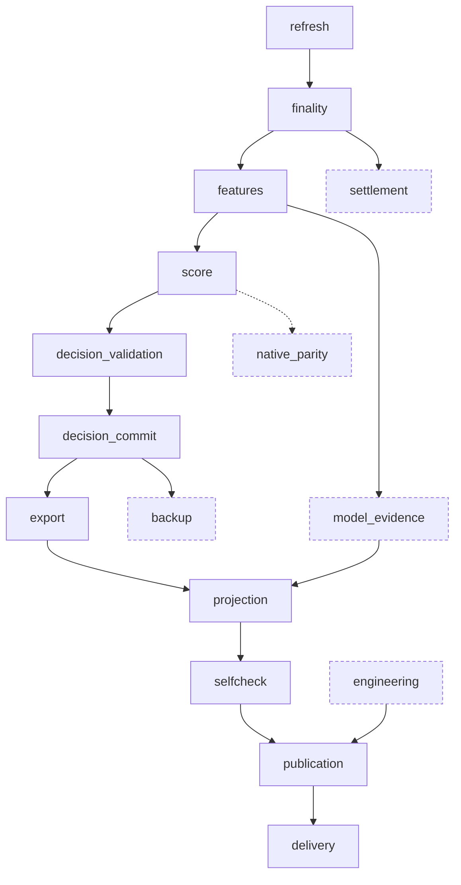
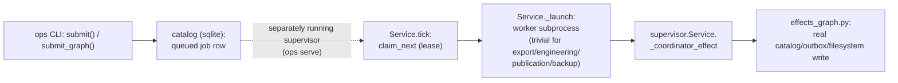
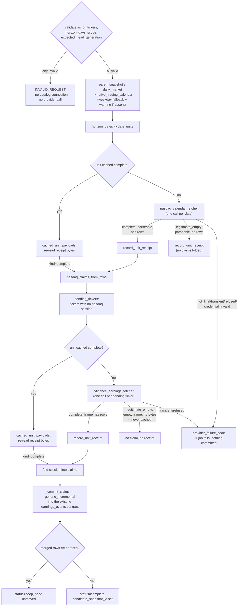
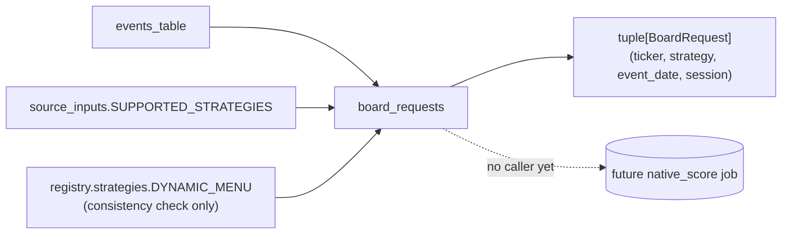

# `engine/v2/ops` — architecture

Layer 7.0 in the root `/ARCHITECTURE.md` layer table. Replaces the new
supervisor/catalog design, `dashboard/nightly.py` (as a job graph) and
`tools/bounded_run.py` (as an executor adapter). See the root doc for the
layer rules this package is checked against; this doc covers the detail
specific to this package.

## Purpose

Durable job submission, leases, retry history and dependencies; resource
admission and per-job CPU placement; the nightly job graph and its release
boundary. It does not decide research conclusions (`engine/v2/evaluation`)
and does not compute a score (`engine/v2/scoring`) — it only sequences and
persists the jobs that call into those packages.

This doc also covers `native_board_universe.py`: a pure, answer-free
enumerator that reproduces legacy `engine.score.score_calendar`'s event ×
strategy enumeration for the strategies native scoring supports, without
touching the legacy chain index or constructing a legacy `Scorer`. It has
no production caller yet — see "Dependencies" below.

## Primary contracts and public interfaces

The operator interface is the versioned command protocol
`engine/v2/ops/cli.py` exposes (`python3 -m engine.v2.ops <command>`),
derived directly from its `argparse` definitions:

- `init`, `doctor`, `health`
- `serve` — starts the supervisor loop
- `plan {nightly,experiment,training,promote}` — builds and saves a plan
  document; `training`/`promote` (P6 slice 5) take operator-only arguments
  (`--training-mode`, `--recipe`, `--state`, `--alpha`, `--cutoff`,
  `--strategy`, `--pairs`, `--ticker-chunk`, `--release-root`,
  `--release-id`) and are never part of the nightly DAG
- `submit --plan --idempotency-key`
- `rescore --request --native-inputs` — read-only, no provider pulls, no fitting
- `capture-inputs --as-of --tickers --context-tickers --year-start --year-end --source-root --output`
- `reconcile <job_id> --expected-attempt`
- `provider-account --account --remaining --live-reserve`
- `snapshot {plan-import,submit,promote,rollback}`
- `ledger {import-history,status,calibrate,book}`
- `decisions supersede --row-id --reason --from-json`
- `price-refresh --session [--dry-run]`
- `price-history capture --source-root --scope [--dry-run]`
- `get`/`logs`/`cancel`/`resume`/`explain <job_id>`

Internally: `nightly.py`'s `GRAPH`, `graph_order()`, `OPTIONAL`,
`NO_JOB_STAGES`, `build_nightly_plan`, `build_legacy_job_requests`,
`_stage_sequence` (see §"Diagrams" below); `supervisor.Service`/`serve`;
the coordinator-effect functions in `effects_graph.py`; `training.py`'s
`training_job_kind`/`promote_job_kind` (registered in `stages.py::_core_kinds`,
alongside the nightly stage kinds, not in
`supervisor._COORDINATOR_EFFECT_KINDS`), `training_plan`/`promote_plan` and
`run_training_worker`/`run_promote_worker`; `BoardRequest`/
`board_requests(as_of, horizon_days, tickers, events_table)`
(`native_board_universe.py`) — a pure key `(ticker, strategy, event_date,
session)` and the function that enumerates one per event × native-covered
strategy, plus one `DYN-SV` meta-request per event; `calendar_moves_jobs.py`'s
`computed_moves_job_kind` (registered in `stages.py::_core_kinds`, the same
ordinary-job-kind pattern as `training`/`promote_job_kind` above, not a
coordinator effect), `CalendarMovesParameters`/`calendar_moves_parameter_problems`/
`calendar_moves_job_spec`, and `run_computed_moves_worker` (dispatched by
`worker.py` for worker `"computed_moves_refresh"`) — see "Primary contracts"
below for what this adapts and "Outputs" for what is still missing before
this job kind has a real caller. `calendar_moves_jobs.py` registers only
`computed_moves_refresh`: `forward_calendar_refresh` has no `JobKind` yet —
its store's commit path has no attempt-fence check (issue #52), so
registering it as a supervised job (leases, retries, cancellation) would make
that gap newly reachable; the fence is now a prerequisite for registering
that kind.

A small number of natively-fetched data stores live directly in this
package rather than delegating computation to another v2 layer — like
`price-history capture` above, `forward_calendar_store.py` (spec s4c) is
one of these. It does NOT claim `RefreshCallback` compatibility itself:
`main`'s `RefreshParameters` (`incremental_data.py`) has no
`as_of`/`tickers` field, so a function shaped `(parameters, root)` could
never read them from it. `run_forward_calendar_refresh` is instead a
standalone runner with an explicit, fully keyword-only signature
(`catalog_path`, `objects_root`, `parent_snapshot_id`, `refresh_plan_hash`,
`as_of`, `tickers`, `horizon_days`, `scope`, `expected_head_generation`,
`expected_head_snapshot_id`, `nasdaq_fetcher`, `earnings_fetcher`) that
validates every one of its ten arguments before touching the catalog or a
provider, including `scope` (must be `"shadow"` or `"smoke"`),
`expected_head_generation` (non-negative) and `expected_head_snapshot_id`
(Part 3: `None` or a bounded 1..128-char string, matching
`parent_snapshot_id`'s own shape — the old code read it straight into
`_commit_claims`/`generic_incremental.commit_generic_table_candidate`
unchecked); `tickers=()` is valid and means the whole market (see "Failure
semantics" below). This runner has no job-layer bridge yet: an earlier draft
of this PR (Part 3) added one (`run_forward_calendar_worker`, a
`calendar_moves_jobs.py` closure decoding a job's `CalendarMovesParameters`
and wrapping this runner in a `RefreshCallback`-shaped adapter), but it was
pulled before merge — issue #52 found that registering the kind makes an
existing gap (no attempt-fence check in this runner's own commit path)
newly reachable as a supervised job, and the fence must land first. Its pure
helpers (`horizon_dates`, `date_units`, `ticker_units`,
`plan_forward_calendar`, `resolve_session_claims`, `nasdaq_rows_from_payload`,
`nasdaq_claims_from_rows`, `pending_tickers`) are unit-testable without a
catalog or a network. Today this runner has no production caller, only its
own test module.

## Inputs

- Plan documents built by `plans.py::nightly_plan`/`build_nightly_plan`
  (pinned decision clock, read set, session).
- The operations catalog (sqlite, via `catalog.py`'s `transaction`) — job
  rows, leases, retry history, provider-account budgets.
- The artifact store (`ArtifactStore`, filesystem-backed) for refresh plans
  and other bound inputs.
- Legacy filesystem reads (px CSV tree, yfinance fetch cache) through the
  declared adapter, for `price-history capture` and `price-refresh`.
- `computed_moves_store.py`'s `run_computed_moves_refresh` (`parameters,
  root, *, as_of, fetcher=None`; not itself a bare `RefreshCallback` since
  `as_of` cannot be pre-bound at module-import time — it varies per
  dispatch. `calendar_moves_jobs.run_computed_moves_worker` (Part 3) adapts
  it: it decodes the job's `CalendarMovesParameters`, then calls
  `incremental_data._load_computed_moves_refresh_callback(params.as_of)` to
  get a closure with `as_of` and the injected `yfinance_history_fetcher`
  pre-bound — THAT closure is the `(parameters, root)`-shaped
  `RefreshCallback`; see "Outputs" below for what still has no nightly
  caller): reads `earnings_events`/`daily_market` off the pinned parent snapshot
  through `Repository`, exactly once each per run (`_scan_once`), and calls
  an injected yfinance history fetcher (never `legacy_adapter.new_fetcher`)
  per target ticker. Target tickers are the ORATS-confirmed-session rule
  `target_tickers_from_snapshot` re-implements from the legacy pull, read
  through the v2 snapshot instead of the legacy store.
- `forward_calendar_store.py`'s own inputs: the pinned parent snapshot's
  `daily_market` sessions (one scan, grouped by ticker, fed to
  `engine.v2.data.computed_moves.native_trading_calendar` for the horizon
  calendar — a snapshot without a `daily_market` session falls back to plain
  weekdays); `run_forward_calendar_refresh`'s own explicit keyword arguments
  (`catalog_path`, `objects_root`, `parent_snapshot_id`, `refresh_plan_hash`,
  `as_of`, `tickers`, `horizon_days`, `scope`, `expected_head_generation`,
  `expected_head_snapshot_id`) — there is no staged input-document file for
  this runner: it has no `JobKind` (see "Primary contracts" above and issue
  #52), so there is no admitted job to stage one from, and
  `refresh_staging.REFRESH_INPUT_DOCUMENT_NAMES` has no
  `"forward_calendar_refresh"` entry; and the two injected network edges,
  `providers.nasdaq_calendar.
  nasdaq_calendar_fetcher` (one call per discovery date) and
  `providers.yfinance_edge.yfinance_earnings_fetcher` (one call per ticker
  still missing a session after the Nasdaq pass).
- `board_requests`: an already-loaded events table (`ticker`, `event_date`,
  `session` columns — e.g. `engine.data.store`'s `earnings_events` Tier-2
  table's shape, where `event_date` is schema-typed `datetime64[ns]`), an
  `as_of` date, a horizon in days, and an optional ticker filter. It
  performs no I/O itself — the caller loads the table. `event_date` may
  also be given as ISO 8601 strings (date-only or full timestamp, mixed
  within one column); numeric values are rejected rather than read as
  epoch-relative offsets, whether the column's dtype is numeric or a mixed
  `object` column holding Python `int`/`float` elements (see "Failure
  semantics"). `as_of` must be a timezone-naive `datetime`/
  `pandas.Timestamp` (`None`, `NaT`, and a timezone-aware value are
  refused); `horizon_days` must be a non-negative `int` (`bool` is refused
  despite being an `int` subtype in Python) — see "Failure semantics".

## Outputs

- `StageReceipt`/`NightlyReceipt` documents recording each stage's status,
  input/output hash and (for a failure) an error code.
- Job records in the catalog (leases, attempts, outbox rows).
- `computed_moves_store.py` commits one new snapshot generation per run,
  carrying every other table forward unchanged alongside a fresh
  `computed_moves` table version (`engine/v2/data/computed_moves_table.py`;
  one fragment per ticker, via the same immutable-object/manifest/atomic-head
  commit primitives `price_history_store` uses, never `generic_incremental` —
  `computed_moves` has no manifest in the parent snapshot the way an
  existing contracted table does). Alongside the snapshot commit it inserts
  one append-only row per attempted ticker into `data_computed_moves_captures`
  (schema v12, `engine/v2/data/schema.py`) — a capture already logged (same
  content-derived `capture_id`) is never re-logged, so a rerun that rebuilds
  a generation from durable receipts does not duplicate the log.
- Coordinator-side effects for every kind in
  `supervisor._COORDINATOR_EFFECT_KINDS` (14 kinds, cited by name rather
  than copied here since the list can drift: `legacy_decisions`,
  `legacy_settlement`, `legacy_render`, `legacy_selfcheck`,
  `decision_evidence`, `ledger_export`, `engineering_gate`, `publication`,
  `backup`, `snapshot_import`, `legacy_rebuild_candidate`,
  `legacy_materialize`, `experiment`, `decisions_supersede`) —
  catalog/outbox/filesystem writes dispatched from
  `supervisor.Service._coordinator_effect`; the worker subprocess for each
  of these kinds is trivial, the real write happens on the coordinator
  side. That dispatch calls into several modules, not only
  `effects_graph.py`: `effects_graph.py` supplies `backup_effect`,
  `engineering_gate_effect`, `experiment_effect`, `ledger_export_effect`
  and `publication_effect` (5 of the 14); `decision_commit.py` supplies
  `commit_decisions_in_transaction` (`legacy_decisions`, called from a
  commit closure defined directly in `supervisor.py`, not in
  `effects_graph.py`) and `commit_supersede` (`decisions_supersede`);
  `snapshot_promotion.py` supplies `legacy_rebuild_candidate_effect` and
  `snapshot_import_effect`; `snapshot_stages.py` supplies
  `materialize_effect` (`legacy_materialize`); `legacy_settlement` and
  `decision_evidence` are handled by `supervisor.py`'s own
  `_settlement_effect`/`_verify_decision_evidence`. "All real state change
  happens in `effects_graph.py`" is not accurate — treat it as one of
  several coordinator-effect implementation modules, not the only one.
- Private shadow artifacts only: `build_nightly_plan` refuses any `mode`
  other than `"shadow"` (`INVALID_REQUEST`), so this package's nightly
  output never reaches the legacy board.
- `forward_calendar_store.run_forward_calendar_refresh` commits revisions
  into the EXISTING `earnings_events` contract through
  `engine.v2.data.generic_incremental` — never
  `engine.data.rebuild.rebuild` — and returns a `RefreshCallbackResult`
  (`status` one of `complete`/`noop` — invalid input or an unconfigured
  fetcher pair raises `OpsError` instead of returning a `"failed"` result;
  `completed_ids`, `coverage_advanced`, and `warnings` carrying any
  weekday-calendar-fallback degradation as evidence rather than only a log
  line). A run whose merged claims equal the parent snapshot's own rows
  resolves back to the parent (the commit layer's own equality check
  decides this, never key presence in the parent), so it reports `noop`
  rather than a spurious `complete`.
- `training`/`models_promote` are ordinary `_core_kinds()` job kinds, not
  `supervisor._COORDINATOR_EFFECT_KINDS` members: the worker subprocess does
  the real write itself. `run_training_worker` (worker `"training"`) calls
  one of `tools/phase5_training_job.py`'s four job functions and writes
  `training_result.json` (`training_job_result.v1.0`); `run_promote_worker`
  (worker `"models_promote"`) calls `engine.v2.models.deployment.promote`'s
  release-store pointer swap and writes `pointer_state.json`
  (`promote_pointer_state.v1.0`). Neither ever runs inside the nightly DAG —
  both are submitted by an operator's own `ops plan training|promote` +
  `ops submit`.
- `board_requests`: a tuple of `BoardRequest`, ordered by
  `(event_date, ticker)` outer, native-covered strategies alphabetically
  then `DYN-SV` last inner. No side effect, no write.

**`computed_moves_refresh` is registered as an ordinary job kind (Part 3),
but still has no nightly caller; `forward_calendar_refresh` has no `JobKind`
at all.** `stages.py::_core_kinds` now includes
`calendar_moves_jobs.computed_moves_job_kind()`, and `worker.py::dispatch`
routes worker `"computed_moves_refresh"` to
`calendar_moves_jobs.run_computed_moves_worker`. Neither `nightly.py`'s
`GRAPH`/`OPTIONAL` nor any coordinator effect calls this job kind yet — that
DAG wiring is a later change (spec s4c Part 4), which this doc's "Diagrams"
section would then need to reflect; today it is reachable only through the
general job-submission pipeline (`ops submit` with a raw `JobSpec`), same as
`training`/`models_promote` above. `forward_calendar_refresh` was registered
in an earlier draft of this PR too, but that registration (and its
`run_forward_calendar_worker` job-layer adapter) was pulled before merge:
see "Primary contracts" above and issue #52 (no attempt-fence check in
`forward_calendar_store`'s commit path — a gap the job registration would
have made newly reachable as a supervised, leased, retried, cancellable
attempt). `run_computed_moves_refresh` is also still not itself a bare
`engine.v2.ops.incremental_data.RefreshCallback`: that protocol's
`parameters: RefreshParameters` has no `as_of` field on `main`, and `as_of`
varies per job dispatch (a session date) so it cannot be pre-bound the way
the fetcher is — it is an explicit, validated, required keyword instead.
`run_computed_moves_worker` bridges this: it decodes the job's own
`CalendarMovesParameters` (which DOES carry `as_of`) and calls
`incremental_data._load_computed_moves_refresh_callback(as_of)` to build the
closure that actually satisfies the protocol, then validates the closure's
`RefreshCallbackResult` the same way `incremental_data.run_refresh_worker`
does for `incremental_refresh` (`validate_refresh_result_document`,
`_validate_refresh_binding`, `_validate_refresh_status` — reused directly,
not reimplemented — plus `calendar_moves_jobs._validate_calendar_moves_coverage`,
a set-based variant of `incremental_data._validate_refresh_coverage` written
for this job kind specifically: `computed_moves_store` never promises
`completed_ids` in the caller's `expected_ids` order, so the shared
ordered-tuple comparison would fail an already-committed, fully-covered
result on order alone) before writing `computed_moves_refresh_result.json`
into the attempt's staging root itself: unlike `run_daily_market_refresh`,
`run_computed_moves_refresh` writes no result artifact of its own, so the
ops-layer worker writes it after validating, rather than writing it first
and reading it back for an integrity cross-check the way
`incremental_data._validate_callback_result` does. **The coverage
denominator (Round 3 fix, Opus finding 2):** `completed_ids` on a
`"complete"`/`"noop"` result is `tuple(sorted(targets))` — the FULL
whole-market universe `target_tickers_from_snapshot` derives for the pinned
`(parent_snapshot_id, as_of, all_scoreable, since)` — never only the
tickers that happened to get a written fragment. A target ticker this run
legitimately finds has no committable rows (`_capture_targets`'s "too_few"
outcome — a real business finding, not a failure) still counts as covered:
the run genuinely finished considering it. A caller building `expected_ids`
before submission must derive it the same way, from
`target_tickers_from_snapshot` against the same pinned inputs — there is no
`tickers` field on `CalendarMovesParameters` to disagree with (removed, see
"Primary contracts" above and "Failure semantics" below): `computed_moves_refresh`
has never read one, unlike the now-removed `forward_calendar_refresh` job
wrapper, whose own now-moot `tickers=()` "whole market" denominator this
fix's design deliberately does not reuse.
Every field of the staged input document, and
`parameters`' own `parent_snapshot_id`/`refresh_plan_hash`, are validated up
front (`_validate_input_document`, split into `_validate_document_identity`/
`_validate_document_head`/`_validate_document_attempt`/
`_validate_document_selection`/`_validate_document_matches_job`, plus
`_validate_job_identity`, to stay under the complexity budget) before the
sqlite connection even opens: unknown document keys; wrong types;
`catalog_path` not already an existing file (the connection then opens on a
`mode=rw` URI too, so a TOCTOU removal between the check and the connect
raises instead of silently creating an empty database); `objects_root` not an
existing directory; `parent_snapshot_id`/`refresh_plan_hash` not matching the
same bounded-string/sha256-hex shapes `incremental_data.RefreshParameters`
already enforces for these fields (mirrored, not imported — `forward_calendar_store.py`
(#40, merged) carries the same mirrored copies: the two stores were built as
independent, parallel PRs, so neither imports the other's private checks);
`expected_head_snapshot_id`/`fence` failing their own
format checks (a bounded string; an int >= 1); and any document value that
disagrees with the job's own `RefreshParameters`
(`catalog_path`/`objects_root`/`scope`/`expected_head_generation`) — all
refused, never coerced. `scope` is checked against
`refresh_job_kind().namespaces` — the sibling `incremental_refresh` job
kind's own `{"shadow", "smoke"}` — since this store has no `JobKind` of its
own yet to carry that allowlist. A STALE `expected_head_snapshot_id`/
`expected_head_generation` (one that no longer matches the catalog's actual
head) is deliberately NOT checked before fetching: it is only caught at
commit time, inside `_commit_generation`/`data_catalog.commit_snapshot`, as
`SNAPSHOT_CONFLICT` — an optimistic design, matching #40. A stale head costs
only the fetches this run already made; their complete receipts are staged
durably and reused as cache on the next attempt, not repeated.
`tests/test_v2_ops_computed_moves_store.py` covers `_capture_id_for`'s
stable, non-wall-clock, non-colliding capture identity, `_fence_check_for`'s
real-`verify_fence` signature and its still-active production lease-expiry
check, `as_of`'s pre-I/O validation, the input document's own field-by-field
validation, and `run_computed_moves_refresh` end to end (one complete unit, a
same-`as_of` rerun that re-fetches nothing AND now genuinely no-ops even at a
different wall-clock time, and a provider failure mapped to its typed code).
Fixed (was tracked as
[#41](https://github.com/yshewchuk/investment-validation/issues/41)): every
committed row's `computed_at` is now derived from `as_of`, not the run's own
wall clock, so a same-`as_of` rerun over identical inputs produces
byte-identical fragment content (same `fragment_id`, same object content
hash) and the commit resolves back to the parent snapshot instead of a fresh
generation.

## Dependencies

Imports observed in this package's own source, top-level and lazy
(mechanically walked by `.oc_logs/import_scan.py`, an `ast` walk over
every `.py` file that reports every `engine.*` import at any depth,
including inside function bodies):

- Top-level: `engine.v2.contracts` (0.0), `engine.v2.foundation` (0.5),
  `engine.v2.data` (1.0), `engine.v2.registry` (3.0, `native_board_universe.py`'s
  `DYNAMIC_MENU` import), `engine.v2.scoring` (5.0, `native_board_universe.py`'s
  `SUPPORTED_STRATEGIES` import), `engine.v2.ledger` (6.0), `engine.v2.parity`
  (6.5) — all strictly below this package's own layer (7.0), per the root
  doc's §2 rule. `forward_calendar_store.py` adds one new `engine.v2.data`
  submodule to this package's dependency surface,
  `engine.v2.data.computed_moves` (`native_trading_calendar`, layer 1.0),
  alongside its existing top-level use of `generic_incremental`,
  `incremental_tables` and `repository.Repository`.
- Lazy, function-local: `engine.v2.contracts` also appears lazily
  (`cli.py::_decisions_supersede`, `cli.py::rescore_command`,
  `cli.py::whatif_action`); `engine.v2.data`/`engine.v2.foundation`/
  `engine.v2.ledger` also have lazy call sites (`cli.py`, `bootstrap.py`)
  in addition to their top-level ones; `unit_receipts.py` adds further
  lazy `engine.v2.data` call sites of its own — `record_unit_receipt` and
  `cached_unit_payloads` each import `engine.v2.data.incremental`
  (`cache_raw_receipt`/`RawPayload`, and `load_raw_receipt`), and
  `cached_unit_outcomes` imports both `engine.v2.data.incremental`'s
  `_jsonable` and `engine.v2.foundation`'s `content_hash`;
  `engine.v2.models` is lazy-only
  (`cli.py::_restored_model_block` — `payoff_artifact`,
  `cli.py::rescore_command` — `no_fit`, `worker.py::_dispatch_adhoc_rescore`
  — `no_fit`, both layer 3.5); `engine.v2.domain.generation` is lazy-only
  (`cli.py::_load_native_score_inputs` — `Geometry`/`Pricing`, layer 2.0).
  `engine.v2.scoring` is no longer lazy-only: alongside its existing lazy
  call sites (`cli.py::_load_native_score_inputs` — `stages`,
  `cli.py::rescore_command` and `worker.py::_dispatch_adhoc_rescore` —
  `application.score_one`, backing `rescore`/ad-hoc-rescore's read-only
  re-score path, root doc's CLI list `rescore --request --native-inputs`),
  `native_board_universe.py` now imports `engine.v2.scoring.source_inputs`
  at top level — still strictly below layer 7.0.
  `native_board_universe.py` itself has no lazy imports: both of its
  `engine.v2.*` imports (`registry`, `scoring`) are top-level, alongside
  its top-level `engine.v2.ops.errors` import.

It does not import its layer-7.0 peers `engine.v2.serving` or
`engine.v2.research`, or anything above it (`engine.v2.diagnosis` at 7.5,
`engine.v2.dashboard` at 8.0), lazily or otherwise. Legacy reads go
through the one declared adapter module, `engine/v2/ops/legacy_adapter.py`
(`checks/legacy_adapters.json`) — its own further legacy `engine.*` lazy
imports (`engine.calendar`, `engine.data*`, `engine.dashboard`,
`engine.evaluate`, `engine.features`, …) are exactly the adapter's job and
are not layer-checked v2 dependencies.

`native_board_universe.py` deliberately does not depend on `engine.score`,
`engine.structures`, `engine.replay`, or `engine.fills`: `engine.score`'s
own top-level import block pulls in `engine.replay` → `engine.fills` (the
legacy chain index and fill model), and `engine.structures`'s own
top-level import block pulls in `engine.fills` directly — importing
either, even solely to read a registry key set for a read-only
comparison, would violate the isolation invariant at import time, before
any call happens. It also performs no read-only consistency check against
`engine.score.DISABLED_STRATEGIES` (the legacy scorer's own
strategy-refusal set, unextracted, unexported): any v2 → legacy import
must be declared in `checks/legacy_adapters.json`, whose adapter count may
only shrink, and `engine.v2.ops` already has its one allowed adapter
module (`legacy_adapter.py`, above). `SUPPORTED_STRATEGIES` already
excludes both disabled strategies by construction (it comes from native's
own input builder, which has no entry for CAL-P/CND-P), so no such check
is needed — this module reads the native-covered set from
`engine.v2.scoring.source_inputs` only, and checks it against
`engine.v2.registry.strategies.DYNAMIC_MENU` (a subset assertion paid
once at import time, no I/O, no legacy dependency). `SUPPORTED_STRATEGIES`
is `engine.v2.scoring.source_inputs`'s public alias for its own
pre-existing internal strategy set (`_STRATEGY_FORECAST_OUTPUTS`'s key
set: `STR-THRU`, `STR-RUNUP`, and the seven `DYNAMIC_MENU` members) — the
same value that module already computed for its own input-building use;
exporting it added a name, not a behavior, and gave this module the one
fact it needs (which strategies native can build scoring inputs for)
without duplicating that set here.

Callers: `engine.v2.dashboard._server`'s lazy, documented import of
`cli.refresh_action` (root doc §4); the `tools/v2_*.py` operator CLIs
(direct import — permitted, since `tools/*` is not a layered production
package per the root doc's §1); `experiments/*` runners submitting plans;
`checks/rearchitecture_*.py` verification scripts (read-only inspection);
and the `tests/test_v2_ops_*.py` suite. No layered `engine/v2/**` package
above layer 7.0 imports this package, and no legacy `engine/**` module
does either — none except the documented lazy `engine.v2.dashboard._server`
caller of `cli.refresh_action` noted above. `board_requests` has no
production caller today: it is a library function exercised only by its
own tests (`tests/test_v2_ops_native_board_universe.py`), part of the
`tests/test_v2_ops_*.py` suite above. It becomes reachable once a later
stage adds a `native_score` job kind to the nightly graph and calls it as
that job's first step — out of scope for this change.

## External systems and libraries

`sqlite3` (the operations catalog); the local filesystem (artifact store,
snapshot roots, legacy px/fetch-cache trees read through the adapter); the
market-data provider accounts this package's `provider-account` command
budgets against (`engine/v2/ops/providers/`) — credentials themselves are
never held here, only remaining-call/reserve counts. Three accounts exist
today: `orats-daily-market` (keyed, reads `ORATS_API_KEY`); and, as of spec
s4c, `nasdaq` and `yfinance` — both unmetered and keyless (their
`PROVIDER_CREDENTIAL_VARIABLES` tuples are empty), but still
operator-provisioned budget rows so the shared scheduler reserves against
them like any keyed account. `providers/nasdaq_calendar.py` calls Nasdaq's
public `api.nasdaq.com/api/calendar/earnings` endpoint (one date per call,
a plain keyless HTTPS GET with a browser user-agent — the endpoint refuses
the default client UA with a 403); `providers/yfinance_edge.py` wraps the
third-party `yfinance` library (imported lazily, only inside the default
callables, so importing the module touches no network) — one
`Ticker.history`/`Ticker.get_earnings_dates` call per ticker, never a
direct HTTP client of its own.

`native_board_universe.py` adds no new external system: `pandas` (already
a transitive dependency of this package) is its main library, for the
events-table filter and the `BoardRequest.event_date` type; it also imports
`numpy` (an existing transitive dependency of `pandas`, now imported
directly) and the standard-library `numbers` module, both used only for the
`isinstance(v, (numbers.Number, np.number))` scalar-type check that refuses
a bare number wherever a date is expected (a numpy scalar such as
`np.int64` in an `object`-dtype column, or as `as_of` itself) — no file,
network, or database access.

## Failure semantics

- **Missing input** — a stage with an unmet dependency, or a job whose
  bound input artifact is absent, is refused with a typed `Problem`/error
  code (root doc §5), never defaulted. `board_requests` follows the same
  rule for its own input: `events_table` missing `ticker`, `event_date`,
  or `session`; holding more than one column under any of those three
  labels (checked before any column is read by label); holding an
  `event_date` column of numeric dtype, or an `object`-dtype `event_date`
  column holding any `numbers.Number`/`np.number` element — Python
  `int`/`float`/`bool` or a numpy scalar such as `np.int64`/`np.float64`
  (checked per element, before any parsing is attempted — never read as an
  epoch-relative offset, e.g. `20260201`, regardless of whether pandas
  inferred a numeric dtype or left the column as `object`, and regardless
  of whether the numeric value is a Python or numpy type); holding an `event_date` column
  that otherwise cannot be parsed as timestamps (e.g. an unparseable
  string); holding an `event_date` value that parses to null (`NaT`, e.g.
  a `None`/`NaN` cell); or holding a timezone-aware `event_date` column,
  whether the column arrives already `datetime64` with a timezone or as a
  tz-aware ISO 8601 string (e.g. `"...+00:00"`) — this function only
  supports timezone-naive event dates, matching `as_of` — each is a
  whole-call typed refusal (`OpsError`, code `INVALID_REQUEST`), raised
  before any row is read — never a partial or silently smaller result.
  `event_date` values already typed as timezone-naive `datetime64`, or
  given as timezone-naive ISO 8601 strings (date-only and full-timestamp
  forms may be mixed within one column), are accepted; a timezone-aware
  `event_date` is refused in every representation — there is no
  ISO-string exception to the timezone-naive rule.
  `as_of` must be a timezone-naive `datetime`/`pandas.Timestamp`: `None`,
  `NaT`, a timezone-aware value, and a bare number (`bool`, Python
  `int`/`float`, or a numpy scalar such as `np.int64`) are each refused
  (`OpsError`, `INVALID_REQUEST`) — `pandas.Timestamp` reads a bare number
  as epoch time, not a calendar date (`pandas.Timestamp(20260130)` is
  `1970-01-01 00:00:00.020260130`, not 2026-01-30), so this is a real,
  silent-corruption risk, not a defensive-only check. `horizon_days` must
  be a non-negative `int`; `bool` is refused even though it is an `int`
  subtype in Python (so `True`/`False` cannot silently pass as `1`/`0`),
  and any other type or a negative value is refused the same way.
  `forward_calendar_store.py`'s `run_forward_calendar_refresh` validates
  every one of its nine arguments before opening the catalog connection,
  constructing the artifact store, or making a provider call: each raises
  `INVALID_REQUEST` (root doc §5's typed-`Problem` shape) the moment it is
  missing or malformed, never a bare
  `AttributeError`/`KeyError`/`sqlite3.OperationalError` reached deeper in
  the function. `catalog_path` must already exist as a file — `sqlite3.connect`
  is never allowed to silently create one that does not, which it would by
  default. `objects_root` must already exist as a directory.
  `parent_snapshot_id` must be a bounded nonempty string and `refresh_plan_hash`
  a `sha256:`-prefixed 32-byte hex digest, matching (not importing — that name
  is private) `incremental_data.RefreshParameters`'s own rules for these same
  two fields (`_refresh_identity_problems`/`_is_hash`). `as_of` refuses `None`,
  a bare number or `bool` (which would misread as epoch time), an unparseable
  value, `NaT`, and a timezone-aware value — mirroring
  `native_board_universe._validated_as_of` (PR #16, not yet on `main`, so
  mirrored rather than imported). `tickers` refuses a bare `str` (a common
  caller mistake that `set()`/iteration would otherwise silently accept
  character-by-character), any other non-iterable, and any element that is
  not a non-empty `str` — but `tickers=()` is a valid, meaningful request: it
  means the whole market (the nightly refreshes everything), since an empty
  `wanted` set never filters a Nasdaq date's claimed rows
  (`nasdaq_claims_from_rows`); the yfinance fan-out stays bounded by that
  Nasdaq result for the horizon either way (`pending_tickers`), not by how
  many tickers were requested. `horizon_days` refuses a non-`int` (a `bool`
  is explicitly excluded even though it is an `int` subclass in Python) and
  anything outside `[1, MAX_HORIZON_DAYS]` (366 — one year plus a leap day;
  no existing forward-calendar or board-universe horizon constant already
  bounds this, so this is a new, deliberately generous ceiling, not a tuned
  limit). `scope` must be one of the two commit-destination namespaces v2
  ops ever authorizes for a job like this one, `{"shadow", "smoke"}` — the
  same pair every `JobKind` in `stages.py`/`cli.py`/
  `incremental_data.refresh_job_kind` already registers as
  `namespaces=frozenset({"shadow", "smoke"})` (reused here as a local
  constant, since no single module exports it by name).
  `expected_head_generation` must be a non-negative `int` — the old code read
  `scope`/`expected_head_generation` via `document["scope"]`/
  `document["expected_head_generation"]`, so a missing key surfaced as a
  `KeyError` partway through the run instead of a refusal before any I/O.
  An unconfigured fetcher pair (`nasdaq_fetcher`/`earnings_fetcher` not
  passed) is the same typed-`Problem` shape: `RESOURCE_UNAVAILABLE`. A
  parent snapshot with no `daily_market` session is not a missing-input
  refusal at all — it is the documented weekday-calendar fallback, recorded
  as a result `warning` (see "Diagrams" below for its narrowed
  `except ValueError`, which now wraps only the one call
  (`native_trading_calendar`) whose `ValueError` that fallback is
  documented to catch, not the calendar-scan/arithmetic around it).
  `expected_head_snapshot_id` (Part 3) must be `None` or a bounded
  1..128-char string, the same shape `parent_snapshot_id` already has —
  previously unchecked, so a malformed value reached
  `generic_incremental.commit_generic_table_candidate` unexamined instead of
  being refused before the catalog connection even opens
  (`tests/test_v2_ops_forward_calendar_store.py::test_expected_head_snapshot_id_empty_is_refused_before_any_io`/
  `::test_expected_head_snapshot_id_too_long_is_refused_before_any_io`).
- **`calendar_moves_jobs.py`'s own job-layer validation (Part 3, hardened
  Round 3 — Opus finding 1)** — `CalendarMovesParameters` is a strict
  dataclass (`engine.v2.foundation.from_document`): an unknown field, a
  wrong type, or `bool` where an `int` is declared (so `bool("false")`-style
  coercion bugs cannot occur — see root doc's typed-document contract) is
  refused as `DocumentError` before `_decode` ever returns, which
  `calendar_moves_jobs._decode` maps to `INVALID_REQUEST` (mirroring
  `incremental_data.run_refresh_worker`'s own `RefreshParameters` decode).
  `calendar_moves_parameter_problems` (the `JobKind.validate` callback, run
  at submission time before a job is admitted) now reuses
  `incremental_data`'s own submit-time checks directly, through four shared
  helpers (`_expected_ids_problems`, `_plan_binding_problems`,
  `_bounded_nonempty_problems`, `_head_binding_problems` — refactored out of
  `incremental_data.refresh_parameter_problems`'s own pieces, with no
  behaviour change for `incremental_refresh`) rather than a hand-copied,
  narrower check: `expected_ids` (1..4096 entries, unique, bounded); the
  plan binding (`parent_snapshot_id`/`refresh_plan_hash`/`provider_calls`)
  is now ALWAYS validated, never only when a binding field happens to be
  supplied — a round-2 job with no binding at all used to be admitted only
  to fail inside the worker; `catalog_path`/`objects_root`/`scope` bounded
  nonempty; `expected_head_generation`/`expected_head_snapshot_id` shape;
  provider-budget/call-count consistency, reading `job.provider_budget_ref`
  (previously accepted but never read); and `COMPUTED_MOVES_RESULT_PATH` may
  never be bound as this job's own input (the worker writes it itself; the
  shared helper takes the result path as a parameter precisely so each
  refresh-family kind checks against its OWN output file, not
  `incremental_refresh`'s). This really is now "the same layering"
  `incremental_data.RefreshParameters`/`refresh_parameter_problems` has
  relative to `run_refresh_worker` — a previous draft of this doc claimed
  this while the code still deferred `catalog_path`/`objects_root`/`scope`
  entirely to the stores, which was false: `refresh_parameter_problems`
  has always validated those fields at submission time too (`_refresh_staging_identity_problems`).
  `computed_moves_store._validate_input_document`'s own revalidation of the
  same fields (below) is a second, defense-in-depth layer, not the only
  place they are checked — again, the same relationship
  `run_refresh_worker` has to its own sibling check. `tickers`/`horizon_days`/
  `table_name` are no longer fields on `CalendarMovesParameters` at all
  (Round 3): the first two were read only by the now-removed
  `forward_calendar_refresh` job wrapper, and `table_name` was never read by
  either store — there is nothing left to validate-or-refuse for them, so
  they were deleted rather than defended.
- **Training/promote refusal** — `run_training_worker` maps every refusal
  the underlying tool can raise to a typed `OpsError` rather than an
  untyped `WORKER_FAILED`: `TrainingRefused` -> `CHECKPOINT_INCOMPATIBLE`,
  `RuntimeFitForbidden` -> `VALIDATION_FAILED`, any other `SystemExit` ->
  `_tool_failure`'s mapping. `run_promote_worker` maps
  `deployment.DeploymentError` (including an unstaged `release_id`) to
  `VALIDATION_FAILED`. A `training` plan with no bound legacy input manifest
  carries `blocked_prerequisites` and can never be submitted, exactly like a
  manifest-less nightly plan. A recipe job's `pairs_path`
  (`ops plan training --pairs`) is validated twice: a malformed one
  (absolute, containing `..`) fails `training_parameter_problems` at plan
  time (`INVALID_REQUEST`); at execution it must additionally resolve, as a
  plain relative path, beneath the attempt's staged legacy root (populated
  only from the plan's pinned manifest), or the worker refuses
  `INPUT_CHANGED` — a recipe can only ever read a pairs file that is one of
  the job's pinned legacy inputs, never an arbitrary filesystem path.
  `training_parameter_problems` also refuses, before submission, a
  non-positive/non-int `ticker_chunk`, a non-finite or negative `alpha`, a
  `cutoffs` entry that is not a valid ISO date, and a `pairs_path` supplied to
  any mode other than `recipe` — each `INVALID_REQUEST`, never a value that
  reaches the worker unexamined.
  `models_promote`'s `store_domains` declares a
  write lease on the single `deployment_pointer` domain, which serializes
  every `models_promote` claim globally against every other one regardless
  of the `release_root` each names — `deployment.promote`'s
  read-current-pointer/append-history swap has no locking of its own.
- **Cache** — one part of this package's own state *is* a cache, read
  through the operations catalog's own `data_raw_receipts` table (the same
  connection this package's stages already use for `data_snapshot_heads`
  and other catalog rows): `unit_receipts.py`'s `cached_unit_outcomes`/
  `cached_unit_payloads` and `nightly.py`'s `_native_cached_outcome` each
  look up the newest receipt for a `(source, endpoint, request_hash)` key
  (`computed_moves_store.py` is one such caller — its per-ticker
  `RefreshUnit`s key off `computed_moves:<ticker>:<as_of>`, and a unit
  already backed by a durable `complete` receipt is re-parsed from that
  receipt rather than re-fetched, so a same-session retry rebuilds every
  unit's fragment from the fresh fetches plus the cached receipts, never a
  live-and-cached mix that a clean single run could not also produce)
  and reuse it only when its recorded `response_kind` is `complete` — a
  `legitimate_empty` payload is always re-verified against the live source
  on the next run, and a `not_final`/`transient`/`refused` response is
  never written to the cache at all (`record_unit_receipt` refuses to
  store one). `forward_calendar_store.py`'s `_cached_nasdaq`/`_cached_yfinance`
  are thin wrappers over `cached_unit_outcomes` for the `nasdaq`/`yfinance`
  source+endpoint pairs; its `_fetch_nasdaq`/`_fetch_yfinance` then re-read
  the wanted units' bytes through `cached_unit_payloads` before falling back
  to a fresh fetch, so a same-session retry rebuilds every unit's claims —
  fresh and cache-hit alike — exactly as a clean single run would.
  `unit_receipts.py` breaks a `received_at` tie by `rowid` (the table's own
  append-only insertion order); `nightly.py`'s older, narrower lookup does
  not carry that tie-break. On the acquisition side, a provider response
  that cannot be used maps to one of four failure codes via
  `provider_failure_code` — two registered retryable (`checks`/
  `contracts/operations.py`'s `("source", True)`): `not_final` (Nasdaq's
  404, a date not yet published) to `SOURCE_NOT_FINAL` and `transient`
  (network errors, 429, 5xx) to `TRANSIENT_SOURCE`; and two non-retryable
  (`("source", False)`): `refused` (an unparseable body or other non-auth
  4xx) to `SOURCE_INVALID` and `credential_invalid` (the provider's own
  401/403) to `CREDENTIAL_INVALID`. A mixed batch of unit kinds reports the
  worst code among them, ranked `TRANSIENT_SOURCE` <
  `SOURCE_NOT_FINAL` < `SOURCE_INVALID` < `CREDENTIAL_INVALID` — retryable
  or not, the job still fails on the first non-`complete`/`legitimate_empty`
  unit rather than committing a partial claim set. Everything else about
  this package's own job/lease/history state, including the
  `training`/`models_promote` job kinds' own state, is not a cache, and the
  catalog remains the durable record of it. `board_requests` holds no
  cache of its own either way; it reads only the table its caller passes
  in.
- **Retry** — `lifecycle.py`'s `attempt_receipts`/`request_cancel` and
  `recovery.py`'s `reconcile_attempt`/`prove_ownership_gone` govern retry
  and ownership recovery after a crash; a stale lease is reclaimed only
  after ownership is proven gone, never assumed. `board_requests` is pure
  and deterministic for a given table snapshot; re-execution is safe,
  nothing to undo.
- **Transaction** — catalog writes go through `catalog.py`'s `transaction`
  context manager; coordinator effects must make their filesystem writes
  replay-safe and idempotent rather than atomic with the DB commit (root
  doc §6, the CSV/transaction anti-pattern). One exception is visible in
  practice: `experiment_effect`'s `_commit` appends the "ran" row to
  `experiments/LEDGER.csv` from inside `commit_attempt`'s transaction, so a
  later failure in that same transaction (and its DB rollback) can leave
  the CSV row in place while the DB records no committed attempt. Recovery
  is by replay, not atomicity: a retry reuses the same run identity, and
  `_ran_row_exists` skips appending a second "ran" row for it.
- **Partial write** — artifact publication is atomic (`ArtifactStore`); a
  killed process leaves either the old artifact or nothing, never a
  half-written one. `board_requests` performs no write at all — not
  possible to leave partial, since the function returns a complete tuple
  or raises.
- **Idempotency** — job identity is `job_id_for("shadow", key)`, where
  `key` folds in the session, a scope hash and the stage name; a retry of
  the same saved plan reproduces the same keys. This package's ledger- and
  decision-facing commands (`ledger import-history`, `decisions supersede`)
  must be checked against the root doc §6 idempotency-collision
  anti-pattern before a new key shape ships — a native key must not reuse
  a legacy row's key space. The same key reused for a different request
  (a different digest/payload under an unchanged idempotency key) is
  refused with `IDEMPOTENCY_CONFLICT`, not silently accepted or merged —
  `submission.py` (`"same key, different digest — IDEMPOTENCY_CONFLICT,
  nothing changes"`), `outbox.py`, `decision_commit.py`, `publication.py`,
  `experiments.py` and `ledger_history_import.py` all raise it on that
  same-key/different-content case; a same-key/same-content resubmission is
  the idempotent no-op this section otherwise describes. `board_requests`
  has no job identity of its own: the same `(as_of, horizon_days, tickers,
  events_table)` always returns the same tuple in the same order.
  Idempotency of anything built from this enumeration downstream (a job's
  own commit key, once `native_score` exists) is that later stage's
  concern.

## Invariants

Enforces or is bound by, from the root doc §5: missing-input typed
refusal; no parity-only mode (`native_parity` runs the real code and is
never given a legacy-shaped branch); one shared parity comparator
(`native_parity_report.py` calls `engine/v2/parity`, never a second
comparator); snapshot/root isolation (data and artifact paths resolve
through `engine.paths`/the v2 foundation, never a module's own
`Path(__file__)`-derived root) — the one documented exemption is worker-*source*
fingerprinting: `build_legacy_job_requests` computes `implementation_ref`
from `worker_source_manifest(Path(__file__).resolve().parents[3])`, a code
closure keyed to where `nightly.py` itself sits on disk, independent of
the plan's `source_root`/`catalog_path`/`objects_root`. That fingerprint
answers "what worker code is running," not "which data root," so it is
never redirected by a request's or plan's root; nothing else in this
package may adopt the same pattern for a data or artifact path; nothing
published carries a local path, raw exception text, or an unsanitised
free-text field — `worker.py`'s convention (a caught traceback goes to a
private per-attempt file, never the result pipe) is the model other
stages in this package follow.

`native_board_universe.py` touches the same missing-input typed-refusal
invariant (above) and adds two of its own, scoped to that module:
- **Native vs. legacy values** — `ticker`, `event_date`, and `session` come
  from the shared events table, which neither side owns; `strategy` comes
  from the native-covered strategy set (`SUPPORTED_STRATEGIES`) or the
  `DYN-SV` literal, never from the events table. The module's one
  consistency assertion (`DYNAMIC_MENU` is a subset of
  `SUPPORTED_STRATEGIES`) reads only v2-native names — it does not import
  `engine.score`'s `DISABLED_STRATEGIES` or any other legacy-owned name.
- **Isolation** — this module never loads the legacy option-chain index
  and never constructs a legacy `Scorer`; it also never *imports*
  `engine.score` or `engine.structures`, so its import graph never reaches
  `engine.replay`/`engine.fills` either — the isolation holds at import
  time, not only at call time.

## Diagrams

### Nightly stage graph (`nightly.py::GRAPH`)

```mermaid
flowchart TD
    refresh --> finality
    finality --> features
    finality --> settlement
    features --> score
    features --> model_evidence
    score --> decision_validation
    score -.-> native_parity
    decision_validation --> decision_commit
    decision_commit --> export
    decision_commit --> backup
    export --> projection
    model_evidence --> projection
    projection --> selfcheck
    selfcheck --> publication
    engineering --> publication
    publication --> delivery

    classDef optional stroke-dasharray: 4 3
    class settlement,model_evidence,engineering,backup,native_parity optional
```

Dashed nodes are `OPTIONAL`: their failure degrades the receipt but never
blocks the graph. This diagram is the *shadow* graph: `build_nightly_plan`
stamps `graph_order()`'s output into every plan's `"order"` field, and
`run_shadow_nightly` is the only function that walks it whole, inline,
including `native_parity` — it has no production caller, only
`tests/test_v2_ops_legacy_workflows.py` and
`tests/test_v2_ops_native_shadow_render.py` call it.

Production job **submission** does not walk this graph. `build_legacy_job_requests`'s
only production caller, `cli.py`, always passes `include_prerequisites=False`,
so `_stage_sequence` returns a second, separately hand-maintained tuple,
`_DAG_STAGES` — whose stage names diverge from this diagram's
(`decision_replay`/`decision_evidence`/`decision_commit` where this graph
has `decision_validation`/`decision_commit`; `ledger_export` for `export`;
`engineering_gate` for `engineering`) — and which never contains
`native_parity` at all: in production `native_parity` is simply absent
from the submitted stage list, not removed by a filter. `NO_JOB_STAGES`
(currently `{"native_parity"}`) only does work on the other branch,
`include_prerequisites=True` (test-only), where `_stage_sequence` instead
returns `plan["order"]` (this diagram's order) and strips `NO_JOB_STAGES`
from it before returning.

### CLI → catalog → coordinator effect

```mermaid
flowchart LR
    A["ops CLI: submit() / submit_graph()"] --> B["catalog (sqlite):<br/>queued job row"]
    B -.->|"separately running supervisor<br/>(ops serve)"| C["Service.tick:<br/>claim_next (lease)"]
    C --> D["Service._launch:<br/>worker subprocess<br/>(trivial for export/engineering/<br/>publication/backup)"]
    D --> E["supervisor.Service.<br/>_coordinator_effect"]
    E --> F["effects_graph.py:<br/>real catalog/outbox/filesystem write"]
```

`submit()`/`submit_graph()` only inserts a `queued` (or `blocked`) job
row in one transaction; it never claims a lease or launches a worker.
Claiming and launching happen later, in a separately running supervisor
process (`ops serve`'s `Service.tick`, via its `claim_next` call), which
is the only path that acquires a job's lease before calling `_launch`.
The worker process for a `supervisor._COORDINATOR_EFFECT_KINDS` job kind
(14 kinds — see "Outputs" above) never touches the catalog directly; all
real state change for those kinds happens in `_coordinator_effect`,
called from the coordinator, not the worker — `_coordinator_effect`
dispatches to `effects_graph.py` for some kinds and to
`decision_commit.py`/`snapshot_promotion.py`/`snapshot_stages.py`/its own
`supervisor.py` methods for the rest (see "Outputs").

### Forward-calendar refresh: two-source, cache-first fetch (`forward_calendar_store.py`)

```mermaid
flowchart TD
    V{"validate as_of, tickers,<br/>horizon_days, scope,<br/>expected_head_generation"}
    V -->|any invalid| VF["INVALID_REQUEST<br/>-- no catalog connection,<br/>no provider call"]
    V -->|all valid| A["parent snapshot's daily_market<br/>-> native_trading_calendar<br/>(weekday fallback + warning if absent)"]
    A --> B["horizon_dates -> date_units"]
    B --> C{"unit cached complete?"}
    C -->|yes| D["cached_unit_payloads:<br/>re-read receipt bytes"]
    C -->|no| E["nasdaq_calendar_fetcher<br/>(one call per date)"]
    D -->|kind=complete| F["nasdaq_claims_from_rows"]
    E -->|complete: parseable,<br/>has rows| G["record_unit_receipt"] --> F
    E -->|legitimate_empty:<br/>parseable, no rows| G2["record_unit_receipt<br/>(no claims folded)"]
    E -->|not_final/transient/refused/<br/>credential_invalid| H["provider_failure_code<br/>-> job fails, nothing committed"]
    F --> I["pending_tickers:<br/>tickers with no nasdaq session"]
    I --> J{"unit cached complete?"}
    J -->|yes| K["cached_unit_payloads:<br/>re-read receipt bytes"]
    J -->|no| L["yfinance_earnings_fetcher<br/>(one call per pending ticker)"]
    K -->|kind=complete| M["fold session into claims"]
    L -->|complete: frame has rows| N["record_unit_receipt"] --> M
    L -->|legitimate_empty:<br/>empty frame, no bytes<br/>-- never cached| M2["no claim, no receipt"]
    L -->|transient/refused| H
    M --> O["_commit_claims -> generic_incremental<br/>into the existing earnings_events contract"]
    O --> P{"merged rows == parent's?"}
    P -->|yes| Q["status=noop, head unmoved"]
    P -->|no| R["status=complete,<br/>candidate_snapshot_id set"]
```

Nasdaq runs first and is the *discovery* pass (which tickers have a date at
all); yfinance runs only against `pending_tickers` — the tickers Nasdaq's
pass left without a resolved session — as a *confirmation* pass. Both
passes are cache-first and unit-independent: a same-session retry re-reads
every already-cached unit's bytes by receipt (`cached_unit_payloads`) and
only fetches the units that are still missing, so the retry's claims are
identical to a clean single run's. `provider_failure_code` is checked once,
after both passes, over the combined kind list: the yfinance pass still
runs and still caches its own successful units' receipts even when a
Nasdaq unit already failed (each unit records its own receipt as soon as
it resolves, spec R3 — one unit's failure never discards another unit's
already-recorded receipt within the same run), but no `generic_incremental`
commit happens until the combined kind list is clean.

### `native_board_universe.py`: `board_requests`

```mermaid
flowchart LR
    ET[events_table] --> BR[board_requests]
    SI["source_inputs.SUPPORTED_STRATEGIES"] --> BR
    DM["registry.strategies.DYNAMIC_MENU\n(consistency check only)"] --> BR
    BR --> OUT["tuple[BoardRequest]\n(ticker, strategy, event_date, session)"]
    BR -.->|"no caller yet"| NC[(future native_score job)]
```

No production job feeds `board_requests` today; the dashed edge marks the
future `native_score` job kind this enumeration is built for (see
"Dependencies" → "Callers" above).
