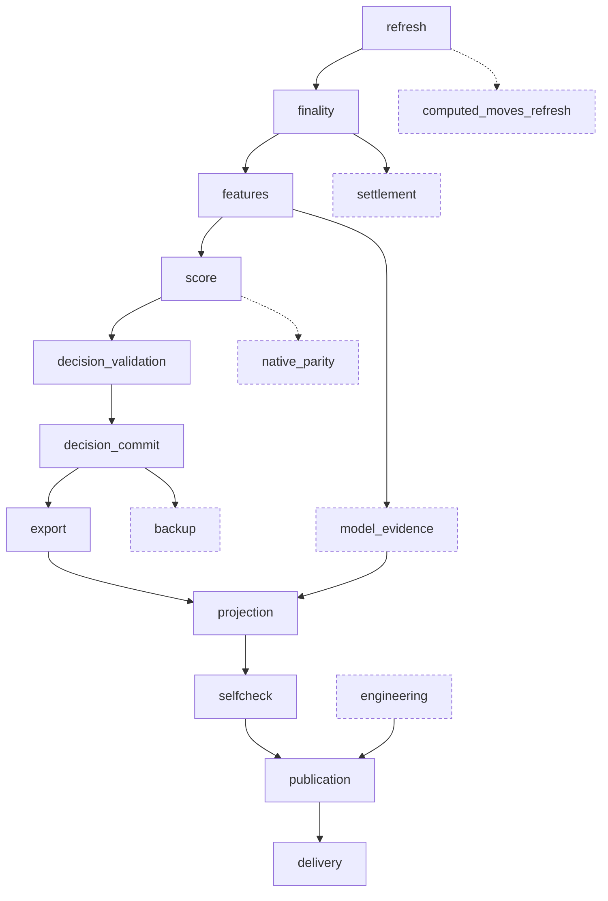
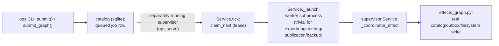
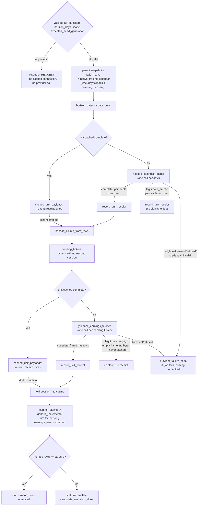
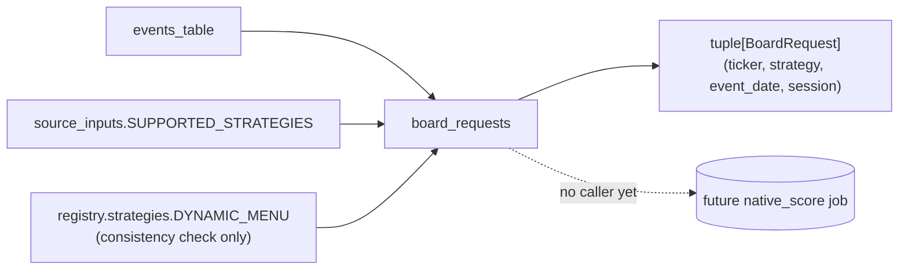

# `engine/v2/ops` — architecture

Layer 7.0 in the root `/ARCHITECTURE.md` layer table. Replaces the new
supervisor/catalog design, `dashboard/nightly.py` (as a job graph) and
`tools/bounded_run.py` (as an executor adapter). See the root doc for the
layer rules this package is checked against; this doc covers the detail
specific to this package.

## Purpose

Durable job submission, leases, retry history and dependencies; resource
admission and per-job CPU placement; the nightly job graph and its release
boundary. It does not decide research conclusions (`engine/v2/evaluation`)
and does not compute a score (`engine/v2/scoring`) — it only sequences and
persists the jobs that call into those packages.

This doc also covers `native_board_universe.py`: a pure, answer-free
enumerator that reproduces legacy `engine.score.score_calendar`'s event ×
strategy enumeration for the strategies native scoring supports, without
touching the legacy chain index or constructing a legacy `Scorer`. It has
no production caller yet — see "Dependencies" below.

## Primary contracts and public interfaces

The operator interface is the versioned command protocol
`engine/v2/ops/cli.py` exposes (`python3 -m engine.v2.ops <command>`),
derived directly from its `argparse` definitions:

- `init`, `doctor`, `health`
- `serve` — starts the supervisor loop
- `plan {nightly,experiment,training,promote}` — builds and saves a plan
  document; `training`/`promote` (P6 slice 5) take operator-only arguments
  (`--training-mode`, `--recipe`, `--state`, `--alpha`, `--cutoff`,
  `--strategy`, `--pairs`, `--ticker-chunk`, `--release-root`,
  `--release-id`) and are never part of the nightly DAG
- `submit --plan --idempotency-key`
- `rescore --request --native-inputs` — read-only, no provider pulls, no fitting
- `capture-inputs --as-of --tickers --context-tickers --year-start --year-end --source-root --output`
- `reconcile <job_id> --expected-attempt`
- `provider-account --account --remaining --live-reserve`
- `snapshot {plan-import,submit,promote,rollback}`
- `ledger {import-history,status,calibrate,book}`
- `decisions supersede --row-id --reason --from-json`
- `price-refresh --session [--dry-run]`
- `price-history capture --source-root --scope [--dry-run]`
- `get`/`logs`/`cancel`/`resume`/`explain <job_id>`

Internally: `nightly.py`'s `GRAPH`, `graph_order()`, `OPTIONAL`,
`NO_JOB_STAGES`, `build_nightly_plan`, `build_legacy_job_requests`,
`_stage_sequence` (see §"Diagrams" below); `supervisor.Service`/`serve`;
the coordinator-effect functions in `effects_graph.py`; `training.py`'s
`training_job_kind`/`promote_job_kind` (registered in `stages.py::_core_kinds`,
alongside the nightly stage kinds, not in
`supervisor._COORDINATOR_EFFECT_KINDS`), `training_plan`/`promote_plan` and
`run_training_worker`/`run_promote_worker`; `BoardRequest`/
`board_requests(as_of, horizon_days, tickers, events_table)`
(`native_board_universe.py`) — a pure key `(ticker, strategy, event_date,
session)` and the function that enumerates one per event × native-covered
strategy, plus one `DYN-SV` meta-request per event; `calendar_moves_jobs.py`'s
`computed_moves_job_kind` (registered in `stages.py::_core_kinds`, the same
ordinary-job-kind pattern as `training`/`promote_job_kind` above, not a
coordinator effect), `CalendarMovesParameters`/`calendar_moves_parameter_problems`/
`calendar_moves_job_spec`, and `run_computed_moves_worker` (dispatched by
`worker.py` for worker `"computed_moves_refresh"`) — see "Primary contracts"
below for what this adapts; "Outputs" below now covers its nightly caller
(Part 4). `calendar_moves_jobs.py` registers only `computed_moves_refresh`:
`forward_calendar_refresh` still has no `JobKind` — issue #52's prerequisite
(an attempt-fence check in the store's own commit path, so a
cancelled/expired attempt can never commit — see below) is now in place
(#55), but registering the kind itself (worker dispatch, loader callback,
parameter validation) is a separate, later change, and Part 4 wires only
`computed_moves_refresh` into the nightly graph for the same reason —
`forward_calendar_refresh` gets neither a `JobKind` nor a `GRAPH` node.

A small number of natively-fetched data stores live directly in this
package rather than delegating computation to another v2 layer — like
`price-history capture` above, `forward_calendar_store.py` (spec s4c) is
one of these. It does NOT claim `RefreshCallback` compatibility itself:
`main`'s `RefreshParameters` (`incremental_data.py`) has no
`as_of`/`tickers` field, so a function shaped `(parameters, root)` could
never read them from it. `run_forward_calendar_refresh` is instead a
standalone runner with an explicit, fully keyword-only signature
(`catalog_path`, `objects_root`, `parent_snapshot_id`, `refresh_plan_hash`,
`as_of`, `tickers`, `horizon_days`, `scope`, `expected_head_generation`,
`expected_head_snapshot_id`, `attempt_id`, `fence`, `nasdaq_fetcher`,
`earnings_fetcher`) that validates every one of its twelve non-fetcher
arguments before touching the catalog or a provider, including `scope`
(must be `"shadow"` or `"smoke"`), `expected_head_generation`
(non-negative), `expected_head_snapshot_id` (Part 3: `None` or a bounded
1..128-char string, matching `parent_snapshot_id`'s own shape — the old
code read it straight into
`_commit_claims`/`generic_incremental.commit_generic_table_candidate`
unchecked), and `attempt_id`/`fence` (issue #52: `None`/`None`, or a
non-empty string paired with an `int >= 1` — the same optional-pair shape
`computed_moves_store`'s staged `attempt_id`/`fence` document fields have);
`tickers=()` is valid and means the whole market (see "Failure semantics"
below). **The commit path now carries the same live-attempt-lease check
`computed_moves_store` has (issue #52, closed by this change):**
`_commit_claims` accepts `attempt_id`/`fence` and passes
`generic_incremental.commit_generic_table_candidate` a `fence_check`
built by this module's own `_fence_check_for` — byte-identical in shape to
`computed_moves_store._fence_check_for` — which is a no-op when
`attempt_id` is `None` (a manual/ad-hoc invocation with no live job behind
it, same as `computed_moves_store`) and otherwise calls
`engine.v2.ops.lifecycle.verify_fence` inside the SAME commit transaction
the head compare-and-swap runs in, so a cancelled job (`CANCELLED`) or an
expired lease (`LEASE_LOST`) is refused before anything commits — never
after. `generic_incremental.commit_generic_table_candidate` gained a new
optional `fence_check` parameter for this, COMPOSED with (never a
replacement for) its existing `_head_fence` check: `_head_fence` always
runs first, then the supplied `fence_check` (if any) runs after it, both
inside the one callable `catalog.commit_snapshot` invokes — CodeRabbit
review, PR #55 round 2 (`catalog.commit_snapshot` skips its own
`_check_head_expectation` call on an idempotent-replay shortcut
(`_existing_receipt`), but it always calls whatever `fence_check` it was
given BEFORE that shortcut lookup, so composing here is what keeps
head-conflict detection active on that shortcut path too). Omitting
`fence_check` (the default) keeps this function's previous, unchanged
behavior for its other two callers, `engine/v2/data/incremental.py`'s
generic-refresh path and `engine/v2/research/_trades_publish.py`, neither
of which is touched by this change. This runner still has no job-layer
bridge: registering
`forward_calendar_refresh` as a `JobKind` (worker dispatch, a loader
callback, parameter validation) is a separate, later change — see "Primary
contracts" above. Its pure helpers (`horizon_dates`, `date_units`,
`ticker_units`, `plan_forward_calendar`, `resolve_session_claims`,
`nasdaq_rows_from_payload`, `nasdaq_claims_from_rows`, `pending_tickers`)
are unit-testable without a catalog or a network. Today this runner has no
production caller, only its own test module.

`native_score_batch.py` (this PR adds this module, its `stages.py` job kind
and its `worker.py` dispatch branch together — this doc describes the
module as this PR leaves it, not a pre-existing fact): the batch-shaped
seam between the board universe (`native_board_universe.BoardRequest`) and
`engine.v2.scoring.application.score_batch`. `assemble_score_batch_inputs`
turns one release binding (`engine.v2.scoring.release_bindings.
ScoringReleaseBinding`, PR-1) plus a sequence of one already-staged
`NightlyEventInputs` per event (calendar/panel/Tier-4/quote rows, the
same shape `engine.v2.scoring.nightly_source_bundle.
assemble_nightly_source_bundle`, PR-2, already accepts) into
`dict[BoardRequest, tuple[ScoreRequest, NativeScoreInputs]]` plus a tuple of
typed per-row `NativeScoreBatchRowRefusal`s — never a raised exception for a
bad row (see "Failure semantics" below). It is a pure function: no catalog,
no filesystem, no network. An empty `events` sequence is a legitimate no-op,
never a refusal or an error: the returned map and refusal tuple are both
empty. `run_native_score_batch_worker(parameters, root)`
is the `native_score_batch` job kind's worker entrypoint (dispatched from
`worker.py`, registered in `stages.py::_core_kinds`): it resolves the
release once via `resolve_release_binding(parameters["release_root"])`,
reads the one staged `events.json` document (an array of per-event inputs,
materialized into `root` by `executor._materialize_inputs` from the job's
own `input_bindings` exactly like `adhoc_rescore`'s `request.json`/
`native_inputs.json`), calls `assemble_score_batch_inputs`, then
`engine.v2.scoring.application.score_batch` under `engine.v2.models.no_fit.
no_fit_guard()` (the same guard `_dispatch_adhoc_rescore` already uses), and
writes `records.json`/`refusals.json`. An `events.json` decoding to an empty
list produces empty `records.json`/`refusals.json` and
`completed_ids=list(parameters["expected_ids"])`/`no_work=not
parameters["expected_ids"]` — the same "no work" shape `artifact_check`
already reports for an empty `expected_ids`, never a distinct code of its
own. **This bounded batch assembler
supports `STR-THRU` only** (the same strategy `nightly_source_bundle.py`'s
own bounded builder documents as its scope) — any other `BoardRequest.strategy`
in the input sequence refuses per-row (`UNSUPPORTED_STRATEGY`), never raises
out of the batch. **No production caller submits this job kind yet**: like
`computed_moves_job_kind()` before Part 4 wired it into `nightly.py`, this PR
registers the kind and its worker dispatch only — a later cutover PR (PR-4/
PR-6, per `scratchpad/cutover_wiring_plan.md`) builds the caller that
enumerates `BoardRequest`s, stages their per-event inputs, and submits this
job kind from the nightly graph. `nightly.py` is not touched by this PR.

**Cutover PR-4 (this doc describes the design as this PR's Phase 2 will
leave it, not a pre-existing fact — Phase 1 of this PR is documentation
only for `legacy_parity_rows`, the "explained" bucket and
`tools/native_parity_run.py`, each gated on cutover PR-3
(`native_score_batch.py`, `#66`) merging before its own code is written.
One piece is NOT gated on `#66` and IS real code already in this push,
independent of everything `#66` supplies: making
`native_parity_report.py`'s tolerance policy pluggable — see "the
tolerance policy is now pluggable" below).** Three additions close the gap the
root doc §4 and this doc's own "Diagrams" section both name today:
`run_shadow_nightly` "has no production caller, only tests ... call it,"
so in production `native_parity` never actually compares anything — a
production run supplies no `parity_rows`, `_registered_handlers` defaults
both sides to `{}`, and `compare_native_vs_legacy`'s own
`_refuse_empty_inputs` raises `VALIDATION_FAILED` before any comparison
runs, which `_run_stage` turns into a `"degraded"` receipt for this
`OPTIONAL` stage (see "Outputs" below for why this is NOT the same claim
as "writes an empty-input report" — no report is ever written either).
None of the three
changes `run_shadow_nightly`'s own stage-walk or `native_parity_handler`'s
signature contract (both already correctly consume real
`legacy_rows`/`native_rows` dicts today — proven by
`tests/test_v2_ops_native_shadow_render.py`); the gap is purely that
nothing before this PR builds real dicts to hand them.

- **`nightly.legacy_parity_rows(score_document: Mapping[str, Any]) ->
  dict[str, dict]`** (new, this package). Keys the legacy `score.json`
  document's own `"rows"` array by
  `engine.v2.ops.decision_validation.population_key`'s `"ticker|strategy|
  event_date"` format — REUSED, not re-derived and not re-added: this
  public function already exists (`decision_replay.py`'s own population
  comparison already imports it), and it is the identical three-field
  format `engine.v2.serving.native_render.native_row_key` already derives
  for a native `ScoreRecord` (that module's own docstring: `"the native
  twin of bridge._population_key"` — `legacy_adapter._population_key` is a
  second, private, byte-identical copy of the same format used only for
  `_action_score`'s own population check; this PR reuses the PUBLIC one
  `decision_validation` already exports, adding no new function). Pure: no
  filesystem, no clock, and — the point of putting this here rather than
  in the composing script below — no import of `engine.v2.serving` (a
  layer-7.0 peer of `engine.v2.ops`, per the root doc's layer table;
  `checks/import_layers.py` would refuse that edge). A `score_document`
  with no `"rows"` key returns `{}` (not a refusal —
  `native_parity_handler`'s existing `_refuse_empty_inputs` already turns
  an empty `legacy_rows` into `VALIDATION_FAILED` downstream, so this
  function does not need its own empty-input check).
  **`legacy_parity_rows` does NOT reuse `population_key`'s own
  `.get(key, "")` empty-string substitution for a missing
  `ticker`/`strategy`/`event_date`** (root doc §5: "a missing or unusable
  input produces an explicit withheld/refused status," never a silent
  default) — reusing that substitution here would let one malformed row's
  empty-string-keyed entry either collide with a genuinely empty-fielded
  row, or, more likely with real data, simply end up unique and reported
  as an ordinary `only_legacy` row: quietly absorbed into the report as a
  population difference rather than surfaced as the malformed input it
  actually is. **Duplicate keys are the same class of finding, not a
  separate one**: `_action_score`'s own population check
  (`observed_keys = {_population_key(row) for row in rows}`) compares
  `population_key` values only as a SET, so a `score.json` carrying two
  rows under one `ticker|strategy|event_date` key (sibling precedent:
  `decision_replay.decision_population` rejects a duplicate population
  key explicitly, via `VALIDATION_FAILED`; `_action_score` does not)
  already passes that check today without ever proving the two rows
  agree — a plain `{key: row for row in rows}` comprehension in
  `legacy_parity_rows` would then silently keep whichever row iterated
  last and drop the other with no trace. `legacy_parity_rows` therefore
  validates every row before keying any of them: a missing/empty
  `ticker`/`strategy`/`event_date`, OR two rows sharing one
  `population_key` value, each raises `OpsError` — matching
  `decision_population`'s own code, `VALIDATION_FAILED` (detail naming
  the row index/missing field, or the repeated key and both rows'
  indices) — for the WHOLE call, before any dict is constructed: a
  batch-level refusal, never a per-row skip or a last-write-wins
  collision, so a malformed or duplicate-keyed `score.json` is never
  silently read as smaller, or different, than it actually is. The same
  refusal covers the shape one level up, before `population_key` is ever
  called on a row: `score_document["rows"]`, if present, must be a list of
  mappings — a non-list value or any non-mapping element raises `OpsError`
  (`VALIDATION_FAILED`) rather than letting `population_key`'s own
  `.get(...)` calls raise a bare `TypeError`/`AttributeError` on a
  malformed element.
  `population_key`, `_population_key`, and `_action_score`'s own
  set-based check are all unchanged by this PR.
- **`native_parity_report.py` gains a caller-supplied "explained" bucket**,
  the mechanism for classifying a known structural difference (legacy's
  stale-px rule; legacy finality drift — a prior D14 Phase 2 gate
  investigation measured 212 stale-archive rows and 124 finality-drift
  rows) as accepted rather than a defect, without
  hiding the finding or touching `engine/v2/parity`'s comparator. New
  `ROW_EXPLANATION_CODES = frozenset({"LEGACY_STALE_PX",
  "LEGACY_FINALITY_DRIFT"})` and a new keyword-only parameter on both
  `compare_native_vs_legacy` and `native_parity_handler`:
  `row_explanations: Mapping[tuple[str, str], str] = {}`, keyed by
  `(row_key, dimension)` — never by `row_key` alone, so explaining one
  dimension of a row (say, `financial_diagnostics`, because legacy priced
  it off a stale quote) can never silently swallow a genuine, unrelated
  mismatch the SAME row has on another dimension (say, `verdicts`). A
  `(row_key, dimension)` pair whose `dimension` was not itself compared,
  whose `row_key` is not in `compared`, or whose pair did not actually
  produce a mismatch (agreement needs no explaining, and accepting one
  would hide a caller classifier that is itself wrong) is refused
  `INVALID_REQUEST` — never a silent no-op annotation. A reason code
  outside `ROW_EXPLANATION_CODES` is refused the same way: this is a
  closed, named vocabulary, not a free-text field a caller can widen
  without a doc change. The returned document gains `"explained": [...]`,
  each entry the same shape as a `mismatches` entry
  (`row_key`/`dimension`/`finding_fields`/`receipt`) plus `"reason"`; an
  explained `(row_key, dimension)` is removed from `mismatches` and moved
  to `explained`, never counted in both. `native_parity_handler`'s summary
  gains `"explained": len(report["explained"])` alongside its existing
  `"mismatches"` count. **The classifier itself — deciding which rows are
  actually stale-px vs. finality-drift — is explicitly out of scope for
  this PR, and not invented here**: no reusable stale-px/finality-drift
  detector exists in production code today (`engine/v2/data/price_history.py`
  has finality/staleness primitives but no per-row classifier over a scored
  record; the D14 corpus's 212/124 counts were a one-off manual
  classification during a Phase 2 gate investigation, never a callable
  function). Until a follow-up PR builds one, `row_explanations` defaults
  to `{}` and every real mismatch reports as a mismatch — this PR adds the
  plumbing so a future classifier has somewhere correct to plug in, not a
  guess at what that classifier should decide today. Tracked as a
  follow-up issue, filed alongside this PR's Phase 2 push.
- **`tools/native_parity_run.py`** (new, tools-composing layer — the one
  place allowed to import both `engine.v2.ops` and `engine.v2.serving` in
  one process, per `engine/v2/ops/native_shadow_render.py`'s own docstring
  and the working precedent `tools/v2_dashboard_project.py` already sets
  for composing `engine.v2.ops.bootstrap` with `engine.v2.serving`). This
  is the real (manual, operator-invoked; not yet wired into any job graph
  or the supervisor's tick loop — see "out of scope" below) production
  caller that finally builds a non-empty `parity_rows` and calls
  `run_shadow_nightly` with it: reads a session's already-written legacy
  `score.json` (`nightly.legacy_parity_rows`, above); resolves the current
  release (`engine.v2.scoring.release_bindings.resolve_release_binding`,
  PR-1, already on `main`); reads one already-staged `events.json` of
  `native_score_batch.NightlyEventInputs` (PR-3/`#66`'s own shape — this
  PR does not build the per-night enumeration/staging of those events; it
  accepts them as an explicit input file, exactly as
  `run_native_score_batch_worker` itself does, and leaves "who stages
  `events.json` for every `BoardRequest`" to cutover PR-6, a later PR in
  this same cutover sequence); calls
  `native_score_batch.assemble_score_batch_inputs` (PR-3) to get
  `requests_by_key`; calls
  `engine.v2.serving.native_shadow_render.build_native_bundle_rows`
  (already on `main`) to get `native_rows`; and calls
  `nightly.run_shadow_nightly(..., plan=..., parity_rows=(legacy_rows,
  native_rows))`. It writes nothing to `source_root` and nothing to the
  legacy board — see "Failure semantics" below for why a failure anywhere
  in this script cannot touch the legacy nightly.

**The tolerance policy is now pluggable, not hardcoded — this part of the
PR is real code, already merged into this push, independent of `#66`.**
`engine.v2.parity.dimensions.compare_dimension` gained a keyword-only
`tolerance_policy` parameter (default `SCORE_RECORD_V1`, so the Phase 4
checker and every existing test are unaffected — none of them pass this
argument, so none of them can observe a behavior change);
`native_parity_report.compare_native_vs_legacy`/`native_parity_handler`
each gained the identical parameter, threaded straight down to
`compare_dimension`, and the written report now records
`"tolerance_policy_id": tolerance_policy.policy_id` so a reader of
`native_parity_report.json` can always see which policy compared it —
never an implicit, undiscoverable default. **Per-field tolerances come
from ONE config policy, the `engine.v2.parity.tolerance.TolerancePolicy`
type** (never a second ad hoc mechanism): the default that ships in this
PR is still `SCORE_RECORD_V1`, which declares zero per-field rules
(`rules=()`), so every one of the five dimensions' 30 fields —
`FORECAST_FIELDS` (12), `SIMULATION_FIELDS` (7), `FINANCIAL_FIELDS` (5),
`GATE_FIELDS` (3), `ANALOG_FIELDS` (3) — still compares under exact
equality until a caller explicitly plugs in a different policy. **No
per-field tolerance VALUE is added, chosen, or implied by this PR** —
that is a user decision, taken to the user separately, and per instruction
none of those values belong in this doc, the PR body, or an issue; only a
`TolerancePolicy` built and ratified elsewhere is ever passed in here.
`tolerance.py`'s own docstring names the risk this design avoids:
"chosen to make the first run pass" is a named failure mode, so this PR
adds the SEAM a ratified policy plugs into, not a guess at what it should
contain.

**Out of scope for this PR** (each a real gap, named rather than silently
left implicit): the per-night enumeration of every `BoardRequest` and the
staging of its `events.json` inputs (cutover PR-6); flipping
`native_parity` or anything else onto a schedule, a job kind, or the
supervisor's tick loop (no PR before Phase 7 changes legacy authority);
the stale-px/finality-drift classifier itself (above); and building the
actual user-approved, per-field `TolerancePolicy` object itself (the
pluggable seam above takes it as a parameter — this PR does not construct
one).

## Inputs

- Plan documents built by `plans.py::nightly_plan`/`build_nightly_plan`
  (pinned decision clock, read set, session).
- The operations catalog (sqlite, via `catalog.py`'s `transaction`) — job
  rows, leases, retry history, provider-account budgets.
- The artifact store (`ArtifactStore`, filesystem-backed) for refresh plans
  and other bound inputs.
- Legacy filesystem reads (px CSV tree, yfinance fetch cache) through the
  declared adapter, for `price-history capture` and `price-refresh`.
- `computed_moves_store.py`'s `run_computed_moves_refresh` (`parameters,
  root, *, as_of, fetcher=None`; not itself a bare `RefreshCallback` since
  `as_of` cannot be pre-bound at module-import time — it varies per
  dispatch. `calendar_moves_jobs.run_computed_moves_worker` (Part 3) adapts
  it: it decodes the job's `CalendarMovesParameters`, then calls
  `incremental_data._load_computed_moves_refresh_callback(params.as_of)` to
  get a closure with `as_of` and the injected `yfinance_history_fetcher`
  pre-bound — THAT closure is the `(parameters, root)`-shaped
  `RefreshCallback`; see "Outputs" below for what still has no nightly
  caller): reads `earnings_events`/`daily_market` off the pinned parent snapshot
  through `Repository`, exactly once each per run (`_scan_once`), and calls
  an injected yfinance history fetcher (never `legacy_adapter.new_fetcher`)
  per target ticker. Target tickers are the ORATS-confirmed-session rule
  `target_tickers_from_snapshot` re-implements from the legacy pull, read
  through the v2 snapshot instead of the legacy store.
- `forward_calendar_store.py`'s own inputs: the pinned parent snapshot's
  `daily_market` sessions (one scan, grouped by ticker, fed to
  `engine.v2.data.computed_moves.native_trading_calendar` for the horizon
  calendar — a snapshot without a `daily_market` session falls back to plain
  weekdays); `run_forward_calendar_refresh`'s own explicit keyword arguments
  (`catalog_path`, `objects_root`, `parent_snapshot_id`, `refresh_plan_hash`,
  `as_of`, `tickers`, `horizon_days`, `scope`, `expected_head_generation`,
  `expected_head_snapshot_id`, `attempt_id`, `fence`) — there is no staged
  input-document file for this runner: it has no `JobKind` (see "Primary
  contracts" above), so there is no admitted job to stage one from, and
  `refresh_staging.REFRESH_INPUT_DOCUMENT_NAMES` has no
  `"forward_calendar_refresh"` entry; and the two injected network edges,
  `providers.nasdaq_calendar.
  nasdaq_calendar_fetcher` (one call per discovery date) and
  `providers.yfinance_edge.yfinance_earnings_fetcher` (one call per ticker
  still missing a session after the Nasdaq pass).
- `board_requests`: an already-loaded events table (`ticker`, `event_date`,
  `session` columns — e.g. `engine.data.store`'s `earnings_events` Tier-2
  table's shape, where `event_date` is schema-typed `datetime64[ns]`), an
  `as_of` date, a horizon in days, and an optional ticker filter. It
  performs no I/O itself — the caller loads the table. `event_date` may
  also be given as ISO 8601 strings (date-only or full timestamp, mixed
  within one column); numeric values are rejected rather than read as
  epoch-relative offsets, whether the column's dtype is numeric or a mixed
  `object` column holding Python `int`/`float` elements (see "Failure
  semantics"). `as_of` must be a timezone-naive `datetime`/
  `pandas.Timestamp` (`None`, `NaT`, and a timezone-aware value are
  refused); `horizon_days` must be a non-negative `int` (`bool` is refused
  despite being an `int` subtype in Python) — see "Failure semantics".
- `assemble_score_batch_inputs`'s own arguments: `as_of` (the night's
  cutoff), `snapshot_id` and `calendar_revision` (caller-supplied identity
  strings — this module resolves neither; a later caller derives them from
  the pinned plan/read set, per "Primary contracts" above), one
  `ScoringReleaseBinding` (PR-1, resolved once by the caller — never
  re-resolved per row), a sequence of `NightlyEventInputs` (one
  `BoardRequest` key plus its `calendar_row`/`panel_row`/required
  `panel_anchor` (issue #53, fixed by #67 — threaded straight through to
  `assemble_nightly_source_bundle`'s own required parameter of the same
  name, unmodified)/`tier4_row`/`quote_rows`/optional `quote_status` — the
  calendar row here additionally
  carries the real `earnings_events` table's own `event_id` column, which
  `nightly_source_bundle._CALENDAR_REQUIRED_FIELDS` does not itself
  require), the batch's `feature_names`, and an optional `gate_policy:
  Mapping[str, Mapping[str, Any]]` keyed by strategy (see "Failure
  semantics" for why this is caller-supplied and optional). The worker's own
  `NativeScoreBatchParameters` additionally carries `release_root` as a
  plain string field (never through `input_bindings`, matching
  `PromoteParameters.release_root`'s precedent in `training.py`) and
  `input_bindings={"events.json": <artifact ref>}` for the one staged
  events array.

## Outputs

- `StageReceipt`/`NightlyReceipt` documents recording each stage's status,
  input/output hash and (for a failure) an error code.
- Job records in the catalog (leases, attempts, outbox rows).
- `assemble_score_batch_inputs` returns `(dict[BoardRequest, tuple[
  ScoreRequest, NativeScoreInputs]], tuple[NativeScoreBatchRowRefusal, ...])`
  — the assembled map (never partial per row: a key is present only with a
  complete, buildable pair) plus every row that could not be assembled, each
  a typed `.code`/`.detail`/`.key` refusal object. `run_native_score_batch_worker`
  writes this as two staged files: `records.json` (an envelope document,
  `{"schema_version": "native_score_batch_records.v1.0", "authoritative":
  false, "known_gaps": [], "records": [...]}` — see "Failure semantics" for
  `authoritative`/`known_gaps` — whose `records` array is the `tuple[
  ScoreRecord, ...]` `score_batch` returns, each `to_document`-serialized,
  in `ScoreBatch.requests` order, never reordered to match `events.json`)
  and `refusals.json` (one document per row refusal, `{"key": ..., "code":
  ..., "detail": ...}`, in the order `events.json` declared them). A batch
  whose every row refuses still completes the job successfully with an
  empty `records` array and a full `refusals.json` — refusing every row is
  a valid, reportable outcome, not a worker failure (see "Failure
  semantics").
- `computed_moves_store.py` commits one new snapshot generation per run,
  carrying every other table forward unchanged alongside a fresh
  `computed_moves` table version (`engine/v2/data/computed_moves_table.py`;
  one fragment per ticker, via the same immutable-object/manifest/atomic-head
  commit primitives `price_history_store` uses, never `generic_incremental` —
  `computed_moves` has no manifest in the parent snapshot the way an
  existing contracted table does). Alongside the snapshot commit it inserts
  one append-only row per attempted ticker into `data_computed_moves_captures`
  (schema v12, `engine/v2/data/schema.py`) — a capture already logged (same
  content-derived `capture_id`) is never re-logged, so a rerun that rebuilds
  a generation from durable receipts does not duplicate the log.
- Coordinator-side effects for every kind in
  `supervisor._COORDINATOR_EFFECT_KINDS` (14 kinds, cited by name rather
  than copied here since the list can drift: `legacy_decisions`,
  `legacy_settlement`, `legacy_render`, `legacy_selfcheck`,
  `decision_evidence`, `ledger_export`, `engineering_gate`, `publication`,
  `backup`, `snapshot_import`, `legacy_rebuild_candidate`,
  `legacy_materialize`, `experiment`, `decisions_supersede`) —
  catalog/outbox/filesystem writes dispatched from
  `supervisor.Service._coordinator_effect`; the worker subprocess for each
  of these kinds is trivial, the real write happens on the coordinator
  side. That dispatch calls into several modules, not only
  `effects_graph.py`: `effects_graph.py` supplies `backup_effect`,
  `engineering_gate_effect`, `experiment_effect`, `ledger_export_effect`
  and `publication_effect` (5 of the 14); `decision_commit.py` supplies
  `commit_decisions_in_transaction` (`legacy_decisions`, called from a
  commit closure defined directly in `supervisor.py`, not in
  `effects_graph.py`) and `commit_supersede` (`decisions_supersede`);
  `snapshot_promotion.py` supplies `legacy_rebuild_candidate_effect` and
  `snapshot_import_effect`; `snapshot_stages.py` supplies
  `materialize_effect` (`legacy_materialize`); `legacy_settlement` and
  `decision_evidence` are handled by `supervisor.py`'s own
  `_settlement_effect`/`_verify_decision_evidence`. "All real state change
  happens in `effects_graph.py`" is not accurate — treat it as one of
  several coordinator-effect implementation modules, not the only one.
- Private shadow artifacts only: `build_nightly_plan` refuses any `mode`
  other than `"shadow"` (`INVALID_REQUEST`), so this package's nightly
  output never reaches the legacy board.
- Cutover PR-4 (design; see "Primary contracts" above): `native_parity_report.json`
  is NOT written in production today, and this correction matters, not
  only the file it is written to — `compare_native_vs_legacy`'s own
  `_refuse_empty_inputs` raises `VALIDATION_FAILED` on an empty
  `legacy_rows`/`native_rows`/no shared key, `native_parity_handler`
  propagates that raise, and `_run_stage` catches it for the `OPTIONAL`
  `native_parity` stage as a `"degraded"` receipt — `write_parity_report`
  is never reached, so no file lands on disk. That is consistent with,
  not in tension with, "`run_shadow_nightly` has no production caller,
  only tests ... call it": today's only callers hand it real dicts (the
  tests) or nothing at all (nobody in production), never an empty
  `parity_rows` that reaches `compare_native_vs_legacy` and then writes a
  report anyway. Once `tools/native_parity_run.py` supplies real rows,
  `native_parity_report.json` will, for the first time in production,
  carry a real `"compared"`/`"only_legacy"`/`"only_native"`/`"mismatches"`
  split, plus the new `"explained"` list (each entry `mismatches`-shaped
  plus `"reason"`) for a caller-classified known structural difference.
  Still private-shadow-only, same as every other artifact in this bullet
  list; nothing here writes to the legacy board.
- `forward_calendar_store.run_forward_calendar_refresh` commits revisions
  into the EXISTING `earnings_events` contract through
  `engine.v2.data.generic_incremental` — never
  `engine.data.rebuild.rebuild` — and returns a `RefreshCallbackResult`
  (`status` one of `complete`/`noop` — invalid input or an unconfigured
  fetcher pair raises `OpsError` instead of returning a `"failed"` result;
  `completed_ids`, `coverage_advanced`, and `warnings` carrying any
  weekday-calendar-fallback degradation as evidence rather than only a log
  line). A run whose merged claims equal the parent snapshot's own rows
  resolves back to the parent (the commit layer's own equality check
  decides this, never key presence in the parent), so it reports `noop`
  rather than a spurious `complete`.
- `training`/`models_promote` are ordinary `_core_kinds()` job kinds, not
  `supervisor._COORDINATOR_EFFECT_KINDS` members: the worker subprocess does
  the real write itself. `run_training_worker` (worker `"training"`) calls
  one of `tools/phase5_training_job.py`'s four job functions and writes
  `training_result.json` (`training_job_result.v1.0`); `run_promote_worker`
  (worker `"models_promote"`) calls `engine.v2.models.deployment.promote`'s
  release-store pointer swap and writes `pointer_state.json`
  (`promote_pointer_state.v1.0`). Neither ever runs inside the nightly DAG —
  both are submitted by an operator's own `ops plan training|promote` +
  `ops submit`.
- `board_requests`: a tuple of `BoardRequest`, ordered by
  `(event_date, ticker)` outer, native-covered strategies alphabetically
  then `DYN-SV` last inner. No side effect, no write.

**`computed_moves_refresh` is registered as an ordinary job kind (Part 3) and
now has a nightly `GRAPH`/`OPTIONAL` node and a SUPERVISED submitter (Part 4,
revised after Opus BLOCK(3)); `forward_calendar_refresh` still has no
`JobKind` at all.** `stages.py::_core_kinds` includes
`calendar_moves_jobs.computed_moves_job_kind()`, and `worker.py::dispatch`
routes worker `"computed_moves_refresh"` to
`calendar_moves_jobs.run_computed_moves_worker`. `nightly.py`'s `GRAPH` still
carries a `"computed_moves_refresh": ("refresh",)` node, and `OPTIONAL`
still includes it, but ONLY for `run_shadow_nightly`'s own whole-graph walk
(see "Diagrams" below) — no *submission* path builds a job for it from that
node, and `_NATIVE_ACTION_STAGES` maps only `"refresh"` now. (Before Part 4
this stage was reachable only through the general job-submission pipeline,
`ops submit` with a raw `JobSpec`, same as `training`/`models_promote`
above; Part 4 below is what added the real caller.)

**Why it moved out of `build_legacy_job_requests` (Opus BLOCK(3) on
`dc7f9360`).** The first cut of Part 4 built both native jobs — `"refresh"`
(daily_market) and `"computed_moves_refresh"` — inside the SAME
`build_legacy_job_requests` call, both pinning the identical shadow head at
plan-build time, and submitted them together through one
`submission.submit_graph` call. Two defects followed directly from that:
(1) `data_catalog.commit_snapshot`'s `_check_head_expectation` is strict —
whichever of the two jobs commits its pinned `(snapshot_id, generation)`
SECOND is rejected as stale, and `"refresh"` commits first on almost every
real session (it is the one that actually adds daily_market rows), so
`computed_moves_refresh` would fail on a stale head essentially always, or,
with no ordering at all, could occasionally commit FIRST and fail the
REQUIRED `"refresh"` instead — either way the optional stage could break the
required one, which `OPTIONAL` must never do. (2) `submit_graph` validates
every node then inserts all or none (`submission.py`'s own module
docstring): a zero-provider-call rebuild, a same-session resubmission whose
digest had drifted from cached-receipt changes, or a plain exception in the
computed-moves plan builder each aborted the WHOLE graph — including the
REQUIRED `"refresh"` and every downstream legacy stage — not just the
optional one.

**The revised design: a separate, later submission, never sharing
`build_legacy_job_requests`'s graph.** `computed_moves_refresh` is submitted
ONLY by `supervisor.Service`'s own tick loop —
`Service._reconcile_computed_moves_refresh`, called every `tick()` right
after `_reconcile_publication_status`, which calls
`nightly.submit_computed_moves_refresh_if_ready`. That function: (a) calls
`nightly._computed_moves_identity`, which looks at every `succeeded` native
`"refresh"` job, recovers each one's session (`as_of`) by parsing that job's
OWN idempotency key — `"nightly:<as_of>:<scope_hash>:refresh"`,
`build_legacy_job_requests`'s own format; `RefreshParameters` carries no
`as_of` field, so this is the only place a native refresh's session is
recorded — and picks the MAX (chronologically latest) session, never the
latest-UPDATED row (Opus re-gate finding, non-blocking, fixed alongside the
memo/backoff below): an older session's `"refresh"` row can be touched again
later than a newer session's (a backfill, a re-verify), and
`ORDER BY updated_at DESC` would then wrongly pick the older session; does
nothing if no `"refresh"` has succeeded yet; (b) resolves the shadow head
FRESH, right now, never a head pinned by any earlier plan, so by
construction it can only ever read the head `"refresh"` already committed;
(c) keys the job purely by session —
`"nightly:<as_of>:computed_moves_refresh"`, no `scope_hash` — because its
target set is always every scoreable ticker on the pinned head
(`all_scoreable=True`), independent of which watchlist's `"refresh"`
triggered the tick that noticed it; (d) if a job already exists under that
key, in ANY state, returns without rebuilding or resubmitting anything — so
a same-session rerun, or cached-receipts changing between ticks, can never
reach `submission.submit` at all, let alone hit `IDEMPOTENCY_CONFLICT`; (e)
is submitted alone, through `submission.submit` (one node, not
`submit_graph`), so it can never make a REQUIRED job's admission all-or-
nothing with it. `Service._reconcile_computed_moves_refresh` wraps the whole
call in the identical try/except `_reconcile_publication_status` already
uses (a reporting sidecar, never the pipeline; see "Failure semantics"
below) — a broken build (a resolve error, a target-selection error) degrades
only this optional stage, never `tick()` itself and never a required job's
dispatch.

**Memoized per (session, head), with backoff (Opus re-gate blocking
finding).** `_computed_moves_identity` itself is cheap — two indexed
`SELECT`s, no pandas — but `submit_computed_moves_refresh_if_ready`'s own
deeper work, when there IS something to (re)build, is not: it calls
`_build_native_computed_moves_plan`, which calls
`computed_moves_store.target_tickers_from_snapshot`, a full pandas scan.
Without a memo, `tick()`'s ~1s cadence would repeat that scan every tick,
all day, whenever the build keeps coming back with nothing to submit — an
empty target list (`_build_native_computed_moves_plan` returns `None`), a
build-time exception, or a `submit` rejection (which also re-hashes the
source tree for `implementation_ref`/`environment_ref`). `Service` keys a
single in-memory memo (`self._computed_moves_memo`) by
`_computed_moves_identity`'s own return value (session, snapshot_id,
generation) and tracks an attempt count and a monotonic `not_before` against
it. A tick whose current identity does not match the memo's (a new session,
or the same session on a new head) resets the memo to zero attempts with no
backoff — a new identity always gets an immediate first try. Each outcome
that is NOT a submitted job — the reconcile call raising, or
`submit_computed_moves_refresh_if_ready` returning `None` because the build
came back empty/there was nothing to do — increments the attempt count and
sets `not_before` from a fixed backoff schedule indexed by attempt number:
`_COMPUTED_MOVES_BACKOFF_SECONDS = (30.0, 120.0, 600.0, 1800.0, 3600.0)`
(30s, 2m, 10m, 30m, 1h). After `_COMPUTED_MOVES_MAX_ATTEMPTS = 5` attempts
against the same identity, the tick stops trying that identity at all until
it changes (a later attempt count clamps to the schedule's last entry, 1h,
so it never gets more aggressive than that even past 5 tries — the max just
stops the loop from being live-patched by a fresh count on every tick past
that point). A successful submission (a `JobReceipt` returned) clears the
memo entirely, so the NEXT distinct identity — which can only be a new
session or a new head, since a job now exists under the current key —
starts from zero rather than inheriting a stale attempt count. Both numbers
(5 attempts, the five-step schedule) are this PR's own judgment call, not a
measured or externally specified bound; nothing before this fix throttled
the rebuild at all. `_build_native_computed_moves_plan` still derives `expected_ids`
from `computed_moves_store.target_tickers_from_snapshot`/`computed_moves_units`
against the pinned (now current, post-refresh) shadow head — the SAME two
functions the worker itself calls at run time (see the coverage-denominator
note below) — so a caller's coverage denominator never disagrees with what
the worker independently recomputes; it now takes `as_of` directly rather
than a nightly `plan`/`context_tickers` (neither was ever read by its body).
`forward_calendar_refresh` was registered, and briefly wired into a draft of
this same nightly stage, in an earlier draft of this PR too, but that
registration (and its `run_forward_calendar_worker` job-layer adapter) was
pulled before merge: see "Primary contracts" above and issue #52 (no
attempt-fence check in `forward_calendar_store`'s commit path — a gap the
job registration would have made newly reachable as a supervised, leased,
retried, cancellable attempt) — Part 4 wires only `computed_moves_refresh`
for the same reason; `forward_calendar_refresh` gets no `GRAPH` node either.
`run_computed_moves_refresh` is also still not itself a bare
`engine.v2.ops.incremental_data.RefreshCallback`: that protocol's
`parameters: RefreshParameters` has no `as_of` field on `main`, and `as_of`
varies per job dispatch (a session date) so it cannot be pre-bound the way
the fetcher is — it is an explicit, validated, required keyword instead.
`run_computed_moves_worker` bridges this: it decodes the job's own
`CalendarMovesParameters` (which DOES carry `as_of`) and calls
`incremental_data._load_computed_moves_refresh_callback(as_of)` to build the
closure that actually satisfies the protocol, then validates the closure's
`RefreshCallbackResult` the same way `incremental_data.run_refresh_worker`
does for `incremental_refresh` (`validate_refresh_result_document`,
`_validate_refresh_binding`, `_validate_refresh_status` — reused directly,
not reimplemented — plus `calendar_moves_jobs._validate_calendar_moves_coverage`,
a set-based variant of `incremental_data._validate_refresh_coverage` written
for this job kind specifically: `computed_moves_store` never promises
`completed_ids` in the caller's `expected_ids` order, so the shared
ordered-tuple comparison would fail an already-committed, fully-covered
result on order alone) before writing `computed_moves_refresh_result.json`
into the attempt's staging root itself: unlike `run_daily_market_refresh`,
`run_computed_moves_refresh` writes no result artifact of its own, so the
ops-layer worker writes it after validating, rather than writing it first
and reading it back for an integrity cross-check the way
`incremental_data._validate_callback_result` does. **The coverage
denominator (Round 3 fix, Opus finding 2):** `completed_ids` on a
`"complete"`/`"noop"` result is `tuple(sorted(targets))` — the FULL
whole-market universe `target_tickers_from_snapshot` derives for the pinned
`(parent_snapshot_id, as_of, all_scoreable, since)` — never only the
tickers that happened to get a written fragment. A target ticker this run
legitimately finds has no committable rows (`_capture_targets`'s "too_few"
outcome — a real business finding, not a failure) still counts as covered:
the run genuinely finished considering it. A caller building `expected_ids`
before submission must derive it the same way, from
`target_tickers_from_snapshot` against the same pinned inputs — there is no
`tickers` field on `CalendarMovesParameters` to disagree with (removed, see
"Primary contracts" above and "Failure semantics" below): `computed_moves_refresh`
has never read one, unlike the now-removed `forward_calendar_refresh` job
wrapper, whose own now-moot `tickers=()` "whole market" denominator this
fix's design deliberately does not reuse.
Every field of the staged input document, and
`parameters`' own `parent_snapshot_id`/`refresh_plan_hash`, are validated up
front (`_validate_input_document`, split into `_validate_document_identity`/
`_validate_document_head`/`_validate_document_attempt`/
`_validate_document_selection`/`_validate_document_matches_job`, plus
`_validate_job_identity`, to stay under the complexity budget) before the
sqlite connection even opens: unknown document keys; wrong types;
`catalog_path` not already an existing file (the connection then opens on a
`mode=rw` URI too, so a TOCTOU removal between the check and the connect
raises instead of silently creating an empty database); `objects_root` not an
existing directory; `parent_snapshot_id`/`refresh_plan_hash` not matching the
same bounded-string/sha256-hex shapes `incremental_data.RefreshParameters`
already enforces for these fields (mirrored, not imported — `forward_calendar_store.py`
(#40, merged) carries the same mirrored copies: the two stores were built as
independent, parallel PRs, so neither imports the other's private checks);
`expected_head_snapshot_id`/`fence` failing their own
format checks (a bounded string; an int >= 1); and any document value that
disagrees with the job's own `RefreshParameters`
(`catalog_path`/`objects_root`/`scope`/`expected_head_generation`) — all
refused, never coerced. `scope` is checked against
`refresh_job_kind().namespaces` — the sibling `incremental_refresh` job
kind's own `{"shadow", "smoke"}` — since this store has no `JobKind` of its
own yet to carry that allowlist. A STALE `expected_head_snapshot_id`/
`expected_head_generation` (one that no longer matches the catalog's actual
head) is deliberately NOT checked before fetching: it is only caught at
commit time, inside `_commit_generation`/`data_catalog.commit_snapshot`, as
`SNAPSHOT_CONFLICT` — an optimistic design, matching #40. A stale head costs
only the fetches this run already made; their complete receipts are staged
durably and reused as cache on the next attempt, not repeated.
`tests/test_v2_ops_computed_moves_store.py` covers `_capture_id_for`'s
stable, non-wall-clock, non-colliding capture identity, `_fence_check_for`'s
real-`verify_fence` signature and its still-active production lease-expiry
check, `as_of`'s pre-I/O validation, the input document's own field-by-field
validation, and `run_computed_moves_refresh` end to end (one complete unit, a
same-`as_of` rerun that re-fetches nothing AND now genuinely no-ops even at a
different wall-clock time, and a provider failure mapped to its typed code).
Fixed (was tracked as
[#41](https://github.com/yshewchuk/investment-validation/issues/41)): every
committed row's `computed_at` is now derived from `as_of`, not the run's own
wall clock, so a same-`as_of` rerun over identical inputs produces
byte-identical fragment content (same `fragment_id`, same object content
hash) and the commit resolves back to the parent snapshot instead of a fresh
generation.

## Dependencies

Imports observed in this package's own source, top-level and lazy
(mechanically walked by `.oc_logs/import_scan.py`, an `ast` walk over
every `.py` file that reports every `engine.*` import at any depth,
including inside function bodies):

- Top-level: `engine.v2.contracts` (0.0), `engine.v2.foundation` (0.5),
  `engine.v2.data` (1.0), `engine.v2.registry` (3.0, `native_board_universe.py`'s
  `DYNAMIC_MENU` import), `engine.v2.scoring` (5.0, `native_board_universe.py`'s
  `SUPPORTED_STRATEGIES` import), `engine.v2.ledger` (6.0), `engine.v2.parity`
  (6.5) — all strictly below this package's own layer (7.0), per the root
  doc's §2 rule. `forward_calendar_store.py` adds one new `engine.v2.data`
  submodule to this package's dependency surface,
  `engine.v2.data.computed_moves` (`native_trading_calendar`, layer 1.0),
  alongside its existing top-level use of `generic_incremental`,
  `incremental_tables` and `repository.Repository`. `nightly.py`'s own
  `_build_native_computed_moves_plan` (Part 4) adds a lazy import of
  `engine.v2.data.computed_moves_table` (`COMPUTED_MOVES_TABLE_NAME`,
  layer 1.0) and reuses this same package's `computed_moves_store`/
  `incremental_data`/`repository.Repository` — no new cross-package edge,
  since `engine.v2.data` was already a top-level dependency here.
  `native_score_batch.py` (new) imports `engine.v2.scoring.release_bindings`
  (`ScoringReleaseBinding`, `resolve_release_binding`),
  `engine.v2.scoring.nightly_source_bundle`
  (`assemble_nightly_source_bundle`, `NightlySourceBundleRefusal`),
  `engine.v2.scoring.source_inputs` (`build_native_score_inputs`),
  `engine.v2.scoring.stages` (`NativeScoreInputs`, the type only),
  `engine.v2.scoring.identity` (`request_hash`), and
  `engine.v2.scoring.application` (`score_batch`) — all layer 5.0, already
  this package's top-level dependency via `native_board_universe.py`, so no
  new cross-package edge — plus `engine.v2.ops.native_board_universe`
  (`BoardRequest`, reused unchanged as this module's batch-map key; a
  same-layer, intra-package import) and `engine.v2.contracts`
  (`ScoreRequest`, `ScoreBatch`, layer 0.0, already top-level here).
  `engine.v2.models.no_fit` (`no_fit_guard`) is imported lazily, inside
  `run_native_score_batch_worker` only — the same lazy pattern
  `worker.py::_dispatch_adhoc_rescore` already uses for the same symbol, so
  `engine.v2.models` stays lazy-only for this package.
- Lazy, function-local: `engine.v2.contracts` also appears lazily
  (`cli.py::_decisions_supersede`, `cli.py::rescore_command`,
  `cli.py::whatif_action`); `engine.v2.data`/`engine.v2.foundation`/
  `engine.v2.ledger` also have lazy call sites (`cli.py`, `bootstrap.py`)
  in addition to their top-level ones; `unit_receipts.py` adds further
  lazy `engine.v2.data` call sites of its own — `record_unit_receipt` and
  `cached_unit_payloads` each import `engine.v2.data.incremental`
  (`cache_raw_receipt`/`RawPayload`, and `load_raw_receipt`), and
  `cached_unit_outcomes` imports both `engine.v2.data.incremental`'s
  `_jsonable` and `engine.v2.foundation`'s `content_hash`;
  `engine.v2.models` is lazy-only
  (`cli.py::_restored_model_block` — `payoff_artifact`,
  `cli.py::rescore_command` — `no_fit`, `worker.py::_dispatch_adhoc_rescore`
  — `no_fit`, both layer 3.5); `engine.v2.domain.generation` is lazy-only
  (`cli.py::_load_native_score_inputs` — `Geometry`/`Pricing`, layer 2.0).
  `engine.v2.scoring` is no longer lazy-only: alongside its existing lazy
  call sites (`cli.py::_load_native_score_inputs` — `stages`,
  `cli.py::rescore_command` and `worker.py::_dispatch_adhoc_rescore` —
  `application.score_one`, backing `rescore`/ad-hoc-rescore's read-only
  re-score path, root doc's CLI list `rescore --request --native-inputs`),
  `native_board_universe.py` now imports `engine.v2.scoring.source_inputs`
  at top level — still strictly below layer 7.0.
  `native_board_universe.py` itself has no lazy imports: both of its
  `engine.v2.*` imports (`registry`, `scoring`) are top-level, alongside
  its top-level `engine.v2.ops.errors` import.

It does not import its layer-7.0 peers `engine.v2.serving` or
`engine.v2.research`, or anything above it (`engine.v2.diagnosis` at 7.5,
`engine.v2.dashboard` at 8.0), lazily or otherwise. Legacy reads go
through the one declared adapter module, `engine/v2/ops/legacy_adapter.py`
(`checks/legacy_adapters.json`) — its own further legacy `engine.*` lazy
imports (`engine.calendar`, `engine.data*`, `engine.dashboard`,
`engine.evaluate`, `engine.features`, …) are exactly the adapter's job and
are not layer-checked v2 dependencies.

`native_board_universe.py` deliberately does not depend on `engine.score`,
`engine.structures`, `engine.replay`, or `engine.fills`: `engine.score`'s
own top-level import block pulls in `engine.replay` → `engine.fills` (the
legacy chain index and fill model), and `engine.structures`'s own
top-level import block pulls in `engine.fills` directly — importing
either, even solely to read a registry key set for a read-only
comparison, would violate the isolation invariant at import time, before
any call happens. It also performs no read-only consistency check against
`engine.score.DISABLED_STRATEGIES` (the legacy scorer's own
strategy-refusal set, unextracted, unexported): any v2 → legacy import
must be declared in `checks/legacy_adapters.json`, whose adapter count may
only shrink, and `engine.v2.ops` already has its one allowed adapter
module (`legacy_adapter.py`, above). `SUPPORTED_STRATEGIES` already
excludes both disabled strategies by construction (it comes from native's
own input builder, which has no entry for CAL-P/CND-P), so no such check
is needed — this module reads the native-covered set from
`engine.v2.scoring.source_inputs` only, and checks it against
`engine.v2.registry.strategies.DYNAMIC_MENU` (a subset assertion paid
once at import time, no I/O, no legacy dependency). `SUPPORTED_STRATEGIES`
is `engine.v2.scoring.source_inputs`'s public alias for its own
pre-existing internal strategy set (`_STRATEGY_FORECAST_OUTPUTS`'s key
set: `STR-THRU`, `STR-RUNUP`, and the seven `DYNAMIC_MENU` members) — the
same value that module already computed for its own input-building use;
exporting it added a name, not a behavior, and gave this module the one
fact it needs (which strategies native can build scoring inputs for)
without duplicating that set here.

Callers: `engine.v2.dashboard._server`'s lazy, documented import of
`cli.refresh_action` (root doc §4); the `tools/v2_*.py` operator CLIs
(direct import — permitted, since `tools/*` is not a layered production
package per the root doc's §1); `experiments/*` runners submitting plans;
`checks/rearchitecture_*.py` verification scripts (read-only inspection);
and the `tests/test_v2_ops_*.py` suite. No layered `engine/v2/**` package
above layer 7.0 imports this package, and no legacy `engine/**` module
does either — none except the documented lazy `engine.v2.dashboard._server`
caller of `cli.refresh_action` noted above. `board_requests` has no
production caller today: it is a library function exercised only by its
own tests (`tests/test_v2_ops_native_board_universe.py`), part of the
`tests/test_v2_ops_*.py` suite above. It becomes reachable once a later
stage adds a `native_score` job kind to the nightly graph and calls it as
that job's first step — out of scope for this change.

## External systems and libraries

`sqlite3` (the operations catalog); the local filesystem (artifact store,
snapshot roots, legacy px/fetch-cache trees read through the adapter); the
market-data provider accounts this package's `provider-account` command
budgets against (`engine/v2/ops/providers/`) — credentials themselves are
never held here, only remaining-call/reserve counts. Three accounts exist
today: `orats-daily-market` (keyed, reads `ORATS_API_KEY`); and, as of spec
s4c, `nasdaq` and `yfinance` — both unmetered and keyless (their
`PROVIDER_CREDENTIAL_VARIABLES` tuples are empty), but still
operator-provisioned budget rows so the shared scheduler reserves against
them like any keyed account. `providers/nasdaq_calendar.py` calls Nasdaq's
public `api.nasdaq.com/api/calendar/earnings` endpoint (one date per call,
a plain keyless HTTPS GET with a browser user-agent — the endpoint refuses
the default client UA with a 403); `providers/yfinance_edge.py` wraps the
third-party `yfinance` library (imported lazily, only inside the default
callables, so importing the module touches no network) — one
`Ticker.history`/`Ticker.get_earnings_dates` call per ticker, never a
direct HTTP client of its own.

`native_board_universe.py` adds no new external system: `pandas` (already
a transitive dependency of this package) is its main library, for the
events-table filter and the `BoardRequest.event_date` type; it also imports
`numpy` (an existing transitive dependency of `pandas`, now imported
directly) and the standard-library `numbers` module, both used only for the
`isinstance(v, (numbers.Number, np.number))` scalar-type check that refuses
a bare number wherever a date is expected (a numpy scalar such as
`np.int64` in an `object`-dtype column, or as `as_of` itself) — no file,
network, or database access.

## Failure semantics

- **Missing input** — a stage with an unmet dependency, or a job whose
  bound input artifact is absent, is refused with a typed `Problem`/error
  code (root doc §5), never defaulted. `board_requests` follows the same
  rule for its own input: `events_table` missing `ticker`, `event_date`,
  or `session`; holding more than one column under any of those three
  labels (checked before any column is read by label); holding an
  `event_date` column of numeric dtype, or an `object`-dtype `event_date`
  column holding any `numbers.Number`/`np.number` element — Python
  `int`/`float`/`bool` or a numpy scalar such as `np.int64`/`np.float64`
  (checked per element, before any parsing is attempted — never read as an
  epoch-relative offset, e.g. `20260201`, regardless of whether pandas
  inferred a numeric dtype or left the column as `object`, and regardless
  of whether the numeric value is a Python or numpy type); holding an `event_date` column
  that otherwise cannot be parsed as timestamps (e.g. an unparseable
  string); holding an `event_date` value that parses to null (`NaT`, e.g.
  a `None`/`NaN` cell); or holding a timezone-aware `event_date` column,
  whether the column arrives already `datetime64` with a timezone or as a
  tz-aware ISO 8601 string (e.g. `"...+00:00"`) — this function only
  supports timezone-naive event dates, matching `as_of` — each is a
  whole-call typed refusal (`OpsError`, code `INVALID_REQUEST`), raised
  before any row is read — never a partial or silently smaller result.
  `event_date` values already typed as timezone-naive `datetime64`, or
  given as timezone-naive ISO 8601 strings (date-only and full-timestamp
  forms may be mixed within one column), are accepted; a timezone-aware
  `event_date` is refused in every representation — there is no
  ISO-string exception to the timezone-naive rule.
  `as_of` must be a timezone-naive `datetime`/`pandas.Timestamp`: `None`,
  `NaT`, a timezone-aware value, and a bare number (`bool`, Python
  `int`/`float`, or a numpy scalar such as `np.int64`) are each refused
  (`OpsError`, `INVALID_REQUEST`) — `pandas.Timestamp` reads a bare number
  as epoch time, not a calendar date (`pandas.Timestamp(20260130)` is
  `1970-01-01 00:00:00.020260130`, not 2026-01-30), so this is a real,
  silent-corruption risk, not a defensive-only check. `horizon_days` must
  be a non-negative `int`; `bool` is refused even though it is an `int`
  subtype in Python (so `True`/`False` cannot silently pass as `1`/`0`),
  and any other type or a negative value is refused the same way.
  `forward_calendar_store.py`'s `run_forward_calendar_refresh` validates
  every one of its twelve non-fetcher arguments before opening the catalog
  connection,
  constructing the artifact store, or making a provider call: each raises
  `INVALID_REQUEST` (root doc §5's typed-`Problem` shape) the moment it is
  missing or malformed, never a bare
  `AttributeError`/`KeyError`/`sqlite3.OperationalError` reached deeper in
  the function. `catalog_path` must already exist as a file — `sqlite3.connect`
  is never allowed to silently create one that does not, which it would by
  default. `objects_root` must already exist as a directory.
  `parent_snapshot_id` must be a bounded nonempty string and `refresh_plan_hash`
  a `sha256:`-prefixed 32-byte hex digest, matching (not importing — that name
  is private) `incremental_data.RefreshParameters`'s own rules for these same
  two fields (`_refresh_identity_problems`/`_is_hash`). `as_of` refuses `None`,
  a bare number or `bool` (which would misread as epoch time), an unparseable
  value, `NaT`, and a timezone-aware value — mirroring
  `native_board_universe._validated_as_of` (PR #16, not yet on `main`, so
  mirrored rather than imported). `tickers` refuses a bare `str` (a common
  caller mistake that `set()`/iteration would otherwise silently accept
  character-by-character), any other non-iterable, and any element that is
  not a non-empty `str` — but `tickers=()` is a valid, meaningful request: it
  means the whole market (the nightly refreshes everything), since an empty
  `wanted` set never filters a Nasdaq date's claimed rows
  (`nasdaq_claims_from_rows`); the yfinance fan-out stays bounded by that
  Nasdaq result for the horizon either way (`pending_tickers`), not by how
  many tickers were requested. `horizon_days` refuses a non-`int` (a `bool`
  is explicitly excluded even though it is an `int` subclass in Python) and
  anything outside `[1, MAX_HORIZON_DAYS]` (366 — one year plus a leap day;
  no existing forward-calendar or board-universe horizon constant already
  bounds this, so this is a new, deliberately generous ceiling, not a tuned
  limit). `scope` must be one of the two commit-destination namespaces v2
  ops ever authorizes for a job like this one, `{"shadow", "smoke"}` — the
  same pair every `JobKind` in `stages.py`/`cli.py`/
  `incremental_data.refresh_job_kind` already registers as
  `namespaces=frozenset({"shadow", "smoke"})` (reused here as a local
  constant, since no single module exports it by name).
  `expected_head_generation` must be a non-negative `int` — the old code read
  `scope`/`expected_head_generation` via `document["scope"]`/
  `document["expected_head_generation"]`, so a missing key surfaced as a
  `KeyError` partway through the run instead of a refusal before any I/O.
  An unconfigured fetcher pair (`nasdaq_fetcher`/`earnings_fetcher` not
  passed) is the same typed-`Problem` shape: `RESOURCE_UNAVAILABLE`. A
  parent snapshot with no `daily_market` session is not a missing-input
  refusal at all — it is the documented weekday-calendar fallback, recorded
  as a result `warning` (see "Diagrams" below for its narrowed
  `except ValueError`, which now wraps only the one call
  (`native_trading_calendar`) whose `ValueError` that fallback is
  documented to catch, not the calendar-scan/arithmetic around it).
  `expected_head_snapshot_id` (Part 3) must be `None` or a bounded
  1..128-char string, the same shape `parent_snapshot_id` already has —
  previously unchecked, so a malformed value reached
  `generic_incremental.commit_generic_table_candidate` unexamined instead of
  being refused before the catalog connection even opens
  (`tests/test_v2_ops_forward_calendar_store.py::test_expected_head_snapshot_id_empty_is_refused_before_any_io`/
  `::test_expected_head_snapshot_id_too_long_is_refused_before_any_io`).
  `attempt_id`/`fence` (issue #52) are each independently validated, the
  same way `computed_moves_store`'s own optional document fields are:
  `attempt_id` must be `None` or a non-empty `str`; `fence` must be `None`
  or an `int >= 1` — each refused before any I/O the moment it is
  malformed. `None`/`None` is a valid, meaningful request (a manual/ad-hoc
  invocation with no live job attempt behind it), not merely an omitted
  default, and both set is the other valid shape. The two fields ARE then
  cross-checked against each other
  (`engine.v2.ops.lifecycle.validated_attempt_fence_pair`,
  Opus gate finding on #55): exactly one set is refused up front, before
  any I/O, as `INVALID_REQUEST` — a bare `fence` with no `attempt_id`
  would otherwise make `_fence_check_for` a no-op, committing unfenced
  (fail-open), and a bare `attempt_id` with no `fence` would otherwise
  only be refused later, inside `verify_fence` itself, after the network
  fetch. When both are given, the commit's own `_fence_check_for`
  calls `engine.v2.ops.lifecycle.verify_fence(conn, attempt_id, fence, now)`
  inside the SAME transaction `generic_incremental.commit_generic_table_candidate`
  opens for the head compare-and-swap — a job whose fence is void
  (`CANCELLED`: `verify_fence` sees the job's own `state == "cancelling"`)
  or whose lease has expired (`LEASE_LOST`: the attempt's
  `lease_expires_at` is at or before the check's clock reading) is refused
  there, before any row is inserted and before the head moves — never
  after a successful commit
  (`tests/test_v2_ops_forward_calendar_store.py::test_fence_check_for_matches_the_real_verify_fence_and_keeps_the_lease_check`/
  `::test_fence_check_for_refuses_a_cancelled_attempt`).
  `validated_attempt_fence_pair` itself lives in `engine.v2.ops.lifecycle`,
  not in this module, because `computed_moves_store` needed the identical
  cross-check for its own staged `attempt_id`/`fence` document fields
  (issue #58, closed by this change): those two fields were each validated
  for shape but never cross-checked against each other, so a bare `fence`
  with no `attempt_id` made `computed_moves_store`'s own `_fence_check_for`
  a no-op — an unfenced, fail-open commit — and a bare `attempt_id` with no
  `fence` was refused only later, inside `verify_fence`, after the sqlite
  connection had already opened and any provider fetch had already run.
  `computed_moves_store._validate_document_attempt` now calls the same
  shared `validated_attempt_fence_pair` after its own per-field format
  checks, refusing the mismatched pair as `INVALID_REQUEST` before any I/O,
  exactly like this module's own check above. `forward_calendar_store`
  keeps a private `_validated_attempt_fence_pair` name bound to the shared
  function (its own call site and tests are unchanged)
  (`tests/test_v2_ops_computed_moves_store.py::test_run_computed_moves_refresh_refuses_fence_set_without_attempt_id`/
  `::test_run_computed_moves_refresh_refuses_attempt_id_set_without_fence`).
- **`nightly.submit_computed_moves_refresh_if_ready`'s own failure semantics
  for `computed_moves_refresh` (Part 4, revised after Opus BLOCK(3))** —
  R1 missing input: no open catalog connection, no native `"refresh"` job
  that has yet `succeeded` (so no session to key off), an absent shadow
  head, a head missing the `earnings_events`/`daily_market` tables target
  selection reads, or a resolved target list that comes back empty — each
  case returns without submitting anything; there is no partial or
  synthetic empty job. This deliberately differs from the REQUIRED
  `"refresh"` stage's own builder (`_build_native_refresh_plan`), which
  raises `INVALID_REQUEST`/`INPUT_CHANGED` for the same missing-catalog/
  missing-head cases — `"refresh"` is not `OPTIONAL`, so a nightly run
  cannot silently skip its daily_market pull, while `computed_moves_refresh`
  is `OPTIONAL` in a stronger sense here than `_run_stage`'s degraded-receipt
  meaning (that only applies to `run_shadow_nightly`'s report walk, which
  this function is never part of): in the SUPERVISED path, `OPTIONAL` means
  the supervisor may simply never submit a job for it this session, and
  that alone is not a failure of anything — there is no receipt to degrade,
  because there was never an attempt. R2 cache: once a job exists under
  today's session key, in any state, it is never rebuilt or resubmitted —
  the existence check runs before `plan_refresh`/`calendar_moves_job_spec`
  are ever reached, so a fully-cached rerun cannot even observe the
  zero-`provider_calls` case (see the round-3-fix bullet's own `plan_refresh`
  null-out below, which still applies to whichever job DOES get built this
  way, e.g. the first attempt of a session where every target ticker was
  already cached by some earlier run). R3 retry: this function retries
  nothing itself; a submitted job's own `RetryPolicy` covers its worker
  attempts, and a session whose key already exists — succeeded OR failed —
  is never retried by this function again. R4 transaction: the one node
  this builds goes through `submission.submit` (`submit_graph`'s
  single-request wrapper), the same one-transaction insert every other job
  uses; there is no multi-node graph here to make all-or-nothing, which is
  the whole point (see the "why it moved" note above). R5 partial write:
  none — the `RefreshPlan`/`JobSpec` are pure documents built from an
  already-committed head; nothing is written before `submit`. R6
  idempotency: the key is session-only, never `scope_hash`-qualified (see
  the "why it moved" note above for why that is correct, not merely
  simpler). `Service._reconcile_computed_moves_refresh` catches every
  exception this function can raise past the existence check — a resolve
  error, a target-selection error, a submission conflict — the identical
  way `_reconcile_publication_status` catches its own (a reporting sidecar,
  never the pipeline), so a broken build here degrades only this optional
  stage, never `tick()`, never a required job's dispatch. A
  `computed_moves_refresh` job that IS submitted still validates every
  field of its own staged input document before any I/O exactly like every
  other job kind (the bullet above); the "no work"/"not yet" cases above
  are all resolved before any job or catalog write exists for it, so there
  is nothing left for that per-job validation to see.
- **`calendar_moves_jobs.py`'s own job-layer validation (Part 3, hardened
  Round 3 — Opus finding 1)** — `CalendarMovesParameters` is a strict
  dataclass (`engine.v2.foundation.from_document`): an unknown field, a
  wrong type, or `bool` where an `int` is declared (so `bool("false")`-style
  coercion bugs cannot occur — see root doc's typed-document contract) is
  refused as `DocumentError` before `_decode` ever returns, which
  `calendar_moves_jobs._decode` maps to `INVALID_REQUEST` (mirroring
  `incremental_data.run_refresh_worker`'s own `RefreshParameters` decode).
  `calendar_moves_parameter_problems` (the `JobKind.validate` callback, run
  at submission time before a job is admitted) now reuses
  `incremental_data`'s own submit-time checks directly, through four shared
  helpers (`_expected_ids_problems`, `_plan_binding_problems`,
  `_bounded_nonempty_problems`, `_head_binding_problems` — refactored out of
  `incremental_data.refresh_parameter_problems`'s own pieces, with no
  behaviour change for `incremental_refresh`) rather than a hand-copied,
  narrower check: `expected_ids` (1..4096 entries, unique, bounded); the
  plan binding (`parent_snapshot_id`/`refresh_plan_hash`/`provider_calls`)
  is now ALWAYS validated, never only when a binding field happens to be
  supplied — a round-2 job with no binding at all used to be admitted only
  to fail inside the worker; `catalog_path`/`objects_root`/`scope` bounded
  nonempty; `expected_head_generation`/`expected_head_snapshot_id` shape;
  provider-budget/call-count consistency, reading `job.provider_budget_ref`
  (previously accepted but never read); and `COMPUTED_MOVES_RESULT_PATH` may
  never be bound as this job's own input (the worker writes it itself; the
  shared helper takes the result path as a parameter precisely so each
  refresh-family kind checks against its OWN output file, not
  `incremental_refresh`'s). This really is now "the same layering"
  `incremental_data.RefreshParameters`/`refresh_parameter_problems` has
  relative to `run_refresh_worker` — a previous draft of this doc claimed
  this while the code still deferred `catalog_path`/`objects_root`/`scope`
  entirely to the stores, which was false: `refresh_parameter_problems`
  has always validated those fields at submission time too (`_refresh_staging_identity_problems`).
  `computed_moves_store._validate_input_document`'s own revalidation of the
  same fields (below) is a second, defense-in-depth layer, not the only
  place they are checked — again, the same relationship
  `run_refresh_worker` has to its own sibling check. `tickers`/`horizon_days`/
  `table_name` are no longer fields on `CalendarMovesParameters` at all
  (Round 3): the first two were read only by the now-removed
  `forward_calendar_refresh` job wrapper, and `table_name` was never read by
  either store — there is nothing left to validate-or-refuse for them, so
  they were deleted rather than defended.
- **Training/promote refusal** — `run_training_worker` maps every refusal
  the underlying tool can raise to a typed `OpsError` rather than an
  untyped `WORKER_FAILED`: `TrainingRefused` -> `CHECKPOINT_INCOMPATIBLE`,
  `RuntimeFitForbidden` -> `VALIDATION_FAILED`, any other `SystemExit` ->
  `_tool_failure`'s mapping. `run_promote_worker` maps
  `deployment.DeploymentError` (including an unstaged `release_id`, or
  (new) a release staged under a superseded hash version --
  `deployment.StaleReleaseHash`) to `VALIDATION_FAILED`. `promote_plan`
  (new, this PR) resolves an omitted `--release-root` from
  `engine.v2.models.deployment.production_deployment_root()` (config key
  `MODEL_RELEASE_ROOT`, one level below the value that key itself names —
  `engine/v2/models/ARCHITECTURE.md` §7.4) at PLAN time, before submission:
  a missing key is `INVALID_REQUEST` there, so it never reaches the worker
  with an empty `release_root`. `nightly.py`,
  `worker.py` and `stages.py` do not read this config key — out of this
  PR's scope. A `training` plan with no bound legacy input manifest
  carries `blocked_prerequisites` and can never be submitted, exactly like a
  manifest-less nightly plan. A recipe job's `pairs_path`
  (`ops plan training --pairs`) is validated twice: a malformed one
  (absolute, containing `..`) fails `training_parameter_problems` at plan
  time (`INVALID_REQUEST`); at execution it must additionally resolve, as a
  plain relative path, beneath the attempt's staged legacy root (populated
  only from the plan's pinned manifest), or the worker refuses
  `INPUT_CHANGED` — a recipe can only ever read a pairs file that is one of
  the job's pinned legacy inputs, never an arbitrary filesystem path.
  `training_parameter_problems` also refuses, before submission, a
  non-positive/non-int `ticker_chunk`, a non-finite or negative `alpha`, a
  `cutoffs` entry that is not a valid ISO date, and a `pairs_path` supplied to
  any mode other than `recipe` — each `INVALID_REQUEST`, never a value that
  reaches the worker unexamined.
  `models_promote`'s `store_domains` declares a
  write lease on the single `deployment_pointer` domain, which serializes
  every `models_promote` claim globally against every other one regardless
  of the `release_root` each names — `deployment.promote`'s
  read-current-pointer/append-history swap has no locking of its own.
- **Cache** — one part of this package's own state *is* a cache, read
  through the operations catalog's own `data_raw_receipts` table (the same
  connection this package's stages already use for `data_snapshot_heads`
  and other catalog rows): `unit_receipts.py`'s `cached_unit_outcomes`/
  `cached_unit_payloads` and `nightly.py`'s `_native_cached_outcome` each
  look up the newest receipt for a `(source, endpoint, request_hash)` key
  (`computed_moves_store.py` is one such caller — its per-ticker
  `RefreshUnit`s key off `computed_moves:<ticker>:<as_of>`, and a unit
  already backed by a durable `complete` receipt is re-parsed from that
  receipt rather than re-fetched, so a same-session retry rebuilds every
  unit's fragment from the fresh fetches plus the cached receipts, never a
  live-and-cached mix that a clean single run could not also produce)
  and reuse it only when its recorded `response_kind` is `complete` — a
  `legitimate_empty` payload is always re-verified against the live source
  on the next run, and a `not_final`/`transient`/`refused` response is
  never written to the cache at all (`record_unit_receipt` refuses to
  store one). `forward_calendar_store.py`'s `_cached_nasdaq`/`_cached_yfinance`
  are thin wrappers over `cached_unit_outcomes` for the `nasdaq`/`yfinance`
  source+endpoint pairs; its `_fetch_nasdaq`/`_fetch_yfinance` then re-read
  the wanted units' bytes through `cached_unit_payloads` before falling back
  to a fresh fetch, so a same-session retry rebuilds every unit's claims —
  fresh and cache-hit alike — exactly as a clean single run would.
  `unit_receipts.py` breaks a `received_at` tie by `rowid` (the table's own
  append-only insertion order); `nightly.py`'s older, narrower lookup does
  not carry that tie-break. On the acquisition side, a provider response
  that cannot be used maps to one of four failure codes via
  `provider_failure_code` — two registered retryable (`checks`/
  `contracts/operations.py`'s `("source", True)`): `not_final` (Nasdaq's
  404, a date not yet published) to `SOURCE_NOT_FINAL` and `transient`
  (network errors, 429, 5xx) to `TRANSIENT_SOURCE`; and two non-retryable
  (`("source", False)`): `refused` (an unparseable body or other non-auth
  4xx) to `SOURCE_INVALID` and `credential_invalid` (the provider's own
  401/403) to `CREDENTIAL_INVALID`. A mixed batch of unit kinds reports the
  worst code among them, ranked `TRANSIENT_SOURCE` <
  `SOURCE_NOT_FINAL` < `SOURCE_INVALID` < `CREDENTIAL_INVALID` — retryable
  or not, the job still fails on the first non-`complete`/`legitimate_empty`
  unit rather than committing a partial claim set. Everything else about
  this package's own job/lease/history state, including the
  `training`/`models_promote` job kinds' own state, is not a cache, and the
  catalog remains the durable record of it. `board_requests` holds no
  cache of its own either way; it reads only the table its caller passes
  in.
- **Retry** — `lifecycle.py`'s `attempt_receipts`/`request_cancel` and
  `recovery.py`'s `reconcile_attempt`/`prove_ownership_gone` govern retry
  and ownership recovery after a crash; a stale lease is reclaimed only
  after ownership is proven gone, never assumed. `board_requests` is pure
  and deterministic for a given table snapshot; re-execution is safe,
  nothing to undo.
- **Transaction** — catalog writes go through `catalog.py`'s `transaction`
  context manager; coordinator effects must make their filesystem writes
  replay-safe and idempotent rather than atomic with the DB commit (root
  doc §6, the CSV/transaction anti-pattern). One exception is visible in
  practice: `experiment_effect`'s `_commit` appends the "ran" row to
  `experiments/LEDGER.csv` from inside `commit_attempt`'s transaction, so a
  later failure in that same transaction (and its DB rollback) can leave
  the CSV row in place while the DB records no committed attempt. Recovery
  is by replay, not atomicity: a retry reuses the same run identity, and
  `_ran_row_exists` skips appending a second "ran" row for it.
- **Partial write** — artifact publication is atomic (`ArtifactStore`); a
  killed process leaves either the old artifact or nothing, never a
  half-written one. `board_requests` performs no write at all — not
  possible to leave partial, since the function returns a complete tuple
  or raises.
- **Idempotency** — job identity is `job_id_for("shadow", key)`, where
  `key` folds in the session, a scope hash and the stage name; a retry of
  the same saved plan reproduces the same keys. This package's ledger- and
  decision-facing commands (`ledger import-history`, `decisions supersede`)
  must be checked against the root doc §6 idempotency-collision
  anti-pattern before a new key shape ships — a native key must not reuse
  a legacy row's key space. The same key reused for a different request
  (a different digest/payload under an unchanged idempotency key) is
  refused with `IDEMPOTENCY_CONFLICT`, not silently accepted or merged —
  `submission.py` (`"same key, different digest — IDEMPOTENCY_CONFLICT,
  nothing changes"`), `outbox.py`, `decision_commit.py`, `publication.py`,
  `experiments.py` and `ledger_history_import.py` all raise it on that
  same-key/different-content case; a same-key/same-content resubmission is
  the idempotent no-op this section otherwise describes. `board_requests`
  has no job identity of its own: the same `(as_of, horizon_days, tickers,
  events_table)` always returns the same tuple in the same order.
  Idempotency of anything built from this enumeration downstream (a job's
  own commit key, once `native_score` exists) is that later stage's
  concern.

### `native_score_batch.py` (the 4c R1–R6 template)

- **R1, missing input — batch-level (raises).** `assemble_score_batch_inputs`
  raises a plain `TypeError`/`ValueError` (never a `NativeScoreBatchRowRefusal`)
  for a caller programming error that makes the WHOLE call meaningless: a
  `binding` that is not a `ScoringReleaseBinding`, an `events` argument that
  is not a sequence of `NightlyEventInputs`, or two events sharing the same
  `BoardRequest` key (an ambiguous batch, exactly the ambiguity
  `application.score_batch` itself already refuses at the request-hash
  level). `run_native_score_batch_worker` raises the same way for a missing
  or malformed `events.json`, or a `release_root` `resolve_release_binding`
  cannot resolve at all (`NoCurrentRelease`/`ModelNotReady` — the WHOLE batch
  has no release to score against, so there is no per-row map to attempt).
  These are attempt failures (`WORKER_FAILED`/a typed `OpsError`), the same
  as every other worker in this package. A colliding `request_hash` across
  two DIFFERENT `BoardRequest` keys (CodeRabbit round 2, PR #66) is also a
  batch-level `ValueError`, not a per-row refusal: `ScoreRequest` carries no
  `ticker`/`event_date` of its own, so two distinct rows whose
  `ScoreRequest` fields happen to coincide (most plausibly a duplicated
  `calendar_row["event_id"]`) would otherwise silently collide in
  `run_native_score_batch_worker`'s `fields_by_request` map, one row
  clobbering the other's inputs with no refusal for either — nothing in
  this module can say which of the two rows is "the bad one", so the whole
  attempt fails instead of guessing. `as_of`, `snapshot_id` and
  `calendar_revision` (Opus gate, PR #66) are likewise validated once,
  batch-level, before any row is attempted: a `None`, unparseable, or
  timezone-aware `as_of` raises `ValueError` (via `nightly_source_bundle
  .validated_as_of`) instead of only surfacing once
  `assemble_nightly_source_bundle` re-validates it inside every single row
  — which would otherwise refuse every row individually while the attempt
  still reported success — and a non-string or empty `snapshot_id`/
  `calendar_revision` raises `ValueError` instead of flowing straight into
  every row's `ScoreRequest` as the literal string `"None"` or `""` via
  `str()`.
- **R1, missing input — per row (never raises; one bad row does not sink the
  batch).** Once a release is in hand, every OTHER failure is scoped to one
  `BoardRequest` and collected as a `NativeScoreBatchRowRefusal` in the
  returned tuple, not raised:
  - `CALENDAR_ROW_INVALID` — the staged `calendar_row` itself is malformed:
    not a mapping at all (CodeRabbit round 5, PR #66 — a null/wrong-typed
    `calendar_row` in `events.json` would otherwise raise `AttributeError`
    out of the mismatch check below and abort the whole batch before
    `assemble_nightly_source_bundle` ever got a chance to refuse it), or its
    own `event_date`/`expiry` field does not parse as a date (CodeRabbit
    round 3 covered `event_date`; round 5 closed the same gap for `expiry`,
    which `_identity_context` also parses later in the same row's assembly
    and which was previously unchecked before that point).
  - `CALENDAR_ROW_KEY_MISMATCH` — `calendar_row["ticker"]`/`calendar_row[
    "event_date"]` does not match the row's own `NightlyEventInputs.key`.
    Both checks live in one helper (`_calendar_row_problem`) run first,
    before every other per-row check: nothing else in this module or in
    `assemble_nightly_source_bundle` (which only checks `panel_row` against
    `calendar_row`, never against the caller's `BoardRequest`) verifies
    that a staged `calendar_row` actually belongs to the key it was paired
    with, and by the time this check runs, `calendar_row` is already known
    to be a mapping with parseable dates (`CALENDAR_ROW_INVALID` above
    already caught anything less). Its `detail` is a fixed string, same as
    `CALENDAR_ROW_INVALID`'s (CodeRabbit round 4, CWE-209) — never the raw
    staged ticker/date values — see the fixed-detail note below.
  - `UNSUPPORTED_STRATEGY` — `key.strategy != "STR-THRU"` (this bounded
    assembler's one supported strategy, matching `nightly_source_bundle.py`'s
    own documented scope).
  - `RELEASE_MISSING_ROLE` — the release binding has no `model_identity`
    entry for `"driver:STR-THRU"` or `"gate:STR-THRU"` (naming which). A
    release that stages only a `gate` binding (every real release staged as
    of this PR) refuses every row this way until a `driver` binding is also
    staged — this is the expected, correctly-marked shadow state, not a
    defect in this module.
  - `AMBIGUOUS_DECISION_CLOCK` — the resolved `driver`/`gate` identities for
    one strategy disagree on `decision_clock_id` (this assembler assumes one
    decision clock per strategy across roles; a release that violates that
    refuses rather than silently picking one).
  - `GATE_POLICY_NOT_STAGED` — `gate_policy` (the caller-supplied, per-
    strategy `{"threshold": ..., ...}` mapping) has no entry for the row's
    strategy. **Known, escalated gap, not invented here**: a gate's
    threshold is not part of `ScoringReleaseBinding` (PR-1 resolves model
    bindings and frozen-state artifacts, never a scoring policy constant)
    and not part of `assemble_nightly_source_bundle` either — nothing in
    production stages one today (every real `gate_recipe` in this codebase
    before this PR is a test's own synthetic `{"model": {...}, "threshold":
    ...}`). `gate_policy` is deliberately an optional, caller-supplied
    argument rather than a value this module invents, so a future PR that
    does resolve one production threshold source can pass it straight
    through without changing this module. Tracked as a follow-up issue
    (filed alongside this PR).
  - Every other `NightlySourceBundleRefusal` `assemble_nightly_source_bundle`
    raises (missing staged input, leaked feature name, invalid spot,
    post-`as_of` row, wrong-event panel row — see `engine/v2/scoring/
    ARCHITECTURE.md`) is caught and re-wrapped as a
    `NativeScoreBatchRowRefusal` carrying that refusal's own `code` plus the
    row's `key`, but a FIXED `detail` string (`"nightly_source_bundle
    refused: {code}"`) rather than that refusal's own `detail` (CodeRabbit
    round 5, CWE-209: some `nightly_source_bundle.py` refusals embed staged
    input, such as an invalid `quote_status`, directly into their own
    `detail`, and `refusals.json` is a published output of a successful
    attempt — the `code` alone is a closed, module-controlled vocabulary and
    safe to keep, so callers can still distinguish refusal reasons by code).
  - A `ValueError` from `build_native_score_inputs` itself (an
    unresolvable `forecast_recipes`/`gate_recipe` shape, an answer-field
    leak `_reject_answers` catches, an unsupported strategy) is likewise
    caught and wrapped, code `NATIVE_INPUT_BUILD_FAILED`, but — unlike the
    `NightlySourceBundleRefusal` re-wrap immediately above — with a FIXED
    `detail` string, never `str(exc)` (CodeRabbit round 4, CWE-209:
    `build_native_score_inputs`'s own message can name staged recipe/field
    shapes, and `refusals.json` is a published output of a successful
    attempt, not a log only this worker's own operator reads).
  **Fixed-detail contract.** `CALENDAR_ROW_INVALID`, `CALENDAR_ROW_KEY_
  MISMATCH`, `NATIVE_INPUT_BUILD_FAILED`, and the re-wrapped
  `NightlySourceBundleRefusal` never carry an input-derived or
  exception-derived `detail` — all four are fixed strings (or, for the
  re-wrap, a fixed template around the closed-vocabulary `code` only),
  precisely because their underlying failure (a malformed/mismatched
  staged value, an arbitrary `ValueError` message from a nested builder,
  or another module's own free-text refusal detail) could otherwise echo
  staged content into a file this module cannot guarantee stays private.
  Every OTHER refusal code's `detail` names only a small, module-controlled
  identifier such as a role key like `"driver:STR-THRU"` or a
  `decision_clock_id` — CodeRabbit's review did not flag those, and this PR
  does not change them. `UNSUPPORTED_STRATEGY` is the one exception: its
  `detail` does echo the row's own (caller-supplied) strategy string via
  `{strategy!r}`, so it is not strictly closed-vocabulary the way a role
  key is — it was left as-is because a strategy name is not the kind of
  value CWE-209 is about (it identifies which option set membership check
  failed, not staged market/model content), but it is not the same
  guarantee as the four fixed-detail codes above.
  This module never suppresses a batch-level exception from a row: only
  `ValueError`/`TypeError`/`NightlySourceBundleRefusal` (a `ValueError`
  subclass) are caught per row — `_calendar_row_problem` and the
  `_iso`/date-parsing helpers it wraps can raise either `TypeError` or
  `ValueError` on a malformed staged value, and both are converted to a
  `CALENDAR_ROW_INVALID` refusal, not just `ValueError` alone. Anything
  else (e.g. a programming bug raising some other exception type inside a
  helper) propagates and fails the whole attempt, on the reasoning that a
  defect the row-level contract did not anticipate should not be silently
  absorbed into "one more
  refusal."
- **The post-`as_of` panel-feature anchor gap ([issue #53](
  https://github.com/yshewchuk/investment-validation/issues/53)) is fixed
  upstream (#67) and closed for this module too.** `assemble_nightly_
  source_bundle` now takes a required, no-default `panel_anchor` keyword
  argument and refuses `POST_AS_OF_ROW` itself when it is staged after
  `as_of` — this module threads it straight through: `NightlyEventInputs`
  carries a required `panel_anchor` field (mirroring `assemble_nightly_
  source_bundle`'s own new parameter — this module derives nothing about it
  itself; the caller who builds `events.json` is the one who owns "was
  this the real FeatureVector.as_of/panel_row['date'] anchor"), and a
  planted post-`as_of` `panel_anchor` on one row is a `POST_AS_OF_ROW`
  `NativeScoreBatchRowRefusal` for that row exactly like every other
  re-wrapped `NightlySourceBundleRefusal`, never a batch-level failure.
  `records.json`'s envelope still carries `known_gaps` (now empty for a
  normal batch: `{"schema_version": "native_score_batch_records.v1.0",
  "authoritative": false, "known_gaps": [], "records": [...]}`) — the key
  stays in the schema for a future gap this module might need to flag, but
  nothing populates it today. `authoritative` stays `false` regardless:
  that flag is this PR's own shadow-only design decision (per the user's
  cutover-wiring decision), independent of the panel-anchor gap, and no
  caller may treat `authoritative: false` output as a board-serving input.
- **The MC-seed identity fields (user decision, 2026-09-23: native MC seed
  = `sha256(snapshot|request.key())`).** `assemble_nightly_source_bundle`'s
  own `context` carries only the calendar-required fields (no `snapshot`,
  no legacy-shaped request-identity fields), so `stages._model_seed` cannot
  compute a seed from it alone. This module merges the missing fields into
  `context` via `dataclasses.replace` before calling
  `build_native_score_inputs`: `snapshot=snapshot_id`,
  `requested_as_of`/`requested_event_date`/`requested_expiry`/`chain_as_of`
  from `as_of`/`calendar_row["event_date"]`/`calendar_row["expiry"]`/`as_of`
  respectively (ISO date strings), and, since this is a fresh shadow score
  with no legacy request driving it (not a replay), the shadow-mode
  defaults `requested_strike=None`, `fill_alpha=0.5` (`engine.fills.MID`,
  the same default `engine.score.score_calendar` uses), `variant=None`,
  `decision_offset=None`, `quote_max_age_sessions=None` — **this default
  set is this PR's own judgment call**, matching `score_calendar`'s own
  defaults for a request built with no explicit override, not a value
  recovered from any staged input. A later PR that wires real
  per-request overrides (alt strikes, decision-offset variants) replaces
  these defaults without changing the merge mechanism.
- **Residual/analog/payoff artifacts are out of scope for this PR.**
  `ScoringReleaseBinding.payoff_artifacts`/`.recalibration_artifacts`/
  `.analog_artifacts` are resolved by PR-1 but never read by this module:
  `residual_recipe`/`analog_recipe` are left at `assemble_nightly_source_bundle`'s
  own `{}` default, which `source_inputs.py` already treats as a legitimate
  "not declared" state (`_analog_block` returns `{"recipe": None}`; the
  model/payoff block returns `{}` when no residual input is declared at
  all) — never an error. A record this module produces therefore carries no
  simulated P&L, analog, or payoff-calibrated field; it is a driver-forecast-
  and-gate-only record. Wiring the artifact-keyed recipes is explicitly
  named as "a later cutover PR" in `engine/v2/scoring/ARCHITECTURE.md`'s own
  `release_bindings.py` section, not this one.
- **R2, cache.** None of this module's own: `assemble_score_batch_inputs`
  performs no I/O and caches nothing across rows or calls.
  `run_native_score_batch_worker` calls `resolve_release_binding` exactly
  ONCE per attempt (never once per row) and reuses the one returned
  `ScoringReleaseBinding` — including its `frozen_inference`'s own member
  cache (`engine/v2/scoring/ARCHITECTURE.md`'s R2) — across every row in the
  batch, so repeated model/artifact hash verification happens once per
  attempt, not once per event.
- **R3, retry.** `native_score_batch`'s `RetryPolicy("bounded", 2, (5, 30))`
  (matching `adhoc_rescore`'s own policy): a retried attempt re-reads
  `events.json` and re-resolves the release from scratch — nothing is
  reused across attempts.
- **R4, transaction.** Not applicable: read-only, single-pass, no catalog
  writes of its own. `records.json` and `refusals.json` are two separate,
  non-atomic `write_text` calls (CodeRabbit round 1, PR #66) — an
  interruption between them can leave only one of the two in the worker's
  private staging directory. This module does not make that pair atomic
  itself (no temp-file-then-rename dance); what makes an interrupted
  attempt safe is one level up: the supervisor publishes an attempt's
  staged outputs only after the worker subprocess exits successfully (its
  own atomic attempt-publication contract, common to every job kind, not
  reimplemented here), so a partial pair sitting in an interrupted
  attempt's discarded staging directory is never published as a
  committed `records.json`/`refusals.json`.
- **R5, partial write.** Staging itself is not partial-write-safe in the
  above sense (see R4): a killed attempt can leave one file written and the
  other missing in private staging. No consumer ever sees that state,
  because nothing publishes an incomplete attempt's staging.
- **R6, idempotency.** Same `events.json`, same `release_root` pointer
  state, same `as_of`/`snapshot_id`/`calendar_revision`, same `gate_policy`
  → the same `records.json`/`refusals.json`, byte-for-byte: assembly is a
  pure function of its arguments (no wall-clock read, no random draw), and
  `score_one`'s own identity (`score_id`) is content-addressed
  (`engine/v2/scoring/ARCHITECTURE.md`'s package-wide idempotency
  invariant). Promoting a new release before a retry changes
  `deployment_id`/`decision_clock_id`/artifact hashes on the next
  resolution — a different release genuinely producing different records is
  the correct, by-design outcome, not a violation of this idempotency
  guarantee.

### Cutover PR-4: real `parity_rows` (the 4c R1–R6 template)

**A `native_parity` failure never fails or alters the legacy nightly, at
any layer this PR touches.** This restates and extends an existing
invariant (`native_parity` is `OPTIONAL` in `GRAPH`; `_run_stage` degrades
rather than raises for an `OPTIONAL` stage), not a new one: `nightly.py`'s
own stage-walk is unchanged by this PR. What is new is the composing
script sitting entirely outside that walk — `tools/native_parity_run.py`
reads the legacy `score.json` (never writes to `source_root`), and
everything it writes lands under `private_root`, exactly like
`run_shadow_nightly`'s existing shadow-only contract. A crash anywhere in
this script — a bad release, a malformed `events.json`, a `score_one`
exception `build_native_bundle_rows` deliberately lets propagate — stops
before `run_shadow_nightly` is even called, or stops `run_shadow_nightly`
partway through a `NightlyReceipt` that is itself private and never
consumed by the legacy board. There is no code path from this script back
into `engine.dashboard.nightly`.

- **R1, missing input.** `legacy_parity_rows` raises `OpsError`
  (`VALIDATION_FAILED`, matching `decision_population`'s own sibling
  refusal code — see "Primary contracts" above) for the whole call —
  never a per-row skip, and never `population_key`'s own `.get(key, "")`
  substitution reused here — the moment any row is missing a non-empty
  `ticker`/`strategy`/`event_date`, two rows share one `population_key`
  value, or `"rows"` is present but is not a list of mappings (a non-list
  value, or any non-mapping element, before `population_key` is ever
  called on it — never a bare `TypeError`/`AttributeError` from that
  call). A `score_document` missing `"rows"` entirely still returns `{}`,
  not a refusal: there is no row to be malformed or to collide. This is a
  REAL join-format risk stated explicitly, not a defensive-only note:
  `population_key` and
  `native_row_key` must format `event_date` identically (e.g. both an ISO
  date string, never one side a `pandas.Timestamp.__str__()` and the other
  a plain date string) or a legitimately-shared event silently lands in
  `only_legacy`/`only_native` instead of `compared` — the acceptance test
  for this PR asserts the two functions produce the SAME key string for
  one real event's row pair, not merely that each behaves consistently on
  its own side. `compare_native_vs_legacy`'s own existing
  `_refuse_empty_inputs` (`VALIDATION_FAILED` on an empty side or no shared
  key at all) is unchanged and still the backstop when the join produces
  nothing. `row_explanations` validation (above) is itself a missing/
  invalid-input refusal, raised before any row is reclassified: an unknown
  reason code, an unmatched `(row_key, dimension)`, or a pair that never
  mismatched is `INVALID_REQUEST`, exactly the same typed shape
  `native_parity_report.py` already raises elsewhere in this module.
  `tools/native_parity_run.py` raises (never refuses per-row) on a missing
  `score.json`/`events.json`/unresolvable release — the whole run has
  nothing to compare without them; a per-row `assemble_score_batch_inputs`
  refusal (PR-3) is logged and excluded from `requests_by_key`, never
  raised, matching that function's own per-row-refusal contract.
- **R2, cache.** None of this PR's own. `legacy_parity_rows` and
  `compare_native_vs_legacy`'s `row_explanations` handling are both pure,
  no I/O. `tools/native_parity_run.py` resolves the release binding once
  per run (PR-1's own cached member resolution inside that one call, not
  re-cached here) and reads `score.json`/`events.json` once each; a rerun
  re-reads both from disk rather than reusing a prior in-process result.
- **R3, retry.** This script has no retry of its own and is not a job
  kind (`native_parity` stays in `NO_JOB_STAGES`, unchanged): a failed
  manual run is simply re-invoked by the operator, exactly like
  `forward_calendar_store.run_forward_calendar_refresh`'s own "no
  production caller, only its own test module" runners before they gained
  a `JobKind`.
- **R4, transaction.** Not applicable: no catalog writes. `write_parity_report`
  (unchanged by this PR) writes one JSON file after
  `compare_native_vs_legacy` fully returns; there is no multi-step commit
  to make atomic.
- **R5, partial write.** `write_parity_report` calls `comparison` fully
  before writing, and calls `Path.write_text` exactly once — but that call
  is a plain, non-atomic write (no temp-file-plus-rename, unlike
  `ArtifactStore`'s atomic publication elsewhere in this package), and
  this PR does not change that. A process killed mid-`write_text` can
  leave a truncated or invalid-JSON `native_parity_report.json` on disk;
  this PR names that risk rather than silently inheriting it, and does
  not widen it — `write_parity_report`'s call site and body are both
  unchanged by this PR. Recovery is by rerun, not atomicity: a truncated
  report has no attempt/lease state of its own to reconcile (this is a
  manual, operator-invoked script, not a supervised job — see "R3, retry"
  above), so the operator re-invokes `tools/native_parity_run.py`, which
  overwrites the file with a fresh, complete write. `run_shadow_nightly`'s
  own `receipt_path` write (if given) has the identical non-atomic shape
  and the identical rerun-to-recover story, both pre-existing and both
  unchanged by this PR.
- **R6, idempotency.** Same `score.json` + same `events.json` + same
  resolved release + same `row_explanations` + same `tolerance_policy` →
  the same `native_parity_report.json`, byte-for-byte: `legacy_parity_rows`
  is a pure function of `score_document`, `assemble_score_batch_inputs`/
  `build_native_bundle_rows` are pure functions of their inputs (PR-3's
  own R6; `build_native_bundle_rows`'s `score_one` calls are
  content-addressed), and `compare_native_vs_legacy` is a pure function of
  `(legacy_rows, native_rows, dimensions, row_explanations, tolerance_policy)`.
  `tolerance_policy` defaults to `SCORE_RECORD_V1` and is not itself
  content-addressed into the report, so a caller that changes it without
  changing anything else gets a different report for the same inputs — a
  deliberate policy change producing a different comparison, not a
  violation of this invariant. Promoting a
  new release between two runs changes the resolved bindings and therefore
  the native side's values — a different release genuinely producing a
  different report is the correct, by-design outcome, matching PR-3's own
  R6 note for the identical reason.

## Invariants

Enforces or is bound by, from the root doc §5: missing-input typed
refusal; no parity-only mode (`native_parity` runs the real code and is
never given a legacy-shaped branch); one shared parity comparator
(`native_parity_report.py` calls `engine/v2/parity`, never a second
comparator); snapshot/root isolation (data and artifact paths resolve
through `engine.paths`/the v2 foundation, never a module's own
`Path(__file__)`-derived root) — the one documented exemption is worker-*source*
fingerprinting: `build_legacy_job_requests` computes `implementation_ref`
from `worker_source_manifest(Path(__file__).resolve().parents[3])`, a code
closure keyed to where `nightly.py` itself sits on disk, independent of
the plan's `source_root`/`catalog_path`/`objects_root`. That fingerprint
answers "what worker code is running," not "which data root," so it is
never redirected by a request's or plan's root; nothing else in this
package may adopt the same pattern for a data or artifact path. That
exemption does NOT extend to `submit_computed_moves_refresh_if_ready`
(Part 4, CodeRabbit finding on the Opus re-gate): `build_legacy_job_requests`
is CLI/plan-driven, with no `Service` in its call chain, so its self-derived
root and `cli.py`'s own separately self-derived `Service(code_source=...)`
happen to agree only because both files sit in the same checkout at the
same relative depth; `submit_computed_moves_refresh_if_ready` instead runs
INSIDE a live `Service` (called from `Service._reconcile_computed_moves_refresh`),
which already has its own authoritative worker-source root
(`self.code_source`, what `Service._launch` validates `implementation_ref`
against) — so it takes `code_source` as a caller-supplied parameter and
fingerprints THAT, never a root of its own; nothing published carries a
local path, raw exception text, or an unsanitised free-text field —
`worker.py`'s convention (a caught traceback goes to a private per-attempt
file, never the result pipe) is the model other stages in this package
follow.

`native_score_batch.py` touches the same missing-input typed-refusal
invariant (above, split into batch-level raises vs. per-row refusals — see
"Failure semantics") and adds one of its own: **no runtime fitting**
(root doc §2's layer-6.0 rule, "never runs inside a score request") —
`run_native_score_batch_worker` runs `score_batch` inside
`engine.v2.models.no_fit.no_fit_guard()`, the same guard
`worker.py::_dispatch_adhoc_rescore` already wraps `score_one` in, so this
job kind can never silently fit a model even if a future change to
`assemble_score_batch_inputs` accidentally fed it a fitting path.

`native_board_universe.py` touches the same missing-input typed-refusal
invariant (above) and adds two of its own, scoped to that module:
- **Native vs. legacy values** — `ticker`, `event_date`, and `session` come
  from the shared events table, which neither side owns; `strategy` comes
  from the native-covered strategy set (`SUPPORTED_STRATEGIES`) or the
  `DYN-SV` literal, never from the events table. The module's one
  consistency assertion (`DYNAMIC_MENU` is a subset of
  `SUPPORTED_STRATEGIES`) reads only v2-native names — it does not import
  `engine.score`'s `DISABLED_STRATEGIES` or any other legacy-owned name.
- **Isolation** — this module never loads the legacy option-chain index
  and never constructs a legacy `Scorer`; it also never *imports*
  `engine.score` or `engine.structures`, so its import graph never reaches
  `engine.replay`/`engine.fills` either — the isolation holds at import
  time, not only at call time.

## Diagrams

### Nightly stage graph (`nightly.py::GRAPH`)

```mermaid
flowchart TD
    refresh --> finality
    refresh -.-> computed_moves_refresh
    finality --> features
    finality --> settlement
    features --> score
    features --> model_evidence
    score --> decision_validation
    score -.-> native_parity
    decision_validation --> decision_commit
    decision_commit --> export
    decision_commit --> backup
    export --> projection
    model_evidence --> projection
    projection --> selfcheck
    selfcheck --> publication
    engineering --> publication
    publication --> delivery

    classDef optional stroke-dasharray: 4 3
    class settlement,model_evidence,engineering,backup,native_parity,computed_moves_refresh optional
```

Dashed nodes are `OPTIONAL`: their failure degrades the receipt but never
blocks the graph. This diagram is the *shadow* graph: `build_nightly_plan`
stamps `graph_order()`'s output into every plan's `"order"` field, and
`run_shadow_nightly` is the only function that walks it whole, inline,
including `native_parity` — it has no production caller, only
`tests/test_v2_ops_legacy_workflows.py` and
`tests/test_v2_ops_native_shadow_render.py` call it. `computed_moves_refresh`
(Part 4) is a real submittable job kind, unlike `native_parity` — see below
for how production submission reaches it.

Production job **submission** does not walk this graph. `build_legacy_job_requests`'s
only production caller, `cli.py`, always passes `include_prerequisites=False`,
so `_stage_sequence` returns a second, separately hand-maintained tuple,
`_DAG_STAGES` — whose stage names diverge from this diagram's
(`decision_replay`/`decision_evidence`/`decision_commit` where this graph
has `decision_validation`/`decision_commit`; `ledger_export` for `export`;
`engineering_gate` for `engineering`) — and which never contains
`native_parity` at all: in production `native_parity` is simply absent
from the submitted stage list, not removed by a filter. `NO_JOB_STAGES`
(currently `{"native_parity"}`) only does work on the other branch,
`include_prerequisites=True` (test-only), where `_stage_sequence` instead
returns `plan["order"]` (this diagram's order) and strips `NO_JOB_STAGES`
from it before returning. `computed_moves_refresh` is not in `_DAG_STAGES`
either, and — unlike in the first cut of Part 4 — `_stage_sequence` never
prepends it in native mode any more: `refresh_mode="native"` prepends only
`("refresh",)` now, exactly as before this stage existed, and
`_NATIVE_ACTION_STAGES` maps only `"refresh"`. In legacy mode,
`_stage_sequence` still filters `"computed_moves_refresh"` out of a
prerequisite-inclusive `plan["order"]` walk explicitly, by name, since it is
no longer a member of `_NATIVE_ACTION_STAGES` to fall out of that check for
free. The stage reaches production submission through a FOURTH path
entirely, outside `_stage_sequence`/`build_legacy_job_requests` altogether:
`supervisor.Service`'s own tick loop. See "Outputs"/"Failure semantics"
above for `submit_computed_moves_refresh_if_ready` and why it was pulled out
of the graph-submission path (Opus BLOCK(3)).

### CLI → catalog → coordinator effect

```mermaid
flowchart LR
    A["ops CLI: submit() / submit_graph()"] --> B["catalog (sqlite):<br/>queued job row"]
    B -.->|"separately running supervisor<br/>(ops serve)"| C["Service.tick:<br/>claim_next (lease)"]
    C --> D["Service._launch:<br/>worker subprocess<br/>(trivial for export/engineering/<br/>publication/backup)"]
    D --> E["supervisor.Service.<br/>_coordinator_effect"]
    E --> F["effects_graph.py:<br/>real catalog/outbox/filesystem write"]
```

`submit()`/`submit_graph()` only inserts a `queued` (or `blocked`) job
row in one transaction; it never claims a lease or launches a worker.
Claiming and launching happen later, in a separately running supervisor
process (`ops serve`'s `Service.tick`, via its `claim_next` call), which
is the only path that acquires a job's lease before calling `_launch`.
The worker process for a `supervisor._COORDINATOR_EFFECT_KINDS` job kind
(14 kinds — see "Outputs" above) never touches the catalog directly; all
real state change for those kinds happens in `_coordinator_effect`,
called from the coordinator, not the worker — `_coordinator_effect`
dispatches to `effects_graph.py` for some kinds and to
`decision_commit.py`/`snapshot_promotion.py`/`snapshot_stages.py`/its own
`supervisor.py` methods for the rest (see "Outputs").

### Forward-calendar refresh: two-source, cache-first fetch (`forward_calendar_store.py`)

```mermaid
flowchart TD
    V{"validate as_of, tickers,<br/>horizon_days, scope,<br/>expected_head_generation"}
    V -->|any invalid| VF["INVALID_REQUEST<br/>-- no catalog connection,<br/>no provider call"]
    V -->|all valid| A["parent snapshot's daily_market<br/>-> native_trading_calendar<br/>(weekday fallback + warning if absent)"]
    A --> B["horizon_dates -> date_units"]
    B --> C{"unit cached complete?"}
    C -->|yes| D["cached_unit_payloads:<br/>re-read receipt bytes"]
    C -->|no| E["nasdaq_calendar_fetcher<br/>(one call per date)"]
    D -->|kind=complete| F["nasdaq_claims_from_rows"]
    E -->|complete: parseable,<br/>has rows| G["record_unit_receipt"] --> F
    E -->|legitimate_empty:<br/>parseable, no rows| G2["record_unit_receipt<br/>(no claims folded)"]
    E -->|not_final/transient/refused/<br/>credential_invalid| H["provider_failure_code<br/>-> job fails, nothing committed"]
    F --> I["pending_tickers:<br/>tickers with no nasdaq session"]
    I --> J{"unit cached complete?"}
    J -->|yes| K["cached_unit_payloads:<br/>re-read receipt bytes"]
    J -->|no| L["yfinance_earnings_fetcher<br/>(one call per pending ticker)"]
    K -->|kind=complete| M["fold session into claims"]
    L -->|complete: frame has rows| N["record_unit_receipt"] --> M
    L -->|legitimate_empty:<br/>empty frame, no bytes<br/>-- never cached| M2["no claim, no receipt"]
    L -->|transient/refused| H
    M --> O["_commit_claims -> generic_incremental<br/>into the existing earnings_events contract"]
    O --> P{"merged rows == parent's?"}
    P -->|yes| Q["status=noop, head unmoved"]
    P -->|no| R["status=complete,<br/>candidate_snapshot_id set"]
```

Nasdaq runs first and is the *discovery* pass (which tickers have a date at
all); yfinance runs only against `pending_tickers` — the tickers Nasdaq's
pass left without a resolved session — as a *confirmation* pass. Both
passes are cache-first and unit-independent: a same-session retry re-reads
every already-cached unit's bytes by receipt (`cached_unit_payloads`) and
only fetches the units that are still missing, so the retry's claims are
identical to a clean single run's. `provider_failure_code` is checked once,
after both passes, over the combined kind list: the yfinance pass still
runs and still caches its own successful units' receipts even when a
Nasdaq unit already failed (each unit records its own receipt as soon as
it resolves, spec R3 — one unit's failure never discards another unit's
already-recorded receipt within the same run), but no `generic_incremental`
commit happens until the combined kind list is clean.

### `native_board_universe.py`: `board_requests`

```mermaid
flowchart LR
    ET[events_table] --> BR[board_requests]
    SI["source_inputs.SUPPORTED_STRATEGIES"] --> BR
    DM["registry.strategies.DYNAMIC_MENU\n(consistency check only)"] --> BR
    BR --> OUT["tuple[BoardRequest]\n(ticker, strategy, event_date, session)"]
    BR -.->|"no caller yet"| NC[(future native_score job)]
```

No production job feeds `board_requests` today; the dashed edge marks the
future `native_score` job kind this enumeration is built for (see
"Dependencies" → "Callers" above).
