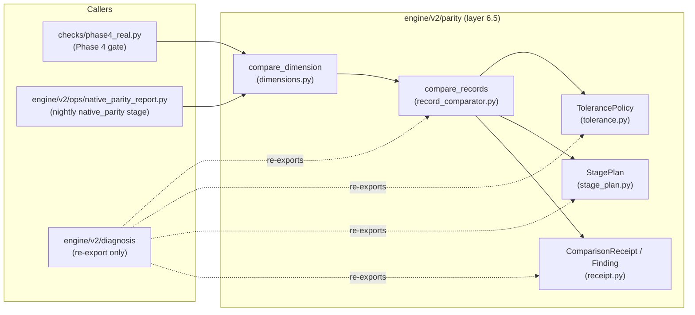

# `engine/v2/parity` — architecture

## Purpose

Root doc §2: layer 6.5, `only_imports=(0.5,)` (nothing but
`engine.v2.foundation`). Replaces the numeric field groups and
per-dimension comparator that used to live inside `checks/phase4_real.py`,
and is the home of the record-comparator core (`receipt`,
`record_comparator`, `stage_plan`, `tolerance`) that used to live in
`engine/v2/diagnosis`.

This package owns exactly one thing: **the one comparator every
native-vs-legacy or native-vs-frozen numeric comparison in this codebase
runs through**, so two callers checking "did these two records agree"
can never quietly drift onto two different answers. It decides nothing
about whether a difference matters (a person, reading the receipt, does
that) and repairs nothing (the package that produced the wrong value
does that). See `engine/v2/parity/README.md` for the full ownership
rationale (why layer 6.5 is legal, why the comparator core moved here
from `engine/v2/diagnosis`) — this doc does not repeat it.

## Primary contracts and public interfaces

- `compare_records(left, right, *, comparison_kind="score_record_parity",
  tier=0, left_ref="left", right_ref="right", stage_plan=SCORER_V1,
  tolerance_policy=SCORE_RECORD_V1) -> ComparisonReceipt`
  (`record_comparator.py`) — the comparator core. Flattens both mappings
  to dotted field paths, compares every path in ONE pass (never
  first-wins), and returns a `ComparisonReceipt` whose `verdict` is
  `"agree"`/`"differ"`/`"incomparable"` (`receipt.py`'s `AGREE`/`DIFFER`/
  `INCOMPARABLE`) — never a fourth value, and never `"agree"` for a
  missing input or an empty compared population (that is what
  `"incomparable"` exists to say instead).
- `compare_dimension(expected, actual, dimension, *,
  compare_records=compare_records, tolerance_policy=SCORE_RECORD_V1) ->
  dict` (`dimensions.py`) — the Phase 4 checker's own
  `_compare_dimension`, moved here unchanged, then widened by cutover
  PR-4 (below) with one new keyword. Returns
  `{"agree": bool, "finding_fields": [...], "receipt": <content hash>}`.
  `compare_records` stays injectable only so the Phase 4 checker's own
  negative controls can keep rebinding it through `checks.phase4_real`'s
  module global; no other caller has a reason to override it.
- `FORECAST_FIELDS`, `SIMULATION_FIELDS`, `FINANCIAL_FIELDS`,
  `GATE_FIELDS`, `ANALOG_FIELDS` (`dimensions.py`) — the checker's five
  numeric field-name tuples, by name; `NEVER_RAN_DIMENSIONS` — the subset
  (`simulation`, `verdicts`, `analogs`) the "a stage that never ran is
  agreement, not a numeric finding" rule (user decision, 2026-09-23)
  applies to.
- `Tolerance(absolute=0.0, relative=0.0, reason="exact")`,
  `TolerancePolicy(policy_id, rules=())`, `EXACT`, `SCORE_RECORD_V1`
  (`tolerance.py`) — see "Cutover PR-4" below for what these are and the
  one config-policy design this package now exposes for a pluggable
  numeric tolerance.
- `Finding`, `StageHashes`, `Population`, `Envelope`, `ComparisonReceipt`,
  `problem`, `Verdict`, `AGREE`/`DIFFER`/`INCOMPARABLE`,
  `PROBLEM_CATEGORIES` (`receipt.py`) — the shared failure envelope
  (component contracts §15.2's phase-0 subset).
- `Stage`, `StagePlan`, `SCORER_V1`, `UNASSIGNED`, `load_stage_plan`,
  `root_of` (`stage_plan.py`) — the ordered stage list a finding's field
  path is localized against; a field the plan does not name is still
  compared, in the `UNASSIGNED` stage, never silently dropped.

`engine/v2/diagnosis` re-exports `receipt`/`record_comparator`/
`stage_plan`/`tolerance` under its own historical module names (same
objects, not a copy) so every existing `engine.v2.diagnosis...` import
keeps working; `checks/phase4_real.py` imports this package's names
under its own underscore aliases the same way. Neither re-export is
changed by this PR.

## Inputs

- `compare_records`/`compare_dimension`: two already-decoded mappings
  (a legacy record's flat fields; a native `resolved_request`/stage-value
  view) — never a file path, a store, or a network call. This package
  reads nothing from disk and touches no database.
- `tolerance_policy`: an optional keyword argument on both
  `compare_dimension` and `compare_records`, defaulting to
  `SCORE_RECORD_V1` when the caller omits it; a caller wanting a
  different policy passes one in explicitly (a caller-owned config,
  never resolved from an environment variable, a file, or a database
  row by this package itself).

## Outputs

- One `ComparisonReceipt` per `compare_records` call; one
  `{"agree", "finding_fields", "receipt"}` dict per `compare_dimension`
  call. Neither call writes anything — no filesystem, no catalog, no
  artifact store. The caller (`checks/phase4_real.py`,
  `engine/v2/ops/native_parity_report.py`) decides whether and where to
  persist what it got back.

## Dependencies

`only_imports=(0.5,)` (root doc §2 layer table): every module in this
package imports `engine.v2.foundation` (`content_hash`) and nothing
above it — no `engine.v2.contracts` even, since a `Mapping`-shaped
document is all this package ever sees. Every package whose outputs get
compared here (`engine.v2.scoring` at 5.0, `engine.v2.evaluation`/
`engine.v2.ledger`/`engine.v2.models.training` at 6.0) sits strictly
below this package's own 6.5 and therefore cannot import it — the sink
rule that keeps a comparator from ever becoming a dependency of what it
compares (root doc §4.1) is structural here, not merely asserted.

Callers, by real import (checked, not assumed): `checks/phase4_real.py`
(the Phase 4 gate's own numeric comparison); `engine/v2/ops/native_parity_report.py`
(the nightly `native_parity` stage's report, `engine/v2/ops/ARCHITECTURE.md`'s
"Cutover PR-4" section); `engine/v2/diagnosis` (re-export only, never a
second implementation). No other package imports this one.

## External systems and libraries

None. Pure in-memory computation over already-decoded Python mappings;
standard library only (`dataclasses`, `datetime`, `fnmatch`, `math`,
`time`, `typing`).

## Failure semantics

- **R1, missing input.** `compare_records` never raises on a missing
  input: `left`/`right` being `None`, or both flattening to an empty
  field-path set, each returns a `ComparisonReceipt` with
  `verdict="incomparable"` (a `problem(...)`-shaped cause, category
  `"dependency"`/`"validation"`) — never `"agree"`, which would let an
  unresolvable comparison silently read as a clean one. `compare_dimension`
  does NOT itself validate its own `dimension` argument (the string is
  used only to label `comparison_kind=f"phase4_{dimension}_parity"`); a
  caller that hands it a dimension name outside its own known set gets
  whatever `compare_records` returns for the fields it was actually
  given, not a dimension-name refusal from this package. Validating that a
  `dimension` string is one of the checker's five known field groups
  before ever calling `compare_dimension` is the CALLER's job — see
  `engine/v2/ops/ARCHITECTURE.md`'s `native_parity_report._dimension_fields`
  (`INVALID_REQUEST` for an unknown dimension) for the one caller that
  does this today.
- **R2, cache.** None. Every call is a pure function of its arguments;
  nothing is memoized or reused across calls.
- **R3, retry.** Not applicable: no I/O, so nothing to retry. A caller
  that wants to re-compare simply calls again with the same inputs and
  gets the same receipt (R6, below).
- **R4, transaction.** Not applicable: no write of any kind happens in
  this package.
- **R5, partial write.** Not applicable, for the same reason.
- **R6, idempotency.** `compare_records` is a pure function: the same
  `(left, right, comparison_kind, tier, left_ref, right_ref, stage_plan,
  tolerance_policy)` always returns the same `ComparisonReceipt` (its
  `receipt_id` is itself a `content_hash` of the comparison's own
  identity and findings — a deterministic re-derivation, never a random
  or clock-derived id; the `Envelope`'s wall-clock fields are excluded
  from every content hash per component contracts §2.5, so re-running a
  comparison reproduces the same payload without reproducing its elapsed
  time). `compare_dimension`'s own `"receipt"` value is a `content_hash`
  over `{dimension, verdict, findings}` for the identical reason.

### Cutover PR-4: the tolerance policy is now pluggable, exact by default

**Real code, landed independently of every other cutover-PR-4 piece**
(the rest of that work — `legacy_parity_rows`, the "explained" bucket,
`tools/native_parity_run.py` — is still documentation-only in
`engine/v2/ops/ARCHITECTURE.md`, gated on cutover PR-3/`#66` merging
first; this piece needed neither). Before this change,
`compare_dimension` hardcoded `tolerance_policy=SCORE_RECORD_V1` inside
its own `compare_records(...)` call — the ONE numeric tolerance every
caller got, with no way to plug in a different one without editing this
module. `compare_dimension` now takes `tolerance_policy` as a keyword
argument (default `SCORE_RECORD_V1`, unchanged), and passes it straight
through to `compare_records` (which already had this exact parameter,
independently, and always did — only `compare_dimension`'s own wrapper
was the fixed point). `checks/phase4_real.py` and most existing tests
pass none of them and so cannot observe a behavior change; two tests in
`tests/test_v2_ops_native_shadow_render.py`, though —
`test_native_parity_handler_threads_tolerance_policy_into_written_report`
and `test_tolerance_policy_is_threaded_through_compare_dimension_and_report`
— DO pass an explicit `tolerance_policy`, which proves the new keyword
is really threaded through rather than merely accepted and ignored.

**Per-field tolerances come from ONE config policy — the
`TolerancePolicy` type already defined in `tolerance.py` — never a
second, ad hoc mechanism invented at the call site.** `TolerancePolicy`
is an ordered list of `(field glob, Tolerance)` rules, first match wins,
falling back to `EXACT` for anything undeclared (`tolerance.py`'s own
`for_field`); `SCORE_RECORD_V1` is the one instance this package ships,
and it declares `rules=()` — by design (its own docstring: a tier-0
round trip that needs a tolerance has already lost information, which is
the defect, not something to absorb) — so every field compares exact
under it. Making `tolerance_policy` a parameter, rather than widening
`SCORE_RECORD_V1` itself or hand-rolling a second policy object inside
`engine/v2/ops`, is what keeps this a ONE-policy-type design: a future,
user-ratified `TolerancePolicy` for the native-vs-legacy parity
comparison specifically plugs into the SAME seam, is instantiated
wherever that ratification lives, and is passed in by its caller — this
package neither invents nor stores that object.

**No per-field tolerance VALUE is added, chosen, or implied by this
change, and none belongs in this doc** (`tolerance.py`'s own docstring
names the failure mode this avoids: "chosen to make the first run pass").
`engine/v2/ops/native_parity_report.py`'s own doc records that the
default stays exact until a ratified policy is supplied there; this doc
states only that the seam exists and how it is shaped, never a number.

## Invariants

Enforces, from the root doc §5: **one shared parity comparator** — every
numeric native-vs-legacy or native-vs-frozen comparison in this codebase
runs through `compare_records`/`compare_dimension`, never a
second, independently written comparison; **incomparable is not
agreement** — a missing input or an empty population is its own verdict,
never silently folded into `"agree"`; **complete, not first-wins** —
every field is compared in one pass, so five independent causes are five
findings in one receipt, never five separate nights of debugging (the
2026-09-11 incident this package's own module docstrings still cite).
`only_imports=(0.5,)` is enforced structurally by the layer map, not by
convention: nothing above `engine.v2.foundation` is reachable from this
package's own imports.

## Diagrams

`compare_dimension` is the one entry point every caller in the diagram
uses; `checks/phase4_real.py` calls it in production today, while
`engine/v2/ops/native_parity_report.py` imports it too but currently has
only test callers of its own, not a production one — see
`engine/v2/ops/ARCHITECTURE.md` for that detail. `compare_records`
underneath it is the actual comparator, and
`tolerance_policy` (the new pluggable seam) flows from the caller, through
`compare_dimension`, into `compare_records`, never resolved or defaulted
inside `compare_records` itself beyond its own existing
`tolerance_policy=SCORE_RECORD_V1` default.
