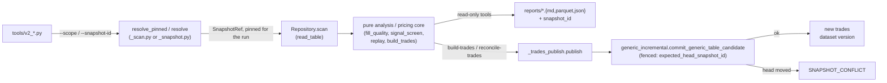

# `engine/v2/research` — architecture

Layer 7.0 in the root `/ARCHITECTURE.md` layer table (declared twice in
`checks/layer_map.py`, at 6.0 and at 7.0; `package_of`'s dict keeps the last
definition, so 7.0 is the enforced layer — see the root doc's own note on
this disagreement). Not a row of the root doc's §4 owner table: added by
Phase 6 slice 6/7 to resolve decision **UD-4** (2026-09-20 — "we can move
[the research tools] to the v2 snapshots ... we need to get off of legacy
either way"). Replaces the store-reaching halves of `tools/signal_screen.py`,
`tools/fill_quality.py`, `engine/data/pulls/polygon_fills.py`'s read path,
`engine/replay.py` (over a committed snapshot) and `engine/build_trades.py`'s
v2 write path. The legacy modules themselves are untouched and keep
publishing exactly as before; this package adds parallel `tools/v2_*` CLIs
that read a pinned v2 snapshot instead.

`tools/log_diagnostics.py` is deliberately **not** moved here: it reads only
a local transactions-log CSV, never the Tier-2 store, so it needs no
snapshot-pinned counterpart.

## Purpose

Offline research analysis CLIs — real-fill quality, a cross-sectional signal
screen, the real-trade pull's universe plan, deterministic as-of replay, and
the trade table that replay publishes — reading exactly one resolved,
named snapshot per run instead of the legacy mutable Tier-2 store. It
produces measured tables and reports for a person to read; it never decides
a research conclusion, never fetches from a network provider, and never
mutates the legacy trades ledger.

## Primary contracts and public interfaces

CLI leaves (`tools/`, one process per run, each takes `--catalog`,
`--store-root`, `--scope` and `--snapshot-id`):

- `tools/v2_fill_quality.py` — real Polygon trades vs ORATS quotes.
- `tools/v2_polygon_fills.py` — the real-trade pull's contract universe
  (plan only; fetches nothing — the legacy `build_plan`/`execute` network
  half stays in `engine/data/pulls/`).
- `tools/v2_signal_screen.py` — the long-put cross-sectional screen.
- `tools/v2_replay.py` — deterministic as-of replay of selected structures.
- `tools/v2_build_trades.py` — replay a strategy set and publish a new
  `trades` dataset version.
- `tools/v2_reconcile_trades.py` — tombstone the `trades` table's
  non-canonical simulated rows as a new dataset version.

These CLI files sit outside `checks/import_layers.py`'s hook (it only parses
`engine*` importers), so no `engine` package is recorded as importing this
one; the library entrypoints below are this package's real public interface:

`signal_screen.run`, `fill_quality.run`, `polygon_fills.run`, `replay.replay`,
`replay.replay_one`, `_replay_run.run`, `_replay_run.events_frame`,
`_plan.plan_events`, `_chains.ChainIndex`, `_trades_table.to_trades_table`,
`_build_run.run`, `reconcile_trades.run`, `_trades_publish.publish`,
`build_trades.coverage`, `_pricing.STRUCTURES`.

Internal (not interface, despite the non-underscore package norm elsewhere):
`_scan.py` and `_snapshot.py` (see Dependencies — two independent
snapshot-read helpers), `_pricing.py`, `_trades_revisions.py`.

## Inputs

- `--catalog` (sqlite path) and `--store-root` (`ArtifactStore` root):
  required by every CLI; opened once per run via
  `engine.v2.ops.bootstrap.open_catalog` / `engine.v2.foundation.ArtifactStore`.
- `--scope` (default `"shadow"`, `_scan.DEFAULT_SCOPE`/`_snapshot.DEFAULT_SCOPE`)
  and `--snapshot-id` (default `None`): together they resolve the *one*
  `SnapshotRef` the run reads. An explicit id reproduces a run after the
  scope's head has moved; omitting it resolves the scope's current pinned
  head. Exactly one `resolve`/`resolve_pinned` call is made per run — the
  resolved id is fixed for the rest of that process regardless of what
  commits to the scope afterward.
- Tier-2 tables, read through `Repository.scan` against that one snapshot:
  `option_chains` (ORATS EOD quotes — fill quality, replay's chain reads),
  `option_daily` (Polygon traded bars — fill quality), `daily_market`
  (signal screen), `trades` (build-trades' read-before-append, reconcile's
  read-before-prune) and `earnings_events` (the canonical event universe
  both trade-table tools filter to).
- `--since`, `--min-date`, `--years`, `--strategy` (repeatable, from
  `_pricing.STRUCTURES`): per-tool read/filter narrowing; never widen a read
  past the resolved snapshot.
- `--dry-run` (build-trades, reconcile-trades): compute the candidate
  changeset, skip `commit_generic_table_candidate`.

## Outputs

- Fill quality / signal screen: a parquet of joined/scored rows and a
  markdown summary under `reports/`, both stamped with the resolved
  `snapshot_id`; fill quality also accepts `--csv`.
- Polygon fills: a JSON contract plan under `reports/` (contract count,
  contract-days, ordered contracts), carrying `snapshot_id`. No network
  call and no write to the pull's raw cache.
- Replay: per-trade records (`_trades_table.to_trades_table`) with
  `snapshot_id` and `provenance` columns set to this package's own
  provenance tag, never the legacy `engine.replay` tag.
- Build-trades / reconcile-trades: a **new version** of the `trades` table,
  committed through `engine.v2.data.generic_incremental`, plus a JSON
  outcome summary (`committed`, `outcome`, `committed_snapshot_id`,
  `emitted_revisions`) — never a rewrite of the table version the run read.
- Every output that carries data also carries the `snapshot_id` it was
  read from, so a report is reproducible without re-resolving anything.

## Dependencies

`engine.v2.data` (`Repository`, `errors`, `generic_incremental`), `engine.v2.
contracts.data` (`DataQuery`, `KeyPredicate`, `SnapshotRef`, `TimeInterval`),
`engine.v2.foundation` (`ArtifactStore`, `SystemClock`), `engine.v2.ops.
bootstrap.open_catalog` — all below this package's own layer, consistent
with the generic "may import anything at a lower layer" rule (`only_imports`
is unset for this package in `checks/layer_map.py`, i.e. no narrower
restriction than that generic rule). No import of `engine.v2.scoring`,
`engine.v2.evaluation`, `engine.v2.ledger` or any sibling/higher package.
`_pricing.py` holds pure pricing primitives copied from legacy
`engine.structures`/`engine.fills`/`engine.calendar` rather than reached
through a legacy adapter (supervisor decision: no legacy adapter for this
package). `polygon_fills.option_ticker` is likewise a verbatim copy of
`engine.data.sources.polygon.option_ticker` rather than an import, for the
same reason: a v2 package may not import legacy code without a declared
adapter.

**Known duplication (pre-existing, not touched by this doc's change):**
two independent snapshot-resolution modules exist side by side —
`_scan.py` (used by `fill_quality.py`, `polygon_fills.py`,
`signal_screen.py`) splits a bounded read into calendar-month/day intervals
so a multi-million-row year partition (e.g. `option_chains`) never exceeds
`maximum_result_rows` in one scan; `_snapshot.py` (used by `_chains.py`'s
replay reads and `_trades_publish.py`'s build/reconcile reads) bounds a read
by partition-key predicates only, with no time-interval splitting. Both
were kept, under the same names, because a sibling in-flight branch
(`worktree-agent-aa49bb24e5d746918`) already owned the name `_scan.py` for
its own version when `_snapshot.py`'s functionality was needed — a
naming collision avoidance, not a design intent to have two mechanisms.
Tracked as a follow-up (see hand-back); not fixed here because neither
module changed in this PR.

Callers: nothing inside `engine/` imports this package (checked against
`checks/import_layers.py`'s import graph). The only consumers are the CLI
leaves listed above, which the layering hook does not parse.

## External systems and libraries

None directly: no network call (Polygon/ORATS pulls stay in
`engine/data/pulls/`, legacy and unmoved), no direct filesystem access
outside `ArtifactStore`/the sqlite catalog connection it is handed, and no
third-party service. `pandas`/`numpy`/`pyarrow` for frame arithmetic.

## Failure semantics

The 4c R1–R6 template. Every refusal is a `DataError`
(`engine.v2.data.errors.DataError`) carrying one of the registered
`DATA_FAILURE_CODES`; a CLI catches it at `main()` and exits 2 with the code
and message on stderr rather than a bare traceback.

- **R1, missing input.**
  - **No committed scope head, and no explicit `--snapshot-id`.**
    `resolve_pinned(scope)` (or, for the `_snapshot.py`-backed tools,
    `head_generation`) raises `SNAPSHOT_NOT_READY` (`category="dependency"`,
    **retryable**) — this is the closest this package comes to "refuses
    rather than silently reading latest": a scope with nothing committed
    to it has no head to read, so the run stops rather than resolving
    nothing. A scope *with* a committed head and no explicit
    `--snapshot-id` resolves that head deterministically and once; the
    resolved id is always written into the output so the exact snapshot a
    report came from is never ambiguous after the fact, and `--snapshot-id`
    lets a later run reproduce it even after the head has since moved.
  - **An explicit `--snapshot-id` that does not exist, or a manifest that
    fails its own hash check.** `Repository.resolve`/`resolve_full` raises
    `MANIFEST_CORRUPT` (`category="integrity"`, not retryable) — a
    tampered or unknown id is refused, never silently substituted for the
    scope head.
  - **A table absent from the resolved snapshot, or with no recorded
    fragment time bounds** (`_scan.py`'s path) **or no declared partition
    column** (`_snapshot.py`'s path). `CONTRACT_MISMATCH`
    (`category="validation"`, not retryable).
  - **A single day-partition scan that still exceeds
    `maximum_result_rows`** (`_scan.py`'s path only — `_snapshot.py` has no
    finer split to fall back to). `RESULT_LIMIT_EXCEEDED`
    (`category="resource"`, not retryable): the table needs finer
    partitioning than this rule can supply; it never truncates silently.
  - **No overlap rows after a join/filter** (fill quality's
    `since`-filtered join). `POPULATION_COLLAPSED`
    (`category="validation"`, not retryable) — an empty report is refused
    rather than published as a zero-row "result".
- **R2, cache.** None: every run resolves its snapshot and reads its tables
  fresh through `Repository.scan`; nothing is cached across runs or across
  processes. Within one run, the resolved `SnapshotRef` and, in the replay
  path, the loaded `ChainIndex` are held once in memory for that run's
  reads only (module-level caches the legacy code held for a mutable store
  are gone, on purpose — a pinned snapshot never changes under a run, so
  there is nothing to invalidate).
- **R3, retry.** None automatic. `SNAPSHOT_NOT_READY` and `SNAPSHOT_CONFLICT`
  are the only two retryable codes this package can raise; a retry is an
  operator re-running the same command (a scope head may have since
  appeared, or the conflicting writer may have finished). Every other code
  above is not retryable — re-running with the same arguments reproduces
  the same refusal.
- **R4, transaction.** Build-trades and reconcile-trades are the only
  writers here; both go through the one shared path,
  `_trades_publish.publish` → `engine.v2.data.generic_incremental.
  build_generic_table_candidate` / `commit_generic_table_candidate`. The
  commit is fenced to the exact snapshot the run read
  (`expected_head_snapshot_id`, `expected_head_generation`): if another
  writer advanced the scope's head in between, the commit refuses
  `SNAPSHOT_CONFLICT` (`category="dependency"`, retryable) rather than
  silently overwriting or merging. `--dry-run` builds the same candidate
  and stops before the commit call, so the changeset can be inspected with
  no write at all.
- **R5, partial write.** None observable: `commit_generic_table_candidate`
  is the one write call, and it is the same atomic snapshot-commit
  mechanism every other v2 writer uses (`engine.v2.data.generic_incremental`
  — see `engine/v2/data`'s own doc for the commit protocol). A crash before
  that call leaves the parent snapshot untouched; a crash during or after
  it is the generic incremental writer's own atomicity guarantee, not
  something this package adds to or weakens.
- **R6, idempotency.** Read-only tools (fill quality, polygon fills, signal
  screen, replay by itself) are naturally idempotent: the same resolved
  snapshot and the same arguments always read the same rows and produce a
  byte-identical report. Build-trades and reconcile-trades are NOT
  idempotent in the sense of "running twice changes nothing": each
  successful commit publishes a new `trades` version pinned to the
  snapshot it read, so re-running against the same parent snapshot after a
  successful commit reads a different (newer) `trades` version and can
  produce a different, non-empty changeset (or a `noop` outcome when the
  replay recomputes the same revisions the previous run already
  published). The commit call itself is not re-entrant/retried internally;
  a caller that wants "publish this exact changeset once" relies on the
  `SNAPSHOT_CONFLICT` fence, not on this package silently no-op-ing a
  duplicate call.

## Invariants

- One `resolve`/`resolve_pinned` call per run; the resulting `snapshot_id`
  is threaded through every subsequent read and written into every output
  (root doc §5's "no silent default" invariant, applied to research reads).
- Never reads the legacy mutable Tier-2 store (`engine.data.store`) —
  every table read is a bounded `Repository.scan` against the one resolved
  snapshot.
- Never mutates the legacy trades ledger and never calls a network
  provider; `engine/build_trades.py` and `engine/data/pulls` (legacy,
  unchanged) keep doing both.
- A trade-table write always goes through
  `engine.v2.data.generic_incremental`'s fenced commit — never a
  read-modify-write of an existing table version.
- Pricing/planning/chain-indexing cores that moved from legacy
  (`replay.py`, `_plan.py`, `_chains.py`, `_trades_table.py`) stay
  byte-identical to their legacy counterparts; only the store-reaching
  edges were rewritten, so the v2 path and the legacy board cannot drift
  on arithmetic. `tests/test_v2_research_tools.py` /
  `test_v2_research_replay.py` / `test_v2_research_build_trades.py` /
  `test_v2_research_reconcile_trades.py` enforce this by comparing against
  the legacy function on the same synthetic frame.

## Diagram

