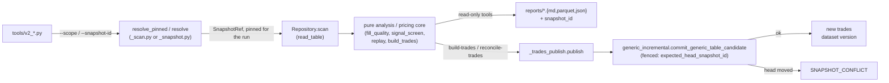

# `engine/v2/research` — architecture

Layer 7.0 in the root `/ARCHITECTURE.md` layer table (declared twice in
`checks/layer_map.py`, at 6.0 and at 7.0; `package_of`'s dict keeps the last
definition, so 7.0 is the enforced layer — see the root doc's own note on
this disagreement). Not a row of the root doc's §4 owner table: added by
Phase 6 slice 6/7 to resolve decision **UD-4** (2026-09-20 — "we can move
[the research tools] to the v2 snapshots ... we need to get off of legacy
either way"). Replaces the store-reaching halves of `tools/signal_screen.py`,
`tools/fill_quality.py`, `engine/data/pulls/polygon_fills.py`'s read path,
`engine/replay.py` (over a committed snapshot) and `engine/build_trades.py`'s
v2 write path. The legacy modules themselves are untouched and keep
publishing exactly as before; this package adds parallel `tools/v2_*` CLIs
that read a pinned v2 snapshot instead.

`tools/log_diagnostics.py` is deliberately **not** moved here: it reads only
a local transactions-log CSV, never the Tier-2 store, so it needs no
snapshot-pinned counterpart.

## Purpose

Offline research analysis CLIs — real-fill quality, a cross-sectional signal
screen, the real-trade pull's universe plan, deterministic as-of replay, and
the trade table that replay publishes — reading exactly one resolved,
named snapshot per run instead of the legacy mutable Tier-2 store. It
produces measured tables and reports for a person to read; it never decides
a research conclusion, never fetches from a network provider, and never
mutates the legacy trades ledger. `experiment_trades.load_trades` extends
this same one-snapshot-per-read contract to the v2 experiment platform:
read the committed `trades` version
`tools/v2_build_trades.py` published, never the legacy mutable store.
Completed experiments need not remain runnable;
their historical wrappers are not a supported experiment execution boundary.

## Primary contracts and public interfaces

CLI leaves (`tools/`, one process per run, each takes `--catalog`,
`--store-root`, `--scope` and `--snapshot-id`):

- `tools/v2_fill_quality.py` — real Polygon trades vs ORATS quotes.
- `tools/v2_polygon_fills.py` — the real-trade pull's contract universe
  (plan only; fetches nothing — the legacy `build_plan`/`execute` network
  half stays in `engine/data/pulls/`).
- `tools/v2_signal_screen.py` — the long-put cross-sectional screen.
- `tools/v2_replay.py` — deterministic as-of replay of selected structures.
- `tools/v2_build_trades.py` — replay a strategy set and publish a new
  `trades` dataset version.
- `tools/v2_reconcile_trades.py` — tombstone the `trades` table's
  non-canonical simulated rows as a new dataset version.

These CLI files sit outside `checks/import_layers.py`'s hook (it only parses
`engine*` importers), so no `engine` package is recorded as importing this
one; the library entrypoints below are this package's real public interface:

`signal_screen.run`, `fill_quality.run`, `polygon_fills.run`, `replay.replay`,
`replay.replay_one`, `replay.ALPHA_GRID`, `_replay_run.run`,
`_replay_run.events_frame`, `_plan.plan_events`, `_chains.ChainIndex`,
`_chains.load_chain_index`, `_chains.filter_plan_by_availability`,
`_chains.read_chain_keys`, `_chains.read_chain_keys_for`,
`_trades_table.to_trades_table`, `_build_run.run`,
`reconcile_trades.run`, `_trades_publish.publish`, `build_trades.coverage`,
`_pricing.STRUCTURES`, `_pricing.trading_calendar_from_snapshot`,
`_pricing.execution_variant_label`.

`experiment_trades.load_trades(repository, snapshot, strategy, *, as_of_month,
purpose="training", event_ids=None)` is a second
kind of entrypoint: a plain library call (no `tools/v2_*.py` CLI of its own),
for a v2 platform caller that already holds a
`Repository` and a resolved `SnapshotRef` and wants one strategy's committed
`trades` rows, session-joined, with legacy-compatible trade columns plus
holdout context. `_pricing.trading_calendar_from_snapshot`
is a third: carved out of `_pricing.py`'s otherwise-internal contents the
same way `_pricing.STRUCTURES` already is, for the same caller — a repricer
built over a pinned snapshot needs the identical trading calendar `replay()`
itself derives, not a second implementation and not the legacy CSV fallback
(see Invariants). `_pricing.execution_variant_label` is a fourth, carved out
for `experiments/v2_candidate_grid.py`'s `price_candidate_grid` (issue #266
slice 2), which labels each priced grid-position step with the same
execution-variant string `replay()` itself uses, rather than reimplementing
that labeling.

Experiment training, selection-fold and sweep reads exclude the union of the
two holdouts specified in [#373](https://github.com/yshewchuk/investment-validation/pull/373).
Shared membership definitions live in `foundation.experiment_holdouts`.
The explicit rolling as-of month and both membership versions accompany the
snapshot id in returned columns; exclusion labels are in `holdout_exclusions`
frame attributes. Conflicting event IDs at one ticker/date/session or cluster,
and other ambiguous canonical identity/date matches, are excluded and
labelled `ambiguous`. Released eligible rows are labelled `post-release selection`.
A requested `event_ids` population containing any excluded event raises the
non-retryable `DataError(HOLDOUT_ACCESS_DENIED)` during population validation,
before returning a frame to metric/report writers. Missing/invalid context,
an as-of month later than the current UTC month,
unknown purposes and an entirely excluded population receive the same refusal.
There is no date fallback, partial returned frame, report write or retry here.
Final holdout reads are unavailable. This read-only interface does not write
durable refusal receipts or ledger rows.

`experiment_exits.walk_fixed_day(repository, snapshot, positions, economic_params=...)`
accepts entered `EnteredPosition`/`PositionLeg` contracts and resolved experiment
economics: `exit={kind: "fixed_day", trading_days: N}` with positive integer N,
explicit numeric `fill` in the alpha ladder's range, and `price_source="option_chains"`.
The immutable resolved economics and canonical plan identity retain N.
It reprices the held legs on every observed trading day from entry
through entry plus the declared positive `trading_days`, using the pinned
`daily_market` calendar and `option_chains` quotes with `_pricing.FillModel`'s
existing alpha ladder; no projected calendar, replacement contract or mark source.
Results are `mark_based` per-option-unit P&L with exit decision, visited dates,
source, alpha fill convention and snapshot identity.

| Fixed-day failure condition | Outcome (design #372 R4) |
|---|---|
| Malformed position or leg record | Non-retryable `EXPERIMENT_VARIANT_FAILED`; whole call fails, no excluded trade or partial tuple. |
| Missing required leg mark | Non-retryable `EXPERIMENT_VARIANT_FAILED`; whole call fails, no excluded trade or partial tuple. |
| Unusable quote reaching pricing | Non-retryable `EXPERIMENT_VARIANT_FAILED`; whole call fails, no excluded trade or partial tuple. |
| Insufficient calendar coverage | Non-retryable `EXPERIMENT_VARIANT_FAILED`; whole call fails, no excluded trade or partial tuple. |

Other repository refusals propagate.
No cache, retry, transaction or write: identical inputs return identical results.
Report/ledger publication, target/stop recipes and aggregation belong to slice 7b.

Internal (not interface, despite the non-underscore package norm elsewhere):
`_scan.py` and `_snapshot.py` (see Dependencies — two independent
snapshot-read helpers), `_pricing.py` (except the names carved out above),
`_trades_revisions.py`.

## Inputs

Target research reads cover each full pinned partition, including null and
non-midnight observation times, subject to caller predicates and batch
filtering. The manifest population bound limits candidate rows, not RSS or
process memory — the recorded row-count sum of pinned fragments surviving
pruning ([data scan population rule](../data/ARCHITECTURE.md#invariants)).
Each scan uses that same bound for its snapshot, contract and predicates;
research adds no second result limit. Empty selected membership
allows zero result rows with a positive batch size. Month/day retries and
null-overflow refusals are not part of this contract: a complete read either
returns its population or raises its typed refusal. Predicates, exact-pair
filtering, batch filtering, successful row ordering and deduplication remain
part of the read contract.

The internal `_scan.read_table` and `_snapshot.read_table` readers accept an
optional `batch_filter` callback. They invoke it immediately after each Arrow
batch becomes a pandas frame, before retaining frames; it returns narrowed
rows or `None` for no rows. Omitting it or passing `None` preserves existing
reads. `_chains.load_chain_index` uses it to keep exact requested ticker/date
pairs while reading one manifest year at a time; stored dates retain their
original timestamp semantics and requested dates use the existing normalization.
Independent ticker and date memberships may prune a scan batch, but only the
exact pair mask — never their cross product — defines the retained rows.
Successful frames retain ordering and duplicates.
This bounds retained unmatched rows, not total process RSS.

- `--catalog` (sqlite path) and `--store-root` (`ArtifactStore` root):
  required by every CLI; opened once per run via
  `engine.v2.ops.bootstrap.open_catalog` / `engine.v2.foundation.ArtifactStore`.
- `--scope` (default `"shadow"`, `_scan.DEFAULT_SCOPE`/`_snapshot.DEFAULT_SCOPE`)
  and `--snapshot-id` (default `None`): together they resolve the *one*
  `SnapshotRef` the run reads. An explicit id reproduces a run after the
  scope's head has moved; omitting it resolves the scope's current pinned
  head. A CLI that resolves before its first table read passes that id to
  downstream runners; any later lookup uses the explicit id rather than
  resolving the possibly advanced scope head again.
- Tier-2 tables, read through `Repository.scan` against that one snapshot:
  `option_chains` (ORATS EOD quotes — fill quality, replay's chain reads),
  `option_daily` (Polygon traded bars — fill quality), `daily_market`
  (signal screen; also the replay/build-trades planning calendar, see
  below), `trades` (build-trades' read-before-append, reconcile's
  read-before-prune) and `earnings_events` (the canonical event universe
  both trade-table tools filter to).
- Replay and build-trades derive the trading-day calendar `plan_events`
  needs from that same pinned snapshot's `daily_market` table
  (`_pricing.trading_calendar_from_snapshot`, reading only the `date`
  column through `_scan.read_table`) — never from a local file or
  `INVESTING_PLAN_ROOT`. A snapshot with no `daily_market` table refuses
  (`CONTRACT_MISMATCH`) rather than inventing a calendar; see Failure
  semantics.
- `--since`, `--min-date`, `--years`, `--strategy` (repeatable, from
  `_pricing.STRUCTURES`): per-tool read/filter narrowing; never widen a read
  past the resolved snapshot.
- `--dry-run` (build-trades, reconcile-trades): compute the candidate
  changeset, skip `commit_generic_table_candidate`.

## Outputs

- Fill quality / signal screen: a parquet of joined/scored rows and a
  markdown summary under `reports/`, both stamped with the resolved
  `snapshot_id`; fill quality also accepts `--csv`.
- Polygon fills: a JSON contract plan under `reports/` (contract count,
  contract-days, ordered contracts), carrying `snapshot_id`. No network
  call and no write to the pull's raw cache.
- Replay: per-trade records (`_trades_table.to_trades_table`) with
  `snapshot_id` and `provenance` columns set to this package's own
  provenance tag, never the legacy `engine.replay` tag.
- Build-trades / reconcile-trades: a **new version** of the `trades` table,
  committed through `engine.v2.data.generic_incremental`, plus a JSON
  outcome summary (`committed`, `outcome`, `committed_snapshot_id`,
  `emitted_revisions`) — never a rewrite of the table version the run read.
- Every output that carries data also carries the `snapshot_id` it was
  read from, so a report is reproducible without re-resolving anything.
  `experiment_trades.load_trades` includes its explicit snapshot and holdout
  context columns alongside the legacy-compatible trade columns.

## Dependencies

`engine.v2.data` (`Repository`, `errors`, `generic_incremental`), `engine.v2.
contracts.data` (`DataQuery`, `KeyPredicate`, `SnapshotRef`, `TimeInterval`),
`engine.v2.foundation` (`ArtifactStore`, `SystemClock`) — the package's own
lower-layer dependencies, consistent with the generic "may import anything
at a lower layer" rule (`only_imports` is unset for this package in
`checks/layer_map.py`, i.e. no narrower restriction than that generic
rule). No import of `engine.v2.scoring`, `engine.v2.evaluation`,
`engine.v2.ledger` or any sibling/higher package. `engine.v2.ops.
bootstrap.open_catalog` is a CLI dependency, not a package one: the
`tools/v2_*.py` leaves call it to open `--catalog` before handing the
connection to this package (see Inputs); nothing under
`engine/v2/research/` imports `engine.v2.ops` itself, even though layer
7.0 (ops) is not below this package's own enforced layer (also 7.0) and
so could not be imported under the generic rule regardless.
`_pricing.py` holds pure pricing primitives copied from legacy
`engine.structures`/`engine.fills`/`engine.calendar` rather than reached
through a legacy adapter (supervisor decision: no legacy adapter for this
package). `polygon_fills.option_ticker` is likewise a verbatim copy of
`engine.data.sources.polygon.option_ticker` rather than an import, for the
same reason: a v2 package may not import legacy code without a declared
adapter.

**Known duplication (issue #69):** `_scan.py` (used directly by
`fill_quality.py`, `polygon_fills.py`, `signal_screen.py`, and
`_pricing.trading_calendar_from_snapshot`) and
`_snapshot.py` (used by `_chains.py`'s replay reads and
`_trades_publish.py`'s build/reconcile reads) are still two independent
modules. `_snapshot.read_table` delegates its scan to `_scan.read_table`,
forwarding caller `key_filter` predicates; `_snapshot.py` keeps its partition-key
resolution, its own no-partition refusal, and its own empty-result frame
shape. Merging the two remains issue #69: that would change both
modules' callers, outside this PR's one concern.

Callers: nothing inside `engine/` imports this package (checked against
`checks/import_layers.py`'s import graph). The `tools/v2_*.py` CLI leaves
listed above are one consumer; `experiments/common_v2.py` is another, for
`experiment_trades.load_trades`, `_pricing.trading_calendar_from_snapshot`
and `_chains.load_chain_index`; its archived trade-read caller omits the now-required
holdout context and is refused. The historical EXP-147 confirmatory-validation
runner is a third, for `experiment_trades.PROVENANCE` alone (its native
replay tag, selecting that runner's analog population).
`experiments/v2_candidate_grid.py` (`price_candidate_grid`, issue #266
slice 2) is a fourth: it reads
`_chains.filter_plan_by_availability`/`read_chain_keys_for`, `_plan.plan_events`,
`_pricing.STRUCTURES`/`execution_variant_label`/`trading_calendar_from_snapshot`,
and `replay.ALPHA_GRID`/`replay_one` to price one strategy family across a
grid-position sweep on one pinned snapshot. `experiments/EXP-186_.../run.py`
is a fifth, reading `_replay_run.events_frame` for its known-session event
universe before handing it to `price_candidate_grid`. None of the five are
parsed by the layering hook (it only parses `engine*` importers, and
`experiments/` is outside it too).

## External systems and libraries

None directly: no network call (Polygon/ORATS pulls stay in
`engine/data/pulls/`, legacy and unmoved). Snapshot access uses
`ArtifactStore` and the sqlite catalog connection it is handed. Two
exceptions, both plain local files outside `ArtifactStore` and never
snapshot-store objects: report writers (`fill_quality.write_report`,
`signal_screen.write_report`, `polygon_fills.run`'s own write step) write
Markdown/parquet/CSV/JSON directly under the caller-provided
`reports_dir`/`out_dir`; and `_pricing.trading_calendar()` reads a local
CSV (`earnings_predictions/data/raw/polygon/gspc_daily.csv`, off
`INVESTING_PLAN_ROOT` or the worktree root). That CSV reader is kept only
for legacy-parity tests and direct library callers — no OTHER module in
this package imports or calls it (`_plan.py` no longer does; a guard test,
`test_trading_calendar_csv_fallback_is_not_reachable_from_the_package`,
statically checks every file in this package but `_pricing.py` itself for
an import or a call of the bare name). `_replay_run.run` and
`_build_run.run` resolve the replay/build-trades calendar from the pinned
snapshot's own `daily_market` table (`_pricing.trading_calendar_from_snapshot`)
before calling `replay()`; `replay()` itself also derives one this same
way, from its own `(repository, snapshot_ref)` arguments, for any OTHER
caller that leaves `calendar` unset — so every path to a calendar in this
package ends at a pinned snapshot or an explicit argument, never a local
file, and a run's calendar is fixed by its `snapshot_id` like everything
else it reads (see Failure semantics, Invariants). No third-party service.
`pandas`/`numpy`/`pyarrow` for frame arithmetic.

## Failure semantics

The 4c R1–R6 template. Every refusal is meant to be a `DataError`
(`engine.v2.data.errors.DataError`) carrying one of the registered
`DATA_FAILURE_CODES`, which a CLI catches at `main()` and exits 2 with the
code and message on stderr rather than a bare traceback — with one
pre-existing exception, called out below where it applies
(`_snapshot.py`'s bare `ValueError`, issue #70), that escapes as an
uncaught traceback instead.

- **R1, missing input.**
  - **No committed scope head, and no explicit `--snapshot-id`.**
    `resolve_pinned(scope)` (or, for the `_snapshot.py`-backed tools,
    `head_generation`) raises `SNAPSHOT_NOT_READY` (`category="dependency"`,
    **retryable**) — this is the closest this package comes to "refuses
    rather than silently reading latest": a scope with nothing committed
    to it has no head to read, so the run stops rather than resolving
    nothing. A scope *with* a committed head and no explicit
    `--snapshot-id` resolves that head deterministically and once; the
    resolved id is always written into the output so the exact snapshot a
    report came from is never ambiguous after the fact, and `--snapshot-id`
    lets a later run reproduce it even after the head has since moved.
  - **An explicit `--snapshot-id` that does not exist.**
    `Repository.resolve`/`resolve_full` raises `SNAPSHOT_NOT_FOUND`
    (`category="dependency"`, not retryable) — an unknown id is refused,
    never silently substituted for the scope head.
  - **A resolved snapshot's manifest fails its own identity or hash
    check** (a dataset version, contract, or fragment that does not match
    its catalog identity, references an unknown object, or a scan result
    that is out of the manifest's declared primary-key order).
    `Repository.resolve`/`resolve_full`/`scan` raises `MANIFEST_CORRUPT`
    (`category="integrity"`, not retryable) — a tampered snapshot is
    refused rather than read.
  - **A table absent from the resolved snapshot** (`_scan.py`'s path).
    `CONTRACT_MISMATCH` (`category="validation"`, not retryable).
    `_scan.read_table` itself returns an *empty* frame, not a refusal, when
    a partition filter simply matches no fragment records. A replay or
    build-trades run receives the same refusal when its pinned snapshot
    has no `daily_market` table:
    `_pricing.trading_calendar_from_snapshot` reads `daily_market` through
    this same `_scan.read_table` path, so a snapshot that cannot supply a
    calendar is refused here rather than falling back to
    `trading_calendar()`'s local CSV.
  - **A `daily_market` table that IS part of the snapshot but has no valid
    dates in it** (present, zero fragments, or every date unparseable).
    `_pricing._calendar_from_dates` raises `CALENDAR_UNAVAILABLE`
    (`category="validation"`, not retryable) — distinct from the
    `CONTRACT_MISMATCH` case above, which is about the table's absence, not
    its contents. `plan_events` (`_plan.py`) raises the same code for a
    different reason: it has no repository/snapshot of its own, so a
    caller that reaches it with `calendar=None` (bypassing `replay()`'s own
    derivation, or calling `plan_events` directly) is refused rather than
    silently reading `trading_calendar()`'s CSV — the fallback this package
    used to have. Either way, exit 2 with a code, never an uncaught
    `ValueError`.
  - **No declared partition column, or no partition values available at
    all** (`_snapshot.py`'s path only — `replay.py`/`_chains.py`/
    `_trades_publish.py`, not `_scan.py`). `_snapshot.read_table` raises a
    bare `ValueError`, not a `DataError`, when it cannot build even one
    `KeyPredicate` — the table contract declares no partition column, or
    no partition values are available at all, i.e. the snapshot has no
    fragments for that table. An explicitly empty `partition_keys=[]` is
    falsy in Python, so it is treated the same as omitted and falls back
    to deriving values from the snapshot's own fragment records — it does
    not by itself trigger this path. Partition keys that are simply
    valid-but-non-matching still build a predicate and return an empty
    frame, same as `_scan.py`. The
    CLIs built on this path (`v2_replay.py`, `v2_build_trades.py`,
    `v2_reconcile_trades.py`) catch only `DataError` at `main()`, so this
    one condition escapes as an uncaught traceback rather than the typed
    refusal every other condition here gets. Pre-existing, not introduced
    or fixed by this doc; tracked as a follow-up (issue #70).
  - **No overlap rows after a join/filter** (fill quality's
    `since`-filtered join, or `experiment_trades.load_trades`'s
    strategy/provenance filter on the read `trades` table).
    `POPULATION_COLLAPSED` (`category="validation"`, not retryable) — an
    empty report, or an empty trades frame, is refused rather than returned
    as a zero-row "result".
  - **A resolved snapshot with no `trades` table at all**
    (`experiment_trades.load_trades`, via `_trades_publish.
    read_existing_trades`). `CONTRACT_MISMATCH`, the same code and the same
    helper `tools/v2_build_trades.py`'s own read-before-append already uses
    for this condition. `load_trades` raises the same `CONTRACT_MISMATCH`
    for a zero-fragment `earnings_events` table (the same issue #70 bare
    `ValueError`, converted the same way). Missing or ambiguous event joins
    are excluded under the holdout population contract above.
- **R2, cache.** None: every run resolves its snapshot and reads its tables
  fresh through `Repository.scan`; nothing is cached across runs or across
  processes. Within one run, the resolved `SnapshotRef` and, in the replay
  path, the loaded `ChainIndex` are held once in memory for that run's
  reads only (module-level caches the legacy code held for a mutable store
  are gone, on purpose — a pinned snapshot never changes under a run, so
  there is nothing to invalidate).
  With `index=None`, replay scopes chain availability and loaded chain
  data to the plan's own years, tickers and dates. The resulting
  `ChainIndex` contains only available plan keys. An explicit `index=`
  bypasses chain reads. `_build_run.run` creates an independent replay
  for each strategy.
- **R3, retry.** No scan automatically retries. `SNAPSHOT_NOT_READY` and
  `SNAPSHOT_CONFLICT` are the only two retryable codes this package can raise;
  an operator may rerun after the missing head appears or a conflicting
  writer finishes. Limit and integrity refusals, including
  `RESULT_LIMIT_EXCEEDED` and `MANIFEST_CORRUPT`, are not retried.
- **R4, transaction.** Build-trades and reconcile-trades are the only
  writers here; both go through the one shared path,
  `_trades_publish.publish` → `engine.v2.data.generic_incremental.
  build_generic_table_candidate` / `commit_generic_table_candidate`. The
  commit is fenced to the exact snapshot the run read
  (`expected_head_snapshot_id`, `expected_head_generation`): if another
  writer advanced the scope's head in between, the commit refuses
  `SNAPSHOT_CONFLICT` (`category="dependency"`, retryable) rather than
  silently overwriting or merging. `--dry-run` builds the same candidate
  and stops before the commit call, so the changeset can be inspected with
  no write at all.
- **R5, partial result/write.** Read batches stay provisional until scan
  exhaustion; a later failure returns no partial frame. A smaller explicit
  caller limit raises `RESULT_LIMIT_EXCEEDED`. Writes use the atomic
  `commit_generic_table_candidate`: a pre-call crash leaves the parent
  untouched, and commit atomicity is guaranteed by `generic_incremental`.
- **R6, idempotency.** A byte-identical read of the same pinned snapshot and
  request returns identical rows. Read-only tools (fill quality, polygon
  fills, signal screen, replay by itself) are naturally idempotent: the same
  resolved snapshot and arguments always read the same rows and produce a
  byte-identical report. Build-trades and reconcile-trades are NOT
  idempotent in the sense of "running twice changes nothing": each
  successful commit publishes a new `trades` version pinned to the
  snapshot it read, so re-running against the same parent snapshot after a
  successful commit reads a different (newer) `trades` version and can
  produce a different, non-empty changeset (or a `noop` outcome when the
  replay recomputes the same revisions the previous run already
  published). The commit call itself is not re-entrant/retried internally;
  a caller that wants "publish this exact changeset once" relies on the
  `SNAPSHOT_CONFLICT` fence, not on this package silently no-op-ing a
  duplicate call.

## Invariants

- Every run reads one selected snapshot. A CLI that resolves before its
  first table read passes that `snapshot_id` to downstream runners, whose
  later lookups use the explicit id; the id is threaded through every read
  and written into every output
  (root doc §5's "no silent default" invariant, applied to research reads) —
  including the experiment loader's returned context columns (see Outputs).
- Never reads the legacy mutable Tier-2 store (`engine.data.store`) —
  every table read is a bounded `Repository.scan` against the one resolved
  snapshot.
- Every scan carries its own partition predicate alongside caller key
  predicates, so result rows cannot duplicate across partitions.
- No production entrypoint derives its calendar from a local file or
  environment variable: `_replay_run.run` and `_build_run.run` resolve the
  planning calendar from the pinned snapshot's own `daily_market` table
  (`_pricing.trading_calendar_from_snapshot`) and pass it explicitly into
  `replay()`; `replay()` itself does the same derivation, from its own
  `(repository, snapshot_ref)`, for any caller that leaves `calendar`
  unset, so the guarantee holds for every caller of `replay()`, not just
  these two. Either path refuses rather than inventing one — a missing
  `daily_market` table is `CONTRACT_MISMATCH`, one present but with no
  valid dates is `CALENDAR_UNAVAILABLE` — and `plan_events` itself refuses
  `CALENDAR_UNAVAILABLE` if it is ever reached with no calendar at all,
  never falling back to `trading_calendar()`'s CSV read (that fallback has
  been removed from `_plan.py`; `trading_calendar` is no longer imported
  or called anywhere in this package outside `_pricing.py`'s own
  definition, checked by
  `test_trading_calendar_csv_fallback_is_not_reachable_from_the_package`).
  Changing the CSV cannot change a replay or build-trades run's output;
  only a different pinned `snapshot_id` can. `trading_calendar()` itself
  stays, unchanged, for legacy-parity tests and direct library callers —
  it is never reached from anywhere in this package's own code.
- **A `--years`-scoped rebuild only ever tombstones rows inside its own
  scope** (issue #108). `_build_run.run` narrows the REPLAY to `--years` via
  `filter_events`, and passes the same `years` into
  `_trades_revisions.revisions_for_rebuild`, which narrows its tombstone set
  the same way: it tombstones an existing replay-provenance row of a
  `rebuilt_strategies` member only when the row's own `year` column is also
  inside the rebuilt `years` (when `years` is given) AND the rebuild no
  longer produces its `trade_id`. A year outside the rebuilt scope is never
  touched, so `tools/v2_build_trades.py --years Y` cannot delete another
  year's already-published rows for the same strategy — the requested
  year's own no-longer-produced rows are still tombstoned. Omitting
  `--years` continues to rebuild (and tombstone) every year, unchanged
  from before this fix.
- Never mutates the legacy trades ledger and never calls a network
  provider; `engine/build_trades.py` and `engine/data/pulls` (legacy,
  unchanged) keep doing both.
- A trade-table write always goes through
  `engine.v2.data.generic_incremental`'s fenced commit — never a
  read-modify-write of an existing table version.
- Pricing/planning/chain-indexing cores that moved from legacy
  (`replay.py`, `_plan.py`, `_chains.py`, `_trades_table.py`) stay
  byte-identical to their legacy counterparts; only the store-reaching
  edges were rewritten, so the v2 path and the legacy board cannot drift
  on arithmetic. `tests/test_v2_research_tools.py` /
  `test_v2_research_replay.py` / `test_v2_research_build_trades.py` /
  `test_v2_research_reconcile_trades.py` enforce this by comparing against
  the legacy function on the same synthetic frame.

## Diagram

