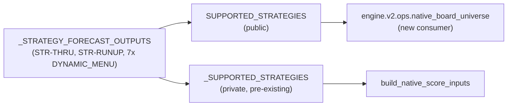

# `engine/v2/scoring` — architecture

## Purpose

Layer 5 of the v2 rearchitecture: the scoring application — forecasts,
structure shape, pricing, gate/chooser decisions, financial diagnostics, and
the validated immutable `ScoreRecord`. Replaces the pieces of legacy
`score.py`/`entry_rules.py`/`replay.py`/`pnl_sim.py` that decide a trade's
number, per `README.md`'s ownership statement.

This document covers one small, additive change: `source_inputs.py` now
exports `SUPPORTED_STRATEGIES`, a public name for the strategy set this
module's input builder can build native scoring inputs for. It is the same
value the module already computed internally; the change adds a name, not a
behavior.

## Primary contracts and interfaces

- `SourceBundle` (`source_inputs.py`): answer-free source material for one
  bounded native strategy execution — raw, source-owned facts (dates, spot,
  quotes, feature vectors, model bindings, recipes). Its own docstring is
  the contract: "Recipes describe calculations. They do not carry
  calculated forecasts, selected contracts, prices, simulation summaries, or
  decisions."
- `build_native_score_inputs(bundle) -> NativeScoreInputs`: translates a
  `SourceBundle` into the shape `score_one`/`score_event` execute against.
  Refuses (`ValueError`, with a detail naming `UNVALIDATED_STRUCTURE`,
  `UNSUPPORTED_SOURCE_CONTRACT`, or `UNKNOWN_STRATEGY`) for any strategy not
  in `SUPPORTED_STRATEGIES`.
- **`SUPPORTED_STRATEGIES`** (new public export): a frozenset — the strategy
  keys `_STRATEGY_FORECAST_OUTPUTS` declares (`STR-THRU`, `STR-RUNUP`, and
  the seven strategies `_SIZE_STRATEGIES` names, which are exactly the
  `DYNAMIC_MENU` members). It is a second name bound to the same object as
  the pre-existing private `_SUPPORTED_STRATEGIES`; neither the private
  name's two internal call sites nor `_STRATEGY_FORECAST_OUTPUTS` itself
  changed.
- `score_one`/`score_event` (`application.py`), `fold_pool` — unchanged by
  this document.

## Inputs

`build_native_score_inputs` takes one `SourceBundle`. `SUPPORTED_STRATEGIES`
itself takes no input — it is a module-level constant, computed once at
import time from `_STRATEGY_FORECAST_OUTPUTS`'s own keys.

## Outputs

`SUPPORTED_STRATEGIES` — a `frozenset[str]` of the covered strategy keys.
Read-only; nothing in this module mutates it after definition.

## Dependencies and callers

No new dependency: `SUPPORTED_STRATEGIES` is computed from names already
defined in this module (`_STRATEGY_FORECAST_OUTPUTS`, itself built from
`_SIZE_STRATEGIES`).

**New consumer:** `engine.v2.ops.native_board_universe` (this change's other
half) imports `SUPPORTED_STRATEGIES` to define the board-universe
enumerator's strategy set, rather than duplicating or hard-coding it — the
enumerator reads the input builder's own declaration of what it supports,
so the two cannot drift apart.

Existing consumers of this module (`application.py`,
`engine.v2.serving.native_shadow_render`, and this package's own tests) are
unaffected: the private `_SUPPORTED_STRATEGIES` name they may already use
internally is untouched.

## External systems and libraries

Unchanged: none for this specific export (no I/O; the surrounding module
depends on numpy/pandas-free dataclasses and the v2 model-artifact classes
already listed in `README.md`).

## Failure semantics (4c R1–R6)

Unchanged for this export — it is a plain constant with no call path of its
own. `build_native_score_inputs`'s existing refusal behavior (raise
`ValueError` naming the strategy and the reason) is untouched; the new
consumer (`native_board_universe`) never calls `build_native_score_inputs`
itself — it only reads the strategy-set constant.

## Invariants touched

- **Native vs. legacy values:** `SUPPORTED_STRATEGIES` is a set of strategy
  *names* (identifiers), never a scored value — reading it cannot leak a
  legacy-derived number into a native record.
- No other invariant changes: `SourceBundle`'s answer-free contract, the
  gate/chooser decision logic, and the record-validation path are untouched.

## Diagram

## Out of scope

- Any change to `build_native_score_inputs`, `score_one`, `score_event`, or
  any other name in this package.
- Adding `SUPPORTED_STRATEGIES` to the package README's public-interface
  directive was checked against `checks/package_readmes.py` and found
  unnecessary for this change (the check passed unmodified); revisit if a
  future consumer outside this package's own import graph needs it declared
  there.
