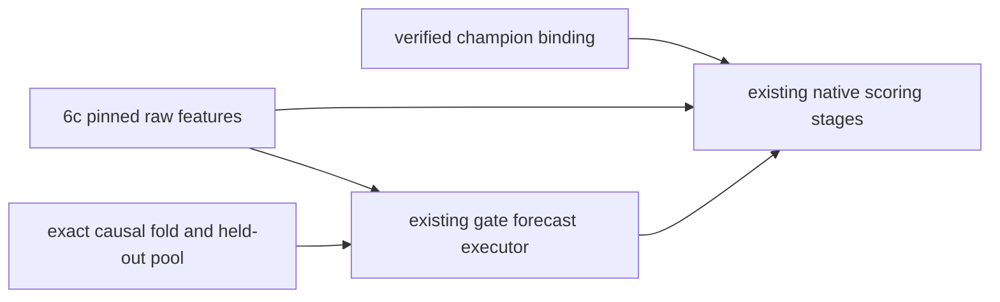

# `engine/v2/scoring` — architecture

Layer **5.0** in the root [`ARCHITECTURE.md`](../../../ARCHITECTURE.md)'s
layer table (§2). Replaces legacy's `score.py` (split by stage),
`entry_rules.py`, `replay.py`, and the `trailing_cutoff` half of
`pnl_sim.py`. See `engine/v2/scoring/README.md` for the exhaustive,
checker-enforced Public interface / Consumers lists
(`checks/package_readmes.py` fails an import of a name absent from it); this
doc gives the structural picture the README does not.

## Purpose

Owns the §6.3 execution order (one module per stage), gate and chooser
decisions (including DYN-SV menu resolution), financial diagnostics, and a
validated immutable `ScoreRecord`. Never reads a future outcome
(`engine/v2/evaluation` does) and never fits a model during a score request
(`engine/v2/models/training` does); every model, residual pool, payoff
calibration and analog population it reads is frozen data, verified by
content hash before use. Does not mutate a strategy or model registry
(`engine/v2/registry` does that).

Two modules, `nightly_source_bundle.py` (the per-night `SourceBundle`
assembler) and `release_bindings.py` (the live-deployment release reader),
are consumed today by `engine.v2.ops.native_score_batch.py`'s
`native_score_batch` job worker, and `engine.v2.ops.supervisor.py`'s tick loop
submits a `native_score_batch` job when an eligible pinned-snapshot identity
has staged producer inputs (cutover PR-6, `engine/v2/ops/ARCHITECTURE.md`).
Separately, the same tick loop's
cheap release-identity gate runs every tick, and calls
`release_bindings.resolve_production_release_binding()` — which
hash-verifies every model file — whenever the release root/id it sees has
changed since the last tick (memo-gated: skipped on repeat ticks once that
identity's already been resolved, success or refusal), independent of the
`native_score_batch` job (see Dependencies).

## Primary contracts and public interfaces

Full list: `engine/v2/scoring/README.md` § Public interface. The
load-bearing entrypoints:

- `application.py` — the shared kernel: `score_one(request,
  NativeScoreInputs) -> ScoreRecord`, `score_many`/`score_batch`/
  `score_event` (batch variants over the same kernel), `score_frozen(request,
  inference, release, inference_request, fields) -> ScoreRecord` (verified
  frozen inference, scoped to the request's own `(strategy_version,
  decision_clock_id)` release bindings — issue #93, see Failure semantics),
  `replay(score_id, records, legacy_fields) -> (ScoreRecord, ReplayReceipt)`.
- `source_inputs.py` — `SourceBundle` (answer-free source dataclass, frozen,
  `kw_only=True`) and `build_native_score_inputs(bundle) -> NativeScoreInputs`,
  the boundary every acceptance/parity caller starts from.
- `frozen_executor.py` — `FrozenStageExecutor`/`FrozenRecipeExecutor`,
  running one frozen-model binding and raising `FrozenStageRefusal(code,
  detail, reason_codes=...)` (code always `"MODEL_NOT_READY"`) — the refusal
  shape every module in this package that resolves a frozen artifact reuses.
- `frozen_batch.py` / `frozen_inputs.py` — the frozen-batch API
  (`score_frozen_batch`) and inference-input builder
  (`build_inference_requests`, `validate_answer_free`).
- `nightly_source_bundle.py` — `assemble_nightly_source_bundle()`,
  `quote_domain_map()`, `validated_as_of()`, `NightlySourceBundleRefusal` —
  the per-night, per-`(ticker, event)` `SourceBundle` field assembler (see
  Inputs/Outputs/Failure semantics). All four names are declared in
  `README.md`'s `<!-- public-interface: -->` directive. `checks/
  package_readmes.py` only strictly requires an entry for a name reached
  via an *unqualified* `from engine.v2.scoring import <name>`, which none
  of these four are — each reaches only its own subset through a
  submodule-qualified `from engine.v2.scoring.nightly_source_bundle import
  ...`: `tools/capture_tier0_corpus.py` imports `quote_domain_map` alone,
  and `engine.v2.ops.native_score_batch.py` (Cutover PR-3) imports the
  other three (`assemble_nightly_source_bundle`, `validated_as_of`,
  `NightlySourceBundleRefusal`) but not `quote_domain_map`. Either way the
  checker would pass without any of the four listed. They're declared anyway
  because all four are real `__all__` exports with a real caller today —
  `quote_domain_map`'s is the external `tools/capture_tier0_corpus.py`, not
  an `engine.v2.*` module; the other three's is `engine.v2.ops.
  native_score_batch.py` (see Dependencies for what that consumer actually
  runs in production).
- `release_bindings.py` — `resolve_release_binding(release_root) ->
  ScoringReleaseBinding`, the production reader of a live deployment's model
  identity, model artifact refs, and analog/payoff/recalibration/driver-residual
  artifacts;
  `resolve_production_release_binding()` is the same resolution against the
  one configured production release root
  (`engine.v2.models.deployment.production_release_root()`, config key
  `MODEL_RELEASE_ROOT` — see `engine/v2/models/ARCHITECTURE.md` §7.4).
  `ScoringReleaseBinding` (frozen dataclass, every mapping field a read-only
  `MappingProxyType`) fields: `release_id: str`; `model_identity: Mapping[str,
  ModelIdentity]` **keyed `"{role}:{strategy_id}"`** (never by `role` alone —
  a release can bind `role="gate"` once per strategy, so two bindings
  resolving to the same key is a release defect, refused as `ModelNotReady`
  naming that key, never a silently-overwritten entry); `model_artifact_refs:
  Mapping[str, str]` **keyed by `binding_id`** (unique by construction).
  `ModelIdentity` carries `role`, `strategy_id`, `decision_clock_id`,
  `model_id`, `binding_id`, `adapter`, `feature_order`, `output_names`, and
  `artifact_hash` (a content hash over the binding's own verified member
  hashes, never re-derived from unverified bytes). `model_release:
  ModelRelease` (hash-verified against its own manifest before this module
  trusts it — Failure semantics) and `frozen_inference: FrozenInference` are
  carried in exactly the form `SourceBundle` already declares them and
  exactly what `_frozen_recipe_executor` consumes; `frozen_inference` is
  `field(compare=False)` (see Failure semantics R2/R6 — `FrozenInference` is
  a plain class with no value equality and its own mutable, growing member
  cache). A caller assembles the resulting `SourceBundle` via
  `dataclasses.replace(bundle, model_release=..., frozen_inference=...)`
  (the dataclass is frozen, so plain attribute assignment raises); it must
  never independently re-resolve or re-verify anything this module already
  verified. `payoff_artifacts`/`recalibration_artifacts`/`analog_artifacts`
  are each `Mapping[str, tuple[...]]` **keyed by the loaded artifact's own
  `.strategy` field** (never the manifest row's declared `strategies` list),
  holding every hash-verified object of that family the release stages (a
  family can hold several per strategy, e.g. one calibration fold each).
  `driver_residual_artifacts: Mapping[str, DriverResidualPoolArtifact]` is
  keyed by the loaded artifact's `.role` field and empty when no driver pool
  member is staged.
  Picking the object matching a request's own `(strategy, alpha, cutoff)`
  and mapping a binding to specific forecast-output names is the per-night
  assembler's job, not this module's.
  `resolve_gate_policy(binding, release_root) -> dict[str, dict[str, float]]`
  returns `{strategy: {"threshold": float}}` from each gate binding's staged
  `threshold` member (see "`resolve_gate_policy`" below).
- `identity.py`, `financial.py`, `chooser_inputs.py`, `native_*.py` —
  content-addressed request/record identity, financial diagnostics, and the
  native arithmetic for the analog stage, the DYN-SV chooser, the entry-rule
  gates, payoff-calibration/model layer and frozen residual-state reading.
  Each is pure arithmetic over declared inputs; none performs I/O.
- `compatibility.py` — `score_legacy_request`, the one legacy adapter this
  package owns (see Dependencies).

## Inputs

**Forward forecast assembly (design; not implemented).** STR-THRU forward
inputs use native market/history features from the pinned snapshot (cutover
6c), plus the verified release. The full-refit `size:*` champion supplies
`driver_prediction`; a separate causally selected size fold supplies only the
gate's requested `pred_abs_move` family and `forecast_edge`. Both execute in
the existing scoring stages, never in the raw-row producer. Gate-only forecasts
must not create a top-level sizing forecast or change the selected structure.

An optional typed `SourceBundle.gate_forecast_source` carries the selected
fold's inference view, parent-release identity and held-out pool. The existing
`gate_recipe.forecast` names its binding/output; `_gate_forecast_members`
resolves it through `FrozenRecipeExecutor` using the shared `FrozenInference`.
The champion release stays unchanged. Supplying conflicting legacy pool or
binding declarations is refused, not resolved by precedence. The ordinary
bundle path remains valid when the optional source is absent.

Raw feature names exclude stage-owned forecast/analog/pricing answers; the
gate's declared feature order still includes them for stage-time derivation.
6c must provide the required raw inputs and observation anchor for the driver,
gate and selected fold. Missing values retain existing refusal/undetermined
semantics; thin fold pools retain the existing unavailable-band behavior.
A forward event needs no persisted Tier-4 row (`tier4_row={}`); it must never
borrow another event's row. This does not authorize silently treating a missing
historical Tier-4 row as normal: historical coverage and stored-crush references
remain a separate contract. Stored non-null inputs retain their existing
per-metric `fold_start <= as_of` guard. Native Tier-4 table construction
(PR-13c) and monthly training are separate from forward inference.

```mermaid
flowchart LR
  F["6c pinned raw features"] --> S["existing native scoring stages"]
  C["verified champion binding"] --> S
  M["exact causal fold and held-out pool"] --> G["existing gate forecast executor"]
  F --> G
  G --> S
```

- A `ScoreRequest` (`engine.v2.contracts`) and either a hand-built
  `NativeScoreInputs` or a `SourceBundle` run through
  `build_native_score_inputs`. `SourceBundle` carries raw context, raw
  quotes, a feature vector and missing mask, model identity/artifact refs,
  and recipes — never a calculated forecast, selected leg, price, or
  decision (`source_inputs._reject_answers`, enforced again by
  `frozen_inputs.validate_answer_free` once a `NativeScoreInputs` exists).
- Frozen release state via `engine.v2.models`: a `ModelRelease`'s bindings
  (`FrozenInference`/`FrozenStageExecutor`), payoff-calibration artifacts,
  recalibration maps, and other frozen non-model states (driver/paired
  residual pools, the admissible-depth table, the board analog matcher, the
  DYN-SV chooser's analog pool, the entry-rule gate's trailing cutoff).
  `release_bindings.py` is the one production caller that resolves *which*
  release and artifacts from a live deployment pointer.
- The legacy `Scorer`/`ScoreRequest`/`FillModel` (`compatibility.py` only).
- `assemble_nightly_source_bundle`, for one `(ticker, event)` pair: `as_of`
  (the night's cutoff); `calendar_row` (`ticker`/`event_date`/`entry_date`/
  `exit_date`/`expiry`/`spot`/`calendar_observed_through`); `panel_row`/
  `tier4_row` (one already-staged row apiece — `tier4_row` wins on a
  `feature_names` collision; `panel_row["date"]` is the real panel key
  column, an EVENT date, never an observation date; `tier4_row` carries no
  row-level date, only a per-metric `"<metric>_fold_start"` stamp shared by
  a metric's whole band family); `panel_anchor` — the caller-declared upper
  bound on when `panel_row`'s market-state feature values were actually
  observed, required with no default (a live row's `FeatureVector.as_of`, or
  a persisted historical row's own event date as a safe looser bound — see
  Failure semantics); `quote_rows` (`right`/`strike`/`expiry`/`bid`/`ask`/
  `observed_at`, plus an optional `quote_status` for a legitimately empty
  domain); `feature_names` (a non-string sequence of non-empty,
  non-duplicate names; may never name a realized outcome, `driver_name`
  itself, a Tier-4 producer-stamp column (`*_fold_start`/`*_model_id`/
  `tier3_snapshot`), or any `pred_iv_crush_30*` column (that one family's
  bands included) — other metrics' own band columns (e.g.
  `pred_abs_move_p10`) are legitimate feature names, gated instead by their
  base metric's `fold_start` — see Failure semantics);
  `calendar_row["spot"]` must be finite and `> 0`. `model_identity`,
  `model_artifact_refs`, `forecast_recipes`, `residual_recipe`,
  `analog_recipe`, `gate_recipe` are accepted as optional pass-throughs,
  each defaulting to `{}` ("not yet declared") — resolving them from a live
  release is `release_bindings.py`'s job, not this assembler's.

## Outputs

One immutable `ScoreRecord` per request, every nested field deep-frozen
(`frozen_record.py`); `identity.py` derives its content-addressed
`score_id`/`request_hash` from the immutable payload, excluding operational
timestamps, so a replay of the same inputs reproduces the same id.
`release_bindings.py` returns a `ScoringReleaseBinding` — an in-process
snapshot, not persisted, carrying no operational envelope of its own. Every
field is immutable except `frozen_inference`, whose referenced object holds
its own mutable, growing cache after the call returns (Failure semantics
R2), so "immutable snapshot" describes the binding's own fields, not
everything reachable through it. `assemble_nightly_source_bundle` returns a
`SourceBundle` whose `context`/`raw_quotes`/`feature_vector`/
`feature_missing_mask` are populated from the staged inputs above and whose
recipe/model-identity fields pass through unchanged; it never returns a
`NativeScoreInputs` itself — `build_native_score_inputs` is a separate call
the caller makes afterward.

## Dependencies

May import layers 0-4 (`checks/layer_map.py`, strictly less than 5.0):
`engine.v2.contracts` (0.0), `engine.v2.foundation` (0.5), `engine.v2.features`
(2.0), `engine.v2.models` (3.0), `engine.v2.registry` (3.0), and
`engine.v2.domain.*` (4.0/4.5). Must never import `checks` or `tests`
(`checks/import_layers.py`) — every module here, including
`release_bindings.py`, ports logic it needs from a `checks/` module rather
than importing it. Third-party: `numpy`; `scipy.stats.norm` (deterministic
arithmetic, no fitting); `pandas` (`compatibility.py`,
`nightly_source_bundle.py`, legacy request construction only).

One declared legacy adapter (`checks/legacy_adapters.json`, package
`engine.v2.scoring`, module `compatibility.py`): `engine.score.Scorer`,
`engine.score.ScoreRequest`, `engine.fills.FillModel`, confined to
`score_legacy_request`, removal targeted at "phase-5 scoring extraction."

`nightly_source_bundle.py` adds one new intra-package import edge
(`.source_inputs`, for its own leakage check). It does not import
`engine.v2.data` (`feature_names` and every row are plain caller-supplied
values) or `engine.v2.ops.native_board_universe` (layer 7.0) — its `as_of`
validation is independently mirrored here (`validated_as_of`) rather than
imported, the same native/legacy non-sharing convention used elsewhere in
this repo.

Callers (checked against the import graph, README § Consumers):
`engine.v2.models.training` (layer 6, `native_payoff`'s pure fitting math
only), `engine.v2.ops` (`score_one`/`NativeScoreInputs`/`StageReceipt` for
the read-only `ops rescore` CLI, and `.source_inputs.SUPPORTED_STRATEGIES`
via `native_board_universe.py`), `engine.v2.serving.native_render` (layer 7,
display-only analog row ids). `checks/phase4_frozen_bridge.py` and
`tools/capture_tier0_corpus.py` call `frozen_inputs.py` as compatibility
callers, and the latter also calls `nightly_source_bundle.quote_domain_map()`
for offline capture; `checks/*`/`tools/*` sit outside the package's
machine-checked consumers allowlist by design. `engine.v2.ops.native_score_batch.py`
(Cutover PR-3) is a real production module that imports
`assemble_nightly_source_bundle`/`NightlySourceBundleRefusal`/`validated_as_of`
and calls `resolve_release_binding` from its `native_score_batch` job
worker, and `engine.v2.ops.supervisor.py`'s tick loop (Cutover PR-7a) submits
that job for eligible pinned-snapshot identities (`engine/v2/ops/
ARCHITECTURE.md`'s "Cutover PR-7a"). Separately, the same tick loop runs a
cheap release-identity check every tick and calls
`release_bindings.resolve_production_release_binding()` live whenever that
identity changes (memo-gated: skipped on repeat ticks once the current
release root/id has already been resolved, success or refusal) — a
release-readiness check that runs independently of whether the job is
submitted.

## External systems and libraries

No network. Local filesystem only, read-only: the deployment
content-addressed store and `phase5_release.json` (via `engine.v2.models`),
and fold files elsewhere in the release pipeline (not read directly by this
package). `assemble_nightly_source_bundle` takes every staged row as an
already-loaded plain mapping — loading rows from the real panel/Tier-4/
quotes/calendar stores is the caller's job, not this function's.

## Failure semantics

Package-wide invariant (root doc §5): a missing or unusable input produces
an explicit typed refusal, never a silent default. `FrozenStageRefusal`
(`code="MODEL_NOT_READY"`, `reason_codes`, `missing_features`) is this
package's one refusal shape for an unresolved or hash-mismatched frozen
artifact, reused by `frozen_executor.py` and `source_inputs.py`'s
frozen-recipe/residual/analog/payoff/recalibration readers. No stage caches
beyond the process; no stage retries; no stage performs a partial write
(scoring is read-only except `frozen_record.py`'s in-memory freeze); every
stage is idempotent (same `ScoreRequest` + `NativeScoreInputs` always
produces the same `ScoreRecord`, `identity.py`). Other typed refusals:
`AnalogRefusal` (`native_analog.py`), `FrozenBindingConflict`
(`application.py`, below), `NightlySourceBundleRefusal`
(`nightly_source_bundle.py`, below).

**Quote age policy (issue #169).** When native input context supplies
`quote_max_age_sessions`, it is the permitted age of the raw quote at
`entry_date`, measured in market sessions using the canonical NYSE schedule
in `engine.v2.foundation.market_calendar`.
An absent or `None` bound means no caller policy was supplied; a supplied
bound must be a non-negative integer. With a bound, each required date and
each supplied latest date must parse in full; a valid date prefix followed by
invalid text is unusable evidence. Missing or invalid age evidence, a quote
dated after entry, or an age greater than the bound makes the quote unusable
and adds non-advisory `NO_CHAIN`. If a nightly bundle has
multiple quote observation dates, it preserves the earliest date for the
conservative age check and the latest date as `quote_latest_date`; any latest
date after entry refuses even when an earlier call observation is on entry.
Scoring returns its ordinary refused `ScoreRecord` (`readiness="refused"`),
not an exception; parity therefore agrees with legacy's no-eligible-chain
refusal. An in-bound older quote may still carry advisory `STALE_QUOTE`. The
refusal is deterministic and not retried internally; a caller can retry a
later score with refreshed source quotes. Scoring writes nothing, and a
refusal leaves no selected score values as a ready result.

The nightly source bundle preserves a supplied bound in its context and omits
that optional key when unset. When quote rows exist, `quote_date` is their
earliest validated `observed_at` date and `quote_latest_date` is their latest;
both dates have passed the assembler's `as_of` upper-bound check. An allowed
empty quote domain carries neither date. `native_score_batch` carries the
caller policy into scoring; `None` continues to mean no policy and no numeric
age default is invented. This policy is independent of the assembler's
`as_of` upper-bound check, which only prevents future observations.

**Planned-exit simulation values each leg by its own right.** The
`planned_exit` simulation (`stages._planned_exit_simulation`) prices a call
leg as a call and a put leg as a put (`C`/`CALL`, `P`/`PUT`, case-insensitive),
at the one shared exit horizon, with zero rates and dividends. The call is the
put kernel plus `spot - strike` (put-call parity), so both rights share the
volatility floor and the intrinsic-at-expiry boundary. A priced leg with a
nonzero quantity and finite strike whose right is neither refuses the whole
simulation: `UNSUPPORTED_SIMULATION_LEG:right` is flagged, no `exp_pnl_sim`
(or other simulated field) is produced, and nothing is defaulted to a put.
Legacy `engine.pnl_sim.expected_pnl` prices every leg as a put, so bit-for-bit
parity with it holds for put-only legs; a structure with a call leg
(e.g. the STR-THRU straddle) is valued by this contract, not by that helper.

**STR-RUNUP's `runup_move` forecast field (issue #94, resolved).** Every
mechanism that produces this strategy's forecast populates two fields, never
one conflated name: `runup_move_raw_d14` (the model's own native-horizon
magnitude) and `runup_move_prediction` (a scaled, published value derived
from it exactly once — the scaling formula itself is
`native_payoff.scale_runup_move`, not restated here). The model stage
prefers `runup_move_raw_d14`, falling back to `runup_move_prediction` only
when no raw value was produced (reachable only via an invalid/missing
`days_before_print`, before the model stage's own horizon check refuses
`MISSING_MODEL_INPUT:days_before_print`); it refuses
`MISSING_MODEL_INPUT:runup_move_prediction` when neither value is finite.

**`score_frozen`'s release-binding scope (issue #93).** A `ModelRelease`
binds every strategy's models together (e.g. STR-THRU's and STR-RUNUP's own
bindings side by side, plus any binding a release shares across every
strategy). Each `score_frozen` call scores one `(strategy_version,
decision_clock_id)` pair and must never let another strategy's or clock's
binding answer it. Before building canonical forecast executors or picking
the gate binding, `score_frozen` filters to `_frozen_scoped_bindings(release,
request)`:

| Condition | Outcome |
|---|---|
| binding's `decision_clock_id` matches the request's, and `strategy_id` is the request's own | in scope |
| binding's `strategy_id == "*"` (wildcard) | in scope for every strategy sharing the matching decision clock |
| binding's `decision_clock_id`/`strategy_id` mismatch and not wildcard | excluded from the canonical executors AND from folded `outputs`/`gate_result` (`_collect_frozen_results`) — checked at both points, so an out-of-scope `InferenceRequest` submitted anyway never leaks into the published record |
| two in-scope bindings collide on the same canonical target or the gate role | `FrozenBindingConflict(target, binding_ids)` (`ValueError`), raised before any inference runs — a release-authoring defect, never resolved by binding order; fails the whole `score_frozen` call and, through it, the whole `score_frozen_batch` batch (batch preflight does not re-check) |
| `release` declares no `bindings` attribute at all | scoping returns `None`; caller keeps the historical unscoped fold |
| `release` declares `bindings` but none match this request | filtered tuple returned as-is, even empty — never falls back to unscoped |
| a binding missing `decision_clock_id` or `strategy_id` | carries no scope information, always included |

`frozen_batch.score_frozen_batch` is the frozen-batch API boundary this
scoping protects; no production entrypoint calls it yet. Its preflight
resolves a binding's strategy with the same rule
(`application.binding_serves_strategy`: the request's own strategy or `"*"`),
so a wildcard binding on the matching clock is accepted and any other
strategy mismatch is still refused before inference.
`tools/capture_tier0_corpus.py::_frozen_runtime` submits every
binding with a valid captured feature row without pre-filtering by
`strategy_id`/`decision_clock_id`, so it relies entirely on this scoping
rather than its own. `native_score_batch` goes through `score_one`, never
`score_frozen`, and is unaffected.

### `release_bindings.py` (4c R1–R6)

- **R1, missing input.** `resolve_release_binding(release_root)` validates
  its argument, computes `<release_root>/deployment` inline (ported from
  `checks/phase5_release.py`, not imported), then resolves the live pointer
  and, once known, reads the staged manifest **exactly once** (never through
  the public `resolve_release()` wrapper, and never re-read for the hash
  check below):

  | Condition | Outcome |
  |---|---|
  | no `DEPLOYED` pointer ever written (or `release_root`/`deployment/` missing) | `NoCurrentRelease` |
  | `DEPLOYED` pointer file corrupt/unparseable | `ModelNotReady("DEPLOYED", ...)` |
  | unsafe `release_id` (contains `/`, or is `.`/`..`) | `ModelNotReady("model_release", ...)` |
  | no staged manifest for that `release_id` | `ModelNotReady("model_release", "release not staged")` |
  | `manifest.json` exists but will not parse | `ModelNotReady("manifest.json", ...)` |
  | staged manifest's own hash disagrees (`_manifest_hash_matches`, checked before trusting `manifest.release`) | `ModelNotReady("model_release", "release_hash disagrees with manifest")` — accepts either hash version, since replay of an older-hashed release must keep resolving; `deployment.promote`/`rollback` enforce a stricter write-side rule this read path never applies |
  | `resolve_production_release_binding()` only: no/blank `MODEL_RELEASE_ROOT` | `ModelNotReady("release_root", "no production release root is configured")` |
  | once resolved, any member (model binding, payoff/recalibration/analog artifact) missing, wrong status, hash mismatch, or fails its typed load | `ModelNotReady(member_id, ...)`, naming the exact member (e.g. `"model:gate:STR-THRU"`) |
  | Release-local `phase5_release.json`: unreadable, bad self-hash, wrong schema or release ID | `ModelNotReady("phase5_release.json", ...)` before any state-family row is read; a valid root copy never overrides this refusal |
  | Release-local catalog absent | Read the legacy root catalog only if its schema, self-hash and release ID match; otherwise `ModelNotReady` |

  Catalogs beside each staged model manifest survive promotion and rollback.
  The release-root compatibility copy selects a staged candidate for tooling;
  production selects only the catalog for the resolved live release ID.

  A hash mismatch never falls back to a different object, an older cached
  value, or a default anywhere in this module — `ModelNotReady` is the only
  outcome, proven by a test that a mismatched object never yields a
  resolved binding.
- **R2, cache.** None for any field but `frozen_inference`: every other
  field's loader is constructed fresh per call and discarded on return, so
  two calls against the same `release_root` fully re-read and re-verify.
  `frozen_inference`'s referenced `FrozenInference` owns its own mutable,
  content-hash-keyed member cache, populated lazily by `.infer()`, living as
  long as the caller holds the returned binding — deliberately, so the
  benefit persists across many score requests; a fresh
  `resolve_release_binding` call always builds a brand-new, empty one.
  Separately, `native_residuals.paired_arrays_from_artifact` keeps a
  process-wide, content-hash-keyed, 4-entry FIFO array cache; a miss only
  costs a rebuild, never changes a result.
- **R3, retry.** None internal; a caller retries by calling
  `resolve_release_binding` again, which re-resolves the pointer from
  scratch.
- **R4, transaction.** Not applicable — read-only, single-pass: either one
  complete `ScoringReleaseBinding` returns, or the call raises before
  returning anything.
- **R5, partial write.** None possible — every function this module calls
  (`deployment.current_pointer`/`_read_manifest`/`_manifest_hash_matches`,
  the artifact loaders' `.load`) is read-only; `FrozenInference.__init__`
  performs no I/O.
- **R6, idempotency.** Resolving the same, unchanged `release_root` returns
  a binding equal (dataclass `__eq__`) to the previous one on every field
  except `frozen_inference` (`field(compare=False)`, since `FrozenInference`
  has no value equality and always starts a fresh cache). A caller
  confirming two resolutions saw the same release compares `.model_release`
  directly. Resolving again after a promotion/rollback reflects the new
  pointer in every field, since nothing is cached between calls.

#### `resolve_gate_policy` (conditions and outcomes)

Reads only the `threshold` member of each `role="gate"` binding in
`binding.model_release`: a content-addressed copy of the legacy model
registry, never the live legacy registry. The threshold is the one carried by
the registry entry whose `id` equals that binding's `model_id`. Conditions are
checked per gate binding; the first failure raises for the whole call.
Failure messages are fixed and path-free, naming `model:gate:<strategy>`.

| Condition | Outcome |
|---|---|
| the gate identity's `binding_id`, role and strategy match zero or several bindings of the release | `ModelNotReady` (the binding is selected by all three, never by a `binding_id` map that could overwrite a duplicate) |
| gate binding has more than one member named `threshold` | `ModelNotReady` (checked before any member is selected or read) |
| gate binding has no `threshold` member | strategy omitted from the result; the row-level `GATE_POLICY_NOT_STAGED` refusal is unchanged (proposed by the supervisor) |
| member object missing, unreadable, or hash disagrees with the pointer | `ModelNotReady`, no fallback |
| object is not a JSON object with a `models` list, or has no entry (or more than one) with `id == binding.model_id` | `ModelNotReady` |
| the entry's `threshold` is absent, boolean, non-numeric, or non-finite | `ModelNotReady` |
| otherwise | `{strategy: {"threshold": float(value)}}` |

R2: no cache; every call re-reads and re-verifies. R3: none. R4/R5: read-only.
R6: the same release and bytes yield an equal result; a caller resolving once
per worker therefore sees one policy for the whole batch. The worker uses this
result only when its `gate_policy` parameter is empty; a supplied policy wins
and the release is not consulted for it.

#### Driver residual pool member (issue #479, release-loader slice)

`resolve_release_binding` also loads the staged `driver_residual_pool:size`
state and carries the typed driver residual artifact on
`ScoringReleaseBinding`. Its catalog object bytes are verified against the
catalog `content_hash` before parsing; the decoded artifact must pass the
residual artifact schema and content-hash checks before it can be returned.
The member is optional for releases that predate this state: an absent member
produces an empty artifact mapping. Native batch is not wired to consume this
mapping in this release-loader slice.

| R1–R6 condition | Outcome |
|---|---|
| member row absent | empty artifact mapping; the release remains resolvable |
| member is declared but status is not `STAGED` or no object is declared | `ModelNotReady` naming `driver_residual_pool:size`; no binding is returned |
| object path escapes the deployment root, object is absent or unreadable, or bytes disagree with the catalog `content_hash` | `ModelNotReady` naming `driver_residual_pool:size`; no alternate object |
| verified bytes are not a valid driver residual artifact for the `driver` slot | `ModelNotReady` naming `driver_residual_pool:size`; no partially loaded binding |
| multiple verified objects resolve to the same artifact role | `ModelNotReady` naming `driver_residual_pool:<role>`; no binding is returned |
| a complete valid staged member is loaded | `ScoringReleaseBinding` exposes the verified artifact for follow-up bundle wiring |
| resolving an unchanged release repeatedly | every call re-reads and re-verifies the member; no loader cache is retained between calls |
| no release is staged | existing `NoCurrentRelease` behavior remains; native batch keeps its existing per-row refusal results for the unstaged path |

The loader is read-only: a failure returns no partial binding and writes no
state. Follow-up requirement (not implemented in this slice): native batch
must bind a verified pool to the scorer's `driver` slot and residual recipe.
If a staged release has no pool, that wiring must not fall back to
request-supplied rows; the existing unstaged-path refusal behavior remains.

### `nightly_source_bundle.py`

`class NightlySourceBundleRefusal(ValueError)` — `__init__(code, detail)`,
message `f"{code}: {detail}"`.

| Condition | Code |
|---|---|
| a supplied `calendar_row`/`panel_row`/`tier4_row` is not a mapping; `quote_rows` is a string/bytes value, not a sequence, or an empty sequence without an allowed empty `quote_status`; `calendar_row` missing a required key; `panel_row` missing its own `date` column (the real panel key — never `observed_at`, which neither real table has ever carried); a `quote_rows[i]` is not a mapping or is missing `observed_at` (every one of these arguments is required with no default, so omitting one outright raises `TypeError` before any of this validation runs) | `MISSING_STAGED_INPUT` |
| a name in the feature-name leakage denylist — a realized panel outcome column, `driver_name` itself, a Tier-4 producer-stamp column (`*_fold_start`/`*_model_id`/`"tier3_snapshot"`), or any `pred_iv_crush_30*` column (that one family's bands included) — checked on `feature_names` alone, before any row is read; another metric's own band column (e.g. `pred_abs_move_p10`) is NOT denylisted | `LEAKED_FEATURE_NAME` |
| a calculated scoring answer surfaces in the assembled `context`/`feature_vector` (`source_inputs._reject_answers`, the same denylist `build_native_score_inputs` enforces — an independent second layer over raw source-table columns, not a duplicate of the name denylist above) | plain `ValueError` (not this refusal type) |
| `panel_row["date"]` (normalized) != `calendar_row["event_date"]` (normalized) — `panel_row["date"]` is the EVENT date, not an observation date, so this is the only check that catches a row staged for the wrong event; it never compares against `as_of` | `PANEL_ROW_WRONG_EVENT` |
| `as_of`, `calendar_row["calendar_observed_through"]`, `panel_anchor`, or a `quote_rows` entry's `observed_at` fails `validated_as_of` (rejects `None`/`NaT`/a bare number or bool/unparseable/timezone-aware), or any of them lands strictly after `as_of` | `POST_AS_OF_ROW` (or `NightlySourceBundleRefusal`: `MISSING_STAGED_INPUT` for `None`, `INVALID_DATE` otherwise) |
| a feature resolved from `tier4_row`, non-null, whose own base metric's `fold_start` is missing, or missing-and-present-but-dated-after `as_of` (a null resolved value — legacy's own "no forecast" — skips this check entirely, whatever its `fold_start` holds) | `MISSING_STAGED_INPUT` / `POST_AS_OF_ROW` |
| `calendar_row["spot"]` not coercible to `float`, non-finite, or `<= 0.0` | `INVALID_SPOT` |
| `feature_names` a bare `str`/`bytes`, not a `Sequence`, or containing a non-`str`, empty, or duplicate entry | `INVALID_FEATURE_NAMES` |
| a quote row missing `right`/`strike`/`expiry`/`bid`/`ask`, an unrecognized `right`, non-finite/negative `bid`, a crossed `ask`, two rows disagreeing on the same contract key, or `quote_rows`/`quote_status` disagreeing on whether the domain is empty (`quote_domain_map`, an extracted, behavior-identical copy of `tools/capture_tier0_corpus.py`'s `_quote_map`) | `NightlySourceBundleRefusal` (that module's own call site wraps it back into its own exception type) |

- **Values pass through unclassified.** A resolved feature value is
  projected into `feature_vector` exactly as staged (`None`, any NaN
  flavor, `+/-inf`, a non-numeric string — unconverted, unfiltered):
  classifying missing vs. invalid is `FrozenStageExecutor._row`'s job, not
  this assembler's, so `feature_missing_mask` is a pure presence fact, never
  a value-quality judgement (proven by
  `test_bundle_feature_value_matches_real_executor_classification`).
- **Panel-row feature anchor (issue #53, resolved).** `PANEL_ROW_WRONG_EVENT`
  and the fold_start checks verify WHICH event a row is for, never WHEN its
  market-state feature values were actually observed — no column on a real
  `panel_row` carries that fact (a live row's `FeatureVector.as_of`/
  `.feature_as_of` anchor lives on a wrapper the flattened row loses; the
  persisted-panel equivalent is dropped before `panel.parquet` is written).
  `panel_anchor` is therefore a required, no-default, caller-declared
  parameter — the same "trusted declared fact" shape already used for
  `calendar_observed_through` and quote `observed_at` — validated and
  checked against `as_of` the same way. This module trusts the caller's
  declared value; it does not re-derive it from `panel_row` (there is
  nothing left to re-derive it from) or assert it precedes
  `panel_row["date"]` (that ordering is `live_features`'s own job).
- **Determinism (R6).** No wall-clock read, no random draw anywhere in the
  function; `context`/`feature_vector`/`feature_missing_mask` are built over
  a sorted key order, `raw_quotes` preserves `quote_rows`' own given order.
  Two calls with identical arguments produce field-for-field identical
  `SourceBundle`s — but not necessarily `==` once a pass-through NaN is
  present (`float('nan') != float('nan')` under IEEE 754); a caller
  comparing bundles that may carry one needs a NaN-aware or content-hash
  comparison, not bare `==`
  (`test_same_inputs_with_nan_are_field_identical_but_not_equal`).
- **Read-only (R2–R5 do not apply).** No I/O of any kind: every staged input
  arrives already loaded, and nothing this function does can mutate a
  store, a file, or its own arguments.

## Invariants

Root doc §5 invariants this package is responsible for: "Native vs. legacy
provenance" (`frozen_inputs.py`'s `validate_answer_free`), "Missing input →
typed refusal, never a silent default" (`FrozenStageRefusal`/
`ModelNotReady`/`NightlySourceBundleRefusal`, above), "No parity-only or
legacy-emulation modes" (one scoring code path; `checks/phase4_real.py`/
`native_parity_report.py` do the comparing, this package never branches on
"are we being compared"), and "Failure semantics are stated, not implied"
(this doc's section above). Package-specific: `release_bindings.py` never
imports `engine.score`/`engine.fills` or any other legacy module — pure v2,
unlike `compatibility.py`.

- **Answer-free source boundary (root doc §5).** `_reject_answers`/
  `_ANSWER_FIELDS` (`source_inputs.py`) is the single enforcement point for
  a calculated SCORING answer; `nightly_source_bundle.py` calls it rather
  than keeping a second copy, and separately enforces its own distinct
  denylist over raw SOURCE-TABLE columns that were never scoring outputs at
  all (see Failure semantics, leakage) — a different boundary, not a
  duplicate.
- **Typed refusal, no fabrication.** A missing staged input is a named
  refusal; a missing individual feature is a mask entry. Neither is ever a
  silently substituted default (`0`, `None`, or an imputed value) — the same
  convention `engine/v2/features/panel_math.py::daily_state_lookup` already
  established for this "row present, some columns absent" shape.
- **No leakage past `as_of`, for inputs that carry an observation anchor.**
  `nightly_source_bundle.py` is the first place in this package that checks
  a row's own observation date against a cutoff, for the inputs that carry
  one: `calendar_row`'s `calendar_observed_through`, each `quote_rows`
  entry's own `observed_at`, the caller-declared `panel_anchor`, and a used,
  non-null Tier-4 feature's own base metric `fold_start`. `panel_row` itself
  still carries no such anchor — `PANEL_ROW_WRONG_EVENT` identifies WHICH
  event the row is for, not WHEN its market-state features were observed —
  which is exactly why the anchor is a separate, caller-declared parameter
  rather than something read off `panel_row`.
- **`model_identity`/`model_artifact_refs`/recipe fields are
  `nightly_source_bundle.py`'s explicit non-goal.** `SourceBundle` requires
  them, but resolving a model identity or artifact reference from a live
  deployment is `release_bindings.resolve_release_binding`'s
  responsibility. `assemble_nightly_source_bundle` accepts them only as
  pass-through arguments (default `{}`) so it composes cleanly with
  `release_bindings.py` without either reaching into the other's inputs.
- **Native vs. legacy independence.** `nightly_source_bundle.py` imports no
  legacy `engine.*` module and is never imported by one. `quote_domain_map`
  is a byte-identical port of `tools/capture_tier0_corpus.py`'s
  `_quote_map`, moved (not copied) so the two never drift.
- **Layering.** Scoring (5.0) never imports ops (7.0) or serving (7.0);
  `nightly_source_bundle.py` follows that rule even where it costs a small
  duplicated validator (`validated_as_of`) rather than an upward import.
