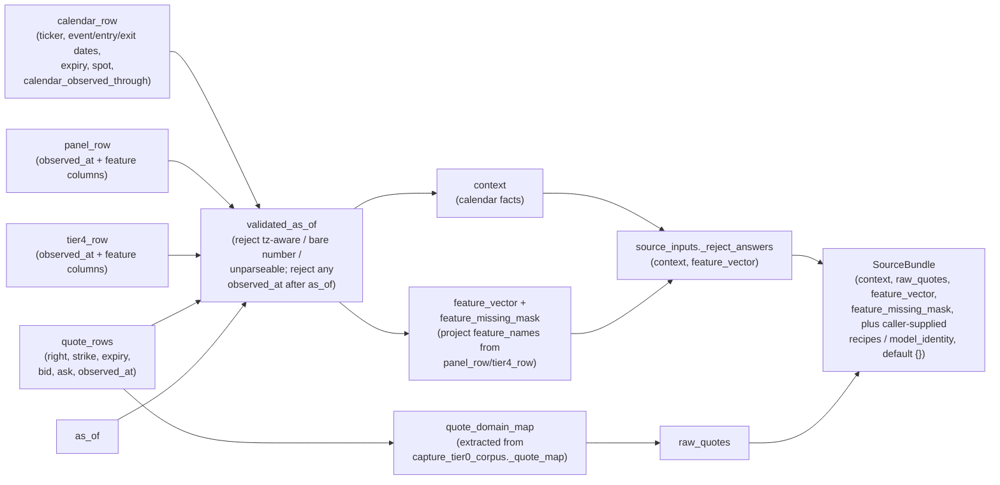

# `engine/v2/scoring` — architecture

## Purpose

Layer **5.0** of the root [`ARCHITECTURE.md`](../../../ARCHITECTURE.md)'s
layer table: the scoring application. It replaces legacy's `score.py` (split
by stage), `entry_rules.py`, `replay.py` and the `trailing_cutoff` half of
`pnl_sim.py`. It owns the §6.3 execution order (one module per stage), gate
and chooser decisions (including DYN-SV menu resolution), financial
diagnostics, and a validated immutable `ScoreRecord`. It does not read future
outcomes (`engine/v2/evaluation` does), mutate a strategy or model registry
(`engine/v2/registry` does), or fit a model during a score request
(`engine/v2/models/training` does).

This is the component's first `ARCHITECTURE.md` (previously listed
`(pending)` in the root doc), written for the whole package as it exists
today, plus one new module this change adds:
`nightly_source_bundle.py`, the per-night assembler that turns one
(ticker, event)'s already-staged inputs (a forward-calendar row, a panel
row, a Tier-4 row, and Tier-1 option-quote rows) into the source-only
`context`/`raw_quotes`/`feature_vector`/`feature_missing_mask` fields a
`SourceBundle` needs, plus placeholders for the calculation `recipes`
that a later change fills in. **Nothing calls this module yet** — no
production job resolves a `SourceBundle` from staged inputs today (the
closest existing code, `engine/v2/ops/native_board_universe.py`, enumerates
board requests but says explicitly that "translating this into a full
native `ScoreRequest` is later work"); wiring a caller is a separate,
later change.

## Primary contracts and public interfaces

The package's declared public interface (enforced by `checks/package_readmes.py`
against the real import graph; see `README.md`'s `<!-- public-interface: -->`
directive) is, by module. `nightly_source_bundle.py` (new in this PR) is
listed separately below the table rather than folded into it, because it is
not yet part of that machine-checked directive — see the note just below
the table for why.

| Module | Owns |
|---|---|
| `application.py` | The scoring kernel: `score_one`, `score_many`, `score_batch`, `score_event`, `score_frozen`, `replay`. |
| `stages.py` | `NativeScoreInputs`, `StageReceipt`, `StageObservation`, `receipt()`, `flags_refuse()`, `assemble_native_values()` — the ~90 stage helpers that implement every stage of the execution graph. |
| `source_inputs.py` | `SourceBundle`, `build_native_score_inputs()`, `SUPPORTED_STRATEGIES`, `fold_pool()` — the answer-free source boundary. |
| `chooser_inputs.py` | `chooser_block()`, `frozen_chooser_block()` — the DYN-SV chooser block of a `SourceBundle`. |
| `compatibility.py` | `score_legacy_request()` — the one narrow legacy-scoring seam used while native stages are extracted; the only module in this package that imports legacy `engine.*` (done lazily, inside the function). |
| `financial.py` | `entry_cost_pct()`, `financial_diagnostics()` — financial values independent of display formatting. |
| `frozen_batch.py` | `score_frozen_batch()`, `FrozenBatchPreflightError` — the Phase 6 batch boundary over `application.score_frozen`. |
| `frozen_executor.py` | `FrozenStageExecutor`, `FrozenRecipeExecutor`, `FrozenStageResult`, `FrozenStageRefusal` — typed execution of one frozen-model stage. |
| `frozen_inputs.py` | `binding_feature_row()`, `build_inference_requests()`, `validate_answer_free()`, `FrozenInputsError` — the production frozen-inference input builder and its own answer-free check over an already-built `NativeScoreInputs`. |
| `frozen_record.py` | `deep_freeze()`, `freeze_record_fields()` — recursive immutability for `ScoreRecord` mapping fields. |
| `identity.py` | `canonical_request()`, `request_hash()`, `score_id()`, `dependency_hash()`, `score_request_key()`, `bootstrap_seed()` — content-addressed request/record identity. |
| `native_analog.py` | `evaluate_analogs()`, `evaluate_frozen_analogs()`, `bucket_population_hash()`, `AnalogRefusal` — deterministic analog scoring from answer-free source populations. |
| `native_chooser.py` / `native_chooser_features.py` | The DYN-SV chooser's derived feature columns, ported from legacy's `Scorer._chooser_frame`. |
| `native_entry_rule.py` | The native arithmetic entry-rule gate for strategies with no model-based gate. |
| `native_gate_features.py` | Derived gate/chooser feature columns (forecast interval, analog summary). |
| `native_payoff.py` | Answer-free reproduction of legacy's payoff-calibration/model layer; also imported by `engine/v2/models/training` (layer 6) for its pure fitting math. |
| `native_residuals.py` | Reads a frozen residual artifact inside a score request, after a causal-key check. |

**`nightly_source_bundle.py`** owns `assemble_nightly_source_bundle()`,
`quote_domain_map()`, `validated_as_of()`, and `NightlySourceBundleRefusal`
— the per-night, per-(ticker, event) `SourceBundle` field assembler
described in Inputs/Outputs/Failure semantics below. It is not yet listed
in the table above. `quote_domain_map` IS listed in `README.md`'s
`<!-- public-interface: -->` directive (a real `__all__` export the
directive's own check requires be declared); the other three symbols are
not, because `checks/package_readmes.py` checks that directive against the
real cross-package import graph, and today the only caller of any of this
module's symbols is `tools/capture_tier0_corpus.py`'s call to
`quote_domain_map()` — a script, outside the v2 package graph the directive
covers (see Dependencies/Callers below, the same exemption this package's
other `tools/*`/`checks/*` callers already have). `assemble_nightly_source_bundle()`,
`validated_as_of()`, and `NightlySourceBundleRefusal` join the directive
once a real `engine.v2.*` package consumer exists (PR-3, which wires a
caller in) — adding them before then would declare an interface nothing in
the checked graph actually uses.

## Inputs

- **Whole package:** a `ScoreRequest` (`engine.v2.contracts`) and a
  `NativeScoreInputs`, itself normally built from a `SourceBundle` via
  `build_native_score_inputs()`. `SourceBundle` is source-only: raw context
  and quotes, a feature vector and its missing mask, model identity and
  artifact references, and recipes describing forecast/residual/analog/gate
  calculations — never a calculated forecast, selected contract, price,
  simulation summary, or decision (`_ANSWER_FIELDS`, checked by
  `_reject_answers` inside `build_native_score_inputs` and again by
  `frozen_inputs.validate_answer_free` once a `NativeScoreInputs` exists).
- **`nightly_source_bundle.assemble_nightly_source_bundle`** (new), for one
  (ticker, event) pair:
  - `as_of` — the night's cutoff, a timezone-naive date/timestamp.
  - `calendar_row` — one forward-calendar row: `ticker`, `event_date`,
    `entry_date`, `exit_date`, `expiry`, `spot`, and
    `calendar_observed_through` (the calendar's own real-history horizon —
    the one calendar fact `SourceBundle.context` may carry directly; never
    a computed calendar verdict).
  - `panel_row`, `tier4_row` — one already-staged row apiece from the
    legacy panel/Tier-4 tables for this ticker, each carrying its own
    `observed_at` plus whatever feature columns the caller names in
    `feature_names`.
  - `quote_rows` — the Tier-1 option-quote rows in the domain scored for
    this event (each: `right`, `strike`, `expiry`, `bid`, `ask`,
    `observed_at`), plus an optional `quote_status` for the two
    domain-is-legitimately-empty cases (no chain found; pricing never
    reached).
  - `feature_names` — the caller-declared set of feature columns this
    bundle projects from `panel_row`/`tier4_row`: for each name,
    `tier4_row` wins when both rows carry it (Tier-4 is the more specific,
    later-computed table), falling back to `panel_row`.
  - Everything else this function's `SourceBundle` needs but does not
    itself resolve — `model_identity`, `model_artifact_refs`,
    `forecast_recipes`, `residual_recipe`, `analog_recipe`, `gate_recipe`
    — are accepted as optional pass-through keyword arguments, each
    defaulting to `{}` (meaning: this bundle does not yet declare that
    calculation). Resolving them from a live model release is a release
    reader's job (a separate, parallel change), not this assembler's; see
    **Invariants** below for why that boundary is drawn here.

## Outputs

- **Whole package:** an immutable `ScoreRecord` (context, feature, forecast,
  geometry, pricing, analog, simulation, gate, chooser and serialization
  receipts), or (via `replay`) a `ReplayReceipt` alongside one.
- **`assemble_nightly_source_bundle`:** a `SourceBundle` whose `context`,
  `raw_quotes`, `feature_vector` and `feature_missing_mask` are populated
  from the staged inputs above, and whose recipe/model-identity fields carry
  through whatever the caller supplied (or the empty-declaration default).
  It never returns a `NativeScoreInputs` itself — `build_native_score_inputs`
  is a separate, already-existing call the caller makes afterward.

## Dependencies

- **Whole package:** `engine.v2.contracts`, `engine.v2.foundation`,
  `engine.v2.domain.generation`/`.valuation`, `engine.v2.models.*`,
  `engine.v2.features` (application only), `engine.v2.registry`
  (application only). `compatibility.py` is the package's one legacy
  `engine.*` import, done lazily inside its single function. Third-party:
  `numpy` (several stage modules), `scipy.stats.norm` (`stages.py`),
  `pandas` (`compatibility.py`). No module in this package imports
  `engine.v2.ops` or `engine.v2.serving` — both are higher layers (7.0), and
  scoring (5.0) may only import downward.
- **`nightly_source_bundle.py`** adds exactly one new import edge,
  intra-package: `.source_inputs` (`SourceBundle`, `_reject_answers`), for
  its own leakage check. It does **not** import `engine.v2.data`: no module
  in this package imports it today, `feature_names` is a plain
  caller-supplied `Sequence[str]`, and loading a `feature_names` list from
  `engine.v2.data.legacy_adapter`'s column ledgers (or a real panel/tier4
  row from anywhere) is left entirely to the caller — this function only
  projects whatever names it is given out of whatever rows it is given. It
  also does **not** import `engine.v2.ops.native_board_universe`: that
  module is layer 7.0, so its tz-naive `as_of` validation pattern is
  mirrored here as an independent copy (`validated_as_of`), not imported —
  the same deliberate non-sharing already used between this repo's native
  and legacy math ports (see `engine/v2/features/ARCHITECTURE.md`).
- **Callers (checked against the real import graph):** `engine.v2.models.training`
  imports `native_payoff`'s pure fitting math; `engine.v2.ops` imports
  `score_one`/`NativeScoreInputs`/`StageReceipt` (the `ops rescore` CLI) and
  `.source_inputs.SUPPORTED_STRATEGIES` (`native_board_universe.py`);
  `engine.v2.serving.native_render` imports the analog display helpers.
  `checks/*` and `tools/*` (including `tools/capture_tier0_corpus.py`) call
  deeper into the package for offline capture/acceptance use; they sit
  outside the package's machine-checked `<!-- consumers: -->` allowlist by
  design. `assemble_nightly_source_bundle()` has no production caller yet;
  `tools/capture_tier0_corpus.py` calls `quote_domain_map()` for offline
  capture (see Purpose).

## External systems and libraries

None. No network, filesystem, or database access anywhere in this package.
`nightly_source_bundle.assemble_nightly_source_bundle` takes every staged
row as an already-loaded plain mapping; loading those rows from the real
panel/Tier-4/quotes/calendar stores is the caller's job, not this
function's — see Invariants (read-only, no I/O).

## Failure semantics

- **Whole package:** `build_native_score_inputs` raises plain `ValueError`
  for an unsupported strategy, an answer field found anywhere in
  `context`/`feature_vector`/`feature_missing_mask`/`model_identity`/
  `metadata`, a malformed quote, or an unknown recipe field. Typed refusals
  with a machine-checkable `.code`/`.detail` exist at two points further
  down the pipeline: `FrozenStageRefusal` (`frozen_executor.py`, e.g.
  `MODEL_NOT_READY`) and `AnalogRefusal` (`native_analog.py`). No retrying
  or partial-write concern applies anywhere in this package: there is no
  I/O and no partial write (R3–R5 of the 4c template do not apply); every
  call is idempotent by construction (R6). One exception to "no caching":
  `native_residuals.paired_arrays_from_artifact` keeps a process-wide,
  in-memory `_ARRAY_CACHE` of at most 4 entries, keyed by the frozen
  artifact's own `content_hash` — since the key is a content hash, a hit
  and a miss always return the identical arrays (`setflags(write=False)`,
  so neither call can mutate what the other reads); at capacity it evicts
  the oldest-inserted entry (FIFO, not LRU) and recomputes on the next
  request for that artifact. A miss costs one extra array-build; it never
  changes a result or a refusal (R2 of the 4c template: cache is an
  optimization over content-addressed, immutable data, not a correctness
  dependency).
- **`nightly_source_bundle.py`** (new), following the `code`/`detail`
  convention (`AnalogRefusal`/`FrozenStageRefusal`, not the plain-`ValueError`
  convention `frozen_inputs.py`/`FrozenInputsError` also uses in this
  package):
  - `class NightlySourceBundleRefusal(ValueError)` — `__init__(self, code: str, detail: str)`, message `f"{code}: {detail}"`.
  - **R1, missing input.** `calendar_row`, `panel_row`, `tier4_row`, or
    `quote_rows` wholly absent or not a sequence, `calendar_row` missing any
    of `ticker`/`event_date`/`entry_date`/`exit_date`/`expiry`/`spot`/
    `calendar_observed_through`, `panel_row`/`tier4_row` missing its own
    `observed_at` key, or any `quote_rows[i]` missing its own `observed_at`
    key → `MISSING_STAGED_INPUT`, naming the input and (for `calendar_row`,
    or the quote row's own index) the missing key(s). A quote row without
    `observed_at` is refused rather than silently skipped, because skipping
    it would let that row reach `raw_quotes` never checked against `as_of`
    at all — worse than merely "unchecked and flagged," genuinely
    unvalidated. This is distinct from a
    *partial* `panel_row`/`tier4_row` — an individual feature column named
    in `feature_names` but absent from the row, `None`/`pandas.NA`/`NaN`, or
    not coercible to a number at all (a string that never had a usable
    number to lose) is not a refusal: it is omitted from `feature_vector`
    and marked `True` in `feature_missing_mask`. The mask is authoritative;
    a caller that skips checking it gets a silently-absent key, never a
    fabricated `0.0`/`NaN`. Only a value that DOES coerce to a float but is
    infinite is a distinct, louder problem — a real numeric-data defect
    rather than an absence — so it is its own refusal,
    `INVALID_FEATURE_VALUE`, naming the feature and the value found.
  - **Leakage, answer/outcome fields.** Every assembled `context` and
    `feature_vector` value is passed through `source_inputs._reject_answers`
    (the same denylist `build_native_score_inputs` itself enforces) before
    the function returns → plain `ValueError` naming the offending field
    path, exactly as `_reject_answers` already raises elsewhere in this
    package. This function does not re-implement or loosen that check.
  - **Leakage, post-`as_of` rows.** `as_of` itself, and every row's own
    `observed_at` (`panel_row`, `tier4_row`, each `quote_rows` entry) and
    `calendar_row["calendar_observed_through"]`, are each validated by
    `validated_as_of` (rejects `None`, `NaT`, a bare number/bool, an
    unparseable value, or a timezone-aware value — mirroring
    `engine/v2/ops/native_board_universe.py::_validated_as_of`, issue #16's
    pattern) and then compared: any row whose own `observed_at` (or the
    calendar's `calendar_observed_through`) is strictly after `as_of` →
    `POST_AS_OF_ROW`, naming the input and its date. `calendar_row`'s
    `event_date`/`entry_date`/`exit_date`/`expiry` are exempt from this
    comparison — they describe the (future) event being scored, not a
    fact observed after `as_of`.
  - **Malformed quotes.** `quote_domain_map` (the extracted, behavior-identical
    copy of `tools/capture_tier0_corpus.py`'s `_quote_map`) refuses a quote
    row missing `right`/`strike`/`expiry`/`bid`/`ask`, an unrecognized
    `right`, a non-finite or negative `bid`/crossed `ask`, or two rows
    disagreeing on the same contract key, and refuses a non-empty
    `quote_rows` when `quote_status` claims the domain is empty (or vice
    versa) — identical checks to today's, raising `NightlySourceBundleRefusal`
    here instead of `tools/capture_tier0_corpus.py`'s own
    `StrictTraceCaptureError`; that module's call site wraps the new
    function's `ValueError` back into its own exception type so its
    existing behavior and tests are unchanged.
  - **Determinism (R6).** Same staged inputs, same output: no wall-clock
    read and no random draw anywhere in the function. `context` and
    `feature_vector`/`feature_missing_mask` are built by iterating a sorted
    key order (`sorted(_CALENDAR_REQUIRED_FIELDS)`/`sorted(feature_names)`),
    independent of any input mapping's own iteration order; `raw_quotes`
    preserves `quote_rows`' own given order (unchanged from the original
    `_quote_map`'s behavior) rather than sorting it, which is still fully
    deterministic for the same `quote_rows` sequence, and dict equality does
    not depend on key order regardless. Two calls with identical arguments
    produce `SourceBundle` values equal under `==` (the dataclass's
    structural equality).
  - **Read-only (R2–R5 do not apply).** The function performs no I/O: every
    staged input arrives as an already-loaded mapping/sequence, and nothing
    it does can mutate a store, a file, or its own arguments.

## Invariants

- **Answer-free source boundary (root doc §5).** `_reject_answers`/
  `_ANSWER_FIELDS` (`source_inputs.py`) is the single enforcement point for
  what counts as a calculated answer; `nightly_source_bundle.py` calls it
  rather than keeping a second copy of the denylist.
- **Typed refusal, no fabrication.** A missing staged input is a named
  refusal; a missing individual feature is a mask entry. Neither is ever a
  silently substituted default (`0`, `None`, or an imputed value) — the
  same convention `engine/v2/features/panel_math.py::daily_state_lookup`
  already established for exactly this "row present, some columns absent"
  shape.
- **No leakage past `as_of`.** This is a new invariant this change adds:
  nothing in this package previously checked a row's own observation date
  against a cutoff (`source_inputs.py` has no `as_of` concept of its own;
  the closest existing fact, `calendar_observed_through`, was carried
  through without being validated against anything). `nightly_source_bundle.py`
  is the first place in this package that enforces it, and it is
  enforced on every staged input this function reads, not only on the
  calendar row.
- **`model_identity`/`model_artifact_refs`/recipe fields are this function's
  explicit non-goal.** `SourceBundle` requires them, but resolving a model
  identity or artifact reference from a live deployment is a release
  reader's responsibility (a separate change reading
  `engine.v2.models.deployment.current_pointer()`), not something staged
  panel/Tier-4/quotes/calendar data can answer on its own. This function
  accepts them as pass-through arguments (default `{}`, meaning "not yet
  declared" — the same convention `SourceBundle`'s own optional fields
  already use for "this stage is not applicable") so it composes cleanly
  with that reader without either one reaching into the other's inputs.
  A caller that wants a fully-declared bundle combines both functions'
  output itself; this function alone never fabricates a model identity or
  a recipe it cannot source from staged data.
- **Native vs. legacy independence.** `nightly_source_bundle.py` imports
  no legacy `engine.*` module and is never imported by one.
  `quote_domain_map` is a byte-identical port of
  `tools/capture_tier0_corpus.py`'s `_quote_map`, moved (not copied) so the
  two never drift; `tools/capture_tier0_corpus.py` calls back into this
  package for it, the same "compatibility caller" relationship the README
  already documents for its other capture-time calls into this package.
- **Layering.** Scoring (5.0) never imports ops (7.0) or serving (7.0);
  `nightly_source_bundle.py` follows that rule even where it costs a small
  duplicated validator (`validated_as_of`) rather than an upward import.

## Diagrams

### Package module dependency graph (unchanged edges omitted for clarity)

```
engine.v2.ops / engine.v2.serving (layer 7, callers, not shown as dependents below)
        |
        v
  application.py --> financial.py
        |        --> frozen_executor.py
        |        --> identity.py --> frozen_record.py
        |        --> stages.py --> financial.py
        v
  source_inputs.py --> frozen_executor.py
        ^     \--> native_analog.py
        |      \-> stages.py
  chooser_inputs.py --> native_chooser.py --> native_chooser_features.py --> native_gate_features.py --> native_payoff.py
        |
  nightly_source_bundle.py (new; no caller yet)
        \--> source_inputs.py   (SourceBundle, _reject_answers) -- the only new import edge
```

### `nightly_source_bundle.assemble_nightly_source_bundle`: data flow


```mermaid
flowchart LR
    CAL["calendar_row\n(ticker, event/entry/exit dates,\nexpiry, spot,\ncalendar_observed_through)"]
    PANEL["panel_row\n(observed_at + feature columns)"]
    TIER4["tier4_row\n(observed_at + feature columns)"]
    QUOTES["quote_rows\n(right, strike, expiry,\nbid, ask, observed_at)"]
    ASOF["as_of"]

    CAL --> VALIDATE["validated_as_of\n(reject tz-aware / bare number /\nunparseable; reject any\nobserved_at after as_of)"]
    PANEL --> VALIDATE
    TIER4 --> VALIDATE
    QUOTES --> VALIDATE
    ASOF --> VALIDATE

    VALIDATE --> CONTEXT["context\n(calendar facts)"]
    VALIDATE --> FEATURES["feature_vector +\nfeature_missing_mask\n(project feature_names from\npanel_row/tier4_row)"]
    QUOTES --> QMAP["quote_domain_map\n(extracted from\ncapture_tier0_corpus._quote_map)"]
    QMAP --> RAWQ["raw_quotes"]

    CONTEXT --> REJECT["source_inputs._reject_answers\n(context, feature_vector)"]
    FEATURES --> REJECT

    REJECT --> BUNDLE["SourceBundle\n(context, raw_quotes, feature_vector,\nfeature_missing_mask, plus caller-supplied\nrecipes / model_identity, default {})"]
    RAWQ --> BUNDLE
```
