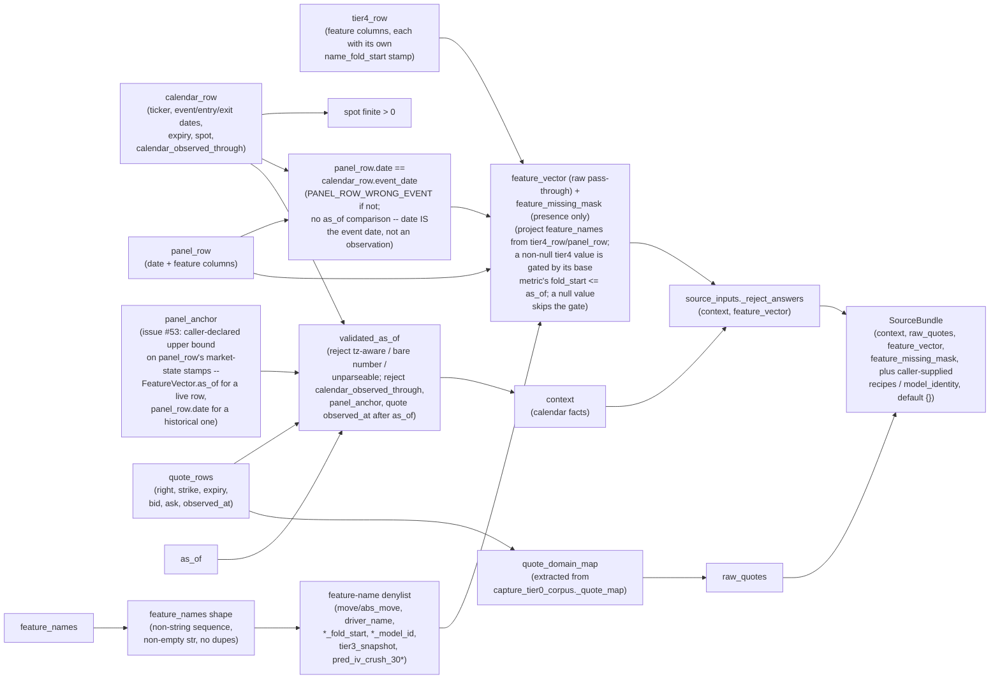

# `engine/v2/scoring` — architecture

## Purpose

Layer **5.0** of the root [`ARCHITECTURE.md`](../../../ARCHITECTURE.md)'s
layer table (§2): the scoring application. It replaces legacy's `score.py`
(split by stage), `entry_rules.py`, `replay.py` and the `trailing_cutoff` half
of `pnl_sim.py`. It owns the §6.3 execution order (one module per stage), gate
and chooser decisions (including DYN-SV menu resolution), financial
diagnostics, and a validated immutable `ScoreRecord`. It never reads a future
outcome (`engine/v2/evaluation` does) and never fits a model during a score
request (`engine/v2/models/training` does); every model, residual pool,
payoff calibration and analog population it reads is frozen data, verified by
content hash before use. It does not mutate a strategy or model registry
(`engine/v2/registry` does that).

See `engine/v2/scoring/README.md` for the exhaustive, checker-enforced Public
interface / Consumers lists (`checks/package_readmes.py` fails an import of a
name absent from that list); this doc gives the structural picture the README
does not.

This is the component's first `ARCHITECTURE.md` (previously listed
`(pending)` in the root doc), written for the whole package as it exists
today, plus two new modules two parallel changes each add:

- **`nightly_source_bundle.py`** — the per-night assembler that turns one
  (ticker, event)'s already-staged inputs (a forward-calendar row, a panel
  row, a Tier-4 row, and Tier-1 option-quote rows) into the source-only
  `context`/`raw_quotes`/`feature_vector`/`feature_missing_mask` fields a
  `SourceBundle` needs, plus placeholders for the calculation `recipes`
  that a later change fills in. **Nothing calls this module yet** — no
  production job resolves a `SourceBundle` from staged inputs today (the
  closest existing code, `engine/v2/ops/native_board_universe.py`, enumerates
  board requests but says explicitly that "translating this into a full
  native `ScoreRequest` is later work"); wiring a caller is a separate,
  later change.
- **`release_bindings.py`** — the one production reader of a live
  deployment's frozen release catalog, the piece
  `guides/rearchitecture_phase5_runbook.md` names as missing: "no production
  path resolves states from `phase5_release.json` yet: that is the Phase 6
  cutover." Nothing calls it yet either; a later cutover-wiring PR wires it
  into the per-night `SourceBundle` assembler alongside
  `nightly_source_bundle.py`.

## Primary contracts and public interfaces

Full list: `engine/v2/scoring/README.md` § Public interface. The load-bearing
entrypoints:

- `application.py` — the shared kernel: `score_one(request, NativeScoreInputs) -> ScoreRecord`,
  `score_many`/`score_batch`/`score_event` (batch variants over the same
  one-request kernel), `score_frozen(request, inference, release,
  inference_request, fields) -> ScoreRecord` (verified frozen inference),
  `replay(score_id, records, legacy_fields) -> (ScoreRecord, ReplayReceipt)`.
- `source_inputs.py` — `SourceBundle` (answer-free source dataclass) and
  `build_native_score_inputs(bundle) -> NativeScoreInputs`, the boundary
  every acceptance/parity caller starts from.
- `frozen_executor.py` — `FrozenStageExecutor`/`FrozenRecipeExecutor`,
  running one frozen-model binding through `engine.v2.models.loader.
  FrozenInference` and raising `FrozenStageRefusal(code, detail,
  reason_codes=...)` (code is always `"MODEL_NOT_READY"` for an unresolved
  or hash-mismatched binding) — the refusal shape every other module in
  this package that resolves a frozen artifact reuses.
- `frozen_batch.py` / `frozen_inputs.py` — the Phase 6 production frozen
  batch boundary (`score_frozen_batch`) and inference-input builder
  (`build_inference_requests`, `validate_answer_free`).
- `nightly_source_bundle.py` (new) — owns `assemble_nightly_source_bundle()`,
  `quote_domain_map()`, `validated_as_of()`, and `NightlySourceBundleRefusal`
  — the per-night, per-(ticker, event) `SourceBundle` field assembler
  described in Inputs/Outputs/Failure semantics below. It is not yet fully
  listed in `README.md`'s `<!-- public-interface: -->` directive.
  `quote_domain_map` IS listed there (a real `__all__` export the
  directive's own check requires be declared); the other three symbols are
  not, because `checks/package_readmes.py` checks that directive against the
  real cross-package import graph, and today the only caller of any of this
  module's symbols is `tools/capture_tier0_corpus.py`'s call to
  `quote_domain_map()` — a script, outside the v2 package graph the directive
  covers (see Dependencies/Callers below, the same exemption this package's
  other `tools/*`/`checks/*` callers already have). `assemble_nightly_source_bundle()`,
  `validated_as_of()`, and `NightlySourceBundleRefusal` join the directive
  once a real `engine.v2.*` package consumer exists (a later PR that wires a
  caller in) — adding them before then would declare an interface nothing in
  the checked graph actually uses.
- `release_bindings.py` (new) — `resolve_release_binding(release_root) ->
  ScoringReleaseBinding`: the production reader of a live deployment's model
  identity, model artifact refs, and analog/payoff/recalibration artifacts.
  See its own section below. `resolve_production_release_binding() ->
  ScoringReleaseBinding` (new, this PR) is the same resolution against the
  ONE configured production release root
  (`engine.v2.models.deployment.production_release_root()`, config key
  `MODEL_RELEASE_ROOT` — see `engine/v2/models/ARCHITECTURE.md` §7.4); a
  missing key is `ModelNotReady("release_root", ...)`, R1(g) below. Nothing
  calls either function yet; a later PR wires one into the per-night
  `SourceBundle` assembler.
  `ScoringReleaseBinding` (frozen dataclass, every mapping field a read-only
  `MappingProxyType` set in `__post_init__` — the `FrozenStageResult`
  convention `frozen_executor.py` already uses) fields: `release_id: str`;
  `model_identity: Mapping[str, ModelIdentity]`, **keyed `"{role}:{strategy_id}"`**
  (never by `role` alone — a release binds `role="gate"` twice, once per
  strategy, e.g. `("gate", "STR-THRU")` and `("gate", "STR-RUNUP")`, so
  `role` is not a unique key; two bindings that resolve to the same
  `"{role}:{strategy_id}"` key is itself a release defect and refuses
  `ModelNotReady` naming that key, not a silently-overwritten dict entry);
  `model_artifact_refs: Mapping[str, str]`, **keyed by `binding_id`**
  (every release binding's `binding_id` is unique by construction, unlike
  `role`). `ModelIdentity` carries `role`, `strategy_id`, `decision_clock_id`,
  `model_id`, `binding_id`, `adapter`, `feature_order`, `output_names`, and
  `artifact_hash` (`engine.v2.foundation.content_hash` over the binding's own
  sorted, verified member content hashes — never re-derived from unverified
  bytes; `model_artifact_refs[binding_id]` carries this same value).
  `model_release: ModelRelease` (`engine.v2.models.contracts.ModelRelease` —
  the exact staged object, hash-verified against its own manifest's
  `release_hash` before this module trusts it; see Failure semantics R1(f))
  and `frozen_inference: FrozenInference` (`engine.v2.models.loader.
  FrozenInference`, constructed `FrozenInference(deployment_root(
  release_root))`, the same construction `checks/phase5_consumers.py:410`
  uses, declared `field(compare=False)` — `FrozenInference` is a plain class
  with no value equality and a mutable, growing member cache of its own,
  never a value this dataclass's `__eq__` can meaningfully compare; see
  Failure semantics R2 and R6) are carried **in exactly the form
  `SourceBundle` already declares
  them** (`source_inputs.py:313-314`, fields `frozen_inference` and
  `model_release`) and **exactly what `_frozen_recipe_executor`
  (`source_inputs.py:540-580`) consumes**: `SourceBundle` is a frozen
  dataclass (`@dataclass(frozen=True, kw_only=True)`, `source_inputs.py:193`),
  so a plain attribute assignment (`bundle.model_release = ...`) would raise
  `FrozenInstanceError` — the real construction path is
  `dataclasses.replace(bundle, model_release=binding.model_release,
  frozen_inference=binding.frozen_inference)`, which the cutover-wiring PR
  calls to produce a new `SourceBundle` carrying every other field over
  unchanged. That PR must not call `deployment.resolve_release`, construct
  its own `FrozenInference`,
  or otherwise re-resolve or re-verify anything this module already
  verified — the whole point of this module is that its caller only ever
  holds objects `resolve_release_binding` itself produced.
  `payoff_artifacts`, `recalibration_artifacts`, `analog_artifacts` are each
  `Mapping[str, tuple[...]]` **keyed by the loaded artifact's own `.strategy`
  field** (never by the manifest row's declared `strategies` list — the
  artifact's own field is what a per-request lookup can trust), holding
  every hash-verified, causally-keyed object of that family the release
  stages (a family can hold several per strategy: e.g. one
  `payoff_line:STR-THRU` object per calibration fold). Picking the one
  object matching a request's own `(strategy, alpha, cutoff)` — over each
  artifact's own `.key` property — and mapping a resolved binding to the
  specific forecast-output name(s) `SourceBundle.model_artifact_refs`
  expects (e.g. `"driver_prediction"`) are both the per-request assembler's
  job (a later cutover PR), not this module's.
- `identity.py`, `financial.py`, `chooser_inputs.py`, `native_*.py` —
  content-addressed request/record identity, financial diagnostics, and the
  native (non-legacy) arithmetic for the analog stage, the DYN-SV chooser,
  the entry-rule gates, the payoff-calibration/model layer and frozen
  residual-state reading. Each is pure arithmetic over declared inputs; none
  performs I/O.
- `compatibility.py` — `score_legacy_request`, the one legacy adapter this
  package owns (see Dependencies).

## Inputs

- A `ScoreRequest` (`engine.v2.contracts`) and either a hand-built
  `NativeScoreInputs` or a `SourceBundle` run through
  `build_native_score_inputs`. `SourceBundle` carries raw context, raw
  quotes, a feature vector and missing mask, model identity/artifact refs,
  and recipes (never calculated forecasts, selected legs, prices, or
  decisions — enforced by `source_inputs.py`'s `_ANSWER_FIELDS` check,
  via `_reject_answers` inside `build_native_score_inputs` and again by
  `frozen_inputs.validate_answer_free` once a `NativeScoreInputs` exists).
- Frozen release state read through `engine.v2.models`: a `ModelRelease`'s
  bindings (`FrozenInference`/`FrozenStageExecutor`), payoff-calibration
  artifacts (`payoff_artifact.PayoffArtifactLoader`), recalibration maps
  (`recalibration_artifact.RecalibrationArtifactLoader`), and the other
  frozen non-model states (`frozen_state.FrozenStateLoader`) — driver/paired
  residual pools, the admissible-depth table, the board analog matcher, the
  DYN-SV chooser's analog pool, the entry-rule gate's trailing cutoff.
  `release_bindings.py` is now the one production caller that resolves
  *which* release and *which* artifacts from a live deployment pointer,
  rather than a test/acceptance harness supplying them directly.
- The legacy `Scorer`/`ScoreRequest`/`FillModel` (`compatibility.py` only).
- **`nightly_source_bundle.assemble_nightly_source_bundle`** (new), for one
  (ticker, event) pair:
  - `as_of` — the night's cutoff, a timezone-naive date/timestamp.
  - `calendar_row` — one forward-calendar row: `ticker`, `event_date`,
    `entry_date`, `exit_date`, `expiry`, `spot`, and
    `calendar_observed_through` (the calendar's own real-history horizon —
    the one calendar fact `SourceBundle.context` may carry directly; never
    a computed calendar verdict).
  - `panel_row`, `tier4_row` — one already-staged row apiece from the
    legacy panel/Tier-4 tables for this ticker, plus whatever feature
    columns the caller names in `feature_names`. Neither real table has an
    `observed_at` column: `panel_row["date"]` (`data/features/panel.parquet`'s
    real schema, legacy's `_KEY_COLUMNS`) is the EVENT date, not an
    observation date — `engine/features.py::live_features` builds its
    synthetic row with `"date": event_date` — so `panel_row["date"]` must
    equal `calendar_row["event_date"]` (see Failure semantics); `tier4_row`
    carries no row-level date at all — each metric column instead stamps
    its own `"<metric>_fold_start"` (a BAND column such as `"..._p10"` is
    stamped by its BASE metric's own `fold_start`, not a per-band one — the
    real schema has only one `fold_start` per metric), checked only for a
    name actually used AND non-null (a NULL forecast, legacy's own "no
    forecast," skips this gate — see Failure semantics).
  - `panel_anchor` (new, issue #53) — the caller-declared upper bound on
    when every one of `panel_row`'s market-state feature values (`spy_*`,
    `ret*`, `or_*`, `pre_iv*`, `dist_*`) was actually observed. Required,
    no default: the caller states it, this module does not infer or
    recompute it (see Failure semantics — this is the same "trusted
    caller-declared fact, checked only against `as_of`" shape already used
    for `calendar_row["calendar_observed_through"]` and each quote row's
    own `observed_at`; it is a single upper bound, not a third,
    independent per-feature classifier that could disagree with
    `engine/audit.py`'s own accounting). Two real sources, precisely:
    - For a row built by `engine/features.py::live_features(...)`: the
      returned `FeatureVector.as_of` (`engine/audit.py`) — NOT one of the
      plain values a caller flattens into `panel_row`, but a field on the
      `FeatureVector` wrapper the caller already holds before it does that
      flattening. `live_features` itself calls `assert_causal(vector)`
      before returning, which raises unless every entry of
      `vector.feature_as_of` (per-feature: history features stamped at the
      last prior event; each market block stamped at the real daily row
      `add_regime_features`/`add_runup_features`/`add_orats_features`
      actually read, which can differ block to block and can each precede
      the decision date) is `<= vector.as_of` — so `vector.as_of` is
      already a proven-safe upper bound for every feature in `vector.values`,
      not a value this module or its caller has to newly derive.
    - For a persisted `panel.parquet` row describing an already-realized
      historical event (or `engine/features.py::panel_features(...)`'s own
      return): `panel_row["date"]` (the event date) is a safe, deliberately
      loose upper bound. The row's real, tighter anchor —
      `engine/features.py::panel_features`'s own local `panel_anchor =
      cal.last_pre_print(event_date, BMO)`, the exact name and concept this
      parameter borrows — always precedes `date` (the panel reads the last
      close *strictly before* the print), and the dropped `ANCHOR_COLUMNS`
      (`regime_asof`/`runup_asof`/`orats_asof`) that would carry it exactly
      are unavailable on a real `panel.parquet` row (see Failure
      semantics). Passing the looser `date` costs nothing for a genuinely
      historical row, where `as_of` is at or after the event by
      definition, so `panel_anchor <= date <= as_of` holds either way.
  - `quote_rows` — the Tier-1 option-quote rows in the domain scored for
    this event (each: `right`, `strike`, `expiry`, `bid`, `ask`,
    `observed_at`), plus an optional `quote_status` for the two
    domain-is-legitimately-empty cases (no chain found; pricing never
    reached).
  - `feature_names` — the caller-declared set of feature columns this
    bundle projects from `panel_row`/`tier4_row`: for each name,
    `tier4_row` wins when both rows carry it (Tier-4 is the more specific,
    later-computed table), falling back to `panel_row`. Must be a
    non-string sequence of non-empty, non-duplicate `str` (a bare `str`
    would otherwise be silently iterated character-by-character); a
    realized panel outcome, `driver_name` itself, or a Tier-4 stamp/band
    column may never appear in it (see Failure semantics, leakage).
  - `calendar_row["spot"]` must be a finite, strictly positive number.
  - Everything else this function's `SourceBundle` needs but does not
    itself resolve — `model_identity`, `model_artifact_refs`,
    `forecast_recipes`, `residual_recipe`, `analog_recipe`, `gate_recipe`
    — are accepted as optional pass-through keyword arguments, each
    defaulting to `{}` (meaning: this bundle does not yet declare that
    calculation). Resolving them from a live model release is
    `release_bindings.resolve_release_binding`'s job (see above), not this
    assembler's; see **Invariants** below for why that boundary is drawn
    here.

## Outputs

One immutable `ScoreRecord` per request (`engine.v2.contracts`), with every
nested mapping/sequence field deep-frozen (`frozen_record.py`) before it
leaves this package. `identity.py` derives the record's content-addressed
`score_id`/`request_hash` from the immutable payload, excluding operational
timestamps, so a replay of the same inputs reproduces the same id.
`release_bindings.py` additionally returns a `ScoringReleaseBinding` — an
in-process snapshot of one release's resolved catalog; it is not persisted
anywhere and carries no operational envelope of its own. Every field except
`frozen_inference` is a genuinely immutable value (frozen dataclass,
`MappingProxyType` mappings); `frozen_inference` is the one field whose
referenced object holds its own mutable, growing cache after this call
returns (Failure semantics R2), so "immutable snapshot" describes the
binding's own fields, not everything reachable through it.
`assemble_nightly_source_bundle` (new) returns a `SourceBundle` whose
`context`, `raw_quotes`, `feature_vector` and `feature_missing_mask` are
populated from the staged inputs above, and whose recipe/model-identity
fields carry through whatever the caller supplied (or the empty-declaration
default). It never returns a `NativeScoreInputs` itself —
`build_native_score_inputs` is a separate, already-existing call the caller
makes afterward.

## Dependencies

May import layers 0-4 (`checks/layer_map.py`, `only_imports` unset, strictly
less than 5.0): `engine.v2.contracts` (0.0), `engine.v2.foundation` (0.5),
`engine.v2.features` (2.0, `default_feature_registry` in `application.py`),
`engine.v2.models` (3.0), `engine.v2.registry` (3.0), and the `engine.v2.domain.*`
packages (4.0/4.5). It must never import `checks` or `tests`
(`checks/import_layers.py`'s `verification-imported` rule) — every module in
this package, including `release_bindings.py`, ports logic it needs from a
`checks/` module rather than importing it. Third-party: `numpy` (several
stage modules), `scipy.stats.norm` (`stages.py`, `native_*.py` —
deterministic arithmetic, no fitting), `pandas` (`compatibility.py`,
`nightly_source_bundle.py`, legacy request construction only).

One declared legacy adapter (`checks/legacy_adapters.json`, package
`engine.v2.scoring`, module `compatibility.py`): `engine.score.Scorer`,
`engine.score.ScoreRequest`, `engine.fills.FillModel`, all confined to
`score_legacy_request`, removal targeted at "phase-5 scoring extraction."

- **`nightly_source_bundle.py`** adds exactly one new import edge,
  intra-package: `.source_inputs` (`SourceBundle`, `_reject_answers`), for
  its own leakage check. It does **not** import `engine.v2.data`: no module
  in this package imports it today, `feature_names` is a plain
  caller-supplied `Sequence[str]`, and loading a `feature_names` list from
  `engine.v2.data.legacy_adapter`'s column ledgers (or a real panel/tier4
  row from anywhere) is left entirely to the caller — this function only
  projects whatever names it is given out of whatever rows it is given. It
  also does **not** import `engine.v2.ops.native_board_universe`: that
  module is layer 7.0, so its tz-naive `as_of` validation pattern is
  mirrored here as an independent copy (`validated_as_of`), not imported —
  the same deliberate non-sharing already used between this repo's native
  and legacy math ports (see `engine/v2/features/ARCHITECTURE.md`).

Callers (checked against the import graph, README § Consumers):
`engine.v2.models.training` (layer 6, `native_payoff`'s pure fitting math
only), `engine.v2.ops` (`score_one`/`NativeScoreInputs`/`StageReceipt` for
the read-only `ops rescore` CLI, and `.source_inputs.SUPPORTED_STRATEGIES` via
`native_board_universe.py`), `engine.v2.serving.native_render` (layer
7, display-only analog row ids). `checks/phase4_frozen_bridge.py` and
`tools/capture_tier0_corpus.py` call `frozen_inputs.py` as compatibility
callers, and `tools/capture_tier0_corpus.py` additionally calls
`nightly_source_bundle.quote_domain_map()` for offline capture (see
Purpose); `checks/*` and `tools/*` sit outside the package's
machine-checked `<!-- consumers: -->` allowlist by design.
`assemble_nightly_source_bundle()` and `release_bindings.py` each have no
production caller yet — a later cutover-wiring PR wires both into the
per-night `SourceBundle` assembler.

## External systems and libraries

No network. Local filesystem only: the deployment content-addressed store
and `phase5_release.json` (via `engine.v2.models`, read-only from this
package), and fold files elsewhere in the release pipeline (not read directly
by this package). `nightly_source_bundle.assemble_nightly_source_bundle`
takes every staged row as an already-loaded plain mapping; loading those rows
from the real panel/Tier-4/quotes/calendar stores is the caller's job, not
this function's — see Invariants (read-only, no I/O).

## Failure semantics

Package-wide invariant (root doc §5): a missing or unusable input produces
an explicit typed refusal, never a silent default — `FrozenStageRefusal`
(`code="MODEL_NOT_READY"`, `reason_codes`, `missing_features`) is this
package's one refusal shape for an unresolved or hash-mismatched frozen
artifact, reused by every stage that reads one (`frozen_executor.py`,
`source_inputs.py`'s frozen-recipe/residual/analog/payoff/recalibration
readers). No stage caches beyond the process (`FrozenStateLoader`/
`PayoffArtifactLoader`/`RecalibrationArtifactLoader` each hold an in-memory,
per-instance, content-hash-keyed cache only — never written to disk), no
stage retries, no stage performs a partial write (scoring is read-only
except `frozen_record.py`'s in-memory freeze), and every stage is
idempotent: the same `ScoreRequest` + `NativeScoreInputs` always produces
the same `ScoreRecord` (`identity.py`'s content-addressed `score_id`). Typed
refusals with a machine-checkable `.code`/`.detail` also exist at
`AnalogRefusal` (`native_analog.py`) and `NightlySourceBundleRefusal`
(`nightly_source_bundle.py`, below).

**STR-RUNUP's `runup_move` forecast field (issue #94).** Every mechanism
that produces this strategy's forecast — `score_frozen()`'s own
`application._runup_frozen_output`, a live Tier-4/frozen-model executor
backing the `"runup_move"` role (`application._runup_executor_spec` /
`_frozen_stage_executors`), or a live local/champion model
(`stages._execute_forecast`) — populates TWO fields, never one conflated
name: `runup_move_raw_d14` (the model's own D14-horizon magnitude) and
`runup_move_prediction` (`runup_move_raw_d14` scaled by
`days_before_print / 14`, exactly once, the row's PUBLISHED value). Two
direct readers: `financial.py`'s `_runup_fair_premium` and
`checks/phase4_real.py`'s `_legacy_fair_premium` (the parity checker's own
copy of the same formula); other consumers (serving, UI) read it only
through their own field mappings, not documented here. The model stage
(`stages._runup_model_inputs`/`_runup_residual_bands`) prefers
`runup_move_raw_d14`, falling back to `runup_move_prediction` only when no
raw field was produced -- for a row that goes on to score with a valid
horizon, never true after this fix (kept as a defensive default); an
invalid or missing `days_before_print` can still take this fallback path
before the model stage's own horizon check refuses the row
(`MISSING_MODEL_INPUT:days_before_print`), so the guarantee applies only to
scored, valid-horizon rows. The model stage refuses
(`MISSING_MODEL_INPUT:runup_move_prediction`) when neither value is a finite
number. Before this fix, a frozen-sourced value was scaled once at capture
and a second time by the model stage's own `native_payoff.scale_runup_move`;
a live-local value was never scaled for publication at all.

### `release_bindings.py` (the 4c R1–R6 template)

- **R1, missing input.** `resolve_release_binding(release_root)` validates
  its one argument (a non-empty path) before any I/O, then computes the
  deployment store root as `Path(release_root) / "deployment"` inline (the
  same one-line join `checks/phase5_release.py`'s `deployment_root` performs
  — ported, not imported, since that module is under `checks`). The live
  pointer file (`DEPLOYED`) lives at `<release_root>/deployment/DEPLOYED`,
  **not** directly under `release_root`. Six sub-cases below (a)-(f), each a
  distinct typed refusal, cover resolving the pointer and then the one
  staged-manifest read that follows it:
  - **(a) no pointer at all.** `deployment.current_pointer(deployment_root)`
    returns `None`, rather than raising, when nothing has ever been promoted
    (or `release_root`/its `deployment/` subdirectory does not exist —
    `current_pointer` treats a missing `DEPLOYED` file and a missing
    directory identically). This module turns that into `NoCurrentRelease`.
  - **(b) the `DEPLOYED` file itself is corrupt or unparseable.**
    `current_pointer`'s decode (`deployment.py:384`,
    `_decode(PointerState, path.read_bytes())`) can raise a bare
    `json.JSONDecodeError` or `engine.v2.foundation.typed.DocumentError`
    (malformed JSON, or JSON that does not match `PointerState`'s schema) —
    neither is a `DeploymentError` subclass. This module catches both
    explicitly and re-raises as `ModelNotReady("DEPLOYED", str(exc))`;
    it is a corrupt member of the deployment store, not the "nothing
    promoted yet" case (a), so it is never conflated with `NoCurrentRelease`.

  Once a live `pointer.release_id` is known, this module reads the staged
  manifest **exactly once**, via `deployment._read_manifest(deployment_root,
  release_id)` — never through the public `resolve_release()` wrapper (which
  would read the same file again), and never re-read later for the hash
  check below. Every way that one read can fail is its own typed refusal,
  and only once all of them pass does `manifest.release` become this
  module's trusted `ModelRelease`:
  - **(c) an unsafe `release_id`.** `_read_manifest` builds its path through
    `_manifest_path`/`_release_dir`, which raises `DeploymentError` for a
    `release_id` containing `/` or equal to `.`/`..` (`deployment.py:132`)
    before touching the filesystem at all. Caught and re-raised as
    `ModelNotReady("model_release", str(exc))`.
  - **(d) no staged manifest for that id.** `_read_manifest` returns `None`
    when `releases/<release_id>/manifest.json` does not exist
    (`deployment.py:179-180`) — the exact condition the public
    `resolve_release()` turns into `ReleaseNotStaged`, which this module
    never raises because it never calls that wrapper. Raised directly as
    `ModelNotReady("model_release", "release not staged")`.
  - **(e) a `manifest.json` that exists but will not parse.** `_read_manifest`'s
    own decode (`deployment.py:181`, `_decode(StagedManifest,
    path.read_bytes())`) can raise a bare `json.JSONDecodeError` or
    `DocumentError` — again not a `DeploymentError` subclass, same failure
    shape as (b) above. Caught explicitly and re-raised as
    `ModelNotReady("manifest.json", str(exc))`.
  - **(f) the staged manifest's own hash disagrees.** Once a `StagedManifest`
    is in hand, this module calls `deployment._manifest_hash_matches(manifest)`
    on that same object — the exact function `checks/phase5_acceptance.py:
    185`'s `_load_model_release` calls for the same purpose (both
    `deployment._read_manifest` and `deployment._manifest_hash_matches` are
    called directly off the `engine.v2.models.deployment` module this module
    already depends on, not imported from `checks`) — **before** trusting
    `manifest.release` or any binding's member hashes. `resolve_release()`'s
    public path never performs this check itself, which is why this module
    cannot use it. A mismatch raises `ModelNotReady("model_release",
    "release_hash disagrees with manifest")`. This check accepts a
    verified manifest under EITHER `release_hash_version`
    (`deployment.RELEASE_HASH_MEMBER_V1` or `...SEMANTIC_V2`) — replay of a
    score recorded against an older, legacy-hashed release must keep
    resolving it. `deployment.promote`/`rollback` enforce a stricter,
    write-side rule (refusing anything but `...SEMANTIC_V2`,
    `deployment.StaleReleaseHash`) that this read-only module does not
    apply and never will: "safe to make live" and "the release a past
    score actually used" are different questions (`engine/v2/models/
    ARCHITECTURE.md` §7.2–§7.3).
  - **(g) no configured production release root.** Only
    `resolve_production_release_binding()` has this case —
    `resolve_release_binding()` itself still takes an explicit
    `release_root` and never reads the environment. A missing or blank
    `MODEL_RELEASE_ROOT` raises `deployment.MissingReleaseRoot`, caught and
    re-raised as `ModelNotReady("release_root", "no production release
    root is configured")` before `deployment.production_release_root()`'s
    return value ever reaches `resolve_release_binding`.
- **R1 (continued), a member missing or corrupt.** Once a release is
  resolved, every model binding's member objects and every declared
  payoff/recalibration/analog state object is hash-verified and typed-loaded
  before this module trusts it. A missing file, a status other than
  `STAGED`, a payload whose sha256 disagrees with its declared
  `content_hash`, or a document a typed loader rejects (`PayoffArtifactError`/
  `RecalibrationArtifactError`/`FrozenStateError`) all raise `ModelNotReady`
  (`code="MODEL_NOT_READY"`, matching `engine.v2.models.contracts.
  MODEL_NOT_READY` and the `FrozenStageRefusal` convention above), naming
  the exact `member_id` (e.g. `"model:gate:STR-THRU"`,
  `"payoff_line:STR-THRU"`, `"board_analog_matcher"`) and, where useful, the
  specific object name inside it. The `phase5_release.json` catalog itself
  is verified the same way before any of its rows are trusted: it must
  parse as a JSON object whose own declared `manifest_hash` matches a fresh
  `content_hash` of its other fields, its `schema_version` must equal
  `checks/phase5_release.py`'s `PHASE5_RELEASE_SCHEMA`
  (`"phase5_staged_release.v1.0"`) by exact string equality — the same check
  `read_manifest` performs there (any other value, older or newer, is not a
  shape this module knows how to read, so it refuses rather than guessing)
  — and its `release_id` must equal the
  live pointer's `release_id` — the layout assumes one catalog file
  describes the release root's *current* release, an assumption a rollback
  to an older staged release would break — a `phase5_release.json` that
  fails either check raises `ModelNotReady("phase5_release.json", ...)`
  before any state-family row is read. This is a known, pre-existing
  limitation of the single-catalog-per-root layout
  (`checks/phase5_release.py`), not a defect this module introduces —
  after a rollback, resolution refuses rather than silently serving a
  stale-release catalog. See
  [issue #49](https://github.com/yshewchuk/investment-validation/issues/49)
  for the follow-up that would make the catalog survive a rollback
  (a release-scoped catalog store, out of this module's scope).
- **A hash mismatch never falls back.** There is no branch anywhere in this
  module that substitutes a different object, an older cached value, or a
  default when a hash disagrees — `ModelNotReady` is the only outcome. This
  is a property of the control flow (one verify-then-load path per member,
  no alternate source), proven by a test that a mismatched object never
  yields a resolved binding of any kind.
- **R2, cache.** None, for every field except `frozen_inference`: the other
  fields' own artifact loaders (`PayoffArtifactLoader`/
  `RecalibrationArtifactLoader`/`FrozenStateLoader`) are each constructed
  fresh inside `resolve_release_binding` and never returned to the caller,
  so they are discarded when it returns; two calls against the same
  `release_root` re-read and re-verify every byte from disk for
  `model_identity`, `model_artifact_refs`, `model_release`,
  `payoff_artifacts`, `recalibration_artifacts` and `analog_artifacts` —
  nothing about them is memoized across calls or persisted to disk by this
  module. `frozen_inference` is the deliberate exception: a
  `FrozenInference` instance owns its own mutable, growing member cache
  (`loader.py:27`, `self._cache: dict[tuple[object, ...], ReadOnlyArtifact]`),
  populated lazily inside `.infer()` and keyed by `(adapter, feature_order,
  output_names, member content hashes)` — a content-hash key specifically
  so a changed artifact can never return a stale cached entry
  (`loader.py`'s own module docstring: "cache-independent loading"). This
  module never clears or bounds that cache; it lives exactly as long as the
  `FrozenInference` instance this call constructs and returns lives — i.e.
  for as long as the caller holds the returned `ScoringReleaseBinding` (or
  its `frozen_inference` field) alive, across every `.infer()` call the
  caller makes with it, by design: persisting that cache across many score
  requests is the entire reason to return a live `FrozenInference` rather
  than a snapshot. A fresh call to `resolve_release_binding` always
  constructs a brand-new `FrozenInference` with an empty cache; nothing is
  shared between separate `resolve_release_binding` calls. Separately,
  `native_residuals.paired_arrays_from_artifact` keeps a process-wide,
  in-memory `_ARRAY_CACHE` of at most 4 entries, keyed by the frozen
  artifact's own `content_hash` — since the key is a content hash, a hit
  and a miss always return the identical arrays (`setflags(write=False)`,
  so neither call can mutate what the other reads); at capacity it evicts
  the oldest-inserted entry (FIFO, not LRU) and recomputes on the next
  request for that artifact. A miss costs one extra array-build; it never
  changes a result or a refusal (R2 of the 4c template: cache is an
  optimization over content-addressed, immutable data, not a correctness
  dependency).
- **R3, retry.** None. A refusal is not retried internally; a caller that
  wants to retry (e.g. after promoting a new release) calls
  `resolve_release_binding` again, which re-resolves the pointer from
  scratch.
- **R4, transaction.** Not applicable — read-only, single-pass, no
  multi-step state to roll back. Resolution either completes and returns one
  `ScoringReleaseBinding` -- immutable except for its `frozen_inference` field,
  whose referenced `FrozenInference` instance holds its own mutable cache
  outside this dataclass's fields (see R2 and Outputs) -- or raises before
  returning anything.
- **R5, partial write.** None possible: this module performs no writes.
  Every function it calls into (`deployment.current_pointer`,
  `deployment._read_manifest`, `deployment._manifest_hash_matches`, the
  artifact loaders' `.load`) is documented read-only in its own module;
  `FrozenInference.__init__` performs no I/O either (it only resolves the
  root path and initializes an empty in-memory cache — reading happens
  later, inside a caller's own `.infer()` calls, outside this module).
  `release_bindings.py` adds no write of its own.
- **R6, idempotency.** Resolving the same `release_root` while its pointer
  is unchanged always returns a `ScoringReleaseBinding` equal (dataclass
  `__eq__`) to the previous one, on every field except `frozen_inference` —
  which is declared `field(compare=False)` precisely because it can never
  hold: `FrozenInference` defines no `__eq__` of its own (plain identity
  comparison) and starts a fresh, empty, mutable cache on every
  construction, so two separate resolutions' `frozen_inference` values are
  never `==` even when they wrap the identical `release_root`. A caller that
  wants to confirm two resolutions saw the same release compares
  `.model_release` directly — a plain frozen dataclass, equal by value.
  Resolving again after a promotion or rollback reflects the new pointer in
  every other field, never a stale one, because nothing about them is cached
  between calls.

### `nightly_source_bundle.py` (new)

Following the `code`/`detail` convention (`AnalogRefusal`/`FrozenStageRefusal`,
not the plain-`ValueError` convention `frozen_inputs.py`/`FrozenInputsError`
also uses in this package):

- `class NightlySourceBundleRefusal(ValueError)` — `__init__(self, code: str, detail: str)`, message `f"{code}: {detail}"`.
- **R1, missing input.** `calendar_row`, `panel_row`, `tier4_row`, or
  `quote_rows` wholly absent or not a sequence; `calendar_row` missing any
  of `ticker`/`event_date`/`entry_date`/`exit_date`/`expiry`/`spot`/
  `calendar_observed_through`; `panel_row` missing its own `date` column
  (the real panel key column, NOT `observed_at` — neither
  `panel.parquet` nor `tier4_forecasts.parquet` has ever carried that
  name); or any `quote_rows[i]` missing its own `observed_at` key →
  `MISSING_STAGED_INPUT`, naming the input and (for `calendar_row`, or
  the quote row's own index) the missing key(s). A quote row without
  `observed_at` is refused rather than silently skipped, because skipping
  it would let that row reach `raw_quotes` never checked against `as_of`
  at all — worse than merely "unchecked and flagged," genuinely
  unvalidated. `tier4_row` itself has no required key at this stage — it
  only need be a mapping — because it carries no row-level date at all;
  see the Tier-4 stamp contract below for what IS required once a name is
  actually resolved from it.
- **Values are passed through, never classified here.** A feature name
  resolved from `tier4_row`/`panel_row` is projected into `feature_vector`
  EXACTLY as staged — `None`, NaN of any Python/NumPy/pandas flavor,
  `+/-inf`, or a non-numeric string included, unconverted and
  unfiltered. This module used to coerce each value to `float` and refuse
  a non-finite one as its own `INVALID_FEATURE_VALUE`; that has been
  removed — classifying a value as missing vs. invalid is the real
  consumer's job (`FrozenStageExecutor._row`, frozen_executor.py: a
  non-finite value, including a numeric-looking string like `"nan"`, is
  `MISSING_FEATURES`; a value that cannot convert to `float` at all,
  e.g. `pandas.NA` or `"abc"`, is `INVALID_FEATURE`;
  `application._feature_fields`, application.py, independently derives
  its own `null_masks` from `model_inputs` the same way), never this
  assembler's — a second, independent classification here could disagree
  with the real one and either fabricate a refusal the real pipeline
  would have accepted, or accept a value the real pipeline would refuse.
  `feature_missing_mask` is therefore a pure PRESENCE fact (the name was
  found in neither row), not a value-quality judgement, and is kept only
  because `SourceBundle`'s dataclass shape requires the field — no real
  consumer today reads it once it reaches `NativeScoreInputs.features
  ["missing_mask"]`.
  `tests/test_v2_scoring_nightly_source_bundle.py::
  test_bundle_feature_value_matches_real_executor_classification` proves
  this by running a value table (`None`, NaN, `np.float32` NaN,
  `pandas.NA`, `inf`, `"nan"`, `Decimal("NaN")`, `"abc"`, `1.0`) through
  the bundle and then through `FrozenStageExecutor._row`, asserting the
  outcome equals classifying the same raw value directly, with no bundle
  in between.
- **Leakage, feature name denylist.** Checked on `feature_names` alone,
  before any row is read, independently of `source_inputs._ANSWER_FIELDS`
  (a different denylist of calculated SCORING outputs, checked next): a
  name that is (a) a realized panel outcome column — `"move"`/`"abs_move"`,
  an independent copy of legacy's own `engine.features.OUTCOME_COLUMNS`,
  kept equal to it by
  `test_panel_outcome_columns_matches_legacy`; (b) equal to `driver_name`
  — the value being forecast can never be its own feature; or (c) a
  Tier-4 stamp/band/metadata column — any name ending in `"_fold_start"`
  or `"_model_id"`, the literal `"tier3_snapshot"`, or any name starting
  with `"pred_iv_crush_30"` (its whole stamp/band family, not only its
  fold_start/model_id suffixes) — all real columns of
  `data/features/tier4_forecasts.parquet` that describe HOW/WHEN a
  forecast was produced, never a legitimate input to anything else → all
  refuse `LEAKED_FEATURE_NAME`, naming the offending column(s) and reason.
- **Leakage, answer/outcome fields.** Every assembled `context` and
  `feature_vector` value is passed through `source_inputs._reject_answers`
  (the same denylist `build_native_score_inputs` itself enforces) before
  the function returns → plain `ValueError` naming the offending field
  path, exactly as `_reject_answers` already raises elsewhere in this
  package. This function does not re-implement or loosen that check; it
  is a second, independent layer on top of the feature-name denylist
  above, catching a calculated scoring answer (e.g. `gate_pass`) that is
  not itself a raw panel/Tier-4 source-table column.
- **Panel row must describe the same event (`PANEL_ROW_WRONG_EVENT`).**
  A second Opus review round found that the FIRST version of this fix
  still refused every real row: `panel_row["date"]` is the EVENT date,
  not an observation date — `engine/features.py::live_features` builds
  its synthetic row with `"date": event_date`, and every persisted
  `panel.parquet` row is likewise keyed by its own event date — so
  comparing it against `as_of` (as if it were an observation timestamp)
  refused every genuine upcoming-event row outright; only a row for a
  DIFFERENT, already-past event ever passed. The one invariant this
  module can verify from the data it is given: `panel_row["date"]`,
  normalized by `validated_as_of`, must equal `calendar_row["event_date"]`,
  likewise normalized → `PANEL_ROW_WRONG_EVENT`, naming both values, if
  they differ. This check does not depend on `as_of` at all.
- **Leakage, post-`as_of` rows — the real stamp contract.** Neither
  `panel.parquet` nor `tier4_forecasts.parquet` carries `observed_at`;
  an earlier version of this check compared against a column that does
  not exist on either table. The real contract: `as_of` itself,
  `calendar_row["calendar_observed_through"]`, `panel_anchor`, and each
  `quote_rows` entry's own `observed_at` (quotes DO carry it) are each
  validated by `validated_as_of` (rejects `None`, `NaT`, a bare
  number/bool, an unparseable value, or a timezone-aware value —
  mirroring `engine/v2/ops/native_board_universe.py::_validated_as_of`,
  issue #16's pattern) and then compared: any strictly after `as_of` →
  `POST_AS_OF_ROW`, naming the input and its date. `calendar_row`'s
  `event_date`/`entry_date`/`exit_date`/`expiry` are exempt from this
  comparison — they describe the (future) event being scored, not a fact
  observed after `as_of`. `panel_row["date"]` is NOT compared against
  `as_of` here at all (see `PANEL_ROW_WRONG_EVENT` above — it is the
  event date, an as_of comparison on it is simply the wrong check); the
  row's own market-state feature values are what `panel_anchor` verifies
  instead (see "Panel-row feature anchor" below), checked unconditionally
  — regardless of whether `feature_names` ends up resolving anything from
  `panel_row` at all — the same way `calendar_row["calendar_observed_through"]`
  is checked unconditionally. `tier4_row` has no row-level date to check here at all: instead, a
  feature name actually resolved from `tier4_row` AND non-null is
  allowed only when that metric's own fold_start (its BASE metric's
  `"<metric>_fold_start"` — a band column such as `"..._p10"` shares its
  base metric's stamp, since the real schema has no per-band fold_start)
  is staged (else `MISSING_STAGED_INPUT`, naming the feature) and
  `<= as_of` (else `POST_AS_OF_ROW`, naming the `fold_start` field and
  its date) — checked per used feature inside `_project_features`, not
  against the whole row up front. A resolved value that is legacy's own
  "no forecast" NULL (`None`, `pandas.NA`, or a float NaN of any flavor)
  skips this entire gate, whatever its own fold_start holds (present,
  absent, `NaT`, or dated whenever) — measured against the real
  `tier4_forecasts.parquet`: 108,320 of 199,973 `pred_abs_move` rows are
  NULL, always paired with a NULL `pred_abs_move_fold_start` with zero
  counterexamples, so requiring a fold_start on a null value would
  refuse every real null row outright. A feature resolved from
  `panel_row` needs no per-feature stamp check at all — only the
  whole-row `PANEL_ROW_WRONG_EVENT` check above applies to it.
- **Panel-row feature anchor (resolved, issue #53).** Neither
  `PANEL_ROW_WRONG_EVENT` nor the fold_start checks above verify WHEN a
  panel row's market-derived FEATURE values were actually computed
  relative to `as_of` — only that the row names the right event.
  `engine/features.py::live_features` does compute a real per-feature
  decision anchor for its synthetic row (`FeatureVector.feature_as_of`,
  `engine/audit.py` — each market block stamped at the real daily row it
  was read at, which can precede `event_date`/`date`/`as_of` for a genuine
  upcoming-event score, verified `<= vector.as_of` by `live_features`'s own
  `assert_causal(vector)` call before it returns), but the flattened row
  values a caller stages as `panel_row` are not that `FeatureVector` — they
  are `vector.values`, a plain `name -> float` mapping with no stamp of any
  kind attached (the anchor lives on the `FeatureVector` wrapper, in
  `.as_of`/`.feature_as_of`, not inside `.values`). The persisted-panel
  equivalent (`regime_asof`/`runup_asof`/`orats_asof`, `ANCHOR_COLUMNS`) is
  explicitly dropped before `panel.parquet` is written
  (`engine/data/features/panel.py:912-918` — safe to drop only because,
  for a HISTORICAL row, those all equal `date` by construction, an
  equivalence that does not hold for a live per-event row). No column
  survives to a `panel_row` this function can read that records any of
  this, so this module cannot check it from `panel_row` alone without
  inventing a stamp the real data does not carry — the earlier version of
  this doc escalated that as a known gap rather than inventing one. The
  fix lands as a
  deliberate interface change: `assemble_nightly_source_bundle` gains a
  new required, no-default keyword-only parameter, `panel_anchor` (see
  Inputs above) — the caller states the anchor `panel_row`'s market-state
  values were actually computed against, the same "trusted caller-declared
  fact" shape this module already uses for `calendar_observed_through` and
  quote `observed_at`, not a value this module infers or recomputes.
  `panel_anchor`, once staged, is validated by `validated_as_of` and
  checked against `as_of` exactly like every other observation-time anchor
  (see the stamp-contract bullet above) → `POST_AS_OF_ROW`, naming
  `panel_row.anchor` and its date, if it is strictly after `as_of`.
  **Consequence, before this fix:** a persisted `panel.parquet` row is
  anchored at its own event date (`engine/data/features/panel.py:912-918`),
  so if a caller staged one for an event whose date is after `as_of`, its
  market-state features (`spy_*`, `ret*`, `or_*`, `pre_iv*`, `dist_*`)
  could be values observed after `as_of`, and this function accepted
  them silently. **Scope of the fix:** this module trusts the caller's
  declared `panel_anchor` — it does not re-derive it from `panel_row`'s
  own columns (there is nothing left to re-derive it from, per the
  paragraph above) and does not assert `panel_anchor <= panel_row["date"]`
  (the print itself) — that causal ordering is `live_features`'s own
  `assert_decision_causal`'s job, not a second, possibly-disagreeing
  check here. A caller that mis-declares its own anchor (states an
  earlier value than the one it actually used) defeats this check the
  same way a caller that lies about `calendar_observed_through` would —
  this module verifies the declared contract, not the caller's honesty
  about it, exactly as already true for every other staged input.
- **Other input validation.** `calendar_row["spot"]` not coercible to
  `float`, non-finite, or `<= 0.0` → `INVALID_SPOT`, naming the value
  found. `feature_names` a bare `str`/`bytes`, not a `Sequence`,
  containing a non-`str` or empty-`str` entry, or containing a duplicate
  → `INVALID_FEATURE_NAMES`, naming the problem.
- **Malformed quotes.** `quote_domain_map` (the extracted, behavior-identical
  copy of `tools/capture_tier0_corpus.py`'s `_quote_map`) refuses a quote
  row missing `right`/`strike`/`expiry`/`bid`/`ask`, an unrecognized
  `right`, a non-finite or negative `bid`/crossed `ask`, or two rows
  disagreeing on the same contract key, and refuses a non-empty
  `quote_rows` when `quote_status` claims the domain is empty (or vice
  versa) — identical checks to today's, raising `NightlySourceBundleRefusal`
  here instead of `tools/capture_tier0_corpus.py`'s own
  `StrictTraceCaptureError`; that module's call site wraps the new
  function's `ValueError` back into its own exception type so its
  existing behavior and tests are unchanged.
- **Determinism (R6).** Same staged inputs, same output: no wall-clock
  read and no random draw anywhere in the function. `context` and
  `feature_vector`/`feature_missing_mask` are built by iterating a sorted
  key order (`sorted(_CALENDAR_REQUIRED_FIELDS)`/`sorted(feature_names)`),
  independent of any input mapping's own iteration order; `raw_quotes`
  preserves `quote_rows`' own given order (unchanged from the original
  `_quote_map`'s behavior) rather than sorting it, which is still fully
  deterministic for the same `quote_rows` sequence, and dict equality does
  not depend on key order regardless. Two calls with identical arguments
  produce `SourceBundle` values that are field-for-field identical —
  but NOT necessarily equal under a bare `==` once a pass-through NaN is
  present (a null Tier-4 forecast, above): `float('nan') != float('nan')`
  under IEEE 754 even when every field was built the same way (a second
  Opus review round found this exact claim false by probe:
  `assemble_nightly_source_bundle(...) == assemble_nightly_source_bundle(...)`
  reads `False` once `tier4_row` carries a null forecast). Determinism
  here means reproducibility of the underlying data, not that `==` is a
  valid equality probe in general — a caller comparing two bundles that
  may carry a pass-through NaN needs a NaN-aware comparison (e.g.
  comparing each field with `math.isnan`-aware equality, or a canonical/
  content-hash comparison), not bare `==`.
  `tests/test_v2_scoring_nightly_source_bundle.py::
  test_same_inputs_with_nan_are_field_identical_but_not_equal` proves
  this directly.
- **Read-only (R2–R5 do not apply).** The function performs no I/O: every
  staged input arrives as an already-loaded mapping/sequence, and nothing
  it does can mutate a store, a file, or its own arguments.

## Invariants

Root doc §5 invariants this package is responsible for: "Native vs. legacy
provenance" (`frozen_inputs.py`'s `validate_answer_free`), "Missing input →
typed refusal, never a silent default" (`FrozenStageRefusal`/
`ModelNotReady`, above), "No parity-only or legacy-emulation modes" (one
scoring code path; `checks/phase4_real.py`/`native_parity_report.py` do the
comparing, this package never branches on "are we being compared"), and
"Failure semantics are stated, not implied" (this doc's section above).
Package-specific: `release_bindings.py` never imports `engine.score`/
`engine.fills` or any other legacy module — it is pure v2, unlike
`compatibility.py`.

- **Answer-free source boundary (root doc §5).** `_reject_answers`/
  `_ANSWER_FIELDS` (`source_inputs.py`) is the single enforcement point for
  what counts as a calculated SCORING answer; `nightly_source_bundle.py`
  calls it rather than keeping a second copy of that denylist.
  `nightly_source_bundle.py` additionally enforces its own, distinct
  denylist over raw SOURCE-TABLE columns that were never scoring outputs at
  all (a realized panel outcome, `driver_name`, or a Tier-4 stamp/band
  column — see Failure semantics, leakage) — a different boundary than
  `_ANSWER_FIELDS`, not a duplicate of it, because `_ANSWER_FIELDS` has no
  entry for most of these real column names (e.g. `"move"`,
  `"pred_abs_move_fold_start"`).
- **Typed refusal, no fabrication.** A missing staged input is a named
  refusal; a missing individual feature is a mask entry. Neither is ever a
  silently substituted default (`0`, `None`, or an imputed value) — the
  same convention `engine/v2/features/panel_math.py::daily_state_lookup`
  already established for exactly this "row present, some columns absent"
  shape.
- **No leakage past `as_of`, for inputs that carry an observation anchor.**
  This is a new invariant `nightly_source_bundle.py` adds: nothing in this
  package previously checked a row's own observation date against a cutoff
  (`source_inputs.py` has no `as_of` concept of its own; the closest
  existing fact, `calendar_observed_through`, was carried through without
  being validated against anything). `nightly_source_bundle.py` is the
  first place in this package that enforces it — for the inputs that
  actually carry an observation-time anchor: `calendar_row`'s
  `calendar_observed_through`, every `quote_rows` entry's own
  `observed_at`, the caller-declared `panel_anchor` (issue #53, see "Panel-row
  feature anchor" above), and a used, non-null Tier-4 feature's own base
  metric `fold_start` (see "Leakage, post-`as_of` rows — the real stamp
  contract" above). `panel_row` itself still carries no such anchor as one
  of its own columns — `PANEL_ROW_WRONG_EVENT` (`panel_row["date"]`
  identifies WHICH event the row is for, not WHEN its market-state
  features were observed) is unchanged — which is exactly why the anchor
  is a separate, caller-declared parameter rather than something read off
  `panel_row`; a null Tier-4 value still skips the fold_start gate
  entirely (see "Leakage, post-`as_of` rows — the real stamp contract"
  above for why).
- **`model_identity`/`model_artifact_refs`/recipe fields are
  `nightly_source_bundle.py`'s explicit non-goal.** `SourceBundle` requires
  them, but resolving a model identity or artifact reference from a live
  deployment is `release_bindings.resolve_release_binding`'s
  responsibility, not something staged panel/Tier-4/quotes/calendar data
  can answer on its own. `assemble_nightly_source_bundle` accepts them as
  pass-through arguments (default `{}`, meaning "not yet declared" — the
  same convention `SourceBundle`'s own optional fields already use for
  "this stage is not applicable") so it composes cleanly with
  `release_bindings.py` without either one reaching into the other's
  inputs. A caller that wants a fully-declared bundle combines both
  functions' output itself; `nightly_source_bundle.py` alone never
  fabricates a model identity or a recipe it cannot source from staged
  data.
- **Native vs. legacy independence.** `nightly_source_bundle.py` imports
  no legacy `engine.*` module and is never imported by one.
  `quote_domain_map` is a byte-identical port of
  `tools/capture_tier0_corpus.py`'s `_quote_map`, moved (not copied) so the
  two never drift; `tools/capture_tier0_corpus.py` calls back into this
  package for it, the same "compatibility caller" relationship the README
  already documents for its other capture-time calls into this package.
- **Layering.** Scoring (5.0) never imports ops (7.0) or serving (7.0);
  `nightly_source_bundle.py` follows that rule even where it costs a small
  duplicated validator (`validated_as_of`) rather than an upward import.

## Diagrams

### Package module dependency graph (unchanged edges omitted for clarity)

```
engine.v2.ops / engine.v2.serving (layer 7, callers, not shown as dependents below)
        |
        v
  application.py --> financial.py
        |        --> frozen_executor.py
        |        --> identity.py --> frozen_record.py
        |        --> stages.py --> financial.py
        v
  source_inputs.py --> frozen_executor.py
        ^     \--> native_analog.py
        |      \-> stages.py
  chooser_inputs.py --> native_chooser.py --> native_chooser_features.py --> native_gate_features.py --> native_payoff.py
        |
  nightly_source_bundle.py (new; no caller yet)
        \--> source_inputs.py   (SourceBundle, _reject_answers) -- the only new import edge
  release_bindings.py (new; no caller yet)
        \--> engine.v2.models (deployment, loader, contracts) -- no new intra-package edge
```

### `nightly_source_bundle.assemble_nightly_source_bundle`: data flow


```mermaid
flowchart LR
    CAL["calendar_row\n(ticker, event/entry/exit dates,\nexpiry, spot,\ncalendar_observed_through)"]
    PANEL["panel_row\n(date + feature columns)"]
    PANCHOR["panel_anchor\n(issue #53: caller-declared upper bound\non panel_row's market-state stamps --\nFeatureVector.as_of for a live row,\npanel_row.date for a historical one)"]
    TIER4["tier4_row\n(feature columns, each with its own\nname_fold_start stamp)"]
    QUOTES["quote_rows\n(right, strike, expiry,\nbid, ask, observed_at)"]
    ASOF["as_of"]
    NAMES["feature_names"]

    CAL --> SPOTCHK["spot finite > 0"]
    NAMES --> NAMECHK["feature_names shape\n(non-string sequence,\nnon-empty str, no dupes)"]
    NAMECHK --> LEAKNAMES["feature-name denylist\n(move/abs_move, driver_name,\n*_fold_start, *_model_id,\ntier3_snapshot, pred_iv_crush_30*)"]

    CAL --> EVENTCHK["panel_row.date ==\ncalendar_row.event_date\n(PANEL_ROW_WRONG_EVENT if not;\nno as_of comparison -- date IS\nthe event date, not an observation)"]
    PANEL --> EVENTCHK

    CAL --> VALIDATE["validated_as_of\n(reject tz-aware / bare number /\nunparseable; reject calendar_observed_through,\npanel_anchor, quote observed_at after as_of)"]
    QUOTES --> VALIDATE
    PANCHOR --> VALIDATE
    ASOF --> VALIDATE

    VALIDATE --> CONTEXT["context\n(calendar facts)"]
    LEAKNAMES --> FEATURES["feature_vector (raw pass-through) +\nfeature_missing_mask (presence only)\n(project feature_names from tier4_row/panel_row;\na non-null tier4 value is gated by its base\nmetric's fold_start <= as_of; a null value\nskips the gate)"]
    EVENTCHK --> FEATURES
    TIER4 --> FEATURES
    PANEL --> FEATURES
    QUOTES --> QMAP["quote_domain_map\n(extracted from\ncapture_tier0_corpus._quote_map)"]
    QMAP --> RAWQ["raw_quotes"]

    CONTEXT --> REJECT["source_inputs._reject_answers\n(context, feature_vector)"]
    FEATURES --> REJECT

    REJECT --> BUNDLE["SourceBundle\n(context, raw_quotes, feature_vector,\nfeature_missing_mask, plus caller-supplied\nrecipes / model_identity, default {})"]
    RAWQ --> BUNDLE
```

### `release_bindings.resolve_release_binding`: resolution flow

```mermaid
flowchart LR
    SB["SourceBundle\n(answer-free)"] --> BNI["build_native_score_inputs"]
    BNI --> NSI["NativeScoreInputs"]
    NSI --> SO["application.score_one"]
    SO --> SR["ScoreRecord\n(deep-frozen)"]

    DP["deployment.current_pointer(\nrelease_root/deployment)"] -->|None| NCR["NoCurrentRelease"]
    DP -->|corrupt DEPLOYED| MNRD["ModelNotReady(\"DEPLOYED\")"]
    DP -->|PointerState| RR["deployment._read_manifest (once)\n+ _manifest_hash_matches\n+ phase5_release.json catalog"]
    RR -->|unsafe id/not staged/corrupt\nmanifest/hash mismatch/\nmember missing| MNR["ModelNotReady(member_id)"]
    RR -->|release + every member verified| RB["ScoringReleaseBinding\n(model_release, frozen_inference,\nmodel identity, artifact refs,\nanalog/payoff/recalibration artifacts)"]
    RB -.->|no caller yet;\na later cutover PR assigns\nbundle.model_release/\nbundle.frozen_inference directly| SB
```
