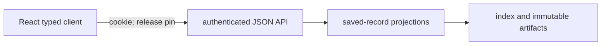

# `engine/v2/serving` architecture

## Purpose
Layer 7 in the [root architecture](../../../ARCHITECTURE.md): authenticated
API/projection contracts over saved records, financial display values and release publication.
Application rendering belongs in the [React app](../../../ui/ARCHITECTURE.md).

## Primary contracts and public interfaces
The [README](README.md) lists the checked exports (the only names other packages may import). By module:
- `operations.create_server` (authenticated HTTP listener).
- `api`: `create_app` (authenticated read-only JSON API), `ApiError`; run as
  `python3 -m engine.v2.serving.api`.
- `projections`: `connect`, `ensure_schema`, `resolve_event_refs`, `build_candidate`,
  `get_release`, `list_events`, `event_scores`, `get_event`, `get_score_detail`,
  `event_query_hash`, `ServingIndexError`, `DEFAULT_PAGE_SIZE`, `MAX_PAGE_SIZE`.
- `bridge`: `build_bridges`, `LEGACY_DISPLAY_MAPPING_V1`; `legacy_bundle`: `load_legacy_bundle`,
  `load_score_document`, `LegacyBundleError`; `score_projection.legacy_score_projection`.

Not in the README's checked list, so not part of the public interface: the route
enumeration `operations.route_table` (with `STATIC_ROUTES`, `PARAMETERIZED_ROUTES`), the
read-only documents `analog_projection.analog_document`, `derivation_projection.derivation_document`
and `native_parity_projection.native_parity_summary`, and the row builders
`native_render.native_display_row` and `native_shadow_render.shadow_serving_row_source`.

## Inputs
Verified saved score documents, legacy bundle bytes, immutable artifacts, serving
SQLite index, health/model/calibration documents and retained parity reports.
API/projection requests authenticate; compatibility HTML is public. Scoped reads carry pins; current discovery is unpinned.
## Outputs
Bounded saved-record JSON reads, typed refusals, immutable candidate releases and
projection bindings. Operations transport can return queued command job identities.
The existing operations HTML/JavaScript shells and pinned legacy bundle hosting
remain a compatibility exception; their presentation still requires React migration.

## Dependencies
Imports `contracts`, `foundation`, `data.repository` (`projections`), `models.deployment`
(`operations`) and `registry.strategies` (`derivation_projection`). `native_render` and
`native_shadow_render` also import `scoring` for offline row building; no HTTP path does.
Never imports `engine.v2.ops` (equal-layer peer) or legacy `engine.*`: ops-side pointers,
reports and transaction/migration patterns are read as inert JSON or reimplemented.
Serving launch paths: `python3 -m engine.v2.serving.api` (`api.main` -> `create_app`);
operator-invoked dashboard preview `preview.run` -> `_server.build_server` ->
`operations.create_server` (layer 8 imports layer 7 only); the React client calls the HTTP API. Offline `tools/`:
`v2_dashboard_project` builds a candidate from the serving loaders, projections and shadow
row source and emits a projection binding for the ops publisher (it does not publish);
`v2_dashboard_verified_input` builds a source-verified `PreviewInput` from a delivered
release (ops catalog plus `load_legacy_bundle`); `v2_route_probe` probes `route_table`.
Serving requests do not execute provider ingestion, fitting, scoring or financial simulation
inline. Offline row building may invoke scoring through `native_shadow_render`.
The refresh and what-if POST handlers invoke the injected action callbacks inline; `create_server`
only stores them and does not require them to enqueue work, so each callback must only enqueue
its refresh or what-if job and return.

## External systems and libraries
FastAPI/uvicorn and the operations HTTP listener, SQLite and filesystem artifact
storage. Authentication supports bearer or cookie; React uses same-origin cookie.

## Failure semantics
| Condition | Outcome |
|---|---|
| Missing identity, invalid release/filter-bound cursor or corrupt legacy input | Explicit typed refusal. |
| Projection findings fail / accepted candidate repeated | Diagnostic receipt only, no release / atomic, idempotent index commit. |
| Current changes or cached API read | Honor client pin per request; release-scoped cache/ETags cannot substitute another release. |
| Parity report missing/unavailable | Explicit state; read-only projection has no internal cache/retry/write transaction; caller may retry. |

## Invariants
Reject new application markup, inline DOM scripts and page builders here; hosting
built assets is transport. Keep saved financial values, clocks and provenance;
saved replay evidence does not imply current nightly/full-population qualification.
Existing compatibility views do not establish ownership of new application screens.
## Diagrams

