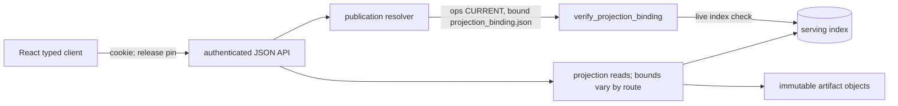
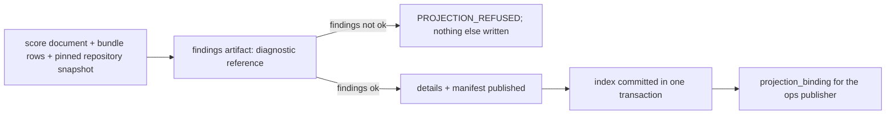

# `engine/v2/serving` architecture

## Purpose
Layer 7 in the [root architecture](../../../ARCHITECTURE.md): authenticated
API/projection contracts over saved records, financial display values and release publication.
Application rendering belongs in the [React app](../../../ui/ARCHITECTURE.md).

## Primary contracts and public interfaces
The [README](README.md) lists the checked public exports: operations server,
FastAPI read API, legacy bundle/score loaders, bridge and projection/index helpers.
`native_parity_summary` projects retained report evidence without comparing again.

## Inputs
Verified saved score documents, legacy bundle bytes, immutable artifacts, serving
SQLite index, health/model/calibration documents and retained parity reports.
API/projection requests authenticate; compatibility HTML is public. Scoped reads carry pins; current discovery is unpinned.
## Outputs
Bounded saved-record JSON reads, typed refusals, immutable candidate releases and
projection bindings. Operations transport can return queued command job identities.
The existing operations HTML/JavaScript shells and pinned legacy bundle hosting
remain a compatibility exception; their presentation still requires React migration.

## Dependencies
Lower-layer contracts/foundation and saved data access; serving does not import
layer-7 ops peers. Offline tools compose publication with ops. The dashboard preview
calls `operations.create_server`; the React typed client calls the HTTP API.
No request starts provider ingestion, fitting, scoring or financial simulation.
## External systems and libraries
FastAPI/uvicorn and the operations HTTP listener, SQLite and filesystem artifact
storage. Authentication supports bearer or cookie; React uses same-origin cookie.

## Failure semantics
| Condition | Outcome |
|---|---|
| Missing identity, invalid release/filter-bound cursor or corrupt legacy input | Explicit typed refusal. |
| Projection findings fail / accepted candidate repeated | Diagnostic receipt only, no release / atomic, idempotent index commit. |
| Current changes or cached API read | Honor client pin per request; release-scoped cache/ETags cannot substitute another release. |
| Parity report missing/unavailable | Explicit state; read-only projection has no internal cache/retry/write transaction; caller may retry. |

## Invariants
Reject new application markup, inline DOM scripts and page builders here; hosting
built assets is transport. Keep saved financial values, clocks and provenance;
saved replay evidence does not imply current nightly/full-population qualification.
Existing compatibility views do not establish ownership of new application screens.
## Diagrams
Read path: the React client resolves "current" through one pointer chain, then reads.

Offline publication, composed by the projection tool:

Operations listener: `create_server` serves health files, shell/view pages, model-release
resources, the release pointer and release bytes, the legacy shell, analog, derivation and
parity documents, and what-if results. It forwards `POST` commands to injected callbacks.
