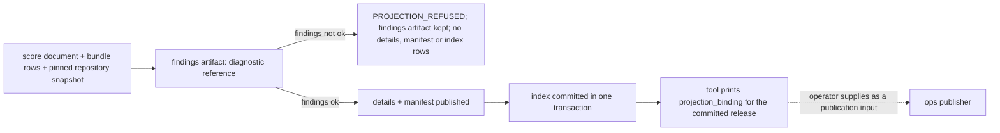

# `engine/v2/serving` architecture

## Purpose
Layer 7 in the [root architecture](../../../ARCHITECTURE.md): authenticated
API/projection contracts over saved records, financial display values and release publication.
Application rendering belongs in the [React app](../../../ui/ARCHITECTURE.md).

## Primary contracts and public interfaces

**Operations health currency.** Serving accepts `operations_health.v1.0` and
`operations_health.v1.1`. Older v1.0 documents remain valid; either absent or
malformed session field leaves currency `unknown` without a default.
The [README](README.md) lists the checked exports (the only names other packages may import). By module:
- `operations.create_server` (authenticated HTTP listener).
- `api`: `create_app` (authenticated read-only JSON API), `ApiError`; run as
  `python3 -m engine.v2.serving.api`.
- `projections`: `connect`, `ensure_schema`, `resolve_event_refs`, `build_candidate`,
  `get_release`, `list_events`, `event_scores`, `get_event`, `get_score_detail`,
  `event_query_hash`, `ServingIndexError`, `DEFAULT_PAGE_SIZE`, `MAX_PAGE_SIZE`.
- `bridge`: `build_bridges`, `LEGACY_DISPLAY_MAPPING_V1`; `legacy_bundle`: `load_legacy_bundle`,
  `load_score_document`, `LegacyBundleError`; `score_projection.legacy_score_projection`.

Not in the README's checked list, so not part of the public interface: the route
enumeration `operations.route_table` (with `STATIC_ROUTES`, `PARAMETERIZED_ROUTES`), the
read-only documents `analog_projection.analog_document`, `derivation_projection.derivation_document`
and `native_parity_projection` summary/detail/freshness helpers, and the row builders
`native_render.native_display_row` and `native_shadow_render.shadow_serving_row_source`.

## Inputs
Verified saved score documents, legacy bundle bytes, immutable artifacts, serving
SQLite index, health/model/calibration documents and retained parity reports.
API/projection requests authenticate; compatibility HTML is public. Scoped reads carry pins; current discovery is unpinned.
## Outputs
Saved-record JSON reads (bounds vary by route), typed refusals, immutable candidate releases and
projection bindings. Operations transport can return queued command job identities.
The existing operations HTML/JavaScript shells and pinned legacy bundle hosting
remain a compatibility exception; their presentation still requires React migration.

### Financial display units
Serving preserves producer values; `legacy_via_v2` and native projections do not
rescale them. These units are part of the JSON contract and apply to board and
detail projections from either producer:

| Fields | Unit on the wire |
|---|---|
| `driver_forecast`, `market_implied_move`, `forecast_p10`, `forecast_p90`, `driver_p10`, `driver_p90` | Percentage points; `5.0` means `5.0%` of spot. |
| `entry_premium` | USD per position. |
| `headline_expected_return` and `exp_pnl_model`, `exp_pnl_analog`, `exp_pnl_sim` | Fraction of entry cost; `0.05` means `5.0%`. |
| `win_model`, `win_analog`, `win_sim` | Probability fraction in `[0, 1]`. |
| `coverage_summary` keys `planned_population`, `compared_population` | Whole-number counts, serialized as JSON numbers. |
| Other `coverage_summary` ratios | Fraction in `[0, 1]`. |

Null remains unavailable, never zero. Producers and serving projections preserve
these units. The React presentation layer formats by field unit exactly once:
percentage points receive a percent sign without scaling; fractions are multiplied
by 100 for percent display; counts use integer formatting. No consumer may infer
units from a generic number type or apply a second conversion.

## Dependencies
Imports `contracts`, `foundation`, `data.repository` (`projections`), `models.deployment`
(`operations`), `registry.strategies` (`derivation_projection`) and `parity`
(shared field groups for retained mismatch details). `native_render` and
`native_shadow_render` also import `scoring` for offline row building; no HTTP path does.
Never imports `engine.v2.ops` (equal-layer peer) or legacy `engine.*`: ops-side pointers,
reports and transaction/migration patterns are read as inert JSON or reimplemented.
Serving launch paths: `python3 -m engine.v2.serving.api` (`api.main` -> `create_app`);
operator-invoked dashboard preview `preview.run` -> `_server.build_server` ->
`operations.create_server` (layer 8 imports layer 7 only); the React client calls the HTTP API. Offline `tools/`:
`v2_dashboard_project` builds a candidate from the serving loaders, projections and shadow
row source and emits a projection binding for the ops publisher (it does not publish);
`v2_dashboard_verified_input` builds a source-verified `PreviewInput` from a delivered
release (ops catalog plus `load_legacy_bundle`); `v2_route_probe` probes `route_table`.
Serving requests do not execute provider ingestion, fitting, scoring or financial simulation
inline. Offline row building may invoke scoring through `native_shadow_render`.
The refresh and what-if POST handlers invoke the injected action callbacks inline; `create_server`
only stores them and does not require them to enqueue work, so each callback must only enqueue
its refresh or what-if job and return.

## External systems and libraries
FastAPI/uvicorn and the operations HTTP listener, SQLite and filesystem artifact
storage. Authentication supports bearer or cookie; React uses same-origin cookie.

## Failure semantics
The authenticated `GET /api/v1/operations` reads the publisher's
`operations_status.json` sidecar without importing ops or mutating the
release. The document carries the published and attempted release ids,
requested/resolved sessions, and the scheduled engineering history. Missing,
malformed, or unreadable status raises `OPERATIONS_UNAVAILABLE` (503,
retryable); an optional `release_id` that differs from the sidecar's release
raises `OPERATIONS_STATUS_NOT_FOR_RELEASE` (409, not retryable). Success is
`no-store`. Serving does not infer a missing observation from wall-clock age;
it returns the recorded history unchanged. Clients compare its release ids
with their own pin and current-release discovery, and must show unknown when
the status cannot be read. The shell accepts requested/resolved session ids
only in the producer `YYYY-MM-DD` form or the UI `eng-night-YYYY-MM-DD` form,
with valid calendar dates and resolved no later than requested; missing or
unrecognized evidence refuses `current` without raising and displays unknown.
Current-release discovery is an authenticated read. An unavailable or
unrecognized publication identity is unknown to clients; failed reads do not
change a release pin. Serving never retries. Reads have no write or partial
artifact.

`GET /api/v1/native_parity` exposes report identity and the existing aggregate.
`/native_parity/mismatches` pages row-key/dimension entries with known fields
marked agree/differ and stored values only for differing fields;
`/native_parity/unpaired?side=legacy|native` pages unpaired row keys.
Both detail routes accept an optional `row_key` filter. These authenticated
reads consume one safely opened report per request and never rerun comparisons.
The API validates modern report fields, including dimension and finding-field
membership in the shared field groups.
Forwarded summary and detail values must encode as finite UTF-8 JSON; non-finite
numbers, invalid Unicode and parser/encoder recursion failures receive the same
malformed-report refusal. Legacy summaries still ignore saved mismatch values;
legacy details validate the values they return.
Finite numbers, large integers, nulls and string markers remain valid values.
Pre-v1.2 reports and unstamped diagnostic comparisons retain their legacy
summary behavior; the API requires complete run identity for v1.2 reports.
The API takes an optional configured report path. `no_report` is the default
only when neither an explicit report path nor an ops root is configured; with
an ops root and no explicit path, the API discovers the report from the catalog.
Freshness projection uses the API's current resolver, index opener and release reader; the API
declares its recoverable resolver exception types, while the projection classifies
SQLite failures and closes every opened connection. Standalone report
summary reads do not query the serving index.

When an ops root is configured and no explicit report path is supplied, the
API discovers the report read-only from the ops catalog: it selects the
`native_parity` job in namespace `shadow` with state `SUCCEEDED`, ordered by
as-of session descending and then job commit time descending. It queries
`attempt_outputs` and `artifacts` for the selected job's committed `report`
output, decodes its stored reference, and calls `ArtifactStore.verify` before
reading the report; serving does not guess artifact paths or write to the ops
root. An explicit report path takes precedence over catalog discovery. Without
either source, the existing `no_report` result is unchanged. An ops root with no succeeded
shadow parity job returns `no_report` with typed reason
`NATIVE_PARITY_JOB_NOT_FOUND`. If the selected job's output is missing,
unreadable, or schema-invalid, the API returns a typed
`NATIVE_PARITY_REPORT_MALFORMED` refusal and does not silently show an empty
table or fall back to an older job. For schema v1.2, the API preserves the
report's run identity and as-of session so the dashboard can label the run it
displays.

| Native parity condition | Outcome |
|---|---|
| Neither report path nor ops root configured | `no_report` (200) |
| Configured ops root has no succeeded `native_parity` job in `shadow` | `no_report` (200), reason `NATIVE_PARITY_JOB_NOT_FOUND` |
| Report malformed or cannot be read safely | `NATIVE_PARITY_REPORT_MALFORMED` Problem (503); no data |
| Selected catalog output missing or unreadable, or selected report schema invalid | `NATIVE_PARITY_REPORT_MALFORMED` Problem (503); no fallback to an older job |
| Report `as_of` predates current release `resolved_as_of` | `stale` (200); all retained data still returned |
| Current release cannot be resolved, including pointer read or SQLite operational failures | Report `available`; freshness indeterminate; serving-index integrity errors retain their normal propagation |
| Detail `row_key` absent from the report | 404 Problem |
| Cursor belongs to another report or detail filter | `CURSOR_MISMATCH` Problem (409) |
| Cache/retry/transaction/partial write/idempotency | `no-store`, no ETag; no retries, jobs or writes; report-derived summary fields and detail items stay stable for the same report and query; freshness `status` may change with current-release resolution |

API errors raised as `ApiError` share one `Problem` envelope (`code`, `category`, `retryable`);
HTTP statuses are in parentheses. Index integrity failures (`ServingIndexError`, e.g. a schema
newer than the code supports) are not caught by the API handler, so they are not returned as a
`Problem` document. Operations routes refuse with plain text for auth, not-configured and
health-file failures (e.g. `/health.json` 503 `unknown`, `/analogs.json` 503 `analogs not
configured`) and with typed JSON documents carrying a `reason_code` for index refusals.
Projection event resolution retains its lookup ceiling and prepares that limit against the
selected pinned event population before scanning; a smaller population lowers only the effective
ceiling, while a larger population retains the lookup limit.

| Concern | Outcome |
|---|---|
| Missing input: identity | No or wrong token: `UNAUTHORIZED` (401). Event-scores and score-detail routes without a release pin: `RELEASE_ID_REQUIRED` (400); no route searches across releases. `GET /events` without a pin uses the current release. |
| Missing input: data | Unknown release/event/score: 404. No current release: `NO_CURRENT_RELEASE` (503, retryable). Binding that fails re-verification: `CURRENT_BINDING_INVALID` (500, not retryable). Bad filter/limit: `INVALID_REQUEST` (422). |
| Missing input: files | Absent, indirect or unreadable health file: 503. Analog index missing, failing to open, or outdated: 503 with a `reason_code`; post-open `sqlite3.Error` or `json.JSONDecodeError` during currency checks or analog reads returns `SERVING_INDEX_UNREADABLE` (503, typed JSON). API post-open `sqlite3.Error` or `json.JSONDecodeError` during index projection reads or current-binding verification returns `SERVING_INDEX_UNREADABLE` (503, retryable `Problem`, no raw exception text); connections always close. Artifact decoding failures retain their existing behavior. Parity report absent is `no_report` (200); malformed is `unavailable` (503). Legacy bundle: `LegacyBundleError` with a code, never coerced or dropped. |
| Cache | `/releases/current` is `no-store` with a strong ETag (304 on match). `/releases/{id}`, event-scores and score detail are immutable with an ETag (304 on match). `/events`: current reads are `no-store` without an ETag; explicit-release reads are immutable with an ETag but never 304. A cursor bound to another release or filter set: `CURSOR_MISMATCH` (409). |
| Retry | None inside serving: no read retries and no job is started by a GET. Callers retry only when `retryable`. Command POSTs pass through the configured callback's status and body (a queued job identity or typed refusal is the callback's contract); a callback exception is 500. |
| Transaction | The serving index uses short `BEGIN IMMEDIATE` transactions; any error rolls back. A schema newer than the code, or an edited migration: `INTEGRITY_FAILED`. The operations analog read opens the index `mode=ro` and never migrates; the API opens it through `connect`, which applies pending migrations. |
| Partial write | `build_candidate` publishes findings, details and manifest as content-addressed immutable objects before the index transaction; a crash before the index commit leaves only unreferenced objects (a rerun keeps any release row already committed); after the commit the complete release row is durable. Findings not ok: receipt published, `PROJECTION_REFUSED`, no release. |
| Idempotency | `release_id` derives from content and index writes are `INSERT OR IGNORE`: a repeated candidate writes no new rows. |

## Invariants
Score population validation uses `foundation.score_population.population_difference`,
the same rule as ops scoring: an extra `DYN-SV` chooser row is allowed only for
an exact ticker/date with a planned non-chooser key. Explicit planned keys remain
required (`PLANNED_ROW_MISSING`); other extras retain `SCORED_ROW_UNPLANNED` and
`build_candidate` refuses `PROJECTION_REFUSED`. This exception changes no other
bridge finding, row matching or release-publication rule.
Reject new application markup, inline DOM scripts and page builders here; hosting
built assets is transport. Keep saved financial values, clocks and provenance;
saved replay evidence does not imply current nightly/full-population qualification.
Existing compatibility views do not establish ownership of new application screens.
## Diagrams
Read path: "current" resolves through one pointer chain; pinned routes carry their own release_id.

```mermaid
flowchart LR
  React[React typed client] -->|cookie| API[authenticated JSON API]
  API -->|current discovery - releases/current, events without a pin| Resolver[publication resolver]
  Resolver -->|ops CURRENT, bound projection_binding.json| Verify[verify_projection_binding]
  Verify -->|live index check, then release_id| Reads[projection reads; bounds vary by route]
  API -->|pinned - release_id supplied| Reads
  Reads --> Index[(serving index)]
  Index -->|score detail only - detail_artifact_id| Ref[immutable artifact reference]
  Ref -->|store.read_verified| Objects[immutable artifact objects]
```

Offline publication, composed by the projection tool:

Operations listener: `create_server` serves health files, shell/view pages, model-release
resources, the release pointer and release bytes, the legacy shell, analog and derivation
documents, and what-if results. Native parity has no operations HTML or JSON
preview route; authorized GETs to the retired paths return 404. An authenticated `POST /actions/refresh` or
`/actions/whatif` with a valid body reaches its injected callback; an unconfigured action returns
503 (the dashboard preview wires only the refresh callback).
