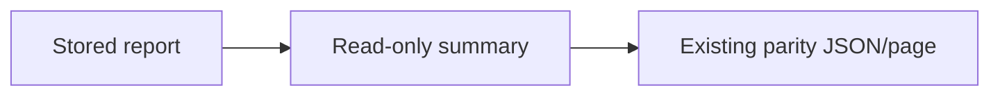

# Serving architecture
## Purpose
Layer 7 in the [root architecture](../../../ARCHITECTURE.md): authorize, filter,
paginate and serialize saved records and immutable releases for dashboard consumers.

## Primary contracts and public interfaces
`operations.create_server` serves authenticated health, release and projection JSON
and dashboard pages. `api.create_app` exposes bounded release/event/score reads.
`bridge.build_bridges` maps verified score and bundle documents to display records;
`projections.build_candidate` publishes an immutable release and its SQLite index.
The package [README](README.md) declares the complete supported import interface.

## Inputs
Verified score documents, rendered bundles, artifact stores, a serving index,
health documents and a configured parity report. Resolve one release per read.

## Outputs
HTTP documents/pages, immutable artifacts and transactional index rows.
`native_parity_summary` aggregates the stored comparator report.
Its optional comparison presents paired Legacy/Native values for one selected saved replay.
Original numbers/nulls and gate verdicts stay unchanged; exact decimal text preserves large integers.
Identity, corpus/request/decision/quote/event clocks and both-side provenance stay
distinct. This evidence does not qualify a current board or population cutover.

## Dependencies and callers
Serving uses contracts, foundation and data abstractions below its layer, local
projection helpers and immutable files. Dashboard preview calls `create_server`;
the API also has a direct module launcher. Serving imports no ops/parity peer or
legacy scorer; exporter verification remains outside the serving request path.

## External systems and libraries
SQLite, filesystem, stdlib HTTP, FastAPI/uvicorn; auth secrets never enter diagnostics.

## Failure semantics
| Condition | Outcome |
|---|---|
| Missing parity file | Successful `no_report` document |
| Malformed report, including present invalid captured comparison | Unavailable with the existing path-free malformed reason |
| Captured comparison absent | Existing aggregate response/page remains available |
| Valid selected comparison | Bounded paired rows, original provenance and retained-replay scope |
| Invalid bundle or index findings | Typed refusal; no release index row |
| Repeated candidate publication | Content identity makes index publication idempotent |

## Invariants and diagram
No financial fallback/reconciliation, inference, provider call or release mutation on GET.
Browser cells use safe text construction, including provenance.

