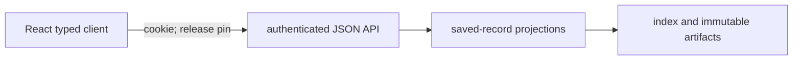

# `engine/v2/serving` architecture

## Purpose
Layer 7 in the [root architecture](../../../ARCHITECTURE.md): authenticated
API/projection contracts over saved records, financial display values and release publication.
Application rendering belongs in the [React app](../../../ui/ARCHITECTURE.md).

## Primary contracts and public interfaces
The [README](README.md) lists the checked public exports: operations server,
FastAPI read API, legacy bundle/score loaders, bridge and projection/index helpers.
`native_parity_summary` projects retained report evidence without comparing again.

## Inputs
Verified saved score documents, legacy bundle bytes, immutable artifacts, serving
SQLite index, health/model/calibration documents and retained parity reports.
API/projection requests authenticate; compatibility HTML is public. Scoped reads carry pins; current discovery is unpinned.
## Outputs
Bounded saved-record JSON reads, typed refusals, immutable candidate releases and
projection bindings. Operations transport can return queued command job identities.
The existing operations HTML/JavaScript shells and pinned legacy bundle hosting
remain a compatibility exception; their presentation still requires React migration.

## Dependencies
Lower-layer contracts/foundation and saved data access; serving does not import
layer-7 ops peers. Offline tools compose publication with ops. The dashboard preview
calls `operations.create_server`; the React typed client calls the HTTP API.
No request starts provider ingestion, fitting, scoring or financial simulation.
## External systems and libraries
FastAPI/uvicorn and the operations HTTP listener, SQLite and filesystem artifact
storage. Authentication supports bearer or cookie; React uses same-origin cookie.

## Failure semantics
API errors raised as `ApiError` share one `Problem` envelope (`code`, `category`, `retryable`);
HTTP statuses are in parentheses. Index integrity failures (`ServingIndexError`, e.g. a schema
newer than the code supports) are not caught by the API handler, so they are not returned as a
`Problem` document. Operations routes refuse with plain text for auth, not-configured and
health-file failures (e.g. `/health.json` 503 `unknown`, `/analogs.json` 503 `analogs not
configured`) and with typed JSON documents carrying a `reason_code` for index/parity refusals.
| Concern | Outcome |
|---|---|
| Missing input: identity | No or wrong token: `UNAUTHORIZED` (401). Event-scores and score-detail routes without a release pin: `RELEASE_ID_REQUIRED` (400); no route searches across releases. `GET /events` without a pin uses the current release. |
| Missing input: data | Unknown release/event/score: 404. No current release: `NO_CURRENT_RELEASE` (503, retryable). Binding that fails re-verification: `CURRENT_BINDING_INVALID` (500, not retryable). Bad filter/limit: `INVALID_REQUEST` (422). |
| Missing input: files | Absent, indirect or unreadable health file: 503. Analog index missing, failing to open, or outdated: 503 with a `reason_code`; a failure after open is not translated. Parity report absent is `no_report` (200); malformed is `unavailable` (503). Legacy bundle: `LegacyBundleError` with a code, never coerced or dropped. |
| Cache | `/releases/current` is `no-store` with a strong ETag (304 on match). `/releases/{id}`, event-scores and score detail are immutable with an ETag (304 on match). `/events`: current reads are `no-store` without an ETag; explicit-release reads are immutable with an ETag but never 304. A cursor bound to another release or filter set: `CURSOR_MISMATCH` (409). |
| Retry | None inside serving: no read retries and no job is started by a GET. Callers retry only when `retryable`. Command POSTs pass through the configured callback's status and body (a queued job identity or typed refusal is the callback's contract); a callback exception is 500. |
| Transaction | The serving index uses short `BEGIN IMMEDIATE` transactions; any error rolls back. A schema newer than the code, or an edited migration: `INTEGRITY_FAILED`. The operations analog read opens the index `mode=ro` and never migrates; the API opens it through `connect`, which applies pending migrations. |
| Partial write | `build_candidate` publishes findings, details and manifest as content-addressed immutable objects before the index transaction; a crash before the index commit leaves only unreferenced objects (a rerun keeps any release row already committed); after the commit the complete release row is durable. Findings not ok: receipt published, `PROJECTION_REFUSED`, no release. |
| Idempotency | `release_id` derives from content and index writes are `INSERT OR IGNORE`: a repeated candidate writes no new rows. |

## Invariants
Reject new application markup, inline DOM scripts and page builders here; hosting
built assets is transport. Keep saved financial values, clocks and provenance;
saved replay evidence does not imply current nightly/full-population qualification.
Existing compatibility views do not establish ownership of new application screens.
## Diagrams

