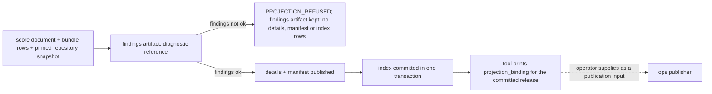

# `engine/v2/serving` architecture

## Purpose
Layer 7 in the [root architecture](../../../ARCHITECTURE.md): authenticated
API/projection contracts over saved records, financial display values and release publication.
Application rendering belongs in the [React app](../../../ui/ARCHITECTURE.md).

## Primary contracts and public interfaces
The [README](README.md) lists the checked exports (the only names other packages may import). By module:
- `operations.create_server` (authenticated HTTP listener).
- `api`: `create_app` (authenticated read-only JSON API), `ApiError`; run as
  `python3 -m engine.v2.serving.api`. Planned, documentation-only until its
  own code PR: `GET /api/v1/native_parity` (summary), `GET
  /api/v1/native_parity/mismatches` and `GET /api/v1/native_parity/unpaired`
  (paginated per-row/per-field and unpaired-key detail) for the React
  side-by-side screen (`ui/ARCHITECTURE.md`); the operations preview's
  existing `GET /native_parity`/`GET /native_parity.json` are unchanged.
- `projections`: `connect`, `ensure_schema`, `resolve_event_refs`, `build_candidate`,
  `get_release`, `list_events`, `event_scores`, `get_event`, `get_score_detail`,
  `event_query_hash`, `ServingIndexError`, `DEFAULT_PAGE_SIZE`, `MAX_PAGE_SIZE`.
- `bridge`: `build_bridges`, `LEGACY_DISPLAY_MAPPING_V1`; `legacy_bundle`: `load_legacy_bundle`,
  `load_score_document`, `LegacyBundleError`; `score_projection.legacy_score_projection`.

Not in the README's checked list, so not part of the public interface: the route
enumeration `operations.route_table` (with `STATIC_ROUTES`, `PARAMETERIZED_ROUTES`), the
read-only documents `analog_projection.analog_document`, `derivation_projection.derivation_document`
and `native_parity_projection.native_parity_summary`, and the row builders
`native_render.native_display_row` and `native_shadow_render.shadow_serving_row_source`.

## Inputs
Verified saved score documents, legacy bundle bytes, immutable artifacts, serving
SQLite index, health/model/calibration documents and retained parity reports.
API/projection requests authenticate; compatibility HTML is public. Scoped reads carry pins; current discovery is unpinned.
## Outputs
Saved-record JSON reads (bounds vary by route), typed refusals, immutable candidate releases and
projection bindings. Operations transport can return queued command job identities.
The existing operations HTML/JavaScript shells and pinned legacy bundle hosting
remain a compatibility exception; their presentation still requires React migration.

## Dependencies
Imports `contracts`, `foundation`, `data.repository` (`projections`), `models.deployment`
(`operations`) and `registry.strategies` (`derivation_projection`). `native_render` and
`native_shadow_render` also import `scoring` for offline row building; no HTTP path does.
Planned: `api` imports `native_parity_projection` directly for the route family above
(same package, no layering change) and stays off `engine.v2.ops`/`engine.v2.parity`
exactly like `operations.py` does today.
Never imports `engine.v2.ops` (equal-layer peer) or legacy `engine.*`: ops-side pointers,
reports and transaction/migration patterns are read as inert JSON or reimplemented.
Serving launch paths: `python3 -m engine.v2.serving.api` (`api.main` -> `create_app`);
operator-invoked dashboard preview `preview.run` -> `_server.build_server` ->
`operations.create_server` (layer 8 imports layer 7 only); the React client calls the HTTP API. Offline `tools/`:
`v2_dashboard_project` builds a candidate from the serving loaders, projections and shadow
row source and emits a projection binding for the ops publisher (it does not publish);
`v2_dashboard_verified_input` builds a source-verified `PreviewInput` from a delivered
release (ops catalog plus `load_legacy_bundle`); `v2_route_probe` probes `route_table`.
Serving requests do not execute provider ingestion, fitting, scoring or financial simulation
inline. Offline row building may invoke scoring through `native_shadow_render`.
The refresh and what-if POST handlers invoke the injected action callbacks inline; `create_server`
only stores them and does not require them to enqueue work, so each callback must only enqueue
its refresh or what-if job and return.

## External systems and libraries
FastAPI/uvicorn and the operations HTTP listener, SQLite and filesystem artifact
storage. Authentication supports bearer or cookie; React uses same-origin cookie.

## Failure semantics
API errors raised as `ApiError` share one `Problem` envelope (`code`, `category`, `retryable`);
HTTP statuses are in parentheses. Index integrity failures (`ServingIndexError`, e.g. a schema
newer than the code supports) are not caught by the API handler, so they are not returned as a
`Problem` document. Operations routes refuse with plain text for auth, not-configured and
health-file failures (e.g. `/health.json` 503 `unknown`, `/analogs.json` 503 `analogs not
configured`) and with typed JSON documents carrying a `reason_code` for index/parity refusals.
| Concern | Outcome |
|---|---|
| Missing input: identity | No or wrong token: `UNAUTHORIZED` (401). Event-scores and score-detail routes without a release pin: `RELEASE_ID_REQUIRED` (400); no route searches across releases. `GET /events` without a pin uses the current release. |
| Missing input: data | Unknown release/event/score: 404. No current release: `NO_CURRENT_RELEASE` (503, retryable). Binding that fails re-verification: `CURRENT_BINDING_INVALID` (500, not retryable). Bad filter/limit: `INVALID_REQUEST` (422). |
| Missing input: files | Absent, indirect or unreadable health file: 503. Analog index missing, failing to open, or outdated: 503 with a `reason_code`; a failure after open is not translated. Parity report absent is `no_report` (200); malformed is `unavailable` (503). Legacy bundle: `LegacyBundleError` with a code, never coerced or dropped. |
| Missing input: native parity (planned `/api/v1/native_parity*`) | Reuses the SAME report path config `operations.create_server`'s `native_parity_report_path` already names (one file, one reader — `native_parity_projection.native_parity_summary`), never a second ops identity lookup; `as_of`/`generated_at`/`stale` come only from fields stamped into the report itself (root doc §4), not from the catalog. Same codes as the existing projection — `no_report` (200), `unavailable` (503, `NATIVE_PARITY_REPORT_MALFORMED`) — in the shared `Problem` envelope instead of operations' plain text, plus `stale` (200) once the report carries an `as_of`. Mismatch/unpaired detail routes 404 on an unknown row key; cursor rules match `/events` (below). |
| Cache | `/releases/current` is `no-store` with a strong ETag (304 on match). `/releases/{id}`, event-scores and score detail are immutable with an ETag (304 on match). `/events`: current reads are `no-store` without an ETag; explicit-release reads are immutable with an ETag but never 304. A cursor bound to another release or filter set: `CURSOR_MISMATCH` (409). Planned native parity: `no-store`, no ETag — the report has no immutable content identity, only a mutable path. |
| Retry | None inside serving: no read retries and no job is started by a GET. Callers retry only when `retryable`. Command POSTs pass through the configured callback's status and body (a queued job identity or typed refusal is the callback's contract); a callback exception is 500. |
| Transaction | The serving index uses short `BEGIN IMMEDIATE` transactions; any error rolls back. A schema newer than the code, or an edited migration: `INTEGRITY_FAILED`. The operations analog read opens the index `mode=ro` and never migrates; the API opens it through `connect`, which applies pending migrations. |
| Partial write | `build_candidate` publishes findings, details and manifest as content-addressed immutable objects before the index transaction; a crash before the index commit leaves only unreferenced objects (a rerun keeps any release row already committed); after the commit the complete release row is durable. Findings not ok: receipt published, `PROJECTION_REFUSED`, no release. |
| Idempotency | `release_id` derives from content and index writes are `INSERT OR IGNORE`: a repeated candidate writes no new rows. |

## Invariants
Reject new application markup, inline DOM scripts and page builders here; hosting
built assets is transport. Keep saved financial values, clocks and provenance;
saved replay evidence does not imply current nightly/full-population qualification.
Existing compatibility views do not establish ownership of new application screens.
## Diagrams
Read path: "current" resolves through one pointer chain; pinned routes carry their own release_id.

```mermaid
flowchart LR
  React[React typed client] -->|cookie| API[authenticated JSON API]
  API -->|current discovery - releases/current, events without a pin| Resolver[publication resolver]
  Resolver -->|ops CURRENT, bound projection_binding.json| Verify[verify_projection_binding]
  Verify -->|live index check, then release_id| Reads[projection reads; bounds vary by route]
  API -->|pinned - release_id supplied| Reads
  Reads --> Index[(serving index)]
  Index -->|score detail only - detail_artifact_id| Ref[immutable artifact reference]
  Ref -->|store.read_verified| Objects[immutable artifact objects]
```

Offline publication, composed by the projection tool:

Operations listener: `create_server` serves health files, shell/view pages, model-release
resources, the release pointer and release bytes, the legacy shell, analog, derivation and
parity documents, and what-if results. An authenticated `POST /actions/refresh` or
`/actions/whatif` with a valid body reaches its injected callback; an unconfigured action returns
503 (the dashboard preview wires only the refresh callback).
