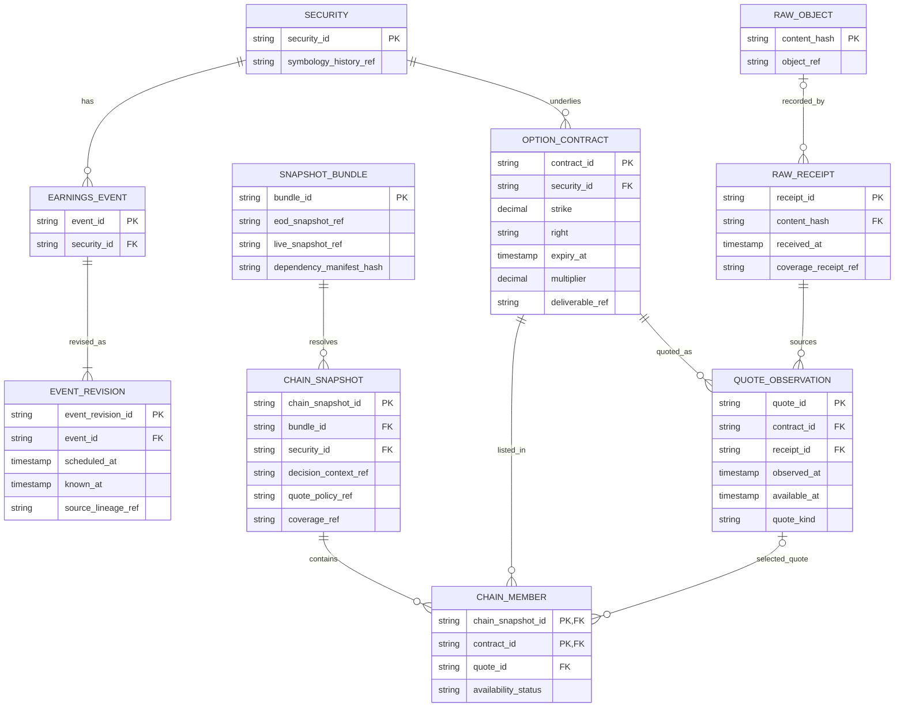
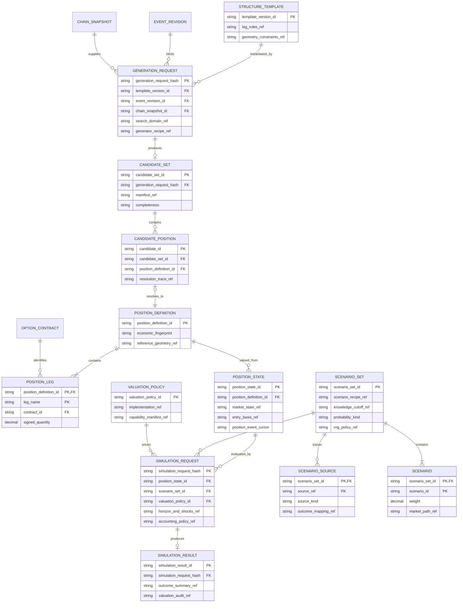
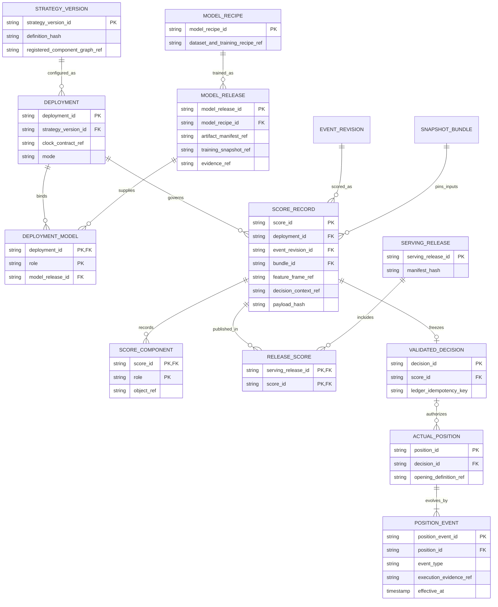

# Rearchitecture data model

Date: 2026-09-12. Status: proposed logical model, not a deployed schema.
Companions: [architecture](system_rearchitecture.md),
[component contracts](component_contracts.md), and
[structure generation and simulation](structure_generation_and_simulation.md).

The three entity-relationship views below describe one model. Repeated entity
names refer to the same entity, not a copied table. Boxes show selected identity
fields, not every required contract field. `PK` means primary key; `FK` means
foreign key. The end markers mean exactly one (`||`), zero or one (`o|`),
zero or many (`o{`), or one or many (`|{`).
([Mermaid ER notation](https://mermaid.js.org/syntax/entityRelationshipDiagram.html))

These are logical relationships. Small manifests and indices belong in the
SQLite catalog; market facts, scenarios, feature matrices and detailed audit
rows belong in immutable objects/Parquet. Do not put every quote or simulation
draw into SQLite. Relationships to object-backed data are validated when a
manifest is committed, not assumed to be SQL-enforced foreign keys.

## 1. Events, contracts and reproducible market inputs

Important constraints:

- A ticker is an alias, not a security, event, or option-contract primary key.
  Event rescheduling creates an event revision, not a different decision
  history. Corporate actions require explicit symbology/deliverable mappings.
- A chain snapshot can be reused across events for the same security/context;
  a generation request binds it to one event revision. Every candidate leg
  must belong to that frozen chain and the requested security.
- A listed contract can have no usable quote. Its chain-member quote link is
  nullable, with a reason. A missing quote must not erase the distinction
  between a structurally valid placement and a priceable one.
- Source observations and later corrections are immutable versions. A quote
  identity includes source, observation identity and revision, not just the
  contract/date. An old snapshot keeps the old revision.
- RawReceipt is the [RawReceipt contract](component_contracts.md#3-connector---ingestion).
  Failed/empty fetches may have no raw object; several receipts may reference
  identical content. Quote observations require a successful source receipt.
  Derived marks instead carry all input lineage and a valuation-policy ref;
  they are not mislabeled provider quotes or real trades.
- The snapshot bundle pins EOD and live inputs separately, plus feature/model
  state as specified in the scoring contract. Chain snapshots are derived
  views with their own manifests, not replacements for those inputs.

The incremental storage relationships are also explicit:

| Relation | Key and meaning |
|---|---|
| DataSnapshot | `snapshot_id`; committed, immutable set of table versions |
| SnapshotTable | `(snapshot_id, table_name)` -> one `dataset_version_id` |
| DatasetVersion | `dataset_version_id`; schema/normalizer version, coverage, parent version and change-set refs |
| VersionFragment | `(dataset_version_id, fragment_id)`; exact active fragment membership |
| Fragment | `fragment_id`; logical key range/content hash and immutable object hash/location |
| FragmentInput | `(fragment_id, receipt_id)`; many-to-many normalization lineage |

Each table version is a full logical view, even if its manifest reuses almost
all old fragments. Appends or bounded corrections replace only affected
members; no reader reconstructs an unbounded delta chain. A parent reference
is lineage, not permission to mutate the parent. Compaction changes physical
fragments while preserving validated logical content. Watermarks advance in
the same catalog transaction that exposes the new snapshot.

## 2. Templates, placements and simulations

A PositionDefinition here is an immutable proposed leg set, not an executed
trade. Each candidate owns its definition record; equivalent exposures across
requests can share an economic fingerprint without collapsing different
resolution traces. A manually supplied simulated position can have a definition
without a candidate. Implement that parent link as nullable with a unique
constraint for generated definitions.

Zero-quantity reference geometry is retained separately from economic legs.
It cannot be erased before the template collision/shape checks. PositionState
adds the valuation time, spot/surface/quotes, opening basis when relevant, and
any already realized cash flows. It can represent a hypothetical trade or a
reconstruction of a real position at a ledger cursor.

ScenarioSource references a typed immutable historical-position/outcome pool,
OOF residual artifact, or synthetic distribution specification. It is not an
untyped link to whichever DataFrame a caller happens to have. Large source
membership, draws and per-leg valuations live in object-backed manifests.
Multiple candidates can reuse the same scenario set. Valid probability sets
must have at least one scenario; a refused construction has no set.

Completed generation/simulation content is immutable. Work-in-progress pages
and retry attempts belong to job staging; completing a previously interrupted
generation creates a committed manifest, not edits to a published partial one.
The detailed [reusable contracts](structure_generation_and_simulation.md)
define completeness, weights, units, shocks and refusal behavior.

## 3. Registered decisions, evidence and actual positions

ScoreComponent is a typed role binding, such as `generation`, `selected_position`,
`scenario_set`, `simulation`, or a namespaced child score in the DYN-SV menu.
Multiple results for a role use a manifest or distinct qualified role keys.
Commit validation enforces the expected object kind and content hash. These
bindings connect this view to the previous one without copying calculations.
Model releases/folds actually consumed are likewise pinned in the score; the
deployment binding alone cannot hide a later wildcard or monthly resolution.

StrategyVersion pins template, generator, scenario, valuation, accounting and
selection recipes in its registered component graph. The same template/model
release can be referenced by many strategy versions. A template is not a
strategy, and an optimizer is not allowed to silently replace its selector.

ModelRecipe/ModelRelease work for regressions, neural networks, size forecasts,
gates and chooser roles. Model artifacts and evidence remain separate from a
strategy definition; promotion creates a new deployment, not a rewrite of
old scores. Training examples, labels and fitted preprocessing state reference
their own versioned datasets and temporal splits.

An actual position may represent a declared imported holding without a decision;
this requires an import provenance event, never a fabricated score. System-created
paper/live entries require a validated decision. Ledger uniqueness and release
outbox rules remain those in [the ledger contract](component_contracts.md#12-scoring-and-settlement---append-only-ledger).
Repeated job attempts reference the same decision idempotency key; they do not
create repeated fills. Simulation outputs never create execution evidence.

## 4. Cross-entity checks required before implementation cutover

- An event revision, chain snapshot and clock must agree about security and
  information availability. Historical corrections cannot retroactively change
  a frozen decision.
- Every candidate has all expected leg roles and exact contract identities.
  Every simulation has the matching frozen position, scenario manifest and
  valuation/accounting policies; another candidate cannot borrow its results.
- Every published score resolves every required dependency to a retained object.
  A missing model/quote/outcome is an explicit refusal, not a dangling success.
- Dataset publication, score/release publication and ledger effects use their
  own documented transactions. A successful file write is not a publication.
- Restore and retention tests walk these relationships from a serving score or
  ledger decision all the way to raw inputs, recipes, models and scenarios.
  Anything needed for replay must survive garbage collection.
