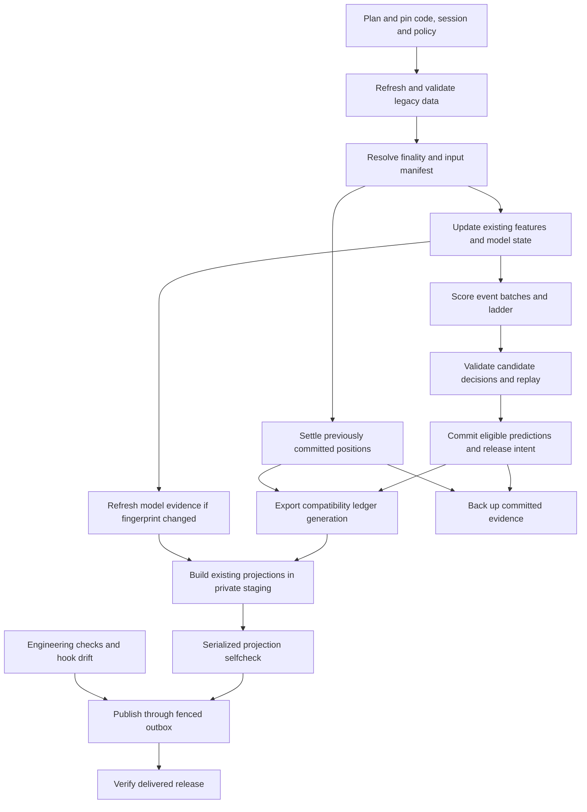

# Rearchitecture Phase 1 — Operations

## 1. Objective and scope

This is **Phase 1 of the rearchitecture: the second migration phase, after
Phase 0 — Baseline**. It is not the original program guide
`phase1_scoring_engine.md`.

Build a durable, resource-aware execution layer around the existing engine.
Submitting a nightly or experiment should require a specification, not a choice
of CPU cores or a guess about free memory. A crash should lose only unfinished
work. A retry must never duplicate a prediction, experiment hypothesis, or
publication. The operator must be able to distinguish computed, validated,
committed, published, delivered, and backed-up work.

**This is an implementation plan, not a claim that these facilities exist.**
Paths, types, and commands explicitly marked as new below are proposed work.
Implement in the order in §15. Do not start by rewriting `run_nightly`.

### 1.1 Deliver in this phase

- SQLite operational catalog, durable submission, dependency scheduling,
  fenced attempts, cancellation, recovery, and structured progress.
- Central memory/CPU/disk/provider admission and supervised subprocesses.
- Typed stage inputs/outputs, immutable attempt artifacts, score-batch
  checkpoints, implementation fingerprints, and selective invalidation.
- A staged legacy-compatible nightly, independent settlement, validation
  before prediction commit, and recoverable publication delivery.
- Supervised experiments with explicit attempt versus hypothesis identity,
  report completion, smoke mode, and one final private backup.
- The code-budget publication gate, pinned linting, coverage ratchet, current
  operational health, and tested installation/rollback instructions.

### 1.2 Do not implement these early

| Later owner/phase | Boundary to preserve now |
|---|---|
| Phase 2 data access | No new general Parquet-reading API inside ops. Use a declared legacy adapter; the future scorer consumes the repository contract, not filenames. |
| Phase 3 incremental data | Do not rewrite normalization, invent changed-key merges, or relabel a mutable legacy directory as an immutable snapshot. |
| Phase 4 scoring | Do not change strategies, gates, chooser ordering, strike selection, simulations, fills, or financial rendering calculations. |
| Phase 5 models | Do not build a second training framework or change regression/NN recipes, fold cutoffs, residual pools, or champions. |
| Phase 6 UI | Only the minimal current-health/release shell required for operational safety; no board redesign or full lazy read API. |
| Phase 8D live shadow (formerly Phase 7) | Reserve capacity and retain clock/provenance fields, but do not synthesize intraday features, claim EOD models are live-compatible, or place orders. |

Keep the legacy tree executable until the planned retirement phase. Operational
reordering and process separation are intended changes; economic changes are
not. Existing safety checks remain, even when a new check overlaps them.

## 2. Required design context

Read the corresponding rows before implementing each part. These documents,
not this guide in isolation, define the destination:

| Work | Required reading | What it constrains |
|---|---|---|
| Overall scope | [System rearchitecture](system_rearchitecture.md) §§3, 4, 12 | Exact compatibility inventory, package ownership, two-tree migration and phase exit gates. |
| Types and hashes | [Component contracts](component_contracts.md) §2 | Schema versions; specifications versus receipts; canonical economic content versus execution metadata. |
| Scheduling | [System rearchitecture](system_rearchitecture.md) §§8.1–8.2; [contracts](component_contracts.md) §11 | Job commands, resources, retries, leases, fences, whole-process accounting. |
| Nightly and release | [System rearchitecture](system_rearchitecture.md) §8.3; [contracts](component_contracts.md) §§9, 12, 13 | Validate before freezing; idempotent decisions; release outbox; delivery is a separate fact. |
| Experiments | [System rearchitecture](system_rearchitecture.md) §8.4; [contracts](component_contracts.md) §§7, 8, 10 | Registered economic logic, causal folds, evaluation evidence, hypothesis identity, no automatic promotion. |
| Engineering gates | [System rearchitecture](system_rearchitecture.md) §§4.2–4.7, 11; [contracts](component_contracts.md) §15 | Downward imports, no diagnosis dependency, budget refusal versus correctness refusal, meaningful negative controls. |
| Storage seam | [System rearchitecture](system_rearchitecture.md) §5; [contracts](component_contracts.md) §§3–6 | Finality, data availability, explicit reconstruction, immutable repository handles in Phase 2. |
| Entity relationships | [Data model diagrams](rearchitecture_data_model.md) §§1, 3, 4 | Event/contract identity, score lineage, decisions versus positions, cross-entity checks. |
| Reusable numerical components | [Structure generation and simulation](structure_generation_and_simulation.md) §§1, 2, 5–7 | Generation, scenario construction, valuation and accounting remain separate future owners. Ops schedules them; it does not implement them. |
| Baseline prerequisite | [Phase 0 implementation](rearchitecture_phase0_baseline.md) §§5–9 | Frozen inputs and fitted state, actual replay, complete fixture coverage, independent findings. |
| Live reservation seam | [Live intraday scoring](live_intraday_scoring.md); [contracts](component_contracts.md) §14 | Market time is not receipt time; collection and scoring need reserved capacity and compatible artifacts. |

If a design conflict affects identity, authority, causality, or an acceptance
gate, record it and resolve it before production cutover. Do not quietly make
the easier implementation the new contract. §3.2 identifies decisions already
visible in the current documents.

## 3. Starting point and prerequisites

### 3.1 Inspect the current implementation first

These are the relevant existing entrypoints as of this guide. Recheck their
signatures against the implementation branch; another agent may be fixing
Phase 0 concurrently.

| Existing file | Reuse / hazard |
|---|---|
| `engine/dashboard/nightly.py` | Owns refresh, finality, tier updates, scoring, ledger, ladder, backfill, model evidence, rendering, selfcheck, publication and backup. It currently freezes predictions before the final selfcheck. It is not a side-effect-free scoring command. |
| `tools/bounded_run.py` | Already has `--cpu-set`, thread limits and a process-tree polling watchdog. It does not implement global admission, durable jobs, or fencing. Its current command logging and process-group handling require review before reuse with credentials or cancellation. |
| `engine/paths.py` | Supports `INVESTING_PLAN_ROOT`. Set it before any legacy import in a worker. This is useful for isolated fixtures, but does not prove every legacy file access honors it. |
| `engine/score.py`, `engine/features.py` | Existing scoring and contexts. A default context can exceed the host budget. Preserve bounded context behavior and analog entry-date quote coverage. |
| `engine/ledger.py` | `build_prediction_rows` can prepare rows separately from writes. `snapshot` can score when scores are omitted and writes directly to JSONL. `score_outcomes` also writes. Do not invoke these writers from arbitrary retryable workers. |
| `engine/dashboard/render.py`, `selfcheck.py` | Preserve all current views and serialized parity checks. The renderer still contains financial work; defer its numerical extraction to Phase 4. A new process may need a bounded scorer for selfcheck. |
| `engine/dashboard/model_evidence.py` | Evidence is fingerprinted against champions. Retain rebuild-on-change and the stale-evidence flag, with a separately bounded process. |
| `engine/evaluate.py`, `tools/private_mirror.py` | Keep generated reports and final private evidence backup. Do not use the legacy nightly backup helper as an implicit authority to push public code. |
| `checks/rearchitecture_phase0_gate.py`, `checks/tier0_corpus.py` | Baseline gates, not proof by exit code alone; prerequisite evidence below must be present. |
| `checks/import_layers.py`, `code_budgets.py`, `package_readmes.py`, `install_hooks.py` | Extend the existing checks; do not implement parallel competing checks. |
| `requirements.txt`, `checks/layer_map.py`, `checks/legacy_adapters.json` | Current environment pin and enforced ownership. Coverage and pytest are already pinned; do not rely on the older environment paragraph in `guides/README.md`. |

There are already unrelated `checks/phase1_*.py` files for the original program.
Name new checks `checks/rearchitecture_phase1_*.py` and new tests
`tests/test_v2_ops_*.py` so the two phase sequences cannot be confused.

Before accepting numerical compatibility, require the corrected Phase 0
package to demonstrate:

1. Corpus membership, expected cases, artifact hashes and manifest membership
   agree. Missing cases and empty comparisons cannot report success.
2. Every current strategy has meaningful scoreable cases where available, as
   well as its required refusal cases. An all-`NO_FORECAST` corpus is not proof
   that the strategy implementation is preserved.
3. Replay invokes computation from frozen inputs and persisted fitted state in
   a fresh process. Comparing stored output to a copy of itself is not replay.
4. Comparison preserves types, exact IDs, null masks, list ordering where
   meaningful, and field-specific numeric tolerances. Canonical hashing is the
   contract implementation, not an approximation under the same name.
5. Availability evidence and reconstruction labels are honest. Neither a data
   revision identifier nor a hash proves information was available at decision
   time. No new scheduler receipt may manufacture historical availability.
6. Planted defects exercise real stages and return the expected findings, and
   capture cannot overwrite the accepted baseline accidentally.

Catalog/executor work with synthetic fixtures may proceed while these fixes
land. Parity certification and production activation may not.

### 3.2 Resolve these migration decisions explicitly

Record the resolution in a short reviewed architecture decision before the
affected code lands. The recommendations here make the plan implementable;
they are not permission to weaken the parent design silently.

**Adapter budget bootstrap.** The Phase 0 adapter ledger currently has a zero
ceiling, while Phase 1 requires legacy adapters and §4.6 says the count only
shrinks. Recommend a one-time, reviewed inventory of the exact required legacy
symbols, followed by the shrinking ceiling. Until that transition is approved,
build synthetic workers only. Do not bypass the rule with dynamic imports,
filesystem imports or undocumented subprocess edges. Track runtime legacy
entrypoints as well as Python import edges. One adapter module per owning
package remains the rule.

**Shared canonical primitives.** Production ops must never import
`engine.v2.diagnosis`. Move the corrected general canonical implementation to
`engine.v2.foundation`, and make diagnosis depend on it, with byte-for-byte
hash continuity tests. Contracts remain schemas only. Do not copy a second
canonicalizer into ops.

**Stage granularity.** A checkpoint is reusable only with matching inputs,
implementation, parameters, environment and output schema, including during
crash recovery. The architecture distinction between crash and change recovery
does not authorize loading old-code checkpoints after a restart. In Phase 1,
legacy scoring is an actual coarse stage, not ten invented internal stages.
Fine-grained analog/pricing invalidation arrives with Phase 4 extraction.
Editing the scoring dependency closure therefore invalidates scoring and its
descendants now, not ingestion; do not claim analog-only recomputation yet.

**Ledger authority.** Recommend a minimal catalog-backed decision authority at
Phase 1 cutover, with unchanged legacy row payloads and compatibility exports.
This is the narrow subset needed for atomic decisions plus outbox, not the full
future position lifecycle. §10 specifies the import, writer switch and rollback.
If this authority change is not approved, stop at shadow operation: a queued
legacy writer is not equivalent to the transactional release contract.

**Publication overrides.** Recommend a dedicated reviewed publication-policy
ledger, not an increase in the structural code-budget or adapter exemptions.
It can temporarily authorize publication despite named engineering-budget
violations; it cannot make the structural checks pass or override data,
decision, access-control or secret-scan failures. Reconcile the parent reference
to an exemption ledger with its zero-exemption rule before enabling overrides.
Default implementation may refuse overrides until this decision is settled.

## 4. Package and file ownership

Use the existing `engine/v2/` skeleton. Do not place the new scheduler in the
legacy engine or split it into a collection of unrelated tools.

| Proposed files | Owns | Must not own |
|---|---|---|
| `contracts/jobs.py`, `contracts/operations.py` | Versioned job/stage/resource/progress/release-health types. | SQLite, environment discovery, subprocesses, hashes computed during construction. |
| `foundation/canonical.py`, `foundation/artifacts.py` | Canonical bytes, durable artifact publication, safe paths and content verification. | Strategies, job selection, reading job tables to decide authority. |
| `ops/catalog.py`, `ops/schema.py`, `ops/migrations.py` | Connections, operational schema, short transactions, schema upgrades. | Score or model computation. |
| `ops/submission.py`, `ops/scheduler.py`, `ops/recovery.py` | Submission identity, claim/admission, dependencies, lease recovery. | Direct provider requests or financial decisions. |
| `ops/resources.py`, `ops/profiles.py`, `ops/provider_budget.py` | Effective capacity, resource assignments, quota reservations and account leases. | New market-data connector implementations. |
| `ops/executor.py`, `ops/executor_cgroup.py`, `ops/executor_watchdog.py` | Trusted process launch, observation, cancellation, process-tree termination. | Arbitrary browser-provided commands. |
| `ops/stages.py`, `ops/checkpoints.py`, `ops/worker.py` | Registered stage definitions, validated result protocol, durable checkpoints. | A second scoring algorithm or importing diagnosis. |
| `ops/nightly.py`, `ops/experiments.py`, `ops/publication.py` | DAG construction, commit coordination, outbox scheduling, completion policy. | Recalculating scores, PnL, or research metrics. |
| `ops/health.py`, `ops/cli.py`, `ops/legacy_adapter.py` | Operational health/CLI and the explicitly inventoried legacy operations bridge. | Broad catch-all utilities. Split by responsibility before budgets fail. |
| `ledger/decisions.py`, `ledger/legacy_adapter.py` | Narrow decision import/validation/insert/export contract; legacy payload translation. | Scheduling or importing ops. |
| `serving/operations.py` and minimal `dashboard/` shell assets | Authenticated health and release-shell presentation. | Importing the peer `ops` package or computing financial values. |
| `checks/rearchitecture_phase1_*.py`, `tests/test_v2_ops_*.py` | Verification, fault injection, synthetic workers and evidence generation. | Production runtime dependencies. |

These are file responsibilities, not a requirement to create empty modules.
Create each when its first behavior and test land. Keep public names and
consumers in the package README updated in the same change.

Ops and serving are both layer 7; they cannot import one another. Connect them
through versioned artifacts or a transport whose implementation stays in the
owning process. A top-level launcher may start both. The future HTTP submitter
uses the same command protocol as the CLI; do not evade the layer rule with an
in-process import. During this phase a CLI plus authenticated read-only status
surface is enough; a full web experiment UI is not required.

Ledger is lower than ops. Ops can open a catalog transaction, verify the fence,
call a ledger-owned insert using that transaction, and write its own outbox
rows before committing. Ledger never imports ops. The decision tables and
their migrations remain ledger-owned even when physically in the same SQLite
file. Do not hold a transaction while computing or validating a large frame.

## 5. Contracts to implement first

Use the names and base fields in [contracts §11](component_contracts.md).
Represent large values as immutable references, not DataFrames in SQLite.
Every serialized type has `schema_version`; every reader rejects unsupported
major versions. Validation functions live outside the schema-only package.

### 5.1 Submission and stage specifications

```text
JobSpec:                                     # base contract, not an argv string
  kind, implementation_ref, spec_hash, environment_ref
  input_refs, dependency_job_ids, output_namespace
  resource_class, priority, deadline_at?
  provider_budget_ref?, retry_policy_ref, checkpoint_contract_ref

StageSpec:                                   # phase-1 specialization
  stage_id, job_kind, implementation_ref, parameter_ref
  input_contract_ref, output_contract_ref
  dependency_stage_ids, resource_class
  retry_policy_ref, checkpoint_contract_ref
  effect_class: pure | staged | catalog_commit | external_delivery
  required_validation_kinds, determinism_policy_ref

ArtifactRef:
  artifact_id, content_hash, schema_ref, byte_size, storage_key

LegacyInputManifest:
  manifest_id, file_refs, table_contract_refs, registry_and_model_refs
  calendar_ref, selected_session, finality_receipt_refs
  knowledge_mode_by_table, availability_evidence_refs
  read_set_complete, capture_implementation_ref
```

`LegacyInputManifest` is transitional provenance, not a `SnapshotRef` with
guaranteed repository isolation. Phase 2 replaces its resolution with the
repository interface. Reject a missing input; never fall back to latest.

Validate job kinds against a server-owned allowlist. Each entry supplies its
worker entrypoint, permitted parameter schema, resource class, effects,
dependencies, checkpoint policy and validator. No shell interpolation, caller
controlled executable, arbitrary module name, filesystem traversal or unbounded
input query is accepted.

Use an explicit submission namespace and idempotency key. Store a canonical
request digest alongside the key. Same namespace/key/digest returns the existing
job; a different digest returns `IDEMPOTENCY_CONFLICT`. Validate dependencies,
reject cycles and unknown IDs, and check namespace authorization before insert.

`spec_hash` identifies the economic specification where applicable. Priority,
attempt number, assigned cores and enqueue time are not economic inputs.
Changing a scheduling policy does not create a new experiment hypothesis.
Conversely, a changed fill rule, seed, model or fold plan is not merely a retry.

### 5.2 Execution and output protocol

```text
AttemptReceipt:
  job_id, attempt_id, attempt_number, fence
  supervisor_epoch, host_boot_id, process_identity?
  state, started_at?, heartbeat_at?, lease_expires_at?
  resolved_resources, input_manifest_ref
  checkpoint_refs, output_refs, validation_refs, failure?

CheckpointReceipt:
  stage_id, shard_key, cache_key, input_hash
  implementation_hash, parameter_hash, environment_hash
  output_schema_ref, artifact_refs, validation_refs
  producer_attempt_id, producer_fence, committed_at

StageResult:
  job_id, attempt_id, fence, stage_id
  input_manifest_ref, checkpoint_candidates, output_candidates
  validation_refs, completion_counts, failure?

ProgressEvent:
  job_id, attempt_id, stage_id, sequence, recorded_at
  completed_units?, total_units?, elapsed_seconds
  memory_current_bytes?, memory_peak_bytes?, checkpoint_ref?, eta_seconds?
  latest_error_code?, message
```

Workers write only attempt-local candidates and send results over an inherited
pipe or local authenticated channel. The coordinator validates and commits.
A worker exit code of zero is necessary but insufficient: missing manifests,
missing coverage or failing validators mean the job has not succeeded.

Progress is execution metadata, not part of an output content hash. Heartbeat
the process even during a single long library call; report completed work
separately. Do not invent percentage progress from elapsed time. Redact URLs,
headers, command arguments, environment values and exception text before
persisting or returning them. Prefer error codes and private diagnostic refs.

### 5.3 Failure categories

Use the shared failure envelope in contracts §2.4 with at least:

| Category | Required handling |
|---|---|
| `RESOURCE_UNAVAILABLE` | Remain queued with needed/available capacity and next reconsideration reason; not a retry attempt. |
| `RESOURCE_LIMIT_EXCEEDED` | Stop/reconcile the worker, preserve checkpoints, record measured peak; no infinite identical retry. |
| `TRANSIENT_SOURCE`, `RATE_LIMITED` | Bounded retries, account-level backoff, durable next eligible time. |
| `CREDENTIAL_INVALID` | Stop requests for that credential/account generation; surface action needed, no automatic hammering. |
| `SOURCE_NOT_FOUND`, `SOURCE_EMPTY`, `SOURCE_NOT_FINAL` | Distinct outcomes governed by the source contract, not interchangeable failures or fabricated zero rows. |
| `INPUT_CHANGED`, `CHECKPOINT_INCOMPATIBLE` | Reject reuse and plan a new input-bound execution; retain the old evidence. |
| `VALIDATION_FAILED`, `INTEGRITY_FAILED` | No prediction or release commit; retain diagnostics; independent settlement may still run. |
| `LEASE_LOST`, `CANCELLED` | Reject later commits; recover resources only after verified worker exit. |
| `PUBLICATION_REFUSED`, `DELIVERY_FAILED`, `BACKUP_FAILED` | Preserve upstream successful effects; retry only the eligible terminal branch. |

## 6. Catalog schema and state machine

### 6.1 Durable schema

Place the production catalog and artifacts under a private operations root,
for example `data/operations/`. Tests must receive an explicit temporary root.
Do not put licensed records or runtime SQLite files in the public repository.

Start with stdlib SQLite on a local filesystem. Enable foreign keys on every
connection, WAL, a bounded busy timeout and durable synchronization. Use
explicit schema migrations and a schema-version table. Refuse a newer
unsupported schema. Back up with the SQLite backup API; copying only the main
file while WAL is active is not a consistent backup.

Minimum tables and constraints:

| Table | Required identity and content |
|---|---|
| `schema_versions` | Owner and migration version, with migration checksums. |
| `jobs` | Job ID; unique submission namespace/key; canonical request digest; immutable spec ref; state; priority/deadline; next eligible time; active attempt; monotonically increasing fence counter. |
| `job_dependencies` | Unique child/parent pair; required parent output contract; graph validated before commit. |
| `attempts` | Unique job/attempt number; globally unique attempt ID; fence; boot/process identity; lease times; state; exit/failure refs. Never overwrite previous attempts. |
| `resource_reservations` | Attempt, resource/profile version, memory/CPU/scratch assignments; retained until process reconciliation. |
| `provider_reservations` | Account/endpoint class, attempt, lease/fence, estimated outstanding calls and reconciled usage. No credential values. |
| `progress_events` | Unique attempt/sequence; redacted event body. Retention must preserve final/error/checkpoint events. |
| `artifacts` | Immutable ID/hash/schema/size/location; producer attempt; verified durable status. |
| `checkpoints` | Stage/shard/cache key, output refs and validation refs; only coordinator-committed candidates are reusable. |
| `nightly_runs`, `run_stages` | Planned session, actual execution times, resolved inputs, graph ref, per-stage job IDs and outcome. |
| `watermarks` | Unique pipeline/scope/stage; latest completed logical occurrence, artifact/receipt and completion time. Distinguish global from subset scopes. |
| `decisions`, `decision_imports` | Ledger-owned identity, immutable full payload hash, sequence, purpose, validations and legacy import provenance; §10. |
| `releases` | Score/decision refs, candidate artifact manifest, validation state, parent/current-release expectation, publish and delivery facts. |
| `outbox` | Unique effect kind/logical effect key; payload hash; dependencies; pending/in-flight/delivered/failed state and delivery attempts. |
| `experiment_runs` | Economic spec/hypothesis identity distinct from execution; smoke/primary mode; evaluation, ledger and backup receipts. |
| `health_observations` | Scheduled occurrence, check kind and result; unique keys so retries do not inflate nightly streaks. |

Use foreign keys and unique constraints for invariants, not just Python
prechecks. Add indexes for ready jobs, dependencies, leases, pending deliveries
and artifact lookup. A content conflict on an existing logical key is an
integrity error, not `INSERT OR REPLACE`.

### 6.2 Claim algorithm

Allow one active supervisor per catalog using an OS-held lock. A restarted
supervisor first enters reconciliation mode. A stale lock file is not evidence
that a process is alive; the held lock is what matters.

For one claim:

1. Sample host capacity and current owned/external usage outside a transaction.
2. Begin a short immediate transaction and reread current reservations, job
   state, completed dependencies and provider availability.
3. Check admission (§8). If unavailable, update the queued reason without
   allocating an attempt. Roll back/retry on conflicting catalog changes.
4. Increment the job fence, insert the attempt and all resource reservations,
   and make it the active running attempt in the same transaction.
5. Commit, launch the trusted worker, then record boot ID, PID, process start
   identity, process group/cgroup and executor receipt. A launch failure is a
   recorded attempt failure with reconciliation, not an abandoned reservation.

Resource discovery is necessarily a sample; external processes can allocate
after it. Admission is conservative coordination, not a claim that external
memory use is impossible. Kernel containment and headroom are still needed.

### 6.3 Transitions and recovery

```text
queued -> running -> succeeded
              |----> retry_wait -> queued
              |----> failed
              |----> cancelling -> cancelled
queued -> cancelled
queued -> blocked                 # failed dependency / operator action needed
running -> recovery_pending       # expired lease / lost supervisor / host resume
recovery_pending -> retry_wait | failed | cancelled
```

Persist the recovery condition even if implemented as an attempt status rather
than a public job state. Do not release its reservations while it may be alive.
Dependency failures block descendants, not unrelated jobs. No empty output is
invented to unblock a dependency. An explicit no-work receipt is allowed only
when the stage contract proves there were zero eligible inputs.

At every checkpoint/output/effect commit, check active attempt, fence, lease,
job state and expected input identity **inside the commit transaction**.
Cancel invalidates the fence first, requests graceful exit, then escalates if
needed. Report cancellation complete only after all owned processes are dead.
Reject stale `cancel(expected_attempt=...)` rather than cancelling a replacement.

After supervisor death, expired heartbeat or host suspension:

1. Invalidate the old attempt fence and retain reservations.
2. Reconcile the actual process tree using boot ID plus PID start identity,
   not PID alone. Never kill a reused PID belonging to another job.
3. Terminate or quarantine surviving workers, confirm released memory/CPUs,
   and reconcile any committed checkpoints or external-delivery receipts.
4. Only then admit a replacement attempt using compatible checkpoints.

Use a monotonic clock for in-process durations and UTC for persisted events.
Detect reboot, resume and large wall-clock jumps; they trigger reconciliation,
not blind lease takeover. Tests should inject a fake clock, not sleep minutes.

## 7. Artifacts, checkpoints and selective reruns

### 7.1 Durable output protocol

Write under `attempts/<attempt_id>/staging/` first. Validate types, expected
population, schema, row identity, hash and size. Flush files, atomically rename
on the same filesystem into an immutable artifact location, and synchronize
the parent directory before recording the reference in SQLite.

The artifact location must already exist durably before a successful catalog
commit can point at it. A crash may leave an unreferenced artifact, which is
safe; it must never leave a successful checkpoint pointing at partial bytes.
Do not delete orphan candidates automatically in the first implementation.
Later garbage collection needs catalog reachability, leases and retention rules.

Never trust a path merely because the worker returned it. Resolve beneath the
assigned staging root; reject escapes and symlinks into authoritative output
locations. Verify hashes again before checkpoint reuse. Durable receipts and
byte-level immutability are separate requirements.

### 7.2 Cache identity

```text
input_hash = canonical_hash(ordered input artifact identities + read/query contract)

cache_key = canonical_hash(
  stage kind + input_hash + implementation_hash + parameter_hash
  + environment_hash + output_schema_ref + deterministic shard identity
)
```

Hash the full declared implementation dependency closure, not just the wrapper
function, mtime or Git HEAD. Include imported helper code, recipe/configuration
files, source-dispatched legacy experiment code where still used, calendar and
model references, and relevant native/library environment versions. Store the
source manifest so a cache miss explains exactly what changed.

A Git commit is useful provenance but too broad as the only per-stage key:
an unrelated documentation commit should not force ingestion again. Conversely,
an uncommitted change to a helper must invalidate its consumers. Production
workers run a pinned code snapshot; do not import from a worktree that another
agent is editing. Synthetic tests can use temporary source trees.

Changing thread policy may change floating-point execution. Record the resolved
resources on attempts and include numerically relevant thread/backend settings
in the environment identity. This does not change the economic strategy hash.
Do not promise bit-identical NN training across arbitrary hardware.

Completed output from a failed attempt is reusable only when its checkpoint
was coordinator-committed under a valid fence. A leftover `.done` file, stdout
message or staging directory is not a checkpoint.

### 7.3 Shards and score batches

The plan fixes the offered event set and deterministic shard membership before
launch. Keep all competing strategies/candidates for an event together where
the legacy chooser needs them. Persist batch coverage: expected event IDs,
strategies, accepted/refused counts, output IDs and reason codes. Assembly must
reject missing or duplicate members; it cannot silently concatenate whichever
batches happened to finish.

Reuse a bounded legacy scorer within a worker where appropriate. Its lifetime
ends at that stage; a checkpoint must not depend on an in-memory model object
surviving the process. Start with conservative event batches and measure peak
memory. Batch size is operational only if batch/single parity proves it does
not change candidate populations, ordering, training state or selection.

Test a diamond DAG: changing B in `A -> {B,C} -> D` reruns B and D but retains
A and C. Change a transitive helper of B as a separate test. Verify completed
unaffected shards survive a crash and altered inputs invalidate affected ones.

Do not assume that a serialized aggregate score row contains sufficient state
to reuse every internal scorer stage. Phase 1 checkpoints the real boundaries
it can reproduce. Phase 4 introduces the finer generation/scenario/valuation/
simulation/scoring interfaces described in the reusable-components guide.

## 8. Central resource and provider admission

### 8.1 Profiles, discovery and memory

Callers select a named profile, initially `io_fetch`, `legacy_rebuild`,
`legacy_score`, `model_evidence`, `experiment_heavy`, `projection`, `validation`
or `delivery`. A versioned operator policy resolves reservations and concurrency.
Not every profile needs different numbers; an unmeasured heavy stage is
exclusive until measured and reviewed.

At startup and before claims, discover actual allowed CPU affinity, effective
host/container memory limits, current available memory, swap policy, disk
space, and executor capability. Record discovery in a receipt. Do not use
`os.cpu_count()` as the allowed affinity or host RAM as a container budget.
All internal memory amounts are bytes; human display must label GiB versus GB.

Implement both checks, using consistent units:

```text
capacity = min(host_total, finite_container_limit) - policy_base_reserve
sum(active_reservations) + new_reservation <= capacity

headroom = min(host_available, container_remaining) - policy_free_margin
new_reservation + sum(max(0, reserved_i - measured_current_i)) <= headroom
```

With no finite container limit, use host values. Document the base reserve
(OS/API/supervisor capacity excluded from workers) and free margin (buffer
against spikes). Missing or stale measurements must be conservative: do not
assume an unobserved worker uses its entire reservation and thereby discard
its unconsumed headroom requirement. Count all owned descendants.

On the current small host, **one heavy scoring/training/rebuild worker at a
time initially**. Historical 3 GiB scorer and roughly 5.5 GiB rebuild estimates
are starting evidence, not measured guarantees for every input universe.
Small IO/delivery jobs can overlap only if both memory tests pass. A stage
larger than capacity stays queued with `RESOURCE_UNAVAILABLE`; do not lower
its declared reservation until it fits on paper.

Record peak use by stage/input scale/profile. Profile updates occur between
runs, are versioned and remain conservative. Do not automatically reduce a
reservation after one cheap cache-hit run, or retry an OOM forever by increasing
the cap. If nothing fits, surface the required optimization/capacity decision.

### 8.2 CPU, disk and live windows

Allocate disjoint CPU IDs from actual affinity, centrally. Reserve the API/OS
allowance in policy. Pass the assigned set to the executor; users must not need
`--cores` or `--cpu-set` on normal job submissions.

Set BLAS/OMP/NumExpr limits before importing numerical libraries; constrain
estimator `n_jobs`, data-loader workers and NN thread settings too. Tests must
observe these in a child process, not only inspect the launch dictionary.
Process placement without thread limits is insufficient.

Reserve scratch bytes and require a minimum free-disk margin. Limit simultaneous
disk-heavy stages with a catalog reservation. Insufficient disk blocks a claim
or produces a staged failure; it must not leave a partially current release.

Represent future live collection/scoring windows in a versioned scheduling
policy. Before a window, stop admitting work whose conservative completion
estimate could overlap it. Unknown-duration non-yielding heavy jobs cannot be
assumed safe. A yielding job checkpoints and exits; `SIGSTOP` retains memory
and does not free its reservation. Do not claim deadline guarantees on the
watchdog host or let this phase invent live trading behavior.

### 8.3 Provider budgets

Provider admission is account-wide, not per process or API key printed in a
request. Use opaque account IDs and inject credentials only into authorized
connector workers. No credentials in job specs, argv, logs or artifact hashes.

Initially serialize jobs using the same legacy provider behind a shared account
lease and the existing connector pacing. Polygon has one active consumer. Do
not allow a web/live path or background pull to bypass that lease. The lease
does not replace pacing inside a batch; later connector adapters should use the
shared per-request authority without creating nested independent limiters.

Reserve estimated call counts, preserve the ORATS live reserve and existing
large-pull approval threshold, then reconcile actual usage. Record quota headers
on errors as well as successes. Missing headers preserve conservative locally
observed consumption and uncertainty, not an optimistic reset. Retries consume
budget too. Keep endpoint publication delays distinct from permanent missing
symbols, legitimate empty aggregates and authentication failure.

Retain the current source behaviors: cache first, requested/returned ticker
coverage checks, account backoff after 429, correct source-specific empty
handling and finality evidence. Do not test admission by spending real quota.
Use scripted provider responses and fake clocks.

## 9. Executor and legacy-adapter safety

### 9.1 Two capability modes

Prefer a delegated cgroup per attempt where installation probes prove it works.
Configure CPU placement, `memory.high`, `memory.max` and whole-group ownership;
record OOM counters and cleanup evidence. An unwritable cgroup mount is not an
installed executor. Capability tests must be safe and bounded.

Otherwise use a watchdog executor derived from the existing bounded runner.
Declare `executor_mode=watchdog` and `containment=best_effort`. It samples whole
process-tree memory and terminates owned descendants after a grace period.
Polling cannot prevent every allocation spike or guarantee survival of the host.
Global admission and generous free headroom remain mandatory.

Do not wrap the current command and assume cancellation is solved. Test parent
death, a child that outlives its parent, process-group changes, SIGTERM refusal
and PID reuse. Daemonizing/escaping workers are unsupported in watchdog mode;
detect/quarantine them rather than releasing the reservation. For known trusted
workers, retain owned process identities while polling. If ownership cannot be
proved after a crash, block replacement heavy work pending reconciliation.

Exit 137 may be a watchdog or kernel kill. Use recorded executor events and
cgroup evidence to identify it when possible; retain an unknown-kill category
when not. Never report a successful stage merely because its parent exited.

### 9.2 Legacy bridge rules

Inventory each bridge entry: exact callable/command, read set, write set,
credentials, hidden subprocesses, retry behavior, output contract and removal
phase. Every production-enabled adapter has a synthetic-root test proving it
does not write outside its assigned scope. Audit direct `Path(__file__)` and
hardcoded relative paths as well as `engine.paths` use.

`run_nightly(..., publish=False)` is not a read-only worker: it still writes
predictions, settlement and state. `--no-publish` and `--no-refresh` are not
substitutes for isolation. Do not initially enable the whole legacy nightly
as an automatically retryable production command.

For numerical stages, call existing helpers behind adapters, serialize their
outputs and preserve their arguments. Do not copy numerical bodies into ops.
Use `INVESTING_PLAN_ROOT` with a fixture/attempt root before imports. Mutable
outputs must be private copies, not writable symlinks or hard links back to
production. Read-only shared immutable inputs need an explicit manifest and
an access policy. Measure disk cost before copying large inputs.

Before Phase 2 repository snapshots exist, use a catalog-controlled legacy
reader/writer barrier. All known legacy data mutations require its exclusive
lease; readers hold a shared lease over their declared read set. Pin and verify
the consumed file/model/calendar hashes while the lease is held. If data change
between stages, replan against a new manifest instead of mixing versions.
Undeclared or incomplete read sets disable cross-run cache reuse.

The barrier is cooperative, not filesystem MVCC. Production cutover requires
old cron jobs, manual writers and competing agents to use the supervisor or
be stopped explicitly. Detect unexpected mutations and fail closed. A partially
failed legacy rebuild marks that input domain dirty until recovery and its
existing validation succeed. Do not promise the atomic dataset rollback that
Phase 2 will implement, or replace the legacy rebuild with a new algorithm here.

Scoring checkpoints remain immutable after creation, even if the legacy store
later advances. A successful checkpoint can feed a compatible downstream job;
a missing dependency may not be reconstructed from the latest store under the
old input identity. If exact old inputs are unavailable, report that replay is
unavailable and create a new plan, not a false same-input recovery.

## 10. Nightly DAG, decisions and publication

### 10.1 The concrete first graph



The diagram shows data/effect order, not unconditional success dependencies.
Implement model-evidence degradation and settlement failure as explicit
completion receipts under the existing policy: a failed evidence rebuild may
supply a verified stale cache plus flag, and failed settlement must not block
an otherwise valid board. A raw failed job must not masquerade as successful.
The graph planner resolves these optional-branch outcomes before export/render.

Backups include later publication/delivery receipts in a final synchronization
when available. Do not launch a mirror push after each intermediate artifact.

Implement the following contracts in the adapter graph:

| Stage | Output / required protection |
|---|---|
| Plan | Exact requested session, actual creation time, universe/horizon, expected populations, code/environment, deployment/registry and resource/provider plan. |
| Refresh | Existing calendar/frontier logic, history backfill, chain publication fallback and source receipts; do not restrict refresh to already known upcoming events. |
| Finality | Actual resolved session plus positive coverage/finality evidence. Requested date and resolved date remain distinct. |
| Features/state | Existing computed moves and Tier 3/4 update policies, bounded processes and unchanged training windows; preserve degraded/stale flags, not just exit status. |
| Score batches | Board and ladder outputs, exact input/model refs, coverage and real stage hashes. Preserve analog entry-date coverage diagnostics. |
| Decision validation | Required causal, finality, coverage, feature/gate/selection/replay checks on the candidate before any new official prediction. Expected refusal rows are valid outputs, not missing work. |
| Commit | Only currently eligible entry-day board rows, not every forward row or exploratory ladder placement; §10.2. |
| Settlement | Existing entry/exit contract identities and real quote/bar evidence; missing exits remain unresolved. Independent of a new board being valid or publishable. |
| Model evidence | Fingerprint against the pinned registry and registered feature set; preserve stale-cache flag and bounded reconstruction. |
| Projection | Existing board, explorer, book, models, derivation, health, flags, digests, backfill labels and offline content retained. No financial rewrite. |
| Projection selfcheck | Compare the actual serialized candidate bundle against pinned engine outputs, in a separate bounded process if needed. A pre-serialization check alone is insufficient. |
| Publish/delivery | Access control, secret scan, immutable release manifest, fenced current-pointer update and verified remote release ID. |
| Backup | Durable private evidence and consistent catalog backup; completion/failure independent of publication success. |

Do not load rebuild outputs and a scorer in one long-lived supervisor process.
The supervisor should remain small; each heavy stage exits before its memory
reservation can be reused. It is acceptable to pay an initial model reload cost
for crash safety and bounded memory. Measure, do not silently discard checks
to make a timing target.

### 10.2 Single decision authority and transactional outbox

Implement a narrow ledger contract using the existing row builder and audit
semantics. Preserve legacy IDs/payloads while adding explicit new command and
receipt identities. Full future execution/fill lifecycle work remains deferred.

Migration procedure, rehearsed entirely against copies first:

1. Stop competing legacy prediction/outcome writers at a reviewed cutover point.
   Take a recoverable copy and immutable hash manifest of the existing ledger.
2. Import existing prediction, supersession and outcome evidence with original
   IDs and bytes/provenance. Do not label old rows as newly validated. Duplicate
   identical records can map to one logical import; conflicting contents require
   an explicit reconciliation report, never last-write-wins.
3. Validate new candidate rows outside the transaction: entry eligibility,
   deployment, causal clock/availability, exact score/source/model references,
   finality, expected population and all required validation receipts.
4. In one short transaction, verify active fence, immutable input/deployment
   identities, decision uniqueness and production deadline; insert eligible
   decisions, validation references, score release intent and publication/export
   outbox records. A failed condition commits none of them.
5. Export legacy-compatible JSONL as a recoverable projection from a catalog
   sequence, into a complete generation. Verify it, then atomically switch the
   compatibility reader pointer. No worker appends concurrently to those files.
6. Run the existing readers/rendering against that generation and compare to
   pre-cutover behavior. The catalog is the sole new-write authority; the export
   is not a second independent ledger.

A duplicate logical decision with identical content returns its existing receipt.
A different payload is a conflict requiring an explicit superseding decision
and reason. Current `snapshot` behavior that filters existing IDs is not enough:
it can silently skip a changed payload, and JSONL plus SQLite is not one atomic
transaction. Preserve refusal, finality and entry-day policies without copying
that ambiguity into the new authority.

At commit time distinguish production, shadow and research reconstruction.
Backfilled nights record their real creation time and cannot become timely
production decisions. Never backdate a decision to the requested session or
reset a deadline on retry. A data refresh or rescore does not change contracts
of already opened/settled positions.

For settlement, execute the existing calculation in an isolated root containing
an exported ledger generation and pinned market inputs. Capture proposed outcome
rows, validate them and import idempotently through the fenced coordinator.
Do not call a direct legacy outcome writer on the authoritative production path.
If this bridge cannot reproduce exact behavior, keep the authority cutover
blocked and report the incompatibility rather than replacing settlement math.

### 10.3 Publication effects and stale workers

Separate score-release intent from a finalized UI release manifest. Projection
and serialized selfcheck complete the latter. The delivery outbox cannot become
eligible until the required manifest and gate receipts exist.

Workers may upload immutable release candidates to staging. Only the fenced
delivery authority can advance `current`. A fence checked only before spawning
an uploader does not prevent a stale uploader from flipping it later.

For local publication, use a single reconciled publisher plus an atomic pointer
replace. For a remote target, require compare-and-swap/conditional update of the
expected current release, or a single-owner delivery adapter that prevents an
old process from mutating the pointer after takeover. If the target cannot
support this, do not claim production-safe automatic takeover for that target.
Reject an older release attempting to overwrite a newer accepted release.

After a crash between remote success and local acknowledgement, probe the
remote release identity/hash and reconcile it; do not rescore or produce a new
decision. A timeout is an unknown delivery result, not proof it failed.
An access-probe error is not positive evidence that content is protected.
Unauthenticated access and authenticated content checks must establish the
required protection and correct release before delivery is marked verified.

Track separate completed watermarks for ingestion, scoring, decision commit,
settlement, publication, verified delivery and backup. Preserve actual timestamps
and scope. A one-ticker smoke run cannot advance the whole-market watermark.
A no-work settlement receipt records that it checked the pinned unresolved set;
it does not claim absent exit data were resolved.

### 10.4 Budget failures and current health

Run engineering checks independently of numerical work. Distinguish three gates:

- **Decision correctness:** failure blocks the affected prediction commit.
- **Projection/security correctness:** failure blocks publication even when
  upstream predictions are valid.
- **Engineering budgets/hook drift:** failure blocks publication under the
  architecture policy, not ingestion, valid predictions, settlement or backup.

Do not feed one aggregated Phase 0 exit code into a generic budget override.
Missing or crashed checks are unknown/failing checks, not green results. Required
checks identify the exact code snapshot they checked; also report installed
hook state and drift of the deployed checkout.

Publish a small authenticated operational `health.json` independently of the
immutable board release. It includes job status/age, each watermark, executor
mode, stale data/model flags, current board release ID, withheld release ID,
and `code_budgets`: `ok`, `first_failed_on`, `consecutive_nights`, per-metric
counts, hook installation/drift, and any reviewed override with expiry.

Count scheduled nightly occurrences, not attempts. Retrying the same night
three times adds one failing night. Only a successful qualifying check resets
the streak; an override or missing nightly does not. Show missed/unknown
occurrences separately so absence of a check is not displayed as health.

The existing static app embeds health with its release, so writing a sidecar
alone will not update a frozen old board. Add a minimal v2 serving/dashboard
shell which displays the current operations banner around the unchanged legacy
views and polls the authenticated sidecar. Keep the immutable release bytes
untouched. Ensure normal/deep-link navigation stays inside that shell; route
direct legacy entry URLs through it before cutover. All six existing views
must show release age and the withholding streak. On health-fetch failure show
unknown/stale status, not green. Offline exports clearly label their frozen
health timestamp and cannot promise current operational health.

## 11. Experiment workflow

### 11.1 Preserve the eventual ownership contract

The final experiment path registers strategies/scoring details in the shared
engine and runs registered model recipes. Ops must not grow a registry or a
second scorer. Phase 1 records those references and invokes explicitly
inventoried legacy runners; Phase 4/5 replaces their internals behind the same
job contracts. An opaque legacy command is labelled opaque, not claimed to
already satisfy shared-engine extraction.

Create a capability manifest per enabled runner: spec source, resolved economic
parameters, input set, seed/folds, candidate/production registry effects,
`--no-ledger` support, report path, exact ledger write behavior, resumable units
and backup behavior. Unknown writers run only in isolated shadow roots until
audited. Do not expose arbitrary repository scripts as production jobs.

Start with one representative existing runner and a synthetic fixture runner.
Onboard additional runners with the same contract tests. Preserve access to
unmigrated functionality, but do not advertise unaudited commands as resumable
or safe concurrent jobs. Production heavy work must still obey global admission.

### 11.2 Concrete graph and completion

```text
validate/preregister immutable spec + resolve candidate references
  -> pin input/environment/resource/provider plan
  -> existing dataset construction
  -> existing causal fold fitting and scoring
  -> existing selected-trade replay using real price evidence
  -> engine.evaluate.evaluate(..., write_report=True)
  -> validate report/provenance/fill sweep/sample funnel
  -> commit multiple-testing ledger effect, unless smoke
  -> finalize immutable artifact manifest
  -> private mirror sync once
```

Initially combine stages that a runner cannot yet separate safely, and declare
their retry unit honestly. Do not infer fold checkpoints from a summary JSON.
Never kill/retry an opaque ledger-writing command without reconciling its
side effects. Use an isolated runner output root and a coordinator-owned
validated ledger import to make its completion recoverable.

`ledger_mode=smoke` maps to mandatory `--no-ledger`, has no promotion authority,
uses a separate namespace, and cannot commit a hypothesis row even if a worker
returns one. A subset smoke test must never occupy the real spec slot.

Keep economic spec identity separate from job and attempt IDs. Same spec/input
retry has many attempts and one hypothesis record. Different grid parameters
must change the resolved specification and actual scores/trades. Reject a
runner that only edits YAML labels while returning another arm under the same
resolved parameters; artifact reuse must have declared compatible provenance.

Require generated REPORT.md and its evidence, not just exit zero, a placeholder,
or a JSON headline. Preserve fixed-selection versus reselected fill sweeps,
real quote/trade sources versus model-valued simulations, OOS fold discipline,
cost/capital assumptions, accuracy checklist and sample funnel. No invented
trade metrics for model/policy studies: evaluate the implied book as required
by the current experiment protocol.

Candidate training/registration does not promote a champion or rewrite the
production registry. Promotion requires its own separately authorized job.
Mirror failure gives a durable `backup_pending` completion condition: retry
that delivery only, without another evaluation or ledger row. Use a unique
spec/artifact-manifest backup key. Do not call the public `git push` path as an
automatic research side effect.

## 12. Engineering checks and developer loop

Extend the existing Phase 0 instruments rather than rebuilding them:

1. Keep v2 complexity at most 15, function length at most 80, module length
   warning at 600, and non-orchestrator fan-out at most 8. Ops fan-out allowance
   is not a complexity/length exemption. Do not rewrite legacy code to meet
   budgets that do not apply to it.
2. Keep downward imports, the approved shrinking adapter inventory and README
   public-interface/consumer declarations checked mechanically. Production
   never imports diagnosis or test fixtures. A comparison stage invokes a
   check process which consumes production artifacts, not vice versa.
3. Pin a tested linter version in the existing environment lock. Start with the
   agreed style/import/dead-code rules scoped to v2; do not introduce a repository
   wide reformat. Record the selected tool version rather than an unbounded
   dependency or a guessed version in a script.
4. Add per-package line-coverage measurement and a committed ratchet baseline
   for a fixed documented test command. Store executed/executable counts as
   well as the percentage, compare without rounding away decreases, and treat
   empty packages explicitly. Establish new-package baselines when tests land;
   do not silently accept a zero baseline after excluding its files.
5. Baseline changes are reviewed evidence updates, never automatic rewriting
   during a check. Coverage is not a substitute for negative controls. Keep the
   coverage suite out of the commit hook and in the nightly/tier-2 gate.
6. The pre-commit hook validates staged content, not the unstaged worktree.
   Test missing/bypassed/outdated hooks, clean clones and installation drift.
   The nightly is the backstop and reports the installed hook fingerprint.

Tier 0 uses tiny synthetic jobs and the corrected private score fixtures:
seconds, no API calls, no full panel, no fitting. Tier 1 runs isolated process
and crash tests with small allocations and bounded fake workers. Tier 2 runs
coverage and sequential legacy parity on approved private data. Never run two
full scorers together to compare them on this host.

Developer reruns select an existing run and changed stage closure, showing a
dry-run plan of reused/rerun stages, cache-miss reasons and estimated resources.
A request for a rerun does not authorize new paid pulls, decision supersession
or public/private publication beyond its recorded policy.

## 13. Acceptance tests — minimum matrix

Build these with fake clocks, fake capacity/provider probes, temporary SQLite
catalogs, controlled child processes and tiny synthetic artifacts. Each test
asserts durable effects and exact failure/receipt fields, not only exit status.

| ID | Test | Required assertion |
|---|---|---|
| O01 | Duplicate/concurrent submit | Same key/payload produces one job; different payload conflicts, including under two connections. |
| O02 | Invalid graph/command | Cycle, missing dependency, unsupported kind, traversal and unauthorized namespace rejected before launch. |
| O03 | Concurrent claim | Two claimers cannot own the same job or assign overlapping CPU IDs. |
| O04 | Memory admission | Heavy jobs serialize; available-memory pressure and unused reservations block an otherwise nominally fitting job. Include a finite container limit and non-contiguous CPU affinity. |
| O05 | Profile too large | Job stays queued with needed/available bytes; no undersized retry or fabricated success. |
| O06 | Thread/process budget | Child sees assigned affinity and thread limits; descendant use contributes to memory/accounting. |
| O07 | Parent/child death | Parent exits while child survives; reservation remains and completion is refused until reconciliation. Include PID reuse and SIGTERM refusal. |
| O08 | Supervisor death/resume | New supervisor fences the old attempt, reconciles before freeing resources, then resumes committed checkpoints only. |
| O09 | Stale worker commit | Old fence cannot checkpoint, commit decisions or change the release pointer after takeover/cancel. |
| O10 | Cancellation race | Stale expected-attempt cancellation conflicts; current cancellation completes only after all owned workers exit. |
| O11 | Checkpoint crash points | Kill before rename, after rename/before DB commit, after DB commit and mid-next-shard. No partial bytes referenced; completed shards survive. |
| O12 | Selective invalidation | Diamond DAG change reruns only the changed closure; transitive code, parameters, schema, inputs and environment invalidate; unrelated docs do not. |
| O13 | Coverage integrity | Missing/duplicate score batch or altered artifact fails; zero expected inputs requires a real no-work receipt; no vacuous parity pass. |
| O14 | Resource enforcement modes | Cgroup probe/control tests when available; watchdog fallback explicitly reports weaker containment. No host-sized stress allocation in tests. |
| O15 | Provider coordination | One Polygon consumer; ORATS reservations include retries; missing/error headers handled; 401 stops; 429 backs off; 404/empty/not-final remain distinct. |
| O16 | Unsafe legacy side effects | Worker root audit detects writes to production ledger/registry or undisclosed data paths. Whole `--no-publish` nightly is not accepted as pure. |
| O17 | Legacy store mutation | Writer excluded while readers hold leases; unexpected changed inputs refuse reuse and block mixed-input commits. |
| O18 | Decision failure ordering | Planted causal/coverage/selection defect writes zero new official predictions and no eligible release. Independent valid settlement still proceeds. |
| O19 | Decision idempotency | Same logical key/hash returns same receipt; changed payload conflicts; predictions and outbox commit together or neither. |
| O20 | Import/export authority | Rehearsed legacy import preserves IDs/content/supersessions; conflicting duplicates fail; generated export matches canonical reads; only one writer. |
| O21 | Finality/deadline/backfill | Non-final session cannot freeze official decisions; late backfill stays reconstruction; only eligible entry-day board rows commit, not ladder rows. |
| O22 | Budget-only refusal | Predictions/settlement/backup advance under their own validations; current board stays unchanged; streak counts nights not retries. |
| O23 | Override/security separation | Expired or unsigned-by-policy override rejected; an active engineering override never bypasses causal, secret or access validation and does not reset streak. |
| O24 | Publication crash/race | Copy/upload interruption keeps last good release; success-before-ack reconciles; older/stale delivery cannot replace newer current. |
| O25 | Current-health display | Every legacy view and deep link retains current banner while old board is served; network failure shows unknown/stale; offline status is explicitly frozen. |
| O26 | Independent watermarks | Failed delivery does not advance delivered; subset run cannot advance global; failed backup retries alone. |
| O27 | Experiment smoke/retry | Smoke never touches hypothesis ledger; retry commits once; another arm has resolved changed parameters and genuine recomputation. |
| O28 | Experiment evidence | Exit zero without real report/funnel/fill evidence fails; completed run mirrors once; mirror retry does not refit or duplicate ledger. |
| O29 | Engineering instrumentation | Planted upward import/budget excess/README drift/linter issue/coverage regression/missing hook produce specific failures. |
| O30 | Sequential parity | Every baseline strategy and safety case matches across legacy/adapted processes, batching, serialization and restart with registered tolerances. |
| O31 | Privacy | Synthetic secret in URLs/argv/errors is redacted from receipts/logs/status; public hygiene rejects runtime data/catalog/baseline artifacts. |
| O32 | Migration and recovery | Interrupted schema migration, catalog backup/restore and authority rollback rehearsal preserve committed decision history and prevent dual writers. |

Add explicit negative controls for the failure that motivated this migration:
correct-looking aggregate output with a missing event batch, stale analog
inputs, changed ranking/tie order, and a mismatching serialized row. Their
receipts must identify the earliest *observed* failing stage and field. Do not
claim internal stage localization when only coarse worker boundaries were
captured. Preserve the full list of independent findings in one report.

## 14. CLI, deployment and rollback

### 14.1 Proposed interface

Implement a CLI under `python3 -m engine.v2.ops`. These commands are acceptance
targets, not available commands to run before implementation:

```text
ops doctor --json
ops init --root <private-operations-root>
ops serve --root <private-operations-root>
ops plan nightly --as-of <session> --mode shadow
ops submit --plan <immutable-plan-ref> --idempotency-key <key>
ops get <job-id> --json
ops logs <job-id> --follow
ops cancel <job-id> --expected-attempt <attempt-id>
ops resume <run-id> --dry-run
ops plan experiment --spec <spec-path> --no-ledger
ops health --json
```

`doctor` is read-only: capability, free capacity, catalog/schema, profile
configuration, code/environment/hook drift and unmanaged competing jobs. It
must not print credentials, start jobs, install timers or modify quotas.
`plan` enumerates input/policy refs, resources, provider costs, effects, proposed
cache reuse and blocked prerequisites. Submission cannot silently authorize
side effects omitted from that plan.

A timer submits a uniquely identified scheduled nightly; it never launches a
second direct scorer. Duplicate timer delivery is harmless. Use the actual
verified service manager on the host; do not assume systemd or cron exists.
Document restart policy and verify the timer is enabled and has fired. Missed
WSL/suspended-host sessions must be visible and follow existing backfill policy.

### 14.2 Activation sequence

1. Run unit/fault tests with synthetic data and isolated roots, no network.
2. Run read-only planning against current catalog/data metadata and reconcile
   adapter read/write inventories. Do not start a full nightly as a diagnostic.
3. Run an approved small shadow nightly against private frozen inputs, then
   sequential parity. No production ledger, registry, publication or paid pull.
4. Rehearse import/export and cutover in copies, including crash/restore and
   withheld-publication health display. Measure stage peaks before setting
   production profile reservations.
5. Obtain explicit operator approval for timer replacement, data/provider
   ownership, decision authority, private backup target and publication target.
6. Stop/quiesce old writers, snapshot the ledger/catalog, switch one owner,
   submit one bounded production run, and verify each watermark and actual
   delivered release. Keep legacy code and last good release available.
7. Enable recurring submission only after the canary evidence is reviewed.

### 14.3 Rollback without losing decisions

Disable new submissions, fence/cancel attempts, reconcile processes and pause
outbox delivery first. Keep all committed artifacts, imported rows, decisions,
supersessions, unresolved outcomes and publication receipts. Restore the last
good board pointer if necessary, with current health still explaining its age.

Rolling back code is not permission to restore an old ledger over new commits.
Export/reconcile every catalog decision since cutover into a verified legacy
generation before allowing a legacy writer to resume. Switch writer ownership
once, under lock; never run both writers while comparing them. If new authority
records cannot be represented faithfully, remain read-only until reconciliation
rather than dropping them. Rehearse rollback before production activation.

## 15. Implementation slices and completion evidence

Use small reviewable slices. Each includes its tests, README public names and
updated adapter inventory where applicable. Avoid a single large scheduler PR
whose first real test is a live nightly.

| Slice | Build | Gate before proceeding |
|---|---|---|
| P1-0 | Resolve §3.2 decisions; verify Phase 0 fixes; inventory adapters, effects, current CLI capabilities and environment. | Reviewed decisions and reproducible baseline evidence. Synthetic work may proceed independently. |
| P1-1 | Shared canonical/artifact primitives and job/stage/resource contracts. | Hash continuity; schema rejection; safe durable artifact tests. No diagnosis import. |
| P1-2 | SQLite migrations, submit/get, dependencies, fake executor and state transitions. | O01–O03, O19 transaction kernel, O32 migration cases. |
| P1-3 | Resource discovery/admission, profiles, provider leases and real bounded executors. | O04–O10, O14–O15, O31 on tiny workers. |
| P1-4 | Stage fingerprints, checkpoint commits, assembly and selective reruns. | O11–O13 and source-closure mutation tests. |
| P1-5 | Audited legacy read/compute bridges; bounded score batches, model evidence and private render/selfcheck. | O16–O17 and O30 against corrected baseline, sequentially. No production writes. |
| P1-6 | Narrow ledger authority, import/export, decision validation, settlement bridge and release outbox. | O18–O21, O24, O26, O32 against isolated copies. |
| P1-7 | Full nightly graph, engineering-gate policy, current health shell, linter/coverage/hook checks. | O22–O26, O29 and all-view compatibility. |
| P1-8 | Representative experiment adapter, smoke mode, evidence completion and final backup. | O27–O28, no registry promotion and no duplicate hypotheses. |
| P1-9 | Operator CLI/runbook, measured profiles, shadow canary, deployment/rollback rehearsal and final report. | All applicable tests; explicit approval before activation. |

The exit criterion is not just that commands run through a queue. Require:

- Competing submissions safely queue without manual core selection; the
  actual executor capability and limits are visible.
- Worker/supervisor crashes resume compatible checkpoints, reject stale effects
  and preserve completed decisions without duplicates.
- Changing one implemented stage invalidates its real dependency closure only;
  explicitly list internal legacy stages deferred to Phase 4.
- Every current strategy, safety refusal, entry/exit clock rule and required
  dashboard view remains covered by actual compatibility evidence.
- Correctness failures block affected decisions; budget-only failures withhold
  publication while independent validated work continues with honest watermarks.
- Experiments retain reports, price/fill/OOS evidence, hypothesis accounting
  and final private backup; smoke tests cannot contaminate the research ledger.
- Structural budgets pass without exemptions, approved adapter count does not
  grow, lint/coverage/README/hook checks are installed and negatively tested.
- Operator can identify what is stale, why it is blocked and which exact
  artifact/job/stage to inspect, without starting another full nightly.

Produce a private Phase 1 verification report with code/environment/profile
refs, test matrix results, fault-injection receipts, measured resource peaks,
parity ComparisonReceipts, adapter capability inventory, deferred granularity,
backup/restore rehearsal and cutover status. An infrastructure report is not a
research experiment: do not manufacture trading metrics or insert a hypothesis
row for it. Any actual experiment run still follows the generated evaluation
report protocol in §11.

Before handing off, run the existing repository hygiene check and review the
diff for private data. Public changes are source, tests, configuration without
secrets, and guides. Runtime catalogs, licensed fixtures, ledger exports and
verification evidence remain private. Report separately what is implemented,
what has been verified, and what is activated; these are three different facts.
