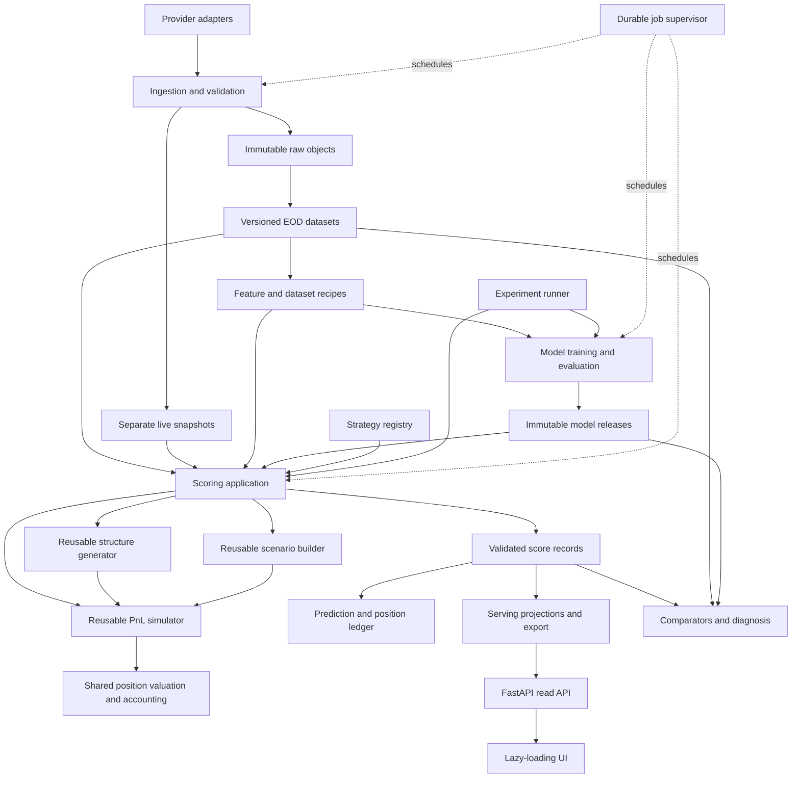

# System rearchitecture: one scoring contract, incremental data, reliable operation

Date: 2026-09-12. Status: proposed implementation and migration guide.
Review baseline: commit `68150a1`, with a clean worktree before this guide.

This proposal follows a source review of the current engine, dashboard,
storage, experiment harness, checks, and recent failure reports. It is not a
new backtest, a performance benchmark, or a certification that existing
strategies are ready for capital. No production configuration, model, strategy,
data, or ledger was changed for this review.

## 1. Recommendation

Keep one Python codebase with explicit domain boundaries, a thin FastAPI
application, and separately supervised worker processes. Keep the large data
in Parquet. Add a small SQLite catalog for transactions, ingestion progress,
job admission, immutable release manifests, and indexed serving projections.
Build a React/TypeScript interface that loads those projections on demand.

The central object should be an immutable **score record**: the resolved event,
exact strategy definition, decision clock, input snapshot, models, selected
contracts, forecasts, decision, financial diagnostics, and reasons. The board,
an experiment, a replay, and a live request must all obtain it from the same
scoring application. Neither a renderer nor an experiment runner should
reconstruct its financial meaning.

Three architectural changes do most of the work:

1. Turn a mutable collection of files into versioned datasets and validated,
   atomic releases. Readers keep using the last good release while new work
   happens in staging.
2. Turn implicit scoring dependencies into registered strategy, feature, and
   model recipes. Use those recipes for both historical and current inputs.
3. Turn independently launched scripts into resumable jobs admitted by one
   resource manager. CPU placement, memory reservations, and provider quotas
   become centrally managed policies.

The migration must preserve current economic definitions and model behavior
before adding new capabilities. A better result after a refactor is a
discrepancy to explain, not evidence that the refactor worked.

For review, start with sections 3-4 for preservation and ownership, sections
5-8 for storage/scoring/operations, then the separate
[component contracts](component_contracts.md) for concrete interfaces. The
[data model diagrams](rearchitecture_data_model.md) show entity identities and
relationships; the [structure generation and simulation contracts](structure_generation_and_simulation.md)
detail the reusable numerical components.

### Relationship to existing guides

Read this alongside [the program plan](../EARNINGS_VOL_PROGRAM_PLAN.md),
[serving parity](prompt_serving_parity.md),
[execution clocks](prompt_execution_clock.md), and
[live intraday scoring](live_intraday_scoring.md).
Some older guides describe defects as open that current code has fixed;
current source and pinned artifacts determine the migration baseline.

This proposal deliberately revises the architecture choices in
[guides/README.md](README.md), convention 7, which previously excluded
databases and frontend build tools. SQLite transactions and a frontend build
are justified by the requested capabilities. This document proposes those
changes; it does not change the current operating rules or authorize a
deployment, paid subscription change, or strategy promotion. Existing research,
fill, reporting, privacy, and ledger safeguards continue to apply.

## 2. What the review found

| Current implementation | Implication for the redesign |
|---|---|
| [score.py](../engine/score.py), `Scorer.score`, already orders forecasts, structure selection, pricing, features, model/analog/gate layers, and chooser inputs. It is about 3,400 lines. | Extract and register its existing stages. Replacing it with a new set of formulas would create another parity problem. |
| [render.py](../engine/dashboard/render.py), `compact_row`, `_model_fair_pct`, and `payoff_curve`, calculate premium ratios, fair values, and payoff geometry. | The browser has little financial arithmetic, but the renderer still owns financial logic. Move these calculations behind the scoring domain too. |
| [app.js](../engine/dashboard/static/assets/app.js) already loads ticker details and model evidence lazily. The board and other payloads remain generated JSON/JavaScript, with an all-in-one export. | Extend existing lazy loading to events, score details, evidence, and books. Preserve offline access as a separate export mode. |
| [earnings_app.py](../dashboard/earnings_app.py) reads bundle files; ad-hoc scoring constructs/uses a scorer; refresh runs a subprocess synchronously with a long timeout. | Reading a board should stay cheap. Expensive work needs a durable job receipt and must run outside an HTTP worker. |
| [store.py](../engine/data/store.py) atomically replaces individual files, but `write_table(replace=True)` and `PartitionedWriter(replace=True)` drop a table before rewriting it. | File atomicity does not make a multi-table rebuild atomic. An interrupted build can expose an incomplete dataset. |
| [rebuild.py](../engine/data/rebuild.py) scans normalizer inputs and rebuilds tables; Tier 3 is written as a whole panel. Tier 4 already supports `since` and causal folds. | Preserve the working incremental Tier-4 semantics and extend change tracking upstream; do not describe the existing store as wholly unversioned or wholly incremental. |
| [features.py](../engine/features.py), `FeatureContext.load`, reads daily partitions before filtering tickers; the scorer also carries historical trades and model state. | Bounded inputs must be planned before reading, with distinct scopes for event features and historical evidence. |
| [bounded_run.py](../tools/bounded_run.py) has `--cpu-set`, thread limits, and a process-tree watchdog. Its environment note records unavailable writable cgroups/systemd. | Keep it as a fallback executor. It is not a global scheduler, and its watchdog is not a kernel memory limit. |
| [nightly.py](../engine/dashboard/nightly.py) resolves finality, scores, writes the ledger, settles, renders, then self-checks before publishing. | Publication is guarded, but the final score replay check occurs after predictions have been frozen. Validate decisions before committing them. |
| [finality.py](../engine/data/finality.py) now requires positive session evidence and records coverage. Decision-aware serving is also present in current `score.py`. | These are existing protections to preserve and strengthen, not missing modules to reinvent from older prompts. |
| [training/chooser.py](../engine/models/training/chooser.py) imports EXP-169 by path; that dataset depends on earlier experiment code. | Production depends on an experiment directory. Extract the exact promoted recipe into the engine and make old runners call it. |
| [model_evidence.py](../engine/dashboard/model_evidence.py) dispatches dataset construction by role/feature set and caches evidence by champion artifact hashes. | Dataset recipes and evidence belong in model releases. A feature list alone does not identify feature construction. |
| [registry.py](../engine/models/registry.py) already enforces one champion per `(strategy, role, decision_offset)`, validates artifact hashes against the manifest, and carries `ROLES`, `MODEL_TIERS` and `ROLE_TIER` — the feature/decision dependency graph whose stated purpose is to answer "what breaks if I re-promote the size model". | The model dependency graph is not new work. Extend this registry and map its `decision_offset` onto the clock contract; do not specify a second graph beside it. |
| [selfcheck.py](../engine/dashboard/selfcheck.py) reports `mismatches` as `{row_id, reason}` truncated to ten, and its explainer compared 41 of the 70 fields the digest hashes. | A comparison result is a contract, not a report format. It must localize to a stage and carry every independent finding at once, or N causes cost N runs. |
| Recent commits fix forecast suppression on replay, analog order dependence, and precision loss through serialization. [Serving parity](prompt_serving_parity.md) documents additional context and feature-definition failures. | Test training-versus-serving, serving-versus-replay, serialization, and causal source selection separately. A passing digest cannot prove all four. |

The existing pricing, audit, evaluation, and recovery code is valuable. The
weakness is that it allows independently correct pieces to be assembled with
different inputs or meanings.

## 3. Freeze the compatibility contract first

### 3.1 Inventory of strategies and models

There are eleven structure factories and a separate DYN-SV selector. Preserve
all of them, including disabled and historical definitions.

| Strategy | Behavior that must survive the migration |
|---|---|
| `STR-THRU` | ATM call/put straddle; current first-post-event expiry selection; entry offset 0, exit offset +1 relative to the last pre-print close. Preserve its forecast/analog gate and exact registered threshold. |
| `STR-RUNUP` | ATM straddle; entry offset -14, exit 0; current first expiry meeting the target DTE, default 30. Preserve its own gate, implied-move/runup models, and payoff surface. |
| `CAL-P` | Simultaneous short front put/long back put calendar, both closed after the event. Preserve exact selectors and parameters. Remain disabled with `UNVALIDATED_STRUCTURE`. |
| `CND-P` | Preserve its existing long put-condor factory and mechanics. Remain disabled pending the existing evidence/promotion requirements. |
| `TWIN-P` | Seven-strike twin peak; current forecast-to-width divisor 1.5; preserve the existing shared expected-PnL rule and its stated evidence limitation. |
| `TWIN-P5` | Five-strike twin peak; forecast-to-width divisor 1.0, not 1.5; preserve its registered rule. |
| `CND-PS`, `BFLY-P`, `BFLY-P5`, `RAMP7`, `CTR5` | Preserve factory geometry, quantities, anchors, and forecast width divisors 2, 1, 3, 3, 2 respectively. Preserve forward-tracking versus promoted status. |
| `DYN-SV` | Preserve the ordered seven-member menu: TWIN-P, TWIN-P5, CND-PS, BFLY-P, BFLY-P5, RAMP7, CTR5. Rank using the existing chooser where available, preserve its partial/missing-score behavior and fallback resolver, and inherit the selected structure gate without re-gating. |

The current arithmetic short-vol rules include the trailing six-month top-20%
simulated-return bar, 25% relative-spread ceiling, and $10B market-cap floor.
These differ from the learned-gate domain floor. Do not consolidate apparently
similar constants. Width bounds, coarse-ladder refusals, strike tie resolution,
draw counts, residual pools, quote repairs, and fallback behavior are also
part of the definition.

The active model IDs at the review baseline are:

- `size_v1_4`, `opf_implied_t1_gbm`, `runup_move_d14_v1_gbm`, `iv_crush_v1_gbm`;
- `gate_midfill_str_runup`, `gate_midfill_str_thru_forecast_analog`;
- `dyn_sv_chooser_v1_1`.

These IDs fill six registered model roles, a closed vocabulary validated by
`engine/models/registry.py`: `size`, `implied_t1`, `runup_move` and `iv_crush`
are `feature`-tier roles whose outputs can be materialized as Tier-4 columns and
read by other models; `gate` and `chooser` are `decision`-tier roles that
consume features and are not read back. That tier split is the existing
dependency graph, and it is what makes a promotion's blast radius answerable.

The blast radius is wider than one strategy. `iv_crush` reaches
`_crush_forecast`, then `pnl_sim.expected_pnl`, then `exp_pnl_sim` — which is
simultaneously a STR-THRU gate input, a DYN-SV chooser dimension in
`_CHOOSER_ANALOG_DIMS`, and the fallback resolver's ranking key. Promoting one
feature-tier role therefore invalidates scores across the whole menu. The
deployment contract must state what a promotion rescores, and the registry can
already compute it.

The registry's champion key is `(strategy, role, decision_offset)`. The
contracts generalize `decision_offset` to a clock contract, so the key becomes
`(strategy, model_role, clock)`. That is a rename of a live primary-key field
and a widening of its meaning: it is a migration item with an explicit mapping
table, not a drop-in substitution. The contracts also write `model_role` rather
than `role`, because this proposal uses "role" in three unrelated senses; the
registry keeps its own field name and no persisted manifest is rewritten.

Current champions have no separate decision offset registered. Preserve those
identities, weights, transforms, feature order, thresholds, folds, and execution
conventions. A D1 experiment existing on disk does not make it a live champion.
This table is an inventory; the frozen source and artifacts, not manually
transcribed prose, are the definitive specification.

### 3.2 Generate a baseline package

The first implementation deliverable should export an immutable compatibility
package containing:

- Resolved structure definitions, selectors, parameters, entry/exit/decision
  offsets, gate/rule definitions, DYN-SV menu order and fallback policy.
- All champion artifacts and fingerprints, feature recipes, preprocessing,
  model dependencies, fold artifacts, residual/calibration/payoff state, and
  current validation or tracking status.
- The calendar version, quote/fill conventions, data snapshot references,
  relevant source code and dependency lock, and exact score requests/results.
- A private reference corpus covering each strategy, BMO/AMC, year/month
  boundaries, missing data, non-ATM requests, pinned geometry, domain limits,
  coarse strikes, and chooser partial/tied/missing candidates.
- Existing report, book, prediction, and settlement examples with their
  provenance. Include old entry-cost estimates and actual later entry
  repricing as separate fields.

Fixtures must come through real public entry points. Do not invent a column
such as `event_id` in a fixture if the current serving row does not contain it.
Resolve and map legacy identities explicitly.

Use exact comparisons for IDs, selected contracts, integer quantities,
gate decisions, flags, null masks, and frozen canonical records. Use declared
per-field numeric tolerances for independently recomputed floating values;
never widen a global tolerance until a test passes. Unexplained changes block
cutover. A known defect requires a separately recorded correction and new
version, not a silent update to the baseline fixture.

## 4. Target architecture and ownership



These are module and ownership boundaries, not eleven network services.
Initially deploy a small API process, one supervisor, and a limited number of
short-lived workers on the existing host. An interactive scoring worker may
stay warm during the decision window only when its memory is reserved.

| Owner | Owns | Must not do |
|---|---|---|
| Ingestion | Fetch receipts, normalization, coverage, finality, source revisions | Compute a trading verdict or change a champion |
| Feature engine | Registered transforms and their causal dependencies | Select an implicit latest dataset or silently change a missing-value policy |
| Model inference | Registry, artifact loading, inference adapters, residual and calibration state as frozen data | Fit anything, or reach into a training recipe |
| Model training | Dataset and model recipes, folds, fitting, residual construction, evidence, release candidates | Run inside a score request, or be imported by a feature or a scorer |
| Structure generator | Template resolution, finite placement search, validity and completeness receipts | Rank by PnL or change strategy selection rules |
| Scenario builder | Causal historical/synthetic outcome populations, weights, mappings and RNG | Choose contracts or price a position |
| Valuation/simulation domain | Frozen-position revaluation, time/parameter shocks, cash flows and PnL distributions | Select a winning strategy or call model marks executable fills |
| Scoring application | Forecasts, shape, pricing, gate/chooser decisions, financial diagnostics | Read future outcomes or mutate strategy/model registries |
| Evaluation/portfolio | Realized outcomes, capital accounting, report generation | Recreate the selection logic used to choose trades |
| API/projection layer | Filter, paginate, authorize, serialize already computed records | Fit a model, simulate PnL, or fetch vendor data in a GET request |
| UI | Navigation, formatting, tables, charts, loading/error states | Compute gates, financial ratios, return estimates, or portfolio accounting |
| Validation/diagnosis | Comparators, tolerance policies, stage plans, ComparisonReceipts and their tiers | Decide whether a difference is acceptable, or repair the data it found wrong |
| Supervisor/catalog | Transactions, leases, dependencies, capacity, retry history | Decide research conclusions |

Keep entry points such as `engine.score.score`, `score_calendar`, and existing
CLI commands as compatibility adapters while their implementations move.

### 4.1 Physical layout

The table above is a logical boundary. A logical boundary that is not also a
physical one constrains nothing: nothing currently stops `render.py` importing
the scorer, and nothing did. Each owner therefore gets a package, and the
package is the unit a person or an agent loads to work on that owner.

| Layer | Package | Owner from the table above | May import |
|---|---|---|---|
| 0 | `engine/contracts/` | — schemas and types only, no logic, no I/O | nothing |
| 0 | `engine/foundation/` | paths, env, canonical JSON, session/calendar arithmetic, causality primitives | contracts |
| 1 | `engine/data/` | Ingestion — sources, normalize, store, catalog | 0 |
| 2 | `engine/features/` | Feature engine | 0-1 |
| 3 | `engine/models/` | Model inference — registry and inference only | 0-2 |
| 4a | `engine/domain/generation/`, `engine/domain/scenarios/`, `engine/domain/valuation/` | Structure generator, scenario builder, position valuator — three peers, none importing another | 0-3 |
| 4b | `engine/domain/simulation/` | PnL simulator and accounting | 0-4a |
| 5 | `engine/scoring/` | Scoring application | 0-4b |
| 6 | `engine/evaluation/`, `engine/ledger/` | Evaluation/portfolio | 0-5 |
| 6 | `engine/models/training/` | Model training | 0-5 |
| 7 | `engine/serving/`, `engine/ops/` | API/projection, Supervisor/catalog | 0-6 |
| 8 | `engine/dashboard/`, `ui/` | UI | 7 only |
| — | `engine/diagnosis/` | Validation/diagnosis | 0-7; nothing imports it |

Two placements in that table are doing real work and are not arbitrary.

**Training sits above scoring, not beside inference.** `engine/models/`
contains the registry and inference; `engine/models/training/` is a separate
layer-6 package that may call the scorer. This is the structural form of the
contract rule that inference never fits, and it dissolves by construction the
current situation where `models/training/gate.py` imports `engine.replay` and
`models/training/gate_forecast_analog.py` imports `engine.score`.

**Features may import inference but never training.** `data/features/tier4.py`
currently imports `engine.models.training` in five places, which is the
feature-model cycle the Tier-4 design deliberately creates. Splitting the model
package at the inference boundary resolves it: a feature depends on a frozen
artifact it can load and call, never on the code that fits one.

`engine/diagnosis/` is deliberately a sink. It may read every layer's artifacts,
and no layer may import it, so a comparator can never become a dependency of
the thing it compares.

The layer split at 4a/4b exists because a direction check cannot enforce a
prohibition between peers. Three of the ownership table's rules are peer-to-peer
— the generator must not rank by PnL, the scenario builder must not price a
position, the valuator must not select a strategy — and if all four domain
components sat on one layer they could import each other freely and every one
of those rules would rest on discipline alone. Splitting the simulator below the
other three makes them structural: the scenario builder cannot price a position
because valuation is not beneath it.

This is the general limitation, and it is worth stating rather than discovering:
**a layer check enforces direction between layers, never a prohibition within
one.** Any "must not" between peers has to become either a sub-layer or an
explicit rule in the check. The ownership table's remaining peer rules — a
renderer computing a ratio, an evaluator recreating selection logic — are
handled by the layering, because those pairs are already on different layers.

The ownership table above splits model inference from model training for the
same reason. "Fit during an ordinary score request" was previously a rule
attached to a single Model engine owner, and a single package cannot enforce it;
two packages on layers 3 and 6 can, because a scorer at layer 5 has no path to
the training code at all.

### 4.2 Enforced import direction, and the measured distance to it

Declaring layers is worthless without a check, because the direction is invisible
at the point of writing an import. One `checks/import_layers.py`, in the plain
assert style of convention 6, holds the layer map and fails on any upward edge.
It runs at tier 0.

The distance to that state is smaller than the coupling pain suggests. Parsing
the current `engine/` import graph against the layering above yields **17
upward edges**, in five groups:

| Upward edge | Count | What it means |
|---|---|---|
| `models/training/*` -> `score`, `replay`, `analogs` | 3 | Real. Gate training builds its dataset by calling the scorer; it needs the registered dataset recipe. Resolved by placing training at layer 6. |
| `data/features/tier4` -> `models.training` | 6 | Real. Resolved by the inference/training split above. |
| `calendar` -> `data.fetch`, `data.sources.nasdaq` | 4 | `calendar` is two things: session arithmetic (layer 0) and a calendar source (layer 1). Split the module, not the layering. |
| `features`, `score` -> `audit` | 2 | `audit` is a causality primitive, not an evaluation output. It belongs in `foundation`. |
| `data/rebuild` -> `data.features` | 2 | `rebuild` is an orchestrator above features, not a peer of the store. Reclassify. |

Six of the seventeen are misclassification in the layer map rather than defects
in the code. Nine are real, and they are two known problems already named
elsewhere in this guide. The import graph is close to layered; what is missing
is any declaration of the layering and any signal when something crosses it.

### 4.3 Mechanical code budgets

`score.py` is 3,394 lines with a fan-out of 17; `nightly.py` is 1,789 with a
fan-out of 19; `render.py` is 1,471 with a fan-out of 12. A renderer that
reaches into twelve engine modules is the financial-logic-in-rendering problem
stated as a number.

Reading a module is how anyone — or any agent — loads the context to change it,
so length is a direct tax on every fix, paid before any reasoning starts.
Target a soft cap of about 600 lines per module, enforced as a warning rather
than a failure, and split by the stages already listed in the scoring execution
order rather than by arbitrary size. A fan-out above roughly eight for a
non-orchestrator is the more reliable signal: it usually means the module is
doing more than one job. Orchestrators are exempt from fan-out and not from
length.

Three further budgets run in the same check, at tier 0, for the same reason:
they are the properties that decide whether a change can be reasoned about
without loading its neighbours. All are measured from the current tree rather
than chosen, so each is a tail to close rather than a rewrite to fund.

| Budget | Value | Current tree |
|---|---|---|
| Cyclomatic complexity per function | 15 | 942 functions, median 3, p90 12, p95 18; 57 exceed |
| Lines per function | 80 | median 14, p90 67, p95 89; 61 exceed |
| Lines per module | 600 (warning) | 8 exceed |
| Fan-out, non-orchestrator | 8 | see §4.2 |

Roughly six per cent of functions exceed the first two. The worst is
`run_nightly` at complexity 64 over 585 lines, which is the orchestrator: §4.1
exempts orchestrators from fan-out and deliberately does not exempt them from
length or complexity, because an orchestrator is exactly where a failure needs
to be localizable to a stage.

Complexity is a diagnosis budget, not an aesthetic one. A comparator can only
name the first differing stage if stages are separable in the code; a function
with sixty branches has no stages to name, which is why one red row could carry
five causes.

**Linter.** Prefer `ruff` for style, import order and dead code, pinned to an
exact version. The environment note records that pytest is not currently
installable here, so the budgets above must not depend on a package that may
not install: implement them in `checks/code_budgets.py` using stdlib `ast`, the
same way `checks/import_layers.py` works. Style linting is a convenience that
may be unavailable; the budgets are a gate that may not be.

**Coverage.** A percentage threshold is the wrong instrument for this codebase
and it is worth saying why rather than adopting one by default. On 2026-09-11 a
suite of 1,567 passing tests sat over five live defects, and the determinism
test that should have caught the analog ordering bug passed the same frame
twice — coverage of the executed line was total and the assertion was empty.
Require instead:

- a **ratchet**: per-package line coverage may not decrease, checked against a
  committed baseline, with no floor to game;
- **tier-0 fixture coverage** as the real proof: every registered strategy and
  every refusal code has a frozen request/record pair, and a new reason code
  cannot be added without one;
- a **negative control** for each new comparator, proving the check fails when
  its input is corrupted.

The ratchet stops erosion; the fixtures are what actually establish that a
change did not move a number. Do not trade the second for a higher first.

### 4.4 Where the current modules land

The layering is only actionable with the mapping. Every current `engine/`
module has a destination; the ones that appear more than once are the modules
doing more than one job, and those splits are the point of the exercise.

| Layer | Package | Current source |
|---|---|---|
| 0 | `engine/contracts/` | new — the dataclasses currently declared inside `score.py` |
| 0 | `engine/foundation/` | `paths.py`, `env.py`, `jsonio.py`, `audit.py`, session arithmetic from `calendar.py` |
| 1 | `engine/data/` | `data/sources/`, `data/normalize/`, `data/pulls/`, `store.py`, `fetch.py`, `throttle.py`, `finality.py`, `rebuild.py`, calendar sourcing from `calendar.py` |
| 2 | `engine/features/` | `features.py`, `data/features/panel.py`, `data/features/tier4.py` |
| 3 | `engine/models/` | `models/registry.py`, artifact loading and inference adapters |
| 3 | `engine/registry/` | `structure_registry.py`, plus the StrategySpec/DeploymentSpec store |
| 4a | `engine/domain/generation/` | `structures.py`, `forecast_sizing.py`, `fills.py` |
| 4a | `engine/domain/scenarios/` | `analogs.py`, `ResidualPool` from `pnl_sim.py` |
| 4a | `engine/domain/valuation/` | `payoff.py`, `black_scholes_put` from `pnl_sim.py` |
| 4b | `engine/domain/simulation/` | `expected_pnl` from `pnl_sim.py` |
| 5 | `engine/scoring/` | `score.py` split by the stages in §6.3, `entry_rules.py`, `replay.py`, `trailing_cutoff` from `pnl_sim.py` |
| 6 | `engine/evaluation/` | `evaluate.py`, `report.py`, `build_trades.py`, `calibrate.py`, `recalibrate.py` |
| 6 | `engine/ledger/` | `ledger.py`, `ledger_settlement.py`, `portfolio.py` |
| 6 | `engine/models/training/` | `models/training/` unchanged in content, moved above scoring |
| 7 | `engine/serving/` | the data half of `dashboard/render.py`, `dashboard/earnings_app.py` |
| 7 | `engine/ops/` | new supervisor and catalog; `dashboard/nightly.py` becomes a job graph; `tools/bounded_run.py` becomes an executor adapter |
| 8 | `engine/dashboard/`, `ui/` | the formatting half of `dashboard/render.py`, `dashboard/static/` |
| — | `engine/diagnosis/` | `dashboard/selfcheck.py`, plus the parity comparators |

`pnl_sim.py` is the clearest case for why this is worth doing. It is 260 lines
that carry four separable jobs on three different layers: a residual pool
(scenarios, 4a), a Black-Scholes put mark (valuation, 4a), the expected-PnL
draw loop (simulation, 4b), and `trailing_cutoff`, which computes the trailing
six-month top-20% bar and is not a simulation component at all — it is a
STR-THRU gate input and belongs in scoring. A change to the residual pool and a
change to the gate bar are today edits to the same file, reachable from the
same import, with nothing distinguishing them.

`score.py` splits along the eight steps already listed in §6.3, which is why
that execution order is written as a sequence rather than prose. `render.py`
splits at the line §6.4 already draws: the values move to `serving/`, the
formatting stays in the UI package.

Two rules keep the mapping honest during the move. A module that appears twice
in this table is split before either half moves, never copied. And every moved
module keeps a compatibility shim at its old import path until phase 8, so the
move is never the thing that breaks a caller.

### 4.5 Every package carries a README

A package is only a unit of reasoning if someone arriving at it can tell what
it is for without reading its callers. Each directory in §4.4 carries a
`README.md` with seven sections, and the check in §4.3 fails on a missing file
or a missing heading:

| Section | Content |
|---|---|
| Ownership | Which row of the §4 owner table this package implements, and its layer |
| Responsibilities | What it decides. The list a reader can hold in mind |
| Non-responsibilities | What it deliberately does not do, taken from the owner table's "Must not do" column, with the package that does it instead |
| Public interface | The names other packages may import. Everything else is internal regardless of underscore convention |
| Consumers | Which packages import this one, and for what |
| Usage | The shortest real example that runs |
| Testing | Which tier its checks run at, where its fixtures live, and what a negative control looks like here |

Two of these are machine-checkable, which is what keeps the file from rotting
into decoration. **Consumers** is verifiable against the import graph the layer
check already parses: a README claiming a consumer that does not import it, or
omitting one that does, is a failure rather than a stale sentence. **Public
interface** is verifiable the same way — an import of a name absent from that
list is an upward-equivalent violation, caught by the same pass.

**Non-responsibilities** is the section that earns the most and is easiest to
skip. The §4 owner table's prohibitions are the boundaries this architecture
rests on, and §4.1 showed that several of them could not be made structural.
Writing each one into the package that must honour it, naming the package that
owns it instead, is what makes an unenforceable rule at least a visible one.

### 4.6 How the budgets ratchet

The tail in §4.3 has to shrink without a stop-the-world refactor and without
resting on intent. "Every commit must improve the metrics" is the obvious rule
and it is the wrong one, for two reasons worth recording so it is not
readopted later.

It cannot apply to every commit. A documentation change, a one-line fix, or a
genuinely necessary new function will not lower a global count, and a rule that
blocks them produces one of two outcomes: unrelated cleanup bundled into every
fix, which makes diffs harder to review and works directly against the
localizability this architecture is for; or `--no-verify`, which disables the
secret scan in the same stroke and is the worse failure by a wide margin.

And a coverage figure that must rise every commit is gameable in precisely the
way that has already cost this program a night: a test that executes a line
without asserting on it raises the number. The determinism test that missed the
analog ordering bug had complete line coverage and an empty assertion.

So three mechanisms, none of which is "improve globally".

**1. The touched-function rule, enforced pre-commit.** Every function appearing
in the staged diff must satisfy the §4.3 budgets. A function already over
budget must come out strictly lower than it went in — not necessarily at
budget, because a one-line fix inside a 585-line orchestrator cannot reasonably
demand its full decomposition, but never unchanged. This is local, it never
blocks work in an unrelated package, and it makes the tail shrink as a
by-product of ordinary work rather than as a project.

**2. An exemption ledger that can only shrink.** The 57 complexity and 61
length violations are listed in `checks/budget_exemptions.json`, each with its
metric, value, reason and date. The file also carries the committed count. The
check fails when today's count exceeds the committed one, and rewrites the
committed count downward when it is lower. The cap therefore ratchets to the
observed minimum automatically and can never rise: no schedule to maintain, no
calendar entry to forget, and no way to quietly re-add. Adding an exemption
remains possible and is deliberately not silent — it is a line in a tracked
file with a reason, visible in the diff.

If the natural rate proves too slow, a scheduled decrement can be added on top
of the ratchet later. Start without one: mechanism 1 already applies pressure
proportional to how much a file is actually worked in, which is the right
distribution of effort.

**3. The nightly re-verifies what the hook checked.** A pre-commit hook lives
in `.git/hooks`, which is not versioned, so a fresh clone has none and
`--no-verify` bypasses the one that exists. The hook is therefore a
convenience, not the control. Version the script under `checks/hooks/`, install
it explicitly, and have the nightly run the identical check over `HEAD` and
report drift — including whether the hook is installed at all. Without that, a
bypass is permanent and invisible. This repository has no CI, so the nightly is
the only backstop available and the checks must be cheap enough to sit in it.

**Coverage does not belong in the hook.** It requires the test suite, pytest is
not currently installable in this environment, and a hook that takes minutes
gets bypassed and then removed. The coverage ratchet of §4.3 runs in the
nightly at tier 2 against a committed per-package baseline. Only the properties
computable from the staged blobs by `ast` — complexity, function and module
length, fan-out, import direction, README consistency — run pre-commit.

The hook reads staged blobs rather than the working tree, the way
`checks/repo_hygiene.py` already does; checking the working tree passes or
fails on content that is not what would be committed. A full-repository parse
costs 2.9 seconds across 567 files and 7,493 functions, and the pre-commit
scope is narrower than that: `engine/`, `checks/` and `tools/`, skipping
`experiments/`, whose finalized research trees are immutable by convention 8.

### 4.7 A budget failure refuses publication

The nightly must fail on a budget violation, the failure must refuse
publication, and it must be visible. Three things follow.

**Refusing publication is not aborting the run.** §8.3 already keeps separate
watermarks for ingestion, scoring, prediction commit, settlement, publication
and backup, and already requires that a failed board not prevent resolving an
existing position. A budget failure uses that split: ingestion, scoring,
settlement and backup all complete and record their own watermarks, and only
the publish step is refused. Predictions still commit — they are correct, and a
frozen prediction is evidence regardless of the complexity of the function that
produced it. What does not happen is a new release becoming current.

| Watermark | On a budget failure |
|---|---|
| Ingestion, scoring, prediction commit, settlement, backup | Advance normally |
| Publication | Refused; last good release stays current |

**The banner has to carry a number, not a colour.** A permanent red state
becomes wallpaper, and that is the actual mechanism by which a failure goes
unnoticed for a long time. `health.json` gains a `code_budgets` class beside
the existing `last_selfcheck` and `calibration_drift`, carrying `ok`,
`first_failed_on`, `consecutive_nights`, the per-metric counts and the release
being withheld. The banner reads as a streak — "publication withheld 3 nights,
since 2026-09-14: 2 functions over complexity" — and appears on every view, not
only Operations, which is the page nobody opens when nothing is wrong. Board
readers can see that what they are looking at is not tonight's data and why.

**The override is a committed line, not a runtime flag.** Refusing publication
during an earnings season is a real cost, and a control with no escape gets
deleted at eleven at night rather than argued with — which is the worst
outcome, because a deleted check's absence looks like a pass. So publication
can be overridden by a dated entry with a reason and an expiry in the same
ledger the §4.6 exemptions use. It is visible in a diff, it is reviewable
afterwards, and it expires on its own. `--no-verify` and an environment
variable are not overrides; they are the failure mode this replaces.

An override does not clear the streak. `first_failed_on` keeps counting, so
the number on the banner is the age of the problem rather than the age of the
last override.

The nightly also reports whether the pre-commit hook is installed, and a
missing hook is a budget failure on the same footing. A control that cannot
detect its own absence is not a control.

## 5. Data storage: contracts and incremental ingestion

### 5.1 Physical choices

Use three complementary stores:

1. **Immutable objects:** existing raw caches, versioned Parquet fragments,
   model artifacts, feature matrices, and score detail blobs. Keep existing
   raw research paths readable; register them in place.
2. **Transactional catalog:** SQLite on local disk, using WAL, foreign keys,
   short transactions, busy timeouts, schema migrations, and explicit durable
   commit settings. It tracks manifests, ingestion receipts, watermarks,
   jobs/leases, model releases, and score/ledger identities.
3. **Serving projections:** indexed event/score summaries in SQLite, with
   large detail/evidence objects referenced by hash. Rebuildable projections
   have a different retention policy from authoritative ledger events.

SQLite WAL supports readers alongside a writer and is intended for processes
on one host, not a shared network filesystem. Keep catalog writes serialized
and bounded. Move this catalog to PostgreSQL if multiple worker hosts become
necessary; do not put the SQLite file on shared storage. This is a deployment
boundary, not an invitation to move every option row into a database.
([SQLite WAL documentation](https://www.sqlite.org/wal.html))

Use the existing PyArrow dependency for projected, filtered, batched dataset
reads. Filter by symbol, time, and required columns before converting to
pandas. Arrow supports both filtering and batch iteration; selecting columns
alone does not bound the row count.
([Arrow dataset documentation](https://arrow.apache.org/docs/python/dataset.html#filtering-data))

Start with Arrow rather than adding a second analytical engine immediately.
DuckDB can later implement the same repository interface if measured joins
justify it. Neither pandas nor a SQL engine should leak into the domain API as
an unbounded global store.

### 5.2 Contracts must describe meaning

Extend [schemas.py](../engine/data/schemas.py) rather than replacing its
validated unit conversions. Each table contract must specify:

| Contract field | Required meaning |
|---|---|
| Identity | Primary key, duplicate policy, foreign keys, stable security/contract identifiers, and legacy-key mapping |
| Values | Type, unit, scale, adjustment basis, timezone, null/sentinel policy, allowed ranges |
| Time | Market observation time, vendor publication/update time when available, local receipt time, and final/provisional state |
| Provenance | Raw object hash, source, source priority, normalizer version, row revision and correction reason |
| Coverage | Expected symbols/contracts/sessions, explicit unavailable items, completeness rules and denominators |
| Evolution | Schema version, compatible nullable additions, explicit migration for semantic changes |
| Access | Supported bounded queries, partition/index choices, maximum batch size |

Store unavailable times as unknown. Do not manufacture an old publication time
for data downloaded today. Preserve percent-versus-fraction, adjusted-versus-
unadjusted spot, the three market-cap eras, and implied-move conventions.

Give earnings events stable IDs independent of the announced date. A calendar
revision changes event date/session while retaining the event identity when
the provider evidence supports that mapping. Preserve ambiguous mappings as
conflicts; do not merge adjacent quarterly events merely by ticker. Predictions
pin the calendar revision they used, so a later BMO/AMC correction cannot
silently change an old trade.

Keep the logical tiers: raw, normalized EOD, causal features, and causal model
forecasts. Keep provisional intraday snapshots outside those EOD tables.

### 5.3 Ingestion protocol

For each source/endpoint/partition, persist a **completed coverage watermark**,
not merely the largest date seen. It must distinguish a complete interval from
one containing a hole or a partially returned ticker batch.

The normal daily path is:

1. Plan missing sessions from coverage receipts and source publication rules.
   Check the raw cache first. A discovery refresh covers calendar frontiers
   even when there are currently no upcoming events.
2. Fetch through the existing provider adapters and shared quota control.
   Persist raw bytes and a redacted receipt before normalization. Track every
   response status, missing ticker, legitimate empty result, and quota header.
3. Normalize each new raw revision once, keyed by raw hash plus normalizer
   version. Validate expected coverage and units; quarantine failed rows or
   payloads with reasons.
4. Merge changed keys into new fragments for affected partitions. Choose the
   winning revision through explicit source-priority/finality/revision rules,
   not filesystem ordering or whichever batch arrived first.
5. Validate candidate table versions, referential integrity, and coverage.
   Commit the new manifest and watermark together only after referenced files
   are durable. Failed or partial batches never advance completed coverage.
6. Emit a change set: affected keys, symbols, sessions, columns, old/new hashes,
   and whether this was an append, correction, deletion/tombstone, or schema
   change. Downstream work consumes this change set.

An unchanged second run should normalize zero payloads and rewrite zero data
partitions. A newly acquired daily session should not scan and regenerate
twenty years of input. Retain full rebuild as an explicit recovery and
equivalence-check operation.

Keep the provider-specific defenses: ORATS requested/returned-symbol diffing,
slim field requests, no blind retries of unsupported symbols, delayed market-
wide publication, redacted query tokens, and quota headers from error
responses too. Retain Polygon curl authentication, legitimate empty bars,
shared pacing/backoff, and the current entitlement boundaries. Credential
rotation pauses the affected connector and dependent work.

### 5.4 Forward updates and historical corrections

"Only updating forward data" should mean that ordinary operation leaves
settled history untouched. It cannot mean ignoring a vendor correction, split,
late event, or source bug. Those require a separate correction path with a
visible impact plan. Old raw bytes, dataset versions, predictions, and reports
remain addressable.

Start with session partitions for chains and daily-market appends; compact
small fragments into immutable monthly files when measured size warrants it.
Sort/index for symbol and time. Feature matrices can partition by recipe and
decision month; forecasts by producer and fold. Do not create one file per
individual option quote.

Incremental computation requires dependency rules, not just `date > max(date)`:

| Change | Work that may be invalidated |
|---|---|
| New final daily session | Affected rolling state, newly eligible feature rows, quotes and current scores |
| Newly resolved earnings event | Subsequent history features for that symbol; eligible residual/analog state; future training folds |
| Corrected past daily value | Dependent rolling windows and any recursive state from that point; affected feature rows and model descendants |
| Corrected target or earlier event history | Training folds whose training set includes it, their later predictions/residuals, downstream gates/choosers |
| New quote on one contract | Scores/trades using that quote, related settlement, and affected historical decision training if applicable |
| Feature logic or model recipe change | Outputs of that recipe and its descendants, with a new version |

An expanding mean, an EMA, or a historical training set can have an unbounded
forward dependency. A 252-session window does not make every feature a
252-session dependency. Persist causal state checkpoints or replay the affected
suffix according to the actual formula. Tier-4 fold invalidation must also
include changes to residual pools and uncertainty bands, not just point-model
weights. Reuse the existing `since` equivalence guarantees.

### 5.5 Atomic snapshots and replay

A dataset version is a manifest of immutable fragments, their contracts and
hashes, and its parent version. A **research snapshot** pins the exact table,
feature, forecast, calendar, and reference-data versions consumed. Keep raw
data identity separate from model-derived forecast identity, preserving the
intent of the current separate Tier-4 hash.

Write files into staging, validate and hash them, flush durable files, then
commit manifest references in one catalog transaction. On a local filesystem,
temporary-file rename plus directory/file durability must precede publishing
the reference. A crash can leave an unreferenced object; it must never leave a
committed manifest pointing to a partial object. Readers resolve one snapshot
at the start and keep it for their entire operation.

No writer deletes the current dataset before building its replacement. No
reader follows a glob over both old and staged fragments. Garbage collection
uses manifest references and retention leases; it cannot remove an object
needed by an experiment, release, ledger record, or running reader.

Track three knowledge modes explicitly, recorded per table rather than per
snapshot because the risk each describes is a property of the field:
**observed**, which requires original availability/receipt evidence and is
reserved for decisions made under a live clock; **attested_stable**, which has
no contemporaneous receipt but attests the values have not moved since, either
because the field class is immutable once settled or because a cross-source or
cross-vintage agreement rate has been measured; and **reconstructed**, a
revisable field read from a single late vintage.

The separation exists because availability and vintage are different risks.
Only vintage threatens a historical simulation; availability threatens a claim
about what was actually decided. A timestamp filter on a revised 2026 download
still does not prove what was available in 2018 — but an expired 2018 option
chain is not revised by anyone, and calling it "reconstructed" alongside an
earnings date that genuinely moves loses the distinction that matters. Existing
history is therefore attestable rather than uniformly reconstructed, provided
each attestation names which ground it rests on. Nothing promotes into
`observed` retroactively.

## 6. One scoring application

### 6.1 Registry objects

Register a versioned `StrategySpec` with these references:

```text
StrategySpec
  id, version, definition_hash, validation_status
  structure_recipe, parameters, contract_selection_recipe
  decision_clock, entry_policy, exit_policy
  universe_policy, domain_policy, quote_policy, fill_policy
  feature_recipe_ids, model_role_bindings
  forecast_sizing_recipe, analog_recipe, residual_and_payoff_recipes
  gate_recipe, chooser_recipe, fallback_policy
  risk_and_funding_policy_refs, evidence_refs
```

Model weights and strategies should not be one mutable object. A
`DeploymentSpec` pins a strategy version to exact model releases and policy
versions. A model promotion produces a new deployment; it does not rewrite
the meaning of an old strategy or prediction.

Feature recipes have namespaced identities such as `bucket_analogs.v1` and
`chooser_knn_analogs.v1`. They can map to the existing input names that trained
artifacts expect, but their meanings cannot collide merely because both output
`analog_mean`. Record each recipe implementation hash, inputs, universe,
lookbacks, missing/fallback rules, and source cutoff rules.

An experiment must register its candidate strategy/deployment and scoring
recipes in an **isolated research registry** before it runs. Registration
validates dependencies and makes the candidate reproducible; it does not
promote it or enable it on the board. Existing CAL-P/CND-P research remains
possible without removing their production refusal.

### 6.2 Request and result contracts

```text
ScoreRequest
  event_id, calendar_revision
  strategy_version or deployment_id
  decision_clock_id, requested_decision_at
  snapshot_id, mode: research | replay | shadow | serving
  fill_model, optional contract/geometry overrides

ScoreRecord
  schema_version, score_id, canonical_request, resolved_request
  event and clock provenance; observed/available/received timestamps
  snapshot and dependency hashes; exact model artifact IDs
  selected contracts, legs, quantities, entry/exit plan, quote provenance
  forecasts, uncertainty, residual/analog/payoff state references
  consumed feature values, null masks and per-feature provenance
  gate/rule terms, threshold, verdict, chooser candidates and selection
  financial diagnostics and requested payoff views
  validation_status, reason_codes, warnings, evidence references
```

Persist `computed_at` and other operational timings in an envelope separate
from the deterministic numerical payload. A replay does not have to pretend
it ran at the original wall-clock time to reproduce the score hash.

Use a complete canonical identity. Include event/session revision, decision
clock, fill alpha, strike/expiry/geometry overrides, source snapshot,
strategy/recipe versions, models, and residual/analog/calibration inputs.
Cache keys use the exact relevant dependencies; unrelated data changes should
not invalidate the entire board.

Preserve replay input precision. Never reconstruct a request from the rounded
number displayed on screen. Represent listed strikes with an explicit exact
contract representation; retain full precision for model-derived geometry.
Canonicalize ordering and numeric encoding once in the contract layer.
Formatting happens at the final display boundary.

### 6.3 Execution order

1. Resolve event, calendar, requested clock, allowed data ceiling, and pinned
   deployment. Validate clock and feature-contract compatibility.
2. Assemble pricing-independent features and infer the required feature models.
3. Resolve forecast-sized geometry, then select contracts using the existing
   factories and selectors. Pinned geometry still records its forecast.
4. Read bounded quote inputs and price through the current fill/structure code.
5. Assemble trade-dependent features and historical evidence; run the causal
   audit against actual source lineage.
6. Produce the model, analog, simulation, gate, and chooser inputs through the
   registered dependency graph. Preserve their distinct meanings.
7. Resolve any meta-strategy against the complete eligible candidate set.
8. Produce financial diagnostics and a validated immutable record.

Expose `score_event(request, strategies)` for the whole event and
`score_many(requests)` for batches. They share one kernel with single-strategy
scoring; batching reuses common feature work without changing results. A
direct DYN-SV request resolves its menu inside the application rather than
depending on the renderer or an experiment to have scored its competitors.

The context planner declares separate scopes for event state, market regime,
analog population, and training/calibration history. A request for AAPL may
need historical analogs from many symbols. Restricting all dependencies to the
visible watchlist would repeat the analog-context failure. Load only required
columns and intervals, but retain the entire population required by the recipe.

### 6.4 Move financial display calculations out of rendering

Move `model_vs_market`, fair premium, premium/fair, cost/width, risk summaries,
and payoff construction into tested domain functions. The API can request a
payoff view lazily by score ID, but it must use those same functions and frozen
legs. Distinguish terminal payoff from modeled value at the planned exit;
multi-expiry structures cannot be represented as if all legs expired together.

The projection layer may compute a documented display rank over a specified
score set. That rank must not become a hidden trading selector. Book totals
come from the portfolio/accounting module. The UI may format percentages and
draw chart coordinates, but it receives the authoritative financial values.

Preserve all existing refusal distinctions. Missing input, gate failure,
unvalidated strategy, superseded strategy, unsupported clock, extrapolation,
and explicitly sanctioned fallback are different outcomes. A model output of
zero is not a replacement for a missing model. The rule-level gate verdict
and operational readiness should be separate fields: an old passing forecast
can remain visible while being too stale for a current decision.

### 6.5 Reusable structure generation

Introduce a generator taking an event revision, frozen contract chain,
StructureTemplate and explicit finite PlacementDomain. It emits every valid
placement in that domain with exact contracts, signed quantities, geometry
resolution and separate structural/quote/strategy-admission statuses. Return
deterministic pages, rejection counts and a completeness receipt. A truncated
search is not an exhaustive candidate set.

This separates what can be built from what a strategy chooses. Current
strategies use their unchanged selector-resolved domains; searching all strikes
for the best simulated return requires a separately registered strategy.
Preserve exact listed mirrors, irregular-ladder dollar geometry, zero-quantity
reference legs, collision checks, pinned exits and existing quote refusals.
Extract the useful EXP-133 search patterns without making its experiment
constraints defaults for the entire engine.

### 6.6 Reusable scenarios, valuation and PnL simulation

Given a frozen proposed or actual position, build scenarios from eligible
similar historical positions, forecast/residual state, or a synthetic joint
distribution. A separate valuator reprices the same contracts under each
scenario at the requested time and parameter state. The simulator applies
signed cash-flow, fill, cost and return-denominator policies and reports the
resulting distribution. Selection/gates remain in the registered scoring graph.

The contract must distinguish elapsed sessions from calendar time, relative
IV changes from volatility-point changes, and each leg expiry from a shared
DTE. It must also separate model-to-model value change from economic PnL
against an opening fill. Historical returns without suitable factor/path data
cannot answer arbitrary horizon/IV changes; unsupported mappings refuse.
Preserve the current put-only simulation and calibrated payoff maps as named
legacy adapters. More general valuation is new capability, not an implicit
change to any existing strategy or its gate.

Reuse scenario sets and per-contract valuation blocks when dependencies agree,
under supervisor resource reservations. Combine per-leg values, not per-leg
quantiles or win probabilities. The [detailed reusable contracts](structure_generation_and_simulation.md)
specify input/output schemas, accounting signs and units, completeness,
capabilities, failure behavior, optimization limits and acceptance tests.

## 7. Reusable model training and serving

Build on [training/common.py](../engine/models/training/common.py),
[registry.py](../engine/models/registry.py), and
[tier4.py](../engine/data/features/tier4.py). Generalize their recipes and
artifact lifecycle without changing the numerical algorithms during migration.

| Concept | Responsibility |
|---|---|
| Dataset recipe | Causal inputs, target, eligibility, sample weights, groups, and label-availability times from a pinned snapshot |
| Model recipe | Role/target, feature order, preprocessing, estimator adapter, hyperparameters, seed, fold policy, calibration/residual policy |
| Model artifact | Fitted estimator, transforms, feature contracts, residuals, training fingerprint, environment, compatible clocks |
| Model release | Artifacts, OOS predictions, evaluation/evidence, dependencies, and promotion receipt in an immutable serving unit |

Use a small estimator protocol: fit, predict, save, load, and optional
distribution/interval outputs. Adapters support the current linear models,
GBMs, neural networks, and blends. Keep existing sklearn-compatible estimators;
add another NN runtime only when a concrete experiment requires it. Model
architecture and model role are independent.

Do not conflate predicted earnings-move size, forecast-based option geometry,
and portfolio position size. They belong to a feature model, a strategy recipe,
and a funding policy respectively. Preserve existing gates as return predictors
or arithmetic rules; a gate score is not a probability.

Feature-model predictions used to train gates or choosers must be causal OOS
predictions. Preserve the distinction between a monthly Tier-4 fold forecast
and the full refit champion forecast shown as another diagnostic. They can
legitimately differ. The dependency graph registers upstream producers and
rejects cycles. Training membership and label-availability receipts must prove
that an upstream fit did not see the downstream row or its future labels.

Preserve current expanding-year evaluation and monthly feature-model folds
where registered. Validate that overlapping targets were available before
each fold cutoff; new recipes declare any required purge/embargo. A discovered
violation blocks release and requires separate investigation, not a silent
split change. Fit preprocessing, target transforms, thresholds, calibrators,
residual buckets, and NN early stopping only on permitted training/validation
data. Preserve existing missing-row masks; a generic imputer changes the model.

Materialize fold models and residual/calibration state as supervised jobs.
Where the current scorer fits a monthly model into a local cache, persist the
identical fit keyed by recipe, training content, fold cutoff, seed and runtime.
Scoring only loads and infers. An absent artifact returns MODEL_NOT_READY and
can enqueue preparation; it does not trigger training inside an HTTP request.
New rows in a month use its already frozen model. Corrections invalidate the
dependent folds and residual states, which can include every later fold.

Generate model evidence from the exact frozen training dataset. Store its
recipe, coverage, feature explanations, input diagnostics and OOS metrics with
the release. Eliminate feature-list-based dataset guesses in
`model_evidence._dataset_for`. Promotion requires a complete compatible set of
artifacts, evidence and parity receipts, then atomically switches a deployment
pointer. Rollback restores that pointer without overwriting any weights.

## 8. Durable jobs for nightlies and experiments

### 8.1 One supervisor

Add one supervisor with a durable SQLite job table and an executor adapter.
Its scope is dependencies, leases, resource admission and subprocess execution;
research algorithms remain engine modules. A distributed broker or cluster
manager is unnecessary for the initial single-host workload.

Every nightly timer, experiment CLI, web action and heavy diagnostic submits
a JobSpec: immutable input references, implementation/spec/environment hashes,
dependencies, resource class, priority/deadline, provider budget, output
namespace, checkpoint contract and retry policy. Named resource classes own
conservative estimates, updated from measured peaks between runs. An
unprofiled heavy class starts alone. Users choose the job, not CPU ranges.

Use transactional claims, renewable leases and fencing tokens. A recovered
job must reject writes from its old orphaned worker. After host suspension,
reconcile processes and leases before starting another attempt. Execution is
at least once; unique logical output keys and atomic commits make effects
idempotent. Checkpoints include code, inputs, parameters and environment,
not merely a `.done` marker.

FastAPI returns a job ID immediately. Do not keep a long subprocess inside an
HTTP worker or use in-process BackgroundTasks as a durable scheduler. FastAPI
itself distinguishes small background tasks from heavy external work.
([FastAPI guidance](https://fastapi.tiangolo.com/tutorial/background-tasks/#caveat))

### 8.2 Automatic resource admission

Budget against the effective host/container memory ceiling and allowed CPU
affinity. Reserve room for the API, supervisor, OS and external workloads.
Admission must satisfy both the total reservation budget and current available
headroom, including unused reservations held by already running jobs.

On this roughly 7GB host, initially allow only one heavy scoring or training
process at a time. A 5.5GB rebuild and a 3GB scorer cannot coexist. If a stage
does not fit the available worker budget, keep it queued with a reason; split
or optimize it, or change host capacity. Reducing the declared reservation
does not reduce its memory use.

Allocate disjoint CPU sets centrally and set BLAS/OMP, estimator and loader
thread counts consistently. Budget disk scratch and disk-heavy work too.
Run normalization, feature generation, fitting and scoring in separate
processes so rebuild memory is released before the next stage. Bound caches
by bytes and snapshot. CPU separation alone is not memory isolation.

Provide two executors:

- Preferred: delegated Linux cgroups per job, with CPU/memory controls and
  whole-group ownership. `memory.high` applies pressure before `memory.max`;
  record OOM events. Kernel enforcement still needs global headroom.
  ([Linux cgroup documentation](https://cdn.kernel.org/doc/html/latest/admin-guide/cgroup-v2.html))
- Current-host fallback: supervise `bounded_run` with strict global admission,
  disjoint placement, process-tree accounting and conservative headroom. Probe
  capability at installation: the current executor records unavailable
  writable cgroups/systemd. A polling watchdog cannot contain every allocation
  spike; describe this mode as best-effort containment.

Reserve live collection/scoring capacity ahead of the decision window.
Stop admitting experiments that could overlap it. Yield low-priority jobs at
safe checkpoints and exit their workers to release memory; SIGSTOP alone
retains RAM. A permanently warm scorer also needs a reservation.

All provider requests share account-level rate/quota state across jobs.
Preserve Polygon single-consumer pacing, ORATS live reserve and large-pull
approval rules. Reserve estimated calls and reconcile every available quota
header, including error responses. Missing headers retain uncertainty rather
than resetting usage. Distinguish 401, permanent 404, legitimate empty data,
429, transient failure and delayed publication in retry policy.

### 8.3 Nightly graph and release boundary

```text
plan -> ingest -> validate/normalize changed partitions
     -> commit candidate data snapshot -> resolve final session
     -> update affected features -> prepare model/state artifacts
     -> score batches -> validate features, decisions and replay
     -> commit validated predictions and score release
     -> build projections/export -> publish -> verify delivery
```

Settlement is an independent idempotent branch after final data ingestion.
A failed board must not prevent resolving an existing position when its
required data is final; a missing exit must remain visible and unresolved.

Every stage in that graph carries a typed input hash and output hash. Two
different resumptions follow from them, and they need different keys:

- **Crash recovery** re-executes from the last stage whose output was committed.
  Its key is the stage's inputs.
- **Change recovery** re-executes from the first stage whose *implementation*
  hash moved. Its key is inputs plus implementation, which is what §8.2 already
  requires of a checkpoint — code, inputs, parameters and environment, not a
  `.done` marker.

Change recovery is the developer loop, and it is the reason the stage hashes
are worth their cost: editing `analogs.py` should invalidate the analog stage
and everything downstream of it while leaving ingestion, features and pricing
intact. Confirming a fix must not cost a full nightly, and without per-stage
implementation hashes there is no smaller unit to re-run.

Checkpoint event batches and folds. Resume hash-matching shards and recompute
only unfinished work. This fixes the current loss of expensive computed scores
even when downloaded data survives a killed nightly.

Validate decisions before freezing new predictions. Keep the serialized
projection self-check before publication as a separate protection. Failed
candidates remain private diagnostics; they do not become validated
recommendations. Existing immutable bad records require a reasoned superseding
entry, never deletion or rewriting.

A code-budget failure refuses publication under §4.7 while ingestion, scoring,
prediction commit, settlement and backup advance normally. The last good
release stays current and the operations banner carries the streak.

Commit validated predictions, release metadata and a publication outbox
transactionally. Deliver the remote release idempotently afterward. Publication
failure retains the frozen predictions and retries delivery; track validated,
published and delivered times separately. Computed does not mean seen by the
user. Keep the previous release readable with its true timestamp and a current
operations banner.

Replace one last-success timestamp with separate watermarks for ingestion,
scoring, prediction commit, settlement, publication and backup. A failed
publish cannot count as successful delivery.

### 8.4 Experiment lifecycle

```text
register candidate + preregister spec
  -> pin inputs and plan resources/quota
  -> build dataset -> fit causal folds -> score through engine
  -> replay selected trades on real prices
  -> evaluate -> REPORT.md -> testing ledger
  -> finalize artifacts -> private mirror sync once
```

Retain `engine.evaluate.evaluate(..., write_report=True)`: fill sensitivity,
sample funnel, stress, capacity, capital accounting, provenance and accuracy
checks remain mandatory. Model-only studies retain model metrics and evaluate
the relevant implied strategy/book rather than inventing trade headline values.
Promotion remains a separate evidence-based operation.

Keep every execution attempt in a run log, distinct from the multiple-testing
ledger of hypotheses/specifications. Failed evaluations remain visible.
Mandatory runner `--no-ledger` mode prevents subset pipeline tests occupying
real experiment slots. Changing a grid cell must regenerate its actual scores
and trades; changing only YAML while reusing one frame is not another test.

New runners call engine-owned registered components. Extract the exact
EXP-169/EXP-161 chooser recipe first, prove parity, and retain old runners as
adapters. Production must no longer import experiment runners by filesystem
path. Candidate registration does not mutate the production registry.

## 9. A richer UI with lazy data access

Use a shared component system for typography, spacing, status labels, tables,
forms and charts. Keep the event list focused, with an expandable evidence
drawer instead of placing every diagnostic in a permanent column.

| View | Preserved and added capability |
|---|---|
| Earnings | Date/session search, decision deadlines, strategy verdicts, source age, unavailable/stale states |
| Event detail | All strategies, gate terms, legs/order ticket, strike/expiry alternatives, payoff, historical prints and analog evidence |
| Portfolio | Hypothetical/contrarian books, predictions, entries/exits, unresolved items, funding and comparable summaries |
| Models | Active/historical releases, input/decile evidence, dependencies, OOS metrics and calibration |
| Research | Experiments, generated reports, primary/secondary arms, sample funnels and fill sensitivity |
| Operations | Job progress, failures, source coverage/finality, quota, publication and backup age, code-budget streak and hook-install state |

Retain existing filters, sorting, deep links, disabled/out-of-domain visibility,
model health and offline downloads. Preserve evidence status: a tracked
structure and a promoted structure should not appear equally validated.
Use semantic controls, keyboard navigation, readable loading/error states and
mobile layouts. Put meaningful clocks/source age beside the decision and
technical hashes in the evidence drawer.

Recommend React + TypeScript + Vite and TanStack Query for independent screens,
typed contracts, pagination, cancellation and pending/error states. TanStack
supports paginated queries while retaining the previous page during loading;
never obscure the loading state when the release changes.
([TanStack pagination](https://tanstack.com/query/latest/docs/framework/react/guides/paginated-queries))

Generate client types from the versioned API schema. Pin tested dependencies
during implementation. The code build never reads market data or model
artifacts. Initial requests fetch release metadata and one bounded event page;
detail, analogs, history and model charts load when opened. Cursor/cache keys
include release, filters and clock. Immutable objects use ETags. Browser focus
must not initiate paid live collection automatically.

The [component contracts](component_contracts.md) specify the routes and
payloads. Read endpoints serve saved projections. Expensive what-if/live work
returns a job ID. Authenticate both HTML and data URLs; restrict stateful and
quota-consuming actions to an operator permission, with CSRF protection where
needed. This sense of "role" is access control and is named `principal_role`
in the contracts, to keep it clear of `model_role`.
Use bounded filters and allowed sort fields. Provider credentials stay in
connectors. A new release triggers a visible refresh, never a mix of old lists
and new details under one timestamp.

Keep a common DataClient with HTTP and offline-snapshot implementations.
The ordinary UI loads separate data. An explicit offline export intentionally
packages a pinned release, retaining the single-file fallback and disabling
live actions. Test it with networking disabled.

The authenticated remote static snapshot remains available when the research
host sleeps. It can lazily serve detail objects and filter a bounded exported
index; new scoring requires the API. A later remote read service can provide
server pagination if that index outgrows static operation. Do not remove
remote access while adding a local API dependency.

Dependable intraday operation requires an awake collector/scorer during the
decision window. Recommend supervised always-on Linux for the live worker
when that capability is ready. A sleeping WSL host cannot meet a live deadline;
host provisioning is a separate deployment step.

## 10. Live scoring preserves structures but adds a new clock

Implement [live_intraday_scoring.md](live_intraday_scoring.md) through the same
scoring application. Economic structures remain unchanged; a new information
clock is a versioned deployment and research question. Do not silently replace
current close-clock champions with intraday inputs during migration.

Start with the proposed `d0_preclose_1545_et`. D0 identifies the strategy entry
session, not automatically the earnings date. A BMO print normally requires
the preceding trading session; 15:45 on its earnings date is already too late.
AMC normally permits a same-date pre-close decision. STR-RUNUP still enters
fourteen sessions earlier and exits before the print.

Use the exchange calendar and America/New_York, including DST, holidays,
early closes and event-session revisions. Initially refuse early-close days
for the 15:45 clock unless a separately validated shortened-session clock
exists. Automatically moving to 12:45 would change the definition.

Distinguish data cutoff, source availability, local receipt, snapshot sealing,
score completion, publication and execution deadline. A 15:44 observation
received at 15:46 was unavailable at 15:45. Prefetch before cutoff, seal only
eligible data, and record real completion/publication times. A late result is
late even when its feature timestamps pass causality.

ORATS currently documents live one-minute summaries/chains, CSV responses,
historical routes, source timestamps and parity-derived stockPrice. Coverage
differs by endpoint. Documentation is not proof of this account entitlement
or completeness for every symbol.
([ORATS live intraday API](https://orats.com/docs/live-intraday-api))

Begin implementation with a small redacted market-hours schema/entitlement
probe through existing quota controls. Confirm field units, timestamp and DST
semantics, coverage and cross-source consistency. Do not purchase a plan or
retry known-unauthorized Polygon tick endpoints by implication.

An append-only live snapshot stores raw responses, redacted receipts, source
and receipt timestamps, prior final-EOD snapshot, calendar revision, normalized
features, exact recipe/model dependencies, quote-quality results and score
records. All required legs must satisfy age/skew limits. Retain stockPrice and
spotPrice and explicitly identify the input each recipe uses. Missing live
provenance refuses the affected score. A close artifact cannot serve as a
fallback for a pre-close model.

Prior final EOD history plus permitted live fields is valid input. Same-day
provisional EOD tiers, request-time Tier-4 rebuilds and request-time model fits
are forbidden. Stored live decisions replay offline from their frozen inputs.

Train pre-close models on the actual pre-close contract, with causal folds.
Compare D0-close, D1-close and pre-close benchmarks on matched events; report
unmatched coverage separately. Historical snapshots without historical receipt
evidence constitute reconstructed timing experiments with declared latency
assumptions, not proof of what the account actually received then.

Preserve the live guide milestones: five valid collection sessions, causal
and replay tests, historical experiment, at least twenty valid shadow sessions,
then paper execution review. These do not replace the existing season-length
forward-test/go-live requirements. EOD-model-on-live-input diagnostics stay
shadow until the clock is validated and promoted.

Scoring never creates a fill. Record intended order/limit, submission time,
paper-versus-broker evidence, actual entry and actual exit separately. A 15:45
score does not establish execution at the official close. Daily close/VWAP or
a high/low crossing a limit does not prove a simultaneous multi-leg fill.
Retain measured-fill comparisons and the current data-entitlement limits.

## 11. Validation that catches and explains failures

Keep the unit suite and real-data acceptance checks, and add independent
boundary tests. A same-engine replay alone can agree with a shared bug.

Every check declares a tier, and the tier is a latency commitment, not a
priority: **0** runs in seconds from frozen fixtures on every edit, **1** runs
in about a minute per commit and must include a real write-to-disk and
read-back, **2** runs nightly. A check that can only run at tier 2 is not part
of the loop by which a fix is confirmed, so a tier-2 default is a gap to close
rather than a neutral choice. The receipt every check emits, and the two
properties it must have — stage localization and complete independent findings
— are specified in
[component contracts §15](component_contracts.md#15-comparators---diagnosis).

| Check | Required proof | Tier | Trigger |
|---|---|---|---|
| Code budgets | No module imports a higher layer; `engine/diagnosis` imported by nothing; complexity, function/module length and fan-out within budget; touched functions not worsened; exemption ledger at or below its committed count; every package README present with consumers matching the import graph | 0 | Every edit; pre-commit on staged blobs; nightly re-verification over HEAD, refusing publication on failure |
| Coverage ratchet | Per-package coverage not below its committed baseline; every strategy and refusal code has a tier-0 fixture pair; each comparator has a negative control | 2 | Nightly |
| Strategy compatibility | Same contracts, timing, nulls, forecasts, thresholds, flags and choices | 0 | Every edit; every migration step |
| Training/serving parity | Dataset rows and production context produce the same registered inputs | 1 | Model release; sampled nightly |
| Serving/replay parity | Single/batch, cache/fresh, pinned geometry, reordered inputs, API/export agree | 1 | Every commit; full matrix nightly |
| Causal sources | Actual observation and label availability respect cutoff; future poisoning changes nothing | 1 | Feature/model changes; live snapshots |
| Incremental/full equality | Append/correction result matches rebuild; unaffected fragments unchanged | 2 | Data/recipe changes; bounded audits |
| Crash/retry atomicity | Last release readable; resume matches uninterrupted output; no duplicate effects | 2 | Storage/scheduler changes |
| Resource admission | Heavy jobs queue, live reservations hold, lease/worker recovery works | 2 | Scheduler and operational drills |
| Provider contracts | Partial batches, empty results, units, auth/rate errors and publication delay are handled correctly | 1 | Connector changes; ingestion |
| Ledger/accounting | Timely decisions, evidence-backed entry/exit, cash and positions reconcile | 1 | Commit/settlement |
| UI contracts | Bounded lazy requests; no mixed release; values/totals match saved records | 1 | Frontend changes |
| Evidence/recovery | Matching deployment/model page; restore replays score and ledger | 2 | Promotion; restore drill |

Name regression cases for the failures this program has encountered:

- BMO/AMC decision cutoffs and the separate event-history ceiling.
- Watchlist-bounded serving retaining the required broad analog population.
- Chooser kNN features versus STR-THRU bucket analog features.
- Pinned shape still recording forecast and gate inputs.
- Full-precision geometry surviving every serialization layer.
- Analog ordering and deterministic residual sampling.
- Partial/missing chooser menus and exact current tie/fallback behavior.
- Shrunk/empty universes not giving vacuous coverage passes; expected,
  supported and received populations recorded separately. Preserve baseline
  denominator behavior while making population collapse independently visible.
- Model promotion never serving old evidence under a new model identity.
- Late calendar/quote revisions leaving original decisions replayable.

Assert null masks, fallback rates, missing-row counts and eligible populations,
not just agreement on non-null pairs. Include negative controls that corrupt
a timestamp, feature builder, geometry, model hash or dataset membership and
prove the corresponding check fails. Use hand-calculated leg/cashflow fixtures
and independent source comparisons where they establish financial correctness.

Make documented serving approximations explicit too. For example, the current
chooser maps a grid-derived n_admissible input to a chain-depth-conditioned
surrogate. Preserve that behavior in baseline compatibility, register the
mapping and its evidence, and test the serving value against that mapping.
Report the difference from the original training input separately. Do not
silently declare exact training/serving equality for a known approximation,
or introduce new approximations to make parity pass.

A failure receipt names the first different stage, request/dependency hashes,
expected and actual fields, null masks, source rows/timestamps, recipe/model
versions and affected counts. Print a compact diagnosis immediately; retain
private detail even if the job exits. A recurring mismatch is not permission
to ignore it. Model calibration drift and poor OOS performance are distinct
from infrastructure failure, and process health does not prove causal validity.

## 12. Migration sequence and rollback

Run legacy/replacement paths on identical snapshots. Compare sequentially on
this host so a parity check does not need two multi-gigabyte scorers alive.

| Phase | Deliverable | Exit gate |
|---|---|---|
| 0. Baseline | Contract/artifact/screen inventory; private corpus and negative controls; **tier-0 fixture corpus and the ComparisonReceipt**; **declared layer map and `checks/import_layers.py`** | Every strategy and critical refusal reproducible; five seeded defects yield five stage-named findings in one tier-0 pass; the layer check runs green with its nine known exemptions listed and dated |
| 1. Operations | Catalog/supervisor wrapping existing commands; receipts and score checkpoints; **per-stage input/implementation hashes**; **`checks/code_budgets.py`, pinned linter, coverage ratchet and a README per package**; pre-commit validation | Crash/resume and competing submissions pass; no per-job CPU selection; editing one stage's implementation re-runs that stage and its descendants only; budgets green with the exemption ledger at or below its committed count, a touched function never leaving a commit worse than it entered, the nightly reporting hook-install and drift, every package README present and its consumers matching the import graph |
| 2. Data access | Snapshot repository, immutable manifests, bounded reads, legacy adapters | Existing scores match; failed rebuild leaves active snapshot intact |
| 3. Incremental data | Coverage watermarks, changed-key merges, dependency invalidation, correction path | No-op rewrites zero data; append/correction matches clean rebuild |
| 4. Scoring | Registered extracted recipes, canonical score contract, engine-owned chooser data, financial logic moved from renderer | All strategies match; production imports no experiment runner |
| 5. Models | Persisted fold artifacts, transforms/residuals, dataset recipes and evidence; atomic promotions | Zero fitting on scoring requests; exact promotion/rollback |
| 6. UI | Read API then one screen at a time; old UI/export adapters retained | Feature inventory, lazy-load checks, phone/offline access pass |
| 7. Live shadow | Entitlement/schema proof, snapshots, causal live features, clock-specific experiments | Live guide gates pass; no contamination; timely publication |
| 8. Cutover | Switch consumers; remove duplicate implementations; update recovery/operations docs | Ten consecutive completed-session runs without manual resource placement; restore and compatibility evidence pass; the layer check has no remaining exemptions |

The UI can start against frozen projections after phase 2. Shadow collection
can begin before model readiness once its contract/quota are defined. Cutover
remains gated on relevant parity. Ten stable nights is an operational target,
not statistical evidence for a strategy.

Measure performance on a fixed workload with concurrent jobs, memory budget,
cache state and input size recorded. Proposed targets: sub-second read API;
usable first page within two seconds on the agreed device/network; only one
initial event page; recovery recomputes at most unfinished batches/folds.
Measure provider wait, queue wait and computation separately before setting
a nightly deadline. Live latency must fit the decision/execution deadline.
None of these timings were measured in this review.

The first implementation slice should deliver the tier-0 fixture corpus and
ComparisonReceipt, the canonical score schema, a paginated read API over saved
scores, and supervised legacy scoring. The fixtures and the receipt come first
within that slice: they are what makes every subsequent step's parity claim
checkable in seconds rather than overnight, and every later phase's exit gate
is stated as a comparison. Add immutable publication before switching rebuild behavior. This
creates useful UI/operations boundaries without simultaneously rewriting
storage, scoring and models.

Keep old research trees, specs/results, imports, predictions and reports intact.
Build new catalog/data state alongside the legacy store. During shadowing only
one path commits official predictions, registry changes and testing ledgers.
Rollback restores a prior deployment/release; it does not erase historical
facts. Necessary economic changes get separate experiments or explicit defect
corrections with evidence.

## 13. Privacy, observability and recovery

Extend the existing public-code/private-evidence policy with exact allowlist
rules for frontend source and lockfiles. Keep datasets, compiled data exports,
catalogs, models, live snapshots and decisions private. Preserve hygiene scans
and authenticated access to both pages and their data objects.

Structured job events record stages, counts, elapsed time, resources, input
versions and failure classes, with at least a minute heartbeat. Distinguish
OOM, watchdog kill, auth failure, stale data, validation failure and publish
failure. A private reproduction reference should make diagnosis possible
without repeating an hour of work.

Continue one private-mirror sync after an experiment is finalized. Extend
backup coverage to catalog transactions, snapshot manifests, model releases
and original live raw responses needed to reproduce decisions. Such data
cannot always be re-downloaded in its original vintage. Use a private artifact
backup for bulky immutable objects rather than storing every revision in Git.
Plan retention/storage costs explicitly; this extends the current accepted
raw-data backup gap.

Use a consistent SQLite backup mechanism plus all referenced immutable files;
copying only a live database file while ignoring its WAL is insufficient.
A restore drill must recover a deployment, replay an original score without
network access, reconcile the ledger and open the report.

## 14. Review and completion

The [component contract specification](component_contracts.md) makes the
boundaries in this guide concrete: schemas, method signatures, time semantics,
failure types, transactions and compatibility tests. Review those contracts,
the [data model diagrams](rearchitecture_data_model.md), and the
[generator/simulation specification](structure_generation_and_simulation.md)
before building the new components.

The rearchitecture is complete when the existing strategy corpus agrees,
the UI feature inventory passes, normal ingestion advances incrementally,
and all callers use registered scoring recipes. Jobs must survive interruption
without manual resource placement, and failures must leave prior releases
readable. Live readiness is an additional gate requiring a compatible clock,
causal inputs, timely publication, generated reports, shadow/paper evidence
and the existing go-live controls.
