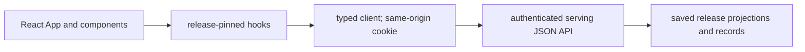

# `ui/` architecture

## Purpose
Layer 8 presentation in the [root architecture](../ARCHITECTURE.md): the existing
React/TypeScript app owns application components, layout, navigation and rendering.
Its presentation scope includes the legacy dashboard views still awaiting migration.
## Primary contracts and public interfaces
`src/App.tsx` composes board/event/score views; `src/routes.ts` handles routes.
`src/api/client.ts` is the sole fetch boundary to the authenticated serving API.
Wire shapes and shipped views are detailed in the [README](README.md). Planned,
documentation-only until its own code PR: a `#/native_parity` route (not
release-scoped — the report has no `release_id`) for the native-vs-legacy
side-by-side screen, over the SAME cookie auth and `client.ts` fetch
boundary — no second auth model (`engine/v2/serving/ARCHITECTURE.md`).

## Inputs
Saved JSON release metadata, paginated events, score details and operations data
from [serving](../engine/v2/serving/ARCHITECTURE.md), plus route/filter state.

## Outputs
React DOM and chart pixels, navigation/deep links, loading/error/refusal states
and links to the same pinned compatibility release. No engine records are written.

## Dependencies
React components use typed client/hooks; the browser calls serving over HTTP.
No direct scoring/model/ledger/evaluation/provider access; browser users enter
through `App`; integration/browser tests exercise the same API contract.

## External systems and libraries
React, TypeScript and Vite; browser fetch with the same-origin `operations_token`
cookie. Build output is static assets; serving those bytes is transport.

## Failure semantics
| Condition | Outcome |
|---|---|
| Loading, empty, 401 or unknown identity | Explicit loading/empty/auth/refusal state; detail failure preserves board. |
| Current release changes | Announce only; reload opts in. Cache keys retain explicit release pin. |
| Retry or navigation | Reads keep pinned identity; no durable transaction or partial publication. |
| Planned: parity `no_report`/`stale`/`unavailable` | Explicit per-status banner: `no_report` shows nothing has run yet, no counts (the summary carries none); `stale` still renders every count and mismatch, flagged; `unavailable` shows an error, no counts — never merged into the generic error/empty state. |

## Invariants
All new application rendering belongs here. Serving returns data/API responses
and transports commands; application HTML/DOM scripts there violate the boundary.
Format saved financial values; do not fit, rescore, derive financial evidence or
fetch vendors. Preserve saved replay clocks and provenance without relabelling.
Existing operations HTML/legacy previews are compatibility exceptions with
migration outstanding, not evidence that a React application view is shipped.
## Diagrams

