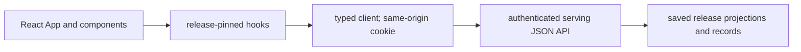

# `ui/` architecture

## Purpose
Layer 8 presentation in the [root architecture](../ARCHITECTURE.md): the existing
React/TypeScript app owns application components, layout, navigation and rendering.
Its presentation scope includes the legacy dashboard views still awaiting migration.
## Primary contracts and public interfaces
`src/App.tsx` composes board/event/score and native-parity views; `src/routes.ts` handles routes.
`src/api/client.ts` is the sole fetch boundary to the authenticated serving API.
Wire shapes and shipped views are detailed in the [README](README.md).

## Inputs
Saved JSON release metadata, paginated events, score details and operations data
from [serving](../engine/v2/serving/ARCHITECTURE.md), plus route/filter state.
Native parity renders the summary from `/api/v1/native_parity`. The typed
client also exposes `/mismatches` and `/unpaired` under that prefix; the
summary component does not request those pages.

## Outputs
React DOM and chart pixels, navigation/deep links, loading/error/refusal states
and links to the same pinned compatibility release. No engine records are written.

## Financial display units
The serving contract defines wire units for both legacy-via-v2 and native rows;
the React app formats those values once. `fmtPercentagePoint` displays
`driver_forecast` and `market_implied_move` with `%` and no multiplication by
100. Fractional `headline_expected_return` values and non-count
`coverage_summary` ratios use fraction-times-100 percent formatting.
`planned_population` and `compared_population` display as whole-number counts.
`entry_premium` is USD, and null display values remain an em dash. The existing
operations HTML and legacy previews remain compatibility exceptions; this
formatting contract applies to the React presentation layer.

## Dependencies
React components use typed client/hooks; the browser calls serving over HTTP.
No direct scoring/model/ledger/evaluation/provider access; browser users enter
through `App`; integration/browser tests exercise the same API contract.

## External systems and libraries
React, TypeScript and Vite; browser fetch with the same-origin `operations_token`
cookie. Build output is static assets; serving those bytes is transport.

## Failure semantics
| Condition | Outcome |
|---|---|
| Loading, empty, 401 or unknown identity | Explicit loading/empty/auth/refusal state; detail failure preserves board. |
| Current release changes | Announce only; reload opts in. Cache keys retain explicit release pin. |
| Operations status | Show its observation age, requested/resolved sessions, engineering history (including scheduled `unknown` occurrences), latest attempt outcome, its described release, the board pin, and current published release separately. More than 24 hours old is stale; a scheduled `unknown` or `fail` observation is never current. Never label the board current unless its pin equals current discovery. |
| Missing, malformed, stale-session, or wrong-release operations status | Show unknown/stale with the observation age and reason; absent or mismatched requested/resolved sessions and unavailable publication identity are unknown. Do not turn a failed read into current. A status release mismatch never repins the board. |
| Parity loading, 401 or `no_report` | Explicit loading/auth/no-report state, independent of release resolution; no-report rendering reads status only. |
| Parity `stale` | Banner with saved identity, counts and refusal reasons still shown. |
| Parity `unavailable` | Explicit error; failed data is withheld, never presented as an empty comparison. |
| Parity zero counts or no refusal reasons | Saved zero counts remain visible; an explicit message identifies absent refusal reasons. |
| Parity `partial` | Saved counts remain visible with an alert that refusal data is incomplete. |
| Retry or navigation | Reads keep pinned identity; reload opts into current. Failed status reads leave the board and pin in place, with status unknown; no durable transaction or partial publication. |

## Invariants
All new application rendering belongs here. Serving returns data/API responses
and transports commands; application HTML/DOM scripts there violate the boundary.
Format saved financial values; do not fit, rescore, derive financial evidence or
fetch vendors. Preserve saved replay clocks and provenance without relabelling.
Existing operations HTML/legacy previews are compatibility exceptions with
migration outstanding, not evidence that a React application view is shipped.
Native parity summary presentation belongs here; mismatch/unpaired detail is
outside this component. The operations parity HTML/JSON preview is retired.
## Diagrams

